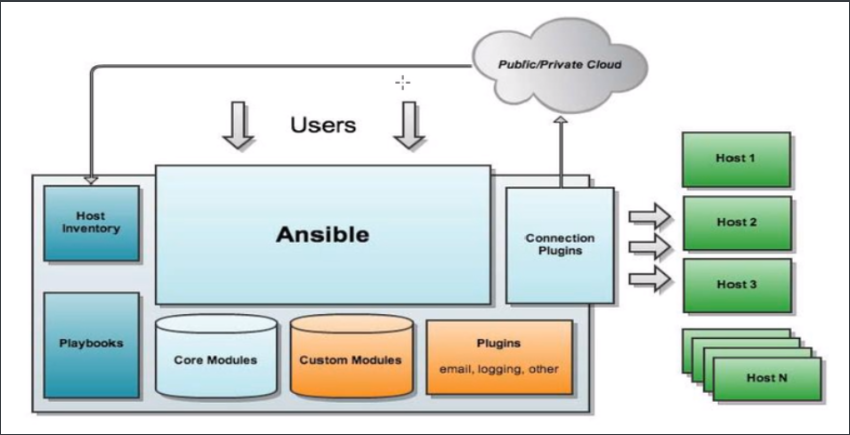
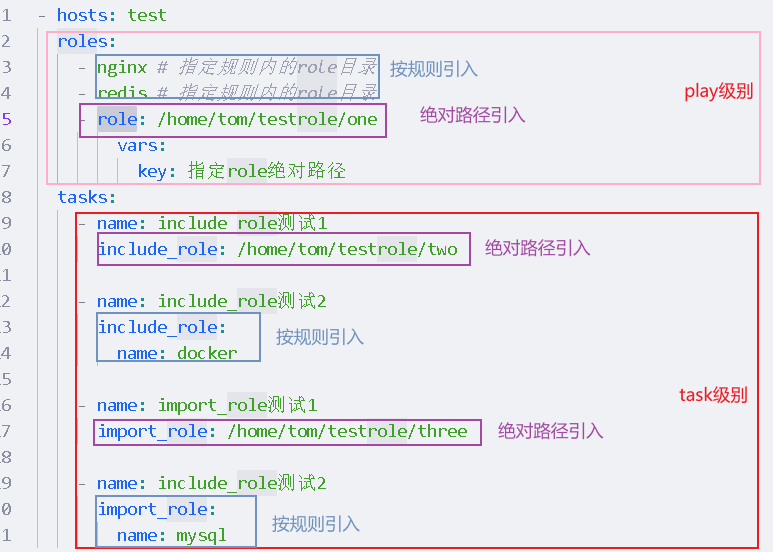
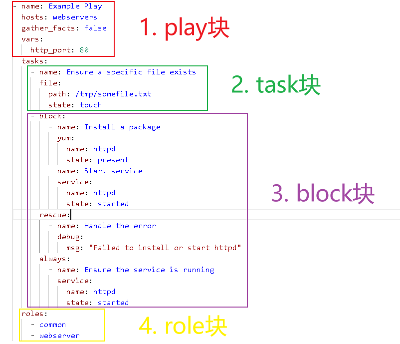

# 

# 0. ansible简介

Ansible采用高度模块化，调用特定的模块，完成相应的任务，基于yaml来批量完成任务的模块化，支持playbook，基于python语言实现，主要是用paramiko、pyyaml和jinja2三个关键模块，部署简单，主从模式，支持自定义模块，幂等性：允许重复执行N次，没有变化时，只会执行第一次。

Ansible的主要目标是简单和易用，无客户端，使用Openssh来进行数据传输。

+ Agentless: 不需要在被管理节点上安装客户端，只要有sshd即可
+ Serverless:在服务端不需要启动任何服务，只需要执行命令就行
+ Moudules in any language :基于模块工作，可以使用任意语言开发ansible模块
+ YAML,not code:使用yaml语言订制playbook
+ SSH by default：默认使用ssh控制各节点

# 1. ansible安装

## 1.1 `pip`方式ansible安装

### 1.1.1 全局安装

+ 先安装python3

  ```bash
  yum install python3
  ```

+ `pip3`安装pip目命令

  ```bash
  # 国内使用淘宝镜像
  pip3 install pip --upgrade -i http://mirrors.aliyun.com/pypi/simple/ --trusted-host mirrors.aliyun.com
  ```

+ `pip`安装ansible(**推荐加上**`--user`)

  ```bash
  pip install --no-cache-dir ansible -i http://mirrors.aliyun.com/pypi/simple/ --trusted-host mirrors.aliyun.com
  ```

+ 查找`ansible`位置

  ```bash
  sudo find / -type f -name ansible
  # `ansible`命令默认在当前用户`~/local/bin` 位置
  ```

  > 发现`ansible`未加入环境变量,只能`./ansible`执行

+ 给当前用户添加`ansible`命令,编辑`~/.bash_profile`

  ```bash
  # .bash_profile
  
  # Get the aliases and functions
  if [ -f ~/.bashrc ]; then
  	. ~/.bashrc
  fi
  
  # User specific environment and startup programs
  ANSIBLE_HOME=~/.local/bin
  PATH=$ANSIBLE_HOME:$JAVA_HOME:$PATH
  
  export PATH
  ```

+ 更新环境,立即生效

  ```bash
  source ~/.bash_profile
  ```

+ 测试`ansible`输出帮助信息

### 1.1.2 pip虚拟环境安装

+ `pip`安装ansible

  ```bash
  pip install --no-cache-dir ansible -i http://mirrors.aliyun.com/pypi/simple/ --trusted-host mirrors.aliyun.com
  ```

+ 创建python虚拟环境`ansible-test-pip-env`

  ```bash
  #创建虚拟环境 ansible-test-pip-env
  python3 -m venv ansible-test-pip-env
  ```

+ 激活`ansible`环境(**其实就是一个目录**)

  ```bash
  # activate命令位置不一定,看版本
  source ./ansible-test-pip-env/Script/activate
  source ./ansible-test-pip-env/bin/activate
  ```
  
+ 其余步骤同上

  > + 退出虚拟环境`deactivate`
  > + 删除虚拟环境`rm -rf ansible-test-pip-env`

## 1.2 其他方式全局安装

中文文档:[安装 Ansible — Ansible Documentation (cn-ansibledoc.readthedocs.io)](https://cn-ansibledoc.readthedocs.io/zh-cn/latest/installation_guide/intro_installation.html#ansible-on-rhel-centos-or-fedora)

# 2. ssh配置公私钥

***因为`ansible`是借助ssh与被控端机器连接的,默认使用`sftp`可以自己配置`scp`***

***无论是服务端生成公私钥还是客户端生成都完全一样,配置在服务器上的是公钥,个人用的是私钥***

> ***服务器(被连接端)的公钥存放地方为 `~/.ssh/authorized_keys`***
>
> 如果配置root用户  一般/root/.ssh 700权限 /root/.ssh/*文件为600权限
> 如果配置其他用户  一般/home/用户/.ssh 700权限 /home/用户/.ssh/*文件为600权限 
>
> 没有.ssh这个目录可以自己创建,也可以通过`ssh 用户@ip`来创建

# 3. 简单配置并使用ansible(入门)

## 3.1 配置`ansible.cfg`

ansible配置文件默认在:`/etc/ansible/ansible.cfg`

```bash
#这个参数表示资源清单inventory文件的位置
inventory = /etc/ansible/hosts
#指向存放Ansible模块的目录，支持多个目录方式，只要用冒号（：）隔开就可以
#library = /usr/share/ansible
library = /home/tom/.local/lib/python3.6/site-packages/ansible
#并发连接数，默认为5
forks = 5
#设置默认执行命令的用户
sudo_user = root
#指定连接被管节点的管理端口，默认为22端口，建议修改，能够更加安全
remote_port = 22
#设置是否检查SSH主机的密钥，值为True/False。关闭后第一次连接不会提示配置实例
host_key_checking = False
#设置SSH连接的超时时间，单位为秒
timeout = 60
#指定一个存储ansible日志的文件（默认不记录日志）
log_path = /var/log/ansible.log
```

> pip安装的`ansible.cfg`没有这个文件,自己创建
>
> 具体信息可以使用`ansible --version`查看

## 3.2 配置`hosts`

`hosts`用于配置被管理机器,默认地址在:`/etc/ansible/hosts`

```bash
# ansible_ssh_host 被控端ssh主机地址
# ansible_ssh_port 被控端ssh主机端口
# ansible_ssh_user 被控端ssh登录用户
# ansible_ssh_private_key_file 被控端ssh私钥地址(服务器上)
# ansible_ssh_pass 被控端ssh密码
# 主机组 测试ping
[tping]
192.168.136.130
192.168.136.140
192.168.136.150
# 主机组 测试ansible命令
[test]
# 主机别名 ip port 私钥地址
ansible-test.local ansible_ssh_host=192.168.136.140 ansible_ssh_port=22 ansible_ssh_private_key_file=/home/ly/ansible/ssh_certs/id_rsa
```

> pip安装的ansible没有这个文件,自己创建

## 3.3 测试

+ 控制地址`localhost`执行命令

  ```bash
  $ ansible localhost -m command -a 'echo Hello World'
  # 输出
  ansible-test.local | CHANGED | rc=0 >>
  hello world
  ```

+ 控制主机组`tping`测试ping命令

  ```bash
  $ ansible tping -m ping
  # 输出
  192.168.136.130 | UNREACHABLE! => {
      "changed": false,
      "msg": "Failed to connect to the host via ssh: Permission denied (publickey,gssapi-keyex,gssapi-with-mic,password).",
      "unreachable": true
  }
  192.168.136.140 | UNREACHABLE! => {
      "changed": false,
      "msg": "Failed to connect to the host via ssh: Permission denied (publickey,password).",
      "unreachable": true
  }
  192.168.136.150 | UNREACHABLE! => {
      "changed": false,
      "msg": "Failed to connect to the host via ssh: ssh: connect to host 192.168.136.150 port 22: No route to host",
      "unreachable": true
  }
  ```

  > 因为这个主机组内没有配置ssh账户信息所以被拒绝

+ 控制主机组`test`执行命令

  ```bash
  $ ansible test -m ping
  # 输出成功ping通
  ansible-test.local | SUCCESS => {
      "ansible_facts": {
          "discovered_interpreter_python": "/usr/bin/python"
      },
      "changed": false,
      "ping": "pong"
  }
  $ ansible test -m command -a 'ls ~'
  ansible-test.local | CHANGED | rc=0 >>
  Desktop
  Documents
  Downloads
  Music
  Pictures
  Public
  Templates
  Videos
  ```

# 4. **ansible架构**

+ **核心(Core)**: `ansible核心程序`
+ **核心模块(Core Modules)**: `ansible自带的核心模块功能`
+ **扩展模块(Custom Modules)**: `自定义模块，如果核心模块不足以完成某种功能，可以自行添加自定义模块(支持现在主流的大部分编程语言，甚至于shell)`
+ **插件(Plugins)**: `插件，支持使用插件的方式对ansible本身的功能进行扩展`
+ **剧本(Playbooks)**: `ansible的任务配置文件,将多个任务定义在剧本中,由ansible执行`
+ **连接插件(Connect Plugins)**: `ansible与其他主机通信使用,默认是ssh还有local和zeromq方式`
+ **主机群(Hosts Inventory)**: `定义ansible管理的主机,包括端口,ip,密码等`



# 5. ansible命令执行过程

+ 加载`/etc/ansible/ansible.cfg`配置文件

+ 根据配置文件内容,读取`Inventory`配置的主机清单默认是 `/etc/ansible/hosts`

+ 加载对应的模块,如`ping`或`command`

+ 通过ansible将模块或命令**生成对应的临时py脚本文件**,并将该文件传输到**目标机器上**

+ 在目标机器上的**该用户家目录下/.ansible/tmp/xxx/xxx.py**

  ```bash
  # 如
  /home/ly/.ansible/tmp/ansible-tmp-1716449867.6918652-3303-263268507626920/AnsiballZ_command.py
  ```

+ 给上面的文件执行权限`+x`

+ 执行并返回结果

+ 删除临时python文件,退出

> 你会发现临时py文件如`AnsiballZ_command.py`很大(动辄几百kb),这是因为里面**ansible将目标机器上用到的模块文件zip包(python模块)也放在里面了**
>
> 大概描述下该py文件流程:
>
> + 环境信息预处理
> + 使用python模块`tempfile`创建临时文件`xxxx.zip`
> + 将py脚本中的**zip数据(base64存放在脚本中)**,写入`xxxx.zip`
> + 解压zip文件,然后执行其内部文件,最后返回值

# 6. ansible的主要命令

[Using Ansible command line tools — Ansible Community Documentation](https://docs.ansible.com/ansible/latest/command_guide/index.html)

## 6.1 `ansible`**

[ansible — Ansible Community Documentation](https://docs.ansible.com/ansible/latest/cli/ansible.html)

针对一组主机定义和运行单个任务 "playbook"

```bash
$ ansible --help
Usage: ansible <host-pattern> [options]

#选项:
  -a MODULE_ARGS, --args=MODULE_ARGS                                #指定模块的参数
  --ask-vault-pass                                                  #询问账号的密码
  -B SECONDS, --background=SECONDS                                  #异步运行，在指定秒后异步运行失败
  -C, --check                                                       #不做出任何改变，只是进行测试检查
  -D, --diff                                                        #当更改(小)文件和模板时，显示这些文件中的差异
  -e EXTRA_VARS, --extra-vars=EXTRA_VARS                            #将其他变量设置为key=value或YAML/JSON，如果文件名前面有@
  -f FORKS, --forks=FORKS                                           #指定要使用的并行进程数，例如100台机器，-f指定每次运行几台,默认每次运行5台
  -i INVENTORY, --inventory=INVENTORY, --inventory-file=INVENTORY   #指定主机列表路径，如果不指定，默认为/etc/ansible/ansible.cfg中指定的hosts
  -l SUBSET, --limit=SUBSET                                         #将选定的主机限制为附加模式。
  --list-hosts                                                      #列出清单中的主机列表，不进行任何操作         
  -m MODULE_NAME, --module-name=MODULE_NAME                         #指定要执行的模块名称，默认为 command 模块
  -M MODULE_PATH, --module-path=MODULE_PATH                         #指定要执行模块的路径，默认模块路径为~/.ansible/plugins/modules:/usr/share/ansible/plugins
  -o, --one-line                                                    #浓缩输出
  --playbook-dir=BASEDIR                                            #指定playbook文件目录
  -P POLL_INTERVAL, --poll=POLL_INTERVAL                            #指定轮训间隔时间，默认为15
  --syntax-check                                                    #如果使用了playbook则执行--syntax-check对剧本进行check
  -t TREE, --tree=TREE                                              #将ansible输出记录到指定目录
  --vault-id=VAULT_IDS  the vault identity to use
  --vault-password-file=VAULT_PASSWORD_FILES
                        vault password file
  -v, --verbose                                                     #详细模式（-VVV更多，-VVVV可启用连接调试）
  --version                                                         #显示程序的版本号、配置文件位置、配置模块搜索路径、模块位置、可执行位置和退出
 
  #特权提升选项:
    -b, --become                                                    #临时使用--become-method指定的提取方法
    --become-method=BECOME_METHOD                                   #使用权限提升方法（默认值=sudo）
    --become-user=BECOME_USER                                       #以该用户的身份运行操作(默认值=root)
    -K, --ask-become-pass                                           #请求权限提升密码

  #连接选项:
    -k, --ask-pass                                                  #请求连接密码
    --private-key=PRIVATE_KEY_FILE, --key-file=PRIVATE_KEY_FILE     #指定私钥文件进行登录
    -u REMOTE_USER, --user=REMOTE_USER                              #指定连接用户，默认不指定则为hosts文件中用户
    -c CONNECTION, --connection=CONNECTION                          #连接方式，默认为smart，还有ssh和sftp
    -T TIMEOUT, --timeout=TIMEOUT                                   #ansible连接超时时间，默认为10s
    --ssh-common-args=SSH_COMMON_ARGS                               #指定要传递到SFTP/SCP/SSH的常见参数(例如ProxyCommand)
    --sftp-extra-args=SFTP_EXTRA_ARGS                               #指定要传递到SFTP的额外参数（例如-f、-l）
    --scp-extra-args=SCP_EXTRA_ARGS                                 #指定要传递到SCP的额外参数(例如-1)
    --ssh-extra-args=SSH_EXTRA_ARGS                                 #指定只传递给ssh的额外参数(例如-R)
```

> 常用的参数如`-a` 向模块中传递参数
>

## 6.2 `ansible-config`

[ansible-config — Ansible Community Documentation](https://docs.ansible.com/ansible/latest/cli/ansible-config.html)

```bash
$ ansible-config
使用: ansible-config [-h] [--version] [-v] {list,dump,view} ...

作用: View ansible configuration.

positional arguments:
  {list,dump,view}
    list            Print all config options
    dump            Dump configuration
    view            View configuration file

optional arguments:
  --version         show program's version number, config file location,
                    configured module search path, module location, executable
                    location and exit
  -h, --help        show this help message and exit
  -v, --verbose     verbose mode (-vvv for more, -vvvv to enable connection
                    debugging)
```

> + ansible的所有配置信息: 包括显示的颜色
> + `ansible list -v`可以显示所有选项的可选值

## 6.3 `ansible-connection`连接插件

主要是给内部连接使用

## 6.4 `ansible-console`控制台

[ansible-console — Ansible Community Documentation](https://docs.ansible.com/ansible/latest/cli/ansible-console.html)

REPL 控制台，用于执行 Ansible 任务。

```bash
$ ansible-console test #test为配置好的主机组
tom@test (1)[f:5]$ help #输入help即可查看支持的命令(其实就是sh解释器)
```

> + 其他命令连接的参数和`ansible`命令参数差不多
> + 支持shell内置命令入`ls,pwd`不支持外部命令如`ip addr`

## 6.5 `ansible-doc`**

[ansible-doc — Ansible Community Documentation](https://docs.ansible.com/ansible/latest/cli/ansible-doc.html)

插件/模块文档指南

```bash
$ ansible-doc -h
Usage: ansible-doc [-l|-F|-s] [options] [-t <plugin type> ] [plugin]

Options:
  -j, --json                                                        #json格式
  -l, --list                                                        #列出ansible内置的所有模块
  -F, --list_files                                                  #在没有摘要的情况下显示插件名及其源文件(暗示-列表)
  -M MODULE_PATH, --module-path=MODULE_PATH                         #模块路径，默认为 ~/.ansible/plugins/modules:/usr/share/ansible/plugins/modules
  -s, --snippet                                                     #显示指定插件的参数等，用法 ansible-doc -s module_name 
  -t TYPE, --type=TYPE                                              #选择插件类型，默认为模块 
```

> 常用命令 `ansible-doc -s 模块` 查看模块的参数

## 6.6 `ansible-galaxy`

[Galaxy User Guide — Ansible Community Documentation](https://docs.ansible.com/ansible/latest/galaxy/user_guide.html)

*Ansible Galaxy* 是指 [Galaxy](https://galaxy.ansible.com/) 网站，这是一个用于查找、下载和共享社区开发的集合和角色的免费网站.

使用 Galaxy 利用 Ansible 社区的精彩内容快速启动您的自动化项目。Galaxy 提供预先打包的工作单元，例如[角色](https://docs.ansible.com/ansible/latest/playbook_guide/playbooks_reuse_roles.html#playbooks-reuse-roles)和[集合](https://docs.ansible.com/ansible/latest/collections_guide/index.html#collections)。 集合格式提供了一个全面的自动化包，其中可能包括多个 playbook、角色、模块和插件。

```bash
$ ansible-galaxy --help
usage: ansible-galaxy [-h] [--version] [-v] TYPE ...

Perform various Role and Collection related operations.

positional arguments:
  TYPE
    collection   Manage an Ansible Galaxy collection.
    role         Manage an Ansible Galaxy role.

optional arguments:
  --version      show program's version number, config file location,
                 configured module search path, module location, executable
                 location and exit
  -h, --help     show this help message and exit
  -v, --verbose  verbose mode (-vvv for more, -vvvv to enable connection
                 debugging)
```

> 优点类似于docker的tag查找
>
> + `ansible-galaxy role --help ` 查看角色相关命令
> + `ansible-galaxy collection --help`  查看collection相关命令

## 6.7 `ansible-inventory`

[ansible-inventory — Ansible Community Documentation](https://docs.ansible.com/ansible/latest/cli/ansible-inventory.html)

显示ansible主机清单信息,默认使用json格式

```bash
$ ansible-inventory
usage: ansible-inventory [-h] [--version] [-v] [-i INVENTORY]
                         [--vault-id VAULT_IDS]
                         [--ask-vault-password | --vault-password-file VAULT_PASSWORD_FILES]
                         [--playbook-dir BASEDIR] [-e EXTRA_VARS] [--list]
                         [--host HOST] [--graph] [-y] [--toml] [--vars]
                         [--export] [--output OUTPUT_FILE]
                         [host|group]

positional arguments:
  host|group

optional arguments:
  --ask-vault-password, --ask-vault-pass
                        ask for vault password
  --export              When doing an --list, represent in a way that is
                        optimized for export,not as an accurate representation
                        of how Ansible has processed it
  --output OUTPUT_FILE  When doing --list, send the inventory to a file
                        instead of to the screen
  --playbook-dir BASEDIR
                        Since this tool does not use playbooks, use this as a
                        substitute playbook directory.This sets the relative
                        path for many features including roles/ group_vars/
                        etc.
  --toml                Use TOML format instead of default JSON, ignored for
                        --graph
  --vars                Add vars to graph display, ignored unless used with
                        --graph
  --vault-id VAULT_IDS  the vault identity to use
  --vault-password-file VAULT_PASSWORD_FILES, --vault-pass-file VAULT_PASSWORD_FILES
                        vault password file
  --version             show program's version number, config file location,
                        configured module search path, module location,
                        executable location and exit
  -e EXTRA_VARS, --extra-vars EXTRA_VARS
                        set additional variables as key=value or YAML/JSON, if
                        filename prepend with @
  -h, --help            show this help message and exit
  -i INVENTORY, --inventory INVENTORY, --inventory-file INVENTORY
                        specify inventory host path or comma separated host
                        list. --inventory-file is deprecated
  -v, --verbose         verbose mode (-vvv for more, -vvvv to enable
                        connection debugging)
  -y, --yaml            Use YAML format instead of default JSON, ignored for
                        --graph

Actions:
  One of following must be used on invocation, ONLY ONE!

  --graph               create inventory graph, if supplying pattern it must
                        be a valid group name
  --host HOST           Output specific host info, works as inventory script
  --list                Output all hosts info, works as inventory script

```

> + `ansible-inventory host --host 主机名/ip`
> + `ansible-inventory group --help 主机名/ip`
> + `ansible-inventory --list` 列出所有组

## 6.8 `ansible-playbook`**

[ansible-playbook — Ansible Community Documentation](https://docs.ansible.com/ansible/latest/cli/ansible-playbook.html)

运行ansible的playbook,在目标主机上执行定义的任务

```bash
$ ansible-playbook
usage: ansible-playbook [-h] [--version] [-v] [-k]
                        [--private-key PRIVATE_KEY_FILE] [-u REMOTE_USER]
                        [-c CONNECTION] [-T TIMEOUT]
                        [--ssh-common-args SSH_COMMON_ARGS]
                        [--sftp-extra-args SFTP_EXTRA_ARGS]
                        [--scp-extra-args SCP_EXTRA_ARGS]
                        [--ssh-extra-args SSH_EXTRA_ARGS] [--force-handlers]
                        [--flush-cache] [-b] [--become-method BECOME_METHOD]
                        [--become-user BECOME_USER] [-K] [-t TAGS]
                        [--skip-tags SKIP_TAGS] [-C] [--syntax-check] [-D]
                        [-i INVENTORY] [--list-hosts] [-l SUBSET]
                        [-e EXTRA_VARS] [--vault-id VAULT_IDS]
                        [--ask-vault-password | --vault-password-file VAULT_PASSWORD_FILES]
                        [-f FORKS] [-M MODULE_PATH] [--list-tasks]
                        [--list-tags] [--step] [--start-at-task START_AT_TASK]
                        playbook [playbook ...]

Runs Ansible playbooks, executing the defined tasks on the targeted hosts.

positional arguments:
  playbook              Playbook(s)

optional arguments:
  --ask-vault-password, --ask-vault-pass
                        ask for vault password
  --flush-cache         clear the fact cache for every host in inventory
  --force-handlers      run handlers even if a task fails
  --list-hosts          outputs a list of matching hosts; does not execute
                        anything else
  --list-tags           list all available tags
  --list-tasks          list all tasks that would be executed
  --skip-tags SKIP_TAGS
                        only run plays and tasks whose tags do not match these
                        values
  --start-at-task START_AT_TASK
                        start the playbook at the task matching this name
  --step                one-step-at-a-time: confirm each task before running
  --syntax-check        perform a syntax check on the playbook, but do not
                        execute it
  --vault-id VAULT_IDS  the vault identity to use
  --vault-password-file VAULT_PASSWORD_FILES, --vault-pass-file VAULT_PASSWORD_FILES
                        vault password file
  --version             show program's version number, config file location,
                        configured module search path, module location,
                        executable location and exit
  -C, --check           don't make any changes; instead, try to predict some
                        of the changes that may occur
  -D, --diff            when changing (small) files and templates, show the
                        differences in those files; works great with --check
  -M MODULE_PATH, --module-path MODULE_PATH
                        prepend colon-separated path(s) to module library (def
                        ault=~/.ansible/plugins/modules:/usr/share/ansible/plu
                        gins/modules)
  -e EXTRA_VARS, --extra-vars EXTRA_VARS
                        set additional variables as key=value or YAML/JSON, if
                        filename prepend with @
  -f FORKS, --forks FORKS
                        specify number of parallel processes to use
                        (default=5)
  -h, --help            show this help message and exit
  -i INVENTORY, --inventory INVENTORY, --inventory-file INVENTORY
                        specify inventory host path or comma separated host
                        list. --inventory-file is deprecated
  -l SUBSET, --limit SUBSET
                        further limit selected hosts to an additional pattern
  -t TAGS, --tags TAGS  only run plays and tasks tagged with these values
  -v, --verbose         verbose mode (-vvv for more, -vvvv to enable
                        connection debugging)

Connection Options:
  control as whom and how to connect to hosts

  --private-key PRIVATE_KEY_FILE, --key-file PRIVATE_KEY_FILE
                        use this file to authenticate the connection
  --scp-extra-args SCP_EXTRA_ARGS
                        specify extra arguments to pass to scp only (e.g. -l)
  --sftp-extra-args SFTP_EXTRA_ARGS
                        specify extra arguments to pass to sftp only (e.g. -f,
                        -l)
  --ssh-common-args SSH_COMMON_ARGS
                        specify common arguments to pass to sftp/scp/ssh (e.g.
                        ProxyCommand)
  --ssh-extra-args SSH_EXTRA_ARGS
                        specify extra arguments to pass to ssh only (e.g. -R)
  -T TIMEOUT, --timeout TIMEOUT
                        override the connection timeout in seconds
                        (default=60)
  -c CONNECTION, --connection CONNECTION
                        connection type to use (default=smart)
  -k, --ask-pass        ask for connection password
  -u REMOTE_USER, --user REMOTE_USER
                        connect as this user (default=None)

Privilege Escalation Options:
  control how and which user you become as on target hosts

  --become-method BECOME_METHOD
                        privilege escalation method to use (default=sudo), use
                        `ansible-doc -t become -l` to list valid choices.
  --become-user BECOME_USER
                        run operations as this user (default=root)
  -K, --ask-become-pass
                        ask for privilege escalation password
  -b, --become          run operations with become (does not imply password
                        prompting
```


## 6.9 `ansible-pull`

[ansible-pull — Ansible Community Documentation](https://docs.ansible.com/ansible/latest/cli/ansible-pull.html)

从VCS仓库上拉取playbooks,并且在目标机器上执行

```bash
$ ansible-pull
usage: ansible-pull [-h] [--version] [-v] [-k]
                    [--private-key PRIVATE_KEY_FILE] [-u REMOTE_USER]
                    [-c CONNECTION] [-T TIMEOUT]
                    [--ssh-common-args SSH_COMMON_ARGS]
                    [--sftp-extra-args SFTP_EXTRA_ARGS]
                    [--scp-extra-args SCP_EXTRA_ARGS]
                    [--ssh-extra-args SSH_EXTRA_ARGS] [--vault-id VAULT_IDS]
                    [--ask-vault-password | --vault-password-file VAULT_PASSWORD_FILES]
                    [-e EXTRA_VARS] [-t TAGS] [--skip-tags SKIP_TAGS]
                    [-i INVENTORY] [--list-hosts] [-l SUBSET] [-M MODULE_PATH]
                    [-K] [--purge] [-o] [-s SLEEP] [-f] [-d DEST] [-U URL]
                    [--full] [-C CHECKOUT] [--accept-host-key]
                    [-m MODULE_NAME] [--verify-commit] [--clean]
                    [--track-subs] [--check] [--diff]
                    [playbook.yml [playbook.yml ...]]

pulls playbooks from a VCS repo and executes them for the local host

positional arguments:
  playbook.yml          Playbook(s)

optional arguments:
  --accept-host-key     adds the hostkey for the repo url if not already added
  --ask-vault-password, --ask-vault-pass
                        ask for vault password
  --check               don't make any changes; instead, try to predict some
                        of the changes that may occur
  --clean               modified files in the working repository will be
                        discarded
  --diff                when changing (small) files and templates, show the
                        differences in those files; works great with --check
  --full                Do a full clone, instead of a shallow one.
  --list-hosts          outputs a list of matching hosts; does not execute
                        anything else
  --purge               purge checkout after playbook run
  --skip-tags SKIP_TAGS
                        only run plays and tasks whose tags do not match these
                        values
  --track-subs          submodules will track the latest changes. This is
                        equivalent to specifying the --remote flag to git
                        submodule update
  --vault-id VAULT_IDS  the vault identity to use
  --vault-password-file VAULT_PASSWORD_FILES, --vault-pass-file VAULT_PASSWORD_FILES
                        vault password file
  --verify-commit       verify GPG signature of checked out commit, if it
                        fails abort running the playbook. This needs the
                        corresponding VCS module to support such an operation
  --version             show program's version number, config file location,
                        configured module search path, module location,
                        executable location and exit
  -C CHECKOUT, --checkout CHECKOUT
                        branch/tag/commit to checkout. Defaults to behavior of
                        repository module.
  -M MODULE_PATH, --module-path MODULE_PATH
                        prepend colon-separated path(s) to module library (def
                        ault=~/.ansible/plugins/modules:/usr/share/ansible/plu
                        gins/modules)
  -U URL, --url URL     URL of the playbook repository
  -d DEST, --directory DEST
                        absolute path of repository checkout directory
                        (relative paths are not supported)
  -e EXTRA_VARS, --extra-vars EXTRA_VARS
                        set additional variables as key=value or YAML/JSON, if
                        filename prepend with @
  -f, --force           run the playbook even if the repository could not be
                        updated
  -h, --help            show this help message and exit
  -i INVENTORY, --inventory INVENTORY, --inventory-file INVENTORY
                        specify inventory host path or comma separated host
                        list. --inventory-file is deprecated
  -l SUBSET, --limit SUBSET
                        further limit selected hosts to an additional pattern
  -m MODULE_NAME, --module-name MODULE_NAME
                        Repository module name, which ansible will use to
                        check out the repo. Choices are ('git', 'subversion',
                        'hg', 'bzr'). Default is git.
  -o, --only-if-changed
                        only run the playbook if the repository has been
                        updated
  -s SLEEP, --sleep SLEEP
                        sleep for random interval (between 0 and n number of
                        seconds) before starting. This is a useful way to
                        disperse git requests
  -t TAGS, --tags TAGS  only run plays and tasks tagged with these values
  -v, --verbose         verbose mode (-vvv for more, -vvvv to enable
                        connection debugging)

Connection Options:
  control as whom and how to connect to hosts

  --private-key PRIVATE_KEY_FILE, --key-file PRIVATE_KEY_FILE
                        use this file to authenticate the connection
  --scp-extra-args SCP_EXTRA_ARGS
                        specify extra arguments to pass to scp only (e.g. -l)
  --sftp-extra-args SFTP_EXTRA_ARGS
                        specify extra arguments to pass to sftp only (e.g. -f,
                        -l)
  --ssh-common-args SSH_COMMON_ARGS
                        specify common arguments to pass to sftp/scp/ssh (e.g.
                        ProxyCommand)
  --ssh-extra-args SSH_EXTRA_ARGS
                        specify extra arguments to pass to ssh only (e.g. -R)
  -T TIMEOUT, --timeout TIMEOUT
                        override the connection timeout in seconds
                        (default=60)
  -c CONNECTION, --connection CONNECTION
                        connection type to use (default=smart)
  -k, --ask-pass        ask for connection password
  -u REMOTE_USER, --user REMOTE_USER
                        connect as this user (default=None)

Privilege Escalation Options:
  control how and which user you become as on target hosts

  -K, --ask-become-pass
                        ask for privilege escalation password
```


## 6.10 `ansible-test`

测试用

## 6.11 `ansible-vault`

[ansible-vault — Ansible Community Documentation](https://docs.ansible.com/ansible/latest/cli/ansible-vault.html)

ansible数据文件加/解密程序

```bash
$ ansible-vault
usage: ansible-vault [-h] [--version] [-v]
                     {create,decrypt,edit,view,encrypt,encrypt_string,rekey}
                     ...

encryption/decryption utility for Ansible data files

positional arguments:
  {create,decrypt,edit,view,encrypt,encrypt_string,rekey}
    create              Create new vault encrypted file
    decrypt             Decrypt vault encrypted file
    edit                Edit vault encrypted file
    view                View vault encrypted file
    encrypt             Encrypt YAML file
    encrypt_string      Encrypt a string
    rekey               Re-key a vault encrypted file

optional arguments:
  --version             show program's version number, config file location,
                        configured module search path, module location,
                        executable location and exit
  -h, --help            show this help message and exit
  -v, --verbose         verbose mode (-vvv for more, -vvvv to enable
                        connection debugging)
```

# 7. ansible常用模块

## 7.1 `ping`模块

用于测试网络连通性(需要配置号ssh账户)

```bash
# 使用
$ ansible 主机变量 -m ping
```

> 查看详细帮助 `$ ansible-doc -v ping`
>
> 查看参数帮助 `$ ansible-doc -s ping`

## 7.2 `command`模块

用于直接在**目标节点**执行命令

```bash
# 使用
$ ansible 主机变量 -m command xxxx
# 举例
$ ansible 主机变量 -m command -a 'chdir=/home/tom ls' #-a和-m同级别都是ansible命令的参数
$ ansible 主机变量 -m command -a 'ls' # 直接命令而不是 cmd=ls
```

> 查看详细帮助 `$ ansible-doc -v command`
>
> 查看参数帮助 `$ ansible-doc -s command`

## 7.3 `shell`模块

直接在目标机器上执行shell命令,支持各种shell命令

```bash
# 使用
$ ansible 主机变量 -m shell -a 'shell组合命令'
```

> 查看详细帮助 `$ ansible-doc -v shell`
>
> 查看参数帮助 `$ ansible-doc -s shell`

## 7.4 `copy`模块

用于将文件复制到远程目标主机,同时支持给定内容生成文件和修改权限等

```bash
# 使用
$ ansible 主机变量 -m copy -a "参数"
# 举例 
$ ansible test -m copy -a 'src=demo dest=~/test force=true mode=777' # 将当前目录下demo文件拷贝到test主机组的家目录下test目录中,强制覆盖,权限为777
$ ansible test -m copy -a 'content="这里是自定义内容" dest=~/test/diycopy backup=true force=true mode=777' # 使用content代替src,如果文件存在则备份源文件并覆盖
```

> 查看详细帮助 `$ ansible-doc -v shell`
>
> 查看参数帮助 `$ ansible-doc -s shell`

## 7.5 `file`模块

该模块主要用于设置文件的属性,如**创建文件,创建链接文件,删除文件等**

```bash
# 使用
$ ansible 主机变量 -m file -a "参数"
# 举例 
#path为文件路径,需要有root权限, 时间格式see time.strftime doc)
$ ansible test -m file -a "path=~/demo force=yes  mode=777 access_time='2024-05-01 12:00:00' access_time_format='%Y-%m-%d %H:%M:%S'"
#删除文件 (state比较特殊)
$ ansible test -m file -a "path=~/demo1.py state=absent"
# state可选参数
# 	directory：如果目录不存在，就创建目录
# 	file：即使文件不存在，也不会被创建
# 	link：创建软链接
# 	hard：创建硬链接
# 	touch：如果文件不存在，则会创建一个新的文件，如果文件或目录已存在，则更新其最后修改时间
# 	absent：删除目录、文件或者取消链接文件
```

> 查看详细帮助 `$ ansible-doc -v file`
>
> 查看参数帮助 `$ ansible-doc -s file`

## 7.6 `fetch`模块

与`copy`模块相反,该模块是把目标机器上文件传递到**ansible服务器**上(**暂时只支持文件**)

```bash
# 使用
$ ansible 主机变量 -m fetch -a "参数"
# 举例 存储的文件默认在主机~/ansible-test.local文件夹下(可以看返回的日志)
$ ansible test -m fetch -a "src=~/diycopy.9378.2024-05-29@10:58:46~ dest=. fail_on_missing=yes validate_checksum=true"
```

> 查看详细帮助 `$ ansible-doc -v fetch`
>
> 查看参数帮助 `$ ansible-doc -s fetch`

## 7.7 `cron`模块

用于**增加/删除cronb定时任务**(查看请使用`shell`模块)

```bash
# 使用
$ ansible 主机变量 -m cron -a "参数"
# 举例 注释的name以#Ansible:name拼接 
$ ansible test -m cron -a "backup=true minute=* name='测试ansible-cron' job='date>>~/date2' state=present"
$ ansible test -m cron -a "backup=true name='测试ansible-cron' state=absent" #删除有name的cron模块创建的任务
# shell 模块 grep -v xxx|crontab - 反转过滤后后重新写入,以达到删除的目的
$ $ ansible test -m shell -a "crontab -l|grep -v '* * * * * date > /home/ly/date'|crontab -"# 没有name的不是cron模块创建的定时任务,用shell命令排除掉
# 参数 state
# 		present 增加
# 		asent 删除
```

> 查看详细帮助 `$ ansible-doc -v cron`
>
> 查看参数帮助 `$ ansible-doc -s cron`

## 7.8 `yum`模块

远程机器yum包管理,如安装,升级,降级,卸载等等

```bash
# 使用
$ ansible 主机变量 -m yum -a "参数"
# 举例
$ ansible test -m yum -a "name=docker state=present" #安装docker包
# 参数  state
# 		  present 不存在安装
# 		  installed 不存在安装
# 		  latest 更新
# 		  absent 存在卸载
# 		  removed 存在卸载
```

> 查看详细帮助 `$ ansible-doc -v cron`
>
> 查看参数帮助 `$ ansible-doc -s cron`

## 7.9 `service`模块

控制远程机器的服务,不能查看状态**只能启动,关闭等**

```bash
# 使用
$ ansible 主机变量 -m service -a "参数"
# 举例
$ ansible test -m service -a "name=firewalld state=stopped enabled=false" #关闭并禁用防火墙开机自启
```

> 查看详细帮助 `$ ansible-doc -v service`
>
> 查看参数帮助 `$ ansible-doc -s service`

## 7.10 `user`模块

管理远程节点上的用户账户

```bash
# 使用
$ ansible 主机变量 -m user -a "参数"
# 举例
# 不加密密码会有警告
$ openssl passwd -1 -salt tom 123456 #获取md5算法, 加盐为tom 密码为123456 的密文 输出 $1$tom$1fAC05tA2v.QGgp9rvg58.
$ ansible test -m user -bK -a "name=tom passwd='\$1\$tom\$1fAC05tA2v.QGgp9rvg58.' state=present group=root"# -bK使用sudo权限并手动输入密码  
$ ansible test -m user -bK -a "name=tom state=absent"
```

> **用户密码必须加密且指定加密算法如$1(md5)**
>
> 查看详细帮助 `$ ansible-doc -v user`
>
> 查看参数帮助 `$ ansible-doc -s user`

## 7.11 `group`模块

用于增加或删除组

```bash
# 使用
$ ansible 主机变量 -m group -a "参数"
# 举例
$ ANSIBLE_KEEP_REMOTE_FILES=1 ansible test -m  group -bK -a "name=tiger gid=12222 state=present" # 报错 ImportError: cannot import name constants
```

> + `ANSIBLE_KEEP_REMOTE_FILES=1`表示把目标节点的python临时脚本保存下来,用于排错
> + `-bK` 使用sudo权限,手动输入密码
> + 报错与原因 临时python脚本中`from ansible import constants as C`没有把`constants.py`传递到目标机器上(**ansible服务器是python3.6,远程机器是python2.7** 初步预测是python3.6的问题) 
>
> 查看详细帮助 `$ ansible-doc -v group`
>
> 查看参数帮助 `$ ansible-doc -s group`

## 7.12 `script`模块

向目标机器传输脚本,然后执行他

```bash
# 使用
$ ansible 主机变量 -m script -a "参数"
# 举例
$ ansible test -m script -a "today_df.sh" #目标机器家目录下执行脚本
```

> 查看详细帮助 `$ ansible-doc -v group`
>
> 查看参数帮助 `$ ansible-doc -s group`

## 7.13 `setup`模块

用于收集远程机器的信息.可收集的具体信息见 [Discovering variables: facts and magic variables — Ansible Community Documentation](https://docs.ansible.com/ansible/latest/playbook_guide/playbooks_vars_facts.html#vars-and-facts)

```bash
# 使用
$ ansible 主机变量 -m setup -a "参数"
# 举例
$ ansible test -m setup -a "gather_subset=all" -t setup1.log #收集目标机器所有信息并保存下来 setup1.log目录下,文件名为机器定义的name
$ ansible test -m setup -t setup1.log  #和上面例子效果完全一样
```

> 查看详细帮助 `$ ansible-doc -v group`
>
> 查看参数帮助 `$ ansible-doc -s group`

## 7.14 其余插件/模块

其余内置的模块/插件,和外部的模块插件:

+  [Collection Index — Ansible Community Documentation](https://docs.ansible.com/ansible/latest/collections/index.html)
+  [Indexes of all modules and plugins — Ansible Community Documentation](https://docs.ansible.com/ansible/latest/collections/all_plugins.html)

# 8. ansible-playbook

## 8.1 ansible-playbook简介

playbook是ansible用于配置,部署,和管理远程节点的剧本.通过playbook执行其中一系列tasks,可以让远程节点按照预期运行.

playbook中支持的所有可配置项: [Working with playbooks — Ansible Community Documentation](https://docs.ansible.com/ansible/latest/playbook_guide/playbooks.html)

## 8.2 ansible-playbook使用场景

​	执行一些简单的任务,使用ad-hoc(命令)可以方便的解决问题,但是对于一个**大型,多设备,流程固定的,需要大量操作时**就需要使用playbook.

我们只需要提前将操作分解成一个个小任务task,写入playbook的yaml文件中,即可通过`ansible-playbook`调用执行.

## 8.3 ansible-playbook使用

### 8.3.1 playbook的yaml格式

参考 [YAML Syntax — Ansible Community Documentation](https://docs.ansible.com/ansible/latest/reference_appendices/YAMLSyntax.html)

+ **文件的第一行应该以**`---`**(三个连字符开始),表明yaml文件的开始**
+ **`#`用来注释行**
+ 其余就是正常yaml格式

> 看不明白可以直接复制过来解析[YAML parser for JavaScript - JS-YAML (nodeca.github.io)](https://nodeca.github.io/js-yaml/)

### 8.3.2 核心元素

+ `hosts` 主机/主机组,支持通配符
+ `tasks` 任务列表,(可以有多个任务)
+ `vars` 变量,
+ `templates` 支持`jinja2`模板语法
+ `handlers` 由特定条件触发的任务

### 8.3.3 基本组件

参考task拥有的关键字  [Playbook Task Keywords — Ansible Community Documentation](https://docs.ansible.com/ansible/latest/reference_appendices/playbooks_keywords.html#task)

+ `hosts` 主机/主机组,支持通配符

+ `remote_user` 远程节点执行任务的用户

+ `sudo_user` 远程节点执行任务的sudo用户(已弃用)

+ `tasks` 任务列表,(可以有多个任务)

  + `name` (可选) 用于标记任务功能

  + `module:args` (必填) 使用的module模块和命令参数(就是`-m 和-a`)

  + `notify` 配置的处理器,对于`Handlers`中的`name`   **意思就是执行该任务后,就调用**`notify`**配置的处理器(只在资源发生变化时才会调用handler,如修改配置文件,创建新文件/目录等等)** 

    > 默认情况下，所有task执行完毕后，才会执行各个handler，并不是执行完某个task后，立即执行对应的handler，**如果你想要在执行完某些task以后立即执行对应的handler，则需要使用`meta`模块**
    >
    > `notify` actions会在playbook的所有task结束时被触发，而且即使有多个不同`task`通知改动的发生，`notify` actions知会被触发一次。`handler`执行的顺序与`handler`**在playbook中定义的顺序是相同的**，**与"handler被notify"的顺序无关**。

  + `tags` 给任务打标签,可以通过`-t tag`单独调用

  + `register` 返回结果注册为变量 (**只能在后续task中调用,无法传递到handler**)

  + `set_fact` 搭配`vars`使用,可以更改`vars`中定义的全局变量的值(**修改全局变量,需要一个单独的task**)

  + `meta: flush_handlers` 一组任务后面跟随,表示执行完task立即执行其对应的handler

+ `vars` 变量 (等同于`-e 变量`)

  + kv键值对形式  **(自定义变量)**
  + `setup`模块中支持的所有`facts`属性都可以直接调用 **(系统变量)**

+ `templates` 支持`jinja2`模板语法,一般就是引用变量**(全局任何地方都可直接使用 如{{ansible_processor_vcpus}}) 取**`setup`**中cpu核心数**

+ `handlers` 由特定条件触发的任务 (**必须命令执行成功,且发生了改变**`changed:true`**才会执行**)

  + `name` 任务名 **放在**`notify`**中使用**
  + `listen` 用于将多个handler放在一组,可以调用多个handler
  + `module:args` (必填) 使用的module模块和命令参数(就是`-m 和-a`)

### 8.3.3 playbook示例

```yaml
---
- hosts: test
  remote_user: root
  gather_facts: true
  vars:
    # program: nginx
    serveport: 9999
    src_conf: /home/tom/ansible/playbook/{{ program }}/{{ program }}.conf
    src_conf_j2: /home/tom/ansible/playbook/{{ program }}/{{ program }}.conf.j2
    conf: /etc/{{ program }}/{{ program }}.conf
    runstate: -1
  tasks:
    - name: 安装{{ program }}
      yum: name={{ program }} state=latest
      tags: install
    - name: 拷贝{{ program }}配置文件
      copy: src={{ src_conf }} dest={{ conf }} backup=true force=yes
      tags: copy_conf_file
      # handler的name或listen都可以 即reload或handler_group1
      notify: handler_group1 
    - name: 解析模板并拷贝{{ program }}配置文件
      template: src={{ src_conf_j2 }} dest={{ conf }} backup=true force=yes
      tags: copy_template_file
      # handler的name或listen都可以 即reload或handler_group1
      notify: handler_group1 
    # 立即执行该handler
    # - meta: flush_handlers
    # - name: 检查{{ program }}配置文件
    #   shell: '{{ program }} -t'
    #   tags: check
    # - name: 启动{{ program }}
    #   service: name={{ program }} state=started
    #   tags: start
    # - name: 停止{{ program }}
    #   service: name={{ program }} state=stopped
    #   tags: stop
    # - name: 卸载{{ program }}
    #   yum: name={{ program }}* state=absent
    #   tags: uninstall
    - name: 检查服务{{ program }}运行状态
      shell: /usr/bin/systemctl status {{ program }}
      tags: check_status
  handlers:
    - name: 检查{{ program }}配置文件
      shell: '{{ program }} -t'
      listen: handler_group1
    - name: 判断{{ program }}状态
      command: /usr/bin/systemctl is-active {{ program }}
      # 忽略报错,后续继续执行
      ignore_errors: yes
      # 将返回结果注册为变量vars (只能在task中使用)
      register: run_state
      listen: handler_group1
    - name: 设置全局变量state
      # 借助facts 更新全局变量
      listen: handler_group1
      set_fact:
        # 必须加引号
        runstate: "{{ run_state.rc }}"
    - name: 输出{{ program }}运行状态
      shell: echo {{ runstate }}
      listen: handler_group1
    - name: 启动{{ program }}
      service: name={{ program }} state=started
      listen: handler_group1
      # (使用变量,不能使用模板语法)systemctl is-active 的返回值 $? 未启动就是3
      when: runstate == "3" #全局设置的变量默认为字符串,所以必须加引号
    - name: 重载{{ program }}
      service: name={{ program }} state=reloaded
      listen: handler_group1
      # (使用变量,不能使用模板语法)systemctl is-active 的返回值 $? 启动就是0 
      when: runstate == "0" #全局设置的变量默认为字符串,所以必须加引号

```

### 8.3.4 variables变量

分为以下四种: 

+ 系统模块`setup`自带的`facts`变量,具体参考 [ansible.builtin.setup module – Gathers facts about remote hosts — Ansible Community Documentation](https://docs.ansible.com/ansible/latest/collections/ansible/builtin/setup_module.html#ansible-collections-ansible-builtin-setup-module)
+ 用户在playbook中自定义的如`vars`,`register`,`set_fact`甚至`task`中和`play`关键字重名的
+ 通过`role`块传递变量
+ `inventory`即`/etc/ansible/hosts`文件中定义的变量(里面的关键字也算变量)

### 8.3.5 template模板

[Templating (Jinja2) — Ansible Community Documentation](https://docs.ansible.com/ansible/latest/playbook_guide/playbooks_templating.html)

​    Ansible 使用 `Jinja2 `模板来支持**动态表达式以及对**`vars`**和**`fact`**的访问**。 您可以将模板与模板模块一起使用。 例如，您可以为配置文件创建模板，然后将该配置文件部署到多个环境，并为每个环境提供正确的数据（IP 地址、主机名、版本）。 您还可以通过模板化任务名称等方式直接在 playbook 中使用模板。 您可以使用 Jinja2 中包含的所有标准过滤器和测试。 Ansible 包括用于选择和转换数据的其他专用过滤器、用于评估模板表达式的测试，以及用于从外部源（如文件、API 和数据库）检索数据以用于模板的查找插件。

在目标计算机上发送和执行任务之前，所有模板化都会在 Ansible 控制节点上进行。 这种方法最大限度地减少了目标上的包要求（只有在控制节点上才需要 jinja2）。 它还限制了 Ansible 传递给目标计算机的数据量。 Ansible 解析控制节点上的模板，并仅将每个任务所需的信息传递给目标计算机，而不是将控制节点上的所有数据传递到目标计算机上进行解析。

> [模板模块](https://docs.ansible.com/ansible/latest/collections/ansible/builtin/template_module.html#template-module)使用的文件和数据必须采用 utf-8 编码。
>
> `playbook.yml`和`role`中文件都可以使用该语法

#### 8.3.5.1 模板使用

+ 以nginx为例,修改配置文件`nginx.conf`改为`nginx.conf.j2`

+ `nginx.conf.j2`使用模板语法

  ```bash
  # worker_processes auto;
  worker_processes {{ ansible_facts['processor_vcpus'] }};#jinja2使用fact系统变量
  pid /run/nginx.pid;
  
  events {
      worker_connections 1024;
  }
  
  http {
      include /etc/nginx/conf.d/*.conf;
      server {
          # listen       80;
          listen       {{ serveport }};#jinja2使用playbook自定义变量 port是保留字不允许用
          server_name  web;
          root         /usr/share/nginx/html;
          include /etc/nginx/default.d/*.conf;
          error_page 404 /404.html;
          location = /404.html {
          }
  
          error_page 500 502 503 504 /50x.html;
          location = /50x.html {
          }
      }
  }
  ```

+ 修改playbook中的相关`task`并增加`serveport`变量(**必须使用**`template`**模块,否则不解析**)

  [跳转示例查看](#8.3.3 playbook示例)

+ 运行成功 (现在服务端解析j2文件,然后再下发到远程机器上) 

  ```bash
  $ ansible-playbook -v -e program=nginx playbook-installAndstartProgram.yml -t copy_template_file
  ```

  

### 8.3.6 条件/循环语句

#### 8.3.6.1 条件

[Conditionals — Ansible Community Documentation](https://docs.ansible.com/ansible/latest/playbook_guide/playbooks_conditionals.html#id3)

随用随查把

> `when`中不能使用`jinja2`模板语法 如:`{{}}`和`{}`

#### 8.3.6.2 循环

[Loops — Ansible Community Documentation](https://docs.ansible.com/ansible/latest/playbook_guide/playbooks_loops.html#playbooks-loops)

随用随查把

> `loop`代替了`with_*`

### 8.3.7 dict字典

整合在`loop`中了 [Loops — Ansible Community Documentation](https://docs.ansible.com/ansible/latest/playbook_guide/playbooks_loops.html#iterating-over-a-list-of-hashes)

### 8.3.8 roles角色

#### 8.3.8.1 角色介绍

[Roles — Ansible Community Documentation](https://docs.ansible.com/ansible/latest/playbook_guide/playbooks_reuse_roles.html)

角色可以让你根据已知的文件结构自动加载相关的变量、文件、任务、处理程序和其他 Ansible 工件。将内容归类到角色后，就可以轻松地重复使用它们，并与其他用户共享.

简单来说就是**将整个`playbook.yml`文件根据类型拆分,根据各个类型来分类**

#### 8.3.8.2 角色目录结构

```bash
roles/
    角色1/               # 这个层次代表一个角色
        tasks/            #
            main.yml      #  <-- 任务文件,如果可以尽量细分为了复用
        handlers/         #
            main.yml      #  <-- handlers file
        templates/        #  <-- files for use with the template resource
            ntp.conf.j2   #  <------- templates end in .j2
        files/            #
            bar.txt       #  <-- files for use with the copy resource
            foo.sh        #  <-- script files for use with the script resource
        vars/             #
            main.yml      #  <-- variables associated with this role
        defaults/         #
            main.yml      #  <-- 该角色的默认低优先级变量
        meta/             #
            main.yml      #  <-- 角色依赖关系
        library/          # roles can also include custom modules
        module_utils/     # roles can also include custom module_utils
        lookup_plugins/   # 其他类型插件如 lookup

    角色2/              # webtier角色
    角色3/           # monitoring角色
    ...                   # ...
```

> 上面目录不是必须都要的,实际用到什么就建立什么目录即可

#### 8.3.8.3 角色各目录入口文件

默认所有角色目录的入口文件都为`main.yml`或`main` (**按照这个命名就自动会调用相关组件**)

+ `tasks/main.yml` 
+ `handlers/main.yml`
+ `defaults/main.yml` 存放由该角色定义的低优先级变量. **角色自己的`default`定义的变量高于其他角色`default`中定义的变量**
+ `vars/main.yml`  存放由该角色定义的高优先级变量
+ `files/**.conf`,  `files/**.sh` 特殊文件用于存放**拷贝的配置文件,要执行的sh脚本等**
+ `templates/something.j2` 特殊文件 存放`jinja2`模板文件
+ `meta/main.yml`角色的元数据信息,包括角色的依赖关系和galaxy元数据

#### 8.3.8.4 角色的存放位置

+ 如果正在使用`collection` ,则在该集合中
+ 正在使用的`playbook.yml`文件的同级的`roles`目录中 与2的区别就是**这里有角色目录了,层级就是`playblook.yml`,`角色目录`了**
+ 配置文件的`roles_path`中,默认是`~/.ansible/roles:/usr/share/ansible/roles:/etc/ansible/roles`(:表示和)
+ 正在使用的`playbook.yml`文件的目录中,与2的区别就是**这里没有角色目录了,层级直接就是`task`,`handler`,`...`,`playblook.yml`了**
+ `playbook.yml`中详细定义`role`位置 (存疑)
+ **任意位置**,但使用要用`绝对路径指定`

#### 8.3.8.5 使用角色

+ `play`级别使用`role` 配置角色 (静态导入)
+ `task`级别使用`iclude_role`动态的重用角色
+ `task`级别使用`import_role`静态的重用角色
+ 作为一个默认的被依赖的角色在`角色/meta/main.yml`中配置`dependencies`



> `include_role`动态加载,每次运行到这儿都会重新加载角色
>
> `import_role`静态加载,只加载一次


### 8.3.9 template filter模板过滤器

[Using filters to manipulate data — Ansible Community Documentation](https://docs.ansible.com/ansible/latest/playbook_guide/playbooks_filters.html#dict-filter)

# 9. ansible模块返回值

[Return Values — Ansible Community Documentation](https://docs.ansible.com/ansible/latest/reference_appendices/common_return_values.html)

- [Common](https://docs.ansible.com/ansible/latest/reference_appendices/common_return_values.html#common) 返回的信息(实际有什么属性按照模块来)
  - [backup_file](https://docs.ansible.com/ansible/latest/reference_appendices/common_return_values.html#backup-file)
  - [changed](https://docs.ansible.com/ansible/latest/reference_appendices/common_return_values.html#changed)
  - [diff](https://docs.ansible.com/ansible/latest/reference_appendices/common_return_values.html#diff)
  - [failed](https://docs.ansible.com/ansible/latest/reference_appendices/common_return_values.html#failed)
  - [invocation](https://docs.ansible.com/ansible/latest/reference_appendices/common_return_values.html#invocation)
  - [msg](https://docs.ansible.com/ansible/latest/reference_appendices/common_return_values.html#msg)
  - [rc](https://docs.ansible.com/ansible/latest/reference_appendices/common_return_values.html#rc)
  - [results](https://docs.ansible.com/ansible/latest/reference_appendices/common_return_values.html#results)
  - [skipped](https://docs.ansible.com/ansible/latest/reference_appendices/common_return_values.html#skipped)
  - [stderr](https://docs.ansible.com/ansible/latest/reference_appendices/common_return_values.html#stderr)
  - [stderr_lines](https://docs.ansible.com/ansible/latest/reference_appendices/common_return_values.html#stderr-lines)
  - [stdout](https://docs.ansible.com/ansible/latest/reference_appendices/common_return_values.html#stdout)
  - [stdout_lines](https://docs.ansible.com/ansible/latest/reference_appendices/common_return_values.html#stdout-lines)
- [Internal use](https://docs.ansible.com/ansible/latest/reference_appendices/common_return_values.html#internal-use) ansible内部使用
  - [ansible_facts](https://docs.ansible.com/ansible/latest/reference_appendices/common_return_values.html#ansible-facts)
  - [exception](https://docs.ansible.com/ansible/latest/reference_appendices/common_return_values.html#exception)
  - [warnings](https://docs.ansible.com/ansible/latest/reference_appendices/common_return_values.html#warnings)
  - [deprecations](https://docs.ansible.com/ansible/latest/reference_appendices/common_return_values.html#deprecations)

# 10. ansible Action行为的优先级

[控制 Ansible 的行为方式：优先级规则 — Ansible 社区文档](https://docs.ansible.com/ansible/latest/reference_appendices/general_precedence.html)

## 10.1 优先级可选项

+ [Configuration settings](https://docs.ansible.com/ansible/latest/reference_appendices/general_precedence.html#configuration-settings) `ansible.cfg`配置文件
+  [Command-line options](https://docs.ansible.com/ansible/latest/reference_appendices/general_precedence.html#command-line-options) 命令行指定如`-i`,`-t`,`-u`
+ [Playbook keywords](https://docs.ansible.com/ansible/latest/reference_appendices/general_precedence.html#playbook-keywords) playbook内部的关键字
+ [Variables](https://docs.ansible.com/ansible/latest/reference_appendices/general_precedence.html#variables)
+ [Using `-e` extra variables at the command line](https://docs.ansible.com/ansible/latest/reference_appendices/general_precedence.html#using-e-extra-variables-at-the-command-line)

## 10.2 优先级顺序

优先级从低到高排序: **后面的会覆盖前面的**

- Configuration settings
- Command-line options
- Playbook keywords
- Variables
- 命令行中`-e`指定的环境变量

## 10.3 Configuration settings(优先最低)

`ansible.cfg`配置文件的顺序(**从高到低**):

- `ANSIBLE_CONFIG` (environment variable if set)  **环境变量优先级最高**
- `ansible.cfg` (in the current directory)
- `~/.ansible.cfg` (in the home directory)
- `/etc/ansible/ansible.cfg` **最后才是系统配置文件**

> 这是指相对于`ansible.cfg`配置文件的优先级

## 10.4 Command-line options

> 任何**命令行**的参数都将覆盖`ansible.cgf`配置文件中的属性

+ 命令行中使用使用多个配置选项如`-u`,`-a`,但实际上只有最后一个的`-u`,`-a`等生效
+ 有的选项会都生效如 `-i` 可以使用多次

## 10.5 Playbook keywords

> 任何**playbook中的关键字**都会覆盖`命令行`和`ansible.cfg`中的配置
>
> ***playbook 关键字指定是yml中`play`块的配置项***

**在playbook文件中关键字()**的优先级: ([参看playbook的四大块关键字](#11 playbook四大块))

- play (most general)   <small>指yml文件中的一级配置项(和`task`同级的)</small>
- blocks/includes/imports/roles (optional and can contain tasks and each other)
- tasks (most specific)

## 10.6 Variables

> 任何**变量**都将会覆盖`playbook关键字`,`命令行参数`,和`ansible.cfg`的配置

+ 对于变量  变量优先找局部的同名变量,然后才是全局变量
+ 对于playbook关键字  局部可以定义相同的关键字变量用于覆盖关键字

变量直接跟`host`或`group`联系起来,包括定义在`inventory`,`变量插件`或者模块中的`set_fact`和`include_vars` .

## 10.7 命令行中`-e`指定的环境变量

> 任何**-e 参数**都将会覆盖`变量`,`playbook关键字`,`命令行参数`,和`ansible.cfg`的配置

这是一钟特殊的变量,优先级最高

# 11. playbook四大块关键字

> 四大块的所有配置项  [Playbook Keywords — Ansible Community Documentation](https://docs.ansible.com/ansible/latest/reference_appendices/playbooks_keywords.html)

指的是yml配置取余可分为四大块:

+ `play`  核心组件,一般对应一组主机的一系列任务
+ + `handler` 一个特殊的块,与task进行关联(一般不单独算,算`play`块)
+ `task` 基本执行单元,每个task定义了在目标主机上的一个操作
+ `role` 用于组织和重用playbook代码的一种机制
+ `block` playbook中组织任务`task`的方式,通过将多个`task`分到一组`block`中可以方便的进行条件判断和错误处理

<details>
  <summary>yml示例</summary>
  <pre>
      <code>
- name: Example Play
  hosts: webservers
  gather_facts: false
  vars:
    http_port: 80
  tasks:
    - name: Ensure a specific file exists
      file:
        path: /tmp/somefile.txt
        state: touch
    - block:
        - name: Install a package
          yum:
            name: httpd
            state: present
        - name: Start service
          service:
            name: httpd
            state: started
      rescue:
        - name: Handle the error
          debug:
            msg: "Failed to install or start httpd"
      always:
        - name: Ensure the service is running
          service:
            name: httpd
            state: started
  roles:
    - common
    - webserver
      </code>
  </pre>
</details>



# 12. inventory

参考文档: [How to build your inventory — Ansible Community Documentation](https://docs.ansible.com/ansible/latest/inventory_guide/intro_inventory.html#how-to-build-your-inventory)

## 12.1 基本使用

+ inventory可以写在`ini`,`yml`和`json`格式的文件中
+ inventory使用通过: `all`,`ungrouped`,`主机名(alias别名)`,`组名`
+ 每个host可以配置在多个组中

### 12.1.1 默认组

+ `all`代表所有host
+ `ungrouped`代表所有未被分组的host
+ 每个host最少会被两个组包含(`all+ungrouped`或`all+自定义组1,...`)

举例:

```ini
mail.example.com

[webservers]
foo.example.com
bar.example.com
```

```yml
ungrouped: #自带的变量
  hosts: # 表示一个host 没有起别名alias
    mail.example.com:
webservers:
  hosts: # 表示一个host 没有起别名alias
    foo.example.com:
    bar.example.com:
```

### 12.1.2 分组-父子关系

+ 在`ini`格式中,用`:children`表示父子关系
+ 在`yml`格式中,用`children:`表示父子关系

举例:	`west`组是`test`组儿子,则`test`组拥有`west`组所有host

```ini
[ungrouped]#该section可加可不加
mail.example.com
[west]
bar.example.com
three.example.com
[test:children]#放在section中
west
```

```yml
ungrouped:
  hosts:
    mail.example.com:
west:
  hosts:
    bar.example.com:
    three.example.com:
test:
  children:
    west:
```

### 12.1.3 增加范围host

**支持数字和字符范围.如**

```yml
webservers:
    hosts:
      example[01:50].com:
      example[01:50:2].cn:
      example[a:z].xyz:
```

分别解析为:

+ example01.com,  example02.com,...,example50.com **步长为1,递增**
+ example01.com,  example03.com,...,example49.com **步长为2,递增**
+ examplea.com,  exampleb.com,...,examplez.com **ascii码顺序,递增**

### 12.1.4 host别名alias

给host主机起一个好记的别名alias.**yml中归属**`hosts`

```ini
jumper ansible_port=5555 ansible_host=192.0.2.50
```

```yml
ungrouped:
  hosts:
    jumper: #别名alias  可以直接使用
      ansible_port: 5555
      ansible_host: 192.0.2.50
```

## 12.2 使用多个inventory

`ansible-playbook get_logs.yml -i staging -i production`

+ `get_logs.yml`为playbook文件
+ `staging `和`production`均为inventory文件

> 如果`staging`和`production`存在同一台host但配置不同,那么最终以`production`为主**后面的覆盖前面的**

## 12.3 使用inventory目录

ansible允许传递inventory目录,所以你可以将多个inventory文件存放在同一目录中使用

```
inventory/
  01-openstack.yml          # configure inventory plugin to get hosts from OpenStack cloud
  02-dynamic-inventory.py   # add additional hosts with dynamic inventory script
  03-on-prem                # add static hosts and groups
  04-groups-of-groups       # add parent groups
```

> inventory文件加载是通过`ascii`顺序加载,如果需要可以添加前缀
>
> ***如果文件中存在父子关系,那么包含子组的inventory文件必须要被先加载,否则会报错***

## 12.4 inventory变量

### 12.4.1 主机变量

顾名思义,定义在主机中的变量.

```ini
[atlanta]
host1 http_port=80 maxRequestsPerChild=808
host2 http_port=303 maxRequestsPerChild=909
# 这个也算主机变量 ansible_ssh_port=8888
host3:8888 
```

```yml
atlanta:
  hosts:
    host1:
      http_port: 80
      maxRequestsPerChild: 808
    host2:
      http_port: 303
      maxRequestsPerChild: 909
    host3:
      ansible_ssh_port: 8888 # 新版本为ansible_port
```

> `host3:8888 `格式主机变量只会在`ssh`连接时自动解析,使用`paramiko`连接时则不会自带解析

### 12.4.2 组变量

顾名思义,定义在主机组中的变量.

+ `ini`格式中使用`:vars`定义
+ `yml`格式中使用`vars:`定义
+ **父子关系中子组继承来自父组的变量,且重组会覆盖父组重名变量(overwrite)**

```ini
[atlanta]
host1
host2

[atlanta:vars] #表示atlanta组变量
ntp_server=ntp.atlanta.example.com
proxy=proxy.atlanta.example.com
[test]
mysql ansible_host=127.0.0.1  mysql_port=3306
[test:children]
alanta
[test:vars]
dbuser=tom
#test中mysql_port也可以写成这样
#[test:vars]
#mysql_port=3306
```

```yml
atlanta:
  hosts:
    host1:
    host2:
  vars: #组变量
    ntp_server: ntp.atlanta.example.com
    proxy: proxy.atlanta.example.com
test:
  hosts:
    mysql:
      127.0.0.1: # 主机
        mysql_port: 3306 #主机变量
  children:
    atlanta:
  vars: # 组变量
    dbuser: tom
```

> ***INI格式变量解析注意事项:***
>
> + 当变量在主机内联声明时(**同一行**),**变量值会被解析为pyhton格式**(字符串.数字,元组,列表,字典,布尔值,无).**host每行可以设置多个参数,因此对于含有空格的值必须要被单或双引号包起来**.[Python shlex 解析规则](https://docs.python.org/3/library/shlex.html#parsing-rules)
> + 如果主机变量是使用`:vars`声明,那么变量的值**总是会被解析成字符串,且每行只能设置一个参数**.
>
> 如果需要特定的值,请使用filter筛选器指定类型(推荐使用yml)

## 12.5 inventory变量优先级

一般情况下,ansible在执行task或playbook之前会先把变量合并到主机上.

默认情况下inventory变量优先级为(**从低到高**):

+ `all`组(因为他是所有组的父组)
+ `父组`变量
+ `子组`变量
+ `host`变量

同级别的会按照`ascii`码顺序加载,且优先级高的会覆盖优先级低的变量

> 您可以通过设置 group 变量`ansible_group_priority`来更改同一级别的组的合并顺序（在父/子顺序解析后）来更改此行为。数字越大，合并得越晚，优先级越高。如果未设置，则此变量默认为 `1`。
>
> ```yml
> # 默认按照acsii顺序,则testvar=b
> # 因为设置了ansible_group_priority=10,则a_group最后被合并(优先级变高) testvar=a
> a_group:
>   vars:
>     testvar: a
>     ansible_group_priority: 10
> b_group:
>   vars:
>     testvar: b
> ```

## 12.6 ansible内置host变量key

[How to build your inventory — Ansible Community Documentation](https://docs.ansible.com/ansible/latest/inventory_guide/intro_inventory.html#connecting-to-hosts-behavioral-inventory-parameters)

***连接方式:***

+ `ansible_connection`  Connection type to the host. This can be the name of any Ansible connection plugin. SSH protocol types are `ssh` or `paramiko`. The default is `ssh`.

***连接属性:***

+ `ansible_host`  The name of the host to connect to, if different from the alias you wish to give to it.
+ `ansible_port`  The connection port number, if not the default (22 for ssh)
+ `ansible_user` The username to use when connecting to the host
+ `ansible_password`  The password to use to authenticate to the host (never store this variable in plain text; always use a vault. See [Keep vaulted variables safely visible](https://docs.ansible.com/ansible/latest/tips_tricks/ansible_tips_tricks.html#tip-for-variables-and-vaults))

***仅适用ssh连接***

+ `ansible_ssh_private_key_file` Private key file used by SSH. Useful if using multiple keys and you do not want to use SSH agent.
+ `ansible_ssh_common_args` This setting is always appended to the default command line for **sftp**, **scp**, and **ssh**. Useful to configure a `ProxyCommand` for a certain host (or group).
+ `ansible_sftp_extra_args`  This setting is always appended to the default **sftp** command line.
+ `ansible_scp_extra_args`  This setting is always appended to the default **scp** command line.
+ `ansible_ssh_extra_args` This setting is always appended to the default **ssh** command line.
+ `ansible_ssh_pipelining` Determines whether or not to use SSH pipelining. This can override the `pipelining` setting in `ansible.cfg`.
+ `ansible_ssh_executable `  This setting overrides the default behavior to use the system **ssh**. This can override the `ssh_executable` setting in `ansible.cfg` under `ssh_connection`.

***用户提权***

+ `ansible_become`  Equivalent to `ansible_sudo` or `ansible_su`, allows to force privilege escalation
+ `ansible_become_method`  Allows to set privilege escalation method
+ `ansible_become_user`  Equivalent to `ansible_sudo_user` or `ansible_su_user`, allows you to set the user you become through privilege escalation
+ `ansible_become_password`    Equivalent to `ansible_sudo_password` or `ansible_su_password`, allows you to set the privilege escalation password (never store this variable in plain text; always use a vault. See [Keep vaulted variables safely visible](https://docs.ansible.com/ansible/latest/tips_tricks/ansible_tips_tricks.html#tip-for-variables-and-vaults))
+ `ansible_become_exe`   Equivalent to `ansible_sudo_exe` or `ansible_su_exe`, allows you to set the executable for the escalation method selected
+ `ansible_become_flags`  Equivalent to `ansible_sudo_flags` or `ansible_su_flags`, allows you to set the flags passed to the selected escalation method. This can be also set globally in `ansible.cfg` in the `become_flags` option under `privilege_escalation`.

***远程主机环境参数***

+ `ansible_shell_type`   The shell type of the target system. You should not use this setting unless you have set the [ansible_shell_executable](https://docs.ansible.com/ansible/latest/inventory_guide/intro_inventory.html#ansible-shell-executable) to a non-Bourne (sh) compatible shell. By default, commands are formatted using `sh`-style syntax. Setting this to `csh` or `fish` will cause commands executed on target systems to follow those shell’s syntax instead.
+ `ansible_python_interpreter`  The target host Python path. This is useful for systems with more than one Python or not located at **/usr/bin/python** such as *BSD, or where **/usr/bin/python** is not a 2.X series Python. We do not use the **/usr/bin/env** mechanism as that requires the remote user’s path to be set right and also assumes the **python** executable is named python, where the executable might be named something like **python2.6**.
+ `ansible_*_interpreter`  Works for anything such as ruby or perl and works just like [ansible_python_interpreter](https://docs.ansible.com/ansible/latest/inventory_guide/intro_inventory.html#ansible-python-interpreter). This replaces shebang of modules that will run on that host.

***连接新特性***

+ `ansible_shell_executable` This sets the shell the ansible control node will use on the target machine, overrides `executable` in `ansible.cfg` which defaults to **/bin/sh**. You should only change this value if it is not possible to use **/bin/sh** (in other words, if **/bin/sh** is not installed on the target machine or cannot be run from sudo.).

## 12.7 非ssh连接

You can use `ansible-doc -t connection -l` to see the list of available plugins. Use `ansible-doc -t connection <plugin name>` to see plugin-specific documentation and examples.

如:docker插件 直接和docker实例通信

[Connection plugins — Ansible Community Documentation](https://docs.ansible.com/ansible/latest/plugins/connection.html#connection-plugin-list)

## 12.7 `ansible -i`注意

> `-i`指的是inventory文件(**如yml,ini文件,即类似**`/etc/ansible/hosts`**也可以是目录,如**`/etc/ansible`.**即ansible会自动解析该目录下inventory文件**)

# 13. 全局变量优先级

1. **角色默认变量 (`defaults`)**：这些变量在角色目录的 `defaults/main.yml` 文件中定义。它们的优先级最低。
2. **组变量文件 (`group_vars`)**：在 `group_vars` 目录中定义的变量，这些变量对特定的组应用。
3. **主机变量文件 (`host_vars`)**：在 `host_vars` 目录中定义的变量，这些变量对特定的主机应用。
4. **组变量 (`group_vars`), 按继承顺序从父组到子组**：父组的变量会被子组覆盖。
5. **角色变量 (`vars`)**：在角色目录的 `vars/main.yml` 文件中定义。这些变量在角色内使用，优先级高于 `group_vars` 和 `host_vars`。
6. **角色任务 (`tasks`) 中的变量**：在角色任务中定义的变量（例如，通过 `set_fact` 模块定义），优先级高于角色变量。
7. **主机变量 (`host_vars`)**：在 `host_vars` 中定义的变量优先级高于在 `group_vars` 中定义的变量。
8. **Playbook 变量**：在 Playbook 中定义的变量，包括 `vars`、`vars_files` 和 `vars_prompt`。这些变量会覆盖 `group_vars` 和 `host_vars`。
9. **命令行变量**：使用 `-e` 或 `--extra-vars` 选项传递的变量。优先级最高。

# 14. 注意

关键字一定要写对,不然很难找出了,下面是实际遇到的会写错的

+ `hosts`
+ `tags`

# 参考链接

[自动化运维工具——ansible详解（一） - 珂儿吖 - 博客园 (cnblogs.com)](https://www.cnblogs.com/keerya/p/7987886.html)

[自动化运维工具——ansible详解（二） - 珂儿吖 - 博客园 (cnblogs.com)](https://www.cnblogs.com/keerya/p/8004566.html)

[Using Ansible modules and plugins — Ansible Community Documentation](https://docs.ansible.com/ansible/latest/module_plugin_guide/index.html)
