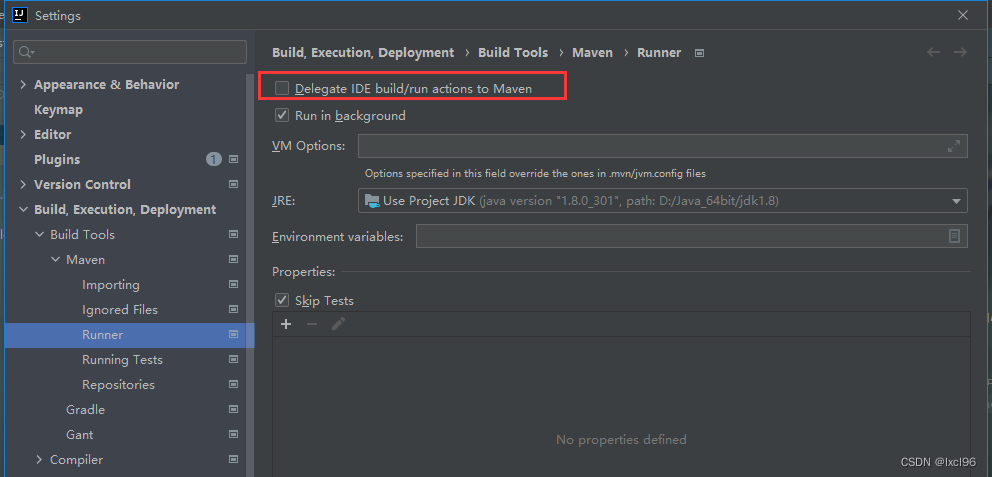
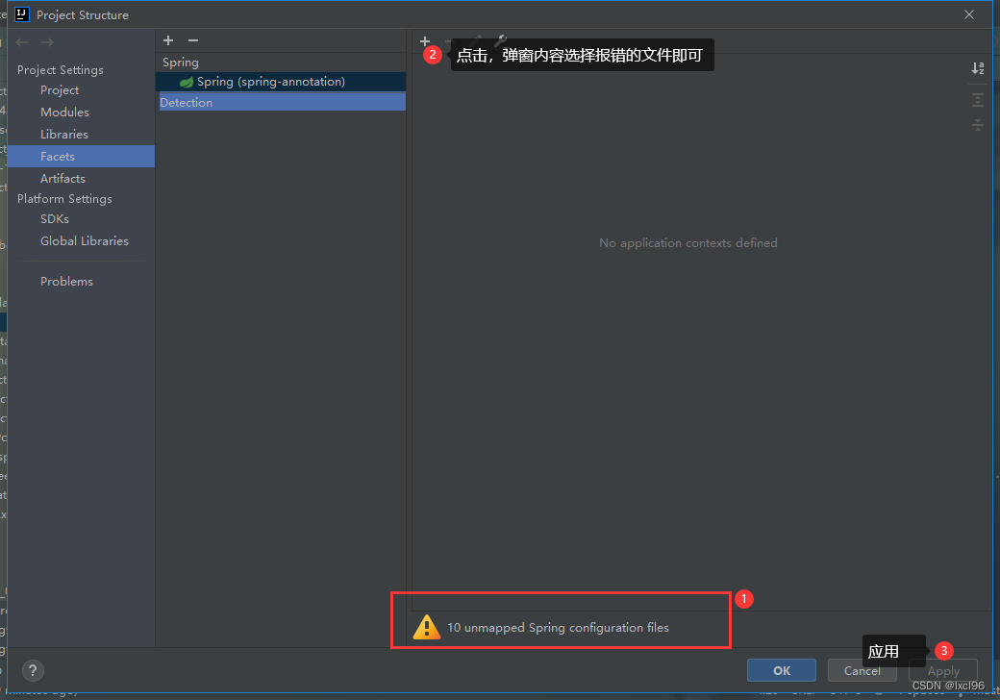

# 

 注意：此方法仅适用于pom文件中成功导入依赖，Ctrl+B可以成功定位到包路径，但是运行时提示包不存在。

# 方法一：settings-Build-Maven-Runner中勾选Delegate IDE...

> 此方法缺点：每次运行都要先被Maven编译测试，速度极慢

# 方法二：Project Structure-Facets-点击Spring（小绿叶）- 点击 + ，选择出错的文件（或者全选即可）

