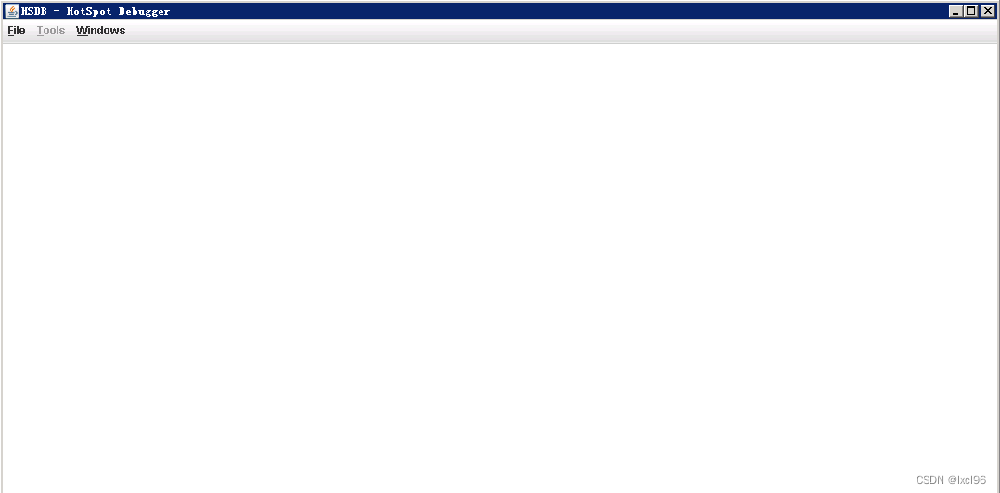
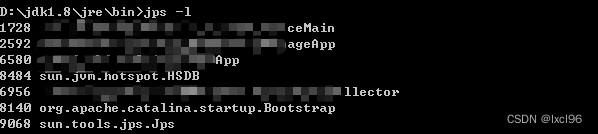
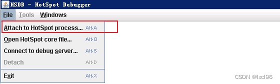
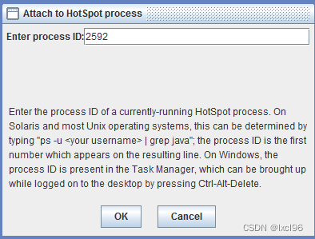
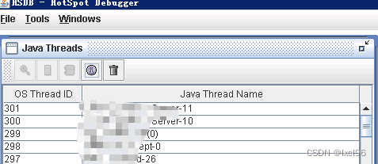
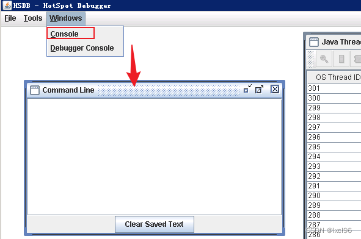
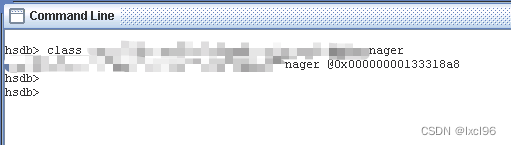
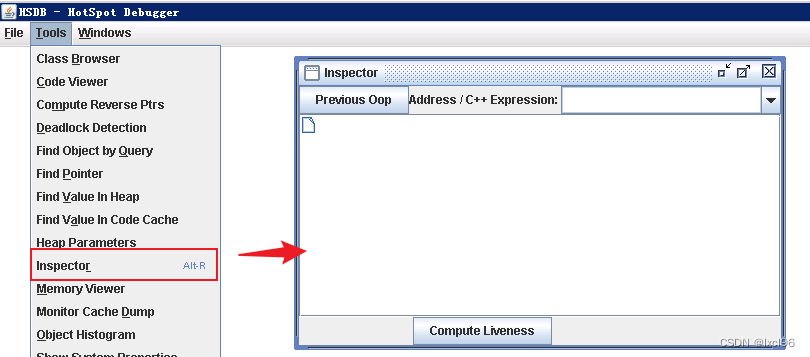
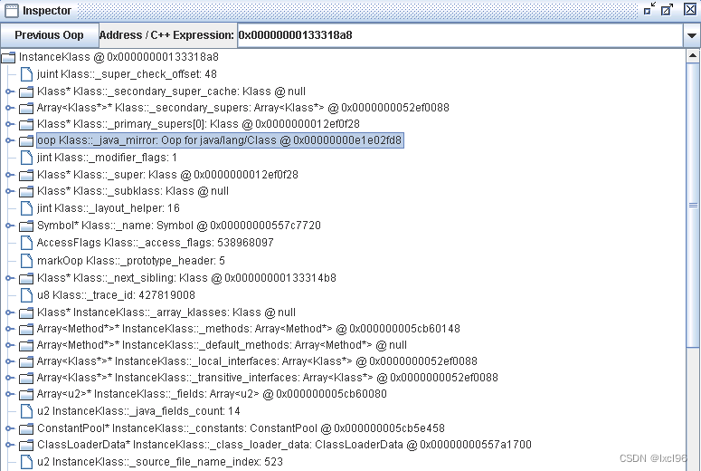

# 

#  0.背景

生产上有个实际数据和数据库的数据不一致，数据被缓存在jvm的LinkedHashMap列表中。由于代码逻辑是生成数据新实例时先从缓存LinkedHashMap中获取数据，所以我怀疑内存中的数据和数据库的数据有出入，所以需要校验一下。


# 1.前提

一定要使用相同的jdk和jre运行环境，否则会提示jvm版本不一致


# 2.步骤

## 1. 在jre/bin目录下执行以下命令

```bash
java.exe -classpath ../lib/sa-jdi.jar sun.jvm.hotspot.HSDB
```




> 如果出现错误: 找不到或无法加载主类 sun.jvm.hotspot.HSDB
>
> 需要把jdk下的 lib/sa-jdi.jar 拷贝到 jre/lib目录下

## 2. 进入jre/bin目录下执行命令

```bash
jps -l
```


记住左面你想要接入jvm程序的pid，下面要用到： 

 

- 如果提示：'jps' 不是内部或外部命令

​    可以去 jdk/bin 目录下执行，或者将其拷贝到 jre/bin 目录下

## 3. 连接到想要接入的程序的JVM

点击 File->Attach to HotSpot Process



 输入进程pid，回车



连上后会出现jvm中所有线程




> 如果等待较长时间还是没有连上，退出HSDB此时会发现控制台显示 ”缺少sawindbg.dll文件“
>
>  将 jdk/bin/sawindbg.dll 拷贝到 jre/bin/下即可

## 4. 打开控制台

点击 `Windows->Console `打开HSDB控制台

先回车一下，然后输入help可以查看所有命令

```bash
hsdb> help
Available commands:
  assert true | false
  attach pid | exec core
  buildreplayjars [ all | app | boot ]  | [ prefix ]
  class name
  classes
  detach
  dis address [length]
  disassemble address
  dumpcfg { -a | id }
  dumpclass { address | name } [ directory ]
  dumpcodecache
  dumpheap [ file ]
  dumpideal { -a | id }
  dumpilt { -a | id }
  dumpreplaydata { <address > | -a | <thread_id> }
  echo [ true | false ]
  examine [ address/count ] | [ address,address]
  field [ type [ name fieldtype isStatic offset address ] ]
  findpc address
  flags [ flag | -nd ]
  help [ command ]
  history
  inspect expression
  intConstant [ name [ value ] ]
  jdis address
  jhisto
  jseval script
  jsload file
  jstack [-v]
  livenmethods
  longConstant [ name [ value ] ]
  mem address [ length ]
  pmap
  print expression
  printall
  printas type expression
  printmdo [ -a | expression ]
  printstatics [ type ]
  pstack [-v]
  quit
  reattach
  revptrs address
  scanoops start end [ type ]
  search [ heap | perm | rawheap | codecache | threads ] value
  source filename
  symbol address
  symboldump
  symboltable name
  sysprops
  thread { -a | id }
  threads
  tokenize ...
  type [ type [ name super isOop isInteger isUnsigned size ] ]
  universe
  verbose true | false
  versioncheck [ true | false ]
  vmstructsdump
  whatis address
  where { -a | id }
hsdb> 
```




##  5. 查找需要的类（全类名）的地址

比如我要查找的xxxA类，发现其指向地址 0x00000000133318a8 （@是at意思，不是地址）



##  6. Inspector

点击 Tools->Inspector，填入刚才查询到的类实例指向地址，点击下方的Compute Liveness



> 注：Klass就是class 

## 7. 在里面Inspector中找到自己关心的数据

比如我的数据存放在LinkedHashMap中，其就在 oop Klass中。点击左边钥匙图标打开，就发现xxxA类中需要的属性。

## 8. 参考链接

- [找不到或无法加载主类 sun.jvm.hotspot.HSDB_普通网友的博客-CSDN博客](https://blog.csdn.net/m0_67401055/article/details/124479972)
- [『JDK工具之HSDB』查看JVM加载的class的字节码_柠檬草。的博客-CSDN博客](https://blog.csdn.net/yyx3214/article/details/103754516)
