# 0. 容器

容器是一种沙盒技术，主要目的是为了将应用运行在其中，与外界隔离；及方便这个沙盒可以被转移到其它宿主机器。本质上，它是一个特殊的进程。通过名称空间（Namespace）、控制组（Control groups）、切根（chroot）技术把资源、文件、设备、状态和配置划分到一个独立的空间。

# 1. docker简介

## 1.1 docker出现背景


## 1.2 ==虚拟机 VS Docker==

### 1.2.1 docker为什么比虚拟机快?

1. **docker有着比虚拟机更少的抽象层**

   由于docker不需要Hypervisor(虚拟机)实现硬件资源虚拟化,运行再docker容器上的程序直接使用的是实际物理机的硬件资源.因此在CPU,内存利用率上docker将会在效率上有明显优势.

2. **docker利用的是宿主机的内核,而不需要加载操作系统OS内核(即docker不虚拟化硬件)**

   当新建一个容器时,docker不需要和虚拟机一样重新加载一个操作系统内核.进而避免引寻,加载操作系统内核然后返回等比较费时费资源的过程,当新建一个虚拟机时,虚拟机软件需要加载OS返回新建过程都是分钟级别的.而docker由于利用宿主机的操作系统,则省略了返回过程,因此新建一个docker容器只需要几秒钟.

   

   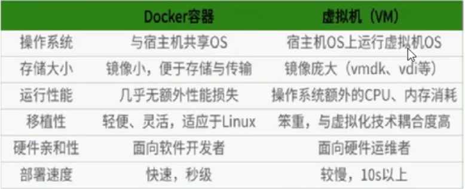

   

## 1.3 docker组成(三要素)

**docker本身是一个容器运行载体或称之为管理引擎.我们把应用程序和配置依赖打包好形成一个可交付的运行环境.这个打包好的运行环境就是镜像image文件.通过该镜像文件跑起来(run)的就是docker容器实例**

+ 镜像(image),是一个只读的模板,用于创建docker容器.

+ 容器(container),也叫**容器实例,是通过镜像创建并运行的实例**.

  可以将容器看成一个简易版的Linux环境(包括root用户,进程空间,用户空间和网络空间等.)和运行在其中的程序

+ 仓库(repository),存放镜像的地方.分为公有仓库和私有仓库

> 镜像类似于java**类**,容器类似于java**bean实例**.

## 1.4 docker运行流程

Docker是一个`C/S`模式的架构,后端是一个`松耦合架构`,众多模块各司其职.

Docker的基本流程为:

1. 用户使用**`Docker Client`**与**`Docker Daemon`**建立通信,并发请求给后者.
2. `Docker Daemon`作为Docker架构中的主体部分,首先提供**`Docker Server`**的功能使其可以接受`Docker Client`的请求.
3. `Docker Engine`执行Docker内部的一系列工作,每一项工作都以一个**`Job`**的形式存在.
4. `Job`的运行过程中,当需要**容器镜像**时,则从**`Docker Registry`**容器仓库中下载镜像,并通过镜像管理驱动**`Graph Driver`**将下载的镜像以**`Graph`**的形式存储.
5. 当需要为**Docker创建网络环境**时,通过网络驱动**`Network Driver`**创建并配置Docker容器网络环境.
6. 当需要限制Docker容器运行资源或执行用户指令等操作时,则通过**`Exec Driver`**完成.
7. **`Libcontainer`**是一项独立的容器管理包,`Network Driver`以及`Exec Diver`都是通过`Libcontainer`来实现具体对容器进行的操作


# 2. docker安装配置(镜像加速)

Linux下安装docker只需要安装`Docker Engine`,文档地址:[Install Docker Engine | Docker Docs](https://docs.docker.com/engine/install/)

## 2.1 Centos7安装docker Engine

参考文档:[Install Docker Engine on CentOS | Docker Docs](https://docs.docker.com/engine/install/centos/)

+ 满足硬件要求

+ 卸载旧版本(如果存在)

  ```bash
  sudo yum remove docker \
                    docker-client \
                    docker-client-latest \
                    docker-common \
                    docker-latest \
                    docker-latest-logrotate \
                    docker-logrotate \
                    docker-engine
  ```

  > Images, containers, volumes, and networks stored in `/var/lib/docker/` aren't automatically removed when you uninstall Docker.
  >
  > 镜像,容器,卷,和网络存储在`/var/lib/docker`下,他们不会在使用yum卸载时自动删除.(因此需要手动删除)

+ 在线安装

  ```bash
  # 设置yum仓库  docker换成阿里云仓库会更快
  sudo yum install -y yum-utils
  sudo yum-config-manager --add-repo https://download.docker.com/linux/centos/docker-ce.repo
  sudo yum-config-manager --add-repo https://mirrors.aliyun.com/docker-ce/linux/centos/docker-ce.repo
  # 安装docker engine
  sudo yum install docker-ce docker-ce-cli containerd.io docker-buildx-plugin docker-compose-plugin
  ```

  > docker阿里云镜像 [docker-ce镜像_docker-ce下载地址_docker-ce安装教程-阿里巴巴开源镜像站 (aliyun.com)](https://developer.aliyun.com/mirror/docker-ce?spm=a2c6h.13651102.0.0.57e31b11i5nhRs)

+ 离线安装

  官网给的离线安装是假的,还是需要联网 实际离线版下载地址: [Index of linux/static/stable/x86_64/ (docker.com)](https://download.docker.com/linux/static/stable/x86_64/)

  离线安装教程:  [docker 离线安装教程 - 知乎 (zhihu.com)](https://zhuanlan.zhihu.com/p/578402141)

+ 启动docker

  ```bash
  sudo systemctl start docker
  ```

+ hello-world

  ```bash
  sudo docker run hello-world
  ```

  > 输出 
  >
  > Hello from Docker!
  > This message shows that your installation appears to be working correctly.

+ 卸载docker

  + 停止docker `sudo systemctl stop docker`
  + 删除docker  `sudo yum remove docker-ce decker-ce-li container.io`
  + 手动删除本地镜像 `sudo rm -rf /var/lib/docker`
  + 手动删除本地容器 `sudo rm -rf /var/lib/containerd`


## 2.2 配置阿里云容器镜像加速

[容器镜像服务 (aliyun.com)](https://cr.console.aliyun.com/cn-shanghai/instances/mirrors)

控制台-容器-容器镜像服务ACR-个人版-容器镜像服务-镜像工具-镜像加速器

根据提示写入docker daemon.json文件中

```bash
sudo mkdir -p /etc/docker
sudo tee /etc/docker/daemon.json <<-'EOF'
{
  "registry-mirrors": ["xxxxx"]
}
EOF
sudo systemctl daemon-reload
sudo systemctl restart docker
```

# 3. docker常用命令

## 3.1 帮助启动类命令

+ `docker --help` docker帮助信息
+ `docker 具体命令 --help` 查看docker具体指令帮助
+ `syatemctl start/stop/status/restart/enable docker`

## 3.2 镜像命令

+ `docker images` 列出所有镜像

  ```bash
  [root@localhost ~]# docker images
  REPOSITORY    TAG       IMAGE ID       CREATED         SIZE
  hello-world   latest    d2c94e258dcb   11 months ago   13.3kB
  # 镜像仓库名称   版本	    id			  创建时间				大小
  ```

  > 同一个仓库可以有多个同名称不同版本的镜像,我们可以使用`	REPOSITORY:TAG`来指定操作的镜像版本,如果 **不加`TAG` 默认就是`REPOSITORY:latest`**

+ `docker search xxxx`搜索指定镜像

+ `docker pull xxxx[:TAG]`下载指定镜像  不指定`TAG`默认就是`latest`

+ `docker system  df/events/info` 管理docker,查看docker镜像/容器/卷,缓存占用的空间等

+ `docker rmi 镜像名[:TAG]/镜像id`移除指定镜像

  ```bash
  # 强制删除所有镜像
  docker rmi -f $(docker images -qa) # 先查询所有镜像id
  ```

  > 面试:谈谈docker的虚悬镜像是什么?
  >
  > **仓库名repository,标签tag都是`<none>`的镜像,俗称虚悬镜像 dangling image.
  >
  > docker构建时出现的,建议删除.

## 3.3 容器命令

+ 新建并启动容器实例  `docker run [选项] 镜像[:TAG]`

  + `docker run --name xxx 镜像[:TAG]` 创建并启动容器实例时**指定容器名字,否则默认系统分配**

  + `docker run -d 镜像[:TAG]` 创建并启动容器实例,**容器后台运行**

  + `docker run -it 镜像[:TAG]` 其中`-i`表示**进入交互模式**,`-t`表示**为容器分配一个伪终端,等待交互**.二者搭配使用

    ```bash
    # /bin/bash表示载入容器后就运行bash,新版默写 默认是bash
    docker run -it ubuntu /bin/bash
    ```

    > docker中必须要保持一个进程的运行,要不然容器启动后会马上kill itself,这个/bin/bash就表示启动容器后启动bash

  + `docker run -P 镜像[:TAG]` 其中`-P` (大写) 表示docker使用物理机上**随机端口**,范围是49153~65535 

  + `docker run -p 宿主机端口:容器端口 镜像[:TAG]` 其中`-p` (小写) 表示docker使用物理机上**指定端口**

  + `docker run --restart=always` 当docker重启了,部署在docker上的容器也自动重启

  + `docker run --help`

+ 查看所有正在运行的容器实例  `docker ps 选项` 

  ```bash
  [ly@localhost ~]$ sudo docker ps
  CONTAINER ID   IMAGE     COMMAND       CREATED          STATUS         PORTS     NAMES
  edf917e86c6d   ubuntu    "/bin/bash"   10 seconds ago   Up 9 seconds             youthful_murdock
  #容器实例id		镜像名		执行的命令		创建时间		状态:up在线		使用的宿主端口	容器实例的名字
  ```

+ 容器退出

  + `docker run -it`进入容器后,`exit`退出容器,**容器停止**

  + `docker run -it`进入容器后,`ctrl+p+q`,退出交互式输入,容器转为**后台运行(就是`-d`参数),容器不停止**

    > 后台的容器实例再次进入前台模式 `docker attach 容器实例id/容器实例名字`

+ 重启容器 `docker restart 容器实例id或名字`

+ 停止容器 `docker stop 容器实例id或名字`

+ 强制停止容器 `docker kill 容器实例id或名字 `

+ 删除已经停止的容器 `docker rm 容器实例id或名字`

  > 一次性强制删除所有容器实例 `docker rm -f  $(docker ps -aq)`或`docker ps -aq|xargs docker rm -f`

## 3.4 重要命令

1. 后台运行镜像**注意 **`docker run -d 镜像`

   对于某些镜像让其后台启动后,又会直接退出.这是因为docker规则就是**如果要docker容器实例后台运行,则必须有一个前台进程(如redis,vite),否则就会自动退出.**所以对于没有前台进程的镜像如ubuntu,如果想让其后台运行则必须手动`docker run -it ubuntu`然后再按`ctrl+p+q`切换到后台.

2. **查看容器的日志** `docker logs 容器实例id/名字` 

3. **查看运行运行中容器实例内运行的进程**  `docker top 容器实例id/名字`

4. **查看容器实例内部配置信息** `docker inspect 容器实例id/名字`

5. **重新进入挂入后台的容器** `docker exec -it 容器实例id/名字 /bin/bash`或`docker attach 容器实例id/名字`

   > 上述两种方式进入容器实例的区别:
   >
   > + `attach`方式进入,**不会启动新的进程,用exit退出,会导致容器的停止**
   > + `exec`方式进入,相当于**重新开启一个bashshell进程,并且用exit退出是这个新进程的退出,不会导致容器停止** ==<font color='red'>**推荐使用**</font>==

6. **容器和宿主机文件相互拷贝**

   + 把容器文件拷贝到宿主机器: `docker cp 容器实例id/名字:容器内文件全路径 宿主机目录`
   + 把宿主机器文件拷贝到容器: `docker cp 宿主机文件全路径 容器实例id\名字:容器内目录`

7. **导入镜像文件系统 (tar包),如果该镜像文件不存在就创建(其实总是会新建,就算tag一样)**  <font color='red'>注意是导入到镜像image而不是容器container</font>

   `docker import 文件或文件url 用户名/镜像名[:TAG]` 导入到某一image,tag必写 (推荐名字不一样)

   > 导入ubuntu的必须带命令 /bin/bash

8. **导出容器文件系统 (tar包 主体是容器)** `docker export 容器实例id/名字 -o 文件名` 或者`docker export 容器实例id/名字 >文件名`

9. **将镜像文件保存为文件(tar 包 主体是镜像)** `docker save 镜像名 -o 文件名`或`docker save 镜像名 > 文件名`

10. **从文件中加载镜像(atr包)** `docker load -i tar文件`

> + `export-import`是一对.是对容器操作(指export)
> + `save-load`是一对,是对镜像操作(指所有)\
>
> **一个是备份容器,另一个是备份镜像** 仔细体会

## 3.5 dockers命令大全

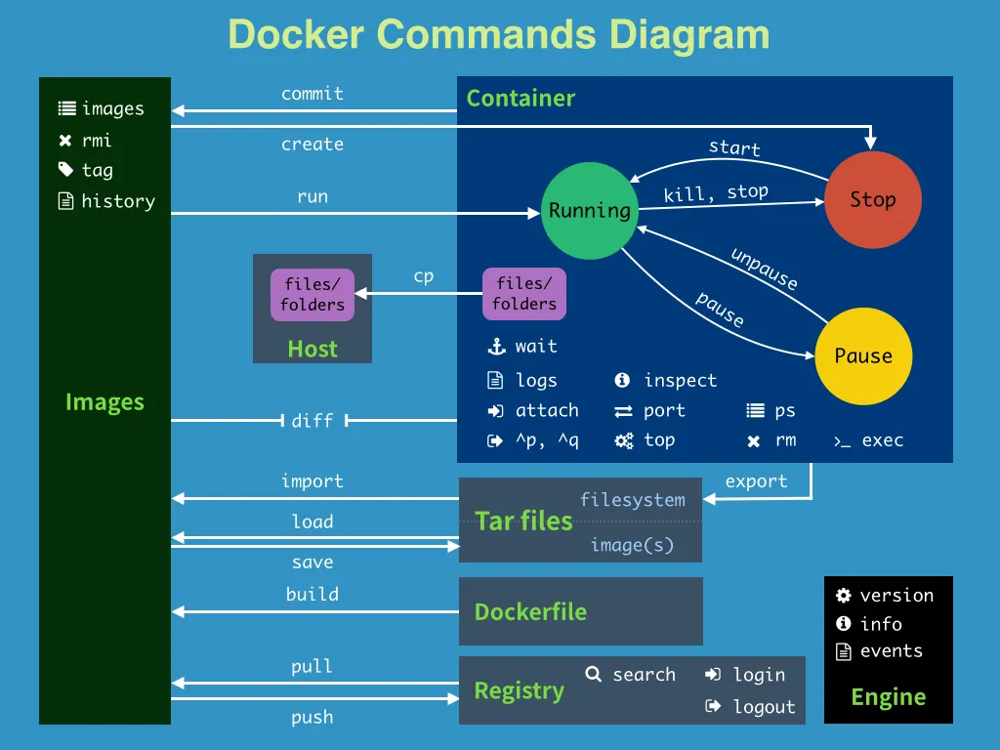

# 4. Docker镜像

## 4.1 镜像是什么

镜像是一种轻量级,可执行的独立软件包,它包含运行某个软件所需的所有内容,我们把应用程序和配置依赖打包好形成一个可交付的运行环境(包括代码,运行时需要的库,环境变量和配置文件等).这个打包好的运行环境就是image镜像文件.

只有通过这个镜像文件才能生成Docker容器实例

## 4.2 镜像是分层的

通过案例`docker pull tomcat`可以看到下载镜像有一层一层的,**这每一层都是`docker commit`提交对镜像文件的修改.** 

**镜像文件=基础镜像+commit提交的修改 **(类似于git)

```bash
[ly@localhost ~]$ sudo docker pull tomcat
[sudo] password for ly: 
Using default tag: latest
latest: Pulling from library/tomcat
0e29546d541c: Pull complete # 基础镜像
9b829c73b52b: Pull complete # 一层 commit
cb5b7ae36172: Pull complete 
6494e4811622: Pull complete 
668f6fcc5fa5: Pull complete 
dc120c3e0290: Pull complete 
8f7c0eebb7b1: Pull complete 
77b694f83996: Pull complete 
0f611256ec3a: Pull complete 
4f25def12f23: Pull complete 
Digest: sha256:9dee185c3b161cdfede1f5e35e8b56ebc9de88ed3a79526939701f3537a52324
Status: Downloaded newer image for tomcat:latest
docker.io/library/tomcat:latest
```

## 4.3 UnionFS联合文件系统(镜像底层原理)

UnionFS联合文件系统:是一种**分层,轻量级并且高性能**的文件系统,它支持**对文件系统的修改作为一次提交来一层层的叠加**,同时可以将**不用目录挂载到同一虚拟文件系统下**.

**Union文件系统是docker镜像的基础.**

**镜像可以通过分层来进行继承**,基于基础镜像(没有父镜像),可以制作各种具体的应用镜像.

特性: **一次同时加载多个文件系统,但从外面看起来,只能看到一个文件系统,联合加载会把各层文件系统叠加起来,这样就是最终的镜像文件**.

## 4.4 Docker镜像加载原理

docker的镜像实际上是由一层一层的文件系统组成,这种层级的文件系统就是`UnionFS`.

**docker的底层文件系统就是`bootfs`(boot file system)**

`bootfs`主要包含`bootloader`和`kernel`.`bootloader`主要是引导加载`kernel`.

linux刚启动时会加载bootfs文件系统,这一层和我们典型的Linux/Unix系统是一样的,包含boot加载器和内核.当boot加载完成之后,整个内核都在内存中了,**此时内存的使用权已由bootfs转交给内核kernel,此时系统就会卸载bootfs**.

`rootfs(root file system)`,在`bootfs`之上.包含的就是典型的Linux系统中的`/dev,/proc,/bin,/etc`等标准目录和文件.`rootfs`就是各种不同操作系统的发行版,比如Ubuntu,Centos等等.

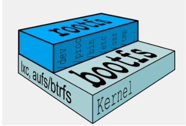

docker容器其实就是一个精简的OS,`rootfs`可以很小,只需要包含最基本的命令,工具和程序库就可以了.对于不同的Linux发行版**`bootfs`基本是一致的,`rootfs`会有差别,所以不同的发行版可以公用`bootfs`**

**又因为docker底层直接使用主机(物理机)的kernel,所以制作镜像时物理机只提供`rootfs`就行了.**

**基础镜像文件=通用`bootfs` + 物理机精简版`rootfs`**

## 4.5 为什么docker要采用这种分层结构?

**共享资源,方便复制迁移,就是为了复用.**

比如说有多个镜像都是从相同的base镜像构建而来,那么Docker Host只需要在磁盘上保存一份base镜像;同时内存中也只需要加载一份base镜像,就可以为所有的容器服务.**镜像的每一层都是可以被共享的**

## 4.6 镜像层vs容器层

**Docker镜像层都是只读的,容器层是可写的**

当容器启动时,一个新的可写层被加载到镜像的顶部.这一层通常被称为"容器层","容器层"之下的都是"镜像层"


## 4.7 commit修改镜像示例(ubuntu安装vim)

+ docker hub上下载ubuntu镜像并允许(没有vim命令)
+  `apt-get`+ `apt-get install vim` 此时容器实例具有vim命令
+ 另开一个终端(保持容器实例不退出),`docker commit -a "作者"-m "增加vim功能" 容器实例id/名字 作者/新镜像名[:tag]`
+ `docker run -it 新镜像名[:tag]` 就可以看到具有vim功能

# 5. 发布镜像到仓库

以阿里云为例子

+ 配置阿里云镜像加速 参考2.2

+ 打开[容器镜像服务 (aliyun.com)](https://cr.console.aliyun.com/cn-shanghai/instance/repositories)

+ 设置访问凭证,用于登录 [访问凭证 (aliyun.com)](https://cr.console.aliyun.com/cn-shanghai/instance/credentials)

+ 创建命名空间

+ 创建镜像仓库(**一个镜像文件就是一个镜像仓库,默认300个**)

+ 推送镜像文件到阿里云
  ```bash
  # 登录账户 密码是 访问凭证中设置的
  $ docker login --username=xxx registry.cn-shanghai.aliyuncs.com
  # 给本地镜像打tag 保证名字和阿里云的镜像仓库一致
  $ docker tag [ImageId] registry.cn-shanghai.aliyuncs.com/命名空间/test_ubuntu_vim:[镜像版本号]
  # 上传镜像文件
  $ docker push registry.cn-shanghai.aliyuncs.com/命名空间/test_ubuntu_vim:[镜像版本号]
  ```

  > + `registry.cn-shanghai.aliyuncs.com` 镜像仓库地址,阿里云是根据ip来的
  > + `registry.cn-shanghai.aliyuncs.com/lydens/test_ubuntu_vim`格式时 `镜像仓库地址/阿里云命名空间/阿里云镜像仓库名字`

  上传成功可以在 `https://cr.console.aliyun.com/repository/cn-shanghai/命名空间/镜像仓库名字/images`中查看层信息

+ 拉取镜像 `cker pull registry.cn-shanghai.aliyuncs.com/命名空间/test_ubuntu_vim:[镜像版本号]`

# 6. Docker Registry搭建私有库

***镜像推送到私有库,就是推送到tag镜像上的网址***

就是在本地搭建一套仓库(就是本地Docker Hub),用于存储镜像 [CNCF Distribution](https://distribution.github.io/distribution/)

+ `docker pull registry` 下载registry

+ `docker images`  确保registry下载成功

+ 运行registry

  ```bash
  # 容器的默认仓库会被创建在/var/lib/registry下
  # -v指定卷地址映射,不使用默认仓库地址 [将主机/home/ly/test/docker目录映射到容器/home/registry]
  docker run -d -p 5000:5000 -v /home/ly/test/docker/:/home/registry  --privileged=true registry
  ```

+ 查看当前私有库存在的镜像(可用于验证私有库是否正确运行)

  ```bash
  [ly@localhost ~]$ curl http://192.168.xxx.xxx:5000/v2/_catalog
  {"repositories":[]}
  ```

+ **修改`/etc/docker/daemon.json`,允许http请求**

  ```bash
  {
    "registry-mirrors": ["https://xx.com"],
    "insecure-registries": ["192.168.xxx.xxx:5000"]
  }
  ```

  重启docker

+ 将新容器实例`commit`成image镜像

  ```bash
  docker commit -a lee -m "add note file in home" a03bb499dc8e lee/bad_ubuntu:0.0.1
  ```

+ 给镜像添加tag,方便查看 (和阿里云的一样)

  ```bash
  # 写错了
  docker tag lee/bad_ubuntu:0.0.1 192.168.xxx.xxx/lee/bad_ubuntu:0.0.1
  # 删除tag镜像必须带tag
  docker rmi 192.168.xxx.xxx/lee/bad_ubuntu:0.0.1
  # 正确的要带端口
  docker tag lee/bad_ubuntu:0.0.1 192.168.xxx.xxx:5000/lee/bad_ubuntu:0.0.1
  ```

+ 推送到本地私有库

  ```bash
  docker push 192.168.xxx.xxx:5000/lee/bad_ubuntu:0.0.1
  ```

+ 验证镜像上传成功

  ```bash
  [ly@localhost ~]$ curl http://192.168.xxx.xxx:5000/v2/_catalog
  {"repositories":["lee/bad_ubuntu"]}
  ```

+ 删除本地镜像,并pull私有库镜像 允许查看自定义文件存在 (成功验证)

  ```bash
  docker pull 192.168.xxx.xxx:5000/lee/bad_ubuntu:0.0.1
  ```

# 7. 镜像上传总结

> <font color='red'>上传,下载的***私有库的地址就是tag镜像中的地址***</font>
>
> ```bash
> [ly@localhost ~]$ sudo docker images
> REPOSITORY                                                 TAG       IMAGE ID       CREATED         SIZE
> 192.168.xxx.xxx:5000/lee/bad_ubuntu                        0.0.1     46be2c30f522   7 minutes ago   72.8MB
> lee/bad_ubuntu                                             0.0.1     46be2c30f522   7 minutes ago   72.8MB
> ```

步骤: (下面命令都不全,根据实际来)

+ `docker pull registry` 下载私有库镜像服务
+ `docker run -d -p 5000:5000 registry` 运行私有库镜像服务
+ `docker commit`从运行的容器实例中创建一份镜像
+ `docker tag` 给上一步创建的镜像打上**私有库地址标签**,一般格式为`ip:port/命名空间/仓库镜像名称:tag`
+ `docker push tag镜像` 将上一步生成的**tag镜像**上传到对应的tag地址(私有库)
+ `docker pull tag镜像`将私有库(tag上地址)的镜像拉到本地

# 8. 容器数据卷volume

***每次启动都会用主机的目录去覆盖容器的目录,所以如果是配置文件请确定主机目录先存在***

## 8.1 是什么?

卷就是目录或文件,存在于一个或多个容器中,由docker挂载到容器,但不属于联合文件系统,因此能够绕过Union File System提供一些用于持续存储或共享数据的特性:

***卷的设计就是<font color='red'>数据的持久化,完全独立于容器的生存周期</font>,因此docker不会在容器删除时删除其挂载的数据卷***

> 总结就是将容器数据持久化到宿主机磁盘上,相当于备份

## 8.2 用法

`docker run -d -v 宿主机目录:容器目录 --privileged=true 镜像名`

+ `-v 宿主机目录:容器目录`就表示将容器目录下数据持久化到宿主机目录
+ `--privileged=true `兜底方案,centos7中加强了安全模块,使用该命令给容器额外的权限(如数据持久化到本地),***使用该参数,容器内部的root用户就有了对应宿主机目录的root权限**(一般如果不报错可以不加上)

## 8.3 容器卷作用

+ 数据卷可以在容器之间共享或重用数据
+ 卷中的更改可以直接实时生效
+ **数据卷中的更改不会包含在镜像的更新中**
+ 数据卷的生命周期一直持续到没有容器使用它位为止

## 8.4 案例

### 8.4.1 宿主机容器之间映射添加容器卷

+ `docker run -d -v 宿主机目录:容器目录 -v ... --privileged=true 镜像名`
+ 共享目录是双向绑定的,即**宿主机和容器都可以读写**
+ **对于运行的容器可以用 `docker inspect 容器名字/容器id`查看其挂载路径**,在`HostConfig.Binds数组中或Mounts`

### 8.4.2 读写规则映射添加说明

**默认容器有读写权限**,当然也可以指定

`docker run -d -v 宿主目录1:容器目录1:权限 -v ... 镜像名`

+ `rw` 默认读写权限
+ `ro` read only

### 8.4.3 卷的继承和共享

#### --volumes-from

`docker run -it --privileged=true --volumes-from 父类(另一个容器id或name) 镜像`

新生成的容器实例继承了父类容器的卷权限,这就实现**宿主机,父类容器,新容器**之间的数据共享.

> 父容器停止不影响子容器对卷的读写

## 8.5 注意

**如果宿主机目录对应和容器中目录存在相同的文件,那么以宿主机的为主(宿主机上该文件会覆盖掉容器中的对应文件)**

# 9. 启动redis案例(持久化)

+ 拷贝一份`redis.conf`放在`/app/redis`目录下,用于数据卷
+ `/app/redis/redis.conf`修改必须的配置 `daemon no`关闭redis后台启动,否则docker后台运行redis会失败(docker要求容器中必须存在前台运行的程序,否则就会结束)]
+ `docker run -d --name myredis -v /app/redis/redis.conf:/etc/redis/redis.conf -v /app/redis/data:/data/redis redis:latest redis-server /etc/redis/redis.conf`
  + `-v /app/redis/redis.conf:/etc/redis/redis.conf`  容器卷,宿主机配置文件覆盖容器源文件
  + `-v /app/redis/data:/data/redis` 容器卷,用于redis数据持久化到宿主机
  + ` redis:latest` redis的docker镜像版本
  + `redis-server /etc/redis/redis.conf` docker启动镜像运行的命令,表示指定redis配置文件运行

# 10. docker下mysql主从配置

规定: 3307为主服务 3308为从服务

+ 创建主服务docker配置并运行

  ```bash
  sudo docker run -d -p 3307:3306 -e MYSQL_ROOT_PASSWORD=123456  \
  --privileged=true -v /app/mysql/master/etc/mysql/:/etc/mysql/ 
  -v /app/mysql/master/data/:/var/lib/mysql/ \
  -v /app/mysql/master/log/:/var/log/mysql/ --name=master mysql:5.7.20
  ```

+ 创建从服务docker配置并运行

  ```bash
  sudo docker run -d -p 3308:3306 -e MYSQL_ROOT_PASSWORD=123456 \
  --privileged=true -v /app/mysql/slave/etc/mysql/:/etc/mysql/ \
  -v /app/mysql/slave/data/:/var/lib/mysql/ \
  -v /app/mysql/slave/log/:/var/log/mysql/ --name=slave mysql:5.7.20
  ```

+ 修改主服务配置`/app/mysql/master/etc/mysql/mysql.conf.d`并重启容器

  ```bash
  # 主从配置 简单配置下
  log-bin=mysql-bin
  server-id=1
  ```

+ 修改从服务配置`/app/mysql/slave/etc/mysql/mysql.conf.d`并重启容器

  ```bash
  # 主从配置
  server-id=2
  ```

+ 配置master数据库 创建主库REPLICATION账户,并给权限,

  ```bash
  CREATE user `sync`;
  GRANT REPLICATION SLAVE ON *.* to 'sync'@'%' identified by '123456';
  show master status;# 获取log-bin文件名和 position
  ```

+ 配置slave数据库中,设置slave信息,并启动slave

  ```bash
  CHANGE MASTER TO master_host = '192.168.xxx.xxx',
  master_port = 3307, # 别忘记端口
   master_user = 'sync',
   master_password = '123456',
   # 上一步获得的log-bin文件名和 position
   master_log_file = 'mysql-bin.000001',
   master_log_pos = 627;
  ```

+ 查看slave状态,确保两个yes

  ```bash
  show slave status;
  ```

+ 测试,主库建立数据库-表-数据库,查看从库

> mysql主从配置的注意事项及遇到的问题
>
> + 运行mysql镜像,需要设置环境变量`-e MYSQL_ROOT_PASSWORD=xxx`
>
> + ***自定义映射卷 `-v `,每次启动时都是宿主机目录文件将容器中目录文件覆盖(因此DIY的话,文件必须启动前就要存在)***
>
> + mysql镜像容器是以宿主机`mysql`用户权限执行的,因此必须保证其用于对应文件的读写权限(如log目录)**更改宿主机目录所有者或权限**,否则会报错
>
>   2024-04-07T09:25:25.866676Z 0 [ERROR] Could not open file '/var/log/mysql/error.log' for error logging: Permission denied
>
> + 镜像`run --name=xxxx`后就创建了对应名字的容器,每次启停对应容器命令就不是`run`了而是`start,stop,restart` **搞清楚run的含义**

# 11. docker下redis集群

## 11.1 Redis集群存储算法

分布式存储的常见算法:

+ 哈希取余算法分区
+ 一致性哈希算法分区
+ 哈希槽算法分区

## 11.2 哈希取余算法

### 11.2.1 算法

`hash(key)%N` 

其中`key`为存入Redis的键名,`N`是Redis服务集群的机器台数

### 11.2.2 释义

用户每次读写操作,都是根据传入的键名经过hash运算,对机器台数取余决定该键存储在哪台服务器上.

### 11.2.3 优点

简单直接有效,只需要预先估算好规划节点数量,就能保证一段时间的数据支撑.

使用hash算法让固定的一部分请求落到同一台机器上,这样每台服务器固定处理一部分请求(并维护这些请求的信息),起到负载均衡+分而治之的作用

### 11.2.4 缺点

原先规划好的节点,如果出现扩容或缩容的情况,会导致节点发送变动,需要重新计算映射关系. 因此在服务器个数固定不变时没有问题,如果需要弹性扩容或故障停机时,原来的取余公式中的`N`就发生了变化.导致根据原来的公式获取服务变动不可控.

## 11.3 一致性哈希算法

### 11.3.0 算法产生的背景

一致性哈希算法是为了解决**哈希取余算法中的分布式缓存数据变动和映射关系的问题**.当服务器个数发生变化时,**尽量减少影响客户端与服务器的映射关系**.

### 11.3.1 算法描述

> 因为hash值是一个`32位无符号的整型`,所以哈希取余算法中`N`只能为小于`2^32`次方.
>
> 如果用的是`unsigned int64` 那么最大就是`2^64`次方
>
> (一次性哈希算法同理) 
>
> 恰巧机器ip地址是4个8位二进制,共32位,也为2^32

一致性哈希算法规定了一个线性空间,大小为`[0,2^32-1]`,并通过设当的逻辑让他变成首尾相连的环形空间.

**哈希取余算法是对服务器节点数量取模,而一致性哈希算法是对2^32取模**

简单来说,一致性哈希算法将整个哈希空间组成一个虚拟的圆环.如假设某个哈希函数`H`的值空间为`0`到`2^32-1`(**即哈希值是一个32位无符号整型**),整个哈希环如下图:


整个空间按照顺时针方向连接,圆环的正上方为0,0的右侧第一个点代表1,依此类推,2....直到2^32-1.

0和2^32-1在12点钟重合(其实不是重合而是相接).

有了哈希环后,还需要进行节点映射,**将集群中各个ip节点映射到环上的某一个位置**.

将各个服务器的ip地址或主机名进行hash,就确定了其在哈希环上的位置.

假如4个节点NodeA,B,C,D,经过IP地址的哈希函数计算(`hash(ip)`)后,在环上的位置如下:

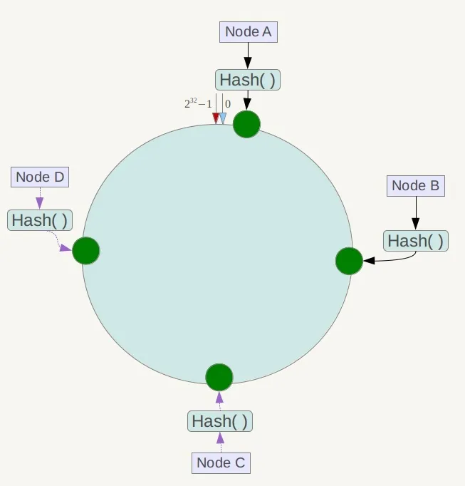

redis`key`落在服务器上的规则: 当我们需要存储一个`key`键值时,首先计算`key`的`hash`值(`hash(key)`),确定该键值对在数据环上的位置,**从此位置沿顺时针行走,遇到的第一台服务器节点就是存储该键值对的服务器节点**.

假如我们有ObjectA,B,C,D,四个数据对象,经过hash运算后,在环空间的位置如下:

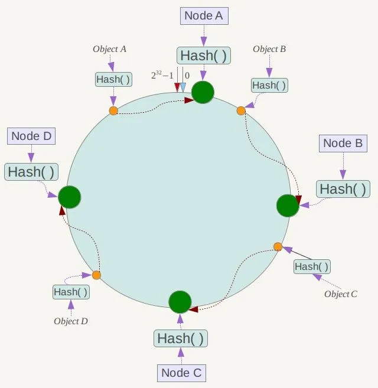

根据一致性算法Object A落到了节点Node A上,Object B落到了节点Node B上,Object C落到了节点Node C上,Object D落到了节点Node D上. (其实就是区间划分,一个节点Node对应一片环区间.)

假设Node C宕机,可以看到此时对象A,B,D不会受到影响,只有Object C对象被重新定位到Node D上.即一般来说,在一致性算法中,如果一台服务器不可用,则受影响的数据仅仅是此服务器到其环空间中前一台服务器之间的数据,其他的不受影响.

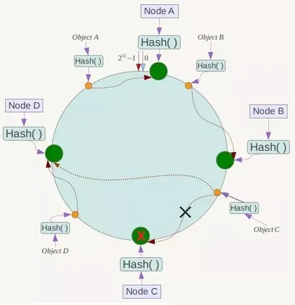

假设需要扩容增加一台节点Node X,且Node X的`hash(ip)`位于Node B和Node C之间,那么收到影响的就只有Node B节点.我们只需要将Node B 到 Node X节点间的数据重新录入到Node X上即可.不会导致Hash取余后全部数据重新洗牌(哈希取余算法的缺点)

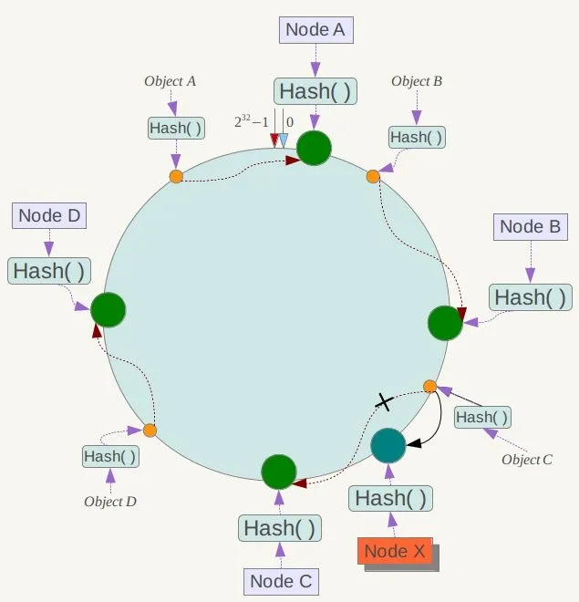

### 11.3.2 算法的缺点

如果服务器节点过少,就会容易因为节点分布不均匀而导致数据倾斜问题:即被缓存的数据都集中到某一台或几台服务器上.


### 11.3.3 虚拟节点

为了解决数据倾斜问题,一致性哈希算法引入了虚拟节点机制.

对每一台服务器节点计算多个哈希,每个计算结果位置都放置一个此服务器节点,称之为虚拟节点.

**具体做法可以先确定每个物理节点关联的虚拟节点数量,然后在ip或主机名后面加上编号.**

例如,Node A,B的虚拟节点个数均为3个,编号分别为NodeA#1,NodeA#2,NodeA#3,NodeB#1,NodeB#2,NodeB#3,形成6个虚拟节点.

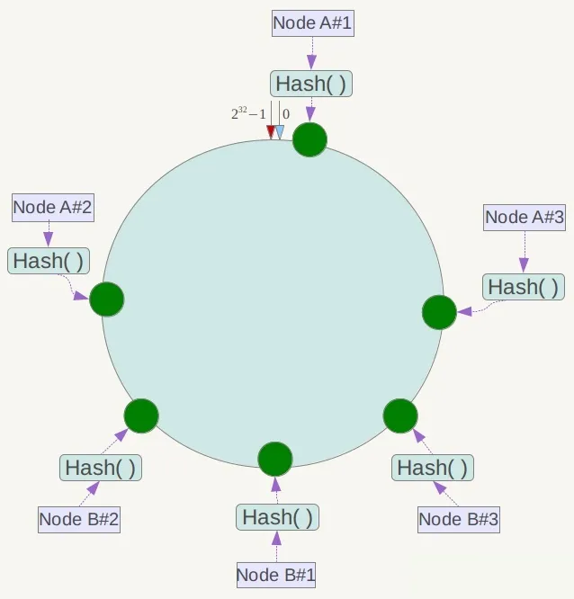

### 11.3.4 一致性哈希算法优点

该算法下**加入和删除节点时,只会影响哈希环中顺时针方向相邻的节点,对其他节点无影响**

### 11.3.5 一致性哈希算法缺点

该算法下**数据的分布和节点的位置有关,因为这些节点不是均匀分布在哈希环上的,所以数据进行存储时达不到均匀分布的效果**

## 11.4 哈希槽slot算法

### 11.4.1 算法产生的背景

> ***为了解决一致性哈希算法的数据倾斜问题***,该算法是另一种算法,不是在一致性哈希算法

### 11.4.2 算法描述

哈希槽本质上就是一个数组,数组`[0,2^14-1]`形成的hash slot空间.

**目的是为了解决一致性哈希算法下数据均匀分配的问题**.在数据和节点之间又加了一层,把这层称之为槽(slot),用于管理数据和节点之间的关系.就**相当于节点上放的是槽,槽里存的是数据(逻辑上)**


> + 槽解决的是粒度问题,相当于把粒度变大了,这样方便数据移动.
> + 哈希解决的是映射问题,使用`key`的哈希值来计算所在的槽,便于数据分配.
> + 虚拟节点也是为了解决数据倾斜的问题,但是是通过虚拟节点的方式,增加服务器节点数量

### 11.4.2 算法策略

一个集群只有`2^14`即`16384`个槽,范围从`[0,2^14-1]`

计算key对应的slot槽公式 : `slot=CRC16(key)%16384`

## 11.5 Redis集群存储策略

redis集群使用的就是**哈希槽**算法.redis集群又16384个哈希槽,**每个`key`通过`CRC16`校验后对16384进行取余**来决定放置在哪个槽,集群的每个节点负责一部分hash槽.

### 11.5.1 哈希槽为什么是2^14个

这是因为`CRC16`算法产生的hash值有16bit,共可以产生`2^16=65536`个值.**但是为了心跳方便和数据传输最大化**,槽的数量只能有`2^14`个

+ 如果槽位数量为2^16=65536个,那么发送心跳信息的消息头大小将达到8k,发送的心跳包过于庞大.在消息头中最占空间的是`myslot[CLUSTER_SLOT/8]`.当槽位为65536时,这块的大小为:`65536/8/1024=8KB`. 每秒redis需要发送一定数量的ping消息作为心跳,如果槽位为65536那么这个ping消息会大大浪费带宽
+ **redis集群的数量不可能超过1000个**. 集群节点越多,心跳包的消息体内携带的数据越多.如果节点超过1000个,也会导致网络拥堵.因此redis作者不建议redis cluster节点超过1000个.对于节点数在1000以内的redis集群,16384个槽位足够了,所以没必要扩展到65536个.
+ 槽位越小,节点少的情况下压缩比越高,容易传输.redis主节点的配置信息中它所负责的哈希槽是通过一张bitmap的形式保存下来的,在传输过程中会对bitmap进行压缩,但是如果bitmap的填充率`slots/N`(N为节点数)很高的话,bitmap的压缩率就很低.如果节点很少,而哈希槽很多的话,bitmap的压缩率最低.

> 原文:
>
> 正常的心跳数据包带有节点的完整配置，使得可以用幂等方式用旧的节点替换旧节点，以便更新旧的配置。这意味着它们包含原始节点的插槽配置，该节点使用 2k 的空间和 16k 的插槽，而不是使用 8k 的空间（使用65k的插槽）。
>
> 同时，因为其他设计折衷，Redis集群的主节点不太可能扩展到1000个以上

### 11.5.2 哈希槽下数据存放流程

redis集群中内置了16384个哈希槽,**redis会根据节点数量大致均等的将哈希槽映射到不同的节点上**.

当需要在redis集群中存放一个键值对时,redis会先把`key`通过`CRC16`校验后对`16384`进行`取余`来决定放置在哪个槽,集群的每个节点负责一部分hash槽.

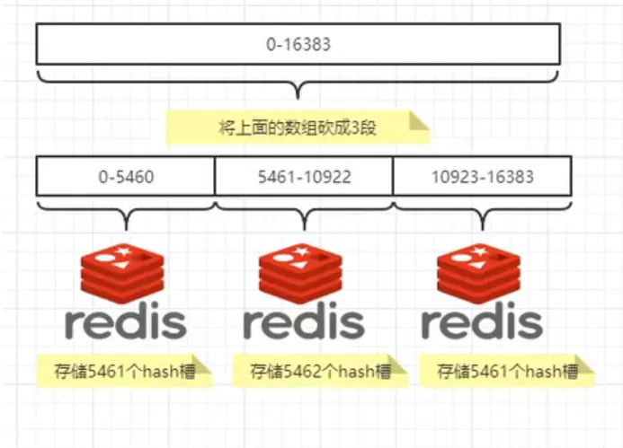

```java
@Test
public void test() {
    // import io.lettuce.core.cluster.SlotHash;
    System.out.println(SlotHash.getSlot('A'));  // 计算结果6373，存入上图的Node2
    System.out.println(SlotHash.getSlot('B'));  // 计算结果10374，存入上图的Node2
    System.out.println(SlotHash.getSlot('C'));  // 计算结果14503，存入上图的Node3
    System.out.println(SlotHash.getSlot('Hello'));  // 计算结果866，存入上图的Node1
}
```

## 11.6 redis集群搭建

### 11.6.1 redis集群搭建步骤

1. 启动6个redis容器

```bash
sudo docker run -d --name redis-node-1 --net host --privileged=true -v /app/redis/share/redis-node-1/data:/data redis:latest --cluster-enabled yes --appendonly yes --port 6381
sudo docker run -d --name redis-node-2 --net host --privileged=true -v /app/redis/share/redis-node-2/data:/data redis:latest --cluster-enabled yes --appendonly yes --port 6382
sudo docker run -d --name redis-node-3 --net host --privileged=true -v /app/redis/share/redis-node-3/data:/data redis:latest --cluster-enabled yes --appendonly yes --port 6383
sudo docker run -d --name redis-node-4 --net host --privileged=true -v /app/redis/share/redis-node-4/data:/data redis:latest --cluster-enabled yes --appendonly yes --port 6384
sudo docker run -d --name redis-node-5 --net host --privileged=true -v /app/redis/share/redis-node-5/data:/data redis:latest --cluster-enabled yes --appendonly yes --port 6385
sudo docker run -d --name redis-node-6 --net host --privileged=true -v /app/redis/share/redis-node-6/data:/data redis:latest --cluster-enabled yes --appendonly yes --port 6386
```

> + `--net host` redis镜像使用宿主机器的ip和端口
> + `--cluster-enabled yes` 开启redis集群模式
> + `--appendonly yes` 开启redis持久化
> + `--port xxx` 设置redis服务的端口号
>
> 感觉就是把`redis.conf`配置文件中属性通过参数形式设置了
>
> 所以可以这样设置:
>
> ```bash
> sudo docker run -d --net host  -v /app/redis/redis.conf:/etc/redis.conf redis:latest  redis-server /etc/redis.conf
> ```
>
> redis启动时指定`redis.conf`配置文件,具体配置内容就可以写在文件内

2. 任意进入一个容器，进入bash shell

   ```bash
   sudo docker exec -it redis-node-1 bash # redis-cli -p 6381 这样直接进入redis-cli客户端
   ```

3. 执行命令，构建三主三从redis集群

   ```bash
   # 宿主机IP:端口
   redis-cli --cluster create 192.168.xxx.xxx:6381 192.168.xxx.xxx:6382 192.168.xxx.xxx:6383 192.168.xxx.xxx:6384 192.168.xxx.xxx:6385 192.168.xxx.xxx:6386 --cluster-replicas 1
   ```

   > 出现警告信息：`[WARNING] Some slaves are in the same host as their master`这是因为我们在同一台机器上模拟，IP地址相同，忽略

4. 确认主从关系，输入`yes`，并检查运行结果

   ```bash
   root@localhost:/data# redis-cli --cluster create 192.168.xxx.xxx:6381 192.168.xxx.xxx:6382 192.168.xxx.xxx:6383 192.168.xxx.xxx:6384 192.168.xxx.xxx:6385 192.168.xxx.xxx:6386 --cluster-replicas 1
   >>> Performing hash slots allocation on 6 nodes...
   Master[0] -> Slots 0 - 5460
   Master[1] -> Slots 5461 - 10922
   Master[2] -> Slots 10923 - 16383
   Adding replica 192.168.136.130:6385 to 192.168.136.130:6381
   Adding replica 192.168.136.130:6386 to 192.168.136.130:6382
   Adding replica 192.168.136.130:6384 to 192.168.136.130:6383
   >>> Trying to optimize slaves allocation for anti-affinity
   # 忽略警告
   [WARNING] Some slaves are in the same host as their master
   # 主从关系及哈希槽范围如下
   M: 4deee49fbf5eafb6460c57863c3233c7bf443e3b 192.168.136.130:6381
      slots:[0-5460] (5461 slots) master
   M: 732780cb02c1f10578912eb3e7c186acf713a84a 192.168.136.130:6382
      slots:[5461-10922] (5462 slots) master
   M: 402e3bf0160f16126b07b39224e6df544e560c88 192.168.136.130:6383
      slots:[10923-16383] (5461 slots) master
   S: d2b9029ae9ba49fe2f3f8690952880c91555d447 192.168.136.130:6384
      replicates 732780cb02c1f10578912eb3e7c186acf713a84a
   S: f1f3e118b72960b3e32a977f7e0652abdfbbceff 192.168.136.130:6385
      replicates 402e3bf0160f16126b07b39224e6df544e560c88
   S: 16255dcf169930b08ab177245f4913369ee2cc54 192.168.136.130:6386
      replicates 4deee49fbf5eafb6460c57863c3233c7bf443e3b
   Can I set the above configuration? (type 'yes' to accept): yes
   >>> Nodes configuration updated
   >>> Assign a different config epoch to each node
   >>> Sending CLUSTER MEET messages to join the cluster
   Waiting for the cluster to join
   
   >>> Performing Cluster Check (using node 192.168.136.130:6381)
   M: 4deee49fbf5eafb6460c57863c3233c7bf443e3b 192.168.136.130:6381
      slots:[0-5460] (5461 slots) master
      1 additional replica(s)
   S: f1f3e118b72960b3e32a977f7e0652abdfbbceff 192.168.136.130:6385
      slots: (0 slots) slave
      replicates 402e3bf0160f16126b07b39224e6df544e560c88
   S: 16255dcf169930b08ab177245f4913369ee2cc54 192.168.136.130:6386
      slots: (0 slots) slave
      replicates 4deee49fbf5eafb6460c57863c3233c7bf443e3b
   M: 402e3bf0160f16126b07b39224e6df544e560c88 192.168.136.130:6383
      slots:[10923-16383] (5461 slots) master
      1 additional replica(s)
   S: d2b9029ae9ba49fe2f3f8690952880c91555d447 192.168.136.130:6384
      slots: (0 slots) slave
      replicates 732780cb02c1f10578912eb3e7c186acf713a84a
   M: 732780cb02c1f10578912eb3e7c186acf713a84a 192.168.136.130:6382
      slots:[5461-10922] (5462 slots) master
      1 additional replica(s)
   [OK] All nodes agree about slots configuration.
   >>> Check for open slots...
   >>> Check slots coverage...
   [OK] All 16384 slots covered.
   ```

5. 总结集群关系(随机)

   + `6381`是主-对应从`6386`-对应哈希槽`[0,5460]`
   + `6382`是主-对应从`6384`-对应哈希槽`[5461,10922]`
   + `6383`是主-对应从`6385`-对应哈希槽`[10923,16383]`

6. 查看集群状态

   ```bash
   sudo docker exec -it redis-node-1 redis-cli -p 6381
   127.0.0.1:6381> cluster info
   cluster_state:ok
   cluster_slots_assigned:16384# 哈希槽总分配数量
   cluster_slots_ok:16384
   cluster_slots_pfail:0
   cluster_slots_fail:0
   cluster_known_nodes:6 #redis集群所有的节点数
   cluster_size:3
   cluster_current_epoch:6
   cluster_my_epoch:1
   cluster_stats_messages_ping_sent:814
   cluster_stats_messages_pong_sent:817
   cluster_stats_messages_sent:1631
   cluster_stats_messages_ping_received:812
   cluster_stats_messages_pong_received:814
   cluster_stats_messages_meet_received:5
   cluster_stats_messages_received:1631
   ```

7. `cluster nodes`可以查看主从节点和哈希槽的对应关系

8. 尝试存取数据，报错

   ```bash
   127.0.0.1:6381> set k1 v1
   (error) MOVED 12706 192.168.136.130:6383
   ```

   > 这是因为我们进入的是6381单机模式，而k1的值经过CRC16计算，取余13684后哈希槽位为12706不在6381服务器上（该机器哈希槽位[0,5460]）

9. 切换到集群模式，重新存取键值

   ```bash
   # -c就代表进入集群模式
   sudo docker exec -it redis-node-1 redis-cli -p 6381 -c
   127.0.0.1:6381> set k1 v1
   -> Redirected to slot [12706] located at 192.168.136.130:6383 #自动重定向到目标服务器
   OK
   ```

### 11.6.2 Redis集群读写出错

```bash
sudo docker exec -it redis-node-1 redis-cli -p 6381
127.0.0.1:6381> set k1 v1
(error) MOVED 12706 192.168.136.130:6383
# 加上-c 命令
sudo docker exec -it redis-node-1 redis-cli -p 6381 -c
```

### 11.6.3 集群信息检查

```bash
sudo docker exec -it redis-node-1 redis-cli --cluster check 192.168.xxx.xxx:6381
# 当前集群中各个节点存储的key的数量
192.168.xxx.xxx:6381 (4deee49f...) -> 0 keys | 5461 slots | 1 slaves.
192.168.xxx.xxx:6383 (402e3bf0...) -> 1 keys | 5461 slots | 1 slaves.
192.168.xxx.xxx:6382 (732780cb...) -> 0 keys | 5462 slots | 1 slaves.
[OK] 1 keys in 3 masters.
0.00 keys per slot on average.
# 主从关系，哈希槽范围
>>> Performing Cluster Check (using node 192.168.136.130:6381)
M: 4deee49fbf5eafb6460c57863c3233c7bf443e3b 192.168.136.130:6381
   slots:[0-5460] (5461 slots) master
   1 additional replica(s)
S: f1f3e118b72960b3e32a977f7e0652abdfbbceff 192.168.136.130:6385
   slots: (0 slots) slave
   replicates 402e3bf0160f16126b07b39224e6df544e560c88
S: 16255dcf169930b08ab177245f4913369ee2cc54 192.168.136.130:6386
   slots: (0 slots) slave
   replicates 4deee49fbf5eafb6460c57863c3233c7bf443e3b
M: 402e3bf0160f16126b07b39224e6df544e560c88 192.168.136.130:6383
   slots:[10923-16383] (5461 slots) master
   1 additional replica(s)
S: d2b9029ae9ba49fe2f3f8690952880c91555d447 192.168.136.130:6384
   slots: (0 slots) slave
   replicates 732780cb02c1f10578912eb3e7c186acf713a84a
M: 732780cb02c1f10578912eb3e7c186acf713a84a 192.168.136.130:6382
   slots:[5461-10922] (5462 slots) master
   1 additional replica(s)
[OK] All nodes agree about slots configuration.
>>> Check for open slots...
>>> Check slots coverage...
[OK] All 16384 slots covered.
```

## 11.7 reids集群扩容(哈希槽)

假设因为业务量激增,需要向当前三主三从的集群中再加入一主一层两个节点.

详细步骤如下:

1. 创建并启动两个redis容器

   ```bash
   sudo docker run -d --name redis-node-7 --net host  -v /app/redis/share/redis-node-7/data:/data --privileged=true redis:latest --cluster-enabled yes --appendonly yes --port 6387
   sudo docker run -d --name redis-node-8 --net host  -v /app/redis/share/redis-node-8/data:/data --privileged=true redis:latest --cluster-enabled yes --appendonly yes --port 6388
   ```

2. 进入6387节点,并将其加入集群

   ```bash
   sudo docker exec -it redis-node-7 bash
   # redis-cli --cluster add-node 本节点地址 要加入的集群中的其中一个节点地址
   redis-cli --cluster add-node 192.168.xxx.xxx:6387 192.168.xxx.xxx:6381
   ```

3. 检查集群当前状态

   ```bash
   redis-cli --cluster check 192.168.xxx.xxx:6381
   ```

   可以发现节点`redis-node-7`(6387)已经加入到集群中,**但是没有slot槽位,需要重新分配**

4. 重新分配集群的哈希槽

   ```bash
   redis-cli --cluster reshard 192.168.xxx.xxx:6381
   
   # 分配好哈希槽后检查(不执行也可以,分配完会自动检查)
   redis-cli --cluster check 192.168.xxx.xxx:6381
   ```

   回车后继续输入:

   + 提示`How many slots do you want to move (from 1 to 16384)?` 这表示你打算移动多少个哈希槽,假如我们打算给`redis-node-7`(6387)分配`4096`个哈希槽位,那么四个主节点,平均每个都用`16384/4=4096`个哈希槽位

   + 提示`What is the receiving node ID? ` 这表示你打算接受这移动的4096哈希槽的节点,输入节点编号(可以通过redis-cli中`cluster nodes`获取),实际终端会显示的

   + 提示`Do you want to proceed with the proposed reshard plan (yes/no)?`输入yes即可

   + 分配结果

     ```bash
     # 从节点不占有哈希槽,继承master的
     主节点1 6381 slots:[1365-5460] (4096 slots)
     主节点2 6383 slots:[12288-16383] (4096 slots)
     主节点3 6382 slots:[6827-10922] (4096 slots)
     主节点4 6387 slots:[0-1364],[5461-6826],[10923-12287] (4096 slots)
     ```

   > 因为可能有些槽位中已经存储了`key`，完全的重新洗牌重新分配的成本过高，所以redis选择从前3个节点中匀出来一部分给节点7

5. 给主节点`6387`分配slave节点`6388`

   ```bash
   redis-cli --cluster add-node 192.168.xxx.xxx:6388 192.168.xxx.xxx:6381 --cluster-slave --cluster-master-id node7节点的十六进制编号字符串
   ```

6. 检查主从关系和哈希槽分配情况

   ```bash
   redis-cli --cluster check 192.168.xxx.xxx:6381
   ```

## 11.8 redis集群缩容(哈希槽)

把节点`6387`的哈希槽全部分配给`6381`

+ 解除`6387`和`6388`的主从关系,并从集群中删除`6388`节点

  ```bash
  redis-cli --cluster del-node 192.168.xxx.xxx:6388 6388对应的节点编号
  # 检查集群状态,确认6388节点已删除
  redis-cli --cluster check 192.168.xxx.xxx:6381
  ```

+ 移动哈希槽,和扩容的命令一样

  ```bash
  redis-cli --cluster reshard 192.168.xxx.xxx:6381
  ```

  + 输入`6387`所有的所有哈希槽个数4096
  + 输入接受这些哈希槽节点的编号(此处是`6381`对应的节点编号)
  + 输入移出这些哈希槽节点的编号(此处是`6387`对应的节点编号)
  + 查看运行结果并检查

+ 从集群中删除`6387`节点

  ```bash
  redis-cli --cluster del-node 192.168.xxx.xxx:6387 6387对应的节点编号
  # 检查集群状态
  redis-cli --cluster check 192.168.xxx.xxx:6384 #集群中任意一个节点,不论主从
  ```

# 12. ==dockerfile==

[Dockerfile 参考 |Docker 文档](https://docs.docker.com/reference/dockerfile/)

## 12.1 概述

dockerfile是用来构建Docker镜像的文本文件,是由一条条**构建镜像所需的指令和参数构成的脚本.**

整体流程如下:

+ 编写dockerfile文件(里面其实就是脚本命令)
+ `docker build` 构建镜像
+ `docker run` 创建容器实例

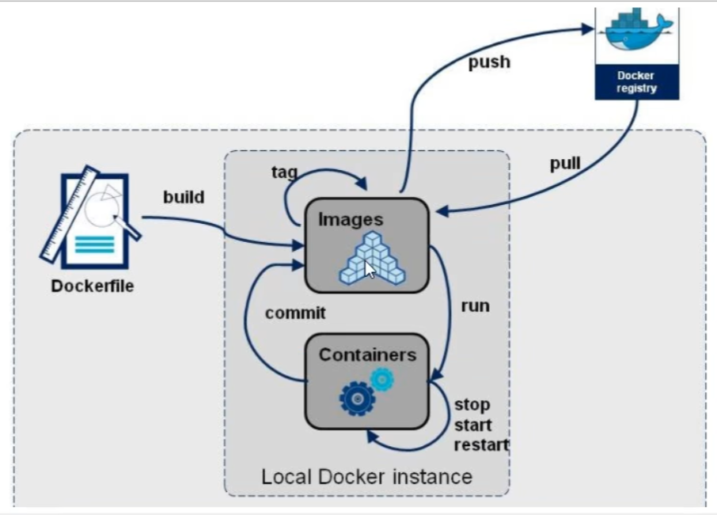

## 12.2 dockerfile编写注意点  

+ 每条命令都必须为**大写字母且后面要跟随至少一个参数**
+ 指令按照从上到下,顺序执行
+ `#`表示注释
+ 每条指令都会创建一个新的镜像层并对镜像进行提交

## 12.3 docker构建镜像的流程

+ docker从基础镜像运行一个容器
+ 执行一个指令并对容器做出修改
+ 执行类似于`docker commit`的操作,提交一个新的镜像层
+ docker再基于刚提交的镜像运行一个新容器
+ 执行dockerfile中的下一个指令...直到所有指令都执行完成

## 12.3 dockerfile指令

tomcat参考dockerfile  [tomcat/11.0/jdk21/temurin-jammy/Dockerfile at d65af72b3d4c6593b177e3659d890c24443954fa · docker-library/tomcat (github.com)](https://github.com/docker-library/tomcat/blob/d65af72b3d4c6593b177e3659d890c24443954fa/11.0/jdk21/temurin-jammy/Dockerfile)

| 指令          | 含义                                                         |
| ------------- | ------------------------------------------------------------ |
| `ADD`         | 将文件 ,目录或远程URL复制到image中                           |
| `ARG`         | 定义在构建过程中**传递给构建器的变量**,可以使用`docker build`命令设置 |
| `CMD`         | 指定容器创建时的默认指令<br /> (会被`docker run`中参数覆盖 <br />(**dockerfile中多个CMD命令都会执行**) |
| `COPY`        | 复制文件和目录到image中                                      |
| `ENTRYPOINT`  | 设置容器创建时的主要命令 <br />(不会被`docker run`中参数覆盖,且其命令行参数会被当成参数传递给`ENTRYPOINT`指令指定的程序)<br />(**dockerfile中多个ENTRYPOINT命令都会执行**) |
| `ENV`         | 设置容器内部环境变量<br />`build`阶段 也可以使用             |
| `EXPOSE`      | 容器向外暴露的端口,固定死了端口,<br />但是要指定`--net=host` |
| `FROM`*       | 一般出现在首行<br />表示来源/依赖的基础镜像                  |
| `HEALTHCHECK` | 定义周期性检查容器的健康状况                                 |
| `LABEL`       | 向image添加元数据<br />使用键值对形式                        |
| `MAINTAINER`* | 表示镜像的维护者/作者<br />可以留下名字或联系方式            |
| `ONBUILD`     | 当该image被当作另一个构建过程的基础时,添加触发器<br />(就是**该镜像被`FROM`**) |
| `RUN`*        | 容器build阶段需要执行的命令,有两种运行方式                   |
| `SHELL`       | 设置镜像的shell, 用于运行RUN,CMD和ENTRYPOINT指令<br />会覆盖容器默认的shell |
| `STOPSIGNAL`  | 设置发送给**容器以退出**的系统调用**信号**                   |
| `USER`        | 设置后续指令的用户上下文<br />不指定默认为root               |
| `VOLUME`      | 为容器创建挂载点或声明卷,数据备份兜底存放地方,<br />`dcoker run`时不知道,默认还是在`/var/lib/docker/volumes`<br />可以使用`docker inspect 容器id`查看挂载点 |
| `WORKDIR`     | 设置**后续指令的工作目录**<br />当运行成容器时,把他切到前台模式的默认目录也是该目录 |

## 12.4 详解常用指令

### 12.4.1 `RUN`

容器build阶段需要执行的命令,有两种运行方式

+ `shell`方式 直接运行shell命令

  ```bash
  # 终端中的shell命令
  RUN shell命令 && shell命令2
  ```

+ `exec`方式,必须是"双引号

  ```bash
  # 执行的shell取决于定义的SHELL指令
  RUN ["调用命令","参数1","参数2",...]
  # RUN ["./test.php","dev","offline"]等同于 RUN ./test.php dev offline
  # RUN ["/bin/bash","-c","echo hello"]等同于 RUN echo hello  其中-c为bash参数
  ```


### 12.4.2 `CMD`

指定容器创建时的默认指令, 会被`docker run`中参数覆盖 即:

​	手动运行容器命令`docker run -it xxx  /bin/bash`覆盖(追加)了dockerfile中`CMD ["catalina.sh","run"]`cmd参数被替换为/bin/bash

**多个CMD命令都会执行**

> + `RUN`是在`docker build`阶段执行
> + `CMD`在`docker run`阶段执行
> + `ENTRYPOINT`也是在`docker run`阶段执行

### 12.4.3 `ENTRYPOINT`

设置容器创建时的主要命令

不会被`docker run`中参数覆盖,且其**命令行参数会被当成参数传递给ENTRYPOINT指令指定的程序(如类似于docker本身的--net host)**

**多个ENTRYPOINT命令仅最后一个生效**

> 当dockerfile同时指定`CMD`和`ENTRYPOINT`指令,那么`CMD`指令将不会运行,而是会当成**参数传递给`EMTRYPOINT`指令,二者结合变为`ENTRYPOINT CMD`**
>

举例:

```bash
#dockerfile内容 
FROM nginx
ENTRYPOINT ["nginx","-c"]
CMD ["/etc/nginx/nginx.conf"]
```

+ 执行`docker run -it xxx(上面dockerfile生成的镜像) `实际执行的就是`nginx -c /etc/nginx/nginx.conf`
+ 执行`docker run -it xxx /nginx/nginx.conf`实际执行的就是`nginx -c /nginx/nginx.conf` (cmd参数覆盖,仅最后一个生效)

## 12.5 构建镜像

`docker build --progress plain -t xxx:xxx . `

+ `--progress plain` 输出构建过程详细信息

+ `-t xxx:xxx` 构建的镜像名称及tag

+ `.` 指镜像构建时打包上传到Docker引擎中的文件的目录(就是需要复制到docker中的文件所在目录)

  流程是: 

  + 指定dockerfile文件 `-f`,默认就是当前目录下名字为`Dockerfile`的文件
  + 需要将dockerfile中需要的文件拷贝到docker daemon中, `.`就代表目录(当然你也可以用绝对路径,但是前往不要用`/`根目录这些,不然文件太多了,撑死docker)
  + dockerfile中指令在daemon中一个个执行,最终生成镜像

## 12.6 虚悬镜像

虚悬镜像(dangling imgae):**仓库名和标签都是<none>的镜像**

> 一般都是`build`出现问题的,一般都最好删掉重新构建

```bash
# 筛选虚悬镜像
sudo docker images -f dangling=true
# 删除未使用的镜像(删除虚悬镜像)
sudo docker image prune
```

# 13. docker网络

[Networking overview | Docker Docs](https://docs.docker.com/network/)

## 13.0 虚拟机网络

宿主机`ifconfig`可以看到有三类:

+ `ens33` : 默认的网卡名称,centos虚拟机使用的网卡
+ `lo`: 回环接口 `loopback`,用于检测网络自身服务
+ `virbr0`: 虚拟网桥`virtual bridge`,作用是连接其上的虚拟网卡提供NAT访问外网,centos下默认地址为`192.168.122.1`
+ **`docker0`**: docker容器使用的网络接口 (**启动docker daemon就会存在**),

> `docker0`虚拟网卡作用: 
>
> + 容器间的互联和通信以及端口映射
> + 容器ip变动时候可以通过**服务名**直接网络童通信而不受影响
>
> ***Docker容器间的网络隔离,是通过Linux内核特性`namespace`和`cgroup`实现的***

## 13.1 docker网络命令

+ `docker network --help` 查看docker网络相关命令
+ `docker network connect` 将容器连接到指定网络
+ `docker network disconnect` 将容器从指定网络上断开连接
+ `docker network create` 创建网络(**底层默认就是bridge模式**)
+ `docker network inspect` 查看指定网络的详细信息
+ `docker network ls` 查看已存在的所有网络配置
+ `docker network prune` 删除未使用的docker网络
+ `docker network rm` 删除指定的docker网络

## 13.2 docker五大网络模式

默认情况下docker网络有三种模式:`bridge`,`host`,`none`.实际使用有五种形式网络:

| 网络模式    | 简介                                                         | 使用方式                           |
| ----------- | ------------------------------------------------------------ | ---------------------------------- |
| `bridge`    | 为每一个容器分配,设置ip等网络信息,并将容器连接到一个`docker0`虚拟网桥,**不加默认网络就是该模式** | `--network bridge`                 |
| `host`      | 容器将不会虚拟出自己的网卡,ip等网络信息,而是使用**宿主机的网络信息(IP和端口)**<br />再指定端口就失效了 | `--network host`                   |
| `none`      | 容器有独立的NetworkNamespace, 但是并没有对其进行任何的网络设置,如分配虚拟网卡`veth` | `--network none`                   |
| `container` | 新创建的容器不会创建自己的网卡和配置自己的ip,而是**和一个指定的容器共享IP,和端口范围** | `--network container:name或容器id` |
| `自定义 `   | 通过`docker network create`创建自定义网络(底层依旧是`bridge`).为了解决容器IP变动问题,**直接使用容器名进行通信** | `--network 自定义网络名`           |

> `apt update`失败
>
> ```bash
> # 备份源文件
> cp /etc/apt/sources.list /etc/apt/sources.list.bak
> # 更改镜像源
> cat <<EOF >/etc/apt/sources.list
> deb http://mirrors.ustc.edu.cn/debian stable main contrib non-free
> deb http://mirrors.ustc.edu.cn/debian stable-updates main contrib non-free
> EOF
> 
> #安装ipaddr
> apt install -y iproute2
> 
> #安装ifconfig
> apt install -y net-tools
> 
> #安装ping
> apt install -y iputils-ping
> ```

## 13.3  `bridge`模式

Docker使用Linux桥接,在宿主机虚拟一个Docker容器网桥(`docker0`),默认给所有使用`bridge`网络模式的容器使用.

Docker启动一个容器时会根据`docker0` 的网段顺序分配给容器ip地址,成为`Container-IP`,则`docker0`就是每个容器的默认网关.又因为在同一宿主机内的容器接入同一网桥,这样容器之前就可以通过`Container-IP`直接通信(**eth0-veth-veth-eth0**)

**`docker run`时如果没有指定`--network`的话:容器默认网卡采用的就是`bridge`模式**

网卡`docker0`创建一对对对等虚拟设备接口,宿主机端内部为`veth`,容器端内部为`eth`.(其实就是宿主机的虚拟网卡对应容器的网卡)


> 宿主机端
>
> ```bash
> 28: veth02a9e0e@if27: <BROADCAST,MULTICAST,UP,LOWER_UP> mtu 1500 qdisc noqueue master br-d1e2df319cec state UP group default 
> ```
>
> 容器端
>
> ```bash
> 27: eth0@if28: <BROADCAST,MULTICAST,UP,LOWER_UP> mtu 1500 qdisc noqueue state UP group default
> ```
>
> `ip addr`查看 ,可以看出双方一一对应

## 13.4 `host`模式

直接使用宿主机的IP地址和端口(**此模式下指定端口映射也会失效**)与外界通信,不再需要额外NAT转换

此模式下容器将不会获得一个独立的Network Namespace,而是和宿主机共享Network Namespace.

容器不会虚拟出自己的网卡,而是直接使用宿主机的


> `ip addr`宿主机和容器执行结果二者完全一样

## 13.5 `none`模式

表示禁用网络功能,容器中也就不会创建对应的网卡信息只有`lo`即loopback信息

## 13.6 `container`模式

**新建立的容器和一个依旧运行的容器共享网络IP配置**,而不是和宿主机共享.但是其他的如进程,文件系统依旧时隔离的


> + 如果**基类网络容器宕机了**,瘫痪了,那么**基于其基础上的其他容器实例的网络都over**了
> + 此模式下各个容器如果**占用相同的端口,会导致后续容器无法正常启动**
>
> `ip addr`可以发现两个容器的输出信息完全一样

## 13.7 自定义网络模式

主要使用用于解决容器ip地址会发生变化,导致ip通信不可靠.

比如`bridge`下模式容器tomcat81的ip为172.17.0.2,tomcat82的ip为172.17.0.3,如果tomcat82宕机了,新启动一个容器如redis79,那么此时该容器redis79的ip地址就是172.17.0.3.所以本来tomcat81和tomcat82间的通信就转到容器redis79上了,所以容器中使用ip地址不可靠.

**自定义网络模式通过指定容器连接到共同的网络名,那么连接到该网络下的容器实例都可以通过容器实例名或id进行通信**

+ `docker network create 你的网络名`  底层还是`bridge`网络模式
+ `docker run -d --name tomcat81 -p 8081:8080 --network 你的网络名 tomcat:latest`
+ `docker run -d --name tomcat82 -p 8082:8080 --network 你的网络名 tomcat:latest`

这样两个容器不仅映射到宿主机的8001和8002端口,且容器间可以通过**容器实例名或id**进行通信

> `ip addr`执行结果显示两个容器在同一网段,但是ip地址不同

## 13.8 `--link`

容器A连接到容器B服务的方式

```bash
# 启动一台mysql容器
# --name 为容器指定一个别名
docker run --name mysql-matomo -p 3308:3306 -e MYSQL_ROOT_PASSWORD=root -d mysql:8.0.28

# 启动另一个容器，通过--link连接到mysql容器
# --link 容器名称:本容器连接对方时的别名
docker run -d -p 8888:80 --link mysql-matomo:db --name matomo matomo:4.9.0

# 此时，在matomo容器中，便可以通过 db 这个hostname连接到mysql-matomo容器，而无须再通过ip
# 连接地址：db:3306
```

> 已弃用

# 14. Compose容器编排

[Docker Compose overview | Docker Docs](https://docs.docker.com/compose/)

## 14.0 简介

Compose是Docker推出的一个工具软件,可以管理多个Docker容器组成一个应用.你需要定义一个YAML格式的配置文件`docker-compose.yaml`,**写好多个容器之间的调用关系**.然后,只要一个命令,就能同时启动/关闭这些容器.

## 14.1 安装compose

新版本docker自带`compose`,对于老版本单独安装指南:

[Install the Compose plugin | Docker Docs](https://docs.docker.com/compose/install/linux/#install-using-the-repository)

```bash
# 检测是否成功安装
[ly@localhost ~]$ sudo docker compose version
Docker Compose version v2.25.0
```

## 14.2 卸载compose

[Uninstall Docker Compose | Docker Docs](https://docs.docker.com/compose/install/uninstall/)

## 14.3 compose核心概念

+ 一个文件

  这个文件指的就是`docker-compose.yaml`文件 

+ 两个要素

  + **服务(service)**  指一个个容器应用实例
  + **工程(project)**  由一组关联的应用容器组成的一个完整业务单元,在`docker-compose.yaml`文件中定义

## 14.4 compose使用

+ 编写Dockerfile定义各个微服务应用并构建出对应的镜像文件
+ 使用`docker-compose.yaml`定义**一个完整业务单元**,安排好整体应用中的各个容器服务
+ 最后,执行`sudo docker compose up`命令,来启动并运行整个应用程序,完成一键部署上线

## 14.5 docker-compose.yaml编写

[Overview | Docker Docs](https://docs.docker.com/compose/compose-file/)

### 14.5.1 mysql容器实例

```bash
sudo docker run -d -p 3306:3306 -e MYSQL_ROOT_PASSWORD=123456  \
--privileged=true -v /home/ly/docker/mysql/etc/mysql:/etc/mysql/ \
-v /home/ly/docker/mysql/data/:/var/lib/mysql/ \
-v /home/ly/docker/mysql/mysql-files/:/var/lib/mysql-files/ \
-v /home/ly/docker/mysql/logs/:/var/log/mysql/ \
-v /usr/share/zoneinfo/Asia/Shanghai:/etc/localtime \
-v /home/ly/docker/mysql/init.sql:/etc/mysql/init.sql \
--name=mysql_demo mysql:latest 
&& \
# 执行初始化sql
sudo docker exec -i mysql_demo mysql -uroot -p123456 < init.sql
```

> init.sql
>
> ```sql
> CREATE DATABASE docker_test;
>  
> USE `docker_test`;
>  
> DROP TABLE IF EXISTS `user`;
>  
> CREATE TABLE `user` (
>   `id` bigint NOT NULL AUTO_INCREMENT COMMENT '用户主键',
>   `name` varchar(20) DEFAULT NULL COMMENT '用户名字',
>   `passwd` varchar(255) DEFAULT NULL COMMENT '用户密码',
>   `age` int DEFAULT NULL COMMENT '用户年龄',
>   `version` int DEFAULT '1' COMMENT '乐观锁',
>   `deleted` int DEFAULT '0' COMMENT '逻辑删除',
>   `create_time` datetime DEFAULT NULL COMMENT '创建时间',
>   `update_time` datetime DEFAULT NULL COMMENT '更新时间',
>   PRIMARY KEY (`id`)
> ) ENGINE=InnoDB DEFAULT CHARSET=utf8 COLLATE=utf8_general_ci
> ```
>
> 

### 14.5.2 redis容器实例

```bash
sudo docker run -d --name redis_demo -p 6389:6389 \
-v /home/ly/docker/redis/data:/data \
--privileged=true redis:latest  \
--appendonly yes
```

### 14.5.3 服务Dockerfile

服务器请求地址: http://127.0.0.1:8080/docker/swagger-ui/index.html

```bash
FROM openjdk:17-jdk-slim
MAINTAINER ly
WORKDIR /app/docker_demo
ENV TIMEZONE Asia/Shanghai
RUN ln -snf /usr/share/zoneinfo/$TIMEZONE /etc/localtime && echo $TIMEZONE > /etc/timezone
COPY . .
CMD ["sh","-c","java -jar docker_demo-0.0.1-SNAPSHOT.jar"]
```

### 14.5.4 docker-compose.yml文件

其实就是将上面的启动命令整合起来

```yml
name: docker-compose-demo
services:
  app:
    image: docker_demo_service:v2
    container_name: docker_demo_service
    ports:
      - "8080:8080"
    volumes:
      - /home/ly/docker/service/logs:/app/docker_demo/logs
    # 指定连接网络,为了使用服务名通信 (java程序中用)
    networks: 
      - mynetwork_demo
    depends_on:
      mysql:
        restart: true
        # 需要在mysql中配置healthcheck ,这样形式condition必写
        condition: service_healthy
        required: true
      redis: 
        restart: true
        # 需要在redis中配置healthcheck,这样形式condition必写
        condition: service_healthy
        required: true
  #服务名,在指定同一网络中可以是使用该mysql代替其ip (java程序中用)
  mysql:
    image: mysql:latest
    ports:
      - "3306:3306"
    environment:
      MYSQL_ROOT_PASSWORD: 123456
    volumes:
      - /home/ly/docker/mysql/etc/mysql:/etc/mysql/
      - /home/ly/docker/mysql/data/:/var/lib/mysql/
      - /home/ly/docker/mysql/mysql-files/:/var/lib/mysql-files/
      - /home/ly/docker/mysql/logs/:/var/log/mysql/
      - /usr/share/zoneinfo/Asia/Shanghai:/etc/localtime
      - /home/ly/docker/mysql/init.sql:/etc/mysql/init.sql
    # 不能直接拼接 自己的初始化命令(思考如何单独执行?除了自定义dockerfile)
    # --default-authentication-plugin=mysql_native_password 开启远程密码连接,也可以配置在my.cnf中
    #command: ["--default-authentication-plugin=mysql_native_password","&&","mysql","-uroot","-p123456","<","init.sql"]
    networks: 
      - mynetwork_demo
  #服务名,在指定同一网络中可以是使用该redis代替其ip(java程序中用) (java程序中用)
  redis:
    image: redis:latest
    ports:
      - "6379:6379"
    volumes:
      - /home/ly/docker/redis/data:/data
    command: "--appendonly yes"
    # 指定连接网络,为了使用服务名通信
    networks: 
      - mynetwork_demo


# 自定义网络,没有就会创建
networks:
  mynetwork_demo: 
    driver: bridge
```

### 14.5.5  compose启动

```bash
[ly@localhost docker]$ sudo docker compose up -d --force-recreate --always-recreate-deps
[+] Running 3/3
 ✔ Container docker-compose-demo-redis-1  Started                                                                                                                                                          0.4s 
 ✔ Container docker-compose-demo-mysql-1  Started                                                                                                                                                          0.4s 
 ✔ Container docker_demo_service          Started   
```

> 新的数据库没有初始化,需要手动执行
>
> `sudo docker exec -i docker-compose-demo-mysql-1 mysql -uroot -p123456 < init.sql`

查看容器状态:

```bash
[ly@localhost docker]$ sudo docker ps -a
CONTAINER ID   IMAGE                    COMMAND                  CREATED         STATUS                     PORTS                                                  NAMES
1a25dced4fec   docker_demo_service:v2   "sh -c 'java -jar do…"   7 minutes ago   Up 7 minutes               0.0.0.0:8080->8080/tcp, :::8080->8080/tcp              docker_demo_service
56ff31c44bc4   redis:latest             "docker-entrypoint.s…"   7 minutes ago   Up 7 minutes               0.0.0.0:6379->6379/tcp, :::6379->6379/tcp              docker-compose-demo-redis-1
2669410a1b37   mysql:latest             "docker-entrypoint.s…"   7 minutes ago   Up 7 minutes               0.0.0.0:3306->3306/tcp, :::3306->3306/tcp, 33060/tcp   docker-compose-demo-mysql-1
```

> 发现 容器实例的名字如果没有指定默认就是**yml中项目名-yml服务名-序号**,如果**yml没有定义项目名那么就是执行compsoe当前目录名-yml服务名-序号**

查看网络:

```bash
[ly@localhost docker]$ sudo docker network ls
NETWORK ID     NAME                                 DRIVER    SCOPE
3c6806841ff4   docker-compose-demo_mynetwork_demo   bridge    local
```

> 发现**自动创建了yml中我们定义的网络(如果不存在)**,且**命名规则和容器名字的完全一样**
>
> + **yml中项目名-yml指定网络名**
> + 或**执行compose所在目录名-yml指定网络名**

## 14.6 compose命令

可以使用`ocker compose --help`查看,大多数和`docker --help`差不多,**不同的地方在于`compose`中命令都是针对一组容器即服务进行的,`docker`都是针对单个容器或镜像**

下面说几个特殊的:

+ `docker compose config` 检查`docker-compose.yml`文件语法有没有问题,类似于`nginx -t`
  + `-q` 简介模式,没有输出就是正确的
+ `docker compose up` 根据`docker-compose.yml`创建并启动容器
  + `-d` 后台启动服务
  + `--always-recreate-deps` 总是重新创建依赖的容器
  + `--force-recreate` 强制创建容器尽管配置文件和镜像都没发送变化
+ `docker compsoe down` 停止并删除所有容器,网络,卷,镜像
+ `docker compose stop` 在`docker-compose.yml`所在目录执行,就是停止该服务(一组容器)
+ `docker compose start`在`docker-compose.yml`所在目录执行,就是启动该服务(一组容器)
+ `docker compose ls` 列出正在运行的所有服务(一组容器)
  + `-a` 列出所有服务
+ `docker compose exec 服务名 命令` 服务名指的`docker-compose.yml`中配置的服务名
+ `docker compose ps` 显示当前`docker-compose.yml`中配置的运行过的所有容器
+ `docker compose top` 显示当前`docker-compose.yml`中配置的运行过的容器进程

> `docker compose`启动一组服务默认会自动创建该组服务共用的网络,为了让各个服务间通信更简单(**可以使用服务名代替ip**)

# 15. docker轻量级可视化工具portainer

复杂集群推荐使用k8s

官网: [Kubernetes and Docker Container Management Software (portainer.io)](https://www.portainer.io/)

## 15.1 安装portainer

[Install Portainer CE with Docker on Linux | 2.19 | Portainer Documentation](https://docs.portainer.io/start/install-ce/server/docker/linux)

```bash
#创建映射卷
docker volume create portainer_data
#启动服务
docker run -d -p 8000:8000 -p 9443:9443 --name portainer --restart=always -v /var/run/docker.sock:/var/run/docker.sock -v portainer_data:/data portainer/portainer-ce:latest
# 检查服务是否成功启动
docker ps 
```

访问网址: https://localhost:9443

# 16. CIG重量级监控

## 16.0 引入

`docker stats` 查看容器系统资源使用状态,但是是实时的,无法统计

portainer服务监控的数据又无法满足

## 16.1 简介

***CIG即***: 

+ `cAdvisor`  CAdvisor是一个容器资源监控工具，包括容器的内存、CPU、网络IO、磁盘IO等监控，同时提供了一个Web页面用于查看容器的实时运行状态。

  CAdvisor默认存储2分钟的数据，而且只是针对单物理机。不过CAdvisor提供了很多数据集成接口，支持 InfluxDB、Redis、Kafka、Elasticsearch等集成，可以加上对应配置将监控数据发往这些数据库存储起来。

  CAdvisor主要功能：

  - 展示Host和容器两个层次的监控数据

  - 展示历史变化数据

+ `InfluxDB` InfluxDB是用Go语言编写的一个开源分布式时序、事件和指标数据库，无需外部依赖。

  CAdvisor默认只在本机保存2分钟的数据，为了持久化存储数据和统一收集展示监控数据，需要将数据存储到InfluxDB中。InfluxDB是一个时序数据库，专门用于存储时序相关数据，很适合存储 CAdvisor 的数据。而且 CAdvisor本身已经提供了InfluxDB的集成方法，在启动容器时指定配置即可。

  InfluxDB主要功能：

  - 基于时间序列，支持与时间有关的相关函数（如最大、最小、求和等）

  - 可度量性，可以实时对大量数据进行计算

  - 基于事件，支持任意的事件数据

+ `Grafana `Grafana是一个开源的数据监控分析可视化平台，支持多种数据源配置（支持的数据源包括InfluxDB、MySQL、Elasticsearch、OpenTSDB、Graphite等）和丰富的插件及模板功能，支持图表权限控制和报警。

  Granfana主要功能：

  - 灵活丰富的图形化选项

  - 可以混合多种风格

  - 支持白天和夜间模式

  - 多个数据源

## 16.2 安装部署

+ 创建目录 `/app/cig`

+ 编写`docker-compose.yml`文件
  ```yml
  version: '3.1'
  
  volumes:
    #创建全局服务映射卷,会自动创建到 /var/lib/docker/volume下
    grafana_data: {}
  
  services:
    influxdb:
  	# tutum/influxdb 相比influxdb多了web可视化视图。但是该镜像已被标记为已过时
      image: tutum/influxdb:0.9
      restart: always #根据docker服务启动而启动
      environment:
        - PRE_CREATE_DB=cadvisor #提前创建的数据库名称
      ports:
        - "8083:8083"         # 数据库web可视化页面端口
        - "8086:8086"         # 数据库端口
      volumes:
        - ./data/influxdb:/data
  
    cadvisor:
      image: google/cadvisor:v0.32.0
      links:
        - influxdb:influxsrv
      command:
        - -storage_driver=influxdb
        - -storage_driver_db=cadvisor
        # docker compose默认会自动创建网络给该yml文件中所有服务使用
        - -storage_driver_host=influxsrv:8086  #直接使用服务名代替ip
      restart: always
      ports:
        - "8080:8080"
      volumes:
        - /:/rootfs:ro
        - /var/run:/var/run:rw
        - /sys:/sys:ro
        - /var/lib/docker/:/var/lib/docker:ro
  
    grafana:
      image: grafana/grafana:8.5.2
      user: '104'
      restart: always
      links:
        - influxdb:influxsrv #指定连接到服务
      ports:
        - "3000:3000"
      volumes:
        - grafana_data:/var/lib/grafana
      environment:
        - HTTP_USER=admin
        - HTTP_PASS=admin
        - INFLUXDB_HOST=influxsrv
        - INFLUXDB_PORT=8086
  ```

  > 运行提示有问题,去掉`version`和每个镜像后面的`tag`即可
  >
  > 当然也可以自己去官网找最新的命令

+ 运行服务

  ```bash
  docker compose config -q
  docker compose up -d
  ```

+ 访问地址

  + `ip:8083 `访问influxdb网页版

    

  + `ip:8080` 访问cadvisor网页版,第一次访问 很慢

    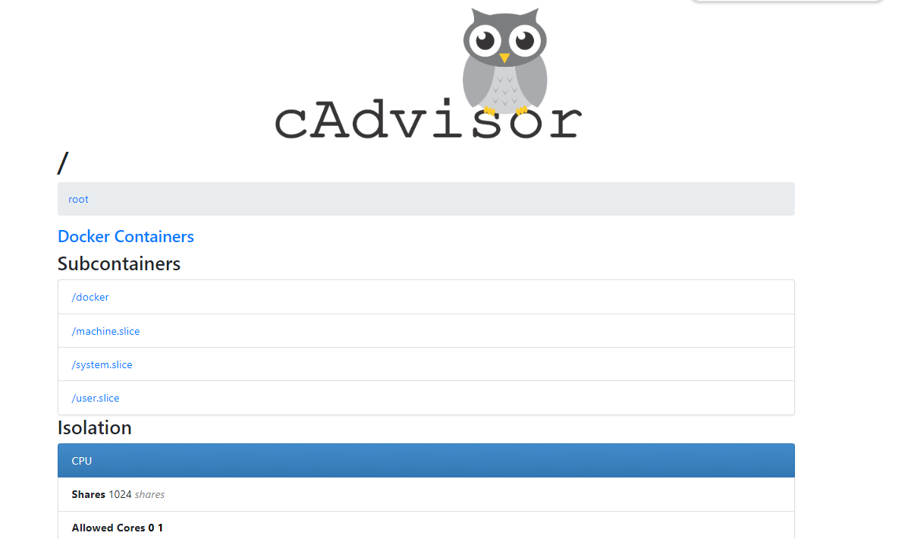

  + `ip:3000` 访问grafana网页版 账户密码自己看`docker-compose.yml`文件

    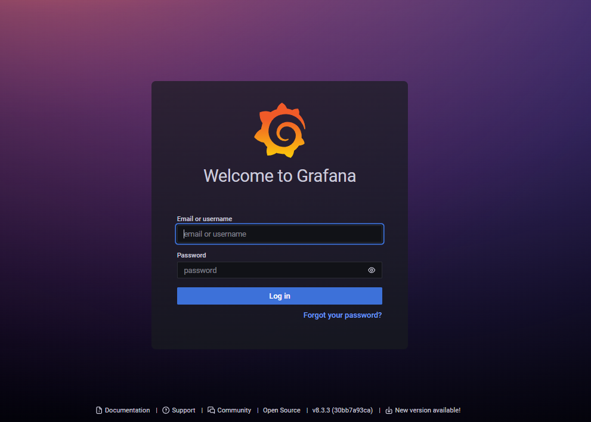

## 16.3 Grafana需要配置数据源

+ 访问`http://grafana服务ip:3000/datasources`
+ 选中influxdb
+ 服务名随意
+ 写入fluxdb地址`influxdb:8086`,这里的`influxdb`为`docker-compose.yml`配置的influxdb服务(使用了docker网络代替ip)
+ 写入fluxdb数据库名称`cadvisor`,也是`docker-compsoe.yml`中启动fluxdb提前创建的数据库名称(可以访问`http://fluxdb:8083`执行`show databases`查看所有数据库)
+ 写入fluxdb数据库账户密码吗,默认均为`root`,你也可在`docker-compsoe.yml`中指定
+ 测试连接即可

## 16.4 Grafana创建dashboard面板

下面是实例,具体自己点点就知道了


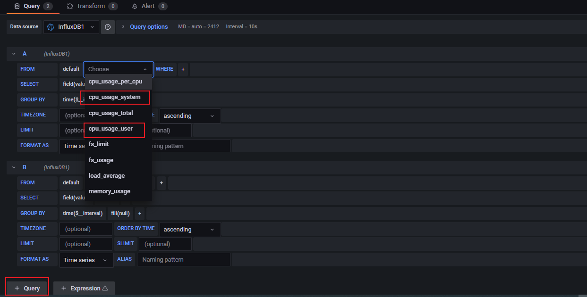

# 17. docker命令

+ `docker update 容器`更新容器配置信息如`--restart=no`
