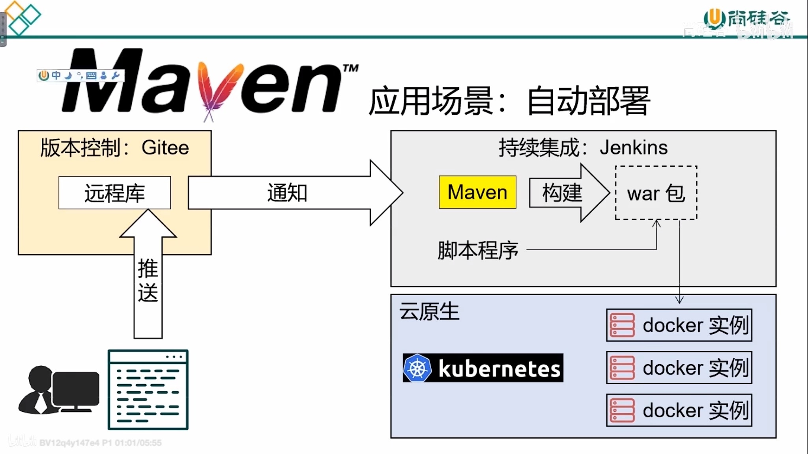
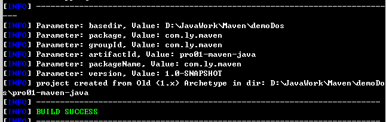
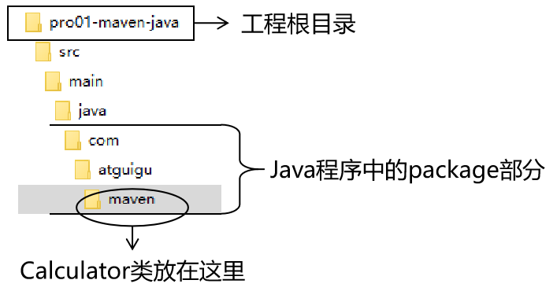
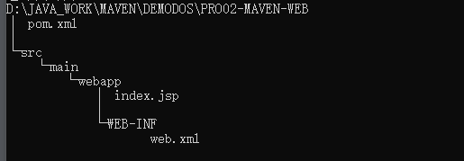
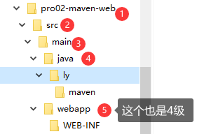
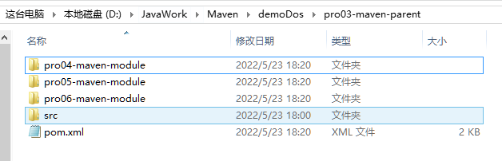

# Maven的应用场景



# Maven的作用

+ Maven可以作为jar包依赖管理工具
+ Maven作为构建管理工具

# Maven的工作机制


# Maven核心程序解压和配置

## 1、Maven核心程序解压与配置

+ 打开官网：[Maven – Download Apache Maven](https://maven.apache.org/download.cgi) 下载3.8.5版本jar包（如果有需要可以下载源码） 

+ 解压放到任意目录 `conf/settings.xml文件是Maven的核心配置文件.`

+ 配置settings.xml文件 配置本地仓库

  ```xml
  <!-- settings.xml配置文件解析-->
  <!-- localRepository代表Maven的本地仓库 默认值是Default: ${user.home}/.m2/repository 其中${user.home}如果是Windows系统就是c:/user/用户名/.m2/repository  如果指定路径文件不存在Maven会自动创建-->
  <localRepository>D:/Maven/repository</localRepository>
  ```

+ 配置阿里云提供的镜像仓库 【即本地没有这个jar包是回去此远程仓库中下载，类似于linux的npm】，即放到mirrors标签的内部 ---直接复制，手写确实会错

  ```xml
  <!-- 注意区分 mirror和mirrors标签 mirror代表镜像可以有多个-->
  <mirror>
  	<id>nexus-aliyun</id>
  	<mirrorOf>central</mirrorOf> <!--表示中央仓库镜像-->
  	<name>Nexus aliyun</name>
  	<url>http://maven.aliyun.com/nexus/content/groups/public</url>
  </mirror>
  ```

+ 配置Maven工程的基础JDK版本，因为默认是jdk1.5的，可以配成默认jdk1.8

  ```xml
  <!-- 放在profiles标签内，和mirror需要有个profile标签-->
  <profile>
  	<id>jdk-1.8</id>
  	<activation>
  		<activeByDefault>true</activeByDefault>
  		<jdk>1.8</jdk>
  	</activation>
  	<properties>
  		<maven.compiler.source>1.8</maven.compiler.source>
  		<maven.compiler.target>1.8</maven.compiler.target>
  		<maven.compiler.compilerVersion>1.8</maven.compiler.compilerVersion>
  	</properties>
  </profile>
  ```

## 2、配置Maven的环境变量

+ 配置Java环境变量，保证三个都有输出

  ```bash
  java -version;
  echo %JAVA_HOME%;
  echo %PATH%;
  ```

+ 配置MAVEN_HOME环境变量（通常指向bin目录的上一级）

  ```bash
  MAVEN_HOME = D:\Maven\apache-maven-3.8.5 #通常为bin目录的上一级
  ```

+ 配置PATH，将MAVEN_HOME加到PATH路径下

  ```bash
  PATH末尾追加：%MAVEN_HOME%/bin
  ```

+ 验证Maven环境变量，dos窗口下输入：`mvn -v`能看到版本号就ok了

# 使用Maven（dos命令行环境）

## 	1、Maven中的坐标

### 1.1、类似于数学坐标系，Maven中定位某个jar包也是使用三个向量：

+ `groupId` 公司或者组织的id
+ `artifactId` 一个项目或者是一个项目中的某一个模块的id（一般为项目中的模块/工程的id）
+ `version` 版本号

### 1.2、Maven三个向量的取值方式：

+ `groupId`：公司或者组织域名的倒序，通常也会加上项目名称

  例如：com.lxcl96.BookStore

+ `artifactid`：模块的名称，将来作为Maven工程的工程名

+ `version`：模块的版本号，自己设定

  例如：SNAPSHOT 快照 表示正在迭代，不稳定的版本

  ​			RELEASE 表示正式版本

举例：

groupId：com.ly.maven

artifactId：pro01-maven-java //工程名

version：1.0-SNAPSHOT

### 1.3、坐标和仓库中jar包的存储路径之间的对应关系

jar的jar包：

```xml
<groupId>javax.servlet</groupId>
<artifactId>servlet-api</artifactId>
<version>2.5</version>
```

则该坐标对应的 jar 包在 Maven本地仓库中的位置为：

> Maven本地仓库目录\javax\servlet\servlet-api\2.5\servlet-api-2.5.jar

## 2、实验操作

### 2.1、创建目录作为后面操作的工作空间

例如：D:\JavaWork\Maven\demoDos

说明：此时已经有三个目录了

+ Maven核心程序：D:\Maven\apache-maven-3.8.5
+ Maven本地仓库：D:\Maven\repository
+ Maven本地工作空间：D:\JavaWork\Maven\demoDos

### 2.2、使用命令生成Maven工程

`mvn archetype:generate`创建工程，同时 输入groupId,artifactId,和version

```
TIP

Choose a number or apply filter (format: [groupId:]artifactId, case sensitive contains): 7:【直接回车，使用默认值】

Define value for property 'groupId': com.atguigu.maven

Define value for property 'artifactId': pro01-maven-java

Define value for property 'version' 1.0-SNAPSHOT: :【直接回车，使用默认值】

Define value for property 'package' com.atguigu.maven: :【直接回车，使用默认值】

Confirm properties configuration: groupId: com.atguigu.maven artifactId: pro01-maven-java version: 1.0-SNAPSHOT package: com.atguigu.maven Y: :【直接回车，表示确认。如果前面有输入错误，想要重新输入，则输入 N 再回车。】
```

创建成功界面如下：



### 2.3、调整

Maven默认生成的工程，对JUnit依赖的是较低的3.8.1版本，我们可以改成合适的4.12版本

```xml
<!-- pom.xml文件中配置--> 
<dependencies>
    <dependency>
      <groupId>junit</groupId>
      <artifactId>junit</artifactId>
      <version>4.12</version>
      <scope>test</scope>
    </dependency>
  </dependencies>
```

自动生成的App.java和AppTest.java可以删除

### 2.4、pom.xml文件解析

```xml
<!-- 根标签：project 即工程，一个工程一个pom文件，表示对当前工程进行配置，管理-->
<project xmlns="http://maven.apache.org/POM/4.0.0" xmlns:xsi="http://www.w3.org/2001/XMLSchema-instance"
  xsi:schemaLocation="http://maven.apache.org/POM/4.0.0 http://maven.apache.org/xsd/maven-4.0.0.xsd">
  <!-- modelVersion是Maven 2开始固定就是4.0.0 代表当前pom.xml 所采用的标签结构-->
  <modelVersion>4.0.0</modelVersion>

  <!--gav坐标 -->
  <!-- 打包号的文件放到 D:\Maven\repository\com\ly\maven\pro01-maven-java\1.0-SNAPSHOT\pro01-maven-java-1.0-SNAPSHOT.jar路径下了-->
  <groupId>com.ly.maven</groupId> 
  <artifactId>pro01-maven-java</artifactId>
  <version>1.0-SNAPSHOT</version>
  <!-- packing标签 ：表示打包方式jar：表示是Java工程，war：表示是web工程，pom：说明这个工程是用来管理其他工程的工程-->
  <packaging>jar</packaging>

  <name>pro01-maven-java</name>
  <url>http://maven.apache.org</url>

  <!-- properties标签，表示可以在Maven中定义属性值。这个属性可以是Maven提供的，也可以是我们自己定义的-->
  <properties>
  <!-- 在构建过程中读取源码所读取的字符集-->
    <project.build.sourceEncoding>UTF-8</project.build.sourceEncoding>
  </properties>

<!-- 配置依赖信息-->
  <dependencies>
  <!-- dependency 标签：配置一个具体的依赖信息-->
    <dependency>
	<!-- 这就是一个坐标信息，即想要导入哪个jar包只要配置其坐标信息即可-->
      <groupId>junit</groupId>
      <artifactId>junit</artifactId>
      <version>4.12</version>
	  <!-- 表示当前依赖的生效范围，以src为根目录表示只在test目录下生效-->
      <scope>test</scope>
    </dependency>
  </dependencies>
</project>

```

### 2.5、Maven的核心概念：POM

#### (1)含义

POM：即Project Object Model项目对象模型。类似于浏览器DOM

#### (2)模型化思想

POM表示将工程抽象为一个模型，再用程序中的对象来描述这个模型。这样我们就可以用程序来管理象项目了。

#### (3)对应的配置文件

POM理念集中体现在Maven工程根目录下pom.xml这个配置文件。所有这个pom.xml文件就是Maven工程中的核心配置文件。其实学习Maven就是学习pom.xml如何配置。

### 2.6、Maven核心概念：约定的目录结构

#### （1）各个目录的作用 （这个是在超级pom中配置的）


#### （2）约定目录结构的意义

Maven为了能让构建过程能够尽可能自动化完成，所以必须约定目录结构的作用。更加方便

#### （3）约定大于配置

如果Maven没有自己进行配置，那么默认就会采用这种约定。

约定大于配置，配置大于编码。

# 实验二：在Maven工程中编写代码

## （1）主体程序 

新建的包类放在maven本地工作环境/src/main/java/com/ly下和maven目录同级别

如：在maven目录下创建Calculator文件



## （2）测试程序

和主体程序的位置一样，只是主目录main变成test

# 实验三：执行Maven的构建命令

## 1、要求

运行Maven中和构建操作相关的命令时，必须进入到pom.xml所在的目录（即Maven工程目录里）。如果没有在此目录，就执行Maven构建命令就会报错。错误信息如下：

```java
The goal you specified requires a project to execute but there is no POM in this directory
```

## 2、清理操作

```java
//删除Maven工程下的target目录（和pom文件同级）
mvn clean
```

## 3、编译操作 (target目录在根目录下，需要有代码，才会显示)

```java
//主体程序编译结果存放目录为： Maven工程路径/target/classes
mvn compile //主程序编译
    
//测试程序编译结构存放目录为：Maven工程路径/target/test-classes
mvn test-compile //测试程序编译
```

## 4、测试操作

```java
mvn test //测试报告存放目录为：target/surefire-reports
```

## 5、打包操作

```java
mvn package //打包的结果放在target目录下
```

## 6、安装命令

就是把打包好的jar/war包（包括对应的工程pom文件）放到Maven的本地仓库中 (***根据坐标一级一级去找***)

```java
mvn install
```

# 实验四：创建Maven版的Web工程

## 1、创建

创建Web工程需要额外的命令（注意jar工程下不能再创建war工程）：

```java
//固定的命令
mvn archetype:generate -D archetypeGroupId=org.apache.maven.archetypes -D archetypeArtifactId=maven-archetype-webapp -D archetypeVersion=1.4
```

然后在提示中输入：

`groupId：com.ly.maven`

`artifactId：pro02-maven-web`

`version：1.0-SNAPSHOT`

然后就会在项目工程下生成对于的pom.xml文件，对于的web工程目录结构图如下：




## 2、使用

### 2.1、创建一个servlet使用

首先dos窗口创建的web工程目录不全，需要自收到创建如：src/main/java/com/ly/maven



编写servlet类，在web.xml中配置访问路径

### 2.2、导入web工程依赖的jar包如servlet-api

可以去此网站：https://mvnrepository.com/查看程序的详细依赖，然后找到合适的，复制dependency依赖信息，复制到工程路径下的pom.xml文件中的dependencies标签下

### 2.3、打包

```java
mvn clean package install 
```

### 2.4、将war包放到tomcat下（webapps目录下）部署运行


# 实验五：让Web工程依赖Java工程

​	1、在第二个web项目的pom.xml文件中dependency标签内配置第一个Java项目坐标

```xml
<dependency>
    <!-- 通过被指定工程的坐标完成依赖-->
    <groupId>com.ly.maven</groupId>
    <artifactId>pro01-maven-java</artifactId>
    <version>1.0-SNAPSHOT</version>
    <!-- scope默认值就是compile，所以写不写都可以-->
    <scope>compile</scope>
</dependency>
```

​	2、在web工程中编写测试代码，方便使用被依赖的Java工程（自己创建的）

```java
//补充创建文件夹  web工程路径/src/test/java/com/ly/maven/
```

​	3、确认web工程的pom.xml中写明了依赖junit测试类

​	4、创建测试类，放在 `web工程路径/src/test/java/com/ly/maven/`目录下

​	5、在Web工程中执行命令

`因为Web工程中没有Calculator这个类，但是如果可以使用就说明依赖成功第一个Java工程中jar包`

```java
mvn test  //查看测试类是否成功运行
    
//如果打完包不带版本号  去掉pom.xml中的finalName标签
mvn package //打完包就可以看看war包内WEB-INF的lib目录下有没有将这个依赖Java工程jar包加入其内
    
mvn dependency:list //查看当前工程的所有依赖列表，包含我们自己的Java工程
mvn dependency:tree //树形结构列出层次依赖
```


# 实验六：测试依赖的范围

## 1、依赖的范围

标签的位置即：dependencies/dependency/scope

scope可选值：compile、test、provided、system、runtime、import

## 2、对比

即以compile/test/provided分别引入依赖 对这四个属性是否有效？（***下面均指引入依赖工程目录下***）

约定：

Java工程：pro01-maven-java==》被引入的工程

Web工程：pro02-maven-web ==》引入的工程

==下面是依赖类型为test的jar包，不是jar包中的test，jar中的test目总是录不会被包含的，因为你打包时就不包含==

|                 | 引入的工程main目录（空间） | 引入的工程test目录（空间） | 开发过程Idea是否有提示（时间） | 部署，即是否会被打入到war包中（时间） |
| :-------------- | -------------------------- | -------------------------- | ------------------------------ | ------------------------------------- |
| 依赖类型compile | 可用                       | 可用                       | 有                             | 会                                    |
| 依赖类型test    | 不可用                     | 可用                       | 有                             | 不会                                  |
| provided        | 可用                       | 可用                       | 有                             | 不会                                  |

> 例如：Java工程：pro01-maven-java引入到Web工程：pro02-maven-web中，scope=compile，我们要看的就是pro02-maven-web中main中代理是不是能用pro01-maven-java中代码？
>
> 如果能用就是有效，如果不能用就是无效


# 实验七：依赖传递性

## 1、概念

A依赖B，B依赖C，那么如果在A中没有配置依赖C，A中能不能直接使用C？

## 2、传递的原则

在A依赖B,B依赖C的前提下，A能不能直接使用C取决于B中对C的依赖程度为：compile/test/provided?

+ B依赖C使用的范围为compile时，A可以直接使用C
+ B依赖C使用的范围为test或provided时，A不可以直接使用C（如junit），因此只能在A中pom文件中自己配置C的依赖

==如果某个工程更新了pom中的依赖，则必须将这个工程重新打包安装。否则只是在本地的工作目录中而不是本地仓库，更别说中央仓库了。==

> 例如：工程C中更新了依赖，则必须将工程C mvn clean install 重新安装到本地仓库/中央仓库，这时A或者是依赖A的工程才能列出这个依赖(mvn dependency:list)


# 实验八：测试依赖的排除

如果A依赖B，B依赖C（1.0版本），并且A依赖D，D依赖C（2.0版本）这个时候如果需要的时2.0版本，防止开发时选错（或者两个版本的冲突），则需要在A的pom文件中排除掉B中的依赖C（1.0版本）。

## 配置方式

pom.xml文件中dependencies标签内加上exclusions标签，exclusions内部配置exclusion标签。和dependency和dependencies标签的关系一样。

***pro02-maven-webz工程中排除pro01-maven-java工程中的spring-core依赖***

==注意 是放在dependency标签内部，即引入依赖时同时排除==

==仅当前pom文件的工程有效果，对依赖的直接依赖不会有关系（因为没改它的pom文件）==

```xml
<dependency>
	<groupId>com.atguigu.maven</groupId>
	<artifactId>pro01-maven-java</artifactId>
	<version>1.0-SNAPSHOT</version>
	<scope>compile</scope>
	<!-- 使用excludes标签配置依赖的排除	-->
	<exclusions>
		<!-- 在exclude标签中配置一个具体的排除 -->
		<exclusion>
			<!-- 指定要排除的依赖的坐标（不需要写version） -->
			<groupId>commons-logging</groupId>
			<artifactId>commons-logging</artifactId>
		</exclusion>
	</exclusions>
</dependency>
```


# 实验九：继承

## 1、概念

Maven工程之间，工程A继承工程B

工程A：子工程

工程B：父工程

Maven继承本质上就是pom.xml文件的继承

## 2、作用

在父工程中统一管理项目中的依赖信息，具体来说就是管理依赖信息的版本


它的背景是：

+ 对一个比较大型的项目进行模块拆分
+ 一个project下面，创建很多个module
+ 每一个module都需要配置自己的依赖信息


它背后的需求是：

+ 在每一个module中维护各自的依赖信息很容易发生出入，不利于统一管理
+ 使用同一个框架内的不同jar包，他们应该是同一个版本，所以整个项目中使用的框架版本需要统一
+ 使用框架时所需要的jar包组合（或依赖信息组合）需要长时间的摸索和调试，最终才还能确定下来。希望这个依赖信息也能在新项目中继续使用，就需要保存下来。

通过在父工程中为整个项目维护依赖信息的组合既**保证了整个项目使用规范、准确的 jar 包**；又能够将**以往的经验沉淀**下来，节约时间和精力

## 2、操作

### 2.1、创建父工程（一般是不写代码的，仅仅作为配置）

创建一个Java工程：

`groupId:com.ly.maven`

`artifactId:pro03-maven-parent`

`version:1.0-SNAPSHOT`

创建完成后，修改父工程的打包方式为：==pom==，为了给子工程继承

```xml
<groupId>com.ly.maven</groupId>
<artifactId>pro03-maven-parent</artifactId>
<version>1.0-SNAPSHOT</version>
<!-- 只有打包方式为pom的才能作为父工程-->
<packaging>pom</packaging>
```

### 2.2、创建模块工程、

模块工程类似于Idea中的Module，所以需要进入父工程pro03-maven-parent的根目录（即：D:\JavaWork\Maven\demoDos\pro03-maven-parent 和pom文件同级别），然后运行mvnarchetype:generate 来创建模块工程。

假设我们创建三个子模块工程：

| `groupId:com.ly.maven`          | `groupId:com.ly.maven`          | `groupId:com.ly.maven`          |
| ------------------------------- | ------------------------------- | ------------------------------- |
| `artifactId:pro04-maven-parent` | `artifactId:pro05-maven-parent` | `artifactId:pro06-maven-parent` |
| `version:1.0-SNAPSHOT`          | `version:1.0-SNAPSHOT`          | `version:1.0-SNAPSHOT`          |



```xml
<!-- 父工程pom文件多出来的-->
<modules>  
    <module>pro04-maven-module</module>
    <module>pro05-maven-module</module>
    <module>pro06-maven-module</module>
</modules>


<!-- 子工程pom文件多出来的-->
<parent>
    <!-- 子工程如果和父工程的groupId，version一样，则可以省略（我试了会报错的）-->
    <groupId>com.ly.maven</groupId>
    <artifactId>pro03-maven-parent</artifactId>
    <version>1.0-SNAPSHOT</version>
</parent>
```

***在父工程中配置依赖的统一管理***

注意即使在父工程中添加了依赖，子工程的pom文件中不会自动生成依赖，==子工程需要具体使用哪一个依赖还是要明确配置。==

```xml
  <!-- 在父工程中统一管理依赖信息在project标签下，和module标签同级-->
<dependencyManagement>
    <dependencies>
        <dependency>
            <groupId>org.springframework</groupId>
            <artifactId>spring-core</artifactId>
            <version>4.0.0.RELEASE</version>
        </dependency>
        <dependency>
            <groupId>org.springframework</groupId>
            <artifactId>spring-beans</artifactId>
            <version>4.0.0.RELEASE</version>
        </dependency>
        <dependency>
            <groupId>org.springframework</groupId>
            <artifactId>spring-context</artifactId>
            <version>4.0.0.RELEASE</version>
        </dependency>
        <dependency>
            <groupId>org.springframework</groupId>
            <artifactId>spring-expression</artifactId>
            <version>4.0.0.RELEASE</version>
        </dependency>
        <dependency>
            <groupId>org.springframework</groupId>
            <artifactId>spring-aop</artifactId>
            <version>4.0.0.RELEASE</version>
        </dependency>
    </dependencies>
</dependencyManagement>
```

***子工程中要声明要使用的依赖：***

==注意：子工程可以配置父工程不存在的依赖，不是说只能从父工程的依赖范围取。但是为了规范，一般都是子工程pom依赖是父工程的子集==

```xml
<dependency>
    <groupId>org.springframework</groupId>
    <artifactId>spring-core</artifactId>
    <!-- 对于已经在父工程中进行了依赖的管理，子工程版本号可以写也可以不写。
    如果不写：默认就是父工程中指定的版本
    如果写：就采用子工程的声明版本
    -->
    <version>4.0.0.RELEASE</version>
</dependency>
```

