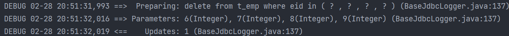
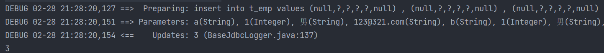
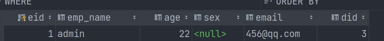

[TOC]

# 一、Mybatis简介
## 1.1、MyBatis历史
-    MyBatis最初是Apache的一个开源项目iBatis, 2010年6月这个项目由Apache Software Foundation迁移到了Google Code。随着开发团队转投Google Code旗下，iBatis3.x正式更名为MyBatis。代码于2013年11月迁移到Github
- iBatis一词来源于“internet”和“abatis”的组合，是一个基于Java的持久层框架。iBatis提供的持久层框架包括SQL Maps和Data Access Objects（DAO）
## 1.2、MyBatis特性
1. `MyBatis 是支持定制化 SQL、存储过程以及高级映射(resultType,resultMap)的优秀的持久层框架`
2. `MyBatis 避免了几乎所有的 JDBC 代码和手动设置参数以及获取结果集`
3. `MyBatis可以使用简单的XML或注解用于配置和原始映射，将接口和Java的POJO（Plain Old Java Objects，普通的Java对象）映射成数据库中的记录`
4. `MyBatis 是一个 半自动的ORM（Object Relation Mapping）框架`
## 1.3、MyBatis下载
- [MyBatis下载地址](https://github.com/mybatis/mybatis-3)


## 1.4、和其它持久化层技术对比
***①：JDBC***  

- SQL 夹杂在Java代码中耦合度高，导致硬编码内伤  
- 维护不易且实际开发需求中 SQL 有变化，频繁修改的情况多见  
- 代码冗长，开发效率低

***②：Hibernate 和 JPA***

- 操作简便，开发效率高  
- 程序中的长难复杂 SQL 需要绕过框架  
- 内部自动生产的 SQL，不容易做特殊优化  
- 基于全映射的全自动框架，大量字段的 POJO 进行部分映射时比较困难。  
- 反射操作太多，导致数据库性能下降

***③：MyBatis***

- 轻量级，性能出色  
- SQL 和 Java 编码分开，功能边界清晰。Java代码专注业务、SQL语句专注数据  
- 开发效率稍逊于HIbernate，但是完全能够接受

# 二、搭建MyBatis
## 1、开发环境
- IDE：idea 2019.2  
- 构建工具：maven 3.5.4  
- MySQL版本：MySQL 5.7  
- MyBatis版本：MyBatis 3.5.7
## 2、创建maven工程
- 打包方式：jar
- 引入依赖

```xml
<dependencies>
	<!-- Mybatis核心 -->
	<dependency>
		<groupId>org.mybatis</groupId>
		<artifactId>mybatis</artifactId>
		<version>3.5.7</version>
	</dependency>
	<!-- junit测试 -->
	<dependency>
		<groupId>junit</groupId>
		<artifactId>junit</artifactId>
		<version>4.12</version>
		<scope>test</scope>
	</dependency>
	<!-- MySQL驱动 -->
	<dependency>
		<groupId>mysql</groupId>
		<artifactId>mysql-connector-java</artifactId>
		<version>5.1.3</version>
		</dependency>
</dependencies>
```
## 3、创建MyBatis的核心配置文件
>习惯上命名为`mybatis-config.xml`，这个文件名仅仅只是建议，并非强制要求。将来整合Spring之后，这个配置文件可以省略，所以大家操作时可以直接复制、粘贴。
>核心配置文件主要用于配置连接数据库的环境以及MyBatis的全局配置信息
>核心配置文件存放的位置是src/main/resources目录下
```xml
<?xml version="1.0" encoding="UTF-8" ?>  
<!DOCTYPE configuration  
PUBLIC "-//mybatis.org//DTD Config 3.0//EN"  
"http://mybatis.org/dtd/mybatis-3-config.dtd">  
<configuration>  
	<!--设置连接数据库的环境-->  
	<environments default="development">  
		<environment id="development">  
			<transactionManager type="JDBC"/>  
			<dataSource type="POOLED">  
				<property name="driver" value="com.mysql.jdbc.Driver"/>  
				<property name="url" value="jdbc:mysql://localhost:3306/MyBatis"/>  
				<property name="username" value="root"/>  
				<property name="password" value="123456"/>  
			</dataSource>  
		</environment>  
	</environments>  
	<!--引入映射文件-->  
	<mappers>  
		<mapper resource="mappers/UserMapper.xml"/>  
	</mappers>  
</configuration>
```
## 创建mapper接口
>MyBatis中的mapper接口相当于以前的dao。但是区别在于，mapper仅仅是接口，我们不需要提供实现类，可以理解为MyBatis会根据接口自动生成实现类。
```java
package com.ly.mybatis.mapper;

import com.ly.mybatis.pojo.User;

import java.util.List;

/**
 * @FileName:UserMapper.class
 * @Author:ly
 * @Date:2022/6/6
 * @Description:
 */
//MyBatis面向接口编程的的两个一致：
//1、映射文件（如UserMapper.xml）中的mapper标签的属性namespace的值必须为要使用接口的全类名
//2、映射文件中sql语句的id值，要和要实现接口的方法的方法名对应（保证一一对应）
public interface UserMapper {

    /**
     * 添加用户信息
     * @return 影响的行数
     */
    int insertUser();

    /**
     * 修改用户信息
     * @return 返回影响行数
     */
    int updateUser();

    /**
     * 删除用户
     * @return 影响的行数
     */
    int deleteUser();


    /***
     * 查询一个实体类对象
     */
    User selectOneBean();

    /**
     * 查询所有用户数据
     */
    List<User> getAllUser();
}

```
## 创建MyBatis的映射文件
***相关概念：ORM（Object Relationship Mapping）对象关系映射。*** 

- 对象：Java的实体类对象  
- 关系：关系型数据库  
- 映射：二者之间的对应关系

| Java概念 | 数据库概念 |
| --- | --- |
| 类 | 表 |
| 属性 | 字段/列 |
| 对象 | 记录/行 |

***映射文件的命名规则***

- 表所对应的实体类的类名+Mapper.xml
  - 例如：表t_user，映射的实体类为User，所对应的映射文件为UserMapper.xml 
  - 因此一个映射文件对应一个实体类，对应一张表的操作
  - MyBatis映射文件用于编写SQL，访问以及操作表中的数据
  - MyBatis映射文件存放的位置是src/main/resources/mappers目录下
- MyBatis中可以面向接口操作数据，要保证两个一致
- mapper接口的全类名和映射文件的命名空间（namespace）保持一致
- mapper接口中方法的方法名和映射文件中编写SQL的标签的id属性保持一致

```xml
<?xml version="1.0" encoding="UTF-8" ?>
<!DOCTYPE mapper
        PUBLIC "-//mybatis.org//DTD Mapper 3.0//EN"
        "http://mybatis.org/dtd/mybatis-3-mapper.dtd">

<!--指定指定实现接口 即：接口的全类名 必须为全类名，不能省略，不要因为按包导入就不一样了，又不是起别名-->
<mapper namespace="com.ly.mybatis.mapper.ParameterMapper">
<!-- id为接口的某个函数名，一一对应-->
    <insert id="insertUser" >
        insert t_user values (null ,'admin','123456',23,'男','123456@qq.com');
    </insert>

    <update id="updateUser" >
        update t_user set sex='女';
    </update>

    <delete id="deleteUser">
        delete from t_user where id = 12;
    </delete>

    <!-- 查询功能必须设置resulType/resultMap 表示结果类型，mybatis会将查询到的结果转化成这个类型，然后再转化为对应函数selectOneBean()的返回值返回
        resultType（结果类型）：全类名（设置默认的映射关系，属性名一致则赋值否则不赋值） 【用于一行多列，或多行多列,或单行单列，或多行单列】
        resultMap（结果映射）：（设置自定义的映射关系，即sql字段名和java属性名不一致时） 【用于一行多列，或多行多列,或单行单列，或多行单列】
    -->
    <select id="selectOneBean" resultType="com.ly.mybatis.pojo.User">
        select username  from t_user where id=13;
    </select>


<!--    <select id="getAllUser" resultType="com.ly.mybatis.pojo.User">-->
    <!-- 使用mybatis配置文件中 配置的全类名的 别名User（不区分大小写）-->
    <select id="getAllUser" resultType="User">
        select username from t_user;
    </select>


</mapper>
```
## 4、通过junit测试功能
- SqlSession：代表Java程序和数据库之间的会话。（HttpSession是Java程序和浏览器之间的会话）
- SqlSessionFactory：是“生产”SqlSession的“工厂”
- 工厂模式：如果创建某一个对象，使用的过程基本固定，那么我们就可以把创建这个对象的相关代码封装到一个“工厂类”中，以后都使用这个工厂类来“生产”我们需要的对象
```java
 	@Test
    public void testMyBatis() throws IOException {
        //1、加载核心配置文件 即mybatis-config.xml
        InputStream is = Resources.getResourceAsStream("mybatis-config.xml");
        //2、获取SqlSessionFactoryBuilder对象
        SqlSessionFactoryBuilder builder = new SqlSessionFactoryBuilder();
        //3、获取SqlSessionFactory对象
        SqlSessionFactory sqlSessionFactory = builder.build(is);
        //4、获取SqlSession对象   其为操作数据库的会话对象 【事务默认手动提交，设置为true 则自动提交】
        SqlSession sqlSession = sqlSessionFactory.openSession(true);
        //5、获取mapper接口对象 【底层代理模式，返回接口的实现类对象】
        UserMapper userMapper = sqlSession.getMapper(UserMapper.class);
        //6、执行sql语句
        int i = userMapper.insertUser();
        System.out.println("受影响的行数为：" + i);
        //7、因为mybatis全局配置文件，默认开启事务          <transactionManager type="JDBC"/>
        //sqlSession.commit();
    }
```
- 此时需要手动提交事务，如果要自动提交事务，则在获取sqlSession对象时，使用`SqlSession sqlSession = sqlSessionFactory.openSession(true);`，传入一个Boolean类型的参数，值为true，这样就可以自动提交
## 5、加入log4j日志功能
1. 加入依赖
	```xml
	<!-- log4j日志 -->
	<dependency>
	<groupId>log4j</groupId>
	<artifactId>log4j</artifactId>
	<version>1.2.17</version>
	</dependency>
	```
2. 加入log4j的配置文件
	- log4j的配置文件名为log4j.xml，存放的位置是src/main/resources目录下
	- 日志的级别：FATAL(致命)>ERROR(错误)>WARN(警告)>INFO(信息)>DEBUG(调试) 从左到右打印的内容越来越详细
	```xml
	<?xml version="1.0" encoding="UTF-8" ?>
	<!DOCTYPE log4j:configuration SYSTEM "log4j.dtd">
	<log4j:configuration xmlns:log4j="http://jakarta.apache.org/log4j/">
	    <appender name="STDOUT" class="org.apache.log4j.ConsoleAppender">
	        <param name="Encoding" value="UTF-8" />
	        <layout class="org.apache.log4j.PatternLayout">
				<param name="ConversionPattern" value="%-5p %d{MM-dd HH:mm:ss,SSS} %m (%F:%L) \n" />
	        </layout>
	    </appender>
	    <logger name="java.sql">
	        <level value="debug" />
	    </logger>
	    <logger name="org.apache.ibatis">
	        <level value="info" />
	    </logger>
	    <root>
	        <level value="debug" />
	        <appender-ref ref="STDOUT" />
	    </root>
	</log4j:configuration>
	```
# 三、核心配置文件详解

参考手册：[mybatis – MyBatis 3 | 配置](https://mybatis.org/mybatis-3/zh/configuration.html#environments)

>核心配置文件中的标签必须按照固定的顺序(有的标签可以不写，但顺序一定不能乱)：
properties、settings、typeAliases、typeHandlers、objectFactory、objectWrapperFactory、reflectorFactory、plugins、environments、databaseIdProvider、mappers
```xml
<?xml version="1.0" encoding="UTF-8" ?>
<!-- 声明文件根标签-->
<!DOCTYPE configuration
        PUBLIC "-//mybatis.org//DTD Config 3.0//EN"
        "http://mybatis.org/dtd/mybatis-3-config.dtd">

<configuration>

    <!--引入数据源配置文件 方便下面使用 -->
    <properties resource="jdbc.properties" />

    <!-- 设置类型的别名，不然mapper.xml文件中全类名太长   （不区分大小写）
        如果不写属性alias指定别名，则别名就默认是类名User（不区分大小写）-->
    <typeAliases>
        <!--指定某一类的别名-->
        <typeAlias type="com.ly.mybatis.pojo.User" alias="User"/>

        <!-- 指定某个包下，所有类的的别名 默认为类名（不区分大小写）-->
        <package name="com.ly.mybatis.pojo"/>
    </typeAliases>
<!--    配置连接数据库的环境，可配置多个
        属性default：表示当前使用哪个数据库配置的id（development/test）
        -->
    <environments default="development">
        <!-- 开发环境 -->
        <environment id="development">
            <!-- 设置事务管理器类型，
             属性：type="JDBC" 表示使用JDBC原生的事务管理方式：事务提交/回滚等需要手动操作
             属性：type="MANAGED" 表示被管理，如Spring-->
            <transactionManager type="JDBC"/>
            <!-- 配置数据库连接
             属性 type=POOLED 表示使用数据库连接池缓存数据库连接。将数据库连接保存下来，以便下次直接从缓存中取出
             属性 type=UNPOOLED 表示不使用数据库连接池。不将数据库连接保存下来
             属性 type=JNDI 表示使用上下文中的数据源
            -->
            <dataSource type="POOLED">
                <!-- 配置数据源，推荐使用properties配置文件引入，${key}获取-->
<!--                <property name="driver" value="com.mysql.jdbc.Driver"/>-->
                <property name="driver" value="${jdbc.driver}"/>
                <property name="url" value="${jdbc.url}"/>
                <property name="username" value="${jdbc.username}"/>
                <property name="password" value="${jdbc.password}"/>
            </dataSource>
        </environment>
        <!-- 测试环境-->
        <environment id="test">
            <transactionManager type="JDBC"/>
            <dataSource type="POOLED">
                <property name="driver" value="com.mysql.jdbc.Driver"/>
                <property name="url" value="jdbc:mysql:///mybatis"/>
                <property name="username" value="root"/>
                <property name="password" value="123456"/>
            </dataSource>
        </environment>

    </environments>

<!--    引入映射文件，一个mapper文件对应一个接口-->
    <mappers>
<!--        <mapper resource="mappers/UserMapper.xml" />-->
        <!-- 以包为单位，引入mapper映射文件
        两个要求：
            1、mapper接口所在的包要和映射文件所在的包一致
            2、mapper接口要和映射文件的名字一致
            -->

        <package name="com.ly.mybatis.mapper"/>
    </mappers>
</configuration>
```
- 
# 四、默认的类型别名


# 五、MyBatis的增删改查
1. 添加
	```xml
	<!--int insertUser();-->
	<insert id="insertUser">
		insert into t_user values(null,'admin','123456',23,'男','12345@qq.com')
	</insert>
	```
2. 删除
	```xml
	<!--int deleteUser();-->
    <delete id="deleteUser">
        delete from t_user where id = 6
    </delete>
	```
3. 修改
	```xml
	<!--int updateUser();-->
    <update id="updateUser">
        update t_user set username = '张三' where id = 5
    </update>
	```
4. 查询一个实体类对象
	```xml
    <!-- 查询功能必须设置resulType/resultMap 表示结果类型，mybatis会将查询到的结果转化成这个类型，然后再转化为对应函数selectOneBean()的返回值返回
	        resultType（结果类型）：全类名（设置默认的映射关系，属性名一致则赋值否则不赋值） 【用于一行多列，或多行多列,或单行单列，或多行单列】
	        resultMap（结果映射）：（设置自定义的映射关系，即sql字段名和java属性名不一致时） 【用于一行多列，或多行多列,或单行单列，或多行单列】
	    -->
	<select id="selectOneBean" resultType="com.ly.mybatis.pojo.User">
	    select username  from t_user where id=13;
	</select>
	```
5. 查询集合
	```xml
	<!--List<User> getAllUser();-->
	<!--    <select id="getAllUser" resultType="com.ly.mybatis.pojo.User">-->
	    <!-- 使用mybatis配置文件中 配置的全类名的 别名User（不区分大小写）-->
	    <select id="getAllUser" resultType="User">
	        select username from t_user;
	    </select>
	```
- 注意：

	1. 查询的标签select必须设置属性resultType或resultMap，用于设置实体类和数据库表的映射关系  
		- resultType：自动映射，用于属性名和表中字段名一致的情况  
		- resultMap：自定义映射，用于一对多或多对一或字段名和属性名不一致的情况  
	2. ***当查询的数据为多条时，不能使用实体类作为返回值，只能使用集合***，否则会抛出异常TooManyResultsException；但是若查询的数据只有一条，可以使用实体类或集合作为返回值
# 六、MyBatis获取参数值的两种方式（重点）
- MyBatis获取参数值的两种方式：${}和#{}  
- ${}的本质就是字符串拼接，#{}的本质就是占位符赋值  
- ${}使用字符串拼接的方式拼接sql，若为字符串类型或日期类型的字段进行赋值时，需要手动加单引号；但是#{}使用占位符赋值的方式拼接sql，此时为字符串类型或日期类型的字段进行赋值时，可以自动添加单引号
## 1、单个字面量类型的参数
- 若mapper接口中的方法参数为单个的字面量类型，此时可以使用\${xxx}和#{xxx}以任意的名称（最好见名识意）获取参数的值，注意${}需要手动加单引号

```java
//ParameterMapper.java

/**
 * 根据用户名返回用户信息
 */
User getUserByUsername(String username);
```

```xml
<!-- ParameterMapper.xml -->

<!--
    * MyBatis获取参数值的两种方式：
    * ${}: 表示字符串拼接 （存在sql注入风险，和单引号'）
    * #{}: 表示占位符（推荐使用）
    -->
<!--    User getUserByUsername(String username);    #{}内部可以填入任意名称-->
    <select id="getUserByUsername" resultType="User">
        <!-- select * from t_user where username=#{username}; -->
        select * from t_user where username='${username}';
    </select>
```
```java
    /*
     * 单字面量情况，即一个参数
     */
    @Test
    public void getUserByUsername() throws IOException {
        InputStream is = Resources.getResourceAsStream("mybatis-config.xml");
        SqlSessionFactory sqlSessionFactory = new SqlSessionFactoryBuilder().build(is);
        SqlSession sqlSession = sqlSessionFactory.openSession();
        ParameterMapper parameterMapper = sqlSession.getMapper(ParameterMapper.class);
        User user = parameterMapper.getUserByUsername("admin");
        System.out.println(user);

        sqlSession.commit();
    }
```
## 2、多个字面量类型的参数
- 若mapper接口中的方法参数为多个时，此时MyBatis会自动将这些参数放在一个map集合中

	1. 以arg0,arg1...为键，以参数为值；
	2. 以param1,param2...为键，以参数为值；

```java
//ParameterMapper.java
    
/**
 * 验证登陆
 */
User checkLogin(String username,String password,Integer id);
```

- 因此只需要通过\${}和#{}访问map集合的键就可以获取相对应的值，注意${}需要手动加单引号。
- 使用arg或者param都行，要注意的是，arg是从arg0开始的，param是从param1开始的

```xml
<!--ParameterMapper.xml -->

<!--    User checkLogin(String username,String password,Integer id);-->
    <select id="checkLogin" resultType="User">
        <!-- select * from t_user where username=#{arg0} and password=#{arg1} and id=#{arg2}; -->
        select * from t_user where username='${arg0}' and password='${arg1}' and id='${arg2}';
    </select>
```
```xml
    /*
     * 多个字面量时，即多个参数
     */
    @Test
    public void checkLogin() throws IOException {
        InputStream is = Resources.getResourceAsStream("mybatis-config.xml");
        SqlSessionFactory sqlSessionFactory = new SqlSessionFactoryBuilder().build(is);
        SqlSession sqlSession = sqlSessionFactory.openSession();
        ParameterMapper parameterMapper = sqlSession.getMapper(ParameterMapper.class);
        User user = parameterMapper.checkLogin("admin","123456",13);
        System.out.println(user);

        sqlSession.commit();
    }<!--User checkLogin(String username,String password);-->
<select id="checkLogin" resultType="User">
	select * from t_user where username = '${param1}' and password = '${param2}'
</select>
```
## 3、map集合类型的参数
- 若mapper接口中的方法需要的参数为多个时，此时可以手动创建map集合，将这些数据放在map中只需要通过\${}和#{}访问map集合的键就可以获取相对应的值，注意${}需要手动加单引号

```java
//ParameterMapper.java

/**
 * 验证登陆（手动传递参数map集合）
 */
User checkLoginByMap(Map<String,Object> map);
```

```xml
<!-- ParameterMapper.xml-->

<!--    User checkLoginByMap(Map<String,Object> map);-->
    <select id="checkLoginByMap" resultType="User">
        select * from t_user where username='${username}' and password='${password}' and id=${id};
    </select>
```
```java
    /*
     * 传递参数为map集合时
     * 即多个字面量时，即多个参数 (手动设置参数Map集合，自己规定参数key不用arg/param)
     */
    @Test
    public void checkLoginByMap() throws IOException {
        InputStream is = Resources.getResourceAsStream("mybatis-config.xml");
        SqlSessionFactory sqlSessionFactory = new SqlSessionFactoryBuilder().build(is);
        SqlSession sqlSession = sqlSessionFactory.openSession();
        ParameterMapper parameterMapper = sqlSession.getMapper(ParameterMapper.class);
        Map<String, Object> map = new HashMap<String, Object>();
        //这个键key 必须和mapper.xml文件中的key值一样，才能取到参数
        map.put("username","admin");
        map.put("password","123456");
        map.put("id",13);

        User user = parameterMapper.checkLoginByMap(map);
        System.out.println(user);
        sqlSession.commit();
    }
```
## 4、实体类类型的参数
- 若mapper接口中的方法参数为实体类对象时此时可以使用\${}和#{}，通过访问实体类对象中的属性名获取属性值，注意${}需要手动加单引号

```java
ParameterMapper.java
/**
 * 验证登陆（手动传递参数实体Bean）
 */
User checkLoginByBean(User user);
```

```xml
<!-- ParameterMapper.xml -->

<!--    User checkLoginByBean(User user);-->
    <select id="checkLoginByBean" resultType="User">
        select * from t_user where username='${username}' and password='${password}' and id=${id};
    </select>
```
```java
    /*
     * 传递参数为实体类Bean时
     */
    @Test
    public void checkLoginByBean() throws IOException {
        InputStream is = Resources.getResourceAsStream("mybatis-config.xml");
        SqlSessionFactory sqlSessionFactory = new SqlSessionFactoryBuilder().build(is);
        SqlSession sqlSession = sqlSessionFactory.openSession();
        ParameterMapper parameterMapper = sqlSession.getMapper(ParameterMapper.class);
        User root = parameterMapper.checkLoginByBean(new User(14, "root", "123", null, '1', null));
        System.out.println(root);
        sqlSession.commit();
    }
```
## 5、使用@Param标识参数
- 可以通过@Param注解标识mapper接口中的方法参数，此时，会将这些参数放在map集合中 

	1. 以@Param注解的value属性值为键，以参数为值；
	2. 以param1,param2...为键，以参数为值；

```java
//ParameterMapper.java

/**
  * 验证登陆(使用@param注解) 自动放到map集合中 key就为注解的value  值就为标识的参数名
  */
User checkLoginByAnnotation(@Param("username") String username, @Param("password") String password, @Param("identity") Integer id);
```

- 只需要通过\${}和#{}访问map集合的键就可以获取相对应的值，注意${}需要手动加单引号

```xml
<!-- ParameterMapper.xml文件-->

<!--    User checkLoginByAnnotation(@Param("username") String username, @Param("password") String password, @Param("identity") Integer id);-->
    <select id="checkLoginByAnnotation" resultType="User">
        select * from t_user where username='${username}' and password='${password}' and id=${identity};
    </select>
```
```java
    /*
     * 传递多个参数，使用注解@Param，自动将参数放到map集合中 key就为注解的value  值就为标识的参数
     * 还有一种取值方式 即param1，param2...（可以理解为arg0..被替换了）
     */
    @Test
    public void checkLoginByAnnotation() throws IOException {
        InputStream is = Resources.getResourceAsStream("mybatis-config.xml");
        SqlSessionFactory sqlSessionFactory = new SqlSessionFactoryBuilder().build(is);
        SqlSession sqlSession = sqlSessionFactory.openSession();
        ParameterMapper parameterMapper = sqlSession.getMapper(ParameterMapper.class);
        User root = parameterMapper.checkLoginByAnnotation("root", "123", 14);
        System.out.println(root);
        sqlSession.commit();
    }
```
## 总结

> ```JAVA
>     * MyBatis获取参数值的两种方式：
>     * ${xxx}: 表示字符串拼接 （存在sql注入风险，和需要手动加单引号'）xxx表示任意名称
>     * #{xxx}: 表示占位符（推荐使用） xxx表示任意名称
>     * MyBatis获取参数的各种情况：
>     *  1、mapper接口方法的参数为单个字面量时
>     *      ${xxx}和#{}均可以使用，其中名称xxx随意，但是要注意${}必须加上单引号或双引号【字符串拼接】
>     *  2、mapper接口方法的形参为多个参数时 【mybatis会将参数放到map集合中】
>     *      #{xxx}中xxx必须按照顺序取arg0,arg1,arg2...或param1,param2,param3... 可以交叉着用
>     *      ${xxx}中xxx必须按照顺序取arg0,arg1,arg2...或param1,param2,param3... 可以交叉着用,同时需要加上单引号
>     *  3、mapper接口方法参数为多个时，手动将参数放入map集合中存储（就不必须用agr/param取值了）
>     *      sql中键就是put方法的key
>     *  4、mapper接口方法参数为实体类Bean时，和map一样
>     *      sql中键就是实体Bean的属性名（必须完全一样，且有get方法）
>     *
> *      5、使用@param注解 参数命名参数 (以注解的值，或param1..作为sql参数)
> ```

- 建议分成两种情况进行处理

	1. 实体类类型的参数
	
	2. 使用@Param标识参数


​	   
# 七、MyBatis的各种查询功能
1. 如果查询出的数据只有一条，可以通过
	1. 实体类对象接收
	2. List集合接收
	3. Map集合接收，结果`{password=123456, sex=男, id=1, age=23, username=admin}`
2. 如果查询出的数据有多条，一定不能用实体类对象接收，会抛异常TooManyResultsException，可以通过
	1. 实体类类型的LIst集合接收
	2. Map类型的LIst集合接收
	3. 在mapper接口的方法上添加@MapKey注解
## 1、查询一个实体类对象
```java
//接口
/**
  * 根据id查询单个用户信息
  */
User getUserById(@Param("id") Integer id);
```
```xml
//mapper文件
<!-- User getUserById(@Param("id") Integer id); -->
<select id="getUserById" resultType="User">
    select * from t_user;
</select>
```
`MyBatis查询调用方法是根据接口的返回类型（是否为集合）来调用对应方法：`

+ `即如果返回为单个对象，则调用selectOne()方法，但是如果此时查询到多条语句就会报错。`
+ `如果返回为一个集合，则调用executeForMany()方法`
+ `如果返回的是一个map集合，则调用executeForMap()方法`
+ `如果返回类型为Cursor，则调用的是executeForCursor()方法`

## 2、查询一个List集合

```java
/**
 * 查询所有用户信息
 * @return
 */
List<User> getUserList();
```
```xml
<!--List<User> getUserList();-->
<select id="getUserList" resultType="User">
	select * from t_user;
</select>
```
## 3、查询单个数据
```java
/**  
 * 查询用户的总记录数  
 * @return  
 * 在MyBatis中，对于Java中常用的类型都设置了类型别名  
 * 例如：java.lang.Integer-->int|integer  
 * 例如：int-->_int|_integer  
 * 例如：Map-->map,List-->list  
 */  
int getCount();
```
```xml
<!--int getCount();-->
<select id="getCount" resultType="_integer">
	select count(id) from t_user
</select>
```
## 4、查询一条数据为map集合
```java
/**  
 * 根据用户id查询用户信息为map集合  
 * @param id  
 * @return  
 */  
Map<String, Object> getUserToMap(@Param("id") int id);
```
```xml
<!--Map<String, Object> getUserToMap(@Param("id") int id);-->
<select id="getUserToMap" resultType="map">
	select * from t_user where id = #{id}
</select>
<!--结果：{password=123456, sex=男, id=1, age=23, username=admin}-->
```
## 5、查询多条数据为map集合

这种情况使用很多，因为可以多表联合查询。最后得到的map集合，返回给浏览器就是一个json对象。

### 方法一 使用List<Map<String,Object>>
```java
/**  
 * 查询所有用户信息为map集合  
 * @return  
 * 将表中的数据以map集合的方式查询，一条数据对应一个map；若有多条数据，就会产生多个map集合，此时可以将这些map放在一个list集合中获取  
 */  
List<Map<String, Object>> getAllUserToMap();
```
```xml
<!--Map<String, Object> getAllUserToMap();-->  
<select id="getAllUserToMap" resultType="map">  
	select * from t_user  
</select>
<!--
	结果：
	[{password=123456, sex=男, id=1, age=23, username=admin},
	{password=123456, sex=男, id=2, age=23, username=张三},
	{password=123456, sex=男, id=3, age=23, username=张三}]
-->
```
### 方法二 使用注解@MapKey()

最终返回的依旧是一个map集合，只是里面嵌套map集合

```java
/**
 * 查询所有用户信息为map集合
 * @MapKey()即将多个查询集合，放在一个集合中map{k1:map1,k2:map2..}
 * 使用@MapKey注解标记多map，其中
 *			注解的值必须为sql列名任意一个，用作集合map的key(不是sql列名的话只有最后一条记录，如果key值重复会把数据覆盖掉，所以推荐，key为id) 【区分大小写】
 *			则此时集合map的值就是：key值对应所在的查询结果的行
 *
 */
@MapKey("id")
Map<String, Object> getAllUserToMap();
```
```xml
<!--Map<String, Object> getAllUserToMap();-->
<select id="getAllUserToMap" resultType="map">
	select * from t_user;
</select>
<!--
	结果：
	{
 //key1=map1,key2=map2...
	1={password=123456, sex=男, id=1, age=23, username=admin},
	2={password=123456, sex=男, id=2, age=23, username=张三},
	3={password=123456, sex=男, id=3, age=23, username=张三}
	}
-->
```
```java
 @Test
 public void getAllUserToMap() throws Exception {
     InputStream is = Resources.getResourceAsStream("mybatis-config.xml");
     SqlSession sqlSession = new SqlSessionFactoryBuilder().build(is).openSession();
     SelectMapper mapper = sqlSession.getMapper(SelectMapper.class);
     //正常调用
     Map<String, Object> map = mapper.getAllUserToMap();
     System.out.println(map);
 }
```

# 八、特殊SQL的执行

特殊SQL只需要记住，占位符#{}会自动添加单引号。而字符串拼接${}不会自动加单引号。

特殊SQL一般都是用${}

## 1、模糊查询

如果是占位符#{}的话，特殊字符如%需要手动添加引号。

```java
/**
 * 根据用户名进行模糊查询
 * @param username 
 * @return java.util.List<com.atguigu.mybatis.pojo.User>
 * @date 2022/2/26 21:56
 */
List<User> getUserByLike(@Param("username") String username);
```
```xml
<!--List<User> getUserByLike(@Param("username") String username);-->
<select id="getUserByLike" resultType="User">
	<!--select * from t_user where username like '%${username}%'-->  
   <!-- mysql的字符串函数 contact -->
	<!--select * from t_user where username like concat('%',#{username},'%')-->  
	select * from t_user where username like "%"#{username}"%"
</select>
```
- 其中`select * from t_user where username like "%"#{username}"%"`是最常用的
## 2、批量删除
- 只能使用\${}，如果使用#{}，则解析后的sql语句为`delete from t_user where id in ('1,2,3')`，这样是将`1,2,3`看做是一个整体，只有id为`1,2,3`的数据会被删除。正确的语句应该是`delete from t_user where id in (1,2,3)`，或者`delete from t_user where id in ('1','2','3')`
```java
/**
 * 根据id批量删除
 * @param ids 
 * @return int
 * @date 2022/2/26 22:06
 */
int deleteMore(@Param("ids") String ids);
```
```xml
<delete id="deleteMore">
	delete from t_user where id in (${ids})
</delete>
```
```java
//测试类
@Test
public void deleteMore() {
	SqlSession sqlSession = SqlSessionUtils.getSqlSession();
	SQLMapper mapper = sqlSession.getMapper(SQLMapper.class);
	int result = mapper.deleteMore("1,2,3,8");
	System.out.println(result);
}
```
## 3、动态设置表名

- 只能使用${}，因为表名不能加单引号
```java
/**
 * 查询指定表中的数据
 * @param tableName 
 * @return java.util.List<com.atguigu.mybatis.pojo.User>
 * @date 2022/2/27 14:41
 */
List<User> getUserByTable(@Param("tableName") String tableName);
```
```xml
<!--List<User> getUserByTable(@Param("tableName") String tableName);-->
<select id="getUserByTable" resultType="User">
	select * from ${tableName}
</select>
```
## 4、添加功能获取自增的主键
使用场景

- t_clazz(clazz_id,clazz_name)  
- t_student(student_id,student_name,clazz_id)  
  1. 添加班级信息  
  2. 获取新添加的班级的id  
  3. 为班级分配学生，即将某学的班级id修改为新添加的班级的id

在mapper.xml中设置两个属性

- useGeneratedKeys：设置使用自增的主键  
- keyProperty：因为增删改有统一的返回值是受影响的行数，因此只能将获取的自增的主键放在传输的参数user对象的某个属性中

```java
   /**
     * 新增user信息，同时给user分配新增班级的主键
     * @param user 用户实体Bean
     */
    int insertUser(User user);

    /**
     * 新增class信息，同时给user分配新增班级的主键
     * @param cls 班级实体Bean
     */
    int insertClass(Class cls);
```
```xml
    <!-- int insertUser(@Param("User") User user);-->
    <insert id="insertUser">
        insert into t_user values(null,#{username},#{password},#{age},#{sex},#{email},#{classId});
    </insert>

    <!-- int insertClass(@Param("className") String className);-->
    <!-- useGeneratedKeys：表示是否使用数据库自动递增主键，true表示使用
        keyProperty：表示返回新增加的数据的自动递增的主键（因为jdbc返回值就是受影响的行数，无法改变，只能通过属性赋值），其值为id表示会把数据回显到 参数班级Bean中的id属性
        -->
    <insert id="insertClass" useGeneratedKeys="true" keyProperty="id">
        insert into t_class values(null,#{className});
    </insert>
```
```java
    @Test
    public void testInsertUserAndClass() throws Exception {
        InputStream is = Resources.getResourceAsStream("mybatis-config.xml");
        SqlSession sqlSession = new SqlSessionFactoryBuilder().build(is).openSession();
        SQLMapper mapper = sqlSession.getMapper(SQLMapper.class);
        Class cls = new Class(null, "终极一班");
        int clsNum = mapper.insertClass(cls);
        System.out.println("受影响的行数：" + clsNum);//1
        System.out.println("班级自动递增后的主键为：" + cls.getId());//自动递增后的主键

        //回显自动递增的班级id，关联到用户表
        User user = new User(null, "里西奥", "lixiao", 35, '男', "lixiao@li.com", cls.getId());
        int userNum = mapper.insertUser(user);
        System.out.println("受影响的行数：" + userNum);
        
        System.out.println("*****班级用户信息*****");
        System.out.println(cls);//Class{id=6, className='终极一班'}
        System.out.println(user);//User{id=null, username='里西奥', password='lixiao', age=35, sex=男, email='lixiao@li.com', classId=6}

        //提交事务
        sqlSession.commit();
    }
```
# 九、自定义映射resultMap

MyBatis查询结果赋值给实体类对象的本质是：通过查询列字段和属性完全一样，通过set方法赋值，通过get方法取值。

## 1、resultMap处理字段和属性的映射关系
- > resultMap：设置自定义映射  

	> - 属性：  
	> 	- id：表示自定义映射的唯一标识，不能重复
	> 	- type：查询的数据要映射的实体类的类型  
	> - 子标签：  
	> 	- id：设置主键的映射关系  
	> 	- result：设置普通字段的映射关系  
	> 	- 子标签属性：  
	> 		- property：设置映射关系中实体类中的属性名  
	> 		- column：设置映射关系中表中的字段名


​	

### 1.1、若字段名和实体类中的属性名不一致，则可以通过resultMap设置自定义映射

```xml
<!-- 建立实体bean属性property 和列字段值column的映射关系-->

<!--指定指定实现接口 即：接口的全类名-->
<mapper namespace="com.ly.mybatis.mapper.EmployeeMapper">


    <!-- type直接写Employee就行，因为mybatis配置文件中已经起了别名
         type表示要将哪个类型bean进行映射-->
    <resultMap id="empResultMap" type="com.ly.mybatis.pojo.Employee">
        <!-- 设置主键映射关系  property表示实体bean的属性   column表示sql的列字段,不能重复-->
        <id property="eid" column="eid" />

        <!-- result表示设置普通字段的映射关系  字段和属性一样的可以不设置，但是建议设置-->
        <result property="empName" column="emp_name" />
        <result property="age" column="age"></result> 
        <result property="sex" column="sex"></result>
        <result property="email" column="email"></result>
    </resultMap>

    <!-- 解决方法3：使用结果集映射，resultMap将字段映射成自定义属性-->
    <select id="getAllEmployee" resultMap="empResultMap">
        select * from t_emp;
    </select>

</mapper>
```


### 1.2、若字段名和实体类中的属性名不一致，但是字段名符合数据库的规则（使用_），实体类中的属性名符合Java的规则（使用驼峰）。此时也可通过以下两种方式处理字段名和实体类中的属性的映射关系  

#### 	1.2.1、可以通过为字段起别名的方式，保证和实体类中的属性名保持一致  

```xml
<!-- List<Map<String,Object>> getAllEmployee();-->
<select id="getAllEmployeeOld" resultType="Employee">
    <!-- 解决方法1：给不一致的字段取别名，别名和bena对象的属性值相同即可-->
    select eid,emp_name empName,age,email,did from t_emp;

</select>
```

#### 	1.2.2、可以在MyBatis的核心配置文件中的`setting`标签中，设置一个全局配置信息mapUnderscoreToCamelCase，可以在查询表中数据时，自动将_类型的字段名转换为驼峰，例如：字段名user_name，设置了mapUnderscoreToCamelCase，此时字段名就会转换为userName。

#### 	[核心配置文件详解](#核心配置文件详解)

```xml
//mybatis-config.xml 配置文件
<!-- 设置mybatis的全局配置-->
<settings>
    <!-- 将下划线自动映射为驼峰-->
    <setting name="mapUnderscoreToCamelCase" value="true"/>
</settings>
```


```xml
//mapper文件
<!-- List<Map<String,Object>> getAllEmployee();-->
<select id="getAllEmployeeOld" resultType="Employee">
   
    <!-- 解决方法2：全局变量（mybatis-config.xml）中开启下画线自动转驼峰风格，仅此而已。如：emp_name自动转化为empName，em_pname为emPname-->
    select * from t_emp;
</select>
```

## 2、多对一映射处理

==实体类Bean处理多对一关系（当前这个实体类为多），通过建立一个属性对象 T==

如员工表对应部门表，则需要在员工信息中建立部门类型的成员变量。

>查询员工信息以及员工所对应的部门信息
```java
public class Employee {
    private Integer eid;
    private String empName;
    private Integer age;
    private char sex;
    private String email;
    //多对一映射关系，在`多`的实体bean中建立`一`的属性，映射
    private Department department;

	//...构造器、get、set方法等
}
```
### 2.1、级联方式处理映射关系
```xml
<!-- 解决多对一映射除磷：
            方式1、级联赋值  对部门属性的属性挨个赋值-->
    <resultMap id="EmployeeAndDepartmentResultMap" type="com.ly.mybatis.pojo.Employee">
        <id property="eid" column="eid" />
        <result property="empName" column="emp_name" />
        <result property="age" column="age"></result>
        <result property="sex" column="sex"></result>
        <result property="email" column="email"></result>
        <!-- 部门属性级联赋值-->
        <result property="department.did" column="did"></result>
        <result property="department.deptName" column="dept_name"></result>
    </resultMap>

    <!-- Employee getEmployeeAndDepartmentById(@Param("id") Integer id);-->
    <select id="getEmployeeAndDepartmentById" resultMap="EmployeeAndDepartmentResultMap">
        SELECT * FROM t_emp LEFT JOIN t_dept ON t_emp.did = t_dept.did WHERE t_emp.eid = #{eid};
    </select>
```
### 2.2、使用association处理映射关系，相当于内部bean
- association：处理多对一的映射关系
- property：需要处理多对的映射关系实体类Bean的属性名
- javaType：该属性的类型
```xml
    <!-- 解决多对一映射除磷：
            方式2、使用专门的association标签 此标签专门用来处理多对一的问题-->
    <resultMap id="EmployeeAndDepartmentResultMapTwo" type="com.ly.mybatis.pojo.Employee">
        <id property="eid" column="eid" />
        <result property="empName" column="emp_name" />
        <result property="age" column="age"></result>
        <result property="sex" column="sex"></result>
        <result property="email" column="email"></result>
        <association property="department" javaType="com.ly.mybatis.pojo.Department">
            <id property="did" column="did" />
            <result property="deptName" column="dept_name" />
        </association>
    </resultMap>

    <!-- Employee getEmployeeAndDepartmentById(@Param("id") Integer id);-->
    <select id="getEmployeeAndDepartmentById" resultMap="EmployeeAndDepartmentResultMapTwo">
        SELECT * FROM t_emp LEFT JOIN t_dept ON t_emp.did = t_dept.did WHERE t_emp.eid = #{eid};
    </select>
```
### 2.3、分步查询
#### 1. 查询员工信息
- select：设置分布查询的sql的唯一标识（namespace.SQLId或mapper接口的全类名.方法名）
- column：设置分步查询的条件
```java
EmployeeMapper.java文件
	/**
     * 查询员工以及员工对应的部门信息
     * 多对一解决方法：
     * 1、级联赋值
     * 2、使用association标签
     * 3、分步骤查询
     */
    Employee getEmployeeAndDepartmentById(@Param("eid") Integer eid);
```
```xml
EmployeeMapper.xml文件
<!--
        分步查询：
            第一步    Employee getEmployeeAndDepartmentByIdStepOne(@Param("eid") Integer eid);
            第二步    借助association嵌套子查询
    -->
    <resultMap id="EmployeeAndDepartmentByStepResultMap" type="com.ly.mybatis.pojo.Employee">
        <id property="eid" column="eid" />
        <result property="empName" column="emp_name" />
        <result property="age" column="age"></result>
        <result property="sex" column="sex"></result>
        <result property="email" column="email"></result>
        <!-- select就是子查询，但是这个是Java所有就调用接口的全类名，通过接口去找对应mapper的xml文件，执行内部sl语句，通过返回值赋值！column就是接口的参数-->
        <association property="department"
                     select="com.ly.mybatis.mapper.DepartmentMapper.getDepartmentById"
                     column="did" />
    </resultMap>

    <select id="getEmployeeAndDepartmentByIdStepOne" resultMap="EmployeeAndDepartmentByStepResultMap">
        select * from t_emp where eid=#{eid};
    </select>
```
#### 2. 查询部门信息
```java
DepartmentMapper.java文件    
	/**
     * 分步查询第二步：通过员工关联的did查询部门信息
     * 设不设置返回值都无所谓，因为属性赋值是根据get和set方法来的
     */
    DepartmentMapper getDepartmentById(@Param("did") Integer did);
```
```xml
    <!--
        分步查询第二步：通过员工关联的did查询部门信息
        DepartmentMapper getDepartmentById(@Param("did") Integer did);
    -->
    <resultMap id="DeptResultMap" type="com.ly.mybatis.pojo.Department">
        <id property="did" column="did" />
        <result property="deptName" column="dept_name" />
    </resultMap>
    <select id="getDepartmentById" resultMap="DeptResultMap">
        select * from t_dept where did = #{did};
    </select>
```
***分布查询的好处：***实现了延迟加载（需要配置settings中开启）。

> 延迟加载就是对于分步查询，你实际使用到哪个信息他才会执行其对于sql。
>
> 比如我输出员工的名字，开启延迟加载后只会执行 ` select * from t_emp where eid=#{eid};`语句，直到你使用了其关联的部门信息，他才会执行 `select * from t_dept where did = #{did};`
>
> 实际结果如图：
>
> 
>
> 

## 3、一对多映射处理

==实体类Bean处理一对多关系（表示当前这个试题类为一），则通过属性集合List<多的类型>==

```java
public class Department {
    private Integer did;
    private String deptName;
    private List<Employee> employeeList;
	//...构造器、get、set方法等
}
```
### 3.1、collection标签
- collection：用来处理一对多的映射关系
- ofType：表示该属性对饮的集合中存储的数据的类型
```xml
    <!--
        多对一： 使用collection标签
            Department getDepartmentAndEmployeeById(@Param("did") Integer did);
    -->
    <resultMap id="DepartmentAndEmployeeResultMap" type="Department">
        <id property="did" column="did" />
        <result property="deptName" column="dept_name" />
        <!-- collection专门用来处理一对多的集合属性
            property表示的就是集合属性的名称
            ofType表示的就是集合属性存储的 数据的类型，(如果起了别名直接写别名即可)-->
        <collection property="employeeList" ofType="com.ly.mybatis.pojo.Employee">
            <id property="eid" column="eid" />
            <result property="empName" column="emp_name" />
            <result property="age" column="age"></result>
            <result property="sex" column="sex"></result>
            <result property="email" column="email"></result>
            <!-- 其中的多对一属性Department department可以不用写了-->
        </collection>
    </resultMap>
    <select id="getDepartmentAndEmployeeById" resultMap="DepartmentAndEmployeeResultMap">
        select * from t_dept left join t_emp on t_dept.did =t_emp.did where t_dept.did = #{did};
    </select>
```
### 3.2、分步查询
####  1. 查询部门信息
```java
 DepartmentMapper.java文件 --第一步
	/**
     * 一对多经典案例：
     * 根据id查询部门信息，并且获取该部门下所有员工信息
     * 解决方法：分步查询
     */
    Department getDepartmentAndEmployeeByStepOne(@Param("did") Integer did);
```
```xml
DepartmentMapper.xml文件  --第一步
	<!--
        分步查询第一步：先查询出部门信息
        Department getDepartmentAndEmployeeByStepOne(@Param("did") Integer did);
        -->
    <resultMap id="DepartmentAndEmployeeByStepOneResultMap" type="Department">
        <id property="did" column="did"/>
        <result property="deptName" column="dept_name" />
        <!-- 分步查询借助的就是 association标签
            property属性：一对多的集合属性名
            select属性：子查询的mapper文件对应的接口
            column属性：二次查询，接口的参数
            ofType属性：表示一对多集合属性中存放数据的类型（如果起了别名就是类名，否则就是全类名）
            fetchType属性：lazy表示开启懒加载/延时加载
            -->
        <collection property="employeeList"
                     select="com.ly.mybatis.mapper.EmployeeMapper.getDepartmentAndEmployeeByStepTwo"
                     ofType="Employee"
                     column="did"
                     fetchType="lazy" />
    </resultMap>
    <select id="getDepartmentAndEmployeeByStepOne" resultMap="DepartmentAndEmployeeByStepOneResultMap">
        select * from t_dept where did = #{did};
    </select>
```
```java
EmployeeMapper.java文件  --第二步    
	/**
     * 一对多分步查询第二步：根据部门id查找员工信息
     */
    List<Employee> getDepartmentAndEmployeeByStepTwo(@Param("did") Integer did);
```

```xml
EmployeeMapper.xml文件  --第二步
    <!--
        一对多分步查询第二步：根据部门id查找员工信息
        List<Employee> getDepartmentAndEmployeeByStepTwo(@Param("did") Integer did);
    -->
    <resultMap id="AllEmployeeResultMap" type="Employee">
        <id property="eid" column="eid" />
        <result property="empName" column="emp_name" />
        <result property="age" column="age"></result>
        <result property="sex" column="sex"></result>
        <result property="email" column="email"></result>
    </resultMap>
    <select id="getDepartmentAndEmployeeByStepTwo" resultMap="AllEmployeeResultMap" >
        select * from t_emp where did = #{did};
    </select>
```

#### 2. 根据部门id查询部门中的所有员工

```java
/**
 * 通过分步查询，查询部门及对应的所有员工信息
 * 分步查询第二步：根据部门id查询部门中的所有员工
 * @param did
 * @return java.util.List<com.atguigu.mybatis.pojo.Emp>
 * @date 2022/2/27 22:10
 */
List<Emp> getDeptAndEmpByStepTwo(@Param("did") Integer did);
```
```xml
<!--List<Emp> getDeptAndEmpByStepTwo(@Param("did") Integer did);-->
<select id="getDeptAndEmpByStepTwo" resultType="Emp">
	select * from t_emp where did = #{did}
</select>
```
## 4、延迟加载

==注意：==

+ ==延迟加载仅在分步查询中使用（一对多collection标签，多对一association标签）==
+ ==如果全局配置没开启延迟加载，但是在分布查询使用fetchType=true（fetchType只在collection或association标签中才有）表示针对本次分步查询开启延迟加载==

分步查询的优点：可以实现延迟加载，但是必须在核心配置文件中设置全局配置信息：
- lazyLoadingEnabled：延迟加载的全局开关。当开启时，所有关联对象都会延迟加载  
- aggressiveLazyLoading：当开启时，任何方法的调用都会加载该对象的所有属性。 否则，每个属性会按需加载  

- 此时就可以实现按需加载，获取的数据是什么，就只会执行相应的sql。
- `但是开启延迟加载的话，会对所有的分布查询生效，但是某些查询不需要延迟加载则此时可通过association和collection中的fetchType属性设置当前的分步查询是否使用延迟加载，fetchType="lazy(延迟加载)|eager(立即加载)"`

```xml
<settings>
	<!--开启延迟加载-->
	<setting name="lazyLoadingEnabled" value="true"/>
</settings>
```

```java
@Test
public void getEmpAndDeptByStepOne() {
	SqlSession sqlSession = SqlSessionUtils.getSqlSession();
	EmpMapper mapper = sqlSession.getMapper(EmpMapper.class);
	Emp emp = mapper.getEmpAndDeptByStepOne(1);
	System.out.println(emp.getEmpName());
}
```
- 关闭延迟加载，两条SQL语句都运行了
- 开启延迟加载，只运行获取emp的SQL语句

```java
@Test
public void getEmpAndDeptByStepOne() {
	SqlSession sqlSession = SqlSessionUtils.getSqlSession();
	EmpMapper mapper = sqlSession.getMapper(EmpMapper.class);
	Emp emp = mapper.getEmpAndDeptByStepOne(1);
	System.out.println(emp.getEmpName());
	System.out.println("----------------");
	System.out.println(emp.getDept());
}
```
- 开启后，需要用到查询dept的时候才会调用相应的SQL语句
- fetchType：当开启了全局的延迟加载之后，可以通过该属性手动控制延迟加载的效果，fetchType="lazy(延迟加载)|eager(立即加载)"

	```xml
	<resultMap id="empAndDeptByStepResultMap" type="Emp">
		<id property="eid" column="eid"></id>
		<result property="empName" column="emp_name"></result>
		<result property="age" column="age"></result>
		<result property="sex" column="sex"></result>
		<result property="email" column="email"></result>
		<association property="dept"
					 select="com.atguigu.mybatis.mapper.DeptMapper.getEmpAndDeptByStepTwo"
					 column="did"
					 fetchType="lazy"></association>
	</resultMap>
	```

# 十、动态SQL
- Mybatis框架的动态SQL技术是一种根据特定条件动态拼装SQL语句的功能，它存在的意义是为了解决拼接SQL语句字符串时的痛点问题

> 例如：员工查询，可以写关建字eid,age,sex `select * from t_emp where eid=? and age=? and sex=?`
>
> 如果前端没有传输sex则需要 `select * from t_emp where eid=? and age=?`
>
> …
>
> 如果前端一个参数都没有，默认就是查询所所有员工  `select * from t_emp `，动态sql的意义，去掉where 后面语句，如果每个情况都单独写一个sql的mapper文件，太离谱了！

## 1、if
- if标签可通过test属性（即传递过来的数据）的表达式进行判断，若表达式的结果为true，则标签中的内容会执行；反之标签中的内容不会执行
- 在where后面添加一个恒成立条件`1=1`
- 这个恒成立条件并不会影响查询的结果
- 这个`1=1`可以用来拼接`and`语句，例如：当empName为null时
- 如果不加上恒成立条件，则SQL语句为`select * from t_emp where and age = ? and sex = ? and email = ?`，此时`where`会与`and`连用，SQL语句会报错
- 如果加上一个恒成立条件，则SQL语句为`select * from t_emp where 1= 1 and age = ? and sex = ? and email = ?`，此时不报错
```xml
    <!--
     * 多条件查询:员工姓名，性别，年龄，电子邮箱
    List<Employee> getEmployeeByMultiCondition(Employee employee);
    -->
    <select id="getEmployeeByMultiCondition" resultType="Employee">
        select * from t_emp where 1=1 <!-- 解决了 where关建字多出来，也解决了empName为空时，多个and的情况-->
        <!-- test表示sql查询条件，实际sql是哪个就写哪个（不需要#{}，直接写resultType中的属性名即可）
            java和sql的杂交，不能用&& 只能用and
            标签中的值就表示，满足if的test条件，才会把其拼接到sql中(sql关建字and where等要自己写 ，注意写在哪里)
        -->

        <if test="empName != null and empName != ''"> <!-- 这个是Java属性-->
            and emp_name = #{empName} <!-- 这个是sql，所有是sql字段-->
        </if>

        <if test="sex != null and sex !=' '">
            and sex = #{sex}
        </if>
        <if test="age != null and age !=''">
            and age = #{age}
        </if>
        <if test="email != null and email !=''">
            and email = #{email}
        </if>
    </select>
```
## 2、where
- where和if一般结合使用：
	- 若where标签中的if条件都不满足，则where标签没有任何功能，即不会添加where关键字  
	- 若where标签中的if条件满足，则where标签会自动添加where关键字，==并将条件最前方多余的and/or去掉==
```xml
    <select id="getEmployeeByMultiCondition" resultType="Employee">
        select * from t_emp
        <where>
            <!-- 条件都不成立，不现实where；有一个成立，自动字段去掉最前面的and-->
            <if test="empName != null and empName != ''"> <!-- 这个是Java属性-->
                and emp_name = #{empName} <!-- 这个是sql，所有是sql字段-->
            </if>

            <if test="sex != null and sex !=' '">
                and sex = #{sex}
            </if>
            <if test="age != null and age !=''">
                and age = #{age}
            </if>
            <if test="email != null and email !=''">
                and email = #{email}
            </if>
        </where>

    </select>
```
- ==注意：where标签不能去掉条件后多余的and/or==

	```xml
	<!--这种用法是错误的，只能去掉条件前面的and/or，条件后面的不行-->
	<if test="empName != null and empName !=''">
	emp_name = #{empName} and <!-- 不会自动去掉-->
	</if>
	<if test="age != null and age !=''">
		age = #{age} or
	</if>
	```
## 3、trim
- trim用于去掉或添加标签中的内容  
- 常用属性
- prefix：在trim标签中的内容的前面添加某些内容  
- suffix：在trim标签中的内容的后面添加某些内容 
- prefixOverrides：在trim标签中的内容的前面去掉某些内容  
- suffixOverrides：在trim标签中的内容的后面去掉某些内容
- 若trim中的标签都不满足条件，则trim标签没有任何效果，也就是只剩下`select * from t_emp`
```xml
    <!--
     * 多条件查询:员工姓名，性别，年龄，电子邮箱
    List<Employee> getEmployeeByMultiCondition(Employee employee);
    -->
    <select id="getEmployeeByMultiCondition" resultType="Employee">
        select * from t_emp
        <!--
            prefix属性：表示如果内部有条件成立，在最开始加上 prefix的关建字 【如：where】
            prefixOverrides属性： 表示如果内部有条件成立，则删除==最开始==的关建字【如：and或or】
            suffix属性：表示如果内部有条件成立，在最后面加上 suffix的关建字 【如：;分号】
            suffixOverrides属性： 表示如果内部有条件成立，则删除==最后的==关建字【如：and或or】
        -->
        <trim prefix="where" prefixOverrides="and" suffix=";" suffixOverrides="and|or">
            <if test="empName != null and empName != ''">
                 and emp_name = #{empName} and
            </if>

            <if test="sex != null and sex !=' '">
                 sex = #{sex} and
            </if>
            <if test="age != null and age !=''">
                 age = #{age} or
            </if>
            <if test="email != null and email !=''">
                 email = #{email} and
            </if>
        </trim>

    </select>
```
## 4、choose、when、otherwise 一组标签
- `choose、when、otherwise`相当于`switch...default ` 一一对应！
- when至少要有一个，otherwise至多只有一个
```xml
    <!--
     * 测试choose，when，otherwise
    List<Employee> getEmployeeByChoose(Employee employee);
    -->
    <select id="getEmployeeByChoose" resultType="Employee">
        select * from t_emp
        <where>
            <!--choose是父标签 ，一组choose 就表示完整的 switch...default-->
            <choose>
                <!-- 有一个满足条件，其它的就不会执行了 。所以不用加and-->
                <when test="empName != null and empName != ''"> <!-- switch-->
                    emp_name = #{empName}
                </when>
                <when test="sex != null and sex !=' '">  <!-- switch-->
                    sex = #{sex}
                </when>
                <when test="age != null and age !=''"> <!-- switch-->
                    age = #{age}
                </when>
                <when test="email != null and email !=''"> <!-- switch-->
                    email = #{email}
                </when>
                <otherwise> <!-- default-->
                    did = 1
                </otherwise>
            </choose>

        </where>
    </select>
```
```java
    /**
     * choose，when，otherwise
     */
    @Test
    public void getEmployeeByChoose() throws IOException {
        SqlSession sqlSession = new SqlSessionFactoryBuilder().build(Resources.getResourceAsStream("mybatis-config.xml")).openSession();
        DynamicSQLMapper mapper = sqlSession.getMapper(DynamicSQLMapper.class);
        Employee employee = new Employee(null, "张三", 32, '男', "zs@test.com");
        Employee employee1 = new Employee(null, null, null, ' ', null);
        List<Employee> employeeList = mapper.getEmployeeByChoose(employee1);
        employeeList.forEach(emp -> System.out.println(emp));
    }
```

- 相当于`switch...default`，只会执行其中一个

## 5、foreach
### 5.1、属性：  

- collection：设置要循环的数组或集合  
- item：表示集合或数组中的每一个数据  
- separator：设置循环体之间的分隔符，分隔符前后默认有一个空格，如` , `
- open：设置foreach标签中的内容的开始符  
- close：设置foreach标签中的内容的结束符

### 5.2、批量删除

#### 5.2.1、使用 in

```xml
  <!--
     * 通过数组实现批量 删除 in方法
    int deleteMoreByArray(@Param("eids")Integer[] eids);
    -->
    <delete id="deleteMoreByArray">
        <!-- 目标delete  from t_emp where eid in (1,2,3,4) 所以foreach必须放在小括号(中-->
        delete  from t_emp where eid in (
        <!--
            collection属性：表示要遍历的集合/数组，参数传递过来的eids 直接用不用加#{}或${}
            item属性：表示数组中的元素,类似于增强for （自己起的别名）
            separator属性：表示数组中的每个元素间的分隔符（最后一个，和最开始没有 放,刚刚好）
            open属性：表示循环以什么符号开始  代替了手写 (
            close属性：表示循环以什么符号结束  代替了手写 )
        -->
        <!-- 对于传递过来的参数，如果是放在sql中的则必须使用转义 ${}或#{}，但如果是放在mybatis的标签中的 直接用即可不需要加！-->
        <foreach collection="eids" item="eid" separator="," close="" open="">
            #{eid} <!-- 或者'${eid}'-->
        </foreach>
        )
    </delete>

```
#### 5.2.2、使用 or

```xml
    <!--
     * 通过数组实现批量 删除 or方法
    int deleteMoreByArray(@Param("eids")Integer[] eids);
    -->
    <delete id="deleteMoreByArray">
        <!-- 目标delete  from t_emp where eid in (1,2,3,4) 所以foreach必须放在小括号(中-->
        delete  from t_emp where eid
        <foreach collection="eids" separator="or eid=" open="=" close=";" item="eid">
            #{eid} <!-- 或者eid = #{eid}-->
        </foreach>

    </delete>
```

```java
 	/**
     * 通过数组实现批量 删除
     */
    @Test
    public void deleteMoreByArray() throws IOException {
        SqlSession sqlSession = new SqlSessionFactoryBuilder().build(Resources.getResourceAsStream("mybatis-config.xml")).openSession();
        DynamicSQLMapper mapper = sqlSession.getMapper(DynamicSQLMapper.class);
        int ret = mapper.deleteMoreByArray(new Integer[]{1, 2, 3, 4});
        System.out.println(ret);
        sqlSession.commit();
    }
```



------

### 5.3、批量添加 ==注意insert关建字的位置==

#### 5.3.1、***我以为的MyBatis批量插入是：***

```sql
INSERT INTO `mybatis`.`t_emp` (`eid`, `emp_name`, `age`, `sex`, `email`, `did`) VALUES ('1', '张三', '32', '男', 'zs@test.com', '1');
INSERT INTO `mybatis`.`t_emp` (`eid`, `emp_name`, `age`, `sex`, `email`, `did`) VALUES ('2', '李四', '28', '女', 'ls@test.com', '1');
INSERT INTO `mybatis`.`t_emp` (`eid`, `emp_name`, `age`, `sex`, `email`, `did`) VALUES ('3', '王五', '30', '男', 'ww@test.com', '2');
INSERT INTO `mybatis`.`t_emp` (`eid`, `emp_name`, `age`, `sex`, `email`, `did`) VALUES ('4', '赵六', '27', '男', 'zl@test.com', '3');

```

所以mapper文件中我写的错误代码如下：

```xml
<insert id="insertMoreByList">
	<!-- insert 也放在foreach标签中-->
    <foreach collection="employees" item="employee" separator=";">
        insert into t_emp values(null ,#{employee.empName},#{employee.age},#{employee.sex},#{employee.email},null)
    </foreach>
</insert>
```

导致出现报错：

```sh
org.apache.ibatis.exceptions.PersistenceException: 
### Error updating database.  Cause: com.mysql.jdbc.exceptions.jdbc4.MySQLSyntaxErrorException: You have an error in your SQL syntax; check the manual that corresponds to your MySQL server version for the right syntax to use near 'insert into t_emp values(null ,'�四',28,'女','ls@test.com',null)
         ; ' at line 3
### The error may exist in com/ly/mybatis/mapper/DynamicSQLMapper.xml
### The error may involve defaultParameterMap
### The error occurred while setting parameters
### SQL: insert into t_emp values(null ,?,?,?,?,null)          ;              insert into t_emp values(null ,?,?,?,?,null)          ;              insert into t_emp values(null ,?,?,?,?,null)          ;              insert into t_emp values(null ,?,?,?,?,null)
### Cause: com.mysql.jdbc.exceptions.jdbc4.MySQLSyntaxErrorException: You have an error in your SQL syntax; check the manual that corresponds to your MySQL server version for the right syntax to use near 'insert into t_emp values(null ,'�四',28,'女','ls@test.com',null)
         ; ' at line 3
```

解决方法：在配置数据库连接时，开启`allowMultiQueries=true`

```properties
jdbc.url=jdbc:mysql:///mybatis?useUnicode=true&allowMultiQueries=true&characterEncoding=utf-8
```

运行结果：

***可以明显看到这样执行的坏处，把多个语句分开了，实现了多语句操作，但是返回影响的行数也变了，变成每一个sql单独的影响的行数，所以存在误差，不推荐这样用（[实际的MyBatis批量插入]()）***


#### 5.3.2、***实际的MyBatis批量插入是：***

整合成单条sql语句，用逗号分隔

```sql
INSERT INTO t_emp VALUES ('1', '张三', '32', '男', 'zs@test.com', '1'),('2', '李四', '28', '女', 'ls@test.com', '1'),('3', '王五', '30', '男', 'ww@test.com', '2'),('4', '赵六', '27', '男', 'zl@test.com', '3')
```

正确的mapper文件如下：

```xml
    <!--
     * 通过List集合实现批量 添加
    int insertMoreByList(@Param("employees") List<Employee> employees);
    -->
    <insert id="insertMoreByList">
        <!-- insert写在foreach的外面，不参与循环。-->
        insert into t_emp values
        <foreach collection="employees" item="employee" separator=",">
            (null ,#{employee.empName},#{employee.age},#{employee.sex},#{employee.email},null )
        </foreach>
    </insert>
```
```java
    /**
     * 通过List集合实现批量 添加
     */
    @Test
    public void insertMoreByList() throws IOException {
        List<Employee> employeeList = new ArrayList<>();
        employeeList.add(new Employee(1, "张三", 32, '男', "zs@test.com"));
        employeeList.add(new Employee(2, "李四", 28, '女', "ls@test.com"));
        employeeList.add(new Employee(3, "王五", 30, '男', "ww@test.com"));
        employeeList.add(new Employee(4, "赵六", 27, '男', "zl@test.com"));

        SqlSession sqlSession = new SqlSessionFactoryBuilder().build(Resources.getResourceAsStream("mybatis-config.xml")).openSession();
        DynamicSQLMapper mapper = sqlSession.getMapper(DynamicSQLMapper.class);
        int ret = mapper.insertMoreByList(employeeList);
        System.out.println(ret);
        sqlSession.commit();
    }
}
```


### 5.4、SQL片段

***对于一些表中常用的字段，每次都要写字段名，比较麻烦。可以把这些字段名放到sql标签中，用的时候引入即可。***

- sql片段，可以记录一段公共sql片段，在使用的地方通过include标签进行引入
- 声明sql片段：`<sql>`标签
```xml
    <!-- 注意，这里是数据库的列名（字段）-->
    <sql id="empColumns">eid,emp_name,sex,age,email</sql>
```
- 引用sql片段：`<include>`标签
```xml
<!--List<Emp> getEmpByCondition(Emp emp);-->
<select id="getEmpByCondition" resultType="Emp">
	select <include refid="empColumns"></include> from t_emp
</select>
```
# 十一、MyBatis的缓存

缓存就是把当前查询到的数据进行记录，下次查找相同的数据就会从缓存中取，不会访问数据库重新获取了。

缓存只针对查询功能！

## 1、MyBatis的一级缓存 （默认开启）
***一级缓存是SqlSession级别的，通过同一个SqlSession查询的数据会被缓存，下次查询相同的数据，就会从缓存中直接获取，不会从数据库重新访问***

*使一级缓存失效的四种情况：*  

1. `不同的SqlSession对应不同的一级缓存`  
2. `同一个SqlSession但是查询条件不同`
3. `同一个SqlSession两次查询期间执行了任何一次增删改操作（任意一张表，不局限同一个表）`
4. `同一个SqlSession两次查询期间手动清空了缓存（sqlSession.clearCache();）`

## 2、MyBatis的二级缓存

- 二级缓存是SqlSessionFactory级别，通过同一个SqlSessionFactory创建的SqlSession查询的结果会被缓存；此后若再次执行相同的查询语句，结果就会从缓存中获取  
- 二级缓存开启的条件

	1. `在核心配置文件中，设置全局配置属性cacheEnabled="true"，默认为true，不需要设置`
	2. `在映射文件中设置标签<cache />`
	3. `二级缓存必须在SqlSession关闭或提交之后有效（如果开了二级缓存，数据先保存在sqlSession中仅在前面的sqlSession.close()或SqlSession.commit()后才会保存在二级缓存中！）`
	4. `查询的数据所转换的实体类类型必须实现序列化的接口`
- ***使二级缓存失效的情况***：两次查询之间执行了任意的增删改，会使一级和二级缓存同时失效
## 3、mapper文件中二级缓存的相关配置
在mapper配置文件中添加的`cache标签`可以设置一些属性

+ `type属性：指定使用的缓存类型，不写默认是MyBatis的SqlSessionFactory`

  ```xml
  //配置第三方缓存插件的全类名
  <cache type="org.mybatis.caches.ehcache.EhcacheCache"/>
  ```

- `eviction属性：缓存回收策略` 

  - LRU（Least Recently Used） – 最近最少使用的：移除最长时间不被使用的对象。  
  - FIFO（First in First out） – 先进先出：按对象进入缓存的顺序来移除它们。  
  - SOFT – 软引用：移除基于垃圾回收器状态和软引用规则的对象。  
  - WEAK – 弱引用：更积极地移除基于垃圾收集器状态和弱引用规则的对象。
  - 默认的是 LRU

- `flushInterval属性：刷新间隔，单位毫秒`

  - 默认情况是不设置，也就是没有刷新间隔，缓存仅仅调用语句（增删改）时刷新

- `size属性：引用数目，正整数`

  - 代表缓存最多可以存储多少个对象，太大容易导致内存溢出

- `readOnly属性：只读，true/false`

  - true：只读缓存；会给所有调用者返回缓存对象的相同实例(`查到的数据直接返回，不是拷贝`)。因此这些对象不能被修改`【不能修改表示的是不建议修改，并不是不能修改.】`。这提供了很重要的性能优势。

    ```java
    @Test
    public void testSecondCache() throws IOException {
        SqlSessionFactory sqlSessionFactory = new SqlSessionFactoryBuilder().build(Resources.getResourceAsStream("mybatis-config.xml"));
        SqlSession session1 = sqlSessionFactory.openSession();
        CacheMapper session1Mapper = session1.getMapper(CacheMapper.class);
        Employee employee1 = session1Mapper.getEmployeeById(1);
        System.out.println(employee1);
        session1.commit();
        System.out.println("分隔符 -------------------------------");
        SqlSession session2 = sqlSessionFactory.openSession();
        CacheMapper session2Mapper = session2.getMapper(CacheMapper.class);
        Employee employee2 = session2Mapper.getEmployeeById(1);
        System.out.println(employee2);
        employee2.setEmpName("猪猪公主");//修改employee2为猪猪公主
        System.out.println("分隔符 -------------------------------");
        System.out.println(employee1); //readOnly="true" ，employee1也变成猪猪公主了
    
    }
    ```

      

  - false：读写缓存；会返回缓存对象的拷贝（通过序列化）（`返回的是拷贝后的数据`）。这会慢一些，但是安全（`修改，不影响缓存中的查询数据`），因此默认是false

`二级缓存是事务性的。这意味着，当 SqlSession 完成并提交时，或是完成并回滚，但没有执行 flushCache=true 的 insert/delete/update 语句时，缓存会获得更新。`

## 4、MyBatis缓存查询的顺序

- 先查询二级缓存，因为二级缓存中可能会有其他程序已经查出来的数据，可以拿来直接使用  
- 如果二级缓存没有命中，再查询一级缓存  
- 如果一级缓存也没有命中，则查询数据库  
- SqlSession关闭之后，一级缓存中的数据会写入二级缓存
## 5、整合第三方缓存EHCache代替二级缓存（了解）

第三方缓存只能替代MyBatis的二级缓存，无法替代一级缓存！

### 添加依赖
```xml
<!-- Mybatis EHCache整合包 -->
<dependency>
	<groupId>org.mybatis.caches</groupId>
	<artifactId>mybatis-ehcache</artifactId>
	<version>1.2.1</version>
</dependency>
<!-- slf4j日志门面的一个具体实现 -->
<dependency>
	<groupId>ch.qos.logback</groupId>
	<artifactId>logback-classic</artifactId>
	<version>1.2.3</version>
</dependency>
```
### 各个jar包的功能
| jar包名称 | 作用 |
| --- | --- |
| mybatis-ehcache | Mybatis和EHCache的整合包 |
| ehcache | EHCache核心包 |
| slf4j-api | SLF4J日志门面包 |
| logback-classic | 支持SLF4J门面接口的一个具体实现 |

### 创建EHCache的配置文件ehcache.xml

用于指定缓存存放的位置以及相关配置

- 名字必须叫`ehcache.xml`
```xml
<?xml version="1.0" encoding="utf-8" ?>
<ehcache xmlns:xsi="http://www.w3.org/2001/XMLSchema-instance"
         xsi:noNamespaceSchemaLocation="../config/ehcache.xsd">
    <!-- 缓存数据，磁盘保存路径 -->
    <diskStore path="D:\atguigu\ehcache"/>
    <defaultCache
            maxElementsInMemory="1000"
            maxElementsOnDisk="10000000"
            eternal="false"
            overflowToDisk="true"
            timeToIdleSeconds="120"
            timeToLiveSeconds="120"
            diskExpiryThreadIntervalSeconds="120"
            memoryStoreEvictionPolicy="LRU">
    </defaultCache>
</ehcache>
```
### 设置二级缓存的类型
- 在xxxMapper.xml文件中设置二级缓存类型
```xml
<cache type="org.mybatis.caches.ehcache.EhcacheCache"/>
```
### 加入logback日志
- 存在SLF4J时，作为简易日志的log4j将失效，此时我们需要借助SLF4J的具体实现logback来打印日志。创建logback的配置文件`logback.xml`，名字固定，不可改变
```xml
<?xml version="1.0" encoding="UTF-8"?>
<configuration debug="true">
    <!-- 指定日志输出的位置 -->
    <appender name="STDOUT"
              class="ch.qos.logback.core.ConsoleAppender">
        <encoder>
            <!-- 日志输出的格式 -->
            <!-- 按照顺序分别是：时间、日志级别、线程名称、打印日志的类、日志主体内容、换行 -->
            <pattern>[%d{HH:mm:ss.SSS}] [%-5level] [%thread] [%logger] [%msg]%n</pattern>
        </encoder>
    </appender>
    <!-- 设置全局日志级别。日志级别按顺序分别是：DEBUG、INFO、WARN、ERROR -->
    <!-- 指定任何一个日志级别都只打印当前级别和后面级别的日志。 -->
    <root level="DEBUG">
        <!-- 指定打印日志的appender，这里通过“STDOUT”引用了前面配置的appender -->
        <appender-ref ref="STDOUT" />
    </root>
    <!-- 根据特殊需求指定局部日志级别 -->
    <logger name="com.atguigu.crowd.mapper" level="DEBUG"/>
</configuration>
```
### EHCache配置文件说明
| 属性名 | 是否必须 | 作用 |
| --- | --- | --- |
| maxElementsInMemory | 是 | 在内存中缓存的element的最大数目 |
| maxElementsOnDisk | 是 | 在磁盘上缓存的element的最大数目，若是0表示无穷大 |
| eternal | 是 | 设定缓存的elements是否永远不过期。 如果为true，则缓存的数据始终有效， 如果为false那么还要根据timeToIdleSeconds、timeToLiveSeconds判断 |
| overflowToDisk | 是 | 设定当内存缓存溢出的时候是否将过期的element缓存到磁盘上 |
| timeToIdleSeconds | 否 | 当缓存在EhCache中的数据前后两次访问的时间超过timeToIdleSeconds的属性取值时， 这些数据便会删除，默认值是0,也就是可闲置时间无穷大 |
| timeToLiveSeconds | 否 | 缓存element的有效生命期，默认是0.,也就是element存活时间无穷大 |
| diskSpoolBufferSizeMB | 否 | DiskStore(磁盘缓存)的缓存区大小。默认是30MB。每个Cache都应该有自己的一个缓冲区 |
| diskPersistent | 否 | 在VM重启的时候是否启用磁盘保存EhCache中的数据，默认是false |
| diskExpiryThreadIntervalSeconds | 否 | 磁盘缓存的清理线程运行间隔，默认是120秒。每个120s， 相应的线程会进行一次EhCache中数据的清理工作 |
| memoryStoreEvictionPolicy | 否 | 当内存缓存达到最大，有新的element加入的时候， 移除缓存中element的策略。 默认是LRU（最近最少使用），可选的有LFU（最不常使用）和FIFO（先进先出 |
# 十二、MyBatis的逆向工程

逆向工程的本质就是代码生成器

- 正向工程：先创建Java实体类，由框架负责根据实体类生成数据库表。Hibernate是支持正向工程的
- 逆向工程：先创建数据库表，由框架负责根据数据库表，反向生成如下资源：  
- Java实体类  
- Mapper接口  
- Mapper映射文件
## 1、创建逆向工程的步骤
### 1.1、添加依赖和插件
```xml
<dependencies>
	<!-- MyBatis核心依赖包 -->
	<dependency>
		<groupId>org.mybatis</groupId>
		<artifactId>mybatis</artifactId>
		<version>3.5.9</version>
	</dependency>
	<!-- junit测试 -->
	<dependency>
		<groupId>junit</groupId>
		<artifactId>junit</artifactId>
		<version>4.13.2</version>
		<scope>test</scope>
	</dependency>
	<!-- MySQL驱动 -->
	<dependency>
		<groupId>mysql</groupId>
		<artifactId>mysql-connector-java</artifactId>
		<version>8.0.27</version>
	</dependency>
	<!-- log4j日志 -->
	<dependency>
		<groupId>log4j</groupId>
		<artifactId>log4j</artifactId>
		<version>1.2.17</version>
	</dependency>
</dependencies>
<!-- 控制Maven在构建过程中相关配置 -->
<build>
	<!-- 构建过程中用到的插件 -->
	<plugins>
		<!-- 具体插件，逆向工程的操作是以构建过程中插件形式出现的 -->
		<plugin>
			<groupId>org.mybatis.generator</groupId>
			<artifactId>mybatis-generator-maven-plugin</artifactId>
			<version>1.3.0</version>
			<!-- 插件的依赖 -->
			<dependencies>
				<!-- 逆向工程的核心依赖 -->
				<dependency>
					<groupId>org.mybatis.generator</groupId>
					<artifactId>mybatis-generator-core</artifactId>
					<version>1.3.2</version>
				</dependency>
				<!-- 数据库连接池 -->
				<dependency>
					<groupId>com.mchange</groupId>
					<artifactId>c3p0</artifactId>
					<version>0.9.2</version>
				</dependency>
				<!-- MySQL驱动 -->
				<dependency>
					<groupId>mysql</groupId>
					<artifactId>mysql-connector-java</artifactId>
					<version>8.0.27</version>
				</dependency>
			</dependencies>
		</plugin>
	</plugins>
</build>
```
### 1.2、创建MyBatis的核心配置文件 （和逆向工程没关系，但是连接数据库和增删改查会用到）
```xml
<?xml version="1.0" encoding="UTF-8" ?>
<!-- 声明文件根标签-->
<!DOCTYPE configuration
        PUBLIC "-//mybatis.org//DTD Config 3.0//EN"
        "http://mybatis.org/dtd/mybatis-3-config.dtd">

<configuration>

    <properties resource="jdbc.properties"/>

    <!-- 给类起别名，用于查询结果的返回类型   -->
    <typeAliases>
        <package name="com.ly.mybatis.pojo"/>
    </typeAliases>

    <environments default="development">
        <!-- 开发环境 -->
        <environment id="development">
            <transactionManager type="JDBC"/>
            <dataSource type="POOLED">
                <property name="driver" value="${jdbc.driver}"/>
                <property name="url" value="${jdbc.url}"/>
                <property name="username" value="${jdbc.username}"/>
                <property name="password" value="${jdbc.password}"/>
            </dataSource>
        </environment>

    </environments>

    <!--    引入映射文件，一个mapper文件对应一个接口-->
    <mappers>
        <package name="com.ly.mybatis.mapper"/>
    </mappers>
</configuration>
```
### 1.3、创建逆向工程的配置文件（注意targetRuntime属性）
- ==文件名必须是：`generatorConfig.xml`==
```xml
<?xml version="1.0" encoding="UTF-8"?>
<!DOCTYPE generatorConfiguration
        PUBLIC "-//mybatis.org//DTD MyBatis Generator Configuration 1.0//EN"
        "http://mybatis.org/dtd/mybatis-generator-config_1_0.dtd">
<generatorConfiguration>
    <!--
    targetRuntime: 执行生成的逆向工程的版本
    MyBatis3Simple: 生成基本的CRUD（清新简洁版）【增删改，查询所有，根据id查询共5个操作】
    MyBatis3: 生成带条件的CRUD（奢华尊享版） ****
    -->
    <context id="DB2Tables" targetRuntime="MyBatis3Simple">
        <!-- 数据库的连接信息 -->
        <jdbcConnection driverClass="com.mysql.cj.jdbc.Driver"
                        connectionURL="jdbc:mysql://localhost:3306/mybatis"
                        userId="root"
                        password="123456">
        </jdbcConnection>

        <!-- javaBean的生成策略  .表示工程根目录即src的父目录-->
        <javaModelGenerator targetPackage="com.ly.mybatis.pojo" targetProject=".\src\main\java">
            <property name="enableSubPackages" value="true" /> <!-- 是否遵循Java中.表示目录的意思，否则.就是名字-->
            <property name="trimStrings" value="true" /> <!-- 去掉数据库字段名前后的空格(生成属性)-->
        </javaModelGenerator>

        <!-- SQL映射文件Mapper.xml文件的生成策略 -->
        <sqlMapGenerator targetPackage="com.ly.mybatis.mapper"
                         targetProject=".\src\main\resources">
            <property name="enableSubPackages" value="true" />
        </sqlMapGenerator>

        <!-- Mapper接口mapper.java的生成策略 -->
        <javaClientGenerator type="XMLMAPPER"
                             targetPackage="com.ly.mybatis.mapper" targetProject=".\src\main\java">
            <property name="enableSubPackages" value="true" />
        </javaClientGenerator>

        <!-- 逆向分析的表 -->
        <!-- tableName设置为*号，可以对应所有表，此时不写domainObjectName  即：
            <table tableName=* />
        -->
        <!-- domainObjectName属性指定生成出来的实体类的类名，mapper接口和文件会自动加上mapper不需要自己加 -->
        <table tableName="t_emp" domainObjectName="Emp"/>
        <table tableName="t_dept" domainObjectName="Dept"/>
    </context>

</generatorConfiguration>
```
### 1.4、执行MBG插件的generate目标
- 
- 如果出现报错：`Exception getting JDBC Driver`，可能是pom.xml中，数据库驱动配置错误
	- dependency中的驱动
	- mybatis-generator-maven-plugin插件中的驱动
	- 两者的驱动版本应该相同
- 执行结果
## 2、QBC （query by criteria 根据条件查询）
### 查询
- `selectByExample`：按条件查询，需要传入一个example对象或者null；如果传入一个null，则表示没有条件，也就是查询所有数据
- `example.createCriteria().xxx`：创建条件对象，通过andXXX方法为SQL添加查询添加，每个条件之间是and关系
- `example.or().xxx`：将之前添加的条件通过or拼接其他条件

```java
@Test public void testMBG() throws IOException {
	InputStream is = Resources.getResourceAsStream("mybatis-config.xml");
	SqlSessionFactoryBuilder sqlSessionFactoryBuilder = new SqlSessionFactoryBuilder();
	SqlSessionFactory sqlSessionFactory = sqlSessionFactoryBuilder.build(is);
	SqlSession sqlSession = sqlSessionFactory.openSession(true);
	EmpMapper mapper = sqlSession.getMapper(EmpMapper.class);
	EmpExample example = new EmpExample();
	//名字为张三，且年龄大于等于20
	example.createCriteria().andEmpNameEqualTo("张三").andAgeGreaterThanOrEqualTo(20);
	//或者did不为空
	example.or().andDidIsNotNull();
	List<Emp> emps = mapper.selectByExample(example);
	emps.forEach(System.out::println);
}
```

### 增改
- `updateByPrimaryKey`：通过主键进行数据修改，如果某一个值为null，也会将对应的字段改为null
	- `mapper.updateByPrimaryKey(new Emp(1,"admin",22,null,"456@qq.com",3));`
	- 
- `updateByPrimaryKeySelective()`：通过主键进行选择性数据修改，如果某个值为null，则不修改这个字段
	- `mapper.updateByPrimaryKeySelective(new Emp(2,"admin2",22,null,"456@qq.com",3));`
	- 
# 十三、分页插件

只需要使用分页插件即可完成分页，不需要写sql

## 1、分页插件使用步骤
### 1.1、添加依赖
```xml
<!-- https://mvnrepository.com/artifact/com.github.pagehelper/pagehelper -->
<dependency>
	<groupId>com.github.pagehelper</groupId>
	<artifactId>pagehelper</artifactId>
	<version>5.2.0</version>
</dependency>
```
### 1.2、配置分页插件
在MyBatis的核心配置文件（mybatis-config.xml）中配置插件

```xml
<plugins>
	<!--设置分页插件-->
	<plugin interceptor="com.github.pagehelper.PageInterceptor"></plugin>
</plugins>
```
## 2、分页插件的使用
### 2.1、开启分页功能
- 在查询功能之前使用`PageHelper.startPage(int pageNum, int pageSize)`开启分页功能
	- pageNum：当前页的页码  
	- pageSize：每页显示的条数
```java
/**
     * select * from table limit index,pageSize;
     *         index:当前页起始序号，（实际index+1）  ***注意不是根据id，而是查询到的所有结果的顺序排序的
     *         pageSize：当前页显示的数量
     *         pageNum：表示当前页的页码
     *         index = (pageNum - 1) * pageSize
     * sql分页使用limit关键字
     * @throws IOException 文件流异常
     */

    @Test
    public void testPageInterceptor() throws IOException {
        SqlSession sqlSession = new SqlSessionFactoryBuilder().build(Resources.getResourceAsStream("mybatis-config.xml")).openSession();
        EmpMapper empMapper = sqlSession.getMapper(EmpMapper.class);
        //分页查询 查询前开启分页功能 参数
        /**
         *  PageHelper.startPage(pageNUm,pageSize);
         * pageNUm：当前页码 （输入0就不显示）
         * pageSize：每页显示的数据
         */
        PageHelper.startPage(1,10);
        List<Emp> emps = empMapper.selectByExample(null);
        emps.forEach(emp -> System.out.println(emp));


    }
```


### 2.2、分页相关数据
#### 方法一：直接输出 （`Page<Object> page`）
```java
    /**
     * select * from table limit index,pageSize;
     *         index:当前页起始序号，（实际index+1）  ***注意不是根据id，而是查询到的所有结果的顺序排序的
     *         pageSize：当前页显示的数量
     *         pageNum：表示当前页的页码
     *         index = (pageNum - 1) * pageSize
     * sql分页使用limit关键字
     * @throws IOException 文件流异常
     */

    @Test
    public void testPageInterceptor() throws IOException {
        SqlSession sqlSession = new SqlSessionFactoryBuilder().build(Resources.getResourceAsStream("mybatis-config.xml")).openSession();
        EmpMapper empMapper = sqlSession.getMapper(EmpMapper.class);
        //分页查询 查询前开启分页功能 参数
        /**
         * pageNUm：当前页码 （输入0就不显示）
         * pageSize：每页显示的数据
         */
        Page<Object> page = PageHelper.startPage(2, 10);
        System.out.println(page);
        List<Emp> emps = empMapper.selectByExample(null);
        emps.forEach(emp -> System.out.println(emp));


    }
```
- 分页相关数据：

	```
	Page{count=true, pageNum=2, pageSize=10, startRow=10, endRow=20, total=0, pages=0, reasonable=null, pageSizeZero=null}[]
	DEBUG 06-11 11:07:15,271 Cache Hit Ratio [SQL_CACHE]: 0.0 (LoggingCache.java:60) 
	DEBUG 06-11 11:07:15,361 ==>  Preparing: SELECT count(0) FROM t_emp (BaseJdbcLogger.java:137) 
	DEBUG 06-11 11:07:15,415 ==> Parameters:  (BaseJdbcLogger.java:137) 
	DEBUG 06-11 11:07:15,473 <==      Total: 1 (BaseJdbcLogger.java:137) 
	DEBUG 06-11 11:07:15,478 ==>  Preparing: select eid, emp_name, age, sex, email, did from t_emp LIMIT ?, ? (BaseJdbcLogger.java:137) 
	DEBUG 06-11 11:07:15,479 ==> Parameters: 10(Long), 10(Integer) (BaseJdbcLogger.java:137) 
	DEBUG 06-11 11:07:15,486 <==      Total: 10 (BaseJdbcLogger.java:137) 
	Emp{eid=30, empName='王五31', age=30, sex='男', email='ww@test.com', did=2}
	Emp{eid=31, empName='赵六41', age=27, sex='男', email='zl@test.com', did=3}
	Emp{eid=32, empName='admin51', age=22, sex='女', email='admin@admin.com', did=1}
	Emp{eid=33, empName='李四61', age=28, sex='女', email='ls@test.com', did=1}
	Emp{eid=34, empName='王五71', age=30, sex='男', email='ww@test.com', did=2}
	Emp{eid=35, empName='赵六81', age=27, sex='男', email='zl@test.com', did=3}
	Emp{eid=36, empName='admin13', age=22, sex='女', email='admin@admin.com', did=1}
	Emp{eid=37, empName='李四23', age=22, sex='女', email='admin@admin.com', did=1}
	Emp{eid=38, empName='王五33', age=30, sex='男', email='ww@test.com', did=2}
	Emp{eid=39, empName='赵六43', age=27, sex='男', email='zl@test.com', did=3}
	```
#### 方法二、使用PageInfo
- 在查询获取list集合之后，使用`PageInfo<T> pageInfo = new PageInfo<>(List<T> list, intnavigatePages)`获取分页相关数据
	- list：分页之后的数据  
	- navigatePages：导航分页的页码数
```java
      /**
     * select * from table limit index,pageSize;
     *         index:当前页起始序号，（实际index+1）  ***注意不是根据id，而是查询到的所有结果的顺序排序的
     *         pageSize：当前页显示的数量
     *         pageNum：表示当前页的页码
     *         index = (pageNum - 1) * pageSize
     * sql分页使用limit关键字
     * @throws IOException 文件流异常
     */

    @Test
    public void testPageInterceptor() throws IOException {
        SqlSession sqlSession = new SqlSessionFactoryBuilder().build(Resources.getResourceAsStream("mybatis-config.xml")).openSession();
        EmpMapper empMapper = sqlSession.getMapper(EmpMapper.class);
        //分页查询 查询前开启分页功能 参数
        /**
         * pageNUm：当前页码 （输入0就不显示）
         * pageSize：每页显示的数据
         */
        //Page<Object> page = PageHelper.startPage(2, 10);
        PageHelper.startPage(2, 10);
        //System.out.println(page);
        List<Emp> emps = empMapper.selectByExample(null);
        /**
         * PageInfo<Emp> empPageInfo = new PageInfo<>(emps,1);
         * 参数1：查询到的分页数据集合
         * 参数2：前端展示导航页数（1页就是十个数据）
         *
         */
        PageInfo<Emp> empPageInfo = new PageInfo<>(emps,5);
        System.out.println(empPageInfo);

        //emps.forEach(emp -> System.out.println(emp));


    }
```
- 分页相关数据：

	```
	PageInfo{
	pageNum=1, pageSize=4, size=4, startRow=1, endRow=4, total=8, pages=2, 
	list=Page{count=true, pageNum=1, pageSize=4, startRow=0, endRow=4, total=8, pages=2, reasonable=false, pageSizeZero=false}[Emp{eid=1, empName='admin', age=22, sex='男', email='456@qq.com', did=3}, Emp{eid=2, empName='admin2', age=22, sex='男', email='456@qq.com', did=3}, Emp{eid=3, empName='王五', age=12, sex='女', email='123@qq.com', did=3}, Emp{eid=4, empName='赵六', age=32, sex='男', email='123@qq.com', did=1}], 
	prePage=0, nextPage=2, isFirstPage=true, isLastPage=false, hasPreviousPage=false, hasNextPage=true, navigatePages=5, navigateFirstPage=1, navigateLastPage=2, navigatepageNums=[1, 2]}
	```
- 其中list中的数据等同于方法一中直接输出的page数据
#### 常用数据：
- pageNum：当前页的页码  
- pageSize：每页显示的条数  
- size：当前页显示的真实条数 
- list：就是上面的page集合 
- total：总记录数  
- pages：总页数  
- prePage：上一页的页码  
- nextPage：下一页的页码
- isFirstPage/isLastPage：是否为第一页/最后一页  
- hasPreviousPage/hasNextPage：是否存在上一页/下一页  
- navigatePages：导航分页的页码数  
- navigatepageNums：导航分页的页码，\[1,2,3,4,5] （默认就是页面显示5页，当前页前后各两页）