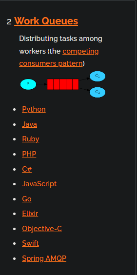
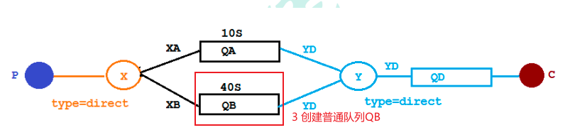
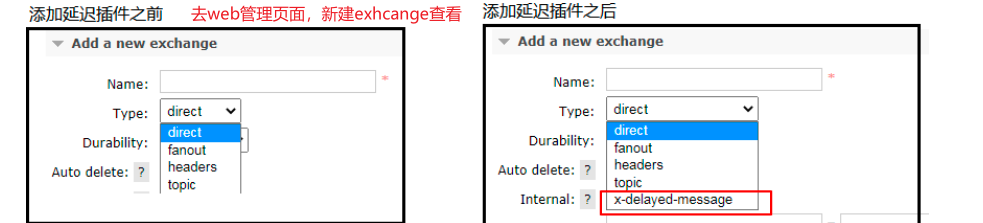
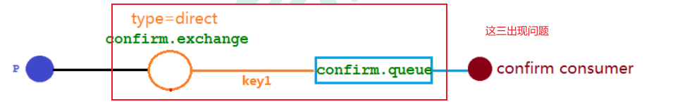
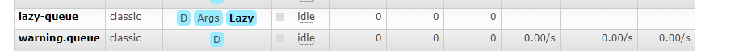

# 前言

四大章节，带 * 的为重点章节

# 第一章 入门

## 1.  MQ的相关概念

### 1.1  什么是MQ

​	MQ(message queue)，从字面意思上看，本质是个队列，FIFO 先入先出，只不过队列中存放的内容是 message 而已，还是一种跨进程的通信机制，用于上下游传递消息。在互联网架构中，MQ 是一种非常常见的上下游“逻辑解耦+物理解耦”的消息通信服务。使用了 MQ 之后，消息发送上游只需要依赖 MQ，不用依赖其他服务。

### 1.2 为什么要用MQ

+ 流量消峰

  > 举个例子，如果订单系统最多能处理一万次订单，这个处理能力应付正常时段的下单时绰绰有余，正 常时段我们下单一秒后就能返回结果。但是在高峰期，如果有两万次下单操作系统是处理不了的，只能限 制订单超过一万后不允许用户下单。使用消息队列做缓冲，我们可以取消这个限制，把一秒内下的订单分 散成一段时间来处理，这时有些用户可能在下单十几秒后才能收到下单成功的操作，但是比不能下单的体 验要好。
  >
  > 

+ 应用解耦

  > 以电商应用为例（图1），应用中有订单系统、库存系统、物流系统、支付系统。用户创建订单后，如果耦合 调用库存系统、物流系统、支付系统，任何一个子系统出了故障，都会造成下单操作异常。
  >
  > 当转变成基于 消息队列的方式后（图2），系统间调用的问题会减少很多，比如物流系统因为发生故障，需要几分钟来修复。在 这几分钟的时间里，物流系统要处理的内存被缓存在消息队列中，用户的下单操作可以正常完成。当物流 系统恢复后，继续处理订单信息即可，中单用户感受不到物流系统的故障，提升系统的可用性。
  >
  > 

+ 异步处理

  > 有些服务间调用是异步的，例如 A 调用 B，B 需要花费很长时间执行，但是 A 需要知道 B 什么时候可 以执行完，以前一般有两种方式
  >
  > + A 过一段时间去调用 B 的查询 api 查询
  > + 或者 A 提供一个 callback api， B 执行完之后调用 api 通知 A 服务。
  >
  > 这两种方式都不是很优雅。
  >
  > 使用消息总线，可以很方便解决这个问题， A 调用 B 服务后，只需要监听 B 处理完成的消息，当 B 处理完成后，会发送一条消息给 MQ，MQ 会将此消 息转发给 A 服务。这样 A 服务既不用循环调用 B 的查询 api，也不用提供 callback api。同样B 服务也不用 做这些操作。A 服务还能及时的得到异步处理成功的消息。
  >
  > 

### 1.3 MQ分类

+ ActiveMQ

  > 优点：单机吞吐量万级，时效性 ms 级，可用性高，基于主从架构实现高可用性，消息可靠性较 低的概率丢失数据 
  >
  > 缺点:官方社区现在对 **ActiveMQ 5.x 维护越来越少，高吞吐量场景较少使用**。

+ Kafka

  > 大数据的杀手锏，谈到大数据领域内的消息传输，则绕不开 Kafka，这款**为大数据而生**的消息中间件， 以其**百万级 TPS **的吞吐量名声大噪，迅速成为大数据领域的宠儿，在数据采集、传输、存储的过程中发挥 着举足轻重的作用。目前已经被 LinkedIn，Uber, Twitter, Netflix 等大公司所采纳。
  >
  >  优点: 性能卓越，单机写入 TPS 约在百万条/秒，最大的优点，就是**吞吐量高**。时效性 ms 级可用性非 常高，kafka 是分布式的，一个数据多个副本，少数机器宕机，不会丢失数据，不会导致不可用,消费者采 用 Pull 方式获取消息, 消息有序, 通过控制能够保证所有消息被消费且仅被消费一次;有优秀的第三方Kafka Web 管理界面 Kafka-Manager；在日志领域比较成熟，被多家公司和多个开源项目使用；功能支持： 功能 较为简单，**主要支持简单的 MQ 功能，在大数据领域的实时计算以及日志采集被大规模使用 **
  >
  > 缺点：Kafka 单机超过 64 个队列/分区，Load 会发生明显的飙高现象，队列越多，load 越高，发送消 息响应时间变长，使用短轮询方式，实时性取决于轮询间隔时间，消费失败不支持重试；支持消息顺序， 但是一台代理宕机后，就会产生消息乱序，**社区更新较慢**；

+ RocketMQ

  > RocketMQ 出自阿里巴巴的开源产品，用 Java 语言实现，在设计时参考了 Kafka，并做出了自己的一 些改进。被阿里巴巴广泛应用在订单，交易，充值，流计算，消息推送，日志流式处理，binglog 分发等场 景。
  >
  >  优点:**单机吞吐量十万级,可用性非常高**，分布式架构,**消息可以做到 0 丢失**,MQ 功能较为完善，还是分 布式的，扩展性好,**支持 10 亿级别的消息堆积**，不会因为堆积导致性能下降,源码是 java 我们可以自己阅 读源码，定制自己公司的 MQ 
  >
  > 缺点：**支持的客户端语言不多**，目前是 java 及 c++，其中 c++不成熟；社区活跃度一般,没有在MQ 核心中去实现 JMS 等接口,有些系统要迁移需要修改大量代码

+ RabbitMQ

  > 官网：https://www.rabbitmq.com/news.html 
  >
  > 2007 年发布，是一个在AMQP(高级消息队列协议)基础上完成的，可复用的企业消息系统，是当前**最主流的消息中间件之一**。 
  >
  > 优点:由于 **erlang 语言的高并发特性，性能较好；吞吐量到万级，MQ 功能比较完备,健壮、稳定、易 用、跨平台、支持多种语言** 如：Python、Ruby、.NET、Java、JMS、C、PHP、ActionScript、XMPP、STOMP 等，支持 AJAX 文档齐全；开源提供的管理界面非常棒，用起来很好用,**社区活跃度高**；更新频率相当高 
  >
  > 缺点：商业版需要收费,学习成本较高

### 1.4 MQ的选择

+ Kafka

  > Kafka 主要特点是基于Pull 的模式来处理消息消费，追求高吞吐量，一开始的目的就是用于日志收集 和传输，适合产生**大量数据**的互联网服务的数据收集业务。**大型公司建议可以选用，如果有日志采集功能， 肯定是首选 kafka 了**。

+ RocketMQ

  > 天生为**金融互联网领域**而生，对于**可靠性要求很高**的场景，**尤其是电商里面的订单扣款，以及业务削 峰，在大量交易涌入时，后端可能无法及时处理的情况**。RoketMQ 在稳定性上可能更值得信赖，这些业务 场景在阿里双 11 已经经历了多次考验，如果你的业务有上述并发场景，建议可以选择 RocketMQ。

+ RabbitMQ

  > 结合 erlang 语言本身的并发优势，性能好**时效性微秒级，社区活跃度也比较高**，管理界面用起来十分 方便，如果你的**数据量没有那么大**，**中小型公司**优先选择功能比较完备的 RabbitMQ。

## 2. RabbitMQ

### 2.1 RabbitMQ的概念

RabbitMQ 是一个消息中间件：它接受并转发消息。你可以把它当做一个快递站点，当你要发送一个包 裹时，你把你的包裹放到快递站，快递员最终会把你的快递送到收件人那里，按照这种逻辑 RabbitMQ 是 一个快递站，一个快递员帮你传递快件。

**RabbitMQ** 与快递站的主要区别在于，它不处理快件而是**接收， 存储和转发消息数据。**

### 2.2 四大核心概念

+ 生产者

  > 产生数据发送消息的程序是生产者

+ 交换机

  > 交换机是 RabbitMQ 非常重要的一个部件，
  >
  > + 一方面它接收来自生产者的消息，
  > + 另一方面它将消息 推送到队列中。
  >
  > 交换机必须确切知道如何处理它接收到的消息，是将这些消息推送到特定队列还是推 送到多个队列，亦或者是把消息丢弃，这个得由**交换机类型决定**

+ 队列

  > 队列是 RabbitMQ 内部使用的一种数据结构，尽管消息流经 RabbitMQ 和应用程序，但它们只能存 储在队列中。**队列仅受主机的内存和磁盘限制的约束**，本质上是一个大的消息缓冲区。许多生产者可 以将消息发送到一个队列，许多消费者可以尝试从一个队列接收数据。这就是我们使用队列的方式

+ 消费者

  > 消费与接收具有相似的含义。消费者大多时候是一个等待接收消息的程序。请注意生产者，消费 者和消息中间件很多时候并不在同一机器上。同一个应用程序既可以是生产者又是可以是消费者。


### 2.3 RabbitMQ的六大核心模式


### 2.4 RobbitMQ的工作原理


> **Borker：**接收和分发消息的应用，RabbitMQ Server 就是 Message Broker
>
> **Virtual Host：**出于多租户和安全因素设计的，把 AMQP 的基本组件划分到一个虚拟的分组中，类似 于网络中的 namespace 概念。当多个不同的用户使用同一个 RabbitMQ server 提供的服务时，可以划分出 多个 vhost，每个用户在自己的 vhost 创建 exchange／queue 等
>
> **Connection：**：publisher／consumer 和 broker 之间的 TCP 连接
>
> **Channel：**如果每一次访问 RabbitMQ 都建立一个 Connection，在消息量大的时候建立 TCP Connection 的**开销将是巨大的，效率也较低**。Channel 是在 connection 内部建立的逻辑连接，如果应用程 序支持多线程，通常每个 thread 创建单独的 channel 进行通讯，AMQP method 包含了 channel id 帮助客 户端和 message broker 识别 channel，所以 channel 之间是完全隔离的。**Channel 作为轻量级的 Connection 极大减少了操作系统建立 TCP connection 的开销**
>
> **Exchange：**message 到达 broker 的第一站，根据分发规则，匹配查询表中的 routing key，分发 消息到 queue 中去。常用的类型有：direct (point-to-point), topic (publish-subscribe) and fanout (multicast)
>
> **Queue：**消息最终被送到这里等待 consumer 取走
>
> **Binding：**exchange 和 queue 之间的虚拟连接，binding 中可以包含 routing key，Binding 信息被保 存到 exchange 中的查询表中，用于 message 的分发依据

### 2.5 安装

#### 下载安装软件：

```sh
# 下载 erlang-21.3.8.14-1.el7.x86_64.rpm 
//curl -s https://packagecloud.io/install/repositories/rabbitmq/erlang/script.rpm.sh | sudo bash
//sudo yum install erlang-21.3.8.14-1.el7.x86_64
# 离线下载
rpm -ivh erlang-21.3-1.el7.x86_64.rpm
# 检验erlang是否成功安装
erl
ssl:versions().  #注意最后面有个点的
halt(). #退出验证
```


```sh
# 安装rabbitmq的依赖（必须安装）
yum install socat -y
# 离线安装 rabbitmq-server-3.8.8-1.el7.moarch.rpm，支持erlang21.3 兼容erlang23 
rpm -ivh rabbitmq-server-3.8.8-1.el7.noarch.rpm
```

#### ***Rabbit服务常用命令：***

```sh
# 添加开机启动RabbitMQ服务
chkconfig rabbitmq-server on
# 启动rabbitmq服务
/sbin/service rabbitmq-server start
# 查看rabbitmq服务状态
/sbin/service rabbitmq-server status
# 停止rabbitmq服务
/sbin/service rabbitmq-service stop	
```


#### ***开启rabbitmq的web管理插件***

rabbitmq默认由一个guest用户密码也是guest（管理员权限）但是只允许本地登陆

```sh
# 开启web管理插件
rabbitmq-plugins enable rabbitmq_management
# 创建账户 ly 密码 1024
rabbitmqctl add_user ly 1024
# 设置用户角色
rabbitmqctl set_user_tags ly administrator

# 设置用户权限 
# 格式：set_permissions [-p <vhostpath>] <user> <conf> <write> <read>
rabbitmqctl set_permissions -p "/" ly ".*" ".*" ".*" #用户ly具有vhost1 这个virtual host中所有资源的配置、读、写权限

#列出当前rabbitmq所有的用户和角色
rabbitmqctl list_users
```

访问地址：http://127.0.0.1:15672


# 第二章 核心部分*

## 1. Hello World


在本教程的这一部分中，我们将用 Java 编写两个程序。发送单个消息的生产者和接收消息并打印 出来的消费者。我们将介绍 Java API 中的一些细节。 

在下图中，“ P”是我们的生产者，“ C”是我们的消费者。中间的框是一个队列-RabbitMQ 代 表使用者保留的消息缓冲区


### 1.1 创建maven工程，并引入依赖

```xml
<dependencies>
    <!--rabbitmq 依赖客户端-->
    <dependency>
        <groupId>com.rabbitmq</groupId>
        <artifactId>amqp-client</artifactId>
        <version>5.8.0</version>
    </dependency>
    <!--操作文件流的一个依赖-->
    <dependency>
        <groupId>commons-io</groupId>
        <artifactId>commons-io</artifactId>
        <version>2.6</version>
    </dependency>
</dependencies>
```

### 1.2  生产者代码

```java
public class Producer {
    //队列名称 （大写转换快捷键 ctrl + shift + U）
    public static final String QUEUE_NAME = "hello";

    //发消息
    public static void main(String[] args) throws IOException, TimeoutException {
        //设置rabbitmq连接工厂（不用指定port）
        ConnectionFactory connectionFactory = new ConnectionFactory();
        connectionFactory.setHost("192.168.77.3");
        connectionFactory.setUsername("ly");
        connectionFactory.setPassword("1024");

        //得到一个rabbitmq连接
        Connection connection = connectionFactory.newConnection();
        //由于rabbit的connect连接创建消耗很大，所以是通过信道channel进行通信，获取信道
        Channel channel = connection.createChannel(1);

        /**
         * 使用默认交换机，则直接跳过创建交换机，直接连接队列
         * 参数：
         *      queue：队列名称
         *      durable：是否持久化（保存到硬盘还是内存），服务重启后依然可用
         *      exclusive：是否排他，即是否为独占队列
         *      autoDelete：是否自动删除（服务器不使用它时自动删除）
         *      arguments： 传递的参数
         */
        channel.queueDeclare(QUEUE_NAME, false, false, false, null);

        /**
         * 发送消息
         * 参数：
         *  exchange：消息发布到的交换机，第一次使用默认的
         *  routingKey：路由key，后面再学,本次是队列名称
         *  props：消息的其他属性，如路由的表头等等
         *  body：消息体（byte[]）
         */

        channel.basicPublish("",QUEUE_NAME,null,"hello rabbitmq".getBytes());

        System.out.println("消息发送完毕!");

    }
}
```


### 1.3 消费者代码

```java
public class Consumer {

    public static String QUEUE_NAME = "hello";

    public static void main(String[] args) throws IOException, TimeoutException {
        //设置rabbitmq连接工厂
        ConnectionFactory connectionFactory = new ConnectionFactory();
        connectionFactory.setHost("192.168.77.3");
        connectionFactory.setUsername("ly");
        connectionFactory.setPassword("1024");

        //得到一个rabbitmq连接
        Connection connection = connectionFactory.newConnection();
        //创建信道接受消息
        Channel channel = connection.createChannel();
        System.out.println("信道id = " + channel.getChannelNumber());

        /**
         *
         * 参数：
         *  queue：要消费的队列名称
         *  autoAck： true表示消费成功后自动应答，false表示手动应答
         *  deliverCallback：消息被传递时的回调
         *  cancelCallback：消费取消时的回调
         */
        channel.basicConsume(
                QUEUE_NAME,
                true,
                (consumerTag, message) -> {
                    //lambda表达式，接受mq队列中的消息时的回调
                    System.out.println("hello队列消息被传递");
                    System.out.println("consumerTag=" + consumerTag);
                    System.out.println("message=" + new String(message.getBody()));

                },
                consumerTag -> {
                    //lambda表达式，消费行为被取消的回调
                    System.out.println("hello队列的消费行为被取消");
                    System.out.println("consumerTag=" + consumerTag);
                });

    }
}
```


## 2. Work Queues



​	工作队列（又叫任务队列）的主要思想是避免立即执行资源密集型任务，而不得不等待它完成。相反我们安排任务，在之后执行。我们把任务封装为消息并将其发送到队列。在后台运行的工作进程将弹出任务并最终执行作业。当有多个工作线程时，这些线程将一起竞争处理这些任务。（一个任务只能被一个线程处理）


### 2.1 轮询分发消息

如果针对多个生产者多个消费者同时工作在同一个队列，rabbitmq默认采用的就是轮询分发消息，同一个队列的消息，采用“你一个我一个”的模式被消费掉

***生产者代码：***

```java
public class Producer {

    public static void main(String[] args) throws IOException, TimeoutException {
        String thread = UUID.randomUUID().toString().replace("-", "").substring(0, 5);
        Channel channel = RabbitMQUtils.getNewChannel();

        System.out.println("生产者 [ " + thread + " ]开始生产大量的消息！");
        //声明一个队列
        channel.queueDeclare(RabbitMQUtils.getQueueName(),false,false,false,null);

        //从控制台接收消息
        Scanner scanner = new Scanner(System.in);
        while (scanner.hasNext()) {
            System.out.println("请输入要发送的消息：");
            String message = scanner.next();

            channel.basicPublish(
                    //默认交换机
                    "",
                    //路由key 此处为名字为hello的队列
                    RabbitMQUtils.getQueueName(),
                //无参数
                    null,
                //消息体
                    message.getBytes()
            );

            System.out.println("消息：【" + message + "】 已经成功发送！");
        }
    }
}
```

***消费者代码：***

```java
public class Consumer {

    public static void main(String[] args) throws IOException, TimeoutException {
        String thread = UUID.randomUUID().toString().replace("-", "").substring(0, 5);
        Channel channel = RabbitMQUtils.getNewChannel();
        System.out.println("消费者 [ "  + thread + " ] 等待消费。。。");
        // 1/n 众多消费者之一
        channel.basicConsume(
                // 名字为 hello 的队列
                RabbitMQUtils.getQueueName(),
                true,
                // 接收队列中消息的回调函数
                (consumerTag, message) -> {
                    System.out.println("消费者 [ "  + thread + " ]接收到的消息：" + new String(message.getBody()));
                },
                // 消费者取消消费的回调函数
                consumerTag -> {});
    }
}
```

***测试：***


### 2.2 消息应答（Message Acknowledge）

<font color='red'>如果队列在消费设置为手动应答`ACK Manual`则rabbitmq会自动将断开连接的消费者所消费的消息自动重新入队，按照轮询（一人一个）的原则分发消息</font>

#### 1. 概念

​	消费者完成一个任务可能需要一段时间，如果其中一个消费者处理一个长的任务并仅只完成 了部分突然它挂掉了，会发生什么情况。RabbitMQ 一旦向消费者传递了一条消息，便立即将该消 息标记为删除。在这种情况下，突然有个消费者挂掉了，我们将丢失正在处理的消息。以及后续 发送给该消费这的消息，因为它无法接收到。

​	为了保证消息在发送过程中不丢失，rabbitmq 引入消息应答机制，消息应答就是:**消费者在接收 到消息并且处理该消息之后，告诉 rabbitmq 它已经处理了，rabbitmq 可以把该消息删除了。**

#### 2. 自动应答（Auto ACK）

​	**消息发送后立即被认为已经传送成功（不推荐）**，这种模式需要在高吞吐量和数据传输安全性方面做权 衡,因为这种模式如果消息在接收到之前，消费者那边出现连接或者 channel 关闭，那么消息就丢失 了,当然另一方面这种模式消费者那边可以传递过载的消息，没有对传递的消息数量进行限制，当 然这样有可能使得消费者这边由于接收太多还来不及处理的消息，导致这些消息的积压，最终使 得内存耗尽，最终这些消费者线程被操作系统杀死，所以**这种模式仅适用在消费者可以高效并以 某种速率能够处理这些消息的情况下使用**。

#### 3. 消息手动应答的方法

消息的重新入队可能会产生二次消费问题，所以需要谨慎处理

```java
//com.rabbitmq.client.Channel

	/**
	 * 消息的肯定应答
	 * @deliveryTag 消息携带的tag标签 
	 * @multiple 表示是否批量ack处理当前信道内tag小于本条消息tag的消息（已经被处理，但是没有应答ack），true表示批量ack消息
	 *      例子：比如当前信道内（多个队列）有消息tag为56789，当前处理的消息tag为8
	 *            如果multiple=true的话则 则5，6，7，8均会被ack确认
     */
void basicAck(long deliveryTag, boolean multiple) throws IOException;

/**
     * 消息的否定应答（单条或多条）
     * @deliveryTag 消息携带的tag标签 
	 * @multiple 表示是否批量ack处理当前信道内tag小于本条消息tag的消息（已经被处理，但是没有应答ack），true表示批量ack消息
	 *      例子：比如当前信道内（多个队列）有消息tag为56789，当前处理的消息tag为8
	 *            如果multiple=true的话则 则5，6，7，8均会被ack确认
	 * @requeue 表示被拒绝消息们是否重新入队，true，重新入队，false，不入队
     */
void basicNack(long deliveryTag, boolean multiple, boolean requeue)
    throws IOException;

/**
     * 单条消息的否定应答
     * @deliveryTag 消息的携带的tag标签 
     * @requeue 表示被消费后的拒绝的此条消息是否重新入队
     */
void basicReject(long deliveryTag, boolean requeue) throws IOException;
```

#### 4. 批量处理Multiple

表示是否批量ack处理**当前信道（多队列）内tag小于本条消息tag的消息（已经被处理，但是没有应答ack）**，true表示批量ack消息
例子：比如当前信道内（多个队列）有消息tag为56789，当前处理的消息tag为8，如果multiple=true的话则 则5，6，7，8均会被ack确认。如果为false则只会处理当前本条消息


#### 5. 消息重新入队

如果消费者由于某些原因失去连接(其通道已关闭，连接已关闭或 TCP 连接丢失)，导致消息 未发送 ACK 确认，RabbitMQ 将了解到消息未完全处理，并将对其重新排队。如果此时其他消费者 可以处理，它将很快将其重新分发给另一个消费者。这样，即使某个消费者偶尔死亡，也可以确 保不会丢失任何消息。

> **两个问题**
>
> + 消息重新入队的配置？
> + 二次消费问题


#### 6.消息手动应答（代码演示）

注意新的队列，必须要先启动生产者建立新的队列否则，先启动消费者会报错，因为要消费的队列不存在

***生产者：***

```java
/**
 * FileName:Producer.class
 * Author:ly
 * Date:2022/12/1 0001
 * Description: 消息的手动应答保证不丢失，多个消费者消费时间久的，放回队列重新消费 - 生产者
 */
public class Producer {
    private static final String TASK_QUEUE_NAME = "ack_queue";

    //发消息
    public static void main(String[] args) throws IOException, TimeoutException {
        Channel channel = RabbitMQUtils.getNewChannel();

        System.out.println("生产者 [producer]开始生产大量的消息！");
        //声明一个队列
        channel.queueDeclare(TASK_QUEUE_NAME, false, false, false, null);

        //从控制台接收消息
        Scanner scanner = new Scanner(System.in);
        while (scanner.hasNext()) {
            System.out.println("请输入要发送的消息：");
            String message = scanner.next();

            channel.basicPublish(
                    //默认交换机
                    "",
                    //路由key 此处为名字为hello的队列
                    TASK_QUEUE_NAME,
                    null,
                    message.getBytes(StandardCharsets.UTF_8)
            );

            System.out.println("消息：【" + message + "】 已经成功发送！");
        }
    }

}
```

***消费者_1：***

```java
/**
 * FileName:Consumer_1.class
 * Author:ly
 * Date:2022/12/2 0002
 * Description: 消息的手动应答保证不丢失，多个消费者消费时间久的，放回队列重新消费 - 消费者1
 */
public class Consumer_1 {
    private static final String TASK_QUEUE_NAME = "ack_queue";

    public static void main(String[] args) throws IOException, TimeoutException {
        System.out.println("消费者 [Consumer_1]等待接收消息（处理时间很快的）！");
        Channel channel = RabbitMQUtils.getNewChannel();
        channel.basicConsume(
                //队列名
                TASK_QUEUE_NAME,
                //手动应答
                false,
                //消费消息
                (consumerTag, message) -> {
                    System.out.println("消费者 [Consumer_1] 接收到的消息：" + new String(message.getBody(), StandardCharsets.UTF_8));
                    try {
                        Thread.sleep(1000);
                    } catch (InterruptedException e) {
                        e.printStackTrace();
                    }

                    //手动应答
                    channel.basicAck(message.getEnvelope().getDeliveryTag(),false);
                    System.out.println("=======================本次消费结束==========================");
                },
                //取消消费消息的回调
                consumerTag -> {System.out.println("消费者 [Consumer_1]取消消息回调函数！");}
                );
    }
}
```

***消费者_2：***

```java
public class Consumer_2 {
    private static final String TASK_QUEUE_NAME = "ack_queue";

    public static void main(String[] args) throws IOException, TimeoutException {
        System.out.println("消费者 [Consumer_2]等待接收消息（处理时间很快的）！");
        Channel channel = RabbitMQUtils.getNewChannel();
        channel.basicConsume(
                //队列名
                TASK_QUEUE_NAME,
                //手动应答
                false,
                //消费消息
                (consumerTag, message) -> {
                    System.out.println("消费者 [Consumer_2] 接收到的消息：" + new String(message.getBody(), StandardCharsets.UTF_8));
                    try {
                        Thread.sleep(30000);
                    } catch (InterruptedException e) {
                        e.printStackTrace();
                    }

                    //手动应答
                    channel.basicAck(message.getEnvelope().getDeliveryTag(),false);
                    System.out.println("=======================本次消费结束==========================");
                },
                //取消消费消息的回调
                consumerTag -> {System.out.println("消费者 [Consumer_2]取消消息回调函数！");}
        );
    }
}
```

***结果演示：***


### 2.3 RabbitMQ持久化

​	刚刚我们已经看到了如何处理任务不丢失的情况，但是如何**保障当 RabbitMQ 服务停掉以后消息生产者发送过来的消息不丢失**。**默认情况**下 RabbitMQ 退出或由于某种原因崩溃时，它**忽视队列 和消息**，除非告知它不要这样做。**确保消息不会丢失需要做两件事：我们需要将队列和消息都标 记为持久化。**

#### 2.3.1 队列持久化（Producer/Administrator端）

创建/声明队列时，有一个参数可以选择是否持久化

```java
//设置队列持久化
boolean durable = true;
//声明一个队列
channel.queueDeclare(TASK_QUEUE_NAME, durable, false, false, null);
```

***注意：***

​	如果队列已经创建，是没有办法更改其持久化属性的。除非将该队列删除重新创建时`开启（关闭）持久化`。

否则启动时或报错：

此时就算重启rabbitmq该队列也会存在

#### 2.3.2 消息持久化（Producer端）

发布消息时，有一个参数可以选择是否持久化

```java
channel.basicPublish(
        //默认交换机
        "",
        //路由key 此处为名字为hello的队列
        TASK_QUEUE_NAME,
        //消息(text/plain格式 也可以设置octet流文本)持久化
        MessageProperties.PERSISTENT_TEXT_PLAIN,
        message.getBytes(StandardCharsets.UTF_8)
);

/*
	MessageProperties 枚举类，里面定义了 消息持久化/非持久化类型
	
*/
```

***注意：***

​	将消息标记为持久化并不能完全保证不会丢失消息。尽管它告诉 RabbitMQ 将消息保存到磁盘，但是 这里依然存在当消息刚准备存储在磁盘的时候 但是还没有存储完，消息还在缓存的一个间隔点。此时并没 有真正写入磁盘。持久性保证并不强，但是对于我们的简单任务队列而言，这已经绰绰有余了。如果需要 更强有力的持久化策略，参考后边的**发布确认章节（[Publisher Confirms](https://www.rabbitmq.com/tutorials/tutorial-seven-java.html)）**。

### 2.4 ==不公平分发（Consumer端）*==

**加权轮询（轮询+prefetch）**

**虽然说得是不公平分发，实际还是公平分发（轮询），因为都是按照预取值`prefetch`的大小进行分发的，唯一可变的就是`prefetch`值的大小**

> RabbitMQ中预取值`prefetch`默认为`0`，这就意味着队列向（连接某一消费者的）信道缓冲区发送消息是无限制，无穷大的。所以按照公平轮询的原则无论消费者客户机处理消息的速度是慢还是快，都会公平的“你一个我一个”进行轮询，最坏的情况就是把处理慢的客户机撑死了（内存溢出）。
>
> 通过修改预取值`prefetch`的大小，来控制消息缓冲区的大小，从而达到不公平分发。比如有5，6，7，8四条消息分发给a，b两个消费客户机，由于a处理消息的速度非常快，b处理消息的速度非常慢，此时**设置prefetch=1**，那么按照轮询方式假设5分配个a，6分配给b。**队列就会按照公平轮询的原则，并同时检测a信道缓冲区的数量，如果变为0就7分配给a**（因为a很快，所以就是0）。**那么在分发消息8时，b还在处理消息6，按照公平轮询的原则，应该发给b，但是b的信道缓冲区内消息数量不为0，为1（就是正在处理的消息6，打到了`prefetch`设置的上限）。那么队列就会轮询下一个消费客户机a，恰好a处理好了消息7，则队列就把消息分发给了a，由a处理。**

```java
//设置预取值为1，实现能者多劳(保证只要队列有消息，每个消费者都有1个消息)
int prefetch = 1;
//设置预取值
channel.basicQos(prefetch);

//下面就是消费的代码
channel.basicConsume(..)
```


***执行效果：***


### 2.5 预取值（prefetch）

​	本身消息的发送就是异步发送的，所以在任何时候，channel 上肯定不止只有一个消息另外来自消费 者的手动确认本质上也是异步的。因此这里就存在一个未确认的消息缓冲区，因此希望开发人员能**限制此 缓冲区的大小，以避免缓冲区里面无限制的未确认消息问题**。这个时候就可以通过使用 basic.qos 方法设 置“预取计数”值来完成的。**prefetch该值定义通道上允许的未确认消息的最大数量**。一旦数量达到配置的数量， RabbitMQ 将停止在通道上传递更多消息，除非至少有一个未处理的消息被确认ack，例如，假设在通道上有 未确认的消息 5、6、7，8，并且通道的预取计数设置为 4，此时RabbitMQ 将不会在该通道上再传递任何 消息，除非至少有一个未应答的消息被 ack。比方说 tag=6 这个消息刚刚被确认 ACK，RabbitMQ 将会感知 这个情况到并再发送一条消息。消息应答和 QoS 预取值对用户吞吐量有重大影响。通常，增加预取将提高 向消费者传递消息的速度。

​	***虽然自动应答传输消息速率是最佳的，但是，在这种情况下已传递但尚未处理的消息的数量也会增加，从而增加了消费者的 RAM 消耗**应该小心使用具有无限预处理 的自动确认模式或手动确认模式，消费者消费了大量的消息如果没有确认的话，会导致消费者连接节点的 内存消耗变大，所以找到合适的预取值是一个反复试验的过程，不同的负载该值取值也不同 100 到 300 范 围内的值通常可提供最佳的吞吐量，并且不会给消费者带来太大的风险。预取值为 1 是最保守的。当然这 将使吞吐量变得很低，特别是消费者连接延迟很严重的情况下，特别是在消费者连接等待时间较长的环境 中。对于大多数应用来说，稍微高一点的值将是最佳的。


## 3. Publish/Subcribe

​	在上一节中，我们创建了一个工作队列。我们假设的是工作队列背后，每个任务都恰好交付给一个消 费者(工作进程)。在这一部分中，我们将做一些完全不同的事情-我们将消息传达给多个消费者。这种模式 称为 ”发布/订阅”.

​	 为了说明这种模式，我们将构建一个简单的日志系统。它将由两个程序组成:第一个程序将发出日志消 息，第二个程序是消费者。其中我们会启动两个消费者，其中一个消费者接收到消息后把日志存储在磁盘，另外一个消费者接收到消息后把消息打印在屏幕上，事实上第一个程序发出的日志消息将广播给所有消费者。


### 3.1 Exchange 交换机

​	RabbitMQ 消息传递模型的核心思想是: **生产者生产的消息从不会直接发送到队列**。实际上，通常生产 者甚至都不知道这些消息传递传递到了哪些队列中。

​	相反，**生产者只能将消息发送到交换机(exchange)**，交换机工作的内容非常简单，一方面它接收来 自生产者的消息，另一方面将它们推入队列。交换机必须确切知道如何处理收到的消息。是应该把这些消 息放到特定队列还是说把他们到许多队列中还是说应该丢弃它们。这就的由交换机的类型来决定。

#### 3.1.1 交换机类型

+ `Direct Exchange`：：**对应路由类型（Route）**
+ `Topic Exchange`：**对应主题类型（Topic）**
+ `Headers Exchange`：**对应头类型（不常用）**
+ `Fanout Exchange`：**对应发布订阅类型（Publish/Scribe）**


### 3.2 默认（无名）交换机

​	在本教程的前面部分我们对 exchange 一无所知，但仍然能够将消息发送到队列。之前能实现的 原因是因为我们使用的是默认交换，我们通过空字符串("")进行标识。

```java
//"" 代表默认/无名交换机 AMQP default
channel.basicPublish("",QUEUE,MessageProperties.PERSISTENT_TEXT_PLAIN,(i + "").getBytes());
```

​	第一个参数是交换机的名称。空字符串表示默认或无名称交换机：**消息能路由发送到队列中其实 是由 routingKey(bindingkey)绑定 key 指定的**，如果它存在的话。**如果使用默认交换机，则第二个参数routingKey就是队列名字；如果定义了交换机则routingKey必须为设置的值而不是队列名。**

### 3.3 临时队列

​	每当我们连接到 Rabbit 时，我们都需要一个全新的空队列，为此我们可以创建一个具有随机名称 的队列，或者能让服务器为我们选择一个随机队列名称那就更好了。其次一旦我们**断开了消费者的连 接，队列将被自动删除（即未持久化的队列）**。


### 3.4 Binding绑定

**交换机绑定很多队列，每个被绑定的队列都有一个唯一标识RoutingKey，每次发消息给队列时都是通过RoutingKey（高并发，有选择的发送）**

​	什么是 bingding 呢，binding 其实是 exchange 和 queue 之间的桥梁，它告诉我们 exchange 和那个队 列进行了绑定关系。比如说下面这张图告诉我们的就是 X 与 Q1 和 Q2 进行了绑定。


### 3.5 Fanout Exchange （发布订阅，都能接收到）*

+ Fanout 这种类型非常简单。正如从名称中猜到的那样，它是==**将接收到的所有消息广播到它知道的 所有队列中**==。
+ ==***Java代码中交换机、队列及其关系绑定RoutingKey随便在哪方写，都可以（即Producer或Consumer方都可以写）***==
+ 当然**所有队列RoutingKey可以设置为相同，或者都为""**更符合发布订阅的说法

#### 3.5.1 生产者代码

***注意：***

```java
//因为是fanout类型的交换机，所以只要是绑定了该交换机的队列a\b\c\d..，只要你往任意队列如c发送消息，则其余所有绑定过的队列abd..都会相同的消息【此为谓之：发布订阅】

//如下面 向两个队列发送消息，则其余所有都会受到这两个消息 包含他俩
channel.basicPublish(EXCHANGE_NAME,ROUTING_KEY_1, null,"hello fanout！ -c1".getBytes(StandardCharsets.UTF_8)); //都有 c1

channel.basicPublish(EXCHANGE_NAME,ROUTING_KEY_2, null,"hello fanout！ -c2".getBytes(StandardCharsets.UTF_8));//都有c2

//到这一步所有队列中都有-c1和-c2的消息
```


```java
public class Producer {
    //交换机名称和RoutingKey和队列名字 【当然RoutingKey可以设置为相同，或者都为""更符合发布订阅的说法】
    private static final String EXCHANGE_NAME = RoutingKey.EXCHANGE_NAME.getRoutingKey();
    private static final String ROUTING_KEY_1 = RoutingKey.FANOUT_1.getRoutingKey();
    private static final String ROUTING_KEY_2 = RoutingKey.FANOUT_2.getRoutingKey();
    private static final String queue_1 = RoutingKey.FANOUT_1.getQueueName();
    private static final String queue_2 = RoutingKey.FANOUT_2.getQueueName();

    public static void main(String[] args) throws IOException, TimeoutException {
        Channel channel = RabbitMQUtils.getNewChannel();
        //打开发布确认功能
        channel.confirmSelect();

        //创新新的fanout类型的交换机
        channel.exchangeDeclare(EXCHANGE_NAME, BuiltinExchangeType.FANOUT);
        //创建队列
        channel.queueDeclare(queue_1,true,false,false,null);
        channel.queueDeclare(queue_2,true,false,false,null);
        //绑定队列，设置路由key （复习枚举类） fanout类型的routingKey可以不写，只要绑定的队列都能收到
        channel.queueBind(queue_1,EXCHANGE_NAME,ROUTING_KEY_1);
        channel.queueBind(queue_2,EXCHANGE_NAME,ROUTING_KEY_2);

        //接受异步发布确认函数
        channel.addConfirmListener(
                null,
                //失败处理，可以放在juc包里的线程安全类中，根据deliverTag进行重发
                (deliveryTag, multiple) -> System.out.println("有消息发布失败，deliverTag=" + deliveryTag));

        //发送消息 fanout交换机 每个绑定的队列都能收到不仅限于ROUTING_KEY_1对应的队列
        channel.basicPublish(EXCHANGE_NAME,ROUTING_KEY_1, null,"hello fanout！".getBytes(StandardCharsets.UTF_8));
        //channel.basicPublish(EXCHANGE_NAME,ROUTING_KEY_1, null,"hello fanout！ -c1".getBytes(StandardCharsets.UTF_8));
        //channel.basicPublish(EXCHANGE_NAME,ROUTING_KEY_2, null,"hello fanout！ -c2".getBytes(StandardCharsets.UTF_8));
        System.out.println("生产者消息发布成功：" + EXCHANGE_NAME + " - " + queue_1 + " - " + ROUTING_KEY_1);
        System.out.println("生产者消息发布成功：" + EXCHANGE_NAME + " - " + queue_2 + " - " + ROUTING_KEY_2);

    }
}
```

#### 3.5.2 消费者1代码

```java
public class Consumer_1 {
    //队列名字
    private static final String queue_1 = RoutingKey.FANOUT_1.getQueueName();

    public static void main(String[] args) throws IOException, TimeoutException {
        Channel channel = RabbitMQUtils.getNewChannel();

        channel.basicConsume(
                queue_1,//只能接受queue_1的消息
                //手动应答
                false,
                //成功消费
                (consumerTag, message) -> {
                    System.out.println("消费者C1 获取消息：msg=" + new String(message.getBody(), StandardCharsets.UTF_8));
                    channel.basicAck(message.getEnvelope().getDeliveryTag(),false);
                },
                //取消消费
                (consumerTag, sig) -> System.out.println("消费者C1取消消费！")
                );
    }
}
```

#### 3.5.3 消费者2代码

```java
public class Consumer_2 {
    //队列名字
    private static final String queue_2 = RoutingKey.FANOUT_2.getQueueName();

    public static void main(String[] args) throws IOException, TimeoutException {
        Channel channel = RabbitMQUtils.getNewChannel();

        channel.basicConsume(
                queue_2,//只能接受queue_2的消息
                //手动应答
                false,
                //成功消费
                (consumerTag, message) -> {
                    System.out.println("消费者C1 获取消息：msg=" + new String(message.getBody(), StandardCharsets.UTF_8));
                    channel.basicAck(message.getEnvelope().getDeliveryTag(),false);
                },
                //取消消费
                (consumerTag, sig) -> System.out.println("消费者C1取消消费！")
        );
    }
}
```

### 3.6 Direct Exchange（指定routingkey队列才能接受）*

<font color='red'>***和Fanout 类型交换机最大的区别就是，Direct类型的交换机只会把消息发送到指定routingkey对应的队列，其余队列（同一个交换机是接受不到的，不同交换机的队列更接受不到）***</font>


> 注意：在此模式下的**多重绑定**的队列就相当于**fanout的发布订阅模式**
>
> 

#### 3.6.1 生产者代码

**这次交换机和队列及RoutingKey的配置放在消费者端（两边都可以）**

```java
public class EmitLogDirect {
    private static final String EXCHANGE_NAME = "direct_logs";

    public static void main(String[] args) throws IOException, TimeoutException {
        Channel channel = RabbitMQUtils.getNewChannel();
        channel.basicPublish(EXCHANGE_NAME,"info",null,"hello info".getBytes());//只到队列console
        channel.basicPublish(EXCHANGE_NAME,"warning",null,"hello warning".getBytes());//只到队列console
        channel.basicPublish(EXCHANGE_NAME,"error",null,"hello error".getBytes());//只到队列disk

    }
}
```

#### 3.6.2 消费者1代码

**这次交换机和队列及RoutingKey的配置放在消费者端（两边都可以）**

```java
public class ReceiveLogsDirect01 {
    private static final String EXCHANGE_NAME = "direct_logs";
    private static final String queue = "console";

    public static void main(String[] args) throws IOException, TimeoutException {
        Channel channel = RabbitMQUtils.getNewChannel();
        //唯一的区别 direct类型
        channel.exchangeDeclare(EXCHANGE_NAME, BuiltinExchangeType.DIRECT);
        channel.queueDeclare(queue,false,false,false,null);
        channel.queueBind(queue,EXCHANGE_NAME,"info");
        channel.queueBind(queue,EXCHANGE_NAME,"warning");
		
        //代码完全一样
        channel.basicConsume(..);
       }
}
```


#### 3.6.3 消费者2代码

```java
public class ReceiveLogsDirect02 {
    private static final String EXCHANGE_NAME = "direct_logs";
    private static final String queue = "disk";

    public static void main(String[] args) throws IOException, TimeoutException {
        Channel channel = RabbitMQUtils.getNewChannel();
        //唯一的区别 direct类型
        channel.exchangeDeclare(EXCHANGE_NAME, BuiltinExchangeType.DIRECT);
        channel.queueDeclare(queue,false,false,false,null);
        channel.queueBind(queue,EXCHANGE_NAME,"error");

        channel.basicConsume(..);
    }
}
```

### 3.7 Topics Exchange*

和direct类型最大的区别是：==***（消费者）可以使用通配符进行队列匹配，一次选择多个队列的信息***==

> 生产者Producer发送消息到队列，还是指定的RoutingKey（如：quick.orange.rabbit），方便的是消费者。

发送到类型是 topic 交换机的消息的 routing_key 不能随意写，必须满足一定的要求，**它必须是一个单 词列表，以点号分隔开**。这些**单词可以是任意单词**，比如说："stock.usd.nyse", "nyse.vmw", "quick.orange.rabbit".这种类型的。当然这个**单词列表最多不能超过 255 个字节**。 

在这个规则列表中，其中有两个替换符是大家需要注意的：

+  ==`*(星号)` 可以代替一个单词==
+ ==`#(井号) `可以替代零个或多个单词==

#### 3.7.1 语言讲解


| RoutingKey               | 结果                                       |
| ------------------------ | ------------------------------------------ |
| quick.orange.rabbit      | 被队列 Q1Q2 接收到                         |
| lazy.orange.elephant     | 被队列 Q1Q2 接收到                         |
| quick.orange.fox         | 被队列 Q1 接收到                           |
| lazy.brown.fox           | 被队列 Q2 接收到                           |
| lazy.pink.rabbit         | 虽然满足两个绑定但只被队列 Q2 接收一次     |
| quick.brown.fox          | 不匹配任何绑定不会被任何队列接收到会被丢弃 |
| quick.orange.male.rabbit | 是四个单词不匹配任何绑定会被丢弃           |
| lazy.orange.male.rabbit  | 是四个单词但匹配 Q2                        |

#### 3.7.2 生产者代码

```java
public class EmitLogTopic {
    private static final String EXCHANGE_NAME = "topic_logs";

    public static void main(String[] args) throws IOException, TimeoutException {
        Channel channel = RabbitMQUtils.getNewChannel();

        //发送方向指定具体的RoutingKey发送数据，接收方通过通配符接收多个队列的消息
        channel.basicPublish(EXCHANGE_NAME,"quick.orange.rabbit",null,"被队列 Q1Q2 接收到".getBytes());
        channel.basicPublish(EXCHANGE_NAME,"lazy.orange.elephant",null,"被队列 Q1Q2 接收到".getBytes());
        channel.basicPublish(EXCHANGE_NAME,"quick.orange.fox",null,"被队列 Q1 接收到".getBytes());
        channel.basicPublish(EXCHANGE_NAME,"lazy.brown.fox",null,"被队列 Q2 接收到".getBytes());
        channel.basicPublish(EXCHANGE_NAME,"lazy.pink.rabbit",null,"虽然满足两个绑定但只被队列 Q2 接收一次".getBytes());
        channel.basicPublish(EXCHANGE_NAME,"quick.brown.fox",null,"不匹配任何绑定不会被任何队列接收到会被丢弃".getBytes());
        channel.basicPublish(EXCHANGE_NAME,"quick.orange.male.rabbit",null,"是四个单词不匹配任何绑定会被丢弃".getBytes());
        channel.basicPublish(EXCHANGE_NAME,"lazy.orange.male.rabbit",null,"是四个单词但匹配 Q2".getBytes());
    }
}
```

#### 3.7.3 消费者1代码

```java
public class ReceiveLogsTopic01 {
    private static final String EXCHANGE_NAME = "topic_logs";
    private static final String queue = "Q1";

    public static void main(String[] args) throws IOException, TimeoutException {
        Channel channel = RabbitMQUtils.getNewChannel();
        //topic类型
        channel.exchangeDeclare(EXCHANGE_NAME, BuiltinExchangeType.TOPIC);
        channel.queueDeclare(queue,false,false,false,null);
        channel.queueBind(queue,EXCHANGE_NAME,"*.orange.*");

        channel.basicConsume(
                queue,
                //手动应答
                false,
                //成功消费
                (consumerTag, message) -> {
                    System.out.println(message.getEnvelope().getRoutingKey()+ ":" + new String(message.getBody(), StandardCharsets.UTF_8));
                    channel.basicAck(message.getEnvelope().getDeliveryTag(),false);
                },
                //取消消费
                (consumerTag, sig) -> System.out.println("接收方01取消消费！")
        );
    }
}
```

#### 3.7.4 消费者2代码

```java
public class ReceiveLogsTopic02 {
    private static final String EXCHANGE_NAME = "topic_logs";
    private static final String queue = "Q2";

    public static void main(String[] args) throws IOException, TimeoutException {
        Channel channel = RabbitMQUtils.getNewChannel();
        //topic类型
        channel.exchangeDeclare(EXCHANGE_NAME, BuiltinExchangeType.TOPIC);
        channel.queueDeclare(queue,false,false,false,null);
        channel.queueBind(queue,EXCHANGE_NAME,"*.*.rabbit");
        channel.queueBind(queue,EXCHANGE_NAME,"lazy.#");

        channel.basicConsume(
                queue,
                //手动应答
                false,
                //成功消费
                (consumerTag, message) -> {
                    System.out.println(message.getEnvelope().getRoutingKey()+ ":" + new String(message.getBody(), StandardCharsets.UTF_8));
                    channel.basicAck(message.getEnvelope().getDeliveryTag(),false);
                },
                //取消消费
                (consumerTag, sig) -> System.out.println("接收方02取消消费！")
        );
    }
}
```

#### 3.7.5 测试


## 4. Routing  （direct交换机）*

见 章节 *`3.6 Direct Exchange（指定routingkey队列才能接受）`*

## 5.Topics  （topic交换机）*

见章节：*`3.7 Topics Exchange*`*

## 7. Header （header交换机）

不常用，见官网文档 ：[RabbitMQ Tutorials — RabbitMQ](https://www.rabbitmq.com/getstarted.html)

## 6. Publisher Confirms（针对生产者）

### 6.1 发布确认原理

​	生产者将信道设置成 confirm 模式，一旦信道进入 confirm 模式，**所有在该信道上面发布的消 息都将会被指派一个唯一的 ID(从 1 开始)**，一旦消息被投递到所有匹配的队列之后，**broker 就会 发送一个确认给生产者**(包含消息的唯一 ID)，这就使得生产者知道消息已经正确到达目的队列了， 如果消息和队列是可持久化的，那么确认消息会在将消息写入磁盘之后发出，broker 回传给生产 者的确认消息中 delivery-tag 域包含了确认消息的序列号，此外 broker 也可以设置basic.ack 的 multiple 域，表示到这个序列号之前的所有消息都已经得到了处理。

​	confirm 模式最大的好处在于他是异步的，一旦发布一条消息，生产者应用程序就可以在等信道 返回确认的同时继续发送下一条消息，当消息最终得到确认之后，生产者应用便可以通过回调方 法来处理该确认消息，如果 RabbitMQ 因为自身内部错误导致消息丢失，就会发送一条 nack 消息， 生产者应用程序同样可以在回调方法中处理该 nack 消息。

### 6.2 开启发布确认

```java
Channel channel = RabbitMQUtils.getNewChannel();

//开启发布确认功能
channel.confirmSelect();

//发布消息完等待rabbitmqm确认
channel.basicPublish("",QUEUE,MessageProperties.PERSISTENT_TEXT_PLAIN,( "").getBytes());
boolean tag = channel.waitForConfirms();
```

### 6.2 发布确认策略

#### 6.2.1 单个同步确认发布

​	这是一种简单的确认方式，它是一种**同步确认发布**的方式，也就是发布一个消息之后只有它被确认发布，后续的消息才能继续发布,`waitForConfirmsOrDie(long)`这个方法只有在消息被确认的时候才返回，如果在指定时间范围内这个消息没有被确认那么它将抛出异常。

​	这种确认方式有一个**最大的缺点就是:发布速度特别的慢**，因为如果没有确认发布的消息就会阻塞所有后续消息的发布，这种方式最多提供每秒不超过数百条发布消息的吞吐量。当然对于某些应用程序来说这可能已经足够了。

```java
/**
 * 单个消息同步发布确认
 */
public static void singleConfirm() throws IOException, TimeoutException, InterruptedException {
    String QUEUE = UUID.randomUUID().toString();
    Channel channel = RabbitMQUtils.getNewChannel();
    //【核心代码1】
    channel.confirmSelect();

    //创建队列
    channel.queueDeclare(QUEUE, true, false, false, null);

    long begin = System.currentTimeMillis();
    //发送消息
    for (int i = 0; i < MESSAGE_MAX_COUNT; i++) {
        channel.basicPublish("",QUEUE,MessageProperties.PERSISTENT_TEXT_PLAIN,(i + "").getBytes());
        //单个消息确认 【核心代码2】
        boolean tag = channel.waitForConfirms();
        if (!tag) {
            System.out.println("【单个消息发布确认】 第" + i + " 失败！");
        }
    }
    long end = System.currentTimeMillis();
    System.out.println("1000个消息，【单个消息发布确认】 完成时间：" + (end - begin) + "ms");
}
```

#### 6.2.2 批量同步确认发布

​	上面那种方式非常慢，与单个等待确认消息相比，先发布一批消息然后一起确认可以极大地 **提高吞吐量**，当然这种方式的**缺点就是:当发生故障导致发布出现问题时，不知道是哪个消息出现 问题了，我们必须将整个批处理保存在内存中，以记录重要的信息而后重新发布消息**。当然这种 方案仍然是同步的，也一样阻塞消息的发布。

```java
/**
 * 批量同步消息发布确认
 */
public static void batchConfirm() throws IOException, TimeoutException, InterruptedException {
    String QUEUE = UUID.randomUUID().toString();
    Channel channel = RabbitMQUtils.getNewChannel();
    //【核心代码1】
    channel.confirmSelect();

    //创建队列
    channel.queueDeclare(QUEUE, true, false, false, null);

    long begin = System.currentTimeMillis();
    //发送消息
    for (int i = 0; i < MESSAGE_MAX_COUNT; i++) {
        channel.basicPublish("",QUEUE,MessageProperties.PERSISTENT_TEXT_PLAIN,(i + "").getBytes());
    }
    //1000条确认一次 【核心代码2】
    boolean tag = channel.waitForConfirms();
    if (!tag) {
        System.out.println("【批量消息发布确认】 有 失败的！");
    }
    long end = System.currentTimeMillis();
    System.out.println("1000个消息，【批量消息发布确认】 完成时间：" + (end - begin) + "ms");
}
```

#### 6.2.3 异步确认发布*

​	异步确认虽然编程逻辑比上两个要复杂，但是性价比最高，无论是可靠性还是效率都没得说， 他是利用回调函数来达到消息可靠性传递的，这个中间件也是通过函数回调来保证是否投递成功， 下面就让我们来详细讲解异步确认是怎么实现的。


```java
/**
     * 异步消息确认
     */
public static void asyncConfirm() throws IOException, TimeoutException {
    String QUEUE = UUID.randomUUID().toString();
    Channel channel = RabbitMQUtils.getNewChannel();
    channel.confirmSelect();

    //创建队列
    channel.queueDeclare(QUEUE, true, false, false, null);

    // 准备一个线程安全的哈希表ConcurrentSkipListMap，用于存储所有的发送消息
    //1.ConcurrentSkipListMap可以轻松的将序号与消息进行关联
    //2.轻松批量删除条目，只要有序号
    //3.支持高并发（多线程）
    ConcurrentSkipListMap<Long, String> map = new ConcurrentSkipListMap<>();

    long begin = System.currentTimeMillis();

    /**
         * 因为消息发成功还是失败，是由mq服务器主动告诉生产者的，所以需要一个监听器来监听来自server的异步通知
         *    监听器分两种：
         *      只监听成功的
         *     void addConfirmListener(ConfirmListener listener);
         *      即监听成功的，也监听失败的
         *     ConfirmListener addConfirmListener(ConfirmCallback ackCallback, ConfirmCallback nackCallback);
         */
    channel.addConfirmListener(
        new ConfirmCallback() {
            @Override
            public void handle(long deliveryTag, boolean multiple) throws IOException {
                //监听成功的
                System.out.println(deliveryTag);
                //删除成功发布的消息(因为有可能是批量确认的，所有不止一条消息)
                if (multiple) {
                    ConcurrentNavigableMap<Long, String> headMap = map.headMap(deliveryTag);
                    headMap.clear();
                } else {
                    //System.out.println(deliveryTag + ":" + map.get(deliveryTag));
                    map.remove(deliveryTag);
                }

            }
        },
        new ConfirmCallback() {
            @Override
            public void handle(long deliveryTag, boolean multiple) throws IOException {
                //监听失败的
                System.out.println("异步确认失败的deliveryTag=" + deliveryTag);
            }
        }
    );

    //发送消息
    for (int i = 0; i < MESSAGE_MAX_COUNT; i++) {

        /**
         * 如何处理异步未确认的消息？
         *  答：最好的解决方法就是把未确认的消息放在一个基于内存的能被发布线程（生产者）访问的队列中，如CurrentLinkedQueue，这个队列在 confirm callbacks 与发布线程（生产者进行消息的传递）
         * 怎么实现？
         *  答：
         *      1、发布消息时将消息放在线程安全的 CurrentLinkedQueue 队列中
         *      2、rabbitmq服务器在进行异步 正确的回调函数时 将CurrentLinkedQueue以及确认的消息删掉，那么剩下的就是未确认的
         *      3、rabbitmq在确认发布失败，调用失败的回调函数 对失败的消息重新处理如：重新发布
         */
        map.put(channel.getNextPublishSeqNo(),i + "");//序号从1 开始（先存储不需要减1）
		//此时发布消息的序号为1
        channel.basicPublish("",QUEUE,MessageProperties.PERSISTENT_TEXT_PLAIN,(i + "").getBytes());
        
        //map.put(channel.getNextPublishSeqNo() - 1,i + "");//如果是发布之后获取下一个序号，则必须要减1

    }
    System.out.println(map);

    long end = System.currentTimeMillis();
    System.out.println("1000个消息，【异步消息发布确认】 完成时间：" + (end - begin) + "ms");
}
}
```

#### 6.2.4 如何处理异步未确认的消息？*

​	最好的解决的解决方案就是把未确认的消息放到一个基于内存的能被发布线程访问的队列， 比如说用 ConcurrentLinkedQueue 这个队列在 confirm callbacks 与发布线程之间进行消息的传 递。

+ 发布消息时将消息放在线程安全的 CurrentLinkedQueue 队列中
+ rabbitmq服务器在进行异步 正确的回调函数时 将CurrentLinkedQueue以及确认的消息删掉，那么剩下的就是未确认的
+ rabbitmq在确认发布失败，调用失败的回调函数 对失败的消息重新处理如：重新发布

***部分代码（详细见异步确认模块 ↑）：***

```java
// 准备一个线程安全的哈希表ConcurrentSkipListMap，用于存储所有的发送消息
//1.ConcurrentSkipListMap可以轻松的将序号与消息进行关联
//2.轻松批量删除条目，只要有序号
//3.支持高并发（多线程）
ConcurrentSkipListMap<Long, String> map = new ConcurrentSkipListMap<>();
...
    
 channel.addConfirmListener(
    new ConfirmCallback() {
        @Override
        public void handle(long deliveryTag, boolean multiple) throws IOException {
            //监听成功的
            System.out.println(deliveryTag);
            //删除成功发布的消息(因为有可能是批量确认的，所有不止一条消息)
            if (multiple) {
                //异步批量确认的
                ConcurrentNavigableMap<Long, String> headMap = map.headMap(deliveryTag);
                headMap.clear();
            } else {
                //System.out.println(deliveryTag + ":" + map.get(deliveryTag));
                map.remove(deliveryTag);
            }

        }
    },
    new ConfirmCallback() {
        @Override
        public void handle(long deliveryTag, boolean multiple) throws IOException {
            //监听失败的
            System.out.println("异步确认失败的deliveryTag=" + deliveryTag);
            // 失败的处理逻辑，如重新发布
        }
    }
);
```

# 第三章 高级部分*

## 0. ==***queueDeclare 队列的11个可选参数***==\*

通过代码，创建队列；或者直接在web页面创建队列11个可选参数

```java
channel.queueDeclare(DEAD_QUEUE_NAME,false,false,false,map);//map参数集合
```


```java
/*
（1）x-message-ttl：消息的过期时间，单位：毫秒；【队列中所有消息】
（2）x-expires：队列过期时间，队列在多长时间未被访问将被删除，单位：毫秒； 【指队列】
（3）x-max-length：队列最大长度，超过该最大值，则将从队列头部开始删除消息；
（4）x-max-length-bytes：队列消息内容占用最大空间，受限于内存大小，超过该阈值则从队列头部开始删除消息；
（5）x-overflow：设置队列溢出行为。这决定了当达到队列的最大长度时消息会发生什么。有效值是drop-head、reject-publish或reject-publish-dlx。仲裁队列类型仅支持drop-head；
（6）x-dead-letter-exchange：死信交换器名称，过期或被删除（因队列长度超长或因空间超出阈值）的消息可指定发送到该交换器中；
（7）x-dead-letter-routing-key：死信消息路由键，在消息发送到死信交换器时会使用该路由键，如果不设置，则使用消息的原来的路由键值
（8）x-single-active-consumer：表示队列是否是单一活动消费者，true时，注册的消费组内只有一个消费者消费消息，其他被忽略，false时消息循环分发给所有消费者(默认false)
（9）x-max-priority：队列要支持的最大优先级数;如果未设置，队列将不支持消息优先级；
（10）x-queue-mode（Lazy mode）：将队列设置为延迟模式，在磁盘上保留尽可能多的消息，以减少RAM的使用;如果未设置，队列将保留内存缓存以尽可能快地传递消息；
（11）x-queue-master-locator：在集群模式下设置镜像队列的主节点信息。

*/
```


## 1. 死信队列*

### 1.1 概念

​	先从概念解释上搞清楚这个定义，死信，顾名思义就是无法被消费的消息，字面意思可以这样理 解，一般来说，producer 将消息投递到 broker 或者直接到queue 里了，consumer 从 queue 取出消息 进行消费，但某些时候**由于特定的原因导致 queue 中的某些消息无法被消费**，这样的消息如果没有 后续的处理，就变成了死信，有死信自然就有了死信队列。

​	应用场景:为了保证订单业务的消息数据不丢失，需要使用到 RabbitMQ 的死信队列机制，当消息 消费发生异常时，将消息投入死信队列中.还有比如说: 用户在商城下单成功并点击去支付后在指定时 间未支付时自动失效。

### 1.2 死信队列消息的三大来源

+ ==*消息超时未被消费*==

+ ==*消息超过队列可接收的最大长度*==

  > 注意：**最先到达的消息会被挤出去，而不是最后面的被挤出去。【队列先进先出原则】**

+ ==*消息被拒绝且不重新入队*==

  > 注意：**消费者，必须关闭自动应答**

### 1.3 代码演示

#### I. 目标


#### II. ==*消息超时未被消费*==

***生产者代码：***

```java
public class Producer {
    private static final String NORMAL_QUEUE_NAME = "normal_queue";
    private static final String NORMAL_EXCHANGE_NAME = "normal_exchange";

    public static void main(String[] args) throws Exception {
        Channel channel = RabbitMQUtils.getNewChannel();

        //1. 发送过时消息[死信队列]
        channel.basicPublish(
                NORMAL_EXCHANGE_NAME,
                "zhangsan",
                //设置消息的属性 如路由头，持久化，过期时间等等
                new AMQP.BasicProperties().builder().expiration("10000").priority(0).build(),//过期时间单位毫秒,优先级为0
                "hello dead-letter".getBytes(StandardCharsets.UTF_8)
        );
       
    }
}
```

***正常消费者代码：***

```java
public class Consumer_1 {
    private static final String NORMAL_EXCHANGE_NAME = "normal_exchange";
    private static final String DEAD_EXCHANGE_NAME = "dead_exchange";
    private static final String NORMAL_QUEUE_NAME = "normal_queue";
    private static final String DEAD_QUEUE_NAME = "dead_queue";

    public static void main(String[] args) throws IOException, TimeoutException {

        //通过参数设置死信格式（通过队列的构造函数方式）
        Map<String, Object> map = new HashMap<>();
        /**
         * 所有可以设置的11个参数参数  见0. queueDeclare的11个可选参数
         */
        map.put("x-dead-letter-exchange",DEAD_EXCHANGE_NAME);//指明要转发到的指定死信交换机
        map.put("x-dead-letter-routing-key","lisi");//指明要转发到的指定死信交换机的routingKey
        //过期时间：1、生产者指定单个消息过期时间 2、设置队列中所有消息的过期时间
        //map.put("x-message-ttl",10000);//单位毫秒 10s 属于设置队列中所有消息的属性，不推荐；因为每个消息的过期时间应该不一样（所以应该由生产者发送消息时指定过期时间时间）

        Channel channel = RabbitMQUtils.getNewChannel();

        //普通交换机和队列
        channel.exchangeDeclare(NORMAL_EXCHANGE_NAME, BuiltinExchangeType.DIRECT);
        channel.queueDeclare(NORMAL_QUEUE_NAME,false,false,false,map);
        channel.queueBind(NORMAL_QUEUE_NAME,NORMAL_EXCHANGE_NAME,"zhangsan");
        //创建死信队列
        channel.exchangeDeclare(DEAD_EXCHANGE_NAME, BuiltinExchangeType.DIRECT);
        channel.queueDeclare(DEAD_QUEUE_NAME,false,false,false,null);
        channel.queueBind(DEAD_QUEUE_NAME,DEAD_EXCHANGE_NAME,"lisi");

        channel.basicConsume(
                NORMAL_QUEUE_NAME,
                true,
                //正常消费
                (consumerTag, message) -> {
                    String msg = new String(message.getBody(), StandardCharsets.UTF_8);
                    System.out.println("收到的消息msg 【" + msg + "】");
                    //判断为死信
                    //1.消息过期 [生产者设置]
                //取消消费
                consumerTag -> {
                    //
                    System.out.println("c1 取消消费！");
                }
        );
    }
}
```

***死信消费者代码：***

```java
public class Consumer_2 {
    private static final String DEAD_QUEUE_NAME = "dead_queue";

    public static void main(String[] args) throws IOException, TimeoutException {
        Channel channel = RabbitMQUtils.getNewChannel();
        //可以不创建死信队列直接用，那么必须要求第一次运行时Consumer_1先运行
        channel.basicConsume(
                DEAD_QUEUE_NAME,
                true,
                (consumerTag, message) -> {
                    System.out.println("成功接收到来自 [死信队列] 的消息：" + new String(message.getBody(), StandardCharsets.UTF_8));
                },
                //取消消息的回调
                consumerTag -> {}
        );

    }

}
```

***结果：***


#### III. ==*消息超过队列可接收的最大长度*==

***生产者代码：***

```java
public class Producer {
    private static final String NORMAL_QUEUE_NAME = "normal_queue";
    private static final String NORMAL_EXCHANGE_NAME = "normal_exchange";

    public static void main(String[] args) throws Exception {
        Channel channel = RabbitMQUtils.getNewChannel();

        //2.超对队列保存消息的最大长度6[死信队列]
        for (int i = 1; i < 11; i++) {
            channel.basicPublish(
                    NORMAL_EXCHANGE_NAME,
                    "zhangsan",
                    null,
                    ("msg=" + i).getBytes(StandardCharsets.UTF_8)
            );
        }
}
```

***正常消费者代码：***

```java
public class Consumer_1 {
    private static final String NORMAL_EXCHANGE_NAME = "normal_exchange";
    private static final String DEAD_EXCHANGE_NAME = "dead_exchange";
    private static final String NORMAL_QUEUE_NAME = "normal_queue";
    private static final String DEAD_QUEUE_NAME = "dead_queue";

    public static void main(String[] args) throws IOException, TimeoutException {

        //通过参数设置死信格式（通过队列的构造函数方式）
        Map<String, Object> map = new HashMap<>();
        /**
         * 所有可以设置的参数 共11个见 0. queueDeclare所有参数解析
         */
        map.put("x-dead-letter-exchange",DEAD_EXCHANGE_NAME);//指明要转发到的指定死信交换机
        map.put("x-dead-letter-routing-key","lisi");//指明要转发到的指定死信交换机的routingKey
        map.put("x-max-length",6);//正常队列可以保存的最大长度信息，超过自动转入到死信

        Channel channel = RabbitMQUtils.getNewChannel();

        //普通交换机和队列
        channel.exchangeDeclare(NORMAL_EXCHANGE_NAME, BuiltinExchangeType.DIRECT);
        channel.queueDeclare(NORMAL_QUEUE_NAME,false,false,false,map);
        channel.queueBind(NORMAL_QUEUE_NAME,NORMAL_EXCHANGE_NAME,"zhangsan");
        //创建死信队列
        channel.exchangeDeclare(DEAD_EXCHANGE_NAME, BuiltinExchangeType.DIRECT);
        channel.queueDeclare(DEAD_QUEUE_NAME,false,false,false,null);
        channel.queueBind(DEAD_QUEUE_NAME,DEAD_EXCHANGE_NAME,"lisi");

        channel.basicConsume(
                NORMAL_QUEUE_NAME,
                true,
                //正常消费
                (consumerTag, message) -> {
                    String msg = new String(message.getBody(), StandardCharsets.UTF_8);
                    System.out.println("收到的消息msg 【" + msg + "】");
                    //判断为死信
                    //2. 队列达到最大长度 [6]
                },
                //取消消费
                consumerTag -> {
                    System.out.println("c1 取消消费！");
                }
        );
    }
}
```

***死信消费者代码：***

和 上面情况代码完全一样

***结果：(先进先出原则，包含死信)***


#### IV. ==*消息被拒绝且不重新入队*==

***生产者代码：***

```java
public class Producer {
    private static final String NORMAL_QUEUE_NAME = "normal_queue";
    private static final String NORMAL_EXCHANGE_NAME = "normal_exchange";

    public static void main(String[] args) throws Exception {
        Channel channel = RabbitMQUtils.getNewChannel();
         //3.消息被拒绝，并且不重新入队
        for (int i = 1; i < 11; i++) {
            channel.basicPublish(
                    NORMAL_EXCHANGE_NAME,
                    "zhangsan",
                    null,
                    ("msg=" + i).getBytes(StandardCharsets.UTF_8)
            );
        }
}
```

***普通消费者代码：***

```java
public class Consumer_1 {
    private static final String NORMAL_EXCHANGE_NAME = "normal_exchange";
    private static final String DEAD_EXCHANGE_NAME = "dead_exchange";
    private static final String NORMAL_QUEUE_NAME = "normal_queue";
    private static final String DEAD_QUEUE_NAME = "dead_queue";

    public static void main(String[] args) throws IOException, TimeoutException {

        //通过参数设置死信格式（通过队列的构造函数方式）
        Map<String, Object> map = new HashMap<>();
        /**
         * 所有可以设置的参数 共11个见 0. queueDeclare所有参数解析
         */
        map.put("x-dead-letter-exchange",DEAD_EXCHANGE_NAME);//指明要转发到的指定死信交换机
        map.put("x-dead-letter-routing-key","lisi");//指明要转发到的指定死信交换机的routingKey

        Channel channel = RabbitMQUtils.getNewChannel();

        //普通交换机和队列
        channel.exchangeDeclare(NORMAL_EXCHANGE_NAME, BuiltinExchangeType.DIRECT);
        channel.queueDeclare(NORMAL_QUEUE_NAME,false,false,false,map);
        channel.queueBind(NORMAL_QUEUE_NAME,NORMAL_EXCHANGE_NAME,"zhangsan");
        //创建死信队列
        channel.exchangeDeclare(DEAD_EXCHANGE_NAME, BuiltinExchangeType.DIRECT);
        channel.queueDeclare(DEAD_QUEUE_NAME,false,false,false,null);
        channel.queueBind(DEAD_QUEUE_NAME,DEAD_EXCHANGE_NAME,"lisi");

        channel.basicConsume(
                NORMAL_QUEUE_NAME,
                false,//一定要设置为手动应答 【自动应答不存在拒绝问题】
                //正常消费
                (consumerTag, message) -> {
                    String msg = new String(message.getBody(), StandardCharsets.UTF_8);
                    System.out.println("收到的消息msg 【" + msg + "】");
                    //判断为死信
                    //3.消息被拒绝,并且不重新入队
                    if ("msg=5".equals(msg)) {
                        channel.basicReject(message.getEnvelope().getDeliveryTag(),false);
                        System.out.println(msg + "此消息是被拒绝的，且不重新入队。[死信队列]");
                        //自动放入死信队列，不需要手动传递
                        //channel.basicPublish(DEAD_EXCHANGE_NAME,"lisi",null,message.getBody());
                    } else {
                        // 手动应答，必须应答
                        channel.basicAck(message.getEnvelope().getDeliveryTag(),false);
                    }
                },
                //取消消费
                consumerTag -> {
                    //
                    System.out.println("c1 取消消费！");
                }
        );
    }
}
```

***死信消费者代码：***

和 上面情况代码完全一样

***结果：***


## 2. 延迟队列

### 2.1 概念

​	延时队列,队列内部是有序的，最重要的特性就体现在它的延时属性上，延时队列中的元素是希望 在指定时间到了以后或之前取出和处理，简单来说，延时队列就是用来存放需要在指定时间被处理的 元素的队列。

### 2.2 延迟队列适用场景

+ 订单在十分钟内未支付则自动取消
+ 新创建的店铺，如果在十天内都没有上传过商品，则自动发送消息提醒。
+ 用户注册成功后，如果三天内没有登陆则进行短信提醒。
+ 用户发起退款，如果三天内没有得到处理则通知相关运营人员。
+ 预定会议后，需要在预定的时间点前十分钟通知各个与会人员参加会议

> ​	这些场景都有一个特点，需要在某个事件发生之后或者之前的指定时间点完成某一项任务，如： 发生订单生成事件，在十分钟之后检查该订单支付状态，然后将未支付的订单进行关闭；看起来似乎 使用定时任务，一直轮询数据，每秒查一次，取出需要被处理的数据，然后处理不就完事了吗？如果 数据量比较少，确实可以这样做，比如：对于“如果账单一周内未支付则进行自动结算”这样的需求， 如果对于时间不是严格限制，而是宽松意义上的一周，那么每天晚上跑个定时任务检查一下所有未支 付的账单，确实也是一个可行的方案。
>
> 但对于数据量比较大，并且时效性较强的场景，如：“订单十 分钟内未支付则关闭“，短期内未支付的订单数据可能会有很多，活动期间甚至会达到百万甚至千万 级别，对这么庞大的数据量仍旧使用轮询的方式显然是不可取的，很可能在一秒内无法完成所有订单 的检查，同时会给数据库带来很大压力，无法满足业务要求而且性能低下。
>
> 

### 2.3 RabbitMQ中的TTL

​	TTL 是什么呢？TTL 是 RabbitMQ 中一个消息或者队列的属性，表明一条消息或者该队列中的所有 消息的最大存活时间，单位是毫秒。

​	换句话说，如果一条消息设置了 TTL 属性或者进入了设置TTL 属性的队列，那么这 条消息如果在TTL 设置的时间内没有被消费，则会成为"死信"。如果同时配置了队列的TTL 和消息的 TTL，那么较小的那个值将会被使用，有两种方式设置 TTL。

#### 2.3.1 单独消息设置TTL(Producer)

```java
 //1、生产者指定单个消息过期时间
channel.basicPublish(
    NORMAL_EXCHANGE_NAME,
    "zhangsan",
    //设置消息的属性 如路由头，持久化，过期时间等等
    new AMQP.BasicProperties().builder().expiration("10000").priority(0).build(),//过期时间单位毫秒,优先级为0
    "hello dead-letter".getBytes(StandardCharsets.UTF_8)
);
```

#### 2.3.2 批量消息设置TTL

```java
//过期时间： 2、设置队列中所有消息的过期时间
map.put("x-message-ttl",10000);//单位毫秒 10s 属于设置队列中所有消息的属性，不推荐；因为每个消息的过期时间应该不一样（所以应该由生产者发送消息时指定过期时间时间）
channel.queueDeclare(NORMAL_QUEUE_NAME,false,false,false,map);
```

#### 2.3.3 队列设置TTL

```java
map.put("x-expires",10000);//10秒内没访问此队列，队列被删除
channel.queueDeclare(NORMAL_QUEUE_NAME,false,false,false,map);
```

#### 2.3.4 注意

​	如果设置了**队列的 TTL 属性**，那么一旦消息过期，就会被队列丢弃(如果配置了死信队列被丢到死信队 列中)，而**如果设置消息的TTL属性**，消息即使过期，也不一定会被马上丢弃，因为消息是否过期是在即将投递到消费者 之前判定的，如果当前队列有严重的消息积压情况，则已过期的消息也许还能存活较长时间。

​	另外，还需 要注意的一点是，如果**不设置 TTL，表示消息永远不会过期**，如果将 **TTL 设置为 0，则表示除非此时可以 直接投递该消息到消费者，否则该消息将会被丢弃**。

​	前一小节我们介绍了死信队列，刚刚又介绍了 TTL，至此利用 RabbitMQ 实现延时队列的两大要素已 经集齐，接下来只需要将它们进行融合，再加入一点点调味料，延时队列就可以新鲜出炉了。想想看，延 时队列，不就是想要消息延迟多久被处理吗，TTL 则刚好能让消息在延迟多久之后成为死信，另一方面， 成为死信的消息都会被投递到死信队列里，这样只需要消费者一直消费死信队列里的消息就完事了，因为 里面的消息都是希望被立即处理的消息。

### 2.4 ==***RabbitMQ整合SpringBoot[延迟队列]***==\*


#### 2.4.1 创建项目

#### 2.4.2 导入依赖

```xml
<!-- 
	jdk:1.8
	springboot:2.3.11.RELEASE
-->
<dependencies>
    <!--RabbitMQ 依赖 核心就这两个spring-boot-starter-amqp 和 spring-boot-starter-web-->
    <dependency>
        <groupId>org.springframework.boot</groupId>
        <artifactId>spring-boot-starter-amqp</artifactId>
    </dependency>
    <dependency>
        <groupId>org.springframework.boot</groupId>
        <artifactId>spring-boot-starter-web</artifactId>
    </dependency>
    <dependency>
        <groupId>org.springframework.boot</groupId>
        <artifactId>spring-boot-starter-test</artifactId>
        <scope>test</scope>
    </dependency>
    <!--注解配置驱动器 暂时未用到-->
    <dependency>
        <groupId>org.springframework.boot</groupId>
        <artifactId>spring-boot-configuration-processor</artifactId>
    </dependency>
    <dependency>
        <groupId>com.alibaba</groupId>
        <artifactId>fastjson</artifactId>
        <version>1.2.47</version>
    </dependency>
    <dependency>
        <groupId>org.projectlombok</groupId>
        <artifactId>lombok</artifactId>
    </dependency>
    <!--swagger 页面测试 暂时未用到-->
    <dependency>
        <groupId>io.springfox</groupId>
        <artifactId>springfox-swagger2</artifactId>
        <version>2.9.2</version>
    </dependency>
    <dependency>
        <groupId>io.springfox</groupId>
        <artifactId>springfox-swagger-ui</artifactId>
        <version>2.9.2</version>
    </dependency>
    <!--RabbitMQ 测试依赖 暂时未用到-->
    <dependency>
        <groupId>org.springframework.amqp</groupId>
        <artifactId>spring-rabbit-test</artifactId>
        <scope>test</scope>
    </dependency>
</dependencies>
```

#### 2.4.3 配置连接信息

```yaml
spring:
  rabbitmq:
    host: 192.168.77.3
    username: ly
    password: 1024
```

#### 2.4.4 配置AMQP连接组件

```java
/**
 * FileName:TtlQueueConfig.class
 * Author:ly
 * Date:2022/12/6 0006
 * Description: 专门用于配置 普通交换机，队列，以及死信队列和 所有的路由key
 */
@SuppressWarnings({"all"})
@Configuration
public class TtlQueueConfig {

    //普通交换机 X type=direct
    public static final String X_EXCHANGE =  "X";
    //普通队列 QA
    public static final String QA_NORMAL_QUEUE = "QA";
    //普通队列 QB
    public static final String QB_NORMAL_QUEUE = "QB";
    //普通队列 QA ttl=10s routingKey=XA
    public static final String XA_NORMAL_ROUTE_KEY = "XA";
    //普通队列 QB ttl=40s routingKey=XB
    public static final String XB_NORMAL_ROUTE_KEY = "XB";

    //死信交换机 Y type=direct
    public static final String Y_EXCHANGE = "Y";
    //死信队列 QD routingKey=YD
    public static final String QD_DEAD_QUEUE = "QD";
    //死信队列 QD routingKey=YD
    public static final String DEAD_ROUTE_KEY = "YD";
```

##### 2.4.4.1 创建普通交换机X

```java
/**
 * 普通交换机X
 *      被当成了ioc组件 (注意：beanName是ioc容器中的名字，不是amqp中的)
 * @return 普通交换机X
 */
@Bean(name = X_EXCHANGE)
public DirectExchange getNormalExchangeX() {
    return new DirectExchange(X_EXCHANGE);
}
```


##### 2.4.4.2 创建普通队列QA

```java
/**
     * 普通队列QA 持久化，共享，不自动删除 [但是没有绑定路由key]
     * @ttl=10s
     * @x-letter-exchange=Y
     * @x-letter-route-key=YD
     *      被当成了ioc组件 (注意：beanName是ioc容器中的名字，不是amqp中的)
     * @return 普通队列QA
     */
@Bean(name = QA_NORMAL_QUEUE)
public Queue getNormalQueueQA() {
    return QueueBuilder
        .durable(QA_NORMAL_QUEUE)
        .deadLetterExchange(Y_EXCHANGE)
        .deadLetterRoutingKey(DEAD_ROUTE_KEY)
        .ttl(10000)
        .build();
}
```


##### 2.4.4.3 创建普通队列QB

```java
/**
 * 普通队列QB 持久化，共享，不自动删除 [但是没有绑定路由key]
 * @ttl=40s
 * @x-letter-exchange=Y
 * @x-letter-route-key=YD
 *      被当成了ioc组件 (注意：beanName是ioc容器中的名字，不是amqp中的)
 * @return 普通队列QB
 */
@Bean(name = QB_NORMAL_QUEUE)
public Queue getNormalQueueQB() {
    return QueueBuilder
            .durable(QB_NORMAL_QUEUE)
            .deadLetterExchange(Y_EXCHANGE)
            .deadLetterRoutingKey(DEAD_ROUTE_KEY)
            .ttl(40000)
            .build();
}
```



##### 2.4.4.4 将QA和X绑定

```java
/**
 *  普通绑定关系XA 实体类 【包含queue、exchange、routingKey】
 *      被当成了ioc组件 (注意：beanName是ioc容器中的名字，不是amqp中的)
 * @QA 要绑定的队列 [自动注入（名字或类型） @Autowire省略]
 * @X 要绑定到的交换机 [自动注入（名字或类型） @Autowire省略]
 * @return 绑定关系实体类
 */
@Bean(name = XA_NORMAL_ROUTE_KEY)
public Binding getBingXA(Queue QA, DirectExchange X){
    return BindingBuilder
            .bind(QA)
            .to(X)
            .with(XA_NORMAL_ROUTE_KEY);
}
```


##### 2.4.4.5 将QB和X绑定

```java
/**
 *  普通绑定关系XB 实体类 【包含queue、exchange、routingKey】
 *      被当成了ioc组件 (注意：beanName是ioc容器中的名字，不是amqp中的)
 * @QB 要绑定的队列 [自动注入（名字或类型） @Autowire省略]
 * @X 要绑定到的交换机 [自动注入（名字或类型） @Autowire省略]
 * @return 绑定关系实体类
 */
@Bean(name = XB_NORMAL_ROUTE_KEY)
public Binding getBingXB(@Autowired Queue QB, @Autowired DirectExchange X){
    return BindingBuilder
            .bind(QB)
            .to(X)
            .with(XB_NORMAL_ROUTE_KEY);
}
```


##### 2.4.4.6 创建死信交换机Y

```java
/**
 * 死信交换机Y
 *      被当成了ioc组件 (注意：beanName是ioc容器中的名字，不是amqp中的)
 * @return 死信交换机Y
 */
@Bean(name = Y_EXCHANGE)
public DirectExchange getDeadLetterExchangeY() {
    return new DirectExchange(Y_EXCHANGE);
}
```


##### 2.4.4.7 创建死信队列QD

```java
/**
 * 死信队列QD 持久化，共享，不自动删除 [但是没有绑定路由key]
 *      被当成了ioc组件 (注意：beanName是ioc容器中的名字，不是amqp中的)
 * @return 普通队列QA
 */
@Bean(name = QD_DEAD_QUEUE)
public Queue getDeadLetterQueueQD() {
    return QueueBuilder
            .durable(QD_DEAD_QUEUE)
            .build();
}
```


##### 2.4.4.8 将QD和Y绑定

```java
/**
 *  死信队列绑定关系YD 实体类 【包含queue、exchange、routingKey】
 *      被当成了ioc组件 (注意：beanName是ioc容器中的名字，不是amqp中的)
 * @QD 要绑定的队列 [自动注入（名字或类型） @Autowire省略]
 * @Y 要绑定到的交换机 [自动注入（名字或类型） @Autowire省略]
 * @return 绑定关系实体类
 */
@Bean(name = DEAD_ROUTE_KEY)
public Binding getBingYD(Queue QD,DirectExchange Y){
    return BindingBuilder
            .bind(QD)
            .to(Y)
            .with(DEAD_ROUTE_KEY);
}
```


#### 2.4.5 构建生产者

```java
/**
 * FileName:MsgConroller.class
 * Author:ly
 * Date:2022/12/6 0006
 * Description: 通过请求发送(延迟)数据 - 生产者
 */
@Slf4j
@RestController
@RequestMapping(path = "/ttl")
public class MsgController {

    @Autowired
    private RabbitTemplate rabbitTemplate;

    @RequestMapping(path = "/sendMsg/{msg}")
    public String hello(@PathVariable("msg") String msg) {
        log.info("{} 接收到生产者消息：{}",new Date().toString(),msg);

        //发送到延迟10s的 队列
        rabbitTemplate.convertSendAndReceive(
                "X",
                "XA",
                "[ttl_10_s] " + msg
        );

        //发送到延迟40s的 队列
        rabbitTemplate.convertSendAndReceive(
                "X",
                "XB",
                "[ttl_40_s] " + msg
        );

        return "OK";
    }
}
```

#### 2.4.5 构建消费者

```java
/**
 * FileName:DeadLetterQueueConsumer.class
 * Author:ly
 * Date:2022/12/6 0006
 * Description: 死信消费者，是一个监听器
 */
@Slf4j
@Component
public class DeadLetterQueueConsumer {

    @RabbitListener(queues = {"QD"})
    public void consumeMessageOfQD(Message message, Channel channel) {
        String msg = new String(message.getBody(), StandardCharsets.UTF_8);
        log.info("{} 接收到死信队列消息：{}",new Date().toString(),msg);
    }
}
```

#### 2.4.6 运行测试

发送GET请求：`http://localhost:8080/ttl/sendMsg/%E4%BD%A0%E5%A5%BD%20AMQP`


​	第一条消息在 10S 后变成了死信消息，然后被消费者消费掉，第二条消息在 40S 之后变成了死信消息， 然后被消费掉，这样一个延时队列就打造完成了。

 不过，如果这样使用的话，**岂不是每增加一个新的时间需求，就要新增一个队列**，这里只有 10S 和 40S 两个时间选项，如果需要一个小时后处理，那么就需要增加TTL 为一个小时的队列，如果是预定会议室然 后提前通知这样的场景，岂不是要增加无数个队列才能满足需求？

### 2.5 延迟队列优化1--==***自定义消息ttl***==

​	上面的延迟队列是通过设置队列ttl属性来实现的，但是这又造成一个问题：即所有的消息的过期时间确定了，如果想发送自定义过期时间那么怎么实现呢？**通过Message的后置处理器，来实现生产者发送延迟消息，不需要再设置队列的ttl属性。**


#### 2.5.1 建立普通队列QC

```java
/**
 * 普通队列QC 持久化，共享，不自动删除 [但是没有绑定路由key]
 *  ttl不指定，消息过期时间由发送者指定单个消息的过期时间
 * @x-letter-exchange=Y
 * @x-letter-route-key=YD
 *      被当成了ioc组件 (注意：beanName是ioc容器中的名字，不是amqp中的)
 * @return 普通队列QC
 */
@Bean(name = QC_NORMAL_QUEUE)
public Queue getNormalQueueQC() {
    return QueueBuilder
            .durable(QC_NORMAL_QUEUE)
            .deadLetterExchange(Y_EXCHANGE)
            .deadLetterRoutingKey(DEAD_ROUTE_KEY)
            .build();
}
```


#### 2.5.2 将QC和X绑定

```java
/**
 *  队列绑定关系XC 实体类 【包含queue、exchange、routingKey】
 *      被当成了ioc组件 (注意：beanName是ioc容器中的名字，不是amqp中的)
 * @QC 要绑定的队列 [自动注入（名字或类型） @Autowire省略]
 * @X 要绑定到的交换机 [自动注入（名字或类型） @Autowire省略]
 * @return 绑定关系实体类
 */
@Bean(name = XC_NORMAL_ROUTE_KEY)
public Binding getBingXC(Queue QC,DirectExchange X){
    return BindingBuilder
            .bind(QC)
            .to(X)
            .with(XC_NORMAL_ROUTE_KEY);
}
```


#### 2.5.3 构建生产者

```java
    /**
     * 发送 自定义延迟时间的消息
     * 但是存在问题：先入先出 ，会堵塞后面过期时间短的
     *      如：第一个消息：m1 延迟20s
     *          第二个消息：m2 延迟2s
     *          本来以为是2秒后m2先出来，
     *              实际是20秒后m1出来，然后m2出来
     */
    rabbitTemplate.convertSendAndReceive(
            "X",
            "XC",
            "[sendExpMsg] " + msg,
            //message 的后置处理器，将消息object类型转化为Message类型后调用
            message -> {
                message.getMessageProperties().setExpiration(ttl);//单位ms
                return message;
            }
    	);
    	return "ok";
	}
```

#### 2.5.4 测试

发送请求1：`http://localhost:8080/ttl/sendExpMsg/hello 1/30000`

发送请求2：`http://localhost:8080/ttl/sendExpMsg/hello 2/2000`


#### 2.5.5 缺陷（无法解决）

​	执行结果看起来似乎没什么问题，但是在最开始的时候，就介绍过如果使用在消息属性上设置 TTL 的方式，**消 息可能并不会按时“死亡“**，因为 **RabbitMQ 只会检查第一个消息是否过期**，如果过期则丢到死信队列，**如果第一个消息的延时时长很长，而第二个消息的延时时长很短，第二个消息并不会优先得到执行**。

​	由于队列的特性先入先出，且rabbitmq只会检测第一条消息的ttl属性，这就导致后面发的短的消息无法及时释放，被阻塞。

如：第一个消息：m1 延迟20s第二个消息：m2 延迟2s。本来以为是2秒后m2先出来，实际是20秒后m1出来，然后m2出来。

### 2.6 延迟队列优化2--==***解决队列消息不会按时死亡的缺陷***==

​	上文中提到的问题，确实是一个问题，如果不能实现在消息粒度上的 TTL，并使其在设置的TTL 时间 及时死亡，就无法设计成一个通用的延时队列。那如何解决呢，接下来我们就去解决该问题。

#### 2.6.1 安装延时队列插件

在官网上下载 https://www.rabbitmq.com/community-plugins.html，下载 rabbitmq_delayed_message_exchange 插件，然后放置到 RabbitMQ 的插件目录，然后执行插件安装命令。

```sh
# 放到rabbitmq插件目录
cp rabbitmq_delayed_message_exchange-3.8.0.ez /usr/lib/rabbitmq/lib/rabbitmq_server-3.8.8/plugins/
# 开启插件
rabbitmq-plugins enable rabbitmq_delayed_message_exchange
# 重启rabbitmq服务
systemctl restart rabbitmq-server
```




#### 2.6.2 基于插件的延迟队列原理


#### 2.6.3 代码架构图


```java
@Configuration
public class DelayedQueueConfig {
    public static final String DELAYED_EXCHANGE = "delayed.exchange";
    public static final String DELAYED_QUEUE = "delayed.queue";
    public static final String DELAYED_ROUTE_KEY = "delayed.routingKey";
    public static final String DELAYED_EXCHANGE_TYPE = "x-delayed-message";
```

#### 2.6.4 创建延迟交换机*

```java
/**
 * 基于延迟插件的延迟交换机
 * @return 自定义交换机即 x-delayed-message
 */
@Bean(DELAYED_EXCHANGE)
public CustomExchange getDelayedExchange(){
    Map<String, Object> map = new HashMap<>();
    map.put("x-delayed-type","direct"); //定义自定义交换机的参数
    return new CustomExchange(DELAYED_EXCHANGE,DELAYED_EXCHANGE_TYPE,true,false,map);
}
```

#### 2.6.5 创建普通队列

```java
/**
 * 消息的延迟由交换机决定，则队列直接用于消费即可
 * @return 延迟队列（其实就是一个没有任何属性的普通队列）
 */
@Bean(DELAYED_QUEUE)
public Queue getDelayedQueue(){
    return QueueBuilder.durable(DELAYED_QUEUE).build();
}
```

#### 2.6.6 绑定关系

```java
/**
 * 自定义的延迟交换机
 * @param queue 延迟队列
 * @param exchange 延迟交换机
 * @return 延迟交换机和延迟队列的绑定关系机路由key
 */
@Bean(DELAYED_ROUTE_KEY)
public Binding getBingDelayed(@Qualifier(DELAYED_QUEUE) Queue queue,
                              @Qualifier(DELAYED_EXCHANGE) CustomExchange exchange){
    return BindingBuilder
            .bind(queue)
            .to(exchange)
            .with(DELAYED_ROUTE_KEY)
            .noargs();
}
```

#### 2.6.7 创建生产者

只有延迟函数setDelay变了，其余没变

```java
/**
 * 基于延迟交换机的延迟消息
 * @param msg 消息
 * @param ttl 延迟时间
 * @return
 */
@GetMapping("/sendDelayedMessage/{msg}/{ttl}")
public String sendDelayedMessage(@PathVariable String msg, @PathVariable Integer ttl){
    log.info("{} [sendDelayedMessage] 接收到生产者消息：{},过期时间为{}ms",new Date().toString(),msg,ttl);

    rabbitTemplate.convertAndSend(
            "delayed.exchange",
            "delayed.routingKey",
            "[sendDelayedMessage] " + msg,
            message -> {
                //注意看不是 setExpiration
                message.getMessageProperties().setDelay(ttl);
                return message;
            }
            );
    return "OK";
}
```

#### 2.6.8 创建消费者

```java
@Slf4j
@Component
public class DelayedQueueConsumer {

    @RabbitListener(queues = DelayedQueueConfig.DELAYED_QUEUE)
    public void consumer(Message message, Channel channel) {
        String msg = new String(message.getBody(), StandardCharsets.UTF_8);
        log.info("{} 接收到延迟队列消息：{}",new Date().toString(),msg);
    }

}
```

#### 2.6.9 测试

第一次发送请求：`http://localhost:8080/ttl/sendDelayedMessage/hello 1/40000`

第二次发送请求：`http://localhost:8080/ttl/sendDelayedMessage/hello 2/2000`


## 3.  发布确认(SpringBoot版)

​	***即SpringBoot版本的发布确认***

​	在生产环境中由于一些不明原因，导致 rabbitmq 重启，在 RabbitMQ 重启期间生产者消息投递失败， 导致消息丢失，需要手动处理和恢复。于是，我们开始思考，如何才能进行 RabbitMQ 的消息可靠投递呢？ 特 别是在这样比较极端的情况，RabbitMQ 集群不可用的时候，无法投递的消息该如何处理呢:

> `应 用 [xxx] 在 [08-1516:36:04] 发 生 [ 错 误 日 志 异 常 ] ， alertId=[xxx] 。 由 [org.springframework.amqp.rabbit.listener.BlockingQueueConsumer:start:620] 触 发 应用 xxx 可能原因如下 服 务 名 为 ： 异 常 为 ： org.springframework.amqp.rabbit.listener.BlockingQueueConsumer:start:620, 产 生 原 因 如 下 :1.org.springframework.amqp.rabbit.listener.QueuesNotAvailableException: Cannot prepare queue for listener. Either the queue doesn't exist or the broker will not allow us to use it.||Consumer received fatal=false exception on startup:`

### 3.1 ==发布确认(解决交换机出现问题)*==

当交换机出现问题，怎么通知生产者？

#### 3.1.1 代码架构图



#### 3.1.2 代码-添加交换机，routingKey和队列

```java
@Configuration
public class PublishConfirmAdvanceConfig {
    public static final String CONFIRM_EXCHANGE = "confirm.exchange";
    public static final String CONFIRM_QUEUE = "confirm.queue";
    public static final String CONFIRM_ROUTING_KEY = "k1";
	
    //普通交换机
    @Bean(CONFIRM_EXCHANGE)
    public DirectExchange getExchangeInstance(){
        return ExchangeBuilder.directExchange(CONFIRM_EXCHANGE).durable(true).build();
    }
	//普通队列
    @Bean(CONFIRM_QUEUE)
    public Queue getQueueInstance(){
        return QueueBuilder.durable(CONFIRM_QUEUE).build();
    }
	//将队列和交换机绑定起来
    @Bean(CONFIRM_ROUTING_KEY)
    public Binding bindExchangeAndQueue(
            @Qualifier(CONFIRM_QUEUE) Queue queue,
            @Qualifier(CONFIRM_EXCHANGE) DirectExchange exchange){
        return BindingBuilder.bind(queue).to(exchange).with(CONFIRM_ROUTING_KEY);
    }

}
```

#### 3.1.3 代码-生产者

```java
/**
     * 发布确认高级 - rabbitmq服务宕机消息丢失
     * @param msg 消息
     * @return ok
     */
    @GetMapping("/sendConfirmMsg/{msg}")
    public String sendConfirmMsg(@PathVariable String msg){
        log.info("{} [sendConfirmMsg] 接收到生产者消息：{}",new Date(),msg);

        CorrelationData data = new CorrelationData(msg.length() + "");

        rabbitTemplate.convertAndSend(
                "confirm.exchange",
                "k2",
                "[sendConfirmMsg] " + msg,
                message -> {return message;},
                data
        );
        return "OK";
    }
}
```

#### 3.1.4 代码-消费者

```java
@Slf4j
@Component
public class PublishConfirmAdvanceConsumer {

    @RabbitListener(queues = {PublishConfirmAdvanceConfig.CONFIRM_QUEUE})
    public void doConsume(Message message){
        String msg = new String(message.getBody(), StandardCharsets.UTF_8);
        log.info("{} 接收到confirm消息：{}",new Date(),msg);
    }
}
```

#### 3.1.5 代码-交换机回调函数（记得注入rabbitmqTemplate）*

```java
@Slf4j
@Component
public class MyMessagePublishCallback implements RabbitTemplate.ConfirmCallback {

    //将自己写的回调函数注入到组件的属性中
    @Autowired
    private RabbitTemplate rabbitTemplate;

    /**
     * 用于生产者发布消息后 回调使用（这个是针对交换机的，交换机接受到消息就返回true，不管队列有没有收到）
     * 1.交换机（不管队列路由）正确回调函
     *    参数 correlationData：回调消息的ID及相关属性
     *    参数 ack：true
     *    参数 cause： null
     * 2.交换机（不管队列路由）失败回调函数 回调消息的ID及相关属性
     *    参数 correlationData：
     *    参数 ack：false
     *    参数 cause：失败原因
     */

    @Override
    public void confirm(CorrelationData correlationData, boolean ack, String cause) {
        //这个是针对交换机的，交换机接受到消息就返回true，不管队列有没有收到
        if (ack) {
            System.out.println("消息发布成功！");
            System.out.println(correlationData.getId());
        } else {
            System.out.println("消息发布失败，原因：" + cause);
        }
    }

    //构造完再需要注入默认组件RabbitTemplate的属性，否则系统的组件rabbitTemplate不知道，无法调用
    @PostConstruct
    public void injectAttribute(){
        System.out.println("构造完再更新默认组件RabbitTemplate的属性");
        rabbitTemplate.setConfirmCallback(this);
    }
    
}
```

#### 3.1.6 开启发布确认模式*

必须在配置文件中开启发布确认回调函数，否则不会调用。`publisher-confirm-type: correlated`

```yaml
spring:
  rabbitmq:
    host: 192.168.65.229
    username: ly
    password: 1024
    # 必须指明，否则不生效
    # none 关闭发布确认模式
    # correlated 异步确认
    # simple 同步确认
    publisher-confirm-type: correlated
```

#### 3.1.7 测试

发送请求：`http://localhost:8080/ttl/sendConfirmMsg/张三`

+ 正常请求

  

+ 交换机出错（解决）

  

  ***提示出错，调用了出错函数***

+ 路由出错（未解决）

  

  ***没有提示报错，也没有调用出错函数（消息被直接丢弃了）***

### 3.2 ==回退消息(解决路由出现问题)*==

​	**在仅开启了生产者确认机制的情况下，交换机接收到消息后，会直接给消息生产者发送确认消息，如 果发现该*消息不可路由，那么消息会被直接丢弃*，此时生产者是不知道消息被丢弃这个事件的。**那么如何 让无法被路由的消息帮我想办法处理一下？最起码通知我一声，我好自己处理啊。通过设置 mandatory 参 数可以在当消息传递过程中不可达目的地时将消息返回给生产者。

#### 3.2.1 代码-添加交换机，routingKey和队列

同 3.1.2

#### 3.2.2 代码-生产者

同 3.1.3

#### 3.2.3 代码-消费者

同 3.1.4

#### 3.2.4 代码-路由回调函数（记得注入rabbitmqTemplate）*

```java
@Slf4j
@Component
public class MyMessagePublishCallback implements RabbitTemplate.ConfirmCallback,RabbitTemplate.ReturnCallback {

    //将自己写的回调函数注入到组件的属性中
    @Autowired
    private RabbitTemplate rabbitTemplate;
    
    @Override
    public void confirm(CorrelationData correlationData, boolean ack, String cause) {
        。。。
    }

    //构造完再更新默认组件RabbitTemplate的属性
    @PostConstruct
    public void injectAttribute(){
        //System.out.println("构造完再更新默认组件RabbitTemplate的属性");
        rabbitTemplate.setConfirmCallback(this);
        rabbitTemplate.setReturnCallback(this);//千万别忘记注入
    }

    /**
     * 不可路由消息，通过回调函数回退给生产者 (成功发送给队列就不会调用该回调函数了)
     * @param message 回退给producer的消息
     * @param replyCode 返回代码
     * @param replyText 返回内容
     * @param exchange 交换机名字
     * @param routingKey 路由key
     */
    @Override
    public void returnedMessage(Message message, int replyCode, String replyText, String exchange, String routingKey) {
        log.info("回退消息：【{}】返回代码replyCode：{},返回内容replyText：{},交换机：{},路由key:{}",
                new String(message.getBody()),replyCode,replyText,exchange,routingKey);
    }
}
```

#### 3.2.5 开启发布者回调*

```yaml
spring:
  rabbitmq:
    host: 192.168.65.229
    username: ly
    password: 1024
    # 开启交换机回调
    publisher-confirm-type: correlated

    # 开启不可路由的消息，退回给生产者
    publisher-returns: true
```

#### 3.2.6 测试

发送请求：`http://localhost:8080/ttl/sendConfirmMsg/张三`

* 路由出错（完美解决）

  

### 3.3. 备份交换机

​	在 RabbitMQ 中，有一种备份交换机的机制存在，可以很好的应对这个问题。什么是备份交换机呢？备份 交换机可以理解为 RabbitMQ 中交换机的“备胎”，当我们为某一个交换机声明一个对应的备份交换机时，就 是为它创建一个备胎，当交换机接收到一条不可路由消息时，将会把这条消息转发到备份交换机中，由备 份交换机来进行转发和处理，通常备份交换机的类型为 Fanout ，这样就能把所有消息都投递到与其绑定 的队列中，然后我们在备份交换机下绑定一个队列，这样所有那些原交换机无法被路由的消息，就会都进 入这个队列了。当然，我们还可以建立一个报警队列，用独立的消费者来进行监测和报警。

#### 3.3.1 代码架构图


#### 3.3.2  修改配置类

```java
/**
 * 备份交换机、备份队列（备份消费者）以及告警系列（告警消费者）
 */
@Bean(BACKUP_EXCHANGE)
public FanoutExchange getBackupExchange() {
    return ExchangeBuilder.fanoutExchange(BACKUP_EXCHANGE).durable(true).build();
}
@Bean(BACKUP_QUEUE)
public Queue getBackupQueue(){
    return QueueBuilder.durable(BACKUP_QUEUE).build();
}

@Bean
public Binding bindBackupExchangeAndQueue(
        @Qualifier(BACKUP_QUEUE) Queue queue,
        @Qualifier(BACKUP_EXCHANGE) FanoutExchange exchange){
    return BindingBuilder.bind(queue).to(exchange);
}
//警告队列
@Bean(WARNING_QUEUE)
public Queue getWarningQueue(){
    return QueueBuilder.durable(WARNING_QUEUE).build();
}

@Bean
public Binding bindBackupExchangeAndWarningQueue(
        @Qualifier(WARNING_QUEUE) Queue queue,
        @Qualifier(BACKUP_EXCHANGE) FanoutExchange exchange){
    return BindingBuilder.bind(queue).to(exchange);
}
```

#### 3.3.3 生产者

```java
@Slf4j
@RestController
@RequestMapping("/publishConfirm")
public class PublishConfirmController {
    @Autowired
    private RabbitTemplate rabbitTemplate;

    /**
     * 发布确认高级 - rabbitmq服务宕机消息丢失
     * @param msg 消息
     * @return ok
     */
    @GetMapping("/sendMsg/{msgType}/{msg}")
    public String sendConfirmMsg(@PathVariable String msgType, @PathVariable String msg){
        log.info("{} [sendConfirmMsg] 接收到生产者消息：{}，类型为：{}",new Date(),msg,msgType);
        String routingKey = "k1";
        if ("error".equals(msgType)) {
            //错误消息
            routingKey = "error";
        }
        rabbitTemplate.convertAndSend(
                "confirm.exchange",
                routingKey,
                msg,
                new CorrelationData(msg.length() + "")
        );
        return "OK";
    }
}
```

#### 3.3.4 不可路由回调函数

```java
@Slf4j
@Component
public class MyMessagePublishCallback implements RabbitTemplate.ConfirmCallback,RabbitTemplate.ReturnCallback {

    //将自己写的回调函数注入到组件的属性中
    @Autowired
    private RabbitTemplate rabbitTemplate;

    @Override
    public void confirm(CorrelationData correlationData, boolean ack, String cause) {
        //这个是针对交换机的，交换机接受到消息就返回true，不管队列有没有收到
        if (ack) {
            log.info("[ConfirmCallback] 消息发布成功！,消息id{}",correlationData.getId());
        } else {
            log.info("消息发布失败，原因：{}",cause);
        }
    }

    //构造完再更新默认组件RabbitTemplate的属性
    @PostConstruct
    public void injectAttribute(){
        //System.out.println("构造完再更新默认组件RabbitTemplate的属性");
        rabbitTemplate.setConfirmCallback(this);
        rabbitTemplate.setReturnCallback(this);//千万别忘记注入
    }

	
    /*
    当然这里还有一张方法就是给交换机添加参数"alternate-exchange"，类似于死信队列由rabbitmq的交换机自动转到备用交换机  
    */
    @Override
    public void returnedMessage(Message message, int replyCode, String replyText, String exchange, String routingKey) {
        String msg = new String(message.getBody(), StandardCharsets.UTF_8);
        log.info("回退消息：【{}】返回代码replyCode：{},返回内容replyText：{},交换机：{},路由key:{}",
                msg,replyCode,replyText,exchange,routingKey);

        //投递到备用交换机(每次重新发送说明correlationID会丢失，除非包装在Message中)
        log.info("准备将无路由消息id：{}投递到备用交换机：{}",message.getMessageProperties().getCorrelationId(), PublishConfirmAdvanceConfig.BACKUP_EXCHANGE);

        rabbitTemplate.convertAndSend(
                PublishConfirmAdvanceConfig.BACKUP_EXCHANGE,
                "",//fanout交换机的路由key就null
                msg,
                //因为ConfirmCallBack调用中会获取每次消息的correlationDataID，所以每次发布消息都要带上否则会空指针
                new CorrelationData("1" + msg.length())
        );
        log.info("消息投递成功！");

    }
}
```

#### 3.3.5 消费者

```java
@Slf4j
@Component
public class PublishConfirmAdvanceConsumer {

    @RabbitListener(queues = {PublishConfirmAdvanceConfig.CONFIRM_QUEUE,PublishConfirmAdvanceConfig.BACKUP_QUEUE,PublishConfirmAdvanceConfig.WARNING_QUEUE})
    public void doConsume(Message message){
        String consumer = "";
        String consumerQueue = message.getMessageProperties().getConsumerQueue();
        String msg = new String(message.getBody(), StandardCharsets.UTF_8);

        if (PublishConfirmAdvanceConfig.CONFIRM_QUEUE.equals(consumerQueue)) {
            consumer = "消费者1";
        } else if (PublishConfirmAdvanceConfig.BACKUP_QUEUE.equals(consumerQueue)) {
            consumer = "备份队列消费者";
        } else if (PublishConfirmAdvanceConfig.WARNING_QUEUE.equals(consumerQueue)) {
            consumer = "警告队列消费者";
        }
        log.info("{} 接收到confirm消息：{}",consumer,msg);
    }


}
```

#### 3.3.6 测试

+ 正确可路由消息

  发送请求：`http://localhost:8080/publishConfirm/sendMsg/normal/你好，张三`

  

+ 失败不可路由消息

  发送请求：`http://localhost:8080/publishConfirm/sendMsg/error/你好，张三`

  

#### 3.3.7 使用默认交换机转发功能代替不可路由回调函数*

```java
//配置类中添加交换机参数
@Bean(CONFIRM_EXCHANGE)
public DirectExchange getExchangeInstance(){
    return ExchangeBuilder
            .directExchange(CONFIRM_EXCHANGE)
            .durable(true)
            //设置备用交换机（不可路由消息）
            .withArgument("alternate-exchange",BACKUP_EXCHANGE)
            .build();
}

//代替了 不可路由回调函数 RabbitTemplate.ReturnCallback 函数
```

#### 3.3.8 注意*

mandatory（不可路由函数） 参数与备份交换机可以一起使用的时候，如果两者同时开启，消息究竟何去何从？谁优先 级高，经过上面结果显示答案是**备份交换机优先级高**。

## 4. 幂等性

### 4.1 概念

​	用户对于同一操作发起的一次请求或者多次请求的结果是一致的，不会因为多次点击而产生了副作用。 举个最简单的例子，那就是支付，用户购买商品后支付，支付扣款成功，但是返回结果的时候网络异常， 此时钱已经扣了，用户再次点击按钮，此时会进行第二次扣款，返回结果成功，用户查询余额发现多扣钱 了，流水记录也变成了两条。在以前的单应用系统中，我们只需要把数据操作放入事务中即可，发生错误 立即回滚，但是再响应客户端的时候也有可能出现网络中断或者异常等等

### 4.2 场景：消息重复消费

​	消费者在消费 MQ 中的消息时，MQ 已把消息发送给消费者，消费者在给MQ 返回 ack 时网络中断， 故 MQ 未收到确认信息，该条消息会重新发给其他的消费者，或者在网络重连后再次发送给该消费者，但 实际上该消费者已成功消费了该条消息，造成消费者消费了重复的消息。

### 4.3 解决思路

​	MQ 消费者的幂等性的解决一般使用全局 ID 或者写个唯一标识比如时间戳 或者 UUID 或者订单消费 者消费 MQ 中的消息也可利用 MQ 的该 id 来判断，或者可按自己的规则生成一个全局唯一 id，每次消费消 息时用该 id 先判断该消息是否已消费过。

#### 4.4 消费端的幂等性保障 

​	在海量订单生成的业务高峰期，生产端有可能就会重复发生了消息，这时候消费端就要实现幂等性， 这就意味着我们的消息永远不会被消费多次，即使我们收到了一样的消息。业界主流的幂等性有两种操作:

+  ***唯一 ID+指纹码机制,利用数据库主键去重***

  > 指纹码:我们的一些规则或者时间戳加别的服务给到的唯一信息码,它并不一定是我们系统生成的，基 本都是由我们的业务规则拼接而来，但是一定要保证唯一性，然后就利用查询语句进行判断这个 id 是否存 在数据库中,优势就是实现简单就一个拼接，然后查询判断是否重复；劣势就是在高并发时，如果是单个数 据库就会有写入性能瓶颈当然也可以采用分库分表提升性能，但也不是我们最推荐的方式。

+ ***利用 redis 的原子性去实现***

  > 利用 redis 执行 setnx 命令，天然具有幂等性。从而实现不重复消费

## 5. 优先级队列（默认关闭）

### 5.1 使用场景

​	在我们系统中有一个订单催付的场景，我们的客户在天猫下的订单,淘宝会及时将订单推送给我们，如 果在用户设定的时间内未付款那么就会给用户推送一条短信提醒，很简单的一个功能对吧，但是，tmall 商家对我们来说，肯定是要分大客户和小客户的对吧，比如像苹果，小米这样大商家一年起码能给我们创 造很大的利润，所以理应当然，他们的订单必须得到优先处理，而曾经我们的后端系统是使用 redis 来存 放的定时轮询，大家都知道 redis 只能用 List 做一个简简单单的消息队列，并不能实现一个优先级的场景， 所以订单量大了后采用 RabbitMQ 进行改造和优化,如果发现是大客户的订单给一个相对比较高的优先级， 否则就是默认优先级。

​	**rabbitmq中优先级队默认是关闭的，所有需要你先开启它。**

### 5.2  控制台开启并添加


### 5.3 代码中开启

```java
//springBoot
@Bean(BACKUP_QUEUE)
public Queue getBackupQueue(){
    return QueueBuilder.durable(BACKUP_QUEUE)
        .maxPriority(10).build();//声明最大优先级同时开启
}

//java
Map<String, Object> params = new HashMap();
params.put("x-max-priority", 10);
channel.queueDeclare("hello", true, false, false, params);
```

### 5.4 生产者发送消息设定优先级

```java
//springbot
rabbitTemplate.convertAndSend(
        "confirm.exchange",
        routingKey,
        msg,
        message -> {
            message.getMessageProperties().setPriority(5);
            return message;
        },
        new CorrelationData(msg.length() + "")
);
//java
AMQP.BasicProperties properties = null;
for (int i = 1; i < 11; i++) {
    if (i==5){//只对消息为5设置优先级
        properties = new AMQP.BasicProperties().builder().priority(5).build();
    }
    channel.basicPublish(
        NORMAL_EXCHANGE_NAME,
        "zhangsan",
        properties,
        ("msg=" + i).getBytes(StandardCharsets.UTF_8)
    );
}
```

### 5.5 测试结果

```sh
msg=5
msg=1
...
msg=4
msg=6
...
msg=10
```

### 5.6注意

​	要让队列实现优先级需要做的事情有如下事情:队列需要设置为优先级队列，消息需要设置消息的优先 级，消费者需要等待消息已经发送到队列中才去消费因为，这样才有机会对消息进行排序。

> 因为这个是高并发时出现的，保证队列里有很多条消息，自己模拟时先不开起消费者以此确保可以右很多消息，才能看到效果。（否则来一条消息消费了一条，就没有优先级而言了）

## 6. 惰性队列（默认关闭）

### 6.1 使用场景

​	RabbitMQ 从 3.6.0 版本开始引入了惰性队列的概念。**惰性队列会尽可能的将消息存入磁盘中**，而在消 费者消费到相应的消息时才会被加载到内存中，它的一个重要的设计目标是能够支持更长的队列，即支持 更多的消息存储。当消费者由于各种各样的原因(比如消费者下线、宕机亦或者是由于维护而关闭等)而致 使长时间内不能消费消息造成堆积时，惰性队列就很有必要了。 

​	**默认情况下**，当生产者将消息发送到 RabbitMQ 的时候，**队列中的消息会尽可能的存储在内存之中**， 这样可以更加快速的将消息发送给消费者。即使是持久化的消息，在被写入磁盘的同时也会在内存中驻留 一份备份。当 RabbitMQ 需要释放内存的时候，会将内存中的消息换页至磁盘中，这个操作会耗费较长的 时间，也会阻塞队列的操作，进而无法接收新的消息。虽然 RabbitMQ 的开发者们一直在升级相关的算法， 但是效果始终不太理想，尤其是在消息量特别大的时候。

### 6.2 两种模式

​	队列具备两种模式：default 和 lazy。默认的为default 模式，在3.6.0 之前的版本无需做任何变更。lazy 模式即为惰性队列的模式，**可以通过调用 channel.queueDeclare 方法的时候在参数中设置**，**也可以通过 Policy 的方式设置**，如果一个队列**同时使用这两种方式设置**的话，那么 **Policy 的方式具备更高的优先级**。 如果要通过声明的方式改变已有队列的模式的话，那么只能先删除队列，然后再重新声明一个新的。

### 6.3 queueDeclare 方法开启

```java
Map<String, Object> args = new HashMap<String, Object>();
args.put("x-queue-mode", "lazy");
channel.queueDeclare("myqueue", false, false, false, args);
```

### 6.4 plicy方式开启

```sh
rabbitmqctl set_policy Lazy "^myqueue$" '{"queue-mode":"lazy"}' --apply-to-queues
```

### 6.5 效果



### 6.6 内存开销比（default vs lazy）


# 第四章 集群部分*

## 1. Clustering

## 2. 镜像队列

## 3. Haproxy + Keepalive实现高可用负载均衡

## 4. Federation Exchange

## 5. Federation Queue

## 6. Shovel

