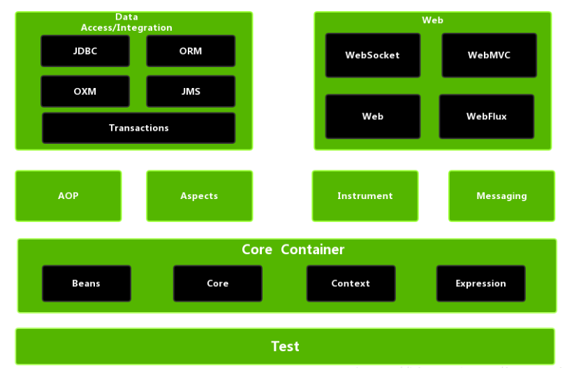
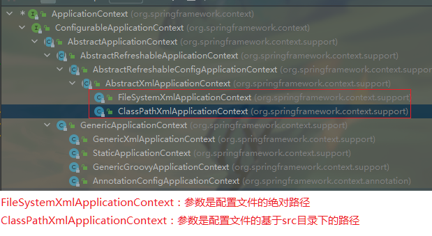
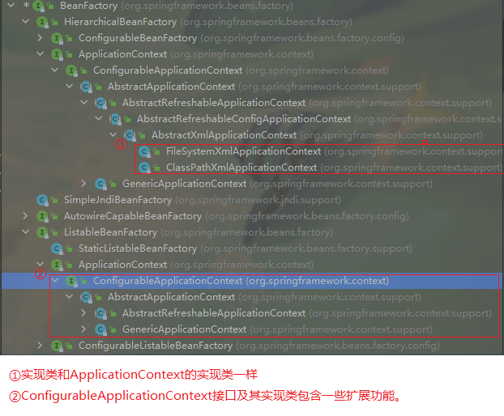
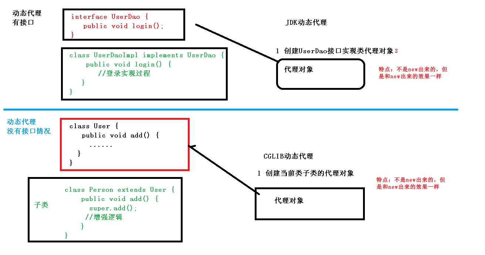
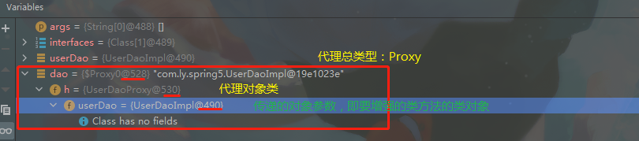
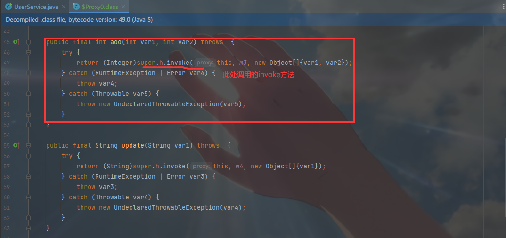
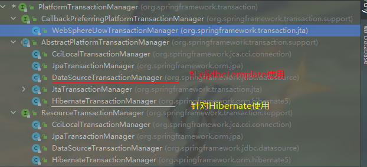
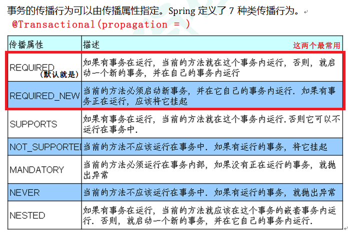
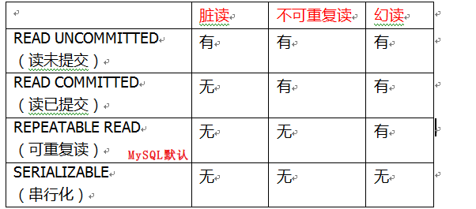

# Spring概念

## 1、Spring框架是一个轻量级开源的JavaEE应用程序框架

​			`轻量级：依赖jar包数量比较少、体积比较小，使用过程中不依赖其他的组件，可以单独使用。`

## 2、Spring可以解决企业应用开发的复杂性，即框架概念。

## 3、Spring中两个核心部分：***IOC和AOP***

​	**IOC：**Inversion of Control `即控制反转。`

​		`作用：我们不用手动new来创建对象，而是把创建对象的过程交给Spring进行管理。`

​	**AOP：**`Aspect Oriented Programming即面向切面编程。`

​		`作用：不修改源代码进行功能增强`

## 4、Spring框架特点

 + 方便解耦，简化开发
 + AOP编程支持
 + 方便程序的测试
 + 方便集成其他优秀框架 如Mybatis，HIbernate等
 + 方便进行事务操作
 + 降低API开发难度

------

# Spring入门案例

## 1、spring版本 5.2.6GA

## 2、下载地址：[repo.spring.io](https://repo.spring.io/ui/native/release/org/springframework/spring)

## 3、建个普通Java工程

## 4、导入spring框架基础包（必须的4个）

​	`Beans,Core,Context,Expression`



## 5、使用spring方式创建对象，创建Spring配置文件，在配置文件配置要创建的对象。

 + Spring配置文件是xml格式

```Java
<!--配置User类的创建-->
<bean id="user" class="com.ly.spring5.User"></bean>
```

## 6、测试代码

```java
 //1、加载spring的配置文件
ApplicationContext context = new ClassPathXmlApplicationContext("bean1.xml");
//2、获取配置要创建的对象
User user = context.getBean("user", User.class); 
user.add();
```

------

# IOC容器

容器本质上就是工厂

> IOC控制反转，把对象的创建和对象之间的调用过程，交给Spring进行管理。
>
> 使用IOC目的：降低耦合度
>
> 入门案例就是IOC实现

## 1、IOC底层原理

演变：普通调用（高耦合） =>工厂模式（中耦合）==>IOC（低耦合）

> + xml解析
> + 工厂设计模式：解耦合
> + 反射

## 2、IOC接口（BeanFactory）

`IOC思想基于IOC容器，而IOC容器底层就是对象工厂`

Spring提供IOC容器实现的两个方式：（两个接口）

​	(1)接口：BeanFactory

​		`Spring内置基本方式，一般是Spring内部使用，不建议Spring外部使用。`

​	(2)接口：ApplicationContext

​		`是BeanFactory接口的子接口，功能更多。建议开发人员使用的（即Spring外部）`

***两个接口的区别：***

> `1、BeanFactory在加载配置文件时不会同时创建配置文件类对象，仅在调用其方法时才会创建。`
>
> `2、ApplicationContext在加载配置文件的同时也会创建配置文件类对象。`
>
> 因此：推荐第二种，把创建对象等耗时耗资源都放在服务启动时。

***ApplicationContext实现类介绍:***



***BeanFactory实现类介绍：***



##### 3、IOC操作Bean管理（基于xml/基于注解）

`Bean管理：就是下面两个操作`

​	`（1）Spring创建对象 ，代替我们手动new`

​	`（2）Spring属性注入，代替类中的set方法`

## 3、IOC操作Bean管理

### 3.1、IOC操作Bean管理（基于xml）

#### 	***Bean管理基于xml方式创建对象*：**

​		2. `在Spring配置文件中，使用bean标签，标签里添加对应属性即可。`

```xml
<!-- bean标签下属性：
	id：表示类别名，即key 唯一标识
	class：全类名
	name:作用和id一样都是key，但是可以加入特殊符号，id不行
	autowire:自动注入，表示注入属性是选择
			byName :按属性名称注入
			byType:按类型进行注入
			bystructor:按照构造方法进行注入
			default：默认注入方式
-->
<bean id="user" class="com.ly.spring5.User"></bean>
```

​	2. `Spring创建对象，默认使用无参数构造器`

#### 	***Bean管理基于xml方式注入属性：***

​		`DI：Dependency Injection 是IOC容器中一种具体实现，表示依赖注入即注入属性。需要在创建对象的基础上实现。`

​		**Spring注入两种属性方式：即DI**

​		1. set方法注入属性

```xml
<!-- 在Spring配置文件中使用properties标签 完成属性注入-->
<bean id="book" class="com.ly.spring5.Book">
 	<!-- name属性表示Book类中的BookName属性，value表示给其赋值-->   
    <property name="bookName" value="猪猪侠"></property>
    <property name="author" value="GG BOY"></property>
</bean>
```

```java
//Spring框架获取注入属性
public void test1() {
    //1、加载配置文件
    ApplicationContext context = new ClassPathXmlApplicationContext("bean1.xml");

    //2、创建对象
    Book book = context.getBean("book", Book.class);
    System.out.println(book);
}
```

​		2. 有参构造器注入属性

```xml
<!--    有参构造器注入属性-->
<bean id="order" class="com.ly.spring5.Order">
    <!--        name 属性名称，value自己赋值-->
    <constructor-arg name="orderName" value="易筋经"></constructor-arg>
    <constructor-arg name="address" value="少林寺"></constructor-arg>
    <!-- 通过序号 也可以赋值-->
    <constructor-arg index="0" value="无相神功"></constructor-arg>
</bean>
```

```java
public void test2() {
    //1、加载配置文件
    ApplicationContext context = new ClassPathXmlApplicationContext("bean1.xml");

    //2、建立类对象 即调用构造器
    Order order = context.getBean("order", Order.class);
    System.out.println(order);
}
```

3、p标签注入(了解)，实际上就是set方法的简化

```xml
<!--1、使用p名称空间注入，可以简化基于xml的配置方法 ,需要在beans标签内加入p属性-->
<!-- 加入 xmlns:p="http://www.springframework.org/schema/p"  -->
<beans xmlns="http://www.springframework.org/schema/beans"
       xmlns:xsi="http://www.w3.org/2001/XMLSchema-instance"
       xmlns:p="http://www.springframework.org/schema/p" 
       xsi:schemaLocation="http://www.springframework.org/schema/beans http://www.springframework.org/schema/beans/spring-beans.xsd">
                           
    <!--    p标签 set方法注入属性-->
    <bean id="book" class="com.ly.spring5.Book" p:author="天龙八部" p:bookName="金庸"></bean> 
</beans>
```

#### ***xml注入其他类型属性：***

​	==1、字面量：定义属性时赋值，或者通过<Property>的set方法复制的都均叫做字面量。==

​		(1)字面量为null，怎么操作？

```xml
<!--        set方法注入属性-->
<bean id="book" class="com.ly.spring5.Book">
    <!-- address属性设置控制，使用null标签-->
    <property name="address">
        <null/>
    </property>
</bean>
```

​		(2)字面量包含特殊符号，怎么做？

```xml
<!--        set方法注入属性，属性值可以拆开写-->
<!--        value为 <<南京>> 
            两种方法： 
                1、转义字符 < &lt   > &gt
                2、CDATA域 <![CDATA[文字域]]>
-->
        <property name="email">
            <value><![CDATA[<<南京>>]]></value>
        </property>
    </bean>
```

​	==2、注入属性  -  外部bean==

​		如：service层调用dao层

```xml
<!-- 使用Spring配置文件 service层调用dao层方法-->
<!--    注入属性 外部bean-->
<!--
        1、创建UserService和UserDAO对象
        2、给userService对象的userDao属性注入 外部bean对象 通过唯一id来完成
    -->
<bean id="userService" class="com.ly.service.UserService">
    <!-- rel指向bean标签的id-->
    <property name="userDao" ref="userDao">
    </property>
</bean>
<bean id="userDao" class="com.ly.dao.UserDaoImpl"></bean>
```

​	==3、注入内部bean和级联赋值==

​		举例：部门和员工的一对多关系

​		==内部bean==

```xml
<!--    Spring配置文件，注入内部bean-->
	<!-- 和emp中的 bean id="dept"不冲突，因为层级不同-->
    <bean id="dept" class="com.ly.bean.Dept">
        <property name="deptName" value=""></property>
    </bean>


    <bean id="emp" class="com.ly.bean.Employee">
        <property name="empName" value="张三"></property>
        <property name="empGender" value="男"></property>
        <property name="dep">
            <!--  bean写在属性里面就是内部bean ，如果写在外面用ref连接就是外部bean     -->
            <bean id="dept" class="com.ly.bean.Dept">
                <property name="deptName" value="财务部"></property>
            </bean>
        </property>
    </bean>
```

​	==级联赋值：== 同时向有关联的 属性类 数值（如上面的Employee类中的deptName属性）

​		`这里是直接引入外部bean，借助set方法`

```xml
<bean id="dept" class="com.ly.bean.Dept">
    <property name="deptName" value="哈哈哈"></property>
</bean>

<!--    级联赋值 外部bean-->
<bean id="emp" class="com.ly.bean.Employee">
    <property name="empName" value="张三"></property>
    <property name="empGender" value="男"></property>
    <property name="dep" ref="dept"></property>
</bean>
```

​	==级联赋值，外部bean属性值 第二种写法：==

​		`这里是直接引入外部bean属性，借助get和set方法`

```xml
<bean id="dept" class="com.ly.bean.Dept">
    <property name="deptName" value="哈哈"></property>
</bean>  
<!--    级联赋值 外部bean属性值 第二种写法-->
<bean id="emp1" class="com.ly.bean.Employee">
    <property name="empName" value="李四"></property>
    <property name="empGender" value="男"></property>
    <property name="dep" ref="dept"></property>
    <!--其实就是 类.属性 来赋值 
                dep表示  Employee类下的getDep方法，去掉了get 【get方法必须有对应返回值】
                depName 其实就是Dept类下的setDeptName方法-->
    //此处输出 保安部，因为覆盖了 哈哈 【原因他们是使用同一个Dept对象】
    <property name="dep.deptName" value="保安部"></property>
</bean>

<!--    级联赋值 外部bean-->
<bean id="emp1" class="com.ly.bean.Employee">
    <property name="empName" value="李四"></property>
    <property name="empGender" value="男"></property>
    //此处也会输出 保安部，因为覆盖了 哈哈 【原因他们是使用同一个Dept对象在整个xml文件中】
    <property name="dep" ref="dept"></property>
</bean>
```

​	==4、xml注入集合属性==

​		注入数组，List集合，Map集合，Set集合

```xml
    <bean id="stu" class="com.ly.spring5.Stu">
        <!--   注入数组属性     -->
        <property name="courses">
            <array>
                <value>英语</value>
                <value>语文</value>
                <value>数学</value>
                <value>化学</value>
            </array>
        </property>

        <!--   注入List集合属性     -->
        <property name="list" >
            <list>
                <value>list1</value>
                <value>list2</value>
                <value>list3</value>
            </list>
        </property>

        <!--   注入Map集合属性     -->
        <property name="maps" >
            <map>
                <entry key="k1" value="map1"></entry>
                <entry key="k2" value="map2"></entry>
                <entry key="k3" value="map3"></entry>
            </map>
        </property>

        <!--   注入Set集合属性     -->
        <property name="set" >
            <set>
                <value>set1</value>
                <value>set2</value>
            </set>
        </property>
    </bean>
```

​		细节1：集合里面设置对象类型

```xml
<bean id="stu" class="com.ly.spring5.collectionType.Stu">
	<!--   注入List集合 属性为类对象 -->
    <property name="courseList" >
        <list>
            //指向外部bean
            <ref bean="c1"></ref>
            <ref bean="c2"></ref>
        </list>
    </property>
    
    <!--   注入Map集合属性为类对象     -->
    <property name="mapCourse" >
        <map>
            //和List有些许不同  value-ref="c1"
            <entry key="k1" value-ref="c1"> </entry>
            <entry key="k1" value-ref="c2"> </entry>
        </map>
    </property>
</bean> 

//外部bean
<bean id="c1" class="com.ly.spring5.collectionType.Course">
    <property name="cname" value="语文"></property>
</bean>
<bean id="c2" class="com.ly.spring5.collectionType.Course">
    <property name="cname" value="数学"></property>
</bean>
```

​		细节2：集合注入参数为公共参数，提取出来 ==其实就是外部bean方法，通过ref连接==

   + 在Spring配置文件中，引入名称空间 （util）

     ```xml
     <beans xmlns="http://www.springframework.org/schema/beans"
            xmlns:xsi="http://www.w3.org/2001/XMLSchema-instance"
            xmlns:util="http://www.springframework.org/schema/util"
            xsi:schemaLocation="http://www.springframework.org/schema/beans http://www.springframework.org/schema/beans/spring-beans.xsd 
                                 http://www.springframework.org/schema/util http://www.springframework.org/schema/util/spring-util.xsd">
     
         <!--  新增两个部分：
       		1、xmlns：util...
     		2、xsi:schemaLocation...util.. //bean全换成util-->
     </beans>
     ```

   + 使用util标签完成List集合注入提取

     ```xml
     <!--  外部bean    [list集合  注意：需要是同一个类型的才行]-->
         <bean id="course" class="com.ly.spring5.collectionType.Course">
             <property name="cname" value="物理"></property>
         </bean>
         <!--  list集合注入属性，提取出公共部分  -->
         <util:list id="list2">
             <value>list集合</value>
             <value>哈哈</value>
         </util:list>
     	<!-- --写两个是为了区分 List集合只能放同一类型对象>
         <util:list id="bookList">
             <ref bean="course"></ref>
         </util:list>
     
         <!--   list集合注入属性 通过ref   [list集合  注意：需要是同一个类型的才行]-->
         <bean id="book" class="com.ly.spring5.collectionType.Book">
             <property name="list" ref="bookList"></property>
         </bean>
     ```

### 3.2、IOC操作Bean管理-- 工厂bean（FactoryBean）

注意：FactoryBean非IOC接口BeanFactory，它本质上是Bean。

+ `Spring中有两种类型bean，一种普通bean就是我们创建出来的（基于xml或注解），另一种就是工厂bean（FactoryBean）Spring自带的。`
+ `普通Bean：在Spring配置文件中配置是什么类型的，返回就是什么类型的！   如：定义Book类，返回就是Book类`
+ `工厂Bean：定义类型和返回类型可以不一样！   如：定义Book类，可以返回Store类`

> ==FactoryBean使用步骤：==
>
> 1. `创建类，让这个类作为FactoryBean，需要让其实现接口FactoryBean（接口就是这个名字.）`
>
> 2. `实现接口中的方法，在实现方法中定义返回的bean类型`
>
> 3. 实际使用context,getBean("id",bean.class)就需要改成实际的bean
>
>    ```java
>    //指定泛型 Course
>    public class MyBean implements FactoryBean<Course>{
>        @Override
>        public Course getObject() throws Exception {
>            //定义返回bean
>            Course course = new Course();
>            course.setCname("abc");
>            return course;
>        }
>        @Override
>        public Class<?> getObjectType() {
>            //返回bean类型
>            return null;
>        }
>        @Override
>        public boolean isSingleton() {
>            //是否为单例
>            return false;
>        }
>    }
>    //xml配置
>    <bean id="myBean" class="com.ly.spring5.collectionType.facbean.MyBean"></bean>
>                                                        
>    //实际使用获取不同于配置文件的Bean类型,需要传入想要的类class
>    //获取目标bean
>    Course myBean = context.getBean("myBean", Course.class);
>    //获取工厂Bean本身
>    MyBean bean = context.getBean("&myBean", MyBean.class);
>    ```
>
>    ==FactoryBean作用：==`FactoryBean 通常是用来创建比较复杂的bean，一般的bean 直接用xml配置即可，但如果一个bean的创建过程中涉及到很多其他的bean 和复杂的逻辑，用xml配置比较困难，这时可以考虑用FactoryBean。`
>
>    `使用FactoryBean创建隐藏了一些实例化bean的细节，给上层应用带来便利.`

### 3.3、IOC操作Bean管理 （Bean作用域）

在Spring里面可以设置创建的bean是单实例还是多实例。Spring中默认创建的bean都是单实例对象。

单实例：只有一个对象，每次返回都是同一个对象 （可以通过HashCode来判断）

​			`修改一个对象的属性值，另一个对象的属性值也会变成一样。因为本身就是同一个对象！`

多实例：每次返回都会创建一个新对象

**设置bean为多实例：**

> Spring配置文件中bean标签里有个属性 Scope，用于设置是否为多实例
>
> ```xml
> scope="prototype" <!-- 多实例对象-->
> scope="singleton" <!-- 单实例对象-->
> scope="request" <!-- 创建对象放在，request域中（了解）--> 
> scope="session" <!--  创建对象放在，session域中（了解）-->
> ```

​	singleton和prototype区别：

 + singleton为单实例，prototype为多实例
 + ==设置scope="singleton"时，加载Spring配置文件时就会创建单实例对象。==
 + ==设置scope="prototype"时，不是在加载spring配置文件时创建实例对象，而是在调用getBean方法时创建多实例对象。==

### 3.4、IOC操作Bean管理 （Bean生命周期）

生命周期：对象从创建到销毁的过程

***bean生命周期：***

> （1）通过构造器创建bean实例（无参数构造）
>
> （2）为bean属性赋值，和对其他bean的引用（通过该类的set方法） 【xml文件中的】
>
> （3）调用bean的初始化的方法（需要进行配置）
>
> （4）使用bean对象实例（对象我们已经获取到了）
>
> （5）当容器关闭时候（可以手动调用close方法），调用bean的销毁方法（需要进行配置）
>
> ```xml
> //init-method 指定bean的初始化方法  (Orders类中的)
> //destroy-method  指定bean的销毁方法 (Orders类中的)
> <bean id="orders" class="com.ly.spring5.bean.Orders" init-method="initMethod" destroy-method="destroy">
>     <property name="oname" value="手机"></property>
> </bean>
> ```

#### ***bean生命周期 --前置/后置处理器***

更详细的生命周期，可以细分为7步：`（在调用第3步之前和之后分别会调用后置处理器）`

`前置处理器和后置处理器为同一个方法，只要一个类实现了接口BeanPostProcessor，那么Spring就将其视作处理器。`

*==后置处理器需要单独建立一个类来实现接口BeanPostProcessor，然后在配置文件中配置（和普通bean的配置方法一样），然后Spring在加载配置文件时会把bean创建，同时把前置/后置处理器创建，同时前置/后置处理器会对当前配置文件中的所有bean生效==*

> （1）通过构造器创建bean实例（无参数构造）
>
> （2）为bean属性赋值，和对其他bean的引用（通过该类的set方法） 【xml文件中的】
>
> ==把bean实例传递给bean的前置处理器：== `postProcessBeforeInitialization()方法`
>
> （3）调用bean的初始化的方法（需要进行配置）
>
> ==把bean实例传递给bean的后置处理器的：== `postProcessAfterInitialization()方法`
>
> （4）使用bean对象实例（对象我们已经获取到了）
>
> （5）当容器关闭时候（可以手动调用close方法），调用bean的销毁方法（需要进行配置）
>
> ```java
> //为了使用bean的前置/后置处理器，需要将类实现 接口BeanPostProcessor 的两个方法
> public class MyBeanPost implements BeanPostProcessor {
> 
>     @Override
>     //初始化前调用
>     public Object postProcessBeforeInitialization(Object bean, String beanName) throws BeansException {
>         System.out.println("执行bean初始化方法前调用");
>         //bean就是创建出来的bean对象
>         return bean;
>     }
> 
>     @Override
>     //初始化后调用
>     public Object postProcessAfterInitialization(Object bean, String beanName) throws BeansException {
>         System.out.println("执行bean初始化方法后调用");
>         //bean就是创建出来的bean对象
>         return bean;
>     }
> }
> 
> ```
>
> ```xml
> <!-- 实现的接口BeanPostProcessor 告诉Spring这是前置/后置处理器，不是普通bean-->
> <bean id="orders" class="com.ly.spring5.bean.Orders" init-method="initMethod" destroy-method="destroy" >
>     <property name="oname" value="手机"></property>
> </bean>
> <!--  配置后置处理器bean  -->
> <bean id="myBeanPost" class="com.ly.spring5.bean.MyBeanPost"></bean>
> ```
>
> 

### 3.5、IOC操作Bean管理（基于xml的 自动装配）

​	什么是自动装配？

​	答：`通过配置文件的property标签向一个类中注入属性的操作，叫做手动装配。`

​			==`不需要在配置文件中写入property标签，Spring会根据属性类型或属性名称自动完成属性值注入的过程叫做自动装配！`==

```xml
    <!--  自动装配/注入
        autowire:自动注入，表示注入属性是选择
         byName :按属性名称注入 【要注入值的属性（如Emp类中的Dept dept）的名字，必须要和xml中bean（如：Dept类）的id值完全相同才可以】
         byType:按类型进行注入 【同一个xml配置文件中不能有多个相同类型的bean（尽管id不同）,否则Spring会报错】
         bystructor:按照构造方法进行注入
         default：默认注入方式
         -->
    <bean id="emp" class="com.ly.spring5.autowire.Emp" autowire="byName">
        <!-- 手动装配/注入-->
<!--        <property name="dept" ref="dept"></property>-->
    </bean>


    <bean id="dept" class="com.ly.spring5.autowire.Dept"></bean>
	<!-- 如果自动注入规则为byType，则此时会报错，因为要注入的类型bean重复-->
	<bean id="dept1" class="com.ly.spring5.autowire.Dept"></bean>
```

### 3.6、IOC操作Bean管理（外部属性文件）

即把属性的配置写在外部文件中，不再放在xml中的property标签。

```xml
<!--如数据库配置信息，普通方法直接配置-->
<bean id="dataSource" class="com.alibaba.druid.pool.DruidDataSource">
    <property name="driverClassName" value="com.mysql.jdbc.Driver"></property>
    <property name="url" value="jdbc:mysql://localhost:3306/userDb"></property>
    <property name="username" value="root"></property>
    <property name="password" value="123456"></property>
</bean>

```

```xml
<!--外部属性配置文件，xml配置文件引入-->
<beans xmlns="http://www.springframework.org/schema/beans"
       xmlns:xsi="http://www.w3.org/2001/XMLSchema-instance"
       xmlns:context="http://www.springframework.org/schema/context"
       xsi:schemaLocation="http://www.springframework.org/schema/beans http://www.springframework.org/schema/beans/spring-beans.xsd
                            http://www.springframework.org/schema/context http://www.springframework.org/schema/context/spring-context.xsd">

        <bean id="dataSource" class="com.alibaba.druid.pool.DruidDataSource">
            <property name="driverClassName" value="${prop.driverClassName}"></property>
            <!-- ${} 引入properties文件属性，里面放的是properties等号=左边的值-->
            <property name="url" value="${prop.url}"></property>
            <property name="username" value="${prop.username}"></property>
            <property name="password" value="${prop.password}"></property>
        </bean>


    <!--如数据库配置信息，引入外部配置文件配置,借助context名称空间
        xmlns:context="http://www.springframework.org/schema/context"

        xsi:schemaLocation="http://www.springframework.org/schema/beans http://www.springframework.org/schema/beans/spring-beans.xsd
                            http://www.springframework.org/schema/context http://www.springframework.org/schema/context/spring-context.xsd"
    -->
    <context:property-placeholder location="classpath:jdbc.properties"></context:property-placeholder>
</beans>
```

### 3.7、IOC操作Bean管理（基于注解）

​	什么是注解？

​	答：`1、注解是代码特殊标记，格式：@注解名称(属性名1=属性值1,属性名2=属性值2)`

​			`2、注解可以用于：类上，方法上，属性上`

​			`3、使用注解是为了简化xml配置`

#### 	***Bean管理 -- 创建对象：***

```java
/*使用注解创建对象 共四种方法 (默认都是单实例)
	@Component  表示Spring容器中	普通的对象可以用其创建
	@Service	一般用于业务逻辑层/service层
	@Controller	一般用于web层上
	@Repository	一般用于dao层上
*/
```

​	*注解使用步骤：*

​		1、引入依赖包  spring-aop-5.2.6.RELEASE.jar

​		2、必须开启组件扫描 （是为了告诉Spring容器，在哪个类里面加上注解，扫描指定包/文件下的类），`即引入context名称空间 + 开启组件扫描`

```xml
<beans xmlns="http://www.springframework.org/schema/beans"
       xmlns:xsi="http://www.w3.org/2001/XMLSchema-instance"
       xmlns:context="http://www.springframework.org/schema/context"
       xsi:schemaLocation="http://www.springframework.org/schema/beans http://www.springframework.org/schema/beans/spring-beans.xsd
                        http://www.springframework.org/schema/context http://www.springframework.org/schema/context/spring-context.xsd">
    
    <!-- 开启组件扫描
        扫描多个包：
            方法1：逗号隔开
            方法2：写公共父目录

	开启组件组件扫描细节：
 			如：可以进行细致配置同一个包下，哪些可以扫描，哪些不可以扫描
-->
    <context:component-scan base-package="com.ly.spring5.service,com.ly.spring5.dao"></context:component-scan>
    <context:component-scan base-package="com.ly.spring5"></context:component-scan>
    
    //实例1
    <!-- 加上use-default-filters="false" 表示不使用默认的Spring方法进行扫描，如果没加上就是默认使用 -->
    <context:component-scan base-package="com.ly.spring5" use-default-filters="false">
        <!-- include包含，指定只扫描com.ly.spring目录下，类型是注解的Component 的类 -->
        <context:include-filter type="annotation" expression="org.springframework.stereotype.Component"/>
    </context:component-scan>
    
    
    //实例2
    <!--使用默认扫描规则 -->
    <context:component-scan base-package="com.ly.spring5">
        <!-- 指定不扫描 com.ly.spring5目录下的 注解annotation类型为Component的类-->
        <context:exclude-filter type="annotation" expression="org.springframework.stereotype.Component"/>
    </context:component-scan>
    
</beans>
```

​		3、创建被使用类（不是Test类），引入注解

```java
//value可以省略不写，默认就是类名（首字母小写）
@Component(value = "userService") ////就是<bean id="" class="">
public class UserService {

    public void add() {
        System.out.println("add 方法");
    }
}
```

​		4、使用注解类

```java
public void test(){
    ApplicationContext context = new ClassPathXmlApplicationContext("bean1.xml");
    UserService userService = context.getBean("userService", UserService.class);
    userService.add();
}
```

#### ***Bean管理 -- 属性注入：***

```java
/*  
	有类先找类，没有类再找叫这个名字接口的实现类
	@AutoWired  根据属性类型 自动注入  【针对对象类型。普通类型不可用】
	@Qualifier	根据属性名称进行注入，必须和AutoWired注解一起使用	【针对对象类型。普通类型不可用】
	@Resource	可以根据属性名称，属性类型进行注入	【针对对象类型。普通类型不可用int,Integer等】
	
	@Value	注入普通类型属性  【针对普通类型int,Integer等】
*/
```

*注解使用步骤：*

​	1、创建service类和dao类，并使用相应注解（@Service  @Repository）

​	2、在service里添加dao属性，并在上面，使用@AutoWired注解

```java
//根据类型注入
//定义dao类型属性   不需要添加set方法，因为注解里面已经封装好了
@Autowired
private UserDaoImpl userDao;//按实现类定义
```

```java
//根据名称注入 [一个接口多个实现类只能根据名称注入]
@Autowired
@Qualifier(value = "userDaoImplPlus") //类名首字母小写，如果只有一个实现类则value可以省略
private UserDao userDao;//按接口定义
```

```java
//@Resource	可以根据属性名称，属性类型进行注入 javax包下非Spring包，不推荐使用
@Resource //根据类型注入  新建的类上面别忘记加上注解
private UserDao userDao; 

@Resource(name = "userDaoImplPlus")//使用name参数进行名称注入，名称就是类名首字母小写
private UserDao userDao;
```

```java
//@Value 注入普通属性
@Value(value = "名字哈哈哈")
private String name;
```

​	3、调用使用

#### ***纯注解开发：需要单独创建一个扫描类***

不使用任何配置文件（包括spring的xml），完全使用注解。

*使用步骤：*

+ 创建配置类，来代替配置文件。类上加上一个注解@Configuration表示该类是一个配置类。

  ```java
  //配置类注解
  @Configuration
  //开启组件扫描注解，参数为全类名
  @ComponentScan(basePackages = {"com.ly.spring5.service","com.ly.spring5.dao"})
  public class SpringConfig {
  
  }
  ```

+ 创建带注解的类，属性等

+ 使用（和正常使用xml配置文件有些不同）

  ```java
  @Test
  public void test1(){
      //注解开发 AnnotationConfigApplicationContext 使用注解类
      ApplicationContext context = new AnnotationConfigApplicationContext(SpringConfig.class);
      UserService userService = context.getBean("userService", UserService.class);
      userService.add();
  }
  ```

  ------

# AOP编码

## 	1、AOP概念

  ​	`aop即面向切面编程，利用aop可以对业务逻辑的各个部分进行隔离，从而使得业务逻辑各部分之间的耦合度降低，提高程序的可重用性，同时提高了开发的效率。`

  ## 2、AOP底层原理：动态代理

  `代理模式原理：使用一个代理将对象包装起来，然后用该代理对象取代原始对象。任何对原始对象的调用都要通过代理。代理对象决定是否以及何时将方法调用转到原始对象上。`

  

###   ***动态代理（dynamic proxy）***

  ​	`利用Java的反射技术(Java Reflection)，在运行时创建一个实现某些给定接口的新类（也称“动态代理类”）及其实例（对象）,代理的是接口(Interfaces)，不是类(Class)，也不是抽象类。在运行时才知道具体的实现，spring aop就是此原理。`

  ​	（1）有接口情况下的 ，使用JDK动态代理

  ​			`创建接口实现类代理对象(不是new出来的，但是和new出来的效果一样)，增强类的方法。`

  ​	（2）无接口情况下的，使用CGLIB动态代理

  ​			`常规方法，写一个子类继承该类来增强父类功能。`

  ​			`创建子类的代理对象(不是new出来的，但是和new出来的效果一样)，增强类的方法`

  

## 3、AOP (JDK动态代理实现 Spring默认)

`涉及到的类：`

​		`1、UserDao接口`

​		`2、UserDaoImpl类（需要增强方法的类）`

​		`3、UserDaoProxy 代理对象类 实现InvocationHandler接口（当然也可以用匿名内部类代替），在继承的接口的invoke方法中写入要增强的逻辑代码。`

​		`4、UserService 想要使用增强方法的类,也就是调用Proxy.newProxyInstance()方法的类`

```java
//1、使用JDK动态代理，需要借助Proxy类里面的方法创建代理对象
/* 类方法
	参数：ClassLoader loader 被代理类的类加载器【UserDaoImpl.class.getclassloader()】
	参数：class<?>[] interfaces  要增强方法的类实现的那个接口的class，可以为多个接口的class
	参数：InvocationHandler h 多态，直接写这个接口的匿名内部类，或者写实现这个接口的代理类，所以【此处参数为：代理对象，需要在继承接口的invoke方法中写入增强的逻辑代码】
	
java.lang.reflect.Proxy.newProxyInstance(ClassLoader loader, class<?>[] interfaces,InvocationHandler h); 

*/
```

*实现步骤：*

​	1、创建接口，定义方法

```java
public interface UserDao {
    int add(int x, int y);
    String update(String id);
}
```

​	2、创建正常使用的接口实现类，实现方法

```java
public class UserDaoImpl  implements UserDao{
    @Override
    public int add(int x, int y) {
        return x + y;
    }

    @Override
    public String update(String id) {
        return id;
    }
}
```

3、==定义代理对象类（或者使用匿名内部类），继承接口 InvocationHandler ，并在继承的invoke方法中书写需要增强的逻辑代码，需要传递参数，不然怎么增强到指定的UserDaoImpl类中==

```java
class UserDaoProxy implements InvocationHandler {

    //把需要增强的类传递过来，即UserDaoImpl类，因为要增强的就是它
    private UserDaoImpl userDao;
    //方法1 有参构造器传递，指定增强哪个类（如果为了通用，UserDaoImpl可以改成Object）
    public UserDaoProxy(UserDaoImpl userDao) {
        this.userDao = userDao;
    }


    @Override
    /**
     * @param proxy 代理对象
     * @param method 表示当前需要增强的方法，如add
     * @param args 表示传递的参数
     */
    public Object invoke(Object proxy, Method method, Object[] args) throws Throwable {
        //比如想增强UserDaoImpl中的add 方法，即：在调用add方法前 输出add方法前逻辑
        System.out.println("add方法前逻辑，当前方法名为：" + method.getName() + ",参数为：" + Arrays.toString(args));
        
        //需要被增强的方法 即UserDaoImpl中的add方法 (对象就是传递过来的UserDaoImpl对象，参数就是args)
        Object res = method.invoke(userDao, args);
        

        //比如想增强UserDaoImpl中的add 方法，即：在调用add方法后 输出add方法后逻辑
        System.out.println("add方法后逻辑，当前方法名为：" + method.getName() + ",参数为：" + Arrays.toString(args));
        
        //返回原方法的返回值，或者自己额外处理的 所以此处为Integer类型
        return res;
    }
}
```

4、==在想要使用增强放的地方如：Service层UserService类中使用Proxy类的newProxyInstance方法创建接口代理对象调用,不是直接new==

```java
public class UserService {
    public static void main(String[] args) {
        //创建接口实现类的代理对象
        Class[] interfaces = {UserDao.class};

        /*

         方法1：使用匿名内部类（这个类就是代理对象类）
        Proxy.newProxyInstance(JDKProxy.class.getClassLoader(), interfaces, new InvocationHandler() {
            @Override
            public Object invoke(Object proxy, Method method, Object[] args) throws Throwable {
                return null;
            }
        })
        */

        UserDaoImpl userDao = new UserDaoImpl();
        //方法2：使用一个实现类（这个类就是代理对象类，代理对象可以转换成接口UserDao）  ====》看看康师傅的动态代理
        //返回的 代理对象的类型 实际运行类型就是UserDaoImpl（编译类型为：代理类Proxy类型）即要增强的类类型，而UserDaoImpl（编译类型为：代理类Proxy类型）里面是代理对象类型即UserDaoProxy包装而来，而UserDaoProxy又是由UserDAo包装而来的

        /*
            ***总结：代理类型就是将 ”要增强的类类型UserDaoImpl（通过newProxyInstance参数传递进去userDao）“，”经过包装成代理类UserDaoProxy类型（即增加了要增强的方法）“，
         ”然后把UserDaoProxy类型的对象再转换成代理总父类Proxy类型（编译类型为：代理类Proxy类型，运行类型为：要增强的类类型UserDaoImpl）“，”最后为了通用性就把返回类型改成了Object类型“

//**造的是代理类，所以不能用被代理类UserDaoImpl接收 否则代理类和被代理类就是同一类型了。返回的是代理类，只是代理类也实现了UserDaoImpl所实现的接口，但不是同一类型所以用其父UserDao接收（多态）。
         */
        
         //得到将生成的代理对象类$Proxy0.class文件  看看结构就明白了为什么会调用自动调用invoke方法了，注意：必须要在生成代理对象前才有效
        System.getProperties().put("sun.misc.ProxyGenerator.saveGeneratedFiles", "true");
        //如果强转成UserDaoImpl会报错，因为代理类和被代理类类型不相同 只是实现了相同的接口
        UserDao dao = (UserDao)Proxy.newProxyInstance(userDao.getClass().class.getClassLoader(), interfaces, new UserDaoProxy(userDao));
        
        //获取到代理对象编译类型为UserDao，但是实际运行类型为class com.sun.proxy.$Proxy0 里面定义有与被代理类相同的方法名（因为都是实现同一个接口），所以调用的add方法实际上是调用$Proxy0下的add方法，又因为这是包装过的方法，所以里面自动调用了invoke方法
        System.out.println(dao.getClass());

        Field[] declaredFields = dao.getClass().getDeclaredFields();
        System.out.println("代理实际运行为 class com.sun.proxy.$Proxy0 有字段：");
        for (Field declaredField : declaredFields) {
            System.out.println(declaredField);
        }
        System.out.println("代理实际运行为 class com.sun.proxy.$Proxy0 有方法：" );
        Method[] declaredMethods = dao.getClass().getDeclaredMethods();
        for (Method declaredMethod : declaredMethods) {
            System.out.println(declaredMethod);
        }
        System.out.println("===================================================");
        //调用增强方法
        //调用增强方法
        int add = dao.add(1, 2);
        System.out.println(add);
    }
}
```

​			newProxyInstance方法返回代理对象的类型结构如图：



​	生成的代理对象实际运行类型为：class com.sun.proxy.$Proxy0 ，运行类保存在文件 [$Proxy0.class](.) 中。核心add方法截图如下：



## 4、AOP操作相关的术语

+ ***连接点：***`被代理类中的可被增强的方法就叫连接点，如：add，update`

+ ***切入点：***`被代理类中实际被增强的方法就叫切入点，如：add`

+ ***通知（增强）：***`代理类invoke方法中，实际增强的逻辑代码就叫通知/增强（不包括被代理类的add）`

  通知的5种类型：

​			==执行顺序：==

​			==先执行@Around中 增强方法 前面逻辑==

​			==然后执行@before方法==

​			==然后执行被增强的方法==

​			==然后执行@Around中 增强方法 后面逻辑==

​			==然后执行@After中方法,`这个方法一定会执行的`==

​			==然后执行@AfterReturning中方法==

==只有出现异常时 才会执行 @AfterThrowing方法==

  + 前置通知`@Before`：表示在被代理类中的被增强方法前执行，如：add前
  + 后置通知`@AfterReturning`：表示在被代理类中的被增强方法后执行，如：add后
  + 环绕通知`@Around`：表示在被代理类中的被增强方法前、后均执行，如：add前、后
  + 异常通知`AfterThrowing`：表示在被代理类中的被增强方法执行时出现异常执行，如：add方法出现异常后执行
  + 最终通知`@After`：类似finally，表示在被代理类中的被增强方法执行无论是否出现异常最后都会执行，如：add无论是否出现异常都会执行

+ ***切面：***`是动作过程，指把通知应用到切入点的过程叫切面，如：把权限判断加入到用户登录中的过程就叫做切面`

## 	5、AOP操作（准备）

​		1、***Spring框架一般基于AspectJ实现AOP操作。***

​			AspectJ：不是Spring框架中的组成部分，而是一个独立的AOP框架，一般和Spring搭配使用进行AOP操作。

​		2、**基于AspectJ的AOP操作：***

​			(1)基于xml配置文件

​			(2)基于注解方法

​		3、***在项目工程中引入AOP相关的依赖包***

```java
spring-aop-5.2.6.RELEASE.jar
spring-aspects-5.2.6.RELEASE.jar
com.springsource.net.sf.cglib-2.2.0.jar
com.springsource.org.aopalliance-1.0.0.jar
com.springsource.org.aspectj.weaver-1.6.8.RELEASE.jar
```
​		4、***切入点表达式***

==切入点表达式作用：可以告诉Spring对哪个类里面哪个方法进行增强==

切入点表达式语法：

​	execution([权限修饰符] \[返回类型] [类全路径].\[方法名称]([参数列表]))

​			\* 表示任意修饰符 后有空格

​			如果没有返回值可以省略不写 后有空格

​			.. 表示参数列表

```java
//增强com.ly.dao.UserDaoImpl 下的 add方法
execution(public int com.ly.dao.UserDaoImpl.add(..)
   
//增强UserDaoImpl类里所有方法
execution(* com.ly.dao.UserDaoImpl.*(..))
          
//增强com.ly.dao里所有类 包括类中中的所有方法
execution(* com.ly.dao.*.*(..))
```

## 6、Spring AOP操作（基于注解的AspectJ）

+ `创建被代理类及其方法`

+ `创建一个代理类，同时定义增强逻辑`

+ `进行通知（增强逻辑）配置`

  ```java
  //1、在Spring配置文件中，开启注解扫描 （xml或注解均可）
  <!--    开启组件扫描需要先 引入context名称空间-->
  <context:component-scan base-package="com.ly.spring5"></context:component-scan>
  <!--    引入aop名称空间,和context完全一样-->
  //2、使用注解（4个任意选一个）创建代理类 和 被代理类对象
  
  //3、在增强类上添加注解 @Aspect 和@Component 右Spring生成对象 （有了@Aspect注解就不用实现InvocationHandler借口了，因为里面已经封装好了）
      
  //4、在spring配置文件中开启生成代理对象 （去注解扫描目录下找Aspect注解，然后生成代理对象）
  <!--    开启AspectJ 生成代理对象-->
  <aop:aspectj-autoproxy></aop:aspectj-autoproxy>
  //5、配置不同类型的通知 即：在增强类的里面，在作为通知方法的上面加上通知类型注解，使用切入点表达式进行配置（就将代理类和被代理类关联起来了）
  //前置通知  java代码
      @Before(value = "execution(* com.ly.spring5.aopAnno.User.add(..)))")
      public void before() {
          System.out.println("before");
      }
  
  //6、测试使用
  public void test1(){
          ApplicationContext context = new ClassPathXmlApplicationContext("bean1.xml");
      //返回的肯定是User类型 因为要代理就是他而且也没有其父接口
          User user = context.getBean("user", User.class);
          user.add();
      }
  ```

+ `提取相同的切入点表达式 如：前/后/环绕/异常//最终通知中的 表达式`

  ==方法：定义一个方法，使用注解@Pointcut 其中value值为相同的切入点表达式==

  ```Java
  //使用@Pointcut 定义相同切入点 方法
  @Pointcut(value = "execution(* com.ly.spring5.aopAnno.User.add(..)))")
  public void pointyDemo() {}
  
  //前置通知 直接调用切入点方法
  @Before(value = "pointyDemo()")
  public void before() {
      System.out.println("before");
  }
  ```

+ `如果有多个增强类对同一方法进行增强，使用注解 @Order(int) 则可以设置代理类的优先级`

  ==@Order(优先级数字)==：数字越小，优先级越高 从0开始

  ```java
  @Component
  @Aspect
  @Order(0)
  public class UserProxy {...}
  //先执行UserProxy类方法，然后执行Person类方法 【注意是相同通知类型的先执行UserProxy，然后执行PersonProxy，不是等UserProxy所以通知执行完才执行PersonProxy 】
  @Component
  @Aspect
  @Order(1)
  public class PersonProxy{...}
  ```


## 7、Spring AOP操作（基于xml的AspectJ）

+ 创建被代理类和代理类，及其增强方法

+ 在xml文件中创建两个类的bean对象

+ 在xml配置文件中 配置切入点表达式

+ 编写方法测试

  ```xml
  <!--    引入aop 名称空间-->
  <!--创建两个类的对象-->
  <bean id="bookDao" class="aopxml.BookDao"></bean>
  <bean id="bookDaoProxy" class="aopxml.BookDaoProxy"></bean>
  
  <!--    配置切入点,切入点可以统一配置，也可以切面的 内部定义通知类型时定义-->
  /*
  强制使用CGLIB，指定proxy-target-class = "true" 或者 基于注解@EnableAspectJAutoProxy(proxyTargetClass = true)
  */
  <aop:config>
      <aop:pointcut id="check" expression="execution(* aopxml.BookDao.delBook(..))"/>
  
      <!--  配置切面     ref指向增强类 -->
      <aop:aspect ref="bookDaoProxy" >
  
          <!-- 配置增强的 逻辑方法   此处为前置通知   pointcut-ref是提取公共切入点表达式-->
          <aop:before method="check" pointcut-ref="check"></aop:before>
      </aop:aspect>
  </aop:config>
      
  ```

## 8、Spring AOP操作 （基于完全注解的Aspect）

```java
//其他和基于注解的操作一样，就是需要额外建立一个配置类 并使用注解@EnableAspectJAutoProxy 开启aspect自动代理
/*
强制使用CGLIB，指定proxy-target-class = "true" 或者 基于注解@EnableAspectJAutoProxy(proxyTargetClass = true)
*/

@Configuration
@ComponentScan(basePackages = "fullAnnationAop")
//开启aop自动代理
@EnableAspectJAutoProxy
public class ProxyConfig {
}
```

# JDBCTemplate

JDBCTemplate是Spring框架对JDBC进行封装，使用它方便对数据库进行操作。

## 1、准备工作

+ 引入相关jar包

  `mysql-connector-java-5.1.7-bin.jar，spring-jdbc-5.2.6.RELEASE.jar，spring-tx-5.2.6.RELEASE.jar，spring-orm-5.2.6.RELEASE.jar，druid-1.1.9.jar`

+ 在spring配置文件中配置连接池

  ```xml
  <!--    配置连接池信息-->
      <bean id="dateSource" class="com.alibaba.druid.pool.DruidDataSource" destroy-method="close">
  <!--        <property name="url" value="jdbc:mysql://localhost:3306/user_db"></property>-->
          <property name="url" value="jdbc:mysql:///user_db"></property> <!--默认3306可以省略 -->
          <property name="password" value="123456"></property>
          <property name="username" value="root"></property>
          <property name="driverClassName" value="com.mysql.jdbc.Driver"></property>
      </bean>
  ```

+ 配置JDBCTemplate对象，注入DataSource （即配置的数据库连接池对象）

  ```xml
  <!--  创建JDBCTemplate bean对象-->
  <bean id="jdbcTemplate" class="org.springframework.jdbc.core.JdbcTemplate">
  	<!--   通过set方法 注入数据源信息 因为里面的构造器调用的也是父类setDataSource方法 和他自身没关系，set和构造器都可以-->
  	<property name="dataSource" ref="dateSource"></property>
  </bean>
  ```

+ 使用JdbcTemplate

  ​	`service（@service）注入dao（@Reposity），dao（@Reposity）注入模板(xml中配置好了，看上面) 用注解方式`

  ```java
  //注入dao
  @Autowired
  private BookDao bookDao;
  
  //注入JdbcTemplate
  @Autowired //会自动找到xml配置文件中的 对于bean
  private JdbcTemplate jdbcTemplate;
  ```

  

## 2、JDBCTemplate操作数据库

### （1）增加/删除/修改操作

> a：创建对应表的实体类，pojo/bean/entity
>
> b：编写service和dao操作
>
> ​	dao里面进行数据添加操作
>
> ```java
> String sql = "insert into t_book values (?,?,?)";
> int update = jdbcTemplate.update(sql, book.getBook_id(), book.getBook_name(), book.getBook_status());
> ```
>
> 

### （2）查询操作

> + 单行单列查询  queryForObject
>
>   ```java
>   public Object selectScalar(Integer id) {
>       String sql = "select book_name from t_book where book_id=?";
>       //单行单列查询
>       return jdbcTemplate.queryForObject(sql, String.class, id);
>   }
>   ```
>
> + 单行多列查询  queryForObject
>
>   ```java
>   public Book selectSingle(Integer id) {
>       String sql = "select * from t_book where book_id=?";
>       //和apache工具类似 包装一个Bean
>       RowMapper<Book> rowMapper = new BeanPropertyRowMapper<>(Book.class);
>       return jdbcTemplate.queryForObject(sql, rowMapper, id);
>   }
>   ```
>
> + 多行多列查询   query
>
>   ```java
>   public List<Book> selectMany() {
>       String sql = "select * from t_book";
>       return jdbcTemplate.query(sql,new BeanPropertyRowMapper<Book>(Book.class));
>   }
>   ```
>
> + 多行单列查询  queryForList
>
>   ```java
>   public List<String> selectScalarForMany() {
>       String sql = "select book_name from t_book";
>       return jdbcTemplate.queryForList(sql,String.class);
>   }
>   ```
>
> + 批量操作  batchUpdate
>
>   ```java
>   public int[] batchUpdate(Book[] books) {
>       String sql = "insert into t_book values(?,?,?)";
>       List<Object[]> list = new ArrayList<>();
>       for (Book book : books) {
>           list.add(new Object[]{book.getBook_id(),book.getBook_name(),book.getBook_status()});
>       }
>       //batchUpdate 底层做了封装，会对集合遍历，然后集合中的每一项都是一个object数组，object数组里的内容就是sql的参数（会自动f）
>       return jdbcTemplate.batchUpdate(sql,list);
>   }
>   ```
>

# Spring 事务操作

​		事务：是数据库操作的最基本单元，是逻辑上的一组操作，sql操作要么都成功，如果有一个失败则所有的操作都失败。

## 1、事务的四大特性：（ACID特性）

 + 原子性`atomicity`：要么都成功，要么都失败，不可分割。
 + 一致性`consistency`：操作前后的总量不变，如（银行转账）
 + 隔离性`isolation`：多个事务操作期间不会相互影响
 + 持久性`durability`：事务提交后，对数据库的改变是永久的

## 2、事务操作（搭建事务操作环境，如：银行转账）

前提：事务一般都放在service层上

> 1、创建表和数据
>
> 2、创建service，dao层结构，完成对象创建
>
> ​		service中注入dao，dao中注入jdbc模版，jdbc中注入datasource
>
> 3、service和dao分别创建多钱和少钱的方法
>
> 4、调用service层方法转钱时，开启事务。`如果有异常，就回滚；如果没有异常，就提交事务。`
>
> ```java
> //Spring中两种事务管理的方法
> 
> //方式1：编程式事务管理（类似于apache工具的开启事务方法）
> 
> //方式2：声明式事务管理（推荐） 底层：AOP原理
>   ///2.1 基于注解方法开启事务（推荐）
> 	
>  ///2.2基于xml配置文件开启事务
> ```
>
> 5、Spring事务API
>
> ​	Spring框架提供了事物管理器接口PlatformTransactionManager，这个接口针对不同的框架提供不同的实现类。
>
> 

## 3、事务操作（基于注解  开启事务）

+ xml配置文件中创建事务管理器 （创建类：DataSourceTransactionManager，因为是JDBC模版）

  ```xml
  <!--    创建事务管理器-->
      <bean id="transactionManager" class="org.springframework.jdbc.datasource.DataSourceTransactionManager">
  <!--        注入数据源属性-->
          <property name="dataSource" ref="datasource"></property>
      </bean>
  ```

+ 在xml配置文件中，开启事务注解 (==需要先引入tx名称空间，和cointext一样==)

  ```xml
  <!--    开启事务注解 需要引入名称空间tx 和context一样-->
  <!-- transaction-manager指定创建的事务管理器-->
  <tx:annotation-driven transaction-manager="transactionManager"></tx:annotation-driven>
  ```

+ 需要在service层类上（获取service类里面方法上），添加事务注解==@Transactional==。这个注解添加到类上面，也可以把这个注解添加到方法上；

  ​	***添加到类上：***`表示该类的所有方法都会进行事务操作` 

  ```java
  @Service
  @Transactional
  public class UserService {...}
  ```

    *** 添加到方法上：***`表示该类中只有该方法才会进行事务操作` 

  ```java
  @Transactional
  public void reduceMoney() {.}
  ```


## 4、事务操作 （声明式事务管理参数配置）

​	（1）在service类上添加注解@Transactional，在这个注解里面可以配置事务相关参数

​		`事务方法：是指对数据库表数据进行变化的操作(select不算)`

​		`传播行为：多事务方法直接调用，这个过程是如何进行管理的`

​		`隔离性：就是韩顺平讲的事务脏读等`

​		`脏读：多事务间，一个未提交的事务读取的另一个未提交的事务的数据`

​		`不可重复读：多事务间，一个未提交的事务读取的另一个已提交的事务的数据`

​		`幻读：多事务间，一个未提交的事务读取的另一个已提交的事务添加的数据`

```java
@Transactional(propagation = Propagation.REQUIRED)  //propagation 表示事务的传播行为

@Transactional(isolation = Isolation.REPEATABLE_READ)  //isolation 表示事务的隔离级别

@Transactional(timeout = -1)  //timeout 表示事务的超时时间，即在规定时间内如果事物没有提交的话就会回滚 （单位是s秒，默认-1不超时）

@Transactional(readOnly = false)  //readOnly 是否只读，默认值为false（即可以select也可以update，del等等），如果设置为true（只能select）

@Transactional(rollbackFor = {NullPointerException.class,ClassNotFoundException.class})  //rollbackFor 回滚 即可以设置如果出现了哪些异常就会回滚
@Transactional(rollbackForClassName = {"NullPointerException","ClassCastException"})//和上面一样，只不过是类名


@Transactional(noRollbackFor = {NullPointerException.class,ClassNotFoundException.class})  //noRollbackFor 不回滚 即可以设置如果出现了哪些异常就不会回滚
@Transactional(noRollbackForClassName = {"NullPointerException","ClassCastException"})//和上面一样，只不过是类名
```

​		

（2）设置事务的隔离性级别 ，来避免脏读，不可重复读和幻读



## 5、事务操作（基于xml  开启事务）

+ 配置service层和dao层bean对象

  ```xml
  <!--    创建bean对象-->
      <bean id="userDaoImpl" class="com.ly.spring5xml.dao.UserDaoImpl">
          <property name="jdbcTemplate" ref="jdbcTemplate"></property>
      </bean>
      <bean id="userService" class="com.ly.spring5xml.service.UserService">
          <property name="userDao" ref="userDaoImpl"></property>
      </bean>
  ```

+ 配置druid数据库连接池对象

  ```xml
  <!--创建druid连接池-->
      <bean id="dataSource" class="com.alibaba.druid.pool.DruidDataSource">
          <property name="driverClassName" value="com.mysql.jdbc.Driver"></property>
          <property name="url" value="jdbc:mysql:///user_db"></property>
          <property name="username" value="root"></property>
          <property name="password" value="123456"></property>
      </bean>
  ```

+ 配置jdbcTemplate对象

  ```xml
  <!--    创建jdbcTemplate-->
      <bean id="jdbcTemplate" class="org.springframework.jdbc.core.JdbcTemplate">
          <property name="dataSource" ref="dataSource"></property>
      </bean>
  ```

+ ==配置事务管理器==

  ```xml
  <!--    创建事务管理器-->
      <bean id="transactionManager" class="org.springframework.jdbc.datasource.DataSourceTransactionManager">
          <property name="dataSource" ref="dataSource"></property>
      </bean>
  ```

+ ==配置通知（即事务方法）Spring根据切入点把事务加上==

  ```xml
  <!--    配置通知 通知是事务中的方法 需要引入tx标签-->
      <tx:advice id="txadvice">
          <tx:attributes>
  <!--            配置事务相关参数，指定在哪种规则的方法上面添加事务  name写方法名-->
              <tx:method name="transerMoney" isolation="REPEATABLE_READ" read-only="false" propagation="REQUIRED"/>
  <!--            <tx:method name="transer*"/> 或者这样，比表示以transer开头的所以方法-->
          </tx:attributes>
      </tx:advice> 
  ```

+ ==配置切入点和切面（即通知）==

  ```xml
  <!--    配置切入点和切面 需要引入aop标签-->
      <aop:config>
  <!--        切入点 此处放事务类  Spring根据切入点把事务加到这里-->
          <aop:pointcut id="transerMoney" expression="execution(* com.ly.spring5xml.service.UserService.transerMoney(..))"/>
  <!--        切面 一种是给自己创建的类 一种是给spring注解使用-->
  <!--        <aop:aspect ref="userService">-->
  <!--            <aop:before method="" pointcut-ref="transerMoney"></aop:before>-->
  <!--        </aop:aspect>-->
          <aop:advisor advice-ref="txadvice" pointcut-ref="transerMoney"></aop:advisor>
      </aop:config>
  ```

## 6、事务操作 （完全注解开发）==》即springboot（个人）

+ ### 创建配置类需要使用三个注解：

  @Component_scan：开启注解扫描

  @Configuration：标记这是一个spring配置类

  ==@EnableTransactionManager：启动事务管理器，但是并没有创建需要后面单独写方法创建==

+ ### ==配置类中创建方法，配置Druid连接池==

  ```java
  //因为是纯注解所以不能在xml中配置了
  
  //注解创建数据库连接池 对象 ，使用bean注解 表示对象不是由自己做而是由spring创建，但是配置需要在方法中配置
  @Bean
  public DruidDataSource getDruidDataSource() {
      //也可以用DruidDataSourceFactory。create方法
      DruidDataSource dataSource = new DruidDataSource();
      dataSource.setDriverClassName("com.mysql.jdbc.Driver");
      dataSource.setUrl("jdbc:mysql:///user_db");
      dataSource.setUsername("root");
      dataSource.setPassword("123456");
  
      return dataSource;
  }
  ```

+ ### ==配置类中创建模板对象 （方法就和创建Druid连接池一模一样了）==

  ```java
  //创建jdbcTemplate模板
  @Bean
  public JdbcTemplate getJdbcTemplate(DataSource dataSource) {
      JdbcTemplate jdbcTemplate = new JdbcTemplate();
      /*如果没有传递参数 可以直接调用getDruidDataSource()方法，但是这样会产生一个问题 
          因为@Bean注解spring会创建一个对象A
          调用这个方法又会创建一个对象B 那么A就没有用到，spring中就有两个对象了
          jdbcTemplate.setDataSource(getDruidDataSource());
      
       */
      
      //推荐使用参数传递 由于有注解@Bean 则参数就表示spring会根据类型自动注入进来
      jdbcTemplate.setDataSource(dataSource);
      return jdbcTemplate;
  }
  ```

+ ==创建事务管理器，代理xml中创建事务管理器（此方法就和创建jdbctemplate方法完全一样）==

  ```java
  //创建事务管理器
  @Bean //参数spring会根据类型自动注入
  public DataSourceTransactionManager getDataSourceTransactionManager(DataSource dataSource) {
      DataSourceTransactionManager transactionManager = new DataSourceTransactionManager();
      transactionManager.setDataSource(dataSource);
      return transactionManager
  }
  ```

  ```xml
  <!--    代理xml中创建事务管理器-->
      <bean id="transactionManager" class="org.springframework.jdbc.datasource.DataSourceTransactionManager">
  <!--        注入数据源属性-->
          <property name="dataSource" ref="datasource"></property>
      </bean>
  ```

+ 下面就是和非纯注解方式一样了：service层注入dao属性，dao层注入jdbc属性，

+ 测试使用

## 7、Spring5框架新功能

文档连接：[33. Spring框架的新功能-Spring Framework 5 中文文档(Spring 5 Reference) (cntofu.com)](https://cntofu.com/book/95/33-what-new-in-the-spring-framework.md)

### （1）整个框架基于Java8，运行时兼容jdk9

### （2）spring5.0框架自带了通用的日志封装，但是可以整合其他日志工具。

spring5已经移除了Log4jConfigListener，官方建议使用Log4j2.(如果想使用log4j则只能降低spring版本)

**spring5整合log4j2日志步骤：**

> * 引入log4j2的依赖jar包  `log4j-api-2.11.2.jar,log4j-core-2.11.2.jar,log4j-slf4j-impl-2.11.2.jar,slf4j-api-1.7.30.jar`
>
> * 创建log4j2的配置文件 ：`文件名：log4j2.xml` 实例如下：
>
>   `如果日志等级设置为debug：则error，warn，info和debug都会显示`
>
>   `如果日志等级设置为info：则error，warn和info都会显示`
>
>   ```xml
>   <?xml version="1.0" encoding="UTF-8"?>
>   <!--日志级别以及优先级排序: OFF > FATAL > ERROR > WARN > INFO > DEBUG > TRACE > ALL -->
>   <!--Configuration后面的status用于设置log4j2自身内部的信息输出，可以不设置，当设置成trace时，可以看到log4j2内部各种详细输出-->
>   <configuration status="INFO">
>       <!--先定义所有的appender-->
>       <appenders>
>           <!--输出日志信息到控制台-->
>           <console name="Console" target="SYSTEM_OUT">
>               <!--控制日志输出的格式-->
>               <PatternLayout pattern="%d{yyyy-MM-dd HH:mm:ss.SSS} [%t] %-5level %logger{36} - %msg%n"/>
>           </console>
>       </appenders>
>       <!--然后定义logger，只有定义了logger并引入的appender，appender才会生效-->
>       <!--root：用于指定项目的根日志，如果没有单独指定Logger，则会使用root作为默认的日志输出-->
>       <loggers>
>           <root level="info">
>               <appender-ref ref="Console"/>
>           </root>
>       </loggers>
>   </configuration>
>   ```
>
>   ==jar包和配置文件log4j2.xml(放到src路径下即可)放进去会自动执行日志==

### （3）Nullable注解

> Nullable注解可以用于方法上，属性上，参数上面。在方法上Nullable表示可以返回空值，在属性上Nullable表示属性值可以为空，在参数上表示参数可以为空（主要是用来避免空指针异常）
>
> - `@NonNull可以标注在方法、字段、参数之上，表示对应的值不可以为空`
> - `@Nullable注解可以标注在方法、字段、参数之上，表示对应的值可以为空`
>
> *`主要是用来判断是否显示出空指针警告`，以上两个注解在程序运行的过程中不会起任何作用，只会在IDE、编译器、FindBugs检查、生成文档的时候有做提示；*
>
> ```java
> @Nullable
> private String name;
> 
> public NullableTest(@Nullable String name) {
>     this.name = name;
> }
> 
> @Nullable
> public String getName() {
>     return this.name;
> }
> ```

### （4）函数式注册对象

意思就是普通创建对象是直接new出来的，并不是Spring创建出来的，所以Spring实际上不知道有这个对象（xml或注解可以）。函数式注册对象就是把你手动创建的对象告诉Spring，这样Spring就可以自己使用了。

```java
public void testGenericApplicationContext() {
        //1、创建Spring函数对象
        GenericApplicationContext context = new GenericApplicationContext();
        //2、调用Spring函数对象的refresh()方法 把内容清空准备进行注册
        context.refresh();
        //3、注册对象
        User user1 = new User();
        System.out.println("user1=" + user1);
        context.registerBean("user",User.class,() -> user1);

        //4、回去获取到在Spring中手动注册的对象
        User user = (User) context.getBean("user");
        System.out.println(user);
    }
```

### （5）对JUnit5测试的改进

Spring整合JUnit4

+ `引入Spring5测试框架包 spring-test-5.2.6.RELEASE.jar`

+ `使用注解，指定测试框架版本，创建测试类`

  ```java
  package com.ly.test;
  
  import com.ly.spring5.service.UserService;
  
  import org.junit.Test;
  import org.junit.runner.RunWith;
  import org.springframework.beans.factory.annotation.Autowired;
  import org.springframework.test.context.ContextConfiguration;
  import org.springframework.test.context.junit4.SpringJUnit4ClassRunner;
  
  @RunWith(SpringJUnit4ClassRunner.class) //指定使用的单元测试框架junit版本
  @ContextConfiguration("classpath:bean1.xml") //指定配置文件路径创建配置文件类  相对于new ClassPathXmlApplicationContext("bean1.xml")
  public class JTest4 {
      @Autowired
      private UserService userService; //自动注入得到userService对象  代替 new ClassPathXmlApplicationContext("bean1.xml").getBean()方法
  
      @Test
      public void test1() {
          userService.transerMoney();
      }
  }
  ```

Spring整合JUnit5

+ `引入Spring5测试框架包 spring-test-5.2.6.RELEASE.jar,和junit5jar包`

+ `使用注解（新的注解@ExtendWith和@ContextConfiguration 当然也可以使用复合注解代替这俩@SpringJunitConfig），指定测试框架版本，创建测试类`

  ```java
  package com.ly.test;
  
  import com.ly.spring5.service.UserService;
  import org.junit.jupiter.api.Test;
  import org.junit.jupiter.api.extension.ExtendWith;
  import org.springframework.beans.factory.annotation.Autowired;
  import org.springframework.test.context.ContextConfiguration;
  import org.springframework.test.context.junit.jupiter.SpringExtension;
  import org.springframework.test.context.junit.jupiter.SpringJUnitConfig;
  
  //@ExtendWith(SpringExtension.class)
  //@ContextConfiguration("classpath:bean1.xml")
      //使用复合注解代替上面两个
  @SpringJUnitConfig(locations = "classpath:bean1.xml")
  public class JTest5 {
      @Autowired
      private UserService userService;
  
      @Test
      public void test1() {
          userService.transerMoney();
      }
  }
  ```

### （6）SpringWebFlux模块

***首先需要了解SpringMVC，SpringBoot，Maven，Java8新特性***

1、

2、响应式编程

3、WebFlux执行流程和核心API

4、SpringWebFlux（基于注解编程模型实现）

5、SpringWebFlux（基于函数式模型实现）
