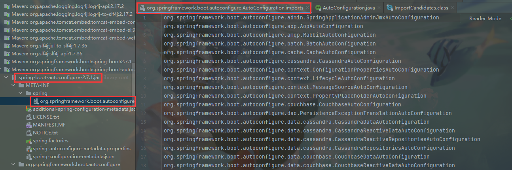
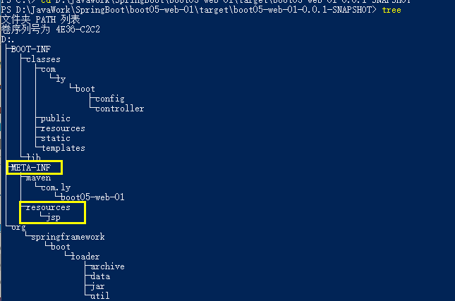
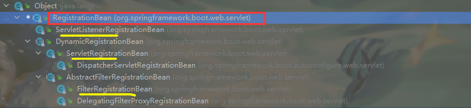
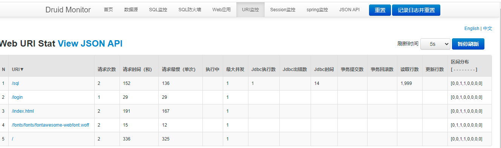

# 

# 0、前提准备

## 学习要求：

+ 熟悉Spring基础
+ 熟悉Maven使用

## 环境要求：

+ JDK1.8及以上
+ Maven3.3及以上

## 官方资料：

+ 笔记 ：[第一季：SpringBoot2核心技术-基础入门 · 语雀 (yuque.com)](https://www.yuque.com/atguigu/springboot/rmxq85)

+ 原代码：[SpringBoot2核心技术与响应式编程: SpringBoot2核心技术与响应式编程 (gitee.com)](https://gitee.com/leifengyang/springboot2)

  

# 1、SpringBoot核心技术--基础入门

## 01 Spring5的重大升级

在引入响应式编程后，服务开发就可以分为两种

+ servlet技术栈

+ webflux构建异步数据流方式，实现响应式编程

  

## 02 Spring5内部源码设计

基于Java8新特性，如：接口的默认实现，重新设计源码架构


## 03 为什么使用SpringBoot

它可以帮我们快速的创建出生产级别的Spring应用，使得Spring开发变得简单。


## 04 SpringBoot优点

1. 创建出独立的Spring应用
2. 内嵌web服务器
3. 自动starter依赖，简化构建配置
4. 自动配置Spring及第三方功能
5. 提供生产级别的监控、健康检查及外部化配置
6. 无代码生成，无需填写XML

## 05 Spring缺点

+ 版本更新迭代特别快
+ 封装太深，内部原理复杂，不容易精通

## 06 SpringBoot2入门

### 1、系统要求

+ Java 8 & 兼容Java14
+ Maven 3.3+
+ IDEA 2019.1.2
+ Tomcat 9.0+

#### 1.1、Maven设置

设置Maven配置文件settings.xml设置镜像和jdk版本

```xml
<!--settings.xml -->
<mirrors>
      <mirror>
        <id>nexus-aliyun</id>
        <mirrorOf>central</mirrorOf>
        <name>Nexus aliyun</name>
        <url>http://maven.aliyun.com/nexus/content/groups/public</url>
      </mirror>
  </mirrors>
 
  <profiles>
         <profile>
              <id>jdk-1.8</id>
              <activation>
                <activeByDefault>true</activeByDefault>
                <jdk>1.8</jdk>
              </activation>
              <properties>
                <maven.compiler.source>1.8</maven.compiler.source>
                <maven.compiler.target>1.8</maven.compiler.target>
                <maven.compiler.compilerVersion>1.8</maven.compiler.compilerVersion>
              </properties>
         </profile>
  </profiles>
```

### 2、HelloWorld

​	需求：浏览发送/hello请求，响应 Hello，Spring Boot 2 

#### 2.1、创建Maven工程

#### 2.2、pom.xml中引入依赖Springboot

```xml
<!-- pom.xml-->


<?xml version="1.0" encoding="UTF-8"?>
<project xmlns="http://maven.apache.org/POM/4.0.0"
         xmlns:xsi="http://www.w3.org/2001/XMLSchema-instance"
         xsi:schemaLocation="http://maven.apache.org/POM/4.0.0 http://maven.apache.org/xsd/maven-4.0.0.xsd">
    <modelVersion>4.0.0</modelVersion>

    <groupId>com.ly</groupId>
    <artifactId>boot01-helloworld</artifactId>
    <version>1.0-SNAPSHOT</version>
    <packaging>jar</packaging>

    <properties>
        <maven.compiler.source>8</maven.compiler.source>
        <maven.compiler.target>8</maven.compiler.target>
    </properties>

    <!-- 1、使用springboot父标签-->
    <parent>
        <groupId>org.springframework.boot</groupId>
        <artifactId>spring-boot-starter-parent</artifactId>
        <version>2.7.1</version>
    </parent>

    <!-- 2、添加springboot场景依赖  如这是个web工程依赖于web-->
    <dependencies>
        <dependency>
            <groupId>org.springframework.boot</groupId>
            <artifactId>spring-boot-starter-web</artifactId>
        </dependency>
    </dependencies>

    <!-- 对于web程序直接打成jar包，在服务器上执行即可-->
    <build>
        <plugins>
            <plugin>
                <groupId>org.springframework.boot</groupId>
                <artifactId>spring-boot-maven-plugin</artifactId>
            </plugin>
        </plugins>
    </build>

</project>
```

#### 2.3、创建SpringBoot主程序

```java
package com.ly.boot;

import org.springframework.boot.SpringApplication;
import org.springframework.boot.autoconfigure.SpringBootApplication;

/**
 * @FileName:MainApp.class
 * @Author:ly
 * @Date:2022/6/27
 * @Description:
 */

/**
 *  1、@SpringBootApplication 该注解用于告诉springboot 这程序是一个springboot应用
 *  2、使用该注解的类MainApplication 成为主程序类，是所有程序的启动入口
 */
@SpringBootApplication
public class MainApplication {

    public static void main(String[] args) {
        //运行主程序
        SpringApplication.run(MainApplication.class,args);
    }
}
```

#### 2.4、编写业务逻辑（如：控制器方法）

```java
package com.ly.boot.controller;

import org.springframework.web.bind.annotation.RequestMapping;
import org.springframework.web.bind.annotation.RestController;

/**
 * @FileName:HelloController.class
 * @Author:ly
 * @Date:2022/6/27
 * @Description:
 */
@RestController //@Response + @Controller
public class HelloController {
    @RequestMapping("/")
    public String helloWorld() {
        return "Hello Spring Boot!";
    }
}
```

#### 2.5、直接运行主程序main方法即可测试

主程序：类上有`@SpringBootApplication`注解

#### 2.6、SpringBoot简化配置文件 

==获取配置文件优先顺序：==


官方文档：[Common Application Properties (spring.io)](https://docs.spring.io/spring-boot/docs/current/reference/html/application-properties.html#appendix.application-properties)

​	SpringBoot配置文件`application.properties`用于配置其他所有框架的配置：tomcat、springmvc、mybatis、logback等等。放在Maven工程的`resources`目录下

```properties
# 修改服务端口号
server.port=8888
...
```

#### 2.7、SpringBoot简化部署

对于web程序直接打成jar包，在服务器上执行即可。Maven需要导入`spring-boot-maven-plugin`插件

```xml
 <!-- pom.xml-->
 <build>
     <plugins>
         <plugin>
             <groupId>org.springframework.boot</groupId>
             <artifactId>spring-boot-maven-plugin</artifactId>
         </plugin>
     </plugins>
</build>
```

```sh
# 简单运行 jar包 关闭dos窗口就停止了
java -jar xxx.jar
```

注意：取消dos窗口中“属性”-“快速编辑模式”

## 07 了解自动配置原理

### 1、SpringBoot特点

#### 1.1、依赖管理

+ 父项目做依赖管理

  ```xml
  <!-- pom.xml 中依赖 spring-boot-starter-parent -->
  <parent>
      <groupId>org.springframework.boot</groupId>
      <artifactId>spring-boot-starter-parent</artifactId>
      <version>2.7.1</version>
  </parent>
  <!--spring-boot-starter-parent的父类 spring-boot-dependencies 中几乎定义好开发常用的各种依赖版本-->
  <parent>
      <groupId>org.springframework.boot</groupId>
      <artifactId>spring-boot-dependencies</artifactId>
      <version>2.7.1</version>
  </parent>
  ```

+ 开发导入starter场景启动器

  官方说明：[Developing with Spring Boot](https://docs.spring.io/spring-boot/docs/current/reference/html/using.html#using.build-systems.starters)

  ```xml
  <!--
  1、spring-boot-starter-* 就代表Spring官方某种场景
  2、只要引入starter，这个场景的所有常规需要的依赖都会自动引入
  3、*-spring-boot-starter为第三方提供的场景启动器
  4、所有场景启动器starter底层都会依赖spring-boot-starter，这是最基本的starter
  如：pom.xml -->
  <dependencies>
      <dependency>
          <groupId>org.springframework.boot</groupId>
          <artifactId>spring-boot-starter-web</artifactId>
      </dependency>
  </dependencies>
  ```

+ 无需关注版本号，自动版本仲裁

  需要当前项目依赖的`starter`场景启动器中有定义好依赖才可以不用写版本号（如mysql），如果`starter`中没有声明依赖的话需要自己手动声明依赖dependencies/dependency（如mybatis）。

+ 可以修改版本号

  ```xml
  <!-- 通过查看源码中依赖版本号定义取值方式，可以自定义版本号 即spring-boot-dependencies-2.7.1.pom.xml中的properties标签中定义-->
  
  <!-- 使用的是xml定义属性，${}取值
  如： <mysql.version>8.0.29</mysql.version>
  	 ${mysql.version}
  -->
  
  # 自己的pom.xml复写属性mysql.version，实现自定义版本
  <properties>
      <mysql.version>5.1.31</mysql.version>
      ...
  </properties>
  
  <dependency>
      <groupId>mysql</groupId>
      <artifactId>mysql-connector-java</artifactId>
  </dependency>
  
  
  #方式二：直接加上版本号即可，不需要自定义属性
  <dependency>
      <groupId>mysql</groupId>
      <artifactId>mysql-connector-java</artifactId>
      <version>5.1.31</version>
  </dependency>
  
  ```

  

#### 1.2、自动配置

+ 自动配置好tomcat

  > 需要引入tomcat依赖 `父pom中引入了spring-boot-starter-tomcat`
  >
  > 配置tomcat

+ 自动配置好springmvc

  > 引入SpringMVC全套组件
  >
  > 自动配置好springmvc常用功能。如：拦截器，注解驱动，默认servlet-handler等

+ 自动配置好web常见功能，

  > 如：字符集编码，文件上传，视图解析器等

+ 默认的包结构（当然也可以自己指定）

  > ==主程序所在的包下所有文件及其下面的所有子包里面的组件都会被默认扫描==。如果要自定义包扫描则：`@SpringBootApplication(scanBasePackages = {"com.ly","cn.ly"})`或者 `@ComponentScan(basePackages = {})`
  >
  > ```java
  > //@ComponentScan(basePackages = {})会报错，那就把下面注解分开写
  > @SpringBootApplication
  > //等同于  看此注解内部详情
  > @SpringBootConfiguration
  > @EnableAutoConfiguration
  > @ComponentScan
  > ```
  >
  > ```sh
  > # 包结构
  > com
  > +- example
  >   +- myapplication # 下面所有组件都会被扫描
  >       +- MyApplication.java # 主程序(使用@SpringBootApplication注解的)
  >       |
  >       +- customer  
  >       |   +- Customer.java
  >       |   +- CustomerController.java
  >       |   +- CustomerService.java
  >       |   +- CustomerRepository.java
  >       |
  >       +- order
  >           +- Order.java
  >           +- OrderController.java
  >           +- OrderService.java
  >           +- OrderRepository.java
  > ```

+ 各种配置拥有默认值

  > 官方配置默认值文档：[Common Application Properties (spring.io)](https://docs.spring.io/spring-boot/docs/current/reference/html/application-properties.html#appendix.application-properties)
  >
  > `默认配置最终都是映射到对应类的方法上，而配置文件的值最终都会在IOC容器中的该类上体现`
  >
  > 如：文件上传 spring.servlet.multipart.max-file-size=1MB

+ 按需加载所有自动配置项

  > pom文件中引入了哪些场景starter，那些场景starter才会自动配置
  >
  > 所有自动配置均在`spring-boot-autoconfigure`包中配置
  >
  > 
  >
  > ***配置了所有常用功能：***
  >
  > 
  >
  > ***如果点进去发现是红色的，或者点不进去的：***说明当前没有启动那个场景，如果需要自己在pom中设置对应场景依赖即可

+ …


### 2、容器功能

#### 2.1、组件添加

指IOC容器中添加Bean，Controller等

##### ①、@Configuration `配置类代替Spring的xml配置文件`

即用@Configuration注解的配置类代替SpringConfig.xml配置文件，一个类就是一个配置文件

> 可以使用@Scope("prototype") 或@Scope("singleton")定义多/单实例

==***Full模式与Lite模式（重点`@Configuration(proxyBeanMethods = true/false)`）***==

+ ***示例***

  ```java
  MyConfiguration bean = run.getBean(MyConfiguration.class);
  System.out.println("获得配置类本身：");
  //根据proxyBeanMethods = true/false 判断是否代理配置类创建bean方法
  User user01 = bean.user01();
  User user011 = bean.user01();
  System.out.println(user01 == user011);
  ```

  > 其实就是判断创建bean的方法，自己调用时是不是也要经过Spring的判断（默认是需要Spring判断）

+ ***最佳实战***
  
  + 配置类组件之间无依赖关系的，用Lite模式`(proxyBeanMethods=false)`。加速容器启动过程，减少判断。
  
    > 此时配置类类型：`com.ly.boot.config.MyConfiguration@286b39c2`
  
  + 配置类组件之间有依赖关系，用Full模式`(proxyBeanMethods=true)`。方法被调用会得到之前的单实例组件。
  
    > 此时配置类类型：`com.ly.boot.config.MyConfiguration$$EnhancerBySpringCGLIB$$12c8f4f1@4525d1d3`

+ ***适应场景：***
  + 组件依赖

***配置类创建组件：***

```java

/**
 * 1、@Configuration 此注解用于告诉SpringIOC该类为一个配置类（对应一个配置文件）,默认也是单实例的
 * 2、proxyBeanMethods：SpringBoot2新特点 字面意思表示“是否代理bean对象的调用方法”
       默认为true：表示使用代理bean对象的调用方法 即每次调用bean对象Configuration的user01方法都会先去IOC容器中找看看是否有，如果有就直接拿；如果没有才会重新创建。总之一句话：true，保持对象组件user01单实例
       设置为false：表示不使用代理bean对象的调用方法 即每次调用bean对象Configuration的user01方法都会创建一个新的对象组件user01（即名字还是user01，但是内存地址变化了，新创建对象替换了）
 
 * 3、由 proxyBeanMethods 引申出SpringBoot的两种配置：
 *      full：全配置  (proxyBeanMethods=true) 每次都先从IOC容器中先找，找到了就返回。找不到再创建
 *          full优点：每次都先从IOC取，没有才创建节约内存资源
 *      lite：轻量级配置 (proxyBeanMethods=false) 每次都是直接重新创建一个新的组件
 *          lite优点：springBoot启动更快，不检测组件在Ioc容器中是否已存在
 *
 *  4、proxyBeanMethods属性用于解决：组件依赖(true依赖，false不依赖)
 *      如User类中有一个Pet pet对象。
 *      配置类中user01想要直接从IOC中取已经存在的Pet ht 就必须 设置proxyBeanMethods=true
 *
 *  5、推荐如果容器中只是用于注册组件，别的组件也不依赖这个组件：则此组件应该设置为false 即lite模式
 *  6、推荐如果容器注册组件时且别的组件也依赖这个组件：则此组件应该设置为true即full模式
 */
@org.springframework.context.annotation.Configuration(proxyBeanMethods = false)
public class Configuration { //该类本身也是一个组件，在IOC中可以取到

    //@Scope("prototype")
    @Bean
    //用方法名作为组件对象的id，返回类型就是组件类型
    public User user01() {
        User user = new User("张三", 22);
        //proxyBeanMethods=true时，才能正确的从IOC中拿走已存在的ht组件
        //proxyBeanMethods=false时，取得时重新创建的不是IOC容器的那个
        //**这种就叫做组件依赖 即【组件user01依赖于组件ht】
        user.setPet(getPet());
        return user;
    }


    @Bean("ht")
    public Pet getPet() {
        return new Pet("核桃");
    }
}

```

***对应Spring的xml配置文件创建组件：***

```xml
<bean id="user01" class="com.ly.boot.bean.User">
    <property name="name" value="张三" />
    <property name="age" value="22" />
</bean>
```

***SpringBoot从IOC容器中获取组件：***

```java
@SpringBootApplication
public class MainApplication {

    public static void main(String[] args) {
        //运行主程序  返回IOC容器，里面包含所有的bean对象
        ConfigurableApplicationContext run = SpringApplication.run(MainApplication.class, args);
        //获取IOC容器中所有已经创建好的bean
        String[] names = run.getBeanDefinitionNames();
        for (String name : names) {
            System.out.println(name);
        }
		
        //默认是单实例singleton，每次获取都是同一个对象
        //从IOC容器中通过id值获取我们创建的组件
        User user = run.getBean("user01", User.class);
        User user1 = run.getBean("user01", User.class);
        System.out.println(user==user1);//true
        
        //,默认也是单实例的
        MyConfiguration bean = run.getBean(MyConfiguration.class);
        System.out.println("获得配置类本身：");
        System.out.println(bean);
        
        
        //如果@Configuration(proxyBeanMethods = true) 最后结果就是true  ,每次都先从IOC容器中先找，找到了就返回。找不到再创建
        //如果@Configuration(proxyBeanMethods = false) 最后结果就是false,每次都是直接重新创建一个新的组件
        User user01 = bean.user01();
        User user011 = bean.user01();
        System.out.println(user01 == user011);
    }
}
```


##### ②、@Bean、@Component、@Controller、@Service、@Repository注解的均可被扫描添加

##### ③、@ComponentScan、@Import

​	1、`@ComponentScan` 和之前一样，指定的包会被扫描

​	2、`@Import`需要写在IOC容器中的组件类上（`配置类或者@Controller类等均可`），其意思就是==当SpringBoot启动时扫描到被`@Import`注解的类时，会导入其指定类（`如：User`）到IOC容器中（利用这些类的无参构造器），ioc容器中该组件的名字默认为全类名==

```java
//例如 放在配置类上
//当SpringBoot启动时扫描到配置类Configuration上@Import注解，就会根据User和NullPointerException类的无参构造器创建对象放在IOC容器中以供使用，创建出组建的名字默认就是全类名
@Import({User.class,NullPointerException.class}) //给容器中自动创建出这两个类型的组件、默认组件的名字就是全类名
@org.springframework.context.annotation.Configuration(proxyBeanMethods = false)
    
public class Configuration {...}
```

##### ④、@Conditional

​	条件装配：满足@Conditional指定条件的，则进行组件注入


***条件注解标注在方法上：***

`表示IOC容器满足条件时，才会执行这个方法。如：向容器中注入该bean`

```java
//以ConditionalOnBean为例，如果IOC容器中已经存在User对象且组件名为user01时，才进行注入【即满足 存在bean条件才执行】
@ConditionalOnBean(value = User.class,name = "user01")
@Bean
//用方法名作为组件对象的id，返回类型就是组件类型
public User user01() {
    User user = new User("张三", 22);
    user.setPet(getPet());
    return user;
}
```

***条件注解标注在类上：***

`表示IOC容器满足条件时，才会执行该类下的所有注解方法。如：向容器中注入该配置类下的所有Bean方法对象`

```java
@org.springframework.context.annotation.Configuration(proxyBeanMethods = false)
//如果IOC容器中 没有 名为ht且类型为Pet的对象/组件时，才会执行该配置类Configuration下的方法，自动向IOC容器中注入user01(ht被注释掉了，无法自动注入到IOC容器中)
@ConditionalOnMissingBean(name = "ht",value = Pet.class)
public class Configuration {


    @Bean
    //用方法名作为组件对象的id，返回类型就是组件类型
    public User user01() {
        User user = new User("张三", 22);
        user.setPet(getPet());
        return user;
    }

    //@Bean("ht")
    public Pet getPet() {
        return new Pet("核桃");
    }
}
```

#### 2.2、@ImportResource 原生Spring配置文件引入

​	==作用：将原始的Spring的xml配置文件引入到IOC容器中。==

​	==步骤：只需要将此注解写在随便一个配置类上即可==

如：

```xml
<!-- SpringConfig.xml  -->

<?xml version="1.0" encoding="UTF-8"?>
<beans xmlns="http://www.springframework.org/schema/beans"
       xmlns:xsi="http://www.w3.org/2001/XMLSchema-instance"
       xsi:schemaLocation="http://www.springframework.org/schema/beans http://www.springframework.org/schema/beans/spring-beans.xsd">
    <bean id="lisi" class="com.ly.boot.bean.User">
        <property name="name" value="李四" />
        <property name="age" value="33" />
    </bean>
</beans>
```

导入此Spring配置文件

```java
@Configuration
@ImportResource({"classpath:spring/SpringConfig.xml"})//导入SpringConfig.xml
public class AnnotationConfiguration {

    //和这个效果一样
//    @Bean("lisi")
//    public User getUser() {
//        return new User("李四",33);
//    }
}
```

测试

```java
@SpringBootApplication
public class MainApplication {

    public static void main(String[] args) {
        //运行主程序  返回IOC容器，里面包含所有的bean对象
    ConfigurableApplicationContext run = SpringApplication.run(MainApplication.class, args);
        
     //测试是否存在名为  lisi 的组件
     boolean lisiExists = run.containsBean("lisi");
     System.out.println("User用户lisi是否存在？" + lisiExists); //true
    }
}

```

#### 2.3、***配置绑定***

​	如何使用Java读取到properties文件中的内容。并且把它封装到JavaBean中，以供随时使用。

***普通Java方法：***

```java
//创建Properties对象
//创建File文件流读取
//遍历
```

***SpringBoot注解方法***

##### ①、@Component + @ConfiguratonProperties  适用于自己的类

==***此方法创建的组件名，默认是首字母小写（如Car类的car）***==

> 必须导入依赖才能让IDE解析，跳转到对应的setxxx()方法
>
> ```xml
> <dependency>
>     <groupId>org.springframework.boot</groupId>
>     <artifactId>spring-boot-configuration-processor</artifactId>
>     <optional>true</optional>
> </dependency>
> ```

==注意此方法：的properties配置文件必须以application开头的文件。即application*.properties==

***application.properties配置文件：***

```properties
# server.port=8888
spring.servlet.multipart.max-file-size=1MB

# 配置了spring-boot-configuration-processor 且加上@Component 就可以自动跳转到对应set方法
mycar.brand=BYD
mycar.price=10000
```

***直接在Bean上配置该注解，会自动注入属性（该类必须先注册到IOC容器中）：***

```java
/**
 * Car.java
 * 只有容器中的组件才能使用这些注解方法所以必须加上@Component
 */
@Component
//通过spring的属性自动注入，将properties文件中前缀开头的mycar.*类属性注入到IOC容器中Car对象的属性（该对象的名字默认是全类名）
@ConfigurationProperties(prefix = "mycar")//前缀就是properties文件里的前缀
public class Car {
    private String brand;
    private Integer price;
    
    ...
}
    
```

***通过属性自动注入，使用该Car对象***

```java
@RestController //@Response + @Controller
public class HelloController {
    @Autowired //通过spring的对象自动注入，将car对象注入到myCar
    private Car myCar;

    @RequestMapping("/car")
    public Car getCar() {
        return myCar;
    }
    @RequestMapping("/")
    public String helloWorld() {
        return "Hello Spring Boot!";
    }
}
```

***测试：***

springBoot自动集成了json，所以自动转化为json对象了


##### ②、@EnableConfigurationProperties + @ConfigurationProperties 适用于第三方类

==***此方法创建的组件名，默认是前缀-全类名（如mycar-com.ly.boot.bean.Car）***==

==注意此方法：的properties配置文件必须以application开头的文件。即application*.properties==

​	对于①中的第二种写法：

​	***第一种写法：***

​			`@Component +  @ConfigurationProperties` 均放在Car类上

​	***第二种写法：***

​			`@EnableConfigurationProperties ` 放在任意一个配置类上（使用了`@Configuration`标注的类）

​			` @ConfigurationProperties` 放在实体类Bean对象上

```java
//AnnotationConfiguration.java 配置类

@Configuration
/**
 * @EnableConfigurationProperties(Car.class)两个作用：
 *  1、开启Car配置绑定功能
 *  2、把这个Car组件自动注册到容器中
 */
@EnableConfigurationProperties(Car.class) //需要制定要开启自动注入properties的类
public class AnnotationConfiguration {

}
```

```java
/**
 * Car.java
 * 只有容器中的组件才能使用这些注解方法所以必须加上@Component,如果有@EnableConfigurationProperties就不需要了
 */
//@Component 使用@EnableConfigurationProperties代替此注解

//通过spring的属性自动注入，将properties文件中前缀开头的mycar.*类属性注入到IOC容器中Car对象的属性（该对象的名字默认是全类名）
@ConfigurationProperties(prefix = "mycar")//前缀就是properties文件里的前缀
public class Car {
    private String brand;
    private Integer price;
    
    ...
}
    
```

### 3、自动配置原理入门

***SpringBoot启动默认加载所以场景，但是最终会根据条件装配规则，按需配置！***

`@SpringBootApplication`由下面三个注解组成：

+ `@SpringBootConfiguration`
+ `@EnableAutoConfiguration`
+ `@ComponentScan`

#### 3.1、引导加载自动配置类

***@SpringBootApplication：主要由以下三部分组成***

+ `@SpringBootConfiguration`
+ `@EnableAutoConfiguration`
+ `@ComponentScan`

***
***@SpringBootConfiguration.class 配置类***

```java
//SpringBootConfiguration.class （配置类）
package org.springframework.boot;
...
@Target({ElementType.TYPE})
@Retention(RetentionPolicy.RUNTIME)
@Documented
@Configuration //配置类注解 说明@SpringBootApplication标注的类（主程序）其实也是一个配置类
@Indexed
public @interface SpringBootConfiguration {
    @AliasFor(
        annotation = Configuration.class
    )
    boolean proxyBeanMethods() default true;
}
```
***@ComponentScan.class 包扫描***

```java
//@ComponentScan就是包扫描，它自定义了排除过虑器 （三个中开启包扫描）

@ComponentScan(
    excludeFilters = {@Filter(
    type = FilterType.CUSTOM,
    classes = {TypeExcludeFilter.class}
), @Filter(
    type = FilterType.CUSTOM,
    classes = {AutoConfigurationExcludeFilter.class}
)}
```
***@EnableAutoConfiguration.class 最主要，处理业务逻辑***

```java
//EnableAutoConfiguration.class 三个中最重要

package org.springframework.boot.autoconfigure;
...

@Target({ElementType.TYPE})
@Retention(RetentionPolicy.RUNTIME)
@Documented
@Inherited
@AutoConfigurationPackage //自动配置包 见下① 
@Import({AutoConfigurationImportSelector.class}) //最重要的 见下②
public @interface EnableAutoConfiguration {
    String ENABLED_OVERRIDE_PROPERTY = "spring.boot.enableautoconfiguration";

    Class<?>[] exclude() default {};

    String[] excludeName() default {};
}
```

> ① *** @EnableAutoConfiguration 内的 @AutoConfigurationPackage***
>
> ```java
> package org.springframework.boot.autoconfigure;
> ...
> @Target({ElementType.TYPE})
> @Retention(RetentionPolicy.RUNTIME)
> @Documented
> @Inherited
> /*
> 导入包Registrar，给容器中进行批量注册bean组件.
> 批量注册的都是我们写的主程序（MainApplication.java）所在包下，及其子包下的所有被注解标注的类 即com.ly.boot下所有类
> */
> @Import({AutoConfigurationPackages.Registrar.class}) 
> public @interface AutoConfigurationPackage {
> String[] basePackages() default {};
> 
> Class<?>[] basePackageClasses() default {};
> }
> ```
>
> 注册主程序所在包(包括子包)下所有组件导入/注册到IOC容器中
>
> 
>
> ② *** @EnableAutoConfiguration 内的 @Import({AutoConfigurationImportSelector.class})*** 
>
> ***核心方法：***
>
> ```java
> 	protected AutoConfigurationEntry getAutoConfigurationEntry(AnnotationMetadata annotationMetadata) {
> 		if (!isEnabled(annotationMetadata)) {
> 			return EMPTY_ENTRY;
> 		}
>         //获取注解@EnableAutoConfiguration属性值 exclude 和 excludeName
> 		AnnotationAttributes attributes = getAttributes(annotationMetadata);
>         //获取所有等待自动配置的 候选人共144个
> 		List<String> configurations = getCandidateConfigurations(annotationMetadata, attributes);
>         //去掉重复的类名
> 		configurations = removeDuplicates(configurations);
>         //根据属性值 exclude 和 excludeName获取排除的类名，默认为null
> 		Set<String> exclusions = getExclusions(annotationMetadata, attributes);
> 		checkExcludedClasses(configurations, exclusions);
>         //从默认144个自动配置候选人中，删除被排出的exclude 和 excludeName的值
> 		configurations.removeAll(exclusions);
>         //根据当前设置的启动器spring-boot-starter-web，筛选出需要用到的进行自动配置（24个）
> 		configurations = getConfigurationClassFilter().filter(configurations);
>         //开启自动配置导入事件Evenr
> 		fireAutoConfigurationImportEvents(configurations, exclusions);
> 		return new AutoConfigurationEntry(configurations, exclusions);
> 	}
> ```
> ***详细解析：***
>
> + `List<String> configurations = getCandidateConfigurations(annotationMetadata, attributes);`
>
>   > 1、然后调用方法加载所有候选Candidate需要导入的包：`ImportCandidates.load(AutoConfiguration.class, getBeanClassLoader())`
>   >
>   > ```java
>   > public static ImportCandidates load(Class<?> annotation, ClassLoader classLoader) {
>   >     Assert.notNull(annotation, "'annotation' must not be null");
>   >     ClassLoader classLoaderToUse = decideClassloader(classLoader);
>   >     //获取配置文件路径
>   >     String location = String.format("META-INF/spring/%s.imports", annotation.getName());
>   >     Enumeration<URL> urls = findUrlsInClasspath(classLoaderToUse, location);
>   >     ArrayList autoConfigurations = new ArrayList();
>   > 
>   >     while(urls.hasMoreElements()) {
>   >         URL url = (URL)urls.nextElement();
>   >         //把配置文件内容加到 autoConfigurations
>   >         autoConfigurations.addAll(readAutoConfigurations(url));
>   >     }
>   > 
>   >     return new ImportCandidates(autoConfigurations);
>   > }
>   > ```
>   >
>   > 2、然后调用方法，读取注解`@AutoConfiguration.class`所在包`spring-boot-autoconfigure-2.7.1.jar`下的[org.springframework.boot.autoconfigure.AutoConfiguration.imports](org.springframework.boot.autoconfigure.AutoConfiguration.imports)文件，获取144个组件名：
>   >
>   > `String location = String.format("META-INF/spring/%s.imports", annotation.getName());`
>   >
>   > 结果为：META-INF/spring/org.springframework.boot.autoconfigure.AutoConfiguration.imports
>   >
>   > 
>   >
>   > 
>   >
>   >  

#### 3.2、按需加载上面144个配置类

***SpringBoot启动默认加载所以场景，但是最终会根据条件装配规则，按需配置！***

虽然注解`@AutoConfiguration.class`所在包`spring-boot-autoconfigure-2.7.1.jar`下的[org.springframework.boot.autoconfigure.AutoConfiguration.imports](org.springframework.boot.autoconfigure.AutoConfiguration.imports)文件由144个场景启动的组件类，但是我们不是每个都需要。所以会根据实际配置的场景按需启动。

> ***如我们在pom.xml文件中只配置了`spring-boot-starter-web`的场景启动，则只会按需加载此场景组件***
>
> 原理：
>
> 比如我们需要***amqp**的自动配置，则需要看对应目录下`xxxAutoConfiguration`类，该类上会有个条件
>
> ```java
> @AutoConfiguration
> //仅在指定的RabbitTemplate和Channel类路径存在时，才会自动注入，
> //也就是说我们导入某个场景启动器才会导入该类，则其对应组件才会被自动配置
> @ConditionalOnClass({ RabbitTemplate.class, Channel.class })
> @EnableConfigurationProperties(RabbitProperties.class)
> @Import({ RabbitAnnotationDrivenConfiguration.class, RabbitStreamConfiguration.class })
> public class RabbitAutoConfiguration {
> ```
>
> 如：我们需要***h2***的自动配置，需要满足所有的`@Conditiolal`条件才会导入
>
> ```java
> @AutoConfiguration(after = DataSourceAutoConfiguration.class)
> //需要开启web servlet
> @ConditionalOnWebApplication(type = Type.SERVLET)
> //需要WebServlet类路径存在
> @ConditionalOnClass(WebServlet.class)
> //Environment中需要有指定属性值（Environment中来源就是application.properties配置文件中自己配置的）
> @ConditionalOnProperty(prefix = "spring.h2.console", name = "enabled", havingValue = "true")
> @EnableConfigurationProperties(H2ConsoleProperties.class)
> public class H2ConsoleAutoConfiguration {
> ```
> Property查看***h2***属性，就是配置文件`application*.yml/yaml/properties`中是否有`spring.h2.console`开头的，
>
> 属性名为`enabled`
>
> 
>
> 如：我们pom文件中添加的`spring-boot-starter-web`启动器，默认就是tomcat
>
> 

#### 3.3、修改默认配置

如：`spring-boot-autoconfigure-2.7.1.jar`包下web/servlet下的`DispatcherServletAutoConfiguration.java`

```java
//给容器中加入名字为multipartResolver的组件
@Bean
//如果容器中有MultipartResolver.class
@ConditionalOnBean(MultipartResolver.class)
//但是容器中没有名字为multipartResolver的组件时
@ConditionalOnMissingBean(name = DispatcherServlet.MULTIPART_RESOLVER_BEAN_NAME)
public MultipartResolver multipartResolver(MultipartResolver resolver) {//自动注入容器中的参数
   // Detect if the user has created a MultipartResolver but named it incorrectly
   return resolver;
}
```

SpringBoot默认会在底层配好所有组件，但是如果用户自己配置了，则用户的优先使用。

```java
//HttpEncodingAutoConfiguration.java
@Bean
@ConditionalOnMissingBean
public CharacterEncodingFilter characterEncodingFilter() {
   CharacterEncodingFilter filter = new OrderedCharacterEncodingFilter();
   filter.setEncoding(this.properties.getCharset().name());
   filter.setForceRequestEncoding(this.properties.shouldForce(Encoding.Type.REQUEST));
   filter.setForceResponseEncoding(this.properties.shouldForce(Encoding.Type.RESPONSE));
   return filter;
}
```

***总结：***

+ 自己配了组件，SpringBoot就用；如果没配，SpringBoot会自动配置 （`xxxAutoConfiguration`）

+ 每个自动配置按照不同的条件(`@Conditional`，也就是对应的场景starter)生效，默认都会有一个properties配置文件绑定值，需要什么属性值就去取

  > ==每个`xxxAutoConfiguration.class`\=\=》依赖`xxxProperties.class`\=\=>绑定`application*.yml/yaml/properties`==
  >
  > SpringBoot中所有配置文件都是在`application*.yml/yaml/properties`中，使用的时候通过前缀prefix来区分
  >
  > ```java
  > @AutoConfiguration
  > @EnableConfigurationProperties(ServerProperties.class)
  > @ConditionalOnWebApplication(type = ConditionalOnWebApplication.Type.SERVLET)
  > @ConditionalOnClass(CharacterEncodingFilter.class)
  > @ConditionalOnProperty(prefix = "server.servlet.encoding", value = "enabled", matchIfMissing = true)
  > public class HttpEncodingAutoConfiguration {...}
  > 
  > //对应的ServerProperties.class
  > @ConfigurationProperties(prefix = "server", ignoreUnknownFields = true)
  > public class ServerProperties {...}
  > 
  > //对应application*.yml/yaml/properties配置文件中的 server开头的配置
  > ```
  > 

+ 生效的配置类就会给容器中自动注入相应组件，相当于自己配置

  > 如`spring-boot-starter-web`场景就会自动注入dispatcherServlet，characterEncodingFilter等

+ 定制化配置（自己修改对应组件的属性值，只需要修改配置文件即可）

  > **xxxxxAutoConfiguration ---> 组件  --->** **xxxxProperties里面拿值  ----> application.properties**


***

#### 3.4、最佳实践

+ 引入相应的场景依赖

  > springboot官方场景starter：[Developing with Spring Boot](https://docs.spring.io/spring-boot/docs/2.7.1/reference/html/using.html#using.build-systems.starters)

+ 查看自动配置了哪些类（选做）

  * 自己分析源码，引入场景的自动配置哪些生效和不生效

    > 什么xxxstarter对应`spring-boot-autoconfigure-2.7.1.jar`包下对应目录（如：tomcat-->web）

  * 配置文件`application*.yml/yaml/properties`中添加属性 `debug=true`，开启debug启动报告

    > Positive matches：开启的组件，及开启的原因（注入）
    >
    > Negative matches：未开启的组件，及未开启原因（不注入）
    >
    > Exclusions：排除的组件（不注入）
    >
    > Unconditional classes：无条件类（注入）

+ 修改配置

  + 参考官方文档，修改配置文件`application*.yml/yaml/properties`

    > 配置官方文档：[Common Application Properties (spring.io)](https://docs.spring.io/spring-boot/docs/2.7.1/reference/html/application-properties.html#appendix.application-properties)

  + 自己分析不同场景starter下，`spring-boot-autoconfigure-2.7.1.jar`包下对应源码

    > **xxxxxAutoConfiguration ---> 组件  --->** **xxxxProperties里面值  ----> application.properties**

  + 自定义加入组件

    > 配置类中`@Bean,@Import,@Component`等等

  + ***创建自定义器，xxxCustomizer***（后面研究）

  + ......

***

### 4、开发小技巧

#### 4.1、Lombok

简化JavaBean开发

***Lombok使用步骤：***

+ 引入依赖（就在父pom文件中规定好的版本）

  ```xml
  <dependency>
      <groupId>org.projectlombok</groupId>
      <artifactId>lombok</artifactId>
      <version>${lombok.version}</version>
  </dependency>
  ```

+ 安装Lombok插件（小辣椒图标，idea自带），会自动帮我们生成getter和setter方法（当然是编译时生成的）

+ POJO类上加上Lombok的`@Data,@ToString`注解即可

  ```java
  //当然仅在编译时自动生成
  
  @AllArgsConstructor//自动生成所有参数的有参构造器
  @NoArgsConstructor//自动生成无参构造器
  @ToString//自动生成toString方法
  @Data //自动生成getter，setter方法
  @ConfigurationProperties(prefix = "mycar")//前缀就是properties文件里的前缀
  public class Car {
      private String brand;
      private Integer price;
      
  }
  ```

***Lombok常用注解：***

| 注解                | 作用                                               |
| ------------------- | -------------------------------------------------- |
| @Data               | 编译时自动生成getter，setter方法                   |
| @ToString           | 编译时自动生成toString方法                         |
| @NoArgsConstructor  | 编译时自动生成无参构造器                           |
| @AllArgsConstructor | 编译时自动生成所有参数的有参构造器（其余的自己写） |
| @EqualsAndHashCode  | 编译时自动重写equal和hashcode方法                  |
| @Slf4j              | 编译时自动注入一个日志组件                         |

***

#### 4.2、dev-tools

实现服务的热更新，每次更新文件或资源不需要重启服务。

***dev-tools使用步骤：***

+ 导入相应依赖

  ```xml
  <dependencies>
      <dependency>
          <groupId>org.springframework.boot</groupId>
          <artifactId>spring-boot-devtools</artifactId>
          <optional>true</optional>
      </dependency>
  </dependencies>
  ```

+ 如果更新文件或资源直接`Ctrl+F9`或锤子图标编译，dev-tools会自动进行重启服务（简化部署）

+ 如果想要热更新，reload需要付费使用 [JRebel](https://jrebel.com/software/jrebel/)  插件

***

#### 4.3、Spring Initializer(项目初始化向导)

IDEA中新建项目/模块时使用

+ 新建工程或项目

  

+ 勾选需要的场景启动器

  

***

# 2、SpringBoot核心技术--核心功能

## 2.1、配置文件

***支持的配置文件类型：***

+ `properties文件`
+ `yaml文件`
+ `yml文件`

### ***1、yaml文件原理：***

YAML 是 "YAML Ain't Markup Language"（YAML 不是一种标记语言）的递归缩写。在开发的这种语言时，YAML 的意思其实是："Yet Another Markup Language"（仍是一种标记语言）。 

非常适合用来做以数据为中心的配置文件

### ***2、yaml文件基本语法：***

+ `K: v`，需要注意冒号: 后面有一个空格
+ `大小写敏感`
+ `使用缩进表示层级关系`
+ `缩进不允许使用tab按键，只能使用空格`（idea会自动把tab换成空格）
+ `缩进的空格数不重要，不关心，只要是相同层级的元素左对齐即可`
+ `# 表示注释`
+ `字符串无需加引号，如果非要加记住：''单引号字符串内容会被 转义（意思是单引号和\一样会转义，但实际可能不转义），""双引号表示字符串内容 不转义（意思是双引号和\不一样不会转义，但实际可能转义）`

### ***3、yaml文件数据类型：***

+ ***字面量：***单个的、不可再分的值。如：date，boolean，string，number，null

  ```yaml
  k: v
  ```

+ ***对象：***键值对的集合。如：map，hash，set，object

  ```yaml
  # 行内写法  对象是{} ,里面不需要空格
  k: {k1:v1,k2:v2,k3:v3}
  
  # 或者
  k: 
     k1: v1
     k2: v2
     k3: v3
  ```

+ ***数组：***一组按次序排列的值。如：array，list，queue

  ```yaml
  # 行内写法  数组是[]
  k: [v1,v2,v3]
  
  # 或者
  k: 
     - v1 # -表示一个元素，空格，然后是属性值
     - v2
     - v3
  ```

### ***4、yaml文件使用示例：***

分别绑定properties配置文件和yaml配置文件

***Bean对象类型：***

```java
@Data
@ToString
@Component
//@ConfigurationProperties(prefix = "properties.person")
@ConfigurationProperties(prefix = "yml.person")
public class Person {
    private String userName;
    private Boolean boss;
    private Date birth;
    private Integer age;
    private Pet pet;
    private String[] interests;
    private List<String> animal;
    private Map<String, Object> score;
    private Set<Double> salarys;
    private Map<String, List<Pet>> allPets;
}
```

```java
@Data
@ToString
public class Pet {
    private String name;
    private Double weight;
}
```

***yaml配置文件定义一个Person对象：***

```yaml
yml.person:
# 双引号"" 会将 \n 作为换行输出  
	#（\本来就是【转义】，""双引号代表【不转义】，所以最后总的是 【转义】 输出换行） 
# 单引号'' 会将 \n 作为字符串输出 
	#（\本来就是【转义】，''单引号代表【转义】，所以最后总的是 【不转义】 输出换行） 负负得正
  userName: "张三 \n 李四"
  boss: true
  # 日期写法必须为 / 区分，或者自己在 additional-spring-configuration-metadata.json文件中定义类型
  birth: 1983/12/14
  age: 39
  # 另一个对象
  pet:
    name: 小黄
    weight: 15
  interests: [抽烟,喝酒,烫头]
  animal:
    - 大象
    - 老虎
    - 狮子
  score:
    chinese: 99
    math: 100
    psychological: 13
  salarys: [20000,180000]
  allPets:
    # key 不能为中文
    dongwu:
      - {name: 小黄,weight: 15} # 行内写法 对象
      - name: 小米
        weight: 8
    zhiwu:
      - name: 富贵竹
        weight: 1.5
      - name: 绿萝
        weight: 1


debug: true
```

### ***5、yaml配置文件注意事项：***

+ ==yaml配置文件中key值不能为中文，最好是和变量名那样的规则==

+ ==可以在`resources\META-INF\additional-spring-configuration-metadata.json`文件中自定义属性的数据类型，可以用来解决自动转换格式问题==

  ```json
  {
    "properties": [
      { 
        "name": "yml.person.pet",
        "type": "com.ly.boot.bean.Pet",//指定类型，不然总是当初String类型
        "description": "Description for yml.person.pet."
      }
    ] }
  ```

+ ==所有`application*.yml/yaml/properties`配置文件都会加载，而加载顺序yml > yaml > properties（如果出现相同属性的不同只，最后加载的会覆盖掉前面）==

### ***6、配置文件提示属性功能：***

+ 添加依赖springBoot配置处理器

  ```xml
  <dependency>
      <groupId>org.springframework.boot</groupId>
      <artifactId>spring-boot-configuration-processor</artifactId>
      <optional>true</optional>
  </dependency>
  ```

+ 重新运行一次应用，即可

## 2.2、Web开发

### ***0、SpringBoot下jsp和html混用并打包为jar包***

​	<font color='red'>注意：Springboot默认是不支持jsp的，而且官方也不推荐，所以需要配置一下</font>

####    0、目录结构


#### 	1、引入依赖插件，目的：将webapp目录下所有资源放到META-INF/resources下

因为springBoot打好的包没有webapp目录，而且所有的静态资源只从默认的静态资源目录下找`/static, /public, /META-INF/resources, /resources`，但是webapp是和classes类路径同级别的，不是类路径下的，所有只能把webapp目录下所有资源转移到MEAT-INF/resources资源下。

> 如果不加这一步，只创建webapp目录则idea下运行没问题，但是打jar包后运行会报404，找不到资源

```xml
<build>
    <plugins>
        <!-- 1、打jar包依赖-->
        <plugin>
            <groupId>org.springframework.boot</groupId>
            <artifactId>spring-boot-maven-plugin</artifactId>
            <!--打jar包需要这个版本的依赖-->
            <version>1.4.2.RELEASE</version>
        </plugin>
        <plugin>
            <groupId>org.springframework.boot</groupId>
            <artifactId>spring-boot-maven-plugin</artifactId>
            <executions>
                <execution>
                    <goals>
                        <goal>repackage</goal>
                    </goals>
                </execution>
            </executions>
        </plugin>
    </plugins>
	
    
    <resources>
       <!--2、不修改springboot的默认静态资源目录-->
        <resource>
            <directory>src/main/resources</directory>
            <includes>
                <include>**/**</include>
            </includes>
            <!-- 开启过滤，用指定的参数替换directory下的文件中的参数 -->
            <filtering>false</filtering>
        </resource>
		<!-- 3、重定向webapp下所所有目录资源存放到META-INF/resources下-->
        <resource>
            <!--指定resources插件处理哪个目录下的资源文件-->
            <directory>src/main/webapp</directory>
            <!--注意此次必须要放在此目录下才能访问到-->
            <targetPath>META-INF/resources</targetPath>
            <includes>
                <include>**/**</include>
            </includes>
        </resource>
    </resources>
</build>
```

#### 	2、创建`src/main/webapp`目录

​	因为jsp默认值只能在webapp这个目录下使用，而springboot默认是没有的，所以自己手动建一个即可。并在里面存放jsp页面！

#### 	3、配置文件`application*.yaml`中配置前缀

```yaml
spring:
    view:
      prefix: /jsp/ # 以webapp为起点
      suffix: .jsp
```

#### 	4、撰写controller

```java
@Controller
@RequestMapping("/model")
public class ModelAttributeController {

    @RequestMapping("/hello")
    public String sayHello() {
        return "hello";
    }
}
```

#### 	5、配置jstl和jsp依赖

***配置jstl和jsp依赖，否则打不开jsp页面只会下载hello.jsp***

```xml
 <!-- 添加 jsp 依赖-->
 <dependency>
     <groupId>org.apache.tomcat.embed</groupId>
     <artifactId>tomcat-embed-jasper</artifactId>
     <scope>provided</scope>
 </dependency>
 <!-- 添加 JSTL 支持 -->
 <dependency>
     <groupId>javax.servlet</groupId>
     <artifactId>jstl</artifactId>
 </dependency>

```

#### 6、测试

访问`http://localhost:8080/model/hello`


#### 7、打jar包的目录结构



***

### <font color='red'>***< 1、SpringMVC自动配置概览***</font>

官方文档：==修改SpringMVC的组件的默认规则的三种方式：===

> Spring Boot provides auto-configuration for Spring MVC that **works well with most applications.(大多场景我们都无需自定义配置)**
>
> The auto-configuration adds the following features on top of Spring’s defaults:
>
> - Inclusion of `ContentNegotiatingViewResolver` and `BeanNameViewResolver` beans.
>  + <font color='red'>内容协商视图解析器和BeanName视图解析器</font>
> - Support for serving static resources, including support for WebJars (covered [later in this document](https://docs.spring.io/spring-boot/docs/current/reference/html/spring-boot-features.html#boot-features-spring-mvc-static-content))).
>  + <font color='red'>静态资源（包括webjars）</font>
> - Automatic registration of `Converter`, `GenericConverter`, and `Formatter` beans.
>  + <font color='red'>自动注册 `Converter，GenericConverter，Formatter `</font>
> - Support for `HttpMessageConverters` (covered [later in this document](https://docs.spring.io/spring-boot/docs/current/reference/html/spring-boot-features.html#boot-features-spring-mvc-message-converters)).
>  + <font color='red'>支持 `HttpMessageConverters` （后来我们配合内容协商理解原理）</font>
> - Automatic registration of `MessageCodesResolver` (covered [later in this document](https://docs.spring.io/spring-boot/docs/current/reference/html/spring-boot-features.html#boot-features-spring-message-codes)).
>  + <font color='red'>自动注册 `MessageCodesResolver` （国际化用）</font>
> - Static `index.html` support.
>  + <font color='red'>静态index.html 页支持</font>
> - Custom `Favicon` support (covered [later in this document](https://docs.spring.io/spring-boot/docs/current/reference/html/spring-boot-features.html#boot-features-spring-mvc-favicon)).
>  + <font color='red'>自定义 `Favicon`  </font>
> - Automatic use of a `ConfigurableWebBindingInitializer` bean (covered [later in this document](https://docs.spring.io/spring-boot/docs/current/reference/html/spring-boot-features.html#boot-features-spring-mvc-web-binding-initializer)).
>  + <font color='red'>自动使用 `ConfigurableWebBindingInitializer` ，（DataBinder负责将请求数据绑定到JavaBean上）</font>
> 
>If you want to keep those Spring Boot MVC customizations and make more [MVC customizations](https://docs.spring.io/spring/docs/5.2.9.RELEASE/spring-framework-reference/web.html#mvc) (interceptors, formatters, view controllers, and other features), you can add your own `@Configuration` class of type `WebMvcConfigurer` but **without** `@EnableWebMvc`.
> 
>==**1、不用@EnableWebMvc注解。使用** `**@Configuration**` **+** `**WebMvcConfigurer**` **自定义规则**==
> 
>
> 
>If you want to provide custom instances of `RequestMappingHandlerMapping`, `RequestMappingHandlerAdapter`, or `ExceptionHandlerExceptionResolver`, and still keep the Spring Boot MVC customizations, you can declare a bean of type `WebMvcRegistrations` and use it to provide custom instances of those components.
> 
>==**2、声明** `**WebMvcRegistrations**` **改变默认底层组件**==
> 
>
> 
>If you want to take complete control of Spring MVC, you can add your own `@Configuration` annotated with `@EnableWebMvc`, or alternatively add your own `@Configuration`-annotated `DelegatingWebMvcConfiguration` as described in the Javadoc of `@EnableWebMvc`.
> 
>==**3、使用** `**@EnableWebMvc+@Configuration+DelegatingWebMvcConfiguration 全面接管SpringMVC**`==

### ***2、简单功能分析***

#### 2.1、静态资源访问

##### 1、静态资源目录

只要静态资源存放在静态目录下，均可以直接访问。


***原理：***静态映射 /**

***访问（默认）：*** ==当前项目根路径/ + 静态资源名==

> `http://localhost:8080/4.png`

***静态目录（类路径下）：***

+ `/static `
+ `/public`
+ `/resources`
+ `/META-INF/resources`

***静态资源直接访问的原理：***

==所有的请求包括静态资源，默认都是先被dispatcherServlet处理的，除非自己修改了默认的MVC配置==

> 如：浏览器访问`http://localhost:8080/1.png`，首先被dispatcherServlet前端控制器接收到，判断有没有对应的映射
>
> + 如果有对应的映射`@RequestMapping`，执行控制器方法，返回什么由实际而定
> + 如果没有对应的映射`@RequestMapping`，直接返回静态资源。（如果静态资源不存在，就报错！）

***官方文档：***

> By default, Spring Boot serves static content from a directory called `/static` (or `/public` or `/resources` or `/META-INF/resources`) in the classpath or from the root of the `ServletContext`. It uses the `ResourceHttpRequestHandler` from Spring MVC so that you can modify that behavior by adding your own `WebMvcConfigurer` and overriding the `addResourceHandlers` method.
>
> In a stand-alone web application, the default servlet from the container is also enabled and acts as a fallback, serving content from the root of the `ServletContext` if Spring decides not to handle it. Most of the time, this does not happen (unless you modify the default MVC configuration), because Spring can always handle requests through the `DispatcherServlet`.
>
> By default, resources are mapped on `/**`, but you can tune that with the `spring.mvc.static-path-pattern` property. For instance, relocating all resources to `/resources/**` can be achieved as follows:

##### ***2、推荐静态资源加上前缀（自定义）***

目的是用于区分动态请求和静态资源，直接放行静态资源不进行过滤和拦截。

```properties
# properties   明确指定/resources下的所有请求为静态资源处理（先被dispatcherServlet处理）
spring.mvc.static-path-pattern=/resources/**
```

```yaml
# yaml 明确指定/resources下的所有请求为静态资源处理（先被dispatcherServlet处理）
spring:
  mvc:
    static-path-pattern: "/resources/**"
```

注：自定义前缀后，所有的静态目录均不会失效 `/static, /public, /META-INF/resources, /resources`

+ 但是无法这样访问`http://localhost:8080/4.png`
+ 必须加上前缀才可以访问，即`http://localhost:8080/resources/4.png`(4个目录下的文件都可以访问到)

##### 3、修改静态资源默认的四个路径

```yaml
spring:
  mvc:
    static-path-pattern: /resources/** # 修改访问静态资源路径必须为resources 开头
  web:
    resources:
      static-locations: classpath:/templates/  # 规定只允许访问类路径下templates目录中的资源
```

注意：无论修改静态访问目录为类路径下哪个路径，`static-path-pattern: /hah/**`时

+ 可以访问满足`/hah`的，在`templates`目录下
+ 同样也可以访问满足`/hah`的，`/META-INF/resources`下目录

总之：==`/META-INF/resources`目录下文件总是能获取到的（需要先满足`static-path-pattern`）==

##### ***4、webJar的支持***

即将前端资源如：js，css等打包成jar包，写成依赖文件。

官网：[WebJars - Web Libraries in Jars](https://www.webjars.org/)

如将jQuery.js打包成jar包，访问方式：`/webjars/**`

```xml
<dependency>
    <groupId>org.webjars</groupId>
    <artifactId>cljs-jquery</artifactId>
    <version>3.5.1</version>
</dependency>
```


页面访问webjar：`http://localhost:8080/webjars/jquery/3.5.1/jquery.js`

> 其实还是/META-INF/resources，只不过多了两层目录 
>
> `jquery/3.5.1/jquery.js`如果是bootstrap就换成对应目录，可以看截图

#### 2.2、欢迎页支持

##### 1、将index.html放在静态目录下即可(默认是4个静态目录都行)

```yaml
spring:
#  mvc:
#    static-path-pattern: /public/** # 前缀必须禁用
  web:
    resources:
      static-locations: classpath:/templates/
```

==会受到配置的前缀影响：如果设置了前缀，则必须去掉==

***官方文档：***

> Spring Boot supports both static and templated welcome pages. It first looks for an `index.html` file in the configured static content locations. If one is not found, it then looks for an `index` template. If either is found, it is automatically used as the welcome page of the application.

##### 2、调用控制器方法，匹配路径为`/index`


#### 2.3、自定义Favicon

`favicon.ico`放在静态资源目录中，会自动应用。

```yaml
spring:
#  mvc:
#    static-path-pattern: /public/** # 前缀必须禁用
```

==会受到配置的前缀影响：如果设置了前缀，则必须去掉==

***官方文档：***

> As with other static resources, Spring Boot checks for a `favicon.ico` in the configured static content locations. If such a file is present, it is automatically used as the favicon of the application.

#### 2.4、静态资源配置原理

+ SpringBoot启动默认加载`xxxAutoConfiguration.class`自动配置类

+ SpringMVC功能的默认配置类为：`WebMvcAutoConfiguration.class`，并生效

  > ```java
  > @AutoConfiguration(after = { DispatcherServletAutoConfiguration.class, TaskExecutionAutoConfiguration.class,
  >       ValidationAutoConfiguration.class })
  > @ConditionalOnWebApplication(type = Type.SERVLET)
  > @ConditionalOnClass({ Servlet.class, DispatcherServlet.class, WebMvcConfigurer.class })
  > @ConditionalOnMissingBean(WebMvcConfigurationSupport.class)
  > @AutoConfigureOrder(Ordered.HIGHEST_PRECEDENCE + 10)
  > public class WebMvcAutoConfiguration { ... }
  > ```

+ 给容器中添加相关组件

  > ```java
  > @Bean
  > @ConditionalOnMissingBean(HiddenHttpMethodFilter.class)
  > @ConditionalOnProperty(prefix = "spring.mvc.hiddenmethod.filter", name = "enabled")
  > //给ioc容器中添加处理restful风格的过滤器
  > public OrderedHiddenHttpMethodFilter hiddenHttpMethodFilter() {
  >    return new OrderedHiddenHttpMethodFilter();
  > }
  > 
  > 
  > @Bean
  > @ConditionalOnMissingBean(FormContentFilter.class)
  > @ConditionalOnProperty(prefix = "spring.mvc.formcontent.filter", name = "enabled", matchIfMissing = true)
  > //给ioc容器添加表单内容过滤器
  > public OrderedFormContentFilter formContentFilter() {
  >     return new OrderedFormContentFilter();
  > }
  > ```

  ***配置类内部的配置类：***==将配置文件和类绑定起来，==

  ```java
  @SuppressWarnings("deprecation")
  @Configuration(proxyBeanMethods = false)
  @Import(EnableWebMvcConfiguration.class)
  //application.yaml   
  @EnableConfigurationProperties({ WebMvcProperties.class, WebProperties.class })
  @Order(0)
  public static class WebMvcAutoConfigurationAdapter implements WebMvcConfigurer, ServletContextAware {
  	....
       public WebMvcAutoConfigurationAdapter(..)   
  	....
  }
  ```

+ 配置文件的相关属性和`application*.yaml`属性进行绑定 `WebMvcProperties.class`和`WebProperties.class`

  + ***WebMvcProperties.class***

    ```java
    //和配置文件的spring.mvc前缀进行绑定
    @ConfigurationProperties(prefix = "spring.mvc")
    ```

  + ***WebProperties.class***

    ```java
    //和配置文件的spring.web前缀进行绑定
    @ConfigurationProperties("spring.web")
    ```

+ 给容器中添加需要的组件（只分析此处用到的）

  

  ```java
  public void addResourceHandlers(ResourceHandlerRegistry registry) {
     if (!this.resourceProperties.isAddMappings()) {
        logger.debug("Default resource handling disabled");
        return;
     }
     addResourceHandler(registry, "/webjars/**", "classpath:/META-INF/resources/webjars/");
     addResourceHandler(registry, this.mvcProperties.getStaticPathPattern(), (registration) -> {
        registration.addResourceLocations(this.resourceProperties.getStaticLocations());
        if (this.servletContext != null) {
           ServletContextResource resource = new ServletContextResource(this.servletContext, SERVLET_LOCATION);
           registration.addResourceLocations(resource);
        }
     });
  }
  
  ```

  

***1、`WebMvcAutoConfigurationAdapter.class`配置类只有一个有参构造器***

==如果一个配置类只有一个有参构造器，那么参数默认从容器中找==

> `EnableConfigurationProperties`两个功能：
>
> 1. 和配置文件绑定
> 2. 加入到容器中

```java
/**
     * 只有一个有参构造期,参数默认从ioc容器中取
     * @param webProperties “spring.web”开头的配置文件中的属性
     * @param mvcProperties “spring.mvc”开头的配置文件中的属性
     * @param beanFactory ioc容器
     * @param messageConvertersProvider 消息转换器，提供了@RequestBody和@ResponseBody
     * @param resourceHandlerRegistrationCustomizerProvider 资源处理器的自定义器
     * @param dispatcherServletPath 前端控制器处理陆军
     * @param servletRegistrations  给应用注册原生的servlet，listener和filter时用的
     */
    public WebMvcAutoConfigurationAdapter(WebProperties webProperties, WebMvcProperties mvcProperties,
                                          ListableBeanFactory beanFactory, ObjectProvider<HttpMessageConverters> messageConvertersProvider,
                                          ObjectProvider<WebMvcAutoConfiguration.ResourceHandlerRegistrationCustomizer> resourceHandlerRegistrationCustomizerProvider,
                                          ObjectProvider<DispatcherServletPath> dispatcherServletPath,
                                          ObjectProvider<ServletRegistrationBean<?>> servletRegistrations) {
        this.resourceProperties = webProperties.getResources();
        this.mvcProperties = mvcProperties;
        this.beanFactory = beanFactory;
        this.messageConvertersProvider = messageConvertersProvider;
        this.resourceHandlerRegistrationCustomizer = resourceHandlerRegistrationCustomizerProvider.getIfAvailable();
        this.dispatcherServletPath = dispatcherServletPath;
        this.servletRegistrations = servletRegistrations;
        this.mvcProperties.checkConfiguration();
    }
```

***2、资源处理的默认规则***

```java
@Override
public void addResourceHandlers(ResourceHandlerRegistry registry) {
   if (!this.resourceProperties.isAddMappings()) {
      logger.debug("Default resource handling disabled");
      return;
   }
   addResourceHandler(registry, "/webjars/**", "classpath:/META-INF/resources/webjars/");
   addResourceHandler(registry, this.mvcProperties.getStaticPathPattern(), (registration) -> {
      registration.addResourceLocations(this.resourceProperties.getStaticLocations());
      if (this.servletContext != null) {
         ServletContextResource resource = new ServletContextResource(this.servletContext, SERVLET_LOCATION);
         registration.addResourceLocations(resource);
      }
   });
}

private void addResourceHandler(ResourceHandlerRegistry registry, String pattern, String... locations) {
   addResourceHandler(registry, pattern, (registration) -> registration.addResourceLocations(locations));
}

private void addResourceHandler(ResourceHandlerRegistry registry, String pattern,
      Consumer<ResourceHandlerRegistration> customizer) {
   if (registry.hasMappingForPattern(pattern)) {
      return;
   }
   ResourceHandlerRegistration registration = registry.addResourceHandler(pattern);
   customizer.accept(registration);
    //设置静态资源在浏览器中缓存存放的时间
   registration.setCachePeriod(getSeconds(this.resourceProperties.getCache().getPeriod()));
 // 设置发送给浏览器的缓存标头
    registration.setCacheControl(
    	this.resourceProperties.getCache().getCachecontrol().toHttpCacheControl()
    );
   registration.setUseLastModified(this.resourceProperties.getCache().isUseLastModified());
   customizeResourceHandlerRegistration(registration);
}
```

```yaml
spring:
  mvc:
    static-path-pattern: /public/**
  web:
    resources:
      add-mappings: false # 禁用默认的静态资源目录
      cache:
        period: 11000 # 设置缓存策略：静态资源可被静态资源处理器保存的时间（单位为秒），然后浏览器就会默认把静态资源存放这么长时间缓存，不是每静态文件再从服务器获取
#      static-locations: classpath:/templates/
```


***3、按照默认的静态目录顺序查找欢迎页***

按照默认的静态目录顺序，来查找欢迎页：==只要有index.html就直接返回==

1. classpath:/META-INF/resources/
2. classpath:/resources/
3. classpath:/static/
4. classpath:/public/

```java
WelcomePageHandlerMapping(TemplateAvailabilityProviders templateAvailabilityProviders,
      ApplicationContext applicationContext, Resource welcomePage, String staticPathPattern) {
    //写死了，静态访问路径必须为/**
   if (welcomePage != null && "/**".equals(staticPathPattern)) {
      logger.info("Adding welcome page: " + welcomePage);
      setRootViewName("forward:index.html");
   }
   else if (welcomeTemplateExists(templateAvailabilityProviders, applicationContext)) {
      logger.info("Adding welcome page template: index");
      setRootViewName("index");
   }
}
```

***4、favicon.ico***

浏览器会自动发送 /favicon 请求获取到图标（所有Spring没有对应的处理机制），整个session期间不再获取。

> 如果设置了静态访问路径（前缀），则获取不到静态资源favicon.ico
>
> 浏览器发送：`http://localhost:8080/favicon` 【404】
>
> 正确请求：`http://localhost:8080/前缀/favicon`

### ***3、请求参数处理***

#### 0、请求映射规则

+ `@xxxMapping()`

  > `@RequestMapping,@GetMapping,@PostMapping,@PutMapping,@DeleteMapping`

+ Restful风格支持（使用HTTP请求方式动词来表示对资源的操作）

  > - *以前：**/getUser*  *获取用户*    */deleteUser* *删除用户*   */editUser*  *修改用户*      */saveUser* *保存用户*
  >
  > - *现在： /user*    *GET-**获取用户*    *DELETE-**删除用户*     *PUT-**修改用户*      *POST-**保存用户*
  >
  > - 核心Filter；HiddenHttpMethodFilter
  >
  >   + 用法： 表单method=post，隐藏域 设置参数*_method=put*
  >
  >   - SpringBoot中手动开启
  >
  >     > ```yaml
  >     > spring:
  >     >   mvc:
  >     >     hiddenmethod:
  >     >       filter:
  >     >         enabled: true # 开启默认的HiddenHttpMethodFilter
  >     > ```
  >
  > - 扩展：如何把_method 这个名字换成我们自己喜欢的。

***Controller控制器方法：***

```java
@RequestMapping(value = "/user",method = RequestMethod.GET)
public String getUser(){
    return "GET-张三";
}

@RequestMapping(value = "/user",method = RequestMethod.POST)
public String saveUser(){
    return "POST-张三";
}


@RequestMapping(value = "/user",method = RequestMethod.PUT)
public String putUser(){
    return "PUT-张三";
}

@RequestMapping(value = "/user",method = RequestMethod.DELETE)
public String deleteUser(){
    return "DELETE-张三";
}
```

***WebMvcAutoConfiguration.class***

```java
@Bean
@ConditionalOnMissingBean(HiddenHttpMethodFilter.class)
//默认关闭，需要在配置文件中开启
@ConditionalOnProperty(prefix = "spring.mvc.hiddenmethod.filter", name = "enabled")
public OrderedHiddenHttpMethodFilter hiddenHttpMethodFilter() {
   return new OrderedHiddenHttpMethodFilter();
}
```

***自定义隐藏域参数：***

```java
@Configuration
public class MyConfig {

    @Bean
    public HiddenHttpMethodFilter hiddenHttpMethodFilter() {
        HiddenHttpMethodFilter hiddenHttpMethodFilter = new HiddenHttpMethodFilter();
        hiddenHttpMethodFilter.setMethodParam("_prefix");
        return hiddenHttpMethodFilter;
    }
}
```

***Rest原理（表单提交要使用REST的时候）***

+ 表单提交会带上_method=PUT_
+ _请求过来被HiddenHttpMethodFilter拦截
  + 请求是否正常，并且是POST
    + 获取到_method的值。
    + 兼容以下请求；PUT.DELETE.PATCH
    + 原生request（post），包装模式requesWrapper重写了getMethod方法，返回的是传入的值。
    + 过滤器链放行的时候用wrapper。以后的方法调用getMethod是调用requesWrapper的。

***Rest使用客户端工具***
如PostMan直接发送Put、delete等方式请求，无需Filter。

> 不需要加上_method参数了，postman发送参数直接从http层就改变了请求方式


***请求映射原理：***

> 发送的的请求是怎么匹配到对应的控制器Controller方法上的?


SpringMVC功能分析都从 org.springframework.web.servlet.DispatcherServlet-》doDispatch（）

```java
protected void doDispatch(HttpServletRequest request, HttpServletResponse response) throws Exception {
		HttpServletRequest processedRequest = request;
		HandlerExecutionChain mappedHandler = null;
		boolean multipartRequestParsed = false;

		WebAsyncManager asyncManager = WebAsyncUtils.getAsyncManager(request);

		try {
			ModelAndView mv = null;
			Exception dispatchException = null;

			try {
				processedRequest = checkMultipart(request);
				multipartRequestParsed = (processedRequest != request);

				// 找到当前请求使用哪个Handler（Controller的方法）处理
				mappedHandler = getHandler(processedRequest);
                
                //HandlerMapping：处理器映射。/xxx->>xxxx
```

核心方法：获取路径映射关系

```java
protected HandlerExecutionChain getHandler(HttpServletRequest request) throws Exception {
    //包含所有的映射关系 -- 处理器映射
   if (this.handlerMappings != null) {
  	  //遍历处理器映射，根据地址和请求方法 查找对应的处理器handler
      for (HandlerMapping mapping : this.handlerMappings) {
          //找到对应的handler，并与拦截器一起包装成 一个执行链
         HandlerExecutionChain handler = mapping.getHandler(request);
         if (handler != null) {
            return handler;
         }
      }
   }
   return null;
}
```


上图其中：`RequestMappingInfoHandlerMapping`映射专门用于处理`@RequestMapping`注解的，里面包含我们使用`@RequestMapping`关联的控制器方法


> ***所有的请求映射都在HandlerMapping中。***
>
> + SpringBoot自动配置欢迎页（welcome）的 WelcomePageHandlerMapping 。访问 /能访问到index.html；
>
> + SpringBoot自动配置（`WebMvcAutoConfiguration.java`）了默认 的 RequestMappingHandlerMapping
>
> +  请求进来，挨个尝试所有的HandlerMapping看是否有请求信息。
>     ○ 如果有就找到这个请求对应的handler
>     ○ 如果没有就是下一个 HandlerMapping
>
> + ==总之，如果我们需要一些自定义的映射处理，我们也可以自己给容器中放HandlerMapping（`配置类中加自定义 HandlerMapping`）。==
>
>   > ```java
>   > @Bean
>   > //类似这样
>   > public WelcomePageHandlerMapping welcomePageHandlerMapping(ApplicationContext applicationContext,
>   >       FormattingConversionService mvcConversionService, ResourceUrlProvider mvcResourceUrlProvider) {
>   >    WelcomePageHandlerMapping welcomePageHandlerMapping = new WelcomePageHandlerMapping(
>   >          new TemplateAvailabilityProviders(applicationContext), applicationContext, getWelcomePage(),
>   >          this.mvcProperties.getStaticPathPattern());
>   >    welcomePageHandlerMapping.setInterceptors(getInterceptors(mvcConversionService, mvcResourceUrlProvider));
>   >    welcomePageHandlerMapping.setCorsConfigurations(getCorsConfigurations());
>   >    return welcomePageHandlerMapping;
>   > }
>   > ```

#### 1、普通参数与基本注解

##### 1.1、注解方式获取参数

`@PathVatiable、@RequestHeader、@ModelAttribute、@RequestParam、@MatrixVariable、@CookieValue、@RequestBody`

+ <font color='red '> `@PathVatiable` </font> 用于restful风格请求路径变量

  ```java
  /**
   * 请求链：http://localhost:8080/car/3/owner/lisi?age=18&inters=basketball&inters=game
   * 注解@PathVariable的两种 获取restful风格参请求路径变量的用法：
   *      1、根据参数名获取
   *      2、封装到一个map集合中，类型必须为Map<String,String>
   * @param id 参数id
   * @param username  参数 username
   * @param pv 参数集合
   * @return 集合
   */
  @RequestMapping("/car/{id}/owner/{username}")
  public Map<String,Object> getCar(@PathVariable("id") Integer id,
                                   @PathVariable("username") String username,
                                   @PathVariable Map<String,String> pv) {
      HashMap<String, Object> map = new HashMap<>();
      map.put("id",id);
      map.put("username",username);
      map.put("map",pv);
      return map;
  }
  ```

+ <font color='red '>`@RequestHeader`</font> 获取请求头信息（浏览器的KV值信息）

  ```java
  /**
   * 请求链：http://localhost:8080/header
   * 注解@RequestHeader获取请求头属性的3种用法
   *  1、根据请求头属性名获取
   *  2、封装到一个map集合中，类型必须为Map<String,String>
   *  3、封装到HttpHeaders类中
   * @param host 请求头属性
   * @param acceptEncoding  请求头属性
   * @param headers 请求头集合
   * @param httpHeaders 请求头封装到HttpHeaders中
   * @return map集合
   */
  @RequestMapping("/header")
  public Map<String,Object> getHeader(@RequestHeader("host") String host,
                                      @RequestHeader("Accept-Encoding") String acceptEncoding,
                                      @RequestHeader Map<String,String> headers,
                                      @RequestHeader HttpHeaders httpHeaders){
      HashMap<String, Object> map = new HashMap<>();
      map.put("host",host);
      map.put("Accept-Encoding",acceptEncoding);
      map.put("headers",headers);
      map.put("httpHeaders",httpHeaders);
      return map;
  }
  ```

+ <font color='red '>`@ModelAttribute`</font>  将值直接封装到model中，返回给view层调用

  ==首先说明一下，被`@ModelAttribute`注解的方法会在`Controller`每个方法执行之前都执行，如果有返回值，则自动将该返回值加入到ModelMap中。因此对于一个`Controller`中包含多个URL的时候，要谨慎使用。==

  待写------------------

  + ***① 标注在方法上***

    + 标注的方法无返回值

      

    + 标注的方法有返回值

  + ***②  标注在参数上***

  + ***③ 标注在`@RequestMapping`标注的方法上***

  

+ <font color='red '>`@RequestParam`</font> 获取请求参数 (?后面的)

  ```java
  /**
   * 请求链：http://localhost:8080/RequestParam?age=18&inters=basketball&inters=game
   * 注解@RequestParam获取请求参数的3种用法：
   *  1、根据参数名获取单个参数值（默认require=true则必须要有此参数，否则服务会报错）
   *  2、根据参数名获取多个参数值（默认require=true则必须要有此参数，否则服务会报错）
   *      ① 定义为 String[]，属性值保存在数组中
   *      ②定义为 String，属性值保存在String中，逗号分隔
   *  3、所有请求参数封装到一个map集合中，类型必须为Map<String,String> 【注意此方法对应复合属性只会保存一个值】
   * @param age 请求参数age
   * @param inters 请求参数inters
   * @param interesting  请求参数inters
   * @param params  所有的请求参数集合
   * @return map集合
   */
  @RequestMapping("/RequestParam")
  public Map<String,Object> getRequestMapping(@RequestParam("age") Integer age,
                                              @RequestParam("inters") String[] inters,
                                              @RequestParam("inters") String interesting,
                                              //复合属性只会保存一个值，不会用逗号,拼接
                                              @RequestParam Map<String,String> params){
      HashMap<String, Object> map = new HashMap<>();
      map.put("age",age);
      map.put("inters",inters);
      map.put("interesting",interesting);
      map.put("params",params);
      return map;
  }
  ```

+ <font color='yellow'>`@MatrixVariable `</font> 获取请求路径中的矩阵变量

  在请求路径（？前面的，不包含请求参数）中，用分号 ; 来分割一个路径的条件

  > 如：`https://localhost:8080/boss/1;age=20/2;age=30` 想要查找id为1，年龄大于20的boss，以及id为2，年龄大于30的员工
  >
  > 分号 ; 代表了一个路径中的条件

  ***先理解矩阵变量的使用场景：***

  正常情况下每个浏览器和服务器会有一个唯一的session，名字为jsession。每次发送请求时会把cookie带上发送给服务器。session也被当作cookie一起发送过去。

  1、如果禁用了cookie，那么如何获取session域中的数据？

  > url重写：`http://localhost:8080/abc;jsesssionid=xxxx `把cookie的值使用矩阵变量的方式进行传递.

  

  2、矩阵变量的使用场景

  > ​	绝大多数都是放在请求的最后，用分号 ; 分隔，传递session

​		3、矩阵变量写法

>   * `/cars/sell;low=34;brand=byd,audi,yd` （复合属性逗号分隔）
>   * `/cars/sell;low=34;brand=byd;brand=audi;brand=yd `（复合属性，单独写）
> 		* `/boss/1;age=20/2;age=10` （放在请求地址中，作为判断条件restful风格）

***用法：***

==*1、修改SpringMVC的自动配置，开启矩阵变量支持*==

因为SpringMVC自动配置默认是关闭矩阵变量，代码如下：

```java
/*
 自动配置类WebMvcAutoConfiguration.java --》 
	WebMvcAutoConfigurationAdapter.java（内部类） --》
		configurePathMatch()（所有的url路径处理，均是此处配置的）--》
			UrlPathHelper.removeSemicolonContent = true（删除url中的分号;内容）
    
*/
```

所以我们需要修改组件的属性，开启矩阵支持（分号 ;）两种方法：==[SpringMVC自动配置概览中的方法1]==

```java
// @Configuration + WebMvcConfigurer 会自动覆盖掉自动配置中的相应配置
@Configuration(proxyBeanMethods = false)
public class MyConfig implements WebMvcConfigurer {
    @Override
    //方法1：SpringMVC自动配置概览中修改组件属性的方法1
    public void configurePathMatch(PathMatchConfigurer configurer) {
        UrlPathHelper urlPathHelper = new UrlPathHelper();
        //去掉 默认去掉请求链接中分号 ; 的规则,即开启矩阵变量功能
        urlPathHelper.setRemoveSemicolonContent(false);

        configurer.setUrlPathHelper(urlPathHelper);
    }

    @Bean//直接给ioc容器中添加 WebMvcConfigurer组件
    //方法2：SpringMVC自动配置概览中修改组件属性的方法1
    public WebMvcConfigurer webMvcConfigurer() {
        //直接返回接口的匿名内部类
       return new WebMvcConfigurer() {
           @Override
           public void configurePathMatch(PathMatchConfigurer configurer) {
               UrlPathHelper urlPathHelper = new UrlPathHelper();
               //去掉 默认去掉请求链接中分号 ; 的规则,即开启矩阵变量功能
               urlPathHelper.setRemoveSemicolonContent(false);

               configurer.setUrlPathHelper(urlPathHelper);
           }
       };

    }
}
```

==***2、分号 ; 必须放在restful风格下使用 {xxx}，否则会报错***==

请求链1：`http://localhost:8080/cars/sell;low=34;brand=byd,audi,yd`

请求链2：`http://localhost:8080/cars/sell;low=34;brand=byd;brand=audi;brand=yd`

均对应controller方法：`@RequestMapping("/cars/{path}")`


```java
/**
 * 获取请求链中的矩阵变量属性值（地址中 ;分割的）
 * 矩阵变量放在请求路径中的，则必须是restful风格 {xxx}
 * 注意：springBoot默认禁用掉了矩阵变量的功能：自动配置WebMvcAutoConfiguration --configurePathMatch()--UrlPathHelper.removeSemicolonContent = true(去掉url的分号;部分)
 *      手动开启：
 *          1、配置类中自己手动给ioc容器中添加一个WebMvcConfigurer类型的组件（@Bean方法）
 *          2、配置类实现WebMvcConfigurer接口，重写configurePathMatch()方法
 *
 * @param low 矩阵变量1
 * @param brands 矩阵变量2
 * @param variables 矩阵变量集合
 * @return map集合
 */
@RequestMapping("/cars/{path}")
public Map<String,Object> getMatrixVariable(@MatrixVariable("low") Integer low,
                                            @MatrixVariable("brand") String brands,
                                            @MatrixVariable Map<String, String> variables,
                                            //获取restful的真实路径
                                            @PathVariable("path") String path) {

    HashMap<String, Object> map = new HashMap<>();
    map.put("low",low);
    map.put("brand", brands);
    map.put("variables", variables);
    map.put("path", path);
    return map;
}
```

请求链3：`http://localhost:8080/boss/1;age=20/2;age=10`


```java
@RequestMapping("/boss/{bossId}/{empId}")
public Map<String,Object> boss(@MatrixVariable(value = "age",pathVar = "bossId") Integer bossAge,
                               //具有相同名字的矩阵变量，通过pathVar消除歧义
                               @MatrixVariable(value = "age",pathVar = "empId") String empAge,
                               @PathVariable("bossId") Integer bossId,
                               @PathVariable("empId") Integer empId) {

    HashMap<String, Object> map = new HashMap<>();
    map.put("empId",empId);
    map.put("bossId", bossId);
    map.put("empAge", empAge);
    map.put("bossAge", bossAge);
    return map;
}
```

***注意：***

> + ==必须手动开启矩阵变量解析（分号 ;）==
> + ==必须使用restful的路径变量{xxx}，才能正确解析矩阵路径变量（分号 ;）==

+ <font color='red '>`@CookieValue`</font> 获取cookie信息（注意获取不到session的信息）

  ```java
  /**
       * 请求链：
       * 注解@CookieValue获取请求cookie的值的2种方法：
       *  1、根据cookie名，获取对应cookie值
       *  2、根据cookie名，获取对应cookie对象
       *  注意：一定要写cookie名，就算只有一个cookie
       * @param cookieValue 通过cookie名获取对应cookie值
       * @param cookie 通过cookie名获取对应cookie对象
       * @return map集合
       */
  @RequestMapping("/cookie")
  public Map<String,Object> getCookieValue(@CookieValue("Idea-ac70e2d0") String cookieValue,
                                           @CookieValue("_ga") Cookie cookie){
      HashMap<String, Object> map = new HashMap<>();
      map.put("ideaCookie",cookieValue);
      map.put("_ga", cookie);
      return map;
  }
  ```

  > 创建cookie，然后通过response发送给浏览器
  >
  > ```java
  > @RequestMapping("/createCookie")
  > public String createCookie(HttpServletResponse response){
  >     //cookie中不允许有空格
  >     Cookie cookie = new Cookie("_ga", "there-do-not-allow-space");
  >     cookie.setComment("cookie create test.");
  >     cookie.setMaxAge(36000);//依据格林时间
  >     cookie.setPath("/");
  >     cookie.setHttpOnly(true);
  >     cookie.setDomain("localhost");
  >     
  >     //返回给客户端
  >     response.addCookie(cookie);
  >     return "index";
  > }
  > ```

+ <font color='red '>`@RequestBody`</font>  获取请求体信息（只有post请求才有，是请求的参数即?后面的）

  ```java
  /**
   * 请求链：http://localhost:8080/requestBody?age=18&inters=basketball&inters=game
   * 注解@RequestBody获取post请求的请求体（即？后面的参数）
   * @param body 参数链
   * @return map集合
   */
  @RequestMapping("/requestBody")
  public Map<String,Object> getRequestBody(@RequestBody String body){
      HashMap<String, Object> map = new HashMap<>();
      map.put("body",body);
      return map;
  }
  ```

+ <font color='red'>`@RequestAttribute`</font> 获取request域属性值attribute

  ```java
  /**
   * 获取请求域的两个方法
   *  1、使用@RequestAttribute注解，必须写上name属性
   *  2、使用原生的request请求获取
   * @param value request域k1对应的属性值
   * @param request request请求
   * @return map集合
   */
  @ResponseBody
  @RequestMapping("/success")
  public Map<String, Object> getRequestAttribute(@RequestAttribute("k1") String value,
                                                HttpServletRequest request) {
      HashMap<String, Object> map = new HashMap<>();
      map.put("k2",request.getAttribute("k2"));
      map.put("k1", value);
      return map;
  }
  ```

##### 1.2、Servlet API

`WebRequest、ServletRequest、MultipartRequest、 HttpSession、javax.servlet.http.PushBuilder、Principal、InputStream、Reader、HttpMethod、Locale、TimeZone、ZoneId`

==***全部都是`ServletRequestMethodArgumentResolver.class`解析***==

```java
// ServletRequestMethodArgumentResolver.class
@Override
public boolean supportsParameter(MethodParameter parameter) {
   Class<?> paramType = parameter.getParameterType();
   return (WebRequest.class.isAssignableFrom(paramType) ||
         ServletRequest.class.isAssignableFrom(paramType) ||
         MultipartRequest.class.isAssignableFrom(paramType) ||
         HttpSession.class.isAssignableFrom(paramType) ||
         (pushBuilder != null && pushBuilder.isAssignableFrom(paramType)) ||
         (Principal.class.isAssignableFrom(paramType) && !parameter.hasParameterAnnotations()) ||
         InputStream.class.isAssignableFrom(paramType) ||
         Reader.class.isAssignableFrom(paramType) ||
         HttpMethod.class == paramType ||
         Locale.class == paramType ||
         TimeZone.class == paramType ||
         ZoneId.class == paramType);
}
```

##### 1.3、复杂参数Map和Model

**Map**、**Model（map、model里面的数据默认会被放在request的请求域  request.setAttribute）、**Errors/BindingResult、**RedirectAttributes（ 重定向携带数据）**、**ServletResponse（response携带数据）**、SessionStatus、UriComponentsBuilder、ServletUriComponentsBuilder


==***Map，Model，ModelMap等都相当于给request域存放数据***==

```java
/**
 * 测试复杂参数，及model和map默认会给request域存放数据 等价于request.setAttribute
 * @param map map集合
 * @param model model
 * @param request request请求
 * @param response  response响应
 * @return 返回值
 */
@GetMapping("/params")
public String testParam(Map<String,Object> map,
                        Model model, //model和map其实是同一个对象
                        HttpServletRequest request,
                        HttpServletResponse response) {
    //先判断有没有数据
    System.out.println(map);
    System.out.println(model.asMap());

    //存放值
    map.put("hello","world666");
    model.addAttribute("world","hello666");
    request.setAttribute("message","helloWorld");

    response.addCookie(new Cookie("c1", "v1"));
    return "forward:/success";
}
```

***原理：参数解析器 argumentResolvers+ 返回值处理器returnValueHandlers***

> ***1、参数解析器argumentResolvers***
>
> + 参数`Map`是被`MapMethodProcessor.class`解析，==所以model和map其实是同一个对象==
>
>   > 底层实际是`ModelMap`，所以参数可以用`ModelMap`代替
>   >
>   > ```java
>   > //ModelAndViewContainer#getModel(..);
>   > private final ModelMap defaultModel = new BindingAwareModelMap();//底层就是ModelMap
>   > ...
>   > if (useDefaultModel()) {
>   >     return this.defaultModel;//就是上面的
>   > }
>   > ```
>
> + 参数`Model`是被`ModelMethodProcessor.class`解析，==所以model和map其实是同一个对象==
>
>   > 底层实际是`ModelMap`，所以参数可以用`ModelMap`代替
>   >
>   > ```java
>   > //ModelAndViewContainer#getModel(..);
>   > private final ModelMap defaultModel = new BindingAwareModelMap();//底层就是ModelMap
>   > ...
>   > if (useDefaultModel()) {
>   >     return this.defaultModel;//就是上面的
>   > }
>   > ```
>   >
>   > 
>
> + 参数`request`是被`ServletRequestMethodArgumentResolver`解析
>
> + 参数`response`是被`ServletResponseMethodArgumentResolver.class`解析
>
> ***2、返回值处理器returnValueHandlers***
>
> ```java
> /*
> 	1、DispatcherServlet#doDispatch(..);
> 	2、DispatcherServlet#processDispatchResult(..); //执行完拦截器后进行最后的视图渲染工作
> 	3、DispatcherServlet#render(..); 
> 	4、AbstractView#render(..);
> 	5、InternalResourceView#renderMergedOutputModel(..);//没有配置模板引擎，则默认都是内部资源视图解析器InternalResourceViewResolver处理的
> 	6、AbstractView#exposeModelAsRequestAttributes(..);//最终暴露/存放在request域中
> 
> */
> protected void exposeModelAsRequestAttributes(Map<String, Object> model,
>       HttpServletRequest request) throws Exception {
> //底层原理将model，或map的数据存放到request域中
>    model.forEach((name, value) -> {
>       if (value != null) {
>          request.setAttribute(name, value);
>       }
>       else {
>          request.removeAttribute(name);
>       }
>    });
> }
> ```
>
> ***返回值处理器：支持返回值类型的格式***
>
> ```java
> if (this.returnValueHandlers != null) {
>    invocableMethod.setHandlerMethodReturnValueHandlers(this.returnValueHandlers);
> }
> ```
>
> 

##### 1.4、自定义对象参数（POJO类，普通JavaBean）

```html
<form action="/saveuser" method="post">
    姓名： <input name="userName" value="zhangsan"/> <br/>
    年龄： <input name="age" value="18"/> <br/>
    生日： <input name="birth" value="2019/12/10"/> <br/>
    <!--级联赋值 -->
    宠物姓名：<input name="pet.name" value="阿猫"/><br/>
    宠物年龄：<input name="pet.age" value="5"/> <br/>
<!--    宠物： <input name="pet" value="啊猫,3"/> <br/>-->
    <input type="submit" value="保存"/>
</form>
```

```java
@ResponseBody
@PostMapping("/saveuser")
public Person testPojoParam(Person person) {
    System.out.println(person);
    return person;
}
```

***原理：参数解析器 argumentResolvers***

> ***1、参数解析器支持类型判断supportsParameter()***
>
> + 参数`Person`即普通JavaBean是被`ServletModelAttributeMethodProcessor.class`解析的
>
> ```java
> /*
> 	注意参数解析器argumentResolvers中会有两个ServletModelAttributeMethodProcessor组件
> 	1、this.annotationNotRequired = false 专门用于处理@ModelAttribute注解
> 	2、this.annotationNotRequired = true，用于处理非简单参数类型
> */
> @Override
> 
> //支持的数据类型
> public boolean supportsParameter(MethodParameter parameter) {
>    return (parameter.hasParameterAnnotation(ModelAttribute.class) ||
>          (this.annotationNotRequired && !BeanUtils.isSimpleProperty(parameter.getParameterType())));
> }
> 
> //所有的简单类型如void，Enum，CharSequence，Number，Date，Temporal，URI，URL，Locale，Class
> public static boolean isSimpleValueType(Class<?> type) {
>         return Void.class != type 
>             	&& Void.TYPE != type 
>             	&& (ClassUtils.isPrimitiveOrWrapper(type) 
>                 || Enum.class.isAssignableFrom(type) 
>                 || CharSequence.class.isAssignableFrom(type) 
>                 || Number.class.isAssignableFrom(type) 
>                 || Date.class.isAssignableFrom(type) 
>                 || Temporal.class.isAssignableFrom(type) 
>                 || URI.class == type 
>                 || URL.class == type 
>                 || Locale.class == type 
>                 || Class.class == type);
>     }
> ```
>
> ***2、参数解析器解析参数resolveArgument()***
>
> + 创建Person bean实例，利用的是无参构造器
>
>   ```java
>   attribute = createAttribute(name, parameter, binderFactory, webRequest);
>   ```
>
> + 由binder工厂创建一个binder数据绑定器，进行数据绑定(利用里面超多的类型转换器进行转换)
>
>   ```java
>   WebDataBinder binder = binderFactory.createBinder(webRequest, attribute, name);
>   ```
>
> + 经过层层包装，然后循环遍历需要绑定的值集合，进行类型转化（将String转化为需要的类型）
>
>   ```java
>   //AbstractNestablePropertyAccessor#processLocalProperty(..)
>   valueToApply = this.convertForProperty(tokens.canonicalName, oldValue, originalValue, ph.toTypeDescriptor());
>   
>   //转化的设计思想和参数解析器argumentResolvers解析参数完全一样
>   //1、先从缓存取 适合的类型转化器
>   //2、取不到，就循环遍历看看是否支持将 【当前类型】转换为 【目标类型】
>   //3、找到了加入缓存中
>   ```
>
> + 将转化完成的值，通过反射绑定到Person属性上
>
>   ```java
>   ph.setValue(valueToApply);
>   ```
>
> 
>
> 注：此处的转换器convert，就是前面**< 1、SpringMVC自动配置概览***中提到的

#### ==2、自定义转换器convert==

不通过级联赋值，使用新的接口赋值方法：

```html
<form action="/saveuser" method="post">
    姓名： <input name="userName" value="zhangsan"/> <br/>
    年龄： <input name="age" value="18"/> <br/>
    生日： <input name="brith" value="2019/12/10"/> <br/>
<!--    宠物姓名：<input name="pet.name" value="阿猫"/><br/>-->
<!--    宠物年龄：<input name="pet.age" value="5"/> <br/>-->
    宠物： <input name="pet" value="啊猫,3"/> <br/>
    <input type="submit" value="保存"/>
</form>
```

则此时提交到控制器handler，必须会报错（因为没有响应的转换器convert）

```java
@ResponseBody
@PostMapping("/saveuser")
public Person testPojoParam(Person person) {
    System.out.println(person);
    return person;
}
```

> 

***解决方法：自定义转换器***

依旧重写convert接口进行类型转化，配置类继承WebMvcConfigurer接口，向ioc容器添加转化器。

***1、自定义转换器convert，处理自定义的数据***

```java
public class MyConvert implements Converter<String, Pet> {
    /**
     * 专门来处理 pet=阿猫,3 这样的数据封装到Person.pet中，即【名字,年龄】
     * @param source 前端传递来的字符串（名字）
     * @return 封装好的pet
     */
    @Override
    public Pet convert(String source) {
        //简单的处理
        String[] sourceArr = source.split(",");
        String name = sourceArr[0]!=null?sourceArr[0].trim():"";
        String age = sourceArr[1]!=null?sourceArr[1].trim():"";
        return new Pet(name,age);
    }
}
```

***2、将自定义的转换器convert，添加到ioc容器中***

```java
@Configuration(proxyBeanMethods = false)
public class MyConfig implements WebMvcConfigurer {
 
 	@Override
    public void addFormatters(FormatterRegistry registry) {
        //当然也可以通过自动注入
        registry.addConverter(new MyConvert());
    }
}
```

***3、直接使用即可***

***

#### 3、普通注解参数处理原理

==***HandlerMethodArgumentResolver接口的所有实现类都默认支持一种参数解析，所以实际可用的参数获取方法也是这些***==


> 针对`@PathVariable,@RequestHeader,@RequestParam,@CookieValue,@RequestBody,@MatrixVariable`等。
>
> 以：`http://localhost:8080/car/{id}/owner/{username}`为例
>
> ***核心函数方法：`DispatcherServlet#doDispatch()`***
>
> + `mappedHandler = getHandler(processedRequest);`获取到请求对应的处理器方法`ParameterTestController#getCar(..)`
>
> + `HandlerAdapter ha = getHandlerAdapter(mappedHandler.getHandler());`获取处理器适配器Adapter，通过此适配器才可以调用控制器方法`getCar(..)`
>
>   
>
>   > 注：继承`AbstractHandlerMethodAdapter`抽象类的，我们可以自定义Adapter来处理特定方法。
>
> + `mv = ha.handle(processedRequest, response, mappedHandler.getHandler());`通过上面获取的适配器Adapter调用控制器方法`getCar(...)`
>
> + 进入函数内部，执行`mav = invokeHandlerMethod(request, response, handlerMethod);`
>
>   > `RequestMappingHandlerAdapter`类
>
> + 设置参数解析器
>
>   ```java
>   //RequestMappingHandlerAdapter#invokeHandlerMethod()
>   if (this.argumentResolvers != null) {
>      invocableMethod.setHandlerMethodArgumentResolvers(this.argumentResolvers);
>   }
>   ```
>
>   
>
>   ***参数解析器HandlerMethodArgumentResolver实现的接口及解析过程：***
>
>   ```java
>   public interface HandlerMethodArgumentResolver {
>                                           
>      /*
>       supportsParameter()判断是否支持指定参数的解析
>       如果支持
>       resolveArgument()解析参数
>       */
>      boolean supportsParameter(MethodParameter parameter);
>                                               
>      @Nullable
>      Object resolveArgument(MethodParameter parameter, @Nullable ModelAndViewContainer mavContainer,
>            NativeWebRequest webRequest, @Nullable WebDataBinderFactory binderFactory) throws Exception;
>                                           
>   }
>   ```
>
>   
>
> + 封装好相应的组件，开始解析调用`invocableMethod.invokeAndHandle(webRequest, mavContainer);`
>
>   ```java
>   //真正执行控制器方法：1、获取到解析后的参数 2、执行控制器方法
>   Object returnValue = invokeForRequest(webRequest, mavContainer, providedArgs);
>   	//里面1、获取到解析后的参数
>   	Object[] args = getMethodArgumentValues(request, mavContainer, providedArgs);
>   	                                        
>   	//里面2、执行控制器方法
>   	return doInvoke(args);
>   ```
>
>   + ***里面1、获取到解析后的参数***
>
>     ```java
>     protected Object[] getMethodArgumentValues(NativeWebRequest request, @Nullable ModelAndViewContainer mavContainer,
>           Object... providedArgs) throws Exception {
>       //获取方法参数的包装类
>        MethodParameter[] parameters = getMethodParameters();
>        if (ObjectUtils.isEmpty(parameters)) {
>            //如果没有 直接返回
>           return EMPTY_ARGS;
>        }
>                                                                                     
>        Object[] args = new Object[parameters.length];
>        for (int i = 0; i < parameters.length; i++) {
>           MethodParameter parameter = parameters[i];
>           parameter.initParameterNameDiscovery(this.parameterNameDiscoverer);
>           args[i] = findProvidedArgument(parameter, providedArgs);
>           if (args[i] != null) {
>              continue;
>           }
>                                                                                            
>            /*
>            HandlerMethodArgumentResolver接口的两步骤：
>            		1、supportsParameter 是否支持
>            		2、resolveArgument 解析
>            */
>            //判断支持27中参数解析器是否支持当前参数，不支持直接异常 
>            //【里面有缓存机制】先用缓存判断是否可以解析，如果不行再从27个中遍历
>           if (!this.resolvers.supportsParameter(parameter)) {
>              throw new IllegalStateException(formatArgumentError(parameter, "No suitable resolver"));
>           }
>           try {
>               //支持，就去遍历获取解析 【方法内部见下面】
>              args[i] = this.resolvers.resolveArgument(parameter, mavContainer, request, this.dataBinderFactory);
>           }
>           catch (Exception ex) {
>              if (logger.isDebugEnabled()) {
>                 String exMsg = ex.getMessage();
>                 if (exMsg != null && !exMsg.contains(parameter.getExecutable().toGenericString())) {
>                    logger.debug(formatArgumentError(parameter, exMsg));
>                 }
>              }
>              throw ex;
>           }
>        }
>         //返回解析后的参数
>        return args;
>     }
>     ```
>
>     ```java
>     	public Object resolveArgument(MethodParameter parameter, @Nullable ModelAndViewContainer mavContainer,
>     			NativeWebRequest webRequest, @Nullable WebDataBinderFactory binderFactory) throws Exception {
>     		//获取参数解析器  同上面的this.resolvers.supportsParameter(parameter)
>     		HandlerMethodArgumentResolver resolver = getArgumentResolver(parameter);
>     		...
>                                                                                                 
>             //正式解析 [普通的请求参数如@PathVariable，是被UrlPatchHelper解码请求链地址，并把参数放在request域中，直接取request域取值]
>     		return resolver.resolveArgument(parameter, mavContainer, webRequest, binderFactory);
>     	}
>     ```
>

### ***4、响应数据与内容协商***


#### 1、响应JSON实现

##### 	1、使用`JackSon + @ResponseBody`自动封装

```xml
<!-- spring-boot-starter-webh场景启动器内部配置json启动器-->
<dependency>
  <groupId>org.springframework.boot</groupId>
  <artifactId>spring-boot-starter-json</artifactId>
  <version>2.7.2</version>
  <scope>compile</scope>
</dependency>
```

***原理：***

<font color='red'>也是实现一个接口`HandlerMethodReturnValueHandler`，和参数解析器的处理流程类似。</font>

+ <font color='red'>1、挨个遍历所有的处理器`supportsReturnType()`，看看是否支持当前返回类型的解析</font>
+ <font color='red'>2、`handleReturnValue()`处理返回值</font>
+ 

***

即返回值Json数据的响应原理：*返回值解析器*，在进行参数解析前会把参数解析器`argumentResolvers`和返回值处理器`returnValueHandlers`配置好。


> 说明可以和参数解析器argumentResolvers，类型转换器convert一样自己配置

```java
//1、DispatcherServlet.class
mav = invokeHandlerMethod(request, response, handlerMethod);
//2、RequestMappingHandlerAdapter.class
invocableMethod.invokeAndHandle(webRequest, mavContainer);
//3、ServletInvocableHandlerMethod.class
try {
    //处理返回值
    this.returnValueHandlers.handleReturnValue(
        returnValue, getReturnValueType(returnValue), mavContainer, webRequest);
}

//4、HandlerMethodReturnValueHandlerComposite.class
//选择出可以处理当前控制器方法返回值，循环遍历调用supportsReturnType()方法								-->RequestResponseBodyMethodProcessor.java 处理标注@ResponseBody注解的
HandlerMethodReturnValueHandler handler = selectHandler(returnValue, returnType);

//5、HandlerMethodReturnValueHandlerComposite.class
//处理返回值（使用消息转换器messageConvert）
handler.handleReturnValue(returnValue, returnType, mavContainer, webRequest);
```

> ***选择出合适的返回值处理器，处理@ResponseBody***
>
> ```java
> @Nullable
> private HandlerMethodReturnValueHandler selectHandler(@Nullable Object value, MethodParameter returnType) {
>     //异步判断
>    boolean isAsyncValue = isAsyncReturnValue(value, returnType);
>    for (HandlerMethodReturnValueHandler handler : this.returnValueHandlers) {
>       if (isAsyncValue && !(handler instanceof AsyncHandlerMethodReturnValueHandler)) {
>          continue;
>       }
>        //HandlerMethodReturnValueHandler接口的方法
>       if (handler.supportsReturnType(returnType)) {
>          return handler;
>       }
>    }
>    return null;
> }
> ```
>
> ***处理器处理返回值***
>
> ```java
> @Override
> public void handleReturnValue(@Nullable Object returnValue, MethodParameter returnType,
>       ModelAndViewContainer mavContainer, NativeWebRequest webRequest)
>       throws IOException, HttpMediaTypeNotAcceptableException, HttpMessageNotWritableException {
>    //true表示当前请求已经被完全处理了
>    mavContainer.setRequestHandled(true);
>     //包装后的请求request
>    ServletServerHttpRequest inputMessage = createInputMessage(webRequest);
>     //包装后的响应response
>    ServletServerHttpResponse outputMessage = createOutputMessage(webRequest);
> 
>    // 最关键的 通过消息转换器messageConverter写入返回json数据
>    writeWithMessageConverters(returnValue, returnType, inputMessage, outputMessage);
> }
> ```

##### 2、HTTPMessageConverter响应原理（接上原理writeWithMessageConverters方法）

返回值处理器向response响应通过消息转换器messageConverter写入返回数据

> 补充***内容协商***：即浏览器发送请求时就规定好了接受什么类型的数据，以请求头方式发送
>
> 就是下面的Aceept：后面的
>
> 
>
> `其中q表示为权重，权重值约定表示优先级越高`，所有html，xhtml+xml，xml权重为0.9优先级最高
>
> 后端经常用`MediaType`类型表示一个媒体类型，（html或xml或....）

```java
//AbstractMessageConverterMethodProcessor#writeWithMessageConverters(..)

MediaType selectedMediaType = null;
//1、内容协商返回什么内容，此处是先从response中尝试获取前面设置的返回类型（null）
MediaType contentType = outputMessage.getHeaders().getContentType();
boolean isContentTypePreset = contentType != null && contentType.isConcrete();
if (isContentTypePreset) {
   if (logger.isDebugEnabled()) {
      logger.debug("Found 'Content-Type:" + contentType + "' in response");
   }
   selectedMediaType = contentType;
}

...

//2、获取浏览器可以接受的媒体类型,就是上面补充的内容协商的Accept 【html,xml等】
acceptableTypes = getAcceptableMediaTypes(request);

//3、获取合适的内容转换器，判断将要返回的数据格式类型
List<MediaType> producibleTypes = getProducibleMediaTypes(request, valueType, targetType);


//4、判断请求预接受类型 Accept是否兼容，要返回的数据类型 【不兼容会报错】
List<MediaType> mediaTypesToUse = new ArrayList<>();
for (MediaType requestedType : acceptableTypes) {
    for (MediaType producibleType : producibleTypes) {
        if (requestedType.isCompatibleWith(producibleType)) {
            mediaTypesToUse.add(getMostSpecificMediaType(requestedType, producibleType));
        }
    }
}

//5、将要返回的媒体类型排序后，判断是不是所有的【*/*】，如果是Concrete具体的不带*的，则设置返回头类型就是该mediaType  即application/json;q=0.8
MediaType.sortBySpecificityAndQuality(mediaTypesToUse);
for (MediaType mediaType : mediaTypesToUse) {
    if (mediaType.isConcrete()) {
        selectedMediaType = mediaType;
        break;
    }
    else if (mediaType.isPresentIn(ALL_APPLICATION_MEDIA_TYPES)) {
        selectedMediaType = MediaType.APPLICATION_OCTET_STREAM;
        break;
    }
}

//6、遍历SpringMVC中的所有消息转换器messageConverters，根据接口HttpMessageConverter的canWrite(mediaType)判断哪个消息转换器可以把返回的Person对象转化为媒体类型mediaType为application/json的									-->MappingJackson2HttpMessageConverter.class 进行处理
```

***SpringMVC默认的消息转化器，及其支持的类型***


***消息转换器messageConverter作用：***看是否支持此class类型的对象，转化为MediaType类型的数据

> 举例：如接口`HttpMessageConverter接口`的两个方法
>
> + `canRead()`： 某个消息转换器是否支持将`json数据`，转化为`Person对象`的
> + `canWrite()`： 某个消息转换器是否支持将`Person对象`，转化为`application/json`媒体类型的

***

#### 2、内容协商

根据客户端接收能力不同，返回不同媒体类型的数据。

***以返回xml和返回Json为例子：***

##### 2.1、返回xml

+ 引入xml依赖，方便直接返回xml格式

  ```xml
  <dependency>
      <groupId>com.fasterxml.jackson.dataformat</groupId>
      <artifactId>jackson-dataformat-xml</artifactId>
  </dependency>
  ```

+ 重启服务，通过工具postman发送请求，（修改请求头ACCEPT：xml）

+ 发送请求`http://localhost:8080/test/person`

  

##### 2.2、返回json

重复2.1中返回`xml步骤`，将`Accept=application/json`即可

##### 2.3、开启浏览器参数方式内容协商功能

即通过请求参数方式`(format=xxxx)`手动规定Accept类型

+ ***配置文件中开启：***

  ```yaml
  spring:
    mvc:
      contentnegotiation:
        favor-parameter: true
  ```

+ ***通过请求参数携带`format=xxx`格式，指定返回数据类型***

​		`http://localhost:8080/test/person?format=json`

​		==注：底层封装好了，默认支持xml和json两种数据类型（因为实际就导入这两个依赖）==

> ​		即引入依赖，存在相应的class类且可被加载时，就支持什么什么格式，默认支持`atom,rss.xml,json.smile,cbor`,必须要存在相应的类（见条件）
>
> ***配置自定义格式：***
>
> ​	配置类中配置支持返回自定义媒体类型 `[application/x-any]`
>
> ```java
> //设置浏览器发生format=x-any   对于[application/x-any]媒体类型
> @Configuration(proxyBeanMethods = false)
> public class MyConfig implements WebMvcConfigurer {
>     @Override
>     public void configureContentNegotiation(ContentNegotiationConfigurer configurer) {
>         //开启浏览器参数解析返回媒体类型
>         //configurer.favorParameter(true);
>         //设置参数名【默认为format】
>         //configurer.parameterName("name");
>         configurer.mediaType("x-any", MediaType.parseMediaType("application/x-any"));
>         /*或者这样手动添加参数协商策略parameterStrategy
>         ConcurrentHashMap<String, MediaType> mediaTypes = new ConcurrentHashMap<>();
>         mediaTypes.put("xml",MediaType.APPLICATION_XML);
>         mediaTypes.put("json",MediaType.APPLICATION_JSON);
>         mediaTypes.put("x-any",MediaType.parseMediaType("x-any"));
>         ParameterContentNegotiationStrategy parameterStrategy = new 		ParameterContentNegotiationStrategy(mediaTypes);
>         configurer.strategies(Arrays.asList(parameterStrategy));
>         */
>     }
> }
> ```
>
> ***支持格式的条件：***
>
> ```java
> //WebMvcConfigurationSupport.class
> static {
>    ClassLoader classLoader = WebMvcConfigurationSupport.class.getClassLoader();
>     //ClassUtils.isPresent 指定类存在，且可被加载时（包括其依赖类）才为true
>    romePresent = ClassUtils.isPresent("com.rometools.rome.feed.WireFeed", classLoader);
>    jaxb2Present = ClassUtils.isPresent("javax.xml.bind.Binder", classLoader);
>    jackson2Present = ClassUtils.isPresent("com.fasterxml.jackson.databind.ObjectMapper", classLoader) &&
>          ClassUtils.isPresent("com.fasterxml.jackson.core.JsonGenerator", classLoader);
>    jackson2XmlPresent = ClassUtils.isPresent("com.fasterxml.jackson.dataformat.xml.XmlMapper", classLoader);
>    jackson2SmilePresent = ClassUtils.isPresent("com.fasterxml.jackson.dataformat.smile.SmileFactory", classLoader);
>    jackson2CborPresent = ClassUtils.isPresent("com.fasterxml.jackson.dataformat.cbor.CBORFactory", classLoader);
>    gsonPresent = ClassUtils.isPresent("com.google.gson.Gson", classLoader);
>    jsonbPresent = ClassUtils.isPresent("javax.json.bind.Jsonb", classLoader);
>    kotlinSerializationJsonPresent = ClassUtils.isPresent("kotlinx.serialization.json.Json", classLoader);
> }
> ```
>
> ***支持的格式：***
>
> ```java
> //WebMvcConfigurationSupport.class
> //由此可见format字段支持：atom,rss.xml,json.smile,cbor
> protected Map<String, MediaType> getDefaultMediaTypes() {
>    Map<String, MediaType> map = new HashMap<>(4);
>    if (romePresent) {
>       map.put("atom", MediaType.APPLICATION_ATOM_XML);
>       map.put("rss", MediaType.APPLICATION_RSS_XML);
>    }
>    if (!shouldIgnoreXml && (jaxb2Present || jackson2XmlPresent)) {
>       map.put("xml", MediaType.APPLICATION_XML);
>    }
>    if (jackson2Present || gsonPresent || jsonbPresent) {
>       map.put("json", MediaType.APPLICATION_JSON);
>    }
>    if (jackson2SmilePresent) {
>       map.put("smile", MediaType.valueOf("application/x-jackson-smile"));
>    }
>    if (jackson2CborPresent) {
>       map.put("cbor", MediaType.APPLICATION_CBOR);
>    }
>    return map;
> }
> ```
>
> ***注册到ioc容器中***
>
> ```java
> //AllEncompassingFormHttpMessageConverter.class
> static {
> 		ClassLoader classLoader = AllEncompassingFormHttpMessageConverter.class.getClassLoader();
> 		jaxb2Present = ClassUtils.isPresent("javax.xml.bind.Binder", classLoader);
> 		jackson2Present = ClassUtils.isPresent("com.fasterxml.jackson.databind.ObjectMapper", classLoader) &&
> 						ClassUtils.isPresent("com.fasterxml.jackson.core.JsonGenerator", classLoader);
> 		jackson2XmlPresent = ClassUtils.isPresent("com.fasterxml.jackson.dataformat.xml.XmlMapper", classLoader);
> 		jackson2SmilePresent = ClassUtils.isPresent("com.fasterxml.jackson.dataformat.smile.SmileFactory", classLoader);
> 		gsonPresent = ClassUtils.isPresent("com.google.gson.Gson", classLoader);
> 		jsonbPresent = ClassUtils.isPresent("javax.json.bind.Jsonb", classLoader);
> 		kotlinSerializationJsonPresent = ClassUtils.isPresent("kotlinx.serialization.json.Json", classLoader);
> 	}
> 
> //根据条件注册相应的消息转换器messageConverter
> 	public AllEncompassingFormHttpMessageConverter() {
> 		if (!shouldIgnoreXml) {
> 			try {
> 				addPartConverter(new SourceHttpMessageConverter<>());
> 			}
> 			catch (Error err) {
> 				// Ignore when no TransformerFactory implementation is available
> 			}
> 
> 			if (jaxb2Present && !jackson2XmlPresent) {
> 				addPartConverter(new Jaxb2RootElementHttpMessageConverter());
> 			}
> 		}
> 
> 		if (jackson2Present) {
> 			addPartConverter(new MappingJackson2HttpMessageConverter());
> 		}
> 		else if (gsonPresent) {
> 			addPartConverter(new GsonHttpMessageConverter());
> 		}
> 		else if (jsonbPresent) {
> 			addPartConverter(new JsonbHttpMessageConverter());
> 		}
> 		else if (kotlinSerializationJsonPresent) {
> 			addPartConverter(new KotlinSerializationJsonHttpMessageConverter());
> 		}
> //存在目标类，且spring.properties配置文件不是spring.xml.ignore=true （不写配置文件，默认为false）
> 		if (jackson2XmlPresent && !shouldIgnoreXml) {
> 			addPartConverter(new MappingJackson2XmlHttpMessageConverter());
> 		}
> 
> 		if (jackson2SmilePresent) {
> 			addPartConverter(new MappingJackson2SmileHttpMessageConverter());
> 		}
> 	}
> 
> ```

+ ***原理***

  > 配置文件中开启`favorParameter`参数，则会给ioc容器中加入第2个内容协商器`ParameterContentNegotiationStrategy.class`，且其优先级在`HeaderContentNegotiationStrategy.class`之前，所以在获取客户端可接受的数据类型时直接调用了参数协商器进行处理，获得客户端可以接受的数据类型`application/json`，直接return，不再调用请求头内容协商器。
  >
  > ```java
  > @Override
  > public List<MediaType> resolveMediaTypes(NativeWebRequest request) throws HttpMediaTypeNotAcceptableException {
  >    for (ContentNegotiationStrategy strategy : this.strategies) {
  >        //获得application/json
  >       List<MediaType> mediaTypes = strategy.resolveMediaTypes(request);
  >        //不等于*/*
  >       if (mediaTypes.equals(MEDIA_TYPE_ALL_LIST)) {
  >          continue;
  >       }
  >        //直接返回
  >       return mediaTypes;
  >    }
  >    return MEDIA_TYPE_ALL_LIST;
  > }
  > ```

+ 

##### ***2.4、内容协商原理（根据客户端接收能力不同，返回相应的格式）***

前提：控制器方法必须要被`@ResponseBody`注解标注才能被`RequestResponseBodyMethodProcessor.class`处理，从而调用内容协商功能

+ 从response获取响应头，为了判断前面有没有处理过，如果前面已经设置了响应头则直接使用（一般都是没有）

  ```java
  //writeWithMessageConverters#AbstractMessageConverterMethodProcessor（）
  MediaType contentType = outputMessage.getHeaders().getContentType();
  ```

+ 如果第一步没找到响应头，调用内容协商策略`HeaderContentNegotiationStrategy.class`获取客户端能接受的数据类型（Accpt）

  ```java
  //writeWithMessageConverters#AbstractMessageConverterMethodProcessor（）							底层其实就是request处获取request.getHeaderValues(HttpHeaders.ACCEPT);
  acceptableTypes = getAcceptableMediaTypes(request);
  ```

  获取到客户端能接受的类型：`application/xhtml+xml`

  > 协商策略方法有很多，默认只加载请求头策略`HeaderContentNegotiationStrategy.class`
  >
  > 

+ 根据ioc容器中所有的messageConverter消息转换器看看，谁能够处理返回类型为Person的，并将其记录将Person处理后的类型

  ```java
  //writeWithMessageConverters#AbstractMessageConverterMethodProcessor（）
  List<MediaType> producibleTypes = getProducibleMediaTypes(request, valueType, targetType);
  ```

  

  > 导入了jackSon的xml包，会自动加入到ioc容器中

  处理后（可用于返回）的数据类型总和：

  

+ 客户端只能接受`application/xhtml+xml`1种格式，但是服务器却可以产生10种数据格式。则此时就需要找到最佳匹配

  ```java
  //writeWithMessageConverters#AbstractMessageConverterMethodProcessor（）
  List<MediaType> mediaTypesToUse = new ArrayList<>();
  for (MediaType requestedType : acceptableTypes) {
     for (MediaType producibleType : producibleTypes) {
         //兼容类型匹配
        if (requestedType.isCompatibleWith(producibleType)) {
           mediaTypesToUse.add(getMostSpecificMediaType(requestedType, producibleType));
        }
     }
  }
  ```

  

+ 客户端接收`application/xhtml+xml`格式，服务器最优匹配格式`application/xhtml+xml`，则接下来就是看看哪个消息转换器可以将`Person`类型，转化成`application/xhtml+xml`类型

```java
//writeWithMessageConverters#AbstractMessageConverterMethodProcessor（）
for (HttpMessageConverter<?> converter : this.messageConverters) {
   GenericHttpMessageConverter genericConverter = (converter instanceof GenericHttpMessageConverter ?
         (GenericHttpMessageConverter<?>) converter : null);
    //每个messageConverter进行判断
   if (genericConverter != null ?
         ((GenericHttpMessageConverter) converter).canWrite(targetType, valueType, selectedMediaType) :
         converter.canWrite(valueType, selectedMediaType)) {...}
```

+ 找到了合适的消息转换器，就进行后续操作写入到response，并响应出去

##### ==***2.5、自定义MessageConverter(PostMan)***==

***实现多协议数据兼容。（需要什么返回什么，如xml,json,html,pdf,excel,word）***

> *步骤：*
>
> + `@ResponseBody`响应数据出去，调用`RequestResponseBodyMethodProcessor.class`处理
> + `RequestResponseBodyMethodProcessor.class`处理方法返回值，通过消息转换器`messageConverters`处理
> + 所有的消息转换器`MessageConverter`合起来，可以支持各种媒体类型MediaType的操作（读、写）
> + 内容协商找到最终的`messageConverter`

***需求：***

> + 如果是浏览器发生请求，则返回xml格式  [application/xml] 
>
> + 如果是ajax发生请求，则返回接送格式  [application/json]
>
> + 如果是app发生请求，则返回自定义格式  [application/x-any]
>
>   > 返回数据格式：属性值1;属性值2;

***解决方法：***

> 1、每个功能对应不同的请求路径，被不同的方法处理（不推荐）
>
> 2、*通过内容协商器和自定义消息转换器完成（推荐）*

***步骤：***

> + 自定义消息转换器messageConverter，用来处理制定媒体类型MediaType
>
>   ```java
>   /**
>    * FileName:MyMessageConverter.class
>    * Author:ly
>    * Date:2022/8/17
>    * Description:自定义messageConvert，只用于处理Person类型，目前只关心写逻辑
>    *             最终返回格式为：属性值1;属性值2;
>    */
>   public class MyMessageConverter implements HttpMessageConverter<Person> {
>       private static Logger logger = LoggerFactory.getLogger(MyMessageConverter.class);
>   
>       @Override
>       public boolean canRead(Class<?> clazz, MediaType mediaType) {
>           //暂时只关心写逻辑【发送给客户端】，不关心读逻辑【服务器获取客户端发送的】
>           return false;
>       }
>   
>       @Override
>       public boolean canWrite(Class<?> clazz, MediaType mediaType) {
>           return clazz.isAssignableFrom(Person.class);
>       }
>   
>       /**
>        * 最重要，因为服务器要统计所有messageConverter都能写出哪些媒体类型mediaType
>        * @return 自定义消息类型 [application/x-any]
>        */
>       @Override
>       public List<MediaType> getSupportedMediaTypes() {
>           //借助工具方法，由字符串，解析出自定义媒体类型
>           return MediaType.parseMediaTypes("application/x-any");
>       }
>   
>       @Override
>       public List<MediaType> getSupportedMediaTypes(Class<?> clazz) {
>           return HttpMessageConverter.super.getSupportedMediaTypes(clazz);
>       }
>   
>       @Override
>       public Person read(Class<? extends Person> clazz, HttpInputMessage inputMessage) throws IOException, HttpMessageNotReadableException {
>           //暂时只关心写逻辑【发送给客户端】，不关心读逻辑【服务器获取客户端发送的】
>           return null;
>       }
>   
>       @Override
>       public void write(Person person, MediaType contentType, HttpOutputMessage outputMessage) throws IOException, HttpMessageNotWritableException {
>           //自定义协议数据的写出【返回给客户端】
>           String resq = String.format("%s;%d;%s",person.getUserName(),person.getAge(),person.getBrith());
>           logger.info(resq);
>   
>           OutputStream outputStream = outputMessage.getBody();
>           outputStream.write(resq.getBytes());
>   
>       }
>   }
>   ```
>
> + 将自己写的messageConverter，加入到ioc容器中（配置类中加入）
>
>   ```java
>   /**
>    * FileName:MyConfig.class
>    * Author:ly
>    * Date:2022/8/2
>    * Description:
>    */
>   @Configuration(proxyBeanMethods = false)
>   public class MyConfig implements WebMvcConfigurer {
>       @Override
>       public void configureMessageConverters(List<HttpMessageConverter<?>> converters) {
>           //配置就把默认的那些messageConverter都覆盖掉了，所以我们不推荐使用
>       }
>   
>       @Override
>       //在原有的messageConverter基础上扩展，推荐
>       public void extendMessageConverters(List<HttpMessageConverter<?>> converters) {
>           converters.add(new MyMessageConverter());
>   
>       }
>   }
>   ```
>
> + 发送请求带对应的媒体类型MediaType就会被我们自己写的messageConverter解析【内容协商】
>
>   

##### ==***2.6、自定义MessageConverter(浏览器请求参数方式format=xxxx)***==

​	针对于2.5中问题的提升，如果是浏览器如何实现？

***步骤（比2.5多一步）：***

> + 自定义消息转换器messageConverter，用来处理制定媒体类型MediaType
>
> + 将自己写的messageConverter，加入到ioc容器中（配置类中加入）
>
> + ==***配置类中加入浏览器需要携带的参数媒体类型MediaType**==
>
>   ```java
>   //设置浏览器发生format=x-any   对于[application/x-any]媒体类型
>   @Configuration(proxyBeanMethods = false)
>   public class MyConfig implements WebMvcConfigurer {
>       @Override
>       public void configureContentNegotiation(ContentNegotiationConfigurer configurer) {
>           //开启浏览器参数解析返回媒体类型
>           //configurer.favorParameter(true);
>           //设置参数名【默认为format】
>           //configurer.parameterName("name");
>           //[这样是扩展，所以基于请求头的不会失效]
>           configurer.mediaType("x-any", MediaType.parseMediaType("application/x-any"));
>           
>           /*或者这样手动添加参数协商策略parameterStrategy [这样是覆盖，所以基于请求头的就会失效]
>           ConcurrentHashMap<String, MediaType> mediaTypes = new ConcurrentHashMap<>();
>           mediaTypes.put("xml",MediaType.APPLICATION_XML);
>           mediaTypes.put("json",MediaType.APPLICATION_JSON);
>           mediaTypes.put("x-any",MediaType.parseMediaType("x-any"));
>           ParameterContentNegotiationStrategy parameterStrategy = new 		ParameterContentNegotiationStrategy(mediaTypes);
>           configurer.strategies(Arrays.asList(parameterStrategy));
>           */
>       }
>   }
>   ```
>
>   > ***原理：***请求参数`format=xxx`解析策略`ParameterContentNegotiationStrategy.class`中，有个map集合用来报错支持媒体类型MediaType格式（默认只支持json），我们在配置类中手动加上自定义的媒体类型`application/x-any`，当我们浏览器发送这条请求时就会被接受处理，然后后面在进行最合适的返回类型匹配上用到（我们自己写的messageConverter专门用于处理application/x-any的消息处理器就会工作了）
>   >
>   > 
>
> + 发送请求带对应的媒体类型MediaType就会被我们自己写的messageConverter解析【内容协商】
>
>   

### ***5、视图解析与模板引擎***

***SpringBoot默认不支持jsp，参考：`0、SpringBoot下jsp和html混用并打包为jar包`***


#### 5.1、模板引擎-Thymeleaf

##### 	1、Thymeleaf简介

​	hymeleaf is a modern server-side Java template engine for both web and standalone environments, capable of processing HTML, XML, JavaScript, CSS and even plain text.

> 注：Thymeleaf性能不好，不适合高并发的网站

##### 	2、基本语法

​	***a）表达式：***

| 表达式名字 | 语法   | 用途                                            |
| ---------- | ------ | ----------------------------------------------- |
| 变量取值   | ${...} | 顺序获取当前页面域、请求域、session域、对象等值 |
| 选择变量   | *{...} | 获取上下文对象值                                |
| 消息       | #{...} | 获取国际化等值                                  |
| 链接       | @{...} | 生成链接                                        |
| 片段表达式 | ~{...} | jsp:include 作用，引入公共页面片段              |

​	***b）字面量***

> 文本值: **'one text'** **,** **'Another one!'** **,…**
>
> 数字: **0** **,** **34** **,** **3.0** **,** **12.3** **,…**
>
> 布尔值: **true** **,** **false**
>
> 空值: **null**
>
> 变量： one，two，.... 变量不能有空格

​	***c）文本操作***

> 字符串拼接: **+**
>
> 变量替换: **|The name is ${name}|** 

​	***d）数学运算***

> 运算符: + , - , * , / , %

​	***e）布尔运算***

> 运算符:  **and** **,** **or**
>
> 一元运算: **!** **,** **not**

​	***f）比较运算***

> 比较: **>** **,** **<** **,** **>=** **,** **<=** **(** **gt** **,** **lt** **,** **ge** **,** **le** **)**
>
> 等式: **==** **,** **!=** **(** **eq** **,** **ne** **)** 

​	***g）条件运算***

> If-then: **(if) ? (then)**
>
> If-then-else: **(if) ? (then) : (else)**
>
> Default: (value) **?: (defaultvalue)** 

​	***h）特殊操作***

> 无特殊操作

##### 3、设置属性值-th:attr

设置单个值

```html
<form action="subscribe.html" th:attr="action=@{/subscribe}">
  <fieldset>
    <input type="text" name="email" />
    <input type="submit" value="Subscribe!" th:attr="value=#{subscribe.submit}"/>
  </fieldset>
</form>
```

设置多个值

```html

```

上面两个的简化写法：

```html
<input type="submit" value="Subscribe!" th:value="#{subscribe.submit}"/>
<form action="subscribe.html" th:action="@{/subscribe}">
```

所有h5兼容的标签写法

https://www.thymeleaf.org/doc/tutorials/3.0/usingthymeleaf.html#setting-value-to-specific-attributes

##### 4、迭代

```html
<table>
  <tr>
    <th>NAME</th>
    <th>PRICE</th>
    <th>IN STOCK</th>
  </tr>
    <!--prod对象，iterStat状态(id计数) -->
  <tr th:each="prod,iterStat : ${prods}" th:class="${iterStat.odd}? 'odd'">
      <td th:text="${iterStat.count}">id</td>
    <td th:text="${prod.name}">Onions</td>
    <td th:text="${prod.price}">2.41</td>
    <td th:text="${prod.inStock}? #{true} : #{false}">yes</td>
  </tr>
</table>
```

##### 5、条件运算

```html
<a href="comments.html"
th:href="@{/product/comments(prodId=${prod.id})}"
th:if="${not #lists.isEmpty(prod.comments)}">view</a>
```

```html
<div th:switch="${user.role}">
  <p th:case="'admin'">User is an administrator</p>
  <p th:case="#{roles.manager}">User is a manager</p>
  <p th:case="*">User is some other thing</p>
</div>
```

##### 6、属性优先级


#### 5.2、thymeleaf的使用

+ 引入场景启动器starter依赖

  ```xml
  <!-- thymeleaf模板引擎starter-->
  <dependency>
      <groupId>org.springframework.boot</groupId>
      <artifactId>spring-boot-starter-thymeleaf</artifactId>
  </dependency>
  ```

+ SpringBoot自动配置好了thymeleaf

  > 就是`spring-boot-autoconfigure-2.7.2.jar/thymeleaf/ThymeleafAutoConfiguration.class`自动配置的
  >
  > + 自动向容器中注册好了：ThymeleafViewResolver视图解析器
  > + 自动向容器中注册好了：SpringTemplateEngine 模板引擎
  >
  > 所以我们直接开发使用即可

+ 开发使用即可

  > ```html
  > <!DOCTYPE html>
  > <!-- 必须要先声明命名空间-->
  > <html lang="en" xmlns:th="http://www.thymeleaf.org">
  > <head>
  >     <meta charset="UTF-8">
  >     <title>success</title>
  > </head>
  > <body>
  >     <h1 th:text="text + ${now}">success!</h1>
  > </body>
  > </html>
  > ```

#### 5.3、thymeleaf构建后台管理系统

> ***1、项目创建***
>
> thymeleaf、web-starter、devtools、lombok
>
> ***2、静态资源处理***
>
> 自动配置好，我们只需要把所有静态资源放到 static 文件夹下
>
> ***3、路径构建***
>
> th:action="@{/login}"
>
> ***4、模板抽取***
>
> th:insert/replace/include
>
> ***5、页面跳转***
>
> ```java
>  @PostMapping("/login")
>  public String main(User user, HttpSession session, Model model){..}
> ```
>
> ***6、数据渲染***
>
> ```html
>     <table class="display table table-bordered" id="hidden-table-info">
>     <thead>
>     <tr>
>         <th>#</th>
>         <th>用户名</th>
>         <th>密码</th>
>     </tr>
>     </thead>
>     <tbody>
>     <tr class="gradeX" th:each="user,stats:${users}">
>         <td th:text="${stats.count}">Trident</td>
>         <td th:text="${user.userName}">Internet</td>
>         <td >[[${user.password}]]</td>
>     </tr>
>     </tbody>
>     </table>
> ```

#### 5.3、原理（以登陆为例）

> 1. 前端发送登录请求，根据处理器映射关系，调用对应的控制器方法，获取返回值`"redirect:/index.html"`(string类型)
>
> 2. 对返回值进行处理
>
>    + 遍历`returnValueHandlers`，找到可以处理该返回值的处理器 `ViewNameMethodReturnValueHandler.class`
>
>      ```java
>      @Override
>      	public boolean supportsReturnType(MethodParameter returnType) {
>      		Class<?> paramType = returnType.getParameterType();
>              //此返回值处理器专门处理返回类型为void和字符串序列的
>      		return (void.class == paramType || CharSequence.class.isAssignableFrom(paramType));
>      	}
>      ```
>
>    + 调用`handleReturnValue()`方法，处理返回值
>
>      ```java
>      //主要步骤
>      if (returnValue instanceof CharSequence) {
>          //获取视图名：redirect:/index.html
>            String viewName = returnValue.toString();
>            mavContainer.setViewName(viewName);
>          //如果是重定向（redirect开头），设置标记
>            if (isRedirectViewName(viewName)) {
>               mavContainer.setRedirectModelScenario(true);
>            }
>         }
>      ```
>
> 3. 返回处理后的`ModelAndView（由mavContainer而来）`视图
>
> 4. dispatcherServlet继续处理派发结果
>
>    ```java
>    //处理派发结果
>    processDispatchResult(processedRequest, response, mappedHandler, mv, dispatchException);
>    
>    //渲染数据
>    render(mv, request, response);
>    ```
>
> 5. 解析视图名，遍历所有视图解析器看看哪个能够解析（确定是redirect视图，还是forward视图，还是thymeleaf视图）
>
>    ```java
>    //1
>    List<View> candidateViews = getCandidateViews(viewName, locale, requestedMediaTypes);
>    //2 每一个视图解析器都尝试去解析
>    List<View> candidateViews = new ArrayList<>();
>    if (this.viewResolvers != null) {
>        Assert.state(this.contentNegotiationManager != null, "No ContentNegotiationManager set");
>        for (ViewResolver viewResolver : this.viewResolvers) {
>            View view = viewResolver.resolveViewName(viewName, locale);
>            if (view != null) {
>                //如果可以解析，将解析后的视图加入候选名单中
>                candidateViews.add(view);
>            }
>            
>            ...
>        }
>    }
>    ```
>
>    > 
>    >
>    > 注：第一个内容协商视图解析器`ContentNegotiatingViewResolver`包含其余四个解析器，实际解析还是从下面4个解析器顺序遍历尝试解析返回值
>    >
>    > 
>
>    + `BeanNameViewResolver`视图解析器，返回null。（因为ioc容器中没有名字为`redirect:/index.html`的组件）
>
>    + `ThymeleafViewResolver`视图解析器，如果启用缓存则直接创建视图（不论返回值为什么）
>
>      ```java
>      //ThymeleafViewResolver#createView
>      protected View createView(final String viewName, final Locale locale) throws Exception {
>          // 返回值以 redirect:开头的
>          if (viewName.startsWith(REDIRECT_URL_PREFIX)) {
>              final String redirectUrl = viewName.substring(REDIRECT_URL_PREFIX.length(), viewName.length());
>              //创建重定向视图
>              final RedirectView view = new RedirectView(redirectUrl, isRedirectContextRelative(), isRedirectHttp10Compatible());
>              return (View) getApplicationContext().getAutowireCapableBeanFactory().initializeBean(view, REDIRECT_URL_PREFIX);
>          }
>         // 返回值以 forward:开头的
>          if (viewName.startsWith(FORWARD_URL_PREFIX)) {
>              final String forwardUrl = viewName.substring(FORWARD_URL_PREFIX.length(), viewName.length());
>              //转发视图
>              return new InternalResourceView(forwardUrl);
>          }
>      
>      	//其它的创建 thymeleaf视图
>          return loadView(viewName, locale);
>      }
>      ```
>
>    + `ViewResolverComposite`视图解析器，无法解析
>
>    + `InternalResourceViewResolver`视图解析器，和thymeleaf一样解析所有的
>
>      > 先从InternalResourceViewResolver的缓存中取，取不到就新建。所以同一个路径引入thymeleaf后，会创建两份视图（一份thymeleaf，一份InternalResource）
>
> 6. 根据上一步的候选名单，选出最适合的试图（thymeleaf创建的重定向视图，因为顺序在前）
>
>    ```java
>    View bestView = getBestView(candidateViews, requestedMediaTypes, attrs);
>    
>    
>    private View getBestView(List<View> candidateViews, List<MediaType> requestedMediaTypes, RequestAttributes attrs) {
>        for (View candidateView : candidateViews) {
>            //重定向视图redirectView就是SmartView
>            if (candidateView instanceof SmartView) {
>                //所以先返回thymeleaf的（顺序在前）
>                SmartView smartView = (SmartView) candidateView;
>                if (smartView.isRedirectView()) {
>                    return candidateView;
>                }
>            }
>        }
>        
>        //处理其余普通视图和 转发视图
>        //原理就是前面处理返回值的   内容协商
>        for (MediaType mediaType : requestedMediaTypes) {
>            for (View candidateView : candidateViews) {
>                //candidateView.getContentType()即MediaType媒体类型
>                if (StringUtils.hasText(candidateView.getContentType())) {
>                    MediaType candidateContentType = MediaType.parseMediaType(candidateView.getContentType());
>                    if (mediaType.isCompatibleWith(candidateContentType)) {
>                        mediaType = mediaType.removeQualityValue();
>                        if (logger.isDebugEnabled()) {
>                            logger.debug("Selected '" + mediaType + "' given " + requestedMediaTypes);
>                        }
>                        attrs.setAttribute(View.SELECTED_CONTENT_TYPE, mediaType, RequestAttributes.SCOPE_REQUEST);
>                        return candidateView;
>                    }
>                }
>            }
>        }
>        return null;
>    }
>    ```
>
> 7. 根据返回的视图，进行视图渲染
>
>    ```java
>    //DispatcherServlet
>    view.render(mv.getModelInternal(), request, response);
>    //AbstractView
>    renderMergedOutputModel(mergedModel, getRequestToExpose(request), response);
>    
>    //RedirectView
>    //1、创建最终的访问路径 /index.html
>    String targetUrl = createTargetUrl(model, request);
>    //2、进行重定向，底层就是原始的response.sendRedirect(location);
>    sendRedirect(request, response, targetUrl, this.http10Compatible);
>     //
>    ```
>
>    **视图解析：**
>
>    - - ***返回值以 forward: 开始（转发视图）： new InternalResourceView(forwardUrl); -->  转发request.getRequestDispatcher(path).forward(request, response);***
>      - **返回值以** **redirect: 开始（重定向视图）：** **new RedirectView() --》 render就是重定向** 
>      - **返回值是普通字符串（thymeleaf视图）： new ThymeleafView（）--->** 

### ***6、拦截器***

实现接口`HandlerInterceptor`的组件，三个方法的执行顺序如下：


#### ***6.1、使用步骤：***

> + 创建一个拦截器，实现`HandlerInterceptor`接口
>
>   ```java
>   public class UserInterceptor implements HandlerInterceptor {
>       private final Logger log = LoggerFactory.getLogger(UserInterceptor.class);
>       /**
>        * 控制器方法执行前执行
>        * @param request request
>        * @param response response
>        * @param handler handler控制器方法，即controller方法
>        * @return true，表示放行；false，表示拦截
>        * @throws Exception 异常
>        */
>       @Override
>       public boolean preHandle(HttpServletRequest request, HttpServletResponse response, Object handler) throws Exception {
>           log.info("handler" + handler);
>           HttpSession session = request.getSession();
>           if (session.getAttribute("loginUser") == null) {
>               session.setAttribute("msg","请先登录");
>               //重定向比较好
>               response.sendRedirect("/");
>               return false;
>           }
>           return true;
>       }
>   
>       //控制器方法执行后执行
>       @Override
>       public void postHandle(HttpServletRequest request, HttpServletResponse response, Object handler, ModelAndView modelAndView) throws Exception {
>           HandlerInterceptor.super.postHandle(request, response, handler, modelAndView);
>       }
>   
>       //视图渲染render后执行
>       @Override
>       public void afterCompletion(HttpServletRequest request, HttpServletResponse response, Object handler, Exception ex) throws Exception {
>           HandlerInterceptor.super.afterCompletion(request, response, handler, ex);
>       }
>   
>   }
>   ```
>
> + 在配置类中加入定制的拦截器，并配置拦截和放行路径
>
>   ```java
>   @Configuration(proxyBeanMethods = false)
>   public class MyConfig implements WebMvcConfigurer {
>       @Override
>       public void addInterceptors(InterceptorRegistry registry) {
>           registry.addInterceptor(new UserInterceptor())
>                   .addPathPatterns("/**")//包括静态资源都会被拦截
>                   .excludePathPatterns("/","/login");
>       }
>   }
>   ```
>
> + <font color='red'>拦截了所有请求，所以静态资源也被拦截，所以必须放行静态资源</font>
>
>   > ***两种方法：***
>   >
>   > 1. 拦截器增加排除路径
>   >
>   >    ```java
>   >    registry.addInterceptor(new UserInterceptor())
>   >        .addPathPatterns("/**")
>   >        .excludePathPatterns("/","/login")
>   >        .excludePathPatterns("/css/**","/js/**","/fonts/**","/images/**");
>   >    ```
>   >
>   >    
>   >
>   > 2. 配置文件中给当前项目增加静态资源访问路径
>   >
>   >    ```yaml
>   >    spring:
>   >      mvc:
>   >        # 默认是 /**
>   >        static-path-pattern: /staticResource/**  #这样以后前端的所有页面必须加上staticResource才能访问，拦截路径只要排除 /staticResource/**即可
>   >                                               
>   >        # 例子： <link th:href="@{/staticResource/css/style.css}" rel="stylesheet">
>   >    ```


#### ***6.2、拦截器原理***

 以`http://localhost:8080/basic_table`请求为例：


+ DIspatcherServlet接收请求，根据请求路径查找到对应的控制器方法handler

  ```java
  mappedHandler = getHandler(processedRequest);
  //不仅找到了对应的controller方法，而且找到了所有的拦截器 即HandlerExecutionChain
  ```

  

+ DispatcherServlet在执行handler方法前，循环**正序**调用所有拦截器的**pre**方法，如果有一个拦截器返回false，则直接返回（后面的都不执行了）

  ```java
  if (!mappedHandler.applyPreHandle(processedRequest, response)) {
     return;
  }
  ```

+ 调用handler方法，获取到返回的 **ModelAndView**

  ```java
  mv = ha.handle(processedRequest, response, mappedHandler.getHandler());
  ```

+ DispatcherServlet在执行handler方法后，循环**逆序**调用所有拦截器的**post**方法

  ```java
  mappedHandler.applyPostHandle(processedRequest, response, mv);
  ```

+ 在渲染视图后，循环**逆序**调用所有拦截器的triggerAfterCompletion方法

  ```java
  processDispatchResult(processedRequest, response, mappedHandler, mv, dispatchException);
  // -->  方法内部
  
  //渲染视图
  render(mv, request, response);
  
  //调用拦截器的triggerAfterCompletion方法
  if (mappedHandler != null) {
      // Exception (if any) is already handled..
      mappedHandler.triggerAfterCompletion(request, response, null);
  }
  ```

+ **额外1**：如果在执行有拦截器的**pre**方法时，有一个拦截器返回false，就直接调用**逆序**调用所有拦截器的`triggerAfterCompletion()`方法，然后直接返回

  ```java
  boolean applyPreHandle(HttpServletRequest request, HttpServletResponse response) throws Exception {
     for (int i = 0; i < this.interceptorList.size(); i++) {
        HandlerInterceptor interceptor = this.interceptorList.get(i);
         //有一个返回null，逆序调用triggerAfterCompletion方法
        if (!interceptor.preHandle(request, response, this.handler)) {
           triggerAfterCompletion(request, response, null);
           return false;
        }
        this.interceptorIndex = i;
     }
     return true;
  }
  ```

+ **额外2**：如果执行doDispatch内部上面的核心方法出现异常，也会循环**逆序**调用所有拦截器的`triggerAfterCompletion`方法

  ```java
  //DoDispatch
  
  catch (Exception ex) {
     triggerAfterCompletion(processedRequest, response, mappedHandler, ex);
  }
  catch (Throwable err) {
     triggerAfterCompletion(processedRequest, response, mappedHandler,
           new NestedServletException("Handler processing failed", err));
  }
  ```

> ***注意：***由于模板html的问题，同一接口浏览器会发送两次请求（请求的Accept不一样），被两个线程处理，对原理解析产生了干扰
>
> ```sh
> # 先执行的
> Accept:text/html,application/xhtml+xml,application/xml;q=0.9,image/avif,image/webp,image/apng,*/*;q=0.8,application/signed-exchange;v=b3;q=0.9 
> # 后执行的
> Accept:image/avif,image/webp,image/apng,image/svg+xml,image/*,*/*;q=0.8
> ```
>
> 

### ***7、文件上传***

#### 1、前端代码

```html
 
<form role="form" method="post" th:action="@{/fileUpload}" enctype="multipart/form-data">
     <div class="form-group">
         <label for="exampleInputEmail1">邮箱</label>
         <input type="email" name="email" class="form-control" id="exampleInputEmail1" placeholder="Enter email">
     </div>
     <div class="form-group">
         <label for="exampleInputPassword1">账户</label>
         <input type="text" name="username" class="form-control" id="exampleInputPassword1" placeholder="Password">
     </div>
     <div class="form-group">
         <label for="SingleExampleInputFile">头像</label>
         <input type="file" name="image" id="SingleExampleInputFile">
     </div>

     <div class="form-group">
         <label for="MultiExampleInputFile">文件</label>
         <input type="file"name="files" id="MultiExampleInputFile" multiple>
     </div>
     <button type="submit" class="btn btn-primary">提交</button>
</form>
```

> ***注意：***form标签必须加上 enctype属性，否则传递的只是文件名
>
> 

#### 2、控制器Controller方法

```java
@Controller
public class FormController {
    private final Logger log = LoggerFactory.getLogger(FormController.class);

    /**
     * 单文件上传和多文件上传，参数必须和前端传过来的一样
     *  form标签必须加上enctype属性，enctype="multipart/form-data"，否则传递的只是文件名
     * @param image 单文件  [参数注解不写也可以]
     * @param files 多文件  [参数注解不写也可以]
     * @param username str  [参数注解不写也可以]
     * @param email str  [参数注解不写也可以]
     * @return 原页面
     */
    @PostMapping("/fileUpload")
    public String fileUpload(@RequestPart("image") MultipartFile image,
                             @RequestPart("image")MultipartFile[] files,
                             @RequestParam("username") String username,
                             @RequestParam("email") String email) throws IOException {
        log.info("前端传递参数 username：[ " + username + ", email:" + email  + " ]");
        log.info("前端传递单文件：[ " + image.getOriginalFilename()  + " ]");

        if (image.isEmpty() || files.length < 1) {
            log.info("头像和文件必须同时上传！");
            return "redirect:/form_layouts";
        }

        FileTool fileTool = new FileTool();
        StringBuilder mulName = new StringBuilder();
        for (MultipartFile file : files) {
            mulName.append(file.getOriginalFilename() + "  ");
        }
        log.info("前端传递多文件：[ " + mulName.toString() + " ]");
		//自己写的保存方法，当然也可以自己用 image.transferTo();方法
        fileTool.fileSave(image.getOriginalFilename(),image.getBytes(),
                "static/upload/" + username,true);
        log.info("单文件 ["+ image.getOriginalFilename() + "] 保存成功！");

        for (MultipartFile file : files) {
            fileTool.fileSave(file.getOriginalFilename(),file.getBytes(),
                    "static/upload/" + username,true);
        }
        log.info("多文件 ["+ mulName.toString() + "] 保存成功！");


        return "redirect:/form_layouts";
    }

}
```

```java
//工具类
public class FileTool {
    private static final Logger log = LoggerFactory.getLogger(FileTool.class);
    /**
     * 文件保存
     * @param fileName 文件名
     * @param bytes 文件字节内容
     * @param savePath 类路径下，文件保存位置
     */
    public void fileSave(String fileName, byte[] bytes, String savePath, Boolean override) throws IOException {
        //获取当前类路径
        String fileStr = this.getClass().getResource("/").getPath() + File.separator + savePath +  File.separator + fileName;
        File file = new File(fileStr);

        //java目录和文件是分开创建的
        if (!file.getParentFile().exists()) {
            file.getParentFile().mkdirs();
        }
        if (file.exists() && !override) {
            log.info(fileStr + "已经存在，且不重写！");
            return;
        } else if (!file.exists()) {
            //创建文件不会同时创建目录，所以必须要先创建目录
            file.createNewFile();
        }

        FileOutputStream out = new FileOutputStream(file);
        out.write(bytes);
        out.flush();
        out.close();

    }
}
```

> ***注意***：SpringBoot默认配置单个文件最大为1MB，单词请求request最大携带数据为10MB，所以如果文件太大会报错
>
> ```yaml
> spring:
>   servlet:
>     multipart:
>     # 可以在配置文件中自己改
>       max-file-size: 10MB
>       max-request-size: 100MB
> ```

#### ***3、原理***

+ 能够解析`MultipartFile`类型是因为SpringBoot自动配置了一个组件：`MultipartResolver.class`文件解析器：

  ```java
  //MultipartAutoConfiguration.class
  @Bean(name = DispatcherServlet.MULTIPART_RESOLVER_BEAN_NAME)
  @ConditionalOnMissingBean(MultipartResolver.class)
  //名字必须为multipartResolver
  public StandardServletMultipartResolver multipartResolver() {
     StandardServletMultipartResolver multipartResolver = new StandardServletMultipartResolver();
     multipartResolver.setResolveLazily(this.multipartProperties.isResolveLazily());
     return multipartResolver;
  }
  ```

+ 在获取处理器（控制器方法）前，会检查当前请求是否为文件流

  ```java
  processedRequest = checkMultipart(request);
  ```

  > ***内部子流程：***
  >
  > + 判断当前ioc是否有`multipartResolver`，并且当前请求是否为文件流
  >
  >   ```java
  >   //判断当前请求是否为文件流类型
  >   public boolean isMultipart(HttpServletRequest request) {
  >       //请求头的Content-Type是否是 multipart/ 开头
  >      return StringUtils.startsWithIgnoreCase(request.getContentType(),
  >            (this.strictServletCompliance ? MediaType.MULTIPART_FORM_DATA_VALUE : "multipart/"));
  >   }
  >   ```
  >
  > + 如果当前请求是文件流类型，则使用`multipartResolver`解析文件流，返回`MultipartHttpServletRequest`类型
  >
  >   ```java
  >   return this.multipartResolver.resolveMultipart(request);
  >                         
  >   //所谓解析请求，也就是把请求重新包装一下
  >   @Override
  >   public MultipartHttpServletRequest resolveMultipart(HttpServletRequest request) throws MultipartException {
  >       return new StandardMultipartHttpServletRequest(request, this.resolveLazily);
  >   }
  >   ```
  >
  >   解析后得到的`MultiValueMap<String, MultipartFile>`类型，里面是根据文件类型划分的map集合，普通的参数则放在multipartParameterNames中
  >
  >   
  >
  >   
  >
  >   
  >
  >   <font color='red'>注意：请求被接受是已经被tomcat处理保存了，看类名</font>
  >
  >   

+ 如果是文件流请求，则请求标志设置为`true`

  ```java
  multipartRequestParsed = (processedRequest != request);
  ```

+ 下面就是正常的过程

  > 1. 找到请求处理器(控制器方法)
  > 2. 找到处理器适配器
  > 3. 调用前置处理器
  > 4. 进入请求处理器的调用过程

+ 进入请求处理器的调用过程中最重要的：**根据参数解析器，获取参数**

  > ```java
  > Object[] args = getMethodArgumentValues(request, mavContainer, providedArgs);
  > ```
  >
  > ***解析步骤：***
  >
  > 1. 顺序遍历所有的参数，然后用所有的参数解析器，看看谁能够支持解析`multipartFile`类型===》找到`RequestPartMethodArgumentResolver.class`参数解析器
  >
  >    ```java
  >    @Override
  >    public boolean supportsParameter(MethodParameter parameter) {
  >        //有@RequestPart注解，直接返回true
  >       if (parameter.hasParameterAnnotation(RequestPart.class)) {
  >          return true;
  >       }
  >       else {
  >          if (parameter.hasParameterAnnotation(RequestParam.class)) {
  >             return false;
  >          }
  >          return MultipartResolutionDelegate.isMultipartArgument(parameter.nestedIfOptional());
  >       }
  >    }
  >    ```
  >
  > 2. 解析参数，返回 `StandardMultipartHttpServletRequest`类型
  >
  >    


### ***8、文件下载***

通过ResponseEntity类将返回内容转换为报文，同时设置响应头`Content-Disposition=attachment;filename=`

```java
@GetMapping("/download")
public ResponseEntity<byte[]> download(@RequestParam("filename")String filename, HttpServletResponse response) throws IOException {
    String filePath = this.getClass().getResource("/").getFile() + "/static/upload/lxcl96/" + filename;
    File file = new File(filePath);
    if (!file.exists()) {
        response.getWriter().write("<h1 color='red'>错误，文件"+filename+"不存在<h1>");
        return null;
    }
    byte[] buffer = new byte[1024000];
    FileInputStream fileInputStream = new FileInputStream(file);
    int i = fileInputStream.read(buffer);
    log.info("读入字节数：" + i);
    HttpHeaders httpHeaders = new HttpHeaders();
    httpHeaders.add("Content-Disposition","attachment;filename=" + filename);
    //参数：文件内容、响应头，响应码
    ResponseEntity<byte[]> responseEntity = new ResponseEntity<byte[]>(buffer,httpHeaders, HttpStatus.OK);

    return responseEntity;

}
```

### ***9、异常处理***

#### 1、SpringBoot默认规则

+ 默认情况下，SpringBoot提供`/error`处理所有的错误映射

+ 对于机器客户端（如postman），它将生成json数据响应。

  > 内容包括：错误、HTTP状态码和异常消息的详细信息
  >
  > 

+ 对于浏览器端，响应一个`Whitelable`错误视图，以HTML格式呈现数据

  > 内容包括：错误、HTTP状态码和异常消息的详细信息
  >
  > 

+ 可以根据状态码自定义错误显示页面

  > ***自定义错误显示页面存放路径：***
  >
  > + 静态目录`static(public、resources、/META-INF/resources)/error/404.html`
  > + 或者模板目录`templates/error/5xx.html` (表示所有以5开头的错误状态码都会显示此页面，即通配)

+ <font color='red'>如果要完全替换默认行为，可以实现`ErrorController`并实现该类型的bean定义，或添加`ErrorAttributes`类型的组件，用现有机制替换内容</font>

***

#### <font color='red'>***2、定制错误处理逻辑（重要）***</font>

+ *自定义错误页*（静态目录和templates目录下error目录中的4xx和5xx页面）

  > `BasicErrorController(处理/error请求)` + `DefaultErrorViewResolver（视图解析器）`解析4xx和5xx类的页面

+ *借助`@ControllerAdvice`和`@ExceptionHandler`处理全局异常* <font color='red'>【针对于全局异常】</font>==推荐==

  > `ExceptionHandlerExceptionResolver`解析`@ExceptionHandler`注解
  >
  > ```java
  > @ControllerAdvice //【处理全局异常】
  > //此注解的类，自动放到ioc容器中，会接受方法中指定的异常
  > public class GlobalExceptionHandler {
  > 
  >     @ResponseBody
  >     @ExceptionHandler(ServerException.class)
  >     //其实就是发生指定异常后，可以调用的另外一个controller方法（返回值为ModelAndView）
  >     public String resolver(Exception e) {//自动注入获取异常
  >         return "全局异常处理器";
  >     }
  > }
  > ```

+ *借助`@ExceptionHandler`处理本类类所在异常* <font color='red'>【仅针对于本类发生的异常】</font>

  > `ExceptionHandlerExceptionResolver`解析`@ExceptionHandler`注解
  >
  > ```java
  > @ExceptionHandler(ArithmeticException.class)
  > @ResponseBody
  > //其实就是发生指定异常后，可以调用的另外一个controller方法（返回值为ModelAndView）
  > public String exceptionResolver(HttpServletRequest request,Exception e) {//自动注入获取异常	
  >     Object attribute = request.getAttribute("org.springframework.boot.web.servlet.error.DefaultErrorAttributes.ERROR");
  >     return "<h1>发生异常，" + attribute.toString() + "</h1>";
  > }
  > 
  > @GetMapping({"/basic_table"})//异常所在类
  > public String basic_table(Model model) throws ServerException {
  >     int i = 10 / 0;
  >     log.info("uri = basic_table");
  >     model.addAttribute("nowUri","basic_table");
  >     return "table/basic_table";
  > }
  > ```

+ *`@ResponseStatus` + 自定义异常*

  > `ResponseStatusExceptionResolver`解析`@ResponseStatus`注解
  >
  > ```java
  > @ResponseStatus(reason = "my exception test!")
  > public class ServerException extends Exception{
  > }
  > ```

+ *Spring底层的异常，如：参数类型转换异常*

  > `DefaultHandlerExceptionResolver`处理Spring底层 15种父类及其子类异常
  >
  > 包括：`@RequestMapping`参数不存在异常等等

+ *自定义实现`HandlerExceptionResolver`类处理异常<font color='red'>（加到ioc容器中，传递到前端控制器的`handlerExceptionResolvers`属性中，为了优先使用实现Ordered接口）</font>*

  > ```java
  > @Component
  > //必须加到ioc容器中，才能自动传递到DIspatcher Servlet中
  > //为了优先使用实现Ordered接口
  > public class CustomerExceptionResolver implements HandlerExceptionResolver , Ordered {
  >     @Override
  >     public ModelAndView resolveException(HttpServletRequest request,
  >                                          HttpServletResponse response,
  >                                          Object handler, Exception ex) {
  >         //如果不解决（返回null或空的ModelAndView），就是默认的/error请求
  >         if (ex instanceof RuntimeException) { //自动换成了RuntimeException
  >             return new ModelAndView("login");
  >         }
  >         //response.sendError(511,"我喜欢的状态码"); 
  >         //return new ModelAndView();
  >         return null;
  >     }
  > 
  >     @Override
  >     public int getOrder() {
  >         return Ordered.HIGHEST_PRECEDENCE;
  >     }
  > }
  > ```

+ *`ErrorViewResolver`实现自定义处理异常<font color='red'>处理`/error`请求的，触发时机就是`BasicErrorController`中调用错误视图解析（所以自己自定义的错误视图解析器会在此时生效）</font>*

  > `BasicErrorController`转发`/error`，默认是`DefaultErrorViewResolver（容器中没有ErrorViewResolver类型的才会放入）`解析，但是自己定义了视图解析器，则只会有自己定义的了

  > ```java
  > //原理都是底层调用tomcat的 response.sendError();函数 
  > /*
  > 	有两种触发方式：
  > 		1、异常没人处理，或者都无法处理
  > 		2、自己手动调用此函数
  > */
  > ```
  >
  > ```java
  > @Component//放到容器中，当tomcat发送/error请求时会被调用
  > public class MyErrorViewResolver implements ErrorViewResolver {
  >     @Override
  >     public ModelAndView resolveErrorView(HttpServletRequest request,
  >                                          HttpStatus status,
  >                                          Map<String, Object> model) {
  >         log.info("status=" + status + "");
  >         return new ModelAndView("calendar");
  >     }
  > }
  > ```


***

#### 3、异常处理自动配置原理

+ 自动配置包`spring-boot-autoconfigure-2.7.2.jar`下`web\servlet\error`目录中自动配置类`ErrorMvcAutoConfiguration.class`

+ 自动配置给容器中添加组件`DefaultErrorAttributes`和`BasicErrorController`

  ```java
  //
  @Bean
  @ConditionalOnMissingBean(value = ErrorAttributes.class, search = SearchStrategy.CURRENT)
  public DefaultErrorAttributes errorAttributes() {
     return new DefaultErrorAttributes();
  }
  
  /*
  	处理error请求，映射路径如下：
  	@RequestMapping("${server.error.path:${error.path:/error}}")
  		server.error.path：表示自己在配置文件中配置路径，如果配置了就使用这个路径
  		${error.path:/error}：表示如果没配置错误路径，则默认使用localhost:8080/error路径
  		
  
  */
  @Bean
  @ConditionalOnMissingBean(value = ErrorController.class, search = SearchStrategy.CURRENT)
  public BasicErrorController basicErrorController(ErrorAttributes errorAttributes,
        ObjectProvider<ErrorViewResolver> errorViewResolvers) {
     return new BasicErrorController(errorAttributes, this.serverProperties.getError(),
           errorViewResolvers.orderedStream().collect(Collectors.toList()));
  }
  ```

  > + **`BasicErrorController`组件：**处理默认/error路径请求，如果是浏览器响应ModelAndView
  >
  >   ```java
  >   @RequestMapping(produces = MediaType.TEXT_HTML_VALUE)//produces表示可生产出的数据类型
  >   public ModelAndView errorHtml(HttpServletRequest request, HttpServletResponse response) {
  >      HttpStatus status = getStatus(request);
  >      Map<String, Object> model = Collections
  >            .unmodifiableMap(getErrorAttributes(request, getErrorAttributeOptions(request, MediaType.TEXT_HTML)));
  >      response.setStatus(status.value());
  >      ModelAndView modelAndView = resolveErrorView(request, response, status, model);
  >       //ModelAndView ==》 视图名就是默认的error，数据就是异常数据
  >      return (modelAndView != null) ? modelAndView : new ModelAndView("error", model);
  >   }
  >   ```
  >
  > + **`BasicErrorController`组件：**处理默认/error路径请求，如果是客户端响应报文（即json）
  >
  >   ```java
  >   @RequestMapping
  >   public ResponseEntity<Map<String, Object>> error(HttpServletRequest request) {
  >      HttpStatus status = getStatus(request);
  >      if (status == HttpStatus.NO_CONTENT) {
  >         return new ResponseEntity<>(status);
  >      }
  >      Map<String, Object> body = getErrorAttributes(request, getErrorAttributeOptions(request, MediaType.ALL));
  >      return new ResponseEntity<>(body, status);
  >   }
  >   ```
  >
  > + **`DefaultErrorAttributes`组件：**用于提供发生异常时记录下信息
  >
  >   > - `timestamp - The time that the errors were extracted`
  >   > - `status - The status code`
  >   > - `error - The error reason`
  >   > - `exception - The class name of the root exception (if configured)`
  >   > - `message - The exception message (if configured)`
  >   > - `errors - Any ObjectErrors from a BindingResult exception (if configured)`
  >   > - `trace - The exception stack trace (if configured)`
  >   > - `path - The URL path when the exception was raised`
  >
  > + 

+ 给容器中加入一个view视图组件，默认名字为error（就是默认whitelable显示的错误信息）

  ```java
  private final StaticView defaultErrorView = new StaticView();
  
  @Bean(name = "error")
  @ConditionalOnMissingBean(name = "error")
  public View defaultErrorView() {
     return this.defaultErrorView;
  }
  ```

  

+ 为了能够解析容器中的view组件，需要给容器中添加配套的视图解析器`BeanNameViewResolver`

  ```java
  // If the user adds @EnableWebMvc then the bean name view resolver from
  // WebMvcAutoConfiguration disappears, so add it back in to avoid disappointment.
  @Bean //配套的视图解析，用于解析ioc容器中的bean 视图
  @ConditionalOnMissingBean
  public BeanNameViewResolver beanNameViewResolver() {
      BeanNameViewResolver resolver = new BeanNameViewResolver();
      resolver.setOrder(Ordered.LOWEST_PRECEDENCE - 10);
      return resolver;
  }
  ```

+ 在ioc容器中配置了`DefaultErrorViewResolver`错误视图解析器，该视图解析器的主要作用是：4xx,5xx自定义错误页的匹配

  > 1. 此解析器，只能自定义4xx和5xx错误码的页面，状态码就是viewname视图名（可以是完整的状态码，也可以是开头数字）
  >
  >    ```java
  >    static {
  >       Map<Series, String> views = new EnumMap<>(Series.class);
  >       views.put(Series.CLIENT_ERROR, "4xx");
  >       views.put(Series.SERVER_ERROR, "5xx");
  >       SERIES_VIEWS = Collections.unmodifiableMap(views);
  >    }
  >    ```
  >
  > 2. 错误页面必须存放在静态目录下的error目录下，且后缀名必须为.html
  >
  >    ```java
  >    private ModelAndView resolve(String viewName, Map<String, Object> model) {
  >      	//必须是error目录下的
  >        String errorViewName = "error/" + viewName;
  >       TemplateAvailabilityProvider provider = this.templateAvailabilityProviders.getProvider(errorViewName,
  >             this.applicationContext);
  >       if (provider != null) {
  >          return new ModelAndView(errorViewName, model);
  >       }
  >        
  >       return resolveResource(errorViewName, model);
  >    }
  >    //必须是error目录下的
  >    private ModelAndView resolveResource(String viewName, Map<String, Object> model) {
  >        //静态目录
  >       for (String location : this.resources.getStaticLocations()) {
  >          try {
  >             Resource resource = this.applicationContext.getResource(location);
  >             resource = resource.createRelative(viewName + ".html");
  >             if (resource.exists()) {
  >                return new ModelAndView(new HtmlResourceView(resource), model);
  >             }
  >          }
  >          catch (Exception ex) {
  >          }
  >       }
  >       return null;
  >    }
  >    ```
  >
  > 3. 

+ 自定义异常处理

  > + 自定义异常返回数据，则需要自定义类`DefaultErrorAttributes`
  > + 自定义异常返回页面，则需要自定义类`DefaultErrorViewResolver`
  > + 自定义异常跳转路径(包括响应内容格式)，则需要自定义类`BasicErrorController`

+ 

#### 4、异常调用流程

以控制器方法算术异常为例子：

```java
@GetMapping({"/basic_table"})
public String basic_table(Model model) {
    int i = 10 / 0;
    log.info("uri = basic_table");
    model.addAttribute("nowUri","basic_table");
    return "table/basic_table";
}
```

1. 程序执行到`int i = 10 / 0;`，产生异常

   ```java
   //DispatcherSerblet#DoDispatch
   mv = ha.handle(processedRequest, response, mappedHandler.getHandler());
   ```

2. java底层抛出`ArithmeticException`，然会逐层抛出，一直到DispatcherServlet，然后记录下来异常，并设置当前请求已经被处理完成状态

   ```java
   //DispatcherSerblet#DoDispatch
   try {
       ...
   	mv = ha.handle(processedRequest, response, mappedHandler.getHandler()); //1
       ...
   }
   catch (Exception ex) {
       dispatchException = ex;//到此步骤 2
   }
   ...
   processDispatchResult(processedRequest, response, mappedHandler, mv, dispatchException);//3
   ```

3. 继续处理派发结果，进行视图解析流程

   ```java
   //DispatcherSerblet#DoDispatch
   processDispatchResult(processedRequest, response, mappedHandler, mv, dispatchException);
   ```

   > a.异常不为空，进入异常处理步骤
   >
   > b.判断DispatcherServlet中处理器异常解析器handlerExceptionResolvers是否存在，存在！***此处就是存放自定义异常解析器的位置，最后一定会返回一个ModelAndView***
   >
   > 
   >
   > c.遍历处理器异常解析器handlerExceptionResolvers，尝试解析异常
   >
   > + **顺序调用`DefaultErrorAttributes`，保存异常信息**
   >
   >   ```java
   >   public ModelAndView resolveException(HttpServletRequest request, HttpServletResponse response, Object handler, Exception ex) {
   >       //就是向request域中保存异常信息
   >       //key为 org.springframework.boot.web.servlet.error.DefaultErrorAttributes.ERROR
   >       //value 为异常
   >      storeErrorAttributes(request, ex);
   >      return null;
   >   }
   >   ```
   >
   > + **进入`HandlerExceptionResolverComposite`处理器异常解析器集合中，顺序遍历解析异常**
   >
   >   
   >
   >   > + `ExceptionHandlerExceptionResolver（用于处理@ExceptionHandler注解）`和`ResponseStatusExceptionResolver（用于处理@ResponseStatus注解）`无法解析
   >   >
   >   > + `DefaultHandlerExceptionResolver`进行解析，只支持如下异常信息（当前为算术异常，不支持返回null）
   >   >
   >   >   ***用于自定义异常处理类：SimpleMappingExceptionResolver（SpringMvc）***
   >   >   
   >   >   | Exception                               | HTTP Status Code                |
   >   >   | --------------------------------------- | ------------------------------- |
   >   >   | HttpRequestMethodNotSupportedException  | 405 (SC_METHOD_NOT_ALLOWED)     |
   >   >   | HttpMediaTypeNotSupportedException      | 415 (SC_UNSUPPORTED_MEDIA_TYPE) |
   >   >   | HttpMediaTypeNotAcceptableException     | 406 (SC_NOT_ACCEPTABLE)         |
   >   >   | MissingPathVariableException            | 500 (SC_INTERNAL_SERVER_ERROR)  |
   >   >   | MissingServletRequestParameterException | 400 (SC_BAD_REQUEST)            |
   >   >   | ServletRequestBindingException          | 400 (SC_BAD_REQUEST)            |
   >   >   | ConversionNotSupportedException         | 500 (SC_INTERNAL_SERVER_ERROR)  |
   >   >   | TypeMismatchException                   | 400 (SC_BAD_REQUEST)            |
   >   >   | HttpMessageNotReadableException         | 400 (SC_BAD_REQUEST)            |
   >   >   | HttpMessageNotWritableException         | 500 (SC_INTERNAL_SERVER_ERROR)  |
   >   >   | MethodArgumentNotValidException         | 400 (SC_BAD_REQUEST)            |
   >   >   | MissingServletRequestPartException      | 400 (SC_BAD_REQUEST)            |
   >   >   | BindException                           | 400 (SC_BAD_REQUEST)            |
   >   >   | NoHandlerFoundException                 | 404 (SC_NOT_FOUND)              |
   >   >   | AsyncRequestTimeoutException            | 503 (SC_SERVICE_UNAVAILABLE)    |
   >   >
   >   > 
   >
   > + 无法解析异常，则抛出异常给`DispatcherServlet#doDispatch`
   
4. `DispatcherServlet#doDispatch`捕获到异常，进行拦截器处理，即调用拦截器的`afterCompletion`方法

   ```java
   triggerAfterCompletion(processedRequest, response, mappedHandler, ex)
   ```

   > 继续抛出异常，`doDispatch`无法处理抛出，`doService`无法处理抛出，`FrameworkServlet#processRequest`无法处理抛出，`internalDoFilter`抛出异常，..
   >
   > `StandardWrapperValve#invoke`接收到异常调用`exception`函数做一些操作
   >
   > ```java
   > private void exception(Request request, Response response,
   >                        Throwable exception) {
   >     //向request域保存异常数据
   >     //key为javax.servlet.error.exception
   >     //value为当前异常信息
   >     request.setAttribute(RequestDispatcher.ERROR_EXCEPTION, exception);
   >     //设置响应状态码500
   >     response.setStatus(HttpServletResponse.SC_INTERNAL_SERVER_ERROR);
   >     //调用tomcat底层，设置error
   >     response.setError();
   > }
   > ```
   >
   > 做完这个操作，依序diao用到下一步

5. **因为没有任何人处理异常，tomcat容器底层，`StandardHostValve#incoke`捕获到异常，进行处理 `throwable(request, response, t);`**

   **此步骤才是真正的发生/error请求并进行处理**

   

   ```java
   //StandardHostValve#throwable
   //没有存在自定义的500错误页，则调用第三方
   else {
       //设置返回状态码 500
       response.setStatus(HttpServletResponse.SC_INTERNAL_SERVER_ERROR);
       // The response is an error
       response.setError();
       //最重要的方法，里面会发送/error请求
       status(request, response);
   }
   ```
   > ***找到默认的错误页：***
   >
   > ```java
   > //StandardHostValve#status 继续调用status方法
   > 
   > //尝试从当前请求的上下文中获取到当前状态码对应errorPage
   > Context context = request.getContext();
   > ErrorPage errorPage = context.findErrorPage(statusCode);
   > //如果没找到
   > if (errorPage == null) {
   >  // Look for a default error page
   >  errorPage = context.findErrorPage(0);
   > }
   > ```
   >
   > tomcat底层有一个默认错误页，没有发现错误页就使用默认的，访问路径就是`/error` ***即在此处调用/error请求***
   >
   >  拦截路径：http://localhost:8080/error
   >
   > 
   >
   > 开始向request存放数据(**均是tomcat底层做的**)，：
   >
   > + javax.servlet.error.status_code：500
   > + javax.servlet.error.message：“”
   > + org.apache.catalina.core.DISPATCHER_REQUEST_PATH：/error
   > + org.apache.catalina.core.DISPATCHER_TYPE：ERROR
   > + javax.servlet.error.servlet_name：dispatcherServlet
   > + javax.servlet.error.request_uri：/basic_table
   >
   > **tomcat容器底层，包装/error请求，和dispatcherServlet映射**
   >
   > ```java
   > //custom 表示是够有设置的自定义错误码、java异常的错误页
   > //	是有的Dispatcher Servlet默认是whitelable，还有我们自定义的页面
   > if (custom(request, response, errorPage)) {
   >     response.setErrorReported();
   >     try {
   >         response.finishResponse();
   >     } catch (ClientAbortException e) {
   >         // Ignore
   >     } catch (IOException e) {
   >         container.getLogger().warn("Exception Processing " + errorPage, e);
   >     }
   > }
   > ```
   >
   > > 向新包装的request域中存放
   > >
   > > + javax.servlet.include.request_uri：/error
   > > + javax.servlet.include.context_path：“”
   > > + javax.servlet.include.servlet_path：/error
   > > + javax.servlet.include.mapping：映射路径 ("/"就是DispatcherServlet)
   > > + org.apache.catalina.core.DISPATCHER_TYPE：INCLUDE
   > > + org.apache.catalina.core.DISPATCHER_REQUEST_PATH：/error
   >
   > tomcat底层开始调用dispatcherServlet组件拦截`/error`请求（该请求里面包含了原来的请求`/basic_table`）路径
   >
   > ```java
   > /*
   > StandardHostValve#custom ==> ApplicationDispatcher#include ==> ApplicationDispatcher#doInclude ==> ApplicationDispatcher#invoke（获取前端控制器，下面就是正常处理请求的流程）==》 ApplicationFilterChain#doFilter ==> ApplicationFilterChain#internalDoFilter（过滤器进行过滤） ==> ... ==> DispatcherServlet#doDispatch
   > 
   > */
   > ```
   >
   > 

6. <font color='red'>***终于：/error请求被DispatcherServlet前端控制器接收到：***</font>

   > + **获取到controller即：`BasicErrorController#errorHtml`(浏览器)**
   >
   > + **调用errorHtml函数**
   >
   >   ```java
   >   @RequestMapping(produces = MediaType.TEXT_HTML_VALUE)
   >   public ModelAndView errorHtml(HttpServletRequest request, HttpServletResponse response) {
   >      //根据前面tomcat容器向request域中存放的javax.servlet.error.status_code 500
   >       HttpStatus status = getStatus(request);
   >       //获取异常刚开始调用DefaultErrorAttributes保存的异常信息
   >      Map<String, Object> model = Collections
   >            .unmodifiableMap(getErrorAttributes(request, getErrorAttributeOptions(request, MediaType.TEXT_HTML)));
   >       //设置响应状态码 500
   >      response.setStatus(status.value());
   >       //开始调用 DefaultErrorViewResolver视图解析器 获取自定义的html页面
   >      ModelAndView modelAndView = resolveErrorView(request, response, status, model);
   >       //如果没有自定义的错误模板，就使用默认的error视图名，内容是whitelable
   >      return (modelAndView != null) ? modelAndView : new ModelAndView("error", model);
   >   }
   >   ```
   >
   > + ***调用 `DefaultErrorViewResolver` 视图解析器，开始解析自定义视图***
   >
   >   ```java
   >   public ModelAndView resolveErrorView(HttpServletRequest request, HttpStatus status, Map<String, Object> model) {
   >       //先根据状态码 查找匹配页面
   >      ModelAndView modelAndView = resolve(String.valueOf(status.value()), model);
   >       //如果根据状态码没有找到错误页面，那么就根据4xx和5xx规则来匹配
   >      if (modelAndView == null && SERIES_VIEWS.containsKey(status.series())) {
   >         modelAndView = resolve(SERIES_VIEWS.get(status.series()), model);
   >      }
   >      return modelAndView;
   >   }
   >   ```
   >
   >   > ```java
   >   > //DefaultErrorViewResolver#resolve
   >   > private ModelAndView resolve(String viewName, Map<String, Object> model) {
   >   >     //  文件名error/5xx
   >   >    String errorViewName = "error/" + viewName;
   >   >     //获取视图渲染的模板引擎【SpringTemplateEngine】，此函数的作用就是判断springboot支持的5个模板引擎类哪一个类能够被找到且可被加载 ==》找到了thymeleaf
   >   >    TemplateAvailabilityProvider provider = this.templateAvailabilityProviders.getProvider(errorViewName,
   >   >          this.applicationContext);
   >   >    if (provider != null) {
   >   >       return new ModelAndView(errorViewName, model);
   >   >    }
   >   >    return resolveResource(errorViewName, model);
   >   > }
   >   > 
   >   > //【SpringTemplateEngine】 thymeleaf模板类
   >   > public class ThymeleafTemplateAvailabilityProvider implements TemplateAvailabilityProvider {
   >   > 
   >   > 	@Override
   >   > 	public boolean isTemplateAvailable(String view, 
   >   >                                        Environment environment, 
   >   >                                        ClassLoader classLoader,
   >   > 			ResourceLoader resourceLoader) {
   >   >         //SpringTemplateEngine类存在且可被加载
   >   > 		if (ClassUtils.isPresent("org.thymeleaf.spring5.SpringTemplateEngine", classLoader)) {
   >   > 			String prefix = environment.getProperty("spring.thymeleaf.prefix", ThymeleafProperties.DEFAULT_PREFIX);
   >   > 			String suffix = environment.getProperty("spring.thymeleaf.suffix", ThymeleafProperties.DEFAULT_SUFFIX);
   >   >             //然后从模板中找： templates/error/500.html[不存在因为是5xx]
   >   > 			return resourceLoader.getResource(prefix + view + suffix).exists();
   >   > 		}
   >   > 		return false;
   >   > 	}
   >   > 
   >   > }
   >   > ```
   >   >
   >   > 
   >   >
   >   > ```java
   >   > //如果没有支持的模板引擎的话，就开始读取springboot静态目录
   >   > private ModelAndView resolveResource(String viewName, Map<String, Object> model) {
   >   >     //springboot静态目录
   >   >    for (String location : this.resources.getStaticLocations()) {
   >   >       try {
   >   >          Resource resource = this.applicationContext.getResource(location);
   >   >          resource = resource.createRelative(viewName + ".html");
   >   >          if (resource.exists()) {
   >   >             return new ModelAndView(new HtmlResourceView(resource), model);
   >   >          }
   >   >       }
   >   >       catch (Exception ex) {
   >   >       }
   >   >    }
   >   >    return null;
   >   > }
   >   > ```
   >   >
   >   > 
   >   >
   >   > 
   >
   > + **遍历视图解析器，thymeleaf开始渲染视图(结束)**


#### 5、`BasicErrorController`、`DefaultErrorAttributes`及`DefaultErrorViewResolver`的调用顺序

当发生错误时前端控制器DispatcherServlet会捕获异常，进行处理：

1. 首先`DispatcherServlet#processDispatchResult`会调用`handlerExceptionResolvers`处理器异常解析器遍历解析

   <font color='red'>首先调用：`DefaultErrorAttributes`向request域中保存当前异常信息</font>

   

   <font color='yellow'>其次，这15种异常（见上面表格）会被`DefaultHandlerExceptionResolver`处理(本次不在内，返回null)</font>

   ***

   【注意：异常没人处理，tomcat容器才会自动发送一个新请求/error】

   ***如果我们自定义了一个异常处理器，或异常映射，则直接接受处理异常了。下面均不会执行了***

   ***

2. tomcat容器将当前(`/basic_table`)请求设置为结束状态，然后重新包装一个`/error`请求（里面包含原始的`/basic_table`请求）

3. 新的request请求`/error`被DispatcherServlet前端控制器捕获到，获取对应的控制器方法`BasicErrorController#errorHtml`（浏览器发送的）

   <font color='red'>其次调用：`BasicErrorController`再次从`DefaultErrorAttributes`获得异常信息，尝试返回ModelAndView</font>

   > + <font color='pink'>*首先根据响应码：500，尝试获取springboot的默认5大模板引擎找到【SpringTemplateEngine】即thymeleaf*，加上前后缀后，尝试读取**templates/error/500.html**文件</font>（失败）
>
   >   
>
   > + <font color='pink'>*其次根据响应码：500，从springboot静态目录下的error获取500.html文件*，如果存在直接返回对应ModelAndView</font>（失败）
>
   >   
>
   > + <font color='pink'>*最后根据响应码序列：5（默认的map集合4xx，5xx）对应5xx获取**templates/error/5xx.html**文件*，存在直接返回对应ModelAndView</font>（成功）
>
   >   
>
   > + <font color='pink'>*最后，如果以上3布都没有找到，那么就返回默认的ModelAndView。其中视图名为error【被BeanNameViewResolver解析，即ioc中bean组件】，返回的内容就是Whitelable*</font>

4. 下面就是正常的模板渲染render流程了

   + 要么BeanNameViewResolver解析
   + 要么ThymeleafViewResolver解析


#### 6、使得HandlerExceptionResolver可以处理异常（目的：返回ModelAndView）自己

即使图中这三个异常解析器均生效：

+ ***ExceptionHandlerExceptionResolver*** ：用于处理`@ExceptionHandler`注解

  > **步骤：**
  >
  > ​	自己写一个方法（返回值为ModelAndView类型，<font color='red'>【进限当前controller方法类内，标注了此注解的方法】</font>）标注`@ExceptionHandler`注解，参数为可以处理的异常类型（必须要写），则发生算术异常就会直接调用此方法返回
  >
  > ```java
  > @ExceptionHandler(ArithmeticException.class)//默认所有异常均会调用此方法
  > @ResponseBody
  > //其实就是发生指定异常后，可以调用的另外一个controller方法（返回值为ModelAndView）
  > public String exceptionResolver(HttpServletRequest request) {
  >     Object attribute = request.getAttribute("org.springframework.boot.web.servlet.error.DefaultErrorAttributes.ERROR");
  >     return "<h1>发生异常，" + attribute.toString() + "</h1>";
  > }
  > ```
  >
  > **原理：**
  >
  > ​	当异常被`ExceptionHandlerExceptionResolver`接收到，先尝试从异常处理器缓存中取出`ExceptionHandlerMethodResolver`
  >
  > ```java
  > ExceptionHandlerMethodResolver resolver = this.exceptionHandlerCache.get(handlerType);
  > ```
  >
  > 如果为null，就尝试去新建立一个`ExceptionHandlerMethodResolver`，此时就会找调用`selectMethods`方法去找标注`@ExceptionHandler`注解<font color='red'>【仅限当前controller方法类内，标注了此注解的方法】</font>，建立起【发生异常的controller方法，标注了处理该异常的注解方法】并放到缓存池中
  >
  > ```java
  > resolver = new ExceptionHandlerMethodResolver(handlerType);
  > 
  > MethodIntrospector.selectMethods(handlerType, EXCEPTION_HANDLER_METHODS)
  > ```
  >
  > 将上面 标注了处理该异常的`@ExceptionHandler`注解方法当作是控制器方法执行，返回ModelAndView并交由前端控制器进行渲染render

+ ***ResponseStatusExceptionResolver*** ：用于处理`@ResponseStatus`注解 (需要放在抛出异常的那个类上才行，<font color='red'>【仅限自定义异常，否则没办法在类上添加注解】</font>)，==最后会抛出`IllegalStateException`异常，然后tomcat容器或重新发送/error请求，被`BasicErrorController`接受处理。==

  > ***使用：***
  >
  > ```java
  > @ResponseStatus(reason = "my exception test!")
  > public class ServerException extends Exception{
  > }
  > ```
  >
  > ***原理：***
  >
  > 当异常被`ResponseStatusExceptionResolver`捕获后，会根据注解工具类`AnnotatedElementUtils`来判断该异常类上是否标注`@ResponseStatus`注解：
  >
  > ```java
  > response.sendError(statusCode, resolvedReason);
  > ```
  >
  > ==最后会返回空的ModleAndView，都处理不了异常，然后tomcat容器或重新发送/error请求，被`BasicErrorController`接受处理。（重复5中步骤）==

+ ***DefaultHandlerExceptionResolver*** ：用于处理15种固定异常及其子类

  > ***使用：***
  >
  > springboot自动使用
  >
  > ***原理：***
  >
  > 类型判断，如果满足：response发送error信息，然后直接返回一个空的ModelAndView。
  >
  > ```java
  > response.sendError(HttpServletResponse.SC_BAD_REQUEST, ex.getMessage());
  > return new ModelAndView();
  > ```
  >
  > ==最后会返回空的ModleAndView，都处理不了异常，然后tomcat容器或重新发送/error请求，被`BasicErrorController`接受处理。（重复5中步骤）==

***

### 10、Web原生三大组件注入（Servlet、Filter、Listener） ***推荐***

#### 1、使用Servlet API

+ ***Servlet***

  > 1、使用`@WebServlet`注解定义一个Servlet组件
  >
  > ```java
  > @WebServlet(urlPatterns = "/lao_tie")
  > public class LTServlet extends HttpServlet {
  >     @Override
  >     protected void doGet(HttpServletRequest req, HttpServletResponse resp) throws ServletException, IOException {
  >         resp.getWriter().write("666，老铁没毛病！");
  >     }
  > }
  > ```
  >
  > 2、在SpringBoot配置类上使用`@ServletComponentScan`注解，将servlet注入到tomcat容器中
  >
  > ```java
  > @ServletComponentScan(basePackageClasses = {LTServlet.class})
  > @Configuration(proxyBeanMethods = false)
  > public class MyConfig implements WebMvcConfigurer {}
  > ```
  >
  > **细节：**浏览器访问/lao_tie路径没有触发DispatcherServlet，而是使用我们自己定义的Servlet
  >
  > 

+ ***Filter***

  > 1、使用`@WebFilter`注解定义一个Servlet组件
  >
  > ```java
  > @WebFilter(urlPatterns = {"/css/*","/js/*"})
  > public class MyFilter implements Filter {
  >     @Override
  >     public void doFilter(ServletRequest request, ServletResponse response, FilterChain chain) throws IOException, ServletException {
  >         HttpServletRequest req = (HttpServletRequest) request;
  >         log.info(this.getClass() + "拦截到！" + req.getRequestURL());
  >         chain.doFilter(request,response);
  >     }
  > }
  > ```
  >
  > 2、在SpringBoot配置类上使用`@ServletComponentScan`注解，将Filter注入到tomcat容器中

+ ***Listener***

  > 1、使用`@WebListener`注解定义一个Listener组件
  >
  > ```java
  > @Slf4j
  > @WebListener
  > public class MyListener implements ServletContextListener {
  >     @Override
  >     public void contextInitialized(ServletContextEvent sce) {
  >         log.info(this.getClass() + "监听到 ServletContext 初始化完成！");
  >     }
  > 
  >     @Override
  >     public void contextDestroyed(ServletContextEvent sce) {
  >         log.info(this.getClass() + "监听到 ServletContext 销毁！");
  >     }
  > }
  > ```
  >
  > 2、在SpringBoot配置类上使用`@ServletComponentScan`注解，将Listener注入到tomcat容器中

#### 2、使用RegistrationBean(在初始化时注入)

借助Servlet3.0的底层原理，通过`ServletContextInitializer`的抽象类`RegistrationBean`的子类们实现：



> 底层原理都是`ServletContextInitializer`的`onStartup`方法在servletContext初始化前添加，所以也可以自己实现此接口添加

```java
@Configuration//配置类中，加入springioc容器，自动注入到tomcat容器
public class MyRegisterBeanConfig {
    @Bean
    public ServletRegistrationBean<LTServlet> myServlet() {
        LTServlet ltServlet = new LTServlet();
        return new ServletRegistrationBean<LTServlet>(ltServlet,"/lao_tie","/lt");
    }

    @Bean
    public FilterRegistrationBean<MyFilter> myFilter() {
        MyFilter myFilter = new MyFilter();
        FilterRegistrationBean<MyFilter> filterRegistrationBean = new FilterRegistrationBean<>();
        filterRegistrationBean.setFilter(myFilter);
        //指定拦截某个servlet即，servlet处理啥请求，他就拦截什么请求
        //filterRegistrationBean.addServletRegistrationBeans(myServlet());
        filterRegistrationBean.addUrlPatterns("/css/*","/js/*","/images/*");
        return filterRegistrationBean;
    }

    @Bean
    public ServletListenerRegistrationBean<MyListener> myListener() {
        MyListener myListener = new MyListener();
        ServletListenerRegistrationBean<MyListener> listenerRegistrationBean = new ServletListenerRegistrationBean<>();
        listenerRegistrationBean.setListener(myListener);
        return listenerRegistrationBean;
    }
}
```

#### 3、其他方式请见《spring注解驱动开发》笔记中的servlet3.0章节


#### *4、Tomcat容器中多个Servlet的工作机制*

就如上面我们自己创建的`LTServlet`和SpringMVC的`DispatcherServlet`

> + `LTServlet`  -->`/lao_tie`
> + `DispatcherServlet`  --> `/`

***DspatcherServlet自动配置：***

> `org.springframework.boot.autoconfigure.web.servlet.DispatcherServletAutoConfiguration`自动配置类中配置，给ioc容器中添加名字为`dispatcherServlet`的组件，映射路径默认为`/`
>
> **自动配置类中通过`DispatcherServletRegistrationBean`其实就是`ServletRegistrationBean(ServletContextInitializer)`注册到tomcat容器中**


> 类似web.xml中过滤器的先后为：在配置文件中的顺序
>
> ***多个Servlet都能处理到同一层路径，精确优选原则***

### 11、嵌入式Servlet容器

#### 1、切换嵌入式Servlet容器

***默认支持的WebServlet容器：***

+ Tomcat、Jetty、Undertow

+ 原理：

  > 1.嵌入式servlet容器依赖于springboot中一个特殊的ApplicationContext（即ioc容器）**`ServletWebServerApplicationContext`**。
  >
  > 2.**`ServletWebServerApplicationContext`**是一种特殊的**`WebApplicationContext`**（即web ioc容器）。
  >
  > 3.当程序启动时，引导程序就会寻找一个单实例bean***`ServletWebServerFactory`***（通常是**`TomcatServletWebServerFactory`**, **`JettyServletWebServerFactory`**, or **`UndertowServletWebServerFactory`**）来创建服务器。


***切换服务器（jetty、netty、tomcat、undertow）***

任意切换下面四种中的一个


*pom.xml中排除默认的tomcat场景，引入自己需要的web容器*

```xml
<dependency>
    <groupId>org.springframework.boot</groupId>
    <artifactId>spring-boot-starter-web</artifactId>
    <exclusions>
        <!-- 排除掉spring-boot-starter-web场景启动器里面默认的tomcat-->
        <exclusion>
            <groupId>org.springframework.boot</groupId>
            <artifactId>spring-boot-starter-tomcat</artifactId>
        </exclusion>
    </exclusions>
</dependency>
<!-- 引入自己需要的web容器类型-->
<dependency>
    <groupId>org.springframework.boot</groupId>
    <artifactId>spring-boot-starter-jetty</artifactId>
</dependency>
```


***服务器加载步骤：***

> 1. SpringBoot自动配置类**`ServletWebServerFactoryAutoConfiguration`**中引入了三种嵌入式服务器
>
>    ​	
>
> 2. 然后根据pom文件依赖中引入的场景starter，判断加载哪一个Web服务器（因为我们引入的是tomcat_starter，所以给容器注入tomcat服务器）
>
> 3. 主程序启动时（即`SpringApplication.run`命令），准备好ioc容器且加载完组件后创建web模式下特殊的ioc容器<font color='yellow'>`ServletWebServerApplicationContext`</font>的子类**`AnnotationConfigServletWebServerApplicationContext`**
>
>    > <font color='pink'>web下特殊ioc容器**`ServletWebServerApplicationContext`**和						之前spring配置文件形式的ioc容器`ServletWebServerApplicationContext`					以及spring注解形式的ioc容器`AnnotationConfigApplicationContext`都是`AbstractApplicationContext`的子类</font>
>
> 4. 然后就是调用web下ioc容器的核心方法`refreshContext`，然后就来到spring中学习的核心方法：`refresh`
>
> 5. 调用`AbstractApplicationContext#onRefresh`方法就会来到子类的（及webioc）**ServletWebServerApplicationContext** 的`refresh`方法，进而调用**`createWebServer`**创建web服务器
>
>    ```java
>    @Override
>    protected void onRefresh() {
>        super.onRefresh();
>        try {
>            createWebServer(); //创建web服务器
>        }
>    	...
>    }
>    ```
>
> 6. `createWebServer`方法内部也就是根据**ServletWebServerFactory**类型从ioc容器中取组件，自然取到的就是tomcat组件
>
>    > 如果ioc容器中没有*ServletWebServerFactory*类的组件，或者数量大于1均会报错
>
>    

#### 2、定制Servlet容器(修改配置内容)

##### 1、通过修改spring的配置文件（推荐）

```yaml
server:
  jetty:  #jetty容器的
    accesslog:
      append: true

  tomcat:  #tomcat容器的
    accesslog:
      buffered: true
      
  undertow: #undertow容器的
    accesslog:
      enabled: true
```

> ***原理：***
>
> web容器的自动配置类`ServletWebServerFactoryAutoConfiguration`依赖`ServerProperties`类，而`ServerProperties`类绑定了springboot配置文件中以“server”开头的属性

##### 2、通过配置类，手动向IOC容器中加入**`ServletWebServerFactory`**类型的组件

```java
@Bean 
//ConfigurableServletWebServerFactory是ServletWebServerFactory的子接口，里面提供了更多地方法进行设置
public ConfigurableServletWebServerFactory servletWebServerFactory(){
    TomcatServletWebServerFactory webServerFactory = new TomcatServletWebServerFactory();
    webServerFactory.setPort(8888);
    webServerFactory.setBackgroundProcessorDelay();
    webServerFactory.setProtocol();
    webServerFactory.setSsl();
    webServerFactory.setSession();

    return webServerFactory;
}
```

##### 3、实现SpringBoot提供的**`WebServerFactoryCustomizer<ConfigurableServletWebServerFactory>`**，手动将配置文件中的属性和ioc容器中factory组件的属性值绑定

作用就是将SpringBoot配置文件中的数据和ioc容器中组件属性绑定

```java
@Component
public class CustomizerWebServerFactoryAttributes implements WebServerFactoryCustomizer<ConfigurableServletWebServerFactory> {

    @Override
    public void customize(ConfigurableServletWebServerFactory factory) {
        factory.setPort(8888);
    }
}
```


### 12、定制化原理

#### 1、SpringBoot定制化的常见方式

+ 修改SpringBoot的`Application*.yaml/yml/properties`配置文件<font color='red'>（推荐）</font>

+ **xxxxCustomizer** （需要修改什么，就用其对应的自定义器）

+ **编写自定义的配置类，xxxConfiguration**  + `@Bean`替换/增加容器的默认组件（视图解析器，返回值解析器，消息转换器等）

+ <font color='red'>**对于Web应用，需要配置类实现`WebMvcConfigurer`接口** （推荐定制web）</font>

+ <font color='yellow'>`@EnableWebMvc + WebMvcConfigurer接口 + @Bean`，即可全面接管SpringMVC，则所有的规则需要自己全部重新配置，实现定制和扩展功能。</font>

  > 加了`@EnableWebMvc`则底层自动配置的一些功能就会失效，如：静态资源，视图解析器，欢迎页等都会失效。
  >
  > 就是因为自动配置类`WebMvcAutoConfiguration`中所有配置的都不生效了
  >
  > ***自动配置类`WebMvcAutoConfiguration`失效的原因***
  >
  > + 自动配置的条件是：ioc容器中没有`WebMvcConfigurationSupport`类型的组件
  >
  > + `@EnableWebMvc`的依赖类是：`DelegatingWebMvcConfiguration`，而`DelegatingWebMvcConfiguration`又是`WebMvcConfigurationSupport`的子类

+ ....

  

  ```java
  /** 【修改mvc比较底层的组件，不启用@EnableWebMvc而是使用WebMvcRegistrations】
   * 自定义mvc底层的 处理器适配器
   * @return WebMvcRegistrations
   */
  @Bean
  public WebMvcRegistrations getWebMvcRegistrations() {
      return new WebMvcRegistrations() {
          @Override
          public RequestMappingHandlerAdapter getRequestMappingHandlerAdapter() {
              return WebMvcRegistrations.super.getRequestMappingHandlerAdapter();
          }
      };
  }
  
  /**
   * 启用@EnableWebMvc导致自动配置全都失效，所以需要自己配置资源处理器
   *
   * 意思为：当浏览器访问/aa下的所有请求时，会自动映射到类路径下 static目录下文件
   * @param registry
   *
   * 即http://localhost:8080/aa/css/bootstrap.min.css 等同于
   	http://localhost:8080/css/bootstrap.min.css（自动配置生效情况下）
   */
  @Override
  public void addResourceHandlers(ResourceHandlerRegistry registry) {
      registry.addResourceHandler("/aa/**").addResourceLocations("classpath:/static/");
  }
  ```

#### 2、定制化原理套路分析

<font color='red'>场景starter</font> - xxxAutoConfiguration - 导入xxx组件 - 绑定xxxProperties类 - 绑定配置文件项

***

## 2.3、数据访问

### 1、SQL

#### 1.1、数据源的自动配置 <font color='red'>HikariDataSource</font>

##### ***a)导入JDBC场景启动器依赖：***

```xml
<!-- 引入数据源场景启动器-->
<dependency>
    <groupId>org.springframework.boot</groupId>
    <artifactId>spring-boot-starter-data-jdbc</artifactId>
</dependency>
```

> `spring-boot-starter-data-jdbc`场景帮我们导入了：HikariCP数据库连接池，spring的jdbc等
>
> 
>
> 会发现没有导入数据库驱动，这是因为官方布知道我们使用的是什么数据库，所以需要自己手动导入

##### ***b)导入数据库驱动：***

```xml
<!-- 会自动进行版本仲裁，但是要注意mysql服务的版本一致，不要太高-->
<dependency>
    <groupId>mysql</groupId>
    <artifactId>mysql-connector-java</artifactId>
    <version>5.1.47</version>
</dependency>
```

##### ***c)配置数据源信息：***

```yaml
spring:
  datasource:
    url: jdbc:mysql:///ssm_crdu # 默认的数据源都是spring.datasource开头，所以数据库连接必须在这里配置
    username: root
    password: 123456
    driver-class-name: com.mysql.jdbc.Driver
    type: com.zaxxer.hikari.HikariDataSource
    # 下面hikari失效的原因，自动配置绑定的前缀就是spring.datasource，而不是spring.datasource.hikari，除非自己使用配置类注入DataSource类可以用下面的前缀
    hikari:
      maximum-pool-size: 20 # 但是可以用来配置连接池的信息
      connection-test-query: select 1
#      jdbc-url: jdbc:mysql:///ssm_crdu
#      username: root
#      password: 123456
#      driver-class-name: com.mysql.jdbc.Driver
```


##### ***d)测试使用：***

```java
@SpringBootTest
class Boot05WebAdminApplicationTests {
    @Autowired
    private JdbcTemplate jdbcTemplate;

    @Test
    void contextLoads() {
        String sql = "select * from tbl_emp";
        List<Map<String, Object>> maps = jdbcTemplate.queryForList(sql);
        maps.forEach(map -> System.out.println(map));//等同于maps.forEach(System.out::println);
    }
}
```

##### ***e)分析自动配置原理：***

我们暂时用的自动配置类不是在`data/jdbc`这个目录下，而是在`jdbc`目录下

**a.自动配置的类**

+ `DataSourceAutoConfiguration`：数据源自动配置

  > 1、生效条件，容器中没有类型为`io.r2dbc.spi.ConnectionFactory`的组件（这个是基于响应式编程的）
  >
  > 2、可以在配置文件中修改数据源相关的配置，以"spring.datasource"开头
  >
  > 3、**数据库连接池，仅在自己没有配置（ioc容器中添加）才会自动配置：**
  >
  > ```java
  > @Configuration(proxyBeanMethods = false)
  > @Conditional(PooledDataSourceCondition.class)
  > @ConditionalOnMissingBean({ DataSource.class, XADataSource.class })
  > @Import({ 
  >     DataSourceConfiguration.Hikari.class, //即默认的数据库连接池，导入spring-boot-starter-data-jdbc依赖时，里面默认指定的连接池
  >     DataSourceConfiguration.Tomcat.class,
  >     DataSourceConfiguration.Dbcp2.class, 
  >     DataSourceConfiguration.OracleUcp.class,
  >     DataSourceConfiguration.Generic.class, 
  >     DataSourceJmxConfiguration.class })
  > protected static class PooledDataSourceConfiguration {
  > 
  > }
  > ```

+ `DataSourceTransactionManagerAutoConfiguration`：数据源事务管理的自动配置

+ `JdbcTemplateAutoConfiguration`：JDBC模板的自动配置

+ `JndiDataSourceAutoConfiguration`：依赖注入tomcat容器中数据源的自动配置

+ `XADataSourceAutoConfiguration`：分步式事务相关的自动注入

#### 1.2、使用Druid数据源

##### a)Druid官方github地址

https://github.com/alibaba/druid

整合第三方技术的两种方式：

+ 导入依赖后，配置类中自己定义
+ 找第三方的starter

##### b)自己手动在配置类中引用

+ 引入Druid数据源依赖

  ```xml
  <dependency>
      <groupId>com.alibaba</groupId>
      <artifactId>druid</artifactId>
      <version>${druid-version}</version> <!-- 需要指定版本-->
  </dependency>
  ```

+ 写一个配置类，引入Druid

  ```java
  @Configuration
  public class MyDataSource {
  
      /**
       * 注解@ConfigurationProperties 的意思是，从配置文件中读取druid开头的所有属性，然后借助aop原理
       *  当函数调用完返回一个Bean组件后，借助后置处理器再将值赋值给返回bean的属性
       *  总之：被调用的方法返回之后，才会调用该注解给返回值赋值
       *
       *  DruidDataSource中System.getProperties() 中没有配置文件的属性
       *  问题？区别？
       * @return datasource
       */
      @Bean
      @ConfigurationProperties(prefix = "druid")
      public DruidDataSource dataSource() {
          /**
           * 配置数据库属性有很多方法：
           *  1、@ConfigurationProperties + 配置文件
           *  2、添加jvm参数方法
           *  3、手动set方法
           *  4、DruidDataSourceFactory.createDataSource(配置文件)
           */
          DruidDataSource dataSource = new DruidDataSource();
          //开启sql监控
          dataSource.setFilters("stat");
  //        dataSource.setUrl();
  //        dataSource.setDriverClassName();
  //        dataSource.setUsername();
  //        dataSource.setPassword();
          return dataSource;
      }
  }
  ```

  > <font color='red'>配置文件生效的原因</font>
  >
  > + `@ConfigurationProperties`注解生效是借助`ConfigurationPropertiesBindingPostProcessor`后置处理器（专门用于处理此注解的），在初始化bean之前即`postProcessBeforeInitialization`方法中（`initializeBean`，前面是`populateBean`赋值操作和`Object bean = instanceWrapper.getWrappedInstance();`创建ben）赋值的。
  >
  > + 而且配置文件中赋值都是借助ioc容器的environment属性保存配置文件中所有配置。
  >
  > + Druid源码中是**使用系统参数的方式，在创建bean时赋值**
  >
  >   ```java
  >   //Druid底层赋值原理
  >   configFromPropety(System.getProperties());
  >             
  >   /*
  >   	所以可以通过jvm的启动参数来配置数据库连接池信息：
  >   	-Ddruid.url=jdbc:mysql:///ssm_crdu -Ddruid.username=root -Ddruid.password=123456 -Ddruid.driverClassName=com.mysql.jdbc.Driver
  >   */
  >   ```

  

***

***使用Druid的内置监控页面：***

> Druid的监控统计功能是通过filter-chain扩展实现，如果你要打开监控统计功能，配置StatFilter，具体看这里：`https://github.com/alibaba/druid/wiki/配置_StatFilter`

```java
/**
 * 打开Druid监控统计功能和内置监控页，并设置拦截路径和 用户名与密码
 * 监控页面为：
 *  http://ip:port/druid/index.html
 *  http://ip:port/项目名/druid/index.html
 * @return Druid servlet
 */
@Bean
public ServletRegistrationBean<StatViewServlet> DruidStatView() {
    HashMap<String, String> map = new HashMap<>();
    map.put("loginUsername","ly");
    map.put("loginPassword","ly");
    ServletRegistrationBean<StatViewServlet> servletRegistrationBean = new ServletRegistrationBean<>(new StatViewServlet(), "/druid/*");
    servletRegistrationBean.setInitParameters(map);

    return servletRegistrationBean;
}
```


***

***Druid监控Web应用：***

> Web关联监控配置 : `https://github.com/alibaba/druid/wiki/配置_配置WebStatFilter`

```java
@Bean
public FilterRegistrationBean<WebStatFilter> DruidWebStatFilter() {
    HashMap<String, String> map = new HashMap<>();
    map.put("exclusions","*.js,*.gif,*.jpg,*.png,*.css,*.ico,/druid/*");

    FilterRegistrationBean<WebStatFilter> filterRegistrationBean = new FilterRegistrationBean<WebStatFilter>();
    filterRegistrationBean.setFilter(new WebStatFilter());
    filterRegistrationBean.addUrlPatterns("/*");
    filterRegistrationBean.setInitParameters(map);

    return filterRegistrationBean;
}
```



***

***SQL防火墙：***

> Druid提供了WallFilter，它是基于SQL语义分析来实现防御SQL注入攻击的。具体配置看这里：` https://github.com/alibaba/druid/wiki/配置-wallfilter`

```java
 @Bean
    @ConfigurationProperties(prefix = "druid")
    public DruidDataSource dataSource() throws SQLException {
        DruidDataSource dataSource = new DruidDataSource();
        //stat过滤器 开启sql监控
        //wall过滤器 开启sql防火墙
        dataSource.setFilters("stat,wall");
        return dataSource;
    }
```


***

***开启Spring监控***

> Spring关联监控配置 : `https://github.com/alibaba/druid/wiki/配置_Druid和Spring关联监控配置`

+ 方式一 *xml形式*（这是Spring）

  ```xml
  <!-- 切面类 即Aspect-->
  <bean id="druid-stat-interceptor">
        <!-- 切面里的方法叫advice 通知/增强 -->
        class="com.alibaba.druid.support.spring.stat.DruidStatInterceptor">
  </bean>
  
  <!-- 切入点表达式的正则形式：即pointCut-->
  <bean id="druid-stat-pointcut" class="org.springframework.aop.support.JdkRegexpMethodPointcut"
  	scope="prototype">
  	<property name="patterns">
  		<list>
  			<value>com.mycompany.service.*</value>
  			<value>com.mycompany.dao.*</value>
  		</list>
  	</property>
  </bean>
  
  <!-- 将切入点和切面搭配起来的配置 Advisor-->
  <aop:config proxy-target-class="true">
  	<aop:advisor advice-ref="druid-stat-interceptor"
  		pointcut-ref="druid-stat-pointcut" />
  </aop:config>
  ```

+ <font color='red'>**方式二：注解方式（这是SpringBoot）**</font>

  > 1. ***引入spring的aspectj依赖（最重要）**
  >
  >    ```xml
  >    <!-- 引入aop相关的-->
  >    <dependency>
  >        <groupId>org.springframework</groupId>
  >        <artifactId>spring-aspects</artifactId>
  >    </dependency>
  >    ```
  >
  > 2. 配置类上引入注解：`@EnableAspectJAutoProxy(proxyTargetClass = true)` 开启切面的自动代理
  >
  >    > springBoot中实测这一步可以省略
  >
  > 3. 自定义一个Advisor类，用于将切面和切入点表达式的关联起来
  >
  >    ```java
  >    public class DruidAndSpringBootAdvisor implements PointcutAdvisor, Ordered {
  >    
  >        private  Advice advice;
  >    
  >        private  Pointcut pointcut;
  >    
  >        @Nullable
  >        private Integer order;
  >        //下面就是getter和setter方法
  >    
  >        @Override
  >        public boolean isPerInstance() {
  >            return true;
  >        }
  >    
  >    }
  >    
  >    //或者在配置类中用此bean代替
  >    @Bean
  >    @ConditionalOnProperty(name = "spring.aop.auto",havingValue = "false")
  >    public DefaultAdvisorAutoProxyCreator advisorAutoProxyCreator() {
  >        DefaultAdvisorAutoProxyCreator advisorAutoProxyCreator = new DefaultAdvisorAutoProxyCreator();
  >        advisorAutoProxyCreator.setProxyTargetClass(true);
  >        return advisorAutoProxyCreator;
  >    }
  >    ```
  >
  > 4. 在配置类中创建**切面类**，**切入点表达式的正则类**，**Advisor配置类**
  >
  >    ```java
  >    @Configuration
  >    @EnableAspectJAutoProxy(proxyTargetClass = true)
  >    public class MyDataSource {
  >    	@Bean//切面类
  >        public DruidStatInterceptor druidStatInterceptor() {
  >            return new DruidStatInterceptor();
  >        }
  >
  >        @Bean
  >        @Scope("prototype")//切入点表达式正则类
  >        public JdkRegexpMethodPointcut druidStatPointcut() {
  >            JdkRegexpMethodPointcut regexpMethodPointcut = new JdkRegexpMethodPointcut();
  >            regexpMethodPointcut.setPatterns("com.ly.admin.*");
  >
  >            return regexpMethodPointcut;
  >        }
  >
  >        @Bean//Advisor配置类
  >        public DruidAndSpringBootAdvisor druidAndSpringBootAdvisor(DruidStatInterceptor druidStatInterceptor,JdkRegexpMethodPointcut jdkRegexpMethodPointcut){
  >            DruidAndSpringBootAdvisor bootAdvisor = new DruidAndSpringBootAdvisor();
  >            bootAdvisor.setAdvice(druidStatInterceptor);//设置通知（切面类方法）
  >            bootAdvisor.setPointcut(jdkRegexpMethodPointcut);//设置切入点表达式
  >            bootAdvisor.setOrder(Ordered.HIGHEST_PRECEDENCE);//设置顺序
  >            return  bootAdvisor;
  >        }
  >
  >    }
  >    ```
  >
  > 5. 运行测试
  >
  >    

***Aspect、Advisor、Advice、Pointcut的关系***

> 我要定义一个切面(Aspect)，但是切面是虚的，只是定义用来代表一到多个Advisor，那我要先定义一个Advisor，Advisor是表示 要做什么+在哪里做，那就定义Advice->做什么，定义Pointcut->在哪里做，也就是说：
> Aspect 
>     => n * Advisor 
>     => n * ( Advice + Pointcut) == n * (@Before/@After/@Around + Pointcut) 
> 完毕！
>
> [<font color='red'>详细参考：Advice_Pointcut_Aspect_JoinPoint_Advisor_ - SegmentFault 思否.pdf</font>](Advice_Pointcut_Aspect_JoinPoint_Advisor_ - SegmentFault 思否.pdf)
>
> 


##### c)第三方官方Starter方式引入

+ 引入starter场景启动器（里面包含了druid，记得把上面的依赖注释掉）

+ 配置文件中开启配置

  ```yaml
  # Druid整合SpringBoot配置
  spring:
    datasource:
      druid:
        ############## filters表示开启哪个过滤器组件  下面的filter中都enable了#########################
        #filters: stat,wall,slf4j,
        # 数据源配置，如果去掉druid这级别，也是正确的
        url: jdbc:mysql:///ssm_crdu
        driver-class-name: com.mysql.jdbc.Driver
        username: root
        password: 123456
        ############## filter表示，每个filter的单独配置信息（可以配置了但是没有开启，只有enable属性才表示开启）#########################
        filter:
          # 开启sql监控统计功能 【默认开启】
          stat:
            enabled: true
            db-type: mysql
            log-slow-sql: true
            slow-sql-millis: 1000
          # sql防火墙
          wall:
            db-type: mysql
            enabled: true
  
          # 配置日志
          slf4j:
            enabled: true
  
        # 开启Druid的内置监控页面
        stat-view-servlet:
          enabled: true
          login-username: ly
          login-password: ly
          url-pattern: /druid/* #servlet的路径
          reset-enable: false # 禁用监控页面的重置按钮
        # 内置监控与web关联
        web-stat-filter:
          enabled: true
          exclusions: "*.js,*.gif,*.jpg,*.png,*.css,*.ico,/druid/*" # 排除监控路径
          url-pattern: /* # 监控请求地址，过滤所有地址
  
        # 内置监控与Spring关联
        aop-patterns: com.ly.admin.*   # 监控spring中bean组件命令 【此处为切入点表达式】
  
    aop:
    #[必须关闭@ConditionalOnProperty(name = "spring.aop.auto",havingValue = "false")才会生效]
      auto: false # 不开启aop自动代理 【要不然就是导入spring-aop依赖，去掉aop的配置】
  ```

+ 开启测试


**DruidDataSourceAutoConfigure源码分析：**

> ```java
> @Configuration
> @ConditionalOnClass(DruidDataSource.class)
> //必须在Spring官方的DataSourceAutoConfiguration配之前生效，否则spring会自动注入Hikari连接池，就无法创建Druid
> @AutoConfigureBefore(DataSourceAutoConfiguration.class)
> 							//绑定配置文件中spring.datasource.druid"开头的
> @EnableConfigurationProperties({DruidStatProperties.class, 
>                                 //绑定配置文件中spring.datasource"开头的
>                                 DataSourceProperties.class})
> 
> 	//实现监控Spring中组件信息的，与spring.datasource.druid.aop-patterns的属性绑定
> @Import({DruidSpringAopConfiguration.class,
>     //开启Druid的内置监控页，与spring.datasource.druid.stat-view-servlet的属性绑定（默认开启）
>     DruidStatViewServletConfiguration.class,
>     //开启web监控统计功能，与spring.datasource.druid.web-stat-filter的属性绑定（默认开启）
>     DruidWebStatFilterConfiguration.class,
>     /*所有过滤器配置包括：
>     FILTER_STAT_PREFIX = "spring.datasource.druid.filter.stat";【sql监控统计】
>     FILTER_CONFIG_PREFIX = "spring.datasource.druid.filter.config";
>     FILTER_ENCODING_PREFIX = "spring.datasource.druid.filter.encoding";
>     FILTER_SLF4J_PREFIX = "spring.datasource.druid.filter.slf4j";
>     FILTER_LOG4J_PREFIX = "spring.datasource.druid.filter.log4j";
>     FILTER_LOG4J2_PREFIX = "spring.datasource.druid.filter.log4j2";
>     FILTER_COMMONS_LOG_PREFIX = "spring.datasource.druid.filter.commons-log";
>     FILTER_WALL_PREFIX = "spring.datasource.druid.filter.wall";【防火墙】
>     FILTER_WALL_CONFIG_PREFIX = FILTER_WALL_PREFIX + ".config";
>     */
>     DruidFilterConfiguration.class})
> public class DruidDataSourceAutoConfigure {
>     private static final Logger LOGGER = LoggerFactory.getLogger(DruidDataSourceAutoConfigure.class);
> 
>     @Bean(initMethod = "init")
>     @ConditionalOnMissingBean
>     public DataSource dataSource() {
>         LOGGER.info("Init DruidDataSource");
>         return new DruidDataSourceWrapper();
>     }
> }
> ```

#### 1.3、整合MyBatis操作

##### a)官方地址

https://github.com/mybatis/spring-boot-starter

引入第三方官方场景启动器starter：

```xml
<!-- 引入mybatis框架-->
<dependency>
    <groupId>org.mybatis.spring.boot</groupId>
    <artifactId>mybatis-spring-boot-starter</artifactId>
    <version>2.2.2</version>
</dependency>
```

每次导入依赖都要先看看他干了什么事情：


> 每一个autoConfiguration在`META-INF`目录下都有一个`spring.factories`配置文件，里面存放着当前包下需要启用的自动配置类：
>
> ```properties
> # Auto Configure [以mybatis为例]
> org.springframework.boot.autoconfigure.EnableAutoConfiguration=\
> org.mybatis.spring.boot.autoconfigure.MybatisLanguageDriverAutoConfiguration,\
> org.mybatis.spring.boot.autoconfigure.MybatisAutoConfiguration
> ```
>
> 意思：Springboot启动时会扫描每一个自动配置包下的`META-INF/spring.factories`文件，并根据文件内容自动加载配置类。

##### b)经典配置模式

spring中引入mybatis框架的步骤：

+ 创建一个mybatis的全局配置文件（xml）
+ 创建SqlSessionFactory   ---> `mybatis自动配置好了`
+ 创建SqlSession   ---> `自动配置了SqlSessionTemplate，内置sqlsession`
+ <font color='red'>代码中Mapper代理类   --->` 如果不指定，默认扫描主程序所在包下的所有标注@Mapper注解的接口，并添加到ioc容器中，可直接调用。`</font>

***SpringBoot中配置模式使用mybatis：***

+ 建立一张表，结构如下：

  > ```sql
  > DROP TABLE IF EXISTS `account_tbl`;
  > CREATE TABLE `account_tbl` (
  >   `id` int(11) DEFAULT NULL,
  >   `user_id` varchar(255) DEFAULT NULL,
  >   `money` int(11) DEFAULT NULL
  > ) ENGINE=InnoDB DEFAULT CHARSET=utf8;
  > ```

+ 创建与该表对应的实体bean类

  ```java
  @Data
  @ToString
  public class Account {
      private Long id;
      private String userId;
      private Integer money;
  }
  ```

+ 创建mapper接口

  ```java
  @Mapper//标注了@mapper注解，则该接口会被mybaits自动扫描并加入到ioc容器中（代理类）
  public interface AccountMapper {
  
      /**
       * 根据账户id，获取账户信息
       * @param id id
       * @return 账户类
       */
      public Account getAccountById(Long id);
  }
  ```

+ 编写mapper接口对应的xml文件

  > ```xml
  > <?xml version="1.0" encoding="UTF-8" ?>
  > <!DOCTYPE mapper
  >         PUBLIC "-//mybatis.org//DTD Mapper 3.0//EN"
  >         "http://mybatis.org/dtd/mybatis-3-mapper.dtd">
  > <!-- 一个mapper接口，一个xml文件【一一对应】-->
  > <mapper namespace="com.ly.admin.mapperInterface.AccountMapper">
  > 
  > 
  > <!--    public Account getAccountById(Long id);-->
  >     <!-- 如果没有指定返回类型的目录，则必须写全类名-->
  >     <select id="getAccountById" resultType="com.ly.admin.bean.Account">
  >         select id,user_id,money from account_tbl where id=#{id};
  >     </select>
  > </mapper>
  > ```

+ 编写mybatis的全局配置文件（如：开启驼峰命名转换）<font color='red'>可以不写mybatis的全局配置文件因为其所以配置内容都在yaml配置文件中的`mybatis.configuration中`</font>

  > ```xml
  > <?xml version="1.0" encoding="UTF-8" ?>
  > <!DOCTYPE configuration
  >         PUBLIC "-//mybatis.org//DTD Config 3.0//EN"
  >         "http://mybatis.org/dtd/mybatis-3-config.dtd">
  > <configuration>
  >     <!-- 所有的配置，全部自动配置好了,当然也可以在此设置-->
  >     <settings>
  >         <setting name="mapUnderscoreToCamelCase" value="true"/>
  >     </settings>
  > 
  > 
  > </configuration>
  > ```

+ springboot配置文件中，指定mybatis的属性<font color='red'>mybatis全局配置文件中能配置的，springboot配置文件中也全部可以配置</font>

  > ```yaml
  > # 配置Mybatis
  > mybatis:
  >   # 指定mybatis全局配置文件【不能与configuration同时存在】
  >   # config-location: classpath:mybatis/mybatis-config.xml
  >   # 指定mapper接口对应的xml文件
  >   mapper-locations: classpath:mybatis/mapper/*.xml
  >   configuration:
  >     map-underscore-to-camel-case: true # 开启驼峰转化
  > 
  > # 开启指定包日志等级【便于查看sql】
  > # 格式为：log.level.目标类的全类名=等级
  > # properties对于的格式：logging.level.com.ly.admin.mapperInterface=debug
  > logging:
  >   level:
  >     com:
  >       ly:
  >         admin:
  >           mapperInterface: debug
  > ```

+ service层调用

  > ```java
  > @Service
  > public class AccountService {
  > 
  >     @Autowired //只要AccountMapper 有@Mapper注解，且在主程序所在的包下则会被自动扫描添加到容器中
  > //    private SqlSession sqlSession;
  >     private AccountMapper accountMapper;
  > 
  > 
  >     public Account getAccountById( Long id) {
  > //        AccountMapper accountMapper = sqlSession.getMapper(AccountMapper.class);
  >         return accountMapper.getAccountById(id);
  >     }
  > }
  > ```

+ 运行测试

  > 


***

##### c) 配置文件注解模式

+ 引入第三方插件的官方starter场景启动器（或者idea中的Spring Initializer初始化向导中选择mybatis framework）

+ 创建测试表

  > ```sql
  > CREATE TABLE city
  > (
  >   id      INT(11) PRIMARY KEY auto_increment,
  >   name    VARCHAR(30),
  >   state   VARCHAR(30),
  >   country VARCHAR(30)
  > );
  > ```

+ 创建表对于的实体化bean

  > ```java
  > @Data
  > public class City {
  >     private Long id;
  >     private String name;
  >     private String state;
  >     private String country;
  > }
  > ```

+ 创建一个mapper接口，用于操作数据库

  > ```java
  > @Mapper
  > public interface CityMapper {
  > 
  >     @Select("select * from city where id=#{id};")//里面的sql和xml的完全一致
  >     public City getCItyById(Long id);
  > }
  > ```

+ service层调用

  > ```java
  > @Service
  > public class CityService {
  >     @Autowired
  >     private CityMapper cityMapper;
  >     
  >     public City getCityById(Long id) {
  >         return cityMapper.getCItyById(id);
  >     }
  > }
  > ```

+ 运行测试

  > 

***

##### d)混合模式

就是上面**配置模式**和**注解方式**搭配使用

+ ...

+ 创建一个mapper接口，用于操作数据库

  > ```java
  > 	xxxxxxxxxx910910 1@Mapper2public interface CityMapper {34    @Select("select * from city where id=#{id};")5    public City getCItyById(Long id); //使用注解sql67    //@Insert("insert into city values(null,#{name},#{state},#{country});")8    //@Options(useGeneratedKeys = true, keyColumn = "id")9    public int insert(City city); //使用mapper接口的xml文件sql10}java
  > ```

+ 创建mapper接口对应的xml文件进行sql查询

  > ```xml
  > <?xml version="1.0" encoding="UTF-8" ?>
  > <!DOCTYPE mapper
  >         PUBLIC "-//mybatis.org//DTD Mapper 3.0//EN"
  >         "http://mybatis.org/dtd/mybatis-3-mapper.dtd">
  > <!-- 一个mapper接口，一个xml文件【一一对应】-->
  > <mapper namespace="com.ly.admin.mapperInterface.CityMapper">
  > 
  > 
  >     <!--public int insert(City city);  注：实体类bean也是map其实
  >     useGeneratedKeys使用数据库自增主键，并将主键返回给city中的id属性
  >     keyProperty：用来接收返回的主键
  >     -->
  >     <insert id="insert" useGeneratedKeys="true" keyProperty="id">
  >         insert into city values(null,#{name},#{state},#{country});
  >     </insert>
  > </mapper>
  > ```

+ ...

##### e)自动配置原理

```java
@org.springframework.context.annotation.Configuration
@ConditionalOnClass({ SqlSessionFactory.class, SqlSessionFactoryBean.class })
@ConditionalOnSingleCandidate(DataSource.class)
@EnableConfigurationProperties(MybatisProperties.class)//绑定的配置文件，以“mybatis”开头
@AutoConfigureAfter({ DataSourceAutoConfiguration.class, MybatisLanguageDriverAutoConfiguration.class })
public class MybatisAutoConfiguration implements InitializingBean {
    
  @Bean
  @ConditionalOnMissingBean
    //1、给容器中导入了SqlSessionFactory
  public SqlSessionFactory sqlSessionFactory(DataSource dataSource) throws Exception {}
  
  @Bean
  @ConditionalOnMissingBean
    //2、给容器中导入了SqlSessionTemplate，整合了sqlsession
  public SqlSessionTemplate sqlSessionTemplate(SqlSessionFactory sqlSessionFactory) {}
    
  @org.springframework.context.annotation.Configuration
   //AutoConfiguredMapperScannerRegistrar类会扫描当前项目包下所有标注了@Mapper注解的接口，均会被扫描添加到ioc容器中
  @Import(AutoConfiguredMapperScannerRegistrar.class)
  @ConditionalOnMissingBean({ MapperFactoryBean.class, MapperScannerConfigurer.class })
  public static class MapperScannerRegistrarNotFoundConfiguration implements InitializingBean {}
    
    
}
```


***总结：***

- 引入mybatis-starter
- **配置application.yaml中，指定mapper-location位置即可**
- 编写Mapper接口并标注@Mapper注解
- 简单方法直接注解方式
- 复杂方法编写mapper.xml进行绑定映射
- *@MapperScan("com.ly.admin.mapper") 简化，该报下的接口就可以不用标注@Mapper注解*


#### 1.4、整合MyBatis-Plus完成CRUD


## 2.4、单元测试


## 2.5、指标监控


## 2.6、原理解析


