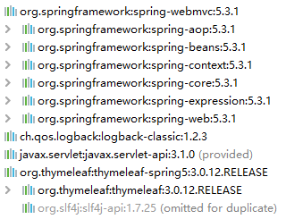

# 

# 一、SpringMVC简介

### 1、什么是MVC

MVC是一种软件架构的思想，将软件按照模型、视图、控制器来划分

M：Model，模型层，指工程中的JavaBean，作用是处理数据

JavaBean分为两类：

- 一类称为实体类Bean：专门存储业务数据的，如 Student、User 等
- 一类称为业务处理 Bean：指 Service 或 Dao 对象，专门用于处理业务逻辑和数据访问。

V：View，视图层，指工程中的html或jsp等页面，作用是与用户进行交互，展示数据

C：Controller，控制层，指工程中的servlet，作用是接收请求和响应浏览器

MVC的工作流程：
用户通过视图层发送请求到服务器，在服务器中请求被Controller接收，Controller调用相应的Model层处理请求，处理完毕将结果返回到Controller，Controller再根据请求处理的结果找到相应的View视图，渲染数据后最终响应给浏览器

### 2、什么是SpringMVC

SpringMVC是Spring的一个后续产品，是Spring的一个子项目

SpringMVC 是 Spring 为表述层开发提供的一整套完备的解决方案。在表述层框架历经 Strust、WebWork、Strust2 等诸多产品的历代更迭之后，目前业界普遍选择了 SpringMVC 作为 Java EE 项目表述层开发的**首选方案**。

> 注：三层架构分为表述层（或表示层）、业务逻辑层、数据访问层，表述层表示前台页面和后台servlet

### 3、SpringMVC的特点

- **Spring 家族原生产品**，与 IOC 容器等基础设施无缝对接
- **基于原生的Servlet**，通过了功能强大的**前端控制器DispatcherServlet**，对请求和响应进行统一处理
- 表述层各细分领域需要解决的问题**全方位覆盖**，提供**全面解决方案**
- **代码清新简洁**，大幅度提升开发效率
- 内部组件化程度高，可插拔式组件**即插即用**，想要什么功能配置相应组件即可
- **性能卓著**，尤其适合现代大型、超大型互联网项目要求

# 二、HelloWorld

### 1、开发环境

IDE：idea 2021.3

构建工具：maven3.6.1

服务器：tomcat8

Spring版本：5.3.1

### 2、创建maven工程

##### a>添加web模块

##### b>打包方式：war

##### c>引入依赖

```xml
<dependencies>
    <!-- SpringMVC -->
    <dependency>
        <groupId>org.springframework</groupId>
        <artifactId>spring-webmvc</artifactId>
        <version>5.3.1</version>
    </dependency>

    <!-- 日志 -->
    <dependency>
        <groupId>ch.qos.logback</groupId>
        <artifactId>logback-classic</artifactId>
        <version>1.2.3</version>
    </dependency>

    <!-- ServletAPI -->
    <dependency>
        <groupId>javax.servlet</groupId>
        <artifactId>javax.servlet-api</artifactId>
        <version>3.1.0</version>
        <scope>provided</scope>
    </dependency>

    <!-- Spring5和Thymeleaf整合包 -->
    <dependency>
        <groupId>org.thymeleaf</groupId>
        <artifactId>thymeleaf-spring5</artifactId>
        <version>3.0.12.RELEASE</version>
    </dependency>
</dependencies>
```

注：由于 Maven 的传递性，我们不必将所有需要的包全部配置依赖，而是配置最顶端的依赖，其他靠传递性导入。



### 3、配置web.xml

注册SpringMVC的前端控制器DispatcherServlet

##### a>默认配置方式 (spring配置文件位置默认，名称默认)

此配置作用下，SpringMVC的配置文件默认位于WEB-INF下，默认名称为web.xml中\<servlet-name>的值-servlet.xml，例如，以下配置所对应SpringMVC的配置文件位于WEB-INF下，文件名为springMVC-servlet.xml

```xml
<!-- 配置SpringMVC的前端控制器，对浏览器发送的请求统一进行处理 -->
<servlet>
    <servlet-name>springMVC</servlet-name>
    <servlet-class>org.springframework.web.servlet.DispatcherServlet</servlet-class>
</servlet>
<servlet-mapping>
    <servlet-name>springMVC</servlet-name>
    <!--
        设置springMVC的核心控制器所能处理的请求的请求路径
        /所匹配的请求可以是/login或.html或.js或.css方式的请求路径
        但是/不能匹配.jsp请求路径的请求
    -->
    <url-pattern>/</url-pattern>
</servlet-mapping>
```

##### b>扩展配置方式

可通过init-param标签设置SpringMVC配置文件的位置和名称，通过load-on-startup标签设置SpringMVC前端控制器DispatcherServlet的初始化时间

```xml
<!-- 配置SpringMVC的前端控制器，对浏览器发送的请求统一进行处理 -->
<servlet>
    <servlet-name>springMVC</servlet-name>
    <servlet-class>org.springframework.web.servlet.DispatcherServlet</servlet-class>
    <!-- 通过初始化参数指定SpringMVC配置文件的位置和名称 -->
    <init-param>
        <!-- contextConfigLocation为固定值 -->
        <param-name>contextConfigLocation</param-name>
        <!-- 使用classpath:表示从类路径查找配置文件，例如maven工程中的src/main/resources -->
        <param-value>classpath:springMVC.xml</param-value>
    </init-param>
    <!-- 
 		作为框架的核心组件，在启动过程中有大量的初始化操作要做
		而这些操作放在第一次请求时才执行会严重影响访问速度
		因此需要通过此标签将启动控制DispatcherServlet的初始化时间提前到服务器启动时
	-->
    <load-on-startup>1</load-on-startup>
</servlet>
<servlet-mapping>
    <servlet-name>springMVC</servlet-name>
    <!--
        设置springMVC的核心控制器所能处理的请求的请求路径
        /所匹配的请求可以是/login或.html或.js或.css方式的请求路径
        但是/不能匹配.jsp请求路径的请求
    -->
    <url-pattern>/</url-pattern>
</servlet-mapping>
```

> 注：
>
> \<url-pattern>标签中使用/和/*的区别：
>
> /所匹配的请求可以是/login或.html或.js或.css方式的请求路径，但是/不能匹配.jsp请求路径的请求
>
> 因此就可以避免在访问jsp页面时，该请求被DispatcherServlet处理，从而找不到相应的页面
>
> /*则能够匹配所有请求，例如在使用过滤器时，若需要对所有请求进行过滤，就需要使用/\*的写法

### 4、创建请求控制器

由于前端控制器对浏览器发送的请求进行了统一的处理，但是具体的请求有不同的处理过程，因此需要创建处理具体请求的类，即请求控制器

请求控制器中每一个处理请求的方法成为控制器方法

因为SpringMVC的控制器由一个POJO（普通的Java类）担任，因此需要通过@Controller注解将其标识为一个控制层组件，交给Spring的IoC容器管理，此时SpringMVC才能够识别控制器的存在

```java
@Controller
public class HelloController {
    
}
```

### 5、创建springMVC的配置文件

```xml
<!-- 自动扫描包 -->
<context:component-scan base-package="com.atguigu.mvc.controller"/>

<!-- 配置Thymeleaf视图解析器 -->
<bean id="viewResolver" class="org.thymeleaf.spring5.view.ThymeleafViewResolver">
    <property name="order" value="1"/>
    <property name="characterEncoding" value="UTF-8"/>
    <property name="templateEngine">
        <bean class="org.thymeleaf.spring5.SpringTemplateEngine">
            <property name="templateResolver">
                <bean class="org.thymeleaf.spring5.templateresolver.SpringResourceTemplateResolver">
    
                    <!-- 视图前缀 -->
                    <property name="prefix" value="/WEB-INF/templates/"/>
    
                    <!-- 视图后缀 -->
                    <property name="suffix" value=".html"/>
                    <property name="templateMode" value="HTML5"/>
                    <property name="characterEncoding" value="UTF-8" />
                </bean>
            </property>
        </bean>
    </property>
</bean>

<!-- 
   处理静态资源，例如html、js、css、jpg
  若只设置该标签，则只能访问静态资源，其他请求则无法访问
  此时必须设置<mvc:annotation-driven/>解决问题
 -->
<mvc:default-servlet-handler/>

<!-- 开启mvc注解驱动 -->
<mvc:annotation-driven>
    <mvc:message-converters>
        <!-- 处理响应中文内容乱码 -->
        <bean class="org.springframework.http.converter.StringHttpMessageConverter">
            <property name="defaultCharset" value="UTF-8" />
            <property name="supportedMediaTypes">
                <list>
                    <value>text/html</value>
                    <value>application/json</value>
                </list>
            </property>
        </bean>
    </mvc:message-converters>
</mvc:annotation-driven>
```

### 6、测试HelloWorld

##### a>实现对首页的访问

在请求控制器中创建处理请求的方法

```java
// @RequestMapping注解：处理请求和控制器方法之间的映射关系
// @RequestMapping注解的value属性可以通过请求地址匹配请求，/表示的当前工程的上下文路径
// localhost:8080/springMVC/
@RequestMapping("/")
public String index() {
    //设置视图名称
    return "index";
}
```

##### b>通过超链接跳转到指定页面

在主页index.html中设置超链接

```html
<!DOCTYPE html>
<!-- thymeleaf名称空间必须添加-->
<html lang="en" xmlns:th="http://www.thymeleaf.org">
<head>
    <meta charset="UTF-8">
    <title>首页</title>
</head>
<body>
    <h1>首页</h1>
    <a th:href="@{/hello}">HelloWorld</a><br/>
</body>
</html>
```

在请求控制器中创建处理请求的方法

```java
@RequestMapping("/hello")
public String HelloWorld() {
    return "target";
}
```

### 7、总结

浏览器发送请求，若请求地址符合前端控制器的url-pattern，该请求就会被前端控制器DispatcherServlet处理。前端控制器会读取SpringMVC的核心配置文件，通过扫描组件找到控制器，将请求地址和控制器中@RequestMapping注解的value属性值进行匹配，若匹配成功，该注解所标识的控制器方法就是处理请求的方法。处理请求的方法需要返回一个字符串类型的视图名称，该视图名称会被视图解析器解析，加上前缀和后缀组成视图的路径，通过Thymeleaf对视图进行渲染，最终转发到视图所对应页面

# 三、@RequestMapping注解

## 1、@RequestMapping注解的功能

从注解名称上我们可以看到，@RequestMapping注解的作用就是将请求和处理请求的控制器方法关联起来，建立映射关系。

SpringMVC 接收到指定的请求，就会来找到在映射关系中对应的控制器方法来处理这个请求。

## 2、@RequestMapping注解的位置

@RequestMapping标识一个==类==：设置映射请求的请求路径的初始信息

@RequestMapping标识一个==方法==：设置映射请求请求路径的具体信息

```java
@Controller
@RequestMapping("/test")
public class RequestMappingController {

	//此时请求映射所映射的请求的请求路径为：/test/testRequestMapping
    @RequestMapping("/testRequestMapping")
    public String testRequestMapping(){
        return "success";
    }

}
```

## 3、@RequestMapping注解的value属性

==***必须添加，如果是数组满足其中任意一个即可***==

==@RequestMapping注解的value属性通过请求的请求地址匹配请求映射==

@RequestMapping注解的value属性是一个字符串类型的数组，表示该请求映射能够匹配多个请求地址所对应的请求

@RequestMapping注解的value属性必须设置，至少通过请求地址匹配请求映射

```html
<a th:href="@{/testRequestMapping}">测试@RequestMapping的value属性-->/testRequestMapping</a><br>
<a th:href="@{/test}">测试@RequestMapping的value属性-->/test</a><br>
```

```java
@RequestMapping(
    	//如果是数组满足其中任意一个即可
        value = {"/testRequestMapping", "/test"}
)
public String testRequestMapping(){
    return "success";
}
```

>==如果不满足value属性：报错代码404==
>
> HTTP状态 404 - 未找到

## 4、@RequestMapping注解的method属性

==***默认get和post请求都接收，如果是数组满足其中任意一个即可***==

==@RequestMapping注解的method属性通过请求的请求方式（get或post）匹配请求映射==

@RequestMapping注解的method属性是一个RequestMethod类型的数组，表示该请求映射能够匹配多种请求方式的请求

若当前请求的请求地址满足请求映射的value属性，但是请求方式不满足method属性，则浏览器报错405：Request method 'POST' not supported

```html
<a th:href="@{/test}">测试@RequestMapping的value属性-->/test</a><br>
<form th:action="@{/test}" method="post">
    <input type="submit">
</form>
```

```java
@RequestMapping(
        value = {"/testRequestMapping", "/test"},
    	//如果是数组满足其中任意一个即可 默认post和get请求都接收
        method = {RequestMethod.GET, RequestMethod.POST}
)
public String testRequestMapping(){
    return "success";
}
```

`每次都写参数比较麻烦，spring对不同请求方式定义了相应的注解： `

+ `处理GET请求，method = "RequestMethod.GET" 对应注解===>@GetMapping(请求路径)`
+ `处理POST请求，method = "RequestMethod.POST" 对应注解===>@PostMapping(请求路径)`
+ `处理PUT请求，method = "RequestMethod.PUT" 对应注解===>@PutMapping(请求路径)`
+ `处理DELETE请求，method = "RequestMethod.DELETE" 对应注解==>@DeleteMapping(请求路径)`

==如果即写了method，又写了注解，注解方式的失效，只有method的生效==

```java
@RequestMapping(value = {"/testRequestMapping","/test"},method = { RequestMethod.POST})  
@GetMapping("/testRequestMapping") //失效 放在RequestMapping也是失效
public String success() {
    return "success";
}
```

***好处：***根据同一个路径的不同请求可以处理不同的业务逻辑（如：查询就是get。更新就是post）

***常用的请求方式为：GET、POST、PUT、DELETE，但是目前浏览器只支持GET和POST请求，如果form标签下提交方式为其他请求则被浏览器默认设为GET请求方式。***

==如果一定要发送PUT或其他请求，则需要通过Spring提供的过虑器HiddenHttpMethodFilter，这个会在restful部分讲到==

> ==如果不满足method属性：报错代码405==
>
> Request method 'POST' not supported

## 5、@RequestMapping注解的params属性

表示请求的参数，根据请求参数来获取请求。

==***如果params属性为数组，表示所有的条件都需要满足才能匹配上***==

```java
/*	请求参数格式如下：
    params = {"username"} 表示请求中必须含有关建字（key）username，对属性值（value）不做要求
    params = {"!username"} 表示请求中不能含有关建字（key）username
    params = {"username=admin"} 表示请求中必须含有关建字（key）username，且属性值（value）必须为admin
    params = {"username!=admin"} 表示请求中必须含有关建字（key）username，且属性值（value）不能为为admin （实际情况是，除了username!=admin的其他所有访问都可以，包括没有username）
   
 */
```

```html
<!-- 小知识 参数拼接两种方式-->
<!-- 方式1：使用? -->
<a th:href="@{/hello/testRequestMapping?username=admin&passwd=123}">get请求</a>
<!-- 方式2：使用()  【thymeleaf有效，别的地方不确定】-->
<a th:href="@{/hello/testRequestMapping(username=admin,passwd=123)}">get请求</a>
```

> ==如果不满足params属性：报错代码400==
>
> Parameter conditions "username, password!=123456" not met for actual request parameters: username={admin}, password={123456}

## 6、@RequestMapping注解的headers属性

根据请求头进行映射匹配

```java
/*	请求头参数格式如下：
    headers = {"header"} 表示请求头中必须含有关建字（key）username，对属性值（value）不做要求
    headers = {"!header"} 表示请求头中不能含有关建字（key）username
    headers = {"username=admin"} 表示请求头中必须含有关建字（key）username，且属性值（value）必须为admin
    headers = {"username!=admin"} 表示请求头中必须含有关建字（key）username，且属性值（value）不能为为admin （实际情况是，除了header!=admin的其他所有访问都可以，包括没有username）
   
 */
```

> ==如果不满足headers属性：报错代码404==
>
> HTTP状态 404 - 未找到

## 7、SpringMVC支持ant风格的路径

==给@RequestMapping的value属性用==

*特殊字符不好使： / 和 ?*

`?：表示任意的单个字符`   

`*：表示任意的0个或多个字符`

`**:表示任意的0层或多层目录` 如 /a\*\*a/ 此时\*，没有特殊含义

> 在使用\*\*时，只能使用  /\*\*/xxx的方式，\*\*只能单独写

## 8、SpringMVC支持路径中的占位符（重点）

`地址参数原始方式：/deleteUser?id=1`

`地址参数restful方式：/deleteUser/1`

`例如：原始方式：userSpringMVCToController?id=1  `

`rest方式：user/springMVC/to/Controller/1`

SpringMVC路径中的占位符常用于restful风格中，当请求路径中将某些数据通过路径的方式传输到服务器中（传参），就可以在相应的@ResquestMapping注解的value属性中通过占位符{xxx}表示传输的数据xxx为你任意取的名字，便于获取，再通过@PathVariable注解，将占位符所表示的数据赋值给控制器方法的形参。

==只有占位符的形参才需要@PathVariable()注解，其他正常参数可以按照名字直接获取==

```java
//{}就表示为占位符 表示这是前端传来的值而不是地址,随便起个名字叫id 【占位符必有值】
//多个参数 必须用/分割
@RequestMapping("/testPath/{id}/{username}")   //路径下写了占位符则前端必须传递，否则无法匹配
//给参数加上注解@PathVariable  自动注入属性
public String testPath(@PathVariable("id") Integer id,@PathVariable("username") String username) {
    System.out.println("id:" + id);
    System.out.println("username:" + username);
    return "success";
}

//注：可以匹配到/testPath/1 但匹配不到/testPath  即占位符不能为空
```

### ==只有占位符的形参才需要@PathVariable()注解，其他正常参数可以按照名字直接获取==

```java
 @RequestMapping(value = "/user/{id}",method = RequestMethod.PUT)
 public ModelAndView updateUser(String username,String password, @PathVariable("id") Integer id) {}
```


# 四、SpringMVC获取请求参数

## 方法1：通过原生ServletAPI获取参数

原理：前端处理器DispatcherServlet调用控制期响应方法时，会根据方法的参数自动注入属性。这其中就包括HttpServletRequest request。【直接使用，不需要加上注解】

```java
@RequestMapping("/testServletAPI")
//前端控制器DispatcherServlet 会根据属性自动输入 HttpServletRequest就在其中
public String testServletAPI(HttpServletRequest request) {
    String username = request.getParameter("username");
    String password = request.getParameter("password");
    System.out.println(username + ":" + password);
    return "sucess";
}
```


## 方法2：通过控制器方法的形参获取请求参数

***注意：该方法要求控制器方法的形参名称要和请求的key值一样，才能被复制 过来！***

```html
<!-- 请求参数的key为 username password -->
<a th:href="@{/testControlMethod(username='admin',password=123456,hobby="sing",hobby="jump",hobby="rap")}">测试控制器方法形参传递方式 获取请求参数</a>
```

```java
@RequestMapping("/testControlMethod")
//控制器方法形参名 必须和  请求参数的key 一样
//如果有重复key值如多选，可以使用string数组接收
public String testControlMethod(String username,String password,String[] hobby) {
    System.out.println(username + ":" + password);
    for (String s : hobby) {
            System.out.print("爱好：" + s);
        }
    return "success.html";
}
```

可以不需要区分请求有无多选，都可以用一个同名形参：

```java
//此时 如果是多选则结果为多个值的 逗号,拼接而成
public String testControlMethod(String hobby) {
    //此时hobby=sing,jump,rap
    return "success.html";
}
```

***问题：如果控制器方法形参和请求参数不一致如何解决？***

@RequestParam注解来建立参数间映射关系

```java
//前端传递key为：user_name  而控制器方法形参为：username
public String testControlMethod(@RequestParam("user_name") String username) {
    //此时hobby=sing,jump,rap
    return "success.html";
}

//本质还是参数同名对应，如果注解里key不同一样是对应不上
```


## ***@RequestParam注解解析***

==@RequestParam注解将请求参数和控制器方法形参建立关系，用于获取请求参数！==

```java
@Target({ElementType.PARAMETER})
@Retention(RetentionPolicy.RUNTIME)
@Documented
public @interface RequestParam {
    @AliasFor("name") //alias 别名 表示value有个别名为name
    String value() default "";

    @AliasFor("value") //alias 别名 表示name有个别名为value
    String name() default "";
	
    //require表示必须，即注解中的value/name值 ，请求中必须要包含否则就会报错 见下面例子：
    //400错误 Required parameter “user_name” is not present
    boolean required() default true; 
	
    //不管required值为true或false，当注解的value所指定的请求参数没有传输或者传输的值为""时，则使用默认值给形参赋值
    String defaultValue() default "\n\t\t\n\t\t\n\ue000\ue001\ue002\n\t\t\t\t\n";
}
```

> defaultValue即如果请求中没有找到对应的value/name(如：user_name) 则为null（当然可以自己定义某个值），还有一种情况有value/name，但是没有对应值（如：user_name=，传递空）此时也会使用默认值

例如（``针对属性：required`）：

请求链为：`（没有@RequestParam("user_name") 修饰的user_name,就算传递username也是会报错的）`

```sh
http://localhost:8080/demo2/testControlMethod?password=123456&hobby=sing&hobby=jump&hobby=rap
```

处理请求的对应控制器方法为：

```java
@RequestMapping("/testControlMethod")
//RequestParam required默认为true 则请求中必须包含key为user_name （当然可以自己改成required=false）
public String testControlMethod(@RequestParam("user_name") String username,String password,String[] hobby) {
    System.out.println(username + ":" + password);
    for (String s : hobby) {
        System.out.print("爱好：" + s);
    }
    return "success.html";
}
```

此时服务器就会报错：==400错误 Required parameter “user_name” is not present （必须的参数user_name不存在）==

`可以用此限制来控制前端传递参数必须包含哪些参数。`


## @RequestHeader解析

和注解@RequestParam完全一样，也是有 `value,name,required,defaultValue`属性。

如果要获取请求头信息，形参必须要加上@RequestHeader注解

==@RequestHeader将请求头信息和控制器方法形参建立联系，用于获取请求头！==

```java
@RequestMapping("/testRequestHeader")
//RequestHeader每次只能回去某一个请求头（如：host，）
public String testRequestHeader(@RequestHeader("host") String host) {
    System.out.println("host:"+ host);
    return "success";
}
```

## @CookieValue解析

和注解@RequestParam完全一样，也是有 `value,name,required,defaultValue`属性。

如果要获取请求cookie信息，形参必须要加上@CookieValue注解

==@CookieValue将请求头信息和控制器方法形参建立联系，用于获取cookie！==

```java
@RequestMapping("/testCookie")
//value参数为cookie的id，即每次只能查找指定key值的的cookie,得到的是指定cookie的value值
public String testCookie(@CookieValue("JSESSIONID") String cookie) {
    System.out.println("cookie = " + cookie);
    return "success";
}
```

## @RequestBody解析

即获取所有请求体，就是请求?后面的全部（请求参数） 。仅POST请求才有


## 方法3：通过POJO获取请求参数（必须有实体Bean）

例如当我们想要注册一个用户时，获取的参数都是User实体Bean中的属性，则此时Spring提供了对应的方法。

***请求的参数名key必须和实体类的属性名完全一致，Spring会自动创建对应Bean和属性注入***

原理就是：IOC

```java
@RequestMapping("/testPojo")
//测试通过POJO传递参数
public String testPojo(User user) {
    //请求参数key 可以比User属性值 少，因为是set方法 参数多少都无所谓
    System.out.println(user);
    return "success";
}

//细节：如果testPojo方法中有多个User对象的形参那么spring都会自动创建即属性注入即属性值都一样
```

## ***乱码***

如果是tomcat控制台：

tomcat控制台（Dos窗口）输出乱码的话，在tomcat的conf目录下的logging.properties文件中修改为windows编码GBK（默认utf-8）

```properties
java.util.logging.ConsoleHandler.level = FINE
java.util.logging.ConsoleHandler.formatter = org.apache.juli.OneLineFormatter
#默认是utf-8改成gbk就好了（因为Windows默认gbk，看操作系统）
java.util.logging.ConsoleHandler.encoding = GBK 
```


### 如果是get请求：

理论上是不会有乱码的，如果有乱码就是tomcat服务器的乱码。可以在tomcat下conf目录下的server.xml中配置  URIEncoding="utf-8"

```xml
<!-- 配置tomcat端口的地方 配置tomcat编码-->
<Connector port="8080" protocol="HTTP/1.1" 
           maxThreads="1000" minSpareThreads="15" maxSpareThreads="50"
           acceptCount="1000"
           connectionTimeout="20000" 
           redirectPort="8443" 
           useBodyEncodingForURI="true"               
           disableUploadTimeout="true" URIEncoding="utf-8" maxPostSize="0"
           />
```

### 如果是post请求：

`细节：因为servlet就是如果你已经获取了请求的参数，那么你再设置request的字符编码是不会生效的。所以如果使用了springMVC框架，无法直接使用request来设置请求编码。因为请求已经或被springMVC中的前端处理器DispatcherServlet接受过参数了，因此如果想要解决乱码问题需要在web.xml中使用Filter过滤器配置编码规则（这是因为服务器启动，加载Filter过滤器信息比Servlet（DispatcherServlet）更早运行。）`

```java
//程序加载顺序
ServletContextListener监听器---> Filter过滤器 ---> Servlet程序

//ServletContextListener监听器 监听ServletContext的创建和销毁，只执行一次 【不适合处理】
//Filter过虑器适合  因为每次都可以允许只要设置了过滤路径
```

***web.xml中注册Spring自带的filter过虑器解决乱码***

```xml
<!--    注册spring过滤器，在DispatcherServlet前 设置字符编码来处理乱码-->
  <filter>
      <filter-name>CharacterEncodingFilter</filter-name>
      <filter-class>org.springframework.web.filter.CharacterEncodingFilter</filter-class>
      
      <!-- 必须设置encoding  否则不生效-->
      <init-param>
        <param-name>encoding</param-name>
        <param-value>utf-8</param-value>
      </init-param>
      
  <!--    源码里设置编码格式 需要设置encoding 和forceResponseEncoding-->
      <init-param><!-- x-->
        <param-name>forceResponseEncoding</param-name>
        <param-value>true</param-value>
      </init-param>
  </filter>

  <filter-mapping>
      <filter-name>CharacterEncodingFilter</filter-name>
      <url-pattern>/*</url-pattern>
  </filter-mapping>
```

# 五、域对象共享数据

## 1、使用ServletAPI向request域对象共享数据

```Java
/**
  * 通过原生的servlet，来设置request域对象属性值
  * @param request 请求
  * @return 成功页面
  */
@RequestMapping("/testRequestByServletAPI")
public String testRequestByServletAPI(HttpServletRequest  request) {
    request.setAttribute("testRequestByScope","hello,servletAPI");

    HttpSession session = request.getSession();
    session.setAttribute("sessionKey","sessionScope");

    ServletContext servletContext = request.getServletContext();
    servletContext.setAttribute("servletContextKey","servletContextScope");
    //这个是请求转发：1、web-info下重定向访问不了 2、地址栏地址没变化
    return "success";
}
```

***thymeleaf使用域对象：***

```html
<body>
    <h1>success</h1> <br/>
<!--    相当于el表达式:
         设置一个 th:text="${key}"属性告诉thymeleaf这是一个域对象

         request域：直接写键key
         session域：写session.key
         servletContext域：写application.key
         -->
    request域：<p th:text="${testRequestByScope}"></p> <br/>
    session域：<p th:text="${session.sessionKey}"></p> <br/>
    servletContext域：<p th:text="${application.servletContextKey}"></p> <br/>
</body>
```

## 2、SpringMVC：使用ModelAndView对象向request域对象共享数据（建议使用）

model：就是指向域对象共享数据

view：试图名称经过视图解析器（thymeleaf）解析，跳转到指定页面的过程

```java
/**
 *两个功能：1、向request域共享数据；2、设置视图名称
 * @return 返回值必须是ModelAndView类型的给前端控制器DispatcherServlet使用（才能解析跳转到指定页面），因为其有两个功能：模型和视图，因此必须返回这个
 */
@RequestMapping("/testModelAndView")
public ModelAndView testModelAndView() {
    ModelAndView view = new ModelAndView();
    //处理模型数据，即向请求域request域共享数据
    view.addObject("testRequestByScope","hello,ModelAndView");

    //设置视图名称，返回给前端处理器解析
    view.setViewName("success");
    return view;
}
```

## 3、SpringMVC：使用Model对象向request域共享数据

【实际运行实现类BindingAwareModelMap】

底层就是： ConcurrentHashMap  线程安全的

```java
/**
 * 使用Model对象向request域共享数据
 * @param model Model类型的形参，就是ModelAndView中的Model，会被SpringMVC自动注入
 * @return 成功页面
 */
@RequestMapping("/testModel")
public String testModel(Model model) { //肯定是传参拿，否则自己创建Model，SpringMVC怎么知道呢？
    model.addAttribute("testRequestByScope","hello,Model");
    return "success";
}
```

## 4、SpringMVC：使用Map集合对象向request域共享数据

就是Map   【实际运行实现类BindingAwareModelMap】

```java
@RequestMapping("/testMap")
public String testMap(Map<String,Object> map) {
    map.put("testRequestByScope","hello,Map");
    return "success";
}
```

## 5、SpringMVC：使用ModelMap对象向request域共享数据

底层：LinkedHashMap   【实际运行实现类BindingAwareModelMap】

```java
@RequestMapping("/testModelMap")
public String testModelMap(ModelMap map) {
   map.addAttribute("testRequestByScope","hello,ModelMap");
   return "success";
}
```

## 6、分析Model，Map和ModelMap之间的关系

`三者的实际运行实现类都是BindingAwareModelMap，BindingAwareModelMap的父类ExtendedModelMap又继承了ModelMap类（继承了LinkedHashMap   ），实现了Model接口`


```java
public interface Model {}
public class ModelMap extends LinkedHashMap<String, Object> {}
public class ExtendedModelMap extends ModelMap implements Model {}
public class BindingAwareModelMap extends ExtendedModelMap {}
//因为SpringMVC传递过来的实际底层就是 BindingAwareModelMap对象,而其又继承了ExtendedModelMap
//所以控制器方法传参可以放：
	//Model：实际运行类父类---实现的接口，当然可以引用（多态）
	//ModelMap：实际运行类父类---继承的类，当然可以引用（多态）
	//Map:实际运行类父亲的父亲ModelMap，实现了LinkedHashMap->Map
```

***总结：***

`建议使用ModelAndView进行request域数据共享，因为最后还是会把Map，Model和ModelMap封装成ModeAndView（servletAPI最终也是封装成ModelAndView）`

## 7、向session域共享数据，建议使用原生的SessionAPI

```java
@RequestMapping("/testSession")
public String testSession(HttpSession session) {
    session.setAttribute("sessionKey","session域");
    return "success";
}
```

## 8、往Application域即ServletContext域共享数据，建议使用原生的SessionAPI

```java
@RequestMapping("testServletContext")
//通过HttpSession获取
public String testServletContext(HttpSession httpSession) {
    ServletContext servletContext = httpSession.getServletContext();
    servletContext.setAttribute("servletContextKey","hello,application");
    return "success";
}
```

# 六、SpringMVC的视图

SpringMVC中的视图就是View接口（就是ModelAndView中的View），视图的作用就是渲染数据，将模型Model中的数据展示给用户。

SpringMVC视图的种类很多，默认有转发视图，重定向视图

+ `转发视图 InternalResourceView`==视图名称以forward:为前缀==
+ `重定向视图 RedirectView`。 ==视图名称以redirect:为前缀==

+ `当工程引入jstl依赖时，转发视图InternalResourceView会自动转化为jstlView`

+ `如果视图的是技术为thymeleaf，在SpringMVC的配置文件中需要配置thymeleaf的视图解析器，由此视图解析器解析之后得到的是thymeleafView` ==视图名称没有任何前缀==

## 1、ThymeleafView

`如果创建的视图没有任何前缀（forward或redirect），则该视图才会被thymeleaf解析，得到ThymeleafView`,最后会通过==转发方式跳转==

```java
@RequestMapping("/testThymeleaf")
public String testThymeleaf() {
    return "success";//没有任何前缀
}
```

> ```java
> //部分源码如下
> //DispatcherServlet中 processDispatchResult解析模型数据
> this.processDispatchResult(processedRequest, response, mappedHandler, mv, (Exception)dispatchException);
> 
> //processDispatchResult方法中又调用render 专门用来解析
> if (mv != null && !mv.wasCleared()) {//wasCleared 表示自己有在SpringMVC配置文件中配置的thymeleaf模版
>     this.render(mv, request, response);
>     ...
> }
> 
> //render方法内部调用resolveViewName 根据SpringMVC配置的thymeleaf模版优先级Order进行数据渲染
> view = this.resolveViewName(viewName, mv.getModelInternal(), locale, request);
> 
> //resolveViewName函数内部就是迭代渲染Model
> protected View resolveViewName(String viewName, @Nullable Map<String, Object> model, Locale locale, HttpServletRequest request) throws Exception {
>     if (this.viewResolvers != null) {
>         Iterator var5 = this.viewResolvers.iterator();//配置文件中所有thymeleaf配置个数
> 
>         while(var5.hasNext()) {//根据优先级Order进行解析
>             ViewResolver viewResolver = (ViewResolver)var5.next();
>             View view = viewResolver.resolveViewName(viewName, locale);
>             if (view != null) {
>                 return view;
>             }
>         }
>     }
> ```

## 2、转发视图InternalResourceView

`如果返回的视图名称以forward:开头，则创建的就是转发视图InternalResourceView。`*`此时的视图名称不会被SpringMVC配置文件中配置的视图解析器解析如thymeleaf，而是thy类将前缀forward:去掉，==剩下部分作为最终路径通过转发的方式实现跳转.其实就是原生ServletAPI中的request.getRequestDispatcher("路径").forward(request,respnose)==`*

```Java
@RequestMapping("/testForward")
public String testForward() {

    // 服务器端其中 / 表示ip:port/工程路径
    //request.getRequestDispatcher("路径").forward(request,response)
    // return "forward:/success";
    return "forward:success"; // 加没加斜杠 / 都一样，都表示ip:port/demo3(工程路径)/success
}
```

==***转发到一个页面，当然也可以转发到一个请求中（即被@RequestMapping注解匹配的）***==

```java
@RequestMapping("/testForward2")
public String testForward2() {
    //此时访问地址栏不变，但还是会把请求转发 ip:port/demo3/testRequestByServletAPI
    return "forward:testRequestByServletAPI";
}


//此方法就会捕获到 上面forward 转发请求
@RequestMapping("/testRequestByServletAPI")
public String testRequestByServletAPI(HttpServletRequest  request) {...}
```

> 源码解析 和上面thymeleaf过程一摸一样
> `1、首先要明确请求转发视图功能底层使用的是缓冲池技术（其目的就是复用，提高运行效率，经常用的请求就放在里面），具体表现为在AbstractCachingViewResolver类下有两个缓冲池viewAccessCache和viewCreationCache`
> `2、viewAccessCache表示可以直接用的请求视图的缓冲池（如果超过限制就会自动去掉最老的请求视图），viewCreationCache表示已经创建的请求视图的缓冲池`
>
> 
>
> `3、所以如果想要找出创建请求视图的地方，只有第一次访问某个请求时（如/testForward）才会进入请求视图的创建流程【可以重启服务器】`
>
> `4、当第一次请求如/testForward被DispatcherServlet接收，就会调用AbstractCachingViewResolver类（其实是ThymeleafViewResolver类，thy类是其子类）下的resolveViewName方法，而resolveViewName调用子类thy类实现的抽象方法this.createView(viewName, locale)来创建请求视图;`
>
> 
>
> `5、真正创建请求视图对象是在thy类中，thy类中会根据请求是否带有前缀关键字来调用相应的创建方法`
>
> + `如前缀redirect 代码：if (viewName.startsWith("redirect:")) {RedirectView view = new RedirectView(...);}`
> + `如前缀forward 代码：else if (viewName.startsWith("forward:")) {return new InternalResourceView(forwardUrl);}`
> + `不含有关键字  代码：else {return this.loadView(viewName, locale);}`
>
> 
>
> 5、总结：不管请求有没有前缀关键字，创建请求视图时thy类总是会被调用的【请求第一次被访问时】

## 3、重定向视图 RedirectView

`如果返回的视图名称以redirect:开头，则创建的就是转发视图RedirectView。`*`此时的视图名称不会被SpringMVC配置文件中配置的视图解析器解析如thymeleaf，而是thy类将前缀redirect:去掉，==剩下部分作为最终路径通过重定向的方式实现跳转.其实就是原生ServletAPI中的request.sendRedirect("路径")==`*

```java
@RequestMapping("/testRedirect2")
public String testRedirect2() {
    //重定向到另一个请求中【当然也可以直接重定向到某个资源】
    return "redirect:/testRequestByServletAPI";
}
```

## 4、视图控制器 view-controller

当控制器方法中，仅仅用来实现页面跳转，即只需要设置视图名称时（直接`retuen index`），就可以在SpringMVC的配置文件（如：SpringConfig.xml）中使用`<mvc:view-controller>`标签代替控制器方法。

```xml
<!-- path对应的就是注解@RequestMapping中的路径     view-name就是return的视图名-->
<mvc:view-controller path="/" view-name="index"></mvc:view-controller>
```

上面的配置文件则等同于：

```java
    @RequestMapping("/")
    public String toIndex() {
        return "index";
    }
```

### ==如果我们在Spring配置文件中使用视图控制器代替某个控制器方法，那么我们写的所有控制器方法的路径都无法跳转（全部失效,除了自己配的这个）==

***解决方法：***

在SpringMVC的配置文件中加上注解驱动即可：

```xml
<!-- 
	需要开启注解驱动的三种情况：
	1：使用view-controller代替控制器方法实现页面跳转，导致其余所有的控制器方法失效
	2：restful中通过servlet开发js与css等静态资源，导致所有的控制器方法失效
	3：将java对象转化为json对象
-->
<mvc:annotation-driven /> <!-- 建议每次写都加上-->
```

## 5、解析JSP请求

因为thymeleaf无法处理jsp请求，所以需要使用servlet自带的解析器InternalResourceViewResolver来解析。

```xml
<!--    针对jsp开启InternalResourceView 视图解析jservlet原生自带的  和和thymeleaf配置完全一样-->
<bean id="InternalResourceView" class="org.springframework.web.servlet.view.InternalResourceViewResolver">
    <!--        配置顺序，优先使用-->
    <property name="order" value="1" />
    <!--        配置前缀-->
    <property name="prefix" value="/WEB-INF/templates/" />

    <!--        配置后缀-->
    <property name="suffix" value=".jsp" />
</bean>
```

# 七、RESTFul

RESTFul：Representational State Transfer即表现层资源状态转移。是一种软件架构的风格。

也就是规定客户端请求资源均访问同一个url路径通过其提交的方式（get，post，put，delete等）来更新资源状态做出相应操作。

## 1、RESTFul的实现

REST风格提倡URL地址使用统一的风格设计，从前到后各个单词使用斜杠/分隔开，不使用问号键值对方式携带请求参数，而是将要发送给服务器的数据作为URL一部分，以保证整体风格的一致性。

GET表示获取资源、POST表示新建资源、PUT表示更新资源、DELETE表示删除资源

## 2、RESTFul案例

```java
//get post请求和之前的一样 （th:action别忘记th）

//put、delete请求如果直接在form标签中改，默认还是get 
/**
	解决方法：
		1、ajax请求（不推荐，非所有浏览器支持） 
		2、SpringMVC提供的filter过滤器HiddenHttpMethodFilter (需要在web.xml中配置)
		
		**/

```


```xml
<!--    配置HiddenHttpMethodFilter过滤器 方便服务器接收put请求-->
    <filter>
        <filter-name>HiddenHttpMethodFilter</filter-name>
        <filter-class>org.springframework.web.filter.HiddenHttpMethodFilter</filter-class>
    </filter>
    <filter-mapping>
        <filter-name>HiddenHttpMethodFilter</filter-name>
        <url-pattern>/*</url-pattern>
    </filter-mapping>
```

> HiddenHttpMethodFilter过滤器关键源码如下：
>
> ```java
> //判断类型的关键字
> private String methodParam = "_method";
> //支持的自定义请求：put DELETE PATCH
> private static final List<String> ALLOWED_METHODS=  Collections.unmodifiableList(Arrays.asList(HttpMethod.PUT.name(), HttpMethod.DELETE.name(), HttpMethod.PATCH.name()));
> 
> protected void doFilterInternal(HttpServletRequest request, HttpServletResponse response, FilterChain filterChain) throws ServletException, IOException {
>     HttpServletRequest requestToUse = request;
>     //请求必须为 post
>     if ("POST".equals(request.getMethod()) && request.getAttribute("javax.servlet.error.exception") == null) {
>         //request请求参数中必须属性：key为_method ，value为PUT
>         String paramValue = request.getParameter(this.methodParam);
>         if (StringUtils.hasLength(paramValue)) {
>             String method = paramValue.toUpperCase(Locale.ENGLISH);
>             //put在ALLOWED_METHODS列表中
>             if (ALLOWED_METHODS.contains(method)) {
>                 requestToUse = new HiddenHttpMethodFilter.HttpMethodRequestWrapper(request, method);
>             }
>         }
>     }
> ```

### ***HiddenHttpMethodFilter使用步骤（put和delete请求一样）：***

+ 1、web.xml中配置此过滤器，并设置拦截所有请求
+ 2、对于想要设置为put请求的页面，如form标签中 将meth改为post，然后在request请求中加入一组属性值:key为_method ,value为put即可
+ 控制器方法接受，设置method = RequestMethod.PUT

```html
<!-- put请求-->
<form th:action="@{/user/112}" method="post"> //必须为post请求
    <input type="hidden" name="_method" value="put"> //传递的参数必须要有：_method 值为put/delete/patch
    用户名：<input type="text" name="username" /> <br/>
    密码：<input type="password" name="password" /> <br/>
    <input type="submit" value="修改用户" />
</form>
   
```

```html
<!-- delete请求 一般是超链接 所以需要绑定一个单击事件，实际跳转的还是form的submit-->
<script type="text/javascript">
    window.onload = function () {
        document.getElementById("delete_Post").onclick = function () {
            document.getElementById("deletePostConfirm").click();
        }
    }
</script>

...

<a href="#" id="delete_Post">删除此用户信息</a>
<form th:action="@{/user/200}" method="post" style="display: none">
    <input type="hidden" name="_method" value="delete">
    <input type="submit" id="deletePostConfirm"/>
</form>
</body>
```

***细节：***

```xml
<!--    如果都是过虑器则，执行的顺序就是web.xml文件中配置的filter顺序来决定的，
    而因为HiddenHttpMethodFilter过滤器中会获取请求参数_method所以，设置编码的过虑器CharacterEncodingFilter必须放在所有的过滤器之前
    这样才能保证每次请求先过来，第一件事就是解决乱码！！！
    -->
```

# 八、RESTFUL案例

## 1、准备工作

和传统的crud一样，实现对员工的增删改查

+ 搭建环境
+ 创建对应实体类

## 2、功能实现

```
| 功能                | URL 地址    | 请求方式 |
| ------------------- | ----------- | -------- |
| 访问首页√           | /           | GET      |
| 查询全部数据√       | /employee   | GET      |
| 删除√               | /employee/2 | DELETE   |
| 跳转到添加数据页面√ | /toAdd      | GET      |
| 执行保存√           | /employee   | POST     |
| 跳转到更新数据页面√ | /employee/2 | GET      |
| 执行更新√           | /employee   | PUT      |
```

## 3、开放静态资源 <mvc:default-servlet-handler />

```xml
<!--    开启视图控制器-->
    <mvc:view-controller path="/" view-name="index" />
<!--    放行静态资源访问，因为前端处理器接收了所有的请求，但是其无法处理静态资源的访问，导致404 所以应该开启默认的servlet程序来处理静态资源
    过程就是：请求路径先被前端处理器DispatcherServlet接收，如果有对应的控制器方法就执行；
    如果没有对应的控制器方法，就去这个默认的servlet处理器中看看有没有匹配的路径，如果有就显示。如果没有还是会报404
    -->
    <mvc:default-servlet-handler />
<!--    开启mvc注解驱动器-->
    <mvc:annotation-driven />
```

# 九、HttpMessageConverter

HttpMessageConverter,报文信息转换器。``将请求的报文转换为Java对象，或将Java对象转换为响应报文。``

`HttpMessageConverter提供了两个注解和两个类型：@RequestBody，@ResponseBody,RequestEntity,ResponseEntity`

## 1、@RequestBody 请求体（?后面的所有）

@RequestBody可以获取请求体，需要在控制器中设置一个形参，使用注解@RequestBody进行标识，当前请求的请求体就会为当前注解标识的形参赋值。（同RequestParamter）

```java
@RequestMapping(value = "/testRequestBody",method = RequestMethod.POST)
public String testRequestBody(@RequestBody String requestBody) {
    //因为这里获取的就是连接的字符串，而地址栏编码为Iso-8859-1 是不支持中文的 所以获得的就是乱码带%的
    //或者在form表单中加入属性enctype=text\plain
    System.out.println(requestBody);
    return "success";
}
```

> 一般用于ajax，传递json数据

## 2、RequestEntity：请求报文实体（将请求报文转化为Java对象）

RequestEntity类封装请求报文的一种类型，需要在控制器方法的形参中设置该类型的形参，当前请求的请求报文就会赋值给该形参，可以通过getHeaders()获取请求头信息，通过getBody()获取请求体信息。

```java
@RequestMapping(value = "/testRequestEntity",method = RequestMethod.POST)
public String testRequestEntity(RequestEntity<String> requestEntity) {
    System.out.println(requestEntity);
    System.out.println(requestEntity.getMethod());
    System.out.println(requestEntity.getType());
    System.out.println(requestEntity.getUrl());
    System.out.println(requestEntity.getBody());
    System.out.println(requestEntity.getHeaders());
    return "success";
}
```

## 3、@ResponseBody

==@ResponseBody用于标识一个控制器方法，可以将该方法的返回值直接作为响应报文的响应体响应到浏览器。==

和public String testResponseBody(HttpservletResponse response)  {}一样，原生的写法 

```java
@RequestMapping("/testResponseBody")
@ResponseBody
public String testResponseBody() {
    //直接返回h1标题 
    return "<h1> testResponseBody 成功！</h1>";
}
```


## 4、SpringMVC：传递JSON数据

```java
//服务器只能接收文本，然而返回的是一个Java对象就会报错
//500 内部服务器错误  HttpMessageNotWritableException
@RequestMapping("/testResponseUser")
@ResponseBody
public User testResponseUser() {
    return new User(1,"张三",22,"男");
}
```

***解决方法：将Java对象转化为JSON数据，传递到浏览器，如果需要可以使用ajax对其进行解析***

加入依赖：

```xml
<dependency>
    <groupId>com.fasterxml.jackson.core</groupId>
    <artifactId>jackson-databind</artifactId>
    <version>2.12.1</version>
</dependency>
```

重启服务即可（`就是上面直接返回User，会自动转化为json数据`）

```java
/*
	Java对象 转化为 json对象 （kv）
	Map集合  转化为 json对象 （kv）
	List集合 转化为 jason数组 （v）
*/

{} 最外面的是{}就是json对象 
//示例：{name: "北京", area: "16000", haidian: {name: "海淀区"}}
[] 最外面的是[]就是json数组
//示例：[["北京市"], ["上海市"], ["合肥市", "芜湖市", "蚌埠市"]]

json字符串就是json对象外面加了一个''即{}'所以json字符串可以和json对象相互转化
```

实现步骤：

+ maven中导入jackson依赖

```xml
<dependency>
    <groupId>com.fasterxml.jackson.core</groupId>
    <artifactId>jackson-databind</artifactId>
    <version>2.12.1</version>
</dependency>
```

+ 在springMVC配置文件中开启注解驱动 

  ```xml
  <!-- 1、解决view_controller路径跳转问题
  	 2、解决静态资源（js，css,png等）无法加载的问题  【如果不行就是maven重新打包】
  	 3、配合@ResponseBody将Java对象直接转成json对象-->
  <mvc:annotation-driven /> 
  ```

+ 在处理器方法上使用@ResponseBody注解

+ 将Java对象直接作为控制器方法的返回值返沪，就会自动返回json格式的字符串（非json对象）

```java
@RequestMapping("/testResponseUser")
@ResponseBody
public User testResponseUser() {
    return new User(1,"张三",22,"男");
}
```

## 5、SpringMVC：处理ajax


## 6、@RestController = @Controller + @ResponseBody

@RestController注解是springMVC提供的一个复合注解，标识在类上，相当于为当前类添加了@Controller注解，并为其中每个方法都加上了@ResponseBody注解


## 7、ResponseEntity

ResponseEntity用于控制器方法的返回值 类型，该控制器方法的返回值就是响应到浏览器的响应报文。（即将Java对象转化为响应报文）

`可用于文件下载，因为要修改响应头，标识该文件用于下载，而非展示。`


# 九、文件上传和下载

## 1、文件下载

使用ResponseEntity实现文件下载：

```java
@RequestMapping("/testFileDown")
public ResponseEntity<byte[]> testFileDown(HttpSession session) throws IOException {
    //获取servletContext对象
    ServletContext servletContext = session.getServletContext();
    //要下载的获取文件在服务器的真实路径
    String realPath = servletContext.getRealPath("/static/img/summer.jpg");
    System.out.println(realPath);
    //创建输入流
    FileInputStream is = new FileInputStream(realPath);
    byte[] bytes = new byte[is.available()];
    is.read(bytes);

    //创建HttpHeader对象，并设置响应头信息
    MultiValueMap<String,String> httpHeaders = new HttpHeaders();
    //设计下载标记
    httpHeaders.add("Content-Disposition","attachment;filename=summer.jpg");

    //设置响应状态码
    HttpStatus statusCode = HttpStatus.OK;
    //创建报文对象 ResponseEntity
    is.close();
    return new ResponseEntity<byte[]>(bytes,httpHeaders,statusCode);
}
```


## 2、文件上传

+ 添加相应的依赖

  ```xml
  <dependency>
      <groupId>commons-fileupload</groupId>
      <artifactId>commons-fileupload</artifactId>
      <version>1.3.1</version>
  </dependency>
  ```

+ spring配置文件中 配置文件上传解析器，将上传的文件封装为MultipartFIle对象(为了将参数的值转化为MultipartFile类型)

  ```xml
  <!-- 必须加上id，是通过id获取 且值必须为：multipartResolver-->
  <bean id="multipartResolver" class="org.springframework.web.multipart.commons.CommonsMultipartResolver" >
  ```

+ 使用MultipartFile对象接收传来的文件参数值

```java
   @RequestMapping("/testFileUp")
    //photo 对应前端照片的name  即获取参数 ,session是为了确定服务器真实存放路径
    public String testFileUp(MultipartFile photo,HttpSession session) throws IOException {
        ServletContext servletContext = session.getServletContext();
        //获取文件在服务器上要保存的目录  的绝对路径
        String realPath = servletContext.getRealPath("photo");
        //获取文件名
        String originalFilename = photo.getOriginalFilename();
        //包含 .
        String fileSuffix = originalFilename.substring(originalFilename.lastIndexOf('.'));
        File directory = new File(realPath + File.separator);
        if (!directory.exists()) {
            boolean mkdirs = directory.mkdirs();
            System.out.println(mkdirs?directory+ "创建成功":directory + "创建失败");
        }
        //UUID解决文件重名的问题
        photo.transferTo(new File(realPath + File.separator + UUID.randomUUID().toString() +fileSuffix));
        //表单元素的name属性值 即参数key
        System.out.println(photo.getName());
        //完整的文件名
        System.out.println(photo.getOriginalFilename());
        return "success";
    }
```


# 十、拦截器

## 1、拦截器的配置

SpringMVC的拦截器用于拦截控制器方法的执行（`注意是控制器方法`）

> Listener监听器 ==》 Filter过滤器 ==》DispatcherServlet前端处理器 ==》控制器方法

SpringMVC中的拦截器要实现HandlerInterceptor接口或者继承HandlerInterceptorAdapter类

SpringMVC的拦截器必须在SpringMVC的配置文件中进行配置。

Spring拦截器只对DispatcherServlet所处理的请求进行拦截

## 2、拦截器的种类

均是在DispatcherServlet前端处理器中执行：

+ preHandle() 控制器方法执行器前拦截  （顺序：1）  ==返回false表示拦截，返回true表示放行==

  ```java
  //DispatcherServlet中的执行代码
  if (!mappedHandler.applyPreHandle(processedRequest, response)) {
      return;
  }
  ```

+ postHandle() 控制器方法执行后拦截  （顺序：2）

  ```java
  //DispatcherServlet中的执行代码
  mappedHandler.applyPostHandle(processedRequest, response, mv);
  ```

+ afterComplation() 在渲染完视图后执行  （顺序：3）

  ```java
  //DispatcherServlet中的执行代码
  if (mappedHandler != null) {
  	mappedHandler.triggerAfterCompletion(request, response, (Exception)null);
  }
  ```

## 3、使用拦截器

+ 创建一个类，实现接口HandlerInterceptor(或继承类InterceptorAdapter)

+ 重新接口的三个default类型方法 ==拦截或放行由preHandle的返回值决定。返回false表示拦截，返回true表示放行==

  ```java
  //控制器方法执行前执行
  @Override
  public boolean preHandle(HttpServletRequest request, HttpServletResponse response, Object handler) throws Exception {
      System.out.println("1.这里是控制器方法前置拦截器 preHandle！！");
      //返回false表示拦截，返回true表示放行
      return HandlerInterceptor.super.preHandle(request, response, handler);
  }
  
  //控制器方法执行后执行
  @Override
  public void postHandle(HttpServletRequest request, HttpServletResponse response, Object handler, ModelAndView modelAndView) throws Exception {
      System.out.println("2.这里是控制器方法后置拦截器 postHandle！！");
      HandlerInterceptor.super.postHandle(request, response, handler, modelAndView);
  }
  
  //控制器方法后，渲染视图后执行（ModelAndView）
  @Override
  public void afterCompletion(HttpServletRequest request, HttpServletResponse response, Object handler, Exception ex) throws Exception {
      System.out.println("3.这里是渲染视图后的拦截器 afterCompletion！！");
      HandlerInterceptor.super.afterCompletion(request, response, handler, ex);
  }
  ```

+ 在springMVC配置文件中配置拦截器

  ```xml
  <!--    配置拦截器-->
      <!--  方法1：此时配置的拦截器，所有的请求都会被其接收处理（拦截/放行） 包括不存在的请求地址  -->
      <mvc:interceptors>
          <bean id="myInterceptor" class="com.ly.mvc.interceptor.MyInterceptor" ></bean>
      </mvc:interceptors>
  
  
      <!--  方法2：此时配置的拦截器，所有的请求都会被其接收处理（拦截/放行） 包括不存在的请求地址 【bean可以用xml 也可以用注解@component】 -->
      <mvc:interceptors>
          <ref bean="myInterceptor"></bean>  <!--该类上有注解@component-->
      </mvc:interceptors>
  
  
  
      <!--  方法3：此时配置的拦截器，对指定路径进行拦截  -->
      <mvc:interceptors>
          <mvc:interceptor>
              <!--    可配置多个拦截路径 多个放行路径   -->
              <mvc:mapping path="/*"/>  <!-- 仅拦截一层目录所有   多层目录/hah/test/../就匹配不到了   /**可以拦截所有请求-->
              <mvc:mapping path="/hah" /> <!-- 拦截/hah-->
              <mvc:exclude-mapping path="/"/>  <!-- 不拦截 /-->
              <mvc:exclude-mapping path="/testInterceptor"/>  <!-- 不拦截 /testInterceptor-->
  <!--            <bean class="com.ly.mvc.interceptor.MyInterceptor"></bean>-->
              <ref bean="myInterceptor"/> <!--该类上有注解@component-->
          </mvc:interceptor>
      </mvc:interceptors>
  ```

## 4、多个拦截器的执行顺序

DispatcherServlet中拦截器的底层原理

> 1.为什么我们自己的afterCompletion方法没执行呢？这是因为applyPreHandle的执行顺序就是遍历执行所有的拦截器的前置方法preHandle，直到有一个返回的是false即拦截
>
> 
>
> 2.这个时候SpringMVC就会执行，当前这个interceptor前面所有的拦截器的afterCompletion 不包括当前这个拦截器，所以不会执行我们自己的afterCompletion方法
>
> 
>
> 3.这是因为执行afterCompletion方法的对象是根据j =this.interceptorIndex开始，j >= 0结束。而interceptorIndex在前面取出每个拦截器时取值为i++ （不是++i）
>
> 5.总结：当遇到有一个是拦截（false）的拦截器时，就执行这个拦截器列表中序号在其前所有的拦截器的afterCompletion方法（不包括他自身），==而这个列表中拦截器的顺序就是你在Spring配置文件中配置bean的顺序==。
>
> ```xml
> <!--  方法1：此时配置的拦截器，所有的请求都会被其接收处理（拦截/放行） 包括不存在的请求地址  -->
> <mvc:interceptors>
>     <!-- return true-->
>     <bean id="myInterceptor1" class="com.ly.mvc.interceptor.MyInterceptor1" ></bean>
>     <!-- return false-->
>     <bean id="myInterceptor" class="com.ly.mvc.interceptor.MyInterceptor" ></bean>
>     <!-- return true-->
>     <bean id="myInterceptor2" class="com.ly.mvc.interceptor.MyInterceptor2" ></bean>
> </mvc:interceptors>
> 
> 
> /*
> 	拦截执行结果：
> 	MyInterceptor1.preHandler();
> 	MyInterceptor.preHandler();
> 	MyInterceptor1.afterCompletion();
> 
> */
> 
> 
> <mvc:interceptors>
>     <!-- return true-->
>     <bean id="myInterceptor1" class="com.ly.mvc.interceptor.MyInterceptor1" ></bean>
>     <!-- return true-->
>     <bean id="myInterceptor" class="com.ly.mvc.interceptor.MyInterceptor" ></bean>
>     <!-- return true-->
>     <bean id="myInterceptor2" class="com.ly.mvc.interceptor.MyInterceptor2" ></bean>
> </mvc:interceptors>
> 
> 
> /*
> 	放行执行结果： （源码 DispatcherServlet.java中 doDispatch() 方法
> 	//对应源码的顺序  mappedHandler.applyPreHandle(processedRequest, response)
> 	MyInterceptor1.preHandler();
> 	MyInterceptor.preHandler();
> 	MyInterceptor2.preHandler();
> 	//对应源码的顺序   mappedHandler.applyPostHandle(processedRequest, response, mv);
> 	MyInterceptor2.postHandler();
> 	MyInterceptor.postHandler();
> 	MyInterceptor1.postHandler();
> 	// 对源码的顺序 processDispatchResult()中执行
> 	MyInterceptor2.afterCompletion();
> 	MyInterceptor.afterCompletion();
> 	MyInterceptor1.afterCompletion();
> 
> */
> ```


# 十一、异常处理器

SpringMVC提供了一个处理 *所有控制器方法* 执行过程中所出现的异常 的接口：HandlerExceptionResolver

HandlerExceptionResolver接口的实现类有：

+ DefaultHandlerExceptionResolver（`SpringMVC默认使用的异常处理器，默认就使用了`）
+ SimpleMappingExceptionResolver（`让我们自定义异常的处理,即如果控制器方法运行出现异常，跳转到对应异常的视图页面`）

## 1、基于xml配置文件的异常处理实现

```xml
<!--配置自定义异常处理-->
<bean id="simpleMappingE ”“xceptionResolver" class="org.springframework.web.servlet.handler.SimpleMappingExceptionResolver" >
    <property name="exceptionMappings" >
        <!--   设置properties属性 -->
        <props>
            <!-- key表示异常全类名   双标签中写入 要跳转的视图名(thymeleaf中配置了视图的前缀 和后缀 所以这里直接写视图名即可 【如果设置了前缀forward或redirect就是额外两个解析器了】)  -->
            <prop key="java.lang.ArithmeticException">error</prop>
            <prop key="java.lang.NullPointerException">error</prop>
        </props>
    </property>

    <!-- 设置出现对应异常时 需要渲染的数据（Model） 默认存在request域中 value就是键key（不设置的话默认就是value=exception）  值value 就是当前的异常信息
        仅对上面配置的要跳转异常(ArithmeticException,NullPointerException)都有效 -->
    <property name="exceptionAttribute" value="ex">

    </property>
</bean>
```


## 2、基于注解的异常处理实现

使用注解`@ControllerAdvice`将当前控制器类当作异常处理组件，使用注解`@ExceptionHandler`标识当前控制器方法要处理的异常类型 【`均是根据异常分类来跳转的`】


# 十二、通过注解来实现SpringMVC

使用配置类和注解代替web.xml和SpringMVC配置文件的功能

## 1、创建初始化类，代替web.xml

在Servlet3.0环境中，容器会在 *类路径中* 查找查找实现了`javax.servlet.ServletContainerInitializer`接口的类，如果找到的话就用它来配置Servlet容器。

Spring提供了这个接口的实现，名为：`SpringServletContainerInitializer`，这个类反过来又会查找实现`WebApplicationInitializer`的类，并将配置的任务交给他们来完成。Spring3.2引入了一个便利的`WebApplicationInitializer`基础实现，名为	`AbstractAnnotationConfigDispatcherServletInitializer`，当我们的类扩展了`AbstractAnnotationConfigDispatcherServletInitializer`这个接口并将其部署到servlet3.0的容器中时，容器会自动发现它，并用它来配置Servlet上下文

```java
package com.ly.mvc.config;

import com.ly.mvc.filter.MyFilter;
import org.springframework.beans.factory.annotation.Autowired;
import org.springframework.web.context.WebApplicationContext;
import org.springframework.web.filter.CharacterEncodingFilter;
import org.springframework.web.filter.HiddenHttpMethodFilter;
import org.springframework.web.servlet.DispatcherServlet;
import org.springframework.web.servlet.FrameworkServlet;
import org.springframework.web.servlet.support.AbstractAnnotationConfigDispatcherServletInitializer;

import javax.servlet.*;
import javax.servlet.annotation.WebFilter;

/**
 * @FileName:WebInit.class
 * @Author:ly
 * @Date:2022/6/2
 * @Description: 配置类 代替web.xml
 */
public class WebInit extends AbstractAnnotationConfigDispatcherServletInitializer {

    /**
     *指定Spring配置类
     * @return 返回spring配置类的class
     */
    @Override
    protected Class<?>[] getRootConfigClasses() {

        //返回spring配置类的class  没有配置类返回Class[0] 长度为0的数组
        return new Class[]{SpringConfig.class};
    }

    /**
     * 指定SpringMVC的配置类   代替SpringMVC的配置文件
     * @return 返回SpringMVC配置类的class
     */
    @Override
    protected Class<?>[] getServletConfigClasses() {
        //返回springMVC配置类的class  没有配置类返回Class[0] 长度为0的数组
        return new Class[]{WebConfig.class};
    }

    /**
     * 指定DispatcherServlet的映射路径 (和web.xml一样处理所有请求)
     * @return 返回映射路径
     */
    @Override
    protected String[] getServletMappings() {
        //return new String[0] 一个servlet可以有多个url-pattern 所以是数组
        return new String[]{"/"}; //接收所有请求 除jsp外
    }


    /**
     * 设置servlet的过虑器 [默认对所有路径有效]
     * @return 返回所有过滤器的数组
     */
    @Override
    protected Filter[] getServletFilters() {
        //两个过虑器 1.HiddenHttpMethodFilter  2.CharacterEncodingFilter
        //设置请求和响应编码
        CharacterEncodingFilter encodingFilter = new CharacterEncodingFilter("utf-8",true);

        System.out.println("*************接收到servlet两个过虑器************");
        //接收put ，delete，patch请求
        HiddenHttpMethodFilter httpMethodFilter = new HiddenHttpMethodFilter();


        return new Filter[]{encodingFilter,httpMethodFilter,new MyFilter()};

        //???疑问为什么没配置过虑器的路径url-pattern  【默认对所有路径有效】

    }

}
```


## 2、创建Spring配置类

```java
package com.ly.mvc.config;

import org.springframework.context.annotation.ComponentScan;
import org.springframework.context.annotation.Configuration;

/**
 * @FileName:SpringConfig.class
 * @Author:ly
 * @Date:2022/6/2
 * @Description: Spring的配置类
 */

@Configuration
public class SpringConfig {
    //Spring配置文件 那些自己写的control service repository等
    //没合并到SpringMVC中就不写了
}
```


## 3、创建SpringMVC配置类

```java
package com.ly.mvc.config;

import org.springframework.context.annotation.Bean;
import org.springframework.context.annotation.ComponentScan;
import org.springframework.context.annotation.Configuration;
import org.springframework.http.HttpStatus;
import org.springframework.web.context.ContextLoader;
import org.springframework.web.context.WebApplicationContext;
import org.springframework.web.multipart.MultipartResolver;
import org.springframework.web.multipart.commons.CommonsMultipartResolver;
import org.springframework.web.servlet.HandlerExceptionResolver;
import org.springframework.web.servlet.HandlerInterceptor;
import org.springframework.web.servlet.ModelAndView;
import org.springframework.web.servlet.ViewResolver;
import org.springframework.web.servlet.config.annotation.*;
import org.springframework.web.servlet.handler.SimpleMappingExceptionResolver;
import org.springframework.web.servlet.mvc.ParameterizableViewController;
import org.springframework.web.servlet.mvc.method.annotation.RequestMappingHandlerAdapter;
import org.springframework.web.servlet.resource.DefaultServletHttpRequestHandler;
import org.thymeleaf.spring5.SpringTemplateEngine;
import org.thymeleaf.spring5.templateresolver.SpringResourceTemplateResolver;
import org.thymeleaf.spring5.view.ThymeleafViewResolver;
import org.thymeleaf.templatemode.TemplateMode;
import org.thymeleaf.templateresolver.ITemplateResolver;
import org.thymeleaf.templateresolver.ServletContextTemplateResolver;

import javax.servlet.http.HttpServletRequest;
import javax.servlet.http.HttpServletResponse;
import java.util.List;
import java.util.Properties;

/**
 * @FileName:WebConfig.class
 * @Author:ly
 * @Date:2022/6/2
 * @Description: SpringMVC的配置类 代替springMVC的配置文件
 */
/*
     1.开启注解扫描   2.配置Thymeleaf模板解析   3.开启视图控制器view-controller  4.开启注解驱动器annotation-driver
     5.开启默认servlet处理器 default-servlet-handler   6.开启文件上传解析器   7.开启拦截器    8.异常处理
 */
@Configuration
//1.开启注解扫描
@ComponentScan(basePackages = {"com.ly.mvc"})
//4.开启注解驱动器annotation-driver
@EnableWebMvc
public class WebConfig implements WebMvcConfigurer {
    //代替SpringMVC的配置文件

    //1.开启注解扫描


    //2.配置Thymeleaf模板解析  【***自己写的SpringIOC容器不知道啊，所以不饿能用***】
    /*

        ThymeleafViewResolver viewResolver = new ThymeleafViewResolver();
        viewResolver.setOrder(1);
        viewResolver.setCharacterEncoding("utf-8");
        //配置模板解析引擎
        SpringTemplateEngine engine = new SpringTemplateEngine();
        //配置模板引擎解析器
        SpringResourceTemplateResolver templateResolver = new SpringResourceTemplateResolver();
        templateResolver.setPrefix("/WEB-INF/templates/");
        templateResolver.setSuffix(".html");
        templateResolver.setTemplateMode("HTML5");
        templateResolver.setCharacterEncoding("utf-8");

        engine.setTemplateResolver(templateResolver);
        viewResolver.setTemplateEngine(engine);

     */


    //3.开启视图控制器view-controller

    @Override
    public void addViewControllers(ViewControllerRegistry registry) {
        registry.addViewController("/toUpload").setViewName("file-upload");
    }


    //4.开启注解驱动器 annotation-driver


    //5.开启默认servlet处理器 default-servlet-handler
    //需要实现一个接口  WebMvcConfigurer
    @Override
    public void configureDefaultServletHandling(DefaultServletHandlerConfigurer configurer) {
        //表示启动default-servlet  访问静态资源
        configurer.enable();
    }


    //6.开启文件上传解析器  函数名称必须为multipartResolver  就和xml中id必有且为multipartResolver 一样
    @Bean
    public CommonsMultipartResolver multipartResolver() {
        return new CommonsMultipartResolver();
    }

    //7.开启拦截器
    @Override
    public void addInterceptors(InterceptorRegistry registry) {
        //通过匿名内部类传入 拦截器 【或者直接写一个拦截器】
        registry.addInterceptor(new HandlerInterceptor() {
            @Override
            public boolean preHandle(HttpServletRequest request, HttpServletResponse response, Object handler) throws Exception {
                System.out.println("基于 注解的拦截器！！！");
                return true;
            }

            @Override
            public void postHandle(HttpServletRequest request, HttpServletResponse response, Object handler, ModelAndView modelAndView) throws Exception {

            }

            @Override
            public void afterCompletion(HttpServletRequest request, HttpServletResponse response, Object handler, Exception ex) throws Exception {

            }
        }).addPathPatterns("/**"); //拦截所有
    }


    //8.异常处理  既可以用接口的的实现方法configureHandlerExceptionResolvers   也可以直接通过@Bean来创建
    @Override
    public void configureHandlerExceptionResolvers(List<HandlerExceptionResolver> resolvers) {
        Properties properties = new Properties();
        properties.setProperty("java.lang.ClassCastException","error");

        SimpleMappingExceptionResolver exceptionResolver = new SimpleMappingExceptionResolver();
        //exceptionResolver.addStatusCode("error",200);

        //键key 为异常的全类名，值value为出现这个异常要跳转的页面
        exceptionResolver.setExceptionMappings(properties);
        //设置前段获取异常的关键字key  默认为exception
        exceptionResolver.setExceptionAttribute("ex");

        //默认的异常跳转页面 即 发生没有指定的异常时 跳转到error1
        exceptionResolver.setDefaultStatusCode(200);
        exceptionResolver.setDefaultErrorView("error1");
        exceptionResolver.setExcludedExceptions(NullPointerException.class,ArithmeticException.class);

        resolvers.add(exceptionResolver);
    }

    //2.配置Thymeleaf模板解析
    //配置生成模板解析器
    @Bean
    public static ITemplateResolver templateResolver() {
        //对应spring5的ApplicationContext===》针对java工程  ，下面是针对web工程的
        WebApplicationContext webApplicationContext = ContextLoader.getCurrentWebApplicationContext();
        // ServletContextTemplateResolver需要一个ServletContext作为构造参数，可通过WebApplicationContext 的方法获得
        ServletContextTemplateResolver templateResolver = new ServletContextTemplateResolver(
                webApplicationContext.getServletContext());
        templateResolver.setPrefix("/WEB-INF/templates/");
        templateResolver.setSuffix(".html");
        templateResolver.setCharacterEncoding("UTF-8");
        templateResolver.setTemplateMode(TemplateMode.HTML);
        return templateResolver;
    }

    //生成模板引擎并为模板引擎注入模板解析器  参数根据类型由IOC容器自动装配@Autowire
    @Bean
    public static SpringTemplateEngine templateEngine(ITemplateResolver templateResolver) {
        SpringTemplateEngine templateEngine = new SpringTemplateEngine();
        templateEngine.setTemplateResolver(templateResolver);
        return templateEngine;
    }

    //生成视图解析器并未解析器注入模板引擎  参数根据类型由IOC容器自动装配@Autowire
    @Bean
    public static ViewResolver viewResolver(SpringTemplateEngine templateEngine) {
        ThymeleafViewResolver viewResolver = new ThymeleafViewResolver();
        viewResolver.setCharacterEncoding("UTF-8");
        viewResolver.setOrder(1);
        viewResolver.setTemplateEngine(templateEngine);
        return viewResolver;
    }

}
```


# 十三、SpringMVC执行流程

## 1、SpringMVC常用组件

+ `DispatcherServlet`：**前段控制器**，由框架提供

  > 作用：*统一处理请求和响应，整个流程控制的中心，由它调用其他组件处理用户请求。*

+ `HandlerMapping`：**处理器映射器，即根据地址查找控制器方法**，由框架提供

  > 作用：*根据请求的URL，method等信息查找Handler，即控制器方法*

+ `Handler`：**处理器，即控制器方法**，需要自己开发

  > 作用：*在DispatcherServlet的控制下Handler对具体的用户请求进行处理*

+ `HandlerAdapter`：**处理器适配器**，由框架提供

  > 作用：*通过HandlerAdapter对处理器（控制器方法）进行执行*

+ `ViewResolver`：**视图解析器**，由框架提供

  > 作用：*进行视图解析，得到相应的视图，例如：Thymeleaf，InternalResourceView，RedirectView*

+ `View`：**视图**，由框架或视图技术提供

  > 作用：*将模型数据通过页面展示给用户*

## 2、DispatcherServlet初始化过程

​	DispatcherServlet本质上是一个servlet，所以天然的遵循Servlet的生命周期。所以宏观上是Servlet生命周期进行调度。

分析子类调用方法，从父类开始向下找，重写的方法，可能会变化如：`init(...) ==> init() ==> initinitServletBean() `


### a>初始化WebApplicationContext

所在类：org.springframework.web.servlet.FrameworkServlet

```java
protected WebApplicationContext initWebApplicationContext() {
    WebApplicationContext rootContext =
        WebApplicationContextUtils.getWebApplicationContext(getServletContext());
    WebApplicationContext wac = null;

    if (this.webApplicationContext != null) {
        // A context instance was injected at construction time -> use it
        wac = this.webApplicationContext;
        if (wac instanceof ConfigurableWebApplicationContext) {
            ConfigurableWebApplicationContext cwac = (ConfigurableWebApplicationContext) wac;
            if (!cwac.isActive()) {
                // The context has not yet been refreshed -> provide services such as
                // setting the parent context, setting the application context id, etc
                if (cwac.getParent() == null) {
                    // The context instance was injected without an explicit parent -> set
                    // the root application context (if any; may be null) as the parent
                    cwac.setParent(rootContext);
                }
                configureAndRefreshWebApplicationContext(cwac);
            }
        }
    }
    if (wac == null) {
        // No context instance was injected at construction time -> see if one
        // has been registered in the servlet context. If one exists, it is assumed
        // that the parent context (if any) has already been set and that the
        // user has performed any initialization such as setting the context id
        wac = findWebApplicationContext();
    }
    if (wac == null) {
        // No context instance is defined for this servlet -> create a local one
        // 创建WebApplicationContext
        wac = createWebApplicationContext(rootContext);
    }

    if (!this.refreshEventReceived) {
        // Either the context is not a ConfigurableApplicationContext with refresh
        // support or the context injected at construction time had already been
        // refreshed -> trigger initial onRefresh manually here.
        synchronized (this.onRefreshMonitor) {
            // 刷新WebApplicationContext
            onRefresh(wac);
        }
    }

    if (this.publishContext) {
        // Publish the context as a servlet context attribute.
        // 将IOC容器在应用域共享
        String attrName = getServletContextAttributeName();
        getServletContext().setAttribute(attrName, wac);
    }

    return wac;
}
```

### b>创建WebApplicationContext

所在类：org.springframework.web.servlet.FrameworkServlet

```java
protected WebApplicationContext createWebApplicationContext(@Nullable ApplicationContext parent) {
    Class<?> contextClass = getContextClass();
    if (!ConfigurableWebApplicationContext.class.isAssignableFrom(contextClass)) {
        throw new ApplicationContextException(
            "Fatal initialization error in servlet with name '" + getServletName() +
            "': custom WebApplicationContext class [" + contextClass.getName() +
            "] is not of type ConfigurableWebApplicationContext");
    }
    // 通过反射创建 IOC 容器对象
    ConfigurableWebApplicationContext wac =
        (ConfigurableWebApplicationContext) BeanUtils.instantiateClass(contextClass);

    wac.setEnvironment(getEnvironment());
    // 设置父容器 即将SpringMVC整合到Spring中，各管 
    wac.setParent(parent);
    String configLocation = getContextConfigLocation();
    if (configLocation != null) {
        wac.setConfigLocation(configLocation);
    }
    configureAndRefreshWebApplicationContext(wac);

    return wac;
}
```

### c>DispatcherServlet初始化策略

FrameworkServlet创建WebApplicationContext后，刷新容器，调用onRefresh(wac)，此方法在DispatcherServlet中进行了重写，调用了initStrategies(context)方法，初始化策略，即初始化DispatcherServlet的各个组件

所在类：org.springframework.web.servlet.DispatcherServlet

```java
protected void initStrategies(ApplicationContext context) {
   initMultipartResolver(context);
   initLocaleResolver(context);
   initThemeResolver(context);
   initHandlerMappings(context);
   initHandlerAdapters(context);
   initHandlerExceptionResolvers(context);
   initRequestToViewNameTranslator(context);
   initViewResolvers(context);
   initFlashMapManager(context);
}
```

### 


