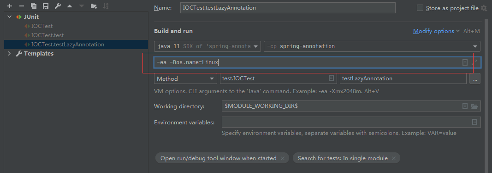
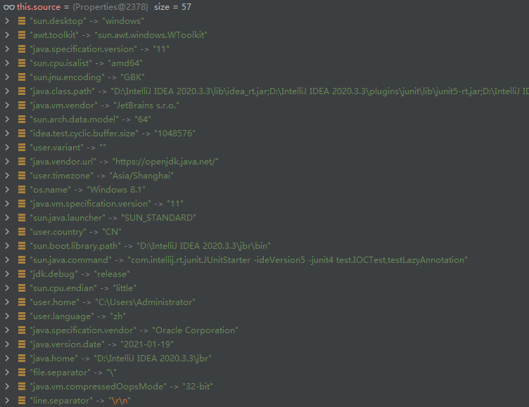
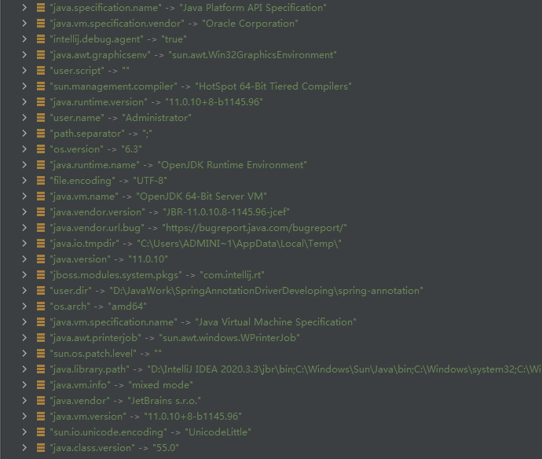
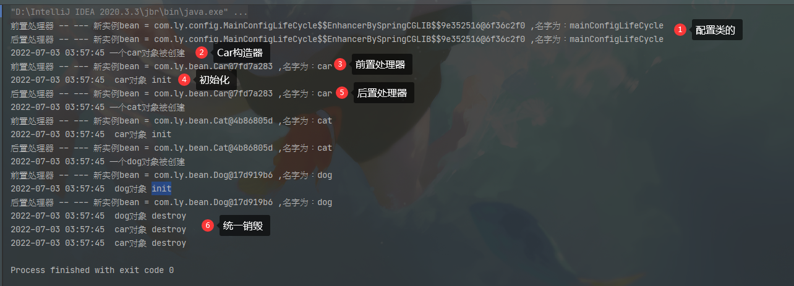
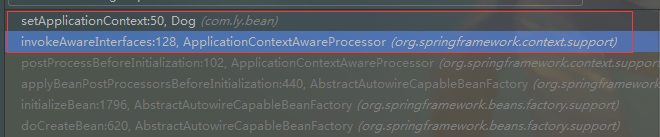
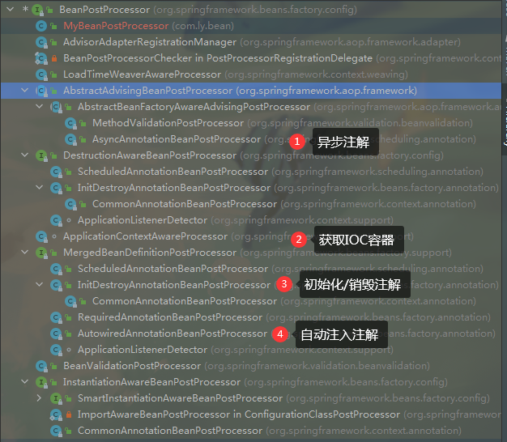
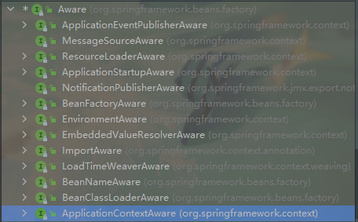
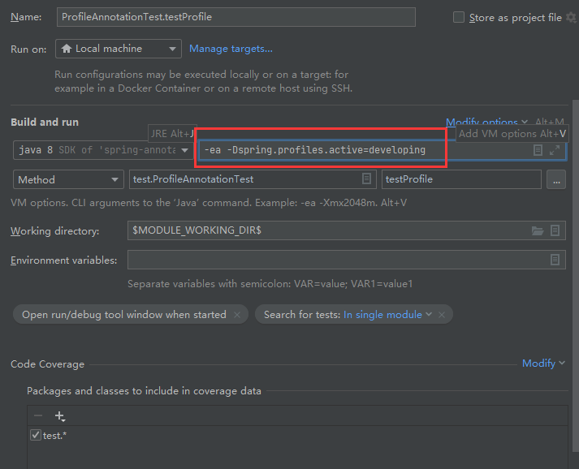
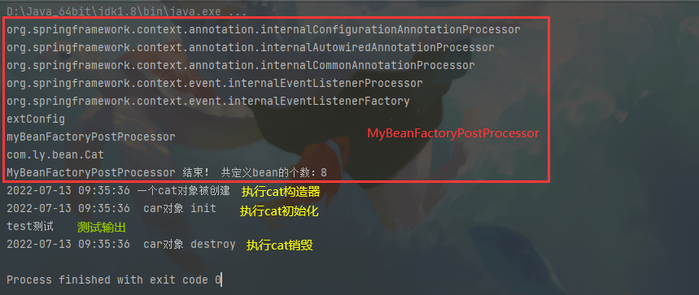

# 一：IOC容器的组件注册

## 1、@ComponentScan 注解

```java
package com.ly.config;

import com.ly.bean.Person;
import org.springframework.context.annotation.*;
import org.springframework.stereotype.Controller;
import org.springframework.stereotype.Service;

import java.lang.annotation.Annotation;

/**
 * FileName:MainConfiguration.class
 * Author:ly
 * Date:2022/7/1
 * Description: 配置类代替xml配置文件
 */

//@SuppressWarnings("{all}")
/**
 * 注解 @ComponentScan
 *       |- value  String[] 要扫描的包路径
 *       |- basePackages String[] 要扫描的包路径
 *       |- basePackageClasses class<?>[] 要扫描的类的class类型
 *       |- nameGenerator Class<? extends BeanNameGenerator>
 *       |- scopeResolver Class<? extends ScopeMetadataResolver>
 *       |- scopedProxy ScopedProxyMode
 *       |- resourcePattern String 要扫描的类的class类型
 *       |- useDefaultFilters true 使用默认的过滤器
 *       |- includeFilters Filter[] 包含过滤器，只扫描（只包含）
 *       |- excludeFilters Filter[] 排除过滤器，不扫描（不包含）
 *       |- lazyInit false 不开启懒加载初始化
 *
 *  注：ComponentScan.Filter为注解@ComponentScan下的子注解@Filter
 *
 *
 *  注解 @ComponentScan.Filter
 *       |- type  FilterType 过滤规则【注解排除，类排除。正则表达式排除等等】默认是注解排除
 *       |- value Class<?>[] 过滤规则class 【注解排除的class，类排除的class。正则表达式排除等等】
 *       |- classes Class<?>[] 过滤规则class 【注解排除的class，类排除的class。正则表达式排除等等】
 *       |- pattern String[] 正则表达式
 */

@ComponentScan(basePackages = {"com.ly"},excludeFilters = {
        @ComponentScan.Filter({Controller.class})  //不扫描@Controller注解
},
        useDefaultFilters = false,//只包含扫描，必须关闭默认扫描才会生效
        includeFilters = {
        @ComponentScan.Filter({Service.class}) //只扫描@Service注解
})
@Configuration //告诉Spring这是一个配置类，及配置文件
public class MainConfiguration {

    @Bean("ls")
    public Person getPerson() {
        return new Person("李四",18);
    }
}
```

## @ComponentScan.Filter 

该注解是 `@ComponentScan` 注解内的 子注解，用于配置包扫描过滤。（只包含，不包含等）

> 也可以理解为注解类下的子注解类

```java
@Retention(RetentionPolicy.RUNTIME)
@Target({})
public @interface Filter {
    FilterType type() default FilterType.ANNOTATION;

    @AliasFor("classes")
    Class<?>[] value() default {};

    @AliasFor("value")
    Class<?>[] classes() default {};

    String[] pattern() default {};
}
```

***用法：***

```java
package com.ly.config;

import com.ly.dao.BookDao;
import org.springframework.context.annotation.ComponentScan;
import org.springframework.context.annotation.Configuration;
import org.springframework.context.annotation.FilterType;
import org.springframework.stereotype.Controller;


/**
 * FileName:FilterTypeConfiguration.class
 * Author:ly
 * Date:2022/7/1
 * Description:
 */
@SuppressWarnings({"all"})
@ComponentScan(
        value = {"com.ly"},
        useDefaultFilters = false,
        includeFilters = {
            @ComponentScan.Filter(type = FilterType.ANNOTATION,value = {Controller.class}), //按照 注解类型
            @ComponentScan.Filter(type = FilterType.ASSIGNABLE_TYPE,value = {BookDao.class}), //按照 给定的类class
            @ComponentScan.Filter(type = FilterType.ASPECTJ,value = {}), //按照 ASPECTJ表达式，基本上不用
            @ComponentScan.Filter(type = FilterType.REGEX,value = {}), //按照 正则表达式

            //自定义规则最重要，必须要是org.springframework.core.type.filter.TypeFilter的实现类
                // (自己写的MyFilterType类也会被扫描进行判断，虽然其类上没有任何注解)
            @ComponentScan.Filter(type = FilterType.CUSTOM,value = {MyFilterType.class}) //按照 自定义规则，
        }
)
@Configuration
public class FilterTypeConfiguration {
}
```

***FilterType.CUSTOM自定义过滤规则：***

```java
package com.ly.config;

import org.springframework.core.io.Resource;
import org.springframework.core.type.AnnotationMetadata;
import org.springframework.core.type.ClassMetadata;
import org.springframework.core.type.classreading.MetadataReader;
import org.springframework.core.type.classreading.MetadataReaderFactory;
import org.springframework.core.type.filter.TypeFilter;

import java.io.IOException;
import java.util.Arrays;

/**
 * FileName:MyFilterType.class
 * Author:ly
 * Date:2022/7/1
 * Description: FilterType.CUSTOM自定义过滤规则，必须实现TypeFilter接口
 *              且不能为匿名内部类，因为必须为常量
 */
public class MyFilterType implements TypeFilter {

    /**
     *
     * @param metadataReader 读取到IOC容器当前正在扫描的类的信息
     * @param metadataReaderFactory 可以获取到其他任何类信息的工厂
     * @return
     * @throws IOException
     */
    @Override
    public boolean match(MetadataReader metadataReader, MetadataReaderFactory metadataReaderFactory) throws IOException {
        //获取当前IOC正在扫描的类的注解信息
        AnnotationMetadata annotationMetadata = metadataReader.getAnnotationMetadata();
        //获取当前IOC正在扫描类的类信息（如类型，实现的接口啊,类名，父类名，子类名）
        ClassMetadata metadata = metadataReader.getClassMetadata();
        String[] interfaceNames = metadata.getInterfaceNames();
        String[] memberClassNames = metadata.getMemberClassNames();
        String superClassName = metadata.getSuperClassName();
        String className = metadata.getClassName();
        System.out.println("当前类名" + className);
        System.out.println(className + "的父类们名：" + superClassName);
        System.out.println(className + "的子类们名：" + Arrays.toString(memberClassNames));
        System.out.println(className + "的接口们名：" + Arrays.toString(interfaceNames));

        //获取当前IOC容器正在扫描的类资源（如类的路径）
        Resource resource = metadataReader.getResource();

        //如果扫描的包com.ly下有类名包含service的,就注册到IOC容器中(不区分大小写)
        if (className.contains("service")){
            return true;
        }
        //返回false说明一个都匹配不上，都不注册到IOC容器中
        return false;
    }
}
```

******

## 2、@ComponentScans 注解

​	因为在Jdk1.8下``@ComponentScan`可以重复写

```java
@ComponentScan("com.ly.bean")
@ComponentScan("com.ly.controller")
@Configuration
class MyConfiguration {...}
```

​	如果Jdk1.8以下的的呢？怎么写多个？就需要使用注解`@ComponentScans `

```java
/*
@ComponentScans里面是 @ComponentScan[]
*/
@ComponentScans({
    @ComponentScan("com.ly.bean"),
    @ComponentScan("com.ly.controller")
})
@Configuration
class MyConfiguration {...}
```


## 3、@Scope 

用于配置单实例或多实例

配置类：MainConfiguration2.java

```java
package com.ly.config;

import com.ly.bean.Person;
import org.springframework.context.annotation.Bean;
import org.springframework.context.annotation.Configuration;
import org.springframework.context.annotation.Scope;

/**
 * Author : Ly
 * Date : 2022/7/2
 * Description :
 */
@Configuration
public class MainConfiguration2 {

    /**
     * 注解@Scope
     *    |- value String （alias scopeName）
     *    |- scopeName String （alias value）
     *      可取值：
     *        ConfigurableBeanFactory#SCOPE_PROTOTYPE 多实例 【prototype】
     *        ConfigurableBeanFactory#SCOPE_SINGLETON 单实例（默认） 【singleton】
     *        org.springframework.web.context.WebApplicationContext#SCOPE_REQUEST web环境下取值,同一次请求创建一个实例 【request】
     *        org.springframework.web.context.WebApplicationContext#SCOPE_SESSION web环境下取值，同一个session创建一个实例  【session】
     *
     *     |- proxyMode ScopedProxyMode
     *
     */
    @Scope("singleton")
    @Bean("ww")
    //默认的是单实例
    public Person getPerson() {
        /**
         * 单实例-singleton： 创建ApplicationContext后就创建了,即创建好IOC时会调用配置类方法创建Bean放到IOC容器中
         *                   以后每次获取都是从IOC容器中拿
         * 多实例-prototype： 在获取对象时才创建，即调用getBean()方法时才会实际创建
         *                   以后每次获取都是重新调用方法，创建新的Bean对象
         */
        System.out.println("给容器中添加Person");
        return new Person("王五",25);
    }

}
```

测试方法：

```java
 @Test
    public void test() {
        ApplicationContext applicationContext = new AnnotationConfigApplicationContext(MainConfiguration2.class);
        String[] names = applicationContext.getBeanDefinitionNames();

        /**
         * 1、多实例protoType模式下：
         *       虽然我调用多次getBean()方法，获取了不同的ww1，ww2但是SpringIoc容器中始终只会有一个Bean即 ww（@Bean("ww")确定）。
         *       也就是说虽然我们创建了多个Bean对象，但是IOC容器中始终保存的是最后一个最新的即 ww==ww2
         *
         * 2、单实例singleton模式下：
         *       每次获得都是同一个bean即 ww==ww1==ww2
         *
         * 3、IOC容器中 单/多实例 模式下组件注册的步骤：
         *      单实例-singleton： 创建ApplicationContext后就创建了,即创建好IOC时会调用配置类方法创建Bean放到IOC容器中
         *                        以后每次获取都是从IOC容器中拿
         *      多实例-prototype： 在获取对象时才创建，即调用getBean()方法时才会实际创建
         *                        以后每次获取都是重新调用方法，创建新的Bean对象
         */
        Person ww1 = (Person) applicationContext.getBean("ww");
        Person ww2 = (Person) applicationContext.getBean("ww");
        System.out.println("ww1 == ww2 ? " + (ww1==ww2));

        names = applicationContext.getBeanDefinitionNames();
        //默认的是单实例
        for (String name : names) {
            System.out.println(name);
        }

    }
```

## 4、@Lazy

==配置类里，xml配置文件等IOC启动时扫描到了就把组件（bean）注册到IOC容器中了如：zs，ls，ww，zl等，但是IOC中是有这个类型并没有创建这个对象。可以理解为指向空指针。==

`@Lazy`懒加载是针对单实例`@scope("singleton")`而言的。

因为单实例下bean，是在IOC容器启动时创建的（`new AnnotationConfigApplicationContext()... `），然后创建放到IOC容器中的。

`@Lazy`懒加载就是让单实例下bean和多实例下bean一样，只在调用`getBean()`方法时创建对象。

```java
@Lazy(value = true) //默认为true，也可以不写
@Bean("zl")
public Person getPerson(){
    System.out.println("赵六，已经被创建好了！");
    return new Person("赵六",35);
}
```

## 5、@Conditional

==此注解可以用于类或方法上==

​	按照一定的条件进行判断，满足条件的给容器中创建Bean

```java
/**
 * 注解 @Conditional
 *     |- value Class<? extends Condition>[] 实现Condition接口的类class数组
 *
 *     按照一定的条件进行判断，满足条件的给容器中创建Bean
 *
 *  如：判断系统如果是Windows，就注册bill gates；如果是linux，就注册linus
 *
 */
@Conditional(WindowsCondition.class)
@Bean("windows")
public Person getWindows(){
    return new Person("Bill Gates",40);
}

//@Conditional(LinuxCondition.class)
@Bean("linux")
public Person getLinux(){
    return new Person("Linus",45);
}
```

> 注：可以在Idea运行配置加上vm变量 -Dos.name=Linux，来修改操作系
>
> 

***条件1：windows判断***

```java
package com.ly.config;

import org.springframework.beans.factory.config.ConfigurableListableBeanFactory;
import org.springframework.beans.factory.support.BeanDefinitionRegistry;
import org.springframework.context.annotation.Condition;
import org.springframework.context.annotation.ConditionContext;
import org.springframework.core.type.AnnotatedTypeMetadata;

import java.util.Map;

/**
 * FileName：MyCondition.java
 * Author：Ly
 * Date：2022/7/2
 * Description： 判断操作系统是不是windows，作为@conditional条件
 */
public class WindowsCondition implements Condition {

    /**
     *
     * @param context 判断条件能使用的上下文环境
     * @param metadata 获取当前注解信息
     * @return 是否满足条件，true 满足
     */
    @Override
    public boolean matches(ConditionContext context, AnnotatedTypeMetadata metadata) {
        // 1、context.getBeanFactory() 获取IOC容器使用的beanFactory，用来创建bean的
        ConfigurableListableBeanFactory beanFactory = context.getBeanFactory();

        // 2、context.getClassLoader() 获取当前类加载器
        ClassLoader classLoader = context.getClassLoader();

        // 3、context.getRegistry() 获取bean定义的注册类，所有的bean都在这里注册
        BeanDefinitionRegistry registry = context.getRegistry();

        // 4、context.getEnvironment() 获取当前环境信息，包括环境变量，系统信息
        String os = context.getEnvironment().getProperty("os.name");
        if (os!=null&&os.contains("Windows")) {
            return true;
        }
        return false;
    }
}
```

***条件2：linux判断***

```java
package com.ly.config;

import org.springframework.beans.factory.support.BeanDefinitionRegistry;
import org.springframework.context.annotation.Condition;
import org.springframework.context.annotation.ConditionContext;
import org.springframework.core.type.AnnotatedTypeMetadata;

/**
 * FileName：LinuxCondition.java
 * Author：Ly
 * Date：2022/7/2
 * Description： 判断操作系统是不是linux，作为@conditional条件
 */
public class LinuxCondition implements Condition {

    /**
     *
     * @param context 判断条件能使用的上下文环境
     * @param metadata 获取当前注解信息
     * @return 是否是linux系统，true 满足
     */
    @Override
    public boolean matches(ConditionContext context, AnnotatedTypeMetadata metadata) {
        //如果系统中包含了名字为windows这个对象，照样注册linux
        BeanDefinitionRegistry registry = context.getRegistry();
        boolean windows = registry.containsBeanDefinition("windows");
        if (windows) {
            System.out.println("已经包含windows对象，注册linux.");
            return true;
        }
        //
        String os = context.getEnvironment().getProperty("os.name");
        if (os!=null&&os.contains("Linux")) {
                return true;
        }

             return false;
    }
}

```


***获取IOC环境Environment：***

```java
applicationContext.getEnvironment().getProperty("os.name");
//一共可以获取57中 系统环境信息
```





## 6、@import

快速给容器中导入一个组件

### 用法1：直接导入类

```java
/**
 * 注解 @Import
 *      |- value  Class<?>[]
 *  用法：
 *    1). @Import(Color.class) IOC容器会自动注册这个组件，id默认就是全类名
 *  
 */

@Configuration
//@Import(Color.class)
public class MainConfiguration4 {
}
```

### 用法2：根据ImportSelector导入

***自定义导入选择器：MyImportSelector***

```java
package com.ly.config;

import org.springframework.context.annotation.ImportSelector;
import org.springframework.core.annotation.MergedAnnotations;
import org.springframework.core.type.AnnotationMetadata;
import org.springframework.util.MultiValueMap;

import java.util.Set;
import java.util.function.Predicate;

/**
 * FileName：MyImportSelector.java
 * Author：Ly
 * Date：2022/7/2
 * Description： 自定义逻辑，返回需要的组件
 */
public class MyImportSelector implements ImportSelector {
    /**
     * 需要导入组件的 字String[]
     * @param importingClassMetadata 当前标注@Import类的所有注解信息（如：MainConfiguration4.java类上的所有注解信息，到不到里面方法）
     * @return
     */
    @Override
    public String[] selectImports(AnnotationMetadata importingClassMetadata) {
        //获取 MainConfiguration4.java类上的注解类（Import和Configuration）
        Set<String> annotationTypes = importingClassMetadata.getAnnotationTypes();
        //获取 MainConfiguration4.java类上的所有注解
        MergedAnnotations annotations = importingClassMetadata.getAnnotations();
        // 获取 MainConfiguration4.java类上 注解名为 Bean的全类名的注解，返回null 因为没有
        MultiValueMap<String, Object> allAnnotationAttributes = importingClassMetadata.getAllAnnotationAttributes("org.springframework.context.annotation.Bean");

        /**
         * 可以写一些条件，最后返回要导入的类全类名
         */
        return new String[]{"com.ly.bean.Color","com.ly.bean.Person"};
    }

   /**
     * 只能排除selectImports方法中返回的需要导入的全类名 【@Import注解中导入的或@bean注册的都无法排除】
     * @return 返回true代表排除指定的全类名，返回false代表不排除
     */
    @Override
    public Predicate<String> getExclusionFilter() {
        return new Predicate<String>() {
            @Override
            public boolean test(String s) {
                if ("com.ly.bean.Person".equals(s)) {
                    return true;
                }
                return false;
            }
        };
    }
}

```

***配置类使用导入选择器：MainConfiguration4.java***

```java
/**
 * 注解 @Import
 *      |- value  Class<?>[]
 *  用法：
 *    1). @Import(Color.class) IOC容器会自动注册这个组件，id默认就是全类名
 *    2). ImportSelector 是一个接口，
 *          selectImports()返回需要导入的组件的全类名数组
 *          getExclusionFilter()排出的类的全类名(只能排除selectImports方法中返回的需要导入的全类名) ,【@Import注解中导入的或@bean注册的都无法排除】
 *              返回true代表排除指定的全类名，
 *              返回false代表不排除
 *    3).
 */

@Configuration
//@Import(Color.class)
@Import({Color.class,MyImportSelector.class})
public class MainConfiguration4 {

}
```

***测试使用：***

```java
@Test
public void testImport() {
    ApplicationContext applicationContext = new AnnotationConfigApplicationContext(MainConfiguration4.class);
    Color color = (Color) applicationContext.getBean("com.ly.bean.Color");
    System.out.println(color);//com.ly.bean.Color@1c742ed4

    }
}
```
### 用法3：ImportBeanDefinitionRegistrar

使用该`ImportBeanDefinitionRegistrar`接口内部方法`registerBeanDefinitions`，自己使用`BeanDefinitionRegistry`给容器添加/注册组件(不是IOC调用注册机注册)

***手动注册bean到IOC容器中：必须实现ImportBeanDefinitionRegistrar***

```java
package com.ly.config;

import com.ly.bean.Color;
import org.springframework.beans.factory.config.BeanDefinition;
import org.springframework.beans.factory.support.BeanDefinitionRegistry;
import org.springframework.beans.factory.support.RootBeanDefinition;
import org.springframework.context.annotation.ImportBeanDefinitionRegistrar;
import org.springframework.core.type.AnnotationMetadata;

/**
 * FileName：MyImportBeanDefinitionRegistrar.java
 * Author：Ly
 * Date：2022/7/2
 * Description：
 */
public class MyImportBeanDefinitionRegistrar implements ImportBeanDefinitionRegistrar {

    /**
     * 使用内部方法registerBeanDefinitions，自己使用BeanDefinitionRegistry给容器添加/注册组件(不是IOC调用注册机注册)
     * @param importingClassMetadata 当前类所有注解信息（仅限此类，不包括内部方法）
     * @param registry IOC容器bean注册机（所有bean注册均在此注册）
     */
    @Override
    public void registerBeanDefinitions(AnnotationMetadata importingClassMetadata, BeanDefinitionRegistry registry) {
        //先判断当前IOC容器中是否已经存在Color类，如果存在就跳过；如果不存在，在注册
               //根据名字来的 com.ly.bean.Color != color
        if (registry.containsBeanDefinition("color")) {
            System.out.println("当前IOC中，已经有名字为color的组件，跳过注册。");
            return;
        }
        System.out.println("当前IOC中，没有名字为color的组件，注册！");
        registry.registerBeanDefinition("color",new RootBeanDefinition(Color.class));
    }
}
```

***@Import导入自定义注册类：***

```java
package com.ly.config;

import com.ly.bean.Color;
import org.springframework.context.annotation.Configuration;
import org.springframework.context.annotation.Import;

/**
 * FileName：MainConfiguration4.java
 * Author：Ly
 * Date：2022/7/2
 * Description：
 */


/**
 * 注解 @Import
 *      |- value  Class<?>[]
 *  用法：
 *    1). @Import(Color.class) IOC容器会自动注册这个组件，id默认就是全类名
 *    2). ImportSelector 是一个接口，
 *          selectImports()返回需要导入的组件的全类名数组
 *          getExclusionFilter()排出的类的全类名(只能排除selectImports方法中返回的需要导入的全类名) ,【@Import注解中导入的或@bean注册的都无法排除】
 *              返回true代表排除指定的全类名，
 *              返回false代表不排除
 *    3).ImportBeanDefinitionRegistrar 是一个接口，使用内部方法registerBeanDefinitions，自己使用BeanDefinitionRegistry给容器添加/注册组件(不是IOC调用注册机注册)
 *              registerBeanDefinitions() 手动向IOC中注册bean
 */

@Configuration
//@Import(Color.class)
//@Import({Color.class,MyImportSelector.class})
@Import({MyImportBeanDefinitionRegistrar.class,Color.class})
public class MainConfiguration4 {

}
```


## 7、@FactoryBean

有时候创建一个类A需要依赖创建很多其他的类，但是我们只需要A类，不需要知道其创建过程时就选择`@FactoryBean`即工厂Bean。（也就是创建的Bean和返回的 Bean不是同一个类型的。）

==FactoryBean本身不会注册到IOC容器中，但是可以根据类型取到。==

==通过@Bean 的id获取到的实际是Bean 而不是FactoryBean==

`获取FactoryBean本身：`

+ `applicationContext.getBean("&color")`
+ `applicationContext.getBeansOfType(ColorFactoryBean.class)`

`获取Bean：`

+ `applicationContext.getBean("color");`

***创建FactoryBean：***

```java
package com.ly.bean;

import org.springframework.beans.factory.FactoryBean;

/**
 * FileName：ColorFactory.java
 * Author：Ly
 * Date：2022/7/3
 * Description：  BeanFactory
 */


//创建一个Spring定义的FactoryBean
public class ColorFactoryBean implements FactoryBean<Color> {

    /**
     * 获取一个Bean （此类可以任意）,然后会注册到IOC容器中
     * @return 返回我们需要的类
     * @throws Exception 异常
     */
    @Override
    public Color getObject() throws Exception {
        System.out.println("创建color bean");
        //可以写一些自己需要定义的逻辑
        return new Color();
    }

    /**
     * 获取一个Bean的Class类型
     * @return 返回我们需要的类的Class类型
     * @throws Exception 异常
     */
    @Override
    public Class<?> getObjectType() {
        //可以写一些自己需要定义的逻辑
        return Color.class;
    }

    /**
     * 是否是单实例
     * @return true 单实例；false 多实例
     */
    @Override
    public boolean isSingleton() {
        return true;
    }
}
```

***配置类中调用ColorFactoryBean：***

==注意：通过@Bean方式，虽然返回类型写的是`ColorFactoryBean`但是实际就是Color==

即：返回类型可以和创建类型不一样

```java
@Configuration
public class MainConfiguration4 {

    //FactoryBean通过id直接拿到的就是我们需要的Color类  applicationContext.getBean("color");
    //FactoryBean本身不会放在IOC容器中，但是可以在这样获取 applicationContext.getBeansOfType(ColorFactoryBean.class);
    @Bean("color") //通过此id获取的其实是Color类
    public ColorFactoryBean getFactoryBean() {
        System.out.println("创建一个ColorFactoryBean");
        return new ColorFactoryBean();
    }
}
```

***测试：***

```java
@Test
public void testFactoryBean() throws Exception {
    ApplicationContext applicationContext = new AnnotationConfigApplicationContext(MainConfiguration4.class);

    //通过id 实际上获取的是ColorFactoryBean.getObject()方法返回的Color
    Color color = (Color) applicationContext.getBean("color");
    System.out.println(color);


    //获取ColorFactoryBean 本身是这样获取，通过类型(FactoryBean本身不会注册到IOC容器中)
    Map<String, ColorFactoryBean> factoryBeanMap = applicationContext.getBeansOfType(ColorFactoryBean.class);
    System.out.println(factoryBeanMap);

    String[] names = applicationContext.getBeanDefinitionNames();
    for (String name : names) {
        System.out.println(name);
    }
}
```

# 二：IOC容器的Bean生命周期

## 8、Bean生命周期

Bean的生命周期：
 * bean创建--初始化---销毁的过程

 * Bean都是由IOC容器创建的，但是我们可以自定义bean的初始化和销毁方法

 * init初始化方法，我们指定后IOC启动时就会自动调用（单实例）

 * init初始化方法，我们获取bean对象时，IOC才会调用（多实例）

 * destroy销毁方法，只有在IOC关闭后才会调用`applicationContext.close();`（单实例）

   > 注：ApplicationContext没有close方法，只有其子类才有销毁方法

 * IOC容器不会管理Bean，容器关闭时不会自动调用销毁方法。所以你只能手动调用destroy方法（多实例）

### ***Bean初始化和销毁的四种方法：***

#### 单实例/多实例下Bean生命过程

 * 构造（创建）

   `单实例：在容器启动的时候创建对象`

   `多实例：在每次获取的时候创建对象`

 * 初始化

   `单实例：对象创建后，并赋好值，调用初始化方法...`

   `多实例：在调用getBean方法时，对象才创建，并赋好值，调用初始化方法...`

 * 销毁

   `单实例：在IOC容器关闭时销毁`

   `多实例：IOC容器不会管理Bean，容器关闭时不会自动调用销毁方法。所以你只能手动调用destroy方法`

#### I：通过@Bean 指定`init`和`destroy`方法

==单实例/多实例下Bean生命过程 同上↑==

***bean类：***

```java
package com.ly.bean;

import java.text.SimpleDateFormat;
import java.util.Date;

/**
 * FileName：Car.java
 * Author：Ly
 * Date：2022/7/3
 * Description：
 */
public class Car {
    private SimpleDateFormat dateFormat = new SimpleDateFormat("yyyy-MM-dd hh:mm:ss");

    public Car() {
        System.out.println(dateFormat.format(new Date()) + " 一个car对象被创建");
    }


    /**
     * 自定义Car的初始化方法 （不能有参数）
     */
    public void init() {
        System.out.println(dateFormat.format(new Date()) + "  car对象 init");
    }


    /**
     * 自定义Car销毁方法 （不能有参数）
     */
    public void destroy() {
        System.out.println(dateFormat.format(new Date()) + "  car对象 destroy");
    }
}
```

***配置类：***

```java
/**
 * 1、Bean的生命周期：
 *     bean创建--初始化---销毁的过程
 *
 * 2、Bean是由IOC容器创建的，但是我们可以自定义bean的初始化和销毁方法
 * 3、生命过程
 *       * 构造（创建）
 *          * 单实例：在容器启动的时候创建对象
 *          * 多实例：在每次获取的时候创建对象
 *
 *       * 初始化
 *          * 单实例：对象创建后，并赋好值，调用初始化方法...
 *          * 多实例：在调用getBean方法时，对象才创建，并赋好值，调用初始化方法...
 *
 *       * 销毁
 *          * 单实例：在IOC容器关闭时销毁
 *          * 多实例：IOC容器不会管理Bean，容器关闭时不会自动调用销毁方法。所以你只能手动调用destroy方法
 * 4、bean的初始化和销毁方法
 *    1).指定初始化和销毁方法
 *         + xml配置中有init-method 和destroy-method
 *         + xml配置中有init-method 和destroy-method
 *    2).
 *    3).
 *    4).
 */
@Configuration
public class MainConfigLifeCycle {

    @Bean(value = "car",initMethod = "init",destroyMethod = "destroy")
    public Car getCar() {
        return new Car();
    }
}
```

***测试：***

```java
@Test
public void testBeanLifeCycle() throws Exception {
    //只有子类才有close方法
    AnnotationConfigApplicationContext applicationContext = new AnnotationConfigApplicationContext(MainConfigLifeCycle.class);
    //applicationContext.getBean("cat");
    //手动销毁IOC容器
    applicationContext.close();
}
```

#### II：InitializingBean接口实现初始化方法，DisposableBean接口实现销毁方法

==单实例/多实例下Bean生命过程 同上↑==

***bean类：实现两个接口***

```java
package com.ly.bean;

import org.springframework.beans.factory.DisposableBean;
import org.springframework.beans.factory.InitializingBean;

import java.text.SimpleDateFormat;
import java.util.Date;

/**
 * FileName：Cat.java
 * Author：Ly
 * Date：2022/7/3
 * Description：
 */
public class Cat implements InitializingBean, DisposableBean {
    private SimpleDateFormat dateFormat = new SimpleDateFormat("yyyy-MM-dd hh:mm:ss");

    public Cat() {
        System.out.println(dateFormat.format(new Date()) + " 一个cat对象被创建");

    }

    /**
     * bean对象销毁方法
     * @throws Exception 异常
     */
    @Override
    public void destroy() throws Exception {
        System.out.println(dateFormat.format(new Date()) + "  car对象 destroy");
    }

    /**
     * bean对象初始化方案
     * @throws Exception 异常
     */
    @Override
    public void afterPropertiesSet() throws Exception {
        System.out.println(dateFormat.format(new Date()) + "  car对象 init");
    }
}
```

***配置类：***

```java

/**
 * 1、Bean的生命周期：
 *     bean创建--初始化---销毁的过程
 *
 * 2、Bean是由IOC容器创建的，但是我们可以自定义bean的初始化和销毁方法
 * 3、生命过程
 *       * 构造（创建）
 *          * 单实例：在容器启动的时候创建对象
 *          * 多实例：在每次获取的时候创建对象
 *
 *       * 初始化
 *          * 单实例：对象创建后，并赋好值，调用初始化方法...
 *          * 多实例：在调用getBean方法时，对象才创建，并赋好值，调用初始化方法...
 *
 *       * 销毁
 *          * 单实例：在IOC容器关闭时销毁
 *          * 多实例：IOC容器不会管理Bean，容器关闭时不会自动调用销毁方法。所以你只能手动调用destroy方法
 * 4、bean的初始化和销毁方法
 *    1).指定初始化和销毁方法
 *         + xml配置中有init-method 和destroy-method
 *         + xml配置中有init-method 和destroy-method
 *    2).让Bean实现InitializingBean接口，Bean对象创建时会自动调用其afterPropertiesSet也就是销毁方法
*        让Bean实现DisposableBean接口，IOC容器销毁时会自动调用其destroy方法
 *        多实例单实例区别同 1)
 *    3).
 *    4).
 */
@Configuration
public class MainConfigLifeCycle {

    @Scope("prototype")
    @Bean(value = "cat")
    public Cat getCat() {
        return new Cat();
    }

}
```

#### III ： 使用JSR250规范中注解：(jdk1.8之后没有了，需要添加依赖)

==单实例/多实例下Bean生命过程 同上↑==

 *          注解` @PostConstruct`：在bean创建完成并且属性赋值完成后，执行被此注解标注的初始化方法
 *          注解 `@PreDestroy`：当Bean从IOC容器中移除时，调用被此注解标注的销毁方法

JDK1.8以后不执行这两个注解了，需要添加运行依赖：

```xml
<!-- 高版本的JDK 不支持@PostConstruct 和 @PreDestroy，需要添加依赖 -->
<dependency>
    <groupId>javax.annotation</groupId>
    <artifactId>javax.annotation-api</artifactId>
    <version>1.3.2</version>
</dependency>
```

***Bean使用 这两个注解：***

```java
package com.ly.bean;

import javax.annotation.PostConstruct;
import javax.annotation.PreDestroy;
import java.text.SimpleDateFormat;
import java.util.Date;


/**
 * FileName：Dog.java
 * Author：Ly
 * Date：2022/7/3
 * Description：
 */
public class Dog {
    private SimpleDateFormat dateFormat = new SimpleDateFormat("yyyy-MM-dd hh:mm:ss");

    public Dog() {
        System.out.println(dateFormat.format(new Date()) + " 一个dog对象被创建");
    }

    /**
     * dog对象创建并复制之后调用
     */
    @PostConstruct
    public void init() {
        System.out.println(dateFormat.format(new Date()) + "  dog对象 init");
    }


    /**
     * 对象从IOC中移除前调用此方法
     */
    @PreDestroy
    public void destroy() {
        System.out.println(dateFormat.format(new Date()) + "  dog对象 destroy");
    }
}
```

***配置类：***

```java
package com.ly.config;

import com.ly.bean.Car;
import com.ly.bean.Cat;
import com.ly.bean.Dog;
import org.springframework.context.annotation.Bean;
import org.springframework.context.annotation.Configuration;
import org.springframework.context.annotation.Scope;

/**
 * FileName：MainConfigLifeCycle.java
 * Author：Ly
 * Date：2022/7/3
 * Description： 研究Bean的生命周期
 */

/**
 * 1、Bean的生命周期：
 *     bean创建--初始化---销毁的过程
 *
 * 2、Bean是由IOC容器创建的，但是我们可以自定义bean的初始化和销毁方法
 * 3、生命过程
 *       * 构造（创建）
 *          * 单实例：在容器启动的时候创建对象
 *          * 多实例：在每次获取的时候创建对象
 *
 *       * 初始化
 *          * 单实例：对象创建后，并赋好值，调用初始化方法...
 *          * 多实例：在调用getBean方法时，对象才创建，并赋好值，调用初始化方法...
 *
 *       * 销毁
 *          * 单实例：在IOC容器关闭时销毁
 *          * 多实例：IOC容器不会管理Bean，容器关闭时不会自动调用销毁方法。所以你只能手动调用destroy方法
 * 4、bean的初始化和销毁方法
 *    1).指定初始化和销毁方法
 *         + xml配置中有init-method 和destroy-method
 *         + xml配置中有init-method 和destroy-method
 *    2).让Bean实现InitializingBean接口，Bean对象创建时会自动调用其afterPropertiesSet也就是销毁方法
*        让Bean实现DisposableBean接口，IOC容器销毁时会自动调用其destroy方法
 *        多实例单实例区别同 1)
 *    3).使用JSR250规范中注解：(jdk1.8之后没有了，需要添加依赖)
 *          注解 @PostConstruct：在bean创建完成并且属性赋值完成后，执行被此注解标注的初始化方法
 *          注解 @PreDestroy：当Bean从IOC容器中移除时，调用被此注解标注的销毁方法
 *    4).
 */
@Configuration
public class MainConfigLifeCycle {

    @Scope("prototype")
    @Bean(value = "dog")
    public Dog getCat() {
        return new Dog();
    }

}
```

#### IV：BeanPostProcessor：所有Bean的后置处理器

***对于要注册所有Bean（包括Spring的）都会执行后置处理器，都会执行***

==对扫描到的要注册的*所有Bean*都会执行前/后处理器的两个方法==

***前三个方法都是是init和destroy方法，最后一个不是***

***前/后置处理器`postProcessBeforeInitialization`会在初始化之前，`postProcessAfterInitialization`会在初始化之后被调用***

***后置处理器：***

```java
package com.ly.bean;

import org.springframework.beans.BeansException;
import org.springframework.beans.factory.config.BeanPostProcessor;
import org.springframework.stereotype.Component;

/**
 * FileName：MyBeanPostProcessor.java
 * Author：Ly
 * Date：2022/7/3
 * Description： 前置/后置处理器
 */
@Component
public class MyBeanPostProcessor implements BeanPostProcessor {

    /**
     *  在bean初始化之前进行进行处理
     * @param bean 就是我们创建的bean新实例
     * @param beanName 就是我们创建的bean新实例的名字
     * @return 要使用的bean实例（可以是原来的，也可以是你自己包装好的）;如果为null，则不会调用后续的BeanPostProcessors函数
     * @throws BeansException 异常
     */
    @Override
    public Object postProcessBeforeInitialization(Object bean, String beanName) throws BeansException {
        System.out.println("前置处理器 -- --- 新实例bean = " + bean + " ,名字为：" + beanName);
        return bean;
    }


    /**
     *  在bean初始化之前进行进行处理
     * @param bean 就是我们创建的bean新实例
     * @param beanName 就是我们创建的bean新实例的名字
     * @return 要使用的bean实例（可以是原来的，也可以是你自己包装好的）;如果为null，则不会调用后续的BeanPostProcessors函数
     * @throws BeansException 异常
     */
    @Override
    public Object postProcessAfterInitialization(Object bean, String beanName) throws BeansException {
        System.out.println("后置处理器 -- --- 新实例bean = " + bean + " ,名字为：" + beanName);
        return bean;
    }
}
```
***配置类：***

```java
package com.ly.config;

import com.ly.bean.Car;
import com.ly.bean.Cat;
import com.ly.bean.Dog;
import com.ly.bean.MyBeanPostProcessor;
import org.springframework.context.annotation.Bean;
import org.springframework.context.annotation.ComponentScan;
import org.springframework.context.annotation.Configuration;
import org.springframework.context.annotation.Scope;
import org.springframework.stereotype.Component;

/**
 * FileName：MainConfigLifeCycle.java
 * Author：Ly
 * Date：2022/7/3
 * Description： 研究Bean的生命周期
 */

/**
 * 1、Bean的生命周期：
 *     bean创建--初始化---销毁的过程
 *
 * 2、Bean是由IOC容器创建的，但是我们可以自定义bean的初始化和销毁方法
 * 3、生命过程
 *       * 构造（创建）
 *          * 单实例：在容器启动的时候创建对象
 *          * 多实例：在每次获取的时候创建对象
 *
 *       * 初始化
 *          * 单实例：对象创建后，并赋好值，调用初始化方法...
 *          * 多实例：在调用getBean方法时，对象才创建，并赋好值，调用初始化方法...
 *
 *       * 销毁
 *          * 单实例：在IOC容器关闭时销毁
 *          * 多实例：IOC容器不会管理Bean，容器关闭时不会自动调用销毁方法。所以你只能手动调用destroy方法
 * 4、bean的初始化和销毁方法
 *    1).指定初始化和销毁方法
 *         + xml配置中有init-method 和destroy-method
 *         + xml配置中有init-method 和destroy-method
 *    2).让Bean实现InitializingBean接口，Bean对象创建时会自动调用其afterPropertiesSet也就是销毁方法
*        让Bean实现DisposableBean接口，IOC容器销毁时会自动调用其destroy方法
 *        多实例单实例区别同 1)
 *    3).使用JSR250规范中注解：(jdk1.8之后没有了，需要添加依赖)
 *          注解 @PostConstruct：在bean创建完成并且属性赋值完成后，执行被此注解标注的初始化方法
 *          注解 @PreDestroy：当Bean从IOC容器中移除时，调用被此注解标注的销毁方法
 *    4).BeanPostProcessor:bean后置处理器
 *          postProcessBeforeInitialization方法：在所有bean初始化之前进行进行处理
 *          postProcessAfterInitialization方法：在所有bean初始化之后进行进行处理
 */
@ComponentScan(value = "com.ly.bean",includeFilters = {@ComponentScan.Filter(value = {Component.class})})
@Configuration
public class MainConfigLifeCycle {

    @Bean(value = "car",initMethod = "init",destroyMethod = "destroy")
    public Car getCar() {
        return new Car();
    }

    @Bean(value = "cat")
    public Cat getCat() {
        return new Cat();
    }

    @Bean(value = "dog")
    public Dog getDog() {
        return new Dog();
    }

}
```
***测试结果：***




> 注：如果还是用@Bean注解获取的话，会报错。***意思就是：配置类mainConfigLifeCycle不符合后置处理器处理的条件，即无法AOP操作***
>
> `信息: Bean 'mainConfigLifeCycle' of type [com.ly.config.MainConfigLifeCycle$$EnhancerBySpringCGLIB$$47f77e80] is not eligible for getting processed by all BeanPostProcessors (for example: not eligible for auto-proxying)`
>
> ***解决方法：可以使用@Lazy懒加载***

#### 总结：

​	I，II，III，IV中每个方法的调用步骤：

```java
1.调用Bean的无参构造器方法
2.初始化之前调用 前置/后置处理器的postProcessBeforeInitialization()方法//注册到IOC容器中的每个bean
3.调用InitializingBean接口的afterPropertiesSet()方法//就是初始化方法
4.调用 前置/后置处理器的postProcessAfterInitialization()方法//注册到IOC容器中的每个bean
5.所有创建完，统一销毁
```

***部分源码：***

```java
//AbstractAutowireCapableBeanFactory#doCreateBean方法
... //0.通过无参构造器创建bean对象
try {
    //1、对属性进行赋值
    populateBean(beanName, mbd, instanceWrapper);
    exposedObject = initializeBean(beanName, exposedObject, mbd);
}

//initializeBean方法在 AbstractAutowireCapableBeanFactory类中
if (mbd == null || !mbd.isSynthetic()) {
    //2、先调用前置处理器
    wrappedBean = applyBeanPostProcessorsBeforeInitialization(wrappedBean, beanName);
}

try {
    //3、调用初始化方法
    invokeInitMethods(beanName, wrappedBean, mbd);
}
...
if (mbd == null || !mbd.isSynthetic()) {
    //4、调用后置处理器方法
    wrappedBean = applyBeanPostProcessorsAfterInitialization(wrappedBean, beanName);
}

```

#### 额外知识：BeanPostProcessor应用

***1：在任一Bean中获取IOC容器获取其他属性（后置处理器）***

==就是上面第二步：2、调用前置处理器中调用传递的==

如：Dog类实现ApplicationContextAware接口

```java
public class Dog  implements ApplicationContextAware{
    /**
     * 通过ApplicationContextAware接口 获取IOC容器,这个功能就是ApplicationContextAwareProcessor类实现的
     * @param applicationContext IOC容器
     * @throws BeansException 异常
     */
    @Override
    public void setApplicationContext(ApplicationContext applicationContext) throws BeansException {
        applicationContext.getEnvironment();
        applicationContext.getBean("");
    }
}
```

调用栈：




***2：web下的数据校验***、

```java
public class BeanValidationPostProcessor implements BeanPostProcessor, InitializingBean {
    ...
    //初始化之前数据校验
    public Object postProcessBeforeInitialization(Object bean, String beanName) throws BeansException {
        if (!this.afterInitialization) {
            this.doValidate(bean);}

        return bean;
    }
	//初始化之后数据校验
    public Object postProcessAfterInitialization(Object bean, String beanName) throws BeansException {
        if (this.afterInitialization) {
            this.doValidate(bean);
        }

        return bean;
    }
   ...  
}
```

***3、处理方法III中@PostConstruct初始化和@PreDestroy销毁注解***

通过前/后置处理器，调用 注解

```java
public class InitDestroyAnnotationBeanPostProcessor{
        //前置处理器
		public Object postProcessBeforeInitialization(Object bean, String beanName) throws BeansException {}
	//后置处理器
    	public void postProcessBeforeDestruction(Object bean, String beanName) throws BeansException {

}
```
***对@Autowire注解调用：***

```java
public class AutowiredAnnotationBeanPostProcessor implements SmartInstantiationAwareBeanPostProcessor,
      MergedBeanDefinitionPostProcessor, PriorityOrdered, BeanFactoryAware {
          
          ...          
      }
```

等等：底层大量应用 后置处理器



# 三：IOC容器属性赋值

## 9、@Value 属性赋值

​	对基础属性进行赋值

### 赋值用法1：基本数值赋值

### 赋值用法2：可以写SpringEL即Spring表达式 #{表达式}

```java
public class Person {

    /**
     * 使用@Value赋值：
     *    1、基本数值
     *    2、可以写SpringEL即Spring表达式 #{}
     *    3、
     *    4、
     */
    @Value("张三") //基本数值赋值
    private String name;
    @Value("#{20-2}") //SpringEL表达式赋值
    private Integer age;
    
    public Person() {
    }
}
```

### 赋值用法3：引入外部配置文件，使用${key}赋值

前提：此方法和Spring的xml配置文件引入外部文件，${key}赋值完全一样

```xml
<!-- xml配置文件-->
<context:property-placeholder location="classpath:person.properties" />
<bean id="person" class="com.ly.bean.Person">
    <property name="name" value="张三" />
    <property name="age" value="18" />
    <!-- ${key}引用-->
    <property name="rickName" value="${person.rickName}" />
</bean>
```

#### 借助`@PropertySource`注解，实现外部文件引入

​	一般都在配置类上引入配置文件！

***配置类：MainConfigOfPropertyValues.java***

```java

/**
 * 注解@PropertySource
 *     等价于xml中引入外部文件： <context:property-placeholder location="classpath:person.properties" />
 *    参数：
 *      name:名称，没啥用。IOC容器中也不回有这个名字的对象，取值还是直接properties文件中的key ${key}
 *      value:配置文件数据classpath类路径 或file文件路径
 *      encoding：配置文件编码
 *      ignoreResourceNotFound：没找到配置文件是否忽略？默认false，会报错
 *      factory：待定
 */
@PropertySource(name = "personProperty",value = {"classpath:person.properties"},encoding = "utf-8")
@Configuration
public class MainConfigOfPropertyValues {

    @Bean("onePerson")
    public Person getPerson(){
        return new Person();
    }
}
```

***``@Value`使用配置文件***

```java
public class Person {

    /**
     * 使用@Value赋值：
     *    1、基本数值
     *    2、可以写SpringEL即Spring表达式 #{}
     *    3、使用${}取出配置文件中[properties文件]的值（也就是IOC容器中环境Environment变量的值）
     *    4、
     */
    @Value("张三")
    private String name;
    @Value("#{20-2}")
    private Integer age;
    @Value("${person.rickName}") //外部文件引入方法，直接配置文件的key即可
    private String rickName;
    public Person() {
    }
}
```

> 注：`@PropertySources()` 和`@PropertySource()`的关系与`@ComponentScan`和`@ComponentScan`关系一样

### 赋值用法4：第三种方法的扩展

​	因为引入的**外部配置文件**均会被加载到IOC容器的Environment环境变量中，所以也可以由此获取。

```java
//获通过IOC容器的环境变量获取配置文件数据 【key就是配置文件的key，不变】
String rickName = applicationContext.getEnvironment().getProperty("person.rickName");
System.out.println(rickName);
```


# 四：IOC容器的自动装配

## 10、@Autowire 自动注入

***@Autowire源码：***

```java
//可以放在构造器、方法、参数，属性/字段，注解上
@Target({ElementType.CONSTRUCTOR, ElementType.METHOD, ElementType.PARAMETER, ElementType.FIELD, ElementType.ANNOTATION_TYPE})
@Retention(RetentionPolicy.RUNTIME)
@Documented
public @interface Autowired {
    boolean required() default true;//默认一定要找到，如果找不到就会报错
}
```

***自动装配***：Spring利用依赖注入(DI)，完成对IOC容器中各个组件的依赖关系赋值。

> 将容器中的组件自动注入到相关依赖中，前提是IOC容器中有

@Autowire自动注入规则：

+ 优先按照`类型(byType)`去容器中查找已存在的组件

  + 如果找到多个`同类型`的，就按照`名字(byName)`找（名字就是你定义时取得）

    ```java
    @Autowired
    private BookDao bookDao; //如果是afafa，就找IOC容器中名afafa 类型为BookDao的组件
    ```

  + 如果没找到，就报错（默认`required=true`）

  > `@Autowire`注解完成自动装配的底层代码就是`AutowiredAnnotationBeanPostProcessor.java`代码，不难看出这又是PostProcessor后置处理器。

## 11、@Qualifier 需要代培@Autowire使用

***@Qualifier源码：***

```java
@Target({ElementType.FIELD, ElementType.METHOD, ElementType.PARAMETER, ElementType.TYPE, ElementType.ANNOTATION_TYPE})
@Retention(RetentionPolicy.RUNTIME)
@Inherited
@Documented
public @interface Qualifier {
    String value() default "";//组件名字
}
```

按照指定名称实现自动注入

```java
@Qualifier("bookDao1")
@Autowired(required=false)
private BookDao bookDao;
```


## 12、@Primary  一般和@Autowire搭配使用

如`BookDao`这个类型的组件在IOC容器中有多个，使用这个注解可以让Spring进行自动装配的时候，默认选择`@Primary`注解标注的Bean组件

***@Primary源码：***

```java
@Target({ElementType.TYPE, ElementType.METHOD})
@Retention(RetentionPolicy.RUNTIME)
@Documented
public @interface Primary {

}
```

***例子：***

配置类：MainConfigOfAutowire.java

```java
@ComponentScan({"com.ly.controller","com.ly.dao","com.ly.service"})//BookDao 有注解@Repository
@Configuration
public class MainConfigOfAutowire {
    
    @Primary //默认首选bookDao2这个组件
    @Bean("bookDao2")
    public BookDao getBookDao(){
        return new BookDao();
    }
}
```

依赖类：BookService.java

```java
@Primary //优先选择bookService，当前这个组件
@Service
public class BookService {
    //@Qualifier //有注解@Primary就没必要指定组件了
    @Autowired
    private BookDao bookDao; //优先选择bookDao2这个组件
}
```

***@Qualifier和@Primary的优先级***

​	有`@Qualifier`注解的先找满足这个注解的，如果没有`@Qualifier`就首选`@Primary`注解的。

## 13、@Resourece(JSR250) –Java规范

​	可以和@Autowire一样实现自动装配，默认是按照组件(如：bookDao)名称进行装配的。当然你可以指定name（`@Resource(name="bookDao2")`）进行装配。

***先根据名字找，如果IOC容器中没有这个属性名，再根据类型找。如果没有这个属性名（根据类型找时），@Primary就会生效***

缺点：

+ `无法和Spring注解@Primary组合使用（@Primary会失效）`
+ `必须找到，如果找不到就会报错（没有@Autowire的reqired属性）`

```java
public class BookService {

    @Resource
    //Qualifier
    //@Autowired
    private BookDao bookDao;
}
```


## 14、@Inject(JSR330)  –Java规范

​	==使用和@Autowire完全一样，就是没有`required`属性，即默认没找到就会报错==

使用需要先导入依赖：

```xml
<!-- https://mvnrepository.com/artifact/javax.inject/javax.inject -->
<dependency>
    <groupId>javax.inject</groupId>
    <artifactId>javax.inject</artifactId>
    <version>1</version>
</dependency>

```

***源码：***

```java
@Target({ElementType.METHOD, ElementType.CONSTRUCTOR, ElementType.FIELD})
@Retention(RetentionPolicy.RUNTIME)
@Documented
public @interface Inject {
}
```


## 15、@Autowire的其他用法

==***只要IOC容器扫描到，@Bean等，那么方法的参数可以不写@Autowire（仅限于有唯一参构造器、很多方法上），这种情况一般都是不写@Autowire***==

#### ①、标注在方法上，一般放在`setxxx()`上

+ `@Autowire`标注在方法上，方法有形参时，==***Spring容器创建当前对象Boss时***就会调用被注解Autowire标注的方法==，完成赋值

+ 方法使用的参数，自定义类型的值从IOC容器中取,==如果IOC容器中没有，就会报错。当然可以把*required=false*==

  ***通用属性：***

+ 其余就和标注在属性上一样了，配合`@Primary`、`@qualifier`使用。

+ 组件IOC容器内匹配顺序：

  + 优先按照`类型(byType)`去容器中查找已存在的组件

  + 如果找到多个`同类型`的，就按照`名字(byName)`找（名字就是方法形参）

```java
@Component
public class Boss {

    //@Autowired
    private Car car;


    public Car getCar() {
        return car;
    }

    @Autowired//也可以直接标在形参上，二者选其一（都标不报错）
    public void setCar(@Autowired Car car) {
        this.car = car;
    }
    
    
}
```

#### ②、标注在构造器上（其实就是set方法）

如果不标注的话，IOC容器默认创建无参构造器的那个；如果有参构造器被`@Autowire`标注，则此时IOC容器默认使用有参构造器创建，然后从IOC容器中找到组件，对象名就是形参名。

==如果类中仅有一个有参数构造器，那么*@Autowire*可以省略（因为创建这个对象只能用此构造器）。类似于隐式标记了*@Autowire*注解，和有这个注解的效果完全一样（包括配合*@Primary*等使用）==

***通用属性：***同①

```java
public class Boss {

    //@Autowired
    private Car car;
	
    public Boss() {
    }
    
    //如果只有一个有参构造器，则@Autowire可以省略
    @Autowired//也可以直接标在形参上，二者选其一（都标不报错）
    public Boss(@Autowired Car car) {
        System.out.println("只有有参构造器，但是设置了自动注入，所以不会报错！");
        this.car = car;
    }

    //@Autowired
    public void setCar(Car car) {
        this.car = car;
    }
    ...
}
```

> 如果有参数构造器，和无参数构造器都被`@Autowire`标注，会报错的
>

#### ③、标注在方法的形参上

```java
@Component
public class Boss {

    //@Autowired
    private Car car;

    public Boss() {
    }

    @Autowired//两个位置都标记不报错
    public Boss(@Autowired Car car) {
        System.out.println("只有有参构造器，但是设置了自动注入，所以不会报错！");
        this.car = car;
    }

    //@Autowired
    public void setCar(@Autowired Car car) {
        this.car = car;
    }
    ...
}
```


#### ④、标注在方法上，配合@Bean使用

如：Color类也有car属性

```java
public class Color {
    private Car car;

    public Car getCar() {
        return car;
    }

    public void setCar(Car car) {
        this.car = car;
    }
}
```

，但是Color是通过配置类中，@Bean方法的（那么此时怎么注入car呢？）

> 这种情况其实就是有 唯一构造器 的情形

```java
  @Bean("color")//@Autowire可以不写
    public Color getColor(//@Autowired 
                                      Car car) {
        Color color = new Color(); 
        color.setCar(car);
        //只是会自定注入形参，并不是和”@Autowire标注在set方法上，创建对象时会自动调用set方法“一样，记住了。
        return color;
    }
```


#### ⑤、自定义组件通过@Autowire，使用IOC容器

==想使用IOC哪个组件，只需要先其对应xxxAware接口即可，每个都是其对应的xxxAwareProcessor（是xxxAware的实现类）处理的。==



+ 如果想使用ApplicationContext，则只需要该类实现ApplicationContextAware接口即可
+ 如果想使用BeanFactory，则只需要该类实现BeanFactoryAware接口即可
+ …

如：ApplicationContextAware

```java
//实现ApplicationContextAware（xxxAware）接口
public class Tiger implements ApplicationContextAware {
    private ApplicationContext context;
	//IOC创建当前对象，会自动调用setApplicationContext（setxxx）方法进行注入
    @Override
    public void setApplicationContext(ApplicationContext applicationContext) throws BeansException {
        this.context = applicationContext;
    }
    ...
}
```

> ***注：***
>
> 当然因为有@Autowire的规则，你也可以直接标注获取IOC容器内容
>
> ```java
> @Bean("tiger")
> //前提Tiger有此类型构造器
> public Tiger getOne(ApplicationContext context) {
>     return new Tiger(context);
> }
> ```

## 16、@Profile  满足一定环境Environment才会注册组件到IOC容器中

***源码：***

```java
//可用与类上，方法上
@Target({ElementType.TYPE, ElementType.METHOD})
@Retention(RetentionPolicy.RUNTIME)
@Documented
@Conditional(ProfileCondition.class)
public @interface Profile {

   /**
    * The set of profiles for which the annotated component should be registered.
    * 如果运行时不指定环境（注解值），默认加载没有此注解的和注解值为“default”的
    * 如果运行时指定环境（注解值），只会加载没有没有被注解的组件，以及注解值等于指定值的组件
    */
   String[] value();

}
```

 注解@Profile：
 *      Spring为我们提供的可以根据当前环境，动态的激活和切换一系列bean组件的功能。
 *      应用：如数据源Bean，日志Bean切换（开发环境，测试环境，生产环境）

举例：以数据源为例

 *      @Profile:指定组件在哪个环境的情况下才能被注册到容器中，默认不指定，所有组件均注册到IOC容器中

***配置类：***

```java
package com.ly.config;

/**
 * FileName:MainConfigurationOfProfile.class
 * Author:ly
 * Date:2022/7/6
 * Description:Profile使用，以数据源为例
 */


import com.ly.bean.Flour;
import com.mchange.v2.c3p0.ComboPooledDataSource;
import org.springframework.beans.factory.annotation.Value;
import org.springframework.context.EmbeddedValueResolverAware;
import org.springframework.context.annotation.Bean;
import org.springframework.context.annotation.Configuration;
import org.springframework.context.annotation.Profile;
import org.springframework.context.annotation.PropertySource;
import org.springframework.util.StringValueResolver;
import java.beans.PropertyVetoException;
import javax.sql.DataSource;
/**
 *  注解@Profile：
 *      Spring为我们提供的可以根据当前环境，动态的激活和切换一系列bean组件的功能。
 *
 *  应用：如数据源Bean，日志Bean切换（开发环境，测试环境，生产环境）
 *  举例：以数据源为例
 *
 * @Profile:指定组件在哪个环境的情况下才能被注册到容器中，默认不指定，所有组件均注册到IOC容器中
 */
@SuppressWarnings({"all"})
@Configuration
@PropertySource(value = {"classpath:jdbc.properties"})
public class MainConfigurationOfProfile implements EmbeddedValueResolverAware {
    //花式取值
    @Value("${dev.driver}")
    private String driver;
    //spring值解析器，用于解析占位符#{}和${}
    private StringValueResolver valueResolver;


    @Profile("developing")
    @Bean("dev")
    //花式取值
    public DataSource getDevDataSource(@Value("${dev.url}") String url) throws PropertyVetoException {

        ComboPooledDataSource dataSource = new ComboPooledDataSource();
        dataSource.setDriverClass(driver);
        dataSource.setJdbcUrl(url);
        dataSource.setUser(valueResolver.resolveStringValue("${dev.user}"));
        dataSource.setPassword("{dev.password}");
        return dataSource;
    }

    @Profile("testing")
    @Bean("test")
    public DataSource getTestDataSource() throws PropertyVetoException {

        ComboPooledDataSource dataSource = new ComboPooledDataSource();
        dataSource.setDriverClass("${test.driver}");
        dataSource.setJdbcUrl("${test.url}");
        dataSource.setUser("${test.user}");
        dataSource.setPassword("{test.password}");
        return dataSource;
    }

    @Profile("production")
    @Bean("production")
    public DataSource getProductionDataSource() throws PropertyVetoException {

        ComboPooledDataSource dataSource = new ComboPooledDataSource();
        dataSource.setDriverClass("${production.driver}");
        dataSource.setJdbcUrl("${production.url}");
        dataSource.setUser("${production.user}");
        dataSource.setPassword("{production.password}");
        return dataSource;
    }

    @Profile("default") //不标记，或者标记default的默认都会被注册到IOC容器中。
    // 但是如果切换了环境，则default的bean组件不会被注册到IOC容器中，不写@Profile注解的Bean总是会被注册到IOC容器中
    @Bean("defaultDatasource")
    public DataSource getDefaultDatasource() throws PropertyVetoException {

        return null;
    }
    @Override
    public void setEmbeddedValueResolver(StringValueResolver resolver) {
        this.valueResolver = resolver;
    }

    @Bean("flour")
    public Flour getOne() {
        return new Flour();
    }
}
```


### - 如何指定运行环境的@Profile值呢？（如何切换指定环境？）


#### ①、启动时添加命令行参数方式:`-Dspring.profiles.active=xxx`

如：

+ `-Dspring.profiles.active=developing`

+ ``-Dspring.profiles.active=test`

***IDEA启动时添加VM参数：***




#### ②、代码的方式指定运行环境

因为如果直接通过有参构造器获取IOC容器，那么再设置环境不会生效的。所以必须先由无参构造器获取IOC容器，然后再设置环境。指定profile环境后，后面的代码和有参构造器的完全一样即可

> 参考servlet中先获取参数再设置字符集失效的情形
>
> 有参构造器代码：
>
> ```java
> public AnnotationConfigApplicationContext(Class<?>... componentClasses) {
>    this();
>    register(componentClasses);
>    refresh();
> }
> ```


***代码如下：***

```java
/**
 * 切换运行环境到 @Profile("xxx")对应的环境xxx
 * 方法1：启动命令行参数加上：-Dspring.profiles.active=xxx 
 *		如：-Dspring.profiles.active=developing
 * 方法2：使用代码的方法，需要使用IOC容器的无参数构造器
 *       指定profile环境后，后面的代码和有参构造器的完全一样即可
 */
@Test
public void testProfileByCode(){
    AnnotationConfigApplicationContext applicationContext = new AnnotationConfigApplicationContext();
    //设置profile环境，必须注册前指定
    applicationContext.getEnvironment().setActiveProfiles("developing","testing");
    //遵循有参构造器的代码
    applicationContext.register(MainConfigurationOfProfile.class);
    applicationContext.refresh();

    String[] names = applicationContext.getBeanDefinitionNames();
    for (String name : names) {
        System.out.println(name);
    }

    applicationContext.close();
}
```

# 五：AOP注解实现的简单测试

AOP：是指在程序运行时，将某段代码动态的切入到指定方法指定位置进行运行的编程方式。

AOP底层原理：动态代理

***AOP的注解实现：***

1. 导入AOP依赖

   ```xml
   <dependency>
       <groupId>org.springframework</groupId>
       <artifactId>spring-aspects</artifactId>
       <version>5.3.21</version>
   </dependency>
   ```

2. 定义一个业务逻辑类 `MathCalculator.java`，在业务逻辑运行时将日志进行打印（方法前后及异常捕获等等）

   ```java
   package com.ly.aop;
   
   public class MathCalculator {
       public int div(int i,int j) {
           //部分代码不放这里是为了降低耦合度
           return i/j;
       }
   }
   ```

3. 定义日志切面类`LogAspects.java`,即增强代码需要动态感知`MathCalculator#div`方法运行情况，并且做出相应处理

   ```java
   //见4
   ```

   > 通知方法
   >
   > 1. 前置通知  `@Before` 对应要通知方法为 `LogAspects#logStart`
   > 2. 后置/最终通知  `@After` 对应要通知方法为 `LogAspects#logStop`。无论方法执行正常还是异常，最后总是会调用类似于`finally`
   > 3. 环绕通知  `@Around` 动态代理，手动推进目标方法运行(joinPoint.proceed())
   > 4. 返回通知  `@AfterReturning` 对应要通知方法为 `LogAspects#logReturn`
   > 5. 异常通知  `@AfterThrowing` 对应要通知方法为 `LogAspects#logException`

4. 给切面类的目标方法标注何时何地运行（通知注解） 

   ***切入点表达式必须是 execution() 这样的或者或者是自己定义了公共的切入点表达式函数时直接写函数名（不用写execution了），重点看参数***

   > 看 异常通知

   ==***JoinPoint做形参必须放在第一位***==

   ```java
   package com.ly.aop;
   
   import org.aspectj.lang.JoinPoint;
   import org.aspectj.lang.annotation.*;
   
   import java.util.Arrays;
   
   /**
    * FileName:LogAspects.class
    * Author:ly
    * Date:2022/7/7
    * Description:
    */
   @Aspect//告诉Spring当前类是一个切面类
   public class LogAspects {
       /**
        * 抽取公共的切入点表达式，不需要用具体方法
        *      如果本类引用，直接调用方法即可（注意加引号）。 如：@AfterReturning("pointCut()")
        *      如果是外部类引用，则需要写全类名的方法调用（注意加引号）  如：@AfterThrowing("* com.ly.aop.LogAspects.pointCut()")
        */
       @Pointcut("execution(* com.ly.aop.MathCalculator.div(..))")
       public void pointCut(){};
   
       //目标方法运行前切入，需要制定切入点表达式
       @Before("execution(public int com.ly.aop.MathCalculator.div(int,int))")
       //给定形参，并在注解中指定（名字必须一样）IOC容器会自动注入
       public void logStart(JoinPoint joinPoint) {
   //        System.out.println(joinPoint.getKind());//method-execution
   //        System.out.println(joinPoint.getSignature());//获取签名int com.ly.aop.MathCalculator.div(int,int)
   //        System.out.println(joinPoint.getSignature().getDeclaringType());//返回类类型class com.ly.aop.MathCalculator
   //        System.out.println(joinPoint.getSignature().getDeclaringTypeName());//返回类名com.ly.aop.MathCalculator
   //        System.out.println(joinPoint.getSignature().getModifiers());//返回修饰符 1
   //        System.out.println(joinPoint.getSignature().getName());//返回方法名 div
   //        System.out.println(joinPoint.getSourceLocation());
   //        System.out.println(joinPoint.getSourceLocation().getFileName());
   //        System.out.println(joinPoint.getSourceLocation().getLine());
   //        System.out.println(joinPoint.getSourceLocation().getWithinType());// class com.ly.aop.MathCalculator
   //        System.out.println(joinPoint.getStaticPart());//execution(int com.ly.aop.MathCalculator.div(int,int))
   //        System.out.println(joinPoint.toLongString());//execution(public int com.ly.aop.MathCalculator.div(int,int))
   //        System.out.println(joinPoint.toShortString());//execution(MathCalculator.div(..))
   //        System.out.println(Arrays.toString(joinPoint.getArgs()));//[2, 1]
   //        System.out.println(joinPoint.getThis());//com.ly.aop.MathCalculator@2a54a73f
   //        System.out.println(joinPoint.getTarget());//com.ly.aop.MathCalculator@2a54a73f
   
           System.out.println(joinPoint.getSignature().getName() + "运行。。。参数列表是：{" + Arrays.toString(joinPoint.getArgs()) + "}");
       }
   
       @After("execution(* com.ly.aop.MathCalculator.*(..))")
       public void logStop(JoinPoint joinPoint) {
           System.out.println(joinPoint.getSignature().getName() + "结束。。。");
       }
   //*****************切入点表达式调用函数的不用写execution了
       @AfterReturning(value = "pointCut()",returning = "ret")
       //给定形参，并在注解中指定（名字必须一样）IOC容器会自动注入
       public void logReturn(JoinPoint joinPoint,Object ret) {
           System.out.println(joinPoint.getSignature().getName() + "正常返回。。。运行结果：{" + ret + "}");
       }
   //*****************切入点表达式调用函数的不用写execution了
       @AfterThrowing(value = "com.ly.aop.LogAspects.pointCut()",throwing = "exception")
       //给定形参，并在注解中指定（名字必须一样）IOC容器会自动注入 
       //JoinPoint 参数一定要放在第一位
       public void logException(JoinPoint joinPoint,Exception exception) {
           System.out.println(joinPoint.getSignature().getName() + "运行异常。。。异常信息：{}");
       }
   }
   
   ```

5. 将切面类和业务逻辑类（目标方法所在类）都加入到容器中

   ```java
   package com.ly.config;
   
   import com.ly.aop.LogAspects;
   import com.ly.aop.MathCalculator;
   import org.springframework.context.annotation.Bean;
   import org.springframework.context.annotation.Configuration;
   import org.springframework.context.annotation.EnableAspectJAutoProxy;
   
   /**
    * FileName:MainConfigurationOfAOP.class
    * Author:ly
    * Date:2022/7/7
    * Description:AOP的注解实现
    */
   @EnableAspectJAutoProxy//必须启用AOP的自动代理
   @Configuration
   public class MainConfigurationOfAOP {
   
   
       @Bean//业务逻辑类加入到容器中
       public MathCalculator calculator(){
           return new MathCalculator();
       }
   
   
       @Bean//切面类加入到容器中
       public LogAspects logAspects() {
           return new LogAspects();
       }
   }
   ```

6. 必须告诉Spring哪个类是切面类==（切面类添加注解 `@Aspect`）==

7. 必须启用SpringAOP自动代理 ==（配置类使用注解 `@EnableAspectJAutoProxy`）==

   > 等同于xml配置文件的：
   >
   > ```xml
   > <!-- AOP的自动代理-->
   > <aop:aspectj-autoproxy />
   > ```

8. 获取连接点

   ```java
   //目标方法运行前切入，需要制定切入点表达式
   @Before("execution(public int com.ly.aop.MathCalculator.div(int,int))")
   //给定形参，并在注解中指定（名字必须一样）IOC容器会自动注入
   public void logStart(JoinPoint joinPoint) {
       System.out.println(joinPoint.getKind());//method-execution
       System.out.println(joinPoint.getSignature());//获取签名int com.ly.aop.MathCalculator.div(int,int)
       System.out.println(joinPoint.getSignature().getDeclaringType());//返回类类型class com.ly.aop.MathCalculator
       System.out.println(joinPoint.getSignature().getDeclaringTypeName());//返回类名com.ly.aop.MathCalculator
       System.out.println(joinPoint.getSignature().getModifiers());//返回修饰符 1
       System.out.println(joinPoint.getSignature().getName());//返回方法名 div
       System.out.println(joinPoint.getSourceLocation());
       //System.out.println(joinPoint.getSourceLocation().getFileName());
       //System.out.println(joinPoint.getSourceLocation().getLine());
       System.out.println(joinPoint.getSourceLocation().getWithinType());// class com.ly.aop.MathCalculator
       System.out.println(joinPoint.getStaticPart());//execution(int com.ly.aop.MathCalculator.div(int,int))
       System.out.println(joinPoint.toLongString());//execution(public int com.ly.aop.MathCalculator.div(int,int))
       System.out.println(joinPoint.toShortString());//execution(MathCalculator.div(..))
       System.out.println(Arrays.toString(joinPoint.getArgs()));//[2, 1]
       System.out.println(joinPoint.getThis());//com.ly.aop.MathCalculator@2a54a73f
       System.out.println(joinPoint.getTarget());//com.ly.aop.MathCalculator@2a54a73f
   
       System.out.println(joinPoint.getSignature().getName() + "运行。。。参数列表是：{" + Arrays.toString(joinPoint.getArgs()) + "}");
   }
   ```

9. 获取返回值

   ```java
   @AfterReturning(value = "pointCut()",returning = "ret")
   //给定形参，并在注解中指定（名字必须一样）IOC容器会自动注入
   public void logReturn(Object ret) {
       System.out.println("除法正常返回。。。运行结果：{" + ret + "}");
   }
   ```

10. 获取异常信息

    ```java
    @AfterThrowing(value = "execution(* com.ly.aop.LogAspects.pointCut())",throwing = "except")
    //给定形参，并在注解中指定（名字必须一样）IOC容器会自动注入
    public void logException(Throwable except) {
        System.out.println("除法运行异常。。。异常信息：{}");
    }
    ```


# 六：AOP的原理

​	重点是看`@EnableAspectJAutoProxy`给IOC容器中注册了什么组件？这个组件什么时候工作？这个组件的功能是什么？

如`@EnableAspectJAutoProxy`：

+ 给容器中注入了 

  ```java
  /*
  	名称为：org.springframework.aop.config.internalAutoProxyCreator
  	类型为：AnnotationAwareAspectJAutoProxyCreator.class 的组件
  */
  ```

+ 

如果搞明白这些，以后遇到`@Enablexxx`注解，都是按照这三步来看

## `@EnableAspectJAutoProxy` 开启AOP注解（最重要）

***源码：***

```java
@Target(ElementType.TYPE)
@Retention(RetentionPolicy.RUNTIME)
@Documented
//给IOC容器导入AspectJAutoProxyRegistrar注册机，利用它自定义给IOC容器注册组件（注册了什么组件？）
@Import(AspectJAutoProxyRegistrar.class)
public @interface EnableAspectJAutoProxy {

   boolean proxyTargetClass() default false;

   boolean exposeProxy() default false;

}
```

> ***`@Import(AspectJAutoProxyRegistrar.class)`的部分源码：***
>
> 第一步：注册``org.springframework.aop.config.internalAutoProxyCreator`
>
> ```java
> public void registerBeanDefinitions(
> AnnotationMetadata importingClassMetadata, BeanDefinitionRegistry registry) {
> //顺序1
> AopConfigUtils.registerAspectJAnnotationAutoProxyCreatorIfNecessary(registry);
> 	...
> }
> //顺序2
> @Nullable
> public static BeanDefinition registerAspectJAnnotationAutoProxyCreatorIfNecessary(BeanDefinitionRegistry registry) {
>   return registerAspectJAnnotationAutoProxyCreatorIfNecessary(registry, (Object)null);
> }
> //顺序3
> @Nullable
> public static BeanDefinition registerAspectJAnnotationAutoProxyCreatorIfNecessary(BeanDefinitionRegistry registry, @Nullable Object source) {
>   return registerOrEscalateApcAsRequired(AnnotationAwareAspectJAutoProxyCreator.class, registry, source);
> }
> 
> //顺序4  注册 AnnotationAwareAspectJAutoProxyCreator（即启用AOP编程）
> private static BeanDefinition registerOrEscalateApcAsRequired(Class<?> cls, BeanDefinitionRegistry registry, @Nullable Object source) {
> 	...
> } else {
>       RootBeanDefinition beanDefinition = new RootBeanDefinition(cls);
>       beanDefinition.setSource(source);
>       beanDefinition.getPropertyValues().add("order", -2147483648);
>       beanDefinition.setRole(2);
>       registry.registerBeanDefinition("org.springframework.aop.config.internalAutoProxyCreator", beanDefinition);
>       return beanDefinition;
>   }
> }
> ```
> ***第一步作用：给IOC容器注入AnnotationAwareAspectJAutoProxyCreator组件***
>
> + 其实就是@EnableAspectJAutoProxy注册到IOC容器中需要一个注册机/创建器AnnotationAwareAspectJAutoProxyCreator来创建，这个创建器在IOC容器中的名字为org.springframework.aop.config.internalAutoProxyCreator。
>
> + 第一次启动，IOC容器中肯定没有这个名字的创建器，于是就用IOC容器的注册机BeanDefinitionRegistry注册这个用于开启@EnableAspectJAutoProxy的创建器。
>
> + IOC容器中注册机注册Bean都是 BeanRootBeanDefinition类型的 如前面的：new RootBeanDefinition(Color.class)
>
> + 创建好这个beanDefinition后，就设置他的属性信息如：source，order，setRole(2) 即 ROLE_INFRASTRUCTURE 表示给Spring底层用的bean
>
> + IOC容器注册完这个属性后，就会由org.springframework.aop.config.internalAutoProxyCreator这个组件（注册的就是他）
>
> 
>
> ***第二步：AnnotationAwareAspectJAutoProxyCreator组件的作用***
>
> ```java
> /*
>  AnnotationAwareAspectJAutoProxyCreator
>   -》AspectJAwareAdvisorAutoProxyCreator
>    -》AbstractAdvisorAutoProxyCreator
>     -》AbstractAutoProxyCreator
>      -》ProxyProcessorSupport 
>         最重要关注到实现的这两个接口【后置处理器和BeanfactoryAware】
>         implements SmartInstantiationAwareBeanPostProcessor, BeanFactoryAware 
> */
> SmartInstantiationAwareBeanPostProcessor//在bean初始化前后做事情
> BeanFactoryAware //自动注入
> ```
>
> debug查看一般都是看关键的这两个的override方法
>
> ```java
> 	BeanFactoryAware#setBeanFactory()
> 	SmartInstantiationAwareBeanPostProcessor#postProcessBeforeInstantiation()
>     SmartInstantiationAwareBeanPostProcessor#postProcessAfterInitialization()
>     //还要逆着层次往下找，找到重写这三个方法的子类方法
>     AbstractAdvisorAutoProxyCreator#setBeanFactory() //这不就是IOC容器吗？只不过是spring的
>     AbstractAdvisorAutoProxyCreator#initBeanFactory()
>     //
>     AnnotationAwareAspectJAutoProxyCreator#initBeanFactory()
> ```
>
> 第二步：AOP原理
>
> ```java
>  /*
>  * 流程：
>  * 		1）、传入配置类，创建ioc容器
>  * 		2）、注册配置类，调用refresh（）刷新容器；
>  * 		3）、registerBeanPostProcessors(beanFactory);注册bean的后置处理器来方便拦截bean的创建；
>  * 			1）、先获取ioc容器已经定义了的需要创建对象的所有BeanPostProcessor
>  * 			2）、给容器中加别的BeanPostProcessor
>  * 			3）、优先注册实现了PriorityOrdered接口的BeanPostProcessor；
>  * 			4）、再给容器中注册实现了Ordered接口的BeanPostProcessor；
>  * 			5）、注册没实现优先级接口的BeanPostProcessor；
>  * 			6）、注册BeanPostProcessor，实际上就是创建BeanPostProcessor对象，保存在容器中；
>  * 				创建internalAutoProxyCreator的BeanPostProcessor【AnnotationAwareAspectJAutoProxyCreator】
>  * 				1）、创建Bean的实例
>  * 				2）、populateBean；给bean的各种属性赋值
>  * 				3）、initializeBean：初始化bean；
>  * 						1）、invokeAwareMethods()：处理Aware接口的方法回调
>  * 						2）、applyBeanPostProcessorsBeforeInitialization()：应用后置处理器的postProcessBeforeInitialization（）
>  * 						3）、invokeInitMethods()；执行自定义的初始化方法
>  * 						4）、applyBeanPostProcessorsAfterInitialization()；执行后置处理器的postProcessAfterInitialization（）；
>  * 				4）、BeanPostProcessor(AnnotationAwareAspectJAutoProxyCreator)创建成功；--》aspectJAdvisorsBuilder
>  * 			7）、把BeanPostProcessor注册到BeanFactory中；
>  * 				beanFactory.addBeanPostProcessor(postProcessor);
>  * =======以上是创建和注册AnnotationAwareAspectJAutoProxyCreator的过程========
>  * 
>  * 			AnnotationAwareAspectJAutoProxyCreator => InstantiationAwareBeanPostProcessor
>  * 		4）、finishBeanFactoryInitialization(beanFactory);完成BeanFactory初始化工作；创建剩下的单实例bean
>  * 			1）、遍历获取容器中所有的Bean，依次创建对象getBean(beanName);
>  * 				getBean->doGetBean()->getSingleton()->
>  * 			2）、创建bean
>  * 				【AnnotationAwareAspectJAutoProxyCreator在所有bean创建之前会有一个拦截，InstantiationAwareBeanPostProcessor，会调用postProcessBeforeInstantiation()】
>  * 				1）、先从缓存中获取当前bean，如果能获取到，说明bean是之前被创建过的，直接使用，否则再创建；
>  * 					只要创建好的Bean都会被缓存起来
>  * 				2）、createBean（）;创建bean；
>  * 					AnnotationAwareAspectJAutoProxyCreator 会在任何bean创建之前先尝试返回bean的实例
>  * 					【BeanPostProcessor是在Bean对象创建完成初始化前后调用的】
>  * 					【InstantiationAwareBeanPostProcessor是在创建Bean实例之前先尝试用后置处理器返回对象的】
>  * 					1）、resolveBeforeInstantiation(beanName, mbdToUse);解析BeforeInstantiation
>  * 						希望后置处理器在此能返回一个代理对象；如果能返回代理对象就使用，如果不能就继续
>  * 						1）、后置处理器先尝试返回对象；
>  * 							bean = applyBeanPostProcessorsBeforeInstantiation（）：
>  * 								拿到所有后置处理器，如果是InstantiationAwareBeanPostProcessor;
>  * 								就执行postProcessBeforeInstantiation
>  * 							if (bean != null) {
> 								bean = applyBeanPostProcessorsAfterInitialization(bean, beanName);
> 							}
>  * 
>  * 					2）、doCreateBean(beanName, mbdToUse, args);真正的去创建一个bean实例；和3.6流程一样；
>  * 					3）、
>  * 			
>  * 		
>  * AnnotationAwareAspectJAutoProxyCreator【InstantiationAwareBeanPostProcessor】	的作用：
>  * 1）、每一个bean创建之前，调用postProcessBeforeInstantiation()；
>  * 		关心MathCalculator和LogAspect的创建
>  * 		1）、判断当前bean是否在advisedBeans中（保存了所有需要增强bean）
>  * 		2）、判断当前bean是否是基础类型的Advice、Pointcut、Advisor、AopInfrastructureBean，
>  * 			或者是否是切面（@Aspect）
>  * 		3）、是否需要跳过
>  * 			1）、获取候选的增强器（切面里面的通知方法）【List<Advisor> candidateAdvisors】
>  * 				每一个封装的通知方法的增强器是 InstantiationModelAwarePointcutAdvisor；
>  * 				判断每一个增强器是否是 AspectJPointcutAdvisor 类型的；返回true
>  * 			2）、永远返回false
>  * 
>  * 2）、创建对象
>  * postProcessAfterInitialization；
>  * 		return wrapIfNecessary(bean, beanName, cacheKey);//包装如果需要的情况下
>  * 		1）、获取当前bean的所有增强器（通知方法）  Object[]  specificInterceptors
>  * 			1、找到候选的所有的增强器（找哪些通知方法是需要切入当前bean方法的）
>  * 			2、获取到能在bean使用的增强器。
>  * 			3、给增强器排序
>  * 		2）、保存当前bean在advisedBeans中；
>  * 		3）、如果当前bean需要增强，创建当前bean的代理对象；
>  * 			1）、获取所有增强器（通知方法）
>  * 			2）、保存到proxyFactory
>  * 			3）、创建代理对象：Spring自动决定
>  * 				JdkDynamicAopProxy(config);jdk动态代理；
>  * 				ObjenesisCglibAopProxy(config);cglib的动态代理；
>  * 		4）、给容器中返回当前组件使用cglib增强了的代理对象；
>  * 		5）、以后容器中获取到的就是这个组件的代理对象，执行目标方法的时候，代理对象就会执行通知方法的流程；
>  * 		
>  * 	
>  * 	3）、目标方法执行	；
>  * 		容器中保存了组件的代理对象（cglib增强后的对象），这个对象里面保存了详细信息（比如增强器，目标对象，xxx）；
>  * 		1）、CglibAopProxy.intercept();拦截目标方法的执行
>  * 		2）、根据ProxyFactory对象获取将要执行的目标方法拦截器链；
>  * 			List<Object> chain = this.advised.getInterceptorsAndDynamicInterceptionAdvice(method, targetClass);
>  * 			1）、List<Object> interceptorList保存所有拦截器 5
>  * 				一个默认的ExposeInvocationInterceptor 和 4个增强器；
>  * 			2）、遍历所有的增强器，将其转为Interceptor；
>  * 				registry.getInterceptors(advisor);
>  * 			3）、将增强器转为List<MethodInterceptor>；
>  * 				如果是MethodInterceptor，直接加入到集合中
>  * 				如果不是，使用AdvisorAdapter将增强器转为MethodInterceptor；
>  * 				转换完成返回MethodInterceptor数组；
>  * 
>  * 		3）、如果没有拦截器链，直接执行目标方法;
>  * 			拦截器链（每一个通知方法又被包装为方法拦截器，利用MethodInterceptor机制）
>  * 		4）、如果有拦截器链，把需要执行的目标对象，目标方法，
>  * 			拦截器链等信息传入创建一个 CglibMethodInvocation 对象，
>  * 			并调用 Object retVal =  mi.proceed();
>  * 		5）、拦截器链的触发过程;
>  * 			1)、如果没有拦截器执行执行目标方法，或者拦截器的索引和拦截器数组-1大小一样（指定到了最后一个拦截器）执行目标方法；
>  * 			2)、链式获取每一个拦截器，拦截器执行invoke方法，每一个拦截器等待下一个拦截器执行完成返回以后再来执行；
>  * 				拦截器链的机制，保证通知方法与目标方法的执行顺序；
>  * 		
>  
>  
>  
>  
>  
>  
>  
>  
>  
>  
>  
>  
>  
>  
>  
>  
>  
>  
>  
>  * 	总结：
>  * 		1）、  @EnableAspectJAutoProxy 开启AOP功能
>  * 		2）、 @EnableAspectJAutoProxy 会给容器中注册一个组件 AnnotationAwareAspectJAutoProxyCreator
>  * 		3）、AnnotationAwareAspectJAutoProxyCreator是一个后置处理器；
>  * 		4）、容器的创建流程：
>  * 			1）、registerBeanPostProcessors（）注册后置处理器；创建AnnotationAwareAspectJAutoProxyCreator对象
>  * 			2）、finishBeanFactoryInitialization（）初始化剩下的单实例bean
>  * 				1）、创建业务逻辑组件和切面组件
>  * 				2）、AnnotationAwareAspectJAutoProxyCreator拦截组件的创建过程
>  * 				3）、组件创建完之后，判断组件是否需要增强
>  * 					是：切面的通知方法，包装成增强器（Advisor）;给业务逻辑组件创建一个代理对象（cglib）；
>  * 		5）、执行目标方法：
>  * 			1）、代理对象执行目标方法
>  * 			2）、CglibAopProxy.intercept()；
>  * 				1）、得到目标方法的拦截器链（增强器包装成拦截器MethodInterceptor）
>  * 				2）、利用拦截器的链式机制，依次进入每一个拦截器进行执行；
>  * 				3）、效果：
>  * 					正常执行：前置通知-》目标方法-》后置通知-》返回通知
>  * 					出现异常：前置通知-》目标方法-》后置通知-》异常通知
>  * 		
>  */
> ```
>
> 

# 七：@Transactional 事务管理

## 1、配置``@Transactional`开启事务管理

声明式事务：Spring事务注解（底层AOP原理）

编程式事务：类似于老韩讲的apache工具中的手动开启事务并回滚的

***完全xml方式：***

```xml
<!-- 开启事务两步 等价于@Bean("transactionManager")-->
<bean id="transactionManager" class="org.springframework.jdbc.datasource.DataSourceTransactionManager">
    <property name="dataSource" value="" />
</bean>

<!-- 等价于 @EnableTransactionManagement-->
<tx:annotation-driven transaction-manager="transactionManager" />

<!-- 配置事务通知即 拦截器 后置处理器-->
<tx:advice transaction-manager="transactionManager" id="transactionInterceptor" >
    <tx:attributes>
        <tx:method name="insertUser"/>
    </tx:attributes>
</tx:advice>

<!-- 配置事务织入-->
<aop:config>
    <aop:advisor advice-ref="transactionInterceptor" pointcut="execution(* com.ly.tx.UserService.insertUser(..))" />
</aop:config>
```

***注解方式：配置类：***

```java
/**
 * 声明式事务:
 *
 * 环境搭建：
 *   1、导入依赖（数据源，数据库驱动，Spring-jdbc模块）
 *   2、配置数据源和JDBCTemplate（Spring提供简化数据库操作的工具）操作数据
 *   3、Service层方法加上@Transactional注解，开启事务
 *   4、配置类上加入 @EnableTransactionManagement
 *   5、配置事务管理器(IOC容器中事务管理器的名字必须为：transactionManager)进行事务管理
 */

@Configuration
@ComponentScan("com.ly.tx") 
@EnableTransactionManagement //等价于 <tx:annotation-driven
@PropertySource(value = {"classpath:jdbc.properties"})
public class TxConfig {
    @Value("${tx.driver}")
    private String driverClass;
    @Value("${tx.url}")
    private String jdbcUrl;
    @Value("${tx.user}")
    private String user;
    @Value("${tx.password}")
    private String pwd;

    /**
     * 获取数据源
     * @return 数据源
     * @throws PropertyVetoException 异常
     */
    @Bean("dataSource")
    public DataSource getDataSource() throws PropertyVetoException {
        ComboPooledDataSource dataSource = new ComboPooledDataSource();
        dataSource.setDriverClass(driverClass);
        dataSource.setJdbcUrl(jdbcUrl);
        dataSource.setUser(user);
        dataSource.setPassword(pwd);

        return dataSource;

    }

    /**
     * 为了方便操作数据库，使用JDBCTemplate
     * @return jdbc模板
     */
    @Bean("jdbcTemplate") //Spring会自动注入参数
    public JdbcTemplate getJdbcTemplate(DataSource dataSource){
        JdbcTemplate template = new JdbcTemplate();
        template.setDataSource(dataSource);
        //Spring会对@Configuration 文件特殊处理：给容器中添加组件的方法，多次调用都只是从容器中找组件
        //template.setDataSource(getDataSource());
        return template;
    }

    /**
     * 配置事务管理器
     * @return 事物管理器
     * @throws PropertyVetoException 异常
     */
    @Bean("transactionManager") //等价于 <bean id="transactionManager" 
    public PlatformTransactionManager getDataSourceTransactionManager() throws PropertyVetoException {
        DataSourceTransactionManager transactionManager = new DataSourceTransactionManager();
        transactionManager.setDataSource(getDataSource());
        return transactionManager;
    }
}
```

***service层：***

```java
/**
 * 一般事务都放在Service层开启，出现异常进行回滚
 */
@Transactional
public void insertUser() {
    int insert = userDao.insert();
    System.out.println("更新记录：" + insert);
    //其他的dao操作
    int except = 10 / 0;
    System.out.println("所以dao操作全部完成");
}
```


## 2、`@Transactional` 事务原理

底层原理就是AOP

***注解`@EnableTransactionManagement`源码***

```java
@Target(ElementType.TYPE)
@Retention(RetentionPolicy.RUNTIME)
@Documented
@Import(TransactionManagementConfigurationSelector.class)
public @interface EnableTransactionManagement {

   boolean proxyTargetClass() default false;

   AdviceMode mode() default AdviceMode.PROXY;//默认就是动态代理

   int order() default Ordered.LOWEST_PRECEDENCE;
}
```

> 1、关键注解为： `@EnableTransactionManagement`（类似`@EnableAspectJAutoProxy`），进去可以看到
>
> ```java
> @Import(TransactionManagementConfigurationSelector.class)
> ```
>
> 2、`TransactionManagementConfigurationSelector`类，根据`AdviceMode式`属性选择代理模，这个`AdviceMode`就是  `@EnableTransactionManagement`的`mode`属性。主要用于判断使用哪种代理模式
>
> + PROXY：`AutoProxyRegistrar.class`，`ProxyTransactionManagementConfiguration.class`
> + ASPECTJ：`determineTransactionAspectClass()`
>
> 3、重点看`AutoProxyRegistrar.class`和`ProxyTransactionManagementConfiguration.class`
>
> 4、***`AutoProxyRegistrar.class`***
>
> - 通过包名不难看出这是一个代理注册机
>
>   ```java
>   //关键代码
>   ...
>   if (mode == AdviceMode.PROXY) {
>       //关键（其实这里就可以看出，因为AOP的AopConfigUtils.registerAutoProxyCreatorIfNecessary()方法）
>      AopConfigUtils.registerAutoProxyCreatorIfNecessary(registry);
>      if ((Boolean) proxyTargetClass) {
>         AopConfigUtils.forceAutoProxyCreatorToUseClassProxying(registry);
>         return;
>      }
>   }
>   ...
>     
>    /*
>    	下面就是AOP原理的过程：即利用后置处理器在对象创建后，包装对象，返回一个代理对象（增强类），代理对象执行方法利用拦截器链进行调用事务方法
>    	@Nullable
>   	public static BeanDefinition registerAutoProxyCreatorIfNecessary(BeanDefinitionRegistry registry) {
>   		return registerAutoProxyCreatorIfNecessary(registry, null);
>   	}
>     
>   	@Nullable
>   	public static BeanDefinition registerAutoProxyCreatorIfNecessary(
>   			BeanDefinitionRegistry registry, @Nullable Object source) {
>   		return registerOrEscalateApcAsRequired(InfrastructureAdvisorAutoProxyCreator.class, registry, source);
>   	}
>     
>   	找出关键类：给IOC容器中注册一个组件InfrastructureAdvisorAutoProxyCreator
>   	...
>    */
>   ```
>
> 5、***`ProxyTransactionManagementConfiguration.class`***
>
> 该类主要式配置类，给IOC容器注入事务管理器必须的属性
>
> + 给IOC容器注入事务增强器` transactionAdvisor`
>
>   + 设置事务属性
>   
>   ```java
>   //设置事务属性，主要是设置事务注解解析器new SpringTransactionAnnotationParser()
>   advisor.setTransactionAttributeSource(transactionAttributeSource);
>     
>   //SpringTransactionAnnotationParser.class只要用于解析注解 @Transactional的属性，value,transactionManager...等等所有
>   public @interface Transactional {
>   	@AliasFor("transactionManager")
>   	String value() default "";
>   	@AliasFor("value")
>   	String transactionManager() default "";
>   	String[] label() default {};
>   	Propagation propagation() default Propagation.REQUIRED;
>   	Isolation isolation() default Isolation.DEFAULT;
>   	int timeout() default TransactionDefinition.TIMEOUT_DEFAULT;
>   	String timeoutString() default "";
>   	boolean readOnly() default false;
>   	Class<? extends Throwable>[] rollbackFor() default {};
>   	String[] rollbackForClassName() default {};
>   	Class<? extends Throwable>[] noRollbackFor() default {};
>   	String[] noRollbackForClassName() default {};
>     
>   }
>   ```
>   
>   + 设置通知拦截器 
>   
>     ```Java
>     //设置事务/通知拦截器用于执行,开启事务的方法的事务AOP
>     advisor.setAdvice(transactionInterceptor);
>         
>     //创建TransactionInterceptor
>     //调用器TransactionInterceptor.invoke方法
>     //然后调用return invokeWithinTransaction(...) 最终要的方法
>     	//invokeWithinTransaction里面匿名内部类就是调用CglibAopProxy.proceed()方法,然后就是和AOP的通知排序一样,调用链执行proceed方法
>     
>     
>     ```
>   
>   + 调用事务方法 
>   
>     ```java
>     invokeWithinTransaction(...)
>     
>     
>     //事务拦截器：
>     //1）、先获取事务相关的属性
>     		final TransactionAttribute txAttr = (tas != null ? tas.getTransactionAttribute(method, targetClass) : null);
>         
>     //2）、再获取PlatformTransactionManager，如果事先没有添加指定任何transactionmanger最终会从容器中按照类型获取一个PlatformTransactionManager；【就是DataSourceTransactionManager，即给jdbctemplate和mybatis的父接口,也就是自己注册到IOC容器中的事务管理器】
>     PlatformTransactionManager ptm = asPlatformTransactionManager(tm);
>         
>     //3）、执行目标方法如果异常，获取到事务管理器，利用事务管理回滚操作；如果正常，利用事务管理器，提交事务  
>         
>         try {
>             //尝试调用 加上@Transactional 的Service层方法
>             retVal = invocation.proceedWithInvocation();
>         }
>     catch (Throwable ex) {
>         //出现异常,执行异常通知
>         completeTransactionAfterThrowing(txInfo, ex);
>         throw ex;
>     }
>     finally {
>         //最后情况事务信息
>         cleanupTransactionInfo(txInfo);
>     }
>     ...
>     //正确执行就提交事务
>     commitTransactionAfterReturning(txInfo);
>     return retVal;
>     ```

# 八、Spring扩展原理

## 1、BeanFactoryPostProcessor.class

***时刻谨记BeanFactory和ApplicationContext的区别：***

+ BeanFactory只有在需要时，才会真正创建bean（如：调用getBean方法）。否则IOC容器中只是存放这些bean的定义
+ ApplicationContext在IOC容器创建后自动创建好所有被扫描的bean，放在IOC容器中，每次调用（如：getBean方法），直接从IOC容器中取，而不是再创建。

==beanFactory的后置处理器，在bean标准初始化后调用（此时所有bean定义已经被加载到IOC容器中，但是并没有任何bean被实例化）==

> [区别BeanFactoryPostProcessor bean的后置处理器，在bean被创建，及初始化前后拦截调用的]

***配置类ExtConfig.class***

```java
/* 调用时机：所有bean定义被加载到IOC容器，但是没有一个bean被实例化（构造）*/

@Configuration
@Import(Cat.class) 
//放在MyBeanFactoryPostProcessor前，用来判断 BeanFactoryPostProcessor 的调用时机
@ComponentScan({"com.ly.ext"})
public class ExtConfig {

}
```

***MyBeanFactoryPostProcessor.class***

```java
//必须手动注册到IOC容器中，不会自动扫描
@Component
public class MyBeanFactoryPostProcessor implements BeanFactoryPostProcessor {
    @Override
    public void postProcessBeanFactory(ConfigurableListableBeanFactory beanFactory) throws BeansException {
        //注意函数名，获取的是bean定义信息，如果是getbean 那么就会先创建/实例化 cat对象
        //Cat cat = beanFactory.getBean("com.ly.bean.Cat", Cat.class);
        //System.out.println(cat);
        
        int count = beanFactory.getBeanDefinitionCount();
        String[] names = beanFactory.getBeanDefinitionNames();
        for (String name : names) {
            System.out.println(name);
        }
        System.out.println("MyBeanFactoryPostProcessor 结束！ 共定义bean的个数：" + count);

    }
}
```

***测试及结果：***

```java
@Test
public void testMyBeanFactoryPostProcessor() {
    AnnotationConfigApplicationContext applicationContext = new AnnotationConfigApplicationContext(ExtConfig.class);
    System.out.println("test测试");
    applicationContext.close();
}
```



***源码执行流程：***

```java
/*
 * 1、testMyBeanFactoryPostProcessor()
 * 2、AnnotationConfigApplicationContext()
 * 3、AbstractApplicationContext#refresh() --> invokeBeanFactoryPostProcessors(beanFactory);
 * 4、AbstractApplicationContext#invokeBeanFactoryPostProcessors 
 *	   PostProcessorRegistrationDelegate.invokeBeanFactoryPostProcessors(..);
 * 	   和BeanPostProcessor处理过程一样
 *     ①：按照优先级给bean工厂后置处理器排序
 *	   ①：按照优先级调用：bean工厂后置处理器（三级）
 *       invokeBeanFactoryPostProcessors(priorityOrderedPostProcessors, beanFactory);
 *       invokeBeanFactoryPostProcessors(orderedPostProcessors, beanFactory);
 *       invokeBeanFactoryPostProcessors(nonOrderedPostProcessors, beanFactory);//我们自己写的就是普通bean工厂的后置处理器，在此调用
 * 5、PostProcessorRegistrationDelegate#invokeBeanFactoryPostProcessors()
 *     postProcessor.postProcessBeanFactory(beanFactory);
 * 6、MyBeanFactoryPostProcessor#postProcessBeanFactory()//就是我们重写的方法
 */
```

## 2、BeanDefinitionRegistryPostProcessor.class

***IOC容器创建bean过程：1、Registry注册BeanDefinition 2、IOC容器根据registry中的定义好的bean注册信息，构建bean***

`BeanDefinitionRegistryPostProcessor.class`是`BeanFactoryPostProcessor.class`的一个子接口

==BeanDefinitionRegistry后置处理器，在bean definition registry标准初始化后调用（此时所有常规的bean定义将被加载，但是没有任何bean被实例化（构造））==

==换句话说就是在BeanFactoryPostProcessor前执行，其它条件一样==

即：执行BeanFactoryPostProcessor之前需要先执行BeanDefinitionRegistryPostProcessor（确定定义好bean才会执行后置处理器）

> `BeanFactoryPostProcessor.class` 是为了覆盖，添加属性（单实例还是多实例，id为什么等等），或者在此提前创建bean（自己手动添加额外的对象）
>
> `BeanDefinitionRegistryPostProcessor.class` 是为了添加额外的bean定义

***MyBeanDefinitionRegistryPostProcessor.class***

```java

@Component
public class MyBeanDefinitionRegistryPostProcessor implements BeanDefinitionRegistryPostProcessor {
    @Override
    //bean定义注册机后置处理器
    public void postProcessBeanDefinitionRegistry(BeanDefinitionRegistry registry) throws BeansException {
        int count = registry.getBeanDefinitionCount();
        String[] names = registry.getBeanDefinitionNames();
        System.out.println("所有bean定义将被加载到IOC容器中的个数：" + count + " ,名字：" + Arrays.asList(names));

        //自己创建bean定义信息，IOC容器会根据这个定义信息创建Bean 方法1
        registry.registerBeanDefinition("myFlour", new RootBeanDefinition(Flour.class));

        registry.registerBeanDefinition("myColor", BeanDefinitionBuilder.rootBeanDefinition(Color.class).getBeanDefinition());
        System.out.println("-- BeanDefinitionRegistryPostProcessor，所有BeanFactoryPostProcessor前执行");

    }

    @Override
    //bean工厂后置处理器
    public void postProcessBeanFactory(ConfigurableListableBeanFactory beanFactory) throws BeansException {
        System.out.println("****************************");
    }
}
```

***源码执行流程：***

```java
/*
 * 1、testMyBeanFactoryPostProcessor()
 * 2、AnnotationConfigApplicationContext()
 * 3、AbstractApplicationContext#refresh() --> invokeBeanFactoryPostProcessors(beanFactory);
 * 4、AbstractApplicationContext#invokeBeanFactoryPostProcessors 
 *	   PostProcessorRegistrationDelegate.invokeBeanFactoryPostProcessors(..);
 * 	   和BeanPostProcessor处理过程一样
       -- //此处为BeanDefinitionRegistryPostProcessor执行完全一样
       
       		 ①：按照优先级给BeanDefinitionRegistryPostProcessors排序
       		 ②：按照优先级调用BeanDefinitionRegistryPostProcessors
       		   	 invokeBeanDefinitionRegistryPostProcessors(..)
       		 ③：调用BeanDefinitionRegistryPostProcessors的BeanFactoryPostProcessor
       		 	 invokeBeanFactoryPostProcessors(registryProcessors, beanFactory);
				invokeBeanFactoryPostProcessors(regularPostProcessors, beanFactory);
       --
 *     ①：按照优先级给bean工厂后置处理器BeanFactoryPostProcessor排序
 *	   ①：按照优先级调用：bean工厂后置处理器BeanFactoryPostProcessor（三级）
 *       invokeBeanFactoryPostProcessors(priorityOrderedPostProcessors, beanFactory);
 *       invokeBeanFactoryPostProcessors(orderedPostProcessors, beanFactory);
 *       invokeBeanFactoryPostProcessors(nonOrderedPostProcessors, beanFactory);//我们自己写的就是普通bean工厂的后置处理器，在此调用
 * 5、PostProcessorRegistrationDelegate#invokeBeanFactoryPostProcessors()
 *     postProcessor.postProcessBeanFactory(beanFactory);
 * 6、MyBeanFactoryPostProcessor#postProcessBeanFactory()//就是我们重写的方法
 */
```

## 3、ApplicationListener

==***都是在IOC容器结束刷新 finishRefresh()时 调用所有事件监听器***==

监听容器中发布的事件，为事件驱动模型开发。

```java
@FunctionalInterface
//只能监听 ApplicationEvent 及其子类型
public interface ApplicationListener<E extends ApplicationEvent> extends EventListener {

   void onApplicationEvent(E event);

   static <T> ApplicationListener<PayloadApplicationEvent<T>> forPayload(Consumer<T> consumer) {
      return event -> consumer.accept(event.getPayload());
   }

}
```

***MyApplicationListener.class***

ApplicationEvent默认可以监听到：IOC容器刷新完成事件`ContextRefreshedEvent`和IOC容器关闭事件`ContextClosedEvent`

```java
@Component
//指定的泛型为哪个事件类型，IOC容器就会只监听哪个事件（包括子类） ，最大级别为 ApplicationEvent 监听所有事件
public class MyApplicationListener implements ApplicationListener<ApplicationEvent> {

    @Override
    //当容器中发布此事件以后，该方法才会触发 ，参数类型必须和泛型完全一致
    public void onApplicationEvent(ApplicationEvent event) {
        System.out.println("MyApplicationListener 事件" + event + "触发,timestamp=" + event.getTimestamp());
        Object source = event.getSource();
        System.out.println(source);
    }


}
```

源码分析：

***不难看出，IOC容器通过`publishEvent(ApplicationEvent event)`进行事件发布。至于具体是什么事件，参数可以自己定义

> IOC容器刷新完成事件:
>
> ​	refresh() -->finishRefresh()-->publishEvent(new ContextRefreshedEvent(this));
>
> IOC容器关闭事件
>
> ​	applicationContext.close()-->doClose()-->publishEvent(new ContextClosedEvent(this));
>
> 
>
> ***核心代码: `getApplicationEventMulticaster().multicastEvent(applicationEvent, eventType);`***
>
> + `getApplicationEventMulticaster()`表示获取事件的多播器。
>
>   事件的多播器在`refresh()-->initApplicationEventMulticaster()`初始化多播器。如果IOC容器`beanFactory`中有名为`applicationEventMulticaster`的多播器就从IOC容器中取;如果没有就新建一个`new SimpleApplicationEventMulticaster(beanFactory);`并放在容器中
>
> + 那么事件多播器`EventMulticaster`又是如何获取事件监听器`ApplicationListener`的呢？
>
>   在`refresh()-->registerListeners()`中，按照类型`ApplicationListener`取所有监听器的定义，并把所有listenerBeanName添加到事件多播器中
>
>   ```java
>   String[] listenerBeanNames = getBeanNamesForType(ApplicationListener.class, true, false);
>   for (String listenerBeanName : listenerBeanNames) {
>       //并添加到多播器中
>      getApplicationEventMulticaster().addApplicationListenerBean(listenerBeanName);
>   }
>   ```
>
> + `multicastEvent(applicationEvent, eventType)`方法决定监听器运行为同步还是异步
>
>   ```java
>   @Override
>   public void multicastEvent(final ApplicationEvent event, @Nullable ResolvableType eventType) {
>      ResolvableType type = (eventType != null ? eventType : resolveDefaultEventType(event));
>       //Executor为jdk提供的异步线程调用（解耦）
>      Executor executor = getTaskExecutor();
>      for (ApplicationListener<?> listener : getApplicationListeners(event, type)) {
>         if (executor != null) {
>             //异步就：新开一个线程 Runable r = () -> invokeListener(listener, event)
>            executor.execute(() -> invokeListener(listener, event));
>         }
>         else {
>            invokeListener(listener, event);
>         }
>      }
>   }
>   ```
>
> + 

## 3+、事件开发（通过IOC自己发布事件）

==***都是在IOC容器结束刷新 finishRefresh()时 调用所有事件监听器***==

***事件开发步骤：***

- 写一个自己的监听器来监听某个事件(`ApplicationEvent 及其子类`)
- 把自己写的监听器放在容器中，这样IOC容器才知道
- 只要容器中有相应事件的发布（`通过ApplicationContext#publishEvent()自己发布`），就会执行相应监听器

***举例：用户登录时，发布用户登录事件并监听处理***

1. 配置类 `Config.class`

   ```java
   @Configuration
   @ComponentScan("com.ly.ext.eventDeveloping")
   public class Config {
   }
   ```

2. `UserController`接收用户登陆请求

   ```java
   @Controller
   //因为模拟，请求链就不写了
   public class UserController {
       public void login(ApplicationContext applicationContext) {
           System.out.println("用户登陆，发布用户登陆事件！");
   		
           //通过IOC自己发布事件
           applicationContext.publishEvent(new UserOnLineEvent(this));
           //其他的业务
       }
   
   }
   ```

3. `UserOnLineEvent.class`自定义事件

   ```java
   public class UserOnLineEvent extends ApplicationEvent {
       public UserOnLineEvent(Object source) {
           //发布时传递的参数this,可谓任意值
           super(source);
       }
   
       public UserOnLineEvent(Object source, Clock clock) {
           super(source, clock);
       }
   }
   ```

4. `UserLoginListener.class`事件对应监听器,用于监听事件的发布`publishEvent`

   ```java
   @Component
   public class UserLoginListener implements ApplicationListener<UserOnLineEvent> {
       @Override
       public void onApplicationEvent(UserOnLineEvent event) {
           System.out.println("收到用户登陆事件" + event + " ，准备进行业务处理！");
       }
   }
   ```

5. 测试,模拟用户发送登陆请求

   ```java
   @Test
   public void testEventDeveloping(){
       AnnotationConfigApplicationContext applicationContext = new AnnotationConfigApplicationContext(Config.class);
       //模拟用户登陆，手动传递IOC容器
       applicationContext.getBean("userController", UserController.class).login(applicationContext);
   
       applicationContext.close();
   }
   ```

6. 结果

   > `用户登陆，发布用户登陆事件！`
   > `收到用户登陆事件com.ly.ext.eventDeveloping.UserOnLineEvent[source=com.ly.ext.eventDeveloping.UserController@3c419631] ，准备进行业务处理！`

## 4、@EventListener 监听任意事件（注解方法）

==***都是在IOC容器结束刷新 finishRefresh()时 调用所有事件监听器***==

==***标注在方法上，表示该方法会监听到指定事件（因为是监听器所以会比较先加载）***==

***源码：***

```java
@Target({ElementType.METHOD, ElementType.ANNOTATION_TYPE})
@Retention(RetentionPolicy.RUNTIME)
@Documented
public @interface EventListener {
	//表示监听事件的类型，最大的范围为ApplicationEvent
   @AliasFor("classes")
   Class<?>[] value() default {};
	//表示监听事件的类型，最大的范围为ApplicationEvent
   @AliasFor("value")
   Class<?>[] classes() default {};

   String condition() default "";

   String id() default "";

}
```


***使用：***

```java
@Service
public class UserService {

    @EventListener({ApplicationEvent.class})
    public void login(ApplicationContext applicationContext,ApplicationEvent event) {
        //通过自动注入，获取到IOC容器和事件event
        System.out.println(event);
    }
}

```

***源码流程：***

和实现的`ApplicationListener`接口调用时机一样：

==***都是在IOC容器结束刷新 finishRefresh()时 调用所有事件监听器***==

```java
//  refresh()->finishRefresh()->...
```

调用顺序：

+ 先开启/调用实现了`ApplicationListener`接口的监听器

+ 再开启/调用使用注解`@EventListener `的监听器

  > 先后调用两次`EventListenerMethodProcessor`解析注解`@EventListener`包装成`ApplicatonListenerMethodAdapter`IOC监听方法适配器
  >
  > 调用的底层原理也是BeanFactoryPostProcessor
  >
  > ```java
  > //找到EventListenerFactory 名字为“internalEventListenerFactory”记录下来
  >    refresh()->invokeBeanFactoryPostProcessors(..)->..postProcessBeanFactory()
  >         
  > //在IOC所有bean被创建完成后，使用上面记录的EventListenerFactory将注解@EventListener转化成ApplicationListener，并注册到IOC容器中
  >    refresh()->finishBeanFactoryInitialization(..)->..afterSingletonsInstantiated()
  >        applicationListener =
  > 				factory.createApplicationListener(beanName, targetType, methodToUse);
  > 		//将新生成的监听器放到IOC容器中
  >        context.addApplicationListener(applicationListener)
  >            
  > //监听器监听到对应事件  login方法被调用
  > ```
  >
  > 问题:监听器放在容器中是如何接收事件的?或者说怎么被调用的?
  >
  > 答:IOC通过`publishEvent(new ContextRefreshedEvent(this))`发布事件时调用
  >
  > + 通过发布的事件类型,遍历所有监听器找到匹配的事件监听器
  > + 调用`invokeListener(listener, event)`


# 九、Spring容器创建过程

***Spring容器创建主要流程如下：***

1、`new AnnotationConfigApplicationContext(ExtConfig.class)`

​	1.1、`refresh();`

​		1.1.1、