# 

参考资料连接：[doc · milo/milo-springcloud - 码云 - 开源中国 (gitee.com)](https://gitee.com/moyispace/milo-springcloud/tree/master/doc)

# 1. 版本选择

+ SpringCloud：*Hoxton.SR1*
+ SpringBoot：*2.2.2.RELEASE*
+ SpringCloud Alibaba：*2.1.0.RELEASE*
+ JDK：*1.8*
+ Maven：*3.5+*
+ MySQL：*5.7+*

## 1.1SpringBoot和SprigCloud版本选择规则

+ 只使用SpringBoot，那么可以直接选择最新版

+ 同时使用SpringBoot和SpringCloud，则需要以SpringCloud为选择依据（因为SpringCloud太乱了）

  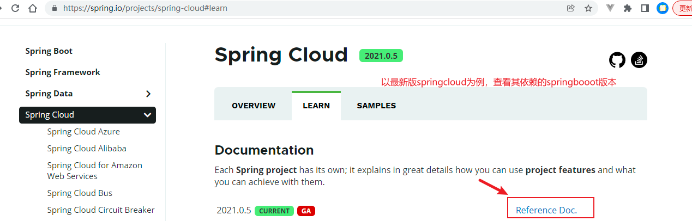

  

# 2. SpringCloud组件选择


# 3. 参考文档

+ springcloud官网参考文档：`https://cloud.spring.io/spring-cloud-static/Hoxton.SR1/reference/htmlsingle/`
+ springcloud第三方翻译中文文档：`https://www.bookstack.cn/read/spring-cloud-docs/docs-index.md`
+ springboot官网参考文档：`https://docs.spring.io/spring-boot/docs/2.2.2.RELEASE/reference/htmlsingle/`

# 4. 微服务项目架构搭建

## 4.1 创建总父结构 cloud2020

### 4.1.1 创建父项目


### 4.1.2 配置Maven版本


### 4.1.3 配置字符编码


### 4.1.4 启用注解自动配置处理器


### 4.1.5 设置Java编译版本


### 4.1.6 设置项目SDK及语言


## 4.2 父级pom指定组件版本

​	可以将项目cloud2020项目下的src文件夹删除，因为该项目是做依赖管理的。**一定要将打包方式改为pom**

## 4.3 跳过Maven test步骤

+ 通过maven插件方式

  ```xml
  <build><!-- maven中跳过单元测试 -->
      <plugins>
          <plugin>
              <groupId>org.apache.maven.plugins</groupId>
              <artifactId>maven-surefire-plugin</artifactId>
              <configuration>
                  <skip>true</skip>
              </configuration>
          </plugin>
      </plugins>
  </build>
  ```

+ idea工具

  

## 4.4 pom依赖

​	比如mirror镜像为阿里云镜像，且仓库有此版本的软件包，但是idea无法拉取。

```sh
# 执行maven命令获取指定版本的jar包
mvn dependency:get -DgroupId=com.alibaba -DartifactId=druid -Dversion=1.1.16
```

## 4.5 热部署

+ 引入依赖

  ```xml
  <dependency>
      <groupId>org.springframework.boot</groupId>
      <artifactId>spring-boot-devtools</artifactId>
      <scope>runtime</scope>
      <optional>true</optional>
  </dependency>
  ```

+ 父级pom文件中，添加maven插件

  ```xml
  <build>
      <plugins>
          <plugin>
              <!-- 热部署-->
              <groupId>org.springframework.boot</groupId>
              <artifactId>spring-boot-maven-plugin</artifactId>
              <configuration>
                  <fork>true</fork>
                  <addResources>true</addResources>
              </configuration>
          </plugin>
      </plugins>
  </build>
  ```

+ idea中开启自动编译

  

+ 更新idea参数

  

  

+ 重启idea

# 5. Rest微服务工程构建*


## 5.1 提供者支付Module模块 

### 5.1.1 建立子项目 

*支付模块：cloud-provider-payment8001*


> 父工程pom文件多一个modules标签，子项目多了一个parent标签

### 5.1.2 修改pom文件

添加依赖

```xml
 <dependencies>
        <!-- web和actuator必备-->
        <dependency>
            <groupId>org.springframework.boot</groupId>
            <artifactId>spring-boot-starter-web</artifactId>
        </dependency>
        <dependency>
            <groupId>org.springframework.boot</groupId>
            <artifactId>spring-boot-starter-actuator</artifactId>
        </dependency>
        <dependency>
            <groupId>org.mybatis.spring.boot</groupId>
            <artifactId>mybatis-spring-boot-starter</artifactId>
        </dependency>
        <dependency>
            <groupId>com.alibaba</groupId>
            <artifactId>druid-spring-boot-starter</artifactId>
            <version>1.1.10</version>
        </dependency>
        <!--mysql-connector-java-->
        <dependency>
            <groupId>mysql</groupId>
            <artifactId>mysql-connector-java</artifactId>
        </dependency>
        <!--jdbc-->
        <dependency>
            <groupId>org.springframework.boot</groupId>
            <artifactId>spring-boot-starter-jdbc</artifactId>
        </dependency>
        <dependency>
            <groupId>org.springframework.boot</groupId>
            <artifactId>spring-boot-devtools</artifactId>
            <scope>runtime</scope>
            <optional>true</optional>
        </dependency>
        <dependency>
            <groupId>org.projectlombok</groupId>
            <artifactId>lombok</artifactId>
            <optional>true</optional>
        </dependency>
        <dependency>
            <groupId>org.springframework.boot</groupId>
            <artifactId>spring-boot-starter-test</artifactId>
            <scope>test</scope>
        </dependency>
    </dependencies>

```

### 5.1.3 修改配置文件

```yaml
server:
  port: 8001

spring:
  application:
    name: cloud-payment-service
  datasource:
    type: com.alibaba.druid.pool.DruidDataSource            # 当前数据源操作类型
    driver-class-name: org.gjt.mm.mysql.Driver              # mysql驱动包 com.mysql.jdbc.Driver
    url: jdbc:mysql://localhost:3306/db2019?useUnicode=true&characterEncoding=utf-8&useSSL=false
    username: root
    password: 123456


mybatis:
  mapperLocations: classpath:mapper/*.xml
  type-aliases-package: com.ly.springcloud.entities    # 所有Entity别名类所在包
```

### 5.1.4 创建springboot主启动类

```java
package com.ly.springcloud;

import org.springframework.boot.SpringApplication;
import org.springframework.boot.autoconfigure.SpringBootApplication;
/**
 * FileName:PaymentMain8001.class
 * Author:ly
 * Date:2022/12/13 0013
 * Description: SpringBoot主启动类
 */
@SpringBootApplication
public class PaymentMain8001 {
    public static void main(String[] args) {
        SpringApplication.run(PaymentMain8001.class,args);
    }
}
```

### 5.1.5 编写业务代码

#### 5.1.5.1 建表SQL

```sql
# 库名 db2019
CREATE TABLE `payment` (
  `id` bigint(20) NOT NULL AUTO_INCREMENT COMMENT 'ID',
  `serial` varchar(200) DEFAULT '',
  PRIMARY KEY (`id`)
) ENGINE=InnoDB AUTO_INCREMENT=1 DEFAULT CHARSET=utf8

```

#### 5.1.3.2 entities

+ 与表对应的实体类

  ```java
  /**
   * FileName:Payment.class
   * Author:ly
   * Date:2022/12/13 0013
   * Description: 对应数据库表payment
   */
  @Data
  @NoArgsConstructor
  @AllArgsConstructor
  public class Payment implements Serializable {
      private Long id;
      private String serial;
  
  }
  ```

+ 回传给前端的json封装类，可以理解为vo

  ```java
  /**
   * FileName:CommonResult.class
   * Author:ly
   * Date:2022/12/13 0013
   * Description: 专门用于传递给前端的数据json封装体，可以理解为vo
   */
  @Data
  @NoArgsConstructor
  @AllArgsConstructor
  public class CommonResult<T> {
      //404 NOT FOUND 
      private Integer code;
      private String message;
      private T data;
  
      public CommonResult(Integer code, String message) {
          this(code,message,null);
      }
  }
  ```

#### 5.1.3.3 dao

+ 接口定义

  ```java
  /**
   * FileName:Payment.class
   * Author:ly
   * Date:2022/12/13 0013
   * Description: dao主类方便使用mapper文件（整合mybatis）
   *  使用@Mapper注解，代替配置文件映射
   */
  @Mapper
  public interface PaymentDao {
  
      /**
       * 新增支付信息
       * @param payment 支付实体类
       * @return 结果
       */
      public int create(Payment payment);
  
      /**
       * 根据id获取支付单据
       * @param id 支付单据id
       * @return payment
       */
      public Payment getPaymentById(@Param("id") Long id);
  }
  ```

+ mapper映射文件

  ```xml
  <?xml version="1.0" encoding="UTF-8" ?>
  <!DOCTYPE mapper
          PUBLIC "-//mybatis.org//DTD Mapper 3.0//EN"
          "http://mybatis.org/dtd/mybatis-3-mapper.dtd">
  
  <!--指定指定实现接口 即：接口的全类名-->
  <mapper namespace="com.ly.springcloud.dao.PaymentDao">
  
      <sql id="columns"> id,serial </sql>
      <sql id="table"> payment </sql>
  
      <!--
          property:为Java实体类属性
          column:为数据库字段
       -->
      <resultMap id="resultColumns" type="com.ly.springcloud.entieies.Payment">
          <id property="id" column="id" javaType="java.lang.Long" jdbcType="BIGINT" />
          <id property="serial" column="serial" javaType="java.lang.String" jdbcType="VARCHAR" />
      </resultMap>
  
      <select id="getPaymentById" parameterType="long" resultMap="resultColumns">
          select
              <include refid="columns" />
          from
              <include refid="table" /> t
          where
              t.id=#{id}
      </select>
  
      <!--
          配置文件开启了包别名（爆红不影响），
          useGeneratedKeys 使用生产的主键
  		
  	#{serial}而不是#{payment.serial}，mybatis中实体类就是map直接用#{}取即可
          -->
      <insert id="create" parameterType="Payment" useGeneratedKeys="true" keyProperty="id">
          insert into
              <include refid="table" />(serial)
          values
              (#{serial})
      </insert>
  
  </mapper>
  ```

#### 5.1.3.4 service

+ 接口

  ```java
  public interface PaymentService {
  
      public int create(Payment payment);
      public Payment getPaymentById(Long id);
  }
  ```

+ 实现类

  ```java
  @Service
  public class PaymentServiceImpl implements PaymentService {
  
      @Autowired
      private PaymentDao paymentDao;
  
  
      @Override
      public int create(Payment payment) {
          assert payment !=null :"error,payment is null!";
          return paymentDao.create(payment);
      }
  
      @Override
      public Payment getPaymentById(Long id) {
          assert id != null:"error, id is null!";
          return paymentDao.getPaymentById(id);
      }
  }
  ```

#### 5.1.3.5 controller

```java
@Slf4j
@RestController
public class PaymentController {

    @Autowired
    private PaymentService paymentService;


    @PostMapping(path = {"/payment/create"})
    public CommonResult create(Payment payment) {

        int ret = paymentService.create(payment);
        if (ret > 0) {
           //插入成功
            return new CommonResult(
                    ReturnResultEnum.NORMAL.getCode(),
                    ReturnResultEnum.NORMAL.getMessage(),
                    ret
            );
        }

        log.error("插入数据库失败");
        return new CommonResult(
                ReturnResultEnum.INNER_ERROR.getCode(),
                ReturnResultEnum.INNER_ERROR.getMessage()
                );
    }

    @GetMapping(path = {"/payment/get/{id}"})
    public CommonResult getPaymentById(@PathVariable("id") Long id) {

        if (null == id || 0 >= id) {
            log.info("查询的id {} 不正确",id);

            return new CommonResult(
                    ReturnResultEnum.NOT_FOUND.getCode(),
                    ReturnResultEnum.NOT_FOUND.getMessage()
            );
        }


        Payment payment = paymentService.getPaymentById(id);
        if (null != payment) {
            return new CommonResult(
                    ReturnResultEnum.NORMAL.getCode(),
                    ReturnResultEnum.NORMAL.getMessage(),
                    payment
            );
        }

        //失败
        return new CommonResult(
                ReturnResultEnum.NOT_FOUND.getCode(),
                ReturnResultEnum.NOT_FOUND.getMessage()
        );
    }
}
```

### 5.1.6 测试


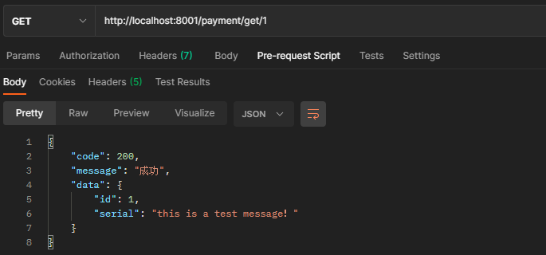

## 5.2 消费者订单Module模块

### 5.2.1 建立子项目

如上，项目名**cloud-consumer-order80**

### 5.2.2 修改pom文件

引入依赖：

```xml
<dependencies>
    <dependency>
        <groupId>org.springframework.boot</groupId>
        <artifactId>spring-boot-starter-web</artifactId>
    </dependency>
    <dependency>
        <groupId>org.springframework.boot</groupId>
        <artifactId>spring-boot-starter-actuator</artifactId>
    </dependency>
    <dependency>
        <groupId>org.projectlombok</groupId>
        <artifactId>lombok</artifactId>
        <optional>true</optional>
    </dependency>
    <dependency>
        <groupId>org.springframework.boot</groupId>
        <artifactId>spring-boot-starter-test</artifactId>
        <scope>test</scope>
    </dependency>
</dependencies>
```

### 5.2.3 修改配置文件

```yaml
server:
  port: 80

spring:
  application:
    name: cloud-order-service
```

### 5.2.4 创建SpringBoot1启动类

```java
@SpringBootApplication
public class OrderMain80 {

    public static void main(String[] args) {
        SpringApplication.run(OrderMain80.class, args);
    }
}
```

### 5.2.5 编写业务代码

#### 5.2.5.1 实体类（同上）

+ Payment类
+ CommonResult\<T>类

#### 5.2.5.2 RestTemplate

是spring对HttpClient进行的封装类，用于处理和发生网络请求。

RestTemplate提供了多种便捷访问远程Http服务的方法， 
是一种简单便捷的访问restful服务模板类，是Spring提供的用于访问Rest服务的客户端模板工具集。

**官网地址**

https://docs.spring.io/spring-framework/docs/5.2.2.RELEASE/javadoc-api/org/springframework/web/client/RestTemplate.html

**使用**
使用restTemplate访问restful接口非常的简单粗暴无脑。
(url, requestMap, ResponseBean.class)这三个参数分别代表 
REST请求地址、请求参数、HTTP响应转换被转换成的对象类型。

```java
//加入ioc容器中
@Configuration
public class ApplicationContextConfig {
    @Bean
    public RestTemplate restTemplate() {
        return new RestTemplateBuilder().build();
    }
}
```

#### 5.2.5.3 controller

```java
/**
 * FileName:OrderController.class
 * Author:ly
 * Date:2022/12/13 0013
 * Description: 消费者服务
 */
@Slf4j
@RestController
public class OrderController {
    public static final String PAYMENT_URL = "http://localhost:8001";
    @Autowired
    private RestTemplate restTemplate;

    @GetMapping("/consumer/payment/create")
    public CommonResult<Payment> create(Payment payment) {
        log.info("consumer 接收到一条新增payment消息 serial={}",payment.getSerial());
        //调用cloud-payment-service(请求地址，参数，返回消息的内容)
        return restTemplate.postForObject(
                PAYMENT_URL + "/payment/create",
                payment,
                CommonResult.class
        );
    }

    @GetMapping("/consumer/payment/get/{id}")
    public CommonResult<Payment> getPaymentById(@PathVariable("id") Long id){
        log.info("consumer 接收到一条请求payment消息 id={}",id);
        //(请求地址，返回消息的内容)
        return restTemplate.getForObject(
                PAYMENT_URL + "/payment/get/" + id, CommonResult.class);
    }
}
```

### 5.2.6 测试

+ get请求，没问题

  

+ post请求（以get方式代发）,**看着没问题，但实际上并没有保存到数据中**

  

  

出现这个的原因就是因为我们是以get方式访问consumer连接，自动将参数封装到Payment payment中，但是内部又以post方式提交到provider端（实际上也只接收post信息），导致参数是被封装好的payment在请求体制中，此时Springmvc就不能直接将连接问号？直接封装到新的Payment payment（因为实际就是没有），所为保存的数据就为空。

只有加上@RequestBody注解，表示从post方式的请求体(json数据)中获取payment的参数（不是payment，而是根据属性如serial封装到payment）。

**经过两次请求包装，导致请求参数发生了变化，无法直接从链接中获取（只能从请求体中）**

```java
//修改provider端获取参数的方式，从请求体中取

// provider端必须是从@RequestBody 请求体获取参数，因为请求被封在请求体中，而不是直链
    @PostMapping(path = {"/payment/create"})
    public CommonResult create(@RequestBody Payment payment) {...}
```

**此时再次发送上面的请求就成功插入了**


#### 5.2.6.1 注意

***上面改了provider端获取参数的方式，则不能再使用原来的直链请求post方式访问。因为现在参数是直接从请求体找的了（所以必须要为json格式）**

+ 错误请求发送：

  

+ 正确请求发送：

  

  ```sh
  # --------postman直接发送json请求体
  POST /payment/create HTTP/1.1   						#	请求行
  cookie:JSESSIONID=5D8272F448D81F519356938A5F1953966		  #|
  content-type:application/jsonn							#|
  user-agent:PostmanRuntime/7.28.00					     #|
  accept:*/**											   #|
  cache-control:no-cachee								    #| 	请求头
  postman-token:a8972621-ce80-4ba1-adb9-59526538bca88		  #|
  host:localhost:80011								   #|
  accept-encoding:gzip, deflate, brr						#|
  connection:keep-alivee								   #|
  content-length:244									   #|
  													 #	空一行隔开
  {											    #+
      "serial":77777								 #+ 请求体
  }											    #+
  
  
  # -------通过consumer包装后发送的请求
  POST /payment/create HTTP/1.1
  accept:application/json, application/*+jsonn
  content-type:application/jsonn
  user-agent:Java/1.8.0_3011
  host:localhost:80011
  connection:keep-alivee
  content-length:299
  
  {"id":null,"serial":"888888"}
  ```

## 5.3 工程重构

显而易见工程consumer和工程provider出线了重复类`CommonResult<T>`和`Payment`，所以建立一个第三方工程用于存放重复的代码。

### 5.3.1 建立第三方工程 

**cloud-api-commons**


### 5.3.2 修改pom文件

```xml
<dependencies>
    <dependency>
        <groupId>org.projectlombok</groupId>
        <artifactId>lombok</artifactId>
        <optional>true</optional>
    </dependency>
    <dependency>
        <groupId>cn.hutool</groupId>
        <artifactId>hutool-all</artifactId>
        <version>5.1.0</version>
    </dependency>
</dependencies>
```

### 5.3.3 将通用类放在该项目下

**Payment**，**CommonResult\<T>**

### 5.3.4 将该项目安装到maven仓库

```bash
mvn clean
mvn test
mvn package
mvn install
```

### 5.3.5 修改consumer和provider项目

+ 直接删除重复的两个类`Payment`、`CommonResult<T>`（**然后会报错**）

+ 这个两个报错的项目分别引入刚才打包的cloud-api-commons依赖

  ```xml
  <dependency>
      <groupId>com.ly.springcloud</groupId>
      <artifactId>cloud-api-commons</artifactId>
      <version>1.0-SNAPSHOT</version>
  </dependency>
  ```

### 5.3.6 运行测试

运行正常

# 6. Eureka服务注册与发现

Eureka官网：[Issues · Netflix/eureka · GitHub](https://github.com/Netflix/eureka/wiki)

## 6.1 Eureka基础知识

### 6.1.1 服务治理

  Spring Cloud 封装了 Netflix 公司开发的 Eureka 模块来实现服务治理

  在传统的rpc远程调用框架中，管理每个服务与服务之间依赖关系比较复杂，管理比较复杂，所以需要使用**服务治理，管理服务于服务之间依赖关系，可以实现服务调用、负载均衡、容错等，实现服务发现与注册**。

### 6.1.2 服务注册

​	Eureka采用了CS的设计架构，Eureka Server 作为服务注册功能的服务器，它是服务注册中心。而系统中的其他微服务，使用 Eureka的客户端连接到 Eureka Server并维持心跳连接。这样系统的维护人员就可以通过 Eureka Server 来监控系统中各个微服务是否正常运行。
​	在服务注册与发现中，有一个注册中心。当服务器启动的时候，会把当前自己服务器的信息 比如 服务地址通讯地址等以别名方式注册到注册中心上。另一方（消费者|服务提供者），以该别名的方式去注册中心上获取到实际的服务通讯地址，然后再实现本地RPC调用RPC远程调用。框架核心设计思想：在于注册中心，因为使用注册中心管理每个服务与服务之间的一个依赖关系(服务治理概念)。在任何rpc远程框架中，都会有一个注册中心(存放服务地址相关信息(接口地址))。

​		<font color='red)***下左图是Eureka系统架构，右图是Dubbo的架构，请对比***</font>


### 6.1.3 Eureka两大组件

+ **Eureka Server**提供服务注册服务

  ​	各个微服务节点通过配置启动后，会在EurekaServer中进行注册，这样EurekaServer中的服务注册表中将会存储所有可用服务节点的信息，服务节点的信息可以在界面中直观看到。

+ **EurekaClient**通过注册中心进行访问

  ​	是一个Java客户端，用于简化Eureka Server的交互，客户端同时也具备一个内置的、使用轮询(round-robin)负载算法的负载均衡器。在应用启动后，将会向Eureka Server发送心跳(默认周期为30秒)。如果Eureka Server在多个心跳周期内没有接收到某个节点的心跳，EurekaServer将会从服务注册表中把这个服务节点移除（默认90秒）

## 6.2 单机Eureka构建步骤

### 6.2.1 创建服务注册中心项目

#### 6.2.1.1 创建服务注册中心

创建项目**cloud-eureka-server7001**


#### 6.2.1.2 修改pom文件

```xml
dependencies>
        <!--eureka-server-->
        <dependency>
            <groupId>org.springframework.cloud</groupId>
            <artifactId>spring-cloud-starter-netflix-eureka-server</artifactId>
        </dependency>
        <!-- 引入自己定义的api通用包，可以使用Payment支付Entity -->
        <dependency>
            <groupId>com.ly.springcloud</groupId>
            <artifactId>cloud-api-commons</artifactId>
            <version>${project.version}</version>
        </dependency>
        <!--boot web actuator-->
        <dependency>
            <groupId>org.springframework.boot</groupId>
            <artifactId>spring-boot-starter-web</artifactId>
        </dependency>
        <dependency>
            <groupId>org.springframework.boot</groupId>
            <artifactId>spring-boot-starter-actuator</artifactId>
        </dependency>
        <!--一般通用配置-->
        <dependency>
            <groupId>org.projectlombok</groupId>
            <artifactId>lombok</artifactId>
        </dependency>
        <dependency>
            <groupId>org.springframework.boot</groupId>
            <artifactId>spring-boot-starter-test</artifactId>
            <scope>test</scope>
        </dependency>
        <dependency>
            <groupId>junit</groupId>
            <artifactId>junit</artifactId>
        </dependency>
    </dependencies>
```

#### 6.2.1.3 修改配置文件

```yaml
server:
  port: 7001
spring:
  application:
    name: cloud-eureka-server
eureka:
  instance:
    hostname: localhost #eureka服务端的实例名称
  client:
    #false表示不向注册中心注册自己。
    register-with-eureka: false
    #false表示自己端就是注册中心，我的职责就是维护服务实例，并不需要去检索服务
    fetch-registry: false
    service-url:
      #设置与Eureka Server交互的地址查询服务和注册服务都需要依赖这个地址。
      defaultZone: http://${eureka.instance.hostname}:${server.port}/eureka/
```

#### 6.2.1.4 创建启动类并启用server端

```java
@SpringBootApplication
@EnableEurekaServer //表明当前服务是一个eureka的sever
public class EurekaMain7001 {
    public static void main(String[] args) {
        SpringApplication.run(EurekaMain7001.class,args);
    }
}
```

#### 6.2.1.5 测试


### 6.2.2 将项目（EurekaClient）provider注册到EurekaServer

#### 6.2.2.1 引入Eureka Client端依赖

```xml
<dependency>
    <groupId>org.springframework.cloud</groupId>
    <artifactId>spring-cloud-starter-netflix-eureka-client</artifactId>
</dependency>
```

#### 6.2.2.2 修改配置文件，配置eureka

```yaml
eureka:
  client:
  #表示是否将自己注册进EurekaServer默认为true。
    register-with-eureka: true
  #是否从EurekaServer抓取已有的注册信息，默认为true。单节点无所谓，集群必须设置为true才能配合ribbon使用负载均衡
    fetchRegistry: true
    service-url:
      defaultZone: http://localhost:7001/eureka
```

#### 6.2.2.3 启动类开启Eureka  Client

```java
@EnableEurekaClient//客户端
@SpringBootApplication
public class PaymentMain8001 {
    public static void main(String[] args) {
        SpringApplication.run(PaymentMain8001.class,args);
    }
}
```

#### 6.2.2.4 测试

先启动Eureka Server段，再起动provider端。


### 6.2.3 将项目（EurekaClient）consumer注册到EurekaServer

和provider端配置完全一样，见上。


## 6.3 ureka集群

### 6.3.1 Eureka集群原理说明

**问题**：微服务RPC远程服务调用最核心的是什么 ?

答：高可用，试想你的注册中心只有一个only one， 它出故障了那就完了，会导致整个为服务环境不可用。

**解决办法：搭建Eureka注册中心集群 ，实现负载均衡+故障容错**


### 6.3.2 Eureka集群环境搭建步骤

***Eureka Server 7001和7002相互注册，互相守望***

#### 6.3.2.1 创建新Eureka Server7002


#### 6.3.2.2 修改pom

其实和7001的依赖完全一样

```xml
<dependencies>
    <!--eureka-server-->
    <dependency>
        <groupId>org.springframework.cloud</groupId>
        <artifactId>spring-cloud-starter-netflix-eureka-server</artifactId>
    </dependency>
    <!-- 引入自己定义的api通用包，可以使用Payment支付Entity -->
    <dependency>
        <groupId>com.ly.springcloud</groupId>
        <artifactId>cloud-api-commons</artifactId>
        <version>${project.version}</version>
    </dependency>
    <!--boot web actuator-->
    <dependency>
        <groupId>org.springframework.boot</groupId>
        <artifactId>spring-boot-starter-web</artifactId>
    </dependency>
    <dependency>
        <groupId>org.springframework.boot</groupId>
        <artifactId>spring-boot-starter-actuator</artifactId>
    </dependency>
    <!--一般通用配置-->
    <dependency>
        <groupId>org.projectlombok</groupId>
        <artifactId>lombok</artifactId>
    </dependency>
    <dependency>
        <groupId>org.springframework.boot</groupId>
        <artifactId>spring-boot-starter-test</artifactId>
        <scope>test</scope>
    </dependency>
    <dependency>
        <groupId>org.springframework.boot</groupId>
        <artifactId>spring-boot-configuration-processor</artifactId>
    </dependency>
    <dependency>
        <groupId>junit</groupId>
        <artifactId>junit</artifactId>
    </dependency>
</dependencies>
```

#### 6.3.2.3 修改本机hosts文件

```sh
# 为了让机器能够互相识别 C:\Windows\System32\drivers\etc\hosts 追加
127.0.0.1       eureka7001.com
127.0.0.1       eureka7002.com
```

#### 6.3.2.4 修改yaml（7001）文件

```yaml
server:
  port: 7001
spring:
  application:
    name: cloud-eureka-server-7001
eureka:
  instance:
    hostname:  eureka7001.com #eureka服务端的实例名称
  client:
    #false表示不向注册中心注册自己。
    register-with-eureka: false
    #false表示自己端就是注册中心，我的职责就是维护服务实例，并不需要去检索服务
    fetch-registry: false
    service-url:
      #设置与Eureka Server交互的地址查询服务和注册服务都需要依赖这个地址。
      #集群就是相互注册对方的url
      defaultZone: http://eureka7002.com:7002/eureka/
```

#### 6.3.2.5 修改yaml（7002）文件

```yaml
server:
  port: 7002
spring:
  application:
    name: cloud-eureka-server-7002
eureka:
  instance:
    hostname:  eureka7002.com #eureka服务端的实例名称
  client:
    #false表示不向注册中心注册自己。
    register-with-eureka: false
    #false表示自己端就是注册中心，我的职责就是维护服务实例，并不需要去检索服务
    fetch-registry: false
    service-url:
      #设置与Eureka Server交互的地址查询服务和注册服务都需要依赖这个地址。
      #集群就是相互注册对方的url
      defaultZone: http://eureka7001.com:7001/eureka/
```

#### 6.3.2.6 7001启动类

```java
@SpringBootApplication
@EnableEurekaServer //表明当前服务是一个eureka的sever
public class EurekaMain7002 {
    public static void main(String[] args) {
        SpringApplication.run(EurekaMain7002.class,args);
    }
}
```

#### 6.3.2.7 测试

虽然配置时的连接是  `defaultZone: http://eureka7001.com:7001/eureka/` ，实际不要加上最后的eureka


### 6.3.3 将微服务provider发布到Eureka集群中

微服务consumer端同样配置

```yaml
# 只需修改配置文件的server url即可
eureka:
    service-url:
      defaultZone: http://eureka7001.com:7001/eureka/,http://eureka7002.com:7002/eureka/
```

### 6.3.4 测试1

先启动eureka集群7001和7002，然后启动provider和consumer


### 6.3.5 服务provider集群搭建


#### 6.3.5.1 创建provider 8002


#### 6.3.5.2 修改pom

同 8001的 

#### 6.3.5.3 修改配置文件

同 8001的 ，除了port端口不一样为8002

#### 6.3.5.4 修改controller（8001和8002）

为了显示当前调用的是哪个服务

```java
@Value("${server.port}")
private String serverPort;

 public CommonResult create(@RequestBody Payment payment) {
        //map存放返回的信息
        Map<String,Object> map = new HashMap<>();
        map.put("serverPort",serverPort);
     ...
 }
```

#### 6.3.5.5 运行


### 6.3.6  ==负载均衡（从注册中获取服务url）*==

***eureka从注册中心获取provider，不再是80中写死ip和端口。***<font color='red)***而是从Eureka Server中获取可用的provider url实现负载均衡和高可用。***</font>

#### 6.3.6.1 修改80端访问的url

```java
@Slf4j
@RestController
public class OrderController {
    //public static final String PAYMENT_URL = "http://localhost:8001";
    //用eureka的服务名代替真实ip，当其中一个provider掉线或者繁忙就会自动调用另一个provider(大小写随意)
    public static final String PAYMENT_URL = "http://cloud-payment-service";
    @Autowired
    private RestTemplate restTemplate;

    @GetMapping("/consumer/payment/create")
    public CommonResult<Payment> create(Payment payment) {
        log.info("consumer 接收到一条新增payment消息 serial={}",payment.getSerial());
        return restTemplate.postForObject(
                PAYMENT_URL + "/payment/create",
                payment,
                CommonResult.class
        );
    }

    @GetMapping("/consumer/payment/get/{id}")
    public CommonResult<Payment> getPaymentById(@PathVariable("id") Long id){
        log.info("consumer 接收到一条请求payment消息 id={}",id);
        return restTemplate.getForObject(
                PAYMENT_URL + "/payment/get/" + id, CommonResult.class);
    }
}
```

#### 6.3.6.2 consumer端开启负载均衡

```java
@Configuration
public class ApplicationContextConfig {
    
    @Bean
    @LoadBalanced //否则无法直接识别eruka的服务名，ribbon负载均衡，默认采用轮询方式
    public RestTemplate restTemplate() {
        return new RestTemplateBuilder().build();
    }
}
```

不加`@LoadBalanced`的话会导致错误：


### 6.3.7 测试2


### 6.3.8 负载均衡原理 *

​	如果不加负载均衡即`@LoadBalanced`注解，则配置的provider url就是一个普通的url，当RestTemplate发送post请求后，就直接发送了。但是如果给RestTemplate加上了该注解，则在发送post请求前会自动解析provider url成为一个真正的ip地址。

> 由于加了@LoadBalanced注解，使用RestTemplateCustomizer对所有标注了@LoadBalanced的RestTemplate Bean添加了一个LoadBalancerInterceptor拦截器。利用RestTempllate的拦截器，spring可以对restTemplate bean进行定制，加入loadbalance拦截器进行ip:port的替换，也就是将请求的地址中的服务逻辑名转为具体的服务地址。
>
> 具体实现还是loadbalance拦截器中LoadBalancerClient loadBalancer 即RibbonLoadBalancerClient（Eureka Client）

## 6.4 actuator微服务信息完善

### 6.4.1 eureka不显示服务的主机名

```yaml
eureka:
# 显示的服务名，唯一id
  instance:
    instance-id: payment8001
```


### 6.4.2 访问服务有ip地址显示

```yaml
eureka:  
  instance:
    # 优先使用ip而不是主机名
    prefer-ip-address: true
```

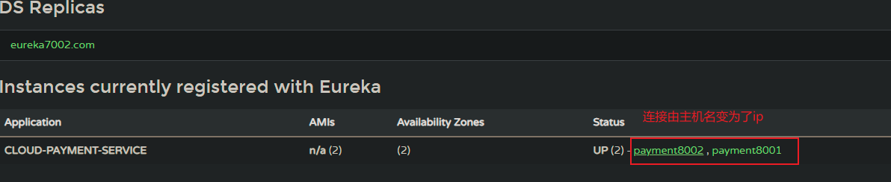

## 6.5 服务发现Discovery

对于注册进eureka里面的微服务，可以通过服务（consumer80可以）发现`@EnableDiscoveryClient`来获得该服务的信息。

### 6.5.1 payment8001引入DiscoverClient

```java
@EnableDiscoveryClient //springcloud包
@EnableEurekaClient
@SpringBootApplication
public class OrderMain80 {

    public static void main(String[] args) {
        SpringApplication.run(OrderMain80.class, args);
    }
}
```

### 6.5.2  将微服务信息暴露出去

```java
@Slf4j
@RestController
public class PaymentController {

    @Autowired
    private PaymentService paymentService;

    @Value("${server.port}")
    private String serverPort;

    @Autowired
    // 搭配eureka server
    private DiscoveryClient discoveryClient;

    @GetMapping("/payment/discovery")
    public Object discovery() {
        //获取eureka server上注册在线的所有服务(application)信息
        //如cloud-payment-service和cloud-order-service
        List<String> services = discoveryClient.getServices();
        for (String service : services) {
            log.info("微服务名：{}",service);
        }

        //根据服务名（application），获取所有的微服务信息 如payment80001的所有信息
        List<ServiceInstance> instances = discoveryClient.getInstances("cloud-payment-service");
        instances.forEach(consumer -> {
            log.info(
                    "微服务：host={},instanceId={},metaData={},port={},serviceId={},uri={}",
                    consumer.getHost(),
                    consumer.getInstanceId(),
                    consumer.getMetadata(),
                    consumer.getPort(),
                    consumer.getServiceId(),
                    consumer.getUri()
            );
        });
        return this.discoveryClient;
    }
    ...
}
```

### 6.5.3 测试

```sh
# 日志
微服务名：cloud-payment-service
    
微服务：host=192.168.77.1,instanceId=payment8002,metaData={management.port=8002},port=8002,serviceId=CLOUD-PAYMENT-SERVICE,uri=http://192.168.77.1:8002

微服务：host=192.168.77.1,instanceId=payment8001,metaData={management.port=8001},port=8001,serviceId=CLOUD-PAYMENT-SERVICE,uri=http://192.168.77.1:8001
```


## 6.6 Eureka自我保护

### 6.6.1 概述

保护模式主要用于一组客户端和Eureka Server之间存在网络分区场景下的保护。一旦进入保护模式，Eureka Server将会尝试保护其服务注册表中的信息，不再删除服务注册表中的数据，也就是不会注销任何微服务。

一句话：**某时刻某一个微服务不可用了，Eureka不会立刻清理（页面上消失），依旧会对该服务的信息进行保存。**

**属于微服务cloud中的CAP的AP分支**

> CAP的解释：
>
> 1、一致性（Consistency）：（等同于所有节点访问同一份最新的数据副本）
>
> 2、可用性（Availability）：（每次请求都能获取到非错的响应——但是不保证获取的数据为最新数据）
>
> 3、分区容错性（Partition tolerance）：（以实际效果而言，分区相当于对通信的时限要求。系统如果不能在时限内达成数据一致性，就意味着发生了分区的情况，必须就当前操作在C和A之间做出选择，保证分布式网络中部分网络不可用时, 系统依然正常对外提供服务。

如果在Eureka Server的首页看到以下这段提示，则说明Eureka进入了保护模式：

> <font color='red)EMERGENCY! EUREKA MAY BE INCORRECTLY CLAIMING INSTANCES ARE UP WHEN THEY'RE NOT. RENEWALS ARE LESSER THAN THRESHOLD AND HENCE THE INSTANCES ARE NOT BEING EXPIRED JUST TO BE SAFE.</font>
>
> 紧急!Eureka可能错误地声称实例已经启动，而实际上它们并没有启动。更新次数小于阈值，因此为了安全起见，实例没有过期。

### 6.6.2 产生原因

**为什么会产生Eureka自我保护机制？**
	为了防止EurekaClient可以正常运行，但是 与 EurekaServer网络不通情况下，EurekaServer不会立刻将EurekaClient服务剔除

**什么是自我保护模式？**
	默认情况下，如果EurekaServer在一定时间内没有接收到某个微服务实例的心跳，EurekaServer将会注销该实例（默认90秒）。但是当网络分区故障发生(延时、卡顿、拥挤)时，微服务与EurekaServer之间无法正常通信，以上行为可能变得非常危险了——因为微服务本身其实是健康的，此时本不应该注销这个微服务。Eureka通过“自我保护模式”来解决这个问题——当EurekaServer节点在短时间内丢失过多客户端时（可能发生了网络分区故障），那么这个节点就会进入自我保护模式。


**在自我保护模式中，Eureka Server会保护服务注册表中的信息，不再注销任何服务实例。**
它的设计哲学就是宁可保留错误的服务注册信息，也不盲目注销任何可能健康的服务实例。一句话讲解：好死不如赖活着

综上，自我保护模式是一种应对网络异常的安全保护措施。它的架构哲学是宁可同时保留所有微服务（健康的微服务和不健康的微服务都会保留）也不盲目注销任何健康的微服务。使用自我保护模式，可以让Eureka集群更加的健壮、稳定。

###  6.6.3 禁用Eureka自我保护

Eureka server 7001和 7002配置文件中关闭自我保护，更改心跳连接的时长。

```yaml
server:
  port: 7001
spring:
  application:
    name: cloud-eureka-server-7001
    
eureka:
  instance:
    hostname: eureka7001.com #eureka服务端的实例名称
    # 指示eureka客户端需要多长时间(以秒为单位)向eureka服务器发送一次心跳，以表明它仍处于活动状态。默认30秒
    # 如果在leaseExpirationDurationInSeconds中指定的时间内没有接收到心跳，eureka服务器将从其视图中删除该实例，并禁止该实例的流量。
    lease-renewal-interval-in-seconds: 1
    # 指示eureka客户端需要多长时间(以秒为单位)向eureka服务器发送一次心跳，以表明它仍处于活动状态。默认90秒
    # 如果在leaseExpirationDurationInSeconds中指定的时间内没有接收到心跳，eureka服务器将从其视图中删除该实例，并禁止该实例的流量。
    lease-expiration-duration-in-seconds: 2
    
  client: 
    #false表示不向注册中心注册自己。
    register-with-eureka: false
    #false表示自己端就是注册中心，我的职责就是维护服务实例，并不需要去检索服务
    fetch-registry: false
    service-url:
      #设置与Eureka Server交互的地址查询服务和注册服务都需要依赖这个地址。
      #集群就是相互注册对方的url
      defaultZone: http://eureka7002.com:7002/eureka/
      
  # 默认开启自我保护
  server:
    enable-self-preservation: false
    # 设置 检测下线服务 驱逐时间间隔 默认是60s
    eviction-interval-timer-in-ms: 2000
```

### 6.6.4 测试


***

# 7. Zookeeper服务注册与发现

由于Eureka停止更新，SpringCloud整合Zookeeper代替Eureka。

## 7.1 centos7安装zookeeper3.4.9

+ 创建并进入目录

  ```sh
  mkdir -p /usr/local/services/zookeeper
  cd /usr/local/services/zookeeper
  ```

+ 下载zookeeper3.4.9并解压

  ```sh
  wget http://archive.apache.org/dist/zookeeper/zookeeper-3.4.9/zookeeper-3.4.9.tar.gz
  tar -zxvf zookeeper-3.4.9.tar.gz
  ```

+ 进入加压后的zookeeper的conf文件夹，复制 zoo_sample.cfg 文件的并命名为为 zoo.cfg：

  ```sh
  cd zookeeper-3.4.9/conf/
  cp zoo_sample.cfg zoo.cfg
  ```

+ 用 vim 打开 zoo.cfg 文件并修改其内容为如下：

  ```sh
  	# The number of milliseconds of each tick
   
      # zookeeper 定义的基准时间间隔，单位：毫秒
      tickTime=2000
   
      # The number of ticks that the initial
      # synchronization phase can take
      initLimit=10
      # The number of ticks that can pass between
      # sending a request and getting an acknowledgement
      syncLimit=5
      # the directory where the snapshot is stored.
      # do not use /tmp for storage, /tmp here is just
      # example sakes.
      # dataDir=/tmp/zookeeper
   
      # 数据文件夹
      dataDir=/usr/local/services/zookeeper/zookeeper-3.4.9/data
   
      # 日志文件夹
      dataLogDir=/usr/local/services/zookeeper/zookeeper-3.4.9/logs
   
      # the port at which the clients will connect
      # 客户端访问 zookeeper 的端口号
      clientPort=2181
  ```

+ 进入到 /usr/local/services/zookeeper/zookeeper-3.4.9/bin 目录中

  ```sh
   cd /usr/local/services/zookeeper/zookeeper-3.4.9/bin/
  ```

+ 用 vim 打开 /etc/ profile， 并在其尾部追加如下内容：

  ```sh
   vim /etc/profile
   # 并在其尾部追加如下内容：
  ```

  ```sh
  # idea - zookeeper-3.4.9 config start - 2016-09-08
  
  export ZOOKEEPER_HOME=/usr/local/services/zookeeper/zookeeper-3.4.9/
  export PATH=$ZOOKEEPER_HOME/bin:$PATH
  export PATH
  
  # idea - zookeeper-3.4.9 config start - 2016-09-08
  ```

+ 使 /etc/ 目录下的 profile 文件即可生效：

  ```sh
  source /etc/profile
  ```

+ 启动 zookeeper 服务：

  ```sh
  zkServer.sh start
  ```

  > 如打印如下信息则表明启动成功：
  >     ZooKeeper JMX enabled by default
  >     Using config: /usr/local/services/zookeeper/zookeeper-3.4.9/bin/../conf/zoo.cfg
  >     Starting zookeeper ... STARTED

+ 查询 zookeeper 状态

  ```sh
  zkServer.sh status
  ```

  > ZooKeeper JMX enabled by default
  > Using config: /usr/local/services/zookeeper/zookeeper-3.4.9/bin/../conf/zoo.cfg
  > Mode: standalone

+ 关闭 zookeeper 服务：

  ```sh
  zkServer.sh stop
  ```

+ 重启 zookeeper 服务：

  ```sh
  zkServer.sh restart
  ```

## 7.2 zookeeper代替Eureka实现服务注册与发现


### 7.2.1 注册中心zookeeper

+ zookeeper是一个分布式协调工具，可以实现注册中心功能
+ 关闭Linux服务器防火墙后启动zookeeper服务器
+ zookeeper服务器取代Eureka服务器，zk作为服务注册中心

### 7.2.2  服务提供者 provider 8004

#### 7.2.2.1 创建项目


#### 7.2.2.2 修改pom

```xml
<dependencies>
        <!-- SpringBoot整合Web组件 -->
        <dependency>
            <groupId>org.springframework.boot</groupId>
            <artifactId>spring-boot-starter-web</artifactId>
        </dependency>
        <dependency><!-- 引入自己定义的api通用包，可以使用Payment支付Entity -->
            <groupId>com.ly.springcloud</groupId>
            <artifactId>cloud-api-commons</artifactId>
            <version>${project.version}</version>
        </dependency>
        <!-- SpringBoot整合zookeeper客户端 -->
        <dependency>
            <groupId>org.springframework.cloud</groupId>
            <artifactId>spring-cloud-starter-zookeeper-discovery</artifactId>
        </dependency>
        <dependency>
            <groupId>org.projectlombok</groupId>
            <artifactId>lombok</artifactId>
            <optional>true</optional>
        </dependency>
        <dependency>
            <groupId>org.springframework.boot</groupId>
            <artifactId>spring-boot-starter-test</artifactId>
            <scope>test</scope>
        </dependency>
    </dependencies>

```

#### 7.2.2.3 修改配置文件

```yaml
server:
  port: 8004

spring:
  application:
    name: cloud-provider-payment
  # 连接zookeeper服务端
  cloud:
    zookeeper:
      connect-string: 192.168.77.3:2181
```

#### 7.2.2.4 创建主启动类

```java
//该注解用于向使用consul或者zookeeper作为注册中心时注册服务
@EnableDiscoveryClient//谁连接，谁提供用
@SpringBootApplication
public class PaymentMain8004 {
    public static void main(String[] args) {
        SpringApplication.run(PaymentMain8004.class,args);
    }
}
```

#### 7.2.2.5 controller

```java
// 一个简单的controller，用于展示服务是否成功注册进入zookeeper
@Slf4j
@RestController
public class PaymentController {
    @Value("${server.port}")
    private Integer port;


    @RequestMapping("/payment/zk")
    public CommonResult paymentZK(){
        return new CommonResult(
                200,
                "成功",
                "serverPort:" + port
        );
    }
}
```

#### 7.2.2.6 验证测试

+ 先启动zookeeper服务

  ```sh
  zkServer.sh start
  ```

+ 再连上zookeeper客户端

  ```sh
  ./zkCli.sh
  ```

  ```sh
  # 运行查看当前zookeeper信息，只有一个默认的quota节点
  [zk: localhost:2181(CONNECTED) 6] ls / 
  [zookeeper]
  [zk: localhost:2181(CONNECTED) 7] get /zookeeper
  
  cZxid = 0x0
  ctime = Wed Dec 31 16:00:00 PST 1969
  mZxid = 0x0
  mtime = Wed Dec 31 16:00:00 PST 1969
  pZxid = 0x0
  cversion = -1
  dataVersion = 0
  aclVersion = 0
  ephemeralOwner = 0x0
  dataLength = 0
  numChildren = 1
  [zk: localhost:2181(CONNECTED) 8] ls /zookeeper
  [quota]
  
  ```

+ 运行微服务

  报错了经过排查发现是**jar包冲突，服务器的zookeeper为3.4.9而引入的org.springframework.cloud:spring-cloud-starter-zookeeper-discovery:2.2.0.RELEASE为3.5.3.beta版**

  

  

  ***解决方法，排除此依赖，重新引入依赖***

  ```xml
  <!-- SpringBoot整合zookeeper客户端 -->
  <dependency>
      <groupId>org.springframework.cloud</groupId>
      <artifactId>spring-cloud-starter-zookeeper-discovery</artifactId>
      <!-- 排除内部的依赖zookeeper3.5.3-->
      <exclusions>
          <exclusion>
              <groupId>org.apache.zookeeper</groupId>
              <artifactId>zookeeper</artifactId>
          </exclusion>
      </exclusions>
  </dependency>
  <!-- 引入服务器版本zookeeper依赖3.4.9-->
  <dependency>
      <groupId>org.apache.zookeeper</groupId>
      <artifactId>zookeeper</artifactId>
      <version>3.4.9</version>
  </dependency>
  ```

***再次运行测试，***

```sh
[zk: localhost:2181(CONNECTED) 18] ls /
[services, zookeeper]
[zk: localhost:2181(CONNECTED) 19] ls /services
[cloud-provider-payment]
[zk: localhost:2181(CONNECTED) 20] 
```


#### 7.2.2.7 验证测试2

zookeeper中查看注册的服务信息：

+ `31efec0b-2427-4e79-80a1-1a5882010080`就为cloud-provider-payment服务下实例名id，

```sh
[zk: localhost:2181(CONNECTED) 21] ls /services
[cloud-provider-payment]
[zk: localhost:2181(CONNECTED) 22] ls /services/cloud-provider-payment
[31efec0b-2427-4e79-80a1-1a5882010080]
[zk: localhost:2181(CONNECTED) 23] ls /services/cloud-provider-payment/31efec0b-2427-4e79-80a1-1a5882010080
[]
[zk: localhost:2181(CONNECTED) 24] get /services/cloud-provider-payment/31efec0b-2427-4e79-80a1-1a5882010080
{"name":"cloud-provider-payment","id":"31efec0b-2427-4e79-80a1-1a5882010080","address":"DESKTOP-O5VMOIK","port":8004,"sslPort":null,"payload":{"@class":"org.springframework.cloud.zookeeper.discovery.ZookeeperInstance","id":"application-1","name":"cloud-provider-payment","metadata":{}},"registrationTimeUTC":1671091740425,"serviceType":"DYNAMIC","uriSpec":{"parts":[{"value":"scheme","variable":true},{"value":"://","variable":false},{"value":"address","variable":true},{"value":":","variable":false},{"value":"port","variable":true}]}}
cZxid = 0xa
ctime = Thu Dec 15 00:09:02 PST 2022
mZxid = 0xa
mtime = Thu Dec 15 00:09:02 PST 2022
pZxid = 0xa
cversion = 0
dataVersion = 0
aclVersion = 0
ephemeralOwner = 0x185149d73640002
dataLength = 536
numChildren = 0
[zk: localhost:2181(CONNECTED) 25] 

```

#### 7.2.2.8 思考

zookeeper中保存的服务是临时节点还是永久节点？

```sh
# 关闭微服务，过了一会发现服务被zookeeper删除了
# 再重新启动后，又会把微服务注册进zookeeper中，但是id发送了变化
```


### 7.2.3 服务消费者consumerzk-80

#### 7.2.3.1 创建项目


#### 7.2.3.2 修改pom

```xml
<dependencies>
    <!-- SpringBoot整合Web组件 -->
    <dependency>
        <groupId>org.springframework.boot</groupId>
        <artifactId>spring-boot-starter-web</artifactId>
    </dependency>
    <dependency><!-- 引入自己定义的api通用包，可以使用Payment支付Entity -->
        <groupId>com.ly.springcloud</groupId>
        <artifactId>cloud-api-commons</artifactId>
        <version>${project.version}</version>
    </dependency>
    <!-- SpringBoot整合zookeeper客户端 -->
    <dependency>
        <groupId>org.springframework.cloud</groupId>
        <artifactId>spring-cloud-starter-zookeeper-discovery</artifactId>
        <!-- 排除内部的依赖zookeeper3.5.3-->
        <exclusions>
            <exclusion>
                <groupId>org.apache.zookeeper</groupId>
                <artifactId>zookeeper</artifactId>
            </exclusion>
        </exclusions>
    </dependency>
    <!-- 引入服务器版本zookeeper依赖3.4.9-->
    <dependency>
        <groupId>org.apache.zookeeper</groupId>
        <artifactId>zookeeper</artifactId>
        <version>3.4.9</version>
    </dependency>
    <dependency>
        <groupId>org.projectlombok</groupId>
        <artifactId>lombok</artifactId>
        <optional>true</optional>
    </dependency>
    <dependency>
        <groupId>org.springframework.boot</groupId>
        <artifactId>spring-boot-starter-test</artifactId>
        <scope>test</scope>
    </dependency>
</dependencies>
```

#### 7.2.3.3 修改配置文件

```yaml
server:
  port: 80

spring:
  application:
    name: cloud-consumer-order

  cloud:
    zookeeper:
      connect-string: 192.168.77.3:2181
```

#### 7.2.3.4 创建主启动类

```java
@SpringBootApplication
@EnableDiscoveryClient
public class OrderZKMain80 {
    public static void main(String[] args) {
        SpringApplication.run(OrderZKMain80.class,args);
    }
}
```

#### 7.2.3.5 配置类

```java
package com.ly.springcloud.config;
...
    
@Configuration
public class ApplicationContextConfig {

    /**
     * 使用@LoadBalanced注解的目的:
     *  1.负载均衡
     *  2.用zookeeper中服务名代替确定的ip:port 
     * @return restTemplate
     */
    @Bean
    @LoadBalanced
    public RestTemplate restTemplate() {
        return new RestTemplateBuilder().build();
    }
}
```

#### 7.2.3.6 controller

```java
@Slf4j
@RestController
public class OrderZkController {
    @Autowired
    private RestTemplate restTemplate;
    //就是zookeeper中的服务名
    private static final String url = "http://cloud-provider-payment";

    @RequestMapping("/consumer/payment/{id}")
    public CommonResult consume(@PathVariable("id") Integer id) {
        log.info("接收到请求：id={}",id);
        return restTemplate.getForObject(
                //第一个记得加/
            url + "/payment/zk",
                CommonResult.class
        );
    }

}
```

### 7.2.4 测试


```sh
[zk: localhost:2181(CONNECTED) 42] ls /services
[cloud-provider-payment, cloud-consumer-order]
[zk: localhost:2181(CONNECTED) 43] 
```

## 7.3 应用集群模式

***项目：test-cloud-provider-payment8005***

新建一个provider项目`test-cloud-provider-payment8005`，设置相同的服务名`cloud-provider-payment`，设置不同的端口，经测试可以实现负载均衡和动态切换。

```sh
# zookeeper注册中心
[zk: localhost:2181(CONNECTED) 49] ls /services
[cloud-provider-payment, cloud-consumer-order]
[zk: localhost:2181(CONNECTED) 50] ls /services/cloud-provider-payment
[9e7fa101-9928-415f-b2d7-23e811abee87, b06ca75b-0265-4190-a5a5-97f1a1087143]
[zk: localhost:2181(CONNECTED) 51] 
```


***一旦断开连接，zookeeper会立马将断开的服务从注册中心删除，比如8005断开连接就会立马删除，以后所有的请求都走8004了。***

# 8. Consul服务注册与发现

## 8.1 Consul简介

**官网：**https://www.consul.io/intro/index.html

### 8.1.1 是什么

Consul 是一套开源的分布式服务发现和配置管理系统，由 HashiCorp 公司用 Go 语言开发。

提供了微服务系统中的服务治理、配置中心、控制总线等功能。这些功能中的每一个都可以根据需要单独使用，也可以一起使用以构建全方位的服务网格，总之Consul提供了一种完整的服务网格解决方案。

它具有很多优点。包括： 基于 raft 协议，比较简洁； 支持健康检查, 同时支持 HTTP 和 DNS 协议 支持跨数据中心的 WAN 集群 提供图形界面 跨平台，支持 Linux、Mac、Windows。

### 8.1.2 能干什么？

+ 服务发现，提供HTTP和DNS两种发现方式

+ 健康检测，支持多种方式、HTTP、TCP、Docker、Shell脚本定制化监控

+ KV键值对存储（内存）

  > https://www.cnblogs.com/duanxz/p/9660766.html

+ 支持多数据中心

+ 提供可视化web界面


### 8.1.3 下载

**官网：**https://developer.hashicorp.com/consul/downloads

### 8.1.4 第三方教程

https://www.springcloud.cc/spring-cloud-consul.html

> 翻译自springCloud consul官方文档，https://cloud.spring.io/spring-cloud-static/Hoxton.SR1/reference/htmlsingle/#spring-cloud-consul

## 8.2 安装并运行Consul

下载windows 1.6.1版本

打开https://developer.hashicorp.com/consul/downloads，右上角选择版本1.6.1 点击下载，加压后只有一个consul.exe文件（不需要安装，直接运行）。

**查看版本：**

```sh
consul --version
```


**服务启动：**

```sh
consul agent -dev
```


访问http://localhost:8500即可看到consul自带的web管理端


## 8.3 服务提供者Provider

### 8.3.1 新建项目8006


### 8.3.2 改pom

```xml
<dependencies>
        <!--SpringCloud consul-server -->
        <dependency>
            <groupId>org.springframework.cloud</groupId>
            <artifactId>spring-cloud-starter-consul-discovery</artifactId>
        </dependency>
        <!-- SpringBoot整合Web组件 -->
        <dependency>
            <groupId>org.springframework.boot</groupId>
            <artifactId>spring-boot-starter-web</artifactId>
        </dependency>
        <dependency>
            <groupId>org.springframework.boot</groupId>
            <artifactId>spring-boot-starter-actuator</artifactId>
        </dependency>
    	<dependency>
            <groupId>com.ly.springcloud</groupId>
            <artifactId>cloud-api-commons</artifactId>
            <version>1.0-SNAPSHOT</version>
        </dependency>
        <!--日常通用jar包配置-->
        <dependency>
            <groupId>org.projectlombok</groupId>
            <artifactId>lombok</artifactId>
            <optional>true</optional>
        </dependency>
        <dependency>
            <groupId>org.springframework.boot</groupId>
            <artifactId>spring-boot-starter-test</artifactId>
            <scope>test</scope>
        </dependency>
    </dependencies>

```

### 8.3.3 修改配置文件

```yaml
server:
  port: 8006

spring:
  application:
    name: consul-provider-payment
  #  将本地服务注册到consul中
  cloud:
    consul:
      host: localhost
      port: 8500
      discovery:
        service-name: ${spring.application.name}
```

### 8.3.4 创建主启动类

```java
@SpringBootApplication
@EnableDiscoveryClient
public class PaymentMain8006 {
    public static void main(String[] args) {
        SpringApplication.run(PaymentMain8006.class,args);
    }
}
```

### 8.3.5 创建controller

```java
@Slf4j
@RestController
public class PaymentController {
    @Value("${server.port}")
    private Integer port;


    @RequestMapping("/payment/consul")
    public CommonResult paymentZK(){
        HashMap<String, Object> map = new HashMap<>();
        map.put("serverPort",port);
        map.put("serialNo", UUID.randomUUID().toString());
        return new CommonResult(
                200,
                "成功",
                map
        );
    }
}
```

### 8.3.6 测试


接口：http://localhost:8006/payment/consul 测试通过

## 8.4 服务消费者Consumer

### 8.4.1 创建项目


### 8.4.2 修改pom

```xml
<dependencies>
    <!--SpringCloud consul-server -->
    <dependency>
        <groupId>org.springframework.cloud</groupId>
        <artifactId>spring-cloud-starter-consul-discovery</artifactId>
    </dependency>
    <!-- SpringBoot整合Web组件 -->
    <dependency>
        <groupId>org.springframework.boot</groupId>
        <artifactId>spring-boot-starter-web</artifactId>
    </dependency>
    <dependency>
        <groupId>org.springframework.boot</groupId>
        <artifactId>spring-boot-starter-actuator</artifactId>
    </dependency>
    <!--日常通用jar包配置-->
    <dependency>
        <groupId>com.ly.springcloud</groupId>
        <artifactId>cloud-api-commons</artifactId>
        <version>1.0-SNAPSHOT</version>
    </dependency>
    <dependency>
        <groupId>org.projectlombok</groupId>
        <artifactId>lombok</artifactId>
        <optional>true</optional>
    </dependency>
    <dependency>
        <groupId>org.springframework.boot</groupId>
        <artifactId>spring-boot-starter-test</artifactId>
        <scope>test</scope>
    </dependency>
</dependencies>
```

### 8.4.3 修改配置文件

```yaml
server:
  port: 80

spring:
  application:
    name: cloud-consumer-order
  # 注册到consul中 ip host可以不写，默认就是本机
  cloud:
    consul:
      discovery:
        service-name: ${spring.application.name}
```

### 8.4.4 创建主启动类

```java
@EnableDiscoveryClient
@SpringBootApplication
public class OrderConsulMain80 {
   public static void main(String[] args){
     SpringApplication.run(OrderConsulMain80.class, args);
   }
}
```

### 8.4.5 创建配置类

```java
@Configuration
public class ApplicationContextConfig {

    /**
     * 使用@LoadBalanced注解的目的:
     *  1.负载均衡
     *  2.用consul中服务名代替确定的ip:port
     * @return restTemplate
     */
    @Bean
    @LoadBalanced
    public RestTemplate restTemplate() {
        return new RestTemplateBuilder().build();
    }
}
```

### 8.4.6 创建controller

```java
@Slf4j
@RestController
public class OrderConsulController {
    @Autowired
    private RestTemplate restTemplate;
    private static final String url = "http://consul-provider-payment";

    @RequestMapping("/consumer/payment/{id}")
    public CommonResult consume(@PathVariable("id") Integer id) {
        log.info("接收到请求：id={}",id);
        return restTemplate.getForObject(
                //第一个记得加/
            url + "/payment/consul",
                CommonResult.class
        );
    }

}
```

### 8.4.7 测试


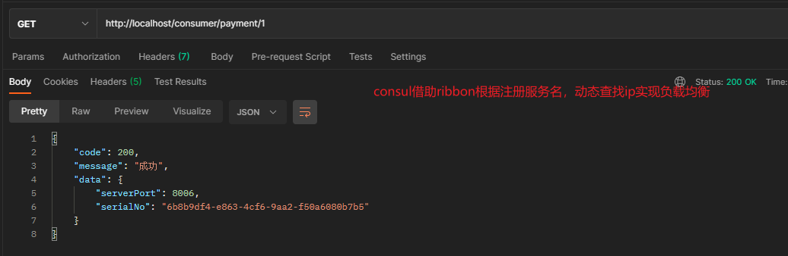

## 8.5 应用集群模式

***项目：test-cloud-provider-payment8006***


# 9 Eureka、Zookeeper和Consul的异同点


## 9.1 CAP

CAP理论关注粒度是数据，而不是整体系统设计的策略（不是AP就是CP）


+ Consistency（强一致性）
+ Availablity（可用性）
+ Parition tolerance（分区容错性）

## 9.2 经典CAP图

**AP架构（Eureka）**
当网络分区出现后，为了保证可用性，系统B可以返回旧值，保证系统的可用性。
结论：违背了一致性C的要求，只满足可用性和分区容错，即AP


**CP架构（zookeeper/consul）**

当网络分区出现后，为了保证一致性，就必须拒接请求，否则无法保证一致性
结论：违背了可用性A的要求，只满足一致性和分区容错，即CP


# 10 Ribbon负载均衡与服务调用

## 10.1 概述

Spring Cloud Ribbon是基于Netflix Ribbon实现的一套客户端       负载均衡的工具。

简单的说，Ribbon是Netflix发布的开源项目，主要功能是提供**客户端的软件负载均衡算法和服务调用**。Ribbon客户端组件提供一系列完善的配置项如连接超时，重试等。简单的说，就是在配置文件中列出Load Balancer（简称LB）后面所有的机器，Ribbon会自动的帮助你基于某种规则（如简单轮询，随机连接等）去连接这些机器。我们很容易使用Ribbon实现自定义的负载均衡算法。

**官网资料：**https://github.com/Netflix/ribbon/wiki/Getting-Started

由于Ribbon也进入了维护模式，以后的替代为Spring Cloud LoadBalancer


## 10.2 能干嘛

Load Balance即负载均衡

**LB负载均衡(Load Balance)是什么?**
	简单的说就是将用户的请求平摊的分配到多个服务上，从而达到系统的HA（高可用）。
常见的负载均衡有软件Nginx，LVS，硬件 F5等。

**Ribbon本地负载均衡客户端 VS Nginx服务端负载均衡区别?**
	Nginx是服务器负载均衡，客户端所有请求都会交给nginx，然后由nginx实现转发请求。即负载均衡是由服务端实现的。Ribbon本地负载均衡，在调用微服务接口时候，会在注册中心上获取注册信息服务列表之后缓存到JVM本地，从而在本地实现RPC远程服务调用技术。

 可分为：

+ **集中式 Load Balance**

  ​	即在服务的消费方和提供方之间使用独立的LB设施(可以是硬件，如F5, 也可以是软件，如nginx), 由该设施负责把访问请求通过某种策略转发至服务的提供方。（中间件可以理解为**服务端**）

+ **进程内 Load Balance**

  ​	将**LB逻辑集成到消费方**，消费方从服务注册中心获知有哪些地址可用，然后自己再从这些地址中选择出一个合适的服务器。**Ribbon就属于进程内LB**，它只是一个类库，**集成于消费方进程**，消费方通过它来获取到服务提供方的地址。


 **总结：Ribbon就是负载均衡+RestTemplate**

## 10.3 Ribbon负载均衡演示


总结：Ribbon其实就是一个**软负载均衡的客户端组件**，他可以和其他所需请求的客户端结合使用，和eureka结合只是其中的一个实例。

### 10.3.1 依赖分析


### 10.3.2 RestTemplate

官网api文档：https://docs.spring.io/spring-framework/docs/5.2.2.RELEASE/javadoc-api/org/springframework/web/client/RestTemplate.html

主要方法是两种：

+ `getForObject()`和`getForEntity()`

  + getForObject()**返回对象为响应体中数据转化成的对象**，基本上可以理解为Json

    

  + getForEntity()**返回对象为ResponseEntity对象**，包含了响应中的一些重要信息，比如响应头、响应状态码、响应体等

    

+ `postForObject()`和`postForEntity()`

  + postForObject()返回类型同getForObject()
  + postForEntity()返回类型同getForEntity()

## 10.4 Ribbon核心组件IRule*

### 10.4.1 IRule （接口）

根据特定算法中从服务列表中选取一个要访问的服务，**Ribbon自带的算法**规则（IRule实现类）如下：

+ RoundRobinRule（轮询规则）
+ RandomRule（随机）
+ RetryRule（先按照RoundRobinRule的策略获取服务，如果获取服务失败则在指定时间内会进行重试，获取可用的服务）
+ WeightedResponseTimeRule（对RoundRobinRule的扩展，响应速度越快的实例选择权重越大，越容易被选择）
+ BestAvailableRule（会先过滤掉由于多次访问故障而处于断路器跳闸状态的服务，然后选择一个并发量最小的服务）
+ AvailabilityFilteringRule（先过滤掉故障实例，再选择并发较小的实例）
+ ZoneAvoidanceRule（默认规则,复合判断server所在区域的性能和server的可用性选择服务器）


### 10.4.2 替换规则

以Eureka项目中**cloud-consumer-order80**为例

#### 10.4.2.1 规则配置细节

官方文档明确给出了警告：
这个**自定义配置类不能放在@ComponentScan所扫描的当前包下以及子包下**，否则我们自定义的这个配置类就会被**所有[@RibbonClients](https://github.com/RibbonClients)共享**，达不到特殊化定制的目的了。

> 因为一个客户端可以使用连接多个微服务
>
> ```java
> @RibbonClient(name = "cloud-payment-service",configuration = MySelfRule.class)
> //区别于
> @RibbonClients(
>     //放在包扫描外面，不同微服务ribbon使用不同的策略
>     //放在包扫描内，不同微服务ribbon使用相同的策略
> 	@RibbonClient(name = "cloud-payment1-service",configuration = RandomRule.class)
>     @RibbonClient(name = "cloud-payment2-service",configuration = MySelfRule.class)
> )
> ```


#### 10.4.2.2 新建package

+ 项目包：`com.ly.springcloud`
+ ribbon特殊规则包：`com.ly.myrule`

#### 10.4.2.3 创建配置类

```java
package com.ly.myrule;

import com.netflix.loadbalancer.IRule;
import com.netflix.loadbalancer.RandomRule;
import org.springframework.context.annotation.Bean;
import org.springframework.context.annotation.Configuration;

/**
 * FileName:MySelfRule.class
 * Author:ly
 * Date:2022/12/20 0020
 * Description: 自定义ribbon负载均衡选择服务器的规则（不与主项目同包com.ly.springcloud）
 */
@Configuration
public class MySelfRule {

    @Bean
    //组件RandomRule放入的不是spring的上下文，而是ribbon自己的上下文
    public IRule myRule(){
        //给ioc容器加入随机组件
        return new RandomRule();
    }
}
```

#### 10.4.2.4 主启动类加@RibbonClient注解

```java
@EnableDiscoveryClient
@EnableEurekaClient
@SpringBootApplication
//名字必须和controller中调用的一样才有效果，否则还是默认的
//	所以不随spring容器初始化而创建，仅在调用负载均衡服务时创建
@RibbonClient(name = "cloud-payment-service",configuration = {MySelfRule.class})
public class OrderMain80 {

    public static void main(String[] args) {
        SpringApplication.run(OrderMain80.class, args);
    }
}
```

#### 10.4.2.5 测试

先后启动Eureka集群，provider集群8001，8002和consumer80

参考连接：https://cloud.tencent.com/developer/article/2150851?from=15425


## 10.5 Ribbon负载均衡算法

### 10.5.1 原理

负载均衡算法：

+ **rest接口第几次请求数 % 服务器集群总数量 = 实际调用服务器位置下标  **
+ 每次服务重启动后rest接口计数从1开始。

```java
List\<ServiceInstance> instances = discoveryClient.getInstances("CLOUD-PAYMENT-SERVICE");

如：   List [0] instances = 127.0.0.1:8002
　　　List [1] instances = 127.0.0.1:8001

8001+ 8002 组合成为集群，它们共计2台机器，集群总数为2， 按照轮询算法原理：

当总请求数为1时： 1 % 2 =1 对应下标位置为1 ，则获得服务地址为127.0.0.1:8001
当总请求数位2时： 2 % 2 =0 对应下标位置为0 ，则获得服务地址为127.0.0.1:8002
当总请求数位3时： 3 % 2 =1 对应下标位置为1 ，则获得服务地址为127.0.0.1:8001
当总请求数位4时： 4 % 2 =0 对应下标位置为0 ，则获得服务地址为127.0.0.1:8002
如此类推......
```

### 10.5.2 源码

```JAVA
//com.netflix.loadbalancer.RoundRobinRule

//创建类时
public RoundRobinRule() {
        nextServerCyclicCounter = new AtomicInteger(0);//设置原子数
    }

//核心源码 由choose()调用
 private int incrementAndGetModulo(int modulo) {
     //这里用的是cas+自旋锁
        for (;;) {
            int current = nextServerCyclicCounter.get();
            int next = (current + 1) % modulo;
            //CAS有3个操作数，内存值V，旧的预期值A，要修改的新值B。当且仅当预期值A和内存值V相同时，将内存值V修改为B，否则什么都不做。
            if (nextServerCyclicCounter.compareAndSet(current, next))
                return next;
        }
    }
```

> CAS：Compare and Swap, 翻译成比较并交换。
>
> java.util.concurrent包中借助CAS实现了区别于synchronouse同步锁的一种乐观锁，使用这些类在多核CPU的机器上会有比较好的性能.
>
> ```java
> //java.util.concurrent.atomic.AtomicInteger
> public final boolean compareAndSet(int expect, int update) {
>     /*
>     	compareAndSet()有3个操作数，内存值valueOffset，旧的预期值expect，要修改的新值update。当且仅当预期值expect和内存值valueOffset相同时，将内存值valueOffset修改为update，否则什么都不做。
>     */
>         return unsafe.compareAndSwapInt(this, valueOffset, expect, update);
>     }
> ```
>
> JUC视频连接：https://www.bilibili.com/video/BV1ar4y1x727/?vd_source=bd522cbca55860eb7b29232fb02c02bd

### 10.5.3 ==>自定义轮询算法和LoadBalancer负载均衡器*==

#### 10.5.3.1 视频写法 

原理借助cloud包下`@EnableDiscoveryClient`注解通过服务名，获取所有实例的环境信息（ip:port），然后自定义负载均衡器再实现轮询。

+ 去掉配置类中组件RestTemplate的@LoadBalanced注解

  ```java
  @Bean
  //@LoadBalanced //否则无法直接识别eruka的服务名
  public RestTemplate restTemplate() {
      return new RestTemplateBuilder().build();
  }
  ```

+ 自定义负载均衡器规范（接口）

  ```java
  package com.ly.springcloud.lb;
  
  import org.springframework.cloud.client.ServiceInstance;
  import java.util.List;
  
  public interface LoadBalancer {
  
      /**
       * 从指定服务中的所有实例中，按照自定义轮询规则取出 实例
       * @param serviceInstances 指定服务名的所有在线实例
       * @return 按照自定义轮询规则取出 可用的实例
       */
      ServiceInstance getInstance(List<ServiceInstance> serviceInstances);
  }
  ```

+ 自定义负载均衡器实现类

  ```java
  package com.ly.springcloud.lb.impl;
  
  import com.ly.springcloud.lb.LoadBalancer;
  import lombok.extern.slf4j.Slf4j;
  import org.springframework.cloud.client.ServiceInstance;
  import org.springframework.stereotype.Component;
  
  import java.util.List;
  import java.util.concurrent.atomic.AtomicInteger;
  
  /**
   * FileName:MyRoundLoadBalancer.class
   * Author:ly
   * Date:2022/12/20 0020
   * Description: 基于自定义轮询规则的负载均衡器
   */
  @Slf4j
  @Component
  public class MyRoundLoadBalancer implements LoadBalancer {
      private final AtomicInteger atomicInteger;
  
      public MyRoundLoadBalancer() {
          this(new AtomicInteger(0));
      }
  
      public MyRoundLoadBalancer(AtomicInteger atomicInteger) {
          this.atomicInteger = atomicInteger;
      }
  
      /**
       * 自定义轮询的核心算法(cas+自旋锁)
       * @param instances 所有在线的服务个数
       * @return 实例的下标
       */
      public int getAndIncrementIndex(int instances){
          int current;
          int next;
  		//下面循环的算法没有问题，每次都执行一次，不循环
          do {
              current = atomicInteger.get() > Integer.MAX_VALUE ? 0 : atomicInteger.get();
              next = (current + 1) % instances;
          } while (!atomicInteger.compareAndSet(current,next));
          log.info("获取到实例下标为:{}",next);
          return next;
      }
  
      @Override
      public ServiceInstance getInstance(List<ServiceInstance> serviceInstances) {
  
          return serviceInstances.get(
                  getAndIncrementIndex(serviceInstances.size())
          );
      }
  }
  ```

+ controller层调用

  ```java
  @Slf4j
  @RestController
  public class OrderController {
      public static final String PAYMENT_URL = "http://cloud-payment-service";
      public static final String APPLICATION_NAME = "cloud-payment-service";
      @Autowired
      private RestTemplate restTemplate;
      @Autowired //根据服务名获取所有实例信息
      private DiscoveryClient discoveryClient;
      @Autowired //自定义负载均衡器
      private LoadBalancer loadBalancer;
  
      @GetMapping("/consumer/payment/lb/get/{id}")
      public CommonResult<Payment> getPaymentByIdOfLB(@PathVariable("id") Long id){
  
          ServiceInstance instance = loadBalancer.getInstance(
                  discoveryClient.getInstances(APPLICATION_NAME)
          );
  
          return restTemplate.getForObject(
                  instance.getUri() + "/payment/get/" + id, CommonResult.class);
      }
  }
  ```

+ 测试

  

#### 10.5.3.2 自己的写法

原理借助cloud包下`@EnableDiscoveryClient`注解通过服务名，获取所有实例的环境信息（ip:port），然后通过默认的LoadBalancerInterceptor拦截器使用自定义轮询规则进行轮询。 （和10.4.2替换步骤完全一样）

+ ioc容器加入RestTemplate，并开启@LoadBalanced

+ 创建自定义轮询规则

  ```java
  package com.ly.myrule;
  
  import com.netflix.client.config.IClientConfig;
  import com.netflix.loadbalancer.AbstractLoadBalancerRule;
  import com.netflix.loadbalancer.ILoadBalancer;
  import com.netflix.loadbalancer.Server;
  import lombok.extern.slf4j.Slf4j;
  
  import java.util.concurrent.atomic.AtomicInteger;
  
  /**
   * FileName:MyRoundStrategy.class
   * Author:ly
   * Date:2022/12/20 0020
   * Description:
   */
  @Slf4j
  public class MyRoundStrategy extends AbstractLoadBalancerRule {
      private final AtomicInteger atomicInteger;
  
      public MyRoundStrategy() {
          this(new AtomicInteger(0));
      }
  
      public MyRoundStrategy(AtomicInteger atomicInteger) {
          this.atomicInteger = atomicInteger;
      }
  
      public MyRoundStrategy(ILoadBalancer lb) {
          this();
          setLoadBalancer(lb);
      }
  
      /**
       * 自定义轮询的核心算法(cas+自旋锁)
       * @param instances 所有在线的服务个数
       * @return 实例的下标
       */
      public int getAndIncrementIndex(int instances,Object key){
          int current;
          int next;
  
          do {
              current = atomicInteger.get() > Integer.MAX_VALUE ? 0 : atomicInteger.get();
              next = (current + 1) % instances;
          } while (!atomicInteger.compareAndSet(current,next));
          log.info("获取到实例下标为:{}",next);
          return next;
      }
  
      @Override
      public void initWithNiwsConfig(IClientConfig iClientConfig) {
  
      }
      public Server choose(ILoadBalancer lb,Object key) {
          int index = getAndIncrementIndex(lb.getAllServers().size(), key);
          return lb.getAllServers().get(index);
      }
      @Override
      public Server choose(Object key) {
          //log.info("key={}",key);
          return choose(getLoadBalancer(),key);
      }
  }
  ```

+ 修改配置类（主启动类包外）

  ```java
  package com.ly.myrule;
  
  import com.netflix.loadbalancer.IRule;
  import lombok.extern.slf4j.Slf4j;
  import org.springframework.context.annotation.Bean;
  import org.springframework.context.annotation.Configuration;
  
  /**
   * FileName:MySelfRule.class
   * Author:ly
   * Date:2022/12/20 0020
   * Description: 自定义ribbon负载均衡选择服务器的规则（不与主项目同包）
   */
  @Slf4j
  @Configuration
  public class MySelfRule {
  
      //组件RandomRule放入的不是spring的上下文，而是ribbon自己的上下文，所以不随spring容器初始化而创建，仅在调用负载均衡服务时创建
      @Bean
      public IRule myRoundRule(){
          //给ioc容器加入随机组件
          log.info("MyRoundStrategy 成功加入ribbon ioc。。。");
          return new MyRoundStrategy();
      }
  }
  ```

+ 主启动类开启@RibonCLient

  ```java
  @EnableDiscoveryClient
  @EnableEurekaClient
  @SpringBootApplication
  //服务名一定要和controller（使用的地方）中的一样，区分大小写
  @RibbonClient(name = "cloud-payment-service",configuration = MySelfRule.class)
  public class OrderMain80 {
  
      public static void main(String[] args) {
          SpringApplication.run(OrderMain80.class, args);
      }
  }
  ```

+ 测试

  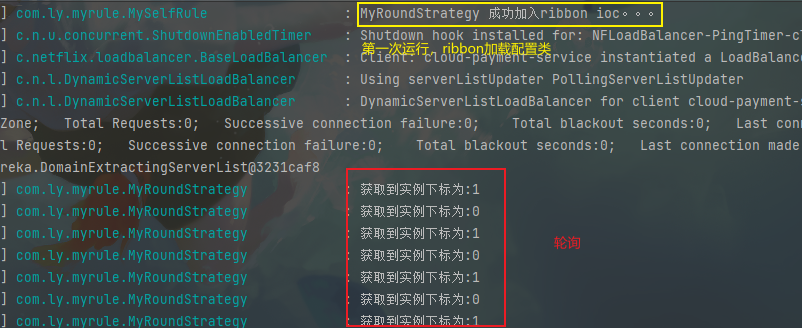

# 11  OpenFeign服务接口调用

## 11.1概述

​	**Spring Cloud官网地址：**https://cloud.spring.io/spring-cloud-static/Hoxton.SR1/reference/htmlsingle/#spring-cloud-openfeign

​	**github官方地址：**https://github.com/spring-cloud/spring-cloud-openfeign

​	Feign是一个声明式WebService客户端。使用Feign能**让编写Web Service客户端更加简单（即consumer端）**。
​	它的使用方法是**定义一个服务接口（和provider提供的controller完全一样）然后在上面添加注解**。Feign也支持可拔插式的编码器和解码器。Spring Cloud对Feign进行了封装，使其支持了Spring MVC标准注解和HttpMessageConverters。Feign可以与Eureka和Ribbon组合使用以支持负载均衡


### 11.1.1 Feign能干什么

Feign旨在使编写Java Http客户端变得更容易。
前面在使用Ribbon+RestTemplate时，利用RestTemplate对http请求的封装处理，形成了一套模版化的调用方法。但是在实际开发中，由于对服务依赖的调用可能不止一处，**往往一个接口会被多处调用，所以通常都会针对每个微服务自行封装一些客户端类来包装这些依赖服务的调用**。所以，Feign在此基础上做了进一步封装，由他来帮助我们定义和实现依赖服务接口的定义。在Feign的实现下，**我们只需创建一个接口并使用注解的方式来配置它(比如Dao接口上面标注Mapper注解,现在是一个微服务接口上面标注一个Feign注解即可)，即可完成对服务提供方的接口绑定**，简化了使用Spring cloud Ribbon时，自动封装服务调用客户端的开发量。

**Feign集成了Ribbon**，利用Ribbon维护了Payment的服务列表信息，并且通过轮询实现了客户端的负载均衡。而与Ribbon不同的是，通过feign只需要定义服务绑定接口且以声明式的方法，优雅而简单的实现了服务调用


### 11.1.2 OpenFeign和Feign的区别


## 11.2 OpenFeign使用步骤

### 11.2.1 创建新Consumer


### 11.2.2 修改pom文件

```xml
<dependencies>
    <!--openfeign-->
    <dependency>
        <groupId>org.springframework.cloud</groupId>
        <artifactId>spring-cloud-starter-openfeign</artifactId>
    </dependency>
    <!--eureka client-->
    <dependency>
        <groupId>org.springframework.cloud</groupId>
        <artifactId>spring-cloud-starter-netflix-eureka-client</artifactId>
    </dependency>
    <!-- 引入自己定义的api通用包，可以使用Payment支付Entity -->
    <dependency>
        <groupId>com.ly.springcloud</groupId>
        <artifactId>cloud-api-commons</artifactId>
        <version>${project.version}</version>
    </dependency>
    <!--web-->
    <dependency>
        <groupId>org.springframework.boot</groupId>
        <artifactId>spring-boot-starter-web</artifactId>
    </dependency>
    <dependency>
        <groupId>org.springframework.boot</groupId>
        <artifactId>spring-boot-starter-actuator</artifactId>
    </dependency>
    <!--一般基础通用配置-->
    <dependency>
        <groupId>org.projectlombok</groupId>
        <artifactId>lombok</artifactId>
        <optional>true</optional>
    </dependency>
    <dependency>
        <groupId>org.springframework.boot</groupId>
        <artifactId>spring-boot-starter-test</artifactId>
        <scope>test</scope>
    </dependency>
</dependencies>
```

### 11.2.3 修改yaml文件

```yaml
server:
  port: 80

spring:
  application:
    name: cloud-order-service
eureka:
  client:
    fetch-registry: true
    service-url:
      defaultZone: http://eureka7001.com:7001/eureka/,http://eureka7002.com:7002/eureka/
    register-with-eureka: true
```

### 11.2.4 创建主启动类

```java
@EnableEurekaClient//加不加都可以，都会自动注册到eureka中，这是因为自动配置类的效果
@EnableFeignClients
@SpringBootApplication
public class OrderFeignMain80 {
    public static void main(String[] args){
      SpringApplication.run(OrderFeignMain80.class, args);
    }
}
```

> @EnableEurekaClient加不加都可以的原因： https://blog.csdn.net/sunxy24/article/details/105686511

### 11.2.5 ==创建Openfeign接口*==

<font color='red)***最重要：使用OpenFeign的接口（PaymentFeignService），内部函数定义的返回值必须和provider的controller返回值完全一样才行。***</font>


```java
package com.ly.springcloud.service;

import com.ly.springcloud.entities.CommonResult;
import com.ly.springcloud.entities.Payment;
import org.springframework.cloud.openfeign.FeignClient;
import org.springframework.stereotype.Component;
import org.springframework.web.bind.annotation.GetMapping;
import org.springframework.web.bind.annotation.PathVariable;

/**
 * FileName：PaymentFeignService.java
 * Author：Ly
 * Date：2022/12/20
 * Description： 与Provider端的service端（实际是controller）接口完全一样的feign接口,而且必须加入ioc容器方便使用
 */
//@Component//不需要放入容器中，因为openfeign会自动实现当前类并放入容器中，可见不需要当前类
@FeignClient(name = "cloud-payment-service")//provider服务名
public interface PaymentFeignService {

    /**
     * 对应provider端Service接口方法，OpenFeign可以识别Springmvc注解（相当于生产端的controller和service层合并）
     *      返回值必须和service对应的controller的返回值完全一样，否则会导致数据无法封装为null
     * @param payment 参数对应的实体类
     * @return  结果集
     */
    @GetMapping("/payment/create")
    CommonResult create(Payment payment);

    /**
     * 相当于provider生产端的controller和service层合并
     *      返回值必须和service对应的controller的返回值完全一样，否则会导致数据无法封装为null
     *      |比如provider的返回值是 CommonResult|
     *      |我写 CommonResult<Payment> 错     |
     *      |    Payment 错                    |
     * @param id 查询id
     * @return 结果集
     */
    @GetMapping("/payment/get/{id}")
    CommonResult getPaymentById(@PathVariable("id") Long id);
}
```

### 11.2.6 创建controller

```java
@Slf4j
@RestController
public class OrderFeignController {

    @Autowired//就和mybatis的mapper接口一样的用法
    private PaymentFeignService paymentFeignService;

    @GetMapping("/consumer/payment/create")
    public CommonResult create(Payment payment) {
        log.info("consumer 接收到一条新增payment消息 serial={}",payment.getSerial());
        return paymentFeignService.create(payment);

    }

    @GetMapping("/consumer/payment/get/{id}")
    //openfeign接口函数返回值类型必须和 provider的对应controller方法返回值类型完全一样
    public CommonResult getPaymentById(@PathVariable("id") Long id){
        return paymentFeignService.getPaymentById(id);
    }
}
```

### 11.2.7 测试


## 11.3 OpenFeign超时控制

openfeign默认超时时间为1秒钟，但是对于某些provider提供的接口处理很耗费时间，那么此时就会产生超时。

### 11.3.1 feign超时情况

+ 关掉Provider 8002服务，开启eureka集群和provider8001服务

+ provider8001服务新增接口功能，表示当前业务处理耗时（记得重启服务）

  ```java
  //provider端8001 controller
  @GetMapping("/payment/feign/timeout")
  public String paymentFeignTimeout() throws InterruptedException {
      //模拟耗时业务
      TimeUnit.SECONDS.sleep(3);
      return serverPort;
  }
  ```

+ 消费者端建立对应openfeign函数

  ```java
  //消费者端 openfeign接口
  @Component
  @FeignClient(name = "cloud-payment-service")//provider服务名
  public interface PaymentFeignService {
  
      @GetMapping("/payment/create")
      CommonResult create(Payment payment);
  
      @GetMapping("/payment/get/{id}")
      CommonResult getPaymentById(@PathVariable("id") Long id);
  
      /**
       * 模拟业务端复杂耗时业务
       * @return 结果
       */
      @GetMapping("/payment/feign/timeout")
      String paymentFeignTimeout();
  }
  ```

+ 消费者端调用controller

  ```java
  @GetMapping("/consumer/payment/feign/timeout")
  public String paymentFeignTimeout(){
      return paymentFeignService.paymentFeignTimeout();
  }
  ```

+ 测试（预期出现超时错误）

  

### 11.3.2 设置openfeign的超时时间

首先要明确openfeign底层还是Ribbon+RestTemplate，只是对其做了一层封装。

+ 配置文件修改Ribbon的超时时间

  ```yaml
  #设置feign客户端超时时间(OpenFeign默认支持ribbon)
  ribbon:
    #指的是建立连接后从服务器读取到可用资源所用的时间
    ReadTimeout: 5000
    #指的是建立连接所用的时间，适用于网络状况正常的情况下,两端连接所用的时间
    ConnectTimeout: 5000
  ```

+ 测试

  

## 11.4 OpenFeign日志打印功能

​	Feign 提供了日志打印功能，我们可以通过配置来调整日志级别，从而了解 Feign 中 Http 请求的细节。说白了就是**对Feign接口（接口类，不是controller）的调用情况进行监控和输出**

### 11.4.1 OpenFeign日志级别

+ `NONE`：默认的，不显示任何日志；
+ `BASIC`：仅记录请求方法、URL、响应状态码及执行时间；
+ `HEADERS`：除了 BASIC 中定义的信息之外，还有请求和响应的头信息；
+ `FULL`：除了 HEADERS 中定义的信息之外，还有请求和响应的正文及元数据。


### 11.4.2 使用步骤

+ 通过配置类，给ioc容器中加入组件日志等级

  ```java
  @Configuration
  public class OpenFeignConfig {
      
      @Bean
      public Logger.Level openFeignLogLevel() {
          //需要什么等级的日志，就将该等级对应的枚举类加入ioc容器
          return Logger.Level.FULL;
      }
  }
  ```

+ 配置文件中，配置对那个openfeign接口开启日志打印

  ```yaml
  # 这是springboot的配置
  logging:
    level: # debug 直接指定当前项目下所有类的日志等级 
      # 通过指定类名（最小单位，类 ），表明某一类的日志等级（springboot功能）
      com.ly.springcloud.service.PaymentFeignService: debug
  ```

+ 测试

  

# 12 Hystrix断路器

官网连接：https://github.com/Netflix/Hystrix/wiki/How-To-Use

## 12.1 概述

### 12.1.1 分布式系统面临的问题

​	复杂分布式体系结构中的应用程序有数十个依赖关系，每个依赖关系在某些时候将不可避免地失败。
​	多个微服务之间调用的时候，假设微服务A调用微服务B和微服务C，微服务B和微服务C又调用其它的微服务，这就是所谓的“**扇出**”。如果扇出的链路上某个微服务的调用响应时间过长或者不可用，对微服务A的调用就会占用越来越多的系统资源，进而引起系统崩溃，所谓的“雪崩效应”。

​	对于高流量的应用来说，单一的后端依赖可能会导致所有服务器上的所有资源都在几秒钟内饱和。比失败更糟糕的是，这些应用程序还可能导致服务之间的延迟增加，备份队列，线程和其他系统资源紧张，导致整个系统发生更多的级联故障。这些都表示需要对故障和延迟进行隔离和管理，以便单个依赖关系的失败，不能取消整个应用程序或系统。
所以，
通常当你发现一个模块下的某个实例失败后，这时候这个模块依然还会接收流量，然后这个有问题的模块还调用了其他的模块，这样就会发生级联故障，或者叫雪崩


### 12.1.2 Hystrix

​	Hystrix是一个用于处理分布式系统的**延迟**和**容错**的开源库，在分布式系统里，许多依赖不可避免的会调用失败，比如超时、异常等，Hystrix能够保证在一个依赖出问题的情况下，**不会导致整体服务失败，避免级联故障**，以提高分布式系统的弹性。

​	断路器”本身是一种开关装置，当某个服务单元**发生故障**之后，通过断路器的故障监控（类似熔断保险丝），**向调用方返回一个符合预期的、可处理的备选响应（FallBack），而不是长时间的等待或者抛出调用方无法处理的异常**，这样就保证了服务调用方的线程不会被长时间、不必要地占用，从而避免了故障在分布式系统中的蔓延，乃至雪崩。

### 12.1.3 Hystrix作用

+ 服务降级
+ 服务熔断
+ 实时级监控
+ 服务限流

## 12.2 Hystrix概念

<font color='red)***服务端和客户端都可以用Hystrix***</font>

### 12.2.1 服务降级

服务器忙，请稍后再试，不让客户端等待并立刻返回一个友好提示，fallback

出现服务降级的情况：

+ 程序运行异常
+ 超时
+ 服务熔断触发服务降级
+ 线程池/信号量打满也会引起服务降级

### 12.2.2 服务熔断

​	设置最大访问次数，多少次失败就开启熔断，直接拒绝方法，调用降级方法，返回友好提示，等服务恢复后，又可以慢慢恢复正常

### 12.2.3 服务限流

秒杀高并发等操作，严禁一窝蜂的过来拥挤，大家排队，一秒钟N个，有序进行

## 12.3 Hystrix案例

前提，单机版eureka7001服务（非集群），方便操作

### 12.3.1 基于Hystrix的provider 8001项目

#### 12.3.1.1 创建项目


#### 12.3.1.2 修改pom文件

```xml
<dependencies>
    <!--hystrix-->
    <dependency>
        <groupId>org.springframework.cloud</groupId>
        <artifactId>spring-cloud-starter-netflix-hystrix</artifactId>
    </dependency>
    <!--eureka client-->
    <dependency>
        <groupId>org.springframework.cloud</groupId>
        <artifactId>spring-cloud-starter-netflix-eureka-client</artifactId>
    </dependency>
    <!--web-->
    <dependency>
        <groupId>org.springframework.boot</groupId>
        <artifactId>spring-boot-starter-web</artifactId>
    </dependency>
    <dependency>
        <groupId>org.springframework.boot</groupId>
        <artifactId>spring-boot-starter-actuator</artifactId>
    </dependency>
    <dependency><!-- 引入自己定义的api通用包，可以使用Payment支付Entity -->
        <groupId>com.ly.springcloud</groupId>
        <artifactId>cloud-api-commons</artifactId>
        <version>${project.version}</version>
    </dependency>
    <dependency>
        <groupId>org.projectlombok</groupId>
        <artifactId>lombok</artifactId>
        <optional>true</optional>
    </dependency>
    <dependency>
        <groupId>org.springframework.boot</groupId>
        <artifactId>spring-boot-starter-test</artifactId>
        <scope>test</scope>
    </dependency>
</dependencies>
```

#### 12.3.1.3 修改配置文件

```yaml
server:
  port: 8001

spring:
  application:
    name: cloud-provider-hystrix-payment
eureka:
  client:
    register-with-eureka: true
    fetch-registry: true
    service-url:
      defaultZone: http://eureka7001.com:7001/eureka
```

#### 12.3.1.4 创建主启动类

```java
@EnableEurekaClient//可写可不写，默认开启
//@EnableHystrix //暂时不加，模拟出错（加在服务端或客户端都可以）
@SpringBootApplication
public class PaymentHystrixMain8001 {

    public static void main(String[] args){
      SpringApplication.run(PaymentHystrixMain8001.class, args);
    }
}
```

#### 12.3.1.5 service层

```java
public interface PaymentService {

    /**
     * 模拟服务正常业务
     * @return 结果
     */
    String ok();

    /**
     * 模拟服务会出错业务,此出采用《超时》
     *   1.运行异常
     *   2.超时
     *   3.服务熔断
     *   4.线程池满了
     * @return 结果
     */
    String failure();
}
```

实现类：

```java
@Slf4j
@Service
public class PaymentServiceImpl implements PaymentService {
    @Override
    public String ok() {
        log.info("模拟正常业务逻辑...");
        return "ok";
    }

    @Override
    public String failure() throws InterruptedException {
        log.info("模拟出错业务逻辑...");
        TimeUnit.SECONDS.sleep(3);
        return "ok";
    }
}
```

#### 12.3.1.6 controller层

```java
@RestController
public class PaymentController {

    @Resource
    private PaymentService paymentService;
    
    @GetMapping("/payment/hystrix/ok")
    public String ok() {
        return paymentService.ok();
    }

    @GetMapping("/payment/hystrix/failure")
    public String failure() throws InterruptedException {
        return paymentService.failure();
    }
}
```

#### 12.3.1.7  正常测试

正常测试均通过（未通过consumer端，直接访问provider接口）


#### 12.3.1.8 Jmeter高压测试

+ 创建线程组

  

  

+ 创建HTTP请求

  

  

+ 开启Jemeter

+ postman发送正常的请求，发现响应变慢了

  

​		tomcat的默认的工作线程数被打满 了，没有多余的线程来分解压力和处理，所以正常请求的就变慢了。

### 12.3.2 基于Hystrix的consumer 80项目

#### 12.3.2.1 创建项目


#### 12.3.2.2 修改pom文件

```xml
<dependencies>
    <!--openfeign-->
    <dependency>
        <groupId>org.springframework.cloud</groupId>
        <artifactId>spring-cloud-starter-openfeign</artifactId>
    </dependency>
    <!--hystrix-->
    <dependency>
        <groupId>org.springframework.cloud</groupId>
        <artifactId>spring-cloud-starter-netflix-hystrix</artifactId>
    </dependency>
    <!--eureka client-->
    <dependency>
        <groupId>org.springframework.cloud</groupId>
        <artifactId>spring-cloud-starter-netflix-eureka-client</artifactId>
    </dependency>
    <!-- 引入自己定义的api通用包，可以使用Payment支付Entity -->
    <dependency>
        <groupId>com.ly.springcloud</groupId>
        <artifactId>cloud-api-commons</artifactId>
        <version>${project.version}</version>
    </dependency>
    <!--web-->
    <dependency>
        <groupId>org.springframework.boot</groupId>
        <artifactId>spring-boot-starter-web</artifactId>
    </dependency>
    <dependency>
        <groupId>org.springframework.boot</groupId>
        <artifactId>spring-boot-starter-actuator</artifactId>
    </dependency>
    <!--一般基础通用配置-->
    <dependency>
        <groupId>org.projectlombok</groupId>
        <artifactId>lombok</artifactId>
        <optional>true</optional>
    </dependency>
    <dependency>
        <groupId>org.springframework.boot</groupId>
        <artifactId>spring-boot-starter-test</artifactId>
        <scope>test</scope>
    </dependency>
</dependencies>
```

#### 12.3.2.3 修改配置文件

```yaml
server:
  port: 80

eureka:
  client:
    register-with-eureka: false
    service-url:
      defaultZone: http://eureka7001.com:7001/eureka/
    fetch-registry: true

spring:
  application:
    name: payment-consumer-feign-hystrix-service
```

#### 12.3.2.4 创建主启动类

```java
@SpringBootApplication
//@EnableHystrix//暂时不使用。看看错误测试结果
@EnableFeignClients
public class OrderHystrixMain80 {
    public static void main(String[] args){
      SpringApplication.run(OrderHystrixMain80.class, args);
    }
}
```

#### 12.3.2.5 创建OpenFeign接口（Service层）

```java
package com.ly.springcloud.service;

import org.springframework.cloud.openfeign.FeignClient;
import org.springframework.web.bind.annotation.GetMapping;
//@Component//接口不必放在ioc容器中，因为feign会动态实现此接口放在ioc容器中
@FeignClient("cloud-provider-hystrix-payment")//注册到eureka的服务名
public interface PaymentHystrixService {
    //下面为对应的服务端的controller接口

    @GetMapping("/payment/hystrix/ok")
    String ok();

    @GetMapping("/payment/hystrix/failure")
    String failure();
}
```

#### 12.3.2.6 创建controller

```java
@RestController
public class OrderHystrixController {

    @Resource
    private PaymentHystrixService paymentHystrixService;

    @GetMapping("/consumer/payment/hystrix/failure")
    public String failure() {
        return paymentHystrixService.failure();
    }
    @GetMapping("/consumer/payment/hystrix/ok")
    public String ok() {
        return paymentHystrixService.ok();
    }
}
```

#### 12.3.2.7 测试（异常）

使用Jmeter测试，当并发线程达到2000时，调用客户端访问服务端的ok接口居然报错了：


### 12.3.3 服务故障出现原因

​	8001同一层次的其它接口服务被困死，因为tomcat线程池里面的工作线程已经被挤占完毕。80此时调用8001，客户端访问响应缓慢，转圈圈，严重的直接出现超时错误。

​	基于以上问题，所以需要服务降级，服务熔断和服务限流

### 12.3.4  对于故障的要求

+ 对方服务(8001)超时了，调用者(80)不能一直卡死等待，必须有服务降级
+ 对方服务(8001)宕机了，调用者(80)不能一直卡死等待，必须有服务降级
+ 对方服务(8001)OK，调用者(80)自己出故障或有自我要求（自己的等待时间小于服务提供者），自己处理降级

### 12.3.5 ==服务降级-解决方案*==

#### 12.3.5.1 服务端服务降级 `@HystrixCommand`

##### 12.3.5.1.1 超时（可以捕获）

首先规定，服务端运行业务逻辑运行超过2秒就是异常，代码中运行时3秒，则运行必然超时。

+ service层（provider端）业务逻辑

  ```java
  @Override
  public String failure() throws InterruptedException {
      log.info("线程：{}【开始】模拟出错业务逻辑service...",Thread.currentThread().getName());
      TimeUnit.SECONDS.sleep(3);
      log.info("线程：{}【结束】模拟出错业务逻辑service...",Thread.currentThread().getName());
      return "ok";
  }
  ```

+ 业务类（provider端）定义服务降级回调，并规定超时时间

  ```java
  /**
       *  当前controller方法，必须会运行3s，大于设置的2s峰值，就会回调fallbackMethod方法
       *      此之谓服务降级（降级到出错提示）
       *      注解@HystrixCommand 定义服务降级，会隔离tomcat的线程池单独使用一个额外的线程
       */
      @HystrixCommand(
              //定义失败的回调函数（ 必须是当前类中的函数）
              fallbackMethod = "failureHandler",
              //定义业务线程的属性(如最大运行时间,超过此时间就会触发业务降级回调failureHandler)
              commandProperties = @HystrixProperty(name = "execution.isolation.thread.timeoutInMilliseconds",value = "2000")
      )
      @GetMapping("/payment/hystrix/failure")
      public String failure() throws InterruptedException {
          log.info("线程：{} 正常业务逻辑controller：",Thread.currentThread().getName());
          return paymentService.failure();
      }
  
      public String failureHandler() {
          log.info("线程：{} 服务降级逻辑controller：",Thread.currentThread().getName());
          return "X﹏X";
      }
  ```

+ 主启动类（provider端）（放在配置类上效果一样）开启断路器（使用的是springcloud的公共注解`@EnableCircuitBreaker`）

  ```java
  @EnableEurekaClient//可写可不写，默认开启
  //@EnableHystrix
  @EnableCircuitBreaker//cloud提供的公共注解，会自动找到断路器的实现即Hystrix 效果等同于@EnableHystrix
  @SpringBootApplication
  public class PaymentHystrixMain8001 {
  
      public static void main(String[] args){
        SpringApplication.run(PaymentHystrixMain8001.class, args);
      }
  }
  ```

+ 测试

  + 先发送正常的业务请求

    

  + 再发生错误的业务请求

    

  + 比较后台日志

    <font color='red)***不仅做到了线程池隔离，而且超时后中断了错误业务service的继续执行***</font>

    

##### 12.3.5.1.2 运行异常（可以捕获）

+ service服务（provider端）

  ```java
  @Override
      public String exception() {
          log.info("线程：{}【开始】模拟异常业务逻辑service...",Thread.currentThread().getName());
          int i = 10 / 0;//运行异常
          log.info("线程：{}【结束】模拟异常业务逻辑service...",Thread.currentThread().getName());
          return "ok";
      }
  ```

+ controller层（provider端）调用及服务降级

  ```java
  public String failureHandler() {
      log.info("线程：{} 服务降级逻辑controller：",Thread.currentThread().getName());
      return "X﹏X";
  }
  //仅仅定义服务降级回调，当出现异常时自动调用
  @HystrixCommand(fallbackMethod = "failureHandler")
  @GetMapping("/payment/hystrix/exception")
  public String exception() {
      log.info("线程：{} 正常业务逻辑controller：",Thread.currentThread().getName());
      return paymentService.exception();
  }
  ```

+ 使用`@EnableCircuitBreaker`开启断路器（上面已开启）

+ 测试

  

  

#### 12.3.5.2 客户端服务降级

##### 12.3.5.2.1 ==客户端服务降级的情况*==

相对于服务端的超时导致的服务降级，客户端超时会有两种情况：

+ ***同服务端一样，超过了`@HystrixCommand`断路器设置的超时时间***
+ ***客户端特有的，超过了OpenFeign/Ribbon的超时时间（默认1s）***

总而言之都是规定时间内没有收到来自客户端的回应导致的超时，服务降级。

##### 12.3.5.2.2 超时（可以捕获）

客户端和服务端的要求会不同，所以客户端也需要服务降级功能。

+ 配置文件开启openfeign对hystrix断路器的支持

  ```yaml
  feign:
    hystrix:
      enabled: true
  ```

+ 程序开启断路器

  ```java
  @EnableHystrix//或者@EnableCircuitBreaker都可以
  @SpringBootApplication
  @EnableFeignClients
  public class OrderHystrixMain80 {
      public static void main(String[] args){
        SpringApplication.run(OrderHystrixMain80.class, args);
      }
  }
  ```

+ controller层

  ```java
  public String failureFallbackMethod() {
      log.info("客户端 [{}] 服务降级回调。",Thread.currentThread().getName());
      return "超时，请稍后再试！ ";
  }
  
  @HystrixCommand(
          fallbackMethod = "failureFallbackMethod",
          commandProperties = @HystrixProperty(name = "execution.isolation.thread.timeoutInMilliseconds",value = "2500")
  )
  @GetMapping("/consumer/payment/hystrix/failure")
  public String failure() {
      log.info("客户端 [{}] controller业务。",Thread.currentThread().getName());
      return paymentHystrixService.failure();
  }
  ```

+ 测试

  由于Ribbonm默认会对get请求进行1次重试（间隔1s默认），重试也算时间，为了准确特修改：

  ```yaml
  ribbon:
  #  ConnectTimeout: 50000 # 连接超时时间(ms)
  #  ReadTimeout: 50000 # 通信超时时间(ms)
    OkToRetryOnAllOperations: false # 是否对所有操作重试 默认为false
    MaxAutoRetriesNextServer: 0 # 同一服务不同实例的重试次数 默认为1
    MaxAutoRetries: 0 # 同一实例的重试次数 默认为0
  ```
  
  + 未设置openfeign（ribbon）的超时时间默认1s，设置服务端3s超时，客户端2.5s超时 （第一种情况）
  
    > ***客户端特有的，超过了OpenFeign/Ribbon的超时时间（默认1s）***
    >
    > 
    >
    > ```java
    > //客户端日志 重点看时间
    > 2022-12-22 16:27:33.617  INFO 12700 --- [rixController-9] c.l.s.controller.OrderHystrixController  : 客户端 [hystrix-OrderHystrixController-9] controller业务。
    > 2022-12-22 16:27:34.626  INFO 12700 --- [rixController-9] c.l.s.controller.OrderHystrixController  : 客户端 [hystrix-OrderHystrixController-9] 服务降级回调。
    > ```
    >
    > ```java
    > //服务端日志  （关闭get请求重试，则只有一个请求）
    > 2022-12-22 16:27:33.625  INFO 15152 --- [entController-9] c.l.s.controller.PaymentController       : 线程：hystrix-PaymentController-9 正常业务逻辑controller：
    > 2022-12-22 16:27:33.625  INFO 15152 --- [entController-9] c.l.s.service.impl.PaymentServiceImpl    : 线程：hystrix-PaymentController-9【开始】模拟出错业务逻辑service...
    > 2022-12-22 16:27:36.626  INFO 15152 --- [ HystrixTimer-3] c.l.s.controller.PaymentController       : 线程：HystrixTimer-3 服务降级逻辑controller：
    > ```
  
    
  
  + 设置openfeign（ribbon）的超时时间为5s，设置服务端3s超时，客户端2.5s超时 （第二种情况）
  
    > ***同服务端一样，超过了`@HystrixCommand`断路器设置的超时时间***
    >
    > 
    >
    > ```java
    > //客户端日志 重点看时间
    > 2022-12-22 16:32:06.315  INFO 6504 --- [rixController-2] c.l.s.controller.OrderHystrixController  : 客户端 [hystrix-OrderHystrixController-2] controller业务。
    > 2022-12-22 16:32:08.816  INFO 6504 --- [ HystrixTimer-1] c.l.s.controller.OrderHystrixController  : 客户端 [HystrixTimer-1] 服务降级回调。
    > ```
    >
    > ```java
    > //服务端
    > 2022-12-22 16:32:06.319  INFO 15152 --- [ntController-10] c.l.s.controller.PaymentController       : 线程：hystrix-PaymentController-10 正常业务逻辑controller：
    > 2022-12-22 16:32:06.320  INFO 15152 --- [ntController-10] c.l.s.service.impl.PaymentServiceImpl    : 线程：hystrix-PaymentController-10【开始】模拟出错业务逻辑service...
    > 2022-12-22 16:32:09.321  INFO 15152 --- [ HystrixTimer-2] c.l.s.controller.PaymentController       : 线程：HystrixTimer-2 服务降级逻辑controller：
    > ```

##### 12.3.5.2.3 运行异常（可以捕获）

同生产端

##### 12.3.5.2.4 ==特殊情况*==

​	如果**服务端超时了**，进行服务降级，但是**客户端既没超过`Ribbon`的超时时间，也没超过`Hystrix`的超时时间**，那么**客户端就不会超时**，也就不会触发客户端服务降级。但是**接收到**的结果还是**服务端超时结果**！

如：设置ribbon超时时间为5s，服务端超时时间为2s，客户端超时时间为3s，关闭ribbon的get请求重试功能

> 其实很好理解，客户端只是调用服务端的接口，返回的结果就是服务端处理后的内容，和客户端没有任何关系。


#### 12.3.5.3 问题1-代码膨胀

由于每一个业务测层方法都有一个兜底的回调fallback函数，并且此函数只能在本类中，这就导致fallback方法很多。

##### 12.3.5.3.1 ***解决方法：***

***使用注解`@DefaultProperties(defaultFallback = "")`定义公共/默认的fallback方法***

```java
@Slf4j
@RestController
//该注解放在服务端或客户端都可以，因为服务降级同时支持两端
@DefaultProperties(defaultFallback = "globalFallBack")
public class OrderHystrixController {

    @Resource
    private PaymentHystrixService paymentHystrixService;
	//指定fallback
    public String failureFallbackMethod() {
        log.info("客户端 [{}] 服务降级回调。",Thread.currentThread().getName());
        return "超时，请稍后再试！ ";
    }
	//默认全局fallback，必须是无参数
    public String globalFallBack() {
        log.info("【global fallback】 客户端 [{}] 出现异常",Thread.currentThread().getName());
        return "【global fallback】 失败，请稍后再试！ ";
    }
	
    @HystrixCommand( //指定服务降级方法，不会调用全局的fallback了
            fallbackMethod = "failureFallbackMethod",
            commandProperties = @HystrixProperty(name = "execution.isolation.thread.timeoutInMilliseconds",value = "3000")
    )
    @GetMapping("/consumer/payment/hystrix/failure")
    public String failure() {
        log.info("客户端 [{}] controller业务。",Thread.currentThread().getName());
        return paymentHystrixService.failure();
    }
    
    //加上@HystrixCommand 表示该方法会进行服务降级，不指定降级方法会自动使用@DefaultProperties定义的方法
    @HystrixCommand 
    @GetMapping("/consumer/payment/hystrix/global/failure")
    public String globalFailure() {
        int i = 10 / 0;
        return paymentHystrixService.ok();
    }
    
    //正常业务，不需要进行服务降级的
    @GetMapping("/consumer/payment/hystrix/ok")
    public String ok() {
        return paymentHystrixService.ok();
    }
}
```

##### 12.3.5.3.2 ***测试***


#### 12.3.5.4 问题2-逻辑混乱

由于每一个业务测层方法都有一个兜底的回调fallback函数，并且此函数只能在本类中，这就导致fallback方法很多，和业务逻辑混在一起就显得很混乱。

同时服务降级有客户端和服务端两种触发方式，如果不加以区分则不方便分辨出此次服务降级到底是服务端调用还是客户端。

##### 12.3.5.4.1 三种异常

+ 运行异常
+ 超时
+ 宕机

##### 12.3.5.4.2 针对客户端的服务降级

==*下面方法只能处理来自服务端的三种异常，无法处理客户端的异常*==

+ 创建类`PaymentFallbackService`实现openfeign接口`PaymentHystrixService`,并重写方法

  ```java
   /* Description: 继承openFeign接口，创建默认fallback方法（和@HysrixCommand的唯一区别就是方法名字）
   	其实就是默认回调函数，同上面的global方法
   */
  @Component //放入容器中别忘了
  public class PaymentFallbackService implements PaymentHystrixService{
      @Override
      public String ok() {//类实现保证了 本类
          return "openFeign的默认回调（服务端） ok方法降级";
      }
  
      @Override
      public String failure() {
          return "openFeign的默认回调（服务端） failure方法降级";
      }
  
      @Override
      public String exception() {
          return "openFeign的默认回调（服务端） exception方法降级";
      }
  }
  ```

+ 实现openfeign接口`PaymentHystrixService`指明服务端出现异常，默认采用的回调方法

  ```java
  @FeignClient(value = "cloud-provider-hystrix-payment",fallback = PaymentFallbackService.class)//注册到eureka的服务名
  public interface PaymentHystrixService {
      //下面为对应的服务端的controller接口
  
      @GetMapping("/payment/hystrix/ok")
      String ok();
  
      @GetMapping("/payment/hystrix/failure")
      String failure();
  
      @GetMapping("/payment/hystrix/exception")
      String exception();
  }
  ```

+ 开启openFeign的hystrix

  ```yaml
  ribbon:
    ConnectTimeout: 5000 # 连接超时时间(ms)
    ReadTimeout: 5000 # 通信超时时间(ms)
    OkToRetryOnAllOperations: false # 是否对所有操作重试 默认为false
    MaxAutoRetriesNextServer: 0 # 同一服务不同实例的重试次数 默认为1
    MaxAutoRetries: 0 # 同一实例的重试次数 默认为0
  
  # 由于开启了feign，则默认超时就是1s以feign的为准，上面配置了ribbon时间也没用
  feign:
    hystrix:
      enabled: true
  ```

  ##### 12.3.5.4.3 测试

  > ***服务端活着***
  >
  > + 测试没问题的openFeign中的ok方法（**正常执行**）
  >
  >   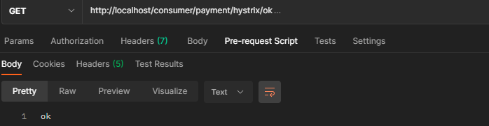
  >
  > + 服务端超时，客户端不超时
  >
  >   由于配置文件启动了`feign.hystrix.enabled=true`所以feign默认超时就是1s（feign优先），配置ribbon超时也没用。
  >
  >   所以修改服务端`/payment/hystrix/failure`接口对应的方法超时时间改为500ms，保证服务端超时，客户端不超时
  >
  >   
  >
  > + 客户端超时，不管服务端超没超时
  >
  >   
  >
  > + 
  >
  > ***服务端宕机***
  >
  > + 测试没问题的openFeign中的ok方法
  >
  >   
  >
  > + 测试有问题的
  >
  >   
  >
  > + 

### 12.3.6 ==服务熔断-解决方案*==

#### 12.3.6.1 熔断机制

微服务构建者对熔断的解释：https://martinfowler.com/bliki/CircuitBreaker.html

熔断机制是应对雪崩效应的一种微服务链路保护机制。当扇出链路的某个微服务出错不可用或者响应时间太长时会进行服务的降级，进而熔断该节点微服务的调用，快速返回错误的响应信息。<font color='red)*当检测到该节点微服务调用响应正常好，慢慢恢复链路调用*。</font>

在Spring Cloud框架里，熔断机制通过Hysrix实现。Hystrix会监控微服务调用的状况，当失败的调用到一定阈值，缺省是**5s内20次调用失败**，就会启动熔断机制。熔断机制的注解就是**`@HystrixCommand`**


#### 12.3.6.2 熔断实操

为了便于理解，本次操作以生产者单服务**cloud-provider-hystrix-payment8001**进行演示。

##### 12.3.6.2.1 修改service层

本次操作，将服务降级全放在service层上，controller仅处理请求。

```java
public interface PaymentService {

    /**
     * 模拟服务熔断
     * @param id id
     * @return 返回
     */
    String paymentCircuitBreaker(Integer id);
}
```

***原理：***

+ 10s访问量达到20次，且发生错误的大于60%触发服务熔断，那么接下来的20s内所有请求都会直接触发服务降级。
+ **超过20s后，断路器进入半开状态。如果*此时紧接着调用服务，但服务调用==失败==会重置为失败状态*（open）此时短路器会继续断开。如果此时紧接着调用服务，且服务调用==成功==会重置为成功状态（close），并开始下一轮最近10s的请求阈值和失败百分比比较。**

```java
@Slf4j
@Service
public class PaymentServiceImpl implements PaymentService {
    
    //=========服务熔断
    @HystrixCommand(
        fallbackMethod = "paymentCircuitBreaker_fallback",
        commandProperties = {
            //是否启用断路器/服务熔断
            @HystrixProperty(name = "circuitBreaker.enabled",value = "true"),
            //触发断路后，该时间段内（20s）的任何请求（这一url，不管是否正确）都会被熔断即直接调用fallback返回
            @HystrixProperty(name = "circuitBreaker.sleepWindowInMilliseconds",value = "20000"),
            
            
            //规定时间内统计，默认是最近10s 即快照时间窗 【下面requestVolumeThreshold和errorThresholdPercentage的规定时间就是这个】
            @HystrixProperty(name = "metrics.rollingStats.numBuckets",value = "10"),
            //指定时间段内（默认10s）请求超过次阈值，熔断器（开关）将从close到open状态
            @HystrixProperty(name = "circuitBreaker.requestVolumeThreshold",value = "10"),
            //指定时间段内（默认10s）请求次数的失败率（如异常）百分比达到此阈值，开启熔断
            @HystrixProperty(name = "circuitBreaker.errorThresholdPercentage",value = "60"),
        })
    @Override
    public String paymentCircuitBreaker(Integer id)
    {
        if(id < 0) throw new RuntimeException("******id 不能负数");
        String serialNumber = IdUtil.simpleUUID();
        return Thread.currentThread().getName()+"\t"+"调用成功，流水号: " + serialNumber;
    }
    
    public String paymentCircuitBreaker_fallback(Integer id)
    {
        return "id 不能负数，请稍后再试，/(ㄒoㄒ)/~~   id: " +id;
    }
}
```

##### 12.3.6.2.2 修改controller

```java
//====服务熔断
@GetMapping("/payment/circuit/{id}")
public String paymentCircuitBreaker(@PathVariable("id") Integer id)
{
    String result = paymentService.paymentCircuitBreaker(id);
    log.info("****result: "+result);
    return result;
}
```

##### 12.3.6.2.3 测试

+ 不熔断

  + 访问正确的，未触发服务降级

    

  + 访问异常的，触发服务降级

    

+ 熔断

  **10s访问量达到20次，且发生错误的大于60%触发服务熔断，那么接下来的20s内所有请求都会直接触发服务降级。**

  **超过20s后，断路器进入半开状态。如果*此时紧接着调用服务，但服务调用==失败==会重置为失败状态*（open）此时短路器会继续断开。如果此时紧接着调用服务，且服务调用==成功==会重置为成功状态（close），并开始下一轮最近10s的请求阈值和失败百分比比较**

  + 访问正确的，触发服务降级

    

  + 访问异常，触发服务降级

    

##### 12.3.6.2.4 ==断路器参数配置*==

断路器的所有默认参数及其配置字段都在类`com.netflix.hystrix.HystrixCommandProperties`

官方文档：https://github.com/Netflix/Hystrix/wiki/Configuration

```java
//类名com.netflix.hystrix.HystrixCommandProperties

//========================All
@HystrixCommand(
    fallbackMethod = "str_fallbackMethod",
    groupKey = "strGroupCommand",
    commandKey = "strCommand",
    threadPoolKey = "strThreadPool",

    commandProperties = {
        // 设置隔离策略，THREAD 表示线程池 SEMAPHORE：信号池隔离
        @HystrixProperty(name = "execution.isolation.strategy", value = "THREAD"),
        // 当隔离策略选择信号池隔离的时候，用来设置信号池的大小（最大并发数）
        @HystrixProperty(name = "execution.isolation.semaphore.maxConcurrentRequests", value = "10"),
        // 配置命令执行的超时时间
        @HystrixProperty(name = "execution.isolation.thread.timeoutinMilliseconds", value = "10"),
        // 是否启用超时时间
        @HystrixProperty(name = "execution.timeout.enabled", value = "true"),
        // 执行超时的时候是否中断
        @HystrixProperty(name = "execution.isolation.thread.interruptOnTimeout", value = "true"),
        // 执行被取消的时候是否中断
        @HystrixProperty(name = "execution.isolation.thread.interruptOnCancel", value = "true"),
        // 允许回调方法执行的最大并发数
        @HystrixProperty(name = "fallback.isolation.semaphore.maxConcurrentRequests", value = "10"),
        // 服务降级是否启用，是否执行回调函数
        @HystrixProperty(name = "fallback.enabled", value = "true"),
        // 是否启用断路器
        @HystrixProperty(name = "circuitBreaker.enabled", value = "true"),
        // 该属性用来设置在滚动时间窗中，断路器熔断的最小请求数。例如，默认该值为 20 的时候，
        // 如果滚动时间窗（默认10秒）内仅收到了19个请求， 即使这19个请求都失败了，断路器也不会打开。
        @HystrixProperty(name = "circuitBreaker.requestVolumeThreshold", value = "20"),
        // 该属性用来设置在滚动时间窗中，表示在滚动时间窗中，在请求数量超过
        // circuitBreaker.requestVolumeThreshold 的情况下，如果错误请求数的百分比超过50,
        // 就把断路器设置为 "打开" 状态，否则就设置为 "关闭" 状态。
        @HystrixProperty(name = "circuitBreaker.errorThresholdPercentage", value = "50"),
        // 该属性用来设置当断路器打开之后的休眠时间窗。 休眠时间窗结束之后，
        // 会将断路器置为 "半开" 状态，尝试熔断的请求命令，如果依然失败就将断路器继续设置为 "打开" 状态，
        // 如果成功就设置为 "关闭" 状态。
        @HystrixProperty(name = "circuitBreaker.sleepWindowinMilliseconds", value = "5000"),
        // 断路器强制打开
        @HystrixProperty(name = "circuitBreaker.forceOpen", value = "false"),
        // 断路器强制关闭
        @HystrixProperty(name = "circuitBreaker.forceClosed", value = "false"),
        // 滚动时间窗设置，该时间用于断路器判断健康度时需要收集信息的持续时间
        @HystrixProperty(name = "metrics.rollingStats.timeinMilliseconds", value = "10000"),
        // 该属性用来设置滚动时间窗统计指标信息时划分"桶"的数量，断路器在收集指标信息的时候会根据
        // 设置的时间窗长度拆分成多个 "桶" 来累计各度量值，每个"桶"记录了一段时间内的采集指标。
        // 比如 10 秒内拆分成 10 个"桶"收集这样，所以 timeinMilliseconds 必须能被 numBuckets 整除。否则会抛异常
        @HystrixProperty(name = "metrics.rollingStats.numBuckets", value = "10"),
        // 该属性用来设置对命令执行的延迟是否使用百分位数来跟踪和计算。如果设置为 false, 那么所有的概要统计都将返回 -1。
        @HystrixProperty(name = "metrics.rollingPercentile.enabled", value = "false"),
        // 该属性用来设置百分位统计的滚动窗口的持续时间，单位为毫秒。
        @HystrixProperty(name = "metrics.rollingPercentile.timeInMilliseconds", value = "60000"),
        // 该属性用来设置百分位统计滚动窗口中使用 “ 桶 ”的数量。
        @HystrixProperty(name = "metrics.rollingPercentile.numBuckets", value = "60000"),
        // 该属性用来设置在执行过程中每个 “桶” 中保留的最大执行次数。如果在滚动时间窗内发生超过该设定值的执行次数，
        // 就从最初的位置开始重写。例如，将该值设置为100, 滚动窗口为10秒，若在10秒内一个 “桶 ”中发生了500次执行，
        // 那么该 “桶” 中只保留 最后的100次执行的统计。另外，增加该值的大小将会增加内存量的消耗，并增加排序百分位数所需的计算时间。
        @HystrixProperty(name = "metrics.rollingPercentile.bucketSize", value = "100"),
        // 该属性用来设置采集影响断路器状态的健康快照（请求的成功、 错误百分比）的间隔等待时间。
        @HystrixProperty(name = "metrics.healthSnapshot.intervalinMilliseconds", value = "500"),
        // 是否开启请求缓存
        @HystrixProperty(name = "requestCache.enabled", value = "true"),
        // HystrixCommand的执行和事件是否打印日志到 HystrixRequestLog 中
        @HystrixProperty(name = "requestLog.enabled", value = "true"),
    },
    threadPoolProperties = {
        // 该参数用来设置执行命令线程池的核心线程数，该值也就是命令执行的最大并发量
        @HystrixProperty(name = "coreSize", value = "10"),
        // 该参数用来设置线程池的最大队列大小。当设置为 -1 时，线程池将使用 SynchronousQueue 实现的队列，
        // 否则将使用 LinkedBlockingQueue 实现的队列。
        @HystrixProperty(name = "maxQueueSize", value = "-1"),
        // 该参数用来为队列设置拒绝阈值。 通过该参数， 即使队列没有达到最大值也能拒绝请求。
        // 该参数主要是对 LinkedBlockingQueue 队列的补充,因为 LinkedBlockingQueue
        // 队列不能动态修改它的对象大小，而通过该属性就可以调整拒绝请求的队列大小了。
        @HystrixProperty(name = "queueSizeRejectionThreshold", value = "5"),
    })
public String strConsumer() {
    return "hello 2020";
}
public String str_fallbackMethod()
{
    return "*****fall back str_fallbackMethod";
}
 

```

#### 12.3.6.3 总结


> **10s访问量达到20次，且发生错误的大于60%触发服务熔断，那么接下来的20s内所有请求都会直接触发服务降级。**
>
> **超过20s后，断路器进入半开状态。如果*此时紧接着调用服务，但服务调用==失败==会重置为失败状态*（open）此时短路器会继续断开。如果此时紧接着调用服务，且服务调用==成功==会重置为成功状态（close），并开始下一轮最近10s的请求阈值和失败百分比比较**

### 12.3.7 ==服务限流-解决方案*==

参考后面的Sentinal

## 12.4 Hystrix工作流程

官网：[How it Works · Netflix/Hystrix Wiki · GitHub](https://github.com/Netflix/Hystrix/wiki/How-it-Works) 

### 12.4.1 步骤流程

1. 创建 **HystrixCommand**（用在依赖的服务**返回单个操作结果**的时候） 或 **HystrixObserableCommand**（用在依赖的服务**返回多个操作结果**的时候） 对象。

2. 命令执行。其中 **HystrixComand** 实现了下面前两种执行方式；

   > + `execute()`：同步执行，从依赖的服务返回一个单一的结果对象， 或是在发生错误的时候抛出异常。
   > + `queue()`：异步执行， 直接返回 一个Future对象， 其中包含了服务执行结束时要返回的单一结果对象。

   而 **HystrixObservableCommand** 实现了后两种执行方式：

   > + `observe()`：返回 Observable 对象，它代表了操作的多个结果，它是一个 Hot Obserable（不论 "事件源" 是否有 "订阅者"，都会在创建后对事件进行发布，所以对于 Hot Observable 的每一个 "订阅者" 都有可能是从 "事件源" 的中途开始的，并可能只是看到了整个操作的局部过程）。
   > + `toObservable()`： 同样会返回 Observable 对象，也代表了操作的多个结果，但它返回的是一个Cold Observable（没有 "订阅者" 的时候并不会发布事件，而是进行等待，直到有 "订阅者" 之后才发布事件，所以对于 Cold Observable 的订阅者，它可以保证从一开始看到整个操作的全部过程）。

3. 若当前命令的请求**缓存功能**是被启用的， 并且该命令缓存命中， 那么缓存的结果会立即以 Observable 对象的形式 返回。

4. **检查断路器**是否为打开状态。如果断路器是打开的，那么Hystrix不会执行命令，而是转接到 fallback 处理逻辑（第 8 步）；如果断路器是关闭的，检查是否有可用资源来执行命令（第 5 步）。

5. **检查可用资源**。**线程池/请求队列/信号量**是否占满？如果命令依赖服务的专有线程池和请求队列，或者信号量（不使用线程池的时候）已经被占满， 那么 Hystrix 也不会执行命令， 而是转接到 fallback 处理逻辑（第8步）。

6. Hystrix 会根据我们编写的方法（第一步选择的）来决定采取什么样的方式去请求依赖服务。

   > + `HystrixCommand.run() `：返回一个单一的结果，或者抛出异常。
   > + `HystrixObservableCommand.construct()`： 返回一个Observable 对象来发射多个结果，或通过 onError 发送错误通知。

7. Hystrix会将 "成功"、"失败"、"拒绝"、"超时" 等信息报告给断路器， 而断路器会维护一组计数器来统计这些数据。断路器会使用这些统计数据来决定是否要将断路器打开，来对某个依赖服务的请求进行 "熔断/短路"。

8. 当命令执行失败的时候， Hystrix 会进入 fallback 尝试回退处理， 我们通常也称该操作为 "服务降级"。而能够引起服务降级处理的情况有下面几种：

   > + 第4步： 当前命令处于"熔断/短路"状态，断路器是打开的时候。
   > + 第5步： 当前命令的线程池、 请求队列或 者信号量被占满的时候。
   > + 第6步：HystrixObservableCommand.construct() 或 HystrixCommand.run() 抛出异常的时候。

9. 当Hystrix命令执行成功之后， 它会将处理结果直接返回或是以Observable 的形式返回。

**tips**：如果我们没有为命令实现降级逻辑或者在降级处理逻辑中抛出了异常， Hystrix 依然会返回一个 Observable 对象， 但是它不会发射任何结果数据， 而是通过 onError 方法通知命令立即中断请求，并通过onError()方法将引起命令失败的异常发送给调用者。

### 12.4.2 流程图


## 12.5 HystrixDashBoard 服务监控

### 12.5.1 概述

​	除了隔离依赖服务的调用以外，Hystrix还提供了**准实时的调用监控**（Hystrix Dashboard），Hystrix会**持续地记录所有通过Hystrix发起的请求的执行信息**，并以统计报表和图形的形式展示给用户，包括每秒执行多少请求多少成功，多少失败等。Netflix通过hystrix-metrics-event-stream项目实现了对以上指标的监控。Spring Cloud也提供了Hystrix Dashboard的整合，对监控内容转化成可视化界面。

### 12.5.2 构建项目

#### 12.5.2.1 新建项目


#### 12.5.2.2 修改pom文件

```xml
<dependencies>
    <dependency>
        <groupId>org.springframework.cloud</groupId>
        <artifactId>spring-cloud-starter-netflix-hystrix-dashboard</artifactId>
    </dependency>
    <dependency>
        <groupId>org.springframework.boot</groupId>
        <artifactId>spring-boot-starter-actuator</artifactId>
    </dependency>
    <dependency>
        <groupId>org.projectlombok</groupId>
        <artifactId>lombok</artifactId>
        <optional>true</optional>
    </dependency>
    <dependency>
        <groupId>org.springframework.boot</groupId>
        <artifactId>spring-boot-starter-test</artifactId>
        <scope>test</scope>
    </dependency>
</dependencies>
```

#### 12.5.2.3 修改yaml配置文件

```yaml
spring:
  application:
    name: payment-hystrix-dashboard-service
server:
  port: 9001
```

#### 12.5.2.4 创建主启动类

```java
@EnableHystrixDashboard//开启hystrix dashboard
@SpringBootApplication
public class HystrixDashboardMain9001 {
    public static void main(String[] args){
      SpringApplication.run(HystrixDashboardMain9001.class, args);
    }
}
```

#### 12.5.2.5 注意项

使用Hystrix进行监控请求处理，必须开启spring的actuator（包括服务端provider，消费端consumer，dashboard端）

各个项目中需要引入`spring-boot-starter-actuator`依赖

#### 12.5.2.6 启动项目

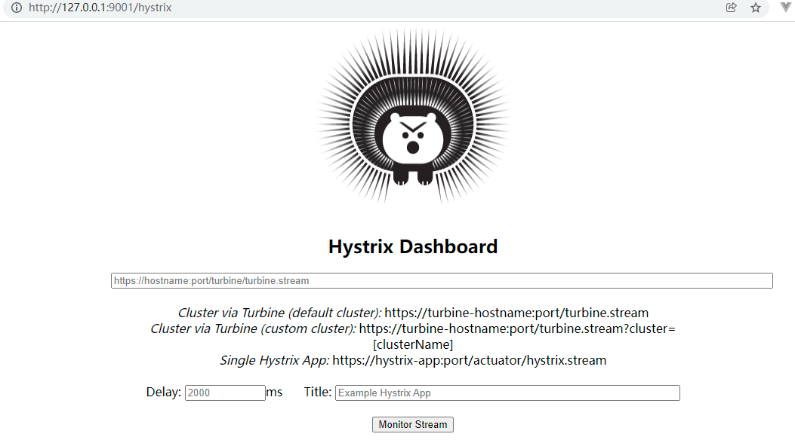

### 12.5.3 服务监控演示

#### 12.5.3.1 启动eureka7001

#### 12.5.3.2 启动dashboard9001

#### 12.5.3.3 启动payment8001

#### 12.5.3.4 根据实际情况启动consumer（本次不启动）

#### 12.5.3.5 监控指定服务（provider8001）

<font color='red)***注意hystrix基于actuator开放的endpoint网址是：`http://127.0.0.1:8001/actuator/hystrix.stream`***</font>

打开Hystrix DashBoard监控网址`http://127.0.0.1:9001/hystrix`，输入要监控的项目。该项目**必须引入actuator，且使用了Hystrix断路器**

> ***为什么暴露给dashboard服务的地址是：http://127.0.0.1:9001/hystrix.stream？***
>
> 这是hystrix断路器生成的，其中
>
> + **hystrix.stream** 监控单个服务的单台机器(实例)的监控数据 ，只能适用于单台服务器。(`@HystrixCommand`)
> + **turbine.stream** 可监控单个或多个服务的所有机器(实例)的监控数据 ，适用于服务器集群(`@HystrixObservableCommand`)


#### 12.5.3.6 监控出错

+ `Unable to connect to Command Metric Stream.`

  > 这是由于provider8001项目中actuator默认不是开放向web端的（只开放info和health），需要在该项目的yaml配置文件中开启
  >
  > ```yaml
  > management:
  >   endpoints:
  >     web:
  >       exposure:
  >         include: '*' # 或者hystrix.stream都可以，hystrix自己构建一个endpoint
  > ```

+ `Unable to connect to Command Metric Stream.`第二种解决方法

  > ```java
  > /**
  >  * 配置类中加入组件bean，修改映射地址不走actuator
  >  *此配置是为了服务监控而配置，与服务容错本身无关，springcloud升级后的坑
  >  *ServletRegistrationBean因为springboot的默认路径不是"/hystrix.stream"，
  >  *只要在自己的项目里配置上下面的servlet就可以了
  >  */
  > @Bean
  > public ServletRegistrationBean getServlet() {
  >     HystrixMetricsStreamServlet streamServlet = new HystrixMetricsStreamServlet();
  >     ServletRegistrationBean registrationBean = new ServletRegistrationBean(streamServlet);
  >     registrationBean.setLoadOnStartup(1);
  >     registrationBean.addUrlMappings("/hystrix.stream");
  >     registrationBean.setName("HystrixMetricsStreamServlet");
  >     return registrationBean;
  > }
  > ```

#### 12.5.3.7 解释


# 13 ==OpenFeign、Ribbon和Hystrix超时时间配置规则*==

## 13.1 `Feign` 和 `Ribbon`

`Feign` 和 `Ribbon` 的超时时间**只会有一个生效**，规则：

- 如果**没有设置过feign超时**（也就是等于默认值的时候），就会**读取 ribbon 的配置**，使用 ribbon 的超时时间和重试设置。
- 如果***设置了***feign超时，***则使用 feign 自身的设置***。两者是二选一的，***且 feign 优先***。

## 13.2 `Ribbon`和`Hystrix`

- 如果请求时间超过 ribbon 的超时配置，会触发重试；
- 在配置 fallback 的情况下，如果请求的时间(包括 ribbon 的重试时间)，超出了 ribbon 的超时限制，或者 hystrix 的超时限制，那么就会熔断。

一般来说，会设置 ribbon 的超时时间 < hystrix， 这是因为 ribbon 有重试机制。(这里说的 ribbon 超时时间是包括重试在内的，即，最好要让 ribbon 的重试全部执行，直到 ribbon 超时被触发)

**由于 connectionTime 一般比较短，可以忽略**。那么，设置的超时时间应该满足如下，***\*避免ribbon还未重试完就过早的被Hystrix熔断了\****：

```java
(1 + MaxAutoRetries) * (1 + MaxAutoRetriesNextServer)* ReadTimeOut < hystrix 的 *timeoutInMilliseconds
```

# 13 zuul路由网关

见笔记 [`SpringCloud2020.mmap`](SpringCloud2020.mmap)

# 14 Gateway 

zuul官网：https://github.com/Netflix/zuul/wiki

Gateway官网：https://cloud.spring.io/spring-cloud-static/Hoxton.SR1/reference/htmlsingle/#spring-cloud-gateway

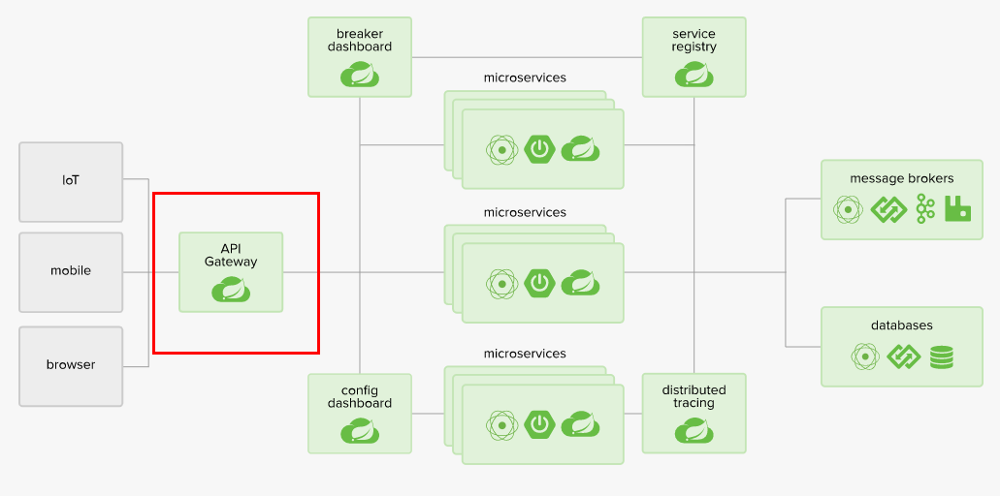

## 14.1 简介概述

### 14.1.1 概述

Cloud全家桶中有个很重要的组件就是网关，在1.x版本中都是采用的Zuul网关；但在2.x版本中，zuul的升级一直跳票，SpringCloud最后自己研发了一个网关替代Zuul，那就是SpringCloud Gateway。一句话：gateway是原zuul1.x版的替代。

Gateway是在Spring生态系统之上构建的API网关服务，基于Spring 5，Spring Boot 2和 Project Reactor等技术。
Gateway旨在提供一种简单而有效的方式来对API进行路由，以及提供一些强大的过滤器功能， 例如：熔断、限流、重试等。	


### 14.1.2 总结

SpringCloud Gateway 是 Spring Cloud 的一个全新项目，基于 Spring 5.0+Spring Boot 2.0 和 Project Reactor 等技术开发的网关，它旨在为微服务架构提供一种简单有效的统一的 API 路由管理方式。

SpringCloud Gateway 作为 Spring Cloud 生态系统中的网关，目标是替代 Zuul，在Spring Cloud 2.0以上版本中，没有对新版本的Zuul 2.0以上最新高性能版本进行集成，仍然还是使用的Zuul 1.x非Reactor模式的老版本。而为了提升网关的性能，SpringCloud Gateway是基于WebFlux框架实现的，而WebFlux框架底层则使用了高性能的Reactor模式通信框架Netty。

Spring Cloud Gateway的目标提供统一的路由方式且基于 Filter 链的方式提供了网关基本的功能，例如：安全，监控/指标，和限流。

**SpringCloud Gateway 使用的Webflux中的reactor-netty响应式编程组件，底层使用了Netty通讯框架。**


### 14.1.3 gateway作用

+ 反向代理
+ 鉴权
+ 流量控制
+ 熔断
+ 日志监控
+ 。。。

### 14.1.4 Gateway位置


### 14.1.6 为什么选择Gateway

#### 14.1.6.1 neflix不太靠谱，zuul2.0一直跳票，迟迟不发布


 一方面因为Zuul1.0已经进入了维护阶段，而且Gateway是SpringCloud团队研发的，是亲儿子产品，值得信赖。
而且很多功能Zuul都没有用起来也非常的简单便捷。

Gateway是基于**异步非阻塞**模型上进行开发的，性能方面不需要担心。虽然Netflix早就发布了最新的 Zuul 2.x，
但 Spring Cloud 貌似没有整合计划。而且Netflix相关组件都宣布进入维护期；不知前景如何？

多方面综合考虑Gateway是很理想的网关选择。

#### 14.1.6.2 SpringCloud Gateway具有如下新特性

+ 基于Spring Framework 5, Project Reactor 和 Spring Boot 2.0 进行构建；
+ 动态路由：能够匹配任何请求属性；
+ 可以对路由指定 Predicate（断言）和 Filter（过滤器）；
+ 集成Hystrix的断路器功能；
+ 集成 Spring Cloud 服务发现功能；
+ 易于编写的 Predicate（断言）和 Filter（过滤器）；
+ 请求限流功能；
+ 支持路径重写。

#### 14.1.6.3 SpringCloud Gateway 与 Zuul的区别

在SpringCloud Finchley 正式版之前，Spring Cloud 推荐的网关是 Netflix 提供的Zuul：

+ Zuul 1.x，是一个基于阻塞 I/ O 的 API Gateway
+ Zuul 1.x 基于**Servlet 2. 5**使用**阻塞架构**它**不支持任何长连接(如 WebSocket) **。Zuul 的设计模式和Nginx较像，每次 I/ O 操作都是从工作线程中选择一个执行，请求线程被阻塞到工作线程完成，但是差别是Nginx 用C++ 实现，Zuul 用 Java 实现，而 JVM 本身会有第一次加载较慢的情况，使得Zuul 的性能相对较差。
+ Zuul 2.x理念更先进，想基于Netty非阻塞和支持长连接，但SpringCloud目前还没有整合。 Zuul 2.x的性能较 Zuul 1.x 有较大提升。在性能方面，根据官方提供的基准测试， Spring Cloud Gateway 的 RPS（每秒请求数）是Zuul 的 1. 6 倍。
+ Spring Cloud Gateway 建立 在 **Spring Framework 5、 Project Reactor 和 Spring Boot 2** 之上， 使用非阻塞 API。
+ Spring Cloud Gateway 还 **支持 WebSocket**， 并且与Spring紧密集成拥有更好的开发体验

### 14.1.7 Zuul1模型

Springcloud中所集成的**Zuul版本**，采用的是**Tomcat容器**，使用的是传统的Servlet IO处理模型。

学过尚硅谷web中期课程都知道一个题目，Servlet的生命周期?servlet由servlet container进行生命周期管理。

+ container启动时构造servlet对象并调用servlet init()进行初始化；
+ container运行时接受请求，并为每个请求分配一个线程（一般从线程池中获取空闲线程）然后调用service()
+ container关闭时调用servlet destory()销毁servlet；


上述模式的缺点：
	servlet是一个简单的网络IO模型，当请求进入servlet container时，servlet container就会为其绑定一个线程，在并发不高的场景下这种模型是适用的。但是一旦高并发(比如抽风用jemeter压)，线程数量就会上涨，而线程资源代价是昂贵的（上线文切换，内存消耗大）严重影响请求的处理时间。在一些简单业务场景下，不希望为每个request分配一个线程，只需要1个或几个线程就能应对极大并发的请求，这种业务场景下servlet模型没有优势。

所以Zuul 1.X是基于servlet之上的一个阻塞式处理模型，即spring实现了处理所有request请求的一个servlet（DispatcherServlet）并由该servlet阻塞式处理处理。所以Springcloud Zuul无法摆脱servlet模型的弊端

### 14.1.8 Gateway模型

Reactive介绍：https://spring.io/reactive

WebFlux官网：https://docs.spring.io/spring-framework/docs/current/reference/html/web-reactive.html#webflux-new-framework

传统的Web框架，比如说：struts2，	springmvc等都是基于Servlet API与Servlet容器基础之上运行的。但是在**Servlet3.1之后有了异步非阻塞的支持**。

而**WebFlux是一个典型非阻塞异步的框架，它的核心是基于Reactor的相关API实现的**。相对于传统的web框架来说，它可以运行在诸如Netty，Undertow及支持Servlet3.1的容器上。**非阻塞式+函数式编程**（Spring5必须让你使用java8）

Spring WebFlux 是 Spring 5.0 引入的新的响应式框架，区别于 Spring MVC，它不需要依赖Servlet API，它是完全异步非阻塞的，并且基于 Reactor 来实现响应式流规范。


## 14.2 三大核心理念

Gateway的三大核心概念分别是：**Route（路由）、Predicate（断言）、Filter（过滤）**

+ **Route（路由）**

  路由是构建网关的基本模块，它由**ID**，目标**URI**，一系列的**断言**和**过滤器**组成，如果断言为true则匹配该路由

+ **Predicate（断言）**

  参考的是Java8的`java.util.function.Predicate`
  开发人员可以匹配HTTP请求中的所有内容(例如请求头或请求参数)，如果**请求与断言相匹配**则进行路由

+ **Filter（过滤）**

  指的是Spring框架中GatewayFilter的实例，使用过滤器，可以在**请求被路由前或者之后对请求进行修改**。


web请求，通过一些匹配条件，定位到真正的服务节点。并在这个转发过程的前后，进行一些精细化控制。
**predicate就是我们的匹配条件**；而**filter，就可以理解为一个无所不能的拦截器**。有了这两个元素，再加上目标uri，就可以实现一个具体的路由了

## 14.3 GateWay工作流程

+ 客户端向 Spring Cloud Gateway 发出请求。然后在 Gateway Handler Mapping 中找到与请求相匹配的路由，将其发送到 Gateway Web Handler。
+ Handler 再通过指定的过滤器链来将请求发送到我们实际的服务执行业务逻辑，然后返回。过滤器之间用虚线分开是因为过滤器可能会在发送代理请求之前（“pre”）或之后（“post”）执行业务逻辑。
+ Filter在**“pre”类型的过滤器可以做参数校验、权限校验、流量监控、日志输出、协议转换等，在“post”类型的过滤器中可以做响应内容、响应头的修改，日志的输出，流量监控等**有着非常重要的作用。


总结：核心逻辑就是**路由转发+执行过滤器链**

## 14.4 服务搭建

### 14.4.1 构建项目 cloud-gateway-gateway9527


### 14.4.2 改pom

```xml
<dependencies>
        <!--gateway不需要starter-web的依赖-->
        <dependency>
            <groupId>org.springframework.cloud</groupId>
            <artifactId>spring-cloud-starter-gateway</artifactId>
        </dependency>
        <!--eureka-client-->
        <dependency>
            <groupId>org.springframework.cloud</groupId>
            <artifactId>spring-cloud-starter-netflix-eureka-client</artifactId>
        </dependency>
        <!-- 引入自己定义的api通用包，可以使用Payment支付Entity -->
        <dependency>
            <groupId>com.ly.springcloud</groupId>
            <artifactId>cloud-api-commons</artifactId>
            <version>${project.version}</version>
        </dependency>
        <!--一般基础配置类-->
        <dependency>
            <groupId>org.projectlombok</groupId>
            <artifactId>lombok</artifactId>
            <optional>true</optional>
        </dependency>
        <dependency>
            <groupId>org.springframework.boot</groupId>
            <artifactId>spring-boot-starter-test</artifactId>
            <scope>test</scope>
        </dependency>
    </dependencies>
```

### 14.4.3 改yaml

```yaml
server:
  port: 9527
spring:
  application:
    name: cloud-service
eureka:
  client:
    register-with-eureka: true
    fetch-registry: true
    service-url:
      defaultZone: http://eureka7001.com:7001/eureka/
  instance:
    hostname: cloud-gateway-service
```

### 14.4.4 创建主启动类

```java
@SpringBootApplication
@EnableEurekaClient
public class GateWayMain9527 {
    public static void main(String[] args){
      SpringApplication.run(GateWayMain9527.class, args);
    }
}
```

### 14.4.5 Gateway实现代理

​	因为我们我们开启的服务是`cloud-provider-payment8001`，存在访问地址：`localhost:8001/payment/get/{id}`，但是我们不想向外部暴露实际服务的端口，那么就可以使用Gateway的代理功能：如使用Gateway的925端口，那么替换后的实际url就为：`localhost:9527/payment/get/{id}`

***Gateway9527服务配置gateway***

```yaml
spring:
  application:
    name: cloud-service
  cloud:
    gateway:
      routes:
        - id: payment_route1
          uri: http://localhost:8001 
          predicates:
            - Path=/payment/get/{id} # 或者/payment/get/**
```

### 14.4.6 测试

+ 启动eureka7001服务

+ 启动provider8001服务

+ 启动gateway9527服务

+ 测试

  > +  访问原生8001地址
  >
  >   
  >
  > + 访问gateway代理后的9527地址
  >
  >   

### 14.4.7 ==Gateway网关路由的两种配置方式*==

#### 14.4.7.1 yaml文件配置

```yaml
spring:
  application:
    name: cloud-gateway-service
  cloud:
    gateway:
      routes:
        - id: payment_route1
          uri: http://localhost:8001
          predicates:
            - Path=/payment/get/{id} # 或者/payment/get/**
```

#### 14.4.7.2 配置类方式

```java
@Configuration//Gateway9527端
public class GatewayConfig {

    /**
     * 通过硬编码方式，给gateway注入路由，实现
     *   本机访问：http://localhost:9527/guonei
     *   则会自动跳转到http://news.baidu.com/guonei
     * @param builder RouteLocatorBuilder
     * @return RouteLocator
     */
    @Bean
    public RouteLocator customRouteLocator(RouteLocatorBuilder builder){
        RouteLocatorBuilder.Builder routes = builder.routes();//对应配置文件的spring.cloud.gateway.routes
        routes.route("route_to_baidu",
                predicateSpec ->
                        predicateSpec
                                .path("/guonei")//path就是配置文件中predicates中的Path
                                .uri("http://news.baidu.com/"));//就是yml中的uri
        return routes.build();
    }
}
```

## 14.5 通过微服务名实现动态路由*

原本的路由都是些写死服务器地址如：`http://localhost:8001`但是实际上，某种服务由很多微服务组成的集群，所以需要使用服务名实现动态的微服务匹配。

### 14.5.1 Gateway端yml

注意两点

+ `spring.cloud.gateway.discovery.locator.enabled`的状态

  启用DiscoveryClient网关集成的标志

  + `true`：开启后可以**指定服务名**访问

    > 可以`http://127.0.0.1:9527/CLOUD-PAYMENT-SERVICE/payment/get/2`访问
    >
    > 也可以`http://127.0.0.1:9527/payment/get/2`访问

  + `false`：

    > 只能`http://127.0.0.1:9527/payment/get/2`访问

+ `spring.cloud.gateway.routes.uri`的地址必须是以`lb:// + 注册到微服务名`

```yaml
spring:
  application:
    name: cloud-gateway-service
  cloud:
    gateway:
      discovery:
        locator:
        #spring.cloud.gateway.discovery.locator.enabled：是否与服务注册于发现组件进行结合，通过 serviceId 转发到具体的服务实例。默认为 false，设为 true 便开启通过服务中心的自动根据 serviceId 创建路由的功能。
		#spring.cloud.gateway.discovery.locator.lowerCaseServiceId：是将请求路径上的服务名配置为小写（因为服务注册的时候，向注册中心注册时将服务名转成大写的了）。
          enabled: true
          lower-case-service-id: true
      routes:
        - id: payment_route1
          # uri: http://localhost:8001
          uri: lb://cloud-payment-service # lb://表示不是直接的地址，而是负载均衡的，需要去注册中心找
          predicates:
            - Path=/payment/get/{id} # 或者/payment/get/**
```

### 14.5.2 测试

+ 启动eureka7001

+ 启动provider8001

+ 启动provider8002，实现集群

+ 应该启动consumer端的，但是内存不够了

+ 启动gateway9527

+ 访问

  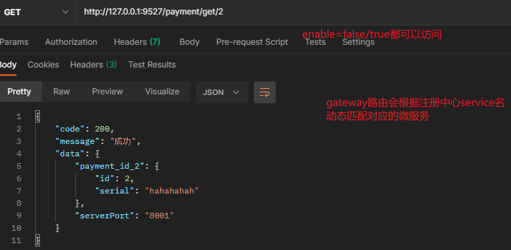

  

## 14.6 Predicate断言

我们注意到在Gateway9527系统启动时看到了以下内容：**这表示Predicate支持这些类型的判断**

> 地址：`https://cloud.spring.io/spring-cloud-static/Hoxton.SR1/reference/htmlsingle/#the-after-route-predicate-factory`
>
> Spring Cloud Gateway matches routes as part of the Spring WebFlux `HandlerMapping` infrastructure. Spring Cloud Gateway includes many built-in route predicate factories. All of these predicates match on different attributes of the HTTP request. You can combine multiple route predicate factories with logical `and` statements.

==***其实就是Predicate组成的一组规则，为了请求过来可以找到对应的路由***==

### 14.6.1 所有的RoutePredicateFactory

**RoutePrecidateFactory的所有实现类：**


### 14.6.2 常用的RoutePredicateFactory

<font color='red)***注意所有配置的首字母必须大写，且单词正确***</font>

#### 14.6.2.1 After 

表示在某个时间后，满足此断言的路由才会生效

```yaml
spring:
  application:
    name: cloud-gateway-service
  cloud:
    gateway:
      discovery:
        locator:
          enabled: true #这个
          lower-case-service-id: true
      routes:
        - id: payment_route1
          uri: lb://cloud-payment-service
          predicates:
            - After=2023-02-06T14:13:31.798+08:00[Asia/Shanghai] # 在此时间后该路由才会生效,但是enable=true（地址中有服务名的）的访问方式依旧可用
```

其中After后的时间串获得：`ZonedDateTime.now()`

#### 14.6.2.2 Before 

表示在某个时间前，满足此断言的路由才会生效

```yaml
spring:
  application:
    name: cloud-gateway-service
  cloud:
    gateway:
      discovery:
        locator:
          enabled: true #这个
          lower-case-service-id: true
      routes:
        - id: payment_route1
          uri: lb://cloud-payment-service
          predicates:
            - After=2023-02-06T14:13:31.798+08:00[Asia/Shanghai] # 在此时间后该路由才会生效,但是enable=true（地址中有服务名的）的访问方式依旧可用
            - Before=2023-05-06T14:13:31.798+08:00[Asia/Shanghai] # 同上enable
```

#### 14.6.2.3 Between 

表示在某个时间段内，满足此断言的路由才会生效 **用逗号分开时间段**

```yaml
spring:
  cloud:
    gateway:
      routes:
        - id: payment_route1
          uri: lb://cloud-payment-service
          predicates:
            - After=2023-02-06T14:13:31.798+08:00[Asia/Shanghai] 
            - Before=2023-05-06T14:13:31.798+08:00[Asia/Shanghai]
            - Between=2023-02-06T14:13:31.798+08:00[Asia/Shanghai],2023-05-06T14:13:31.798+08:00[Asia/Shanghai]
```

#### 14.6.2.4 Cookie 

表示发送的请求必须含有cookie信息，且满足条件：（满足此断言的路由才会生效）

+ key为`no.`
+ value为`正则表达式 \d+`

```yaml
spring:
  cloud:
    gateway:
      routes:
          predicates:
            - After=2023-02-06T14:13:31.798+08:00[Asia/Shanghai] 
            - Before=2023-05-06T14:13:31.798+08:00[Asia/Shanghai]
            - Between=2023-02-06T14:13:31.798+08:00[Asia/Shanghai],2023-05-06T14:13:31.798+08:00[Asia/Shanghai]
            - Cookie=no.,\d+ # C大写
```

#### 14.6.2.5 Header 

表示发送的请求必须含有请求头信息，且满足条件：（满足此断言的路由才会生效）

+ 请求头key为`X-Request-Id`
+ 请求头value为`正则表达式 \d+`

```yaml
spring:
  cloud:
    gateway:
      routes:
          predicates:
            - After=2023-02-06T14:13:31.798+08:00[Asia/Shanghai] 
            - Before=2023-05-06T14:13:31.798+08:00[Asia/Shanghai]
            - Between=2023-02-06T14:13:31.798+08:00[Asia/Shanghai],2023-05-06T14:13:31.798+08:00[Asia/Shanghai]
            - Cookie=no.,\d+
            - Header=X-Request-Id,\d+
```

#### 14.6.2.6 Host

表示请求的主机必须满足设定的条件，满足此断言的路由才会生效

```yaml
spring:
  cloud:
    gateway:
      routes:
          predicates:
            - After=2023-02-06T14:13:31.798+08:00[Asia/Shanghai] 
            - Before=2023-05-06T14:13:31.798+08:00[Asia/Shanghai]
            - Between=2023-02-06T14:13:31.798+08:00[Asia/Shanghai],2023-05-06T14:13:31.798+08:00[Asia/Shanghai]
            - Cookie=no.,\d+
            - Header=X-Request-Id,\d+
            - Host=**,**.baidu.com # 以.作为分隔符
```

#### 14.6.2.7 Method

表示当前请求的方式必须是指定类型，满足此断言的路由才会生效

```yaml
spring:
  cloud:
    gateway:
      routes:
          predicates:
            - After=2023-02-06T14:13:31.798+08:00[Asia/Shanghai] 
            - Before=2023-05-06T14:13:31.798+08:00[Asia/Shanghai]
            - Between=2023-02-06T14:13:31.798+08:00[Asia/Shanghai],2023-05-06T14:13:31.798+08:00[Asia/Shanghai]
            - Cookie=no.,\d+
            - Header=X-Request-Id,\d+
            - Host=**,**.baidu.com # 以.作为分隔符
            - Method=GET,POST
```

#### 14.6.2.8 Path 

表示请求的url必须匹配设定的值，满足此断言的路由才会生效

```yaml
spring:
  cloud:
    gateway:
      routes:
          predicates:
            - After=2023-02-06T14:13:31.798+08:00[Asia/Shanghai] 
            - Before=2023-05-06T14:13:31.798+08:00[Asia/Shanghai]
            - Between=2023-02-06T14:13:31.798+08:00[Asia/Shanghai],2023-05-06T14:13:31.798+08:00[Asia/Shanghai]
            - Cookie=no.,\d+
            - Header=X-Request-Id,\d+
            - Host=**,**.baidu.com # 以.作为分隔符
            - Method=GET,POST
            - Path=/payment/get/{id} # 或者/payment/get/**
```

#### 14.6.2.9 Query 

表示请求必须携带指定的参数（和值），满足此断言的路由才会生效

+ 可以只有参数
+ 属性值可以为正则表达式

```yaml
spring:
  cloud:
    gateway:
      routes:
          predicates:
            - After=2023-02-06T14:13:31.798+08:00[Asia/Shanghai] 
            - Before=2023-05-06T14:13:31.798+08:00[Asia/Shanghai]
            - Between=2023-02-06T14:13:31.798+08:00[Asia/Shanghai],2023-05-06T14:13:31.798+08:00[Asia/Shanghai]
            - Cookie=no.,\d+
            - Header=X-Request-Id,\d+
            - Host=**,**.baidu.com # 以.作为分隔符
            - Method=GET,POST
            - Path=/payment/get/{id} # 或者/payment/get/**
            - Query=seq #表示请求必须由seq参数，不管有没有值（-Query=seq,\d+）
```

#### 14.6.2.10 RemoteAddr

表示请求（客户端）的remote addr时是指定值是可用，满足此断言的路由才会生效

> REMOTE_ADDR：
>
> 表示发出请求的远程主机的 IP 地址，remote_addr代表客户端的IP，但它的值不是由客户端提供的，而是服务端根据客户端的ip指定的，当你的浏览器访问某个网站时，假设中间没有任何代理，那么网站的web[服务器](https://www.baidu.com/s?wd=服务器&tn=24004469_oem_dg&rsv_dl=gh_pl_sl_csd)（[Nginx](https://www.baidu.com/s?wd=Nginx&tn=24004469_oem_dg&rsv_dl=gh_pl_sl_csd)，Apache等）就会把remote_addr设为你的机器IP，如果你用了某个代理，那么你的浏览器会先访问这个代理，然后再由这个代理转发到网站，这样web服务器就会把remote_addr设为这台代理机器的IP

```yaml
spring:
  cloud:
    gateway:
      routes:
          predicates:
            - After=2023-02-06T14:13:31.798+08:00[Asia/Shanghai] 
            - Before=2023-05-06T14:13:31.798+08:00[Asia/Shanghai]
            - Between=2023-02-06T14:13:31.798+08:00[Asia/Shanghai],2023-05-06T14:13:31.798+08:00[Asia/Shanghai]
            - Cookie=no.,\d+
            - Header=X-Request-Id,\d+
            - Host=**,**.baidu.com # 以.作为分隔符
            - Method=GET,POST
            - Path=/payment/get/{id} # 或者/payment/get/**
            - Query=seq #表示请求必须由seq参数，不管有没有值（-Query=seq,\d+）
            - RemoteAddr=127.0.0.1,192.168.1.1/24 # 后一个表示从1-24的地址段都可以
```

#### 14.6.2.11Weight

表示对同一个路由下的多个请求路径进行分组，并且根据设置的权重进行分配流量。

> This route would forward ~80% of traffic to [weighthigh.org](https://weighthigh.org/) and ~20% of traffic to [weighlow.org](https://weighlow.org/)

```yaml
spring:
  cloud:
    gateway:
      routes:
      - id: weight_high
        uri: https://weighthigh.org
        predicates:
        - Weight=group1, 8
      - id: weight_low
        uri: https://weightlow.org
        predicates:
        - Weight=group1, 2
```

#### 14.6.2.12 测试

使用工具curl方式指定格式的请求：

`curl --cookie "no.=1" --header "X-Request-Id:1" http://127.0.0.1:9527/payment/get/2?seq`


## 14.7 Filter过滤器

路由过滤器可用于修改进入的HTTP请求和返回的HTTP响应，路由过滤器只能指定路由进行使用。Spring Cloud Gateway 内置了多种路由过滤器，他们都由GatewayFilter的工厂类来产生。

### 14.7.1 Gateway中Filter的生命周期

+ pre，进入路由器前
+ post，出去路由后

### 14.7.2 Gateway中Filter的种类

+ GatewayFilter Factories 

  网址：https://cloud.spring.io/spring-cloud-static/Hoxton.SR1/reference/htmlsingle/#gatewayfilter-factories

  ```sh
  # 官网一共31种单一过滤器
  16. Spring Cloud Gateway
  16.1. How to Include Spring Cloud Gateway
  16.2. Glossary
  16.3. How It Works
  16.4. Route Predicate Factories
  16.5. GatewayFilter Factories
  16.5.1. The AddRequestHeader GatewayFilter Factory
  16.5.2. The AddRequestParameter GatewayFilter Factory
  16.5.3. The AddResponseHeader GatewayFilter Factory
  16.5.4. The DedupeResponseHeader GatewayFilter Factory
  16.5.5. The Hystrix GatewayFilter Factory
  16.5.6. Spring Cloud CircuitBreaker GatewayFilter Factory
  16.5.7. The FallbackHeaders GatewayFilter Factory
  16.5.8. The MapRequestHeader GatewayFilter Factory
  16.5.9. The PrefixPath GatewayFilter Factory
  16.5.10. The PreserveHostHeader GatewayFilter Factory
  16.5.11. The RequestRateLimiter GatewayFilter Factory
  16.5.12. The RedirectTo GatewayFilter Factory
  16.5.13. The RemoveHopByHopHeadersFilter GatewayFilter Factory
  16.5.14. The RemoveRequestHeader GatewayFilter Factory
  16.5.15. RemoveResponseHeader GatewayFilter Factory
  16.5.16. The RemoveRequestParameter GatewayFilter Factory
  16.5.17. The RewritePath GatewayFilter Factory
  16.5.18. RewriteLocationResponseHeader GatewayFilter Factory
  16.5.19. The RewriteResponseHeader GatewayFilter Factory
  16.5.20. The SaveSession GatewayFilter Factory
  16.5.21. The SecureHeaders GatewayFilter Factory
  16.5.22. The SetPath GatewayFilter Factory
  16.5.23. The SetRequestHeader GatewayFilter Factory
  16.5.24. The SetResponseHeader GatewayFilter Factory
  16.5.25. The SetStatus GatewayFilter Factory
  16.5.26. The StripPrefix GatewayFilter Factory
  16.5.27. The Retry GatewayFilter Factory
  16.5.28. The RequestSize GatewayFilter Factory
  16.5.29. Modify a Request Body GatewayFilter Factory
  16.5.30. Modify a Response Body GatewayFilter Factory
  16.5.31. Default Filters
  ```

+ Global Filters

  网址：https://cloud.spring.io/spring-cloud-static/Hoxton.SR1/reference/htmlsingle/#global-filters

  ```sh
  # 10种全局过滤器
  16.6. Global Filters
  16.6.1. Combined Global Filter and GatewayFilter Ordering
  16.6.2. Forward Routing Filter
  16.6.3. The LoadBalancerClient Filter
  16.6.4. The ReactiveLoadBalancerClientFilter
  16.6.5. The Netty Routing Filter
  16.6.6. The Netty Write Response Filter
  16.6.7. The RouteToRequestUrl Filter
  16.6.8. The Websocket Routing Filter
  16.6.9. The Gateway Metrics Filter
  16.6.10. Marking An Exchange As Routed
  ```

### 14.7.3 ==自定义全局过滤器*==

**自定义全局过滤器需要实现两个接口： GlobalFilter和Ordered**

```java
package com.ly.springcloud.filter;
...
@Slf4j
@Component
public class MyLogGateWayFilter implements GlobalFilter, Ordered {

    /**
     * 作用：鉴权，日志记录。。 （没写规则就是所有请求）
     */
    @Override
    public Mono<Void> filter(ServerWebExchange exchange, GatewayFilterChain chain) {
        String uname = exchange.getRequest().getQueryParams().getFirst("uname");
        if (uname == null) {
            log.info("非法入侵，未识别到用户 (；′⌒`)");
            //可以设置个返回头
            ServerHttpResponse response = exchange.getResponse();
            response.setStatusCode(HttpStatus.FORBIDDEN);
            return response.setComplete();
        }
        return chain.filter(exchange);//继续执行过滤器链，类似于doFilter
    }

    /**
     * 过滤器顺序，值越小越优先
     * @return 优先值
     */
    @Override
    public int getOrder() {
        return 0;
    }
}
```

***测试***

+ 失败

​	

+ 成功


# 15 SpringCloud Config 分步式配置中心

官网：https://cloud.spring.io/spring-cloud-static/Hoxton.SR1/reference/htmlsingle/#spring-cloud-config

## 15.1 概述

### 15.1.1 分布式系统面临的问题

微服务意味着要将单体应用中的业务拆分成一个个子服务，每个服务的粒度相对较小，因此系统中会出现大量的服务。由于每个服务都需要必要的配置信息才能运行，所以一套集中式的、动态的配置管理设施是必不可少的。

SpringCloud提供了ConfigServer来解决这个问题，我们每一个微服务自己带着一个application.yml，上百个配置文件的管理。

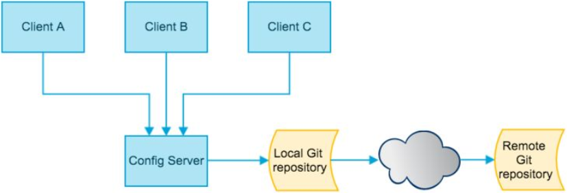

### 15.1.2 SpringCloud Config分布式配置中心是什么？

SpringCloud Config为微服务架构中的微服务提供**集中化的外部配置支持**，配置服务器为各个不同微服务应用的所有环境提供了一个中心化的外部配置。

**SpringCloud Config分为服务端和客户端两部分。**

+ **服务端也称为分布式配置中心**，它是一个独立的微服务应用，用来连接配置服务器并为客户端提供获取配置信息，加密/解密信息等访问接口
+ **客户端**则是通过指定的配置中心来管理应用资源，以及与业务相关的配置内容，并在启动的时候从配置中心获取和加载配置信息配置服务器默认采用git来存储配置信息，这样就有助于对环境配置进行版本管理，并且可以通过git客户端工具来方便的管理和访问配置内容。

### 15.1.3 SpringCloud Config分布式配置中心能干什么？

+ 集中管理配置文件
+ 不同环境不同配置，动态化的配置更新，分环境部署比如dev/test/prod/beta/release
+ 运行期间动态调整配置，不再需要在每个服务部署的机器上编写配置文件，服务会向配置中心统一拉取配置自己的信息
+ 当配置发生变动时，服务不需要重启即可感知到配置的变化并应用新的配置
+ 将配置信息以REST接口的形式暴露

### 15.1.4 SpringCloud Config与github的整合

由于SpringCloud Config默认使用Git来存储配置文件(也有其它方式,比如支持SVN和本地文件)，但最推荐的还是Git，而且使用的是http/https访问的形式。

## 15.2 Config服务端配置与测试


### 15.2.1 搭建配置中心

+ 用自己的账号在GitHub上新建一个名为springcloud-config的新仓库

+ 建立本地仓库并连接到上个仓库

+ 建立配置中心服务端项目：**cloud-config-center-3344**

  

+ 改POM

  ```xml
  <dependencies>
      <dependency>
          <groupId>org.springframework.cloud</groupId>
          <artifactId>spring-cloud-config-server</artifactId>
      </dependency>
      <dependency>
          <groupId>org.springframework.cloud</groupId>
          <artifactId>spring-cloud-starter-netflix-eureka-client</artifactId>
      </dependency>
      <dependency>
          <groupId>org.springframework.boot</groupId>
          <artifactId>spring-boot-starter-web</artifactId>
      </dependency>
  
      <dependency>
          <groupId>org.springframework.boot</groupId>
          <artifactId>spring-boot-starter-actuator</artifactId>
      </dependency>
      <dependency>
          <groupId>org.projectlombok</groupId>
          <artifactId>lombok</artifactId>
          <optional>true</optional>
      </dependency>
      <dependency>
          <groupId>org.springframework.boot</groupId>
          <artifactId>spring-boot-starter-test</artifactId>
          <scope>test</scope>
      </dependency>
  </dependencies>
  ```

+ 改YAML

  ```yaml
  server:
    port: 3344
  spring:
    application:
      name: cloud-config-center # 注册到eureka
    cloud:
      config:
        server:
          git:
            uri: git@github.com:lxcl96/springcloud-config.git #GitHub上面的git仓库名字
            search-paths:
              - springcloud-config # 搜索github下的指定目录
        label: master # 读取github的分支
  
  eureka:
    client:
      service-url:
        defaultZone: http://eureka7001.com:7001/eureka/
  ```

+ 创建主启动类

  ```java
  @SpringBootApplication
  @EnableEurekaClient
  @EnableConfigServer//启动配置中心
  public class ConfigCenterMain3344 {
      public static void main(String[] args){
        SpringApplication.run(ConfigCenterMain3344.class, args);
      }
  }
  ```

+ 启动测试（先启动7001，再启动3344）

  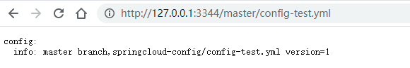

  > 1.如果出现报错Auth fail
  >
  > ​	将github的ssh地址改为HTTPS
  >
  > ```yaml
  > spring:
  >   cloud:
  >     config:
  >       server:
  >         git:
  >           # uri: git@github.com:lxcl96/springcloud-config.git #GitHub上面的git仓库名字
  >           uri: https://github.com/lxcl96/springcloud-config.git #GitHub上面的git仓库名字
  > ```
  >
  > 2.如果出现报错：cannot open git-upload-pack
  >
  > 
  >
  > 3.如果出现访问`http://127.0.0.1:3344/master/config-test.yml`，结果是{}，就是网络问题

### 15.3.2 配置读取规则*

## 15.3 Config配置与测试

## 15.4 Config客户端之动态刷新
