# 

# 0. 参考链接

https://kubernetes.io/zh-cn/docs/concepts/overview/components/

https://www.kubernetes.org.cn/k8s

# 1. 认识kubernetes

## 1.1 什么是kubernetes

Kubernetes 是一个可移植、可扩展的开源平台，用于管理容器化的工作负载和服务，可促进声明式配置和自动化。 Kubernetes 拥有一个庞大且快速增长的生态，其服务、支持和工具的使用范围相当广泛。

**Kubernetes** 这个名字源于希腊语，意为“舵手”或“飞行员”。K8s 这个缩写是因为 K 和 s 之间有 8 个字符的关系。Google 在 2014 年开源了 Kubernetes 项目。 Kubernetes 建立在 [Google 大规模运行生产工作负载十几年经验(即Borg)](https://research.google/pubs/pub43438)的基础上， 结合了社区中最优秀的想法和实践。

Borg架构图如下：


## 1.2 为什么需要kubernetes

### 1.2.1 Kubernetes 的历史背景


**传统部署时代：**

早期，各个组织是在物理服务器上运行应用程序。 由于无法限制在物理服务器中运行的应用程序资源使用，因此会导致资源分配问题。 例如，如果在同一台物理服务器上运行多个应用程序， 则可能会出现一个应用程序占用大部分资源的情况，而导致其他应用程序的性能下降。 一种解决方案是将每个应用程序都运行在不同的物理服务器上， 但是当某个应用程序资源利用率不高时，剩余资源无法被分配给其他应用程序， 而且维护许多物理服务器的成本很高。

**虚拟化部署时代：**

因此，虚拟化技术被引入了。虚拟化技术允许你在单个物理服务器的 CPU 上运行多台虚拟机（VM）。 虚拟化能使应用程序在不同 VM 之间被彼此隔离，且能提供一定程度的安全性， 因为一个应用程序的信息不能被另一应用程序随意访问。

虚拟化技术能够更好地利用物理服务器的资源，并且因为可轻松地添加或更新应用程序， 而因此可以具有更高的可扩缩性，以及降低硬件成本等等的好处。 通过虚拟化，你可以将一组物理资源呈现为可丢弃的虚拟机集群。

每个 VM 是一台完整的计算机，在虚拟化硬件之上运行所有组件，包括其自己的操作系统。

**容器部署时代：**

容器类似于 VM，但是更宽松的隔离特性，使容器之间可以共享操作系统（OS）。 因此，容器比起 VM 被认为是更轻量级的。且与 VM 类似，每个容器都具有自己的文件系统、CPU、内存、进程空间等。 由于它们与基础架构分离，因此可以跨云和 OS 发行版本进行移植。

容器因具有许多优势而变得流行起来，例如：

- 敏捷应用程序的创建和部署：与使用 VM 镜像相比，提高了容器镜像创建的简便性和效率。
- 持续开发、集成和部署：通过快速简单的回滚（由于镜像不可变性）， 提供可靠且频繁的容器镜像构建和部署。
- 关注开发与运维的分离：在构建、发布时创建应用程序容器镜像，而不是在部署时， 从而将应用程序与基础架构分离。
- 可观察性：不仅可以显示 OS 级别的信息和指标，还可以显示应用程序的运行状况和其他指标信号。

- 跨开发、测试和生产的环境一致性：在笔记本计算机上也可以和在云中运行一样的应用程序。
- 跨云和操作系统发行版本的可移植性：可在 Ubuntu、RHEL、CoreOS、本地、 Google Kubernetes Engine 和其他任何地方运行。
- 以应用程序为中心的管理：提高抽象级别，从在虚拟硬件上运行 OS 到使用逻辑资源在 OS 上运行应用程序。
- 松散耦合、分布式、弹性、解放的微服务：应用程序被分解成较小的独立部分， 并且可以动态部署和管理 - 而不是在一台大型单机上整体运行。
- 资源隔离：可预测的应用程序性能。
- 资源利用：高效率和高密度。

### 1.2.2 Kubernetes能做什么?

容器是打包和运行应用程序的好方式。在生产环境中， 你需要管理运行着应用程序的容器，并确保服务不会下线。 例如，如果一个容器发生故障，则你需要启动另一个容器。 如果此行为交由给系统处理，是不是会更容易一些？

这就是 Kubernetes 要来做的事情！ Kubernetes 为你提供了一个**可弹性运行分布式系统的框架**。 Kubernetes 会满足你的扩展要求、故障转移你的应用、提供部署模式等。 例如，Kubernetes 可以轻松管理系统的 Canary (金丝雀) 部署。

Kubernetes 为你提供：

- **服务发现和负载均衡**

  Kubernetes 可以使用 DNS 名称或自己的 IP 地址来暴露容器。 如果进入容器的流量很大， Kubernetes 可以负载均衡并分配网络流量，从而使部署稳定。

- **存储编排**

  Kubernetes 允许你自动挂载你选择的存储系统，例如本地存储、公共云提供商等。

- **自动部署和回滚**

  你可以使用 Kubernetes 描述已部署容器的所需状态， 它可以以受控的速率将实际状态更改为期望状态。 例如，你可以自动化 Kubernetes 来为你的部署创建新容器， 删除现有容器并将它们的所有资源用于新容器。

- **自动完成装箱计算**

  你为 Kubernetes 提供许多节点组成的集群，在这个集群上运行容器化的任务。 你告诉 Kubernetes 每个容器需要多少 CPU 和内存 (RAM)。 Kubernetes 可以将这些容器按实际情况调度到你的节点上，以最佳方式利用你的资源。

- **自我修复**

  Kubernetes 将重新启动失败的容器、替换容器、杀死不响应用户定义的运行状况检查的容器， 并且在准备好服务之前不将其通告给客户端。

- **密钥与配置管理**

  Kubernetes 允许你存储和管理敏感信息，例如密码、OAuth 令牌和 SSH 密钥。 你可以在不重建容器镜像的情况下部署和更新密钥和应用程序配置，也无需在堆栈配置中暴露密钥。

- **批处理执行** 除了服务外，Kubernetes 还可以管理你的批处理和 CI（持续集成）工作负载，如有需要，可以替换失败的容器。
- **水平扩缩** 使用简单的命令、用户界面或根据 CPU 使用率自动对你的应用进行扩缩。
- **IPv4/IPv6 双栈** 为 Pod（容器组）和 Service（服务）分配 IPv4 和 IPv6 地址。
- **为可扩展性设计** 在不改变上游源代码的情况下为你的 Kubernetes 集群添加功能。

## 1.3 企业容器调度平台对比

### 1.3.1 Apache Mesos

#### 1.3.1.1 基本概念

Mesos是一个**分布式调度系统**内核，早于Docker的产生，Mesos作为资源管理器， 从DC/OS(数据中心操作系统)的角度提供资源视图。**主/从结构**的工作模式，**主节点分配任务**，并用**从节点上的Executor负责执行**，通过Zookeeper给主节点提供注册服务、服务发现等功能。通过Framework Marathon 提供容器调度的能力。

#### 1.3.1.2 优势

经过时间的检验，作为资源管理器的Apache Mesos在容器之前就已经出现很久了，支持运行容器化和非容器化的工作负载。可以支持应用程序的健康检查，开放的架构。支持多个框架和多个调度器，通过不同的Framework可以运行Hadoop/Spark/MPI等多种不同的任务。

支持超大规模的节点管理，模拟测试支持超过5w+节点，在大规模上拥有较大优势。

### 1.3.2 Docker Swarm

#### 1.3.2.1 基本概念

Docker Swarm是一个由Docker开发的调度框架。由Docker自身开发的好处之一就是标准Docker API的使用，Swarm由多个代理（Agent）组成，把这些代理称之为节点（Node）。这些节点就是主机，这些主机在启动Docker Daemon的时候就会打开相应的端口，以此支持Docker远程API。这些机器会根据Swarm调度器分配给他们的任务，拉取和运行不同的镜像。

#### 1.3.2.2 优势

从Docker1.12版本开始，Swarm随Docker一起默认安装发布。由于随Docker引擎一起发布，无需额外安装，配置简单。支持服务注册、服务发现，内置Overlay Network以及Load Balancer。与Docker CLI非常类似的操作命令，对熟悉Docker的人非常容易上手学习。

入门门槛低，学习成本低，使用更便捷，适合中小型系统。

### 1.3.3 Google Kubernetes

#### 1.3.3.1 基本概念

Kubernetes 是基于Google在过去十五年来大量生产环境中运行工作负载的经验。Kubernetes的实现参考了Google内部的资源调度框架Borg，但并不是Borg的内部容器编排系统的开源，而是借鉴Google从运行Borg获得的经验教训，形成了Kubernetes项目。

它使用Label和Pod的概念来将容器划分为逻辑单元。Pods是同地协作(co-located)容器的集合，这些容器被共同部署和调度，形成了一个服务，这是Kubernetes和其他两个框架的主要区别。相比于基于相似度的容器调度方式（就像Swarm和Mesos），这个方法简化了对集群的管理。

#### 1.3.3.2 优势

最流行的容器编排解决方案，基于Google庞大的生态圈及社区产生的产品。通过Pods这一抽象的概念，解决Container之间的依赖于通信的问题。Pods、Services、Deployments是独立部署的部分。可以通过Selector提供更多的灵活性。内置服务注册表和负载均衡。

适用度更广，功能更强大，相较于Mesos来说节点规模较小。

# 2. Kubernetes组件

一个正常运行的 Kubernetes 集群所需的各种组件


## 2.1 核心组件

Kubernetes 集群由**一个控制平面和一组用于运行容器化应用的工作机器**组成，这些**工作机器称作节点（Node）**。 每个集群至少需要一个工作节点来运行 Pod。

工作节点托管着组成应用负载的 Pod(*Pod 表示你的集群上一组正在运行的容器。*)。控制平面管理集群中的工作节点和 Pod。 在生产环境中，控制平面通常跨多台计算机运行，而一个集群通常运行多个节点，以提供容错和高可用。

### 2.1.1 五大控制面板组件（Control Panel Components）

控制平面组件会为集群做出全局决策，比如资源的调度。 以及检测和响应集群事件，例如当不满足 Deployment 的 `replicas` 字段时，要启动新的 [Pod](https://kubernetes.io/zh-cn/docs/concepts/workloads/pods/)）。

控制平面组件可以在集群中的任何节点上运行。 然而，为了简单起见，安装脚本通常会在同一个计算机上启动所有控制平面组件， 并且不会在此计算机上运行用户容器。请参阅[使用 kubeadm 构建高可用性集群](https://kubernetes.io/zh-cn/docs/setup/production-environment/tools/kubeadm/high-availability/)中关于跨多机器安装控制平面的示例。

- [kube-apiserver](https://kubernetes.io/zh-cn/docs/concepts/architecture/#kube-apiserver) **公开 Kubernetes HTTP API 的核心组件服务器**

  API 服务器是 Kubernetes [控制平面](https://kubernetes.io/zh-cn/docs/reference/glossary/?all=true#term-control-plane)(*是指容器编排层，它暴露 API 和接口来定义、 部署容器和管理容器的生命周期*)的组件， 该组件负责公开了 Kubernetes API，负责处理接受请求的工作。 API 服务器是 Kubernetes 控制平面的前端。

  Kubernetes API 服务器的主要实现是 [kube-apiserver](https://kubernetes.io/zh-cn/docs/reference/command-line-tools-reference/kube-apiserver/)。 `kube-apiserver` 设计上考虑了水平扩缩，也就是说，它可通过部署多个实例来进行扩缩。 你可以运行 `kube-apiserver` 的多个实例，并在这些实例之间平衡流量。

- [kube-scheduler](https://kubernetes.io/zh-cn/docs/concepts/architecture/#kube-scheduler) **查找尚未绑定到节点的 Pod，并将每个 Pod 分配给合适的节点。**

  `kube-scheduler` 是[控制平面](https://kubernetes.io/zh-cn/docs/reference/glossary/?all=true#term-control-plane)的组件， 负责监视新创建的、未指定运行[节点（node）](https://kubernetes.io/zh-cn/docs/concepts/architecture/nodes/)(*Kubernetes 中的工作机器称作节点*)的 [Pods](https://kubernetes.io/zh-cn/docs/concepts/workloads/pods/)， 并选择节点来让 Pod 在上面运行。

  调度决策考虑的因素包括单个 Pod 及 Pods 集合的资源需求、软硬件及策略约束、 亲和性及反亲和性规范、数据位置、工作负载间的干扰及最后时限

- [kube-controller-manager](https://kubernetes.io/zh-cn/docs/concepts/architecture/#kube-controller-manager) **运行[控制器](https://kubernetes.io/zh-cn/docs/concepts/architecture/controller/)来实现 Kubernetes API 行为。**

  `kube-controller-manager`是[控制平面](https://kubernetes.io/zh-cn/docs/reference/glossary/?all=true#term-control-plane)的组件， 负责运行[控制器](https://kubernetes.io/zh-cn/docs/concepts/architecture/controller/)进程。

  从逻辑上讲， 每个[控制器](https://kubernetes.io/zh-cn/docs/concepts/architecture/controller/)都是一个单独的进程， 但是为了降低复杂性，它们都被编译到同一个可执行文件，并在同一个进程中运行。

  控制器有许多不同类型。以下是一些例子：

  - Node Controller(**节点控制器**)：负责在节点出现故障时进行通知和响应
  - Job Controller(**任务控制器**)：监测代表一次性任务的 Job 对象，然后创建 Pod 来运行这些任务直至完成
  - EndpointSlice Controller(**端点分片控制器**)：填充 EndpointSlice 对象（以提供 Service 和 Pod 之间的链接）。
  - ServiceAccount Controller(**服务账号控制器**)：为新的命名空间创建默认的 ServiceAccount。

- [cloud-controller-manager](https://kubernetes.io/zh-cn/docs/concepts/architecture/#cloud-controller-manager) (optional) **与底层云驱动集成，连接第三方云api**

  一个 Kubernetes [控制平面](https://kubernetes.io/zh-cn/docs/reference/glossary/?all=true#term-control-plane)组件， 嵌入了特定于云平台的控制逻辑。 云控制器管理器（Cloud Controller Manager）允许将你的集群连接到云提供商的 API 之上， 并将与该云平台交互的组件同与你的集群交互的组件分离开来。

  `cloud-controller-manager` 仅运行特定于云平台的控制器。 因此如果你在自己的环境中运行 Kubernetes，或者在本地计算机中运行学习环境， 所部署的集群不包含云控制器管理器。

  与 `kube-controller-manager` 类似，`cloud-controller-manager` 将若干逻辑上独立的控制回路组合到同一个可执行文件中，以同一进程的方式供你运行。 你可以对其执行水平扩容（运行不止一个副本）以提升性能或者增强容错能力。

  下面的控制器都包含对云平台驱动的依赖：

  - Node 控制器：用于在节点终止响应后检查云平台以确定节点是否已被删除
  - Route 控制器：用于在底层云基础架构中设置路由
  - Service 控制器：用于创建、更新和删除云平台上的负载均衡器

- [etcd](https://kubernetes.io/zh-cn/docs/concepts/architecture/#etcd) **具备一致性和高可用性的键值存储，用于所有 API 服务器的数据存储**

  一致且高可用的键值存储，用作 Kubernetes 所有集群数据的后台数据库。(**老版本基于内存，新版本基于持久化**)

  如果你的 Kubernetes 集群使用 etcd 作为其后台数据库， 请确保你针对这些数据有一份 [备份](https://kubernetes.io/zh-cn/docs/tasks/administer-cluster/configure-upgrade-etcd/#backing-up-an-etcd-cluster)计划。

  你可以在官方[文档](https://etcd.io/docs/)中找到有关 etcd 的深入知识。

  


### 2.1.2 三大节点组件（Node Components）

在每个节点上运行，维护运行的 Pod 并提供 Kubernetes 运行时环境：

- [kubelet](https://kubernetes.io/zh-cn/docs/concepts/architecture/#kubelet) **确保 Pod 及其容器正常运行**

  `kubelet` 会在集群中每个[节点（node）](https://kubernetes.io/zh-cn/docs/concepts/architecture/nodes/)上运行。 它保证[容器（containers）](https://kubernetes.io/zh-cn/docs/concepts/containers/)都运行在 [Pod](https://kubernetes.io/zh-cn/docs/concepts/workloads/pods/) 中。

  `kubelet`接收一组通过各类机制提供给它的 PodSpec，确保这些 PodSpec 中描述的容器处于运行状态且健康。 kubelet 不会管理不是由 Kubernetes 创建的容器。

- [kube-proxy](https://kubernetes.io/zh-cn/docs/concepts/architecture/#kube-proxy)（可选）**维护节点上的网络规则以实现 Service 的功能。基于TCP/IP四层网络模型**

  `kube-proxy`是集群中每个[节点（node）](https://kubernetes.io/zh-cn/docs/concepts/architecture/nodes/)上所运行的网络代理， 实现 Kubernetes [服务（Service）](https://kubernetes.io/zh-cn/docs/concepts/services-networking/service/) 概念的一部分。

  kube-proxy 维护节点上的一些网络规则， 这些网络规则会允许从集群内部或外部的网络会话与 Pod 进行网络通信。

  如果操作系统提供了可用的数据包过滤层，则 kube-proxy 会通过它来实现网络规则。 否则，kube-proxy 仅做流量转发。

  如果你使用[网络插件](https://kubernetes.io/zh-cn/docs/concepts/architecture/#network-plugins)为 Service 实现本身的数据包转发， 并提供与 kube-proxy 等效的行为，那么你不需要在集群中的节点上运行 kube-proxy。

- [容器运行时（Container runtime）](https://kubernetes.io/zh-cn/docs/concepts/architecture/#container-runtime) **负责运行容器的软件**

  这个基础组件使 Kubernetes 能够有效运行容器。 它负责管理 Kubernetes 环境中容器的执行和生命周期。

  Kubernetes 支持许多容器运行环境，例如 [containerd](https://containerd.io/docs/)、 [CRI-O](https://cri-o.io/#what-is-cri-o) 以及 [Kubernetes CRI (容器运行环境接口)](https://github.com/kubernetes/community/blob/master/contributors/devel/sig-node/container-runtime-interface.md) 的其他任何实现。

  > 即容器不一定依赖docker

- [Pods](https://kubernetes.io/zh-cn/docs/concepts/workloads/pods/) **严格意义上不算Node节点组件**

  **Pods** 是 Kubernetes 用来运行应用程序的抽象，并不算是 Node 节点的组件。Pods 是 Kubernetes 中最小的可部署单元，通常包含一个或多个容器，它们共享网络和存储资源。


### 2.1.3 附加组件/插件 （Addons）

插件扩展了 Kubernetes 的功能。一些重要的例子包括：

- [DNS](https://kubernetes.io/zh-cn/docs/concepts/architecture/#dns) **集群范围内的 DNS 解析**

  尽管其他插件都并非严格意义上的必需组件，但几乎所有 Kubernetes 集群都应该有[集群 DNS](https://kubernetes.io/zh-cn/docs/concepts/services-networking/dns-pod-service/)， 因为很多示例都需要 DNS 服务。

  集群 DNS 是一个 DNS 服务器，和环境中的其他 DNS 服务器一起工作，它为 Kubernetes 服务提供 DNS 记录。

  Kubernetes 启动的容器自动将此 DNS 服务器包含在其 DNS 搜索列表中。

- [Web 界面](https://kubernetes.io/zh-cn/docs/concepts/architecture/#web-ui-dashboard)（Dashboard）**通过 Web 界面进行集群管理**

  [Dashboard](https://kubernetes.io/zh-cn/docs/tasks/access-application-cluster/web-ui-dashboard/) 是 Kubernetes 集群的通用的、基于 Web 的用户界面。 它使用户可以管理集群中运行的应用程序以及集群本身，并进行故障排除。

- [容器资源监控](https://kubernetes.io/zh-cn/docs/concepts/architecture/#container-resource-monitoring) **用于收集和存储容器指标**

  [容器资源监控](https://kubernetes.io/zh-cn/docs/tasks/debug/debug-cluster/resource-usage-monitoring/) 将关于容器的一些常见的时序度量值保存到一个集中的数据库中，并提供浏览这些数据的界面。

- [集群层面日志](https://kubernetes.io/zh-cn/docs/concepts/architecture/#cluster-level-logging) **用于将容器日志保存到中央日志存储**

  [集群层面日志](https://kubernetes.io/zh-cn/docs/concepts/cluster-administration/logging/)机制负责将容器的日志数据保存到一个集中的日志存储中， 这种集中日志存储提供搜索和浏览接口。

  > 插件举例：
  >
  > + `kube-dns` 为整个集群提供DNS服务
  > + `ingress controller` 为服务外网入口（如外部服务发现）
  > + `Heapster` 提供资源监控
  > + `Prometheus` 提供资源监控
  > + `Dashboard` UI界面控制入口
  > + `Federation` 提供跨可用区的集群
  > + `Fluentd-elasticsearch` 提供集群日志采集、存储与查询

## 2.2 分层架构

从顶层到底层的顺序：

+ **生态系统层**

  在接口层之上的庞大容器集群管理调度的生态系统，可以划分为两个范畴

  - Kubernetes外部：日志、监控、配置管理、CI、CD、Workflow、FaaS、OTS应用、ChatOps等
  - Kubernetes内部：CRI、CNI、CVI、镜像仓库、Cloud Provider、集群自身的配置和管理等

+ **接口层**

  kubectl命令行工具、客户端SDK以及集群联邦

+ **管理层**

  系统度量（如基础设施、容器和网络的度量），自动化（如自动扩展、动态Provision等）以及策略管理（RBAC、Quota、PSP、NetworkPolicy等）

+ **应用层**

  部署（无状态应用、有状态应用、批处理任务、集群应用等）和路由（服务发现、DNS解析等）

+ **核心层**

  Kubernetes最核心的功能，对外提供API构建高层的应用，对内提供插件式应用执行环境


# 3. 资源和对象

Kubernetes中所有内容都被抽象为"资源"，如:Pod,Service,Node等都是资源。 "对象"就是"资源"的实例，是持久化的实体。如某个具体的Pod、某个具体的Node。Kubernetes使用这些实体去表示整个集群的状态。

对象的创建、删除、修改都是通过`Kubernetes API`，也就是`API Server`组件提供的API接口，这些都是Restful风格的API，与Kubernetes的**万物皆资源对象**理念相符。命令行工具`kubectl`，实际上也是调用Kubernetes API。

kubernetes中资源类别有很多种，`kubectl`可以通过配置文件来创建这些对象，配置文件更像是描述对象属性的文件。配置文件格式一般为yaml或json

> 与Linux一切皆文件相似的理念, 在**kubernetes中一切皆资源**.
>
> 资源和对象的关系类似于Java中**类和实例的关系**.

# 4. 服务的分类

根据服务是否需要**将数据持久化**可以将服务分为:

+ 无状态服务
+ 有状态服务

## 4.1 无状态服务

不会对本地环境产生任何依赖,如:不会存储数据到本地磁盘

**代表应用**: nginx,Apache

**优点**: 对客户端透明,无依赖关系,可以高效实现扩容,迁移

**缺点**: 不能存储数据,需要额外的数据服务支撑

## 4.2 有状态服务

会对本地环境产生依赖,如:会将数据存储到本地磁盘

**代表应用**: redis,mysql

**优点**: 可以独立存储数据,实现数据管理

**缺点**: 集群环境下需要实现主从,数据同步,备份,水平扩容复杂

# 5. kubernetes资源变量分类

参考地址：https://kubernetes.io/zh-cn/docs/reference/kubernetes-api/

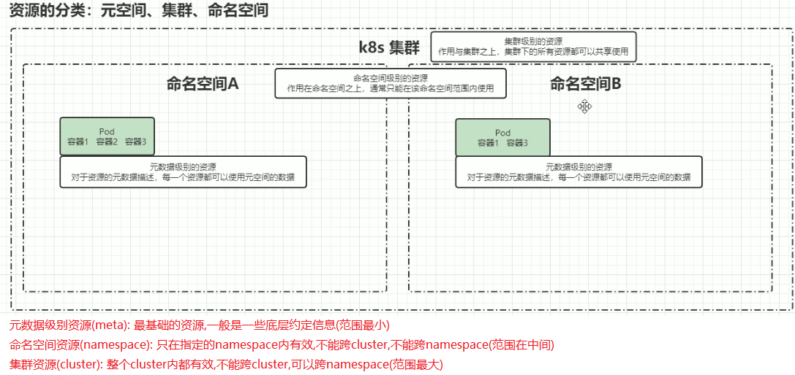

## 5.1 元数据级

+ `Horizontal Pod Autoscaler`即`HPA` **Pod自动扩容**

  Pod自动扩容：可以根据cpu使用率或自定义指标(metrics)自动对Pod进行扩容或缩容。

  + 控制器管理器每隔30s（可以通过`horizontal-pod-autoscaler-sync-period`修改）查询metrics的资源使用情况
  + 支持三种metrics类型
    + **预定义metrics**（比如Pod的CPU）以**利用率**的方式计算
    + **自定义的Pod metrics**，以**原始值**(raw value)的方式计算
    + **自定义的object metrics**
  + 支持两种metrics查询方式：`Heapster`和自定义的RESTful API
  + 支持多metrics

+ `PodTemplate`

  Pod Template是关于Pod的定义，但是被包含在其他的Kubernetes对象中（如Deployment、Statement、DaemonSet等控制器）。控制器通过Pod Template信息来创建Pod。

  `HPA`**进行自动化Pod扩/缩容就是根据此模板**

+ `LimitRange`

  可以对集群内`Request`和`Limits`的配置项做一个全局的统一的限制，相当于批量设置了某一个范围内（某个命名空间namespace）的Pod的资源使用限制。

## 5.2 集群级

+ `Namespace`

  逻辑隔离，用于将资源划分为不同的组。集群中的`namespace`可以有多个

+ `Node`  物理机

  不像其他的资源（如Pod和Namespace），Node的本质上不是Kubernetes来创建的，Kubernetes只是管理Node上的资源。虽然可以通过Manifest创建一个Node对象，但kubernetes也只是去检查是否真的有这一个Node机器。如果没有，检查就会失败，也不会在其上调度Pod。

+ `ClusterRole`

  集群角色，用于管理集群权限

+ `ClusterRoleBinding`

  将`ClusterRole`或`Role`与资源进行绑定（可以绑定到集群级别上）

## 5.3 *命名空间级*

### 5.3.1 工作负载资源

#### 5.3.1.1 `Pod` 容器组

`Pod`（容器组）是kubernetes中最小的可部署单元。一个Pod容器组包含了至少一个应用程序容器、存储资源、一个唯一的网络IP地址、以及一些确定容器该如何运行的选项。Pod容器组代表了kubernetes中一个独立的应用程序运行实例，该实例可能由单个容器或多个紧耦合在一起的容器组成。

Docker是kubernetes Pod中使用最广泛的容器引擎，当然kubernetes中也支持其他容器引擎。如containerd，CRI-O

Kubernetes集群中Pod存在如下两种使用途径：

+ 一个Pod中只运行一个容器，"one-container-per-pod"是kubernetes中最常见的使用方式。此时你可以认为Pod容器组是该容器的wrapper，kubernetes通过Pod管理容器，而不是直接管理容器。
+ 一个Pod中运行多个需要相互协作的容器。你可以将多个紧耦合、共享资源且始终在一起运行的容器编排在同一个Pod中。

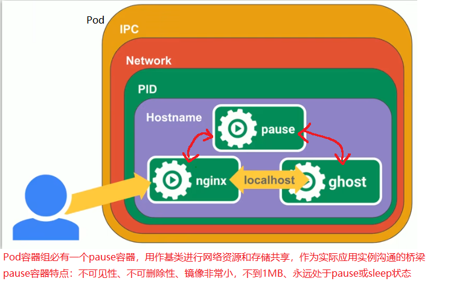

#### 5.3.1.2 `replicas` Pod副本

`replicas`Pod副本，即根据`PodTemplate`模板复制出来的。这些副本除了一些描述性信息（Pod的名字，uid等）不一样外，其他信息都是一样的：如Pod内部的容器、容器的数量、容器里面运行的应用等。

`Pod`的**控制器**通常包含一个名为`replicas`的属性。该属性则指定了特定Pod的副本数量，当当前集群中该Pod的数量与该属性指定的值不一致时，kubernetes会采取一定的策略去使得当前状态满足配置的要求。

#### 5.3.1.3 Pod控制器

Pod控制器是用于管理和维护Pod的一种机制。Pod控制器本质还是Pod，只是多了一些描述该对象的参数。类似与Pod的wrapper。Pod控制器可分为以下几类：

+ 适用无状态服务Pod控制器
+ 适用有状态服务Pod控制器
+ 守护进程Pod控制器
+ 任务/定时任务Pod控制器

##### 5.3.1.3.1 适用无状态服务Pod控制器

+ `ReplicationController`即`RC`  **只支持扩容和缩容**

  **只支持等式的selector**

  是kubernetes系统中核心概念之一。简单来说`RC`可以保证任意时间运行Pod的副本数量，能够保证Pod总是可用的。如果实际Pod数量比指定的多那么就会结束掉多余的Pod，如果Pod失败、被删除或挂掉后导致Pod实际数量比指定的少它就会自动启动新的Pod。所以即使只有一个Pod，我们也要使用`RC`管理我们的Pod，提供系统可用性。**已废弃**

+ `ReplicaSet`即`RS ` **只支持扩容和缩容**

  **支持集合式的selector**

  主要作用就是用来确保容器应用的副本数始终保持在用户预定义的数量。即如果有容器退出，会自动创建新的Pod代替；如果异常多出来的容器也会被自动回收。

  > **建议使用**`ReplicaSet`**代替**`ReplicationController`**，`RS`是`RC`的改良版，支持更复杂的标签选择器。**

+ ==`Deployment` **实际中主要用的Pod控制器**==

  该控制器是基于`RS`的进一步封装，提供了更加丰富的部署相关功能。主要有以下作用：

  + **自动创建RS和Pod**

  + **滚动升级，滚动回滚**

    不会停止服务更新，即热更新。例如`PodTemplate`更新了，会自动创建新的`RS`比如`RS-2`，然后逐步创建里面的Pod。当新的Pod创好且里面容器服务可用后，停掉原来`RS-1`中的Pod。然后逐步替代其他Pod，直至完全更新，将原来的`RS-1`保存以便于回滚。

    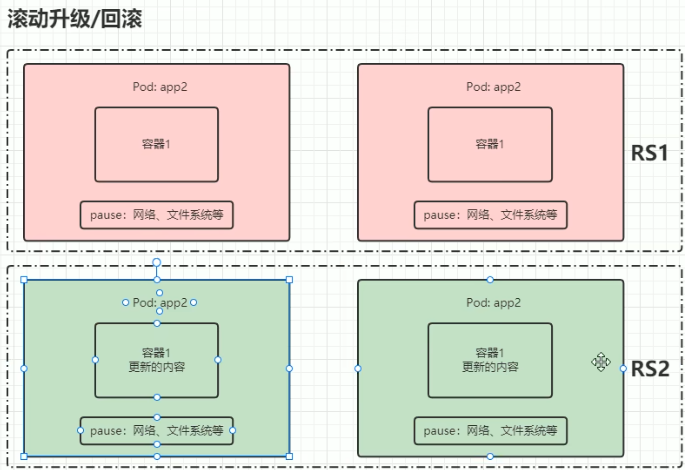

  + **平滑扩容和缩容**

    简单命令实现扩容和缩容，依赖`ReplicaSet`

  + **暂停和恢复Deployment**

    为了避免配置未修改完频繁的自动升级、降级，因为有时配置更改不是以下就改完的。

##### 5.3.1.3.2 适用有状态服务Pod控制器 `StatefulSet`

`StatefulSet`中每个Pod的DNS格式为`statefulSetName-{0...N-1}.serviceName.namespace.svc.cluster.local`，则可以通过该域名实现Pod的互相通信。

+ `statefulSetName`为`StatefulSet`的名字(必须有)
+ `0...N-1`为Pod所在的序号，从0到N-1(必须有) (**1，2组合起来就是Pod的名字**)
+ `serviceName`为`Headless Service`的名字(必须有)
+ `namespace`为服务所在的命名空间名，`Headless Service`和`StatefulSet`必须在同一命名空间`namespace` (可以不写认为是deafult)
+ `svc.cluster.local` 固定值，表示为k8s内部DNS服务

***主要特点：***

+ 稳定的持久化存储，基于volumeclaimTemplate
+ 稳定的网络标志，基于Headless Service
+ 有序部署，有序扩展  **按照Pod的0...N-1的顺序进行**，在下一个Pod运行前，它之前所有的Pod必须是Running或Ready状态，基于init containers来实现。
+ 有序收缩，有序删除  **按照Pod的N-1...0的顺序进行**，在下一个Pod运行前，它之前所有的Pod必须是shu或Ready状态，基于init containers来实现。

***组成：***

+ `Headless Service `  用于定义网络标志（DNS domain）即DNS服务。**通过服务名->域名->ip**
+ `VolumeClaimTemplate`   PVC，用于持久化数据存储的声明模板

***注意事项：***

+ kubernetes v1.5版本以上才支持
+ 所有Pod的Volume必须使用PersistentVolume或是管理员事先创建好
+ 为了保证数据安全，删除StatefulSet时不会删除Volume
+ StatefulSet需要一个Headless Service来定义DNS domain，需要在StatefulSet之前创建

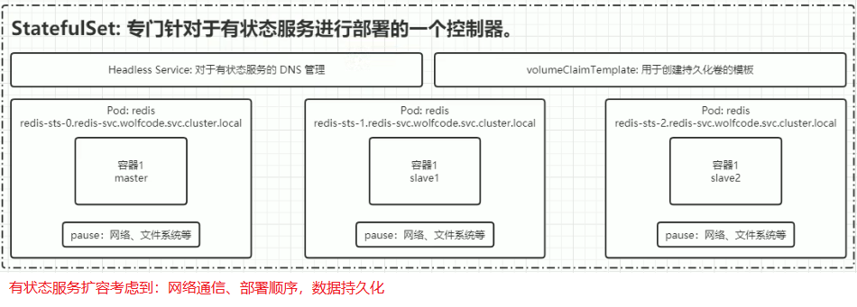

##### 5.3.1.3.3 守护进程Pod控制器 `DaemonSet`

**DaemonSet 的行为是在每个 Node 节点 上运行 一个 Pod 副本实例。DaemonSet 确保在每个节点上都有一个 Pod 运行，而不是为每个应用程序的 Pod 都附加一个守护进程。**常用来部署一些集群的日志、监控或者其他系统管理应用。典型的应用包括：

+ 日志收集，比如fluentd，logstash等
+ 系统监控，比如Prometheus Node Exporter，collectd，New Relic agent，Ganglia gmod等
+ 系统程序，比如kube-proxy，kube-dns，glusterd，ceph等

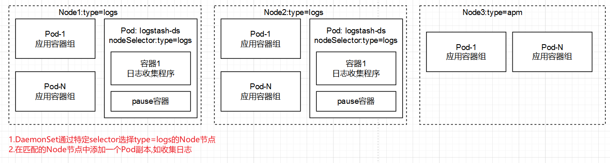

##### 5.3.1.3.4 任务/定时任务Pod控制器

+ `Job` 一次性任务（一个任务一个Pod），运行完成后Pod销毁，不再重新启动容器。如：数据初始化、下载镜像
+ `CronJob` 定时任务

### 5.3.2 服务与发现资源

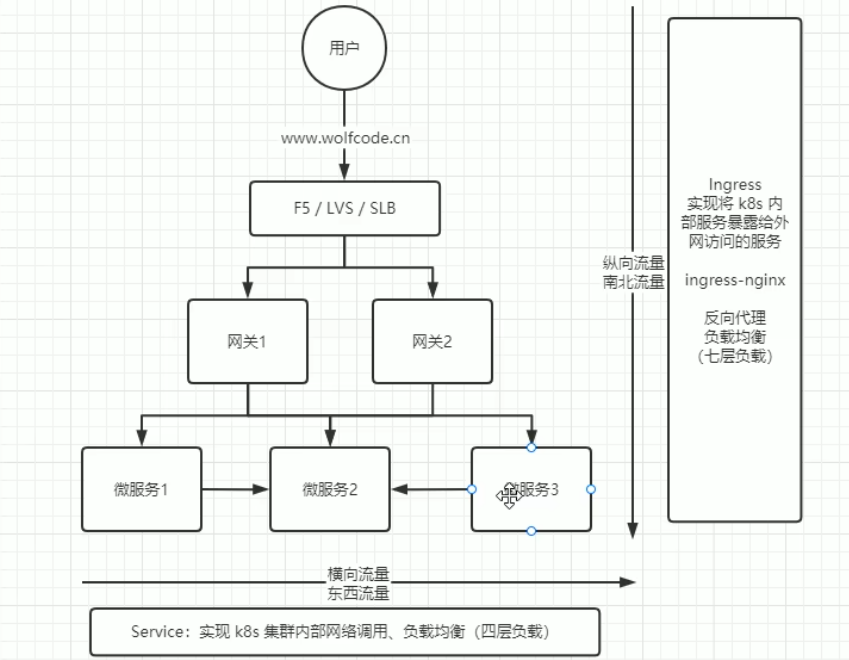

+ `Service`

  `Service`简写`svc`。**Pod不能直接提供给外网访问**，而是应该使用`Service`。`Service`**就是把Pod暴露出来提供服务**，`Service`才是真正的服务。

  可以说`Service`是一个应用服务的抽象，**定义了Pod逻辑集合和访问这个Pod集合的策略**。`Service`代理Pod集合，对外表现为一个访问入口，访问该入口的请求将经过负载均衡，转发到后端Pod中的容器。

  + **主要用于内部服务器Pod间通信**
  + **工作在TCP/IP四层网络层的，可以实现简单的外部访问**

  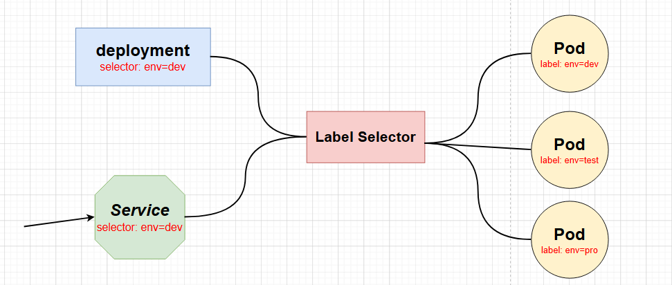

+ `Ingress`

  **Ingress** 是一种控制外部 HTTP(S) 流量如何到达集群内服务的资源。它工作在第 7 层（应用层），允许基于域名、URL 路径、HTTP headers 等路由请求，提供更高级的流量控制和负载均衡功能。

  + **基于域名、URL 路径、TLS 提供 HTTP 流量控制**
  + **提供第 7 层的负载均衡**

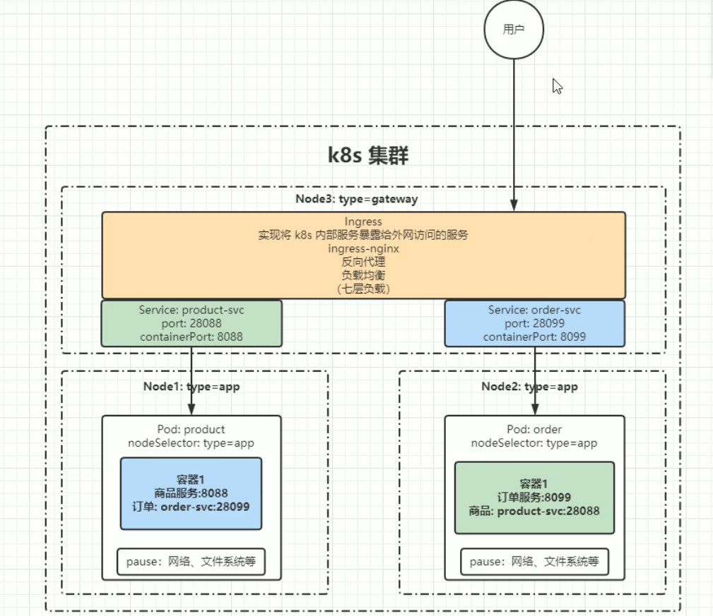

> 当需要精细化控制 HTTP/HTTPS 请求时，Ingress 是首选。而对于非 HTTP 流量（如数据库服务、gRPC 等），Service 是更合适的工具。

### 5.3.3 存储资源	

+ `Volume`

  数据卷，共享Pod中容器使用的数据。用来放持久化的数据，比如数据库数据。

  + PersistentVolume即PV
  + PersistentVolumeClaim即PVC

+ `CSI`

  `CSI`即`Contaniner Storage Interface`是由来自kubernetes，Mesos，Docker等社区成员联合制定的一个行业标准接口规范，旨在将任意存储系统暴露给容器化应用程序。

  CSI规范定义了存储提供商实现CSI兼容的Volume Plugin的最小操作集和部署建议。CSI的主要焦点是声明Volume Plugin必须实现的接口。

### 5.3.4 特殊类型配置资源

+ `ConfigMap`

  ConfigMap 包含供 Pod 使用的配置数据。存放k-v键值对（如应用的端口，数据存放路径），更新配置数ConfigMap时会自动更新容器。

+ `Secret`

  和`ConfigMap`功能完全一样，但是提供了数据加密的功能。有下面三种类型：

  + `Service Account`：用来访问kubernetes API，由kubernetes自动创建，并且会自动挂载到Pod的`/run/secrets/kubernetes.io/serviceaccount`目录中
  + `Opaque`：base64编码格式的Secret，用来存储密码，密钥等（默认方式）
  + `kubernetes.io/dockerconfigjson`：用来存储私有docker registry的认证信息

+ `DownwardAPI`

  downwardAPI这个模式和其他模式不一样的地方在于它不是为了存放容器的数据，也不是用来进行容器和宿主机的数据交换的，而是让**Pod里的容器能够直接获取这个Pod对象本身的一些信息**。

  downwardAPI提供两种方式用于将Pod的信息注入到容器内：

  + **环境变量**：用于单个变量，可以将Pod信息和容器信息直接注入容器内部
  + **volume挂载**：将Pod信息生成为文件，直接挂载到容器内部中

### 5.3.5 其他

+ `Role`

  定义一组权限，命名空间级别

+ `RoleBinding`

  将`Role`或`ClusterRole`与资源进行绑定（只能绑定到命名空间级别）

# 6. 资源清单(资源配置文件)

**其实就是资源变量(配置谁就进入对应的资源如Pod)**  https://kubernetes.io/zh-cn/docs/reference/kubernetes-api/

Kubernetes (K8s) 中的资源（Resource）可以分为多种类型，涵盖从核心的计算资源（如 Pod 和 Node）到更高层的网络、存储和安全管理工具。这些资源通常定义在 YAML 或 JSON 文件中，称为 **资源清单（Resource Manifest）**，并用于管理 Kubernetes 集群中的对象。

***举例：Pod***

```yaml
apiVersion: v1 #k8s API版本可以使用kubectl api version获取
kind: Pod #yaml文件定义的资源类型和角色
metadata: xxxx(可以细分) #元数据类型
spec: xxxx（可以细分） #详细定义对象
status: xxxx（可以细分） #实际状态
```

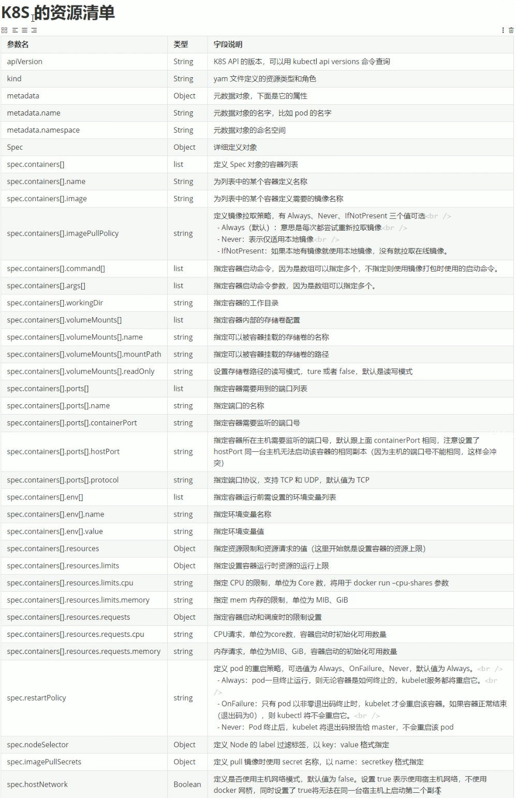

# 7. 对象规约和状态

+ ***规约(Spec)***

  `spec`是规约、规格的意思。`spec`**是必须的，手动维护yaml**，他描述了对象的期望状态(Desired State)--希望对象所具有的特征。当创建kubernetes对象时，必须提供对象的规约，用于描述该对象的期望状态，以及关于对象的一些基本信息（例如名称）。

+ ***状态(Status)***

  `status`表示对象的实际状态，该属性由kubernetes自己维护，**kubernetes**会**通过一系列的控制器**对对应对象进行管理，**让对象实际状态status尽可能符合期望状态spec**

> `spec`规约是自己维护的，期望，`status`是k8s根据实际信息采集的，实际。k8s会自动调整让实际`status`接近`spec`。

# 8. kubernetes集群搭建

https://kubernetes.io/zh-cn/docs/setup/production-environment/tools/

有下面四种搭建方式:

+ `minikube`   建议个人电脑搭建,轻量化

+ `kubeadm`  完全的看k8s

+ 二进制安装

  通过下载并手动安装 Kubernetes 的各个组件（如 kube-apiserver、kube-controller-manager、kubelet、kube-proxy 等）来构建 Kubernetes 集群。用户需要自己配置所有组件的连接和管理。

+ 命令行安装

## 8.1 `minikube`搭建k8s


## 8.2 `kubeadm`搭建k8s

### 8.2.1 服务器要求

+ 最少三台机器,一个Master,两个Node
+ 每台机器最低配置2核,2G内存,20GB硬盘
+ 最好能联网,或者有对应的镜像私有仓库

### 8.2.2 软件环境

+ 操作系统: centos7
+ Docker 20.10 (k8s 1.23.17只兼容到docker20.10)
+ k8s 1.23.17 (**1.24**版本后不支持docker)

### 8.2.3 安装步骤

1. 初始化操作(所有节点)

   ```bash
   # 关闭防火墙
   $sudo systemctl stop firewalld
   $sudo systemctl disable firewalld
   #关闭selinux
   $sudo sed -i 's/SELINUX\=enforcing/SELINUX\=disabled' /etc/selinux/config # 永久关闭
   $sudo setenforce 0#临时
   #关闭swap k8s不推荐使用swap
   $sudo swapoff -a #临时
   #注释包含swap的行 其中 -r表示正则 &表示匹配到的行 
   $sudo sed -ri 's/.*swap.*/#&/' /etc/fstab #永久 (ri顺序不能颠倒)
   #关闭完swap一定要重启机器
   
   #根据规划规则设置主机名
   $sudo cat >> /etc/hosts<< EOF
   192.168.136.151 k8s-master
   192.168.136.152 k8s-node1
   192.168.136.153 k8s-node2
   EOF
   
   #将桥接的IPV4流量传递到iptables的链
   $sudo tee /etc/sysctl.d/k8s.conf << EOF #tee读取标准输入流数据到文件中
   net.bridge.bridge-nf-call-ip6tables = 1
   net.bridge.bridge-nf-call-iptables = 1
   EOF
   $sudo sysctl --system #生效
   
   # 设置阿里云yum镜像源
   $sudo cp CentOS-Base.repo CentOS-Base.repo.bak
   $sudo curl -o CentOS-Base.repo https://mirrors.aliyun.com/repo/Centos-7.repo
   $sudo yum makecache
   #时间同步
   $sudo yum install ntpdate -y
   $sudo ntpdate time.windows.com
   $sudo systemctl enable ntpdate
   ```

2. 安装基础软件(所有节点)

   + 安装Docker

     参考文档: https://developer.aliyun.com/mirror/docker-ce?spm=a2c6h.13651102.0.0.57e31b11Oq0dHq

     ```bash
     #卸载旧版本
     $sudo yum remove docker \
                       docker-client \
                       docker-client-latest \
                       docker-common \
                       docker-latest \
                       docker-latest-logrotate \
                       docker-logrotate \
                       docker-engine
     # 设置yum仓库  docker换成阿里云仓库会更快
     $sudo yum install -y yum-utils
     ## Step 2: 添加软件源信息 这里是 docker-ce二进制包的位置,不是镜像的地址
     $sudo yum-config-manager --add-repo https://mirrors.aliyun.com/docker-ce/linux/centos/docker-ce.repo
     # 列出可用docker旧版本
     $sudo yum list docker-ce.x86_64 --showduplicates | sort -r 
     #docker-ce.x86_64            3:20.10.24-3.el7                    docker-ce-stable
     #docker-ce.x86_64            3:26.1.4-1.el7                      docker-ce-stable
     # 不确定版本号,可以一个一个试试实际是(20.10.24-3.el7)
     # 安装docker engine 指定版本
     $sudo yum remove -y docker-ce docker-ce-cli containerd.io docker-compose-plugin docker-buildx-plugin
     $sudo yum install docker-ce-20.10.24-3.el7  \
      docker-ce-cli-20.10.24-3.el7  \
      containerd.io #配合k8s 其他插件可以不安装如docker-compose-plugin, docker-buildx-plugin安装失败,需要找到合适的版本(用于构建镜像)
     $yum list installed|grep docker
     $sudo systemctl start docker
     $sudo systemctl enable docker
     ```

     > **docker-ce是docker引擎本身, docker-ce-cli是命令行工具执行docker ps等命令, containerd.iodocker运行的守护进程, docker-buildx-plugin为跨平台构建镜像, ocker-compose-plugin为简单的容器编排**

   + 设置docker镜像地址

     ```bash
     $sudo tee /etc/docker/daemon.json <<EOF
     {
       "registry-mirrors": ["https://docker.registry.cyou","https://dockerpull.com","https://docker.rainbond.cc","https://docker.udayun.com"]
     }
     EOF
     $sudo systemctl daemon-reload
     $sudo systemctl restart docker
     ```

   + 配置docker的`cgroupdriver=systemd`驱动(**所有节点**)

     ```bash
   $sudo docker info|grep group
     # 如果输出 Cgroup Driver: cgroupfs
     $sudo vim /etc/docker/daemon.json
     #增加以下配置
     {
       "registry-mirrors":[..],
       "exec-opts": ["native.cgroupdriver=systemd"]#修改cgroupfs
     }
     #保存后
     $sudo systemctl daemon-reload
     $sudo systemctl restart docker
     #再次确认
     $sudo docker info|grep group
     ```

   + 设置kubernetes-yum镜像地址 (**旧版本安装方式**)

     参考文档:https://developer.aliyun.com/mirror/kubernetes?spm=a2c6h.13651102.0.0.73281b11CoAoOZ

     ```bash
     $sudo tee /etc/yum.repos.d/kubernetes.repo <<EOF
     [kubernetes]
     name=Kubernetes
     baseurl=https://mirrors.aliyun.com/kubernetes/yum/repos/kubernetes-el7-x86_64
     enabled=1
     gpgcheck=0
     repo_gpgcheck=0
     
     gpgkey=https://mirrors.aliyun.com/kubernetes/yum/doc/yum-key.gpg https://mirrors.aliyun.com/kubernetes/yum/doc/rpm-package-key.gpg
     EOF
     $sudo yum clean all && sudo yum makecache
     ```

     > 这个是管**二进制文件kubelet,kubeadm,kubectl,kubernetes等这些rpm软件包的**

   + 安装`kubeadm`,`kubelet`,`kubectl`

     ```bash
     $sudo yum install -y kubelet-1.23.17 kubeadm-1.23.17 kubectl-1.23.17
     $yum list installed|grep kube
     #$sudo systemctl start kubelet #这一步无法启动kubelet,必须在kubeadm init中才会生产配置文件启动kubelet
     $sudo systemctl enable kubelet
     ```
     
     > `kubelet`安装后无法成功启动,这是因为没有配置文件.在后续执行`kubeam init/join`后会自动运行不用管(前提改好了`cgroup`)

3. 部署Kubernetes Master

   参考地址: https://kubernetes.io/zh-cn/docs/setup/production-environment/tools/kubeadm/create-cluster-kubeadm/

   ```bash
   #在master节点执行
   #如果第一次初始化失败,重新初始化前执行
   $sudo kubeadm reset
   $sudo kubeadm init \ #用于搭建控制面板master节点
    --apiserver-advertise-address=192.168.136.151 \ #指定apiserver地址
    # dockerpull.com为第三方镜像源地址,dyrnq为docker hub用户下的镜像仓库
    --image-repository dockerpull.com/dyrnq \ #指定5大组件kube-apiserver,etcd等镜像下载地址,阿里云的registry.aliyuncs.com/google_containers\废了
    --kubernetes-version v1.23.17 \ #指定kubernetes版本
    --service-cidr=10.96.0.0/12 \ #指定service资源网段地址(横向流程,内部服务通信即Pod间通信)
    --pod-network-cidr=10.244.0.0/16 #指定Pod资源网段地址
    # 安装成功提示 
    # Your Kubernetes control-plane has initialized successfully!
    
   #安装成功后,复制如下配置并执行
   $sudo mkdir -p $HOME/.kube
   $sudo cp -i /etc/kubernetes/admin.conf $HOME/.kube/config
   $sudo chown $(id -u):$(id -g) $HOME/.kube/config
   $sudo kubectl get nodes
   ```

   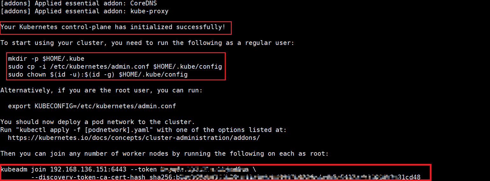

   ***kubelet启动错误原因:***

   + `journalctl -xefu kubelet`查看日志 

     ```bash
     Sep 19 21:05:23 k8s-master kubelet[28522]: E0919 21:05:23.719569   28522 server.go:302] "Failed to run kubelet" err="failed to run Kubelet: misconfiguration: kubelet cgroup driver: \"systemd\
     ```

     **解决方法:**

     ```bash
     $sudo docker info | grep -i cgroup
     #输出为cgroupfs 改为systemd
     # Cgroup Driver: cgroupfs
     # Cgroup Version: 1
     
     
     $sudo vim /etc/docker/daemon.json
     #增加以下配置
     {
       "registry-mirrors":[..],
       "exec-opts": ["native.cgroupdriver=systemd"]#修改cgroupfs
     }
     $sudo systemctl restart docker
     $sudo systemctl start kubelet
     ```

   + `journalctl -xefu kubelet`查看日志 

     ```bash
     Sep 19 21:17:59 k8s-node1 kubelet[21589]: E0919 21:17:59.436820   21589 server.go:205] "Failed to load kubelet config file" err="failed to load Kubelet config file /var/lib/kubelet/config.yam
     ```

     这是因为没有执行`kubeadm init`就启动`kubelet`服务,`kubelet`的配置文件还没生成.必须先执行`kubeadm init`

   > + `kubeadm init`命令option参考地址 https://kubernetes.io/zh-cn/docs/reference/setup-tools/kubeadm/kubeadm-init/
   > + `--image-repository`和上面设置的`/etc/yum.repo.d/kubernetes.repo`功能不一样,`kubernetes.repo`主要用于**rpm二进制软件包kubelet,kubectl,kubeadm,kubernetes**的安装. 而`--image-repository`中指定的地址是容器镜像地址,主要用于**控制面板master节点的5大组件(kube-apiserver,etcd等等)镜像安装**

4. 部署Kubernetes Node,加入集群中(**在两个Node节点上执行**)

   参考地址: https://kubernetes.io/zh-cn/docs/reference/setup-tools/kubeadm/kubeadm-join/

   ```bash
   # 1.获取集群token值(master节点运行)
   $sudo kubeadm token list 
   # 如果集群token值已经过期,重新生成token(master节点运行)
   $sudo kubeadm token create
   
   # 2.获取集群ca证书hash值(master节点运行)
   $openssl x509 -pubkey -in /etc/kubernetes/pki/ca.crt | openssl rsa -pubin -outform der 2>/dev/null | openssl dgst -sha256 -hex | sed 's/^.* //'
   
   # 如果第3步失败了,Node节点上可以运行
   $sudo kubeadm reset
   # 3.在node机器上执行下面语句,正式加入master集群(node1,2节点运行)
   $sudo kubeadm join 192.168.136.151:6443 \ #master节点的apiserver地址别忘了
    --token $(sudo kubeadm token list|awk 'NR==2{print $1}') \ # 步骤1的值,不推荐一步到位,自己复制最好
    --discovery-token-ca-cert-hash sha256:xxxxxx #步骤2的值
   
   #master节点上验证
   $kubectl get nodes
   
   # 成功加入master集群后,Node节点的kubelet服务也自动运行了
   ```

   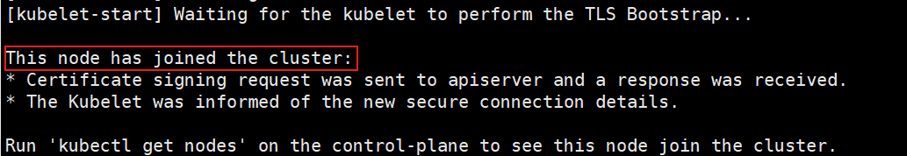

   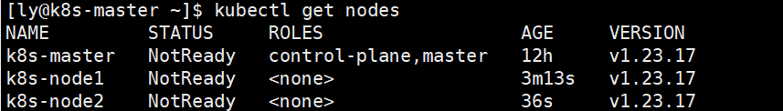

5. 部署CNI网络插件(**以calico为例,还有flannel**)

   参考地址: https://www.zhaowenyu.com/kubernetes-doc/install/follow-me-install-kubernetes-cluster/06-6.calico.html

   ```bash
   $kubectl get nodes # 发现集群三个节点都是**NotReady**状态
   $kubectl get pods -n kube-system #发现coredns为pending暂停状态(-n 指定命名空间)
   NAME                                 READY   STATUS    RESTARTS      AGE
   coredns-6c589f9dc8-67stg             0/1     Pending   0             13h # 暂停,ready状态为0
   coredns-6c589f9dc8-fkjfc             0/1     Pending   0             13h
   etcd-k8s-master                      1/1     Running   2 (12h ago)   13h
   kube-apiserver-k8s-master            1/1     Running   2 (12h ago)   13h
   ...
   #PS:获取更多资源信息 使用kubectl api-resources获取资源及其缩写
   # 1.(master节点)下载calico配置文件
   $wget -o calico.yaml https://docs.projectcalico.org/manifests/calico.yaml
   $curl -L -e ';auto' -o calico.yaml https://docs.projectcalico.org/manifests/calico.yaml  #没有的话自己创建(目录随意)
   		# -L 跟随重定向
   		# -e ';auto'跟踪重定向时传递Referer头信息
   # 2.(master节点)修改calico配置文件,
   # 修改cidr IP地址端和kubeadm init初始化时--pod-network-cidr地址段一致
   找到 'CALICO_IPV4POOL_CIDR', 将value改为 10.244.0.0/16# 如果发现该段被注释不改也可以,apply应用时会自动使用pod的网络端;
   - name: CALICO_IPV4POOL_CIDR
     value: "10.244.0.0/16" #该值为master节点执行kubeadm init时的参数
   #修改网卡名 (如果新版本找不到 IP_AUTODETECTION_METHOD 就不用管了)
   - name: IP_AUTODETECTION_METHOD #找不到就不管了
     value: "interface=eth.*"
   # 3.修改calico中镜像地址 (master节点)
   $grep image calico.yaml
   	image: docker.io/calico/cni:v3.25.0 #将前面的docker.io去掉
       imagePullPolicy: IfNotPresent
       ...
   $sed -i 's/image: docker.io\//image: /' calico.yaml #只替换每行第一个
   $sed -i 's#image: docker.io/#image: #g' calico.yaml #全局替换 (#和/一样为分隔符,可以自己随意指定,只要没有歧义就行)
   # 4.(所有节点Master+Node) 提前将所有的镜像拉取下来 
   $sudo docker pull dockerpull.com/calico/cni:v3.25.0 # (Node节点必备)
   $sudo docker pull calico/node:v3.25.0 #如果docker已配置镜像源,可以不指定仓库镜像地址 # (Node节点必备)
   $sudo docker pull calico/kube-controllers:v3.25.0 # (Master节点必备)
   # 5. (master节点) 应用配置文件到资源
   $kubectl apply -f calico.yaml #如果没问题,很快结束
   
   # 6. (master节点)查看Pod资源状态 
   $kubectl get pods -n kube-system #发现calico-node节点正在执行初始化操作...
       NAME                                     READY   STATUS     RESTARTS      AGE
       calico-kube-controllers-cd8566cf-d7twm   1/1     Running    0             82s
       calico-node-d9vdx                        0/1     Init:0/3   0             82s #等待变为1/1 ready running状态
       calico-node-dl2jm                        0/1     Init:0/3   0             82s
       calico-node-swl7r                        1/1     Running    0             82s
   	... 
   # 7. 查看每个pod资源的信息进度
   $kubectl describe pods calico-node-d9vdx -n kube-system
   $kubectl describe pods calico-node-dl2jm -n kube-system
   
   # 8. 查看所有节点状态(发现都是ready)
   $kubectl get no #no=nodes缩写
   # 9. 如果pods始终无法运行起来,就可以将其删除重新应用apply
   ```

   > `kubectl apply`参考 https://kubernetes.io/zh-cn/docs/reference/kubectl/generated/kubectl_apply/

6. 测试kubernetes集群(**master节点**)

   ```bash
   #全在master节点执行
   # 1.创建无状态Pod控制器deployment 下载镜像nginx
   $kubectl create deployment nginx --image=nginx
   $kubectl get deploy #查看default默认命名空间的deployment无状态服务Pod控制器
   # 2.通过service暴露端口
   $kubectl expose deployment nginx --port=80 --type=NodePort
   # 3.查看默认namespace 的pod及服务信息(获取80的映射端口)]
   $kubectl get pod,svc
   ```

   > 参考地址  https://kubernetes.io/zh-cn/docs/reference/kubectl/generated/kubectl_create/kubectl_create_deployment/

   **验证:**

   + 访问`192.168.136.151:31224`成功显示nginx页面
   + 访问`192.168.136.152:31224`成功显示nginx页面
   + 访问`192.168.136.153:31224`成功显示nginx页面

   **解析:**

   31224是service暴露Node端口时自动指定的端口,实际上只有node2节点(**随机一个node节点**)真正下载并运行了nginx镜像,但是三个ip都可以访问

## 8.3 二进制安装k8s


## 8.4 命令行工具安装k8s

# 9. *kubectl*命令行工具

Kubernetes提供kubectl是使用kubernetes API与kubernetes集群的控制面板(Control panel)进行通信的命令行工具.

kubectl命令手册参考文档： https://kubernetes.io/docs/reference/generated/kubectl/kubectl-commands#-strong-getting-started-strong-

## 9.1 在任意节点上使用kubectl

默认`kubectl`只能在Master节点上使用,在任意Node节点执行失败,提示:

```bash
The connection to the server localhost:8080 was refused - did you specify the right host or port?
```

***原因:***

这是因为没有正确配置kubeconfig

+  kubectl首先会先检查是否存在`$KUBECONFIG`这个环境变量，如果不存在进行下一步
+  判断`~/.kube/config`配置文件(**该文件就是master节点的/etc/kubernetes/admin.conf文件**)是否存在，如果不存在进行下一步
+  默认访问`localhost:8080`

***解决方法：***

+ 方法1：**将master节点下/etc/kubernetes/admin.conf文件内容拷贝到Node节点的**`~/.kube/config`**文件中**

  ```bash
  $mkdir .kube
  $scp root@k8s-master:/etc/kubernetes/admin.conf ~/.kube
  $mv ~/.kube/admin.conf ~/.kube/config
  $sudo chown $(id -u):$(id -g) ~/.kube/config
  # ok
  $kubectl get nodes
  ```

+ 方法2： **将master节点下/etc/kubernetes/admin.conf文件拷贝到Node节点的任意位置，在**`~/.bash_profile`**中配置环境变量KUBECONFIG=admin.conf文件位置**

  ```bash
  $mkdir .kube
  $sudo scp root@k8s-master:/etc/kubernetes/admin.conf ~/.kube #放在这里因为etc中需要root权限
  $sudo chown $(id -u):$(id -g) ~/.kube/admin.conf
  $echo "export KUBECONFIG=~/.kube/admin.conf" >> ~/.bash_profile
  $source ~/.bash_profile
  $kubectl get nodes
  ```

## 9.2 自动补全

 官网连接：https://kubernetes.io/zh-cn/docs/tasks/tools/install-kubectl-linux/#enable-shell-autocompletion

自动补全实例

```bash
# 自动补全命令
kubectl [Tab]
kubectl get [Tab]
# 自动补全资源名称
kubectl describe deployment [Tab]
# 自动补全命名空间
kubectl get pods -n [Tab]
# 自动补全选项
kubectl get pods --[Tab]
# 自动补全 context 和 cluster
kubectl config use-context [Tab]
# 自动补全日志命令
kubectl logs [Tab]
```

***针对bash：***

+ 安装依赖包`bash-completion`，会生成`/usr/share/bash-completion/bash_completion`文件

+ 将下面命令追加到`~/.bashrc`中

  ```bash
  $echo "source /usr/share/bash-completion/bash_completion" >> ~/.bashrc
  $source ~/.bashrc
  ```

+ 执行`type _init_com` 按下tab三次，查看是否会列出命令 （能列出就成功了）

+ 然后将kubernetes中自动补全脚本加入环境变量

  ```bash
  $echo 'source <(kubectl completion bash)' >>~/.bashrc
  ```

+ 如果kubectl有别名，也可以扩展shell补全来适配别名

  ```bash
  $echo 'source <(kubectl completion bash)' >>~/.bashrc #缩写这个也必须加
  $echo 'alias k=kubectl' >>~/.bashrc
  $echo 'complete -o default -F __start_kubectl k' >>~/.bashrc
  ```

+ 更新环境变量`source .bashrc`

## 9.3 *资源操作*

P25 4分14

+ 创建对象
+ 显示和查找资源
+ 更新资源
+ 修补资源
+ 编辑资源
+ scale资源
+ 删除资源

## 9.4 Pod与集群

+ 与运行的Pod交互
+ 与节点和集权交互

## 9.5 资源类型与别名

+ pods  po
+ deployments  deploy
+ services  svc
+ namespace  ns
+ nodes  no

## 9.6 格式化输出

+ 输出json格式  `-o json`
+ 仅打印资源名称  `-o name`
+ 以纯文本格式输出所有信息  `-o wide`
+ 输出yaml格式  `-o yaml`

# 10. API概述

REST API 是 Kubernetes 的基本结构。 所有操作和组件之间的通信及外部用户命令都是调用 API 服务器处理的 REST API。 因此，Kubernetes 平台视一切皆为 API 对象， 且它们在 [API](https://kubernetes.io/docs/reference/generated/kubernetes-api/v1.31/) 中有相应的定义。

官网文档：https://kubernetes.io/zh-cn/docs/reference/using-api/

## 10.1 API 版本控制

+ `Alpha`

  - 版本名称包含 `alpha`（例如：`v1alpha1`）。
  - 内置的 Alpha API 版本默认被禁用且必须在 `kube-apiserver` 配置中显式启用才能使用。
  - 软件可能会有 Bug。启用某个特性可能会暴露出 Bug。
  - 对某个 Alpha API 特性的支持可能会随时被删除，恕不另行通知。
  - API 可能在以后的软件版本中以不兼容的方式更改，恕不另行通知。
  - 由于缺陷风险增加和缺乏长期支持，建议该软件仅用于短期测试集群。

+ `Beta`

  - 版本名称包含 `beta`（例如：`v1beta1`）。
  - 内置的 Beta API 版本默认被禁用且必须在 `kube-apiserver` 配置中显式启用才能使用 （例外情况是 Kubernetes 1.22 之前引入的 Beta 版本的 API，这些 API 默认被启用）。
  - 内置 Beta API 版本从引入到弃用的最长生命周期为 9 个月或 3 个次要版本（以较长者为准）， 从弃用到移除的最长生命周期为 9 个月或 3 个次要版本（以较长者为准）。
  - 软件被很好的测试过。启用某个特性被认为是安全的。
  - 尽管一些特性会发生细节上的变化，但它们将会被长期支持。

  - 在随后的 Beta 版或 Stable 版中，对象的模式和（或）语义可能以不兼容的方式改变。 当这种情况发生时，将提供迁移说明。 适配后续的 Beta 或 Stable API 版本可能需要编辑或重新创建 API 对象，这可能并不简单。 对于依赖此功能的应用程序，可能需要停机迁移。
  - 该版本的软件不建议生产使用。 后续发布版本可能会有不兼容的变动。 一旦 Beta API 版本被弃用且不再提供服务， 则使用 Beta API 版本的用户需要转为使用后续的 Beta 或 Stable API 版本。

+ `Stable`

  - 版本名称如 `vX`，其中 `X` 为整数。
  - 特性的 Stable 版本会出现在后续很多版本的发布软件中。 Stable API 版本仍然适用于 Kubernetes 主要版本范围内的所有后续发布， 并且 Kubernetes 的主要版本当前没有移除 Stable API 的修订计划。

## 10.2 访问控制

官网文档 https://kubernetes.io/zh-cn/docs/reference/access-authn-authz/

用户使用 `kubectl`、客户端库或构造 REST 请求来访问 [Kubernetes API](https://kubernetes.io/zh-cn/docs/concepts/overview/kubernetes-api/)。 人类用户和 [Kubernetes 服务账号](https://kubernetes.io/zh-cn/docs/tasks/configure-pod-container/configure-service-account/)都可以被鉴权访问 API。 当请求到达 API 时，它会经历多个阶段，如下图所示：

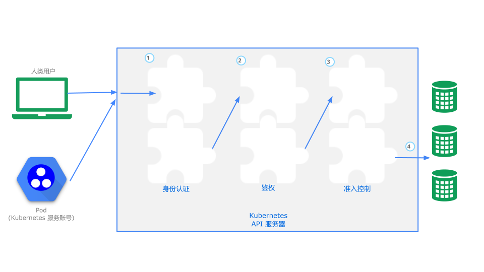

+ 传输安全

  默认情况下，Kubernetes API 服务器在第一个非 localhost 网络接口的 6443 端口上进行监听， 受 TLS 保护。在一个典型的 Kubernetes 生产集群中，API 使用 443 端口。 该端口可以通过 `--secure-port` 进行变更，监听 IP 地址可以通过 `--bind-address` 标志进行变更。

  API 服务器出示证书。该证书可以使用私有证书颁发机构（CA）签名，也可以基于链接到公认的 CA 的公钥基础架构签名。 该证书和相应的私钥可以通过使用 `--tls-cert-file` 和 `--tls-private-key-file` 标志进行设置。

  如果你的集群使用私有证书颁发机构，你需要在客户端的 `~/.kube/config` 文件中提供该 CA 证书的副本， 以便你可以信任该连接并确认该连接没有被拦截。

  你的客户端可以在此阶段出示 TLS 客户端证书。

+ 认证

  如上图步骤 **1** 所示，建立 TLS 后， HTTP 请求将进入认证（Authentication）步骤。 集群创建脚本或者集群管理员配置 API 服务器，使之运行一个或多个身份认证组件。 身份认证组件在[认证](https://kubernetes.io/zh-cn/docs/reference/access-authn-authz/authentication/)节中有更详细的描述。

  认证步骤的输入整个 HTTP 请求；但是，通常组件只检查头部或/和客户端证书。

  认证模块包含客户端证书、密码、普通令牌、引导令牌和 JSON Web 令牌（JWT，用于服务账号）。

  可以指定多个认证模块，在这种情况下，服务器依次尝试每个验证模块，直到其中一个成功。

  如果请求认证不通过，服务器将以 HTTP 状态码 401 拒绝该请求。 反之，该用户被认证为特定的 `username`，并且该用户名可用于后续步骤以在其决策中使用。 部分验证器还提供用户的组成员身份，其他则不提供。

+ 授权

  如上图的步骤 **2** 所示，将请求验证为来自特定的用户后，请求必须被鉴权。

  请求必须包含请求者的用户名、请求的行为以及受该操作影响的对象。 如果现有策略声明用户有权完成请求的操作，那么该请求被鉴权通过。

+ 准入控制

  准入控制模块是可以修改或拒绝请求的软件模块。 除鉴权模块可用的属性外，准入控制模块还可以访问正在创建或修改的对象的内容。

  准入控制器对创建、修改、删除或（通过代理）连接对象的请求进行操作。 准入控制器不会对仅读取对象的请求起作用。 有多个准入控制器被配置时，服务器将依次调用它们。

  这一操作如上图的步骤 **3** 所示。

  与身份认证和鉴权模块不同，如果任何准入控制器模块拒绝某请求，则该请求将立即被拒绝。

  除了拒绝对象之外，准入控制器还可以为字段设置复杂的默认值。

  可用的准入控制模块在[准入控制器](https://kubernetes.io/zh-cn/docs/reference/access-authn-authz/admission-controllers/)中进行了描述。

  请求通过所有准入控制器后，将使用检验例程检查对应的 API 对象，然后将其写入对象存储（如步骤 **4** 所示）。

+ 审计

  Kubernetes 审计提供了一套与安全相关的、按时间顺序排列的记录，其中记录了集群中的操作序列。 集群对用户、使用 Kubernetes API 的应用程序以及控制平面本身产生的活动进行审计。

  更多信息请参考[审计](https://kubernetes.io/zh-cn/docs/tasks/debug/debug-cluster/audit/)。

## 10.3 废弃API说明

官网文档：https://kubernetes.io/zh-cn/docs/reference/using-api/deprecation-guide/

+ 注意有些功能在指定版本废弃

+ 注意有些功能从测试版本如Beta转移到正式版

+ ### 定位何处使用了已弃用的 API

  使用 [1.19 及更高版本中可用的客户端警告、指标和审计信息](https://kubernetes.io/zh-cn/blog/2020/09/03/warnings/#deprecation-warnings) 来定位在何处使用了已弃用的 API

+ ### 迁移到未被弃用的 API

  + 安装`kubectl convert`插件： https://kubernetes.io/zh-cn/docs/tasks/tools/install-kubectl-linux/#install-kubectl-convert-plugin
  + 迁移指南： https://kubernetes.io/zh-cn/docs/reference/using-api/deprecation-guide/#%E8%BF%81%E7%A7%BB%E5%88%B0%E6%9C%AA%E8%A2%AB%E5%BC%83%E7%94%A8%E7%9A%84-api

  

# 11. kubernetes二进制组件介绍(yum包)

+ `cri-tools` (Container Runtime Interface Tools)  **用于与k8s中运行的容器进行交互，适用于代替docker的containerd**

  即使用containerd代替docker作为容器引擎时，使用该工具直接和容器进行交互。

  + `crictl`  命令与支持CRI接口的容器进行交互（类似docker命令）
  + `critest` 用于测试CRI实现是否符合Kubernetes的规范

+ `kubeadm`  **k8s集群引导安装工具**

+ `kubectl` **k8s命令行工具，直接与k8s集群进行交互**

+ `kubelet`  **核心组件，负责管理节点上的所有Pod和容器**

  是节点的核心守护进程，持续确保容器在节点上的运行，接收来自 Kubernetes API Server的指令。主要负责监控容器状态，创建或销毁容器，汇报节点和Pod的健康状态。（最底层的工具）

+ `kubernetes-cni`(Container Network Interface)  **提供k8s网络层面的接口和插件**

  提供的CNI插件为容器配置网络，保证不同节点上的Pod间可以通信。

# 12. k8s操作的完整流程

1. **`kubectl` 发送请求到 `kube-apiserver`**：
   - 当你使用 `kubectl` 命令（如 `kubectl apply` 或 `kubectl create`）时，`kubectl` 会将请求发送到 **`kube-apiserver`**。`kube-apiserver` 是 Kubernetes 集群的 API 入口，负责接收和处理所有请求。
2. **`kube-apiserver` 处理请求**：
   - `kube-apiserver` 会验证请求的合法性，并根据请求内容与 **`etcd`** 交互，存储或检索集群的状态数据。比如，当你创建一个 Pod 时，`kube-apiserver` 会将该 Pod 的定义写入到 `etcd` 中。
3. **调度器和控制器的角色**：
   - 当 `kube-apiserver` 确认了一个新的 Pod 需要创建时，它不会直接通知 `kubelet`。而是 **`kube-scheduler`** 负责决定哪个节点（Node）可以运行该 Pod。
   - **`kube-scheduler`** 会检查所有节点的资源情况（如 CPU、内存等），然后选择一个合适的节点，将该 Pod 分配到这个节点。
4. **`kube-apiserver` 通知对应节点的 `kubelet`**：
   - 一旦调度器将 Pod 分配到某个节点上，**`kube-apiserver`** 会通知该节点上的 **`kubelet`**，让 `kubelet` 在该节点上启动相应的容器。
   - `kubelet` 从 `kube-apiserver` 获取 Pod 定义，然后根据定义拉取镜像、创建容器，并监控容器的运行状态。

> ### **`kube-controller-manager` 的作用**
>
> `kube-controller-manager` 并不会参与每次的 Pod 创建请求。它的主要职责是通过控制循环（control loop）来持续监控集群的状态，并根据需要执行相应的操作，比如：
>
> - 确保 Pod 副本数正确（如 Deployment 或 ReplicaSet 控制器）。
> - 处理节点状态变化（如节点失效）。
> - 监控资源对象（如 PersistentVolume 和 PersistentVolumeClaim 的绑定）。

# 13. *namespace和Master,Node,Pods,Service的关系*

## 13.1 关系

1. 首先牢记命名空间**namespace是一个虚拟概念**,用于进行**Node节点上的资源的逻辑隔离**（如Pod，Service）

2. 总的来说命名空间**namespace是针对整个集群**来说的，它**并不会只存在Node节点**上，但是它的**作用更多体现在Node节点**上（因为我们一般操作的具体实现都是在Node节点上）

3. kubernetes集群有下面四个默认命名空间namespace

   + `default` 

     k8s默认的命名空间，用于**存放没有指定命名空间的资源**如Pod，Service

   + `kube-node-lease`

     **用于管理节点的租约（lease）**，通过租约对象来确认节点的健康状态。

   + `kube-public`

     用于存放公共资源，可被所有用户获取（包括未认证的用户）。一般用于存放集群的公共信息。

   + `kube-system`

     用于存放kubernetes系统级别的组件和服务。如**kube-apiserver,kube-scheduler,kube-controller-manager,etcd,coredns,kube-proxy**。用户一般不应在此命名空间进行数据的修改

   + 其他

     用户通过**kubectl create namespace xxx**创建的

4. **一个命名空间namespace可以有多个独立的Node节点，同样一个Node节点可以有多个命名空间namespace**

5. **service是一个逻辑对象，它本身并不会绑定到某个特点的Node**，他是集群范围内的资源。

   Service转发流量的具体步骤

   + 客户端(通常是其他Pod)请求Service的 `ClusterIP` 或 `NodePort` 访问服务

   + kube-proxy捕获流量，**流量总是首先在发起请求的 Node 上被捕获**

     即如果我使用node1的ip:port访问那么就先被node1上kube-proxy捕获；如果我使用master的ip:port访问那么就先被master上kube-proxy捕获；

   + 流量转发到Pod

     `kube-proxy` 通过 `Endpoints` 对象查找当前与 Service 关联的 Pod 的 IP 地址，并将流量转发到这些 Pod 上。如果有多个 Pod，`kube-proxy` 还会对流量进行负载均衡，将流量分配给不同的 Pod

6. 1

## 13.2 实际服务架构图

```bash
# 查看所有节点的所有命名空间下pods（master机器）
$kubectl get pods --all-namespaces -o wide
#命名空间	   Pods的名字							                                                             归属节点
NAMESPACE     NAME                                     READY   STATUS    RESTARTS      AGE   IP                NODE         NOMINATED NODE   READINESS GATES
default       nginx-85b98978db-dbjl7                   1/1     Running   1 (12h ago)   18h   10.244.169.130    k8s-node2    <none>           <none>
kube-system   calico-kube-controllers-cd8566cf-d7twm   1/1     Running   1 (12h ago)   18h   10.244.235.196    k8s-master   <none>           <none>
kube-system   calico-node-d9vdx                        1/1     Running   1 (12h ago)   18h   192.168.136.153   k8s-node2    <none>           <none>
kube-system   calico-node-dl2jm                        1/1     Running   1 (12h ago)   18h   192.168.136.152   k8s-node1    <none>           <none>
kube-system   calico-node-swl7r                        1/1     Running   1 (12h ago)   18h   192.168.136.151   k8s-master   <none>           <none>
kube-system   coredns-6c589f9dc8-67stg                 1/1     Running   1 (12h ago)   36h   10.244.235.198    k8s-master   <none>           <none>
kube-system   coredns-6c589f9dc8-fkjfc                 1/1     Running   1 (12h ago)   36h   10.244.235.197    k8s-master   <none>           <none>
kube-system   etcd-k8s-master                          1/1     Running   3 (12h ago)   36h   192.168.136.151   k8s-master   <none>           <none>
kube-system   kube-apiserver-k8s-master                1/1     Running   3 (12h ago)   36h   192.168.136.151   k8s-master   <none>           <none>
kube-system   kube-controller-manager-k8s-master       1/1     Running   3 (12h ago)   36h   192.168.136.151   k8s-master   <none>           <none>
kube-system   kube-proxy-8c6h6                         1/1     Running   2 (12h ago)   36h   192.168.136.151   k8s-master   <none>           <none>
kube-system   kube-proxy-9bgbp                         1/1     Running   1 (12h ago)   23h   192.168.136.152   k8s-node1    <none>           <none>
kube-system   kube-proxy-wgb4z                         1/1     Running   1 (12h ago)   23h   192.168.136.153   k8s-node2    <none>           <none>
kube-system   kube-scheduler-k8s-master                1/1     Running   3 (12h ago)   36h   192.168.136.151   k8s-master   <none>           <none>
# 查看master机器上运行的镜像
$sudo docker ps
CONTAINER ID   IMAGE                            COMMAND                  CREATED       STATUS       PORTS     NAMES
4335e2434fb4   a4ca41631cc7                     "/coredns -conf /etc…"   6 hours ago   Up 6 hours             k8s_coredns_coredns-6c589f9dc8-67stg_kube-system_65b3a6d9-d59d-4964-9865-12d26da04e4a_1
2c935be5d5f6   5e785d005ccc                     "/usr/bin/kube-contr…"   6 hours ago   Up 6 hours             k8s_calico-kube-controllers_calico-kube-controllers-cd8566cf-d7twm_kube-system_7c20615f-dbcc-4d81-9979-fa0494bb48bf_1
7eaf0a6c9243   a4ca41631cc7                     "/coredns -conf /etc…"   6 hours ago   Up 6 hours             k8s_coredns_coredns-6c589f9dc8-fkjfc_kube-system_caaa1d1a-1521-4df7-a231-9c3545bc5a44_1
18bec59f5a25   dockerpull.com/dyrnq/pause:3.6   "/pause"                 6 hours ago   Up 6 hours             k8s_POD_calico-kube-controllers-cd8566cf-d7twm_kube-system_7c20615f-dbcc-4d81-9979-fa0494bb48bf_1
7b2511dac205   dockerpull.com/dyrnq/pause:3.6   "/pause"                 6 hours ago   Up 6 hours             k8s_POD_coredns-6c589f9dc8-fkjfc_kube-system_caaa1d1a-1521-4df7-a231-9c3545bc5a44_1
a23fd851bee2   dockerpull.com/dyrnq/pause:3.6   "/pause"                 6 hours ago   Up 6 hours             k8s_POD_coredns-6c589f9dc8-67stg_kube-system_65b3a6d9-d59d-4964-9865-12d26da04e4a_1
dc3138971e62   08616d26b8e7                     "start_runit"            6 hours ago   Up 6 hours             k8s_calico-node_calico-node-swl7r_kube-system_b533dad4-eddf-4aac-9f2c-ce8e0292ea44_1
f38f2e8c26af   f21c8d21558c                     "/usr/local/bin/kube…"   6 hours ago   Up 6 hours             k8s_kube-proxy_kube-proxy-8c6h6_kube-system_0164b092-fa39-4d60-b442-0831af0c0c4d_2
fe21bca2b816   dockerpull.com/dyrnq/pause:3.6   "/pause"                 6 hours ago   Up 6 hours             k8s_POD_kube-proxy-8c6h6_kube-system_0164b092-fa39-4d60-b442-0831af0c0c4d_2
aaff0a4acc09   dockerpull.com/dyrnq/pause:3.6   "/pause"                 6 hours ago   Up 6 hours             k8s_POD_calico-node-swl7r_kube-system_b533dad4-eddf-4aac-9f2c-ce8e0292ea44_1
39dc9e2b7592   bc6794cb54ac                     "kube-scheduler --au…"   6 hours ago   Up 6 hours             k8s_kube-scheduler_kube-scheduler-k8s-master_kube-system_7e8fba312777c9f532929fe2de7c92e2_3
ea968a407f7e   fce326961ae2                     "etcd --advertise-cl…"   6 hours ago   Up 6 hours             k8s_etcd_etcd-k8s-master_kube-system_e4141eacc0c450719ed09b54d2d69c40_3
a9b210b32262   62bc5d8258d6                     "kube-apiserver --ad…"   6 hours ago   Up 6 hours             k8s_kube-apiserver_kube-apiserver-k8s-master_kube-system_57834d4fe8b2ebf45791546ea3a1bc0c_3
b2fd9e1685b8   1dab4fc7b6e0                     "kube-controller-man…"   6 hours ago   Up 6 hours             k8s_kube-controller-manager_kube-controller-manager-k8s-master_kube-system_938993adf594905f50e27529f0563f97_3
2c472200aae1   dockerpull.com/dyrnq/pause:3.6   "/pause"                 6 hours ago   Up 6 hours             k8s_POD_kube-scheduler-k8s-master_kube-system_7e8fba312777c9f532929fe2de7c92e2_2
c591b9cb2fa8   dockerpull.com/dyrnq/pause:3.6   "/pause"                 6 hours ago   Up 6 hours             k8s_POD_kube-controller-manager-k8s-master_kube-system_938993adf594905f50e27529f0563f97_2
f04bd5cfddad   dockerpull.com/dyrnq/pause:3.6   "/pause"                 6 hours ago   Up 6 hours             k8s_POD_kube-apiserver-k8s-master_kube-system_57834d4fe8b2ebf45791546ea3a1bc0c_2
c087c0bfa340   dockerpull.com/dyrnq/pause:3.6   "/pause"                 6 hours ago   Up 6 hours             k8s_POD_etcd-k8s-master_kube-system_e4141eacc0c450719ed09b54d2d69c40_2
```

> 从上面可以看出**kube-system命名空间中Pod在Master机器上一共有9个，对应这Master机器上18个docker容器（每个pod都有一个pause容器）**

与实际对应的结构图如下：

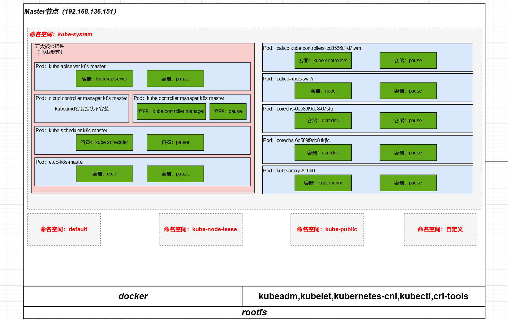

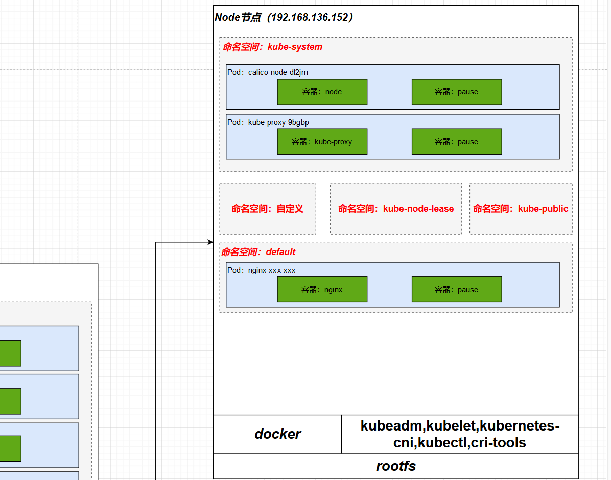

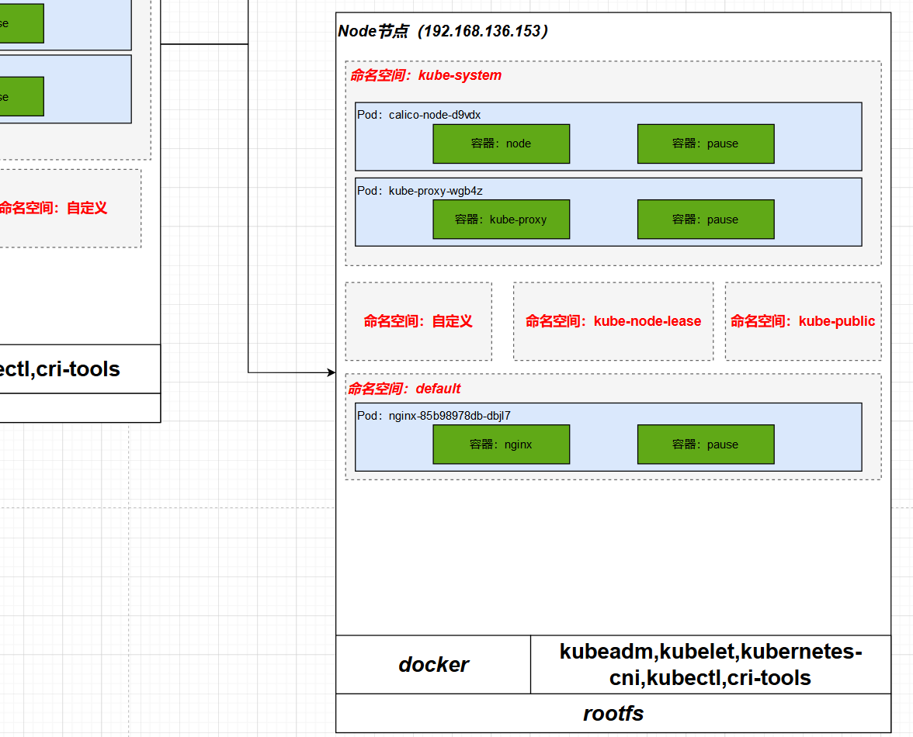

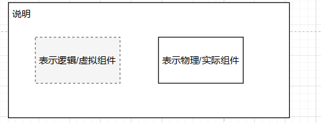

***说明：***

1. 命名空间namespace是针对整个集群而不是某个节点

2. 服务service是针对整个集群而不是某个节点

   

3. 两个coredns一个服务service-cidr，一个服务pod-cidr

# 14. *深入Pod*

## 14.1 Pod的配置文件

在 Kubernetes 中，Pod 是最小的可部署的计算单元，它是一组容器的集合，共享同一个网络命名空间、存储卷等资源

基于Pod的资源清单构建: https://kubernetes.io/zh-cn/docs/reference/kubernetes-api/workload-resources/pod-v1/#Pod

> 所有可配置属性都在页面中

***基于配置文件创建Pod:***

+ 编写yaml `pod-nginx-demo.yaml`

  ```yaml
  apiVersion: v1 #请求的api版本
  kind: Pod #作用资源类型
  metadata: #元数据，用于描述Pod资源的信息如Pod名字，所属namespace
    name: nginx-demo #Pod的名称
    namespace: demo  #Pod所属命名空间(必须以及存在，否则会报错),不写默认为default，生产应用应该自己另建namespace，
    labels: #定义Pod的标签，用于selector选择器使用（用于筛选）,键值对均为自己自定义(随便写)
      type: app
      version: v1
    annotations: #注解，用于展示额外信息(随便写)
      maintainer: ly
      target: test
      
  spec: #期望Pod状态
    containers: #容器描述
      - name: c-nginx-demo-1 #容器名称
        image: 192.168.31.79:5000/nginx:latest@sha256:596c783ac62b9a43c60edb876fe807376cd5022a4e25e89b9a9ae06c374299d4 #镜像信息，可以携带详细，也可以不详细
        imagePullPolicy: IfNotPresent #默认为IfNotPresent，如果带latest标签则默认为always
        env: #设置容器的环境变量值(随便)
          - name: maintainer
            value: ly
        ports: #端口
          - name: http #开放端口名(随意)
            containerPort: 80 #开放容器内端口(k8s集群机器可以访问,如果要让其他机器访问需要搭配service)
            protocol: TCP #支持TCP(默认),UDP或SCTP
        resources: #此容器的资源限制
          requests: #此容器最小资源限制
            cpu: 100m #最少100/1000=0.1 个核心
            memory: 50Mi #最小50MB内存,注意大小写400m表示0.4字节
          limits: #此容器最大资源限制
            cpu: 200m # 最多200/1000=0.2个核心
            memory: 150Mi #最大150MB内存
        command: #执行的命令(如果未指定则使用镜像的ENTRYPOINT)
          - nginx #多命令将会整合成一个命令
        args: #命令的参数(如果未指定则使用镜像的CMD)
          - -g
          - 'daemon off;' #nginx -g 'daemon off;' nginx前台运行
        startupProbe: #启动探针
          exec: #使用ExecAction获取状态
            #command: ['/bin/bash','-c','expr `ps -ef|grep nginx|grep -v nginx|wc -l` \> 0'] #nginx容器没有ps命令
            command: ['/bin/bash','-c','cat /usr/share/nginx/html/index.html']
          initialDelaySeconds: 10
          periodSeconds: 10
          timeoutSeconds: 5
          failureThreshold: 3
          successThreshold: 1
            
        livenessProbe: #存活探针
          httpGet: #使用HTTPGetAction获取状态
            port: 80
            path: /
            scheme: HTTP
          initialDelaySeconds: 10
          periodSeconds: 10
          timeoutSeconds: 5
          failureThreshold: 3
          successThreshold: 1
        
        readinessProbe: #就绪探针
          tcpSocket: #使用TCPSocketAction获取状态
            port: 80 #只要该tcp端口是通的就判断成功
          initialDelaySeconds: 10
          periodSeconds: 10
          timeoutSeconds: 5
          failureThreshold: 3
          successThreshold: 1
        workingDir: /usr/share/nginx/html #容器工作目录(如果未指定则使用镜像的WORKINGDIR)
    restartPolicy: OnFailure #此Pod内所有容器的的重启策略Always(只要退出就重启,默认),OnFailure(仅在退出码非0时重启),Never(退出不重启)
    # .... #还有很多
  
  ```

+ 执行命令创建Pod

  ```bash
  $kubectl create -f pod-nginx-demo.yaml
  # 第一次出错导致pod启动失败,修改配置文件重新启动 (实际支持项很少)
  $kubectl apply -f pod-nginx-demo.yaml
  ```

+ 查看Pod状态

  ```bash
  $kubectl get pods -n demo -o wide 
  #获取容器状态为 ContainerCreating 
  # CrashLoopBackOff 表示出错
  # Completed表示创建完成 不为running状态请查看容器是否退出了(确保容器命令是前台运行)
  # Running表示正在运行
  ```

+ k8s集群内可以访问,外部机器无法访问

  ```bash
  $curl ip:port
  ```

  基于CNI网络插件calico,集群内部机器可以通过ip:port访问nginx。**但是，kubectl get pod或kubectl get svc并无法看到映射的80端口**。可以通过`route -n`对照Node节点的ip查看路由信息。如果需要向集群外暴露端口则需要service，ingress

+ 排错,如果出现错误可以通过以下命令排错

  ```bash
  $kubectl get pods -n demo -o wide  #查看pod状态
  $kubectl describe pod名 -n demo #查看pod event进度可能会报错，pulling等等
  # 确定Node节点机器上
  $sudo docker ps -a #查看容器是否在运行，或退出(用于确定镜像ENTRYPOINT是否正确即前台运行)
  
  #注意容器名 ，可以通过yaml-pod配置文件获取，或kubectl describe pod获取容器名
  $kubectl logs Pod名 -c yaml中定义的容器名 -n demo #此容器名并不是docker中容器名 !!!!!
  ```

> `kubectl get pod pod名字 -o yaml/json`就可以获取pod的配置文件(探针不会写看官方文档,也可以看此参考)

## 14.2 探针（针对容器内部应用）

探针配置文档： https://kubernetes.io/zh-cn/docs/reference/kubernetes-api/workload-resources/pod-v1/#%E7%94%9F%E5%91%BD%E5%91%A8%E6%9C%9F-1

探针配置示例：https://kubernetes.io/zh-cn/docs/tasks/configure-pod-container/configure-liveness-readiness-startup-probes/

### 14.2.1 三种探针

**容器内应用(生命周期)的检测机制**，kubelet通过以下三种不同的探针来判断容器应用当前的状态。

+ **启动探针** `StartupProbe`  检查容器内的应用是否已启动（对于启动耗时久的应用）**更新get pod的status状态**

   启动探针可以**用于对慢启动容器进行存活性检测**，避免它们在启动运行之前就被 kubelet 杀掉。

  如果配置了这类探针，它**会禁用存活检测和就绪检测，直到启动探针成功其他两个探针才会继续。这类探针仅在启动时执行，不像存活探针和就绪探针那样周期性地运行。**

+ **存活探针** `LivenessProbe`  确定什么时候要重启容器  **更新get pod的restart和status状态**

  存活探针可以探测到应用死锁（应用在运行，但是无法继续执行后面的步骤）情况。 根据重启策略重启，这种状态下的容器有助于提高应用的可用性，即使其中存在缺陷。**如果没有配置，默认容器退出就是启动成功了（挂了就挂了）**。

  如果一个容器的存活探针失败多次，kubelet 将重启该容器。**存活探针不会等待就绪探针成功。 如果你想在执行存活探针前等待**，你可以定义 `initialDelaySeconds`，或者使用[启动探针](https://kubernetes.io/zh-cn/docs/concepts/configuration/liveness-readiness-startup-probes/#startup-probe)。

+ **就绪探针** `ReadinessProbe`  确认容器何时准备好接受请求流量（初始化已完成） **更新get pod的ready状态**

  **当一个 Pod 内的所有容器都就绪时，才能认为该 Pod 就绪**。这种探针在等待应用**执行耗时的初始任务**时非常有用，例如建立网络连接、加载文件和预热缓存。**本地即集群内网络可以访问,Service和ingress不能访问**

  如果就绪探针返回的状态为**失败**，Kubernetes 会将该 Pod 从所有对应服务的端点中移除。**就绪探针在容器的整个生命期内持续运行。**

> 启动探针启用会临时禁止另外两个探针，直至启动探针成功，另外两个探针才会继续运行。（只运行一次，另外两个探针持续运行）

### 14.2.2 三种探测方式

三种探针针对不用的场景，但是它们拥有相同的三种探测方式：

+ `ExecAction`  **通过执行命令**

  在容器内部执行一个命令，如果命令返回值为0代表是健康的。 	

+ `HTTPGetAction`  **通过执行HTTP请求**   

  生产环境用的比较多，通过配置HTTP请求到容器内部应用，如果接口返回的**状态码是200-400**之间，则认为容器健康。

+ `TCPSockerAction`  **tcp端口连接检测**

  通过tcp连接监测容器内端口是否开放，如果开放则证明该容器健康。（是否能连上）

### 14.2.3 探针probe其他参数配置

配置项：https://kubernetes.io/zh-cn/docs/reference/kubernetes-api/workload-resources/pod-v1/#Probe

> 每个一个探针都可以配置其他参数(不是只需要一个)

+ `initialDelaySeconds` 

  初始延迟秒 指 容器启动后延迟多久启动存活探针

+ `timeoutSeconds` 

  探针超时的秒数，默认1秒，最小1s

+ `periodSeconds` 

  探针的执行周期，单位秒，默认10s，最小1s

+ `successThreshold` 

  探针失败后最小连续成功次数，超过此阈值才认为探针成功。 默认1，最小值为1，存活/启动探针必须为1

+ `failureThreshold` 

  探针成功后的最小连续失败次数，超过此阈值则认为探针失败。默认3，最小值为1

+ `grpc` GRPC 指定涉及 GRPC 端口的操作。

```yaml
sepc:
  containers:
    - name: 容器名
      ...
      # 三种探针都属于probe
      livenessProbe:
        exec:
        httpGet:
        tcpSocket:
        initialDelaySeconds: #初始延迟秒 指 容器启动后延迟多久启动存活探针
        timeoutSeconds: #探针超时的秒数，默认1秒，最小1s
        periodSeconds: #探针的执行周期，单位秒，默认10s，最小1s
        successThreshold: #探针失败后最小连续成功次数，超过此阈值才认为探针成功。 默认1，最小值为1，存活/启动探针必须为1
        failureThreshold: #探针成功后的最小连续失败次数，超过此阈值则认为探针失败。默认3，最小值为1
      readinessProbe:
      startupProbe:
     ...
```

## 14.3 直接编辑Pod配置文件

> ***因为我们是直接创建Pod不是通过deployment等Pod控制器创建的,所以热更新会有限制(不推荐直接创建Pod)***

+ 直接修改运行中的Pod (如修改Env)

  ```bash
  #使用vi编辑器
  $kubectl edit nginx-demo -n demo
  ```

+ 提示修改出错

  ```
  * spec: Forbidden: pod updates may not change fields other than `spec.containers[*].image`, `spec.initContainers[*].image`, `spec.activeDeadlineSeconds`, `spec.tolerations` (only additions to existing tolerations) or `spec.terminationGracePeriodSeconds` (allow it to be set to 1 if it was previously negative)
  ```

+ **只允许修改以下字段**

  + `spec.containers[*].image`
  + `spec.initContainers[*].image`
  + `spec.activeDeadlineSeconds`
  + `spec.tolerations` (只允许添加新选项,不允许删除)
  + `spec.terminationGracePeriodSeconds`(只允许将其设置为1,如果直接为负值)

## 14.5 pod重启冷却实际

**第一次失败**：等待约 **10秒** 后重启。

**第二次失败**：等待约 **20秒** 后重启。

**第三次失败**：等待约 **40秒** 后重启。

**第四次失败**：等待约 **80秒** 后重启。

**第五次失败**：等待约 **160秒** 后重启。

**之后的重启**：等待时间继续增加，直到达到最大冷却时间 **5分钟**。

```bash
$kubectl describe pod名字

Last State:   Terminated
    Reason:    Error
    Exit Code: 1
    ...
Restart Count: 7
Message:      Back-off 5m0s restarting failed container # 5m0s 表示下次重启在5分钟后
```

## 14.6 Pod的生命周期

> 注意Pod生命周期和容器的生命周期

介绍文档: https://kubernetes.io/zh-cn/docs/concepts/workloads/pods/pod-lifecycle/#pod-phase

Pod配置文件： https://kubernetes.io/zh-cn/docs/reference/kubernetes-api/workload-resources/pod-v1/#%E7%94%9F%E5%91%BD%E5%91%A8%E6%9C%9F

### 14.6.1 Pod阶段(phase)

Pod阶段(Phase)是Pod在其生命周期中所处位置的简单宏观概述。一共下面5种状态：

+ `Pending`（**悬决**）

  创建Pod对象后，这是其初始阶段。在Pod被调度到节点并且拉取、启动其容器前，他一直处于此阶段。

+ `Running`（**运行中**）

  该Pod中至少有一个容器正在运行。只要有一个容器正在运行（或者是启动或重启），该Pod就是Running。

+ `Succeeded`（**成功**）

  Pod内所有容器全部成功完成运行（即全部成功退出），且不打算无限期运行的Pod就标记为Succeeded。

+ `Failed`（**失败**）

  Pod中所有容器都终止，并且至少有一个容器是失败退出的。（即至少有一个退出码非0，且没有自动重启）

+ `Unknown`（**未知**）

  因为某些原因无法获取Pod的状态，一般都是网络问题。

> **注意区分Pod的阶段（Phase）和**`kubectl get pods`**获取的**`Status`**(有CrashLoopBackOff，Terminating)，这两个不是一个东西。**
>
> ```bash
> #status.phase就代表Pod的状态
> $kubectl get pod xxx -o yaml
> #这样输出的status只是用于用户直观查看
> $kubectl get pod -o wide
> ```

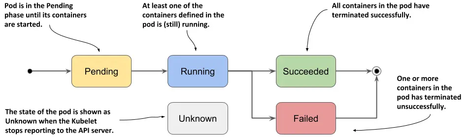

### 14.6.2 容器的状态（Status）

Kubernetes 会跟踪 Pod 中每个容器的状态，就像它跟踪 Pod 总体上的[阶段](https://kubernetes.io/zh-cn/docs/concepts/workloads/pods/pod-lifecycle/#pod-phase)一样。 你可以使用[容器生命周期回调](https://kubernetes.io/zh-cn/docs/concepts/containers/container-lifecycle-hooks/) 来在容器生命周期中的特定时间点触发事件。其一共有下面三种状态：

+ `Waiting`（**等待**）

  如果容器并不处在 `Running` 或 `Terminated` 状态之一，它就处在 `Waiting` 状态。 处于 `Waiting` 状态的容器仍在运行它完成启动所需要的操作：例如， 从某个容器镜像仓库拉取容器镜像，或者向容器应用 [Secret](https://kubernetes.io/zh-cn/docs/concepts/configuration/secret/) 数据等等。

+ `Running`（**运行中**）

  `Running` 状态表明容器正在执行状态并且没有问题发生。 如果配置了 `postStart` 回调，那么该回调已经执行且已完成。

+ `Terminated`（**已终止**）

  处于 `Terminated` 状态的容器开始执行后，或者运行至正常结束或者因为某些原因失败。

> 可以使用命令`kubectl describe pods xxx`查看容器的详细信息（如状态，原因，退出码，启动时间，退出时间，重启次数等等）
>
> `kubectl get pod xxx -o yaml`是获取Pod及容器的配置信息(有些许区别)

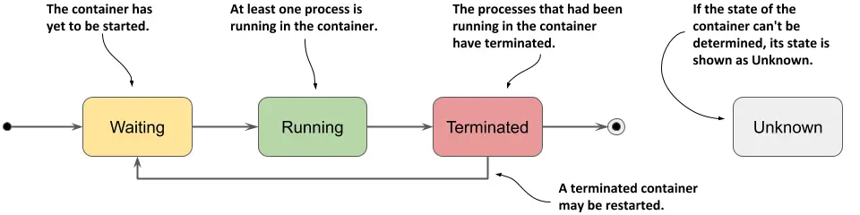

### 14.6.3 Pod的生命周期

Pod的生命周期一共包含下面三个状态：

+ **初始化阶段，Pod的init容器运行**

  + 拉取镜像(三种策略always,ifnotpresent,never)
  + 运行init容器（**按照顺序依次运行，如果有一个失败了就算Pod失败。如果有重启策略会根据，pod和init容器特有的**`restartPolcy`**重启容器，Pod**）
  + 启动pause容器，做网络和存储准备
  + 准备环境变量，用于pod容器中
  + volume卷挂载

  > Init 容器不可以有生命周期操作、就绪态探针、存活态探针或启动探针.(**init不需要一直运行，初始化任务完成后就自动销毁**)

+ **运行阶段，Pod的应用容器在该阶段运行**

  + 启动容器(**按照定义顺序启动，就是调用command**)
  + 执行`postStart`钩子函数（与容器主进程是异步运行，可能会影响到容器的启动）
  + 三种探针（启动，存活，就绪）获取状态，并搭配**Pod的重启策略进行重启（普通容器没有重启策略，只有pod和init容器有）**
  + 提供应用容器服务

+ **终止阶段，Pod内部容器全部被终止，Pod也被终止**

  + Endpoint删除Pod的ip地址
  + Pod变为Terminating状态(不是阶段)
  + 终止前先调用`preStop`钩子函数（并行。一般用于销毁前操作，如数据备份，保存日志，服务中心下线）
  + 根据Pod的`terminationGracePeriodSeconds`参数，默认是`30秒`。即**最多等待30秒，如果prestop等操作导致Pod还没结束就强制终止容器和Pod**。可以使用`--force`跳过等待

> Pod生命周期管理都是通过kubelet实现的


### 14.6.4 Pod的状态（与Phrase区别）

Pod除了**Pending,Running,Succeeded,Failed,Unknown**五大阶段（Phrase），还有以下特殊的条件状态，可以在`kubectl get/describe`中获取信息：

- **PodScheduled**：表示 Pod 是否已经被调度到了节点上。
- **ContainersReady**：表示 Pod 中的所有容器是否已经准备就绪。
- **Initialized**：表示 Pod 中的所有容器是否已经初始化。
- **Ready**：表示 Pod 是否已经准备就绪，即所有容器都已经启动并且可以接收流量。
- **CrashLoopBackOff**： 容器退出，kubelet正在将它重启
- **InvalidImageName**： 无法解析镜像名称
- **ImageInspectError**： 无法校验镜像
- **ErrImageNeverPull**： 策略禁止拉取镜像
- **ImagePullBackOff**： 正在重试拉取
- **RegistryUnavailable**： 连接不到镜像中心
- **ErrImagePull**：通用的拉取镜像出错
- **CreateContainerConfigError**： 不能创建kubelet使用的容器配置
- **CreateContainerError**： 创建容器失败
- **m.internalLifecycle.PreStartContainer** 执行hook报错
- **RunContainerError**： 启动容器失败
- **PostStartHookError**： 执行hook报错
- **ContainersNotInitialized**： 容器没有初始化完毕
- **ContainersNotReady**： 容器没有准备完毕
- **ContainerCreating**：容器创建中
- **PodInitializing**：pod 初始化中
- **DockerDaemonNotReady**：docker还没有完全启动
- **NetworkPluginNotReady**： 网络插件还没有完全启动
- **Evicte**: pod被驱赶

### 14.6.5 Pod生命周期配置

```yaml
apiVersion: v1
kind: Pod
metadata:
  name: nginx-demo
  namespace: demo
  labels:
    type: app
    version: v1

spec:
  containers:
    - name: c-nginx-demo-1
      image: 192.168.31.79:5000/nginx:latest #必须加仓库地址,否则会重新下载(tag不同了)
      imagePullPolicy: IfNotPresent
      ports:
        - name: http
          containerPort: 80
          protocol: TCP
      command:
        - nginx
      args:
        - -g
        - 'daemon off;'
      lifecycle: #容器的生命周期
        postStart: #执行nginx容器command后立即执行
          exec: #ExecAction方式，还有HTTPGetAction
            command: ['/bin/bash','-c','echo postStart-ok > /usr/share/nginx/html/lifecycle.html']
        preStop:
          exec: #ExecAction方式，还有HTTPGetAction
            command: ['/bin/bash','-c','sleep 40;echo preStop-ok >> /usr/share/nginx/html/lifecycle.html;sleep 30'] #测试terminationGracePeriodSeconds
  initContainers: #init容器先执行，不允许有生命周期操作
    - name: init-hello-world
      image: 192.168.31.79:5000/alpine:latest
      imagePullPolicy: IfNotPresent
      command: ['/bin/sh','-c','echo "1">/home/ok;sleep 120'] 
      #restartPolicy: Always #低版本init容器没有该策略
  restartPolicy: OnFailure #pod内所有容器的重启策略
  terminationGracePeriodSeconds: 70 #关闭Pod前运行继续运行的时间，默认是30（不是马上销毁Pod） 期间内服务还可以访问
```

> init容器执行初始化必须退出，否则一直是初始化状态，不会启动容器（执行command）

# 15. 资源调度(Pod控制器)

通过上面创建原生Pod我们发现其一些缺点：无法进行扩/缩容，无法编辑Pod配置文件进行热更新等等。所以我们需要引入Pod控制器。

## 15.1 Label和Selector

### 15.1.1 Label 标签

**标签（Labels）** 是附加到 Kubernetes [对象](https://kubernetes.io/zh-cn/docs/concepts/overview/working-with-objects/#kubernetes-objects)（比如 Pod）上的键值对。 标签旨在用于指定对用户有意义且相关的对象的标识属性，但不直接对核心系统有语义含义。 标签可以用于组织和选择对象的子集。标签可以在创建时附加到对象，随后可以随时添加和修改。 每个对象都可以定义一组键/值标签。每个键对于给定对象必须是唯一的。

**目的：**为了标识和查找方便

### 15.1.2 Label Selector 标签选择器

与[名称和 UID](https://kubernetes.io/zh-cn/docs/concepts/overview/working-with-objects/names/) 不同， 标签不支持唯一性。通常，我们希望许多对象携带相同的标签。

通过**标签选择算符**，客户端/用户可以识别一组对象。标签选择算符是 Kubernetes 中的核心分组原语。

API 目前支持两种类型的选择算符：**基于等值的**和**基于集合的**。 标签选择算符可以由逗号分隔的多个**需求**组成。 在多个需求的情况下，必须满足所有要求，因此逗号分隔符充当逻辑**与**（`&&`）运算符。

**目的：**通过在selector中写label，快速匹配所需要的资源如Pod,service,deployment等等

> 等式选择器即自己写的selector表达式在命令行中仅支持`,in,notin,=,==,!=,gt,lt`,其中`==`与`=`是同义词

### 15.1.3 ==Label编辑位置及区别==

在资源yaml配置文件中，标签（label）有两个地方可以存放自定义label

+ `metadata.labels[*]`

  标识当前资源的标签。如果资源类型是Pod那就是Pod的标签；如果资源类型是Deployment那就是Deployment的标签；如果资源类型是Service那就是Service的标签等等。

+ `spec.template.metadata.labels[*]`

  标识Pod的标签。一般是资源类型Deployment配置文件中，用于创建Pod时同时指定该Pod的标签。

  > 简单来说：**一个是deployment标签，一个是pod标签**

### 15.1.4 Label和Selector使用

+ **yaml配置文件中编写**

+ **命令**

  ***标签***

  + `kubectl get 资源 资源名 --show-labels` 查看默认命名空间资源所有标签
  + `kubectl label 资源 资源名  label键值对` 给默认命名空间资源添加新标签
  + `kubectl label 资源 -all label键值对` 给默认命名空间所有指定资源类型打上新标签
  + `kubectl label 资源 资源名 label键值对 --overwrite` 强制修改默认命名空间已存在的标签（没有则添加）
  + `kubectl label 资源 资源名  label键值对 -l 等式选择器` 在默认命名空间中，给基于等式选择器筛选出来的资源打上新标签

  ```bash
  #查看pod及标签 --show-labels显示资源（如pod）的所有标签
  $kubectl get pod -n kube-system -a --show-labels
  #添加标签
  $kubectkl label pod nginx-demo target=test -n demo
  $kubectkl label pod nginx-demo ‘max=’ -n demo #只有键没有值的标签
  $kubectkl label pod nginx-demo min= -n demo #只有键没有值的标签
  #修改标签
  $kubectkl label pod nginx-demo target=test-dev -n demo
  #基于选择器筛选，添加新标签
  $kubectkl label pod nginx-demo hash=0x11111 -l target=test-dev -n demo#标签中，选择器中有空格记得加引号
  
  #指定pod的版本修改(防止误改)***
  # --resource-version代表当前pod的资源版本号(该值由k8s维护)
  # 就是yaml配置文件中的metadata.resourceVersion(该值由k8s维护)
  # 可以通过 kubectl get pod nginx-demo -n demo -o yaml获取
  $kubectl label pod nginx-demo -n demo "test=true" --resource-version=278905
  ```

  ***选择器***

  基本上kubectl的任何命令都可以加上`-l`参数，使用label selector。

  + `kubectl get 资源 -l 等式表达式`
  + `kubectl describe 资源 -l 等式表达式`
  + `kubectl label 资源 资源名 label键值对 -l 等式表达式`
  + `kubectl logs -l 等式选择器`
  + ...

  ```bash
  $kubectl get pod -l tyep=app
  $kubectl get pod -l 'tyep=app'
  $kubectl get pod -l 'tyep=app,version=v1'
  $kubectl get pod -l 'version in (v1,v2,v3)'
  $kubectl get pod -l 'hash=1,max gt 2'
  $kubectl get pod -l 'min' #如果存在min但是没有值，可以这样写
  $kubectl get pod -l 'min=' #如果存在min但是没有值，可以这样写
  ```

  > 等式选择器即自己写的selector表达式仅支持`,in,notin,=,==,!=,gt,lt` ,其中`==`与`=`是同义词

## 15.2 Depolyment

Deployment一种为Pod和ReplicaSet提供声明式更新资源（Pod控制器）。具有以下作用：

+ 自动创建ReplicaSet和Pod
+ 滚动更新、滚动回滚
+ 平滑扩缩容
+ 暂停和恢复deployment

### 15.2.0 api文档

+ deployment介绍文档： https://kubernetes.io/zh-cn/docs/concepts/workloads/controllers/deployment/
+ deployment配置文档：https://kubernetes.io/zh-cn/docs/reference/kubernetes-api/workload-resources/deployment-v1/#Deployment

### 15.2.1 创建Deployment

***deployment控制rc/rs来控制pod来控制容器***

+ 通过命令行

  ```bash
  #创建deployment default默认命名空间
  $kubectl create deployment nginx-deploy --images:192.168.31.79:5000/nginx:latest --replicas=1 -- nginx -g 'daemon off;'
  # 获取已有deployment的配置文件
  $kubectl get deployment nginx-deploy -o yaml >nginx-deploy.yaml
  ```

+ 通过配置文件

  ```bash
  #通过kubectl get deployment xxx -o yaml生成的配置文件
  apiVersion: apps/v1 #api版本
  kind: Deployment #资源类型
  metadata: #元数据
    annotations: #注释
      deployment.kubernetes.io/revision: "1" #滚动更新版本号,用于回滚  (k8s自动生成的) 自动生成代表只读
      kubernetes.io/change-cause: 恢复nginx镜像为latest #更新备注信息 annotate打备注,rollout history查看
    creationTimestamp: "2024-09-25T07:44:59Z" #deployment创建时间,(k8s自动生成)
    generation: 1 #表示配置文件生成/修改次数(k8s自动生成的)
    labels: # **标签(此处定义deployment的标签,可以使用此标签选择该deploy)
      app: nginx-deploy  #标签键值对
    name: nginx-deploy #标识deploy的名字
    namespace: default #表示deploy所在命名空间
    resourceVersion: "275940" #表示deploy的版本号(k8s自动生成),匹配命令行的--resource-version
    uid: 7a41e249-69ec-4674-afaf-9d34ebfa4bab #表示该资源的uid值
  spec: #此deploy规约
    progressDeadlineSeconds: 600 # 表示deployment没有取得进展最长时间,默认为600(如600s内没有创建新的pod,或者旧pod没有被替换)
    replicas: 1 #pod副本数
    revisionHistoryLimit: 10 #表示deploy滚动更新历史记录数(用于回滚操作),默认10,0表示不能回滚
    selector: #**pod选择器,通过此标签选择ReplicaSet和RS管理的Pod （其实是Pod但是Pod和rs是关联的，所以也影响rs）
      matchLabels: #基于等式的键值对,还有其他的方式如matchExpressions
        app: nginx-deploy
    strategy: # deployment更新策略
      rollingUpdate: #滚动更新策略
        maxSurge: 25% #可以使用比例或数字,*表示更新过程中,最多可以额外创建的Pod数量
        maxUnavailable: 25% #可以使用比例或数字,*表示更新过程中,最大允许不可用Pod的数量
      type: RollingUpdate #表示使用滚动更新(默认),还有另一个值Recreate
    template: # *创建Pod的模板
      metadata: #pod的元数据
        creationTimestamp: null #pod创建时间,(k8s自动生成)
        labels: #**pod的label(可以使用该标签筛选此Pod)
          app: nginx-deploy #标签键值对
      spec: #pod的规约
        containers: #容器
        - command: # 容器启动命令
          - nginx
          - -g
          - daemon off;
          image: 192.168.31.79:5000/nginx:latest #容器使用的镜像
          imagePullPolicy: Always #镜像拉取策略
          name: nginx #容器名字
          resources: {} #容器资源设置cpu或内存
          terminationMessagePath: /dev/termination-log #容器终止消息写入本地机器
          terminationMessagePolicy: File #容器终止消息输出类型
        dnsPolicy: ClusterFirst #Pod的DNS策略 
        restartPolicy: Always #pod重启策略,在模板中只能是always
        schedulerName: default-scheduler #如果写了则使用指定调度器default-scheduler调度pod,否则使用默认调度器(也是它)
        securityContext: {} #pod的安全上下文
        terminationGracePeriodSeconds: 30 #pod删除允许额外时间(让你进行销毁处理操作如preStop,到期强制删除)
  ```

  > + `metadata.labels[]` **这个是定义deploy的标签,由于筛选此deploy**
  > + `sepc.selector.matchLabels[]` **这是是RS/Pod的标签选择器,用于查找指定的RS/Pod**
  > + `sepc.template.metadata.labels[]` **这个是定义Pod的标签,用于筛选此Pod**
  >
  > 总结：1,3中的labels是定义，**2中selector.matchLabel是运用，用于定位下面template中的Pod即（2中label必等于3中Label）**
  >
  > 简单记法：**selector就是用来找Pod的，里面是条件**

+ 查看deployment，replicaSet，Pod三者的关系

  **RS关联到Deployment，Pod关联到RS**

  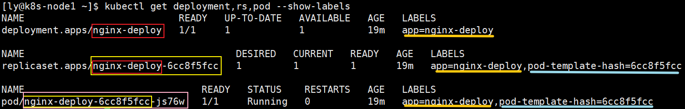

### 15.2.2 滚动更新

#### 15.2.2.1 滚动更新操作

***只有修改deployment配置文件中的template属性后，才会触发滚动更新（但是并不意味着更新别的属性不更新，只是不算滚动更新）***

+ 命令直接修改

  ```bash
  #进入yaml配置,修改nginx镜像为1.7.9 wq保存退出
  $kubectl edit deploy nginx-deploy
  
  
  # 单个修改(命令特殊)  修改名为nginx-deploy的deploy的镜像
   # (这也是更新不是回滚,但是deploy使用了原来的rs-1,很微妙,且history序号从1变为3了,不会增加chang记录)
  $kubectl set image deployment/nginx-deploy nginx=192.168.31.79:5000/nginx:latest#容器名=镜像:tag
  #就是kubectl rollout history显示的change-cause
  $kubectl annotate deployment/nginx-deploy kubernetes.io/change-cause="恢复nginx为latest镜像" #备注更改原因
  ```

  > 使用`kubectl rollout undo`才是回滚

+ 查看滚动更新历史（改了template属性的）

  ```bash
  #rollout滚动操作只对deployment,StatefulSet,DaemonSet有效
  $kubectl rollout history deploy nginx-deploy #查看default命名空间名为nginx-deploy的deploy的滚动更新历史（第一次创建也算一次）
  ```

#### 15.2.2.2 ==滚动更新流程（记得看看更新策略）==

```bash
#可以分三个窗口执行提前监视好
$kubecttl get deploy nginx-deploy -w #唯一
$kubectl get replicaset -w #不唯一
$kubectl get pod -w #不唯一
```

+ 起初一个deploy,一个rs-1,3个pod,3个容器
+ `kubectl edit`修改配置文件,deploy**创建一个新的ReplicaSet**,假如叫rs-2,里面创建一个新pod
+ 新pod中开始拉取nginx镜像,**启动一个nginx容器**
+ 当nginx容器变为**running状态,且容器已准备好接收流量,则将原来的rs-1中的pod关闭一个,转移到rs-2中的pod了**
+ 依次将第二个Pod,第三个pod转移到rs-2中,**至此全部的pod转移到新rs-2中**
+ 原来的rs-1没有任何pod了,至此滚动更新结束
+ 原来的rs-1不删除,用于后面回滚

```bash
#日志描述
$kubectl describe deploy nginx-deploy
Events:
# nginx-deploy-6cc8f5fcc简称cc(即rs-1)   nginx-deploy-67cb7fb4d6简称d6(即rs-2)
#刚开始一个deployment 一个rs-1 3个pod  3个容器
  Type    Reason             Age    From                   Message
  ----    ------             ----   ----                   -------
  Normal  ScalingReplicaSet  16m    deployment-controller  Scaled up replica set nginx-deploy-6cc8f5fcc to 3 #(刚开始扩容操作1变成3)默认的rs-cc
  Normal  ScalingReplicaSet  9m45s  deployment-controller  Scaled up replica set nginx-deploy-67cb7fb4d6 to 1 #新建了rs-d6,并创建一个pod(此时rs-cc还有3个running的pod)
  Normal  ScalingReplicaSet  8m22s  deployment-controller  Scaled down replica set nginx-deploy-6cc8f5fcc to 2#关闭rs-cc一个pod,缩容到2(第一个pod切换到rs-d6成功)
  Normal  ScalingReplicaSet  8m22s  deployment-controller  Scaled up replica set nginx-deploy-67cb7fb4d6 to 2#rs-d6,创建第二个pod(此时rs-cc还有2个running的pod)
  Normal  ScalingReplicaSet  7m1s   deployment-controller  Scaled down replica set nginx-deploy-6cc8f5fcc to 1#关闭rs-cc一个pod,缩容到1(第2个pod切换到rs-d6成功)
  Normal  ScalingReplicaSet  7m1s   deployment-controller  Scaled up replica set nginx-deploy-67cb7fb4d6 to 3#rs-d6,创建第三个pod(此时rs-cc还有1个running的pod)
  Normal  ScalingReplicaSet  5m56s  deployment-controller  Scaled down replica set nginx-deploy-6cc8f5fcc to 0#关闭rs-cc一个pod,缩容到0(第3个pod切换到rs-d6成功) 
  # 迁移操作结束

```

> 滚动更新并行注意事项:
>
> + 修改了一次配置,此时deploy正在进行更新操作1中
> + 此时你又进行修改进行更新操作2,在没更新完成的基础上修改,引起了并行更新(**一个更新未完又出现另一个更新**)
> + 此时尽管更新操作1已经运行了一半,deploy会把更新操作1中的启动pod干掉(k8s认为这个中间更新操作是无意义的),直接应用最新依次更改
>
> 总结:**并行更新中,deploy只会保留最后一次(最新一次)的配置,中间其他配置都将被丢弃(中间pod被杀)**

#### 15.3.3.2 滚动更新策略

看配置文件 [15.2.1](###15.2.1)

### 15.2.3 回滚Deployment

```bash
#1.模拟更新错误
$kubectl set resources deployment nginx-deploy --limit=cpu=200m,memory=200Mi --requests=cpu=100m,memory=100Mi
#更新annotation
$kubectl annotate deploy nginx-deploy kubernetes.io/change-cause="deploy内pod设置资源限制"
#2.查看滚动更新历史记录(默认保存10个 revisionHistoryLimit)
$kubectl rollout history deploy nginx-deploy
#3.回顾操作
$kubectl rollout undo deploy nginx-demo #撤销上一次更新操作,即回滚到 --to-revision=0(默认)上一个版本
$kubectl rollout undo deploy nginx-demo --to-revision 3 #回滚到revision=3的版本(rollout history查询得到的)
```

### 15.2.4 扩容和缩容

deployment借助ReplicaSet将Pod进行扩容和缩容。因为修改的是`spec.replicas`的值，没有修改`sepc.template`所以**不会增加更新记录（不算滚动更新）**

#### 15.2.4.1 手动扩容和缩容

1. 通过编辑配置文件的方式

   ```bash
   #方法1 进入实时编辑，修改配置文件sepc.replicas
   $kubectl edit deploy nginx-deploy 
   #方法2 修改本地的配置文件
   $kubectl apply -f nginx-deploy.yaml
   ```

2. 通过命令方式

   ```bash
   $kubectl scale deploy nginx-deploy --replicas=2 --timeout 30m #这条命令最多等待30分钟的时间,如果超过该命令报错.但是不影响实际的结果(超时不会回滚)
   $kubectl scale deploy nginx-deploy --replicas=5 --resource-version=302606 #metadata.resourceVersion
   ```

#### 15.2.4.2 自动扩容和缩容

见 [15.5 HPA章节](#15.5 HorizontalPodAutoscaler(HPA))

### 15.2.5 暂停和恢复deployment（唯一支持）

当需要频繁修改`spec.template`时，就导致deploy持续频繁更新。我们希望统一改完后再更新，这是就可以暂停deploy等待彻底完成更新后再开启。(**此时容器内服务还是可以访问的**)

+ 暂停deploy

  ```bash
  # 暂停deploy更新
  $kubectl rollout pause deploy nginx-deploy
  # 查看更新状态
  $kubectl rollout status deploy nginx-deploy #卡在Waiting for deployment "nginx-deploy" rollout to finish: 0 out of 2 new replicas have been updated...
  $kubectl get rs -l xxxx #也可以查看没有新增rs
  $kubectl rollout history deploy nginx-deploy --revision=7#查看最新的更新记录还是7
  
  #这个显示是最新的,修改后的配置文件
  $kubectl get deploy nginx-deploy -o yaml
  $kubectl describe deploy nginx-deploy
  ```

+ 恢复deploy

  ```bash
  #恢复
  $kubeclt rollout resume deploy nginx-deploy #回车马上进行更新
  #多了一个rs 滚动更新历史
  ```

### 15.2.6 删除deployment

+ `--cscade=backgroud` 默认 ，后台级联删除。（先删除deploy，再删除pod）
+ `--cscade=foreground` 前台级联删除。（先删除pod，再删除deploy）
+ `--cscade=orphan` 不进行级联删除（只删除deploy，不删除pod）

```bash
kucetl delete deploy nginx-deploy --cscade=orphan
```

## 15.3 StatefulSet

StatefulSet 用来管理（有状态应用）某 [Pod](https://kubernetes.io/zh-cn/docs/concepts/workloads/pods/) 集合的部署和扩缩， 并为这些 Pod 提供持久存储和持久标识符。

和 [Deployment](https://kubernetes.io/zh-cn/docs/concepts/workloads/controllers/deployment/) 类似， StatefulSet 管理基于相同容器规约的一组 Pod。但和 Deployment 不同的是， **StatefulSet 为它们的每个 Pod 维护了一个有粘性的 ID**。这些 Pod 是基于相同的规约来创建的， 但是**不能相互替换**：无论怎么调度，**每个 Pod 都有一个永久不变的 ID**。其主要作用如下：

+ 稳定的、唯一的网络标识符
+ 稳定的、持久的存储
+ 有序的、优雅的部署和更新
+ 有序的、自动的滚动更新

> “稳定的”意味着 Pod 调度或重调度的整个过程是有持久性的。 如果应用程序不需要任何稳定的标识符或有序的部署、删除或扩缩， 则应该使用由一组无状态的副本控制器提供的工作负载来部署应用程序

### 15.3.0 api文档

+ statefulSet介绍文档：https://kubernetes.io/zh-cn/docs/concepts/workloads/controllers/statefulset/
+ statefulSet配置文档：https://kubernetes.io/zh-cn/docs/reference/kubernetes-api/workload-resources/stateful-set-v1/

### 15.3.1 创建StatefulSet(只能通过配置文件)

只能通过配置文件创建StatefulSet 

+ 定义`nginx-statefulset.yaml`文件

  ```yaml
  --- # yaml中 ---表示文档的开始,表示多组yaml配置但是在一个配置文件中(用于同时配置相关联的依赖服务)
  apiVersion: v1
  kind: Service #定义一个资源类型为Service,用于管理DNS
  metadata:
    name: nginx-svc # 服务名为nginx
    labels: # 该service的标签,用于被筛选
      app: nginx
  spec:
    ports: #service公开暴露的端口为80,给该端口命名为web
    - port: 80
      name: web #80端口对外的暴露名
    #clusterIP: None 表示基于服务名进行访问,并没绑定具体ip
    clusterIP: None #clusterIP 为 “None” 时会生成“无头服务即Headless Service(此时没有负载均衡)
    selector: #表示service使用此selector查找匹配的Pod,即路由到指定label的pod上
      # service的特殊写法(没有MatchLabels等对象,而是直接的Map)
      app: nginx 
    type: ClusterIP #service公开方式,默认为ClusterIP为端点分配一个集群内部 IP 地址用于负载均衡,如果 clusterIP 为 None，则不分配虚拟 IP
  ---   # yaml中 ---表示文档的开始,表示多组yaml配置但是在一个配置文件中(用于同时配置相关联的依赖服务)
  apiVersion: apps/v1
  kind: StatefulSet #定义一个资源,类型为StatefulSet
  metadata:
    name: nginx-sts #定义statefuset的名字
  spec: #规约
    selector: #表示statefulset通过该selector(app=nginx)查找满足的pod
      matchLabels:
        app: nginx # 必须匹配 .spec.template.metadata.labels
    serviceName: "nginx-svc" # 表示管理此sts的service服务,必须在sts前创建
    replicas: 2 #pod副本数
    minReadySeconds: 10 # pod准备就绪最少10秒后才认为是可用的
    template: #podTemplate模板
      metadata:
        labels: #定义pod label
          app: nginx # 必须匹配 .spec.selector.matchLabels
      spec: #pod的规约
        terminationGracePeriodSeconds: 10 #停止pod后,可以继续运行10秒(不马上终端服务),超过10s立即终止
        containers:
        - name: nginx-c
          image: 192.168.31.79:5000/nginx:latest
          ports: #容器公开的端口(和service公开端口相互绑定)
          - containerPort: 80 #通过calico创建的网卡tunl0,公开该网卡地址上的80端口(只能在集群内部使用,但是你定义了service所以可以在外部使用)
            name: nginx-c-port #该容器端口名不能超过16个字符
          volumeMounts: #该容器使用的挂载卷www
          - name: www #名字为www的挂在卷
            mountPath: /usr/share/nginx/html #挂载到该容器中的位置
      updateStrategy: #sts更新策略
        rollingUpdate: #滚动更新策略
          partition: 0 #表示从第几个序号开始更新 如果为3表示只更新序号大于等于3的
        type: RollingUpdate #更新策略使用滚动更新
            
            
   #$$$$$$$$$$$$$$$$$###存储没学到先去掉 不加，因为还要定义PV否则会失败的
    volumeClaimTemplates: # pvc持久化卷定义
    # k8s不直接管理存储为,通过storageClass存储类和volumeClaimTemplates(PVC)抽象管理不同的存储类型(如本地,云端等等)
    # 对于storageClassName 如果是本地存储数据默认存放在该Node节点的/var/lib/kubelet/pods/<pod-id>/volumes/
    - metadata:
        name: www #该持久化卷名字
      spec: #数据卷
        accessModes: [ "ReadWriteOnce" ] # 该卷的读写策略:同一Node节点上运行的多个Pod可以访问该卷
        storageClassName: "my-storage-class" #存储类名
        resources: #存储卷定义的资源
          requests: #最小要求1GB大小空间
            storage: 250Mi
  ```

+ 执行命令创建`StatefulSet(sts)`,`Headless Service(svc)`,`Pod`等（`PersistentVolumeClaim(PVC)`去掉了，不考虑）

  ```bash
  $kubectl create -f nginx-statefulset.yaml
  ```

+ 查看

  ```bash
  #都是默认命名空间的资源
  kubectl get sts,svc,pod -o wide #查看statefulset,service,pod的状态 成功运行
  ```

+ 验证

  + Master，Node节点`curl Pod的ip` 成功（注意不是Node的IP地址）

  + 进入容器内部,验证容器间访问通过

    ```bash
    #以pod nginx-sts-0举例
    kubectl exec -it nginx-sts-0 -c nginx-c -- curl 另一个Pod的地址 #成功
    kubectl exec -it nginx-sts-0 -c cat /etc/hosts #查看自定义域名
    ...
    10.244.169.161	nginx-sts-0.nginx-svc.default.svc.cluster.local	nginx-sts-0#当前容器的自定义域名
    kubectl exec -it nginx-sts-0 -c curl nginx-sts-1.nginx-svc #使用自定义域名访问另一个容器服务,成功
    #另一个同理访问,均可以
    ```

  + 构建新镜像busybox:1.28.4,验证

    ```bash
    $kubectl run test-busybox --image=busybox:1.28.4 --restart=Never -- top #构建pod，/bin/sh没有还是会退出
    $kubectl exec -it test-busybox -c test-busybox -- /bin/sh #pod内镜名字可以通过get pod -o yaml获取
        $nslookup nginx-sys-1.nginx-svc.default.svc.cluster.local #域名查询
        Server:    10.96.0.10
        Address 1: 10.96.0.10 kube-dns.kube-system.svc.cluster.local #先去k8s dns服务器上查找，获取到ip
    
        Name:      nginx-sts-1.nginx-svc
        Address 1: 10.244.36.87 nginx-sts-1.nginx-svc.default.svc.cluster.local
    ```

> ***详解网络与Service：***
>
> + Node节点上有多个网卡，所以容器默认暴露的端口我们可以通过calico创建的网卡地址访问（不是实际的网卡ens33）
> + 不暴露容器内服务端口（nginx：80），则该服务只能进入容器自身内访问或在其他容器内通过ip:port访问，在外边Master节点、Node节点都无法访问（通过ip或自定义域名）。
> + 在容器内向外暴露80端口，此时在Master节点，Node节点你可以通过ip:port访问（自定义域名还是不行）。
> + 在容器内向外暴露80端口，构建**无头服务即Headless Service**没有绑定具体ip地址，k8s会在创建的每个容器内基于一定规则**修改hosts，在其中维护当前容器的IP地址，和对应的自定义域名**，在此种情况下，容器间（容器内部）就可以通过这个hosts中自定义域名相互通信，即根据**服务名通信**，此时Master节点，Node节点还是只能通过ip:port访问，无法使用自定义服务名（域名）。**简单说就是k8s维护自定义域名，客户端发起DNS查询，k8s解析DNS然后返回全部Pod的ip地址，客户端选择一个ip地址进行连接，实现客户端与Pod直接通信（而不是经过k8s代理转发到Pod上），所以此时不支持负载均衡和服务发现。现在是Pod的直接发现**
> + 在容器内向外暴露80端口，构建**Service，绑定了ip地址**，可以实现负载均衡和服务发现

### 15.3.2 扩容和缩容

和deployment的自动扩容缩容方法一样

> 扩容中Pod按照序号从0,1,2,..一个一个扩容（一个Pod起好了才去启下一个），同样缩容也就是按照5,4,3,..一个一个缩容（一个Pod关闭了才去关闭下一个）

#### 15.3.2.1 手动扩容缩容

+ 手动编辑处理 `kubectl edit sts nginx-sts`

+ 命令直接处理

  ```bash
  # --current-replicas=2表示当前副本数是2的才扩容，否则不扩容
  kubectl scale sts nginx-sts 其他的sts.. --replicas=5 --current-replicas=2 #将statefulset中pod扩容到5 可以同时扩容缩容多个（同类型）
  # 通过patch更新资源
  kubectl patch sts nginx-sts -p '{"spec":{"replicas":4}}' # 通过json字符串(也可以用--patch-file指定文件)来更新配置
  kubectl patch sts nginx-sts -p $'spec:\n replicas:\n  2' #通过yaml字符串(也可以用--patch-file指定文件)来更新配置
  ```

#### 15.3.2.2 自动扩容缩容

见 [15.5 HPA章节](#15.5 HorizontalPodAutoscaler(HPA))

### 15.3.3 滚动更新

#### 15.3.3.1 默认策略的滚动更新

StatefulSet滚动更新比较特殊，他不是和Deployment一样新启用一个RS等待新Pod启动完成再去关闭之前的一个Pod。由于StatefulSet直接管理Pod，而不是通过RS，所以他的滚动更新策略就是**从序号最大的Pod（如5）开始关闭，然后在Pod-5中开始更新（terminating->pending->containercreating->running），等这个Pod5更新完成了（ready），开始逐次更新Pod-4，Pod-3，...**

+ 命令更新镜像

  ```bash
  # 1.直接edit
  kubectl edit sts nginx-sts #进入编辑保存
  # 2.直接set
  kubectl set image sts nginx-sts nginx-c=192.168.31.79:5000/nginx:latest # nginx-c为 容器名
  # 3.使用patch（json，yaml）
  kubectl patch sts nginx -p '{"spec":{"template":{"spec":{"containers":[{"name":"nginx-c","image":"192.168.31.79:5000/nginx:latest"}]}}}}'
  # json的另一种方法
  kubectl patch sts nginx-sts --type='json' -p='[{"op": "replace", "path": "/spec/template/spec/containers/0/image", "value":"192.168.31.79:5000/nginx:1.7.9"}]'
  # 4.如果创建是使用yaml(create 或apply)
  kubectl apply -f nginx-statefulset.yaml# 如果create创建的推荐加上--save-config，否则会报警告
  ```

  > 更新完记得**立马**添加注释`kubectl annotate sts nginx-sys kubernetes.io/change-cause=测试sts更新`

+ 查看更新历史

  ```bash
  kubectl rollout history sts nginx-sts #查看所有的更新历史
  ```

#### 15.3.3.2 滚动更新策略

+ `RollingUpdate`

  ***注意体会与Deployment滚动更新的异同点***

  ```yaml
  apiVersion: apps/v1
  kind: StatefulSet
  metadata:
    name: nginx-sts
  spec: 
    selector: 
      matchLabels:
        app: nginx 
    serviceName: "nginx-svc" 
    replicas: 2 
    minReadySeconds: 10 # pod准备就绪最少10秒后才认为是可用的
    template:
      metadata:
        labels: 
          app: nginx 
      spec: 
        terminationGracePeriodSeconds: 10 
        containers:
        - name: nginx-c
          image: 192.168.31.79:5000/nginx:latest
          ports: 
          - containerPort: 80 
            name: nginx-c-port 
    updateStrategy: #sts更新策略
      rollingUpdate: #滚动更新策略
        partition: 2 #表示从第几个序号开始更新 即2表示只更新序号大于等于2的（金丝雀部署）
        # 新版本才有这个配置
        # 最大不可用=maxUavailable（为数字）
        # 最大不可用=maxUavailable*replicas（为比例，四舍五入）
        maxUavailable: 25% #表示更新过程中，最大不可用pod数量（可为百分比或数字） 
    type: RollingUpdate #更新策略使用滚动更新（默认）
    revisionHistoryLimit: 10 #记住最近更新历史版本个数默认是10	
  ```

  > 可以使用`kubectl describe pod nginx-sts-0/1/2/3/4`一次查看镜像(或其他修改的地方) (***就算将0/1的Pod删除自动新建的Pod也是原来的,因为配置文件没有改***)

+ `Ondelete`

  ***等Pod被删除后,新创建的Pod才使用新配置(删除后才生效)***

  ```bash
  apiVersion: apps/v1
  kind: StatefulSet
  metadata:
    name: nginx-sts
  spec: 
    selector: 
      matchLabels:
        app: nginx 
    serviceName: "nginx-svc" 
    replicas: 2 
    minReadySeconds: 10 # pod准备就绪最少10秒后才认为是可用的
    template:
      metadata:
        labels: 
          app: nginx 
      spec: 
        terminationGracePeriodSeconds: 10 
        containers:
        - name: nginx-c
          image: 192.168.31.79:5000/nginx:latest
          ports: 
          - containerPort: 80 
            name: nginx-c-port 
    type: OnDelete #仅在Pod被删除后,才会使用新配置新建Pod
    revisionHistoryLimit: 10 #记住最近更新历史版本个数默认是10	
  ```

#### 15.3.3.3 灰度发布（金丝雀发布）

> 基于**RollingUpdate**策略

利用滚动更新中的`partition`属性，可以实现简易的灰度发布的效果。例如我们有5个Pod，如果当前`Partition`**设置为3**，那么此时滚动更新时，**只会更新那些序号大于等于3的**。利用该机制，我们可以通过控制`partition`的值，来决定只更新其中的一部分Pod，确认没有问题后再逐渐增加更新的Pod数量，最终实现全部Pod更新。

### 15.3.4 更新回滚

和deployment的命令完全一样，注意`spec.revisionHistoryLimit`不能为0

```bash
kubectl rollout history sts nginx-sts #查看更新记录
kubectl rollout undo sts nginx-sts --to-revision=3 #将更新回滚到序号为3的版本
```

> 如果一些问题通过回滚发现还是无法解决如：镜像仓库地址写错了导致一直卡在`ImagePullBackOff`，查看实时配置文件已经更新，但是实际`describe`还是卡住了，那么**可以先删掉这个Pod，sts会自动以新配置创建新副本**

### 15.3.5 删除StatefulSet

***默认删除StatefulSet使用级联删除将所有的Pod全部删除***

+ **级联删除**  删除StatefulSet的时候同时**删除旗下所有除Pod**

  + `--cascade=backgroud`(**默认**)  立即删除主资源(如deployment和statefulset)，子资源在后台异步删除。
  + `--cascade=foreground`  子资源删除完成后，才删除主资源。

  > 区别在于: 主资源先删除，还是子资源先删除（最后都会被删除）

+ **非级联删除**  删除StatefulSet的时候**不删除旗下所有Pod**

  + `--cascade=orphan`  只删除主资源，保留所有子资源不受影响(*新版本用法*)
  + `--cascade=false` 只删除主资源，保留所有子资源不受影响(*老版本用法*)

```bash
# 其他服务为Service,PersistentVolumeClaim,HorizontalPodAutoscaler按需删除
kubectl delete sts nginx-sts --cascade=false #非级联删除 老版本方法 推荐使用--orphan
kubectl delete sts nginx-sts #默认级联后台删除，等同于--cascade=background
kubectl delete sts nginx-sts --cascade=foreground #前台级联删除，先删除子资源，等子资源删除完了再删除主资源
```

## 15.4 DaemonSet

场景：集群中有多个机器节点，每个Node节点负责的模块不一样比如（订单，仓储，物流等等），如果需要将这个业务流程的日志进行采集则需要我们自己手动去每个Node机器上新建一个Pod用于日志采集，不太方便。而DaemonSet就是为了解决这个情况。

**DaemonSet** 确保全部（或者某些）节点上运行一个 Pod 的副本。 当有节点加入集群时， 也会为他们新增一个 Pod 。 当有节点从集群移除时，这些 Pod 也会被回收。删除 DaemonSet 将会删除它创建的所有 Pod。

> 一旦手动给没有指定label（要满足nodeSelector）的Node节点添加指定label，那么DaemonSet会自动将pod添加到新Node上（自动启用该pod）；同样，如果删除nodeSelector中的指定标签，DaemonSet会自动删除该指定的标签的机器（前提没有其他满足的标签）。
>
> 总结：**DaemonSet会动态监听Node机器的label并根据nodeSelector规则实时调整Node机器上的（增/删）Pod**

### 15.4.0 api文档

+ 介绍文档： https://kubernetes.io/zh-cn/docs/concepts/workloads/controllers/daemonset/
+ api文档：https://kubernetes.io/zh-cn/docs/reference/kubernetes-api/workload-resources/daemon-set-v1/

### 15.4.1 创建DaemonSet(配置文件)

+ 定义配置文件`fluentd-daemonset.yaml`(**不加nodeSelector配置**)

  ```yaml
  apiVersion: apps/v1 # api版本(有些特殊了加个apps/)
  kind: DaemonSet #定义的资源类型为DaemonSet
  metadata: #该ds的元数据
    name: fluentd-daemonset #该ds的名字
    namespace: kube-system #该ds的命名空间
    labels: #该ds的标签(用于定位该ds)
      k8s-app: fluentd-logging
  spec: # 该ds的规约
    selector: #用于定位Pod的选择器,必须和下面template.metadata.labels中的匹配
      matchLabels: #使用matchlabels查找
        app: logging
        id: fluentd
    template: #podTemplate
      metadata: #pod的元数据
        labels: #指定pod的label,用于定位通过模板生成的pod
          app: logging
          id: fluentd
        name: fluentd-daemonset # pod的名字
      spec: #pod的规约
        #用于节点调度的:节点选择器nodeSelector,容忍tolerations,亲和力affinity,优先级priority等等见高级篇配置
        #nodeSelector: #和Node节点的label绑定
        containers:
        - name: fluentd-c
          image: 192.168.31.79:5000/agilestacks/fluentd-elasticsearch:v1.3.0
          volumeMounts: #使用挂载卷
          - name: varlog #使用名字叫 varlog 的挂载卷
            mountPath: /var/log #挂载到容器中的 /var/log
          - name: containers
            mountPath: /var/lib/docker/containers
        terminationGracePeriodSeconds: 30 #优雅终止(缓冲30秒)
        volumes: #定义挂载卷组
        #定义挂载卷1
        - name: varlog #挂载卷1的名字
          hostPath: #定义挂载卷1的类型为hostPath
            path: /var/log #映射Node节点的挂载卷(主机路径,给容器挂载的物理机地址)
        #定义挂载卷2
        - name: containers
          hostPath:
            path: /var/lib/docker/containers
    minReadySeconds: 0 #pod就绪0秒后立即可用
    updateStrategy: #更新策略 (默认使用RollingUpdate)
      type: RollingUpdate # 采用滚动更新(还有一个选项是OnDelete)
      rollingUpdate: #选用滚动更新后,此配置才可用
        maxSurge: '50%' #更新过程中最大可新增pod数量(数字或比例-四舍五入)
        maxUnavailable: 0 #更新过程中最大不可用pod数量(数字或比例-四舍五入) 如果搭配maxSurge则maxUnavailable必须为0
    revisionHistoryLimit: 10 #运行保留更新记录数,用于回滚
  ```

+ 使用配置

  ```bash
  kubectl apply -f fluentd-daemonset.yaml
  ```

+ 查看

  ```bash
  kubectl get ds -n kube-system
  kubectl get po -n kube-system #有两个fluentd的pod
  kubectl rollout history ds fluentd-daemonset -n kube-system #默认成功创建也会产生一次历史
  ```

  > **默认不配置nodeSelector和其他的如affinity，默认会把daemonset中的pod派发到每一个Node节点**

### 15.4.2 滚动更新

`spec.updateStrategy.type`默认值是`RollingUpdate`所以支持滚动更新

#### 15.4.2.1 操作

+ 更新操作 

  ```bash
  #1.直接edit
  kubectl edit ds fluentd-daemonset -n kube-system
  #2.直接set (set好像都是直接修改pod的)
  kubectl set env ds fluentd-daemonset -n kube-system testenv=centos7
  #3.直接apply 修改后配置文件
  kubectl apply -f fluentd-daemonset.yaml
  #4.直接patch(必须包含容器名)
  kubectl patch ds fluentd-daemonset -n kube-system -p '{"spec":{"template":{"spec":{"containers":[{"name":"fluentd-c","env":[{"name":"testenv","value":"centos8"}]}]}}}}'
  ```

  > 如果要打注释记得立即执行`kubectl annotate`

+ 查看更新历史

  ```bash
  kubectl rollout history ds fluentd-daemonset -n kube-system
  ```

#### 15.4.2.2 更新策略

指`spec.updateStragety`有以下两个选项

+ `RollingUpdate` 即滚动更新，更改后，立即对所以Pod生效
+ `OnDelete` 即更改后，仅在Pod被删除后才使用最新的配置重新创建Pod

> 根据实际需求调整

### 15.4.3 更新回滚

和deployment的命令完全一样，注意`spec.revisionHistoryLimit`不能为0

```bash
kubectl rollout history ds fluentd-daemonset -n kube-system #查看所以历史版本
kubectl rollout undo ds fluentd-daemonset -n kube-system --to-revision=3 #回滚到版本3
```

> 如果一些问题通过回滚发现还是无法解决如：镜像仓库地址写错了导致一直卡在`ImagePullBackOff`，查看实时配置文件已经更新，但是实际`describe`还是卡住了，那么**可以先删掉这个Pod，sts会自动以新配置创建新副本**

### 15.4.4 nodeSelector动态调整

前情回顾：不配置nodeSelector和其他的如affinity，默认会把daemonset中的pod派发到每一个Node节点

+ 查看机器上的pod

  ```bash
  # 有两台Node机器
  kubectl get ds fluentd-daemonset -n kube-system #发现有两个pod节点，都是ready
  kubectl get pod -n kube-system #看出两个fluentd的pod分配在node1和node2上，满足前情回顾
  ```

+ 给k8s-node1机器打label

  ```bash
  kubectl label no k8s-node1 type=microservices # 给node1新增label(node2没有)
  kubectl get no --show-labels #查看节点上的label
  ```

+ 修改配置文件`fluentd-daemon.yaml`，或直接`kubectl edit ds fluentd-daemonst -n kube-system` **添加nodeSelector**

  ```yaml
  apiVersion: xxx
  kind: xxxx
  metadata: xxx
  sepc:
    ...
    template:
      nodeSelector: #节点选择使用Node机器上的label标签，map类型
        type: microservices #node1新加的label
  ```

+ 保存后，验证通过

  ```bash
  kubectl get dsd fluentd-daemonset -n kube-system #变成1个pod了
  kubectl get po -n kube-system#只有一个fluentd的pod 且在node1上

+ 给node2打上label`type=microservices`

  ```bash
  kubectl label no k8s-node2 type=microservices
  kubectl get no --show-labels
  ```

+ 验证，发现**DaemonSet会自动在Node2新增fluentd pod

  ```bash
  kubectl get ds fluentd-daemonset -n kube-system #变成2个pod了
  kubectl get po -n kube-system#fluentd在node1 node2上都有了
  ```

  > 结论：**DaemonSet会动态监听Node机器的label并根据nodeSelector实时调整（增/删）Pod**

### 15.4.5 删除DaemonSet

+ `--cscade=backgroud` 默认 ，后台级联删除。（先删除ds，再删除pod）
+ `--cscade=foreground` 前台级联删除。（先删除pod，再删除ds）
+ `--cscade=orphan` 不进行级联删除（只删除ds，不删除pod）

```bash
kubectl delete ds fluentd-daemonset -n kube-system --cscade=orphan #只删除daemonset，不删除pod
```

### 15.4.6 无扩容缩容

DaemonSet中没有replicas即扩容缩容这个概念

## 15.5 HorizontalPodAutoscaler(HPA)

HorizontalPodAutoscaler 是水平 Pod 自动扩缩器的配置（一般用于deployment和statefulSet，RC，RS当然也可以），它根据指定的指标自动管理实现 scale 子资源的任何资源的副本数。

控制器管理器即`kube-controller-manager`每隔15秒查询metrics的资源使用情况，可以使用通过`--horizontal-pod-autoscaler-sync-period`修改时间间隔。

支持两种metrics查询方式：`Heapster`和自定义的RESTAPI 。

支持的merics如下：

+ 预定义的metrics（如Pod的cpu利用率 (**默认支持**)   

  详细介绍见 [HorizontalPodAutoscaler 是如何工作的](https://kubernetes.io/zh-cn/docs/tasks/run-application/horizontal-pod-autoscale/#how-does-a-horizontalpodautoscaler-work)

+ 自定义的Pod metrics，以原始值(raw value)的方式计算

+ 自定义的object metrics

> * **如果使用默认指标来进行自动扩容缩容，则需要先配置资源限制**`spec.template.containers.reources.request`**和**`spec.template.containers.reources.limit`
> * ***依据CPU比例就是resources.requests.cpu的值，不是Node机器***

### 15.5.0 api文档

+ api文档（两个版本）：
  + https://kubernetes.io/zh-cn/docs/reference/kubernetes-api/workload-resources/horizontal-pod-autoscaler-v1/ 基于默认指标
  + https://kubernetes.io/zh-cn/docs/reference/kubernetes-api/workload-resources/horizontal-pod-autoscaler-v2 基于自定义指标

+ 演练示例：https://kubernetes.io/zh-cn/docs/tasks/run-application/horizontal-pod-autoscale-walkthrough/
+ 介绍文档： https://kubernetes.io/zh-cn/docs/tasks/run-application/horizontal-pod-autoscale/

### 15.5.1 基于CPU

1. 定义一个Deployment和Service(为了使用负载均衡) `nginx-deploy-hpa.yaml`

   ```yaml
   ---
   apiVersion: v1
   kind: Service
   metadata:
     name: nginx-svc
     namespace: default
   spec:
     selector:
       app: nginx
     type: NodePort #表示使用Node节点即物理机的端口
     ports:
     - name: nginx-svc-port
       protocol: TCP
       port: 80 #Service监听的端口,可以理解Service就是一个nginx web
       targetPort: 80 # Pod上容器的暴露的端口,servcie将port转发到target
       NodePort: 30036 #当使用 NodePort(物理机端口) 类型的服务时指定,否则随机分配  访问NodeIP:NodePort
   ---
   apiVersion: apps/v1
   kind: Deployment
   metadata:
     name: nginx-deploy
     namespace: default
     labels:
       app: nginx-deploy
   spec:
     replicas: 1
     selector:
       matchLabels:
         app: nginx
     template:
       metadata:
         labels:
           app: nginx
         namespace: default
       spec:
         containers:
         - name: nginx-c
           image: 192.168.31.79:5000/nginx:latest
           resources:
             requests:
               cpu: 20m
               memory: 50Mi
             limits:
               cpu: 200m
               memory: 128Mi
           ports:
           - containerPort: 80
             name: nginx-c-port
   ```

2. 查看

   因为`Service`中配置了`sepc.port.tyepe=NodePort`，所有我们可以直接使用Node节点的IP（物理机）在外部进行并发访问

   ```bash
   kubectl get pod # 查看有一个nginx-deploy的pod
   kubectl get svc # 查看新建的服务,以及对外暴露的端口
   kubectl top node # 查看node的资源利用率
   kubectl top pod # 查看每个Pod的资源利用率
   ```

3. 定义自动扩缩容

   具体算法见：[HorizontalPodAutoscaler 是如何工作的](https://kubernetes.io/zh-cn/docs/tasks/run-application/horizontal-pod-autoscale/#how-does-a-horizontalpodautoscaler-work)

   ```bash
   # 1.定义一个hpa，当cpu达到20%时，自动扩容最大为5，当低于20%时自动缩容最小为1，该hpa的名字为nginx-hpa
   kubectl autoscale deploy nginx-deploy --min=1 --max=5 --cpu-percent=20 --name=nginx-hpa
   # 2.查看hpa定义
   kubectl get hpa nginx-hpa
   ```

4. 查看HPA的配置文件(v2版本)

   ```yaml
   apiVersion: autoscaling/v2 # 使用的是v2版本的
   kind: HorizontalPodAutoscaler # 资源类型为hpa
   metadata:
     name: nginx-hpa
     namespace: default
   spec:
     maxReplicas: 5 #最大副本数
     metrics: # 用于监控的指标
     - resource: # 监控k8s已知的资源（如cpu和内存）
         name: memory # 监控资源类型为cpu
         target: #监控资源的目标值
           averageUtilization: 20 # 跨所有相关 Pod 得出的资源指标均值的目标值， 表示为 Pod 资源请求值的百分比。仅对 “Resource”有效 
           type: Utilization # 表示监控值的类型 Utilization(平均利用率)  Value(目标值) AverageValue(平均值)
       type: Resource # 监控指标使用Resource
     minReplicas: 1 #最小副本数
     scaleTargetRef: #用于指定管理的资源对象信息
       apiVersion: apps/v1 #被管理的资源api版本
       kind: Deployment #被管理的资源类型
       name: nginx-deploy #被管理的资源名字
   ```

5. 访问 http://NodeIP:30036 使用Node节点IP就是为了可以进行负载均衡，从而导致扩容（计算规则是所有Pod的资源占用）

   使用性能测试工具，或者ab等等

6. 查看no，pod资源利用率和Pod副本数量

   ```bash
   kubectl top node
   kubectl top pod
   kubectl get pod -l app=nginx
   kubectl get hpa nginx-hpa # 直接查看cou使用情况和副本数
   kubectl describe hpa nginx-hpa # 查看扩容缩容进度
   ```

   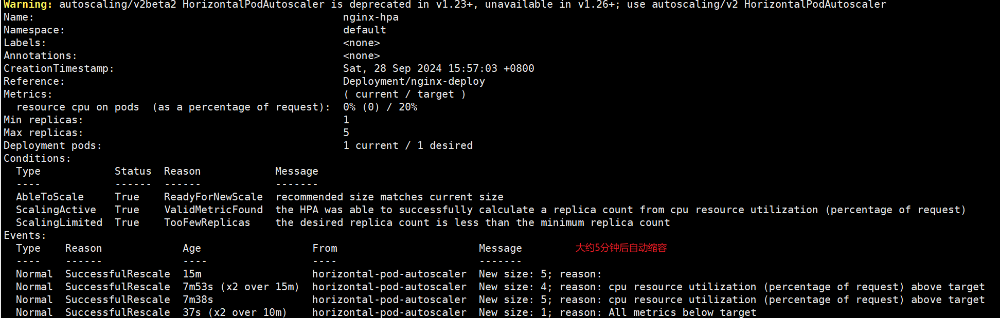

### 15.5.2 基于memory

***和基于cpu的完全一样只是把HPA配置文件的***`sepc.metrics.resource.name`***的值变为***`memory`

1. 定义基于`memory`自动扩容的配置文件`nginx-hpa-memory.yaml`

   ```yaml
   apiVersion: autoscaling/v2 # 使用的是v2版本的
   kind: HorizontalPodAutoscaler # 资源类型为hpa
   metadata:
     name: nginx-hpa
     namespace: default
   spec:
     maxReplicas: 5 #最大副本数
     metrics: # 用于监控的指标
     - resource: # 监控k8s已知的资源
         name: memory # 监控资源类型为memory
         target: #监控资源的目标值
           averageUtilization: 60 # 跨所有相关 Pod 得出的资源指标均值的目标值， 表示为 Pod 资源请求值的百分比。仅对 “Resource”有效 
           type: Utilization # 表示监控值的类型 Utilization(平均利用率)  Value(目标值) AverageValue(平均值)
       type: Resource # 监控指标使用Resource
     minReplicas: 1 #最小副本数
     scaleTargetRef: #用于指定管理的资源对象信息
       apiVersion: apps/v1 #被管理的资源api版本
       kind: Deployment #被管理的资源类型
       name: nginx-deploy #被管理的资源名字
   ```

2. 使用配置文件`nginx-hpa-memory.yaml`

   ```bash
   kubectl apply -f nginx-hpa-memory.yaml #
   ```

3. 目前只有一个pod，进入pod容器中，下载`stress`工具

   ```bash
   # 1.进入pod中nginx-c容器中
   kubectl exec -it nginx-deploy-8655f46645-z9tzt -c nginx-c -- /bin/bash
   # 2.查看系统版本
   cat /etc/os-release
   # 3.更新软件源并安装内存测试工具stress
   apt-get update && apt-get install -y stress
   # 4. 根据物理机实际大小酌情分配
   stress -vm 1 --vm-bytes 100M --vm-hang 0 #不要退出
   ```

4. 查看情况，成功验证

   ```bash
   # 多看几次hpa，有延迟
   kubectl top hpa gninx-hpa
   kubectl get pod -w#监视pod的变化
   kubectl describe hpa nginx-hpa #查看hpa允许详情
   ```

   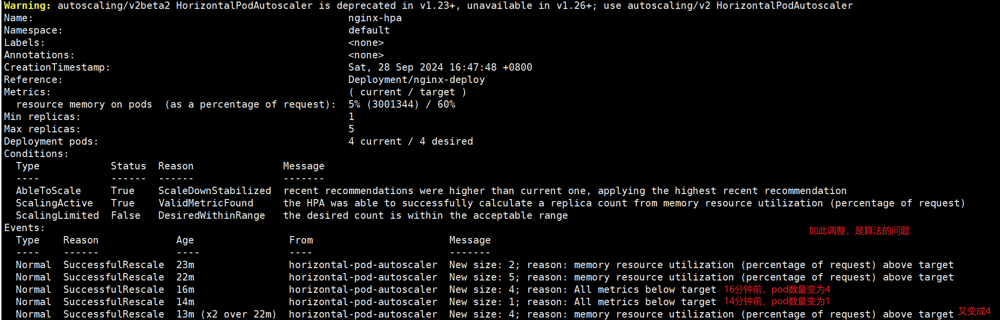

### 15.5.3 基于自定义指标

***前提安装Prometheus和Helm***


### 15.5.4 删除HPA

```bash
kubectl delete hpa nginx-hpa
```

# 16. 指标服务Metrics Server

对于 Kubernetes，**Metrics API** 提供了一组基本的指标，以支持自动伸缩和类似的用例。 该 API 提供有关节点和 Pod 的资源使用情况的信息， 包括 CPU 和内存的指标。如果将 Metrics API 部署到集群中， 那么 Kubernetes API 的客户端就可以查询这些信息，并且可以使用 Kubernetes 的访问控制机制来管理权限。

[HorizontalPodAutoscaler](https://kubernetes.io/zh-cn/docs/tasks/run-application/horizontal-pod-autoscale/) (HPA) 和 [VerticalPodAutoscaler](https://github.com/kubernetes/autoscaler/tree/master/vertical-pod-autoscaler#readme) (VPA) 使用 metrics API 中的数据调整工作负载副本和资源，以满足客户需求。

你也可以通过 [`kubectl top`](https://kubernetes.io/docs/reference/generated/kubectl/kubectl-commands#top) 命令来查看资源指标。

## 16.0 api文档

参考文档：https://kubernetes.io/zh-cn/docs/tasks/debug/debug-cluster/resource-metrics-pipeline/

## 16.1 Metrics Server架构

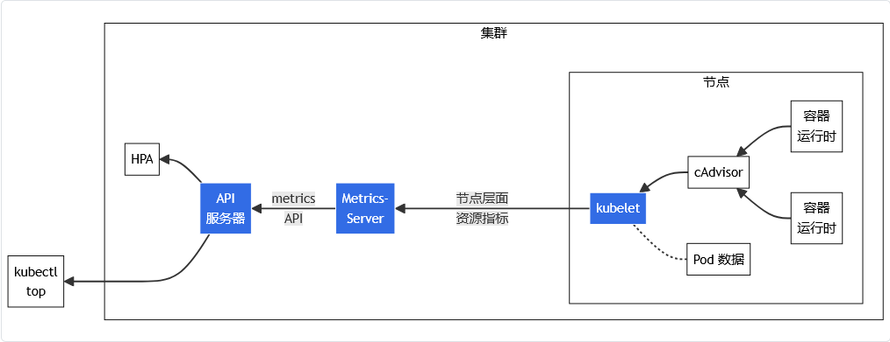

图中从右到左的架构组件包括以下内容：

- [cAdvisor](https://github.com/google/cadvisor): 用于收集、聚合和公开 Kubelet 中包含的容器指标的守护程序。
- [kubelet](https://kubernetes.io/zh-cn/docs/concepts/architecture/#kubelet): 用于管理容器资源的节点代理。 可以使用 `/metrics/resource` 和 `/stats` kubelet API 端点访问资源指标。
- [节点层面资源指标](https://kubernetes.io/zh-cn/docs/reference/instrumentation/node-metrics): kubelet 提供的 API，用于发现和检索可通过 `/metrics/resource` 端点获得的每个节点的汇总统计信息。
- [metrics-server](https://kubernetes.io/zh-cn/docs/tasks/debug/debug-cluster/resource-metrics-pipeline/#metrics-server): 集群插件组件，用于收集和聚合从每个 kubelet 中提取的资源指标。 API 服务器提供 Metrics API 以供 HPA、VPA 和 `kubectl top` 命令使用。Metrics Server 是 Metrics API 的参考实现。
- [Metrics API](https://kubernetes.io/zh-cn/docs/tasks/debug/debug-cluster/resource-metrics-pipeline/#metrics-api): Kubernetes API 支持访问用于工作负载自动缩放的 CPU 和内存。 要在你的集群中进行这项工作，你需要一个提供 Metrics API 的 API 扩展服务器。

## 16.2 安装Metrics Server

1. 下载Metrics-Components的配置文件

   ```bash
   wget https://github.com/kubernetes-sigs/metrics-server/releases/latest/download/components.yaml -O metrics-components.yaml
   ```

2. 修改配置文件

   ```bash
   # 1.替换镜像地址,加速
   sed -ie 's#image: registry.k8s.io/metrics-server/#image: 192.168.31.79:5000/dyrnq/#g' metrics-components.yaml|grep image # #为自定义分隔符代替/
   # 2.metrics-server增加args --kubelet-insecure-tls参数,允许http访问
   sed -ir 's#\-\-metric\-resolution\=15s#&\n\s{8}\-\s\-\-kubelet\-insecure\-tls#g' metrics-components.yaml
   #效果如下
   <<EOF
   	spec:
         containers:
         - args:
           - --cert-dir=/tmp
           - --secure-port=10250
           - --kubelet-preferred-address-types=InternalIP,ExternalIP,Hostname
           - --kubelet-use-node-status-port
           - --metric-resolution=15s
           - --kubelet-insecure-tls #允许http访问
           image: 192.168.31.79:5000/dyrnq/metrics-server:v0.7.2
   EOF
   ```

3. 执行安装

   ```bash
   kubectl apply -f metrics-components.yaml
   kubectl get po -A|grep metrics
   ```

4. 验证

   > **top输出的都是占用的资源，只能看Node和Pod**

   ```bash
   kubectl top no #查看no的资源利用
   # Node节点的  cpu核心负载 	cpu利用率  内存使用量       内存利用率   
   NAME         CPU(cores)   CPU%   MEMORY(bytes)   MEMORY%   
   k8s-master   103m         5%     1219Mi          70%       
   k8s-node1    40m          2%     723Mi           42%       
   k8s-node2    36m          1%     683Mi           39%
   
   kubectl top pod #查看pod的资源利用
   ```

   

# 17. *Service*

在 kubernetes 中，当创建带有多个副本的 deployment 时，kubernetes 会创建出多个  pod，此时即一个服务后端有多个容器，那么在 kubernetes 中负载均衡怎么做？容器漂移后 ip 也会发生变化，如何做服务发现以及会话保持？

这就是 service 的作用，**service 是一组具有相同 label pod  集合的抽象，集群内外的各个服务可以通过 service 进行互相通信，当创建一个 service 对象时也会对应创建一个 endpoint  对象。endpoint 是用来做容器发现（服务发现），service 只是将多个 pod 进行关联，实际的路由转发（负载均衡）都是由 kubernetes 中的  kube-proxy 组件来实现**，因此，service 必须结合 kube-proxy 使用，kube-proxy 组件可以运行在  kubernetes 集群中的每一个节点上也可以只运行在单独的几个节点上，其会根据 service 和 endpoints 的变动来改变节点上 iptables 或者 ipvs 中保存的路由规则。

> service也是一个服务（有自己的ip）；service 是一组具有相同 label pod  集合的抽象；service 只是将多个 pod 进行关联

## 17.0 api文档

+ Service api文档： https://kubernetes.io/zh-cn/docs/reference/kubernetes-api/service-resources/service-v1/#Service
+ Endpoint api文档：https://kubernetes.io/zh-cn/docs/reference/kubernetes-api/service-resources/endpoints-v1/
+ 介绍文档：https://kubernetes.io/zh-cn/docs/concepts/services-networking/service/#discovering-services

## 17.1 定义Service

以NodePort为例

+ 命令行创建（**重点：selector**）

  目录帮助： https://kubernetes.io/docs/reference/generated/kubectl/kubectl-commands#-em-service-em-

  ```bash
  ######方法1 
  # 使用已存在的service nginx-svc作为模板，创建新的service test-nginx-svc并指定service的selector为 app=nginx
  kubectl expose service nginx-svc --type=NodePort --port=80 --protocol=TCP --target-port=80 --selector=app=nginx --name=test-nginx-svc 
  ######方法2 
  # 1.创建需要的服务
  kubectl cerate service clusterip --help # 创建clusterip服务
  kubectl create service nodeport test-nginx-svc --node-port 30037 --tcp=80:80 # 创建nodeport服务
  kubectl cerate service externalname --help # 创建externalname服务
  kubectl cerate service loadbalancer --help# 创建loadbalancer服务
  # 2.对于Nodeport这样创建的是无头服务，即没有创建endpoint。因为直接使用create命令无法定义selector，因此没有对应的endpoint解析到对应的pod上，因此需要我们手动添加endpoint或更改配置文件的selector
  kubectl edit svc test-nginx-svc # 进入svc编辑界面，修改selector加上 app=nginx 保存即可
  ```

+ 配置文件创建（**推荐**）

  ```yaml
  apiVersion: v1 # 使用api版本
  kind: Service # 资源的类型
  metadata: # 该资源的元数据信息
    annotations: #注解
      # 通过kubectl apply -f或kubectl create -f --save-config自动生成的配置信息，用于更新配置时使用
      kubectl.kubernetes.io/last-applied-configuration: |
        {"apiVersion":"v1","kind":"Service","metadata":{"annotations":{},"name":"nginx-svc","namespace":"default"},"spec":{"ports":[{"name":"nginx-svc-port","nodePort":30036,"port":80,"protocol":"TCP","targetPort":80}],"selector":{"app":"nginx"},"type":"NodePort"}}
    creationTimestamp: "2024-10-08T06:49:33Z" #自动生成
    name: test-nginx-svc # Service的名字
    namespace: default # Service的命名空间
    resourceVersion: "507206" # 资源版本（自动生成）
    uid: 0ee6f846-12c9-416e-bd7e-a12d95a954e7 # 自动生成
  spec: # service的规约、规范
    clusterIP: 10.100.190.66 # 该service服务的集群ip，不指定会自动生成（如果为Node表示为无头服务）
    clusterIPs: # 分配给service服务的集群ip列表，不指定会自动生成（如果为Node表示为无头服务）
    - 10.100.190.66
    # 注意外部流量的含义：NodePort、ExternalIP 和 LoadBalancer IP
    # 表示来自外部流量（NodePort等）控制策略，有Local（kube-proxy认为使用外部的负载均衡器，因此每个Node节点将仅向服务的节点本地端点传递流量，而不会伪装客户端源 IP）和Cluster（默认值，kube-proxy使用负载均衡将流量路由到所有端点endpoint）
    externalTrafficPolicy: Cluster 
    # 表示来自内部流量（ ClusterIP）控制策略，有Local（kube-proxy将流量转发到同一Node节点上的端点endpoint，如果该endpoint不存在就丢弃）和Cluster（默认值，kube-proxy将流量路由到所有端点endpoint）
    internalTrafficPolicy: Cluster 
    ipFamilies: # 表示分配给服务的IP协议（例如 IPv4、IPv6）的列表。该字段通常根据集群配置和 ipFamilyPolicy 字段自动设置
    - IPv4
    # SingleStack（默认值，单个 IP 协议）、 PreferDualStack（双栈配置集群上的两个 IP 协议或单栈集群上的单个 IP 协议） 或 RequireDualStack（双栈上的两个 IP 协议配置的集群，否则失败）
    ipFamilyPolicy: SingleStack # 表示此服务请求或要求的双栈特性 
    ports: # 服务的端口组信息
    # 即将nodeport端口请求转发到targetport端口（Pod容器）上
    - name: nginx-svc-port # 表示端口组信息中的第一个 名字
      nodePort: 30036 # 暴露的NodePort端口,不指定随机端口（30000-32767）
      port: 80 # service使用（监听）的端口
      protocol: TCP # 使用TCP协议
      targetPort: 80 # Pod容器的端口
    # 没有selector就是无头服务Headless service即不会自动创建endpoint
    selector: # 表示该Service作用于具有以下label的Pod
      app: nginx
    # 会话的亲和性，即确保来自特定客户端的连接每次都传递到同一个 Pod
    sessionAffinity: None #  ClientIP 或 None（默认）
    type: NodePort # Service使用哪种规则。有ClusterIP（默认）、NodePort、ExternalName、LoadBalancer
  # k8s自动采集维护的（只读）
  status: 
    loadBalancer: {}
  ```

+ 测试

  ```bash
  kubectl run busybox --image=192.168.31.79:5000/busybox:1.28.4 -- top # /bin/sh不行直接退出了，top才会一直运行
  kubectl exec -it busybox -c busybox -- /bin/sh #进入容器
  	\# wget -O- test-nginx-svc # 通过服务名直接访问成功（需要有selector）
  	\# wget -O- metrics-server.kube-system # 可以跨命名空间访问
  ```

> service进行服务转发是通过label标签实现的，所以service必须写selector（除非是代理外部服务地址）

## 17.2 服务类型（Service type）

Service支持的类型也就是Kubernetes中服务暴露的方式，默认有四种：

+ **ClusterIP** **只用于集群内部通信**

  通过集群的内部 IP 公开 Service，选择该值时 Service 只能够在集群内部访问。 这也是你没有为 Service 显式指定 `type` 时使用的默认值。 你可以使用 [Ingress](https://kubernetes.io/zh-cn/docs/concepts/services-networking/ingress/) 或者 [Gateway API](https://gateway-api.sigs.k8s.io/) 向公共互联网公开服务。

  **具体访问流程如下：**

  1. 访问`DNS`服务获取`Service`的实际`ClusterIP`（**如果是直接访问ClusterIP此步可忽略**）
  2. 访问`ClusterIP:Serviceport`指定service服务如nginx-svc
  3. 指定的service服务如nginx-svc转发到对应的`EndPoint`上，根据`Endpoint`上关联的Pod地址和端口访问到具体Node
  4. 请求到具体Node上的`kube-proxy`上，根据`iptables`或`ipvs`进行路由转发或进行负载均衡
  5. 请求被`kube-proxy`转发到达具体Pod的容器Port上

  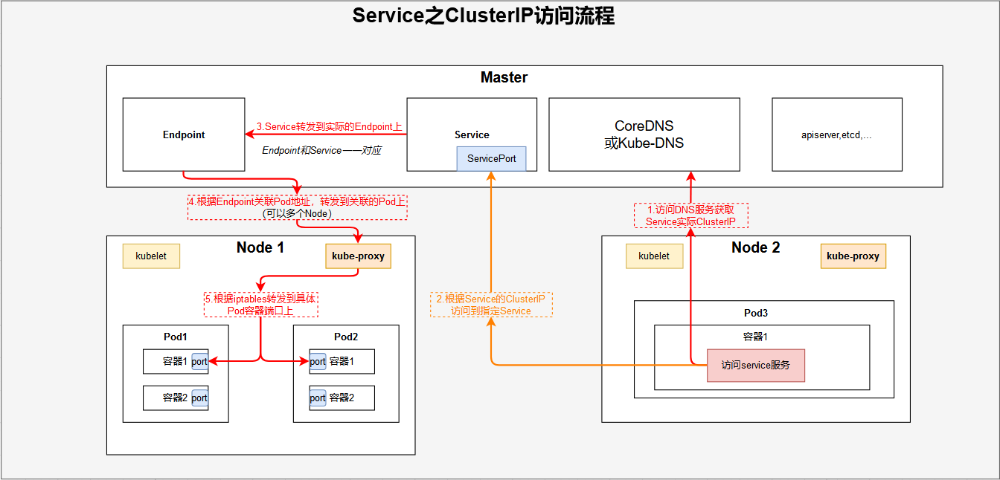

  > service是一个服务（类似nginx），监听一个端口

+ **NodePort** **可以用于集群内部通信,也可以用于外部通信(不推荐)**

  通过每个节点（Node和Master）上的 IP 和静态端口（`NodePort`）公开 Service。 为了让 Service 可通过节点端口访问，Kubernetes 会为 Service 配置集群 IP 地址， 相当于你请求了 `type: ClusterIP` 的 Service。即会在所有安装了`kube-proxy`的节点上绑定一个端口（类似于运行nginx服务），可以通过集群内任意节点的IP+NodePort端口进行访问。NodePort默认范围在30000-32767，**可以修改文件**`/etc/kubernetes/manifests/kube-apiserver.yaml`，追加`--service-node-port-range=79-32767`进行覆盖，**k8s会检测到配置文件变化，自动更新**。

  ***访问流程：***

  + **集群内**

    **见上，和ClusterIP完全一样**

  + **集群外**

    1. 集群外机器访问集群内`NodePort`服务，任意节点机器都可以如`192.168.136.151:30036`
    2. NodePort服务首先访问`DNS`服务获取`Service`的实际`ClusterIP`
    3. NodePort服务将请求转发到`ClusterIP:Serviceport`指定service服务如nginx-svc
    4. 指定的service服务如nginx-svc转发到对应的`EndPoint`上，根据`Endpoint`上关联的Pod地址和端口访问到具体Node
    5. 请求到具体Node上的`kube-proxy`上，根据`iptables`或`ipvs`进行路由转发或进行负载均衡
    6. 请求被`kube-proxy`转发到达具体Pod的容器Port上

  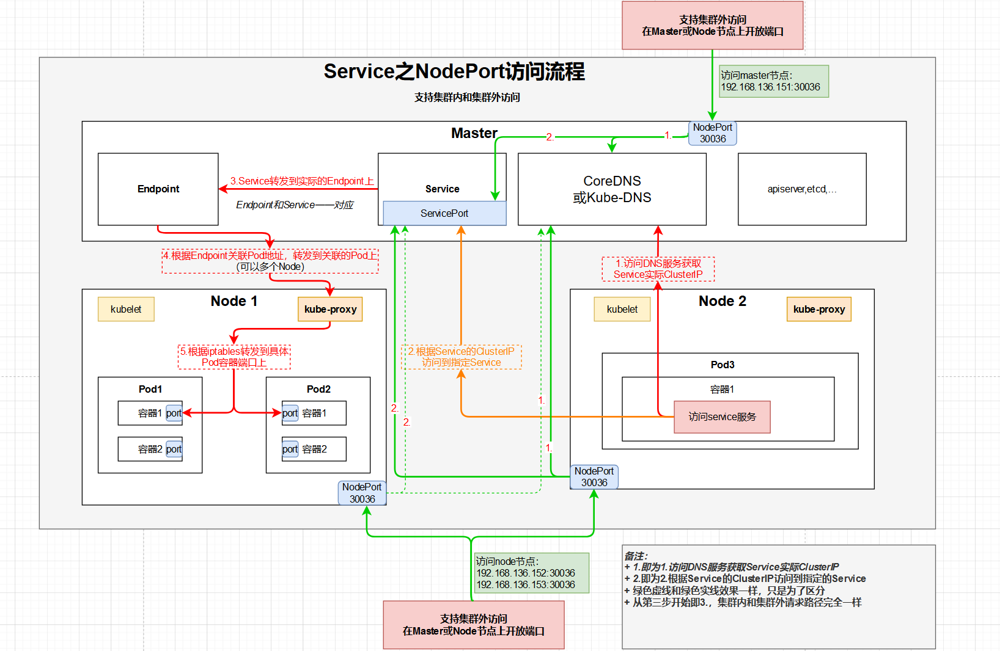

  > NodePort是一个服务（类似nginx），监听一个端口。NodePort不推荐外网访问,**处于第4层负载,无法解析网络层**(请求头,请求地址等等)。推荐使用ingress，处于**第七层负载，可以解析网络层**

+ **LoadBalancer** **配置外部的负载均衡器(如阿里云)代替kube-proxy**

  使用云平台的负载均衡器向外部公开 Service。Kubernetes 不直接提供负载均衡组件； 你必须提供一个，或者将你的 Kubernetes 集群与某个云平台集成。

  具体见[17.9 k8s访问方式](#17.9 k8s访问方式)

  > 如果使用外部负载均衡器（如nginx）可以不配置LoadBalancer（转发到NodePort上），如果使用云平台负载均衡器则必须配置LoadBalancer（可以直接转发到Pod容器服务，当然也可以转发到NodePort）。

+ **ExternalName** **service映射到外部域名**

  将服务映射到 `externalName` 字段的内容（例如，映射到主机名 `api.foo.bar.example`）。 该映射将集群的 DNS 服务器配置为返回具有该外部主机名值的 `CNAME` 记录。 集群不会为之创建任何类型代理。

  > 即当Pod内容器使用该Service访问（域名访问），会自动将请求跳转到对应的域名地址。（反向代理访问外部域名）

## 17.3 Headless Service（无头服务）

当配置文件中`ClusterIP=None`时表示使用的就是无头服务，即该Service不存在ClusterIP，kube-proxy也就不会进行负载均衡。**访问逻辑就是Pod访问DNS服务（CoreDNS或kube-DNS）获取全部Pod的IP，客户端采取一定的规则（如轮询）选择其中一个Pod地址直接进行访问，不经过kube-proxy。**也就是说Headless Service 无头服务中**不可用于k8s的服务发现和负载均衡**

```yaml
apiVersion: v1
kind: Service
metadata:
  name: nginx-svc-headless
  namespace: default
  labels:
    app: headless
    target: ngx-headless
spec:
  selector: # 选择Pod（是否可以和Pod通信，和哪些Pod全靠它）
    target: ngx-headless
  ports:
  - port: 80 # 如果不写targetPort，则默认targetPort=port
    targetPort: 80 #  对于 clusterIP 为 None 的服务，此字段将被忽略， 应忽略不设或设置为 port 字段的取值
  clusterIP: None
  type: ClusterIP
```

访问进入另一个Pod容器中如centos，执行`curl nginx-svc-headless.deafult -v`即可查看

## 17.4 Service服务发现

在 Kubernetes 中，**服务发现** 是指 **一个容器（通常运行在 Pod 内的应用程序）通过 Kubernetes 提供的机制找到并连接到另一个 Pod 中的容器**。它解决了在动态环境中，如何让容器之间自动找到并通信的问题。

对于在集群内运行的客户端（Pod内容器），Kubernetes 支持两种主要的服务发现模式：**环境变量和 DNS**。

+ 基于**环境变量**

  k8s在Pod启动时为其自动注入一组环境变量（指Pod内所有容器中），其中包含与服务相关的信息，比如服务的IP地址和端口。

  **优点： **简单直接，适合固定且无需频繁变动的服务

  **缺点：**灵活度较低，如果ClusterIP或端口变化，环境变量也无法更新。只能重启Pod更新环境变量

  > 一旦Pod运行，环境变量就不会自动更新。因此需要**先创建好Service再启动Pod**。

+ 基于**DNS**

  利用Kubernetes的CoreDNS组件，为每个Service服务提供基于DNS名称的解析。当前 kubernetes 集群默认使用 CoreDNS 作为默认的 DNS 服务，主要原因是 CoreDNS 是基于 Plugin 的方式进行扩展的，简单，灵活，并且不完全被Kubernetes所捆绑。

  **优点： **动态性强，总能获取最新Service配置信息；广泛使用，几乎支持所有场景且k8s中推荐使用；无头服务支持，直接访问Pod

  **缺点：**依赖DNS服务，需要安装单独插件。且若DNS服务出现问题就无法使用

## 17.5 SessionAffinity会话亲和性

针对某些有状态服务，SessionAffinity可以将**来自特定客户端（同一ip）的连接每次都传递到同一个 Pod**，以此来保持会话的黏性。

具体配置文件如下：

```yaml
apiVersion: v1
kind: Service
metadata:
  name: nginx-svc-session-affinity
  namespace: default
  labels:
    app: nginx-svc-session-affinity
spec:
  selector:
    app: nginx
  ports:
  - port: 80
    targetPort: 80
  type: ClusterIP
  sessionAffinity: ClientIP # 默认为None不开启，ClientIP表示根据IP进行区分是否为同一请求
  sessionAffinityConfig:
    clientIP:
      timeoutSeconds: 20 #默认为10800s(3个小时)，有效范围为0<x<=86400(1天)
```

实现原理是：当设置`sessionAffinity=ClientIP`时，**kube-proxy会在负载均衡时记住每个请求客户端的IP地址，并将同一个IP地址的流量转发到同一个Pod（依据iptables或ipvs）**。

> 可以先将服务设置`sessionAffinity=None`，进入centos容器发送请求如`curl nginx-svc-session-affinity.deafult`，观察都随机的Pod地址进行响应。然后更改`sessionAffinity=ClientIP`，再次进入centos容器发送请求，发现都是同一个Pod地址。(最好改动nginx的index.html便于区分)

## 17.6 代理k8s外部服务

**为了让集群内Pod容器可以通过访问Service来访问集群外部服务（如Mysql），这对切换生产环境地址很有效。**比如，原来集群内Pod容器每个单独的访问外部服务地址，当需要切换或更改外部分服务地址时则需要更改所有关联的Pod容器配置文件，很麻烦。那么此时，我们可以**通过配置Service，在Pod容器内配置直接访问该Service地址而不是外部ip，而此Service搭配的endpoint指向集群外部ip地址**。这样每次切换服务地址**只需要修改与Service对应的Endpoint中地址**即可完成，即**只需要修改一次**。

***使用步骤：***

+ 编写Service配置文件`nginx-svc-external-svc.yaml`，**不要指定selector属性**

  *没有指定selector属性，此时不会生成对应的endpoint或生成的endpoint没有关联节点地址*

  ```yaml
  apiVersion: v1
  kind: Service
  metadata:
    name: nginx-svc-external
    namespace: default
    labels:
      app: ngx
  spec: 
    ports: 
    - name: nginx-svc-external-port
      port: 81
      protocol: TCP
      targetPort: 443 # 以bilibli地址为例
    type: ClusterIP # NodePort也可以
  ```

+ 编写或修改endpoint文件`nginx-svc-external-ep.yaml`（**必须和上面Service的label一样**）

  *没有指定selector属性，此时不会生成对应的endpoint或生成的endpoint没有关联节点地址，所以需要自己手动添加修改*

  ```yaml
  apiVersion: v1
  kind: Endpoints
  metadata:
    name: nginx-svc-external # 与service完全一致
    namespace: default # 与service完全一致
    labels: # 包含Service，是他的父集
      app: ngx
  subsets:
  - addresses:
    - ip: 8.134.50.24 # 外部服务地址 以bilibili地址为例
    ports:
    - name: nginx-svc-external-port # 必须和service中spec.ports[*].name完全匹配
      port: 443 #记录后端Pod实际监听端口，通常和service中spec.ports.targetport一样(即外部服务地址的端口)
      protocol: TCP
  ```

+ 创建并验证Service和Pod正确

  ```bash
  $kubectl apply -f nginx-svc-external-svc.yaml
  $kubectl apply -f nginx-svc-external-ep.yaml
  $kubectl get svc,ep -o wide
  NAME                         TYPE        CLUSTER-IP      EXTERNAL-IP   PORT(S)        AGE     SELECTOR
  service/kubernetes           ClusterIP   10.96.0.1       <none>        443/TCP        18d     <none>
  service/nginx-svc            NodePort    10.100.190.66   <none>        80:30036/TCP   6h29m   app=nginx
  service/nginx-svc-external   ClusterIP   10.99.148.152   <none>        81/TCP         38m     <none># bilibili
  
  NAME                           ENDPOINTS                            AGE
  endpoints/kubernetes           192.168.136.151:6443                 18d
  endpoints/nginx-svc            10.244.169.130:80,10.244.36.120:80   6h29m
  endpoints/nginx-svc-external   8.134.50.24:443                      3s#bilibili
  ```

+ Pod容器中使用

  ```bash
  kubectl exec -it busybox -c busybox -- /bin/sh
  	# 通过Service内部域名，代替外部ip地址访问
  	\# telnet nginx-svc-external 81 # 任意输入命令，中断连接，显示返回html数据（正确访问）
  	\# wget -O- nginx-svc-external:81 # 返回400 Bad Request（正确访问）
  ```

+ 即在内部Pod容器通过Service名代替实际IP，实现反向代理内部到外部。从而更新地址时只需要维护Service对应的Endpoint即可

> 代理k8s外部服务时，`ClusterIP`存在且不为`None`

## 17.7 反向代理外部域名

通过使用**type=ExternalName**实现，反向代理外部域名。（内部Pod容器访问外部）

+ 定义Service配置文件`nginx-svc-externalname.yaml`

  ```yaml
  apiVersion: v1
  kind: Service
  metadata:
    name: nginx-svc-externalname
    namespace: default
    labels:
      app: ngx-externalname
  spec: 
    type: ExternalName # 使用域名CNAME
    externalName: www.bilibili.com
  ```

+ 创建service并验证

  ```bash
  $kubectl apply -f nginx-svc-externalname.yaml
  $kubectl exec -it busybox -c busybox -- /bin/sh
  	\# wget -O- nginx-svc-externalname # 访问 http协议的www.bilibili.com
  	\# wget -O- https://nginx-svc-externalname # 访问 https协议的www.bilibili.com
  	# 以上会出现400bad request或403Forbiden 这是因为k8s转发请求会将 请求头Host:my-service，所以导致服务不认，使用以下方法解决
  	 wget --header="Host: bilibili.com" http://nginx-svc-externalname
  ```

> `type=ExternalName`时`ClusterIP=None`

## 17.8 Service负载均衡和外部负载均衡器的区别

+ **Service的负载均衡是指集群内部，kube-proxy将请求均衡的转发到Pod容器中**
+ **外部负载均衡是指集群外部，将外部的请求均衡的转发到Node节点的NodePort上**
+ 他俩不是一个层面的均衡

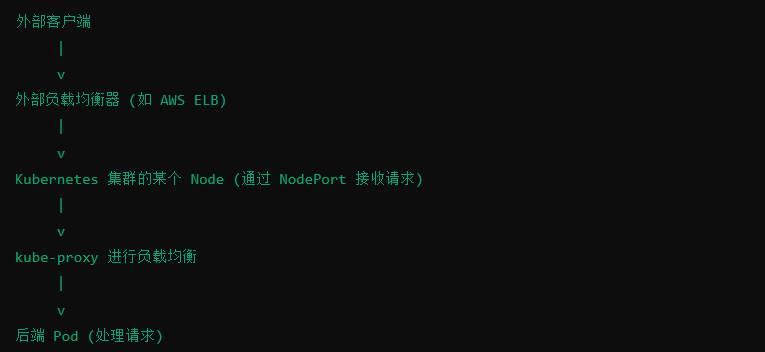

## 17.9 k8s访问方式

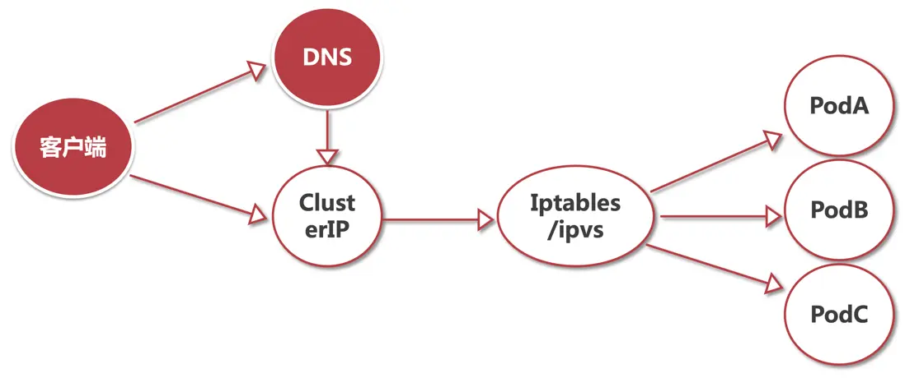

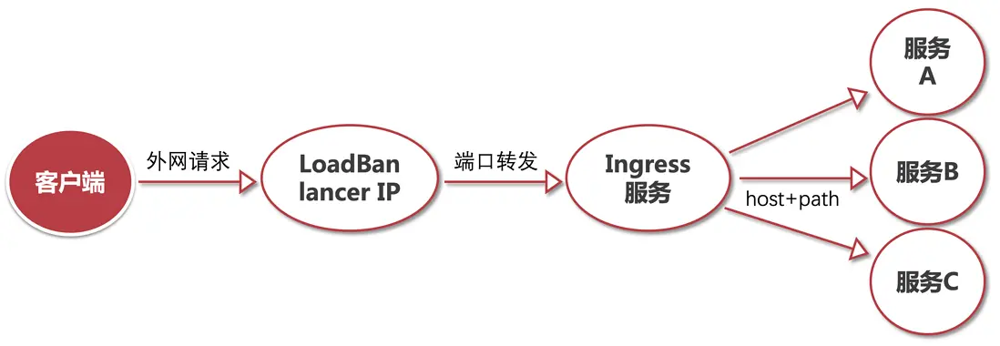

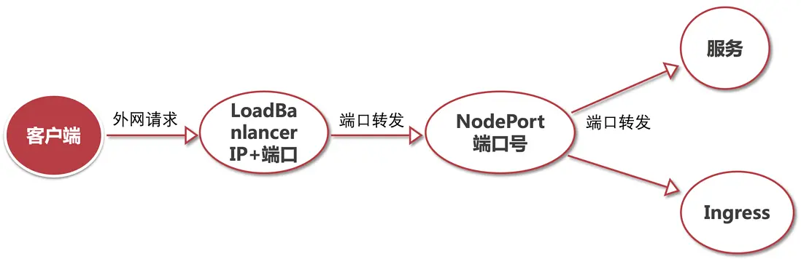

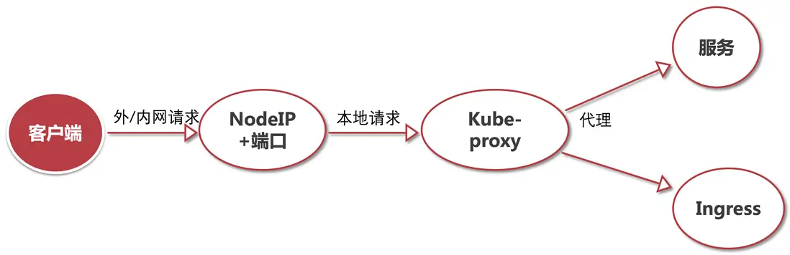

## 17.10 service的负载均衡

service 实际的路由转发都是由 kube-proxy 组件来实现的，service 仅以一种 VIP（ClusterIP） 的形式存在，kube-proxy 主要实现了集群内部从 pod 到 service 和集群外部从  nodePort 到 service 的访问，kube-proxy 的路由转发规则是通过其后端的代理模块实现的，kube-proxy  的代理模块目前有四种实现方案，**userspace、iptables、ipvs、kernelspace**，其发展历程如下所示：

- kubernetes v1.0：services 仅是一个“4层”代理，代理模块只有 userspace
- kubernetes v1.1：Ingress API 出现，其代理“7层”服务，并且增加了 iptables 代理模块
- kubernetes v1.2：iptables 成为默认代理模式
- kubernetes v1.8：引入 ipvs 代理模块
- kubernetes v1.9：ipvs 代理模块成为 beta 版本
- kubernetes v1.11：ipvs 代理模式 GA

> userspace、iptables、ipvs 三种模式中默认的负载均衡策略都是通过 round-robin 算法来选择后端 pod 的

### 17.10.1 userspace 模式

在 userspace 模式下，访问服务的请求到达节点后首先进入**内核(linux的) iptables**，然后回到用户空间，由 kube-proxy 转发到后端的 pod，这样流量从用户空间进出内核带来的性能损耗是不可接受的，所以也就有了 iptables 模式。

为什么 userspace 模式要建立 iptables 规则，因为 kube-proxy  监听的端口在用户空间，这个端口不是服务的访问端口也不是服务的 nodePort，因此需要一层 iptables 把访问服务的连接重定向给  kube-proxy 服务。

### 17.10.2 iptables 模式

iptables 模式是目前默认的代理方式，基于 netfilter 实现。当客户端请求  service 的 ClusterIP 时，根据 iptables 规则路由到各 pod 上，iptables 使用 DNAT  来完成转发，其采用了随机数实现负载均衡。

iptables 模式与 userspace  模式最大的区别在于，iptables 模块使用 DNAT 模块实现了 service 入口地址到 pod  实际地址的转换，免去了一次内核态到用户态的切换，另一个与 userspace 代理模式不同的是，如果 iptables 代理最初选择的那个  pod 没有响应，它不会自动重试其他 pod。

iptables 模式最主要的问题是在 service 数量大的时候会产生太多的 iptables 规则，使用非增量式更新会引入一定的时延，大规模情况下有明显的性能问题。

### 17.10.3 ipvs 模式

当集群规模比较大时，iptables  规则刷新会非常慢，难以支持大规模集群，因其底层路由表的实现是链表，对路由规则的增删改查都要涉及遍历一次链表，ipvs  的问世正是解决此问题的，ipvs 是 LVS 的负载均衡模块，与 iptables 比较像的是，ipvs 的实现虽然也基于 netfilter  的钩子函数，但是它却使用哈希表作为底层的数据结构并且工作在内核态，也就是说 ipvs  在重定向流量和同步代理规则有着更好的性能，几乎允许无限的规模扩张。

ipvs  支持三种负载均衡模式：DR模式（Direct Routing）、NAT 模式（Network Address  Translation）、Tunneling（也称 ipip 模式）。三种模式中只有 NAT 支持端口映射，所以 ipvs 使用 NAT  模式。linux 内核原生的 ipvs 只支持 DNAT，当在数据包过滤，SNAT 和支持 NodePort 类型的服务这几个场景中ipvs  还是会使用 iptables。

此外，ipvs 也支持更多的负载均衡算法，例如：

- rr：round-robin/轮询
- lc：least connection/最少连接
- dh：destination hashing/目标哈希
- sh：source hashing/源哈希
- sed：shortest expected delay/预计延迟时间最短
- nq：never queue/从不排队

### 17.10.4 kernelspace模式

主要用于windows

# 18. Ingress

[Ingress](https://kubernetes.io/docs/reference/generated/kubernetes-api/v1.31/#ingress-v1-networking-k8s-io) 提供从集群外部到集群内[服务](https://kubernetes.io/zh-cn/docs/concepts/services-networking/service/)的 HTTP 和 HTTPS 路由。 流量路由由 Ingress 资源所定义的规则来控制。

通过配置，Ingress 可为 Service 提供外部可访问的 URL、对其流量作负载均衡、 终止 SSL/TLS，以及基于名称的虚拟托管等能力。 [Ingress 控制器](https://kubernetes.io/zh-cn/docs/concepts/services-networking/ingress-controllers) 负责完成 Ingress 的工作，具体实现上通常会使用某个负载均衡器， 不过也可以配置边缘路由器或其他前端来帮助处理流量。

Ingress 不会随意公开端口或协议。 将 HTTP 和 HTTPS 以外的服务开放到 Internet 时，通常使用 [Service.Type=NodePort](https://kubernetes.io/zh-cn/docs/concepts/services-networking/service/#type-nodeport) 或 [Service.Type=LoadBalancer](https://kubernetes.io/zh-cn/docs/concepts/services-networking/service/#loadbalancer) 类型的 Service。

> **ingress控制器实际就是Pod+service，所以如果想确认ingress控制器地址直接查看其Pod配置文件或svc,ep**（当然Pod容器中可以使用`service名.命名空间进行访问`）
>
> ```bash
> # 注意容器内要走ingress转发必须加上Ingress配置文件中rules中的host (一般不会这么用，集群中直接service访问就好不会再走ingress控制器，全做了解)
> # 1.进入容器
> $ kubectl exec -it centos -c centos -- bash
> # 2.容器中模拟转发 必须加上rules有的Host域名地址当作请求头
> \# curl -H "Host: foo.com" ingress-nginx-controller.ingress-nginx # 访问ingress访问,必须改Host为rules中规则才会转发
> ```

## 18.0 api文档

+ ingress api文档：https://kubernetes.io/zh-cn/docs/reference/kubernetes-api/service-resources/ingress-v1/
+ ingress 介绍文档：https://kubernetes.io/zh-cn/docs/concepts/services-networking/ingress/

## 18.1 环境准备（安装ingress-nginx）

必须拥有一个 [Ingress 控制器](https://kubernetes.io/zh-cn/docs/concepts/services-networking/ingress-controllers) 才能满足 Ingress 的要求。**仅创建 Ingress 资源（指yaml配置文件）**本身没有任何效果。以ingress-nginx为例子：

ingress控制器大全： https://kubernetes.io/zh-cn/docs/concepts/services-networking/ingress-controllers/（**不仅仅是ingress-nginx**）

ingress-nginx 官网安装向导：https://kubernetes.github.io/ingress-nginx/deploy/#contents

### 18.1.1 安装helm

见[30.2 安装Helm](#30.2 安装Helm)


### 18.1.2 helm添加ingress-nginx仓库

```bash
# 1. 添加ingress-nginx仓库地址
$helm repo add ingress-nginx https://kubernetes.github.io/ingress-nginx
# 2.查看现有仓库列表
$helm repo list
# 3. 搜索ingress-nginx仓库,查看有哪些k8s插件
$helm search repo ingress-nginx
NAME                       	CHART VERSION	APP VERSION	DESCRIPTION                                       
ingress-nginx/ingress-nginx	4.11.3       	1.11.3     	Ingress controller for Kubernetes using NGINX a...
```

### 18.1.3 helm下载ingress-nginx包

> 参考表:https://github.com/kubernetes/ingress-nginx?tab=readme-ov-file.选择适合自己k8s版本的ingress-nginx

```bash
# 1.下架chart版本为4.4.2的ingress-nginx
$helm pull ingress-nginx/ingress-nginx --version=4.4.2
# 2.解压下载的文件 ingress-nginx-4.4.2.tgz
$tar -xf ingress-nginx-4.4.2.tgz
# 3.进入ingress-nginx目录
$cd ingress-nginx&&ls
CHANGELOG.md  changelog.md.gotmpl  Chart.yaml  ci  OWNERS  README.md  README.md.gotmpl  templates  values.yaml
```

### 18.1.4 修改ingress-nginx的配置文件

就是上一步看到的`value.yaml`文件

1. 修改所有的镜像地址为国内镜像（**验证的digest必须注释掉，否则不匹配**）

   > 推荐使用vscode，搜索`image:` （**镜像可以去hub.docker上拉取，就是要仔细查找**）

   ```yaml
   # 修改1
   controller:
     name: controller
     image:
       chroot: false
       # registry: registry.k8s.io
       registry: 192.168.31.79:5000
       # image: ingress-nginx/controller
       image: dyrnq/ingress-nginx-controller
       tag: "v1.5.1"
       #digest: sha256:4ba73c697770664c1e00e9f968de14e08f606ff961c76e5d7033a4a9c593c629 # 必须注释掉或者改为镜像一致的digest
       #digestChroot: sha256:c1c091b88a6c936a83bd7b098662760a87868d12452529bad0d178fb36147345
   ```

   ```yaml
   # 修改2
   controller:
     opentelemetry:
       enabled: false
       # image: registry.k8s.io/ingress-nginx/opentelemetry:v20221114-controller-v1.5.1-6-ga66ee73c5@sha256:41076fd9fb4255677c1a3da1ac3fc41477f06eba3c7ebf37ffc8f734dad51d7c
       image: 192.168.31.79:5000/ingress-nginx/opentelemetry:v20221114-controller-v1.5.1-6-ga66ee73c5
   ```

   ```yaml
   # 修改3
   controller:
     admissionWebhooks:
       patch:
         image:
           registry: 192.168.31.79:5000
           # registry: registry.k8s.io
           # image: ingress-nginx/kube-webhook-certgen
           image: dyrnq/kube-webhook-certgen
           tag: v20220916-gd32f8c343
           #digest: sha256:39c5b2e3310dc4264d638ad28d9d1d96c4cbb2b2dcfb52368fe4e3c63f61e10f
   ```

   ```yaml
   # 修改4
   defaultBackend:
     image:
       registry: 192.168.31.79:5000
       # registry: registry.k8s.io
       # image: defaultbackend-amd64
       image: dyrnq/defaultbackend-amd64
       tag: "1.5"
   ```

2. 修改ingress-nginx为DaemonSet类型（默认是Deployment）,**并添加nodeSelector**，为了将此DaemonSet部署在具有指定label标签的Node节点上

   ```yaml
   controller:
     # kind: Deployment
     kind: DaemonSet
     ...
     nodeSelector: #原来就有的
     	kubernetes.io/os: linux #原来就有的
       ingress: "true" # 自己追加的,布尔值用引号表示字符串
   ```

3. 修改ingress-nginx网络配置

   ```yaml
   controller:
     # hostNetwork: false
     hostNetwork: true # 本地有CNI插件，所有使用本地网络
     ...
     # -- Optionally change this to ClusterFirstWithHostNet in case you have 'hostNetwork: true'.
     # By default, while using host network, name resolution uses the host's DNS. If you wish nginx-controller
     # to keep resolving names inside the k8s network, use ClusterFirstWithHostNet.
     dnsPolicy: ClusterFirstWithHostNet
     # dnsPolicy: ClusterFirst
   ```

4. 修改网络类型为ClusterIP

   ```yaml
   controller:
     service:
       # type: LoadBalancer
       type: ClusterIP
   ```

5. 开启镜像地址不安全访问，不验证证书。（为了能成功下载第一步修改的image国内镜像）

   ```bash
   controller:
     admissionWebhooks:
       ## Additional annotations to the admission webhooks.
       ## These annotations will be added to the ValidatingWebhookConfiguration and
       ## the Jobs Spec of the admission webhooks.
       enabled: false
       # enabled: true
   ```

### 18.1.5 创建NameSpace

为ingress-nginx单独创建一个命名空间，为了进行逻辑区分

```bash
$kubectl create ns ingress-nginx
$kubectl get ns
```

### 18.1.6 给Node节点打上label标签

> 不推荐给master节点打上，因为一般不推荐将自己的服务放在master节点上运行。会产生污点，即不会自动创建该DaemonSet的Pod（后面讲）

```bash
$kubectl label no k8s-node2 ingress=true
$kubectl get no --show-labels|grep ingress
```

### 18.1.7 安装ingress

开始安装ingress-nginx

```bash
# 一定要进入先进入ingress-nginx配置文件即（values.yaml所在的文件夹下）
$ cd ~/download/ingress/ingress-nginx
$ helm install ingress-nginx -n ingress-nginx .  #最后有个点，表示在当前路径查找配置文件 values.yaml
```

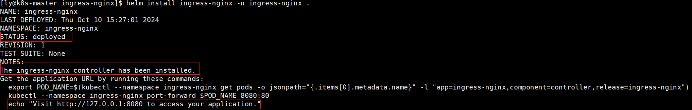

### 18.1.8 验证

```bash
$ kubectl get pod -n ingress-nginx
NAME                             READY   STATUS    RESTARTS   AGE
ingress-nginx-controller-n662s   1/1     Running   0          3m45s

# 默认ingress-nginx会占用Node节点的80和443端口，所有要确保Node节点的80和443端口空闲
$ kubectl get svc,ep -n ingress-nginx
NAME                               TYPE        CLUSTER-IP       EXTERNAL-IP   PORT(S)          AGE
service/ingress-nginx-controller   ClusterIP   10.108.180.122   <none>        80/TCP,443/TCP   29m

NAME                                 ENDPOINTS                                AGE
endpoints/ingress-nginx-controller   192.168.136.153:443,192.168.136.153:80   29m
```

### 18.1.9 ingress-nginx的values.yaml配置文件

`values.yaml`完整配置文件如下：

```yaml
## nginx configuration
## Ref: https://github.com/kubernetes/ingress-nginx/blob/main/docs/user-guide/nginx-configuration/index.md
##

## Overrides for generated resource names
# See templates/_helpers.tpl
# nameOverride:
# fullnameOverride:

## Labels to apply to all resources
##
commonLabels: {}
# scmhash: abc123
# myLabel: aakkmd

controller:
  name: controller
  image:
    ## Keep false as default for now!
    chroot: false
    # registry: registry.k8s.io
    registry: 192.168.31.79:5000
    # image: ingress-nginx/controller
    image: dyrnq/ingress-nginx-controller
    ## for backwards compatibility consider setting the full image url via the repository value below
    ## use *either* current default registry/image or repository format or installing chart by providing the values.yaml will fail
    ## repository:
    tag: "v1.5.1"
    #digest: sha256:4ba73c697770664c1e00e9f968de14e08f606ff961c76e5d7033a4a9c593c629
    #digestChroot: sha256:c1c091b88a6c936a83bd7b098662760a87868d12452529bad0d178fb36147345
    pullPolicy: IfNotPresent
    # www-data -> uid 101
    runAsUser: 101
    allowPrivilegeEscalation: true

  # -- Use an existing PSP instead of creating one
  existingPsp: ""

  # -- Configures the controller container name
  containerName: controller

  # -- Configures the ports that the nginx-controller listens on
  containerPort:
    http: 80
    https: 443

  # -- Will add custom configuration options to Nginx https://kubernetes.github.io/ingress-nginx/user-guide/nginx-configuration/configmap/
  config: {}

  # -- Annotations to be added to the controller config configuration configmap.
  configAnnotations: {}

  # -- Will add custom headers before sending traffic to backends according to https://github.com/kubernetes/ingress-nginx/tree/main/docs/examples/customization/custom-headers
  proxySetHeaders: {}

  # -- Will add custom headers before sending response traffic to the client according to: https://kubernetes.github.io/ingress-nginx/user-guide/nginx-configuration/configmap/#add-headers
  addHeaders: {}

  # -- Optionally customize the pod dnsConfig.
  dnsConfig: {}

  # -- Optionally customize the pod hostname.
  hostname: {}

  # -- Optionally change this to ClusterFirstWithHostNet in case you have 'hostNetwork: true'.
  # By default, while using host network, name resolution uses the host's DNS. If you wish nginx-controller
  # to keep resolving names inside the k8s network, use ClusterFirstWithHostNet.
  # dnsPolicy: ClusterFirst
  dnsPolicy: ClusterFirstWithHostNet

  # -- Bare-metal considerations via the host network https://kubernetes.github.io/ingress-nginx/deploy/baremetal/#via-the-host-network
  # Ingress status was blank because there is no Service exposing the NGINX Ingress controller in a configuration using the host network, the default --publish-service flag used in standard cloud setups does not apply
  reportNodeInternalIp: false

  # -- Process Ingress objects without ingressClass annotation/ingressClassName field
  # Overrides value for --watch-ingress-without-class flag of the controller binary
  # Defaults to false
  watchIngressWithoutClass: false

  # -- Process IngressClass per name (additionally as per spec.controller).
  ingressClassByName: false

  # -- This configuration defines if Ingress Controller should allow users to set
  # their own *-snippet annotations, otherwise this is forbidden / dropped
  # when users add those annotations.
  # Global snippets in ConfigMap are still respected
  allowSnippetAnnotations: true

  # -- Required for use with CNI based kubernetes installations (such as ones set up by kubeadm),
  # since CNI and hostport don't mix yet. Can be deprecated once https://github.com/kubernetes/kubernetes/issues/23920
  # is merged
  # hostNetwork: false
  hostNetwork: true

  ## Use host ports 80 and 443
  ## Disabled by default
  hostPort:
    # -- Enable 'hostPort' or not
    enabled: false
    ports:
      # -- 'hostPort' http port
      http: 80
      # -- 'hostPort' https port
      https: 443

  # -- Election ID to use for status update, by default it uses the controller name combined with a suffix of 'leader'
  electionID: ""

  ## This section refers to the creation of the IngressClass resource
  ## IngressClass resources are supported since k8s >= 1.18 and required since k8s >= 1.19
  ingressClassResource:
    # -- Name of the ingressClass
    name: nginx
    # -- Is this ingressClass enabled or not
    enabled: true
    # -- Is this the default ingressClass for the cluster
    default: false
    # -- Controller-value of the controller that is processing this ingressClass
    controllerValue: "k8s.io/ingress-nginx"

    # -- Parameters is a link to a custom resource containing additional
    # configuration for the controller. This is optional if the controller
    # does not require extra parameters.
    parameters: {}

  # -- For backwards compatibility with ingress.class annotation, use ingressClass.
  # Algorithm is as follows, first ingressClassName is considered, if not present, controller looks for ingress.class annotation
  ingressClass: nginx

  # -- Labels to add to the pod container metadata
  podLabels: {}
  #  key: value

  # -- Security Context policies for controller pods
  podSecurityContext: {}

  # -- See https://kubernetes.io/docs/tasks/administer-cluster/sysctl-cluster/ for notes on enabling and using sysctls
  sysctls: {}
  # sysctls:
  #   "net.core.somaxconn": "8192"

  # -- Allows customization of the source of the IP address or FQDN to report
  # in the ingress status field. By default, it reads the information provided
  # by the service. If disable, the status field reports the IP address of the
  # node or nodes where an ingress controller pod is running.
  publishService:
    # -- Enable 'publishService' or not
    enabled: true
    # -- Allows overriding of the publish service to bind to
    # Must be <namespace>/<service_name>
    pathOverride: ""

  # Limit the scope of the controller to a specific namespace
  scope:
    # -- Enable 'scope' or not
    enabled: false
    # -- Namespace to limit the controller to; defaults to $(POD_NAMESPACE)
    namespace: ""
    # -- When scope.enabled == false, instead of watching all namespaces, we watching namespaces whose labels
    # only match with namespaceSelector. Format like foo=bar. Defaults to empty, means watching all namespaces.
    namespaceSelector: ""

  # -- Allows customization of the configmap / nginx-configmap namespace; defaults to $(POD_NAMESPACE)
  configMapNamespace: ""

  tcp:
    # -- Allows customization of the tcp-services-configmap; defaults to $(POD_NAMESPACE)
    configMapNamespace: ""
    # -- Annotations to be added to the tcp config configmap
    annotations: {}

  udp:
    # -- Allows customization of the udp-services-configmap; defaults to $(POD_NAMESPACE)
    configMapNamespace: ""
    # -- Annotations to be added to the udp config configmap
    annotations: {}

  # -- Maxmind license key to download GeoLite2 Databases.
  ## https://blog.maxmind.com/2019/12/18/significant-changes-to-accessing-and-using-geolite2-databases
  maxmindLicenseKey: ""

  # -- Additional command line arguments to pass to nginx-ingress-controller
  # E.g. to specify the default SSL certificate you can use
  extraArgs: {}
  ## extraArgs:
  ##   default-ssl-certificate: "<namespace>/<secret_name>"

  # -- Additional environment variables to set
  extraEnvs: []
  # extraEnvs:
  #   - name: FOO
  #     valueFrom:
  #       secretKeyRef:
  #         key: FOO
  #         name: secret-resource

  # -- Use a `DaemonSet` or `Deployment`
  # kind: Deployment
  kind: DaemonSet
  # -- Annotations to be added to the controller Deployment or DaemonSet
  ##
  annotations: {}
  #  keel.sh/pollSchedule: "@every 60m"

  # -- Labels to be added to the controller Deployment or DaemonSet and other resources that do not have option to specify labels
  ##
  labels: {}
  #  keel.sh/policy: patch
  #  keel.sh/trigger: poll


  # -- The update strategy to apply to the Deployment or DaemonSet
  ##
  updateStrategy: {}
  #  rollingUpdate:
  #    maxUnavailable: 1
  #  type: RollingUpdate

  # -- `minReadySeconds` to avoid killing pods before we are ready
  ##
  minReadySeconds: 0


  # -- Node tolerations for server scheduling to nodes with taints
  ## Ref: https://kubernetes.io/docs/concepts/configuration/assign-pod-node/
  ##
  tolerations: []
  #  - key: "key"
  #    operator: "Equal|Exists"
  #    value: "value"
  #    effect: "NoSchedule|PreferNoSchedule|NoExecute(1.6 only)"

  # -- Affinity and anti-affinity rules for server scheduling to nodes
  ## Ref: https://kubernetes.io/docs/concepts/configuration/assign-pod-node/#affinity-and-anti-affinity
  ##
  affinity: {}
    # # An example of preferred pod anti-affinity, weight is in the range 1-100
    # podAntiAffinity:
    #   preferredDuringSchedulingIgnoredDuringExecution:
    #   - weight: 100
    #     podAffinityTerm:
    #       labelSelector:
    #         matchExpressions:
    #         - key: app.kubernetes.io/name
    #           operator: In
    #           values:
    #           - ingress-nginx
    #         - key: app.kubernetes.io/instance
    #           operator: In
    #           values:
    #           - ingress-nginx
    #         - key: app.kubernetes.io/component
    #           operator: In
    #           values:
    #           - controller
    #       topologyKey: kubernetes.io/hostname

    # # An example of required pod anti-affinity
    # podAntiAffinity:
    #   requiredDuringSchedulingIgnoredDuringExecution:
    #   - labelSelector:
    #       matchExpressions:
    #       - key: app.kubernetes.io/name
    #         operator: In
    #         values:
    #         - ingress-nginx
    #       - key: app.kubernetes.io/instance
    #         operator: In
    #         values:
    #         - ingress-nginx
    #       - key: app.kubernetes.io/component
    #         operator: In
    #         values:
    #         - controller
    #     topologyKey: "kubernetes.io/hostname"

  # -- Topology spread constraints rely on node labels to identify the topology domain(s) that each Node is in.
  ## Ref: https://kubernetes.io/docs/concepts/workloads/pods/pod-topology-spread-constraints/
  ##
  topologySpreadConstraints: []
    # - maxSkew: 1
    #   topologyKey: topology.kubernetes.io/zone
    #   whenUnsatisfiable: DoNotSchedule
    #   labelSelector:
    #     matchLabels:
    #       app.kubernetes.io/instance: ingress-nginx-internal

  # -- `terminationGracePeriodSeconds` to avoid killing pods before we are ready
  ## wait up to five minutes for the drain of connections
  ##
  terminationGracePeriodSeconds: 300

  # -- Node labels for controller pod assignment
  ## Ref: https://kubernetes.io/docs/user-guide/node-selection/
  ##
  nodeSelector:
    kubernetes.io/os: linux
    ingress: "true"

  ## Liveness and readiness probe values
  ## Ref: https://kubernetes.io/docs/concepts/workloads/pods/pod-lifecycle/#container-probes
  ##
  ## startupProbe:
  ##   httpGet:
  ##     # should match container.healthCheckPath
  ##     path: "/healthz"
  ##     port: 10254
  ##     scheme: HTTP
  ##   initialDelaySeconds: 5
  ##   periodSeconds: 5
  ##   timeoutSeconds: 2
  ##   successThreshold: 1
  ##   failureThreshold: 5
  livenessProbe:
    httpGet:
      # should match container.healthCheckPath
      path: "/healthz"
      port: 10254
      scheme: HTTP
    initialDelaySeconds: 10
    periodSeconds: 10
    timeoutSeconds: 1
    successThreshold: 1
    failureThreshold: 5
  readinessProbe:
    httpGet:
      # should match container.healthCheckPath
      path: "/healthz"
      port: 10254
      scheme: HTTP
    initialDelaySeconds: 10
    periodSeconds: 10
    timeoutSeconds: 1
    successThreshold: 1
    failureThreshold: 3


  # -- Path of the health check endpoint. All requests received on the port defined by
  # the healthz-port parameter are forwarded internally to this path.
  healthCheckPath: "/healthz"

  # -- Address to bind the health check endpoint.
  # It is better to set this option to the internal node address
  # if the ingress nginx controller is running in the `hostNetwork: true` mode.
  healthCheckHost: ""

  # -- Annotations to be added to controller pods
  ##
  podAnnotations: {}

  replicaCount: 1

  # -- Define either 'minAvailable' or 'maxUnavailable', never both.
  minAvailable: 1
  # -- Define either 'minAvailable' or 'maxUnavailable', never both.
  # maxUnavailable: 1

  ## Define requests resources to avoid probe issues due to CPU utilization in busy nodes
  ## ref: https://github.com/kubernetes/ingress-nginx/issues/4735#issuecomment-551204903
  ## Ideally, there should be no limits.
  ## https://engineering.indeedblog.com/blog/2019/12/cpu-throttling-regression-fix/
  resources:
  ##  limits:
  ##    cpu: 100m
  ##    memory: 90Mi
    requests:
      cpu: 100m
      memory: 90Mi

  # Mutually exclusive with keda autoscaling
  autoscaling:
    apiVersion: autoscaling/v2
    enabled: false
    annotations: {}
    minReplicas: 1
    maxReplicas: 11
    targetCPUUtilizationPercentage: 50
    targetMemoryUtilizationPercentage: 50
    behavior: {}
      # scaleDown:
      #   stabilizationWindowSeconds: 300
      #   policies:
      #   - type: Pods
      #     value: 1
      #     periodSeconds: 180
      # scaleUp:
      #   stabilizationWindowSeconds: 300
      #   policies:
      #   - type: Pods
      #     value: 2
      #     periodSeconds: 60

  autoscalingTemplate: []
  # Custom or additional autoscaling metrics
  # ref: https://kubernetes.io/docs/tasks/run-application/horizontal-pod-autoscale/#support-for-custom-metrics
  # - type: Pods
  #   pods:
  #     metric:
  #       name: nginx_ingress_controller_nginx_process_requests_total
  #     target:
  #       type: AverageValue
  #       averageValue: 10000m

  # Mutually exclusive with hpa autoscaling
  keda:
    apiVersion: "keda.sh/v1alpha1"
    ## apiVersion changes with keda 1.x vs 2.x
    ## 2.x = keda.sh/v1alpha1
    ## 1.x = keda.k8s.io/v1alpha1
    enabled: false
    minReplicas: 1
    maxReplicas: 11
    pollingInterval: 30
    cooldownPeriod: 300
    restoreToOriginalReplicaCount: false
    scaledObject:
      annotations: {}
      # Custom annotations for ScaledObject resource
      #  annotations:
      # key: value
    triggers: []
 #     - type: prometheus
 #       metadata:
 #         serverAddress: http://<prometheus-host>:9090
 #         metricName: http_requests_total
 #         threshold: '100'
 #         query: sum(rate(http_requests_total{deployment="my-deployment"}[2m]))

    behavior: {}
 #     scaleDown:
 #       stabilizationWindowSeconds: 300
 #       policies:
 #       - type: Pods
 #         value: 1
 #         periodSeconds: 180
 #     scaleUp:
 #       stabilizationWindowSeconds: 300
 #       policies:
 #       - type: Pods
 #         value: 2
 #         periodSeconds: 60

  # -- Enable mimalloc as a drop-in replacement for malloc.
  ## ref: https://github.com/microsoft/mimalloc
  ##
  enableMimalloc: true

  ## Override NGINX template
  customTemplate:
    configMapName: ""
    configMapKey: ""

  service:
    enabled: true

    # -- If enabled is adding an appProtocol option for Kubernetes service. An appProtocol field replacing annotations that were
    # using for setting a backend protocol. Here is an example for AWS: service.beta.kubernetes.io/aws-load-balancer-backend-protocol: http
    # It allows choosing the protocol for each backend specified in the Kubernetes service.
    # See the following GitHub issue for more details about the purpose: https://github.com/kubernetes/kubernetes/issues/40244
    # Will be ignored for Kubernetes versions older than 1.20
    ##
    appProtocol: true

    annotations: {}
    labels: {}
    # clusterIP: ""

    # -- List of IP addresses at which the controller services are available
    ## Ref: https://kubernetes.io/docs/user-guide/services/#external-ips
    ##
    externalIPs: []

    # -- Used by cloud providers to connect the resulting `LoadBalancer` to a pre-existing static IP according to https://kubernetes.io/docs/concepts/services-networking/service/#loadbalancer
    loadBalancerIP: ""
    loadBalancerSourceRanges: []

    enableHttp: true
    enableHttps: true

    ## Set external traffic policy to: "Local" to preserve source IP on providers supporting it.
    ## Ref: https://kubernetes.io/docs/tutorials/services/source-ip/#source-ip-for-services-with-typeloadbalancer
    # externalTrafficPolicy: ""

    ## Must be either "None" or "ClientIP" if set. Kubernetes will default to "None".
    ## Ref: https://kubernetes.io/docs/concepts/services-networking/service/#virtual-ips-and-service-proxies
    # sessionAffinity: ""

    ## Specifies the health check node port (numeric port number) for the service. If healthCheckNodePort isn’t specified,
    ## the service controller allocates a port from your cluster’s NodePort range.
    ## Ref: https://kubernetes.io/docs/tasks/access-application-cluster/create-external-load-balancer/#preserving-the-client-source-ip
    # healthCheckNodePort: 0

    # -- Represents the dual-stack-ness requested or required by this Service. Possible values are
    # SingleStack, PreferDualStack or RequireDualStack.
    # The ipFamilies and clusterIPs fields depend on the value of this field.
    ## Ref: https://kubernetes.io/docs/concepts/services-networking/dual-stack/
    ipFamilyPolicy: "SingleStack"

    # -- List of IP families (e.g. IPv4, IPv6) assigned to the service. This field is usually assigned automatically
    # based on cluster configuration and the ipFamilyPolicy field.
    ## Ref: https://kubernetes.io/docs/concepts/services-networking/dual-stack/
    ipFamilies:
      - IPv4

    ports:
      http: 80
      https: 443

    targetPorts:
      http: http
      https: https

    # type: LoadBalancer
    type: ClusterIP

    ## type: NodePort
    ## nodePorts:
    ##   http: 32080
    ##   https: 32443
    ##   tcp:
    ##     8080: 32808
    nodePorts:
      http: ""
      https: ""
      tcp: {}
      udp: {}

    external:
      enabled: true

    internal:
      # -- Enables an additional internal load balancer (besides the external one).
      enabled: false
      # -- Annotations are mandatory for the load balancer to come up. Varies with the cloud service.
      annotations: {}

      # loadBalancerIP: ""

      # -- Restrict access For LoadBalancer service. Defaults to 0.0.0.0/0.
      loadBalancerSourceRanges: []

      ## Set external traffic policy to: "Local" to preserve source IP on
      ## providers supporting it
      ## Ref: https://kubernetes.io/docs/tutorials/services/source-ip/#source-ip-for-services-with-typeloadbalancer
      # externalTrafficPolicy: ""

  # shareProcessNamespace enables process namespace sharing within the pod.
  # This can be used for example to signal log rotation using `kill -USR1` from a sidecar.
  shareProcessNamespace: false

  # -- Additional containers to be added to the controller pod.
  # See https://github.com/lemonldap-ng-controller/lemonldap-ng-controller as example.
  extraContainers: []
  #  - name: my-sidecar
  #    image: nginx:latest
  #  - name: lemonldap-ng-controller
  #    image: lemonldapng/lemonldap-ng-controller:0.2.0
  #    args:
  #      - /lemonldap-ng-controller
  #      - --alsologtostderr
  #      - --configmap=$(POD_NAMESPACE)/lemonldap-ng-configuration
  #    env:
  #      - name: POD_NAME
  #        valueFrom:
  #          fieldRef:
  #            fieldPath: metadata.name
  #      - name: POD_NAMESPACE
  #        valueFrom:
  #          fieldRef:
  #            fieldPath: metadata.namespace
  #    volumeMounts:
  #    - name: copy-portal-skins
  #      mountPath: /srv/var/lib/lemonldap-ng/portal/skins

  # -- Additional volumeMounts to the controller main container.
  extraVolumeMounts: []
  #  - name: copy-portal-skins
  #   mountPath: /var/lib/lemonldap-ng/portal/skins

  # -- Additional volumes to the controller pod.
  extraVolumes: []
  #  - name: copy-portal-skins
  #    emptyDir: {}

  # -- Containers, which are run before the app containers are started.
  extraInitContainers: []
  # - name: init-myservice
  #   image: busybox
  #   command: ['sh', '-c', 'until nslookup myservice; do echo waiting for myservice; sleep 2; done;']

  # -- Modules, which are mounted into the core nginx image. See values.yaml for a sample to add opentelemetry module
  extraModules: []
  #   containerSecurityContext:
  #     allowPrivilegeEscalation: false
  #
  # The image must contain a `/usr/local/bin/init_module.sh` executable, which
  # will be executed as initContainers, to move its config files within the
  # mounted volume.

  opentelemetry:
    enabled: false
    # image: registry.k8s.io/ingress-nginx/opentelemetry:v20221114-controller-v1.5.1-6-ga66ee73c5@sha256:41076fd9fb4255677c1a3da1ac3fc41477f06eba3c7ebf37ffc8f734dad51d7c
    image: 192.168.31.79:5000/ingress-nginx/opentelemetry:v20221114-controller-v1.5.1-6-ga66ee73c5
    containerSecurityContext:
      allowPrivilegeEscalation: false

  admissionWebhooks:
    annotations: {}
    # ignore-check.kube-linter.io/no-read-only-rootfs: "This deployment needs write access to root filesystem".

    ## Additional annotations to the admission webhooks.
    ## These annotations will be added to the ValidatingWebhookConfiguration and
    ## the Jobs Spec of the admission webhooks.
    # enabled: true
    enabled: false
    # -- Additional environment variables to set
    extraEnvs: []
    # extraEnvs:
    #   - name: FOO
    #     valueFrom:
    #       secretKeyRef:
    #         key: FOO
    #         name: secret-resource
    # -- Admission Webhook failure policy to use
    failurePolicy: Fail
    # timeoutSeconds: 10
    port: 8443
    certificate: "/usr/local/certificates/cert"
    key: "/usr/local/certificates/key"
    namespaceSelector: {}
    objectSelector: {}
    # -- Labels to be added to admission webhooks
    labels: {}

    # -- Use an existing PSP instead of creating one
    existingPsp: ""
    networkPolicyEnabled: false

    service:
      annotations: {}
      # clusterIP: ""
      externalIPs: []
      # loadBalancerIP: ""
      loadBalancerSourceRanges: []
      servicePort: 443
      type: ClusterIP

    createSecretJob:
      securityContext:
        allowPrivilegeEscalation: false
      resources: {}
        # limits:
        #   cpu: 10m
        #   memory: 20Mi
        # requests:
        #   cpu: 10m
        #   memory: 20Mi

    patchWebhookJob:
      securityContext:
        allowPrivilegeEscalation: false
      resources: {}

    patch:
      enabled: true
      image:
        registry: 192.168.31.79:5000
        # registry: registry.k8s.io
        # image: ingress-nginx/kube-webhook-certgen
        image: dyrnq/kube-webhook-certgen
        ## for backwards compatibility consider setting the full image url via the repository value below
        ## use *either* current default registry/image or repository format or installing chart by providing the values.yaml will fail
        ## repository:
        tag: v20220916-gd32f8c343
        #digest: sha256:39c5b2e3310dc4264d638ad28d9d1d96c4cbb2b2dcfb52368fe4e3c63f61e10f
        pullPolicy: IfNotPresent
      # -- Provide a priority class name to the webhook patching job
      ##
      priorityClassName: ""
      podAnnotations: {}
      nodeSelector:
        kubernetes.io/os: linux
      tolerations: []
      # -- Labels to be added to patch job resources
      labels: {}
      securityContext:
        runAsNonRoot: true
        runAsUser: 2000
        fsGroup: 2000

    # Use certmanager to generate webhook certs
    certManager:
      enabled: false
      # self-signed root certificate
      rootCert:
        duration: ""  # default to be 5y
      admissionCert:
        duration: ""  # default to be 1y
      # issuerRef:
      #   name: "issuer"
      #   kind: "ClusterIssuer"

  metrics:
    port: 10254
    portName: metrics
    # if this port is changed, change healthz-port: in extraArgs: accordingly
    enabled: false

    service:
      annotations: {}
      # prometheus.io/scrape: "true"
      # prometheus.io/port: "10254"

      # clusterIP: ""

      # -- List of IP addresses at which the stats-exporter service is available
      ## Ref: https://kubernetes.io/docs/user-guide/services/#external-ips
      ##
      externalIPs: []

      # loadBalancerIP: ""
      loadBalancerSourceRanges: []
      servicePort: 10254
      type: ClusterIP
      # externalTrafficPolicy: ""
      # nodePort: ""

    serviceMonitor:
      enabled: false
      additionalLabels: {}
      ## The label to use to retrieve the job name from.
      ## jobLabel: "app.kubernetes.io/name"
      namespace: ""
      namespaceSelector: {}
      ## Default: scrape .Release.Namespace only
      ## To scrape all, use the following:
      ## namespaceSelector:
      ##   any: true
      scrapeInterval: 30s
      # honorLabels: true
      targetLabels: []
      relabelings: []
      metricRelabelings: []

    prometheusRule:
      enabled: false
      additionalLabels: {}
      # namespace: ""
      rules: []
        # # These are just examples rules, please adapt them to your needs
        # - alert: NGINXConfigFailed
        #   expr: count(nginx_ingress_controller_config_last_reload_successful == 0) > 0
        #   for: 1s
        #   labels:
        #     severity: critical
        #   annotations:
        #     description: bad ingress config - nginx config test failed
        #     summary: uninstall the latest ingress changes to allow config reloads to resume
        # - alert: NGINXCertificateExpiry
        #   expr: (avg(nginx_ingress_controller_ssl_expire_time_seconds) by (host) - time()) < 604800
        #   for: 1s
        #   labels:
        #     severity: critical
        #   annotations:
        #     description: ssl certificate(s) will expire in less then a week
        #     summary: renew expiring certificates to avoid downtime
        # - alert: NGINXTooMany500s
        #   expr: 100 * ( sum( nginx_ingress_controller_requests{status=~"5.+"} ) / sum(nginx_ingress_controller_requests) ) > 5
        #   for: 1m
        #   labels:
        #     severity: warning
        #   annotations:
        #     description: Too many 5XXs
        #     summary: More than 5% of all requests returned 5XX, this requires your attention
        # - alert: NGINXTooMany400s
        #   expr: 100 * ( sum( nginx_ingress_controller_requests{status=~"4.+"} ) / sum(nginx_ingress_controller_requests) ) > 5
        #   for: 1m
        #   labels:
        #     severity: warning
        #   annotations:
        #     description: Too many 4XXs
        #     summary: More than 5% of all requests returned 4XX, this requires your attention

  # -- Improve connection draining when ingress controller pod is deleted using a lifecycle hook:
  # With this new hook, we increased the default terminationGracePeriodSeconds from 30 seconds
  # to 300, allowing the draining of connections up to five minutes.
  # If the active connections end before that, the pod will terminate gracefully at that time.
  # To effectively take advantage of this feature, the Configmap feature
  # worker-shutdown-timeout new value is 240s instead of 10s.
  ##
  lifecycle:
    preStop:
      exec:
        command:
          - /wait-shutdown

  priorityClassName: ""

# -- Rollback limit
##
revisionHistoryLimit: 10

## Default 404 backend
##
defaultBackend:
  ##
  enabled: false

  name: defaultbackend
  image:
    registry: 192.168.31.79:5000
    # registry: registry.k8s.io
    # image: defaultbackend-amd64
    image: dyrnq/defaultbackend-amd64
    ## for backwards compatibility consider setting the full image url via the repository value below
    ## use *either* current default registry/image or repository format or installing chart by providing the values.yaml will fail
    ## repository:
    tag: "1.5"
    pullPolicy: IfNotPresent
    # nobody user -> uid 65534
    runAsUser: 65534
    runAsNonRoot: true
    readOnlyRootFilesystem: true
    allowPrivilegeEscalation: false

  # -- Use an existing PSP instead of creating one
  existingPsp: ""

  extraArgs: {}

  serviceAccount:
    create: true
    name: ""
    automountServiceAccountToken: true
  # -- Additional environment variables to set for defaultBackend pods
  extraEnvs: []

  port: 8080

  ## Readiness and liveness probes for default backend
  ## Ref: https://kubernetes.io/docs/tasks/configure-pod-container/configure-liveness-readiness-probes/
  ##
  livenessProbe:
    failureThreshold: 3
    initialDelaySeconds: 30
    periodSeconds: 10
    successThreshold: 1
    timeoutSeconds: 5
  readinessProbe:
    failureThreshold: 6
    initialDelaySeconds: 0
    periodSeconds: 5
    successThreshold: 1
    timeoutSeconds: 5

  # -- Node tolerations for server scheduling to nodes with taints
  ## Ref: https://kubernetes.io/docs/concepts/configuration/assign-pod-node/
  ##
  tolerations: []
  #  - key: "key"
  #    operator: "Equal|Exists"
  #    value: "value"
  #    effect: "NoSchedule|PreferNoSchedule|NoExecute(1.6 only)"

  affinity: {}

  # -- Security Context policies for controller pods
  # See https://kubernetes.io/docs/tasks/administer-cluster/sysctl-cluster/ for
  # notes on enabling and using sysctls
  ##
  podSecurityContext: {}

  # -- Security Context policies for controller main container.
  # See https://kubernetes.io/docs/tasks/administer-cluster/sysctl-cluster/ for
  # notes on enabling and using sysctls
  ##
  containerSecurityContext: {}

  # -- Labels to add to the pod container metadata
  podLabels: {}
  #  key: value

  # -- Node labels for default backend pod assignment
  ## Ref: https://kubernetes.io/docs/user-guide/node-selection/
  ##
  nodeSelector:
    kubernetes.io/os: linux

  # -- Annotations to be added to default backend pods
  ##
  podAnnotations: {}

  replicaCount: 1

  minAvailable: 1

  resources: {}
  # limits:
  #   cpu: 10m
  #   memory: 20Mi
  # requests:
  #   cpu: 10m
  #   memory: 20Mi

  extraVolumeMounts: []
  ## Additional volumeMounts to the default backend container.
  #  - name: copy-portal-skins
  #   mountPath: /var/lib/lemonldap-ng/portal/skins

  extraVolumes: []
  ## Additional volumes to the default backend pod.
  #  - name: copy-portal-skins
  #    emptyDir: {}

  autoscaling:
    annotations: {}
    enabled: false
    minReplicas: 1
    maxReplicas: 2
    targetCPUUtilizationPercentage: 50
    targetMemoryUtilizationPercentage: 50

  service:
    annotations: {}

    # clusterIP: ""

    # -- List of IP addresses at which the default backend service is available
    ## Ref: https://kubernetes.io/docs/user-guide/services/#external-ips
    ##
    externalIPs: []

    # loadBalancerIP: ""
    loadBalancerSourceRanges: []
    servicePort: 80
    type: ClusterIP

  priorityClassName: ""
  # -- Labels to be added to the default backend resources
  labels: {}

## Enable RBAC as per https://github.com/kubernetes/ingress-nginx/blob/main/docs/deploy/rbac.md and https://github.com/kubernetes/ingress-nginx/issues/266
rbac:
  create: true
  scope: false

## If true, create & use Pod Security Policy resources
## https://kubernetes.io/docs/concepts/policy/pod-security-policy/
podSecurityPolicy:
  enabled: false

serviceAccount:
  create: true
  name: ""
  automountServiceAccountToken: true
  # -- Annotations for the controller service account
  annotations: {}

# -- Optional array of imagePullSecrets containing private registry credentials
## Ref: https://kubernetes.io/docs/tasks/configure-pod-container/pull-image-private-registry/
imagePullSecrets: []
# - name: secretName

# -- TCP service key-value pairs
## Ref: https://github.com/kubernetes/ingress-nginx/blob/main/docs/user-guide/exposing-tcp-udp-services.md
##
tcp: {}
#  8080: "default/example-tcp-svc:9000"

# -- UDP service key-value pairs
## Ref: https://github.com/kubernetes/ingress-nginx/blob/main/docs/user-guide/exposing-tcp-udp-services.md
##
udp: {}
#  53: "kube-system/kube-dns:53"

# -- Prefix for TCP and UDP ports names in ingress controller service
## Some cloud providers, like Yandex Cloud may have a requirements for a port name regex to support cloud load balancer integration
portNamePrefix: ""

# -- (string) A base64-encoded Diffie-Hellman parameter.
# This can be generated with: `openssl dhparam 4096 2> /dev/null | base64`
## Ref: https://github.com/kubernetes/ingress-nginx/tree/main/docs/examples/customization/ssl-dh-param
dhParam:

```

## 18.2 基于ingress服务的访问流程

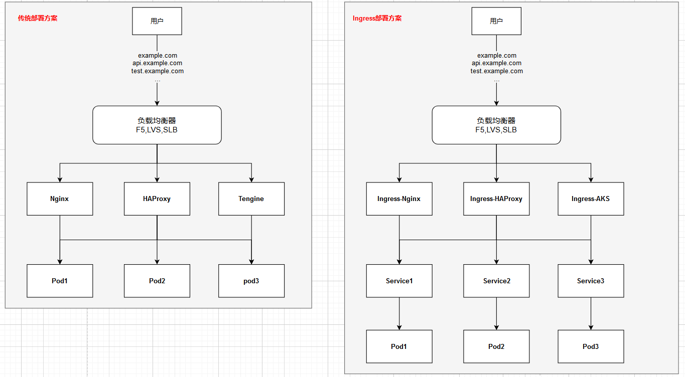

**相比于传统部署方案,使用ingress的访问流程如下:**

1. 用户发起请求（如examle.com,api.example.com等等）,进入负载均衡器中（**可以是k8s外部的也可以是基于第三方云的**）。
2. 负载均衡器根据规则，将服务转发到Ingress控制器（如ingress-nginx,ingress-haproxy等等）
3. 配置自己创建的`Ingress`资源（yaml配置文件），进行对应规则匹配，转发到对应的service上
4. 下面就走service的具体配置。
   + 如走外部服务ExternalName
   + 如走内部ClusterIP
   + 如走内部NodePort
   + 如走Headless Service
   + 等等

> + 可以将**Ingress控制器理解为一个nginx服务器**，同样需要占用（监听）端口。
> + **在k8s中Ingress控制器具体以什么样资源（Deployment，DaemonSet）运行，还是以什么方式公开（ClusterIP，NodePort）取决于你创建Ingress控制器时的配置文件**（如ingress-nginx就是以DaemonSet，ClusterIP方式公开）
> + Ingress控制器实际底层就是一个Pod搭配service，**所以我们想访问ingress控制器只需要看其yaml配置文件占用什么端口，是否占用主机端口（依赖service公开方式）**

## 18.3 简单使用ingress

> 前提：必须先安装ingress-nginx否则使用直接创建ingress资源是无效的

### 18.3.1 安装Ingress控制器

以Ingress-nginx为例，具体安装步骤见[18.1 环境准备（安装ingress-nginx）](#18.1 环境准备（安装ingress-nginx）)

### 18.3.2 创建deploy，并打上标签

```bash
$ kubectl get pod --show-labels
NAME                            READY   STATUS    RESTARTS      AGE     LABELS
centos                          1/1     Running   2 (13h ago)   38h     run=centos
nginx-deploy-8655f46645-gvzqz   1/1     Running   1 (13h ago)   17h     app=nginx,pod-template-hash=8655f46645,target=ingress-1
nginx-deploy-8655f46645-j5s64   1/1     Running   3 (13h ago)   2d20h   app=nginx,pod-template-hash=8655f46645,target=ingress-2
nginx-deploy-8655f46645-thczz   1/1     Running   3 (13h ago)   2d19h   app=nginx,pod-template-hash=8655f46645,target=ingress-2
```

### 18.3.3 创建Ingress资源

+ 编写ingress配置文件`nginx-ingress.yaml`

  ```yaml
  # 用于创建ingress资源（前提k8s集群中已经存在ingress控制器）
  # https://kubernetes.io/docs/concepts/services-networking/ingress/
  apiVersion: networking.k8s.io/v1
  kind: Ingress # 定义Ingress资源
  metadata:
    name: nginx-ingress # 该ingress资源名字
    namespace: default
    # https://kubernetes.github.io/ingress-nginx/examples/rewrite/
    annotations:
      #开启路径重写，和nginx完全一样 (支持/$1写法)
      # / 表示 将匹配的路径如：/api/(.*) 改写 /
      nginx.ingress.kubernetes.io/rewrite-target: /
      # 表示路径匹配是否开启正则匹配
      nginx.ingress.kubernetes.io/use-regex: "false" # 必须加引号
      # 标识Ingress控制器为nginx(ingress-nginx) 必须写
      # kubernetes.io/ingress.class: "nginx"
  spec:
    ingressClassName: "nginx" # 指明ingress使用的控制器为ingress-nginx（和kubernetes.io/ingress.class: "nginx"效果完全一样）
    defaultBackend: # 没有匹配规则时的默认service(有rules时请求的域名必须在host中才行,如果是zoo.com就不会走defaultbackend,而是404)
      service:
        name: nginx-ingress-svc-externalname #重定向到该service
        port:
          number: 80 # service端口
    rules:
    - host: foo.com # 必须是域名，且不可以使用端口（默认是80和443），模拟生产服务地址,客户端通过改Hosts进行访问(可以把他当成baidu.com)
      http:
        paths:
        - path: /api/(.*) # 匹配的路径
          pathType: Prefix # 前缀匹配，还有Exact精确匹配、ImplementationSpecific使用IngressClass匹配
          backend: # 映射到service
            service: # 对应的service配置信息
              name: nginx-ingress-svc-clusterip
              port:
                number: 80 # service端口
        - path: /doc/(.*) # 匹配的路径
          pathType: Prefix # 前缀匹配，还有Exact精确匹配、ImplementationSpecific使用IngressClass匹配
          backend: # 映射到service
            service: # 对应的service配置信息
              name: nginx-ingress-svc-clusterip
              port:
                number: 80 # service端口
    - host: '*.bar.com' # 必须是域名，且不可以使用端口（默认是80和443），模拟生产服务地址,客户端通过改Hosts进行访问(可以把他当成baidu.com)
      http:
        paths:
        - path: /api/(.*) # 匹配的路径
          pathType: Prefix # 前缀匹配，还有Exact精确匹配、ImplementationSpecific使用IngressClass匹配
          backend: # 映射到service
            service: # 对应的service配置信息
              name: nginx-ingress-svc-nodeport
              port:
                name: ngx-nodeport-80 # service端口名字(不能超过16字符)。和port二选一即可
  ---
  ```

  > 注意`ingressClassName: "nginx"`或`kubernetes.io/ingress.class: "nginx"`必须写一个，用于指定使用什么ingress控制器，否则不生效。

+ 创建ingress资源

  ```bash
  $ kuebctl apply -f nginx-ingress.yaml
  ```

  遇到的问题：

  1. **yaml配置文件中布尔值true或false必须加引号**，如`nginx.ingress.kubernetes.io/use-regex: "false"`

  2. **yaml配置文件中特殊符合必须加引号**，如`host: '*.bar.com'`

  3. **注意Backend或DefaultBackend中结构**，如`service.port:80`是错的，因为port下面还是属性`service.port.number:80`

  4. **写明使用的ingress控制器类型**，如`ingressClassName: "nginx"`。

     ```bash
     # 如果不指明ingress控制器类型，其Pod日志会提示“配置文件不生效，因为没有指明IngressClass”
     kubectl logs -f ingress-nginx-controller-n662s -n ingress-nginx # 查看Pod日志
     ```

+ 测试规则

  如果时集群外机器，可以修改hosts文件，模拟官网服务（**一定要把代理关掉，或者代理中排除一些规则，改完hosts文件记得清除浏览器缓存**），如下：

  ```bash
  # Copyright (c) 1993-2009 Microsoft Corp.
  #
  # This is a sample HOSTS file used by Microsoft TCP/IP for Windows.
  192.168.136.153 zoo.com
  192.168.136.153 foo.com
  192.168.136.153 bar.com
  192.168.136.153 api.bar.com
  192.168.136.153 test.bar.com
  ```

  + 测试`https//zoo.com`，ingress配置文件中**rules.host没有这个域名**，返回404
  + 测试`http://foo.com`，ingress配置文件中**rules.host有这个域名，但是没有这个规则，走defaultbackend中nginx-ingress-svc-externalname服务**，返回http://httpbin.io的首页
  + 测试`http://foo.com/api`，ingress配置文件中**rules.host有这个域名，但是没有这个规则，走defaultbackend中nginx-ingress-svc-externalname服务**，返回http://httpbin.io/api内容
  + 测试`http://foo.com/api/[xxx]`，`[xx]`表示可选，ingress配置文件中**rules.host有这个域名，有这个规则，走nginx-ingress-svc-clusterip服务**，请求路径统一改写为`/`,即请求变为`http://nginx-ingress-svc-clusterip/`，返回Pod容器内容（多Pod轮询）。
  + 测试`http://bar.com`，ingress配置文件中**rules.host没有这个域名**，返回404
  + 测试`http://api.bar.com`，ingress配置文件中**rules.host有这个域名，但是没有这个规则，走defaultbackend中nginx-ingress-svc-externalname服务**，返回http://httpbin.io的首页
  + 测试`http://api.bar.com/api`，ingress配置文件中**rules.host有这个域名，但是没有这个规则，走defaultbackend中nginx-ingress-svc-externalname服务**，返回http://httpbin.io/api内容
  + 测试`http://api.bar.com/api/[xxx]`，`[xx]`表示可选，ingress配置文件中**rules.host有这个域名，有这个规则，走nginx-ingress-svc-nodeport服务**，请求路径统一改写为`/`,即请求变为`http://nginx-ingress-svc-nodeport/`，返回Pod容器内容（多Pod轮询）。
  + ...

  

## 18.4 ingress规则

1. `spec.ingressClassName`必须配置一个，表示你使用的是什么控制器（如ingress-nginx）即`IngressClass`。当然你也可以自己创建自己的ingress控制器即`IngerssClass`

2. `sepc.defaultBackend`和`spec.rules`至少配置一个，否则都会返回404。（以ingress-nginx为例）

3. **如果请求的请求头Header中Host（如bar.com）不在spec.rules.host[*]中也会返回404** （以ingress-nginx为例）

4. **如果请求的请求头Header中Host（如bar.com）在spec.rules.host[*]中，但是请求路径与spec.rules.host.path没有匹配的，才会走defaultBackend中配置的服务** 

5. **如果请求的请求头Header中Host（如bar.com）在spec.rules.host[*]中，且请求路径与spec.rules.host.path匹配，才会走该规则对应的服务** 

6. 路径匹配有三种`Exact`,`Prefix`,`ImplementationSpecific`

   + `Exact`要求path路径完全匹配
   + `Prefix`要求path路径前缀匹配，以`/`作为分割。（例如 `/foo/bar` 匹配 `/foo/bar/baz`，但不匹配 `/foo/barbaz`）
   + `ImplementationSpecific`路径匹配的解释权取决于`IngressClass`，即当前的Ingress控制器

7. 以ingress-nginx控制器来说，path路径匹配和nginx完全一样

   示例： https://kubernetes.io/zh-cn/docs/concepts/services-networking/ingress/#%E7%A4%BA%E4%BE%8B

   + **路径path精度越高，越优先匹配**（如`/aa/bb`优先匹配`/aa/bb`而不是`/`）
   + **混合类型的（Prefix和Exact同时使用），Exact优先级高**

8. `spec.rules.host`必须是**域名**，且**支持通配符**，但是配置文件中必须使用引号包括起来。

   如`*.bar.com` 匹配`api.test.com`，匹配`test.bar.com`但是**不匹配**`api.v1.bar.com`,`api.v1.test.bar.com`即一个`*`只能代替一级DNS，不能是多级。

## 18.5 ==Ingress，IngressClass，IngressController三者关系==

+ **针对整个k8s集群**来说，`Ingress`是一种规范，定义了**外部接口访问内部服务的实现**（类似于docker,containerd和CRI）
+ **对于k8s集群内部，即集群资源来说**
  + `Ingress`是一个**资源**，它定义了请求转发规则。必须搭配`IngressController`使用，但是`Ingress`不直接和`IngressController`关联，而是通过`IngressClass`进行关联。
  + `IngressClass`也是一个**资源**，它定义了`Ingress`资源应该由哪个`IngressController`来处理。它是用来区分多个`IngressController`的
+ `IngressController`是k8s集群插件，**理论上不是其内部的资源，但是它又以pod的形式运行z在集群内**，比如ingress-nginx其实就是一个nginx，以Pod形式运行在Node节点上。

### 18.5.1 Ingress资源

就是我们自己定义的yaml配置文件（**path路径转发规则**）如`nginx-ingress.yaml`，搭配ingress-nginx（ingress控制器）使用

```bash
$ get ingress -A -o wide # 以yaml格式输出就是配置文件具体内容
NAMESPACE   NAME            CLASS   HOSTS               ADDRESS          PORTS   AGE
default     nginx-ingress   nginx   foo.com,*.bar.com   10.108.180.122   80      19h
```

### 18.5.2 IngressClass资源

在使用`helm`安装`IngressController`即ingress-nginx时自动创建的

```bash
$ kubectl get ingressclasses
NAME    CONTROLLER             PARAMETERS   AGE
nginx   k8s.io/ingress-nginx   <none>       23h
```

具体配置内容：

```yaml
apiVersion: networking.k8s.io/v1
kind: IngressClass
metadata:
  annotations:
    meta.helm.sh/release-name: ingress-nginx
    meta.helm.sh/release-namespace: ingress-nginx
  creationTimestamp: "2024-10-10T07:27:02Z"
  generation: 1
  labels:
    app.kubernetes.io/component: controller
    app.kubernetes.io/instance: ingress-nginx
    app.kubernetes.io/managed-by: Helm
    app.kubernetes.io/name: ingress-nginx
    app.kubernetes.io/part-of: ingress-nginx
    app.kubernetes.io/version: 1.5.1
    helm.sh/chart: ingress-nginx-4.4.2
  name: nginx
  resourceVersion: "640535"
  uid: 7a4d9257-e6f5-4431-b862-3cf172f0739b
spec:
  controller: k8s.io/ingress-nginx
```

### 18.5.3 IngressController

ingress控制器，就是我们安装的`Ingress-nginx`，即Pod的形式运行在Node节点上：

```bash
$ kubectl get pod -n ingress-nginx -o wide
NAME                             READY   STATUS    RESTARTS      AGE   IP                NODE        NOMINATED NODE   READINESS GATES
ingress-nginx-controller-n662s   1/1     Running   1 (17h ago)   23h   192.168.136.153   k8s-node2   <none>           <none>
```

**具体以Deployment还是以DaemonSet的进行管理，以安装ingress-nginx时配置文件values.yaml中配置为准**

## 18.6 ingress处理流程

+ 客户端发送请求，必须先经过`IngressController`（如**ingress-nginx**）

  **因为Ingress控制器运行中Pod中，以service公开的，会在Node节点上监听端口如80、443。所以你访问一个域名肯定会进入固定的、已知Ingress控制器，除非入口出使用了外部负载均衡器，且集群内部有多个ingress控制器，才会无法确认ingress类型。**

  一般来说域名和ingress控制器绑定了

  > 这是为了解释疑惑集群中多个ingress控制器，谁会先拦截请求？（域名=>Node机器:port=>确定的ingress控制器，不是随机）

+ `IngressController`会先检查请求头`Host`的值，查看是否有与之匹配的`ingress`资源（如**bar.com对应nginx-ingress**）

+ 然后根据`Ingress`资源中`spec.ingressClassName`或`metadata.annotations.kubernetes.io/ingress.class`的值找到对应的`IngressController`来处理

+ 然后再根据ingress资源对应的path路径规则进行转发、拦截

**举例**

+ 根据请求`Host: bar.com`找到`nginx-ingress`（ingress名字）
+ `nginx-ingress`根据`spec.ingressClassName="nginx"`找到**名字为nginx的IngreClass资源**
+ **名字为nginx的IngreClass资源**根据`spec.controller=k8s.io/ingress-nginx`找到ingress控制器
+ `ingress-nginx`ingress控制器，根据ingress资源中path路径规则进行转发、拦截

> ingress控制器实际还是Pod+Service，不过**占用了Node主机的端口如80、443**。

# 19. configMap

ConfigMap 是一种 API 对象，用来**将非机密性的数据保存到键值对中**。使用时， [Pod](https://kubernetes.io/zh-cn/docs/concepts/workloads/pods/) 可以将其用作**环境变量、命令行参数或者存储卷中的配置文件**。

ConfigMap 将你的环境配置信息和[容器镜像](https://kubernetes.io/zh-cn/docs/reference/glossary/?all=true#term-image)解耦，便于应用配置的修改。

kubernetes中是通过将配置（键值对）信息存储在configMap中，然后在Pod中进行引用的形式实现的。

> [!Note]
>
> ConfigMap不支持加密功能，如果需要请使用`Secret`。ConfigMap不支持跨命名空间访问，所以如果需要只能新建cm资源。configMap中保存数据推荐不大于1Mib，超过最好用挂载卷。

## 19.0 api文档

+ configMap 介绍文档：https://kubernetes.io/zh-cn/docs/concepts/configuration/configmap/
+ configMap api文档：https://kubernetes.io/zh-cn/docs/reference/kubernetes-api/config-and-storage-resources/config-map-v1/
+ Pod api文档：https://kubernetes.io/zh-cn/docs/reference/kubernetes-api/workload-resources/pod-v1/#%E7%8E%AF%E5%A2%83%E5%8F%98%E9%87%8F

## 19.1 创建configMap资源

> [!Attention]
>
> 简单来说，configmap不解析文件内键值对，**直接将文件名当作键，文件内容当作值存入configmap**。有一个特殊，`--from-env-file`可以将文件内容解析成键值对（基于等式`=`），而不是将文件内容全部当为值，文件名当为键。

+ 通过yaml配置文件创建

  1. 定义配置文件 `test-configmap.yaml`

     ```yaml
     # https://kubernetes.io/docs/concepts/configuration/configmap/
     kind: ConfigMap
     apiVersion: v1
     metadata:
       name: test-configmap-1 # 当前configmap的名字
       namespace: default # cm所在的命名空间
       labels: # 用于筛选此cm
         app: test-configmap 
     binaryData: # 用于存放二进制数据base64 （1.键不能和data中键重复 2.k8s版本大于1.10）
       hello: aGVsbG8K # 简单理解右边只能是base64加密后的数据
     data: # 存放明文数据
       target: test
       jvm: '-Xmax512m -Xmin128m'
     
     immutable: false # 默认为nil，表示可以修改cm中数据；如果为true表示不可以更改
     ```

  2. 创建并查看

     ```bash
     $ kubectl get cm test-configmap-1 --show-labels
     NAME               DATA   AGE   LABELS
     test-configmap-1   3      36s   app=test-configmap
     # 查看二进制数据（base64加密后的）
     $ kubectl get configmap test-configmap-1 -o jsonpath='{.binaryData}' # 直接-o yaml也可以
     {"hello":"aGVsbG8K","kubernetes":"a3ViZXJuZXRlcwo="}
     ```

     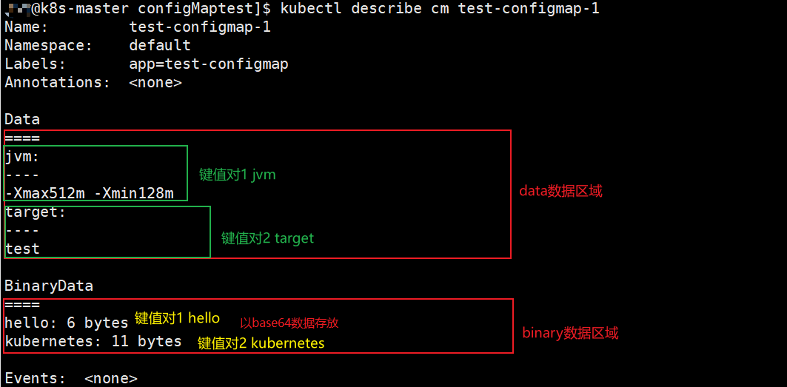

+ 通过命令创建

  1. `$ kubectl create configmap --help`查看命令行帮助

  2. **通过目录创建，即将该目录下所有文件加入configmap**

     ```bash
     # 1.创建
     $ kubectl create configmap test-configmap-dir --from-file=db/
     # 2.以yaml格式查看配置文件
     $ kubectl get test-configmap-dir -o yaml
     # 3.描述
     $kubectl describe cm test-configmap-dir
     ```

     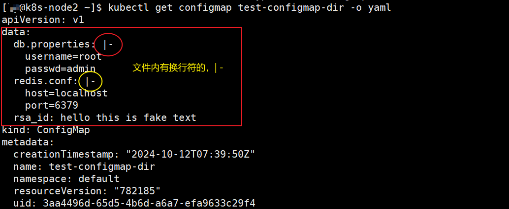

     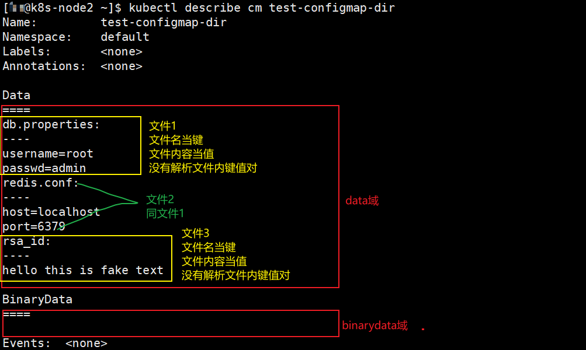

  3. **通过单文件创建（键可以起别名）**

     ```bash
     # 1.创建cm配置，指定文件config/my.conf 并用文件名当作键名；指定文件config/application.yaml并重命名键名为microservice
     $ kubectl create configmap test-config-2 --from-file=config/my.conf --from-file=microservice=config/application.yaml
     # 2. 以yaml格式查看配置文件
     $ kubectl get cm test-configmap-2 -o yaml
     # 3.描述
     $ kubectl describe cm test-configmap-2
     ```

     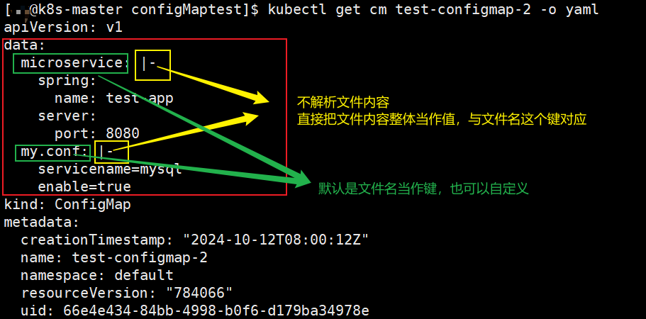

     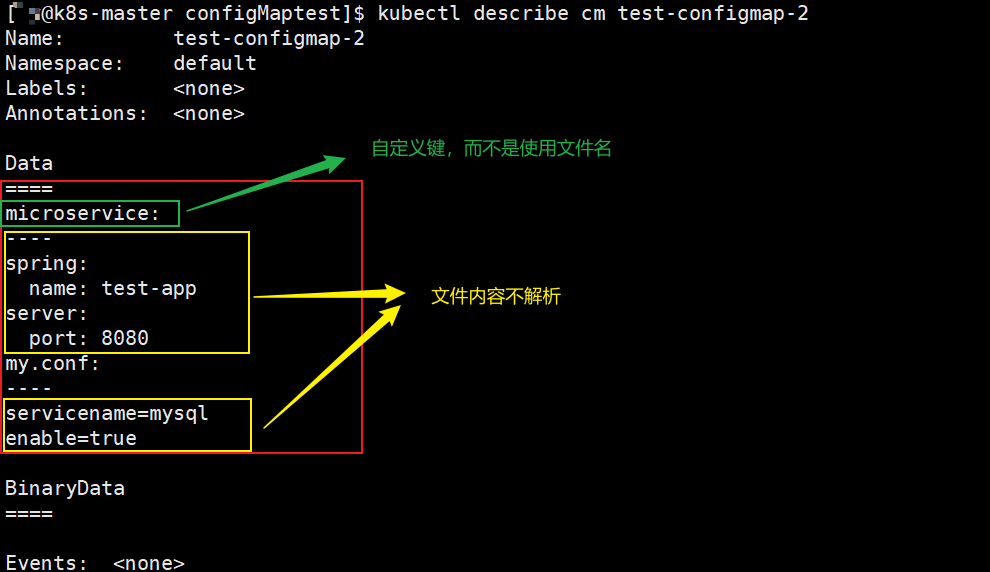

  4. **通过命令行，直接指明键值对（代替文件）**

     ```bash
     # 键代替文件名，值代替文件内容
     $kubectl create configmap test-configmap-3 --from-literal=k1=v1 --from-literal=app=mysql
     ```

     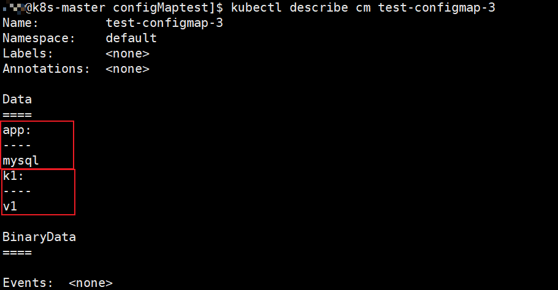

     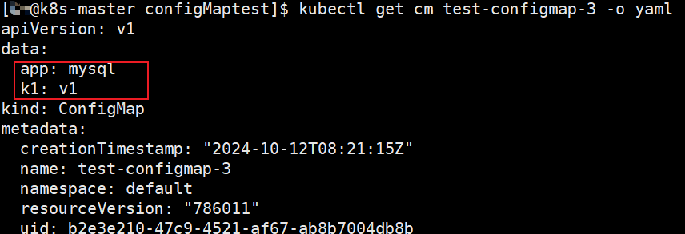

  5. 唯一一个参数，`--from-env-file`可以将**文件内容解析成键值对（基于等式`=`），而不是将文件内容全部当为值，文件名当为键**。

     ```bash
     # 里面是基于等式=的键值对，文件名随意
     kubectl create configmap test-configmap-4 --from-env-file=db/db.txt
     ```

     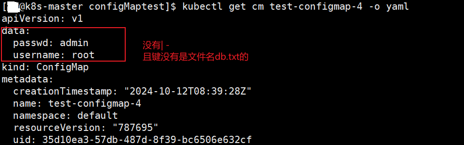

     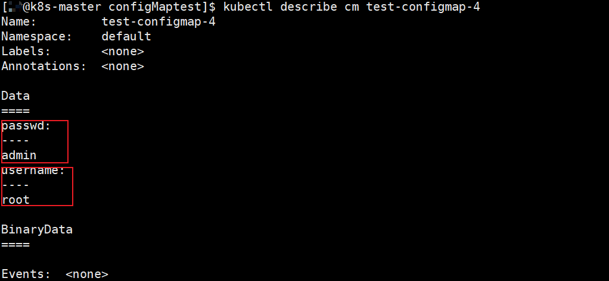

## 19.2 Pod使用configMap资源

configMap实际使用是在Pod中，当然在Deployment，DaemonSet，StatefulSet等的template中都是可以使用的。

### 19.2.1 将configMap当作环境变量使用

将**configmap映射为容器环境变量**

> [!Warning]
>
> **二进制数据binaryData通过环境变量映射会丢失**

1. 定义一个Pod（最简单）`cm-env-pod.yaml`，并创建

   ```yaml
   # https://kubernetes.io/docs/concepts/workloads/pods/
   apiVersion: v1
   kind: Pod
   metadata:
     name: "cm-env-pod"
     namespace: default
     labels:
       app: "cm-pod"
   spec:
     restartPolicy: Never
     containers:
     - name: alpine
       image: 192.168.31.79:5000/alpine:latest
       command: ["sh", "-c", "env;sleep 3600"] # 输出容器环境变量，查看是否有我们加上的
       env: # 自动容器的环境变量(重复键以env为准)
       - name: myservice # 容器中环境变量的键(自定义的,可以不和key一样)
         valueFrom:
           configMapKeyRef:
             name: test-configmap-2 # configmap的名字（直接加载文件的）
             key: microservice # 指定cm（test-configmap-2）数据中的key键
             optional: true # 创建Pod前该cm资源必须存在，且存在键microservice
       - name: mysql # 容器中环境变量的键(自定义的,可以不和key一样)
         valueFrom:
           configMapKeyRef:
             name: test-configmap-2 # configmap的名字（直接加载文件的）
             key: 'my.conf' # 指定cm（test-configmap-1）数据中的key键
             optional: false # 创建Pod前该cm资源可以不存在
   
       envFrom: # 指定内容环境变量的来源(重复键以env为准)
       -  configMapRef: # 将指定configMap中数据，加载Pod容器中的环境变量(全部)
           name: test-configmap-1 # configmap的名字（有二进制数据的）
           optional: true # 创建Pod前该cm资源必须存在,已经被定义
   ```

2. 查看Pod容器输出
   ```bash
   $ [ly@k8s-master configMaptest]$ kubectl logs pod cm-env-pod
   Error from server (NotFound): pods "pod" not found
   [ly@k8s-master configMaptest]$ kubectl logs cm-env-pod
   jvm=-Xmax512m -Xmin128m
   target=test
   mysql=servicename=mysql
   enable=true
   myservice=spring:
     name: test-app
   server:
     port: 8080
   ...
   ```

3. 与configMap中数据对比

   **经验证，除了binaryData丢失，其余data数据都存在，成功映射**

   + configmap`test-configmap-1`中数据 

     ```yaml
     apiVersion: v1
     binaryData:
       hello: aGVsbG8K
       kubernetes: a3ViZXJuZXRlcwo=
     data:
       jvm: -Xmax512m -Xmin128m
       target: test
      kind: ConfigMap
      ...
     ```

   + configmap`test-configmap-2`中数据 
     ```yaml
     apiVersion: v1
     data:
       microservice: |-
         spring:
       	  name: test-app
         server:
     	  port: 8080
       my.conf: |-
         servicename=mysql
         enable=true
     kind: ConfigMap
     ...
     ```

> [!Note]
>
> 通过映射到容器环境变量方式使用，**不会自动更新环境变量，除非Pod重启（被删了重建）**

### 19.2.2 将config当作文件使用

搭配挂载卷使用，将**configmap映射为容器中文件**

> [!Note]
>
> 是把configmap中的**键值对**映射到容器中的文件，其中**文件名为键，文件内容为值**。容器中目录不存在会自动创建。

1. 定义一个Pod（最简单）`cm-file-pod.yaml`，并创建

   ```yaml
   # k8s默认挂载是以目录的形式,导致该目录下其余文件被删掉
   # https://kubernetes.io/docs/concepts/workloads/pods/
   apiVersion: v1
   kind: Pod
   metadata:
     name: "cm-file-pod"
     namespace: default
     labels:
       app: "cm-pod"
   spec:
     containers:
     - name: alpine
       image: 192.168.31.79:5000/alpine:latest
       command: ["sh", "-c", "sleep 3600"]
       volumeMounts: # 定义容器挂载卷信息
       - name: cm-volume-1 # 使用挂在卷 cm-volume-1
         mountPath: /etc/myconfig/cm-volume-1 # 将挂载卷 cm-volume-1映射到容器指定目录
   	# 注意同一容器挂载多个volume，mountPath必须唯一
       - name: cm-volume-2 # 使用挂在卷 cm-volume-2
         mountPath: /etc/myconfig/cm-volume-2 # 将挂载卷 cm-volume-2映射到容器指定目录
   
     volumes: # 定义挂载卷(后面讲)
       - name: cm-volume-1 # 挂载卷1 的名字
         configMap: # 挂载卷1 的类型为configmap
           name: test-configmap-1 # configmap的名字为 test-configmap-1
           optional: false # 挂载卷前可以不存在该cm
           defaultMode: 0644 # 默认文件挂载权限644
           # items: 不指定映射cm数据到容器中文件信息，默认映射cm的全部数据(包括binaryData,数据键key为文件名，数据值value为文件名)
   
       - name: cm-volume-2 # 挂载卷2 的名字
         configMap: # 挂载卷2 的类型为configmap
           name: test-configmap-2 # configmap的名字为 test-configmap-2
           optional: true # 挂载卷前必须存在该cm
           defaultMode: 0644 # 默认文件挂载权限644
           items: # 将指定cm中指定键值对映射到容器的文件信息(数据键key为文件名，数据值value为文件名)
           - key: my.conf # cm中数据键key
             path: config/mysql.conf # cm中数据键key my.conf映射到容器中的路径文件名（相对路径，不允许有.）
             mode: 0644
     restartPolicy: Never
   
   ```

2. 进入容器中，查看文件内容并验证

   ```bash
   $ kubectl exec -it cm-file-pod -c alpine --sh
   	\# tree /etc/myconfig/
       /etc/myconfig/ # 自动创建不存在的目录
       ├── cm-volume-1
       │   ├── hello -> ..data/hello # 是个链接文件（文件），里面base64加密数据被解密了，变为原文即hello
       │   ├── jvm -> ..data/jvm
       │   ├── kubernetes -> ..data/kubernetes  # 是个链接文件（文件），里面base64加密数据被解密了，变为原文即kubernetes
       │   └── target -> ..data/target
       └── cm-volume-2
           └── config -> ..data/config # 是个链接文件（是目录，有点特殊），里面有mysql.conf 即/etc/myconfig/cm-volume-2/config/mysql.conf
   ```

3. 与configMap中数据对比

   **经验证，binaryData，data数据都存在，成功映射**

   + configmap`test-configmap-1`中数据 

     ```yaml
     apiVersion: v1
     binaryData:
       hello: aGVsbG8K
       kubernetes: a3ViZXJuZXRlcwo=
     data:
       jvm: -Xmax512m -Xmin128m
       target: test
      kind: ConfigMap
      ...
     ```

   + configmap`test-configmap-2`中数据 

     ```yaml
     apiVersion: v1
     data:
       microservice: |-
         spring:
       	  name: test-app
         server:
     	  port: 8080
       my.conf: |-
         servicename=mysql
         enable=true
     kind: ConfigMap
     ...
     ```

> [!Warning]
>
> 1. 数据加入configMap中注意特殊格式**布尔值必须加引号（enable="true"）**，否则映射到容器文件会丢失
> 2. 映射数据不指定`spec.volumes.configMap.items`，那么会将config中所有数据映射到容器目录下（键-->文件名，值-->文件内容），**包括binaryData和data中数据**

## 19.3 subPath单文件（configMap映射文件）

> [!Note]
>
> 将configMap通过volume映射为文件，默认情况是**使用挂载的目录，覆盖容器中源目录**，这样或导致**源目录文件部分丢失**。为了解决这一问题，就需要使用`sepc.containers.volumeMounts.subPath`

1. 定义配置文件`cm-nginx-subpath-pod.yaml`
   ```yaml
   # subPath单文件覆盖
   # https://kubernetes.io/docs/concepts/workloads/pods/
   apiVersion: v1
   kind: Pod
   metadata:
     name: "cm-nginx-subpath-pod"
     namespace: default
     labels:
       app: "cm-nginx"
   spec:
     containers:
     - name: nginx
       image: 192.168.31.79:5000/nginx:latest
       resources:
         limits:
           cpu: 100m
           memory: 100Mi
   
       volumeMounts:
       - name: subpath-nginx-conf
         # 有 subpath 时，该值实际映射为 文件
         # 无 subpath 时，该值实际映射为 目录
         mountPath: /etc/nginx/nginx.conf  #映射为文件
         
         # 必须与下面volumes中的items中的某一path完全一致
         subPath: nginx.conf  # 表示引用
   
     volumes:
       - name: subpath-nginx-conf # 定义volume卷名字
         configMap: # 使用config挂载
           name: test-cm-nginx # 引用的configMap的名字,确保和Pod在同一命名空间
           items:
           - key: nginx.conf # cm中一个数据键key
             path: nginx.conf # 映射到容器中的文件名
     restartPolicy: Never
   
   ```

2. `kubectl apply -f cm-nginx-subpath-pod.yaml`创建pod

3. 进入容器中查看配置文件内容是否和configMap中完全一致

   ```bash
   # 1.获取容器中文件内容
   $ kubectl exec -it cm-nginx-subpath-pod -c nginx -- sh -c "cat /etc/nginx/nginx.conf"
   # 2.获取configmap中数据，并进行比对
   $ kuebctl get cm subpath-nginx-conf -o yaml
   ```

4. 经验证和配置文件中完全一致

## 19.4 configMap热更新机制

configMap映射热更新即**更新configMap中数据，容器中引用（环境变量，文件）是否自动同步**

### 19.4.1 以环境变量形式映射到容器

更新configMap中数据，**容器内环境变量不会更新，除非Pod被删除重启。**

### 19.4.2 以文件形式映射到容器

1. **默认方式，configMap借助volume以目录全覆盖**

   更新configMap中数据，***容器内文件（目录覆盖的）会自动更新。更新周期是：更新时间+缓存时间***

2. **subPath方式，configMap借助volume以文件覆盖**

   更新configMap中数据，***容器内文件（单文件覆盖的）不会自动更新。***

## 19.5 设置configMap不可修改

设置configMap中数据创建后不可再修改，**注意：设置后不可恢复。只能删掉重新创建**

```yaml
# https://kubernetes.io/docs/concepts/configuration/configmap/
kind: ConfigMap
apiVersion: v1
metadata:
  name: test-configmap-1 
  namespace: default 
binaryData: 
  hello: aGVsbG8K 
  ...
data: 
  target: test
  ...

immutable: true # 设置为true，则该cm资源不可再修改（除了删除重建）
```

> 创建configMap资源时添加的

## 19.6 解决subPath单文件映射覆盖不可热更新问题

有时我们既需要subPath覆盖单文件，有时又需要让其能够自动更新。下面是几种解决方法：（**思路都是借助文件软连接**）

1. 在initContainer即初始化容器中，进行操作（**用不用subPath均可**）

   具体思路就是：

   1. 让初始化容器和服务容器镜像完全一样（如nginx）。
   2. 然后将空目录卷`emptyDir`挂载到初始化容器中`/tmp/nginx/`，将初始化容器中配置目录`/etc/nginx`全部拷贝到`/tmp/nginx/`中。
   3. 删除初始化目录中单文件如`nginx.conf`（为了后面建立软连接），等待初始化节点结束（初始化容器正确退出，完全销毁）。
   4. 将空目录卷`emptyDir`挂载到服务容器中`/app/nginx/`，将confiMap数据挂载到`/etc/nginx`（目录全覆盖）
   5. 在服务容器`command`中，将服务容器`/app/nginx/`下文件全部拷贝到`/etc/nginx`下即可

   ```yaml
   # Pod中使用
   apiVersion: v1
   kind: Pod
   metadata:
     name: initc-nginx-pod
   spec:
     initContainers:
     - name: init-nginx-config
       image: 192.168.31.79:5000/nginx:latest
       # 配置文件全部拷贝到临时目录下
       command: ['sh', '-c', ' cp -r /etc/nginx/* /tmp/nginx/ && rm -rf /tmp/nginx/nginx.conf && echo 111 > /tmp/nginx/demo && sleep 3']  # 将nginx配置文件复制到临时挂在卷（睡眠几秒保证完成）
       volumeMounts:
       - name: tmp-dir
         mountPath: /tmp/nginx/  # 挂载 ConfigMap 到临时路径
   
     containers:
     - name: nginx
       image: 192.168.31.79:5000/nginx:latest
       # 将configmap中映射文件创建软连接到/etc/nginx/nginx.conf
       command: ['sh', '-c', ' sleep 60 && ln -s /app/nginx/nginx.conf /etc/nginx/ && nginx -g "daemon off;"']
       resources:
         limits:
           cpu: 100m
           memory: 100Mi
       volumeMounts:
       - name: nginx-config-volume
         mountPath: /app/nginx/nginx.conf # subPath映射的是文件，而不是目录
         # 必须与下面volumes中的items中的某一path完全一致
         subPath: nginx.conf  # 表示引用
       - name: tmp-dir
         mountPath: /etc/nginx/  # 挂载初始化容器拷贝过来的临时目录
   
     volumes:
     - name: nginx-config-volume
       configMap:
         name: test-cm-nginx # 使用的configMap
         items:
           - key: nginx.conf # cm中一个数据键key
             path: nginx.conf # 映射到容器中的文件名
   
     - name: tmp-dir
       emptyDir: {} # 挂载一个空目录用于存储临时文件
   
   ```

2. 全在服务容器`command`中处理 （**用不用subPath均可**）

   具体思路同步：

   1. 将configMap中数据，以单文件或目录的方式映射到容器临时目录`/app/nginx/`
   2. 容器`command`中删除原来的配置文件`/etc/nginx.conf`
   3. 给临时文件`/app/nginx/nginx.conf`创建软连接到`/etc/nginx.conf`（已存在的文件不允许创建软连接）即可

   ```yaml
   # 单文件覆盖,不加subPath报错
   # https://kubernetes.io/docs/concepts/workloads/pods/
   apiVersion: v1
   kind: Pod
   metadata:
     name: "cm-nginx-linkfile-pod"
     namespace: default
     labels:
       app: "cm-nginx"
   spec:
     containers:
     - name: nginx
       image: 192.168.31.79:5000/nginx:latest
       # 注意挂载的文件  (1删源，2链接新，3启动)
       command: ["sh","-c"," rm -rf /etc/nginx/nginx.conf && ln -s /app/nginx/nginx.conf /etc/nginx/nginx.conf && sleep 3 && nginx -g 'daemon off;'"]
       resources:
         limits:
           cpu: 100m
           memory: 100Mi
   
       volumeMounts:
       - name: f-nginx-conf
         mountPath: /app/nginx/ # 挂载卷到临时目录下（不是/etc/nginx）
   
     volumes:
       - name: f-nginx-conf
         configMap:
           name: test-cm-nginx # 引用的configMap的名字,确保和Pod在同一命名空间
           items:
           - key: nginx.conf # cm中一个数据键key
             path: nginx.conf # 映射到容器中的文件名
     restartPolicy: Never
   
   ```

3. 使用`postStart`钩子函数（不推荐，不能保证总是在`command`前执行）

   具体思路方法2

# 20. secret

Secret 是一种包含少量敏感信息例如密码、令牌或密钥的对象。 这样的信息可能会被放在 [Pod](https://kubernetes.io/zh-cn/docs/concepts/workloads/pods/) 规约中或者镜像中。 使用 Secret 意味着你不需要在应用程序代码中包含机密数据。

由于创建 Secret 可以独立于使用它们的 Pod， 因此在创建、查看和编辑 Pod 的工作流程中暴露 Secret（及其数据）的风险较小。 Kubernetes 和在集群中运行的应用程序也可以对 Secret 采取额外的预防措施， 例如避免将敏感数据写入非易失性存储。

你可以将 Secret 用于以下场景：

- [设置容器的环境变量](https://kubernetes.io/zh-cn/docs/tasks/inject-data-application/distribute-credentials-secure/#define-container-environment-variables-using-secret-data)。
- [向 Pod 提供 SSH 密钥或密码等凭据](https://kubernetes.io/zh-cn/docs/tasks/inject-data-application/distribute-credentials-secure/#provide-prod-test-creds)。
- [允许 kubelet 从私有镜像仓库中拉取镜像](https://kubernetes.io/zh-cn/docs/tasks/configure-pod-container/pull-image-private-registry/)。

> 数据都是base64编码加密

## 20.1 api文档

+ secret介绍文档：https://kubernetes.io/zh-cn/docs/concepts/configuration/secret/#working-with-secrets
+ secret api文档：https://kubernetes.io/zh-cn/docs/reference/kubernetes-api/config-and-storage-resources/secret-v1/

## 20.2 创建secret资源

 使用方法和configMap大致相同

+ 命令行创建

  1. `kubectl create secret tls` 创建tls证书类型的secret资源,用于开启https访问

     + 可以用在`ingress`中开启https访问
     + 可以以文件的方式映射到Pod容器中,给服务容器使用

  2. `kubectl create secret generic` 创建普通的secret配置
      和configMap完全一样,就是将数据用base64编码,显得更安全点.

  3. `kubectl create docker-registry` 创建镜像仓库验证的secret资源,用于授权拉取镜像

     创建指向私有仓库的账户信息，在拉取镜像时使用。

  ```bash
  # 完整命令
  $ kubectl create secret tls NAME --cert=path/to/cert/file --key=path/to/key/file [--dry-run=server|client|none]
  $ kubectl create secret generic NAME [--type=string] [--from-file=[key=]source] [--from-literal=key1=value1] [--dry-run=server|client|none] [options]
  $ kubectl create secret docker-registry NAME --docker-username=user --docker-password=password --docker-email=email [--docker-server=string] [--from-file=[key=]source] [--dry-run=server|client|none] [options]
  ```

+ 直接使用yaml配置文件创建

  配置文件当然可以创建所有形式的secret，通过在`type`中指定secret类型。支持类型如下

  | 内置类型                              | 用法                                          |
  | ------------------------------------- | --------------------------------------------- |
  | `Opaque`                              | 用户定义的任意数据（默认类型）                |
  | `kubernetes.io/service-account-token` | 服务账号令牌（依赖于k8s中serviceaccount资源） |
  | `kubernetes.io/dockercfg`             | `~/.dockercfg` 文件的序列化形式               |
  | `kubernetes.io/dockerconfigjson`      | `~/.docker/config.json` 文件的序列化形式      |
  | `kubernetes.io/basic-auth`            | 用于基本身份认证的凭据                        |
  | `kubernetes.io/ssh-auth`              | 用于 SSH 身份认证的凭据                       |
  | `kubernetes.io/tls`                   | 用于 TLS 客户端或者服务器端的数据             |
  | `bootstrap.kubernetes.io/token`       | 启动引导令牌数据                              |

  **举例**

  ```yaml
  apiVersion: v1
  kind: Secret
  metadata:
    name: secret-sa-sample
    annotations:
      kubernetes.io/service-account.name: "sa-name" # serviceaccount 资源
  type: kubernetes.io/service-account-token # secret类型
  data:
    extra: YmFyCg==
  ```

## 20.3 使用secret

### 20.3.1 ingress使用tsl类型的secret

1. 创建本地证书用于模拟

   创建的域名证书必须要包含要测试的域名（如zoo.com），否则k8s会检查common name或SNA与域名不匹配**就不会使用自己的证书**

   ```bash
   # 1.生成私钥 (一定要加上域名) 文件名要是域名
   $ openssl genrsa -out zoo.com.key 2048
   # 2.生成 CSR 使用自定义配置文件  (一定要加上域名)
   $ openssl req -new -key zoo.com.key -out zoo.com.csr
   	----- # 交互输入
       Country Name (2 letter code) [XX]:us 
       State or Province Name (full name) []:zoo
       Locality Name (eg, city) [Default City]:zoo
       Organization Name (eg, company) [Default Company Ltd]:zoo
       Organizational Unit Name (eg, section) []:zoo
       Common Name (eg, your name or your server\'s hostname) []:zoo.com #common name必须要包含要测试的域名 zoo.com
       Email Address []:zoo@com
   
       Please enter the following 'extra' attributes
       to be sent with your certificate request
       A challenge password []:
       An optional company name []:zoo
   
   # 3.(一定要加上域名)
   $ openssl x509 -req -days 365 -in zoo.com.csr -signkey zoo.com.key -out zoo.com.crt
   ```

2. 创建secret tls类型资源

   ```bash
   $ kubectl create secret tls test-secret-tls --cert=zoo.com.crt --key=zoo.com.key
   ```

   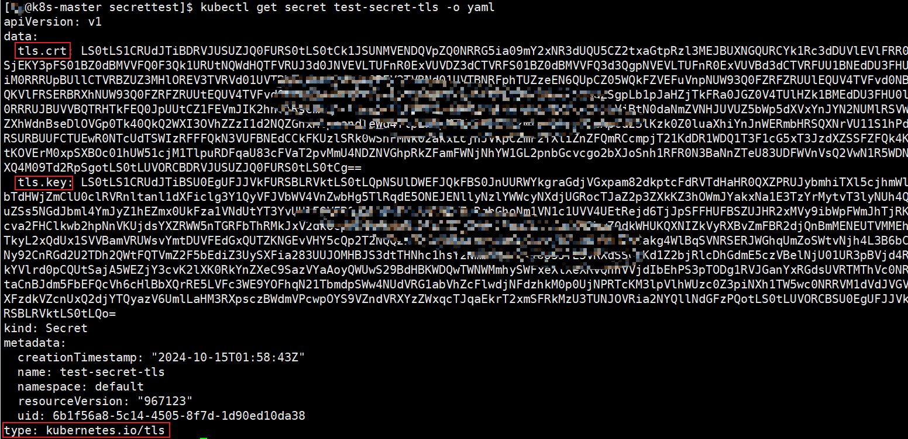

3. 创建ingress资源,使用改tls

   ```yaml
   apiVersion: networking.k8s.io/v1
   kind: Ingress
   metadata:
     annotations:
       nginx.ingress.kubernetes.io/rewrite-target: /
       nginx.ingress.kubernetes.io/use-regex: "false"
     name: nginx-ingress-secret
     namespace: default
   spec:
     defaultBackend:
       service:
         name: nginx-ingress-svc-externalname
         port:
           number: 80
     ingressClassName: nginx
     rules:
     - host: zoo.com
       http:
         paths:
         - backend:
             service:
               name: nginx-ingress-svc-clusterip
               port:
                 number: 80
           path: /secret/
           pathType: Prefix
     tls: # 使用tls
     - hosts:
       - zoo.com
       secretName: test-secret-tls # 和hosts同级别 （有-代表数组成员，没有-就不是为同级别的）
   ```

4. 发送https://192.168.136.153/secret/ssss请求

   > [!Attention]
   >
   > 使用postman等接口工具，不要使用chrome扩展。由于浏览器安全设置，无法修改https的header（改了不生效）。

   

5. 查看pod`ingress-nginx`的日志

   ```bash
   $ kubectl logs -f ingress-nginx-controller-f8zvd -n ingress-nginx
   ```

   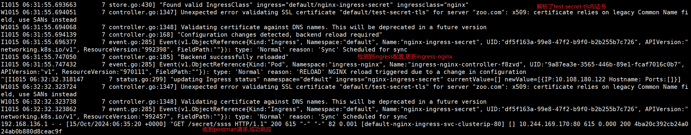

### 20.3.2 pod使用docker-registry类型的secret

> [!Note]
>
> 通过将账户密码以`docker-registry`形式保存在`secret`中，实现在Pod中拉取私有库容器时使用。
>
> **注意如果私有库是HTTP协议的，记得加入docker的不安全镜像insecure-registries中**`/etc/docker/daemon.json`

1. 创建pod配置文件，指向一个需要账号的私有库

   ```yaml
   # https://kubernetes.io/docs/concepts/workloads/pods/
   apiVersion: v1
   kind: Pod
   metadata:
     name: "nginx-secret-registry-pod"
     namespace: default
     labels:
       app: "secret-docker-registry"
   spec:
     containers:
     - name: nginx
       image: 192.168.31.79:5001/repo/nginx:latest # 私有库需要账户
     restartPolicy: Always
   ```

2. 应用pod配置文件，发现容器拉取失败

   ```bash
   $ kubectl describe pod nginx-secret-registry-pod
   ```

   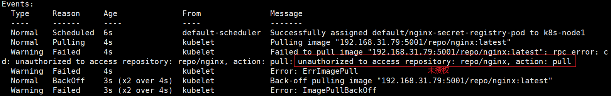

3. 创建secret资源

   ```bash
   # 1.创建验证信息
   $ kubectl create secret docker-registry harbor-repo --docker-username=root --docker-password=12345 --docker-server=192.168.31.79:5001
   # 2.查看
   $ kubectl get secret harbor-repo -o yaml 
   # 发现账户密码以base64编码存放其中
   ```

   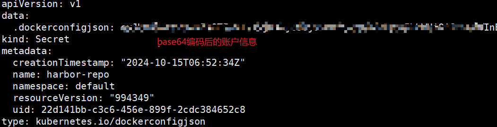

4. 更新pod配置文件，拉取镜像时指定账户信息，重新创建

   ```bash
   # https://kubernetes.io/docs/concepts/workloads/pods/
   apiVersion: v1
   kind: Pod
   metadata:
     name: "nginx-secret-registry-pod"
     namespace: default
     labels:
       app: "secret-docker-registry"
   spec:
     imagePullSecrets: # 使用镜像拉取secret，将会一个一个尝试
     - name: harbor-repo
     containers:
     - name: nginx
       image: 192.168.31.79:5001/repo/nginx:latest
     restartPolicy: Always
   ```

5. 查看日志，Pod创建成功

### 20.3.3 以环境变量形式使用secret

[操作和以环境变量形式使用configMap完全一样](#19.2.1 将configMap当作环境变量使用)

1. 创建secret资源

   ```bash
   # 1.--type表示secret的类型，有tls，docker-registry等等 这里是string
   $ kubectl create secret generic test-secret-data --type=string --from-literal=hello=hello --from-literal=kubernetes=kubernetes --from-literal=secret=secret
   # 2. 没指定type类型，默认类型是Opaque
   $ kubectl create secret generic test-secret-tag --from-literal=tag="哈哈哈" 
   ```

2. 创建pod使用secret
   ```yaml
   # https://kubernetes.io/docs/concepts/workloads/pods/
   apiVersion: v1
   kind: Pod
   metadata:
     name: "secret-env-pod"
     namespace: default
     labels:
       app: "secret-env-pod"
   spec:
     containers:
     - name: alpine
       image: "192.168.31.79:5000/alpine:latest"
       command: ["sh","-c"," env;sleep 60"]
       env: # env设置单个环境变量，envfrom批量设置环境变量
       - name: v-tag
         valueFrom:
           secretKeyRef:
             name: test-secret-tag # secret名字
             key: tag
       envFrom:
       - secretRef:
           name: test-secret-data 
     restartPolicy: Never
   ```

3. 创建Pod，查看日志

   ```bash
   $ kubectl logs secret-env-pod
   # 输出如下
   hello=hello
   kubernetes=kubernetes
   v-tag=哈哈哈 # 键就是env.name(键变了)
   secret=secret
   ...
   ```

### 20.3.4 以文件形式使用secret

[操作和以文件形式使用configMap完全一样](#19.2.2 将config当作文件使用)

1. 创建secret资源（略，同上）

2. 创建pod使用secret

   ```yaml
   # https://kubernetes.io/docs/concepts/workloads/pods/
   apiVersion: v1
   kind: Pod
   metadata:
     name: "secret-file-pod"
     namespace: default
     labels:
       app: "secret-file-pod"
   spec:
     containers:
     - name: alpine
       image: "192.168.31.79:5000/alpine:latest"
       command: ["sh","-c"," sleep 360"]
       volumeMounts:
       - name: secret-app # 使用的卷名（必须依据定义好的）和下面volume匹配
         mountPath: /app/
   
     volumes: # 定义卷
       - name: secret-app # 卷名
         secret:
           secretName: test-secret-data # 使用的secret名字
           items:
           - key: hello # 映射出去的数据（键-文件名，值，文件内容）
             path: secret/hello.txt # 映射出去的文件名
           - key: secret
             path: secret/secret.txt # 映射出去的文件名
     restartPolicy: Never
   ```

3. 查看文件列表

   ```bash
   $ kubectl exec -it secret-file-pod -- sh
   / \# ls /app/secret/
   hello.txt   secret.txt # 对应path的值
   ```

## 20.4 设置secret不可修改

[修改`immutable=true`](#19.5 设置configMap不可修改)

# 21. volume

为了解决容器数据持久化和跨容器共享文件问题。

主要有下面几类卷：

1. **暴露的持久卷**
   + `persistentVolumeClaim` 即PVC（持久卷申领），需要搭配`persistentVolume`即PV（持久卷）使用。
2. 映射卷
   + `configMap`映射卷
   + `secret`映射卷
   + `downwardAPI`可用于获取Pod元数据信息（如命名空间、Pod名字、Resource资源等等）。
   + `projected`可以将`secret,configMap,downloadApi,serviceAccountToken,clusterTrustBundle`资源内数据，整合起来映射到容器中同一个目录下， [详情见参考用例](https://kubernetes.io/zh-cn/docs/concepts/storage/projected-volumes/)
3. **本地/临时目录**
   + `emptyDir` 挂载一个临时空目录到容器中，用于多容器见文件共享。
   + `hostPath` 将Node节点目录映射到容器中，用于持久化数据保存
4. 持久卷
   + `awsElasticBlockStore` 表示挂接到 kubelet 的主机随后暴露给 Pod 的一个 AWS Disk 资源 （v1.19已弃用）
   + `azureDisk` 表示挂载到主机上并绑定挂载到 Pod 上的 Azure 数据盘（v1.19已弃用）
   + `azureFile` 表示挂载到主机上并绑定挂载到 Pod 上的 Azure File Service
   + `cephfs` 表示在主机上挂载的 Ceph FS，该文件系统挂载与 Pod 的生命周期相同（v1.11已弃用）
   + `cinder` 表示 kubelet 主机上挂接和挂载的 Cinder 卷（v1.11已弃用）
   + `csi`表示由某个外部容器存储接口（Container Storage Interface，CSI）驱动处理的临时存储，是个抽象的概念，类似于接口
   + `ephemeral` 表示由一个集群存储驱动处理的卷
   + `fc` 表示挂接到 kubelet 的主机随后暴露给 Pod 的一个 Fibre Channel 资源
   + `flexVolume` 表示使用基于 exec 的插件制备/挂接的通用卷资源
   + `flocker`  表示挂接到一个 kubelet 主机的 Flocker 卷
   + `gcePersistentDisk` 表示挂接到 kubelet 的主机随后暴露给 Pod 的一个 GCE Disk 资源（v1.17已弃用）
   + `glusterfs` 表示关联到主机并暴露给 Pod 的 Glusterfs 卷（v1.25已弃用）
   + `iscsi` 表示挂接到 kubelet 的主机随后暴露给 Pod 的一个 ISCSI Disk 资源
   + `image` 表示一个在 kubelet 的主机上拉取并挂载的 OCI 对象（容器镜像或工件）
   + `nfs` 即Net File System，表示在主机上挂载的 NFS，其生命周期与 Pod 相同
   + `photonPersistentDisk`  表示 kubelet 主机上挂接和挂载的 PhotonController 持久磁盘
   + `portworxVolume` 表示 kubelet 主机上挂接和挂载的 portworx 卷（v1.25已弃用）
   + `quobyte` 表示在共享 Pod 生命周期的主机上挂载的 Quobyte
   + `rbd` 表示在共享 Pod 生命周期的主机上挂载的 Rados Block Device
   + `scaleIO` 表示 Kubernetes 节点上挂接和挂载的 ScaleIO 持久卷
   + `storageos` 表示 Kubernetes 节点上挂接和挂载的 StorageOS 卷
   + `vsphereVolume `表示 kubelet 主机上挂接和挂载的 vSphere 卷（已弃用）
5. 已弃用
   + `gitRepo` 表示特定修订版本的 git 仓库

## 21.0 api文档

+ volume 介绍文档：https://kubernetes.io/zh-cn/docs/concepts/storage/volumes/#nfs
+ volume api文档：https://kubernetes.io/zh-cn/docs/reference/kubernetes-api/config-and-storage-resources/volume/#persistent-volumes

## 21.1  映射卷 （configMap secret）

+ `configMap` 使用见[19.2.2 将config当作文件使用](#19.2.2 将config当作文件使用)
+ `secret`  使用见[20.3.4 以文件形式使用secret](#20.3.4 以文件形式使用secret)

## 21.2 本地、临时目录（hostPath emptyDir）

### 21.2.1 emptyDir

> Pod删除`emptyDir`卷会被删除，容器崩溃不会导致Pod被删除，所以在此期间`emptyDir`卷是安全的

在Pod创建一个空的共享卷，用于同一Pod内多容器共享文件资源。创建pod内两个容器，两个容器中都可以同时读写该挂在卷emptyDir并目录下文件同时更新。

```yaml
apiVersion: v1
kind: Pod
metadata:
  name: "v-emptydir-pod"
  namespace: default
  labels:
    app: "v-emptydir-pod"
spec:
  containers:
  - name: alpine-1
    image: 192.168.31.79:5000/alpine:latest
    command: ["sh","-c"," sleep 3600"]
    volumeMounts:
    - name: volume-emptydir
      mountPath: /data/  # 可以挂载到不同的目录

  - name: alpine-2
    image: 192.168.31.79:5000/alpine:latest
    command: ["sh","-c"," sleep 3600"]
    volumeMounts:
    - name: volume-emptydir
      mountPath: /app/ # 可以挂载到不同的目录

  volumes:
    - name: volume-emptydir # 卷名
      emptyDir: {} # 定义一个空挂载卷
  restartPolicy: Never
```

### 21.2.2 hostPath

> [!Waraning]
>
> 无论 `hostPath` 卷是以只读还是读写方式挂载，使用时都需要小心。[详见](https://kubernetes.io/zh-cn/docs/concepts/storage/volumes/#hostpath)

将**Node节点上的目录映射到容器中**，实现数据持久化存储与热更新。但同时也会有个问题，**如果其余Node机器没有这个目录就会导致映射的是一个空目录**，即目录下基于非集群资源。

创建pod内两个容器，两个容器和主机Node节点中都可以同时读写该挂在卷hostPath并目录下文件同时更新。

**hostPath**的类型**type**如下： 

| `‌""`                | 空字符串（默认）用于向后兼容，这意味着在安装 hostPath 卷之前不会执行任何检查。 |
| ------------------- | ------------------------------------------------------------ |
| `DirectoryOrCreate` | 如果在给定路径上什么都不存在，那么将根据需要创建空目录，权限设置为 0755，具有与 kubelet 相同的组和属主信息。 |
| `Directory`         | 在给定路径上必须存在的目录。                                 |
| `FileOrCreate`      | 如果在给定路径上什么都不存在，那么将在那里根据需要创建空文件，权限设置为 0644，具有与 kubelet 相同的组和所有权。 |
| `File`              | 在给定路径上必须存在的文件。                                 |
| `Socket`            | 在给定路径上必须存在的 UNIX 套接字。                         |
| `CharDevice`        | **（仅 Linux 节点）** 在给定路径上必须存在的字符设备。       |
| `BlockDevice`       | **（仅 Linux 节点）** 在给定路径上必须存在的块设备。         |

```yaml
apiVersion: v1
kind: Pod
metadata:
  name: "v-hostpath-pod"
  namespace: default
  labels:
    app: "v-hostpath-pod"
spec:
  containers:
  - name: alpine-1
    image: 192.168.31.79:5000/alpine:latest
    command: ["sh","-c"," sleep 3600"]
    volumeMounts:
    - name: volume-hostpath
      mountPath: /data/ # 挂载路径可以不同

  - name: alpine-2
    image: 192.168.31.79:5000/alpine:latest
    command: ["sh","-c"," sleep 3600"]
    volumeMounts:
    - name: volume-hostpath
      mountPath: /app/ # 挂载路径可以不同

  volumes:
    - name: volume-hostpath
      hostPath: # 使用主机路径
        path: /home/ly/tmp
        type: Directory # 表示Node节点路径的类型，默认为""。具体见上面表格
  restartPolicy: Never
```

## 21.3 持久卷（NFS）

针对不同种类的文件系统，这里以NFS为例。NFS即网络文件系统，可以实现跨节点跨Pod多容器的数据实时共享与持久化存储，当然不适合实时存储，网络开销比较大。

### 21.3.1 安装并启动NFS服务

1. 安装nfs

   ```bash
   $ sudo yum install nfs-utils -y
   ```

2. 启动nfs

   ```bash
   $ sudo systemctl start nfs-server
   $ sudo systemctl enable nfs-server
   ```

3. 查看nfs版本

   ```bash
   $ sudo cat /proc/fs/nfsd/versions 
   -2 +3 +4 +4.1 +4.2 # -表示禁用v2版本，+表示启用v3 v4 v4.1 v4.2版本
   ```

4. 创建共享目录

   ```bash
   $ sudo mkdir -p /data/nfs/ro /data/nfs/rw
   ```
   
5. 设置共享目录export

   ```bash
   $ sudo tee /etc/exports <<EOF
   # 目录		网段ip			权限
   /data/nfs/ro 192.168.136.0/24(ro,sync,no_subtree_check,no_root_squash)
   /data/nfs/rw 192.168.136.0/24(rw,sync,no_subtree_check,no_root_squash)
   EOF
   ```

6. 重启加载nfs-server

   ```bash
   $ sudo exportfs -f
   $ sudo systemctl reload nfs-server
   ```

7. 到其他节点上,安装nfs-utils并挂载进行测试

   ```bash
   # 1.安装nfs-utils
   $ sudo yum install nfs-utils -y
   # 2.挂载nfs远程节点\
   $ sudo mkdir -p /mnt/nfs
   $ sudo mount -t nfs 192.168.136.151:/data/nfs /mnt/nfs
   # 3.测试读写权限\
   $ sudo ls /mnt/nfs
   ```

### 21.3.2 使用NFS进行挂载

Pod中使用NFS如下,实现跨节点，跨容器的数据持久化存储。

```yaml
# https://kubernetes.io/docs/concepts/workloads/pods/
apiVersion: v1
kind: Pod
metadata:
  name: "v-nfs-pod"
  namespace: default
  labels:
    app: "v-nfs-pod"
spec:
  containers:
  - name: alpine-1
    image: 192.168.31.79:5000/alpine:latest
    command: ["sh","-c"," sleep 3600"]
    resources: {}
    volumeMounts:
    - name: volume-nfs
      mountPath: /mnt/nfs # 将nfs服务路径/data/nfs挂载到容器中 /mnt/nfs

  - name: alpine-2
    image: 192.168.31.79:5000/alpine:latest
    command: ["sh","-c"," sleep 3600"]
    resources: {}

    # 表示将volume-nfs-subpath对应的/data/nfs/rw/README.md，映射到容器的/mnt/nfs/README.md（单项更新）
    volumeMounts:
    - name: volume-nfs-subpath
      mountPath: /mnt/nfs/README.md # 单文件映射，此处必须为绝对路径的文件名
      subPath: README.md # 此处对应 /data/nfs/rw/README.md文件(对应configmap中数据键)

  volumes:
    - name: volume-nfs
      nfs:
        path: /data/nfs # 要挂载的nfs路径(远程具体目录)
        server: 192.168.136.151 # nfs服务器地址
        readOnly: false # NFS是否只读

    - name: volume-nfs-subpath
      nfs:
        path: /data/nfs/rw/ # 确保该目录下有README.md文件
        server: 192.168.136.151 
        readOnly: false 
  restartPolicy: Never
```

> [!Warning]
>
> 使用**subPath**挂载单文件，只会**单向更新**。即**（subPath方式）的容器内更新NFS文件Node节点上可以看到，但是Node节点上更新文件容器中看不到也不会更新**。但是如果Node节点外修改后，容器中无法加载新数据并继续在旧的基础上修改，则外面Node节点上文件也无法同步了。
>
> 所以，nfs不推荐使用subPath，问题比较多。如果非要用，则设置该文件只读，容器中无法修改。

# 22. PV和PVC

**持久卷（PersistentVolume，PV）** 是集群中的一块存储，可以由管理员**事先制备**， 或者使用[存储类（Storage Class）](https://kubernetes.io/zh-cn/docs/concepts/storage/storage-classes/)来**动态制备**。 持久卷是集群资源，就像节点也是集群资源一样。PV 持久卷和普通的 Volume 一样， 也是使用卷插件来实现的，只是它们拥有独立于任何使用 PV 的 Pod 的生命周期。 此 API 对象中记述了存储的实现细节，无论其背后是 NFS、iSCSI 还是特定于云平台的存储系统。

**持久卷申领（PersistentVolumeClaim，PVC）** 表达的是用户对存储的请求。概念上与 Pod 类似。 Pod 会耗用节点资源，而 **PVC 申领会耗用 PV 资源**。Pod 可以请求特定数量的资源（CPU 和内存）。同样 PVC 申领也可以请求特定的大小和访问模式 （例如，可以挂载为 ReadWriteOnce、ReadOnlyMany、ReadWriteMany 或 ReadWriteOncePod， 请参阅[访问模式](https://kubernetes.io/zh-cn/docs/concepts/storage/persistent-volumes/#access-modes)）。

***持久卷申领消费流程和基本卷消费流程如下：***

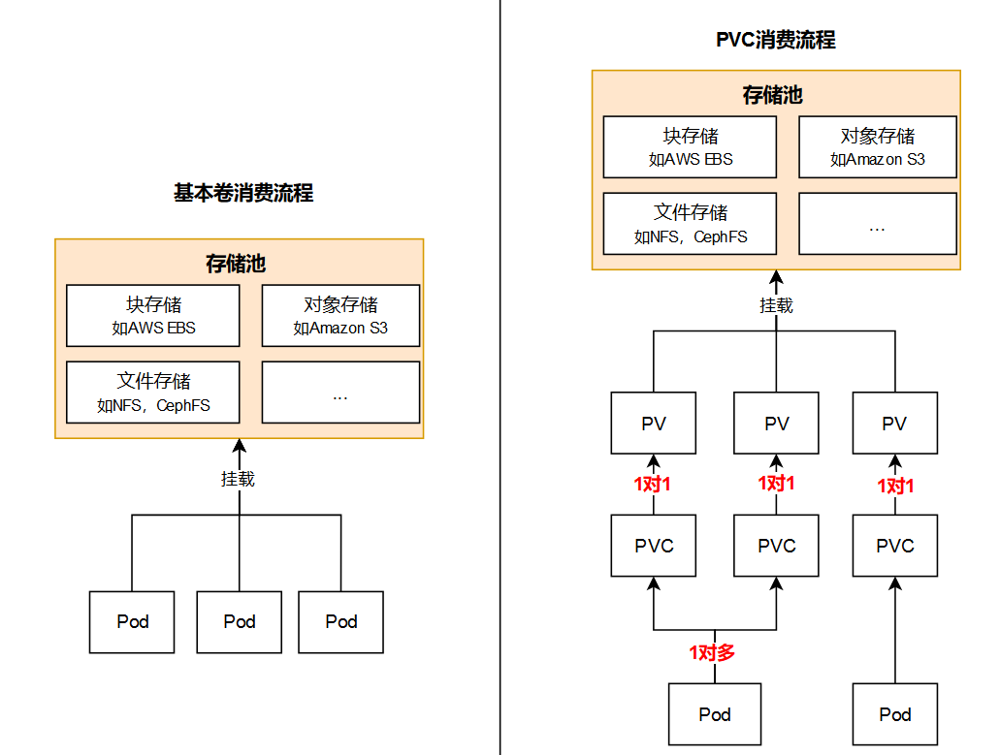


> 注意对比lvm逻辑卷管理和PV,PVC的区别，有些相似但完全不同。

## 22.0 api文档

+ 持久卷`PV`和`PVC` 介绍文档 https://kubernetes.io/zh-cn/docs/concepts/storage/storage-classes/
+ 存储类`StorageClass` 介绍文档： https://kubernetes.io/zh-cn/docs/concepts/storage/storage-classes/#storageclass-objects
+ 容器存储接口规范`CSI` 介绍文档： https://kubernetes.io/zh-cn/docs/concepts/storage/volumes/#csi
+ 动态卷制备构建 https://kubernetes.io/zh-cn/docs/concepts/storage/dynamic-provisioning/

## 22.1 PV和PVC的生命周期

**PV卷是集群的资源**，PVC申领是对这些资源的请求，也被用来执行对资源的申领检查。PV卷和PVC申领之间的互动遵循如下生命周期：

1. **制备/构建 Provisioning**

   + **静态制备（静态构建）**

     有集群管理员在定义PVC申领前**提前创建好PV卷**。这些PV卷**带有真实存储的细节信息**，并且对集群用户可见（可用）。

   + **动态制备（动态构建）**

     不提前创建好PV卷，而是**在创建PVC申领时请求（指定）一个StorageClass存储类SC**，该存储类StorageClass里面**定义了provisioner制备器和存储配置的相关信息（如存储池地址，共享目录等）**。由该存储类StorageClass中的provisioner制备器根据配置信息动态的创建PV资源。

     > 要想实现这个操作，前提是PVC必须设置StorageClass，否则无法动态构建该PV。可以使用第三方插件，或默认的DefaultStorageClass来实现PV的动态构建。

   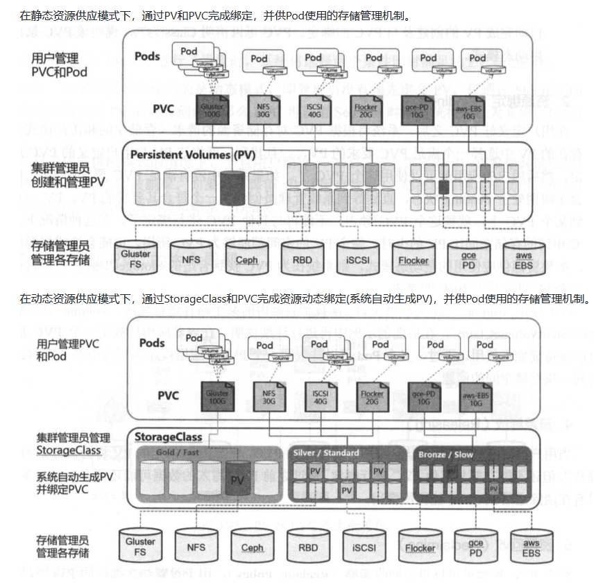

2. **绑定 Binding**

   + **首先**，当用户创建一个PVC对象后，主节点会检测新的PVC对象，并且寻找与之匹配的PV卷，**找到PV卷后将二者绑定在一起**。
   + **其次**，如果找不到对应的PV，则需要看PVC是否设置**StorageClass存储类**来决定**是否动态创建PV**。
   + **然后**，如果**没有配置动态构建**，PVC将**一直处于未绑定的状态**，**直到**有与之**匹配的PV**后才会申领**绑定**关系。

3. **使用 Using**
   Pod将PVC当作存储卷来使用。当Pod使用PVC时，集群会通过PVC找到绑定的PV，并为Pod挂载该卷。**Pod一旦使用，则PVC和PV就处于绑定Bind状态。**为了保护数据，避免数据丢失的问题，**PV对象就会受到保护**，该PV**在集群系统就无法删除。**

4. **回收 Reclaiming**
   当用户不再使用该存储卷时，他们可以从API中将PVC对象删除，从而允许该资源被回收再利用。**集群会根据PV对象的回收策略来初始该数据卷PV**。回收策略有：`Retain`保留、`Recycle`回收（已废弃）、`Delete`删除。

## 22.2 PVC的回收策略（针对PV）

+ `Retain`保留  **删除PVC，保留PV（推荐）** 

  回收策略 `Retain` 使得用户可以手动回收资源。当 PVC 被删除时，PV 保留，数据不会被删除。**这个策略允许手动回收或重新绑定这个 PV 到新的 PVC**。管理员可以选择手动清理数据或重新使用该 PV。

+ `Recycle`回收（已废弃）

  这种策略会将 PV 进行简单的“清空”（格式化操作），然后重新标记为 `Available`，使其可以被新的 PVC 使用。

  > [!Warning]
  >
  > 回收策略 `Recycle` 已被废弃。取而代之的建议方案是使用动态制备。

+ `Delete`删除 **删除PVC，同时删除PV（动态构建的看SC中回收策略）**

  对于支持 `Delete` 回收策略的卷插件，删除动作会将 PersistentVolume 对象从 Kubernetes 中移除，同时也会从外部基础设施中移除所关联的存储资产。 动态制备的卷会继承[其 StorageClass 中设置的回收策略](https://kubernetes.io/zh-cn/docs/concepts/storage/persistent-volumes/#reclaim-policy)， 该策略默认为 `Delete`。管理员需要根据用户的期望来配置 StorageClass； 否则 PV 卷被创建之后必须要被编辑或者修补。 参阅[更改 PV 卷的回收策略](https://kubernetes.io/zh-cn/docs/tasks/administer-cluster/change-pv-reclaim-policy/)。

## 22.3 PV和PVC使用、制备流程图（静态、动态）

**静态构建流程如下：**

1. 当Pod使用PVC时，PVC会去集群中查找是否存在满足要求的PV
2. 如果有就继续下去，如果没有Pod会一直卡住。直到有满足条件的PV被创建。

**动态构建的流程如下：**

1. 当Pod使用PVC时，PVC会先去集群中查找是否存在满足要求的PV。
2. 如果没有满足条件的PV，则k8s会调用PVC中指明的StorageClass中的provisioner制备器，根据该StorageClass中配置存储的信息，动态的去申请满足要求的资源创建PV。
3. 如果存储池无法满足要求，则Pod会一直卡住。直到有满足条件的PV被创建。

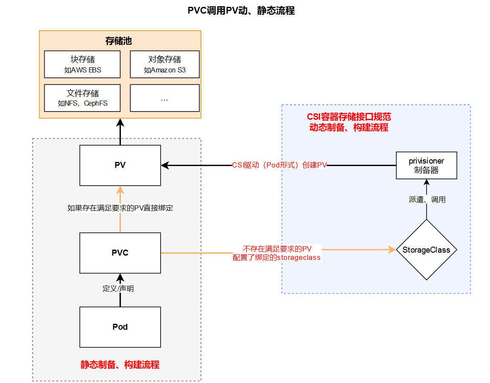

## 22.4 *PV的使用（静态构建）*

1. 创建PV ，使用配置文件`test-pv-static.yaml`

   ```yaml
   apiVersion: v1
   kind: PersistentVolume
   metadata:
     name: test-pv-static
   spec:
     capacity: # 表示该卷的资源和容量(目前只支持storage大小)
       storage: 200Mi # 该卷的大小
     volumeMode: Filesystem # 表示是当作已格式化的文件系统FileSystem使用(默认)；还是没有格式化的原始状态块Block(k8s不会自动格式化，有容器服务自己处理)
     accessModes: # 挂在卷的访问模式
       - ReadWriteOnce # 即RWO，表示卷只能被一个Node节点以读写方式挂载。具体见 22.5PV的accessMode章节
     persistentVolumeReclaimPolicy: Retain # PVC被删除时该PV的回收策略，有Delete，Retain(默认值)，Recycle（已废弃）
     storageClassName: "slow" # 表示该PV卷所属的StorageClass的名字(k8s中无内置). 空值意味着此卷不属于任何 StorageClass
     mountOptions: # 挂载选项 ,针对不同的文件系统选项不同 如ro只读，rw读写，
       - hard # hard用nfs表示强制挂载
       - nfsvers=4.1 # 指定nfs版本
     
     # 一个PVC只能关联一个数据卷
     nfs: # 挂载nfs硬盘
       path: /data/nfs # nfs服务器上被挂载的目录
       server: 192.168.136.151 # nfs服务器地址
     # 加上下面就会报错
     #hostPath:
     #    path: /app
   
   ```

2. 查看PV资源

   ```bash
   $ kubectl get pv test-pv-static
   NAME             CAPACITY   ACCESS MODES   RECLAIM POLICY   STATUS      CLAIM   STORAGECLASS   REASON   AGE
   test-pv-static   200Mi      RWO            Retain           Available           slow                    25m
   # RWO即ReadWriteOnly访问模式
   ```

3. 创建PVC，使用配置文件`test-pvc-static.yaml`

   ```yaml
   # https://kubernetes.io/docs/concepts/storage/persistent-volumes/
   apiVersion: v1
   kind: PersistentVolumeClaim # PVC资源
   metadata:
     name: test-pvc-static
     namespace: default # 有命名空间
     labels:
       app: test-pvc-static
   spec:
     volumeMode: Filesystem # 表示预期PV应该是个文件系统（默认），可选值Block
     storageClassName: default
     accessModes: # 表示该pvc预期pv卷应该具备的访问权限（读写权限）
     - ReadWriteOnce
     resources: # 表示该pvc对pv的要求
       requests: # 最小要求(pv卷大小要大于等于该值) **绑定基于此值**
         storage: 1Mi
       limits: # 最大要求,即pv要大于等于该值 （**只具有参考意义，不依据该值来选择PV）
         storage: 200Mi  
     storageClassName: "slow" # 要求pv的storageclass必须要有且是slow
     # 上面是模糊匹配，当然你也可以通过label selector进行精确匹配（二者可以同时存在）
     # selector:
     #   matchLabels:
     #     app: pv-static
     #   matchExpressions: # 基于 表达式匹配 In，Notin，Exists，DoesNotExist
     #   - {key: environment, opeartor: In, values: [dev]} 
     # 下面表示收到绑定，不是PVC自己去找PV
     #volumeName: test-pv-static # 表示当前pvc指名道姓找名字为test-pv-static的PV
   ```

4. 查看PVC资源，PV

   ```bash
   $ kubectl get pvc test-pvc-static
   NAME              STATUS   VOLUME           CAPACITY   ACCESS MODES   STORAGECLASS   AGE
   test-pvc-static   Bound    test-pv-static   200Mi      RWO            slow           117s
   
   $ kubectl get pv test-pv-static
   NAME             CAPACITY   ACCESS MODES   RECLAIM POLICY   STATUS   CLAIM                     STORAGECLASS   REASON   AGE
   test-pv-static   200Mi      RWO            Retain           Bound    default/test-pvc-static   slow                    44m
   ```

   可用`kubectl describe pv/pvc`查看PV和PVC具体信息

5. Pod使用该PVC（**也可以在Pod创建PVC不用分开**）
   ```bash
   # https://kubernetes.io/docs/concepts/workloads/pods/
   apiVersion: v1
   kind: Pod
   metadata:
     name: "test-pv-static-pod"
     namespace: default
     labels:
       app: "pv-static-pod"
   spec:
     containers:
     - name: alpine
       image: 192.168.31.79:5000/alpine:latest
       command: ["sh","-c"," sleep 3600"]
   
       # 由此可以看出，只是volume定义的类型不同，用法还是一样的
       volumeMounts:
       - name: pv-static
         mountPath: /app
         # subPath:xxx # 当然可以使用subpath
     volumes:
       - name: pv-static
         persistentVolumeClaim: # 使用PVC类型
           claimName: test-pvc-static # pvc的名字，必须完全一样，表示使用哪个PVC和关联的PV
           readOnly: false # 是否只读，默认为false
     restartPolicy: Never
   ---
   ```

6. 测试发现可用，挂载路径存在

7. 如果出现问题可以`kubectl describe pod/pvc/pv` 一路查找下去

## 22.5 PV的accessMode（卷访问模式）

定义PV时需要定义PV的卷访问模式： 

+ `ReadWriteOnce` 即`RWO`，表示卷可以被一个Node节点以读写方式挂载。(**只允许一个Node节点上的多Pod读写**)
+ `ReadOnlyMany`即`ROX`，表示卷可以被多个Node节点以只读方式挂载。（**只允许多Node节点，多Pod同时读**）
+ `ReadWriteMany`即`RWX`，表示卷可以被多个节点以读写方式挂载。（**允许多Node节点，多Pod同时读写**）
+ `ReadWriteOncePod`即`RWOP`，表示卷可以被单个 Pod 以读写方式挂载。（**只允许一个Node节点上的一个Pod同时读写**）

> [!Attention]
>
> 每个卷同一时刻只能以一种访问模式挂载，即使该卷能够支持多种访问模式。

> [!Warning]
>
> Kubernetes 使用卷访问模式来匹配 PersistentVolumeClaim 和 PersistentVolume。 在某些场合下，卷访问模式也会限制 PersistentVolume 可以挂载的位置。 卷访问模式并**不会**在存储已经被挂载的情况下为其实施写保护。 即使访问模式设置为 ReadWriteOnce、ReadOnlyMany 或 ReadWriteMany，它们也不会对卷形成限制。 例如，即使某个卷创建时设置为 ReadOnlyMany，也无法保证该卷是只读的。(**权限访问控制只是在K8s集群内部，并不能保证所有层面实现绝对的一致性**)

## 22.6 PV的状态status

可以通过`kubectl get pv`获取PV状态，一共有下面几组：

+ `Available` 空闲，未被PVC绑定
+ `Bound` 已经被PVC绑定了
+ `Released` PVC被删除，关联存储资源尚未被集群回收，且PV未被重新使用
+ `Failed` 卷的自动回收操作失败(不可绑定)

> 可以使用`kubectl describe persistentvolume <name> `查看已绑定到 PV 的 PVC 的名称

## 22.7 存储类StorageClass

https://kubernetes.io/zh-cn/docs/concepts/storage/storage-classes/#default-storageclass

> **为了动态制备PV使用**

StorageClass 为管理员提供了描述**存储类**的方法。 **不同的类型可能会映射到不同的服务质量等级或备份策略，或是由集群管理员制定的任意策略。 Kubernetes 本身并不清楚各种类代表的什么。**

每个 StorageClass 都包含 `provisioner`、`parameters` 和 `reclaimPolicy` 字段， 这些字段会在 StorageClass 需要**动态制备 **PersistentVolume 以满足 PersistentVolumeClaim (PVC) 时使用到。

StorageClass 对象的命名很重要，用户使用这个命名来请求生成一个特定的类。 当创建 StorageClass 对象时，管理员设置 StorageClass 对象的命名和其他参数。

```yaml
apiVersion: storage.k8s.io/v1
kind: StorageClass
metadata:
  name: low-latency
  annotations:
    storageclass.kubernetes.io/is-default-class: "false"
provisioner: csi-driver.example-vendor.example
reclaimPolicy: Retain # 默认值是 Delete
allowVolumeExpansion: true
mountOptions:
  - discard # 这可能会在块存储层启用 UNMAP/TRIM
volumeBindingMode: WaitForFirstConsumer
parameters:
  guaranteedReadWriteLatency: "true" # 这是服务提供商特定的

```

### 22.7.1 默认 StorageClass

你可以将某个 StorageClass 标记为集群的默认存储类。 关于如何设置默认的 StorageClass， 请参见[更改默认 StorageClass](https://kubernetes.io/zh-cn/docs/tasks/administer-cluster/change-default-storage-class/)。

当一个 PVC 没有指定 `storageClassName` 时，会使用默认的 StorageClass。

如果你在集群中的多个 StorageClass 上将 [`storageclass.kubernetes.io/is-default-class`](https://kubernetes.io/zh-cn/docs/reference/labels-annotations-taints/#storageclass-kubernetes-io-is-default-class) 注解设置为 true，然后创建一个未设置 `storageClassName` 的 PersistentVolumeClaim (PVC)， Kubernetes 将使用最近创建的默认 StorageClass。

> [!Note]
>
> 你应该尝试在集群中只将一个 StorageClass 标记为默认的存储类。 Kubernetes 允许你拥有多个默认 StorageClass 的原因是为了无缝迁移。

你可以在创建新的 PVC 时不指定 `storageClassName`，即使在集群中没有默认 StorageClass 的情况下也可以这样做。 在这种情况下，新的 PVC 会按照你定义的方式进行创建，并且该 PVC 的 `storageClassName` 将保持不设置， 直到有可用的默认 StorageClass 为止。

你可以拥有一个没有任何默认 StorageClass 的集群。 如果你没有将任何 StorageClass 标记为默认（例如，云服务提供商还没有为你设置默认值），那么 Kubernetes 将无法为需要 StorageClass 的 PersistentVolumeClaim 应用默认值。

当默认 StorageClass 变得可用时，控制平面会查找所有未设置 `storageClassName` 的现有 PVC。 对于那些 `storageClassName` 值为空或没有此键的 PVC，控制平面将更新它们， 将 `storageClassName` 设置为匹配新的默认 StorageClass。如果你有一个现成的 PVC，其 `storageClassName` 为 `""`， 而你配置了默认的 StorageClass，那么该 PVC 将不会被更新。

（当默认的 StorageClass 存在时）为了继续绑定到 `storageClassName` 为 `""` 的 PV， 你需要将关联 PVC 的 `storageClassName` 设置为 `""`。

### 22.7.2 存储器制备器provisioner

每个 StorageClass 都有一个制备器（Provisioner），用来决定使用哪个卷插件制备 PV。 该字段必须指定。

| 卷插件         | 内置制备器 |                           配置示例                           |
| :------------- | :--------: | :----------------------------------------------------------: |
| AzureFile      |     ✓      | [Azure File](https://kubernetes.io/zh-cn/docs/concepts/storage/storage-classes/#azure-file) |
| CephFS         |     -      |                              -                               |
| FC             |     -      |                              -                               |
| FlexVolume     |     -      |                              -                               |
| iSCSI          |     -      |                              -                               |
| Local          |     -      | [Local](https://kubernetes.io/zh-cn/docs/concepts/storage/storage-classes/#local) |
| NFS            |     -      | [NFS](https://kubernetes.io/zh-cn/docs/concepts/storage/storage-classes/#nfs) |
| PortworxVolume |     ✓      | [Portworx Volume](https://kubernetes.io/zh-cn/docs/concepts/storage/storage-classes/#portworx-volume) |
| RBD            |     ✓      | [Ceph RBD](https://kubernetes.io/zh-cn/docs/concepts/storage/storage-classes/#ceph-rbd) |
| VsphereVolume  |     ✓      | [vSphere](https://kubernetes.io/zh-cn/docs/concepts/storage/storage-classes/#vsphere) |

除了上面这些内置，你不限于指定此处列出的 "内置" 制备器（其名称前缀为 "kubernetes.io" 并打包在 Kubernetes 中）。 你还可以运行和指定外部制备器，这些独立的程序遵循由 Kubernetes 定义的[规范](https://git.k8s.io/design-proposals-archive/storage/volume-provisioning.md)。 外部供应商的作者完全可以自由决定他们的代码保存于何处、打包方式、运行方式、使用的插件（包括 Flex）等。 代码仓库 [kubernetes-sigs/sig-storage-lib-external-provisioner](https://github.com/kubernetes-sigs/sig-storage-lib-external-provisioner) 包含一个用于为外部制备器编写功能实现的类库。你可以访问代码仓库 [kubernetes-sigs/sig-storage-lib-external-provisioner](https://github.com/kubernetes-sigs/sig-storage-lib-external-provisioner) 了解外部驱动列表。

> 例如，NFS 没有内部制备器，但可以使用外部制备器。 也有第三方存储供应商提供自己的外部制备器。

### 22.7.3 回收策略

由 StorageClass 动态创建的 PersistentVolume 会在类的 [reclaimPolicy](https://kubernetes.io/zh-cn/docs/concepts/storage/persistent-volumes/#reclaiming) 字段中指定回收策略，可以是 `Delete` 或者 `Retain`。 如果 StorageClass 对象被创建时没有指定 `reclaimPolicy`，它将默认为 `Delete`。

通过 StorageClass 手动创建并管理的 PersistentVolume 会使用它们被创建时指定的回收策略。

### 22.7.4 StorageClass官网案例

https://kubernetes.io/zh-cn/docs/concepts/storage/storage-classes/#aws-ebs

+  AWS EBS

+  AWS EFS

+  NFS

+  vSphere

+  Ceph RBD

+  Azure File

+  Portworx 卷

+ 本地

> 注意，一些外部StorageClass的provisioner需要搭配CSI驱动来实现动态制备，所以需要自己安装CSI插件（以Pod运行）。

## 22.8 ==**PV的使用（动态构建）**==

> **PV的动态制备都依赖于RBAC获取访问权限**

PV的动态制备有很多插件可以选择，下面以两种方案操作：

### 22.8.1 案例一

> 该插件，NFS服务器地址信息是配置在 `StorageClass`中，而不是`provisioner`制备器Pod中

按照kubernetes官网推荐到NFS SCI插件，基于`nfs.csi.k8s.io`provisioner为例：

**参考链接：**

+ [NFS SCI插件安装](https://github.com/kubernetes-csi/csi-driver-nfs?tab=readme-ov-file#readme)
+ [NFS StorageClass配置类示例](https://kubernetes.io/zh-cn/docs/concepts/storage/storage-classes/#nfs)

**执行步骤：**

1. 需要有一个NFS系统，如果没有见[21.3.1 安装并启动NFS服务](#21.3.1 安装并启动NFS服务)

2. 在线安装NFS CSI

   以kubectl安装为例，以v4.7.0为例（注意和kubernetes版本的兼容性）

   ```bash
   # 1.远程安装 （其他安装方法见上面 NFS SCI插件安装）
   $ curl -skSL https://raw.githubusercontent.com/kubernetes-csi/csi-driver-nfs/v4.7.0/deploy/install-driver.sh | bash -s v4.7.0 --
   # 2.检查Pod的状态
   $ kubectl -n kube-system get pod -o wide -l app=csi-nfs-controller
   $ kubectl -n kube-system get pod -o wide -l app=csi-nfs-node
   ```

   有问题，网络问题：镜像都下载不下来推荐离线安装

3. 离线安装NFS CSI

   + 查看`https://raw.githubusercontent.com/kubernetes-csi/csi-driver-nfs/v4.7.0/deploy/install-driver.sh`内容

     ```bash
     #!/bin/bash
     
     set -euo pipefail
     
     ver="master"
     if [[ "$#" -gt 0 ]]; then
       ver="$1"
     fi
     
     repo="https://raw.githubusercontent.com/kubernetes-csi/csi-driver-nfs/$ver/deploy"
     if [[ "$#" -gt 1 ]]; then
       if [[ "$2" == *"local"* ]]; then
         echo "use local deploy"
         repo="./deploy"
       fi
     fi
     
     if [ $ver != "master" ]; then
       repo="$repo/$ver"
     fi
     
     echo "Installing NFS CSI driver, version: $ver ..."
     kubectl apply -f $repo/rbac-csi-nfs.yaml
     kubectl apply -f $repo/csi-nfs-driverinfo.yaml
     kubectl apply -f $repo/csi-nfs-controller.yaml
     kubectl apply -f $repo/csi-nfs-node.yaml
     
     if [[ "$#" -gt 1 ]]; then
       if [[ "$2" == *"snapshot"* ]]; then
         echo "install snapshot driver ..."
         kubectl apply -f $repo/crd-csi-snapshot.yaml
         kubectl apply -f $repo/rbac-snapshot-controller.yaml
         kubectl apply -f $repo/csi-snapshot-controller.yaml
       fi
     fi
     
     echo 'NFS CSI driver installed successfully.'
     ```

   + 获取拼接地址 `https://raw.githubusercontent.com/kubernetes-csi/csi-driver-nfs/v4.7.0/deploy`，无法打开。github上查找对应版本的release，下载下来。

   + 下载文件`https://github.com/kubernetes-csi/csi-driver-nfs/archive/refs/tags/v4.7.0.zip`，复制出里面`deploy/v4.7.0`目录下所有文件到k8s集群中。

   + 修改yaml文件中镜像地址，加速（去hub.docker上找）

   + **创建rbac权限角色** `rbac-csi-nfs.yaml`

     ```yaml
     ---
     apiVersion: v1
     kind: ServiceAccount
     metadata:
       name: csi-nfs-controller-sa
       namespace: kube-system
     ---
     apiVersion: v1
     kind: ServiceAccount
     metadata:
       name: csi-nfs-node-sa
       namespace: kube-system
     ---
     
     kind: ClusterRole
     apiVersion: rbac.authorization.k8s.io/v1
     metadata:
       name: nfs-external-provisioner-role
     rules:
       - apiGroups: [""]
         resources: ["persistentvolumes"]
         verbs: ["get", "list", "watch", "create", "delete"]
       - apiGroups: [""]
         resources: ["persistentvolumeclaims"]
         verbs: ["get", "list", "watch", "update"]
       - apiGroups: ["storage.k8s.io"]
         resources: ["storageclasses"]
         verbs: ["get", "list", "watch"]
       - apiGroups: ["snapshot.storage.k8s.io"]
         resources: ["volumesnapshotclasses", "volumesnapshots"]
         verbs: ["get", "list", "watch"]
       - apiGroups: ["snapshot.storage.k8s.io"]
         resources: ["volumesnapshotcontents"]
         verbs: ["get", "list", "watch", "update", "patch"]
       - apiGroups: ["snapshot.storage.k8s.io"]
         resources: ["volumesnapshotcontents/status"]
         verbs: ["get", "update", "patch"]
       - apiGroups: [""]
         resources: ["events"]
         verbs: ["get", "list", "watch", "create", "update", "patch"]
       - apiGroups: ["storage.k8s.io"]
         resources: ["csinodes"]
         verbs: ["get", "list", "watch"]
       - apiGroups: [""]
         resources: ["nodes"]
         verbs: ["get", "list", "watch"]
       - apiGroups: ["coordination.k8s.io"]
         resources: ["leases"]
         verbs: ["get", "list", "watch", "create", "update", "patch"]
       - apiGroups: [""]
         resources: ["secrets"]
         verbs: ["get"]
     ---
     
     kind: ClusterRoleBinding
     apiVersion: rbac.authorization.k8s.io/v1
     metadata:
       name: nfs-csi-provisioner-binding
     subjects:
       - kind: ServiceAccount
         name: csi-nfs-controller-sa
         namespace: kube-system
     roleRef:
       kind: ClusterRole
       name: nfs-external-provisioner-role
       apiGroup: rbac.authorization.k8s.io
     
     ```

   + **创建CSIDriver信息** `csi-nfs-driverinfo.yaml`

     ```yaml
     ---
     apiVersion: storage.k8s.io/v1
     kind: CSIDriver
     metadata:
       name: nfs.csi.k8s.io
     spec:
       attachRequired: false
       volumeLifecycleModes:
         - Persistent
       fsGroupPolicy: File
     ```

   + **创建provisioner制备器，用于制造PV** `csi-nfs-controller.yaml`

     ```yaml
     ---
     kind: Deployment
     apiVersion: apps/v1
     metadata:
       name: csi-nfs-controller
       namespace: kube-system
     spec:
       replicas: 1
       selector:
         matchLabels:
           app: csi-nfs-controller
       template:
         metadata:
           labels:
             app: csi-nfs-controller
         spec:
           hostNetwork: true  # controller also needs to mount nfs to create dir
           dnsPolicy: ClusterFirstWithHostNet  # available values: Default, ClusterFirstWithHostNet, ClusterFirst
           serviceAccountName: csi-nfs-controller-sa
           nodeSelector:
             kubernetes.io/os: linux  # add "kubernetes.io/role: master" to run controller on master node
           priorityClassName: system-cluster-critical
           securityContext:
             seccompProfile:
               type: RuntimeDefault
           tolerations:
             - key: "node-role.kubernetes.io/master"
               operator: "Exists"
               effect: "NoSchedule"
             - key: "node-role.kubernetes.io/controlplane"
               operator: "Exists"
               effect: "NoSchedule"
             - key: "node-role.kubernetes.io/control-plane"
               operator: "Exists"
               effect: "NoSchedule"
           containers:
             - name: csi-provisioner
               # image: registry.k8s.io/sig-storage/csi-provisioner:v4.0.0
               image: 192.168.31.79:5000/dyrnq/csi-provisioner:v4.0.0
               args:
                 - "-v=2"
                 - "--csi-address=$(ADDRESS)"
                 - "--leader-election"
                 - "--leader-election-namespace=kube-system"
                 - "--extra-create-metadata=true"
                 - "--timeout=1200s"
               env:
                 - name: ADDRESS
                   value: /csi/csi.sock
               volumeMounts:
                 - mountPath: /csi
                   name: socket-dir
               resources:
                 limits:
                   memory: 400Mi
                 requests:
                   cpu: 10m
                   memory: 20Mi
             - name: csi-snapshotter
               # image: registry.k8s.io/sig-storage/csi-snapshotter:v6.3.3
               image: 192.168.31.79:5000/dyrnq/csi-snapshotter:v6.3.3
               args:
                 - "--v=2"
                 - "--csi-address=$(ADDRESS)"
                 - "--leader-election-namespace=kube-system"
                 - "--leader-election"
                 - "--timeout=1200s"
               env:
                 - name: ADDRESS
                   value: /csi/csi.sock
               imagePullPolicy: IfNotPresent
               volumeMounts:
                 - name: socket-dir
                   mountPath: /csi
               resources:
                 limits:
                   memory: 200Mi
                 requests:
                   cpu: 10m
                   memory: 20Mi
             - name: liveness-probe
               # image: registry.k8s.io/sig-storage/livenessprobe:v2.12.0
               image: 192.168.31.79:5000/dyrnq/livenessprobe:v2.12.0
               args:
                 - --csi-address=/csi/csi.sock
                 - --probe-timeout=3s
                 - --http-endpoint=localhost:29652
                 - --v=2
               volumeMounts:
                 - name: socket-dir
                   mountPath: /csi
               resources:
                 limits:
                   memory: 100Mi
                 requests:
                   cpu: 10m
                   memory: 20Mi
             - name: nfs
               # image: registry.k8s.io/sig-storage/nfsplugin:v4.7.0
               image: 192.168.31.79:5000/dyrnq/nfsplugin:v4.7.0
               securityContext:
                 privileged: true
                 capabilities:
                   add: ["SYS_ADMIN"]
                 allowPrivilegeEscalation: true
               imagePullPolicy: IfNotPresent
               args:
                 - "-v=5"
                 - "--nodeid=$(NODE_ID)"
                 - "--endpoint=$(CSI_ENDPOINT)"
               env:
                 - name: NODE_ID
                   valueFrom:
                     fieldRef:
                       fieldPath: spec.nodeName
                 - name: CSI_ENDPOINT
                   value: unix:///csi/csi.sock
               livenessProbe:
                 failureThreshold: 5
                 httpGet:
                   host: localhost
                   path: /healthz
                   port: 29652
                 initialDelaySeconds: 30
                 timeoutSeconds: 10
                 periodSeconds: 30
               volumeMounts:
                 - name: pods-mount-dir
                   mountPath: /var/lib/kubelet/pods
                   mountPropagation: "Bidirectional"
                 - mountPath: /csi
                   name: socket-dir
               resources:
                 limits:
                   memory: 200Mi
                 requests:
                   cpu: 10m
                   memory: 20Mi
           volumes:
             - name: pods-mount-dir
               hostPath:
                 path: /var/lib/kubelet/pods
                 type: Directory
             - name: socket-dir
               emptyDir: {}
     ```

   + **生成配置存活探针，nfs插件等** `csi-nfs-node.yaml`

     ```yaml
     ---
     kind: DaemonSet
     apiVersion: apps/v1
     metadata:
       name: csi-nfs-node
       namespace: kube-system
     spec:
       updateStrategy:
         rollingUpdate:
           maxUnavailable: 1
         type: RollingUpdate
       selector:
         matchLabels:
           app: csi-nfs-node
       template:
         metadata:
           labels:
             app: csi-nfs-node
         spec:
           hostNetwork: true  # original nfs connection would be broken without hostNetwork setting
           dnsPolicy: ClusterFirstWithHostNet  # available values: Default, ClusterFirstWithHostNet, ClusterFirst
           serviceAccountName: csi-nfs-node-sa
           priorityClassName: system-node-critical
           securityContext:
             seccompProfile:
               type: RuntimeDefault
           nodeSelector:
             kubernetes.io/os: linux
           tolerations:
             - operator: "Exists"
           containers:
             - name: liveness-probe
               # image: registry.k8s.io/sig-storage/livenessprobe:v2.12.0
               image: 192.168.31.79:5000/dyrnq/livenessprobe:v2.12.0
               args:
                 - --csi-address=/csi/csi.sock
                 - --probe-timeout=3s
                 - --http-endpoint=localhost:29653
                 - --v=2
               volumeMounts:
                 - name: socket-dir
                   mountPath: /csi
               resources:
                 limits:
                   memory: 100Mi
                 requests:
                   cpu: 10m
                   memory: 20Mi
             - name: node-driver-registrar
               # image: registry.k8s.io/sig-storage/csi-node-driver-registrar:v2.10.0
               image: registry.k8s.io/sig-storage/csi-node-driver-registrar:v2.10.0
               args:
                 - --v=2
                 - --csi-address=/csi/csi.sock
                 - --kubelet-registration-path=$(DRIVER_REG_SOCK_PATH)
               livenessProbe:
                 exec:
                   command:
                     - /csi-node-driver-registrar
                     - --kubelet-registration-path=$(DRIVER_REG_SOCK_PATH)
                     - --mode=kubelet-registration-probe
                 initialDelaySeconds: 30
                 timeoutSeconds: 15
               env:
                 - name: DRIVER_REG_SOCK_PATH
                   value: /var/lib/kubelet/plugins/csi-nfsplugin/csi.sock
                 - name: KUBE_NODE_NAME
                   valueFrom:
                     fieldRef:
                       fieldPath: spec.nodeName
               volumeMounts:
                 - name: socket-dir
                   mountPath: /csi
                 - name: registration-dir
                   mountPath: /registration
               resources:
                 limits:
                   memory: 100Mi
                 requests:
                   cpu: 10m
                   memory: 20Mi
             - name: nfs
               securityContext:
                 privileged: true
                 capabilities:
                   add: ["SYS_ADMIN"]
                 allowPrivilegeEscalation: true
               # image: registry.k8s.io/sig-storage/nfsplugin:v4.7.0
               image: 192.168.31.79:5000/dyrnq/nfsplugin:v4.7.0
               args:
                 - "-v=5"
                 - "--nodeid=$(NODE_ID)"
                 - "--endpoint=$(CSI_ENDPOINT)"
               env:
                 - name: NODE_ID
                   valueFrom:
                     fieldRef:
                       fieldPath: spec.nodeName
                 - name: CSI_ENDPOINT
                   value: unix:///csi/csi.sock
               livenessProbe:
                 failureThreshold: 5
                 httpGet:
                   host: localhost
                   path: /healthz
                   port: 29653
                 initialDelaySeconds: 30
                 timeoutSeconds: 10
                 periodSeconds: 30
               imagePullPolicy: "IfNotPresent"
               volumeMounts:
                 - name: socket-dir
                   mountPath: /csi
                 - name: pods-mount-dir
                   mountPath: /var/lib/kubelet/pods
                   mountPropagation: "Bidirectional"
               resources:
                 limits:
                   memory: 300Mi
                 requests:
                   cpu: 10m
                   memory: 20Mi
           volumes:
             - name: socket-dir
               hostPath:
                 path: /var/lib/kubelet/plugins/csi-nfsplugin
                 type: DirectoryOrCreate
             - name: pods-mount-dir
               hostPath:
                 path: /var/lib/kubelet/pods
                 type: Directory
             - hostPath:
                 path: /var/lib/kubelet/plugins_registry
                 type: Directory
               name: registration-dir
     
     ```

4. 创建StorageClass，**同时配置NFS服务器信息** `nfs-csi-storageclass.yaml`

   ```yaml
   ---
   apiVersion: storage.k8s.io/v1
   kind: StorageClass
   metadata:
     name: nfs-csi-storageclass
   provisioner: nfs.csi.k8s.io # 制备器
   parameters: 
     server: 192.168.136.151 # NFS服务器信息
     share: /data/nfs/rw
     # csi.storage.k8s.io/provisioner-secret is only needed for providing mountOptions in DeleteVolume
     # csi.storage.k8s.io/provisioner-secret-name: "mount-options"
     # csi.storage.k8s.io/provisioner-secret-namespace: "default"
   reclaimPolicy: Retain # 回收策略
   volumeBindingMode: Immediate
   mountOptions:
     - nfsvers=4.1
   ```

5. 创建PVC，`nfs-csi-pvc.yaml`

   ```yaml
   # https://kubernetes.io/docs/concepts/storage/persistent-volumes/
   apiVersion: v1
   kind: PersistentVolumeClaim
   metadata:
     name: nfs-csi-pvc # pvc名字
     namespace: default
     labels:
       app: nfs-csi-pvc
   spec:
     storageClassName: nfs-csi-storageclass # 存储类名字（不是制备器）必须存在，且内部指明了provisioner制备器
     accessModes:
     - ReadWriteOnce
     resources: #申请资源大小
       requests:
         storage: 150Mi
   
   ```

6. 创建Pod，指定PVC，动态制备PV `nfs-csi-pod.yaml`

   ```yaml
   # https://kubernetes.io/docs/concepts/workloads/pods/
   apiVersion: v1
   kind: Pod
   metadata:
     name: "nfs-csi-pod"
     namespace: default
     labels:
       app: "nfs-csi-pod"
   spec:
     containers:
     - name: nginx
       image: 192.168.31.79:5000/nginx:latest
       resources: {}
       ports:
       - containerPort: 80
         name: http
   
       volumeMounts: # 挂在卷
       - name: nfs-sci # 和下面volumes.name对应
         mountPath: /usr/share/nginx/html
     volumes:
       - name: nfs-sci
         persistentVolumeClaim: # 使用pvc卷
           claimName: nfs-csi-pvc # 指定PVC，必须存在
           readOnly: false
     restartPolicy: Always
   
   ```

7. 查看，验证（成功）

   ```bash
   $ kubectl get pv,pvc # 下面150Mi的 注意看命名规则(自己指定的不是自动生成)和sc，
   NAME                                                        CAPACITY   ACCESS MODES   RECLAIM POLICY   STATUS   CLAIM                                  STORAGECLASS           REASON   AGE
   persistentvolume/pvc-0176795e-8351-4413-8f78-f45de2a5abde   500Mi      RWO            Retain           Bound    default/nginx-sc-test-pvc-nginx-sc-0   managed-nfs-storage             73m
   persistentvolume/pvc-a1474d03-9599-4f05-8914-69174b2c91fe   150Mi      RWO            Retain           Bound    default/nfs-csi-pvc                    nfs-csi-storageclass            19s
   persistentvolume/test-pv-static                             200Mi      RWO            Retain           Bound    default/test-pvc-static                slow                            24h
   
   NAME                                                 STATUS   VOLUME                                     CAPACITY   ACCESS MODES   STORAGECLASS           AGE
   persistentvolumeclaim/nfs-csi-pvc                    Bound    pvc-a1474d03-9599-4f05-8914-69174b2c91fe   150Mi      RWO            nfs-csi-storageclass   19s
   persistentvolumeclaim/nginx-sc-test-pvc-nginx-sc-0   Bound    pvc-0176795e-8351-4413-8f78-f45de2a5abde   500Mi      RWO            managed-nfs-storage    89m
   persistentvolumeclaim/test-pvc-static                Bound    test-pv-static                             200Mi      RWO            slow                   24h
   
   ```

   

### 22.8.2 案例二

> 该插件，NFS服务器地址信息是配置在 制备器`provisioner`的Pod中，由它创建

按照学习视频中例子，以`fuseim.pri/ifs`的privisioner为例：

**执行步骤：**

1. 需要有一个NFS系统，如果没有见[21.3.1 安装并启动NFS服务](#21.3.1 安装并启动NFS服务)

2. 创建PV需要一定的账号权限,所以我们需要配置RBAC `nfs-provisioner-rbac.yaml`

   ```yaml
   apiVersion: v1
   kind: ServiceAccount
   metadata:
     name: nfs-client-provisioner
     namespace: kube-system
   ---
   kind: ClusterRole
   apiVersion: rbac.authorization.k8s.io/v1
   metadata:
     name: nfs-client-provisioner-runner
   rules:
     - apiGroups: [""]
       resources: ["persistentvolumes"]
       verbs: ["get", "list", "watch", "create", "delete"]
     - apiGroups: [""]
       resources: ["persistentvolumeclaims"]
       verbs: ["get", "list", "watch", "update"]
     - apiGroups: ["storage.k8s.io"]
       resources: ["storageclasses"]
       verbs: ["get", "list", "watch"]
     - apiGroups: [""]
       resources: ["events"]
       verbs: ["create", "update", "patch"]
   ---
   kind: ClusterRoleBinding # 集群资源不需要namespace
   apiVersion: rbac.authorization.k8s.io/v1
   metadata:
     name: run-nfs-client-provisioner
   subjects:
     - kind: ServiceAccount
       name: nfs-client-provisioner
       namespace: kube-system  # 这里改为 nfs-client-provisioner 所在的命名空间
   roleRef:
     kind: ClusterRole
     name: nfs-client-provisioner-runner
     apiGroup: rbac.authorization.k8s.io
   ---
   kind: Role
   apiVersion: rbac.authorization.k8s.io/v1
   metadata:
     name: leader-locking-nfs-client-provisioner
     namespace: kube-system
   rules:
     - apiGroups: [""]
       resources: ["endpoints"]
       verbs: ["get", "list", "watch", "create", "update", "patch"]
   ---
   kind: RoleBinding
   apiVersion: rbac.authorization.k8s.io/v1
   metadata:
     name: leader-locking-nfs-client-provisioner
     namespace: kube-system
   subjects:
     - kind: ServiceAccount
       name: nfs-client-provisioner
       namespace: kube-system  # 这里确保与 ServiceAccount 在同一个命名空间
   roleRef:
     kind: Role
     name: leader-locking-nfs-client-provisioner
     apiGroup: rbac.authorization.k8s.io
   ```

3. 创建StorageClass资源（**实际只起到关联作用**） `nfs-storage-class.yaml`

   ```yaml
   apiVersion: storage.k8s.io/v1
   kind: StorageClass
   metadata:
     name: managed-nfs-storage #当前storageclass的名字，给后面pvc使用
   provisioner: fuseim.pri/ifs # 指定外部制备器名字（实际是Pod形式存在）
   reclaimPolicy: Retain # 数据卷的回收策略,默认为Delete
   parameters: # 表示制备器provisioner的参数，所以不同的制备器参数会不同
     archiveOnDelete: "false" # false表示删除时不存档；true表示会存档（重命名的方式）
   mountOptions: [] # 挂载时的参数
   allowVolumeExpansion: false # 不允许自动扩展
   volumeBindingMode: Immediate # 表示PV卷创建后立即进行绑定，只有azure和awselasticsearch才支持其他值
   # 具体特性依据不同的制备器provisioner，和底层存储卷
   ```

4. **安装provisioner制备器用来制备PV，实际就是一个Pod**（最重要的一步）`nfs-provisioner-deployment.yaml`

   ```yaml
   # https://kubernetes.io/docs/concepts/workloads/controllers/deployment/
   apiVersion: apps/v1
   kind: Deployment
   metadata:
     name: nfs-client-provisioner
     namespace: kube-system
     labels:
       app: nfs-client-provisioner
   spec:
     selector:
       matchLabels:
         app: nfs-client-provisioner
     replicas: 1
     strategy:
       type: Recreate
     template:
       metadata:
         labels:
           app: nfs-client-provisioner
       spec:
         serviceAccountName: nfs-client-provisioner
         containers:
         - name: nfs-client-provisioner
           image: 192.168.31.79:5000/external_storage/nfs-client-provisioner:latest #该镜像存在SafaLink的问题
           #image: 192.168.31.79:5000/dyrnq/nfs-subdir-external-provisioner:v4.0.0
           imagePullPolicy: IfNotPresent
           resources: {}
           volumeMounts:
             - name: nfs-client-root
               mountPath: /persistentvolumes
           env: #定义Pod内容器环境变量
           - name: PROVISIONER_NAME 
             value: fuseim.pri/ifs # 指定制备器的名字，和storageclass中provisioner关联起来（就是此处pod提供的）
           - name: NFS_SERVER # nfs服务的信息，为了让pod动态创建pv
             value: 192.168.136.151
           - name: NFS_PATH
             value: /data/nfs/rw
         volumes: # Pod环境内已经提供了nfs服务信息，还在此处挂载nfs目的：1.验证，2.提高效率
           - name: nfs-client-root
             nfs:
               server: 192.168.136.151
               path: /data/nfs/rw
         restartPolicy: Always

5. **编写PVC，Pod使用PVC实现动态制备PV** `nfs-sc-demo-statefulset.yaml`

   ```yaml
   # https://kubernetes.io/docs/concepts/workloads/controllers/statefulset/
   # https://kubernetes.io/docs/concepts/services-networking/service/
   apiVersion: v1
   kind: Service
   metadata:
     name: nginx-sc
     namespace: default
     labels:
       app: nginx-sc
   spec:
     selector:
       app: nginx-sc
     type: NodePort
     ports:
     - name: nginx-web
       protocol: TCP
       port: 80 # service监听端口
       targetPort: 80 # 匹配的Pod容器端口服务
       nodePort: 30001 # type: ClusterIP时禁止使用NodePort
   ---
   apiVersion: apps/v1
   kind: StatefulSet
   metadata:
     name: nginx-sc
     namespace: default
   spec:
     selector:
       matchLabels:
         app: nginx-sc
     serviceName: "nginx-sc" # 有状态服务必须要关联一个service
     replicas: 1
     template:
       metadata:
         labels:
           app: nginx-sc
       spec:
         terminationGracePeriodSeconds: 10
         containers:
         - name: nginx-sc
           image: 192.168.31.79:5000/nginx:latest
           ports:
           - containerPort: 80
             name: web
           volumeMounts:
           - name: nginx-sc-test-pvc
             mountPath: /usr/share/nginx/html
     volumeClaimTemplates: # sts内部申请pvc，省去apiversion,kind信息(这样一体配置，适合开发使用，不用关心pv了)
     - metadata:
         name: nginx-sc-test-pvc # PVC的名字
       spec:
         storageClassName: managed-nfs-storage # 和storageclass中name对应
         accessModes:
         - ReadWriteOnce
         resources:
           requests:
             storage: 500Mi
   ---
   ```

6. 验证自动满足需要的PV，PVC

   ```bash
   $ kubectl get pv,pvc
   # PV卷名																											# PVC申领名							存储类
   NAME                                                        CAPACITY   ACCESS MODES   RECLAIM POLICY   STATUS   CLAIM                                  STORAGECLASS          REASON   AGE
   persistentvolume/pvc-0a6f2d1f-2105-4b87-970c-907ca5e04f9b   500Mi      RWO            Retain           Bound    default/nginx-sc-test-pvc-nginx-sc-0   managed-nfs-storage            171m
   persistentvolume/test-pv-static                             200Mi      RWO            Retain           Bound    default/test-pvc-static                slow                           22h
   
   #pvc的名字为 PVC名字-pod名字 									卷名(对应PV卷名) 随机																#存储类
   NAME                                                 STATUS   VOLUME                                     CAPACITY   ACCESS MODES   STORAGECLASS          AGE
   persistentvolumeclaim/nginx-sc-test-pvc-nginx-sc-0   Bound    pvc-0a6f2d1f-2105-4b87-970c-907ca5e04f9b   500Mi      RWO            managed-nfs-storage   3h4m
   persistentvolumeclaim/test-pvc-static                Bound    test-pv-static                             200Mi      RWO            slow                  22h
   ```

### 22.8.3 如果PVC中StorageClass类目写错了如何排查?

1. 查看服务Pod描述信息，event事件提示处于`Pending`状态

   ```bash
   $ kubectl describe pod nfs-csi-pod-error
   Events:
     Type     Reason            Age   From               Message
     ----     ------            ----  ----               -------
     Warning  FailedScheduling  28s   default-scheduler  0/3 nodes are available: 3 pod has unbound immediate PersistentVolumeClaims.
   ```

2. 查看PV，PVC状态。PV未创建，PVC处于`Pending`状态

   ```bash
   $ kubectl get pvc,pv
   NAME                                                 STATUS    VOLUME                                     CAPACITY   ACCESS MODES   STORAGECLASS           AGE
   persistentvolumeclaim/nfs-csi-pvc-error              Pending                                                                        nfs.csi.k8s.io         115s
   
   NAME                                                        CAPACITY   ACCESS MODES   RECLAIM POLICY   STATUS   CLAIM                                  STORAGECLASS           REASON   AGE
   
   ```

3. **查看PVC的描述信息（除了Pod可以看日志，其他资源都应该通过describe排查）**

   **找到问题，提示名字叫**`nfs.csi.k8s.io`**的**`StorageClass`**存储类不存在**。去查看一下刚才创建的PVC和存储类SC，发现**PVC中将存储类中SC名字写错了，误写为SC的provisioner了**

   ```bash
   $ kubectl describe persistentvolumeclaim/nfs-csi-pvc-error
   Events:
     Type     Reason              Age                  From                         Message
     ----     ------              ----                 ----                         -------
     Warning  ProvisioningFailed  2s (x11 over 2m26s)  persistentvolume-controller  storageclass.storage.k8s.io "nfs.csi.k8s.io" not found
   ```

4. **PVC的spec配置不能热更新，需要将原来的PVC删除，重新创建**，PVC中StorageClass改为正常的已存在的

5. **如果是其他问题，就需要进入provisioner（logs命令）中查看具体日志了**

### 22.8.4 案例二 问题排查

#### 22.8.3.1 出现问题排查顺序

如果出现问题，如服务Pod无法启动、PV无法创建等等。可以按照下面思路排查：

```bash
# 1.查看Pod状态
$ kubectl get pod -A
# 2.查看PV，PVC状态
$ kubectl get pv,pvc
# 3.查看服务Pod创建详细信息
$ kubectl describe pod 服务pod -n 命名空间
# 4.查看provisioner的日志，判断pv为什么创建失败
$ kubectl logs -f provisioner制备器 -n 命名空间
```

#### 22.8.3.2 服务容器Pod一直Pending，PV无法创建（SafeLink问题）

按照上面的步骤，查看provisioner制备器日志：

```bash
E1017 12:39:11.633455       1 controller.go:853] Unexpected error getting claim reference to claim "default/nginx-sc-test-pvc-nginx-sc-0": selfLink was empty, can't make reference
```

发现是**SafeLink**问题（不知道就百度，问gpt）

***解决方法：***

+ 方法1： 修改provisioner镜像，将`nfs-provisioner.yaml`中镜像`external_storage/nfs-client-provisioner:latest`改为`dyrnq/nfs-subdir-external-provisioner:v4.0.0`，可以解决**SafeLink问题**。
+ 方法2：修改apiserver中启动配置文件`/etc/kubernetes/manifests/kube-apiserver.yaml`，在`spec.containers.command`中添加`--feature-gates=RemoveSelfLink=false`，然后重启apiserver。
  可以使用`kubectl apply -f /etc/kubernetes/manifests/kube-apiserver.yaml`生效

#### 22.8.3.3 服务容器Pod一直Pending，PV无法创建（RBAC问题）

按照上面的步骤，查看provisioner制备器日志：

```bash
github.com/kubernetes-incubator/external-storage/lib/controller/controller.go:498: Failed to list *v1.StorageClass: storageclasses.storage.k8s.io is forbidden: User "system:serviceaccount:kube-system:nfs-client-provisioner" cannot list resource "storageclasses" in API group "storage.k8s.io" at the cluster scope
```

RBAC权限问题，制备器`nfs-client-provisioner`没有权限获取`storageclass`资源。

`nfs-provisioner-rbac.yaml`中配置有问题，视频给的就有问题（ClusterRoleBinding没有namesapce）

## 22.9 ***注意事项***

> [!Note]
>
> 1. PVC中定义需要存储资源的大小和关联StorageClassName（sc名字）
> 2. 文件系统如NFS的配置信息（如服务地址等），根据不同的插件来配置。可以在StorageClass也可以在provisioner中
> 3. SorageClass中肯定要配置provisioner制备器

+ **一个PV只对应一种文件系统卷，但是多个PV可以同时连接到一个文件系统卷**
+ **一个PVC只能和一个PV对应，即如果一个pv已经被PVC绑定了，那么这个pv就不会再被其他pv绑定了**（除非pvc中手动指明volumeName为这个pv）
+ Pod和PV的关系是多对多，但是**只推荐使用1对多（数据隔离）**
+ **PV是集群级别资源，没有命名空间namespace，PVC有命名空间**

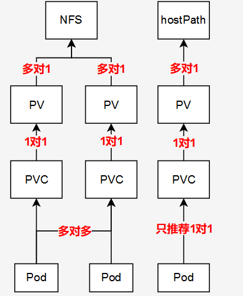

## 22.10 硬盘,PV,PVC,CSI,StorageClass,provisioner,pod关系

此处只针对动态制备PV流程来说，因为静态制备不涉及CSI和Storage、provisioner

流程图见：[22.3 PV和PVC使用、制备流程图（静态、动态）](#22.3 PV和PVC使用、制备流程图（静态、动态）)

+ **硬盘**即文件系统，如NFS，hostPath，cephFS 等等
+ **PV**直接关联到硬盘，类似于LVM的逻辑卷，**是一种抽象存储卷、抽象硬盘，用于直接消费**
+ **PVC**关联到**PV**，表示向PV申请资源的大小，是对存储资源的请求。
+ **CSI**（Container Storage Interface）是一种接口，描述动态制备PV的规范。其主要包含**CSI驱动和provisioner制备器**，用于制备PV。具体的实现如：[案例](#22.8.1 案例一)
+ **StorageClass**存储类，用于指明动态制备器。将PVC和provisioner关联起来。
+ **provisioner**制备器，创建PV的具体插件，一般以Pod形式存在。制备PV同时需要配置RBAC权限，否则无法获取集群内资源。
+ **Pod**消费者，直接在容器中消费PVC（内部已经配置好请求存储资源大小），从而无效关心PV的存在。

```shell
# 动态制备pv流程
pod-->PVC(请求大小)-->storageclass-->provisioner-->pv
```

# 23. Job

**Job 表示一次性任务（以Pod形式），运行完成后就会停止。**

Job 会创建一个或者多个 Pod，并将继续重试 Pod 的执行，直到指定数量的 Pod 成功终止。 随着 Pod 成功结束，Job 跟踪记录成功完成的 Pod 个数。 **当数量达到指定的成功个数阈值时，任务（即 Job）结束**。

 **删除 Job （kubectl delete）的操作会清除所创建的全部 Pod**。 

**挂起 Job （配置文件中suspend改为true）的操作会删除 Job 的所有活跃 Pod，直到 Job 被再次恢复执行**。

## 23.0 api文档

+ Job介绍文档：https://kubernetes.io/zh-cn/docs/concepts/workloads/controllers/job
+ Job api文档：https://kubernetes.io/zh-cn/docs/reference/kubernetes-api/workload-resources/job-v1/#Job

## 23.1 使用Job

+ 命令创建

  ```bash
  # 创建一个名字叫test-job-1的job，使用busybox镜像执行 date;sleep 60命令
  $ kubectl create job test-job-1 --image=192.168.31.79:5000/busybox:1.28.4 -- date;sleep 60
  # 创建一个名字叫test-job-2的job，其镜像等等配置信息来自于cronjob 一个定时job
  $ kubectl create job test-job-2 --from=test-cronjob-1
  ```

+ 配置文件创建

  ```yaml
  # https://kubernetes.io/docs/concepts/workloads/controllers/job/
  apiVersion: batch/v1
  kind: Job # 资源类型
  metadata:
    name: test-job-3 # job的名字
    namespace: default
    labels:
      app: test-job
  spec:
    parallelism: 2 # 控制Pod的并发数量(如当处理多文件时，会自动创建parallelism个pod来加速)
    # parallelism是针对该completions而言的，completions为几，job就会依据parallelism创建parallelism个并发pod,直到paralleism个成功的，最大尝试失败backoffLimit次
    completions: 2 # 指任务job应该运行并预期成功（即completed，pod的状态）完成的Pod个数.为空表示任何pod成功都视为job成功
    completionMode: "NonIndexed" # 默认 NoIndexed 即不要求每个pod都成功，但是最后成功个数必须大于等于completions。Indexed要求每个pod都成功
    backoffLimit: 5 # 指定标记此任务失败之前的最大尝试数，默认为6
    activeDeadlineSeconds: 10 # 系统尝试终止job前可以持续活跃的持续时间（从启动时间开始算）。必须为正整数。当任务被挂起后恢复，计数器会重置
    ttlSecondsAfterFinished: 3600 #表示任务完成后（成功或失败）多久后，自动将Pod删除。（不定义就不删除） 0表示立刻删除
    suspend: false # 是否暂停job，默认为false。true，挂起，不会创建pod。（从false变为true会删除所有Pod）
    #selector: # 对应Pod计数器completions，系统会自动添加匹配的,自己不要加会报错
    #  matchLabels:
    #    app: test-job-pod
    template: # Pod模板
      metadata:
        name: test-job-3-pod # pod的名字
        labels:
          app: test-job-pod
      spec:
        containers:
        - name: busybox # 容器名
          image: 192.168.31.79:5000/busybox:1.28.4
          command: ['sh', '-c', 'date;echo "ending..."']
        restartPolicy: OnFailure
        dnsPolicy: ClusterFirst
  ---
  ```

+ 验证

  ```bash
  # 查看job
  kubectl get job
  # 获取Pod状态
  kubectl get pod xxx
  # 查看Pod运行日志
  kubectl logs xxx
  ```

> [!Note]
>
>    **parallelism是针对该completions而言的，completions为几，job就会依据parallelism值创建parallelism个并发pod,直到paralleism个成功的，最大尝试失败backoffLimit次**

## 23.2 注意事项

+ **Job的完成个数（completions），就是指重复创建几个Pod（排除失败的）**。
+ `parallelism`表示可以并发创建几个pod
+ 每一个成功或失败Pod，都会执行同一条命令（即容器command）。
+ `completionMode`表示什么情况才认为是完成的
  + `NoIndexed` 不给每个Pod分配index号（可以看成id），只要最后成功完成的Pod等于`completions`即可 。**适合无状态的服务**
  + `Indexed` 不给每个Pod分配index号（可以看成id），只要最后成功完成的Pod等于`completions`即可 （**如果Pod失败了，不会新建index的值，而是在该index基础上重试**）。**适合有状态的服务**
+ `ttlSecondsAfterFinished`表示job执行完成（成功或失败）后，多少秒后自动删除pod。

# 23. CronJob

表示定时调度的Job，类似于Linux的crontab

CronJob 用于执行排期操作，例如备份、生成报告等。 一个 CronJob 对象就像 Unix 系统上的 **crontab**（cron table）文件中的一行。 它用 [Cron](https://zh.wikipedia.org/wiki/Cron) 格式进行编写， 并周期性地在给定的调度时间执行 Job。

> 注意：**自动调度的时间是基于master节点上kube-controller-manager的，默认时区也是给基于它。**

## 23.0 api文档

+ CronJob介绍文档： https://kubernetes.io/zh-cn/docs/concepts/workloads/controllers/cron-jobs/#writing-a-cronjob-spec
+ CronJob api文档：https://kubernetes.io/zh-cn/docs/reference/kubernetes-api/workload-resources/cron-job-v1/

## 23.1 时间表达式

```bash
    # linux是5位，没有秒概念
    ┌───────────── minute (0–59)
    │ ┌───────────── hour (0–23)
    │ │ ┌───────────── day of the month (1–31)
    │ │ │ ┌───────────── month (1–12)
    │ │ │ │ ┌───────────── day of the week (0–6) (Sunday to Saturday;
    │ │ │ │ │ 7 is also Sunday on some systems)
    │ │ │ │ │
    │ │ │ │ │
    * * * * * <command to execute>
```

- `\`表示转义
- 逗号（**`,`**）表示列举，例如： **`1,3,4,7 \* \* \* \* echo hello world`** 表示，在每小时的1、3、4、7分时，打印"hello world"。
- 连词符（**`-`**）表示范围，例如：**`1-6 \* \* \* * echo hello world`** ，表示，每小时的1到6分钟内，每分钟都会打印"hello world"。
- 星号（**`\*`**）代表任何可能的值。例如：在“小时域”里的星号等于是“每一个小时”。
- 百分号(**`%`**) 表示“每"。例如：**`\*%10 \* \* \* \* echo hello world`** 表示，每10分钟打印一回"hello world"。
- 斜杠(`/`)表示每过去。例如：**`\*/3 \* \* \* \* echo hello world`** 表示，每过去3，6，9，12,..分钟打印一次hello world。
- 问好(`?`)**只能用于星期**表示不关心，不指定，用于避免冲突。而星号`\*`为每个。

## 23.2 使用CronJob

+ 命令行创建

  ``` bash
  # 创建定时任务：名字是test-cronjob-1，表示每天每小时的0，5，15，..55分都执行命令date
  $ kubectl create cronjob test-cronjob-1 --image=192.168.31.79:5000/busybox:1.28.4 --schedule='0/5 * * * ?' -- date
  ```

+ 配置文件创建

  ```yaml
  # https://kubernetes.io/docs/concepts/workloads/controllers/cron-jobs/
  apiVersion: batch/v1
  kind: CronJob
  metadata:
    name: test-cronjob-2
    namespace: default
  spec:
    schedule: "*/1 * * * *" # 时间表达式:没过一分钟执行一次job
    #timeZone: "Asia/Shanghai" # 默认为kube-controller-manager的时区（1.23不支持）
    concurrencyPolicy: "Allow" # 是否允许并发执行。Allow、Forbid、Replace（上一个job没执行完结束，创建新的）
    startingDeadlineSeconds: 10 #当job因为某些原因错过预定时间，不超过该秒可以继续执行。错过的job的pod状态为失败
    suspend: false # 挂起后续的job，默认为false。
    successfulJobsHistoryLimit: 5 # 保留从成功作业（就是pod）数，默认为3.必须为正整数(0可以)
    failedJobsHistoryLimit: 2 # 保留失败状态的作业（就是Pod）数，默认为1，必须为正整数（0可以）
    jobTemplate: # Job模板,描述job
      spec:
        template: # pod模板.描述pod
          spec:
            containers:
            - name: busybox
              image: 192.168.31.79:5000/busybox:1.28.4
              args: ['/bin/sh', '-c', 'date; echo Hello from the Kubernetes cluster']
            restartPolicy: OnFailure
  ```

+ 验证

  ```bash
  # 查看cronjob
  kubectl get cronjob
  # 获取Pod状态
  kubectl get pod xxx
  # 查看Pod运行日志
  kubectl logs xxx
  # 查看自动调度细节
  kuebctl describe cj xxxx
  ```

# 24. InitContainer

在服务容器开始前执行，因为`postStart`钩子函数无法保证一定会在服务容器前执行，所以一些操作可以在InitContainer中执行。

> [!Note]
>
> + InitContainer执行完会退出（删除，不论是成功还是失败），否则会一直卡住。
> + InitContainer超过最大失败次数，就不会再启动服务容器，整个Pod将认为失败。、
> + Init 容器不支持 `lifecycle`、`livenessProbe`、`readinessProbe` 或 `startupProbe`
> + Init 容器与主应用容器共享资源（CPU、内存、网络），但不直接与主应用容器进行交互。 不过这些容器可以使用**共享卷进行数据交换**。
> + Init容器比服务容器先执行，多个Init容器的按照**从上到下**定义的顺序，顺序执行。（前一个成功执行完退出，后一个才会执行）。

## 24.0 api文档

+ InitContainer介绍文档：https://kubernetes.io/zh-cn/docs/concepts/workloads/pods/init-containers/
+ InitContainer api文档：https://kubernetes.io/zh-cn/docs/reference/kubernetes-api/workload-resources/pod-v1/#PodSpec

## 24.1 使用InitContainer

具体使用参考：[19.6 解决subPath单文件映射覆盖不可热更新问题](#19.6 解决subPath单文件映射覆盖不可热更新问题)


# 25. Taint(污点) 和Toleration(容忍)

参考文档：https://kubernetes.io/zh-cn/docs/concepts/scheduling-eviction/taint-and-toleration/

**Taint污点是作用于Node节点上的，效果就是该Node节点会排斥所有Pod（除非Pod定义有Toleration容忍该Taint污点）。**类似于给Node节点打标签Label，用于描述当前Node节点的状态如CPU受限、Memory告警等，告诉调度器不要将Pod放在该Node节点上运行。

**Toleration容忍应用于Pod上，用于告诉调度器当前Pod能接收哪些Taint污点，即可以把该Pod放到具有指定污点taint的node节点上。**注意：这不意味着具有指定taint污点的node节点比其他没有污点的节点调度pod有更高的优先级，实际上**具有任何taint污点的node节点和没有污点的node节点接收pod的优先级是一样**。如果想实现类似优先级的效果，试试节点亲和性（Node Affinity）

**污点和容忍度（Toleration）相互配合，可以用来避免 Pod 被分配到不合适的节点上**。 每个节点上都可以应用一个或多个污点，这表示对于那些不能容忍这些污点的 Pod， 是不会被该节点接受的。

> [!Note]
>
> + 污点代表拒绝，默认拒绝所有Pod ，除非你定义了容忍。
> + 如过一个节点有多个污点，那么需要pod需要容忍所有的污点，才能调度到该节点上
>
> 举个例子：如node1上有污点如gpu=yes，node2无污点。那么定义的pod中必须要有容忍该污点（gpu）的定义否则所有pod就只会调度到node2上。

## 25.1 effect污点的影响

`effect`表示具有污点的node节点对其上运行pod的影响。例如刚开始有pod在运行，后面才给node节点打上污点。

`effect`具有下面三类值：

+ `NoSchedule`(**不可调度**) 

  除非具有匹配的容忍度配置，否则**新的Pod**不会被调度到带有污点的节点上。（**打污点前已经运行的Pod不会被驱逐**）

+ `NoExecute`（**驱逐**）

  主要用来表示正在节点上运行的节点，按配置又可以分为下面三种：

  + **Pod配置没有容忍该类污点**，则pod马上被驱逐
  + **Pod配置有容忍该类污点，但是没有指定容忍的属性**`tolerationSeconds`，则pod会一直在节点上运行
  + **Pod配置有容忍该类污点，且指定了容忍的属性**`tolerationSeconds`，那么pod会在该Node节点上运行`tolerationSeconds`秒，然后被驱逐。（驱逐后pod有可能被重新调度到该节点，然后再驱逐，依次往返....）

+ `PreferNoSchedule`（**倾向不可调度**）

  即控制面板master尽可能不将Pod运行具有该effect效果的Node上，但是不能完全保证会避免。

## 25.1 taint污点的使用

```bash
# 1.给k8s-node2节点添加污点memory，并指明影响为NoSchedule
$ kubectl taint node k8s-node2 memory=low:NoSchedule #
# 2.查看k8s-node2节点上污点
$ kubectl describe node k8s-node2|grep Taint # 只能看到一行，多行去掉grep
# 3.删除k8s-node2上的污点 memory=low:NoSchedule(删掉就是后面加一个-)
$ kubectl taint node k8s-node2 memory=low:NoSchedule- # 删除label标签也是这样
```

## 25.2 toleration容忍的使用

1. 给k8s-node2打上污点 `app=low:NoSchedule`

   ```bash
   # NoSchedule不影响已经运行的pod
   $ kubectl taint node k8s-node2 cpu=low:NoSchedule
   ```

   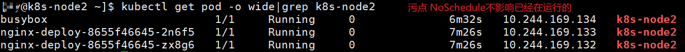

2. 创建Pod，发现新Pod无论如总是只允许在k8s-node1上（Pod中未配置容忍）

3. 给k8s-node2打上污点 `memory=minimal:NoExcute`

   ```bash
   # NoExcute影响已经在运行的Pod
   $ kubectl taint node k8s-node2 memory=minimal:NoExecute
   ```

4. 观察k8s-node2上pod，发现都被删掉了（**因为默认pod没有任何容忍**）

   

   打上两个污点后发现都没有了，**已完成的，失败的，运行中都迁移到k8s-node1上了**（busybox是单纯的pod没有重启，所以也不会迁移到k8s-node1）

5. 创建Pod（或者修改已存在的deploy，daemonset等），添加容忍1`cpu=low:NoSchedule` 容忍2`memory=minimal:NoExecute`

   **容忍是配置在Pod中的，和containers同级别**

   ```yaml
   # https://kubernetes.io/docs/concepts/workloads/pods/
   apiVersion: v1
   kind: Pod
   metadata:
     name: "test-taint-1"
     namespace: default
     labels:
       app: "test-taint"
   spec:
     tolerations: # 匹配的容忍，三元组
     - key: cpu # node污点的名字
       operator: Equal # 动作，有Equal（默认）和Exists（类似于通配符，匹配任何value）。
       value: low #node污点cpu的值 （如果operator为Exists，value应该留空）
       effect: "" # 匹配污点的effect。空值表示匹配所有effect,有NoSchedule，NoExecute，PreferNoSchedule。
       #tolerationSeconds: 30 # 当effect为NoExecute该字段才有效，表示运行Pod在node节点上运行多久才会被驱逐（后面又可能再次被调度运行该pod）
     - key: memory 
       operator: Exists # 动作，有Equal（默认）和Exists（类似于通配符，匹配任何value）。
       # value: low #operator为Exists，value应该留空
       effect: NoExecute # （如果配置了tolerationSeconds则effect必须为NoExecude）。NoExecute表示驱逐
       tolerationSeconds: 30 # 当表示运行Pod在node节点上运行30秒后才会被驱逐（如果是deployment类型后面又可能再次被调度运行该pod）
     containers:
     - name: busybox
       image: 192.168.31.79:5000/busybox:1.28.4
       command: ["sh","-c"," sleep 60"]
       resources: {}
     restartPolicy: Never
   ```

6. 验证Pod可以创建到k8s-node2上

   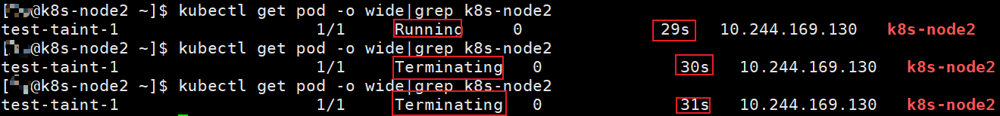

> [!Attention]
>
> 1. **如果Node具有多个污点，如果想让Pod调度在该节点上，则该Pod必须容忍所有的污点**
> 2. 如果是Deployment，StatefulSet等类型，配置了`effect=NoExecute`和`tolerationSeconds`那么pod会在node节点上运行`tolerationSeconds`秒后将其移除，但是后面有可能会再次调度到该节点上，依次持续下去


# 26. Affinity亲和力

> [!Tip]
>
> 1. **NodeAffinity节点亲和力基于label标签（node节点）**
> 2. **PodAffinity和PodAntiAffinity基于Pod拓扑分布约束(很轻微，其实就是node标签)和pod节点的abel标签（筛选pod）**

亲和力指节点亲和力，**它是Pod的一种属性（在Pod配置文件中配置）**使得Pod能够被吸引到具有一类特点的节点上。这可能处于一种偏好，也可能是硬性要求。（与污点相反）

你可以约束一个 [Pod](https://kubernetes.io/zh-cn/docs/concepts/workloads/pods/) 以便**限制**其只能在特定的[节点](https://kubernetes.io/zh-cn/docs/concepts/architecture/nodes/)上运行， 或优先在特定的节点上运行。有几种方法可以实现这点， 推荐的方法都是用[标签选择算符](https://kubernetes.io/zh-cn/docs/concepts/overview/working-with-objects/labels/)来进行选择。 通常这样的约束不是必须的，因为调度器将自动进行合理的放置（比如，将 Pod 分散到节点上， 而不是将 Pod 放置在可用资源不足的节点上等等）。但在某些情况下，你可能需要进一步控制 Pod 被部署到哪个节点。例如，确保 Pod 最终落在连接了 SSD 的机器上， 或者将来自两个不同的服务且有大量通信的 Pod 被放置在同一个可用区。

你可以使用下列方法中的任何一种来选择 Kubernetes 对特定 Pod 的调度：

- 与[节点标签](https://kubernetes.io/zh-cn/docs/concepts/scheduling-eviction/assign-pod-node/#built-in-node-labels)匹配的 [nodeSelector](https://kubernetes.io/zh-cn/docs/concepts/scheduling-eviction/assign-pod-node/#nodeSelector)
- [亲和性与反亲和性](https://kubernetes.io/zh-cn/docs/concepts/scheduling-eviction/assign-pod-node/#affinity-and-anti-affinity)
- [nodeName](https://kubernetes.io/zh-cn/docs/concepts/scheduling-eviction/assign-pod-node/#nodename) 字段
- [Pod 拓扑分布约束](https://kubernetes.io/zh-cn/docs/concepts/scheduling-eviction/assign-pod-node/#pod-topology-spread-constraints)

## 26.0 api文档

+ 介绍文档 https://kubernetes.io/zh-cn/docs/concepts/scheduling-eviction/assign-pod-node/
+ NodeAffinity api文档：https://kubernetes.io/zh-cn/docs/reference/kubernetes-api/workload-resources/pod-v1/#NodeAffinity
+ PodAffinity api文档：https://kubernetes.io/zh-cn/docs/reference/kubernetes-api/workload-resources/pod-v1/#PodAffinity
+ PodAntiAffinity api文档：https://kubernetes.io/zh-cn/docs/reference/kubernetes-api/workload-resources/pod-v1/#PodAntiAffinity

## 26.1 operator操作符

对于NodeAffinity中`nodeSelector`和PodAffinity中`labelSelector`、PodAntiAffinity中`labelSelector`基于标签的选择器，操作符operator都具有以下操作：

|            操作符            |                行为                | 适用于                                                       |
| :--------------------------: | :--------------------------------: | ------------------------------------------------------------ |
|      `In`(首字母要大写)      |    标签值存在于提供的字符串集中    | nodeSelector（NodeAffinity）<br />labelSelector （PodAffinity, PodAntiAffinity） |
|    `NotIn`(首字母要大写)     |   标签值不包含在提供的字符串集中   | nodeSelector（NodeAffinity）<br />labelSelector （PodAffinity, PodAntiAffinity） |
|    `Exists`(首字母要大写)    |      对象上存在具有此键的标签      | nodeSelector（NodeAffinity）<br />labelSelector （PodAffinity, PodAntiAffinity） |
| `DoesNotExist`(首字母要大写) |     对象上不存在具有此键的标签     | nodeSelector（NodeAffinity）<br />labelSelector （PodAffinity, PodAntiAffinity） |
|      `Gt`(首字母要大写)      | 字段值将被解析为整数，greater than | nodeSelector（NodeAffinity）                                 |
|      `Lt`(首字母要大写)      |  字段值将被解析为整数，less than   | nodeSelector（NodeAffinity）                                 |

## 26.2 k8s支持的核心字段(matchFields)

### 节点支持的 `matchFields` 字段：

- `metadata.name`：节点的名称。
- `spec.unschedulable`：节点是否被标记为不可调度（用于手动设置节点为不可调度状态）。
- `status.phase`：Pod 的当前状态，常见状态包括：
  - `Running`：节点正在运行并且健康。
  - `Pending`：节点未就绪。
  - `Terminating`：节点正在终止。
  - `Unknown`：节点状态未知。

### Pod 支持的 `matchFields` 字段：

- `metadata.name`：Pod 的名称。
- `metadata.namespace`：Pod 所在的命名空间。
- `spec.nodeName`：Pod 所调度到的节点的名称。
- `status.phase`：Pod 的当前状态，常见状态包括：
  - `Pending`：Pod 正在等待调度。
  - `Running`：Pod 正在运行。
  - `Succeeded`：Pod 已成功完成。
  - `Failed`：Pod 已失败。
  - `Unknown`：Pod 状态未知。

## 26.3 亲和力两种类型

**无论是NodeAffinity，PodAffinity还是PodAntiAffinity都具有以下两种类型（属性）：**

- `requiredDuringSchedulingIgnoredDuringExecution`： 调度器只有在规则被满足的时候才能执行调度。此功能类似于 `nodeSelector`， 但其语法表达能力更强。（**必须满足**）
- `preferredDuringSchedulingIgnoredDuringExecution`： 调度器会尝试寻找满足对应规则的节点。如果找不到匹配的节点，调度器仍然会调度该 Pod。（**倾向于满足，但是可以不满足**）

> [!Note]
>
> 在上述类型中，`IgnoredDuringExecution` 意味着如果**节点标签（不是affinity）**在 Kubernetes 调度 Pod 后发生了变更，**Pod 仍将继续运行**。**更新了affinity,pod会立即发送变化**，除了pod类型直接创建的。

## 26.4 NodeAffinity 节点亲和力

> [!Attention]
>
> 1. 根据已存在的node节点上label标签，决定新 Pod 应该调度到具有特定标签的node节点上。（**根据标签选择node**）
> 2. 通过操作符动作`NotIn`和`DoesNotExist`实现node节点的反亲和性

**下面Pod使用的nodeAffinity实现的效果：**

1. node节点必须有标签`kubernetes.io/os=linux`
2. node节点必须有标签`type=microservices`
3. 优先选择具有`label-2=value-2`标签的节点（权重99）
4. 其次选择具有`label-1=value1`标签的节点（权重10）
5. 如果3，4要求都无法满足，则根据内部算法选择一个节点（**必须满足1，2**）运行pod

```yaml
# https://kubernetes.io/docs/concepts/workloads/pods/
apiVersion: v1
kind: Pod
metadata:
  name: "node-affinity-pod"
  namespace: default
  labels:
    app: "node-affinity"
spec:
  affinity: # 亲和力
    nodeAffinity: # 使用节点亲和力
      requiredDuringSchedulingIgnoredDuringExecution: # node节点必须要满足的条件
        nodeSelectorTerms: # 使用的nodeSelector(node标签)
          - matchExpressions:
              - key: kubernetes.io/os # 这个node标签是k8s自动给所有集群内linux机器打上的
                operator: In # 首字母要大写
                values: 
                - linux
              - key: type # 这个node标签是我们手动添加的(用下面的matchFields获取内置信息代替这个)
                operator: In
                values: ["microservices"]
                
      preferredDuringSchedulingIgnoredDuringExecution:
      - weight: 99 #权重,表示优先级(权重值越高,优先级越高)
        preference:
          matchExpressions:
          - key: label-2
            operator: In # 如果此处变为NotIn，那么就是优先不匹配label-2=value-2的节点
            values:
            - value-2
      - weight: 10
        preference:
          matchLabels:
            label-1: value-1
  containers:
  - name: busybox
    image: 192.168.31.79:5000/busybox:1.28.4
    command: ["sh","-c"," sleep 3600"]
    resources: {}
  restartPolicy: Always
```

**调整：将**`In value-2`**改为**`NotIn value-2`则节点就有些落到满足`label-1=value-1`的节点（当然不是能绝对避免`label-2=value-2`）

## 26.5 PodAffinity Pod亲和力

> [!Attention]
>
> 1. 根据已经存在的 Pod 标签，将新 Pod 调度到具有特定标签的、**已有 Pod 所在的node节点上或所属区域的node节点**。（**根据现有pod选择node，同一节点或同一区域**）
> 2. Pod反亲和力依赖于**Pod的拓扑topology分布约束(很轻微，其实就是node标签)**。参见[27. Pod拓扑分布约束](#27. Pod拓扑约束)

**1. 演示操作前，需要给node节点添加特殊标签即topology拓扑属性**

```bash
# 1.剪去k8s-master上的所有污点（k8s-node1和k8s-node2上的在nodeAffinity中已经去除了）
$ kubectl taint node k8s-master node-role.kubernetes.io/master:NoSchedule-
# 2.给k8s-master k8s-node1 k8s-node2添加拓扑标签
$ kubectl label no k8s-master topology.kubernetes.io/zone=R # 表示master节点在拓扑区域R中
$ kubectl label no k8s-node1 k8s-node2 topology.kubernetes.io/zone=V # 表示node1，node2节点在拓扑区域V中

# 3.查看现有pod的标签
$ kubectl get pod -o wide --show-labels
NAME                            READY   STATUS    RESTARTS       AGE     IP               NODE         NOMINATED NODE   READINESS GATES   LABELS
NAME                                  READY   STATUS    RESTARTS   AGE   IP               NODE        NOMINATED NODE   READINESS GATES   LABELS
s1-topology-deploy-599bcfb5c8-2fg5p   1/1     Running   0          76s   10.244.36.108    k8s-node1   <none>           <none>            app=nginx,pod-template-hash=599bcfb5c8,security=s1
s2-topology-deploy-56fc59585c-qkn8j   1/1     Running   0          72s   10.244.169.169   k8s-node2   <none>           <none>            app=nginx,pod-template-hash=56fc59585c,security=s2
```

**2. 创建定义了拓扑分布约束的deploy-1（给下面PodAffinity演示使用）**

deployment-1 配置文件如下:(**可以不配置topology,只要有指定node标签即可**)

```yaml
# https://kubernetes.io/docs/concepts/workloads/controllers/deployment/
apiVersion: apps/v1
kind: Deployment
metadata:
  name: s1-topology-deploy
  namespace: default
  labels:
    app: topology-deploy
spec:
  selector:
    matchLabels:
      app: nginx
  replicas: 1
  template:
    metadata:
      labels:
        app: nginx
        security: s1
    spec: #topology拓扑分布约束
      # topologySpreadConstraints:
      # - maxSkew: 1
      #   topologyKey: topology.kubernetes.io/zone
      #   whenUnsatisfiable: DoNotSchedule
      #   labelSelector:
      #     matchLabels:
      #       app: nginx
      containers:
      - name: nginx
        image: 192.168.31.79:5000/nginx:latest
        imagePullPolicy: IfNotPresent
        resources: {}
      restartPolicy: Always
```

deployment-2 配置文件如下:(**可以不配置topology,只要有指定node标签即可**)

```yaml
# https://kubernetes.io/docs/concepts/workloads/controllers/deployment/
apiVersion: apps/v1
kind: Deployment
metadata:
  name: s2-topology-deploy
  namespace: default
  labels:
    app: topology-deploy
spec:
  selector:
    matchLabels:
      app: nginx
  replicas: 1
  template:
    metadata:
      labels:
        app: nginx
        security: s2
    spec: #topology拓扑分布约束
      # topologySpreadConstraints:
      # - maxSkew: 1
      #   topologyKey: topology.kubernetes.io/zone
      #   whenUnsatisfiable: DoNotSchedule
      #   labelSelector:
      #     matchLabels:
      #       app: nginx
      containers:
      - name: nginx
        image: 192.168.31.79:5000/nginx:latest
        imagePullPolicy: IfNotPresent
        resources: {}
      restartPolicy: Always
```

**3. 定义deploy演示效果：**

1. ***新Pod和匹配的已有Pod在同一node节点上运行*** （单节点概念）

   由于PodAffinity的`topologyKey=kubernetes.io/hostname`(node标签)，每个节点都有唯一的`kubernetes.io/hostname`值，所以根据此将新pod放在已运行节点上（通过pod标签`app=nginx`和`security=s1`定位）

   **效果：三个Pod全运行在node1节点上(多次删除依旧是这样)**

   1. 根据`app=nginx,security=s1`且命名空间为default找到pod `s1-topology-deploy`及其所在节点node1
   2. 根据reqired配置的`topologyKey=kubernetes.io/hostname`，查看node1节点 标签`kubernetes.io/hostname`发现其值为`k8s-node1`
   3. 找出集群内所有具有`kubernetes.io/hostname=k8s-node1`标签的节点为只有node1
   4. 没配置preferred偏好，跳过
   5. 尝试将所有副本数pod放在node1节点上,且放置成功(当然也有可能放置不成功，而换到其他节点上：如有污点，偏好机器上cpu和内存等压力高)
   6. 多次删除这些pod发现还是会部署在node1节点上

   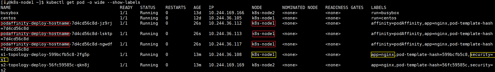

   ```yaml
   # https://kubernetes.io/docs/concepts/workloads/controllers/deployment/
   apiVersion: apps/v1
   kind: Deployment
   metadata:
     name: podaffinity-deploy-hostname
     namespace: default
     labels:
       app: podaffinity-deploy-hostname
   spec:
     selector:
       matchLabels:
         app: nginx
         affinity: podAffinity
     replicas: 3
     template:
       metadata:
         labels:
           app: nginx
           affinity: podAffinity
       spec:
         affinity:
           podAffinity: #定义节点亲和力
             requiredDuringSchedulingIgnoredDuringExecution: # 必须要满足的条件
             - topologyKey: "kubernetes.io/hostname" #表示同一节点(必填,为node标签)
               namespaces: [default]
               labelSelector: # 定位已存在的pod
                 matchLabels:
                   app: nginx
                   security: s1
            # 都具体某个节点了就没必要再定义preferredDuringSchedulingIgnoredDuringExecution
         containers:
         - name: nginx
           image: 192.168.31.79:5000/nginx:latest
           resources: {}
         restartPolicy: Always
   ```

   

   

2. ***新Pod和匹配的已有Pod在同一标签区域内的节点上运行*** （一个区域内所有节点概念）

   例如node标签`kubernetes.io/os=linux`表示**所有有该标签的node都会被调度到（不单单是匹配到的pod所在的节点）**

   **效果：**

   1. 根据`app=nginx,security=s1`且命名空间为default找到pod `s1-topology-deploy`及其所在节点node1

   2. 根据reqired配置的`topologyKey=kubernetes.io/os`，查看node1节点 标签`kubernetes.io/os`发现其值为`linux`

   3. 找出集群内所有具有`kubernetes.io/os=linux`标签的节点为：master，node1，node2

   4. 根据preferred配置权重匹配排序，优先匹配

      + 权重50，优先放在指定pod所在的node节点（pod所在命名空间为kube-system，具有标签`component=kube-apiserver`），找到为master节点
      + 权重50，次优先放在指定pod所在的node节点（pod所在命名空间为default，具有标签`security=s2`），找到为node2节点

   5. 由于副本数有两个，尝试将pod一个放在master节点，一个放在node2节点上

   6. 放置成功 (当然也有可能放置不成功，而换到其他节点上：如有污点，偏好机器上cpu和内存等压力高)

   7. 多次删除这两个pod，发现总是部署在master和node2上

      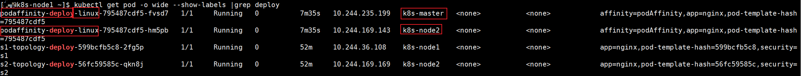

   ```yaml
   # https://kubernetes.io/docs/concepts/workloads/controllers/deployment/
   apiVersion: apps/v1
   kind: Deployment
   metadata:
     name: podaffinity-deploy-linux
     namespace: default
     labels:
       app: podaffinity-deploy-linux
   spec:
     selector:
       matchLabels:
         app: nginx
         affinity: podAffinity
     replicas: 2
     template:
       metadata:
         labels:
           app: nginx
           affinity: podAffinity
       spec:
         affinity:
           podAffinity: #定义节点亲和力
             requiredDuringSchedulingIgnoredDuringExecution: # 必须要满足的条件
             - topologyKey: "kubernetes.io/os" #表示同一域(必填,为node标签)
               #namespaces: [default]
               namespaceSelector: # 定位namespace的另一个方法，通过ns的label标签
                 matchExpressions: 
                   - key: kubernetes.io/metadata.name
                     operator: In
                     values: ["default"]
               labelSelector: # 定位已存在的pod
                 matchExpressions:
                 - key: app
                   operator: In
                   values:
                   - nginx
                 - key: security # 定位到pod s1-topology-deploy所在的域下所有节点
                   operator: In
                   values:
                   - s1
             preferredDuringSchedulingIgnoredDuringExecution: # 优先满足的条件（满足最好不满足也行）
             - podAffinityTerm: #权重50 优先匹配这个node
                 topologyKey: "kubernetes.io/hostname"
                 labelSelector: 
                   matchExpressions:
                   - key: component
                     operator: In
                     values: ["kube-apiserver"] # 具有security=s1或security=s2标签的pod所在的node
                 namespaces: ["kube-system"]
               weight: 50
             - podAffinityTerm: #权重50 优先匹配这个node
                 topologyKey: "kubernetes.io/hostname"
                 labelSelector: 
                   matchExpressions:
                   - key: security
                     operator: In
                     values: ["s2"] # 具有security=s2标签的pod所在的node
                 namespaces: ["default"]
               weight: 50
         containers:
         - name: nginx
           image: 192.168.31.79:5000/nginx:latest
           resources: {}
         restartPolicy: Always
   ```

> [!Attention|style:flat] 
>
> ***超级重要：***
>
> 具体是将新Pod放在和现有Pod(基于pod标签匹配的)所在同一节点还是同一区域依赖于`topologyKey`的值：
>
> + 如果PodAffinity中的`topologyKey=kubernetes.io/hostname`那么就是**匹配到同一节点**
>
> + 如果PodAffinity中的`topologyKey=kubernetes.io/zone`那么就是**匹配到同一可用区节点**
>
>   也就是说，新Pod会放在已有pod所在zone中**所有node的节点的任意一个（具体哪个看调度），而不是和他同一个节点**
>
> + 如果PodAffinity中的`kubernetes.io/os=linux`那么就是**匹配到同一操作系统内节点**
>
>   也就是说，新Pod会放在已有pod所在linux中**所有node的节点的任意一个（具体哪个看调度），而不是和他同一个节点**
>
> **总结：由上面我们可以看出**
>
> 1. **topologyKey的值就是node节点标签的键，任意写（也可以自定义）**
> 2. **具体新pod运行在哪个节点上取决于一个标签中node的数量（如kubernetes.io/os，只要都是linux都会被调度到）**

## 26.6 PodAntiAffinity Pod反亲和力

> [!Attention]
>
> 1. 根据已经存在的 Pod 标签，用于避免将新 Pod 调度到具有特定标签的、 已有Pod 所在的node节点上。（**根据现有pod排除node，不同节点**）
> 2. Pod反亲和力依赖于**Pod的拓扑ttopology分布约束(很轻微，其实就是node标签)**。参见[27. Pod拓扑分布约束](#27. Pod拓扑约束)

**效果：**

1. 根据`app=nginx`且命名空间为default找到pod `s1-topology-deploy`和`s2-topology-deploy`及其所在节点node1,node2
2. 根据reqired配置的`topologyKey`的值，即节点node1,node2标签`topology.kubernetes.io/zone`获取到他们的值都为`V`
3. 由于此策略是反着来的，所以需要将**集群中所有标签**`topology.kubernetes.io/zone=V`**的节点排除掉**（即排除node1,node2）,那么此时集群中只有一个node了master
4. 根据preferred配置的规则**尝试排除**匹配的节点
   + `component=kube-apiserver`且命名空间为kube-system,找到内置组件`kube-apiserver-k8s-master`，及其所在节点master
   + 根据preferred中配置的`topology=topology.kubernetes.io/hostname`,查询master节点对应的标签值`topology.kubernetes.io/hostname=k8s-master`
   + 尝试尽可能的排除集群内所有具有该标签`topology.kubernetes.io/hostname=k8s-master`的节点（只有一个master）
   + 尝试排除master节点失败，**因为根据required中配置，反向匹配只有一个匹配的节点master，这是必须满足的**，而此处尝试排除master自然失败
5. 所有pod副本全部部署在master节点上
6. 多次删除pod副本，发现最后运行的节点还是master

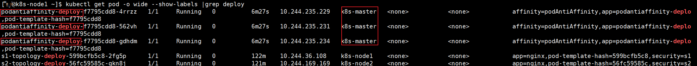

```yaml
# https://kubernetes.io/docs/concepts/workloads/controllers/deployment/
apiVersion: apps/v1
kind: Deployment
metadata:
  name: podantiaffinity-deploy
  namespace: default
  labels:
    app: podantiaffinity-deploy
spec:
  selector:
    matchLabels:
      app: podantiaffinity-deploy
      # app: nginx # 不能再加 app: nginx因为这个是基于排除法(否则所有node上都至少有一个pod其标签app=nginx了,就找不到适合的节点了)
      affinity: podAntiAffinity
  replicas: 3
  template:
    metadata:
      labels:
        app: podantiaffinity-deploy
        # app: nginx  # 不能再加 app: nginx因为这个是基于排除法(否则所有node上都至少有一个pod其标签app=nginx了,就找不到适合的节点了)
        affinity: podAntiAffinity
    spec:
      affinity:
        podAntiAffinity: # 排除满足pod的node所在区域内的所有node
          requiredDuringSchedulingIgnoredDuringExecution: # 必须满足的排除条件
          - topologyKey: topology.kubernetes.io/zone
            labelSelector:
              matchLabels:
                app: nginx
            namespaces: [default]
          preferredDuringSchedulingIgnoredDuringExecution: # 最好满足的排除条件，可以不满足
          - podAffinityTerm: # 权重10，最好能排除的node，但不强制
              topologyKey: topology.kubernetes.io/hostname
              labelSelector:
                matchLabels:
                  component: "kube-apiserver" # 根据pod标签查找匹配pod，进而排除所在的节点或区域
              namespaces: ["kube-system"]
            weight: 100
      containers:
      - name: nginx
        image: 192.168.31.79:5000/nginx:latest
        resources: {}
      restartPolicy: Always
```


# 27. Pod拓扑分布约束

**拓扑分布约束（Topology Spread Constraints）** 来控制 [Pod](https://kubernetes.io/zh-cn/docs/concepts/workloads/pods/) 在集群内故障域之间的分布， 例如区域（Region）、可用区（Zone）、节点和其他用户自定义拓扑域。 这样做有助于实现高可用并提升资源利用率。

## 27.0 api文档

+ 介绍文档：https://kubernetes.io/zh-cn/docs/concepts/scheduling-eviction/topology-spread-constraints/#cluster-level-default-constraints
+ api文档：https://kubernetes.io/zh-cn/docs/reference/kubernetes-api/workload-resources/pod-v1/#%E8%B0%83%E5%BA%A6

## 27.1 动机

假设你有一个最多包含二十个节点的集群，你想要运行一个自动扩缩的 [工作负载](https://kubernetes.io/zh-cn/docs/concepts/workloads/)，请问要使用多少个副本？ 答案可能是最少 2 个 Pod，最多 15 个 Pod。 当只有 2 个 Pod 时，你倾向于这 2 个 Pod 不要同时在同一个节点上运行： 你所遭遇的风险是如果放在同一个节点上且单节点出现故障，可能会让你的工作负载下线。

除了这个基本的用法之外，还有一些高级的使用案例，能够让你的工作负载受益于高可用性并提高集群利用率。

随着你的工作负载扩容，运行的 Pod 变多，将需要考虑另一个重要问题。 假设你有 3 个节点，每个节点运行 5 个 Pod。这些节点有足够的容量能够运行许多副本； 但与这个工作负载互动的客户端分散在三个不同的数据中心（或基础设施可用区）。 现在你可能不太关注单节点故障问题，但你会注意到延迟高于自己的预期， 在不同的可用区之间发送网络流量会产生一些网络成本。

你决定在正常运营时倾向于将类似数量的副本[调度](https://kubernetes.io/zh-cn/docs/concepts/scheduling-eviction/) 到每个基础设施可用区，且你想要该集群在遇到问题时能够自愈。

Pod 拓扑分布约束使你能够以声明的方式进行配置。

## 27.2 pod之topologySpreadConstraints配置

```yaml
apiVersion: v1
kind: Pod
metadata:
  name: example-pod
spec:
  # 配置一个拓扑分布约束
  topologySpreadConstraints: 
    - maxSkew: <integer>
      minDomains: <integer> # 可选
      topologyKey: <string>
      whenUnsatisfiable: <string>
      labelSelector: <object>
      matchLabelKeys: <list> # 可选；自从 v1.27 开始成为 Beta
      nodeAffinityPolicy: [Honor|Ignore] # 可选；自从 v1.26 开始成为 Beta
      nodeTaintsPolicy: [Honor|Ignore] # 可选；自从 v1.26 开始成为 Beta
  ### 其他 Pod 字段置于此处
```

+ `maxSkew` **描述这些Pod可能被不均匀分布的程度（必须大于0）**。计算方法：*两个zone或region区域pod数量的差值*。

  该值随着`whenUnsatisfiabel`的值而变化：

  + 当`whenUnsatisfiable=DoNotSchedule`时，则maxSkew定义目标拓扑中匹配Pod的数量与**全局最小值**之间的最大允许差值。 
  + 当`whenUnsatisfiable=ScheduleAnyway`时，则该调度器会更为偏向能够降低偏差值的拓扑域。（即追求平衡）

+ `miniDomains` **表示符合条件的域的最小数量**，可选。

  目的是确保在特定数量的拓扑域中分布 Pod，以便在这些域之间实现冗余和高可用性。

  假设有一个包含 3 个可用区（zone1、zone2、zone3）的集群，`minDomains=2` 意味着调度器至少要在 2 个不同的可用区中分布 Pod。如果某个区域内已经放置了足够多的 Pod，调度器会尝试将新 Pod 调度到另一个可用区。

+ `topologyKey` **是node节点label标签的键（如果为zone表示按照zone来计算，如果是region表示按照region来计算）** 

  **如果node节点使用此键标记并且具有相同的标签值，则认为这些节点视为处于同一拓扑域中。**我们将拓扑域中（键值对）的每个实例成为一个域。调度器将尝试在每个拓扑域中放置数量均衡的Pod。另外，我们将符合条件的域定义为其节点满足nodeAffinityPolicy和nodeTaintsPolicy要求的域。

+ `whenUnsatisfiable` **指示如果Pod不满足分布约束时如何处理**

  可选项

  + `DoNotSchedule`（**默认**）告诉调度器不要调度
  + `ScheduleAnyway` 告诉调度器仍然继续调度，只是根据如何能将偏差最小化来对节点进行排序。

+ `labelSelector` **用于查找匹配的Pod，统计对应拓扑域中Pod的数量**

+ `matchLabelKeys` **Pod标签label键的列表，用于选择需要计算分布方式的Pod集合**

  > `matchLabelKeys` 和 `labelSelector` 中禁止存在相同的键。未设置 `labelSelector` 时无法设置 `matchLabelKeys`。

+ `nodeAffinityPolicy` **表示我们在计算Pod拓扑分布偏差时将如何处理Pod的nodeAffinity或nodeSelector**

  可选项：

  + `Honor` 只有与nodeAffinity或nodeSelector匹配的节点才会包括到计算中
  + `Ignore` nodeAffinity或nodeSelector被忽略，即所有节点均包括到计算中。

+ `nodeTaintsPolicy` **表示我们在计算Pod拓扑分布偏差时将如何处理节点污点**

  可选项：

  + `Honor` 包括不带污点的节点以及污点被新Pod所容忍的节点
  + `Ignore` 节点污点被忽略，即包括所有节点。

> 如果 Pod 定义了 `spec.nodeSelector` 或 `spec.affinity.nodeAffinity`， 调度器将在偏差计算中跳过不匹配的节点。

## 27.3 节点标签

**拓扑分布约束依赖于节点标签来标识每个[节点](https://kubernetes.io/zh-cn/docs/concepts/architecture/nodes/)所在的拓扑域。**（意思需要给每个node节点添加域标签）

如：`topology.kubernetes.io/zone`，`topology.kubernetes.io/region`

```bash
# 1.给node节点添加域标签,用于区分可用区
$ kubectl label node k8s-node1 k8s-node2 topology.kubernetes.io/zone=V
$ kubectl label node k8s-master topology.kubernetes.io/zone=R
```

那么，从逻辑上看集群如下：

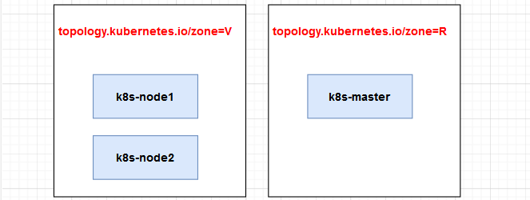

## 27.4 一致性

你应该为一个组中的所有 Pod 设置相同的 Pod 拓扑分布约束。

通常，如果你正使用一个工作负载控制器，例如 Deployment，则 Pod 模板会帮你解决这个问题。 如果你混合不同的分布约束，则 Kubernetes 会遵循该字段的 API 定义； 但是，该行为可能更令人困惑，并且故障排除也没那么简单。

你需要一种机制来确保拓扑域（例如云提供商区域）中的**所有节点具有一致的标签**。 为了避免你需要手动为节点打标签，大多数集群会自动填充知名的标签， 例如 `kubernetes.io/hostname`。检查你的集群是否支持此功能


## 27.5 拓扑分布约束示例

### 27.5.1 一个拓扑分布约束

假设你拥有一个 4 节点集群，其中标记为 `foo: bar` 的 3 个 Pod 分别位于 node1、node2 和 node3 中：


如果你希望新来的 Pod 均匀分布在现有的可用区域，则可以按如下设置其清单：

```yaml
apiVersion: v1
kind: Pod
metadata:
  name: "one-topology-pod"
  namespace: default
  labels:
    app: "one-topology-pod"
    foo: bar # 新pod不添加，可以成功放入，但是计算的偏差不会发生变化（该pod被忽略了）
spec:
  topologySpreadConstraints:
  - maxSkew: 1
    topologyKey: topology.kubernetes.io/zone #按照zone来计算
    whenUnsatisfiable: DoNotSchedule # 如果不满足分布约束就不要调度该pod
    labelSelector: # 用于选择哪些pod用于计算分布平衡
      matchExpressions:
        - key: foo
          operator: in
          values: ["bar"]
  containers:
  - name: debian
    image: "debian-slim:latest"
```

从此清单看，`topologyKey: zone` 意味着均匀分布将只应用于存在标签键值对为 `zone: <any value>` 的节点 （没有 `zone` 标签的节点将被跳过）。如果调度器找不到一种方式来满足此约束， 则 `whenUnsatisfiable: DoNotSchedule` 字段告诉该调度器将新来的 Pod 保持在 pending 状态。

如果该调度器将这个新来的 Pod 放到可用区 `A`，则 Pod 的分布将成为 `[3, 1]`。 这意味着实际偏差是 2（计算公式为 `3 - 1`），这违反了 `maxSkew: 1` 的约定。 为了满足这个示例的约束和上下文，新来的 Pod 只能放到可用区 `B` 中的一个节点上：

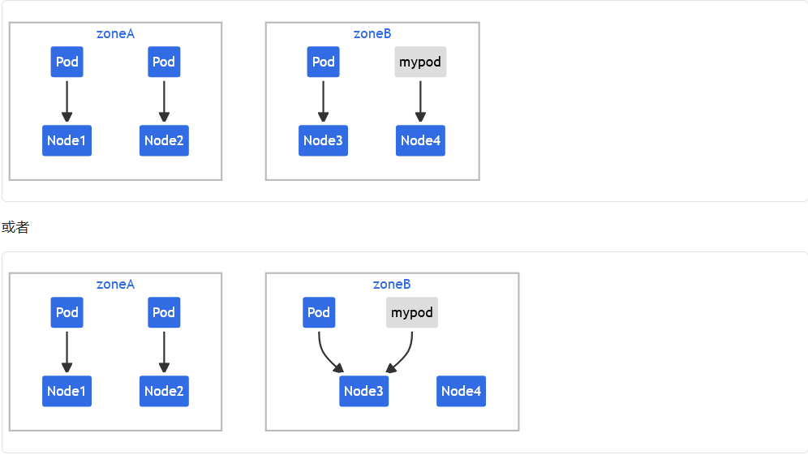

你可以调整 Pod 规约以满足各种要求：

- 将 `maxSkew` 更改为更大的值，例如 `2`，这样新来的 Pod 也可以放在可用区 `A` 中。
- 将 `topologyKey` 更改为 `node`，以便将 Pod 均匀分布在节点上而不是可用区中。 在上面的例子中，如果 `maxSkew` 保持为 `1`，则新来的 Pod 只能放到 `node4` 节点上。
- 将 `whenUnsatisfiable: DoNotSchedule` 更改为 `whenUnsatisfiable: ScheduleAnyway`， 以确保新来的 Pod 始终可以被调度（假设满足其他的调度 API）。但是，最好将其放置在匹配 Pod 数量较少的拓扑域中。 请注意，这一优先判定会与其他内部调度优先级（如资源使用率等）排序准则一起进行标准化。

### 27.5.2 多个拓扑分布约束

下面的例子建立在前面例子的基础上。假设你拥有一个 4 节点集群， 其中 3 个标记为 `foo: bar` 的 Pod 分别位于 node1、node2 和 node3 上：

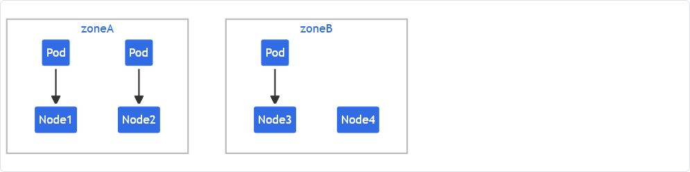

可以组合使用 2 个拓扑分布约束来控制 Pod 在节点和可用区两个维度上的分布：

```yaml
apiVersion: v1
kind: Pod
metadata:
  name: "muti-topology-pod"
  namespace: default
  labels:
    app: "muti-topology-pod"
    foo: bar # 新pod不添加，可以成功放入，但是计算的偏差不会发生变化（该pod被忽略了）
spec:
  topologySpreadConstraints:
  - maxSkew: 1 # 控制域
    topologyKey: topology.kubernetes.io/zone
    whenUnsatisfiable: DoNotSchedule
    labelSelector:
      matchLabels:
        foo: bar
  - maxSkew: 1 # 控制node节点
    topologyKey: topology.kubernetes.io/host
    whenUnsatisfiable: DoNotSchedule
    labelSelector:
      matchLabels:
        foo: bar
  containers:
  - name: myapp
    image: "debian-slim:latest"
    resources: {}
```

在这种情况下，为了匹配第一个约束，新的 Pod 只能放置在可用区 `B` 中； 而在第二个约束中，新来的 Pod 只能调度到节点 `node4` 上。 该调度器仅考虑满足所有已定义约束的选项，因此唯一可行的选择是放置在节点 `node4` 上。

### 27.5.3 带节点亲和性的拓扑分布约束

假设你有一个跨可用区 A 到 C 的 5 节点集群：

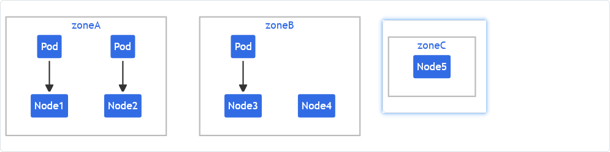

而且你知道可用区 `C` 必须被排除在外。在这种情况下，可以按如下方式编写清单， 以便将 Pod `mypod` 放置在可用区 `B` 上，而不是可用区 `C` 上。 同样，Kubernetes 也会一样处理 `spec.nodeSelector`。

```yaml
# https://kubernetes.io/docs/concepts/workloads/pods/
apiVersion: v1
kind: Pod
metadata:
  name: "nodeaffinity-topology-pod"
  namespace: default
  labels:
    app: "nodeaffinity-topology-pod"
    foo: bar # 新pod不添加，可以成功放入，但是计算的偏差不会发生变化（该pod被忽略了）
spec:
  topologySpreadConstraints:
  - maxSkew: 1 # 控制域
    topologyKey: topology.kubernetes.io/zone
    whenUnsatisfiable: DoNotSchedule
    labelSelector:
      matchLabels:
        foo: bar
  affinity:
    nodeAffinity:
      preferredDuringSchedulingIgnoredDuringExecution:
      - weight: 100
        preference:
          matchExpressions: # 排除zoneC域
            - key: topology.kubernetes.io/zone
              operator: NotIn
              values: ["zoneC"]
  containers:
  - name: myapp
    image: "debian-slim:latest"
    resources: {}
```

## 27.6 偏差计算注意事项

- 只有与新来的 Pod 具有**相同命名空间**的 Pod 才能作为匹配候选者。
- 调度器只会考虑同时具有全部 `topologySpreadConstraints[*].topologyKey` 的节点（**节点要有全部的约束topologykey**）。 缺少任一 `topologyKey` 的节点将被忽略。这意味着：
  1. 位于这些节点上的 Pod 不影响 `maxSkew` 计算，在上面的[例子](https://kubernetes.io/zh-cn/docs/concepts/scheduling-eviction/topology-spread-constraints/#example-conflicting-topologyspreadconstraints)中， 假设节点 `node1` 没有标签 "zone"，则 2 个 Pod 将被忽略，因此新来的 Pod 将被调度到可用区 `A` 中。
  2. 新的 Pod 没有机会被调度到这类节点上。在上面的例子中， 假设节点 `node5` 带有**拼写错误的**标签 `zone-typo: zoneC`（且没有设置 `zone` 标签）。 节点 `node5` 接入集群之后，该节点将被忽略且针对该工作负载的 Pod 不会被调度到那里。

- 注意，如果新 Pod 的 `topologySpreadConstraints[*].labelSelector` 与自身的标签不匹配，将会发生什么。 在上面的例子中，**如果移除新 Pod 的标签foo=bar**，则 Pod 仍然可以放置到可用区 `B` 中的节点上，因为这些约束仍然满足。 **然而，在放置之后，集群的不平衡程度保持不变。**可用区 `A` 仍然有 2 个 Pod 带有标签 `foo: bar`， 而可用区 `B` 有 1 个 Pod 带有标签 `foo: bar`。如果这不是你所期望的， 更新工作负载的 `topologySpreadConstraints[*].labelSelector` 以匹配 Pod 模板中的标签。


# 28. 安全（认证，鉴权，准入控制）

kubernetes作为一个分布式集群的管理工具,保证集群的安全性是其一个重要的任务。API Server是集群内部各个组件通信的中介，也是外部控制的入口。所以kubernetes的安全机制基本就是围绕保护API Server来设计的。**Kubernetes使用了认证（Authentication）、鉴权（Authorization）、准入控制（Admission Control）三步来保证API Server的安全**。

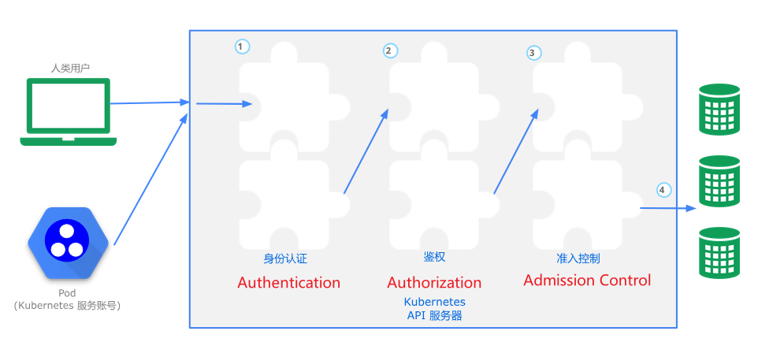

## 28.0 集群中的用户

**所有 Kubernetes 集群都有两类用户：由 Kubernetes 管理的服务账号(serviceaccount)和普通用户**。其中serviceaccount属于集群的资源关联到pod，可以在k8s集群内创建；而普通用户无法在k8s集群内创建。Kubernetes 假定普通用户是由一个与集群无关的服务通过以下方式之一进行管理的：

- 负责分发私钥的管理员
- 类似 Keystone 或者 Google Accounts 这类用户数据库
- 包含用户名和密码列表的文件

有鉴于此，**Kubernetes 并不包含用来代表普通用户账号的对象**。 普通用户的信息无法通过 API 调用添加到集群中。

尽管无法通过 API 调用来添加普通用户， **Kubernetes 仍然认为能够提供由集群的证书机构签名的合法证书的用户是通过身份认证的用户**。 基于这样的配置，Kubernetes 使用**证书中的 'subject' 的通用名称（Common Name）字段 （例如，"/CN=bob"）来确定用户名**。 接下来，基于角色访问控制（RBAC）子系统会确定用户是否有权针对某资源执行特定的操作。

与此不同，服务账号（`serviceaccount`）是 Kubernetes API 所管理的用户。它们被绑定到特定的名字空间， 或者由 API 服务器自动创建，或者通过 API 调用创建。服务账号与一组以 Secret 保存的凭据相关，这些凭据会被挂载到 Pod 中，从而允许集群内的进程访问 Kubernetes API。

> **总结：**
>
> 1. `serviceaccount`：是集群的资源，可以通过api创建。主要用于pod内容器访问apiserver
> 2. 普通用户：不是集群的资源，由外部定义（你随便都行）,只要在https证书中指定CN等信息即可

## 28.1 Authentication 认证

参考文档： https://kubernetes.io/zh-cn/docs/reference/access-authn-authz/authentication/#authentication-strategies

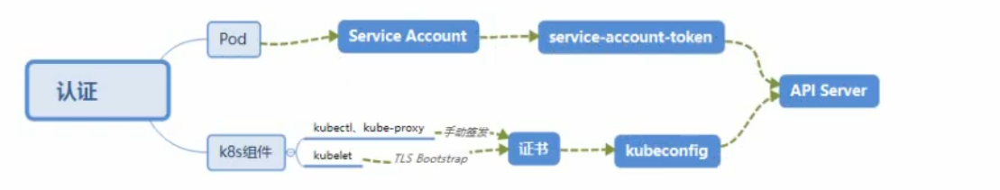

### 28.1.1 用户认证方式

一般有以下几种方式进行认证：

1. **HTTP Token认证**

   比如Bearer Token

2. **HTTP Base认证**

   将用户名和密码用base64算法进行编码后的字符串放在**HTTP Request中的Header Authorization域**里发生给服务端，服务端收到后进行编码，获取用户名及密码。

3. **X509客户证书（即HTTPS证书）认证**（*主流方案*）

   **基于K8s集群内CA根证书签名的客户端身份认证方式**

   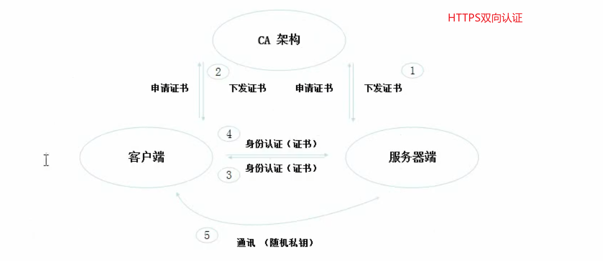

4. 启动引导令牌认证

5. 服务账号令牌认证

6. OIDC令牌认证

7. Webhook令牌认证

8. 身份代理认证

### 28.1.2 HTTPS双向认证流程

Kubernetes CA认证也叫HTTPS证书认证，执行ApiServer CA认证过滤器链逻辑的前提是客户端和服务端完成HTTPS双向认证，下面着重说下HTTPS双向认证流程：

1.客户端发起建⽴HTTPS连接请求，将SSL协议版本的信息发送给服务端； 
2.服务器端将本机的公钥证书（server.crt）发送给客户端； 

3. 客户端通过自己的根证书（ca.crt）验证服务端的公钥证书（server.crt）的合法性(包括检查数字签名，验证证书链，检查证书的有效期 ，检查证书的撤回状态)，取出服务端公钥。
4. 客户端将客户端公钥证书（client.crt）发送给服务器端； 
5. 服务器端使⽤根证书（ca.crt）解密客户端公钥证书，拿到客户端公钥； 
6. 客户端发送⾃⼰⽀持的加密⽅案给服务器端； 
7. 服务器端根据⾃⼰和客户端的能⼒，选择⼀个双⽅都能接受的加密⽅案，使⽤客户端的公钥加密后发送给客户端； 
8. 客户端使⽤⾃⼰的私钥解密加密⽅案，⽣成⼀个随机数R，使⽤服务器公钥加密后传给服务器端； 
9. 服务端⽤⾃⼰的私钥去解密这个密⽂，得到了密钥R；
10. 服务端和客户端在后续通讯过程中就使⽤这个密钥R进⾏通信了。

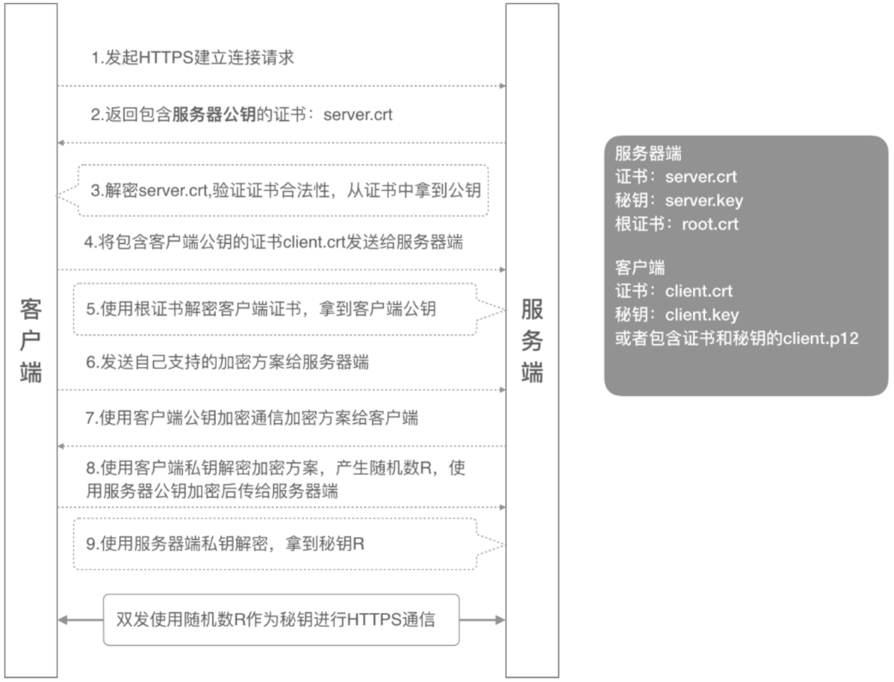


### 28.1.3 k8s中需要认证的节点

**两种类型：**

+ kubernetes内组件对apiserver的访问：**kubelet,kubectl,kube-controller-manager,kube-scheduler,kube-proxy** （以https证书）
+ kubernetes管理的Pod中容器对apiserver的访问：**Pod**，dashboard也是以pod的形式运行（以serviceaccount）

**安全性说明**

+ **kube-controller-manager,kube-scheduler**与apiserver在同一台机器上，所以可以直接使用apiserver的非安全认证端口访问`--insecure-bind-address=127.0.0.1`
+ **kubelet,kubectl,kube-proxy**访问apiserver需要证书进行HTTPS的双向认证

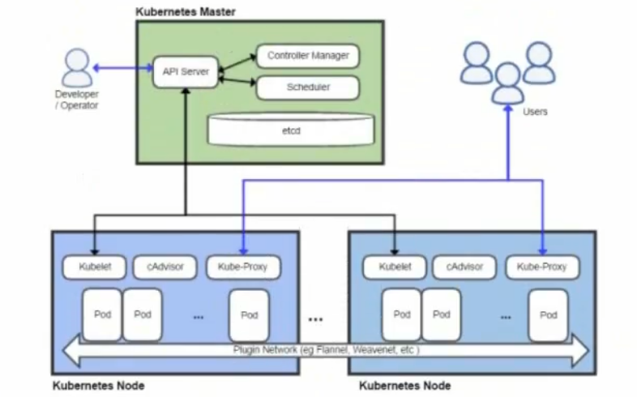

### 28.1.4 证书颁发

k8s中证书颁发有下面两种情况

+ **手动签发**：通过k8s集群的根CA服务进行签发HTTPS证书
+ **自动签发**：kubelet首次访问apiserver时使用token做认证，通过后kube-controller-manager会为当前机器的kubelet生成一个证书，以后访问都是用证书进行了（**比如master节点使用kubeadm安装就是这个流程**）

### 28.1.5 kubeconfig

> 针对客户端使用不同kubeconfig文件连接到不同的k8s服务端

**kubeconfig文件包含集群参数（CA证书、apiserver地址），客户端参数（上面生成的证书和私钥），集群context信息（集群名称、用户名）。**

kubernetes组件（kubelet,kubectl,kube-scheduler等）通过启动时指定不同的kubeconfig文件可以切换到不同的集群。

kubeconfig举例： 

1. master集群上的`/etc/kubernetes/admin.conf`就是部署k8s时用户`~/.kube/config`文件，里面时admin用户，给本地**kubectl使用**。
2. master集群上的`/etc/kubernetes/controller-manager.conf`给内置用户使用`system:kube-controller-manager`。
3. master集群或客户端机器上的`/etc/kubernetes/kubelet.conf`，给机器上**kubelet使用**

### 28.1.6 ServiceAccount

参考文档：https://kubernetes.io/zh-cn/docs/concepts/security/service-accounts/

> [!Note]
>
> **ServiceAccount是为Pod内容器访问apiserver而创建的。**pod容器中serviceaccount默认挂载目录：`/run/secrets/kubernetes.io/serviceccount`.里面就有上面的三个部分:**token,ca.crt,namespace**

因为Pod的创建、销毁是动态的，所以要为他手动生成证书就不可行（太消耗资源了）。kubernetes使用serviceaccount解决pod访问apiserver的认证问题。

一般而言，你可以在以下场景中使用服务账号来提供身份标识：

- 你的 Pod 需要与 Kubernetes API 服务器通信，例如在以下场景中：
  - 提供对存储在 Secret 中的敏感信息的只读访问。
  - 授予[跨名字空间访问](https://kubernetes.io/zh-cn/docs/concepts/security/service-accounts/#cross-namespace)的权限，例如允许 `example` 名字空间中的 Pod 读取、列举和监视 `kube-node-lease` 名字空间中的 Lease 对象。

- 你的 Pod 需要与外部服务进行通信。例如，工作负载 Pod 需要一个身份来访问某商业化的云 API， 并且商业化 API 的提供商允许配置适当的信任关系。
- [使用 `imagePullSecret` 完成在私有镜像仓库上的身份认证](https://kubernetes.io/zh-cn/docs/tasks/configure-pod-container/configure-service-account/#add-imagepullsecrets-to-a-service-account)。

- 外部服务需要与 Kubernetes API 服务器进行通信。例如，作为 CI/CD 流水线的一部分向集群作身份认证。
- 你在集群中使用了第三方安全软件，该软件依赖不同 Pod 的 ServiceAccount 身份，按不同上下文对这些 Pod 分组。


==**创建流程：**==

当你在 Kubernetes 中创建 Pod 时，默认情况下，Kubernetes 会为该 Pod 绑定一个 **ServiceAccount**（通常是 `default` ServiceAccount，除非你显式指定了其他 ServiceAccount）。

**Kubernetes 会自动为该 Pod 生成一个与 ServiceAccount 关联的 Token**，并将它作为 Secret 挂载到 Pod 的文件系统中，具体路径为：`/run/secrets/kubernetes.io/serviceaccount/token`

### 28.1.7 Secret和ServiceAccount关系

kubernetes设计了一种资源叫做Secret分为两类：一种是用于ServiceAccount的service-account-token，另一种是用于保存用户自定义保密信息的Opaque。

ServiceAccount中用到三个部分：

1. **token**：是使用apiserver私钥签发的JWT，用于访问apiserver时服务端验证
2. **ca.crt**：根证书，用于客户端验证apiserver发送过来的证书。
3. **namespace**：标识这个service-account-token的作用域

默认情况下，每个namespace都会有一个叫default的serviceaccount，如果pod在创建时没有指定serviceaccount，那么就会使用pod所属的namespace的serviceaccount即名字叫default的serviceaccount。

> pod容器中serviceaccount默认挂载目录：`/run/secrets/kubernetes.io/serviceccount`.里面就有上面的三个部分:**token,ca.crt,namespace**
>

### 28.1.8 JWT详解(Bearer Token)

JWT即Bearer Token有三部分组成，每部分由`.`分割

+ **Header** 头部

  是Base64编码后的数据，用于声明类型和签名算法。

+ **Payload ** 负载，即传递的数据

  里面是实际的数据，在k8s中Bearer Token如ServiceAccount Token就是使用**base64编码的**

+ **Signature** 签名

  指定的签名算法（如 HMAC SHA256）对前两部分进行签名，以确保数据的完整性。

## 28.2 Authorization 鉴权

参考文档：https://kubernetes.io/zh-cn/docs/reference/access-authn-authz/authorization/

上面认证过程，只是确认通信的双方都确认了对方是可信的，可以相互通信。而**鉴权是确定请求方有哪些资源的权限。**

Kubernetes 对 API 请求的鉴权在 API 服务器内进行。 API 服务器根据所有策略评估所有请求属性，可能还会咨询外部服务，然后允许或拒绝该请求。

API 请求的所有部分都必须通过某种鉴权机制才能继续， 换句话说：默认情况下拒绝访问。

当系统配置了多个[鉴权模块](https://kubernetes.io/zh-cn/docs/reference/access-authn-authz/authorization/#authorization-modules)时，Kubernetes 将按顺序使用每个模块。 如果任何鉴权模块**批准**或**拒绝**请求，则立即返回该决定，并且不会与其他鉴权模块协商。 如果所有模块对请求**没有意见(没有允许)**，则拒绝该请求。 总体拒绝裁决意味着 API 服务器拒绝请求并以 HTTP 403（禁止）状态进行响应。

> [!Note]
>
> 依赖于特定对象种类的特定字段的访问控制和策略由[准入控制器](https://kubernetes.io/zh-cn/docs/reference/access-authn-authz/admission-controllers/)处理。
>
> Kubernetes 准入控制发生在鉴权完成之后（因此，仅当鉴权决策是允许请求时）。即**默是拒绝所以你要配置允许，且权限是累加的（不能排除）**

### 28.2.1 鉴权中使用的请求属性

Kubernetes 仅审查以下 API 请求属性：

- **用户(user)** —— 身份验证期间提供的 `user` 字符串。
- **组(group)** —— 经过身份验证的用户所属的组名列表。
- **额外信息(extra)** —— 由身份验证层提供的任意字符串键到字符串值的映射。
- **API** —— 指示请求是否针对 API 资源。
- **请求路径(Request ath)** —— 各种非资源端点的路径，如 `/api` 或 `/healthz`。
- **API 请求动词(API request verb)** —— API 动词 `get`、`list`、`create`、`update`、`patch`、`watch`、 `proxy`、`redirect`、`delete` 和 `deletecollection` 用于资源请求。 要确定资源 API 端点的请求动词，请参阅[请求动词和鉴权](https://kubernetes.io/zh-cn/docs/reference/access-authn-authz/authorization/#determine-the-request-verb)。
- **HTTP 请求动词(HTTP request verb)** —— HTTP 动词 `get`、`post`、`put` 和 `delete` 用于非资源请求。
- **资源(Resource)** —— 正在访问的资源的 ID 或名称（仅限资源请求）- 对于使用 `get`、`update`、`patch` 和 `delete` 动词的资源请求，你必须提供资源名称。
- **子资源(Subresource)** —— 正在访问的子资源（仅限资源请求）。
- **名字空间(namespace)** —— 正在访问的对象的名称空间（仅适用于名字空间资源请求）。
- **API 组(API group)** —— 正在访问的 [API 组](https://kubernetes.io/zh-cn/docs/concepts/overview/kubernetes-api/#api-groups-and-versioning) （仅限资源请求）。空字符串表示[核心 API 组](https://kubernetes.io/zh-cn/docs/reference/using-api/#api-groups)。

### 28.2.2 资源请求动词verb和鉴权

***非资源请求：***

对于 `/api/v1/...` 或 `/apis/<group>/<version>/...` 之外的端点的请求被视为**非资源请求（Non-Resource Requests）**， 并使用该请求的 HTTP 方法的小写形式作为其请求动词。

例如，对 `/api` 或 `/healthz` 这类端点的 `GET` 请求将使用 **get** 作为其动词。

***资源请求：***

为了确定资源 API 端点的请求动词，Kubernetes 会映射所使用的 HTTP 动词， 并考虑该请求是否作用于单个资源或资源集合：

| HTTP 动词     | 请求动词                                                     |
| ------------- | ------------------------------------------------------------ |
| `POST`        | **create**                                                   |
| `GET`、`HEAD` | **get**（针对单个资源）、**list**（针对集合，包括完整的对象内容）、**watch**（用于查看单个资源或资源集合） |
| `PUT`         | **update**                                                   |
| `PATCH`       | **patch**                                                    |
| `DELETE`      | **delete**（针对单个资源）、**deletecollection**（针对集合） |

> ***注意：***
>
> **get**、**list** 和 **watch** 动作都可以返回一个资源的完整详细信息。就返回的数据而言，它们是等价的。 例如，对 **secrets** 使用 **list** 仍然会显示所有已返回资源的 **data** 属性。

Kubernetes 有时使用专门的动词以对额外的权限进行鉴权。例如：

- 身份认证的特殊情况
  - 对核心 API 组中 `users`、`groups` 和 `serviceaccounts` 以及 `authentication.k8s.io` API 组中的 `userextras` 所使用的 **impersonate** 动词。
- RBAC
  - 对 `rbac.authorization.k8s.io` API 组中 `roles` 和 `clusterroles` 资源的 **bind** 和 **escalate** 动词

### 28.2.4 鉴权方法

+ **AlwaysAllow**

  此模式允许所有请求，但存在安全风险，仅当你的API请求不需要鉴权（如测试）时使用

+ **AlwaysDeny**

  此模式拒绝所有请求，此鉴权模式仅适用于测试。

+ **ABAC（基于属性的访问控制）** **修改完无法立刻生效，需要重启发服务**

  通过使用将属性组合在一起的策略向用户授予访问权限， 策略可以使用任何类型的属性（用户属性、资源属性、对象、环境属性等）。

+ **RBAC（基于角色的访问控制）**

  在此上下文中，访问权限是单个用户执行特定任务（例如查看、创建或修改文件）的能力。 在这种模式下，Kubernetes 使用 `rbac.authorization.k8s.io` API 组来驱动鉴权决策， 允许你通过 Kubernetes API 动态配置权限策略。

+ **Node**

  一种特殊用途的鉴权模式，根据 kubelet 计划运行的 Pod 向其授予权限。

+ **Webhook**

  Kubernetes 的 [Webhook 鉴权模式](https://kubernetes.io/zh-cn/docs/reference/access-authn-authz/webhook/)用于鉴权，进行同步 HTTP 调用， 阻塞请求直到远程 HTTP 服务响应查询。你可以编写自己的软件来处理这种向外调用，也可以使用生态系统中的解决方案。

#### 28.2.4.1 RBAC鉴权

参考连接： https://kubernetes.io/zh-cn/docs/reference/access-authn-authz/rbac/

RBAC即Role-Based Access Control基于角色的访问控制。在kubernetes1.5中引入，现行版本成为默认标准。

RBAC 鉴权机制使用 `rbac.authorization.k8s.io` [API 组](https://kubernetes.io/zh-cn/docs/concepts/overview/kubernetes-api/#api-groups-and-versioning)来驱动鉴权决定， 允许你通过 Kubernetes API 动态配置策略。

相对于其他访问控制方式，拥有以下优势：

+ 对集群中的资源(pod,deploy等)和非资源(pod状态，元数据信息等)均拥有完整的覆盖
+ 整个RBAC完全由几个API对象（集群资源）完成，同其他API对象（集群资源）一样，可以用kubectl或API进行操作
+ 可以在运行时进行调整，无需重启apiserver

##### 28.2.4.1.1 RBAC资源对象说明

RBAC中引入4个新的顶级资源对象：**Role,ClusterRole,RoleBinding,ClusterRoleBinding**。4种对象类型均可以通过kubectl与api操作。

+ **Role** 一个Role只能获取一个命名空间下资源信息（**具体哪些通过配置**）
+ **ClusterRole** 一个可以获取当前集群种所有命名空间下资源信息（**具体哪些通过配置**）
+ **RoleBinding** 既可以和**Role**进行绑定，也可以和**ClusterRole**绑定(**后者是用于在多个（跨）命名空间中共享通用权限，避免重复定义相同的 Role**。)
+ **ClusterRoleBinding** 只能和**RoleBinding**绑定

| 特性           | Role + RoleBinding                                | ClusterRole + ClusterRoleBinding                | ClusterRole + RoleBinding                      |
| -------------- | ------------------------------------------------- | ----------------------------------------------- | ---------------------------------------------- |
| **作用范围**   | 仅限于特定命名空间                                | 作用于整个集群（所有命名空间）                  | 限制在特定命名空间                             |
| 控制的资源类型 | 只能控制命名空间级别的资源                        | 可控制集群级别和命名空间级别的资源              | 可控制集群级别和命名空间级别的资源             |
| 典型场景       | 在某个命名空间内对资源进行精细化权限控制          | 集群管理员，或者跨所有命名空间共享权限的角色    | **跨命名空间内配置通用的命名空间范围的权限**   |
| 适用的资源例子 | `pods`、`services`、`configmaps` 等命名空间内资源 | `nodes`、`persistentvolumes`、`clusterroles` 等 | `pods`、`services`、`configmaps`等命名空间资源 |

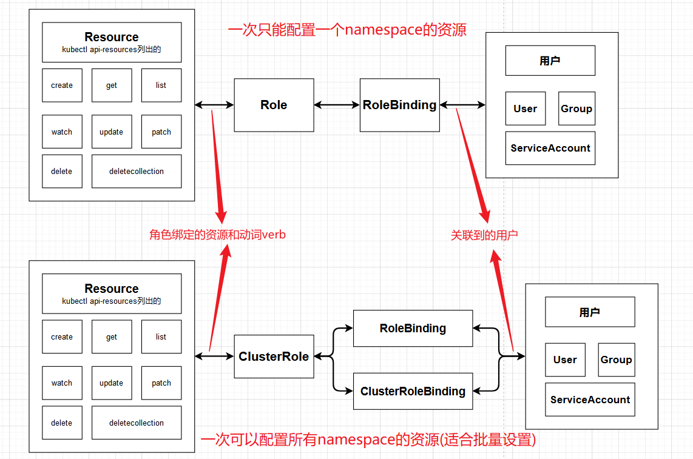

##### 28.2.4.1.2 用户来源？

kubernetes并不会提供用户管理，那么**User、Group、ServiceAccount**指定的用户又来自哪里呢？

**如果是使用HTTPS证书认证，那么就是在申请证书时指定的CN和O（其实就是openssl证书申请的配置文件）**

> apiserver会把客户端证书中`CN`当作用户名，`names.O`当作Group.

下面以`cfssl`配置文件为例：

```json
{
    "CN": "admin", //证书的通用名称（Common Name，CN
    "host": [], //证书所适用的主机名或 IP 地址
    "key": { //密钥生成的算法和密钥长度
        "algo": "rsa",
        "size": 2048
    },
    "names": [
        {
            "c": "CN", //国家代码，CN 表示中国
            "ST": "Hangzhou", //省/直辖市
            "L": "XS", //城市或区域名称
            "O": "system:masters", //组织名组织名称，通常指签发者或所有者所属的组织或公司称(system:表示为k8s内部组)
            "OU": "System" //组织单位名称，表明组织内部的某个部门或单位
        }
    ]
}
```

kubelet使用TLS Bootstraping认证时，apiserver可以使用Bootstrap Tokens或者Token authentication file验证 =token，无论哪一种，kubernetes都会为token绑定一个默认的User和Group。

Pod使用ServiceAccount认证时，`service-account-token（就是secret）`中的JWT会保存User信息。**有了用户信息，再创建一对Role/RoleBinding(ClusterRole/ClusterRoleBinding)资源对象，就可以完成权限绑定了**。

##### 28.2.4.1.3 Role和ClusterRole

在RBAC API中，Role代表一组规则权限，**权限只会增加（累加权限）**，不存在一个资源一开始就有很多权限而通过RBAC对其进行减少的操作；**Role只能定义在一个namespace中，如果想要跨namespace则可以创建ClusterRole**

+ **Role只能用于管理单个namespace中资源**

```yaml
apiVersion: rbac.authorization.k8s.io/v1
kind: Role
metadata:
  namespace: default
  name: pod-reader
rules:
- apiGroups: [""] # "" 标明 core API 组
  resources: ["pods"]
  verbs: ["get", "watch", "list"]
```

ClusterRole具有和Role相同的权限角色控制能力，不同的是**ClusterRole是集群级别的**。ClusterRole可以用于：

1. **集群级别的资源控制（如node访问权限，PV，namespace，StorageClass等）**
2. **非资源型endpoints（如/healthz）访问**
3. **所有namesapce中资源控制（如pod，deployment等）**

```yaml
apiVersion: rbac.authorization.k8s.io/v1
kind: ClusterRole
metadata:
  # "namespace" 被忽略，因为 ClusterRoles 不受名字空间限制
  name: secret-reader
rules:
- apiGroups: [""]
  # 在 HTTP 层面，用来访问 Secret 资源的名称为 "secrets"
  resources: ["secrets"]
  verbs: ["get", "watch", "list"]
```

##### 28.2.4.1.4 RoleBinding和ClusterRoleBinding

**RoleBinding可以将角色中定义的权限授予用户或用户组或serviceaccount**，RoleBinding包含一组权限列表(subjects)，权限列表中包含有不同形式的待授予权限资源类型（**user,group,serviceAccount**）；RoleBinding同样包含对被Binding的Role的引用；**RoleBinding适用于某单个命名空间授权，而ClusterRoleBinding适用于集群范围内的授权**

例如：下面将default命名空间下名为pod-reader的Role绑定到用户jane，此后jane就具有在default命名空间下对s所有pod的get,watch,list权限

```yaml
apiVersion: rbac.authorization.k8s.io/v1
# 此角色绑定允许 "jane" 读取 "default" 名字空间中的 Pod
# 你需要在该名字空间中有一个名为 “pod-reader” 的 Role（见上面）
kind: RoleBinding
metadata:
  name: read-pods
  namespace: default
subjects:
# 你可以指定不止一个“subject（主体）”
- kind: User
  name: jane # "name" 是区分大小写的
  apiGroup: rbac.authorization.k8s.io
roleRef:
  # "roleRef" 指定与某 Role 或 ClusterRole 的绑定关系
  kind: Role        # 此字段必须是 Role 或 ClusterRole
  name: pod-reader  # 此字段必须与你要绑定的 Role 或 ClusterRole 的名称匹配
  apiGroup: rbac.authorization.k8s.io # 角色所在的组
```

RoleBinding同样可以引用ClusterRole来对当前namespace内用户、用户组和ServiceAccount进行授权，这种操作**允许集群管理员在整个集群内定义一些通用的ClusterRole，然后在不同的namespace中使用RoleBinding来引用**。以此来**实现跨命名空间的相同权限配置，不用抽重复定义Role了**。

例如：以下RoleBinding引用了一个ClusterRole，这个ClusterRole具有整个集群内对secrets的访问权限；但是其授权用户`dave`只能访问development命名空间内的secrets。（因为RoleBinding定义在development命名空间内）

```yaml
apiVersion: rbac.authorization.k8s.io/v1
# 此角色绑定使得用户 "dave" 能够读取 "development" 名字空间中的 Secret
# 你需要一个名为 "secret-reader" 的 ClusterRole
kind: RoleBinding
metadata:
  name: read-secrets
  # RoleBinding 的名字空间决定了访问权限的授予范围。
  # 这里隐含授权仅在 "development" 名字空间内的访问权限。
  namespace: development
subjects:
- kind: User
  name: dave # 'name' 是区分大小写的
  apiGroup: rbac.authorization.k8s.io #用户所在的组
roleRef:
  kind: ClusterRole
  name: secret-reader
  apiGroup: rbac.authorization.k8s.io # 角色所在的组
```

**使用ClusterRoleBinding可以对整个集群内所有命名空间资源权限进行授权。**

例如：将名字为secret-reader的ClusterRole（在上面定义过了）权限授权给用户组manager，使其具有对全部命名空间内`secrets`资源的访问权限（get,watch,secrets）

```yaml
apiVersion: rbac.authorization.k8s.io/v1
# 此集群角色绑定允许 “manager” 组中的任何人访问任何名字空间中的 Secret 资源
kind: ClusterRoleBinding
metadata:
  name: read-secrets-global
subjects:
- kind: Group
  name: manager      # 'name' 是区分大小写的
  apiGroup: rbac.authorization.k8s.io
roleRef:
  kind: ClusterRole
  name: secret-reader
  apiGroup: rbac.authorization.k8s.io
```

##### 28.2.4.1.5 Resources资源

kubernetes集群内一些资源一般以其名称字符串来表示，这些字符串一般会在API的URL地址中出现；同时某些资源也会包含子资源，例如logs资源就属于pods的子资源，API中URL样例如下：

```
GET /api/v1/namespaces/{namespace}/pods/{name}/log
```

如果想要在RBAC授权模型中控制这些子资源的访问权限，**可以通过 / 分隔符**来实现，以下是一个定义Pods子资源logs访问权限的Role定义样例：

```yaml
apiVersion: rbac.authorization.k8s.io/v1
kind: Role
metadata:
  namespace: default
  name: pod-reader
rules:
- apiGroups: [""] # "" 标明 core API 组
  resources: ["pods/log"] # 只授予default命名空间下,只能查看所有pod日志的权限 
  verbs: ["get", "watch", "list"]
```

> + 授权到`pods`就是`/api/v1/namespaces/{namespace}/pods` 则包含其子资源的授权（如log）
> + 授权到`pods/log`就是`/api/v1/namespaces/{namespace}/pods/{name}/log` 则只包括所有pod下log子资源权限

##### 28.2.4.1.6 xxxBinding中Subjects属性

RoleBinding和ClusterRoleBinding可以将Role绑定到Subjects；Subjects可以是groups，users或者service account

+ Subjects中User使用字符串表示，可以是一个**普通的名字字符串**如"alice"，也可以是**email格式的邮箱地址**，甚至是**一组字符串形式的数字ID**。**但是Users的前缀**`system:`**是系统内部用户，集群管理员应确保普通用户不会使用这个前缀格式**
+ **Group的格式和User相同，都为一个字符串且没有格式要求**，但是同样不能使用`system:`


##### 28.2.4.1.7 ClusterRole + RoleBinding的好处

**ClusterRole + RoleBinding** 和 **Role + RoleBinding** 其实有各自的应用场景，它们不能完全相互替代。尽管两者都可以通过 **RoleBinding** 限制权限在特定的命名空间内，但 **ClusterRole + RoleBinding** 有其独特的优势和用途。以下是一些使用 **ClusterRole + RoleBinding** 的原因：

1. **跨命名空间的通用权限**

   - **ClusterRole** 可以定义**跨多个命名空间**共享的通用权限。

   - 如果你想在多个命名空间中为某些用户或服务账户提供相同的权限，而不想为每个命名空间创建重复的 **Role**，使用 **ClusterRole** 是更高效的选择。通过一个 **ClusterRole** 定义好权限后，可以在多个命名空间中使用 **RoleBinding** 来绑定同一个 **ClusterRole**，避免重复定义。

2. **对集群级别资源的命名空间内使用**

​			虽然 **ClusterRole + RoleBinding** 不能让你在命名空间中访问集群级别的资源（如 `nodes`），但是某些 **ClusterRole** 定义的权限是跨命名空间的，或者能够访问特定的全局性资源，而这些资源并不存在于单个命名空间中。

​			例如，一些控制器、监控工具或插件可能需要对不同命名空间中的相同类型的资源（如 Pods）执行相同的操作。在这种情况下，通过 **ClusterRole** 来定义权限是合理的选择。

3. **标准化和减少重复**

   - 如果你的集群有标准化的安全策略（如查看日志、监控或管理特定资源的权限），可以通过 **ClusterRole** 来统一管理这些权限，确保在所有命名空间中实现一致性。

   - 如果每个命名空间都要手动创建 **Role**，一旦需要修改权限，你必须逐个修改每个命名空间内的 **Role**，而使用 **ClusterRole** 可以让你在一次定义后，在多个命名空间中重复使用。

4. **访问集群级别资源的基础权限**

​			有些 **ClusterRole** 需要用作基础权限，比如用于操作 `PersistentVolumes` 或 `ClusterRole` 本身等集群范围的资源。虽然这些权限通过 **RoleBinding** 限制在特定命名空间内，但角色的定义本身是跨命名空间共享的。例如，系统中的 `system:node` **ClusterRole** 定义了节点对集群范围资源的访问权限。


#### 28.2.4.2 Node鉴权

https://kubernetes.io/zh-cn/docs/reference/access-authn-authz/node/

#### 28.2.4.3 ABAC鉴权

https://kubernetes.io/zh-cn/docs/reference/access-authn-authz/abac/

#### 28.2.4.4 Webhook鉴权

https://kubernetes.io/zh-cn/docs/reference/access-authn-authz/webhook/

#### 28.2.4.4 bootstrap token鉴权

参考文档：https://kubernetes.io/zh-cn/docs/reference/access-authn-authz/bootstrap-tokens/

启动引导令牌是一种简单的持有者令牌（Bearer Token），这种令牌是在新建集群 或者在现有集群中添加新节点时使用的。 它被设计成能够支持 [`kubeadm`](https://kubernetes.io/zh-cn/docs/reference/setup-tools/kubeadm/)， 但是也可以被用在其他的案例中以便用户在不使用 `kubeadm` 的情况下启动集群。 它也被设计成可以通过 RBAC 策略，结合 [kubelet TLS 启动引导](https://kubernetes.io/zh-cn/docs/reference/access-authn-authz/kubelet-tls-bootstrapping/) 系统进行工作。

启动引导令牌被定义成一个特定类型的 Secret（`bootstrap.kubernetes.io/token`）， 并存在于 `kube-system` 名字空间中。 这些 Secret 会被 API 服务器上的启动引导认证组件（Bootstrap Authenticator）读取。 控制器管理器中的控制器 TokenCleaner 能够删除过期的令牌。 这些令牌也被用来在节点发现的过程中会使用的一个特殊的 ConfigMap 对象。 BootstrapSigner 控制器也会使用这一 ConfigMap

> 只能用于**引导新节点加入集群，并自动配置和签发客户端证书**

### 28.2.5 鉴权模式更改配置

你可以仅使用[命令行参数](https://kubernetes.io/zh-cn/docs/reference/access-authn-authz/authorization/#using-flags-for-your-authorization-module)， 或使用[配置文件](https://kubernetes.io/zh-cn/docs/reference/access-authn-authz/authorization/#using-configuration-file-for-authorization)来配置 Kubernetes API 服务器的鉴权链，后者目前是 Beta 特性。

你必须选择两种配置方法之一；不允许同时设置 `--authorization-config` 路径并使用 `--authorization-mode` 和 `--authorization-webhook-*` 命令行参数配置鉴权 Webhook。 如果你尝试这样做，API 服务器会在启动期间报告错误消息，然后立即退出。

***命令行参数修改：***

> 在apiserver上修改使用`apply`或`edit`都可以。kube-apiserver配置文件在`/etc/kubernetes/manifest/kube-apiserver.yaml `

可以使用以下模式：

- `--authorization-mode=ABAC`（基于属性的访问控制模式）
- `--authorization-mode=RBAC`（基于角色的访问控制模式）
- `--authorization-mode=Node`（节点鉴权组件）
- `--authorization-mode=Webhook`（Webhook 鉴权模式）
- `--authorization-mode=AlwaysAllow`（始终允许请求；存在[安全风险](https://kubernetes.io/zh-cn/docs/reference/access-authn-authz/authorization/#warning-always-allow))
- `--authorization-mode=AlwaysDeny`（始终拒绝请求）

你可以选择多种鉴权模式；例如：`--authorization-mode=Node,Webhook`

***配置文件修改：***

参见官网：https://kubernetes.io/zh-cn/docs/reference/access-authn-authz/authorization/#using-configuration-file-for-authorization

## 28.4 Admission Control 准入控制

参考文档：https://kubernetes.io/zh-cn/docs/reference/access-authn-authz/admission-controllers/#what-are-they

准入控制是apiserver的插件集合，通过添加不同的插件，实现额外的准入控制规则。

**准入控制器（Admission Controller）** 是 Kubernetes 集群中的一类插件，用来拦截和处理 API 请求，以控制集群资源的创建、修改和删除等操作。它们在资源持久化之前生效，可以基于集群的安全、资源配额、策略等进行额外的检查或修改。准入控制器是 Kubernetes 安全和治理的一部分，帮助确保资源的合法性、合规性和安全性。

### 准入控制器的作用

当用户或系统通过 API Server 向 Kubernetes 提交请求（如创建 Pod、修改资源配额）时，准入控制器负责审查这些请求。其执行的主要操作包括：

1. **验证**：检查请求是否符合特定策略或规则。
2. **修改**：根据特定策略动态修改资源对象（如自动填充默认值）。
3. **拒绝**：如果请求不符合策略或规则，则直接拒绝请求。

### 准入控制器的工作流程

1. **客户端请求**：用户通过 `kubectl` 或其他方式发出 API 请求（例如创建一个 Pod）。
2. **认证和授权**：首先通过 Kubernetes 的认证（Authentication）和授权（Authorization）机制来确认请求者的身份和权限。
3. **准入控制器处理：**
   - 请求通过认证和授权后，准入控制器接管请求，并根据预定义的逻辑对其进行审查或修改。
   - 如果请求通过所有启用的准入控制器检查，API Server 会继续处理并将资源保存到 etcd 中。
4. **持久化**：通过审查的请求会被存储并执行，拒绝的请求则会返回错误。

### 常见的准入控制器类型

Kubernetes 提供了多种内置的准入控制器，常见的有：

1. **NamespaceLifecycle**：限制操作只能在存在的命名空间中执行，防止删除系统关键命名空间。
2. **LimitRanger**：确保 Pod 的资源请求和限制在定义的范围内。
3. **PodSecurityPolicy**（已废弃，使用 Pod Security Standards 替代）：对 Pod 进行安全策略检查，确保 Pod 符合安全要求。
4. **ResourceQuota**：限制命名空间内的资源使用，确保其不会超出配额。
5. **MutatingAdmissionWebhook**：允许通过外部服务对资源进行动态修改，如自动添加标签、注解等。
6. **ValidatingAdmissionWebhook**：允许通过外部服务对请求进行验证，阻止不符合策略的请求。

### 准入控制器的分类

准入控制器大致可以分为两类：

1. **Mutating Admission Controller**（可变准入控制器）：可以修改资源的对象，例如为 Pod 自动添加 sidecar 容器。常见例子有 `MutatingAdmissionWebhook`。
2. **Validating Admission Controller**（验证准入控制器）：用于验证请求是否合法，并做出决策是允许还是拒绝，例如 `PodSecurity`。

### 准入控制器的配置

准入控制器可以通过 Kubernetes API Server 的 `--enable-admission-plugins` 参数来启用或禁用。

准入控制插件大全（及作用）：https://kubernetes.io/zh-cn/docs/reference/access-authn-authz/admission-controllers/#what-does-each-admission-controller-do

## 28.5 ==*配置用户权限实战*==

### 28.5.1 通过https证书配置用户权限

> **k8s不管理用户，所以你可以配置任意用户名**

1. 机器必须安装kubelet ,kubectl

2. [28.6 创建ssl证书并授权](#28.6 创建ssl证书并授权)


### 28.5.2 bootstrap token(仅用于新节点加入)

**无法实现，只能用于引导新节点加入集群、自动配置和签发客户端证书**

> 就是`kubeadm token list`中的

### 28.5.3 ServiceAccount token (就是Bearer token的实现)

> **ServiceAccount token 就是Bearer token(是规范)一种实现形式**

1. 指定服务账户ServiceAccount的token （**注意，sa详细信息是存在secret中的**）

   ```bash
   # 如果创建pod不指定sa，默认就是当前命名空间下的default（sa就叫这个名字）
   kubectl get secret $(kubectl get sa default -o jsonpath='{.secrets[0].name}') -o jsonpath='{.data.token}' | base64 --decode
   ```

2. 打开postman等接口工具，测试

   + 地址`https://<API_SERVER_IP>:6443/api/v1/namespaces/default/pods`
   + 请求头`Authorization: Bearer <your-token>`或者在Authorization中选择`Bearer Token`填入第一步获得的token

3. 发现报错，(**没权限列出默认命名空间的pod**)

   ```json
   //default命名空间下的名字叫default的serviceaccount无法列出pod资源，原因没权限
   {
       "kind": "Status",
       "apiVersion": "v1",
       "metadata": {},
       "status": "Failure",
       "message": "pods is forbidden: User \"system:serviceaccount:default:default\" cannot list resource \"pods\" in API group \"\" in the namespace \"default\"",
       "reason": "Forbidden",
       "details": {
           "kind": "pods"
       },
       "code": 403
   }
   ```

4. 创建`Role`和`RoleBinding`给ServiceAccount权限

   ```bash
   # 创建一个 Role，允许列出 Pods 资源
   kubectl create role pod-reader --verb=get,list,watch --resource=pods --namespace=default
   
   # 绑定这个 Role 到 default 服务账户
   kubectl create rolebinding default-pod-reader --role=pod-reader --serviceaccount=default:default --namespace=default
   ```

5. postman再次尝试发送请求,**成功列出default命名空间下的pod**

> [!Attention]
>
> **在同一命名空间，ServiceAccount中的token和Pod中token**`/run/secrets/kubernetes.io/serviceaccount/token`**效果完全一样**，因为是同一个serviceaccount账户(pod默认使用叫default的serviceaccount)。区别之处在二者的生命周期长度：
>
> + **ServiceAccount保存在secret中的token长期有效(旧版本)**
> + **任意pod容器中serviceaccount token**`/run/secrets/kubernetes.io/serviceaccount/token`**是短期有效的（会自动更换）**
> + 执行命令`echo $TOKEN | cut -d '.' -f 2 | base64 --decode`可以看到时间

## 28.6 创建ssl证书并授权

### 28.6.1 大概思路

1. 创建出客户端`.key`,`.csr`文件，利用k8s集群的根CA`/etc/kubernetes/pki/ca.crt`和`/etc/kubernetes/pki/ca.key`对客户端证书进行签发，生成客户端`.crt`文件
2. 创建出`kubeconfig`文件，配置`cluster`集群信息、`credentials`客户端认证信息、`context`k8s上下文信息
3. 将生成的`kubeconfig`文件放到你需要的地方：如其他客户端的**任意用户名**上（`~/.kube/config`）
4. 客户端上执行命令，使用刚才下载的`~/.kube/config`即kubeconfig文件切换k8s上下文
5. 测试，无权限
6. 授予权限
7. 再次测试

> 如果是到接口工具上如postman测试，可以跳过第五步，将第一步生成的客户端`.key`，`.crt`证书导入接口工具`settings-Certificates-add Client Certificates`即可（发送请求他会自动配置）

### 28.6.2 具体步骤

1. 创建出客户端`.key`，`.crt`,`.csr`文件（**需要指定用户名，或组**）

   方法：https://kubernetes.io/zh-cn/docs/tasks/administer-cluster/certificates/ (**需要注意,里面不是使用k8s根CA签发的证书**)

   + 使用`easyrsa`

   + 使用`openssl`

     ```ini
     #devuser-csr.conf
     [ req ]
     default_bits = 2048
     prompt = no
     default_md = sha256
     req_extensions = req_ext
     distinguished_name = dn
     
     [ dn ]
     C = CN
     ST = JiangSu
     L = SuZhou
     O = k8s # 对应k8s中 组
     OU = development
     CN = devuser # 对应k8s中 用户
     
     [ req_ext ]
     subjectAltName = @alt_names
     
     [ alt_names ]
     DNS.1 = kubernetes
     DNS.2 = kubernetes.default
     DNS.3 = kubernetes.default.svc
     DNS.4 = kubernetes.default.svc.cluster
     DNS.5 = kubernetes.default.svc.cluster.local
     IP.1 = 192.168.136.151
     IP.2 = 10.96.0.0
     
     [ v3_ext ]
     authorityKeyIdentifier=keyid,issuer:always
     basicConstraints=CA:FALSE
     keyUsage=keyEncipherment,dataEncipherment
     extendedKeyUsage=serverAuth,clientAuth
     subjectAltName=@alt_names
     ```

     ```bash
     # 1.生成客户端的 key文件
     sudo openssl genrsa -out devuser.key 2048
     # 2.根据key生成csr文件
     sudo openssl req -new -key devuser.key -out devuser.csr -config devuser-csr.conf
     # 3.利用k8s集群的根CA`/etc/kubernetes/pki/ca.crt`和`/etc/kubernetes/pki/ca.key`对客户端证书进行签发，生成客户端crt证书
     sudo openssl x509 -req -in devuser.csr \
     	-CA /etc/kubernetes/pki/ca.crt \    # K8s根CA
     	-CAkey /etc/kubernetes/pki/ca.key \
         -CAcreateserial -out devuser.crt -days 10000 \ # 证书有效期
         -extensions v3_ext -extfile devuser-csr.conf -sha256 # devuser-csr.conf见上面
     ```

     > 也可以不使用`devuser-csr.conf`配置文件，直接一个命令
     >
     > ```bash
     > # 1.生成客户端的 key文件
     > sudo openssl genrsa -out devuser.key 2048
     > # 2.根据key生成csr文件 (直接定义CN，O)
     > sudo openssl req -new -key devuser.key -out devuser.csr -subj "/CN=admin/O=k8s"
     > # 3. 利用k8s集群的根CA对客户端证书进行签发，生成客户端crt证书
     > sudo openssl x509 -req -in devuser.csr \
     > -CA /etc/kubernetes/pki/ca.crt \
     > -CAkey /etc/kubernetes/pki/ca.key \
     > -CAcreateserial -out devuser.crt -days 10000
     > ```

   + 使用`cfssl`

2. 创建出`kubeconfig`文件，配置`cluster`集群信息、`credentials`客户端认证信息、`context`k8s上下文信息

   ```bash
   export KUBE_APISERVER="https://192.168.136.151:6443"
   # 1.配置`cluster`集群信息到 devuser.kubeconfig 文件
   kubectl config set-cluster kubernetes \
   --certificate-authority=/etc/kubernetes/pki/ca.crt \ # k8s根ca
   --embed-certs=true \
   --server=${KUBE_APISERVER} \
   --kubeconfig=devuser.kubeconfig # 输出的kubeconfig文件
   
   # 2.配置credentials`客户端认证信息
   kubectl config set-credentials devuser \
   --client-certificate=devuser.crt \ # 第一步生成的客户端 .crt文件
   --client-key=devuser.key \  # 第一步生成的客户端 .key文件
   --embed-certs=true \
   --kubeconfig=devuser.kubeconfig # 追加到上一步生成的kubeconfig
   
   # 3.`context`k8s上下文信息
   kubectl config set-context kubernetes \
   --cluster=kubernetes \
   --user=devuser \ # 和证书的CN一样
   --namespace=default \ # 指定命名空间
   --kubeconfig=devuser.kubeconfig # 追加到上一步生成的kubeconfig
   ```

3. 将生成的`kubeconfig`文件放到你需要的地方：如其他客户端的**任意用户**上（`~/.kube/config`）

   ```bash
   # 比如另一台机器上的，或当前机器的另一个账户
   # 上面生成的kubeconfig
   scp lxx@192.168.136.151:/home/lxx/tmp/authorizationtest/https/tom/tom.kubeconfig /home/tom/.kube/config
   ```

   > 用户名随便，root,devuser,tom,jerry都可以，最后请求的用户名都是kubeconfig中的user

4. 客户端上执行命令，使用刚才下载的`~/.kube/config`即kubeconfig文件切换k8s上下文

   ```bash
   # 可以不指定--kubeconfig ,那就会走kubectl默认的环境变量配置
   kubectl config use-context kubernetes --kubeconfig=/home/tom/.kube/config
   ```

5. 测试，无权限

   ```bash
   [tom@k8s-node2 .kube]$ kubectl get pod
   Error from server (Forbidden): pods is forbidden: User "tom" cannot list resource "pods" in API group "" in the namespace "default"
   ```

6. 授予权限

   效果就是，后面你授权的任意用户可以不用再配置了，只要改用户属于**k8s组**（累加的权限）

   ```bash
   # 将用户 devuser绑定到 内置的集群用户admin上
   # 将组 k8s绑定到 内置的集群用户admin上 
   # 授权用户devuser 和组k8s只有default命名空间的权限
   create rolebinding devuser-admin-binding --clusterrole=admin --user=devuser  --group=k8s --namespace=default
   ```

7. 再次测试，权限成功**只有默认default命名空间的权限**

   ```bash
   [tom@k8s-node2 .kube]$ kubectl get pod
   NAME                                     READY   STATUS    RESTARTS      AGE
   busybox                                  1/1     Running   2 (17h ago)   15d
   [tom@k8s-node2 .kube]$ kubectl get pod -A
   Error from server (Forbidden): pods is forbidden: User "tom" cannot list resource "pods" in API group "" at the cluster scope
   ```

### 28.6.3 kubeconfig文件形式

当客户端发出请求时，API Server 提供自己的证书，客户端根据 `kubeconfig` 中的 `certificate-authority-data`，验证该证书是否是由正确的 CA 签发的。如果验证通过，客户端才会信任该服务器并继续通信。

```yaml
apiVersion: v1
clusters:
- cluster:
    certificate-authority-data: xxx # 验证apiserver的CA证书
    server: https://192.168.136.151:6443
  name: kubernetes
contexts:
- context:
    cluster: kubernetes
    namespace: default
    user: devuser
  name: kubernetes
current-context: kubernetes
kind: Config
preferences: {}
users:
- name: devuser
  user:
    client-certificate-data: xxx # 客户端 公钥
    client-key-data: xxx # 客户端 私钥
```

## 28.7 注意

1. `apiGroups`中的组可以通过`kubectl api-resources -o wide`获取组和组组具有的操作
   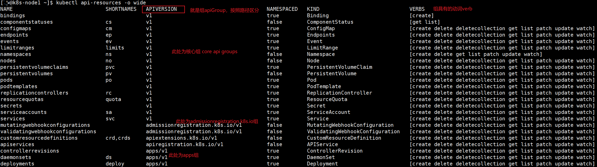

2. 系统内部用户和内部组

   + ***API 发现角色***

     无论是经过身份验证的还是未经过身份验证的用户， 默认的集群角色绑定都授权他们读取被认为是可安全地公开访问的 API（包括 CustomResourceDefinitions）。 如果要禁用匿名的未经过身份验证的用户访问，请在 API 服务器配置中添加 `--anonymous-auth=false` 的配置选项。

     通过运行命令 `kubectl` 可以查看这些角色的配置信息:

     | 默认 ClusterRole              | 默认 ClusterRoleBinding                                   | 描述                                                         |
     | ----------------------------- | --------------------------------------------------------- | ------------------------------------------------------------ |
     | **system:basic-user**         | **system:authenticated** 组                               | 允许用户以只读的方式去访问他们自己的基本信息。在 v1.14 版本之前，这个角色在默认情况下也绑定在 `system:unauthenticated` 上。 |
     | **system:discovery**          | **system:authenticated** 组                               | 允许以只读方式访问 API 发现端点，这些端点用来发现和协商 API 级别。 在 v1.14 版本之前，这个角色在默认情况下绑定在 `system:unauthenticated` 上。 |
     | **system:public-info-viewer** | **system:authenticated** 和 **system:unauthenticated** 组 | 允许对集群的非敏感信息进行只读访问，此角色是在 v1.14 版本中引入的。** |

   + ***面向用户的角色***

     一些默认的 ClusterRole 不是以前缀 `system:` 开头的。这些是面向用户的角色。 它们包括超级用户（Super-User）角色（`cluster-admin`）、 使用 ClusterRoleBinding 在集群范围内完成授权的角色（`cluster-status`）、 以及使用 RoleBinding 在特定名字空间中授予的角色（`admin`、`edit`、`view`）。

     面向用户的 ClusterRole 使用 [ClusterRole 聚合](https://kubernetes.io/zh-cn/docs/reference/access-authn-authz/rbac/#aggregated-clusterroles)以允许管理员在这些 ClusterRole 上添加用于定制资源的规则。如果想要添加规则到 `admin`、`edit` 或者 `view`， 可以创建带有以下一个或多个标签的 ClusterRole：

     | **luster-admin** | **system:masters** 组 | 允许超级用户在平台上的任何资源上执行所有操作。 当在 **ClusterRoleBinding** 中使用时，可以授权对集群中以及所有名字空间中的全部资源进行完全控制。 当在 **RoleBinding** 中使用时，可以授权控制角色绑定所在名字空间中的所有资源，包括名字空间本身。 |
     | ---------------- | --------------------- | ------------------------------------------------------------ |
     | **admin**        | 无                    | 允许管理员访问权限，旨在使用 **RoleBinding** 在名字空间内执行授权。如果在 **RoleBinding** 中使用，则可授予对名字空间中的大多数资源的读/写权限， 包括创建角色和角色绑定的能力。 此角色不允许对资源配额或者名字空间本身进行写操作。 此角色也不允许对 Kubernetes v1.22+ 创建的 EndpointSlices（或 Endpoints）进行写操作。 更多信息参阅 [“EndpointSlices 和 Endpoints 写权限”小节](https://kubernetes.io/zh-cn/docs/reference/access-authn-authz/rbac/#write-access-for-endpoints)。 |
     | **edit**         | 无                    | 允许对名字空间的大多数对象进行读/写操作。此角色不允许查看或者修改角色或者角色绑定。 不过，此角色可以访问 Secret，以名字空间中任何 ServiceAccount 的身份运行 Pod， 所以可以用来了解名字空间内所有服务账户的 API 访问级别。 此角色也不允许对 Kubernetes v1.22+ 创建的 EndpointSlices（或 Endpoints）进行写操作。 更多信息参阅 [“EndpointSlices 和 Endpoints 写操作”小节](https://kubernetes.io/zh-cn/docs/reference/access-authn-authz/rbac/#write-access-for-endpoints)。 |
     | **view**         | 无                    | 允许对名字空间的大多数对象有只读权限。 它不允许查看角色或角色绑定。此角色不允许查看 Secret，因为读取 Secret 的内容意味着可以访问名字空间中 ServiceAccount 的凭据信息，进而允许利用名字空间中任何 ServiceAccount 的身份访问 API（这是一种特权提升）。 |

   + ***核心组件角色***

     | 默认 ClusterRole                   | 默认 ClusterRoleBinding                 | 描述                                                         |
     | ---------------------------------- | --------------------------------------- | ------------------------------------------------------------ |
     | **system:kube-scheduler**          | **system:kube-scheduler** 用户          | 允许访问 [scheduler](https://kubernetes.io/zh-cn/docs/reference/command-line-tools-reference/kube-scheduler/) 组件所需要的资源。 |
     | **system:volume-scheduler**        | **system:kube-scheduler** 用户          | 允许访问 kube-scheduler 组件所需要的卷资源。                 |
     | **system:kube-controller-manager** | **system:kube-controller-manager** 用户 | 允许访问[控制器管理器](https://kubernetes.io/zh-cn/docs/reference/command-line-tools-reference/kube-controller-manager/)组件所需要的资源。 各个控制回路所需要的权限在[控制器角色](https://kubernetes.io/zh-cn/docs/reference/access-authn-authz/rbac/#controller-roles)详述。 |
     | **system:node**                    | 无                                      | 允许访问 kubelet 所需要的资源，**包括对所有 Secret 的读操作和对所有 Pod 状态对象的写操作。**你应该使用 [Node 鉴权组件](https://kubernetes.io/zh-cn/docs/reference/access-authn-authz/node/)和 [NodeRestriction 准入插件](https://kubernetes.io/zh-cn/docs/reference/access-authn-authz/admission-controllers/#noderestriction)而不是 `system:node` 角色。同时基于 kubelet 上调度执行的 Pod 来授权 kubelet 对 API 的访问。`system:node` 角色的意义仅是为了与从 v1.8 之前版本升级而来的集群兼容。 |
     | **system:node-proxier**            | **system:kube-proxy** 用户              | 允许访问 [kube-proxy](https://kubernetes.io/zh-cn/docs/reference/command-line-tools-reference/kube-proxy/) 组件所需要的资源。 |

   + ***其他组件角色***

     | 默认 ClusterRole                         | 默认 ClusterRoleBinding                               | 描述                                                         |
     | ---------------------------------------- | ----------------------------------------------------- | ------------------------------------------------------------ |
     | **system:auth-delegator**                | 无                                                    | 允许将身份认证和鉴权检查操作外包出去。 这种角色通常用在插件式 API 服务器上，以实现统一的身份认证和鉴权。 |
     | **system:heapster**                      | 无                                                    | 为 [Heapster](https://github.com/kubernetes/heapster) 组件（已弃用）定义的角色。 |
     | **system:kube-aggregator**               | 无                                                    | 为 [kube-aggregator](https://github.com/kubernetes/kube-aggregator) 组件定义的角色。 |
     | **system:kube-dns**                      | 在 **kube-system** 名字空间中的 **kube-dns** 服务账户 | 为 [kube-dns](https://kubernetes.io/zh-cn/docs/concepts/services-networking/dns-pod-service/) 组件定义的角色。 |
     | **system:kubelet-api-admin**             | 无                                                    | 允许 kubelet API 的完全访问权限。                            |
     | **system:node-bootstrapper**             | 无                                                    | 允许访问执行 [kubelet TLS 启动引导](https://kubernetes.io/zh-cn/docs/reference/access-authn-authz/kubelet-tls-bootstrapping/) 所需要的资源。 |
     | **system:node-problem-detector**         | 无                                                    | 为 [node-problem-detector](https://github.com/kubernetes/node-problem-detector) 组件定义的角色。 |
     | **system:persistent-volume-provisioner** | 无                                                    | 允许访问大部分[动态卷驱动](https://kubernetes.io/zh-cn/docs/concepts/storage/persistent-volumes/#dynamic)所需要的资源。 |
     | **system:monitoring**                    | **system:monitoring** 组                              | 允许对控制平面监控端点的读取访问（例如：[kube-apiserver](https://kubernetes.io/zh-cn/docs/concepts/architecture/#kube-apiserver) 存活和就绪端点（`/healthz`、`/livez`、`/readyz`）， 各个健康检查端点（`/healthz/*`、`/livez/*`、`/readyz/*`）和 `/metrics`）。 请注意，各个运行状况检查端点和度量标准端点可能会公开敏感信息。 |

   + ***内置控制器的角色***

     Kubernetes [控制器管理器](https://kubernetes.io/zh-cn/docs/reference/command-line-tools-reference/kube-controller-manager/)运行内建于 Kubernetes 控制面的[控制器](https://kubernetes.io/zh-cn/docs/concepts/architecture/controller/)。 当使用 `--use-service-account-credentials` 参数启动时，kube-controller-manager 使用单独的服务账户来启动每个控制器。 每个内置控制器都有相应的、前缀为 `system:controller:` 的角色。 如果控制管理器启动时未设置 `--use-service-account-credentials`， 它使用自己的身份凭据来运行所有的控制器，该身份必须被授予所有相关的角色。 这些角色包括：

     - `system:controller:attachdetach-controller`
     - `system:controller:certificate-controller`
     - `system:controller:clusterrole-aggregation-controller`
     - `system:controller:cronjob-controller`
     - `system:controller:daemon-set-controller`
     - `system:controller:deployment-controller`
     - `system:controller:disruption-controller`
     - `system:controller:endpoint-controller`
     - `system:controller:expand-controller`
     - `system:controller:generic-garbage-collector`
     - `system:controller:horizontal-pod-autoscaler`
     - `system:controller:job-controller`
     - `system:controller:namespace-controller`
     - `system:controller:node-controller`
     - `system:controller:persistent-volume-binder`
     - `system:controller:pod-garbage-collector`
     - `system:controller:pv-protection-controller`
     - `system:controller:pvc-protection-controller`
     - `system:controller:replicaset-controller`
     - `system:controller:replication-controller`
     - `system:controller:resourcequota-controller`
     - `system:controller:root-ca-cert-publisher`
     - `system:controller:route-controller`
     - `system:controller:service-account-controller`
     - `system:controller:service-controller`
     - `system:controller:statefulset-controller`
     - `system:controller:ttl-controller`

3. 

## 28.8 serviceaccount注意事项

当你在 Kubernetes 中创建 Pod 时，默认情况下，Kubernetes 会为该 Pod 绑定一个 **ServiceAccount**（通常是 `default` ServiceAccount，除非你显式指定了其他 ServiceAccount）。

**Kubernetes 会自动为该 Pod 生成一个与 ServiceAccount 关联的 Token**，并将它作为 Secret 挂载到 Pod 的文件系统中，具体路径为：`/run/secrets/kubernetes.io/serviceaccount/token`

> [!Attention]
>
> **在同一命名空间，ServiceAccount中的token和Pod中token**`/run/secrets/kubernetes.io/serviceaccount/token`**效果完全一样**，因为是同一个serviceaccount账户(pod默认使用叫default的serviceaccount)。区别之处在二者的生命周期长度：
>
> + **ServiceAccount保存在secret中的token长期有效(旧版本)**
> + **任意pod容器中serviceaccount token**`/run/secrets/kubernetes.io/serviceaccount/token`**是短期有效的（会自动更换）**
> + 执行命令`echo $TOKEN | cut -d '.' -f 2 | base64 --decode`可以看到过期时间毫秒数exp
> + linux执行`date -d @exp`查看到期时间（exp就是上步获取的过期时间）


## 28.9 无论是基于HTTPS证书的User、Group还是基于BearerToken 的ServiceAccount Token如果想要读取资源都要配置RoleBinding或ClusterRoleBinding。否则都是只过了认证authentication，没过授权authorization。

> 无论是基于HTTPS证书的User、Group还是基于BearerToken 的ServiceAccount Token（Pod内或外面的）如果想要读取资源都要配置RoleBinding或ClusterRoleBinding。否则都是只过了认证authentication，没过授权authorization。
>

# 29. 资源限制

> [!Note]
>
> 注意生效的范围:
>
> 1. ResourceQuota是对**一个namespace命名空间整体资源**(整体)
> 2. LimitRange是对**一个namespace命名空间内所有Pod**(每个个体)
> 3. pod中定义cpu`1m`表示**1毫核**，`1`表示为**1核**。（**1核=1000毫核**）

## 29.1 LimitRange限制范围

`LimitRange` **用于定义 Pod 或容器在命名空间中的最小、最大资源使用限制**（ CPU 、内存和PVC），并为 Pod 自动设置默认的资源请求和限制。它可以确保容器不会滥用资源，避免因为缺少配置导致的资源耗尽或过度占用。

支持以下三种类型资源：

1. `cpu`

   pod中定义cpu`1m`表示**1毫核**，`1`表示为**1核（**1核=1000毫核**）**

2. `memeory`

3. `PVC`即`PersistentVolumeClaim`

### 29.1.0 api文档

+ LimitRange 参考文档：https://kubernetes.io/zh-cn/docs/concepts/policy/limit-range/
+ LimitRange api文档：https://kubernetes.io/zh-cn/docs/reference/kubernetes-api/policy-resources/limit-range-v1/

### 29.1.1 介绍

LimitRange 是限制命名空间内可为每个适用的对象类别 （例如 Pod 或 [PersistentVolumeClaim](https://kubernetes.io/zh-cn/docs/concepts/storage/persistent-volumes/#persistentvolumeclaims)） 指定的资源分配量（限制和请求）的策略对象。

一个 **LimitRange（限制范围）** 对象提供的限制能够做到：

- 在一个命名空间中实施对**每个 Pod 或 Container 最小和最大的资源**使用量的限制。
- 在一个命名空间中实施对每个 [PersistentVolumeClaim](https://kubernetes.io/zh-cn/docs/concepts/storage/persistent-volumes/#persistentvolumeclaims) 能申请的最小和最大的存储空间大小的限制。
- 在一个命名空间中实施对一种资源的申请值和限制值的比值的控制。
- 设置一个命名空间中对计算资源的默认申请/限制值，并且自动的在运行时注入到多个 Container 中。

**当某命名空间中有一个 LimitRange 对象时，将在该命名空间中实施 LimitRange 限制。**

> LimitRange 的名称必须是合法的 [DNS 子域名](https://kubernetes.io/zh-cn/docs/concepts/overview/working-with-objects/names#dns-subdomain-names)。

### 29.1.2 执行流程

- 管理员在一个命名空间内创建一个 `LimitRange` 对象。
- 用户在此命名空间内创建（或尝试创建） Pod 和 PersistentVolumeClaim 等对象。
- 首先，`LimitRange` 准入控制器对所有没有设置计算资源需求的所有 Pod（及其容器）设置默认请求值与限制值。
- 其次，`LimitRange` 跟踪其使用量以保证没有超出命名空间中存在的任意 `LimitRange` 所定义的最小、最大资源使用量以及使用量比值。
- 若尝试创建或更新的对象（Pod 和 PersistentVolumeClaim）违反了 `LimitRange` 的约束， 向 API 服务器的请求会失败，并返回 HTTP 状态码 `403 Forbidden` 以及描述哪一项约束被违反的消息。
- 若你在命名空间中添加 `LimitRange` 启用了对 `cpu` 和 `memory` 等计算相关资源的限制， 你必须指定这些值的请求使用量与限制使用量。否则，系统将会拒绝创建 Pod。
- `LimitRange` 的验证仅在 Pod 准入阶段进行，不对正在运行的 Pod 进行验证。 如果你添加或修改 LimitRange，命名空间中已存在的 Pod 将继续不变。
- 如果命名空间中存在两个或更多 `LimitRange` 对象，应用哪个默认值是不确定的。

### 29.1.3 使用

apiserver添加启动参数`--enable-admission-plugins=LimitRange`启用。

```yaml
apiVersion: v1
kind: LimitRange
metadata:
  name: cpu-resource-constraint
spec:
  limits:
  - default: # 此处定义默认限制值
      cpu: 500m
    defaultRequest: # 此处定义默认请求值
      cpu: 500m
    max: # max 和 min 定义限制范围
      cpu: "1"
    min:
      cpu: 100m
    type: Container # 应用到的资源类型(可以为Pod或Container或pvc)
```

## 29.2 ResourceQuota资源配额

`ResourceQuota` 是 Kubernetes 提供的一种原生机制，**用于限制某个namespace命名空间内资源的总量**。它可以用来限制 CPU、内存、存储以及某些对象的数量（如 Pod、Service、PersistentVolumeClaim 等）。

### 29.2.0 api文档

+ ResourceQuota 介绍文档：https://kubernetes.io/zh-cn/docs/concepts/policy/resource-quotas/
+ ResourceQuota api文档：https://kubernetes.io/zh-cn/docs/reference/kubernetes-api/policy-resources/resource-quota-v1/

### 29.2.1 介绍

当多个用户或团队共享具有固定节点数目的集群时，人们会担心有人使用超过其基于公平原则所分配到的资源量。

资源配额是帮助管理员解决这一问题的工具。

资源配额，通过 `ResourceQuota` 对象来定义，对每个命名空间的资源消耗总量提供限制。 它可以限制命名空间中某种类型的对象的总数目上限，也可以限制命名空间中的 Pod 可以使用的计算资源的总上限。

下面是使用命名空间和配额构建策略的示例：

- 在具有 32 GiB 内存和 16 核 CPU 资源的集群中，允许 A 团队使用 20 GiB 内存 和 10 核的 CPU 资源， 允许 B 团队使用 10 GiB 内存和 4 核的 CPU 资源，并且预留 2 GiB 内存和 2 核的 CPU 资源供将来分配。
- 限制 "testing" 命名空间使用 1 核 CPU 资源和 1GiB 内存。允许 "production" 命名空间使用任意数量。

在集群容量小于各命名空间配额总和的情况下，可能存在资源竞争。资源竞争时，Kubernetes 系统会遵循先到先得的原则。

不管是资源竞争还是配额的修改，都不会影响已经创建的资源使用对象。

> ResourceQuota 对象的名称必须是合法的 [DNS 子域名](https://kubernetes.io/zh-cn/docs/concepts/overview/working-with-objects/names#dns-subdomain-names)。

### 29.2.2 执行流程

资源配额的工作方式如下：

- 不同的团队可以在不同的命名空间下工作，这可以通过 [RBAC](https://kubernetes.io/zh-cn/docs/reference/access-authn-authz/rbac/) 强制执行。
- 集群管理员可以为每个命名空间创建一个或多个 ResourceQuota 对象。
- 当用户在命名空间下创建资源（如 Pod、Service 等）时，Kubernetes 的配额系统会跟踪集群的资源使用情况， 以确保使用的资源用量不超过 ResourceQuota 中定义的硬性资源限额。
- 如果资源创建或者更新请求违反了配额约束，那么该请求会报错（HTTP 403 FORBIDDEN）， 并在消息中给出有可能违反的约束。
- 如果命名空间下的计算资源（如 `cpu` 和 `memory`）的配额被启用， 则用户必须为这些资源设定请求值（request）和约束值（limit），否则配额系统将拒绝 Pod 的创建。 提示: 可使用 `LimitRanger` 准入控制器来为没有设置计算资源需求的 Pod 设置默认值。

### 29.2.3 使用

> scopename看这: https://kubernetes.io/zh-cn/docs/concepts/policy/resource-quotas/#quota-scopes

apiserver添加启动参数`--enable-admission-plugins=ResourceQuota`启用。(**默认启用**)

当命名空间中存在一个 ResourceQuota 对象时，对于该命名空间而言，资源配额就是开启的。

```yaml
apiVersion: v1
kind: ResourceQuotaList
items:
- apiVersion: v1
  kind: ResourceQuota
  metadata:
    name: pods-high
  spec:
    hard: # 资源的硬性限制
      cpu: "1000"
      memory: 200Gi
      pods: "10" # 最多pod数量
    scopeSelector: # 表示范围 如下:只匹配那些PriorityClass为high的pod(还有其他的)
      matchExpressions:
      - operator: In
        scopeName: PriorityClass
        values: ["high"]
- apiVersion: v1
  kind: ResourceQuota
  metadata:
    name: pods-medium
  spec:
    hard:
      cpu: "10"
      memory: 20Gi
      pods: "10"
    scopeSelector:
      matchExpressions:
      - operator: In
        scopeName: PriorityClass
        values: ["medium"]
- apiVersion: v1
  kind: ResourceQuota
  metadata:
    name: pods-low
  spec:
    hard:
      cpu: "5"
      memory: 10Gi
      pods: "10"
    scopeSelector:
      matchExpressions:
      - operator: In
        scopeName: PriorityClass
        values: ["low"]
```


# 30. Helm包管理器

helm官网安装指南：https://helm.sh/zh/docs/intro/install/

Helm是kubernetes包管理器，Helm管理名为**chart**的kubernetes包的工具。Helm可以做以下的事情：

1. 从头开始创建新的chart
2. 将chart打包成归档tgz文件
3. 与存储chart的仓库进行交互
4. 在现有的kubernetes集群中安装核卸载char插件
5. 管理与Helm一起安装的chart的发布周期

## 30.1 Helm架构

对于Helm有三个重要的概念：

1. chart是创建kubernetes应用程序所必需的一组信息。
2. config包含了可以合并到打包的chart中的配置信息，用于创建一个可发布的对象。
3. release是一个与特定配置相结合的**chart运行实例**。

### 30.1.1 Helm概念之chart、config和release

### 30.1.2 Helm组件

+ **Helm客户端**

  Helm客户端时终端用户的命令行客户端，复制以下内容：

  1. 本地chart开发
  2. 管理仓库
  3. 管理发布
  4. 与Helm库建立接口
     + 发送安装的chart
     + 发送、升级或卸载现有发布的请求

+ **Helm仓库**

  Helm库提供执行所有Helm仓库的逻辑，与Kubernetes API服务交互并提供以下功能：

  1. 结合chart和配置来构建版本
  2. 将chart安装到kubernetes中，并提供后续发布对象
  3. 与kubernetes交互升级或卸载chart

  独立的Helm仓库封装了Helm逻辑以便不同的客户端可以使用它。

## 30.2 安装Helm

helm官网安装指南：https://helm.sh/zh/docs/intro/install/

> 安装前查看：https://helm.sh/zh/docs/topics/version_skew/下载与当前kubernetes版本对应的helm版本

+ 脚本安装

  ```bash
  $ curl -fsSL -o get_helm.sh https://raw.githubusercontent.com/helm/helm/main/scripts/get-helm-3
  $ chmod 700 get_helm.sh
  $ ./get_helm.sh
  ###或者下面一条命令
  curl https://raw.githubusercontent.com/helm/helm/main/scripts/get-helm-3 | bash
  ```

+ 包管理器安装

  + homebrew--针对macos
  + chocolatey--针对windows
  + scoop--针对windows
  + winget--针对windows
  + apt--针对Debian或Ubuntu
  + dnf/yum 针对fedora
  + 等等

+ **二进制文件安装（推荐）**

  ```bash
  # 1.查看当前kubernetes版本
  $kubectl version # 我的k8s是v1.23.17版本（GitVersion）
  # 2.对照helm版本表选出支持的helm版本  https://helm.sh/zh/docs/topics/version_skew/
  	我选择helm-3.10.x
  # 3.访问https://github.com/helm/helm/releases 确定要下载的helm版本 (注意下载链接不在Assets中)
  	我选择helm-3.10.3
  # 4.下载helm-3.10.3二进制文件
  $wget https://get.helm.sh/helm-v3.10.3-linux-amd64.tar.gz #Installation and Upgrading 标题下（Linux amd64）
  # 5. 解压helm-3.10.3
  $tar -zxvf helm-v3.10.3-linux-amd64.tar.gz
  # 6. 拷贝helm到/user/local/bin
  $sudo cp linux-amd64/helm /usr/local/bin/
  # 7.验证helm是否成功安装
  $helm version # version.BuildInfo{Version:"v3.10.3", GitCommit:"835b7334cfe2e5e27870ab3ed4135f136eecc704", GitTreeState:"clean", GoVersion:"go1.18.9"}
  ```

+ 添加需要的仓库(**各种仓库**)

  ```bash
  # 1. 添加ingress-nginx仓库地址
  $helm repo add ingress-nginx https://kubernetes.github.io/ingress-nginx
  # 2.查看现有仓库列表
  $helm repo list
  # 3. 搜索ingress-nginx仓库,查看有哪些k8s插件
  $helm search repo ingress-nginx
  NAME                       	CHART VERSION	APP VERSION	DESCRIPTION                                       
  ingress-nginx/ingress-nginx	4.11.3       	1.11.3     	Ingress controller for Kubernetes using NGINX a...
  ```

## 30.3 Helm常用命令

+ `helm repo` 列出、增加、更新、删除chart仓库
+ `helm search` 使用关键词搜索chart
+ `helm pull` 拉取远程仓库中的chart到本地
+ `helm create` 在本地创建新的chart
+ `helm dependency` 管理chart依赖
+ `helm install` 安装chart
+ `helm list` 列出所有release
+ `helm lint` 检查chart配置是否有误
+ `helm package` 打包本地chart
+ `helm rollback` 回滚release到历史版本
+ `helm uninstall/delete` 卸载release
+ `helm upgrade` 升级release

## 30.4 chart目录结构

```bash
mychart
├── Chart.yaml # cahrt核心描述文件
├── charts # 该目录保存其他依赖的chart（子chart）
├── templates # chart配置模板，用于渲染最终的kubernetes YAML文件
│   ├── NOTES.txt # 用于运行helm install时的提示信息
│   ├── _helps.tpl # 用于创建模板时的帮助类
│   ├── deployment.yaml # k8s中的 deployment 配置
│   ├── ingress.yaml # k8s中的 ingress 配置
│   ├── service.yaml # k8s中的 service 配置
│   ├── serviceaccount.yaml # k8s中的 serviceaccount 配置
│   ├── tests # 测试套件内容
│         └── test-connection.yaml
├── README.md # 说明文件
└── values.yaml # 定义chart模板中的自定义配置的默认值，可以在

```

## 30.5 基于chart的redis集群构建、升级、回滚、卸载

1. 修改helm源

   ```bash
   # 查看仓库
   $ helm repo list
   # 添加仓库，按需添加
   $ helm repo add bitnami https://charts.bitnami.com/bitnami # 有点慢但是可用
   $ helm repo add aliyun https://apphub.aliyuncs.com/stable
   $ helm repo add azure http://mirror.azure.cn/kubernetes/charts # redis过期舍弃了
   ```

2. 在repo仓库中搜索redis chart

   ```bash
   $ helm search repo redis # 也可以使用hub,类似于docker，但是慢 helm search hub redis
   NAME                           	CHART VERSION	APP VERSION	DESCRIPTION                                       
   NAME                           	CHART VERSION	APP VERSION	DESCRIPTION                                       
   azure/prometheus-redis-exporter	3.5.1        	1.3.4      	DEPRECATED Prometheus exporter for Redis metrics  
   azure/redis                    	10.5.7       	5.0.7      	DEPRECATED Open source, advanced key-value stor...
   azure/redis-ha                 	4.4.6        	5.0.6      	DEPRECATED - Highly available Kubernetes implem...
   bitnami/redis                  	20.2.1       	7.4.1      	Redis(R) is an open source, advanced key-value ...
   bitnami/redis-cluster          	11.0.6       	7.4.1      	Redis(R) is an open source, scalable, distribut...
   azure/sensu                    	0.2.5        	0.28       	DEPRECATED Sensu monitoring framework backed by...
   bitnami/keydb                  	0.1.5        	6.3.4      	KeyDB is a high performance fork of Redis with ...
   ```

3. 查找软件，看看是否匹配当前k8s版本和helm版本

   发现`bitnami/redis`最新版本需要 ，比对我们自己的服务器支持

   - Kubernetes 1.23+
   - Helm 3.8.0+
   - PV provisioner support in the underlying infrastructure

   ```bash
   # 查看指定chart包的readme文件信息(用vscode看)
   $ helm show readme bitnami/redis > bitnami-redis.md
   ```

4. 下载redis-chart包，并解压

   ```bash
   # 1.下载对应chart包
   $ helm pull bitnami/redis
   # 2.解压tgz包
   $ tar -xvf redis-20.2.1.tgz
   # 3.查看目录结构(详细结构见下面折叠区域)
   redis
   ├── charts
   │   └── common
   │       └── templates
   │           └── validations
   └── templates
       ├── master
       ├── replicas
       └── sentinel
   # 4.
   ```

   <details>
     <summary>redis-的chart包详细结构</summary>
     <pre><code>
   redis
   ├── Chart.lock
   ├── charts
   │   └── common
   │       ├── Chart.yaml
   │       ├── README.md
   │       ├── templates
   │       │   ├── _affinities.tpl
   │       │   ├── _capabilities.tpl
   │       │   ├── _compatibility.tpl
   │       │   ├── _errors.tpl
   │       │   ├── _images.tpl
   │       │   ├── _ingress.tpl
   │       │   ├── _labels.tpl
   │       │   ├── _names.tpl
   │       │   ├── _resources.tpl
   │       │   ├── _secrets.tpl
   │       │   ├── _storage.tpl
   │       │   ├── _tplvalues.tpl
   │       │   ├── _utils.tpl
   │       │   ├── validations
   │       │   │   ├── _cassandra.tpl
   │       │   │   ├── _mariadb.tpl
   │       │   │   ├── _mongodb.tpl
   │       │   │   ├── _mysql.tpl
   │       │   │   ├── _postgresql.tpl
   │       │   │   ├── _redis.tpl
   │       │   │   └── _validations.tpl
   │       │   └── _warnings.tpl
   │       └── values.yaml
   ├── Chart.yaml
   ├── README.md
   ├── templates
   │   ├── configmap.yaml
   │   ├── extra-list.yaml
   │   ├── headless-svc.yaml
   │   ├── health-configmap.yaml
   │   ├── _helpers.tpl
   │   ├── master
   │   │   ├── application.yaml
   │   │   ├── pdb.yaml
   │   │   ├── psp.yaml
   │   │   ├── pvc.yaml
   │   │   ├── serviceaccount.yaml
   │   │   └── service.yaml
   │   ├── metrics-svc.yaml
   │   ├── networkpolicy.yaml
   │   ├── NOTES.txt
   │   ├── podmonitor.yaml
   │   ├── prometheusrule.yaml
   │   ├── replicas
   │   │   ├── application.yaml
   │   │   ├── hpa.yaml
   │   │   ├── pdb.yaml
   │   │   ├── serviceaccount.yaml
   │   │   └── service.yaml
   │   ├── rolebinding.yaml
   │   ├── role.yaml
   │   ├── scripts-configmap.yaml
   │   ├── secret-svcbind.yaml
   │   ├── secret.yaml
   │   ├── sentinel
   │   │   ├── hpa.yaml
   │   │   ├── node-services.yaml
   │   │   ├── pdb.yaml
   │   │   ├── ports-configmap.yaml
   │   │   ├── service.yaml
   │   │   └── statefulset.yaml
   │   ├── serviceaccount.yaml
   │   ├── servicemonitor.yaml
   │   └── tls-secret.yaml
   ├── values.schema.json
   └── values.yaml  </code></pre>
   </details>

5. 修改chart配置文件`values.yaml`

   其实就是配置redis属性和k8s中的相关资源

   1. 是否配置全局镜像仓库，密钥等
   2. 是否配置全局的StorageClass，为了动态制备PV（redis要持久化啊）
   3. 是否配置redis密码，redis集群结构*`standalone` or `replication`*
   4. 配置redis在k8s中信息：pod容器，端口开放，PV，PVC容量(及读写模式)，ServiceAccount，rbac，tls证书等等
   5. ...（具体配置自己去看）

   **此处我修改全局镜像仓库、存储类（用于动态制备PV）和master主,replicas从,sentinal哨兵使用PVC的容量**

   ```yaml
   global:
     imageRegistry: "dockerpull.com"
     storageClass: "managed-nfs-storage" # 确保存在，且制备器provisioner存在
   master:
     persistence:
       size: 100Mi
   replicas:
     persistence:
       size: 100Mi
   sentinel:
     persistence:
       size: 100Mi
   ```

6. 安装

   ```bash
   # redis-t表示chart运行的实例名，即release名
   $ helm install redis-t ./redis  -n redis # ./redis表示values.yaml所在的文件夹 -n指定K8s的命名空间
   NAME: redis-t #release名即chart运行的名字
   LAST DEPLOYED: Fri Oct 25 16:30:21 2024
   NAMESPACE: redis
   STATUS: deployed
   REVISION: 1
   TEST SUITE: None # 各种信息
   NOTES:
   CHART NAME: redis
   CHART VERSION: 20.2.1
   APP VERSION: 7.4.1
   
   ** Please be patient while the chart is being deployed **
   
   Redis&reg; can be accessed on the following DNS names from within your cluster:
   
       redis-t-master.redis.svc.cluster.local for read/write operations (port 6379) # 主服务 svc域名 读写模式 端口
       redis-t-replicas.redis.svc.cluster.local for read-only operations (port 6379) # 从服务 svc域名 读写模式 端口
   ```

   安装很快又反馈，但是实际上耗时的在pod下载镜像

   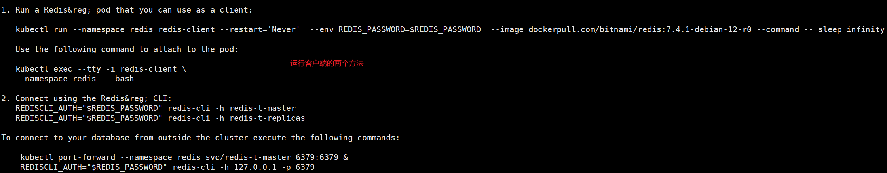

7. 查看安装情况

   ```bash
   $ kubectl get all -n redis # all获取集群内所有资源(一主三从)
   NAME                     READY   STATUS    RESTARTS   AGE
   pod/redis-t-master-0     1/1     Running   0          5m
   pod/redis-t-replicas-0   1/1     Running   0          5m
   pod/redis-t-replicas-1   1/1     Running   0          4m8s
   pod/redis-t-replicas-2   1/1     Running   0          3m41s
   
   NAME                       TYPE        CLUSTER-IP       EXTERNAL-IP   PORT(S)    AGE
   service/redis-t-headless   ClusterIP   None             <none>        6379/TCP   5m1s
   service/redis-t-master     ClusterIP   10.110.155.242   <none>        6379/TCP   5m1s
   service/redis-t-replicas   ClusterIP   10.105.93.88     <none>        6379/TCP   5m1s
   
   NAME                                READY   AGE
   statefulset.apps/redis-t-master     1/1     5m1s
   statefulset.apps/redis-t-replicas   3/3     5m1s
   
   $ kubectl get pv,pvc -n redis # pv是集群级别资源，PVC是namesapce级别资源需要指定命名空间
   NAME                                                        CAPACITY   ACCESS MODES   RECLAIM POLICY   STATUS   CLAIM                                  STORAGECLASS          REASON   AGE
   persistentvolume/pvc-082e0fa1-f4bf-4202-9bc3-b455af227b88   100Mi      RWO            Retain           Bound    redis/redis-data-redis-t-replicas-0    managed-nfs-storage            7m5s
   persistentvolume/pvc-21e011f5-7adb-404c-a9c6-6a0db4a70c51   100Mi      RWO            Retain           Bound    redis/redis-data-redis-t-master-0      managed-nfs-storage            7m5s
   persistentvolume/pvc-69f60b79-8772-48e2-833d-ed99ac700cfd   100Mi      RWO            Retain           Bound    redis/redis-data-redis-t-replicas-2    managed-nfs-storage            5m46s
   persistentvolume/pvc-c2e51530-80d1-483a-a9f6-b225d64c4be7   500Mi      RWO            Retain           Bound    default/nginx-sc-test-pvc-nginx-sc-0   managed-nfs-storage            22m
   persistentvolume/pvc-c5ff02fa-5e0a-46d1-9ee5-2ab186995432   100Mi      RWO            Retain           Bound    redis/redis-data-redis-t-replicas-1    managed-nfs-storage            6m13s
   
   NAME                                                  STATUS   VOLUME                                     CAPACITY   ACCESS MODES   STORAGECLASS          AGE
   persistentvolumeclaim/redis-data-redis-t-master-0     Bound    pvc-21e011f5-7adb-404c-a9c6-6a0db4a70c51   100Mi      RWO            managed-nfs-storage   7m6s
   persistentvolumeclaim/redis-data-redis-t-replicas-0   Bound    pvc-082e0fa1-f4bf-4202-9bc3-b455af227b88   100Mi      RWO            managed-nfs-storage   7m6s
   persistentvolumeclaim/redis-data-redis-t-replicas-1   Bound    pvc-c5ff02fa-5e0a-46d1-9ee5-2ab186995432   100Mi      RWO            managed-nfs-storage   6m13s
   persistentvolumeclaim/redis-data-redis-t-replicas-2   Bound    pvc-69f60b79-8772-48e2-833d-ed99ac700cfd   100Mi      RWO            managed-nfs-storage   5m46s
   # 动态制备了pv
   ```

8. 测试

   > 新版本redis会自动开启密码验证，如果helm安装redis不设置密码，默认会自己设置。

   ```bash
   # 1.登录master节点
   $ kubectl exec -it pod/redis-t-master-0 -n redis -- bash
   I have no name!@redis-t-master-0:/$ redis-cli 
   127.0.0.1:6379> get *
   (error) NOAUTH Authentication required. # 提示未认证
   127.0.0.1:6379> auth vYA4NoRh29 # 密码获取见下面
   OK
   127.0.0.1:6379> get *
   (nil)
   127.0.0.1:6379> set name redis
   OK
   127.0.0.1:6379> get name
   "redis"
   # 2.进入从节点,尝试读写
   $ kubectl exec -it redis-t-replicas-0 -n redis -- bash
   I have no name!@redis-t-replicas-0:/$ redis-cli 
   127.0.0.1:6379> get name
   (error) NOAUTH Authentication required.
   127.0.0.1:6379> auth vYA4NoRh29
   OK
   127.0.0.1:6379> get name
   "redis"
   127.0.0.1:6379> set hello redis
   (error) READONLY You cant write against a read only replica. #只能读不能写
   ```

   **获取redis默认密码：**

   1. 查看redis主节点的yaml文件`kubectl get pod redis-t-master-0 -n redis -o yaml`

      ```yaml
      apiVersion: v1
      kind: Pod
      metadata:
        ...
      spec:
        ...
        containers:
        - args:
          - -c
          - /opt/bitnami/scripts/start-scripts/start-master.sh
          command:
          - /bin/bash
          env:
          - name: BITNAMI_DEBUG
            value: "false"
          - name: REDIS_REPLICATION_MODE
            value: master
          - name: ALLOW_EMPTY_PASSWORD
            value: "no"
          - name: REDIS_PASSWORD # 查到redis密码保存在secret中，secret名子为redis-t
            valueFrom:
              secretKeyRef:
                key: redis-password
                name: redis-t
          - name: REDIS_TLS_ENABLED
            value: "no"
      ```

   2. 从`redis`命名空间下名字叫`redis-t`的secret中找到key`redis-password`，并对输出进行bae64解码。最后输出的就是redis密码

      ```bash
      kubectl get secret redis-t -n redis -o jsonpath='{.data.redis-password}'|base64 --decode # base64解码
      ```

9. **helm升级**

   > **helm升级不仅仅指服务版本等信息，你也可以修改在k8s中资源的配置如Pod内容，这也算升级**

   + **升级尝试1：修改密码(失败)**

     这是因为我们刚开始没指定密码**则密码依赖于k8s中的secret，后面我们更新密码时，helm不会自动替换secret中内容。(不改pod容器的启动参数)**

     ```yaml
     # 1. 修改redis的chart文件 修改了values.yaml的配置文件中redis密码
     
     # 2. 开始升级（redis-t表示指定升级的release名即运行的chart）
     $ helm upgrade redis-t ./redis -n redis #  ./redis为values.yaml所在的目录
     		# 反馈信息和部署的几乎一样
     # 3.查看pod状态，发现没变化
     # 4.随便进入一个pod
     # 5.发现还是原来的密码，新密码失败
     ```

   + **升级尝试1：修改master端口(成功)**

     ```bash
     # 1. 修改redis的chart文件 修改了values.yaml的配置文件中master机器的端口
     
     # 2. 开始升级（redis-t表示指定升级的release名即运行的chart）
     $ helm upgrade redis-t ./redis -n redis #  ./redis为values.yaml所在的目录
     		# 反馈信息和部署的几乎一样
     # 3.查看pod状态，发现有变化（全部删除重建，按照sts的顺序：序号高的先删除）
     # 4.进入master节点的容器 发现端口变为6380
     $ kubectl exec -it redis-t-master-0 -n redis -- bash
     I have no name!@redis-t-master-0:/$ redis-cli
     Could not connect to Redis at 127.0.0.1:6379: Connection refused
     not connected> exit
     I have no name!@redis-t-master-0:/$ redis-cli -p 6380
     127.0.0.1:6380> auth vYA4NoRh29
     OK
     127.0.0.1:6380> get name
     "redis"
     127.0.0.1:6380> set hello redis-2
     OK
     127.0.0.1:6380> exit
     # 5. 发现从节点全部报错，提示
     Could not connect to Redis at redis-t-master-0.redis-t-headless.redis.svc.cluster.local:6379: No address associated with hostname
     或
     Could not connect to Redis at redis-t-master-0.redis-t-headless.redis.svc.cluster.local:6380: No address associated with hostname
     # 这是因为改了master的端口，并没有改配置headless服务的端口 (属于意料之中的错误)
     # 第一个错误是 pod redis-t-replicas-0和redis-t-replicas-1报错的，因为master更新了，他俩没更新还是原来的
     # 第一个错误是 pod redis-t-replicas-2 它刚更新，但是连不上master 6380
     ```

10. **helm回滚**

    ```bash
    # 1. 查看指定release即chart实例的历史版本
    $ helm history redis-t -n redis # redis-t是release
    REVISION	UPDATED                 	STATUS    	CHART       	APP VERSION	DESCRIPTION     
    1       	Fri Oct 25 16:30:21 2024	superseded	redis-20.2.1	7.4.1      	Install complete
    2       	Fri Oct 25 17:26:45 2024	superseded	redis-20.2.1	7.4.1      	Upgrade complete
    # 2.回滚到指定版本（和k8s的步骤一样）
    $ helm rollback redis-t 1 -n redis # redis-t是release
    Rollback was a success! Happy Helming!
    # 3.查看pod （如果有的pod重试最大次数了，最好将原来的pod全部删除）
    删除 3个从节点
    # 4. 进入master节点，发现端口变为6379数据没丢失，且更新失败的数据 hello也存在
    等待一会，其余三个pod 从服务全部更新完成
    # 5. 进入三个pod 从服务节点，成功连接master端口且数据没丢失， hello也存在

11. helm卸载redis

    > 注意PV和PVC不会删除，和k8s中删除Pod的一样，k8s删除pod也不会删除PV和PVC。

    ```bash
    # 1.列出所有的chart运行服务即release
    $ helm list -A
    # 2.卸载其中一个如redis
    $ helm delete redis-t -n redis # 等价于helm uninstall redis-t -n redis
    release "redis-t" uninstalled
    # 3. 查看k8s中 redis命名空间下资源 (发现都删除,除了PVC和PV)
    No resources found in redis namespace.
    # 4. 查看PV和PVC，redis的还存在
    kubectl get pv,pvc -n redis
    # 5.删除PVC（PV是否删除取决于存储类StorageClass的默认规则） 
    kubectl delete  persistentvolumeclaim/redis-data-redis-t-master-0 persistentvolumeclaim/redis-data-redis-t-replicas-0 persistentvolumeclaim/redis-data-redis-t-replicas-1 persistentvolumeclaim/redis-data-redis-t-replicas-2 -n redis
    # 6.根据需要删除PV（PV是否还存在取决于存储类StorageClass的默认规则） 
    ```

    

# 31. k8s集群监控

## 31.1 监控方案

+ **Heapster**

  官网地址：https://github.com/kubernetes-retired/heapster

  Heapster是容器集群监控和性能分析工具,天然的支持kubernetes和CoreOS。

  Kubernetes有个出名的监控agent---cAdvisor。在每个kubernetes Node上都会运行cAdvisor，他会收集本机以及容器的监控数据(cpu,memory,filesystem,network,uptime)。在较新的版本中，k8s已经将cAdvicsor功能集成到kubelet组件中，每个Node节点可以直接进行web访问。

+ **Weave Scope**

  官网：https://github.com/weaveworks/weave

  Weave Scope可以监控kubernetes集群中的一系列资源的状态、资源使用情况、应用拓扑、scale、还可以直接通过浏览器进入容器内部调试等，其提供的功能包括：

  + 交互式拓扑界面
  + 图像模式和表格模式
  + 过滤功能
  + 搜索功能
  + 实时度量
  + 容器排错
  + 插件扩展

+ **Prometheus**

  官网：https://github.com/prometheus/prometheus

  k8s专用版官网：https://github.com/prometheus-operator/kube-prometheus

  Prometheus是一套开源的监控系统、报警、时间序列的集合。最初由SoundCloud开发，后来随着越来越多公司的使用，于是便独立成开源项目。自此以后，许多公司和组织都采用了Prometheus作为监控告警工具。

## 31.2 prometheus介绍

官网：https://prometheus.io/docs/introduction/overview/

Prometheus 的主要特点是： 

- 一个多维 [数据模型 ](https://prometheus.io/docs/concepts/data_model/)，其中包含由指标名称和键/值对标识的时间序列数据 
- PromQL，一种 [灵活的查询语言 ](https://prometheus.io/docs/prometheus/latest/querying/basics/) 利用此维度 
- 不依赖分布式存储;单个服务器节点是自主的 
- 时间序列收集是通过 HTTP 上的拉取模型进行的 
- [推送时间序列 ](https://prometheus.io/docs/instrumenting/pushing/) 支持通过中间网关 
- 通过服务发现或静态配置发现目标 
- 多种绘图和仪表板模式支持 

### 指标

指标是外行术语中的数字测量。术语 时间序列 是指随时间变化的记录。用户想要测量的内容因应用程序而异。对于 Web 服务器，它可以是请求时间;对于数据库，它可以是活动连接数或活动查询数，依此类推。 

指标在理解应用程序为何以某种方式工作方面发挥着重要作用。假设您正在运行一个 Web  应用程序，并发现它很慢。要了解您的应用程序发生了什么，您将需要一些信息。例如，当请求数较高时，应用程序可能会变慢。如果您有请求计数指标，则可以确定原因并增加服务器数量以处理负载。 

### 组件

Prometheus 生态系统由多个组件组成，其中许多组件是 自选： 

- 主要的、核心的  [Prometheus 服务器 ](https://github.com/prometheus/prometheus)，用于抓取和存储时间序列数据 
- [客户端库 ](https://prometheus.io/docs/instrumenting/clientlibs/) 用于检测应用程序代码的 
-   [推送网关 ](https://github.com/prometheus/pushgateway) 用于支持短期作业的 
- 特殊用途的服务 [导出器 ](https://prometheus.io/docs/instrumenting/exporters/) 如HAProxy、StatsD、Graphite 等
- 用于  [ AlertManager ](https://github.com/prometheus/alertmanager) 处理警报的 
- 各种支持工具 

### 架构图

Prometheus 直接从检测作业中或通过 用于短期作业的 intermediary push gateway。它存储所有刮取的样本 本地，并对此数据运行规则以聚合和记录新时间 系列或生成警报。 [Grafana ](https://grafana.com/) 或 其他 API 使用者可用于可视化收集的数据。

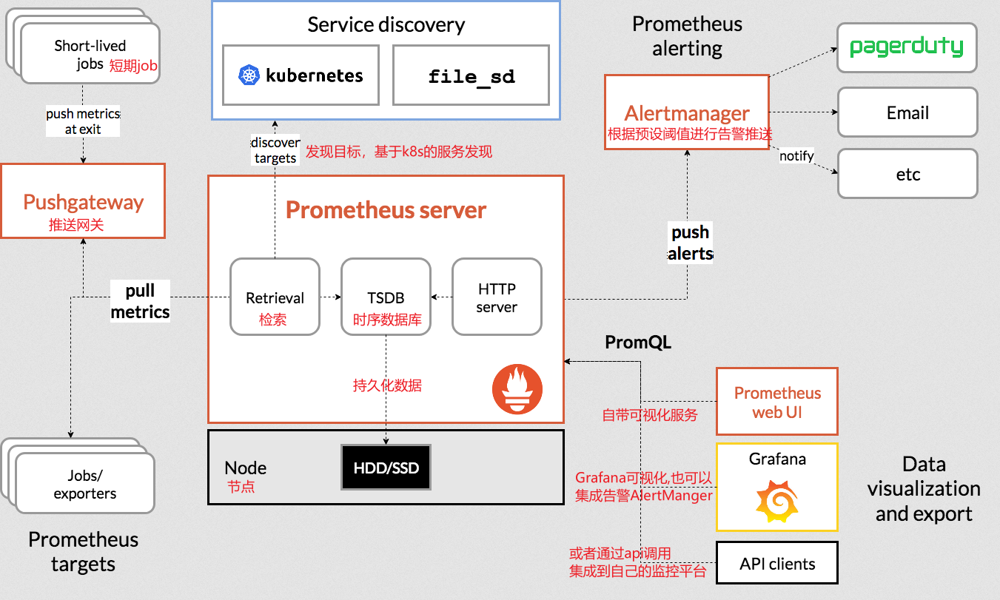

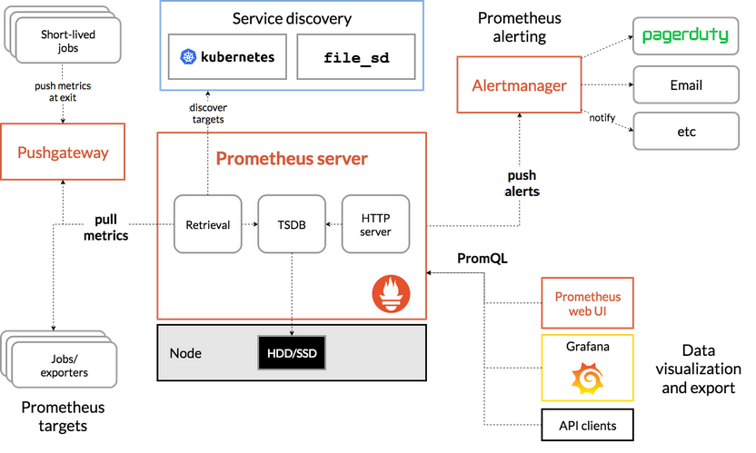


### 什么时候适合？ 

Prometheus 非常适合记录任何纯数字时间序列。它适合 既可以进行以机器为中心的监测，也可以监测高度动态的 面向服务的架构。在微服务的世界中，它对 多维数据收集和查询是一个特别的优势。 

Prometheus 专为可靠性而设计，旨在成为您首选的系统 在中断期间，以便您快速诊断问题。每个 Prometheus 服务器是独立的，不依赖于网络存储或其他远程服务。 当基础设施的其他部分出现故障时，您可以依赖它，并且 您无需设置广泛的基础设施即可使用它。 

### 什么时候不合适？ 

Prometheus 重视可靠性。您始终可以查看统计数据 可用于您的系统，即使在故障情况下也是如此。如果您需要 100% 准确性，例如对于按请求计费，Prometheus 不是一个好的选择，因为 收集的数据可能不够详细和完整。在这样的 如果您最好使用其他系统来收集和分析 data 进行计费，Prometheus 进行其余监控。 

## 31.3 搭建prometheus

### 31.3.1 自定义配置文件安装(留着以后去挑战)

```bash
prometheus
├── blackbox-exporter.yml
├── grafana-service.yml
├── grafana-statefulset.yml
├── kube-monitoring.yml
├── prometheus-config.yml # prometheus的配置文件，里面由prometheus.yml
├── prometheus-daemonset.yml
├── prometheus-deployment.yml # 部署prometheus的
├── prometheus-rbac-setup.yaml # 给prometheus分配权限
└── prometheus-service.yml
```

自己手动一个一个写配置文件，对权限的详细配置：

1. 创建ConfigMap配置
2. 部署Prometheus
3. 配置访问权限
4. 服务发现配置
5. 系统时间同步
6. 监控K8s集群
   + 从kubelet获取节点容器资源使用情况
   + Exporter监控资源使用情况
   + 对Ingress和Serice进行网络探测
7. Grafana可视化
   + 基本概念
     + 数据源（Data Source）
     + 仪表盘（Dashboard）
     + 组织和用户
   + 集成Grafana
     + 部署Grafana
     + 服务发现
     + 配置Grafana面板
8. service无法访问问题

### 31.3.2 kube-prometheus安装

官方仓库：https://github.com/prometheus-operator/kube-prometheus

官方网址：https://prometheus-operator.dev/docs/getting-started/installation/#install-using-kube-prometheus

1. 打开kube-prometheus官方仓库，根据自己的kubernetes版本选择对应kube-prometheus

   ```bash
   $ kubectl version # 我的版本是1.23，我就选择0.11了
   ```

2. 在k8s集群中的机器上下载对应版本，并解压

   ```bash
   # 1.下载v0.11的配置文件
   $ wget https://github.com/prometheus-operator/kube-prometheus/archive/refs/tags/v0.11.0.tar.gz
   # 2.解压
   $ tar -zxvf v0.11.0.tar.gz
   ```

3. 确定配置文件的位置（**README.md有说明**）

   就在`kube-prometheus-0.11.0/manifest`中

4. 修改里面的镜像信息，加速

   **推荐使用vscode**

   ```bash
   # 将所有文件中镜像地址代替为192.168.31.79:5000
   sed -i 's#image: quay.io/#image: 192.168.31.79:5000/#g' $(ls|grep -v 'setup')
   sed -i 's#image: k8s.gcr.io/#image: 192.168.31.79:5000/#g' $(ls|grep -v 'setup')
   sed -i 's#image: jimmidyson/#image: 192.168.31.79:5000/jimmidyson/#g' $(ls|grep -v 'setup')
   sed -i 's#image: grafana/#image: 192.168.31.79:5000/grafana/#g' $(ls|grep -v 'setup')
   ```

5. 应用配置文件,创建prometheus

   ```bash
   # 1.先执行manifests/setup下文件
   $ kubectl apply -f manifests/setup # 直接使用一个文件夹
   # 如果报错了 Too long: must have at most 262144 bytes 使用crate
   $ kubectl delete -f manifests/setup --ignore-not-found
   $ kubectl create -f manifests/setup # 不能加--save-config,不然一样,就是annotation太长了
   # 官方推荐的  
   $ kubectl apply --server-side -f manifests/setup
   
   # 2.等待自定义的k8s资源 servicemonitors 创建成功
   $ until kubectl get servicemonitors --all-namespaces ; do date; sleep 1; echo ""; done
   
   # 3.应用manifests下文件
   $ kubectl apply -f manifests
   ```

6. 查看prometheus相关资源，等待所有Pod服务启动(**命名空间为monitoring**)

   **master主服务推荐：4GB内存**

   ```bash
   $ kubectl get all -n monitoring
   NAME                                       READY   STATUS    RESTARTS       AGE
   pod/alertmanager-main-0                    2/2     Running   0              116m
   pod/alertmanager-main-1                    2/2     Running   4 (101m ago)   116m
   pod/alertmanager-main-2                    2/2     Running   0              116m
   pod/blackbox-exporter-7876549967-s9wgz     3/3     Running   0              116m
   pod/grafana-794864c5ff-2sbk6               1/1     Running   0              116m
   pod/kube-state-metrics-696f686887-wzfxj    3/3     Running   0              116m
   pod/node-exporter-f7g5c                    2/2     Running   0              116m
   pod/node-exporter-ndcqf                    2/2     Running   0              116m
   pod/node-exporter-nwrxq                    2/2     Running   3 (101m ago)   116m
   pod/prometheus-adapter-597b4d6949-mpfnn    1/1     Running   0              116m
   pod/prometheus-adapter-597b4d6949-sv5pv    1/1     Running   0              116m
   pod/prometheus-k8s-0                       2/2     Running   0              116m
   pod/prometheus-k8s-1                       2/2     Running   4 (101m ago)   116m
   pod/prometheus-operator-55c5f84c64-vwtql   2/2     Running   0              116m
   
   NAME                            TYPE        CLUSTER-IP      EXTERNAL-IP   PORT(S)                      AGE
   service/alertmanager-main       ClusterIP   10.109.27.190   <none>        9093/TCP,8080/TCP            116m
   service/alertmanager-operated   ClusterIP   None            <none>        9093/TCP,9094/TCP,9094/UDP   116m
   service/blackbox-exporter       ClusterIP   10.101.241.48   <none>        9115/TCP,19115/TCP           116m
   service/grafana                 ClusterIP   10.98.9.87      <none>        3000/TCP                     116m
   service/kube-state-metrics      ClusterIP   None            <none>        8443/TCP,9443/TCP            116m
   service/node-exporter           ClusterIP   None            <none>        9100/TCP                     116m
   service/prometheus-adapter      ClusterIP   10.109.186.22   <none>        443/TCP                      116m
   service/prometheus-k8s          ClusterIP   10.97.253.83    <none>        9090/TCP,8080/TCP            116m
   service/prometheus-operated     ClusterIP   None            <none>        9090/TCP                     116m
   service/prometheus-operator     ClusterIP   None            <none>        8443/TCP                     116m
   
   NAME                           DESIRED   CURRENT   READY   UP-TO-DATE   AVAILABLE   NODE SELECTOR            AGE
   daemonset.apps/node-exporter   3         3         3       3            3           kubernetes.io/os=linux   116m
   
   NAME                                  READY   UP-TO-DATE   AVAILABLE   AGE
   deployment.apps/blackbox-exporter     1/1     1            1           116m
   deployment.apps/grafana               1/1     1            1           116m
   deployment.apps/kube-state-metrics    1/1     1            1           116m
   deployment.apps/prometheus-adapter    2/2     2            2           116m
   deployment.apps/prometheus-operator   1/1     1            1           116m
   
   NAME                                             DESIRED   CURRENT   READY   AGE
   replicaset.apps/blackbox-exporter-7876549967     1         1         1       116m
   replicaset.apps/grafana-794864c5ff               1         1         1       116m
   replicaset.apps/kube-state-metrics-696f686887    1         1         1       116m
   replicaset.apps/prometheus-adapter-597b4d6949    2         2         2       116m
   replicaset.apps/prometheus-operator-55c5f84c64   1         1         1       116m
   
   NAME                                 READY   AGE
   statefulset.apps/alertmanager-main   3/3     116m
   statefulset.apps/prometheus-k8s      2/2     116m

7. 尝试访问服务（**集群内外机器以及大部分Pod容器内默认都无法访问，需要搭配ingress**）

   + prometheus服务`9090`端口(**见上面svc**)：无法访问
   + grafana服务`3000`端口(**见上面svc**)：无法访问
   + alertmanager`9093`端口(**见上面svc**)：无法访问

   ***原因就是：这三个服务定义了***`NetworkPolicy`***策略：***

   以`prometheus-k8s`（prometheus主服务）的`prometheus-networkPolicy.yaml`为例：

   ```yaml
   # NetWorkPolicy官方参考api文档  https://kubernetes.io/zh-cn/docs/reference/kubernetes-api/policy-resources/network-policy-v1/
   apiVersion: networking.k8s.io/v1
   kind: NetworkPolicy # 类似于防火墙
   metadata:
     labels:
       app.kubernetes.io/component: prometheus
       app.kubernetes.io/instance: k8s
       app.kubernetes.io/name: prometheus
       app.kubernetes.io/part-of: kube-prometheus
       app.kubernetes.io/version: 2.36.1
     name: prometheus-k8s
     namespace: monitoring # 默认只允许自己命名空间内，符合规则出入（除非下面配置了namespaceSelector）
   spec:
     egress: # 为空，表示拒绝所有出站流量
     - {}
     ingress: # 入栈规则
     - from: # 规则1：只允许当前namespace（因为没配置namesapceSelector）下符合podSelector的可以访问9090和8080端口
       - podSelector:
           matchLabels:
             app.kubernetes.io/name: prometheus
       ports:
       - port: 9090
         protocol: TCP
       - port: 8080
         protocol: TCP
     - from: # 规则2：只允许当前namespace（因为没配置namesapceSelector）下符合podSelector的可以访问9090端口
       - podSelector:
           matchLabels:
             app.kubernetes.io/name: grafana
       ports:
       - port: 9090
         protocol: TCP
     podSelector: # 表示对当前命名空间monitoring下哪些pod生效
       matchLabels:
         app.kubernetes.io/component: prometheus
         app.kubernetes.io/instance: k8s
         app.kubernetes.io/name: prometheus
         app.kubernetes.io/part-of: kube-prometheus
     policyTypes: # 流量策略
     - Egress # 配置流量出口（Egress）
     - Ingress # 配置流量入口（Ingress）
   ```

   > 一些旧版本中上面三个服务在service中显示的都是`NodepPort`类型，但是在集群外（还是Node节点上，非Pod容器中）还是无法访问，**此时也需要配置ingress服务**

8. 解决外部无法访问三大服务

   + **方法1：官网方法使用端口转发(临时转发,仅用于调试目的)**

     地址：https://prometheus-operator.dev/kube-prometheus/kube/access-ui/

     ```bash
     # 在哪里执行就是绑定哪个机器的127.0.0.1,还不能用当前的机器的ip如192.168.136.151:9090进行访问.所以仅用于测试
     kubectl --namespace monitoring port-forward svc/prometheus-k8s 9090
     kubectl --namespace monitoring port-forward svc/grafana 3000
     kubectl --namespace monitoring port-forward svc/alertmanager-main 9093
     ```

   + **方法2：配置ingress，配置域名（没有的话就随便写到时候改测试机器的hosts）**

     1. 创建ingress`kube-prometheus-ingress.yaml`

        ```yaml
        # https://kubernetes.io/docs/concepts/services-networking/ingress/
        apiVersion: networking.k8s.io/v1
        kind: Ingress
        metadata:
          name: prometheus-ingress
          namespace: monitoring
          annotations:
            nginx.ingress.kubernetes.io/proxy-connect-timeout: "10" #注意是纯数字字符串，10s, 10m都不能生效
            # nginx.ingress.kubernetes.io/proxy-send-timeout: "60"
            # nginx.ingress.kubernetes.io/proxy-read-timeout: "60"
            # nginx.ingress.kubernetes.io/proxy-next-upstream: "120"
        spec:
          ingressClassName: "nginx"
          rules:
          - host: prometheus.foo.com
            http:
              paths:
              - path: /
                pathType: Prefix
                backend:
                  service:
                    name: prometheus-k8s
                    port:
                      number: 9090
          - host: grafana.foo.com
            http:
              paths:
              - path: /
                pathType: Prefix
                backend:
                  service:
                    name: grafana
                    port:
                      number: 3000
          - host: alertmanager.foo.com
            http:
              paths:
              - path: /
                pathType: Prefix
                backend:
                  service:
                    name: alertmanager-main
                    port:
                      number: 9093
        ```

     2. 修改三大服务的NetworkPolicy文件,准许ingress-nginx访问这三大服务端口

        + `prometheus-networkPolicy.yaml`
        + `grafana-networkPolicy.yaml`
        + `alertmanager-networkPolicy.yaml`

        ```yaml
        #　三个配置文件都增加以下配置
        spec:
          ingress:
          - from:
            - namespaceSelector:
                matchLabels:
                  kubernetes.io/metadata.name: ingress-nginx
        ```

     3. 测试

        > [!Warning]
        >
        > **不知道为什么,ingress-nginx命名空间下其他pod都可以通过集群ip:port访问prometheus-k8s-0/1,而ingress-nginx-controller只能访问prometheus-k8s-0,无法访问prometheus-k8s-1.这也就导致了在集群外通过ingress-nginx访问就会出现 有时访问立刻出现，有时访问等待10s后才会出现内容（因为负载均衡是轮询的方式，总有一次到prometheus-k8s-1，等待10秒后失败重试到另一个节点prometheus-k8s-0）。**10s是因为ingress中配置连接最大等待时间是10，默认失败重试3次。
        >
        > When I try it in  namespace`ingress-nginx `  pod `busybox `,**it works correctly**(I tried each step many times).
        >
        > ```bash
        > $ kubectl exec -it busybox -n ingress-nginx -- sh
        > / \# wget 10.244.169.150:9090/targets --spider # pod prometheus-k8s-0 in node k8s-node2
        > Connecting to 10.244.169.150:9090 (10.244.169.150:9090)
        > / \# wget  10.244.36.75:9090/targets --spider # pod prometheus-k8s-1 in node k8s-node1
        > Connecting to 10.244.36.75:9090 (10.244.36.75:9090)
        > / \# wget prometheus-k8s.monitoring:9090/targets --spider
        > Connecting to prometheus-k8s.monitoring:9090 (10.105.170.59:9090)
        > ```
        >
        > But when I try it in  namespace`ingress-nginx `  pod `ingress-nginx-controller`,**It also behaves differently**(I tried each step many times).
        >
        > ```bash
        > $ kubectl exec -it ingress-nginx-controller-pntw2 -n ingress-nginx -- sh
        > /etc/nginx $ wget 10.244.169.150:9090/targets --spider # pod prometheus-k8s-0 in node k8s-node2
        > Connecting to 10.244.169.150:9090 (10.244.169.150:9090)
        > remote file exists
        > /etc/nginx $ wget  10.244.36.75:9090/targets --spider  # pod prometheus-k8s-1 in node k8s-node1
        > Connecting to 10.244.36.75:9090 (10.244.36.75:9090)
        > wget: can\'t connect to remote host (10.244.36.75): Operation timed out  # error
        > /etc/nginx $ wget prometheus-k8s.monitoring:9090/targets --spider
        > Connecting to prometheus-k8s.monitoring:9090 (10.105.170.59:9090)
        > remote file exists
        > ```
        >
        > Here is request log for `ingress-nginx-controller` and postman request:
        >
        > ```bash
        > 2024/10/28 09:41:11 [error] 26\#26: *58827 upstream timed out (110: Operation timed out) while connecting to upstream, client: 192.168.136.1, server: prometheus.foo.com, request: "GET /targets HTTP/1.1", upstream: "http://10.244.36.75:9090/targets", host: "prometheus.foo.com"
        > 192.168.136.1 - - [28/Oct/2024:09:41:11 +0000] "GET /targets HTTP/1.1" 200 714 "-" "PostmanRuntime/7.42.0" 184 10.001 [monitoring-prometheus-k8s-9090] [] 10.244.36.75:9090, 10.244.169.150:9090 0, 714 10.000, 0.001 504, 200 5d5940766a0ac16fcce8808647e6c667
        > ```
        >
        > 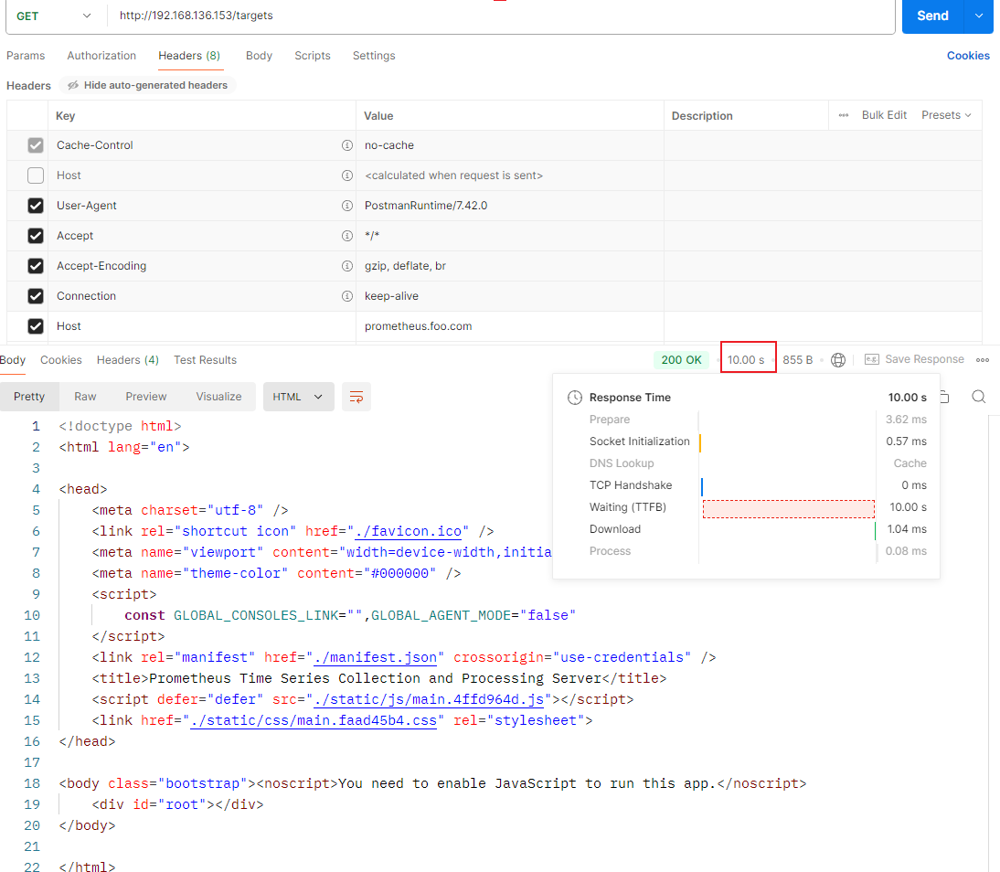

   + **方法3：删除三大服务的NetworkPolicy文件(推荐,方便)**

   

9. 访问

   + prometheus.foo.com
   + grafana.foo.com
   + alertmanager.foo.com

# 32. ELK日志管理


## 32.1 组件介绍

**ELK即elasticsearch，logstash，kibana**

+ **ElasticSearch**:  专门负责日志数据存储和实时检索

  Elasticsearch是Elastic Stack核心的分布式搜索和分析引擎，是一个基于Lucene、分布式、通过**Restful方式**进行交互的近实时搜索平台框架。Elasticsearch为所有类型的数据提供**近乎实时的搜索和分析**。无论您是结构化文本还是非结构化文本，数字数据或地理空间数据，Elasticsearch都能以支持快速搜索的方式有效地对其进行存储和索引。

+ **Logstash**: 负责数据采集和清洗

  使用Java语言编写，负责数据的收集和清洗，比较笨重但功能较齐全。	

  Logstash是免费且开放的服务器端数据处理管道，能够从多个来源采集数据，转换数据，然后将数据发送到您最喜欢的“存储库”中。Logstash能够动态地采集、转换和传输数据，不受格式或复杂度的影响。利用Grok从非结构化数据中派生出结构，从IP地址解码出地理坐标，匿名化或排除敏感字段，并简化整体处理过程。

+ **Kibana**: 负责数据展示

  负责数据展示，具有检索和图表展示功能。

  Kibana是一个针对Elasticsearch的开源分析及可视化平台，用来搜索、查看交互存储在Elasticsearch索引中的数据。使用Kibana，可以通过各种图表进行高级数据分析及展示。并且可以为 Logstash 和 ElasticSearch 提供的日志分析友好的 Web  界面，可以汇总、分析和搜索重要数据日志。还可以让海量数据更容易理解。它操作简单，基于浏览器的用户界面可以快速创建仪表板（dashboard）实时显示Elasticsearch查询动态

+ **Filebeat**: 负责数据采集

  使用go语言编写的轻量级日志收集服务，专门负责日志的收集

  Filebeat是用于转发和集中日志数据的轻量级传送工具。Filebeat监视您指定的日志文件或位置，收集日志事件，并将它们转发到Elasticsearch或  Logstash进行索引。Filebeat的工作方式如下：启动Filebeat时，它将启动一个或多个输入，这些输入将在为日志数据指定的位置中查找。对于Filebeat所找到的每个日志，Filebeat都会启动收集器。每个收集器都读取单个日志以获取新内容，并将新日志数据发送到libbeat，libbeat将聚集事件，并将聚集的数据发送到为Filebeat配置的输出。

+ **Kafaka/Redis**: 

  如果Node节点上Filebeat采集的日志数据量过大，Logstash无法马上消费掉，那么此时就需要借助消息队列Kafaka，也可以使用redis等。

## 32.2 完整日志系统基本特征

- 收集：能够采集多种来源的日志数据
- 传输：能够稳定的把日志数据解析过滤并传输到存储系统
- 存储：存储日志数据
- 分析：支持 UI 分析
- 警告：能够提供错误报告，监控机制

## 32.3 k8s中日志收集流程

1. 由于我们使用的容器引擎为dockers，而每个Node节点上docker容器日志默认保存路径为：`/var/log/containers`
2. **在集群中部署一套（或多套）ELK日志收集服务**
3. 在每个Node集群上都运行一个**daemonset**用来运行**FIlebeat**服务，进行日志采集
4. **Filebeat**服务将收集到的日志传输到**Logstash**进行存储和清洗，如果消息太多等可以采用**Kafaka**消息队列进行缓冲(或redis)
5. **Logstash**将清洗后数据存储到Elastcsearch中，它会将数据划分为不同的索引（Indexes），并分布式地存储在各个节点的磁盘上。
6. **Kibana**通过Elasticsearch 提供的Restful API检索数据，并进行展示、分析
7. 我们通过**Kibana**可视化界面访问

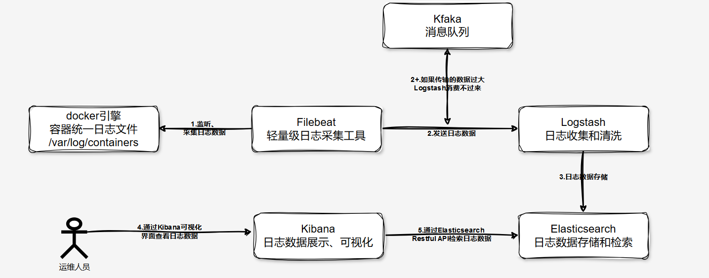

## 32.4 k8s中日志收集系统架构图

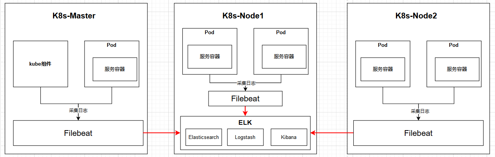

## 32.5 部署ELK日志管理服务

***这四个组件的版本最好一致***

### 32.5.0 准备工作

1. 准备命名空间`kube-logging`

   ```yaml
   apiVersion: v1
   kind: Namespace
   metadata:
     labels:
       kubernetes.io/metadata.name: kube-logging
     name: kube-logging
   ```

2. 给k8s-master节点打上标签

   ```bash
   $ kubectl label no k8s-master elk="true"
   ```

3. 

### 32.5.1 部署ElasticSearch服务

配置文件如下:

```yaml
# https://kubernetes.io/docs/concepts/services-networking/service/
apiVersion: v1
kind: Service
metadata:
  name: elasticsearch-logging
  namespace: kube-logging
  labels:
    k8s-app: elasticsearch-logging
    kubernetes.io/cluster-service: "true"
    addonmanager.kubernetes.io/mode: Reconcile
    kubernetes.io/name: "Elasticsearch"
spec:
  selector:
    k8s-app: elasticsearch-logging
  type: ClusterIP
  ports:
  - name: elasticsearch
    protocol: TCP
    port: 9200
    targetPort: db # 可以是端口或者名字
---
# RBAC auth and authz
# https://kubernetes.io/docs/reference/access-authn-authz/rbac/
apiVersion: v1
kind: ServiceAccount
metadata:
  name: elasticsearch-logging
  namespace: kube-logging
  labels:
    k8s-app: elasticsearch-logging
    kubernetes.io/cluster-service: "true"
    addonmanager.kubernetes.io/mode: Reconcile
---
# https://kubernetes.io/docs/reference/access-authn-authz/rbac/
apiVersion: rbac.authorization.k8s.io/v1
kind: ClusterRole
metadata:
  name: elasticsearch-logging
  # namespace: kube-logging # clusterrole 不是命名空间级资源，不要指定ns
  labels:
    k8s-app: elasticsearch-logging
    kubernetes.io/cluster-service: "true"
    addonmanager.kubernetes.io/mode: Reconcile
rules:
- apiGroups: [""] # "" indicates the core API group
  resources: ["services","namespaces","endpoints"]
  verbs: ["get"]
---
# https://kubernetes.io/docs/reference/access-authn-authz/rbac/
apiVersion: rbac.authorization.k8s.io/v1
kind: ClusterRoleBinding
metadata:
  name: elasticsearch-logging
  # namespace: kube-logging # cluterrolebinding 也是集群级别的资源，不要指定ns
  labels:
    k8s-app: elasticsearch-logging
    kubernetes.io/cluster-service: "true"
    addonmanager.kubernetes.io/mode: Reconcile
subjects:
- kind: ServiceAccount
  name: elasticsearch-logging # Name is case sensitive
  namespace: kube-logging # 只有serviceaccount需要指定命名空间
  apiGroup: "" # 留空表示核心组 rbac.authorization.k8s.io
roleRef:
  kind: ClusterRole
  name: elasticsearch-logging
  apiGroup: ""
---
# ES itself
# https://kubernetes.io/docs/concepts/workloads/controllers/statefulset/
apiVersion: apps/v1
kind: StatefulSet
metadata:
  name: elasticsearch-logging
  namespace: kube-logging
  labels:
    k8s-app: elasticsearch-logging
    kubernetes.io/cluster-service: "true"
    addonmanager.kubernetes.io/mode: Reconcile
    srv: srv-elasticsearch
spec:
  selector:
    matchLabels:
      k8s-app: elasticsearch-logging
  serviceName: "elasticsearch-logging" # sts必须要有服务
  replicas: 1
  template:
    metadata:
      labels:
        k8s-app: elasticsearch-logging
        kubernetes.io/cluster-service: "true"
    spec:
      serviceAccountName: elasticsearch-logging # serviceaccount不是service
      containers:
      - name: elasticsearch-logging
        image: 192.168.31.79:5000/library/elasticsearch:7.9.3
        resources:
          limits:
            cpu: 800m
            memory: 800Mi
          requests:
            cpu: 100m
            memory: 200Mi
        ports:
        - containerPort: 9200
          name: db
          protocol: TCP
        - containerPort: 9300
          name: transport
          protocol: TCP
        volumeMounts:
        - name: elasticsearch-logging
          mountPath: /usr/share/elasticsearch/data/
        env:
        - name: "NAMESPACE"
          valueFrom:
            fieldRef: # 使用内置的元数据
              fieldPath: metadata.namespace
        - name: "discovery.type"
          value: "single-node"
        - name: ES_JAVA_OPTS
          value: "-Xms200m -Xmx2g"
      volumes:
      - name: elasticsearch-logging
        hostPath: 
          path: /data/elasticsearch/
      nodeSelector:
        elk: "true"
      tolerations:
      - effect: NoSchedule
        operator: Exists
      # Elasticsearch需要vm.max_map_count最少为262144，如果你的操作系统以及达到可以不要这个初始化容器
      initContainers:
      - name: elasticsearch-logging-init
        image: 192.168.31.79:5000/alpine:latest
        command: ["/sbin/sysctl","-w","vm.max_map_count=262144"] # 添加vmmap计数限制，太低可能造成内存不足的错误
        securityContext:
          privileged: true # 给容器进程本机root权限,提权
      - name: increase-fd-ulimit
        image: 192.168.31.79:5000/busybox:1.28.4
        imagePullPolicy: IfNotPresent
        command: ["sh","-c","ulimit -n 65536"] # 修改文件描述符的最大数量
        securityContext:
          privileged: true
      - name: elasticsearch-volume-init
        image: 192.168.31.79:5000/alpine:latest
        command: ["chmod","-R","777","/usr/share/elasticsearch/data/"] 
        volumeMounts:
        - name: elasticsearch-logging
          mountPath: /usr/share/elasticsearch/data/
---
```

### 32.5.2 部署Logstash服务

+ `logstash.yml`配置文件参考：https://www.elastic.co/guide/en/logstash/7.9/logstash-settings-file.html
+ `logstash.conf`配置文件参考：https://www.elastic.co/guide/en/logstash/current/config-setting-files.html#pipeline-config-files

配置文件如下:

```yaml
# https://kubernetes.io/docs/concepts/services-networking/service/
apiVersion: v1
kind: Service
metadata:
  name: logstash
  namespace: kube-logging
spec:
  selector:
    type: logstash
  type: ClusterIP
  clusterIP: None # 无头服务
  ports:
  - name: filebeat-port #接收来自filebeat的数据
    protocol: TCP
    port: 5044
    targetPort: beats
---
# https://kubernetes.io/docs/concepts/workloads/controllers/deployment/
apiVersion: apps/v1
kind: Deployment
metadata:
  name: logstash
  namespace: kube-logging
spec:
  selector:
    matchLabels:
      type: logstash
  replicas: 1
  template:
    metadata:
      labels:
        type: logstash
        srv: srv-logstash
    spec:
    #   tolerations:
    #   - effect: NoSchedule
    #     operator: Exists
    #   nodeSelector:
    #     elk: "true"
      containers:
      - name: logstash
        image: 192.168.31.79:5000/kubeimages/logstash:7.9.3
        command: ["logstash","-f","/etc/logstash_c/logstash.conf"]
        imagePullPolicy: IfNotPresent
        resources:
          requests:
            cpu: 100m
            memory: 100Mi
          limits:
            cpu: 800m
            memory: 800Mi
        env:
        - name: XPACK_MONITORING_ELASTICSEARCH_HOSTS
          value: "http://elasticsearch-logging.kube-logging:9200" #service.namespace
        ports:
        - containerPort: 5044
          name: beats
        volumeMounts:
        - name: config-volume
          mountPath: "/etc/logstash_c/"
        - name: config-yml-volume
          mountPath: "/usr/share/logstash/config/"
        - name: timezone
          mountPath: "/etc/localtime"
      volumes:
        - name: timezone
          hostPath:
            path: "/etc/localtime"
        - name: config-volume
          configMap:
            name: logstash-conf
            items:
            - key: logstash.conf
              path: logstash.conf
        - name: config-yml-volume
          configMap:
            name: logstash-yml
            items:
            - key: logstash.yml
              path: logstash.yml
      restartPolicy: Always
---
# https://kubernetes.io/docs/concepts/configuration/configmap/
kind: ConfigMap
apiVersion: v1
metadata:
  name: logstash-conf
  namespace: kube-logging
  labels:
    type: logstash
data:
  logstash.conf: |
    # 定义输入，即数据来源（Filebeat）
    input {
        beats {
            port => 5044
        }
    }
    # 过滤器，处理需要的数据
    filter {
        # 处理ingress日志
        if [kubernetes][container][name] == "nginx-ingress-controller" {
            # json是过滤器插件  将json格式的消息解析为logstash字段（变量）
            json {
                source => "message"
                target => "ingress_log"
            }
            if [ingress_log][requesttime] {
                mutate {
                    convert => ["[ingress_log][requesttime]", "float"]
                }
            }
            if [ingress_log][upstreamtime] {
                # mutate是过滤器插件
                mutate {
                    # 将字段（变量）转换为指定类型
                    convert => ["[ingress_log][upstreamtime]", "float"]
                }
            }
            if [ingress_log][status] {
                mutate {
                    convert => ["[ingress_log][status]", "float"]
                }
            }
            if [ingress_log][httphost] and [ingress_log][uri] {
                mutate {
                    # 增加新字段（变量） [ingress_log][entry]
                    add_field => {
                        "[ingress_log][entry]" => "%{[ingress_log][httphost]}%{[ingress_log][uri]}"
                    }
                }
                mutate {
                    # 将字段（变量）分割，分隔符为 / ，并复制给自身[ingress_log][entry]
                    split => ["[ingress_log][entry]", "/"]
                }
                if [ingress_log][entry][1] {
                    mutate {
                        add_field => {
                            "[ingress_log][entrypoint]" => "%{[ingress_log][entry][0]}/%{[ingress_log][entry][1]}"
                        }
                        remove_field => "[ingress_log][entry]"
                    }
                } else {
                    mutate {
                        add_field => {
                            "[ingress_log][entrypoint]" => "%{[ingress_log][entry][0]}/"
                        }
                        remove_field => "[ingress_log][entry]"
                    }
                }
            }
        }
        # 处理以srv开头的业务服务日志
        if [kubernetes][container][name] =~ /^srv*/ {
            json {
                source => "message"
                target => "tmp"
            }
            if [kubernetes][namespace] == "kube-logging" {
                # 丢弃
                drop {}
            }
            if [tmp][level] {
                mutate {
                    add_field => {
                        "[applog][level]" => "%{[tmp][level]}"
                    }
                }
                if [applog][level] == "debug" {
                    drop {}
                }
            }
            if [tmp][msg] {
                mutate {
                    add_field => {
                        "[applog][msg]" => "%{[tmp][msg]}"
                    }
                }
            }
            if [tmp][func] {
                mutate {
                    add_field => {
                        "[applog][func]" => "%{[tmp][func]}"
                    }
                }
            }
            if [tmp][cost] {
                if "ms" in [tmp][cost] {
                    mutate {
                        split => ["[tmp][cost]","m"]
                        add_field => {
                            "[applog][cost]" => "%{[tmp][cost][0]}"
                        }
                        convert => ["[applog][cost]","float"]
                    }
                } else {
                    mutate {
                        add_field => {
                            "[applog][cost]" => "%{[tmp][cost]}"
                        }
                    }
                }
            }
            if [tmp][method] {
                mutate {
                    add_field => {
                        "[applog][method]" => "%{[tmp][method]}"
                    }
                }
            }
            if [tmp][request_url] {
                mutate {
                    add_field => {
                        "[applog][request_url]" => "%{[tmp][request_url]}"
                    }
                }
            }
            if [tmp][meta._id] {
                mutate {
                    add_field => {
                        "[applog][traceId]" => "%{[tmp][meta._id]}"
                    }
                }
            }

            if [tmp][project] {
                mutate {
                    add_field => {
                        "[applog][project]" => "%{[tmp][project]}"
                    }
                }
            }
            if [tmp][time] {
                mutate {
                    add_field => {
                        "[applog][time]" => "%{[tmp][time]}"
                    }
                }
            }
            if [tmp][status] {
                mutate {
                    add_field => {
                        "[applog][status]" => "%{[tmp][status]}"
                    }
                    convert => ["[applog][status]", "float"]
                }
            }
        }
        mutate {
            # 字段重命名
            rename => ["kubernetes","k8s"]
            # 删除add_field新增的临时字段
            remove_field => "beat"
            remove_field => "tmp"
            remove_field => "[k8s][labels][app]"
        }
    }
    # 定义输出，即数据存储（Elasticsearch）
    output {
        elasticsearch {
            # elasticsearch服务地址
            hosts => ["http://elasticsearch-logging.kube-logging:9200"]
            # 数据存储形式
            codec => json
            # 索引名称以logstash+日志进行每日新建
            index => "logstash-%{+YYYY.MM.dd}" 
        }
        # 调试 一定要注释，否则logstash会疯狂向es中存储数据，导致高cpu，高内存，高存储占用
        #stdout {
        #    codec => rubydebug
        #}
    }
---
kind: ConfigMap
apiVersion: v1
metadata:
  name: logstash-yml
  namespace: kube-logging
  labels:
    type: logstash
data:
  logstash.yml: |
    http.host: "0.0.0.0"
    xpack.monitoring.elasticsearch.hosts: "http://elasticsearch-logging.kube-logging:9200"
```

### 32.5.3 部署Filebeat服务

配置文件如下:

```yaml
# https://kubernetes.io/docs/concepts/configuration/configmap/
kind: ConfigMap
apiVersion: v1
metadata:
  name: filebeat-config
  namespace: kube-logging
  labels:
    k8s-app: filebeat
data:
  # 定义filebeat采集数据配置
  filebeat.yml: |
    filebeat.inputs:
    - type: container
      enable: true
      paths:
      # 这里是filebeat采集挂载到pod的日志目录
      - /var/log/containers/*.log
      processors:
      # 添加k8s的字段用于后续的数据清洗
      - add_kubernetes_metadata:
          host: ${NODE_NAME}
          matchers:
          - logs_path:
              logs_path: /var/log/containers/
    # 如果日志量较大，logstash处理日志有延迟，可以在filebeat和logstash中存添加kafka服务
    # output.kafka:
    #   hosts: ["kafaka-log-01:9002","kafaka-log-02:9002","kafaka-log-03:9002"]
    #   topic: "topic-test-log"
    #   version: 2.0.0
    # 直接对接 logstash
    output.logstash:
      hosts: ["logstash.kube-logging:5044"]
      enabled: true
---
# https://kubernetes.io/docs/reference/access-authn-authz/rbac/
apiVersion: v1
kind: ServiceAccount
metadata:
  name: filebeat
  namespace: kube-logging
  labels:
    k8s-app: filebeat
---
# https://kubernetes.io/docs/reference/access-authn-authz/rbac/
apiVersion: rbac.authorization.k8s.io/v1
kind: ClusterRole
metadata:
  name: filebeat
  labels:
    k8s-app: filebeat
rules:
- apiGroups: [""] # "" indicates the core API group
  resources: ["pods","namespaces"]
  verbs: ["get", "watch", "list"]
---
# https://kubernetes.io/docs/reference/access-authn-authz/rbac/
apiVersion: rbac.authorization.k8s.io/v1
kind: ClusterRoleBinding
metadata:
  name: filebeat
subjects:
- kind: ServiceAccount
  name: filebeat # Name is case sensitive
  namespace: kube-logging
  apiGroup: "" # 注意api组对应
roleRef:
  kind: ClusterRole
  name: filebeat
  apiGroup: "" # 注意api组对应
---
# https://kubernetes.io/docs/concepts/workloads/controllers/daemonset/
apiVersion: apps/v1
kind: DaemonSet
metadata:
  name: filebeat
  namespace: kube-logging
  labels:
    k8s-app: filebeat
spec:
  selector:
    matchLabels:
      k8s-app: filebeat
  template:
    metadata:
      labels:
        k8s-app: filebeat
    spec:
      serviceAccountName: filebeat # serviceAccount账户,不是service
      tolerations:
      - effect: NoSchedule
        operator: Exists
      containers:
      - name: filebeat
        image: 192.168.31.79:5000/kubeimages/filebeat:7.9.3
        args: ["-c","/etc/filebeat.yml","-e","-httpprof","0.0.0.0:6060"]
        # ports:
        # - containerPort: 6060
        #   name: filebeat-port
        #   protocol: TCP
        env:
        - name: NODE_NAME
          valueFrom:
            fieldRef:
              fieldPath: spec.nodeName
        - name: ELASTICSEARCH_HOST
          value: "elasticsearch-logging.kube-logging"
        - name: ELASTICSEARCH_PORT
          value: "9200"
        securityContext:
          runAsUser: 0
          # privileged: true # red hat OpenShift开启
        resources:
          limits:
            memory: 500Mi
            cpu: 500m
          requests:
            cpu: 100m
            memory: 100Mi
        volumeMounts:
        - name: timezone
          mountPath: /etc/localtime
        # 挂载filebeat的配置文件
        - name: config
          mountPath: /etc/filebeat.yml
          readOnly: true
          subPath: filebeat.yml
        # 将filebeat持久化到宿主机上
        - name: data
          mountPath: /usr/share/filebeat/data
        # docker引擎默认日志
        - name: varlibdockercontainers
          mountPath: /var/lib
          readOnly: true
        # 将宿主机上/var/log/pods和/var/log/containers的软连接挂载到filebear容器中
        - name: varlog
          mountPath: /var/log
          readOnly: true
        # 测试inputs是否存在文件(原本没有用到inputs)
        # - name: inputs
        #   mountPath: /data/test-inputs/
      terminationGracePeriodSeconds: 30
      volumes:
      - name: config
        configMap: 
          defaultMode: 0600
          name: filebeat-config
      - name: varlibdockercontainers # 原生docker日志所在目录(如果改了要调整)
        hostPath:
          path: /var/lib
      - name: varlog # k8s默认对日志的软连接地址(如果改了要调整)
        hostPath:
          path: /var/log
      # - name: inputs
      #   configMap: 
      #     defaultMode: 0600
      #     name: filebeat-inputs  # 不存在该 configmap
      - name: data
        hostPath:
          path: /data/filebeat-data
          type: DirectoryOrCreate
      - name: timezone
        hostPath:
          path: /etc/localtime
      
---
```

### 32.5.4 部署Kibana服务

配置文件如下:

```yaml
# https://kubernetes.io/docs/concepts/configuration/configmap/
kind: ConfigMap
apiVersion: v1
metadata:
  name: kibana-config
  namespace: kube-logging
  labels:
    k8s-app: kibana
data:
  kibana.yml: |
    server.name: kibana
    server.host: "0" # 就是0.0.0.0的意思
    i18n.locale: zh-CN
    elasticsearch:
      hosts: ${ELASTICSEARCH_HOSTS}
---
# https://kubernetes.io/docs/concepts/services-networking/service/
apiVersion: v1
kind: Service
metadata:
  name: kibana
  namespace: kube-logging
  labels:
    k8s-app: kibana
    kubernetes.io/cluster-service: "true"
    addonmanager.kubernetes.io/mode: Reconcile
    kubernetes.io/name: "Kibana"
    srv: src-kibana
spec:
  selector:
    k8s-app: kibana
  type: NodePort
  ports:
  - name: kibana
    protocol: TCP
    port: 5601 # service自身的端口
    targetPort: ui
    # nodePort: 30001 # 使用随机端口
---
# https://kubernetes.io/docs/concepts/workloads/controllers/deployment/
apiVersion: apps/v1
kind: Deployment
metadata:
  name: kibana
  namespace: kube-logging
  labels:
    k8s-app: kibana
    kubernetes.io/cluster-service: "true"
    addonmanager.kubernetes.io/mode: Reconcile
    srv: src-kibana
spec:
  selector:
    matchLabels:
      k8s-app: kibana
  replicas: 1
  template:
    metadata:
      labels:
        k8s-app: kibana
    spec:
      #   tolerations:
      #   - effect: NoSchedule
      #     operator: Exists
      #   nodeSelector:
      #     elk: "true"
      containers:
      - name: kibana
        image: 192.168.31.79:5000/kubeimages/kibana:7.9.3
        imagePullPolicy: IfNotPresent
        resources:
          requests:
            cpu: 100m
            memory: 100Mi
          limits:
            cpu: 500m
            memory: 500Mi
        env:
        - name: ELASTICSEARCH_HOSTS
          value: http://elasticsearch-logging.kube-logging:9200
        ports:
        - containerPort: 5601
          name: ui
          protocol: TCP
        volumeMounts:
        - name: localtime
          mountPath: /etc/localtime
        - name: config
          mountPath: /usr/share/kibana/config/kibana.yml
          readOnly: true
          subPath: kibana.yml
      volumes:
        - name: localtime
          hostPath:
            path: /etc/localtime
        - name: config
          configMap:
            name: kibana-config
      restartPolicy: Always
---
# https://kubernetes.io/docs/concepts/services-networking/ingress/
apiVersion: networking.k8s.io/v1
kind: Ingress
metadata:
  name: kibana-ingress
  namespace: kube-logging
  labels:
    k8s-app: kibana
spec:
  ingressClassName: nginx # ****千万不要忘记加上
  rules:
  - host: kibana.foo.com
    http:
      paths:
      - path: /
        pathType: Prefix
        backend:
          service:
            name: kibana
            port:
              number: 5601 # service自身的端口
---

```

### 32.5.6 Kibana配置

```yaml
# https://kubernetes.io/docs/concepts/configuration/configmap/
kind: ConfigMap
apiVersion: v1
metadata:
  name: kibana-config
  namespace: kube-logging
  labels:
    k8s-app: kibana
data:
  kibana.yml: |
    server.name: kibana
    server.host: "0"
    i18n.locale: zh-CN
    elasticsearch:
      hosts: ${ELASTICSEARCH_HOSTS}
---
# https://kubernetes.io/docs/concepts/services-networking/service/
apiVersion: v1
kind: Service
metadata:
  name: kibana
  namespace: kube-logging
  labels:
    k8s-app: kibana
    kubernetes.io/cluster-service: "true"
    addonmanager.kubernetes.io/mode: Reconcile
    kubernetes.io/name: "Kibana"
    srv: srv-kibana
spec:
  selector:
    k8s-app: kibana
  type: NodePort
  ports:
  - name: kibana
    protocol: TCP
    port: 5601 # service自身的端口
    targetPort: ui
    # nodePort: 30001 # 使用随机端口
---
# https://kubernetes.io/docs/concepts/workloads/controllers/deployment/
apiVersion: apps/v1
kind: Deployment
metadata:
  name: kibana
  namespace: kube-logging
  labels:
    k8s-app: kibana
    kubernetes.io/cluster-service: "true"
    addonmanager.kubernetes.io/mode: Reconcile
    srv: srv-kibana
spec:
  selector:
    matchLabels:
      k8s-app: kibana
  replicas: 1
  template:
    metadata:
      labels:
        k8s-app: kibana
    spec:
      # tolerations:
      # - effect: NoSchedule
      #   operator: Exists
      # nodeSelector:
      #   elk: "true"
      containers:
      - name: kibana
        image: 192.168.31.79:5000/kubeimages/kibana:7.9.3
        imagePullPolicy: IfNotPresent
        resources:
          requests:
            cpu: 100m
            memory: 100Mi
          limits:
            cpu: 800m
            memory: 1000Mi
        env:
        - name: ELASTICSEARCH_HOSTS
          value: http://elasticsearch-logging.kube-logging:9200
        ports:
        - containerPort: 5601
          name: ui
          protocol: TCP
        volumeMounts:
        - name: localtime
          mountPath: /etc/localtime
        - name: config
          mountPath: /usr/share/kibana/config/kibana.yml
          readOnly: true
          subPath: kibana.yml
      volumes:
        - name: localtime
          hostPath:
            path: /etc/localtime
        - name: config
          configMap:
            name: kibana-config
      restartPolicy: Always
---
# https://kubernetes.io/docs/concepts/services-networking/ingress/
apiVersion: networking.k8s.io/v1
kind: Ingress
metadata:
  name: kibana-ingress
  namespace: kube-logging
  labels:
    k8s-app: kibana
spec:
  ingressClassName: nginx # ****千万不要忘记加上
  rules:
  - host: kibana.foo.com
    http:
      paths:
      - path: /
        pathType: Prefix
        backend:
          service:
            name: kibana
            port:
              number: 5601 # service自身的端口
---

```

### 32.5.7 注意点

**注意1：logstash中debug输出那段配置必须注释掉，否则会导致：高cpu，高memory，高磁盘占用**，具体表现为：

1. kibana虽然在运行状态，但是端口服务未开启，服务无法连接

   ```bash
   curl 127.0.0.1:5601 # 容器内
   curl: (7) Failed connect to 127.0.0.1:5061; Connection refused
   ```

2. pod实例如：logstash频繁的被驱逐`Evicted`，原因时磁盘压力 `DiskPressure`

   ```bash
   Warning  Evicted    4m47s  kubelet            The node had condition: [DiskPressure].

3. 由于kibana的问题，导致ingress-nginx报错**虽然kibana的service和ep都存在，且有效。但是ingress-nginx就是无法连接**

   ```bash
   Service "kube-logging/kibana" does not have any active Endpoint.
   ```

***注意2：容器服务的资源限制resources.limits必须合理***，否则就会出现pod频繁被删掉原因时`OOMkill`

# 33.  kubernetes可视化界面

## 33.1 kubernetes Dashboard

官网部署文档：https://kubernetes.io/zh-cn/docs/tasks/access-application-cluster/web-ui-dashboard/

官方仓库：https://github.com/kubernetes/dashboard

1. 选择适合自己的版本（**确保支持自己的k8s版本,最新版本只能通过helm安装了**）

   我选的是：`v2.7.0` release地址为：https://github.com/kubernetes/dashboard/releases/tag/v2.7.0

2. 进行安装

   ```bash
   # 1. 下载配置文件
   wget https://raw.githubusercontent.com/kubernetes/dashboard/v2.7.0/aio/deploy/recommended.yaml
   # 2. 修改内部镜像地址(自由发挥) 
   # 3. 应用创建
   # 4.查看进程都安装成功
   ```

3. 因为官方默认创建的角色是`kubernetes-dashboard`，权限很低；为了方便查看，我们创建一个`kubernetes-admin`账户

   ```yaml
   # https://kubernetes.io/docs/reference/access-authn-authz/rbac/
   apiVersion: v1
   kind: ServiceAccount
   metadata:
     name: kubernetes-admin
     namespace: kubernetes-dashboard
     labels:
       k8s-app: kubernetes-dashboard
   ---
   # https://kubernetes.io/docs/reference/access-authn-authz/rbac/
   apiVersion: rbac.authorization.k8s.io/v1
   kind: ClusterRoleBinding
   metadata:
     name: kubernetes-admin-cluster-role
   subjects:
   - kind: ServiceAccount
     name: kubernetes-admin # 大小写敏感
     # apiGroup: ""
     namespace: kubernetes-dashboard
   roleRef:
     kind: ClusterRole
     name: cluster-admin # 妈蛋写反了，操 主要看这个是关联到的角色名称 (需要删除重新建立)
     apiGroup: rbac.authorization.k8s.io
   ---
   ```

4. 访问地址：https://192.168.136.153:32241，提示我们输入serviceaccount的token，**serviceaccount的token保存在secret中**

   ```bash
   # 1.先看serviceaccount配置,（如果绑定了role就会有secret） 获取到secret kubernetes-admin-token-4zqct
   kubectl get sa kubernetes-admin -n kubernetes-dashboard -o yaml
   # 2.查看 secret kubernetes-admin-token-4zqct配置 （base64加密）
   kubectl get secrets kubernetes-admin-token-4zqct -n kubernetes-dashboard -oyaml
   # 3.查看并解码
   kubectl get secrets kubernetes-admin-token-4zqct -n kubernetes-dashboard -o jsonpath='{.data.token}'|base64 --d
   ```

5. 将token填入网页

   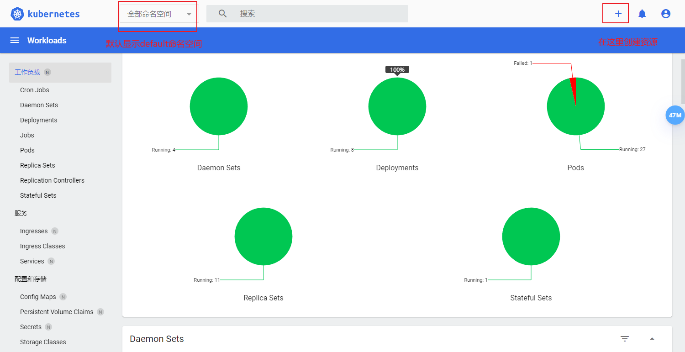

## 33.2 Kubesphere

官网：https://kubesphere.io

### 33.2.1 安装方式

官网有两种安装方式：

+ All-in-One，即同时安装kubernetes和kubesphere[如v3.4 All-inOne安装](https://kubesphere.io/zh/docs/v3.4/quick-start/all-in-one-on-linux/)
+ 最小化安装，即只安装kubesphere和其组件 [如v3.4最小化安装](https://kubesphere.io/zh/docs/v3.4/quick-start/minimal-kubesphere-on-k8s/)

### 33.2.2 准备工作

参考官网要求：https://kubesphere.io/zh/docs/v3.4/installing-on-kubernetes/introduction/prerequisites/

+ 如需在 Kubernetes 上安装 KubeSphere 3.4，您的 Kubernetes 版本必须为：v1.20.x、v1.21.x、v1.22.x、v1.23.x、* v1.24.x、* v1.25.x 和 * v1.26.x。带星号的版本可能出现边缘节点部分功能不可用的情况。因此，如需使用边缘节点，推荐安装 v1.23.x。 (**满足**)

  ```bash
  $ kubectl version
  Client Version: version.Info{Major:"1", Minor:"23", GitVersion:"v1.23.17", GitCommit:"953be8927218ec8067e1af2641e540238ffd7576", GitTreeState:"clean", BuildDate:"2023-02-22T13:34:27Z", GoVersion:"go1.19.6", Compiler:"gc", Platform:"linux/amd64"}
  Server Version: version.Info{Major:"1", Minor:"23", GitVersion:"v1.23.17", GitCommit:"953be8927218ec8067e1af2641e540238ffd7576", GitTreeState:"clean", BuildDate:"2023-02-22T13:27:46Z", GoVersion:"go1.19.6", Compiler:"gc", Platform:"linux/amd64"}
  ```

+ 可用 CPU > 1 核；内存 > 2 G。CPU 必须为 x86_64，暂时不支持 Arm 架构的 CPU。（**满足**）

+ 可用空闲存储最好大于20GB（**不满足**）

+ Kubernetes 集群已配置**默认** StorageClass（请使用 `kubectl get sc` 进行确认）。（**不满足**）

+ 使用 `--cluster-signing-cert-file` 和 `--cluster-signing-key-file` 参数启动集群时，kube-apiserver 将启用 CSR 签名功能，请参见 [RKE 安装问题](https://github.com/kubesphere/kubesphere/issues/1925#issuecomment-591698309)。（**未使用 RKE（Rancher Kubernetes Engine）启动 Kubernetes 集群,跳过**）

#### 33.2.2.1 扩展硬盘（lvm）

```bash
# 1.开始分区硬盘 /dev/sdb
$ sudo fdisk /dev/sdb
n
回车1
回车2 # 分区数
回车3
回车4
p
w
# 2.将该分区(物理卷)转为lvm物理卷
$ sudo pvcreate /dev/sdb1
$ sudo pvdisplay #列出所有lvm物理卷
# 3.扩展卷组vg
$ sudo vgextend centos /dev/sdb1
# 4.扩展逻辑卷root即/dev/centos/root 使用当前卷组所有剩余空间
$ sudo lvextend -l +100%FREE /dev/centos/root
# 5.扩展文件系统(必须,否则容量不更新) 以xfs文件系统为例子
$ xfs_growfs / # 注意根 / 不同的文件系统不同的命令
# 6.验证 
$ df -h
```

#### 33.2.2.2 设置默认存储类

**也可以不设置,在配置kubesphere文件中指定,但是太多了最好还是设置**

以教程视频中：openebs为例子

官方仓库：https://github.com/openebs/openebs

1. 安装openebs

```bash
# 1.添加helm仓库
$ helm repo add openebs https://openebs.github.io/openebs
$ helm repo update
$ helm search repo openebs
# 2.使用pull而不是install ，为了下载到本地修改镜像文件
$ helm pull openebs/openebs # 确保最新版兼容当前k8s版本，否则指定参数--version
# 3.解压.tgz等同于.tar.gz
$ tar -zxvf openebs-4.1.1.tgz
# 4.进入openebs，修改镜像地址 只改values.yaml即可 (依赖chart太多,且自己有的用不到,等到pull 失败了才去该DNS劫持到自己的本地仓库)
# 5. 修改openebs配置文件 values.yaml 修改镜像啊,关闭不需要的组件啊

# 安装
# 6a.安装所有的支持 具体见上面官网把
# 6b. 只安装 local PV支持 自己去改 values.yaml 中同第五步
(不要执行)helm install openebs --debug --namespace openebs  --set engines.replicated.mayastor.enabled=false --create-namespace openebs/
# 如下
engines:
  local:
    lvm:
      enabled: true
    zfs:
      enabled: true
  replicated:
    mayastor:
      enabled: false
    
# 7. 确保配置文件改好了
helm install openebs --debug --namespace openebs --create-namespace . # 最后的点别忘了 ,表示当前目录
```

2. 测试opens

   + 查看openebs创建的`StorageClass`,保存到`openebs-sc.yaml`并设置为默认存储类 `kubectl apply -f openebs-sc.yaml`

     > 自己仿照,创建一个新的把.

     https://kubernetes.io/zh-cn/docs/tasks/administer-cluster/change-default-storage-class/

     ```yaml
     apiVersion: storage.k8s.io/v1
     kind: StorageClass
     metadata:
       annotations:
         cas.openebs.io/config: |
           - name: StorageType
             value: "hostpath"
           - name: BasePath
             value: "/var/openebs/local"  # 默认的本地存储
         meta.helm.sh/release-name: openebs
         storageclass.kubernetes.io/is-default-class: "true" #设置为默认存储类
         meta.helm.sh/release-namespace: openebs
         openebs.io/cas-type: local
       labels:
         app.kubernetes.io/managed-by: Helm
       name: hostpath-default
     provisioner: openebs.io/local
     reclaimPolicy: Retain # 修改为Retain 保留
     volumeBindingMode: WaitForFirstConsumer
     ```

   + 查看是否存在默认类

     ```bash
     $ kubectl get sc -A
     NAME                         PROVISIONER        RECLAIMPOLICY   VOLUMEBINDINGMODE      ALLOWVOLUMEEXPANSION   AGE
     hostpath-default (default)   openebs.io/local   Retain          WaitForFirstConsumer   false                  6s
     # 名字旁边有个  (default)
     ```

   + 创建deploy和PVC测试能不能用

     ```yaml
     # https://kubernetes.io/docs/concepts/workloads/pods/
     # https://kubernetes.io/docs/concepts/workloads/controllers/deployment/
     # https://kubernetes.io/docs/concepts/storage/persistent-volumes/
     apiVersion: v1
     kind: PersistentVolumeClaim
     metadata:
       name: test-default-pvc
       namespace: default
       labels:
         app: test-default-pvc
     spec:
       # storageClassName: default # 注意如果使用默认类则 storageClassName 必须注释掉 啥也别写
       accessModes:
       - ReadWriteOnce
       resources:
         requests:
           storage: 100Mi
     ---
     apiVersion: apps/v1
     kind: Deployment
     metadata:
       name: test-openebs
       labels:
         app: test-openebs
     spec:
       selector:
         matchLabels:
           app: test-openebs
       replicas: 1
       template:
         metadata:
           labels:
             app: test-openebs
         spec:
           containers:
           - name: alpine
             image: 192.168.31.79/library/alpine:latest
             command: ["sh","-c","echo 'hello openebs' >/data/hello.openebs;tail -f /dev/null"]
             resources: {}
             volumeMounts:
             - name: config
               mountPath: /data/
           volumes:
             - name: config
               persistentVolumeClaim:
                 claimName: test-default-pvc
     ---
     ```

   + 验证运行这个Pod的机器上`/var/openebs/local/pv的名字/hello.openebs`是否存在(**验证通过**)

     ```bash
     # 1.获取运行测试pod的机器 如node1
     kubectl get pod -o wide 
     # 2.查看当前测试pod使用的pv名字
     kubectl getpv,pvc -A 
     NAME                                                        CAPACITY   ACCESS MODES   RECLAIM POLICY   STATUS   CLAIM                                  STORAGECLASS          REASON   AGE
     persistentvolume/pvc-0ea0c9ff-0986-4103-9d84-9618f3e5e27c   100Mi      RWO            Retain           Bound    default/test-default-pvc               hostpath-default               29m
     persistentvolume/pvc-c2e51530-80d1-483a-a9f6-b225d64c4be7   500Mi      RWO            Retain           Bound    default/nginx-sc-test-pvc-nginx-sc-0   managed-nfs-storage            8d
     
     NAMESPACE   NAME                                                 STATUS   VOLUME                                     CAPACITY   ACCESS MODES   STORAGECLASS          AGE
     default     persistentvolumeclaim/nginx-sc-test-pvc-nginx-sc-0   Bound    pvc-c2e51530-80d1-483a-a9f6-b225d64c4be7   500Mi      RWO            managed-nfs-storage   8d
     default     persistentvolumeclaim/test-default-pvc               Bound    pvc-0ea0c9ff-0986-4103-9d84-9618f3e5e27c   100Mi      RWO            hostpath-default      30m
     # 3.在node1节点上查看你文件是否存在
     cat /var/openebs/local/pvc-0ea0c9ff-0986-4103-9d84-9618f3e5e27c/hello.openebs
     hello openebs

#### 33.2.2.3 使用私有库配置

安装部署好harbor,推荐开启ssl (**配置文件为harbor.yaml**)

**使用ssl自签证书命令百度吧。注意CN推荐为域名，后面安装时使用,如我的为:dockerhub.102400000.xyz**

`/etc/docker/daemon.json`中将harbor服务设置为`"insecure-registries":[harbor服务]`

> **注意将harbor私有项目设置为 public**

#### 33.2.2.4 DNS劫持(为了访问本地私有库)

```bash
# 放在 /etc/hosts 文件中
192.168.31.79 hub.docker.io
192.168.31.79 docker.io
192.168.31.79 registry.k8s.io
192.168.31.79 quay.io
192.168.31.79 ghcr.io
192.168.31.79 k8s.gcr.io
192.168.31.79 docker.elastic.co

# 放在 /etc/docker/daemon.json 中
"insecure-registries": ["192.168.31.79:5000","hub.docker.io","docker.io","registry.k8s.io","quay.io","ghcr.io","k8s.gcr.io","docker.elastic.co"

# 重启daocker
sudo systemctl daemon-reload
sudo systemctl restart docker
```


### 33.2.3 安装


## 33.3 Rancher

官网：https://www.rancher.cn/

自己去了解

## 33.4 Kuboard

官网：https://kuboard.cn/

自己去了解

# k8s调试模式

+ --v=6
+ --dry-run=client/server 用于测试命令是否正确，不会创建资源。client只用于本地验证，server发送到服务端进行验证

# **集群级别的资源**

