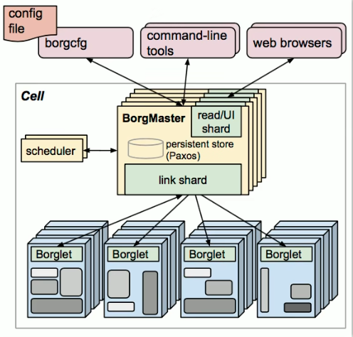
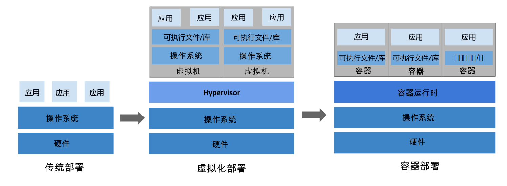
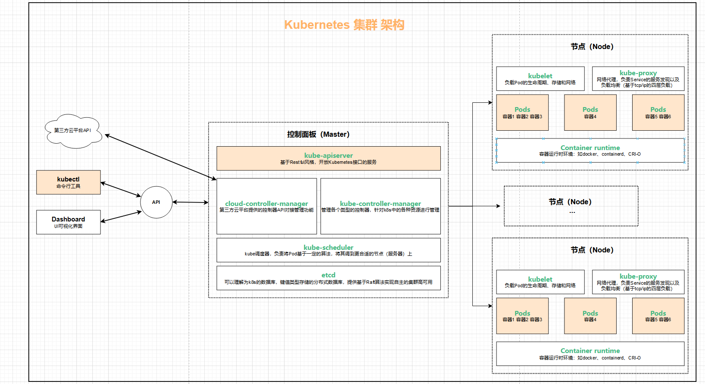
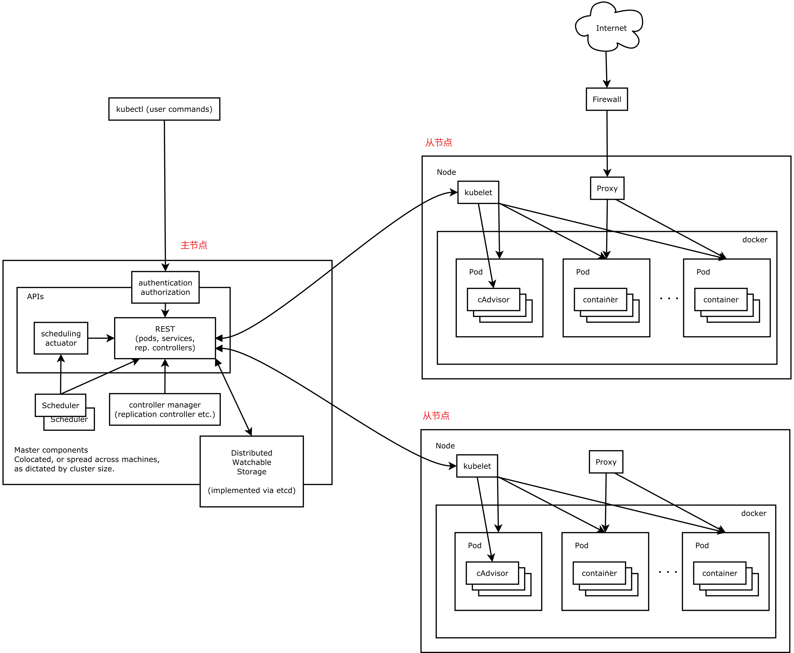
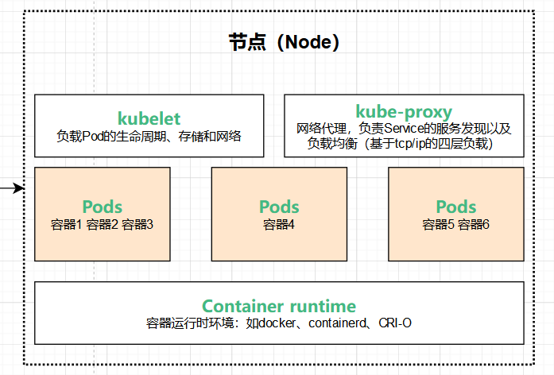

# 0. 参考链接

https://kubernetes.io/zh-cn/docs/concepts/overview/components/

https://www.kubernetes.org.cn/k8s

# 1. 核心概念

## 1.1 认识kubernetes

### 1.1.1 什么是kubernetes

Kubernetes 是一个可移植、可扩展的开源平台，用于管理容器化的工作负载和服务，可促进声明式配置和自动化。 Kubernetes 拥有一个庞大且快速增长的生态，其服务、支持和工具的使用范围相当广泛。

**Kubernetes** 这个名字源于希腊语，意为“舵手”或“飞行员”。K8s 这个缩写是因为 K 和 s 之间有 8 个字符的关系。Google 在 2014 年开源了 Kubernetes 项目。 Kubernetes 建立在 [Google 大规模运行生产工作负载十几年经验(即Borg)](https://research.google/pubs/pub43438)的基础上， 结合了社区中最优秀的想法和实践。

Borg架构图如下：

### 1.1.2 为什么需要kubernetes

#### 1.1.2.1 Kubernetes 的历史背景

**传统部署时代：**

早期，各个组织是在物理服务器上运行应用程序。 由于无法限制在物理服务器中运行的应用程序资源使用，因此会导致资源分配问题。 例如，如果在同一台物理服务器上运行多个应用程序， 则可能会出现一个应用程序占用大部分资源的情况，而导致其他应用程序的性能下降。 一种解决方案是将每个应用程序都运行在不同的物理服务器上， 但是当某个应用程序资源利用率不高时，剩余资源无法被分配给其他应用程序， 而且维护许多物理服务器的成本很高。

**虚拟化部署时代：**

因此，虚拟化技术被引入了。虚拟化技术允许你在单个物理服务器的 CPU 上运行多台虚拟机（VM）。 虚拟化能使应用程序在不同 VM 之间被彼此隔离，且能提供一定程度的安全性， 因为一个应用程序的信息不能被另一应用程序随意访问。

虚拟化技术能够更好地利用物理服务器的资源，并且因为可轻松地添加或更新应用程序， 而因此可以具有更高的可扩缩性，以及降低硬件成本等等的好处。 通过虚拟化，你可以将一组物理资源呈现为可丢弃的虚拟机集群。

每个 VM 是一台完整的计算机，在虚拟化硬件之上运行所有组件，包括其自己的操作系统。

**容器部署时代：**

容器类似于 VM，但是更宽松的隔离特性，使容器之间可以共享操作系统（OS）。 因此，容器比起 VM 被认为是更轻量级的。且与 VM 类似，每个容器都具有自己的文件系统、CPU、内存、进程空间等。 由于它们与基础架构分离，因此可以跨云和 OS 发行版本进行移植。

容器因具有许多优势而变得流行起来，例如：

- 敏捷应用程序的创建和部署：与使用 VM 镜像相比，提高了容器镜像创建的简便性和效率。
- 持续开发、集成和部署：通过快速简单的回滚（由于镜像不可变性）， 提供可靠且频繁的容器镜像构建和部署。
- 关注开发与运维的分离：在构建、发布时创建应用程序容器镜像，而不是在部署时， 从而将应用程序与基础架构分离。
- 可观察性：不仅可以显示 OS 级别的信息和指标，还可以显示应用程序的运行状况和其他指标信号。

- 跨开发、测试和生产的环境一致性：在笔记本计算机上也可以和在云中运行一样的应用程序。
- 跨云和操作系统发行版本的可移植性：可在 Ubuntu、RHEL、CoreOS、本地、 Google Kubernetes Engine 和其他任何地方运行。
- 以应用程序为中心的管理：提高抽象级别，从在虚拟硬件上运行 OS 到使用逻辑资源在 OS 上运行应用程序。
- 松散耦合、分布式、弹性、解放的微服务：应用程序被分解成较小的独立部分， 并且可以动态部署和管理 - 而不是在一台大型单机上整体运行。
- 资源隔离：可预测的应用程序性能。
- 资源利用：高效率和高密度。

#### 1.1.2.2 Kubernetes能做什么?

容器是打包和运行应用程序的好方式。在生产环境中， 你需要管理运行着应用程序的容器，并确保服务不会下线。 例如，如果一个容器发生故障，则你需要启动另一个容器。 如果此行为交由给系统处理，是不是会更容易一些？

这就是 Kubernetes 要来做的事情！ Kubernetes 为你提供了一个**可弹性运行分布式系统的框架**。 Kubernetes 会满足你的扩展要求、故障转移你的应用、提供部署模式等。 例如，Kubernetes 可以轻松管理系统的 Canary (金丝雀) 部署。

Kubernetes 为你提供：

- **服务发现和负载均衡**

  Kubernetes 可以使用 DNS 名称或自己的 IP 地址来暴露容器。 如果进入容器的流量很大， Kubernetes 可以负载均衡并分配网络流量，从而使部署稳定。

- **存储编排**

  Kubernetes 允许你自动挂载你选择的存储系统，例如本地存储、公共云提供商等。

- **自动部署和回滚**

  你可以使用 Kubernetes 描述已部署容器的所需状态， 它可以以受控的速率将实际状态更改为期望状态。 例如，你可以自动化 Kubernetes 来为你的部署创建新容器， 删除现有容器并将它们的所有资源用于新容器。

- **自动完成装箱计算**

  你为 Kubernetes 提供许多节点组成的集群，在这个集群上运行容器化的任务。 你告诉 Kubernetes 每个容器需要多少 CPU 和内存 (RAM)。 Kubernetes 可以将这些容器按实际情况调度到你的节点上，以最佳方式利用你的资源。

- **自我修复**

  Kubernetes 将重新启动失败的容器、替换容器、杀死不响应用户定义的运行状况检查的容器， 并且在准备好服务之前不将其通告给客户端。

- **密钥与配置管理**

  Kubernetes 允许你存储和管理敏感信息，例如密码、OAuth 令牌和 SSH 密钥。 你可以在不重建容器镜像的情况下部署和更新密钥和应用程序配置，也无需在堆栈配置中暴露密钥。

- **批处理执行** 除了服务外，Kubernetes 还可以管理你的批处理和 CI（持续集成）工作负载，如有需要，可以替换失败的容器。
- **水平扩缩** 使用简单的命令、用户界面或根据 CPU 使用率自动对你的应用进行扩缩。
- **IPv4/IPv6 双栈** 为 Pod（容器组）和 Service（服务）分配 IPv4 和 IPv6 地址。
- **为可扩展性设计** 在不改变上游源代码的情况下为你的 Kubernetes 集群添加功能。

### 1.1.3 企业容器调度平台对比

#### 1.1.3.1 Apache Mesos

##### 1.1.3.1.1 基本概念

Mesos是一个**分布式调度系统**内核，早于Docker的产生，Mesos作为资源管理器， 从DC/OS(数据中心操作系统)的角度提供资源视图。**主/从结构**的工作模式，**主节点分配任务**，并用**从节点上的Executor负责执行**，通过Zookeeper给主节点提供注册服务、服务发现等功能。通过Framework Marathon 提供容器调度的能力。

##### 1.1.3.1.2 优势

经过时间的检验，作为资源管理器的Apache Mesos在容器之前就已经出现很久了，支持运行容器化和非容器化的工作负载。可以支持应用程序的健康检查，开放的架构。支持多个框架和多个调度器，通过不同的Framework可以运行Hadoop/Spark/MPI等多种不同的任务。

支持超大规模的节点管理，模拟测试支持超过5w+节点，在大规模上拥有较大优势。

#### 1.1.3.2 Docker Swarm

##### 1.1.3.2.1 基本概念

Docker Swarm是一个由Docker开发的调度框架。由Docker自身开发的好处之一就是标准Docker API的使用，Swarm由多个代理（Agent）组成，把这些代理称之为节点（Node）。这些节点就是主机，这些主机在启动Docker Daemon的时候就会打开相应的端口，以此支持Docker远程API。这些机器会根据Swarm调度器分配给他们的任务，拉取和运行不同的镜像。

##### 1.1.3.2.2 优势

从Docker1.12版本开始，Swarm随Docker一起默认安装发布。由于随Docker引擎一起发布，无需额外安装，配置简单。支持服务注册、服务发现，内置Overlay Network以及Load Balancer。与Docker CLI非常类似的操作命令，对熟悉Docker的人非常容易上手学习。

入门门槛低，学习成本低，使用更便捷，适合中小型系统。

#### 1.1.3.3 Google Kubernetes

##### 1.1.3.3.1 基本概念

Kubernetes 是基于Google在过去十五年来大量生产环境中运行工作负载的经验。Kubernetes的实现参考了Google内部的资源调度框架Borg，但并不是Borg的内部容器编排系统的开源，而是借鉴Google从运行Borg获得的经验教训，形成了Kubernetes项目。

它使用Label和Pod的概念来将容器划分为逻辑单元。Pods是同地协作(co-located)容器的集合，这些容器被共同部署和调度，形成了一个服务，这是Kubernetes和其他两个框架的主要区别。相比于基于相似度的容器调度方式（就像Swarm和Mesos），这个方法简化了对集群的管理。

##### 1.1.3.3.2 优势

最流行的容器编排解决方案，基于Google庞大的生态圈及社区产生的产品。通过Pods这一抽象的概念，解决Container之间的依赖于通信的问题。Pods、Services、Deployments是独立部署的部分。可以通过Selector提供更多的灵活性。内置服务注册表和负载均衡。

适用度更广，功能更强大，相较于Mesos来说节点规模较小。

## 1.2 ==Kubernetes组件==

一个正常运行的 Kubernetes 集群所需的各种组件

### 1.2.1 ==核心组件==

Kubernetes 集群由**一个控制平面和一组用于运行容器化应用的工作机器**组成，这些**工作机器称作节点（Node）**。 每个集群至少需要一个工作节点来运行 Pod。

工作节点托管着组成应用负载的 Pod(*Pod 表示你的集群上一组正在运行的容器。*)。控制平面管理集群中的工作节点和 Pod。 在生产环境中，控制平面通常跨多台计算机运行，而一个集群通常运行多个节点，以提供容错和高可用。

#### 1.2.1.1 五大控制面板组件（Control Panel Components）

控制平面组件会为集群做出全局决策，比如资源的调度。 以及检测和响应集群事件，例如当不满足 Deployment 的 `replicas` 字段时，要启动新的 [Pod](https://kubernetes.io/zh-cn/docs/concepts/workloads/pods/)）。

控制平面组件可以在集群中的任何节点上运行。 然而，为了简单起见，安装脚本通常会在同一个计算机上启动所有控制平面组件， 并且不会在此计算机上运行用户容器。请参阅[使用 kubeadm 构建高可用性集群](https://kubernetes.io/zh-cn/docs/setup/production-environment/tools/kubeadm/high-availability/)中关于跨多机器安装控制平面的示例。

- [kube-apiserver](https://kubernetes.io/zh-cn/docs/concepts/architecture/#kube-apiserver) **公开 Kubernetes HTTP API 的核心组件服务器**

  API 服务器是 Kubernetes [控制平面](https://kubernetes.io/zh-cn/docs/reference/glossary/?all=true#term-control-plane)(*是指容器编排层，它暴露 API 和接口来定义、 部署容器和管理容器的生命周期*)的组件， 该组件负责公开了 Kubernetes API，负责处理接受请求的工作。 API 服务器是 Kubernetes 控制平面的前端。

  Kubernetes API 服务器的主要实现是 [kube-apiserver](https://kubernetes.io/zh-cn/docs/reference/command-line-tools-reference/kube-apiserver/)。 `kube-apiserver` 设计上考虑了水平扩缩，也就是说，它可通过部署多个实例来进行扩缩。 你可以运行 `kube-apiserver` 的多个实例，并在这些实例之间平衡流量。

- [kube-scheduler](https://kubernetes.io/zh-cn/docs/concepts/architecture/#kube-scheduler) **查找尚未绑定到节点的 Pod，并将每个 Pod 分配给合适的节点。**

  `kube-scheduler` 是[控制平面](https://kubernetes.io/zh-cn/docs/reference/glossary/?all=true#term-control-plane)的组件， 负责监视新创建的、未指定运行[节点（node）](https://kubernetes.io/zh-cn/docs/concepts/architecture/nodes/)(*Kubernetes 中的工作机器称作节点*)的 [Pods](https://kubernetes.io/zh-cn/docs/concepts/workloads/pods/)， 并选择节点来让 Pod 在上面运行。

  调度决策考虑的因素包括单个 Pod 及 Pods 集合的资源需求、软硬件及策略约束、 亲和性及反亲和性规范、数据位置、工作负载间的干扰及最后时限

- [kube-controller-manager](https://kubernetes.io/zh-cn/docs/concepts/architecture/#kube-controller-manager) **运行[控制器](https://kubernetes.io/zh-cn/docs/concepts/architecture/controller/)来实现 Kubernetes API 行为。**

  `kube-controller-manager`是[控制平面](https://kubernetes.io/zh-cn/docs/reference/glossary/?all=true#term-control-plane)的组件， 负责运行[控制器](https://kubernetes.io/zh-cn/docs/concepts/architecture/controller/)进程。

  从逻辑上讲， 每个[控制器](https://kubernetes.io/zh-cn/docs/concepts/architecture/controller/)都是一个单独的进程， 但是为了降低复杂性，它们都被编译到同一个可执行文件，并在同一个进程中运行。

  控制器有许多不同类型。以下是一些例子：

  - Node Controller(**节点控制器**)：负责在节点出现故障时进行通知和响应
  - Job Controller(**任务控制器**)：监测代表一次性任务的 Job 对象，然后创建 Pod 来运行这些任务直至完成
  - EndpointSlice Controller(**端点分片控制器**)：填充 EndpointSlice 对象（以提供 Service 和 Pod 之间的链接）。
  - ServiceAccount Controller(**服务账号控制器**)：为新的命名空间创建默认的 ServiceAccount。

- [cloud-controller-manager](https://kubernetes.io/zh-cn/docs/concepts/architecture/#cloud-controller-manager) (optional) **与底层云驱动集成，连接第三方云api**

  一个 Kubernetes [控制平面](https://kubernetes.io/zh-cn/docs/reference/glossary/?all=true#term-control-plane)组件， 嵌入了特定于云平台的控制逻辑。 云控制器管理器（Cloud Controller Manager）允许将你的集群连接到云提供商的 API 之上， 并将与该云平台交互的组件同与你的集群交互的组件分离开来。

  `cloud-controller-manager` 仅运行特定于云平台的控制器。 因此如果你在自己的环境中运行 Kubernetes，或者在本地计算机中运行学习环境， 所部署的集群不包含云控制器管理器。

  与 `kube-controller-manager` 类似，`cloud-controller-manager` 将若干逻辑上独立的控制回路组合到同一个可执行文件中，以同一进程的方式供你运行。 你可以对其执行水平扩容（运行不止一个副本）以提升性能或者增强容错能力。

  下面的控制器都包含对云平台驱动的依赖：

  - Node 控制器：用于在节点终止响应后检查云平台以确定节点是否已被删除
  - Route 控制器：用于在底层云基础架构中设置路由
  - Service 控制器：用于创建、更新和删除云平台上的负载均衡器

- [etcd](https://kubernetes.io/zh-cn/docs/concepts/architecture/#etcd) **具备一致性和高可用性的键值存储，用于所有 API 服务器的数据存储**

  一致且高可用的键值存储，用作 Kubernetes 所有集群数据的后台数据库。(**老版本基于内存，新版本基于持久化**)

  如果你的 Kubernetes 集群使用 etcd 作为其后台数据库， 请确保你针对这些数据有一份 [备份](https://kubernetes.io/zh-cn/docs/tasks/administer-cluster/configure-upgrade-etcd/#backing-up-an-etcd-cluster)计划。

  你可以在官方[文档](https://etcd.io/docs/)中找到有关 etcd 的深入知识。

  

#### 1.2.1.2 三大节点组件（Node Components）

在每个节点上运行，维护运行的 Pod 并提供 Kubernetes 运行时环境：

- [kubelet](https://kubernetes.io/zh-cn/docs/concepts/architecture/#kubelet) **确保 Pod 及其容器正常运行**

  `kubelet` 会在集群中每个[节点（node）](https://kubernetes.io/zh-cn/docs/concepts/architecture/nodes/)上运行。 它保证[容器（containers）](https://kubernetes.io/zh-cn/docs/concepts/containers/)都运行在 [Pod](https://kubernetes.io/zh-cn/docs/concepts/workloads/pods/) 中。

  `kubelet`接收一组通过各类机制提供给它的 PodSpec，确保这些 PodSpec 中描述的容器处于运行状态且健康。 kubelet 不会管理不是由 Kubernetes 创建的容器。

- [kube-proxy](https://kubernetes.io/zh-cn/docs/concepts/architecture/#kube-proxy)（可选）**维护节点上的网络规则以实现 Service 的功能。基于TCP/IP四层网络模型**

  `kube-proxy`是集群中每个[节点（node）](https://kubernetes.io/zh-cn/docs/concepts/architecture/nodes/)上所运行的网络代理， 实现 Kubernetes [服务（Service）](https://kubernetes.io/zh-cn/docs/concepts/services-networking/service/) 概念的一部分。

  kube-proxy 维护节点上的一些网络规则， 这些网络规则会允许从集群内部或外部的网络会话与 Pod 进行网络通信。

  如果操作系统提供了可用的数据包过滤层，则 kube-proxy 会通过它来实现网络规则。 否则，kube-proxy 仅做流量转发。

  如果你使用[网络插件](https://kubernetes.io/zh-cn/docs/concepts/architecture/#network-plugins)为 Service 实现本身的数据包转发， 并提供与 kube-proxy 等效的行为，那么你不需要在集群中的节点上运行 kube-proxy。

- [容器运行时（Container runtime）](https://kubernetes.io/zh-cn/docs/concepts/architecture/#container-runtime) **负责运行容器的软件**

  这个基础组件使 Kubernetes 能够有效运行容器。 它负责管理 Kubernetes 环境中容器的执行和生命周期。

  Kubernetes 支持许多容器运行环境，例如 [containerd](https://containerd.io/docs/)、 [CRI-O](https://cri-o.io/#what-is-cri-o) 以及 [Kubernetes CRI (容器运行环境接口)](https://github.com/kubernetes/community/blob/master/contributors/devel/sig-node/container-runtime-interface.md) 的其他任何实现。

  > 即容器不一定依赖docker

- [Pods](https://kubernetes.io/zh-cn/docs/concepts/workloads/pods/) **严格意义上不算Node节点组件**

  **Pods** 是 Kubernetes 用来运行应用程序的抽象，并不算是 Node 节点的组件。Pods 是 Kubernetes 中最小的可部署单元，通常包含一个或多个容器，它们共享网络和存储资源。

#### 1.2.1.3 附加组件/插件 （Addons）

插件扩展了 Kubernetes 的功能。一些重要的例子包括：

- [DNS](https://kubernetes.io/zh-cn/docs/concepts/architecture/#dns) **集群范围内的 DNS 解析**

  尽管其他插件都并非严格意义上的必需组件，但几乎所有 Kubernetes 集群都应该有[集群 DNS](https://kubernetes.io/zh-cn/docs/concepts/services-networking/dns-pod-service/)， 因为很多示例都需要 DNS 服务。

  集群 DNS 是一个 DNS 服务器，和环境中的其他 DNS 服务器一起工作，它为 Kubernetes 服务提供 DNS 记录。

  Kubernetes 启动的容器自动将此 DNS 服务器包含在其 DNS 搜索列表中。

- [Web 界面](https://kubernetes.io/zh-cn/docs/concepts/architecture/#web-ui-dashboard)（Dashboard）**通过 Web 界面进行集群管理**

  [Dashboard](https://kubernetes.io/zh-cn/docs/tasks/access-application-cluster/web-ui-dashboard/) 是 Kubernetes 集群的通用的、基于 Web 的用户界面。 它使用户可以管理集群中运行的应用程序以及集群本身，并进行故障排除。

- [容器资源监控](https://kubernetes.io/zh-cn/docs/concepts/architecture/#container-resource-monitoring) **用于收集和存储容器指标**

  [容器资源监控](https://kubernetes.io/zh-cn/docs/tasks/debug/debug-cluster/resource-usage-monitoring/) 将关于容器的一些常见的时序度量值保存到一个集中的数据库中，并提供浏览这些数据的界面。

- [集群层面日志](https://kubernetes.io/zh-cn/docs/concepts/architecture/#cluster-level-logging) **用于将容器日志保存到中央日志存储**

  [集群层面日志](https://kubernetes.io/zh-cn/docs/concepts/cluster-administration/logging/)机制负责将容器的日志数据保存到一个集中的日志存储中， 这种集中日志存储提供搜索和浏览接口。

  > 插件举例：
  >
  > + `kube-dns` 为整个集群提供DNS服务
  > + `ingress controller` 为服务外网入口（如外部服务发现）
  > + `Heapster` 提供资源监控
  > + `Prometheus` 提供资源监控
  > + `Dashboard` UI界面控制入口
  > + `Federation` 提供跨可用区的集群
  > + `Fluentd-elasticsearch` 提供集群日志采集、存储与查询

### 1.2.2 分层架构

从顶层到底层的顺序：

+ **生态系统层**

  在接口层之上的庞大容器集群管理调度的生态系统，可以划分为两个范畴

  - Kubernetes外部：日志、监控、配置管理、CI、CD、Workflow、FaaS、OTS应用、ChatOps等
  - Kubernetes内部：CRI、CNI、CVI、镜像仓库、Cloud Provider、集群自身的配置和管理等

+ **接口层**

  kubectl命令行工具、客户端SDK以及集群联邦

+ **管理层**

  系统度量（如基础设施、容器和网络的度量），自动化（如自动扩展、动态Provision等）以及策略管理（RBAC、Quota、PSP、NetworkPolicy等）

+ **应用层**

  部署（无状态应用、有状态应用、批处理任务、集群应用等）和路由（服务发现、DNS解析等）

+ **核心层**

  Kubernetes最核心的功能，对外提供API构建高层的应用，对内提供插件式应用执行环境

# 2. 

# 3. 