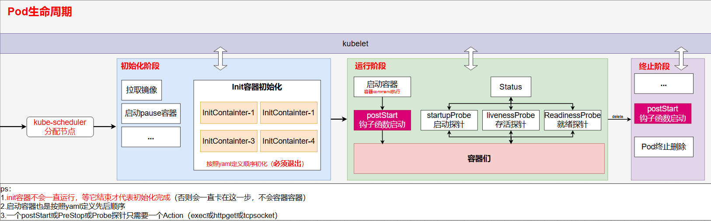

# 0. 参考链接

https://kubernetes.io/zh-cn/docs/concepts/overview/components/

https://www.kubernetes.org.cn/k8s

# 1. 认识kubernetes

## 1.1 什么是kubernetes

Kubernetes 是一个可移植、可扩展的开源平台，用于管理容器化的工作负载和服务，可促进声明式配置和自动化。 Kubernetes 拥有一个庞大且快速增长的生态，其服务、支持和工具的使用范围相当广泛。

**Kubernetes** 这个名字源于希腊语，意为“舵手”或“飞行员”。K8s 这个缩写是因为 K 和 s 之间有 8 个字符的关系。Google 在 2014 年开源了 Kubernetes 项目。 Kubernetes 建立在 [Google 大规模运行生产工作负载十几年经验(即Borg)](https://research.google/pubs/pub43438)的基础上， 结合了社区中最优秀的想法和实践。

Borg架构图如下：


## 1.2 为什么需要kubernetes

### 1.2.1 Kubernetes 的历史背景


**传统部署时代：**

早期，各个组织是在物理服务器上运行应用程序。 由于无法限制在物理服务器中运行的应用程序资源使用，因此会导致资源分配问题。 例如，如果在同一台物理服务器上运行多个应用程序， 则可能会出现一个应用程序占用大部分资源的情况，而导致其他应用程序的性能下降。 一种解决方案是将每个应用程序都运行在不同的物理服务器上， 但是当某个应用程序资源利用率不高时，剩余资源无法被分配给其他应用程序， 而且维护许多物理服务器的成本很高。

**虚拟化部署时代：**

因此，虚拟化技术被引入了。虚拟化技术允许你在单个物理服务器的 CPU 上运行多台虚拟机（VM）。 虚拟化能使应用程序在不同 VM 之间被彼此隔离，且能提供一定程度的安全性， 因为一个应用程序的信息不能被另一应用程序随意访问。

虚拟化技术能够更好地利用物理服务器的资源，并且因为可轻松地添加或更新应用程序， 而因此可以具有更高的可扩缩性，以及降低硬件成本等等的好处。 通过虚拟化，你可以将一组物理资源呈现为可丢弃的虚拟机集群。

每个 VM 是一台完整的计算机，在虚拟化硬件之上运行所有组件，包括其自己的操作系统。

**容器部署时代：**

容器类似于 VM，但是更宽松的隔离特性，使容器之间可以共享操作系统（OS）。 因此，容器比起 VM 被认为是更轻量级的。且与 VM 类似，每个容器都具有自己的文件系统、CPU、内存、进程空间等。 由于它们与基础架构分离，因此可以跨云和 OS 发行版本进行移植。

容器因具有许多优势而变得流行起来，例如：

- 敏捷应用程序的创建和部署：与使用 VM 镜像相比，提高了容器镜像创建的简便性和效率。
- 持续开发、集成和部署：通过快速简单的回滚（由于镜像不可变性）， 提供可靠且频繁的容器镜像构建和部署。
- 关注开发与运维的分离：在构建、发布时创建应用程序容器镜像，而不是在部署时， 从而将应用程序与基础架构分离。
- 可观察性：不仅可以显示 OS 级别的信息和指标，还可以显示应用程序的运行状况和其他指标信号。

- 跨开发、测试和生产的环境一致性：在笔记本计算机上也可以和在云中运行一样的应用程序。
- 跨云和操作系统发行版本的可移植性：可在 Ubuntu、RHEL、CoreOS、本地、 Google Kubernetes Engine 和其他任何地方运行。
- 以应用程序为中心的管理：提高抽象级别，从在虚拟硬件上运行 OS 到使用逻辑资源在 OS 上运行应用程序。
- 松散耦合、分布式、弹性、解放的微服务：应用程序被分解成较小的独立部分， 并且可以动态部署和管理 - 而不是在一台大型单机上整体运行。
- 资源隔离：可预测的应用程序性能。
- 资源利用：高效率和高密度。

### 1.2.2 Kubernetes能做什么?

容器是打包和运行应用程序的好方式。在生产环境中， 你需要管理运行着应用程序的容器，并确保服务不会下线。 例如，如果一个容器发生故障，则你需要启动另一个容器。 如果此行为交由给系统处理，是不是会更容易一些？

这就是 Kubernetes 要来做的事情！ Kubernetes 为你提供了一个**可弹性运行分布式系统的框架**。 Kubernetes 会满足你的扩展要求、故障转移你的应用、提供部署模式等。 例如，Kubernetes 可以轻松管理系统的 Canary (金丝雀) 部署。

Kubernetes 为你提供：

- **服务发现和负载均衡**

  Kubernetes 可以使用 DNS 名称或自己的 IP 地址来暴露容器。 如果进入容器的流量很大， Kubernetes 可以负载均衡并分配网络流量，从而使部署稳定。

- **存储编排**

  Kubernetes 允许你自动挂载你选择的存储系统，例如本地存储、公共云提供商等。

- **自动部署和回滚**

  你可以使用 Kubernetes 描述已部署容器的所需状态， 它可以以受控的速率将实际状态更改为期望状态。 例如，你可以自动化 Kubernetes 来为你的部署创建新容器， 删除现有容器并将它们的所有资源用于新容器。

- **自动完成装箱计算**

  你为 Kubernetes 提供许多节点组成的集群，在这个集群上运行容器化的任务。 你告诉 Kubernetes 每个容器需要多少 CPU 和内存 (RAM)。 Kubernetes 可以将这些容器按实际情况调度到你的节点上，以最佳方式利用你的资源。

- **自我修复**

  Kubernetes 将重新启动失败的容器、替换容器、杀死不响应用户定义的运行状况检查的容器， 并且在准备好服务之前不将其通告给客户端。

- **密钥与配置管理**

  Kubernetes 允许你存储和管理敏感信息，例如密码、OAuth 令牌和 SSH 密钥。 你可以在不重建容器镜像的情况下部署和更新密钥和应用程序配置，也无需在堆栈配置中暴露密钥。

- **批处理执行** 除了服务外，Kubernetes 还可以管理你的批处理和 CI（持续集成）工作负载，如有需要，可以替换失败的容器。
- **水平扩缩** 使用简单的命令、用户界面或根据 CPU 使用率自动对你的应用进行扩缩。
- **IPv4/IPv6 双栈** 为 Pod（容器组）和 Service（服务）分配 IPv4 和 IPv6 地址。
- **为可扩展性设计** 在不改变上游源代码的情况下为你的 Kubernetes 集群添加功能。

## 1.3 企业容器调度平台对比

### 1.3.1 Apache Mesos

#### 1.3.1.1 基本概念

Mesos是一个**分布式调度系统**内核，早于Docker的产生，Mesos作为资源管理器， 从DC/OS(数据中心操作系统)的角度提供资源视图。**主/从结构**的工作模式，**主节点分配任务**，并用**从节点上的Executor负责执行**，通过Zookeeper给主节点提供注册服务、服务发现等功能。通过Framework Marathon 提供容器调度的能力。

#### 1.3.1.2 优势

经过时间的检验，作为资源管理器的Apache Mesos在容器之前就已经出现很久了，支持运行容器化和非容器化的工作负载。可以支持应用程序的健康检查，开放的架构。支持多个框架和多个调度器，通过不同的Framework可以运行Hadoop/Spark/MPI等多种不同的任务。

支持超大规模的节点管理，模拟测试支持超过5w+节点，在大规模上拥有较大优势。

### 1.3.2 Docker Swarm

#### 1.3.2.1 基本概念

Docker Swarm是一个由Docker开发的调度框架。由Docker自身开发的好处之一就是标准Docker API的使用，Swarm由多个代理（Agent）组成，把这些代理称之为节点（Node）。这些节点就是主机，这些主机在启动Docker Daemon的时候就会打开相应的端口，以此支持Docker远程API。这些机器会根据Swarm调度器分配给他们的任务，拉取和运行不同的镜像。

#### 1.3.2.2 优势

从Docker1.12版本开始，Swarm随Docker一起默认安装发布。由于随Docker引擎一起发布，无需额外安装，配置简单。支持服务注册、服务发现，内置Overlay Network以及Load Balancer。与Docker CLI非常类似的操作命令，对熟悉Docker的人非常容易上手学习。

入门门槛低，学习成本低，使用更便捷，适合中小型系统。

### 1.3.3 Google Kubernetes

#### 1.3.3.1 基本概念

Kubernetes 是基于Google在过去十五年来大量生产环境中运行工作负载的经验。Kubernetes的实现参考了Google内部的资源调度框架Borg，但并不是Borg的内部容器编排系统的开源，而是借鉴Google从运行Borg获得的经验教训，形成了Kubernetes项目。

它使用Label和Pod的概念来将容器划分为逻辑单元。Pods是同地协作(co-located)容器的集合，这些容器被共同部署和调度，形成了一个服务，这是Kubernetes和其他两个框架的主要区别。相比于基于相似度的容器调度方式（就像Swarm和Mesos），这个方法简化了对集群的管理。

#### 1.3.3.2 优势

最流行的容器编排解决方案，基于Google庞大的生态圈及社区产生的产品。通过Pods这一抽象的概念，解决Container之间的依赖于通信的问题。Pods、Services、Deployments是独立部署的部分。可以通过Selector提供更多的灵活性。内置服务注册表和负载均衡。

适用度更广，功能更强大，相较于Mesos来说节点规模较小。

# 2. ==Kubernetes组件==

一个正常运行的 Kubernetes 集群所需的各种组件


## 2.1 ==核心组件==

Kubernetes 集群由**一个控制平面和一组用于运行容器化应用的工作机器**组成，这些**工作机器称作节点（Node）**。 每个集群至少需要一个工作节点来运行 Pod。

工作节点托管着组成应用负载的 Pod(*Pod 表示你的集群上一组正在运行的容器。*)。控制平面管理集群中的工作节点和 Pod。 在生产环境中，控制平面通常跨多台计算机运行，而一个集群通常运行多个节点，以提供容错和高可用。

### 2.1.1 五大控制面板组件（Control Panel Components）

控制平面组件会为集群做出全局决策，比如资源的调度。 以及检测和响应集群事件，例如当不满足 Deployment 的 `replicas` 字段时，要启动新的 [Pod](https://kubernetes.io/zh-cn/docs/concepts/workloads/pods/)）。

控制平面组件可以在集群中的任何节点上运行。 然而，为了简单起见，安装脚本通常会在同一个计算机上启动所有控制平面组件， 并且不会在此计算机上运行用户容器。请参阅[使用 kubeadm 构建高可用性集群](https://kubernetes.io/zh-cn/docs/setup/production-environment/tools/kubeadm/high-availability/)中关于跨多机器安装控制平面的示例。

- [kube-apiserver](https://kubernetes.io/zh-cn/docs/concepts/architecture/#kube-apiserver) **公开 Kubernetes HTTP API 的核心组件服务器**

  API 服务器是 Kubernetes [控制平面](https://kubernetes.io/zh-cn/docs/reference/glossary/?all=true#term-control-plane)(*是指容器编排层，它暴露 API 和接口来定义、 部署容器和管理容器的生命周期*)的组件， 该组件负责公开了 Kubernetes API，负责处理接受请求的工作。 API 服务器是 Kubernetes 控制平面的前端。

  Kubernetes API 服务器的主要实现是 [kube-apiserver](https://kubernetes.io/zh-cn/docs/reference/command-line-tools-reference/kube-apiserver/)。 `kube-apiserver` 设计上考虑了水平扩缩，也就是说，它可通过部署多个实例来进行扩缩。 你可以运行 `kube-apiserver` 的多个实例，并在这些实例之间平衡流量。

- [kube-scheduler](https://kubernetes.io/zh-cn/docs/concepts/architecture/#kube-scheduler) **查找尚未绑定到节点的 Pod，并将每个 Pod 分配给合适的节点。**

  `kube-scheduler` 是[控制平面](https://kubernetes.io/zh-cn/docs/reference/glossary/?all=true#term-control-plane)的组件， 负责监视新创建的、未指定运行[节点（node）](https://kubernetes.io/zh-cn/docs/concepts/architecture/nodes/)(*Kubernetes 中的工作机器称作节点*)的 [Pods](https://kubernetes.io/zh-cn/docs/concepts/workloads/pods/)， 并选择节点来让 Pod 在上面运行。

  调度决策考虑的因素包括单个 Pod 及 Pods 集合的资源需求、软硬件及策略约束、 亲和性及反亲和性规范、数据位置、工作负载间的干扰及最后时限

- [kube-controller-manager](https://kubernetes.io/zh-cn/docs/concepts/architecture/#kube-controller-manager) **运行[控制器](https://kubernetes.io/zh-cn/docs/concepts/architecture/controller/)来实现 Kubernetes API 行为。**

  `kube-controller-manager`是[控制平面](https://kubernetes.io/zh-cn/docs/reference/glossary/?all=true#term-control-plane)的组件， 负责运行[控制器](https://kubernetes.io/zh-cn/docs/concepts/architecture/controller/)进程。

  从逻辑上讲， 每个[控制器](https://kubernetes.io/zh-cn/docs/concepts/architecture/controller/)都是一个单独的进程， 但是为了降低复杂性，它们都被编译到同一个可执行文件，并在同一个进程中运行。

  控制器有许多不同类型。以下是一些例子：

  - Node Controller(**节点控制器**)：负责在节点出现故障时进行通知和响应
  - Job Controller(**任务控制器**)：监测代表一次性任务的 Job 对象，然后创建 Pod 来运行这些任务直至完成
  - EndpointSlice Controller(**端点分片控制器**)：填充 EndpointSlice 对象（以提供 Service 和 Pod 之间的链接）。
  - ServiceAccount Controller(**服务账号控制器**)：为新的命名空间创建默认的 ServiceAccount。

- [cloud-controller-manager](https://kubernetes.io/zh-cn/docs/concepts/architecture/#cloud-controller-manager) (optional) **与底层云驱动集成，连接第三方云api**

  一个 Kubernetes [控制平面](https://kubernetes.io/zh-cn/docs/reference/glossary/?all=true#term-control-plane)组件， 嵌入了特定于云平台的控制逻辑。 云控制器管理器（Cloud Controller Manager）允许将你的集群连接到云提供商的 API 之上， 并将与该云平台交互的组件同与你的集群交互的组件分离开来。

  `cloud-controller-manager` 仅运行特定于云平台的控制器。 因此如果你在自己的环境中运行 Kubernetes，或者在本地计算机中运行学习环境， 所部署的集群不包含云控制器管理器。

  与 `kube-controller-manager` 类似，`cloud-controller-manager` 将若干逻辑上独立的控制回路组合到同一个可执行文件中，以同一进程的方式供你运行。 你可以对其执行水平扩容（运行不止一个副本）以提升性能或者增强容错能力。

  下面的控制器都包含对云平台驱动的依赖：

  - Node 控制器：用于在节点终止响应后检查云平台以确定节点是否已被删除
  - Route 控制器：用于在底层云基础架构中设置路由
  - Service 控制器：用于创建、更新和删除云平台上的负载均衡器

- [etcd](https://kubernetes.io/zh-cn/docs/concepts/architecture/#etcd) **具备一致性和高可用性的键值存储，用于所有 API 服务器的数据存储**

  一致且高可用的键值存储，用作 Kubernetes 所有集群数据的后台数据库。(**老版本基于内存，新版本基于持久化**)

  如果你的 Kubernetes 集群使用 etcd 作为其后台数据库， 请确保你针对这些数据有一份 [备份](https://kubernetes.io/zh-cn/docs/tasks/administer-cluster/configure-upgrade-etcd/#backing-up-an-etcd-cluster)计划。

  你可以在官方[文档](https://etcd.io/docs/)中找到有关 etcd 的深入知识。

  


### 2.1.2 三大节点组件（Node Components）

在每个节点上运行，维护运行的 Pod 并提供 Kubernetes 运行时环境：

- [kubelet](https://kubernetes.io/zh-cn/docs/concepts/architecture/#kubelet) **确保 Pod 及其容器正常运行**

  `kubelet` 会在集群中每个[节点（node）](https://kubernetes.io/zh-cn/docs/concepts/architecture/nodes/)上运行。 它保证[容器（containers）](https://kubernetes.io/zh-cn/docs/concepts/containers/)都运行在 [Pod](https://kubernetes.io/zh-cn/docs/concepts/workloads/pods/) 中。

  `kubelet`接收一组通过各类机制提供给它的 PodSpec，确保这些 PodSpec 中描述的容器处于运行状态且健康。 kubelet 不会管理不是由 Kubernetes 创建的容器。

- [kube-proxy](https://kubernetes.io/zh-cn/docs/concepts/architecture/#kube-proxy)（可选）**维护节点上的网络规则以实现 Service 的功能。基于TCP/IP四层网络模型**

  `kube-proxy`是集群中每个[节点（node）](https://kubernetes.io/zh-cn/docs/concepts/architecture/nodes/)上所运行的网络代理， 实现 Kubernetes [服务（Service）](https://kubernetes.io/zh-cn/docs/concepts/services-networking/service/) 概念的一部分。

  kube-proxy 维护节点上的一些网络规则， 这些网络规则会允许从集群内部或外部的网络会话与 Pod 进行网络通信。

  如果操作系统提供了可用的数据包过滤层，则 kube-proxy 会通过它来实现网络规则。 否则，kube-proxy 仅做流量转发。

  如果你使用[网络插件](https://kubernetes.io/zh-cn/docs/concepts/architecture/#network-plugins)为 Service 实现本身的数据包转发， 并提供与 kube-proxy 等效的行为，那么你不需要在集群中的节点上运行 kube-proxy。

- [容器运行时（Container runtime）](https://kubernetes.io/zh-cn/docs/concepts/architecture/#container-runtime) **负责运行容器的软件**

  这个基础组件使 Kubernetes 能够有效运行容器。 它负责管理 Kubernetes 环境中容器的执行和生命周期。

  Kubernetes 支持许多容器运行环境，例如 [containerd](https://containerd.io/docs/)、 [CRI-O](https://cri-o.io/#what-is-cri-o) 以及 [Kubernetes CRI (容器运行环境接口)](https://github.com/kubernetes/community/blob/master/contributors/devel/sig-node/container-runtime-interface.md) 的其他任何实现。

  > 即容器不一定依赖docker

- [Pods](https://kubernetes.io/zh-cn/docs/concepts/workloads/pods/) **严格意义上不算Node节点组件**

  **Pods** 是 Kubernetes 用来运行应用程序的抽象，并不算是 Node 节点的组件。Pods 是 Kubernetes 中最小的可部署单元，通常包含一个或多个容器，它们共享网络和存储资源。


### 2.1.3 附加组件/插件 （Addons）

插件扩展了 Kubernetes 的功能。一些重要的例子包括：

- [DNS](https://kubernetes.io/zh-cn/docs/concepts/architecture/#dns) **集群范围内的 DNS 解析**

  尽管其他插件都并非严格意义上的必需组件，但几乎所有 Kubernetes 集群都应该有[集群 DNS](https://kubernetes.io/zh-cn/docs/concepts/services-networking/dns-pod-service/)， 因为很多示例都需要 DNS 服务。

  集群 DNS 是一个 DNS 服务器，和环境中的其他 DNS 服务器一起工作，它为 Kubernetes 服务提供 DNS 记录。

  Kubernetes 启动的容器自动将此 DNS 服务器包含在其 DNS 搜索列表中。

- [Web 界面](https://kubernetes.io/zh-cn/docs/concepts/architecture/#web-ui-dashboard)（Dashboard）**通过 Web 界面进行集群管理**

  [Dashboard](https://kubernetes.io/zh-cn/docs/tasks/access-application-cluster/web-ui-dashboard/) 是 Kubernetes 集群的通用的、基于 Web 的用户界面。 它使用户可以管理集群中运行的应用程序以及集群本身，并进行故障排除。

- [容器资源监控](https://kubernetes.io/zh-cn/docs/concepts/architecture/#container-resource-monitoring) **用于收集和存储容器指标**

  [容器资源监控](https://kubernetes.io/zh-cn/docs/tasks/debug/debug-cluster/resource-usage-monitoring/) 将关于容器的一些常见的时序度量值保存到一个集中的数据库中，并提供浏览这些数据的界面。

- [集群层面日志](https://kubernetes.io/zh-cn/docs/concepts/architecture/#cluster-level-logging) **用于将容器日志保存到中央日志存储**

  [集群层面日志](https://kubernetes.io/zh-cn/docs/concepts/cluster-administration/logging/)机制负责将容器的日志数据保存到一个集中的日志存储中， 这种集中日志存储提供搜索和浏览接口。

  > 插件举例：
  >
  > + `kube-dns` 为整个集群提供DNS服务
  > + `ingress controller` 为服务外网入口（如外部服务发现）
  > + `Heapster` 提供资源监控
  > + `Prometheus` 提供资源监控
  > + `Dashboard` UI界面控制入口
  > + `Federation` 提供跨可用区的集群
  > + `Fluentd-elasticsearch` 提供集群日志采集、存储与查询

## 2.2 分层架构

从顶层到底层的顺序：

+ **生态系统层**

  在接口层之上的庞大容器集群管理调度的生态系统，可以划分为两个范畴

  - Kubernetes外部：日志、监控、配置管理、CI、CD、Workflow、FaaS、OTS应用、ChatOps等
  - Kubernetes内部：CRI、CNI、CVI、镜像仓库、Cloud Provider、集群自身的配置和管理等

+ **接口层**

  kubectl命令行工具、客户端SDK以及集群联邦

+ **管理层**

  系统度量（如基础设施、容器和网络的度量），自动化（如自动扩展、动态Provision等）以及策略管理（RBAC、Quota、PSP、NetworkPolicy等）

+ **应用层**

  部署（无状态应用、有状态应用、批处理任务、集群应用等）和路由（服务发现、DNS解析等）

+ **核心层**

  Kubernetes最核心的功能，对外提供API构建高层的应用，对内提供插件式应用执行环境


# 3. 资源和对象

Kubernetes中所有内容都被抽象为"资源"，如:Pod,Service,Node等都是资源。 "对象"就是"资源"的实例，是持久化的实体。如某个具体的Pod、某个具体的Node。Kubernetes使用这些实体去表示整个集群的状态。

对象的创建、删除、修改都是通过`Kubernetes API`，也就是`API Server`组件提供的API接口，这些都是Restful风格的API，与Kubernetes的**万物皆资源对象**理念相符。命令行工具`kubectl`，实际上也是调用Kubernetes API。

kubernetes中资源类别有很多种，`kubectl`可以通过配置文件来创建这些对象，配置文件更像是描述对象属性的文件。配置文件格式一般为yaml或json

> 与Linux一切皆文件相似的理念, 在**kubernetes中一切皆资源**.
>
> 资源和对象的关系类似于Java中**类和实例的关系**.

# 4. 服务的分类

根据服务是否需要**将数据持久化**可以将服务分为:

+ 无状态服务
+ 有状态服务

#### 3.1.1.1 无状态服务

不会对本地环境产生任何依赖,如:不会存储数据到本地磁盘

**代表应用**: nginx,Apache

**优点**: 对客户端透明,无依赖关系,可以高效实现扩容,迁移

**缺点**: 不能存储数据,需要额外的数据服务支撑

#### 3.1.1.2 有状态服务

会对本地环境产生依赖,如:会将数据存储到本地磁盘

**代表应用**: redis,mysql

**优点**: 可以独立存储数据,实现数据管理

**缺点**: 集群环境下需要实现主从,数据同步,备份,水平扩容复杂

# 5 ==kubernetes资源变量分类==

参考地址：https://kubernetes.io/zh-cn/docs/reference/kubernetes-api/


## 5.1 元数据级

+ `Horizontal Pod Autoscaler`即`HPA` **Pod自动扩容**

  Pod自动扩容：可以根据cpu使用率或自定义指标(metrics)自动对Pod进行扩容或缩容。

  + 控制器管理器每隔30s（可以通过`horizontal-pod-autoscaler-sync-period`修改）查询metrics的资源使用情况
  + 支持三种metrics类型
    + **预定义metrics**（比如Pod的CPU）以**利用率**的方式计算
    + **自定义的Pod metrics**，以**原始值**(raw value)的方式计算
    + **自定义的object metrics**
  + 支持两种metrics查询方式：`Heapster`和自定义的RESTful API
  + 支持多metrics

+ `PodTemplate`

  Pod Template是关于Pod的定义，但是被包含在其他的Kubernetes对象中（如Deployment、Statement、DaemonSet等控制器）。控制器通过Pod Template信息来创建Pod。

  `HPA`**进行自动化Pod扩/缩容就是根据此模板**

+ `LimitRange`

  可以对集群内`Request`和`Limits`的配置项做一个全局的统一的限制，相当于批量设置了某一个范围内（某个命名空间namespace）的Pod的资源使用限制。

## 5.2 集群级

+ `Namespace`

  逻辑隔离，用于将资源划分为不同的组。集群中的`namespace`可以有多个

+ `Node`  物理机

  不像其他的资源（如Pod和Namespace），Node的本质上不是Kubernetes来创建的，Kubernetes只是管理Node上的资源。虽然可以通过Manifest创建一个Node对象，但kubernetes也只是去检查是否真的有这一个Node机器。如果没有，检查就会失败，也不会在其上调度Pod。

+ `ClusterRole`

  集群角色，用于管理集群权限

+ `ClusterRoleBinding`

  将`ClusterRole`或`Role`与资源进行绑定（可以绑定到集群级别上）

## 5.3 *==命名空间级==*

### 5.3.1 工作负载资源

#### 5.3.1.1 `Pod` 容器组

`Pod`（容器组）是kubernetes中最小的可部署单元。一个Pod容器组包含了至少一个应用程序容器、存储资源、一个唯一的网络IP地址、以及一些确定容器该如何运行的选项。Pod容器组代表了kubernetes中一个独立的应用程序运行实例，该实例可能由单个容器或多个紧耦合在一起的容器组成。

Docker是kubernetes Pod中使用最广泛的容器引擎，当然kubernetes中也支持其他容器引擎。如containerd，CRI-O

Kubernetes集群中Pod存在如下两种使用途径：

+ 一个Pod中只运行一个容器，"one-container-per-pod"是kubernetes中最常见的使用方式。此时你可以认为Pod容器组是该容器的wrapper，kubernetes通过Pod管理容器，而不是直接管理容器。
+ 一个Pod中运行多个需要相互协作的容器。你可以将多个紧耦合、共享资源且始终在一起运行的容器编排在同一个Pod中。


#### 5.3.1.2 `replicas` Pod副本

`replicas`Pod副本，即根据`PodTemplate`模板复制出来的。这些副本除了一些描述性信息（Pod的名字，uid等）不一样外，其他信息都是一样的：如Pod内部的容器、容器的数量、容器里面运行的应用等。

`Pod`的**控制器**通常包含一个名为`replicas`的属性。该属性则指定了特定Pod的副本数量，当当前集群中该Pod的数量与该属性指定的值不一致时，kubernetes会采取一定的策略去使得当前状态满足配置的要求。

#### 5.3.1.3 Pod控制器

Pod控制器是用于管理和维护Pod的一种机制。Pod控制器本质还是Pod，只是多了一些描述该对象的参数。类似与Pod的wrapper。Pod控制器可分为以下几类：

+ 适用无状态服务Pod控制器
+ 适用有状态服务Pod控制器
+ 守护进程Pod控制器
+ 任务/定时任务Pod控制器

##### 5.3.1.3.1 适用无状态服务Pod控制器

+ `ReplicationController`即`RC`  **只支持扩容和缩容**

  **只支持等式的selector**

  是kubernetes系统中核心概念之一。简单来说`RC`可以保证任意时间运行Pod的副本数量，能够保证Pod总是可用的。如果实际Pod数量比指定的多那么就会结束掉多余的Pod，如果Pod失败、被删除或挂掉后导致Pod实际数量比指定的少它就会自动启动新的Pod。所以即使只有一个Pod，我们也要使用`RC`管理我们的Pod，提供系统可用性。**已废弃**

+ `ReplicaSet`即`RS ` **只支持扩容和缩容**

  **支持集合式的selector**

  主要作用就是用来确保容器应用的副本数始终保持在用户预定义的数量。即如果有容器退出，会自动创建新的Pod代替；如果异常多出来的容器也会被自动回收。

  > **建议使用**`ReplicaSet`**代替**`ReplicationController`**，`RS`是`RC`的改良版，支持更复杂的标签选择器。**

+ ==`Deployment` **实际中主要用的Pod控制器**==

  该控制器是基于`RS`的进一步封装，提供了更加丰富的部署相关功能。主要有以下作用：

  + **自动创建RS和Pod**

  + **滚动升级，滚动回滚**

    不会停止服务更新，即热更新。例如`PodTemplate`更新了，会自动创建新的`RS`比如`RS-2`，然后逐步创建里面的Pod。当新的Pod创好且里面容器服务可用后，停掉原来`RS-1`中的Pod。然后逐步替代其他Pod，直至完全更新，将原来的`RS-1`保存以便于回滚。

    

  + **平滑扩容和缩容**

    简单命令实现扩容和缩容，依赖`ReplicaSet`

  + **暂停和恢复Deployment**

    为了避免配置未修改完频繁的自动升级、降级，因为有时配置更改不是以下就改完的。

##### 5.3.1.3.2 适用有状态服务Pod控制器 `StatefulSet`

`StatefulSet`中每个Pod的DNS格式为`statefulSetName-{0...N-1}.serviceName.namespace.svc.cluster.local`，则可以通过该域名实现Pod的互相通信。

+ `statefulSetName`为`StatefulSet`的名字
+ `0...N-1`为Pod所在的序号，从0到N-1
+ `serviceName`为`Headless Service`的名字
+ `namespace`为服务所在的命名空间名，`Headless Service`和`StatefulSet`必须在同一命名空间`namespace`
+ `svc` 固定值
+ `.cluster.local`为cluster domain集群域名

***主要特点：***

+ 稳定的持久化存储，基于volumeclaimTemplate
+ 稳定的网络标志，基于Headless Service
+ 有序部署，有序扩展  **按照Pod的0...N-1的顺序进行**，在下一个Pod运行前，它之前所有的Pod必须是Running或Ready状态，基于init containers来实现。
+ 有序收缩，有序删除  **按照Pod的N-1...0的顺序进行**，在下一个Pod运行前，它之前所有的Pod必须是shu或Ready状态，基于init containers来实现。

***组成：***

+ `Headless Service `  用于定义网络标志（DNS domain）即DNS服务
+ `VolumeClaimTemplate`   PVC，用于持久化数据存储的声明模板

***注意事项：***

+ kubernetes v1.5版本以上才支持
+ 所有Pod的Volume必须使用PersistentVolume或是管理员事先创建好
+ 为了保证数据安全，删除StatefulSet时不会删除Volume
+ StatefulSet需要一个Headless Service来定义DNS domain，需要在StatefulSet之前创建


##### 5.3.1.3.3 守护进程Pod控制器 `DaemonSet`

**DaemonSet 的行为是在每个 Node 节点 上运行 一个 Pod 副本实例。DaemonSet 确保在每个节点上都有一个 Pod 运行，而不是为每个应用程序的 Pod 都附加一个守护进程。**常用来部署一些集群的日志、监控或者其他系统管理应用。典型的应用包括：

+ 日志收集，比如fluentd，logstash等
+ 系统监控，比如Prometheus Node Exporter，collectd，New Relic agent，Ganglia gmod等
+ 系统程序，比如kube-proxy，kube-dns，glusterd，ceph等


##### 5.3.1.3.4 任务/定时任务Pod控制器

+ `Job` 一次性任务（一个任务一个Pod），运行完成后Pod销毁，不再重新启动容器。如：数据初始化、下载镜像
+ `CronJob` 定时任务

### 5.3.2 服务与发现资源


+ `Service`

  `Service`简写`svc`。**Pod不能直接提供给外网访问**，而是应该使用`Service`。`Service`**就是把Pod暴露出来提供服务**，`Service`才是真正的服务。

  可以说`Service`是一个应用服务的抽象，**定义了Pod逻辑集合和访问这个Pod集合的策略**。`Service`代理Pod集合，对外表现为一个访问入口，访问该入口的请求将经过负载均衡，转发到后端Pod中的容器。

  + **主要用于内部服务器Pod间通信**
  + **工作在TCP/IP四层网络层的，可以实现简单的外部访问**

  

+ `Ingress`

  **Ingress** 是一种控制外部 HTTP(S) 流量如何到达集群内服务的资源。它工作在第 7 层（应用层），允许基于域名、URL 路径、HTTP headers 等路由请求，提供更高级的流量控制和负载均衡功能。

  + **基于域名、URL 路径、TLS 提供 HTTP 流量控制**
  + **提供第 7 层的负载均衡**


> 当需要精细化控制 HTTP/HTTPS 请求时，Ingress 是首选。而对于非 HTTP 流量（如数据库服务、gRPC 等），Service 是更合适的工具。

### 5.3.3 存储资源	

+ `Volume`

  数据卷，共享Pod中容器使用的数据。用来放持久化的数据，比如数据库数据。

  + PersistentVolume即PV
  + PersistentVolumeClaim即PVC

+ `CSI`

  `CSI`即`Contaniner Storage Interface`是由来自kubernetes，Mesos，Docker等社区成员联合制定的一个行业标准接口规范，旨在将任意存储系统暴露给容器化应用程序。

  CSI规范定义了存储提供商实现CSI兼容的Volume Plugin的最小操作集和部署建议。CSI的主要焦点是声明Volume Plugin必须实现的接口。

### 5.3.4 特殊类型配置资源

+ `ConfigMap`

  ConfigMap 包含供 Pod 使用的配置数据。存放k-v键值对（如应用的端口，数据存放路径），更新配置数ConfigMap时会自动更新容器。

+ `Secret`

  和`ConfigMap`功能完全一样，但是提供了数据加密的功能。有下面三种类型：

  + `Service Account`：用来访问kubernetes API，由kubernetes自动创建，并且会自动挂载到Pod的`/run/secrets/kubernetes.io/serviceaccount`目录中
  + `Opaque`：base64编码格式的Secret，用来存储密码，密钥等（默认方式）
  + `kubernetes.io/dockerconfigjson`：用来存储私有docker registry的认证信息

+ `DownwardAPI`

  downwardAPI这个模式和其他模式不一样的地方在于它不是为了存放容器的数据，也不是用来进行容器和宿主机的数据交换的，而是让**Pod里的容器能够直接获取这个Pod对象本身的一些信息**。

  downwardAPI提供两种方式用于将Pod的信息注入到容器内：

  + **环境变量**：用于单个变量，可以将Pod信息和容器信息直接注入容器内部
  + **volume挂载**：将Pod信息生成为文件，直接挂载到容器内部中

### 5.3.5 其他

+ `Role`

  定义一组权限，命名空间级别

+ `RoleBinding`

  将`Role`或`ClusterRole`与资源进行绑定（只能绑定到命名空间级别）

# 6. 资源清单(资源配置文件)

**其实就是资源变量(配置谁就进入对应的资源如Pod)**  https://kubernetes.io/zh-cn/docs/reference/kubernetes-api/

Kubernetes (K8s) 中的资源（Resource）可以分为多种类型，涵盖从核心的计算资源（如 Pod 和 Node）到更高层的网络、存储和安全管理工具。这些资源通常定义在 YAML 或 JSON 文件中，称为 **资源清单（Resource Manifest）**，并用于管理 Kubernetes 集群中的对象。

***举例：Pod***

```yaml
apiVersion: v1 #k8s API版本可以使用kubectl api version获取
kind: Pod #yaml文件定义的资源类型和角色
metadata: xxxx(可以细分) #元数据类型
spec: xxxx（可以细分） #详细定义对象
status: xxxx（可以细分） #实际状态
```


# 7. 对象规约和状态

+ ***规约(Spec)***

  `spec`是规约、规格的意思。`spec`**是必须的，手动维护yaml**，他描述了对象的期望状态(Desired State)--希望对象所具有的特征。当创建kubernetes对象时，必须提供对象的规约，用于描述该对象的期望状态，以及关于对象的一些基本信息（例如名称）。

+ ***状态(Status)***

  `status`表示对象的实际状态，该属性由kubernetes自己维护，**kubernetes**会**通过一系列的控制器**对对应对象进行管理，**让对象实际状态status尽可能符合期望状态spec**

> `spec`规约是自己维护的，期望，`status`是k8s根据实际信息采集的，实际。k8s会自动调整让实际`status`接近`spec`。

# 8. kubernetes集群搭建

https://kubernetes.io/zh-cn/docs/setup/production-environment/tools/

有下面四种搭建方式:

+ `minikube`   建议个人电脑搭建,轻量化

+ `kubeadm`  完全的看k8s

+ 二进制安装

  通过下载并手动安装 Kubernetes 的各个组件（如 kube-apiserver、kube-controller-manager、kubelet、kube-proxy 等）来构建 Kubernetes 集群。用户需要自己配置所有组件的连接和管理。

+ 命令行安装

## 8.1 `minikube`搭建k8s


## 8.2 `kubeadm`搭建k8s

### 8.2.1 服务器要求

+ 最少三台机器,一个Master,两个Node
+ 每台机器最低配置2核,2G内存,20GB硬盘
+ 最好能联网,或者有对应的镜像私有仓库

### 8.2.2 软件环境

+ 操作系统: centos7
+ Docker 20.10 (k8s 1.23.17只兼容到docker20.10)
+ k8s 1.23.17 (**1.24**版本后不支持docker)

### 8.2.3 安装步骤

1. 初始化操作(所有节点)

   ```bash
   # 关闭防火墙
   $sudo systemctl stop firewalld
   $sudo systemctl disable firewalld
   #关闭selinux
   $sudo sed -i 's/SELINUX\=enforcing/SELINUX\=disabled' /etc/selinux/config # 永久关闭
   $sudo setenforce 0#临时
   #关闭swap k8s不推荐使用swap
   $sudo swapoff -a #临时
   #注释包含swap的行 其中 -r表示正则 &表示匹配到的行 
   $sudo sed -ri 's/.*swap.*/#&/' /etc/fstab #永久 (ri顺序不能颠倒)
   #关闭完swap一定要重启机器
   
   #根据规划规则设置主机名
   $sudo cat >> /etc/hosts<< EOF
   192.168.136.151 k8s-master
   192.168.136.152 k8s-node1
   192.168.136.153 k8s-node2
   EOF
   
   #将桥接的IPV4流量传递到iptables的链
   $sudo tee /etc/sysctl.d/k8s.conf << EOF #tee读取标准输入流数据到文件中
   net.bridge.bridge-nf-call-ip6tables = 1
   net.bridge.bridge-nf-call-iptables = 1
   EOF
   $sudo sysctl --system #生效
   
   # 设置阿里云yum镜像源
   $sudo cp CentOS-Base.repo CentOS-Base.repo.bak
   $sudo curl -o CentOS-Base.repo https://mirrors.aliyun.com/repo/Centos-7.repo
   $sudo yum makecache
   #时间同步
   $sudo yum install ntpdate -y
   $sudo ntpdate time.windows.com
   $sudo systemctl enable ntpdate
   ```

2. 安装基础软件(所有节点)

   + 安装Docker

     参考文档: https://developer.aliyun.com/mirror/docker-ce?spm=a2c6h.13651102.0.0.57e31b11Oq0dHq

     ```bash
     #卸载旧版本
     $sudo yum remove docker \
                       docker-client \
                       docker-client-latest \
                       docker-common \
                       docker-latest \
                       docker-latest-logrotate \
                       docker-logrotate \
                       docker-engine
     # 设置yum仓库  docker换成阿里云仓库会更快
     $sudo yum install -y yum-utils
     ## Step 2: 添加软件源信息 这里是 docker-ce二进制包的位置,不是镜像的地址
     $sudo yum-config-manager --add-repo https://mirrors.aliyun.com/docker-ce/linux/centos/docker-ce.repo
     # 列出可用docker旧版本
     $sudo yum list docker-ce.x86_64 --showduplicates | sort -r 
     #docker-ce.x86_64            3:20.10.24-3.el7                    docker-ce-stable
     #docker-ce.x86_64            3:26.1.4-1.el7                      docker-ce-stable
     # 不确定版本号,可以一个一个试试实际是(20.10.24-3.el7)
     # 安装docker engine 指定版本
     $sudo yum remove -y docker-ce docker-ce-cli containerd.io docker-compose-plugin docker-buildx-plugin
     $sudo yum install docker-ce-20.10.24-3.el7  \
      docker-ce-cli-20.10.24-3.el7  \
      containerd.io #配合k8s 其他插件可以不安装如docker-compose-plugin, docker-buildx-plugin安装失败,需要找到合适的版本(用于构建镜像)
     $yum list installed|grep docker
     $sudo systemctl start docker
     $sudo systemctl enable docker
     ```

     > **docker-ce是docker引擎本身, docker-ce-cli是命令行工具执行docker ps等命令, containerd.iodocker运行的守护进程, docker-buildx-plugin为跨平台构建镜像, ocker-compose-plugin为简单的容器编排**

   + 设置docker镜像地址

     ```bash
     $sudo tee /etc/docker/daemon.json <<EOF
     {
       "registry-mirrors": ["https://docker.registry.cyou","https://dockerpull.com","https://docker.rainbond.cc","https://docker.udayun.com"]
     }
     EOF
     $sudo systemctl daemon-reload
     $sudo systemctl restart docker
     ```

   + 配置docker的`cgroupdriver=systemd`驱动(**所有节点**)

     ```bash
   $sudo docker info|grep group
     # 如果输出 Cgroup Driver: cgroupfs
     $sudo vim /etc/docker/daemon.json
     #增加以下配置
     {
       "registry-mirrors":[..],
       "exec-opts": ["native.cgroupdriver=systemd"]#修改cgroupfs
     }
     #保存后
     $sudo systemctl daemon-reload
     $sudo systemctl restart docker
     #再次确认
     $sudo docker info|grep group
     ```

   + 设置kubernetes-yum镜像地址 (**旧版本安装方式**)

     参考文档:https://developer.aliyun.com/mirror/kubernetes?spm=a2c6h.13651102.0.0.73281b11CoAoOZ

     ```bash
     $sudo tee /etc/yum.repos.d/kubernetes.repo <<EOF
     [kubernetes]
     name=Kubernetes
     baseurl=https://mirrors.aliyun.com/kubernetes/yum/repos/kubernetes-el7-x86_64
     enabled=1
     gpgcheck=0
     repo_gpgcheck=0
     
     gpgkey=https://mirrors.aliyun.com/kubernetes/yum/doc/yum-key.gpg https://mirrors.aliyun.com/kubernetes/yum/doc/rpm-package-key.gpg
     EOF
     $sudo yum clean all && sudo yum makecache
     ```

     > 这个是管**二进制文件kubelet,kubeadm,kubectl,kubernetes等这些rpm软件包的**

   + 安装`kubeadm`,`kubelet`,`kubectl`

     ```bash
     $sudo yum install -y kubelet-1.23.17 kubeadm-1.23.17 kubectl-1.23.17
     $yum list installed|grep kube
     #$sudo systemctl start kubelet #这一步无法启动kubelet,必须在kubeadm init中才会生产配置文件启动kubelet
     $sudo systemctl enable kubelet
     ```
     
     > `kubelet`安装后无法成功启动,这是因为没有配置文件.在后续执行`kubeam init/join`后会自动运行不用管(前提改好了`cgroup`)

3. 部署Kubernetes Master

   参考地址: https://kubernetes.io/zh-cn/docs/setup/production-environment/tools/kubeadm/create-cluster-kubeadm/

   ```bash
   #在master节点执行
   #如果第一次初始化失败,重新初始化前执行
   $sudo kubeadm reset
   $sudo kubeadm init \ #用于搭建控制面板master节点
    --apiserver-advertise-address=192.168.136.151 \ #指定apiserver地址
    # dockerpull.com为第三方镜像源地址,dyrnq为docker hub用户下的镜像仓库
    --image-repository dockerpull.com/dyrnq \ #指定5大组件kube-apiserver,etcd等镜像下载地址,阿里云的registry.aliyuncs.com/google_containers\废了
    --kubernetes-version v1.23.17 \ #指定kubernetes版本
    --service-cidr=10.96.0.0/12 \ #指定service资源网段地址(横向流程,内部服务通信即Pod间通信)
    --pod-network-cidr=10.244.0.0/16 #指定Pod资源网段地址
    # 安装成功提示 
    # Your Kubernetes control-plane has initialized successfully!
    
   #安装成功后,复制如下配置并执行
   $sudo mkdir -p $HOME/.kube
   $sudo cp -i /etc/kubernetes/admin.conf $HOME/.kube/config
   $sudo chown $(id -u):$(id -g) $HOME/.kube/config
   $sudo kubectl get nodes
   ```

   

   ***kubelet启动错误原因:***

   + `journalctl -xefu kubelet`查看日志 

     ```bash
     Sep 19 21:05:23 k8s-master kubelet[28522]: E0919 21:05:23.719569   28522 server.go:302] "Failed to run kubelet" err="failed to run Kubelet: misconfiguration: kubelet cgroup driver: \"systemd\
     ```

     **解决方法:**

     ```bash
     $sudo docker info | grep -i cgroup
     #输出为cgroupfs 改为systemd
     # Cgroup Driver: cgroupfs
     # Cgroup Version: 1
     
     
     $sudo vim /etc/docker/daemon.json
     #增加以下配置
     {
       "registry-mirrors":[..],
       "exec-opts": ["native.cgroupdriver=systemd"]#修改cgroupfs
     }
     $sudo systemctl restart docker
     $sudo systemctl start kubelet
     ```

   + `journalctl -xefu kubelet`查看日志 

     ```bash
     Sep 19 21:17:59 k8s-node1 kubelet[21589]: E0919 21:17:59.436820   21589 server.go:205] "Failed to load kubelet config file" err="failed to load Kubelet config file /var/lib/kubelet/config.yam
     ```

     这是因为没有执行`kubeadm init`就启动`kubelet`服务,`kubelet`的配置文件还没生成.必须先执行`kubeadm init`

   > + `kubeadm init`命令option参考地址 https://kubernetes.io/zh-cn/docs/reference/setup-tools/kubeadm/kubeadm-init/
   > + `--image-repository`和上面设置的`/etc/yum.repo.d/kubernetes.repo`功能不一样,`kubernetes.repo`主要用于**rpm二进制软件包kubelet,kubectl,kubeadm,kubernetes**的安装. 而`--image-repository`中指定的地址是容器镜像地址,主要用于**控制面板master节点的5大组件(kube-apiserver,etcd等等)镜像安装**

4. 部署Kubernetes Node,加入集群中(**在两个Node节点上执行**)

   参考地址: https://kubernetes.io/zh-cn/docs/reference/setup-tools/kubeadm/kubeadm-join/

   ```bash
   # 1.获取集群token值(master节点运行)
   $sudo kubeadm token list 
   # 如果集群token值已经过期,重新生成token(master节点运行)
   $sudo kubeadm token create
   
   # 2.获取集群ca证书hash值(master节点运行)
   $openssl x509 -pubkey -in /etc/kubernetes/pki/ca.crt | openssl rsa -pubin -outform der 2>/dev/null | openssl dgst -sha256 -hex | sed 's/^.* //'
   
   # 如果第3步失败了,Node节点上可以运行
   $sudo kubeadm reset
   # 3.在node机器上执行下面语句,正式加入master集群(node1,2节点运行)
   $sudo kubeadm join 192.168.136.151:6443 \ #master节点的apiserver地址别忘了
    --token $(sudo kubeadm token list|awk 'NR==2{print $1}') \ # 步骤1的值,不推荐一步到位,自己复制最好
    --discovery-token-ca-cert-hash sha256:xxxxxx #步骤2的值
   
   #master节点上验证
   $kubectl get nodes
   
   # 成功加入master集群后,Node节点的kubelet服务也自动运行了
   ```

   

   

5. 部署CNI网络插件(**以calico为例,还有flannel**)

   参考地址: https://www.zhaowenyu.com/kubernetes-doc/install/follow-me-install-kubernetes-cluster/06-6.calico.html

   ```bash
   $kubectl get nodes # 发现集群三个节点都是**NotReady**状态
   $kubectl get pods -n kube-system #发现coredns为pending暂停状态(-n 指定命名空间)
   NAME                                 READY   STATUS    RESTARTS      AGE
   coredns-6c589f9dc8-67stg             0/1     Pending   0             13h # 暂停,ready状态为0
   coredns-6c589f9dc8-fkjfc             0/1     Pending   0             13h
   etcd-k8s-master                      1/1     Running   2 (12h ago)   13h
   kube-apiserver-k8s-master            1/1     Running   2 (12h ago)   13h
   ...
   #PS:获取更多资源信息 使用kubectl api-resources获取资源及其缩写
   # 1.(master节点)下载calico配置文件
   $wget -o calico.yaml https://docs.projectcalico.org/manifests/calico.yaml
   $curl -L -e ';auto' -o calico.yaml https://docs.projectcalico.org/manifests/calico.yaml  #没有的话自己创建(目录随意)
   		# -L 跟随重定向
   		# -e ';auto'跟踪重定向时传递Referer头信息
   # 2.(master节点)修改calico配置文件,
   # 修改cidr IP地址端和kubeadm init初始化时--pod-network-cidr地址段一致
   找到 'CALICO_IPV4POOL_CIDR', 将value改为 10.244.0.0/16# 如果发现该段被注释不改也可以,apply应用时会自动使用pod的网络端;
   - name: CALICO_IPV4POOL_CIDR
     value: "10.244.0.0/16" #该值为master节点执行kubeadm init时的参数
   #修改网卡名 (如果新版本找不到 IP_AUTODETECTION_METHOD 就不用管了)
   - name: IP_AUTODETECTION_METHOD #找不到就不管了
     value: "interface=eth.*"
   # 3.修改calico中镜像地址 (master节点)
   $grep image calico.yaml
   	image: docker.io/calico/cni:v3.25.0 #将前面的docker.io去掉
       imagePullPolicy: IfNotPresent
       ...
   $sed -i 's/image: docker.io\//image: /' calico.yaml #只替换每行第一个
   $sed -i 's#image: docker.io/#image: #g' calico.yaml #全局替换 (#和/一样为分隔符,可以自己随意指定,只要没有歧义就行)
   # 4.(所有节点Master+Node) 提前将所有的镜像拉取下来 
   $sudo docker pull dockerpull.com/calico/cni:v3.25.0 # (Node节点必备)
   $sudo docker pull calico/node:v3.25.0 #如果docker已配置镜像源,可以不指定仓库镜像地址 # (Node节点必备)
   $sudo docker pull calico/kube-controllers:v3.25.0 # (Master节点必备)
   # 5. (master节点) 应用配置文件到资源
   $kubectl apply -f calico.yaml #如果没问题,很快结束
   
   # 6. (master节点)查看Pod资源状态 
   $kubectl get pods -n kube-system #发现calico-node节点正在执行初始化操作...
       NAME                                     READY   STATUS     RESTARTS      AGE
       calico-kube-controllers-cd8566cf-d7twm   1/1     Running    0             82s
       calico-node-d9vdx                        0/1     Init:0/3   0             82s #等待变为1/1 ready running状态
       calico-node-dl2jm                        0/1     Init:0/3   0             82s
       calico-node-swl7r                        1/1     Running    0             82s
   	... 
   # 7. 查看每个pod资源的信息进度
   $kubectl describe pods calico-node-d9vdx -n kube-system
   $kubectl describe pods calico-node-dl2jm -n kube-system
   
   # 8. 查看所有节点状态(发现都是ready)
   $kubectl get no #no=nodes缩写
   # 9. 如果pods始终无法运行起来,就可以将其删除重新应用apply
   ```

   > `kubectl apply`参考 https://kubernetes.io/zh-cn/docs/reference/kubectl/generated/kubectl_apply/

6. 测试kubernetes集群(**master节点**)

   ```bash
   #全在master节点执行
   # 1.创建无状态Pod控制器deployment 下载镜像nginx
   $kubectl create deployment nginx --image=nginx
   $kubectl get deploy #查看default默认命名空间的deployment无状态服务Pod控制器
   # 2.通过service暴露端口
   $kubectl expose deployment nginx --port=80 --type=NodePort
   # 3.查看默认namespace 的pod及服务信息(获取80的映射端口)]
   $kubectl get pod,svc
   ```

   > 参考地址  https://kubernetes.io/zh-cn/docs/reference/kubectl/generated/kubectl_create/kubectl_create_deployment/

   **验证:**

   + 访问`192.168.136.151:31224`成功显示nginx页面
   + 访问`192.168.136.152:31224`成功显示nginx页面
   + 访问`192.168.136.153:31224`成功显示nginx页面

   **解析:**

   31224是service暴露Node端口时自动指定的端口,实际上只有node2节点(**随机一个node节点**)真正下载并运行了nginx镜像,但是三个ip都可以访问

## 8.3 二进制安装k8s


## 8.4 命令行工具安装k8s

# 9. *==kubectl==*命令行工具

Kubernetes提供kubectl是使用kubernetes API与kubernetes集群的控制面板(Control panel)进行通信的命令行工具.

kubectl命令手册参考文档： https://kubernetes.io/docs/reference/generated/kubectl/kubectl-commands#-strong-getting-started-strong-

## 9.1 在任意节点上使用kubectl

默认`kubectl`只能在Master节点上使用,在任意Node节点执行失败,提示:

```bash
The connection to the server localhost:8080 was refused - did you specify the right host or port?
```

***原因:***

这是因为没有正确配置kubeconfig

+  kubectl首先会先检查是否存在`$KUBECONFIG`这个环境变量，如果不存在进行下一步
+  判断`~/.kube/config`配置文件(**该文件就是master节点的/etc/kubernetes/admin.conf文件**)是否存在，如果不存在进行下一步
+  默认访问`localhost:8080`

***解决方法：***

+ 方法1：**将master节点下/etc/kubernetes/admin.conf文件内容拷贝到Node节点的**`~/.kube/config`**文件中**

  ```bash
  $mkdir .kube
  $scp root@k8s-master:/etc/kubernetes/admin.conf ~/.kube
  $mv ~/.kube/admin.conf ~/.kube/config
  $sudo chown $(id -u):$(id -g) ~/.kube/config
  # ok
  $kubectl get nodes
  ```

+ 方法2： **将master节点下/etc/kubernetes/admin.conf文件拷贝到Node节点的任意位置，在**`~/.bash_profile`**中配置环境变量KUBECONFIG=admin.conf文件位置**

  ```bash
  $mkdir .kube
  $sudo scp root@k8s-master:/etc/kubernetes/admin.conf ~/.kube #放在这里因为etc中需要root权限
  $sudo chown $(id -u):$(id -g) ~/.kube/admin.conf
  $echo "export KUBECONFIG=~/.kube/admin.conf" >> ~/.bash_profile
  $source ~/.bash_profile
  $kubectl get nodes
  ```

## 9.2 自动补全

 官网连接：https://kubernetes.io/zh-cn/docs/tasks/tools/install-kubectl-linux/#enable-shell-autocompletion

自动补全实例

```bash
# 自动补全命令
kubectl [Tab]
kubectl get [Tab]
# 自动补全资源名称
kubectl describe deployment [Tab]
# 自动补全命名空间
kubectl get pods -n [Tab]
# 自动补全选项
kubectl get pods --[Tab]
# 自动补全 context 和 cluster
kubectl config use-context [Tab]
# 自动补全日志命令
kubectl logs [Tab]
```

***针对bash：***

+ 安装依赖包`bash-completion`，会生成`/usr/share/bash-completion/bash_completion`文件

+ 将下面命令追加到`~/.bashrc`中

  ```bash
  $echo "source /usr/share/bash-completion/bash_completion" >> ~/.bashrc
  $source ~/.bashrc
  ```

+ 执行`type _init_com` 按下tab三次，查看是否会列出命令 （能列出就成功了）

+ 然后将kubernetes中自动补全脚本加入环境变量

  ```bash
  $echo 'source <(kubectl completion bash)' >>~/.bashrc
  ```

+ 如果kubectl有别名，也可以扩展shell补全来适配别名

  ```bash
  $echo 'source <(kubectl completion bash)' >>~/.bashrc #缩写这个也必须加
  $echo 'alias k=kubectl' >>~/.bashrc
  $echo 'complete -o default -F __start_kubectl k' >>~/.bashrc
  ```

+ 更新环境变量`source .bashrc`

## 9.3 *==资源操作==*

P25 4分14

+ 创建对象
+ 显示和查找资源
+ 更新资源
+ 修补资源
+ 编辑资源
+ scale资源
+ 删除资源

## 9.4 Pod与集群

+ 与运行的Pod交互
+ 与节点和集权交互

## 9.5 资源类型与别名

+ pods  po
+ deployments  deploy
+ services  svc
+ namespace  ns
+ nodes  no

## 9.6 格式化输出

+ 输出json格式  `-o json`
+ 仅打印资源名称  `-o name`
+ 以纯文本格式输出所有信息  `-o wide`
+ 输出yaml格式  `-o yaml`

# 10. API概述

REST API 是 Kubernetes 的基本结构。 所有操作和组件之间的通信及外部用户命令都是调用 API 服务器处理的 REST API。 因此，Kubernetes 平台视一切皆为 API 对象， 且它们在 [API](https://kubernetes.io/docs/reference/generated/kubernetes-api/v1.31/) 中有相应的定义。

官网文档：https://kubernetes.io/zh-cn/docs/reference/using-api/

## 10.1 API 版本控制

+ `Alpha`

  - 版本名称包含 `alpha`（例如：`v1alpha1`）。
  - 内置的 Alpha API 版本默认被禁用且必须在 `kube-apiserver` 配置中显式启用才能使用。
  - 软件可能会有 Bug。启用某个特性可能会暴露出 Bug。
  - 对某个 Alpha API 特性的支持可能会随时被删除，恕不另行通知。
  - API 可能在以后的软件版本中以不兼容的方式更改，恕不另行通知。
  - 由于缺陷风险增加和缺乏长期支持，建议该软件仅用于短期测试集群。

+ `Beta`

  - 版本名称包含 `beta`（例如：`v1beta1`）。
  - 内置的 Beta API 版本默认被禁用且必须在 `kube-apiserver` 配置中显式启用才能使用 （例外情况是 Kubernetes 1.22 之前引入的 Beta 版本的 API，这些 API 默认被启用）。
  - 内置 Beta API 版本从引入到弃用的最长生命周期为 9 个月或 3 个次要版本（以较长者为准）， 从弃用到移除的最长生命周期为 9 个月或 3 个次要版本（以较长者为准）。
  - 软件被很好的测试过。启用某个特性被认为是安全的。
  - 尽管一些特性会发生细节上的变化，但它们将会被长期支持。

  - 在随后的 Beta 版或 Stable 版中，对象的模式和（或）语义可能以不兼容的方式改变。 当这种情况发生时，将提供迁移说明。 适配后续的 Beta 或 Stable API 版本可能需要编辑或重新创建 API 对象，这可能并不简单。 对于依赖此功能的应用程序，可能需要停机迁移。
  - 该版本的软件不建议生产使用。 后续发布版本可能会有不兼容的变动。 一旦 Beta API 版本被弃用且不再提供服务， 则使用 Beta API 版本的用户需要转为使用后续的 Beta 或 Stable API 版本。

+ `Stable`

  - 版本名称如 `vX`，其中 `X` 为整数。
  - 特性的 Stable 版本会出现在后续很多版本的发布软件中。 Stable API 版本仍然适用于 Kubernetes 主要版本范围内的所有后续发布， 并且 Kubernetes 的主要版本当前没有移除 Stable API 的修订计划。

## 10.2 访问控制

官网文档 https://kubernetes.io/zh-cn/docs/reference/access-authn-authz/

用户使用 `kubectl`、客户端库或构造 REST 请求来访问 [Kubernetes API](https://kubernetes.io/zh-cn/docs/concepts/overview/kubernetes-api/)。 人类用户和 [Kubernetes 服务账号](https://kubernetes.io/zh-cn/docs/tasks/configure-pod-container/configure-service-account/)都可以被鉴权访问 API。 当请求到达 API 时，它会经历多个阶段，如下图所示：


+ 传输安全

  默认情况下，Kubernetes API 服务器在第一个非 localhost 网络接口的 6443 端口上进行监听， 受 TLS 保护。在一个典型的 Kubernetes 生产集群中，API 使用 443 端口。 该端口可以通过 `--secure-port` 进行变更，监听 IP 地址可以通过 `--bind-address` 标志进行变更。

  API 服务器出示证书。该证书可以使用私有证书颁发机构（CA）签名，也可以基于链接到公认的 CA 的公钥基础架构签名。 该证书和相应的私钥可以通过使用 `--tls-cert-file` 和 `--tls-private-key-file` 标志进行设置。

  如果你的集群使用私有证书颁发机构，你需要在客户端的 `~/.kube/config` 文件中提供该 CA 证书的副本， 以便你可以信任该连接并确认该连接没有被拦截。

  你的客户端可以在此阶段出示 TLS 客户端证书。

+ 认证

  如上图步骤 **1** 所示，建立 TLS 后， HTTP 请求将进入认证（Authentication）步骤。 集群创建脚本或者集群管理员配置 API 服务器，使之运行一个或多个身份认证组件。 身份认证组件在[认证](https://kubernetes.io/zh-cn/docs/reference/access-authn-authz/authentication/)节中有更详细的描述。

  认证步骤的输入整个 HTTP 请求；但是，通常组件只检查头部或/和客户端证书。

  认证模块包含客户端证书、密码、普通令牌、引导令牌和 JSON Web 令牌（JWT，用于服务账号）。

  可以指定多个认证模块，在这种情况下，服务器依次尝试每个验证模块，直到其中一个成功。

  如果请求认证不通过，服务器将以 HTTP 状态码 401 拒绝该请求。 反之，该用户被认证为特定的 `username`，并且该用户名可用于后续步骤以在其决策中使用。 部分验证器还提供用户的组成员身份，其他则不提供。

+ 授权

  如上图的步骤 **2** 所示，将请求验证为来自特定的用户后，请求必须被鉴权。

  请求必须包含请求者的用户名、请求的行为以及受该操作影响的对象。 如果现有策略声明用户有权完成请求的操作，那么该请求被鉴权通过。

+ 准入控制

  准入控制模块是可以修改或拒绝请求的软件模块。 除鉴权模块可用的属性外，准入控制模块还可以访问正在创建或修改的对象的内容。

  准入控制器对创建、修改、删除或（通过代理）连接对象的请求进行操作。 准入控制器不会对仅读取对象的请求起作用。 有多个准入控制器被配置时，服务器将依次调用它们。

  这一操作如上图的步骤 **3** 所示。

  与身份认证和鉴权模块不同，如果任何准入控制器模块拒绝某请求，则该请求将立即被拒绝。

  除了拒绝对象之外，准入控制器还可以为字段设置复杂的默认值。

  可用的准入控制模块在[准入控制器](https://kubernetes.io/zh-cn/docs/reference/access-authn-authz/admission-controllers/)中进行了描述。

  请求通过所有准入控制器后，将使用检验例程检查对应的 API 对象，然后将其写入对象存储（如步骤 **4** 所示）。

+ 审计

  Kubernetes 审计提供了一套与安全相关的、按时间顺序排列的记录，其中记录了集群中的操作序列。 集群对用户、使用 Kubernetes API 的应用程序以及控制平面本身产生的活动进行审计。

  更多信息请参考[审计](https://kubernetes.io/zh-cn/docs/tasks/debug/debug-cluster/audit/)。

## 10.3 废弃API说明

官网文档：https://kubernetes.io/zh-cn/docs/reference/using-api/deprecation-guide/

+ 注意有些功能在指定版本废弃

+ 注意有些功能从测试版本如Beta转移到正式版

+ ### 定位何处使用了已弃用的 API

  使用 [1.19 及更高版本中可用的客户端警告、指标和审计信息](https://kubernetes.io/zh-cn/blog/2020/09/03/warnings/#deprecation-warnings) 来定位在何处使用了已弃用的 API

+ ### 迁移到未被弃用的 API

  + 安装`kubectl convert`插件： https://kubernetes.io/zh-cn/docs/tasks/tools/install-kubectl-linux/#install-kubectl-convert-plugin
  + 迁移指南： https://kubernetes.io/zh-cn/docs/reference/using-api/deprecation-guide/#%E8%BF%81%E7%A7%BB%E5%88%B0%E6%9C%AA%E8%A2%AB%E5%BC%83%E7%94%A8%E7%9A%84-api

  

# 11. kubernetes二进制组件介绍(yum包)

+ `cri-tools` (Container Runtime Interface Tools)  **用于与k8s中运行的容器进行交互，适用于代替docker的containerd**

  即使用containerd代替docker作为容器引擎时，使用该工具直接和容器进行交互。

  + `crictl`  命令与支持CRI接口的容器进行交互（类似docker命令）
  + `critest` 用于测试CRI实现是否符合Kubernetes的规范

+ `kubeadm`  **k8s集群引导安装工具**

+ `kubectl` **k8s命令行工具，直接与k8s集群进行交互**

+ `kubelet`  **核心组件，负责管理节点上的所有Pod和容器**

  是节点的核心守护进程，持续确保容器在节点上的运行，接收来自 Kubernetes API Server的指令。主要负责监控容器状态，创建或销毁容器，汇报节点和Pod的健康状态。（最底层的工具）

+ `kubernetes-cni`(Container Network Interface)  **提供k8s网络层面的接口和插件**

  提供的CNI插件为容器配置网络，保证不同节点上的Pod间可以通信。

# 12. k8s操作的完整流程

1. **`kubectl` 发送请求到 `kube-apiserver`**：
   - 当你使用 `kubectl` 命令（如 `kubectl apply` 或 `kubectl create`）时，`kubectl` 会将请求发送到 **`kube-apiserver`**。`kube-apiserver` 是 Kubernetes 集群的 API 入口，负责接收和处理所有请求。
2. **`kube-apiserver` 处理请求**：
   - `kube-apiserver` 会验证请求的合法性，并根据请求内容与 **`etcd`** 交互，存储或检索集群的状态数据。比如，当你创建一个 Pod 时，`kube-apiserver` 会将该 Pod 的定义写入到 `etcd` 中。
3. **调度器和控制器的角色**：
   - 当 `kube-apiserver` 确认了一个新的 Pod 需要创建时，它不会直接通知 `kubelet`。而是 **`kube-scheduler`** 负责决定哪个节点（Node）可以运行该 Pod。
   - **`kube-scheduler`** 会检查所有节点的资源情况（如 CPU、内存等），然后选择一个合适的节点，将该 Pod 分配到这个节点。
4. **`kube-apiserver` 通知对应节点的 `kubelet`**：
   - 一旦调度器将 Pod 分配到某个节点上，**`kube-apiserver`** 会通知该节点上的 **`kubelet`**，让 `kubelet` 在该节点上启动相应的容器。
   - `kubelet` 从 `kube-apiserver` 获取 Pod 定义，然后根据定义拉取镜像、创建容器，并监控容器的运行状态。

> ### **`kube-controller-manager` 的作用**
>
> `kube-controller-manager` 并不会参与每次的 Pod 创建请求。它的主要职责是通过控制循环（control loop）来持续监控集群的状态，并根据需要执行相应的操作，比如：
>
> - 确保 Pod 副本数正确（如 Deployment 或 ReplicaSet 控制器）。
> - 处理节点状态变化（如节点失效）。
> - 监控资源对象（如 PersistentVolume 和 PersistentVolumeClaim 的绑定）。

# 13. *==namespace和Master,Node,Pods,Service的关系==*

## 13.1 关系

1. 首先牢记命名空间**namespace是一个虚拟概念**,用于进行**Node节点上的资源的逻辑隔离**（如Pod，Service）

2. 总的来说命名空间**namespace是针对整个集群**来说的，它**并不会只存在Node节点**上，但是它的**作用更多体现在Node节点**上（因为我们一般操作的具体实现都是在Node节点上）

3. kubernetes集群有下面四个默认命名空间namespace

   + `default` 

     k8s默认的命名空间，用于**存放没有指定命名空间的资源**如Pod，Service

   + `kube-node-lease`

     **用于管理节点的租约（lease）**，通过租约对象来确认节点的健康状态。

   + `kube-public`

     用于存放公共资源，可被所有用户获取（包括未认证的用户）。一般用于存放集群的公共信息。

   + `kube-system`

     用于存放kubernetes系统级别的组件和服务。如**kube-apiserver,kube-scheduler,kube-controller-manager,etcd,coredns,kube-proxy**。用户一般不应在此命名空间进行数据的修改

   + 其他

     用户通过**kubectl create namespace xxx**创建的

4. **一个命名空间namespace可以有多个独立的Node节点，同样一个Node节点可以有多个命名空间namespace**

5. **service是一个逻辑对象，它本身并不会绑定到某个特点的Node**，他是集群范围内的资源。

   Service转发流量的具体步骤

   + 客户端(通常是其他Pod)请求Service的 `ClusterIP` 或 `NodePort` 访问服务

   + kube-proxy捕获流量，**流量总是首先在发起请求的 Node 上被捕获**

     即如果我使用node1的ip:port访问那么就先被node1上kube-proxy捕获；如果我使用master的ip:port访问那么就先被master上kube-proxy捕获；

   + 流量转发到Pod

     `kube-proxy` 通过 `Endpoints` 对象查找当前与 Service 关联的 Pod 的 IP 地址，并将流量转发到这些 Pod 上。如果有多个 Pod，`kube-proxy` 还会对流量进行负载均衡，将流量分配给不同的 Pod

6. 1

## 13.2 实际服务架构图

```bash
# 查看所有节点的所有命名空间下pods（master机器）
$kubectl get pods --all-namespaces -o wide
#命名空间	   Pods的名字							                                                             归属节点
NAMESPACE     NAME                                     READY   STATUS    RESTARTS      AGE   IP                NODE         NOMINATED NODE   READINESS GATES
default       nginx-85b98978db-dbjl7                   1/1     Running   1 (12h ago)   18h   10.244.169.130    k8s-node2    <none>           <none>
kube-system   calico-kube-controllers-cd8566cf-d7twm   1/1     Running   1 (12h ago)   18h   10.244.235.196    k8s-master   <none>           <none>
kube-system   calico-node-d9vdx                        1/1     Running   1 (12h ago)   18h   192.168.136.153   k8s-node2    <none>           <none>
kube-system   calico-node-dl2jm                        1/1     Running   1 (12h ago)   18h   192.168.136.152   k8s-node1    <none>           <none>
kube-system   calico-node-swl7r                        1/1     Running   1 (12h ago)   18h   192.168.136.151   k8s-master   <none>           <none>
kube-system   coredns-6c589f9dc8-67stg                 1/1     Running   1 (12h ago)   36h   10.244.235.198    k8s-master   <none>           <none>
kube-system   coredns-6c589f9dc8-fkjfc                 1/1     Running   1 (12h ago)   36h   10.244.235.197    k8s-master   <none>           <none>
kube-system   etcd-k8s-master                          1/1     Running   3 (12h ago)   36h   192.168.136.151   k8s-master   <none>           <none>
kube-system   kube-apiserver-k8s-master                1/1     Running   3 (12h ago)   36h   192.168.136.151   k8s-master   <none>           <none>
kube-system   kube-controller-manager-k8s-master       1/1     Running   3 (12h ago)   36h   192.168.136.151   k8s-master   <none>           <none>
kube-system   kube-proxy-8c6h6                         1/1     Running   2 (12h ago)   36h   192.168.136.151   k8s-master   <none>           <none>
kube-system   kube-proxy-9bgbp                         1/1     Running   1 (12h ago)   23h   192.168.136.152   k8s-node1    <none>           <none>
kube-system   kube-proxy-wgb4z                         1/1     Running   1 (12h ago)   23h   192.168.136.153   k8s-node2    <none>           <none>
kube-system   kube-scheduler-k8s-master                1/1     Running   3 (12h ago)   36h   192.168.136.151   k8s-master   <none>           <none>
# 查看master机器上运行的镜像
$sudo docker ps
CONTAINER ID   IMAGE                            COMMAND                  CREATED       STATUS       PORTS     NAMES
4335e2434fb4   a4ca41631cc7                     "/coredns -conf /etc…"   6 hours ago   Up 6 hours             k8s_coredns_coredns-6c589f9dc8-67stg_kube-system_65b3a6d9-d59d-4964-9865-12d26da04e4a_1
2c935be5d5f6   5e785d005ccc                     "/usr/bin/kube-contr…"   6 hours ago   Up 6 hours             k8s_calico-kube-controllers_calico-kube-controllers-cd8566cf-d7twm_kube-system_7c20615f-dbcc-4d81-9979-fa0494bb48bf_1
7eaf0a6c9243   a4ca41631cc7                     "/coredns -conf /etc…"   6 hours ago   Up 6 hours             k8s_coredns_coredns-6c589f9dc8-fkjfc_kube-system_caaa1d1a-1521-4df7-a231-9c3545bc5a44_1
18bec59f5a25   dockerpull.com/dyrnq/pause:3.6   "/pause"                 6 hours ago   Up 6 hours             k8s_POD_calico-kube-controllers-cd8566cf-d7twm_kube-system_7c20615f-dbcc-4d81-9979-fa0494bb48bf_1
7b2511dac205   dockerpull.com/dyrnq/pause:3.6   "/pause"                 6 hours ago   Up 6 hours             k8s_POD_coredns-6c589f9dc8-fkjfc_kube-system_caaa1d1a-1521-4df7-a231-9c3545bc5a44_1
a23fd851bee2   dockerpull.com/dyrnq/pause:3.6   "/pause"                 6 hours ago   Up 6 hours             k8s_POD_coredns-6c589f9dc8-67stg_kube-system_65b3a6d9-d59d-4964-9865-12d26da04e4a_1
dc3138971e62   08616d26b8e7                     "start_runit"            6 hours ago   Up 6 hours             k8s_calico-node_calico-node-swl7r_kube-system_b533dad4-eddf-4aac-9f2c-ce8e0292ea44_1
f38f2e8c26af   f21c8d21558c                     "/usr/local/bin/kube…"   6 hours ago   Up 6 hours             k8s_kube-proxy_kube-proxy-8c6h6_kube-system_0164b092-fa39-4d60-b442-0831af0c0c4d_2
fe21bca2b816   dockerpull.com/dyrnq/pause:3.6   "/pause"                 6 hours ago   Up 6 hours             k8s_POD_kube-proxy-8c6h6_kube-system_0164b092-fa39-4d60-b442-0831af0c0c4d_2
aaff0a4acc09   dockerpull.com/dyrnq/pause:3.6   "/pause"                 6 hours ago   Up 6 hours             k8s_POD_calico-node-swl7r_kube-system_b533dad4-eddf-4aac-9f2c-ce8e0292ea44_1
39dc9e2b7592   bc6794cb54ac                     "kube-scheduler --au…"   6 hours ago   Up 6 hours             k8s_kube-scheduler_kube-scheduler-k8s-master_kube-system_7e8fba312777c9f532929fe2de7c92e2_3
ea968a407f7e   fce326961ae2                     "etcd --advertise-cl…"   6 hours ago   Up 6 hours             k8s_etcd_etcd-k8s-master_kube-system_e4141eacc0c450719ed09b54d2d69c40_3
a9b210b32262   62bc5d8258d6                     "kube-apiserver --ad…"   6 hours ago   Up 6 hours             k8s_kube-apiserver_kube-apiserver-k8s-master_kube-system_57834d4fe8b2ebf45791546ea3a1bc0c_3
b2fd9e1685b8   1dab4fc7b6e0                     "kube-controller-man…"   6 hours ago   Up 6 hours             k8s_kube-controller-manager_kube-controller-manager-k8s-master_kube-system_938993adf594905f50e27529f0563f97_3
2c472200aae1   dockerpull.com/dyrnq/pause:3.6   "/pause"                 6 hours ago   Up 6 hours             k8s_POD_kube-scheduler-k8s-master_kube-system_7e8fba312777c9f532929fe2de7c92e2_2
c591b9cb2fa8   dockerpull.com/dyrnq/pause:3.6   "/pause"                 6 hours ago   Up 6 hours             k8s_POD_kube-controller-manager-k8s-master_kube-system_938993adf594905f50e27529f0563f97_2
f04bd5cfddad   dockerpull.com/dyrnq/pause:3.6   "/pause"                 6 hours ago   Up 6 hours             k8s_POD_kube-apiserver-k8s-master_kube-system_57834d4fe8b2ebf45791546ea3a1bc0c_2
c087c0bfa340   dockerpull.com/dyrnq/pause:3.6   "/pause"                 6 hours ago   Up 6 hours             k8s_POD_etcd-k8s-master_kube-system_e4141eacc0c450719ed09b54d2d69c40_2
```

> 从上面可以看出**kube-system命名空间中Pod在Master机器上一共有9个，对应这Master机器上18个docker容器（每个pod都有一个pause容器）**

与实际对应的结构图如下：


***说明：***

1. 命名空间namespace是针对整个集群而不是某个节点

2. 服务service是针对整个集群而不是某个节点

   

3. 两个coredns一个服务service-cidr，一个服务pod-cidr

# 14. ==*深入Pod*==

## 14.1 Pod的配置文件

在 Kubernetes 中，Pod 是最小的可部署的计算单元，它是一组容器的集合，共享同一个网络命名空间、存储卷等资源

基于Pod的资源清单构建: https://kubernetes.io/zh-cn/docs/reference/kubernetes-api/workload-resources/pod-v1/#Pod

> 所有可配置属性都在页面中

***基于配置文件创建Pod:***

+ 编写yaml `pod-nginx-demo.yaml`

  ```yaml
  apiVersion: v1 #请求的api版本
  kind: Pod #作用资源类型
  metadata: #元数据，用于描述Pod资源的信息如Pod名字，所属namespace
    name: nginx-demo #Pod的名称
    namespace: demo  #Pod所属命名空间(必须以及存在，否则会报错),不写默认为default，生产应用应该自己另建namespace，
    labels: #定义Pod的标签，用于selector选择器使用（用于筛选）,键值对均为自己自定义(随便写)
      type: app
      version: v1
    annotations: #注解，用于展示额外信息(随便写)
      maintainer: ly
      target: test
      
  spec: #期望Pod状态
    containers: #容器描述
      - name: c-nginx-demo-1 #容器名称
        image: 192.168.31.79:5000/nginx:latest@sha256:596c783ac62b9a43c60edb876fe807376cd5022a4e25e89b9a9ae06c374299d4 #镜像信息，可以携带详细，也可以不详细
        imagePullPolicy: IfNotPresent #默认为IfNotPresent，如果带latest标签则默认为always
        env: #设置容器的环境变量值(随便)
          - name: maintainer
            value: ly
        ports: #端口
          - name: http #开放端口名(随意)
            containerPort: 80 #开放容器内端口(k8s集群机器可以访问,如果要让其他机器访问需要搭配service)
            protocol: TCP #支持TCP(默认),UDP或SCTP
        resources: #此容器的资源限制
          requests: #此容器最小资源限制
            cpu: 100m #最少100/1000=0.1 个核心
            memory: 50Mi #最小50MB内存,注意大小写400m表示0.4字节
          limits: #此容器最大资源限制
            cpu: 200m # 最多200/1000=0.2个核心
            memory: 150Mi #最大150MB内存
        command: #执行的命令(如果未指定则使用镜像的ENTRYPOINT)
          - nginx #多命令将会整合成一个命令
        args: #命令的参数(如果未指定则使用镜像的CMD)
          - -g
          - 'daemon off;' #nginx -g 'daemon off;' nginx前台运行
        startupProbe: #启动探针
          exec: #使用ExecAction获取状态
            #command: ['/bin/bash','-c','expr `ps -ef|grep nginx|grep -v nginx|wc -l` \> 0'] #nginx容器没有ps命令
            command: ['/bin/bash','-c','cat /usr/share/nginx/html/index.html']
          initialDelaySeconds: 10
          periodSeconds: 10
          timeoutSeconds: 5
          failureThreshold: 3
          successThreshold: 1
            
        livenessProbe: #存活探针
          httpGet: #使用HTTPGetAction获取状态
            port: 80
            path: /
            scheme: HTTP
          initialDelaySeconds: 10
          periodSeconds: 10
          timeoutSeconds: 5
          failureThreshold: 3
          successThreshold: 1
        
        readinessProbe: #就绪探针
          tcpSocket: #使用TCPSocketAction获取状态
            port: 80 #只要该tcp端口是通的就判断成功
          initialDelaySeconds: 10
          periodSeconds: 10
          timeoutSeconds: 5
          failureThreshold: 3
          successThreshold: 1
        workingDir: /usr/share/nginx/html #容器工作目录(如果未指定则使用镜像的WORKINGDIR)
    restartPolicy: OnFailure #此Pod内所有容器的的重启策略Always(只要退出就重启,默认),OnFailure(仅在退出码非0时重启),Never(退出不重启)
    # .... #还有很多
  
  ```

+ 执行命令创建Pod

  ```bash
  $kubectl create -f pod-nginx-demo.yaml
  # 第一次出错导致pod启动失败,修改配置文件重新启动 (实际支持项很少)
  $kubectl apply -f pod-nginx-demo.yaml
  ```

+ 查看Pod状态

  ```bash
  $kubectl get pods -n demo -o wide 
  #获取容器状态为 ContainerCreating 
  # CrashLoopBackOff 表示出错
  # Completed表示创建完成 不为running状态请查看容器是否退出了(确保容器命令是前台运行)
  # Running表示正在运行
  ```

+ k8s集群内可以访问,外部机器无法访问

  ```bash
  $curl ip:port
  ```

  基于CNI网络插件calico,集群内部机器可以通过ip:port访问nginx。**但是，kubectl get pod或kubectl get svc并无法看到映射的80端口**。可以通过`route -n`对照Node节点的ip查看路由信息。如果需要向集群外暴露端口则需要service，ingress

+ 排错,如果出现错误可以通过以下命令排错

  ```bash
  $kubectl get pods -n demo -o wide  #查看pod状态
  $kubectl describe pod名 -n demo #查看pod event进度可能会报错，pulling等等
  # 确定Node节点机器上
  $sudo docker ps -a #查看容器是否在运行，或退出(用于确定镜像ENTRYPOINT是否正确即前台运行)
  
  #注意容器名 ，可以通过yaml-pod配置文件获取，或kubectl describe pod获取容器名
  $kubectl logs Pod名 -c yaml中定义的容器名 -n demo #此容器名并不是docker中容器名 !!!!!
  ```

> `kubectl get pod pod名字 -o yaml/json`就可以获取pod的配置文件(探针不会写看官方文档,也可以看此参考)

## 14.2 探针（针对容器内部应用）

探针配置文档： https://kubernetes.io/zh-cn/docs/reference/kubernetes-api/workload-resources/pod-v1/#%E7%94%9F%E5%91%BD%E5%91%A8%E6%9C%9F-1

探针配置示例：https://kubernetes.io/zh-cn/docs/tasks/configure-pod-container/configure-liveness-readiness-startup-probes/

### 14.2.1 三种探针

**容器内应用(生命周期)的检测机制**，kubelet通过以下三种不同的探针来判断容器应用当前的状态。

+ **启动探针** `StartupProbe`  检查容器内的应用是否已启动（对于启动耗时久的应用）**更新get pod的status状态**

   启动探针可以**用于对慢启动容器进行存活性检测**，避免它们在启动运行之前就被 kubelet 杀掉。

  如果配置了这类探针，它**会禁用存活检测和就绪检测，直到启动探针成功其他两个探针才会继续。这类探针仅在启动时执行，不像存活探针和就绪探针那样周期性地运行。**

+ **存活探针** `LivenessProbe`  确定什么时候要重启容器  **更新get pod的restart和status状态**

  存活探针可以探测到应用死锁（应用在运行，但是无法继续执行后面的步骤）情况。 根据重启策略重启，这种状态下的容器有助于提高应用的可用性，即使其中存在缺陷。**如果没有配置，默认容器退出就是启动成功了（挂了就挂了）**。

  如果一个容器的存活探针失败多次，kubelet 将重启该容器。**存活探针不会等待就绪探针成功。 如果你想在执行存活探针前等待**，你可以定义 `initialDelaySeconds`，或者使用[启动探针](https://kubernetes.io/zh-cn/docs/concepts/configuration/liveness-readiness-startup-probes/#startup-probe)。

+ **就绪探针** `ReadinessProbe`  确认容器何时准备好接受请求流量（初始化已完成） **更新get pod的ready状态**

  **当一个 Pod 内的所有容器都就绪时，才能认为该 Pod 就绪**。这种探针在等待应用**执行耗时的初始任务**时非常有用，例如建立网络连接、加载文件和预热缓存。**本地即集群内网络可以访问,Service和ingress不能访问**

  如果就绪探针返回的状态为**失败**，Kubernetes 会将该 Pod 从所有对应服务的端点中移除。**就绪探针在容器的整个生命期内持续运行。**

> 启动探针启用会临时禁止另外两个探针，直至启动探针成功，另外两个探针才会继续运行。（只运行一次，另外两个探针持续运行）

### 14.2.2 三种探测方式

三种探针针对不用的场景，但是它们拥有相同的三种探测方式：

+ `ExecAction`  **通过执行命令**

  在容器内部执行一个命令，如果命令返回值为0代表是健康的。 	

+ `HTTPGetAction`  **通过执行HTTP请求**   

  生产环境用的比较多，通过配置HTTP请求到容器内部应用，如果接口返回的**状态码是200-400**之间，则认为容器健康。

+ `TCPSockerAction`  **tcp端口连接检测**

  通过tcp连接监测容器内端口是否开放，如果开放则证明该容器健康。（是否能连上）

### 14.2.3 探针probe其他参数配置

配置项：https://kubernetes.io/zh-cn/docs/reference/kubernetes-api/workload-resources/pod-v1/#Probe

> 每个一个探针都可以配置其他参数(不是只需要一个)

+ `initialDelaySeconds` 

  初始延迟秒 指 容器启动后延迟多久启动存活探针

+ `timeoutSeconds` 

  探针超时的秒数，默认1秒，最小1s

+ `periodSeconds` 

  探针的执行周期，单位秒，默认10s，最小1s

+ `successThreshold` 

  探针失败后最小连续成功次数，超过此阈值才认为探针成功。 默认1，最小值为1，存活/启动探针必须为1

+ `failureThreshold` 

  探针成功后的最小连续失败次数，超过此阈值则认为探针失败。默认3，最小值为1

+ `grpc` GRPC 指定涉及 GRPC 端口的操作。

```yaml
sepc:
  containers:
    - name: 容器名
      ...
      # 三种探针都属于probe
      livenessProbe:
        exec:
        httpGet:
        tcpSocket:
        initialDelaySeconds: #初始延迟秒 指 容器启动后延迟多久启动存活探针
        timeoutSeconds: #探针超时的秒数，默认1秒，最小1s
        periodSeconds: #探针的执行周期，单位秒，默认10s，最小1s
        successThreshold: #探针失败后最小连续成功次数，超过此阈值才认为探针成功。 默认1，最小值为1，存活/启动探针必须为1
        failureThreshold: #探针成功后的最小连续失败次数，超过此阈值则认为探针失败。默认3，最小值为1
      readinessProbe:
      startupProbe:
     ...
```

## 14.3 直接编辑Pod配置文件

> ***因为我们是直接创建Pod不是通过deployment等Pod控制器创建的,所以热更新会有限制(不推荐直接创建Pod)***

+ 直接修改运行中的Pod (如修改Env)

  ```bash
  #使用vi编辑器
  $kubectl edit nginx-demo -n demo
  ```

+ 提示修改出错

  ```
  * spec: Forbidden: pod updates may not change fields other than `spec.containers[*].image`, `spec.initContainers[*].image`, `spec.activeDeadlineSeconds`, `spec.tolerations` (only additions to existing tolerations) or `spec.terminationGracePeriodSeconds` (allow it to be set to 1 if it was previously negative)
  ```

+ **只允许修改以下字段**

  + `spec.containers[*].image`
  + `spec.initContainers[*].image`
  + `spec.activeDeadlineSeconds`
  + `spec.tolerations` (只允许添加新选项,不允许删除)
  + `spec.terminationGracePeriodSeconds`(只允许将其设置为1,如果直接为负值)

## 14.5 pod重启冷却实际

**第一次失败**：等待约 **10秒** 后重启。

**第二次失败**：等待约 **20秒** 后重启。

**第三次失败**：等待约 **40秒** 后重启。

**第四次失败**：等待约 **80秒** 后重启。

**第五次失败**：等待约 **160秒** 后重启。

**之后的重启**：等待时间继续增加，直到达到最大冷却时间 **5分钟**。

```bash
$kubectl describe pod名字

Last State:   Terminated
    Reason:    Error
    Exit Code: 1
    ...
Restart Count: 7
Message:      Back-off 5m0s restarting failed container # 5m0s 表示下次重启在5分钟后
```

## 14.6 Pod的生命周期

> 注意Pod生命周期和容器的生命周期

介绍文档: https://kubernetes.io/zh-cn/docs/concepts/workloads/pods/pod-lifecycle/#pod-phase

Pod配置文件： https://kubernetes.io/zh-cn/docs/reference/kubernetes-api/workload-resources/pod-v1/#%E7%94%9F%E5%91%BD%E5%91%A8%E6%9C%9F

### 14.6.1 Pod阶段(phase)

Pod阶段(Phase)是Pod在其生命周期中所处位置的简单宏观概述。一共下面5种状态：

+ `Pending`（**悬决**）

  创建Pod对象后，这是其初始阶段。在Pod被调度到节点并且拉取、启动其容器前，他一直处于此阶段。

+ `Running`（**运行中**）

  该Pod中至少有一个容器正在运行。只要有一个容器正在运行（或者是启动或重启），该Pod就是Running。

+ `Succeeded`（**成功**）

  Pod内所有容器全部成功完成运行（即全部成功退出），且不打算无限期运行的Pod就标记为Succeeded。

+ `Failed`（**失败**）

  Pod中所有容器都终止，并且至少有一个容器是失败退出的。（即至少有一个退出码非0，且没有自动重启）

+ `Unknown`（**未知**）

  因为某些原因无法获取Pod的状态，一般都是网络问题。

> **注意区分Pod的阶段（Phase）和**`kubectl get pods`**获取的**`Status`**(有CrashLoopBackOff，Terminating)，这两个不是一个东西。**
>
> ```bash
> #status.phase就代表Pod的状态
> $kubectl get pod xxx -o yaml
> #这样输出的status只是用于用户直观查看
> $kubectl get pod -o wide
> ```


### 14.6.2 容器的状态（Status）

Kubernetes 会跟踪 Pod 中每个容器的状态，就像它跟踪 Pod 总体上的[阶段](https://kubernetes.io/zh-cn/docs/concepts/workloads/pods/pod-lifecycle/#pod-phase)一样。 你可以使用[容器生命周期回调](https://kubernetes.io/zh-cn/docs/concepts/containers/container-lifecycle-hooks/) 来在容器生命周期中的特定时间点触发事件。其一共有下面三种状态：

+ `Waiting`（**等待**）

  如果容器并不处在 `Running` 或 `Terminated` 状态之一，它就处在 `Waiting` 状态。 处于 `Waiting` 状态的容器仍在运行它完成启动所需要的操作：例如， 从某个容器镜像仓库拉取容器镜像，或者向容器应用 [Secret](https://kubernetes.io/zh-cn/docs/concepts/configuration/secret/) 数据等等。

+ `Running`（**运行中**）

  `Running` 状态表明容器正在执行状态并且没有问题发生。 如果配置了 `postStart` 回调，那么该回调已经执行且已完成。

+ `Terminated`（**已终止**）

  处于 `Terminated` 状态的容器开始执行后，或者运行至正常结束或者因为某些原因失败。

> 可以使用命令`kubectl describe pods xxx`查看容器的详细信息（如状态，原因，退出码，启动时间，退出时间，重启次数等等）
>
> `kubectl get pod xxx -o yaml`是获取Pod及容器的配置信息(有些许区别)


### 14.6.3 Pod的生命周期

Pod的生命周期一共包含下面三个状态：

+ **初始化阶段，Pod的init容器运行**

  + 拉取镜像(三种策略always,ifnotpresent,never)
  + 运行init容器（**按照顺序依次运行，如果有一个失败了就算Pod失败。如果有重启策略会根据，pod和init容器特有的**`restartPolcy`**重启容器，Pod**）
  + 启动pause容器，做网络和存储准备
  + 准备环境变量，用于pod容器中
  + volume卷挂载

  > Init 容器不可以有生命周期操作、就绪态探针、存活态探针或启动探针.(**init不需要一直运行，初始化任务完成后就自动销毁**)

+ **运行阶段，Pod的应用容器在该阶段运行**

  + 启动容器(**按照定义顺序启动，就是调用command**)
  + 执行`postStart`钩子函数（与容器主进程是异步运行，可能会影响到容器的启动）
  + 三种探针（启动，存活，就绪）获取状态，并搭配**Pod的重启策略进行重启（普通容器没有重启策略，只有pod和init容器有）**
  + 提供应用容器服务

+ **终止阶段，Pod内部容器全部被终止，Pod也被终止**

  + Endpoint删除Pod的ip地址
  + Pod变为Terminating状态(不是阶段)
  + 终止前先调用`preStop`钩子函数（并行。一般用于销毁前操作，如数据备份，保存日志，服务中心下线）
  + 根据Pod的`terminationGracePeriodSeconds`参数，默认是`30秒`。即**最多等待30秒，如果prestop等操作导致Pod还没结束就强制终止容器和Pod**。可以使用`--force`跳过等待

> Pod生命周期管理都是通过kubelet实现的



### 14.6.4 Pod的状态（与Phrase区别）

Pod除了**Pending,Running,Succeeded,Failed,Unknown**五大阶段（Phrase），还有以下特殊的条件状态，可以在`kubectl get/describe`中获取信息：

- **PodScheduled**：表示 Pod 是否已经被调度到了节点上。
- **ContainersReady**：表示 Pod 中的所有容器是否已经准备就绪。
- **Initialized**：表示 Pod 中的所有容器是否已经初始化。
- **Ready**：表示 Pod 是否已经准备就绪，即所有容器都已经启动并且可以接收流量。
- **CrashLoopBackOff**： 容器退出，kubelet正在将它重启
- **InvalidImageName**： 无法解析镜像名称
- **ImageInspectError**： 无法校验镜像
- **ErrImageNeverPull**： 策略禁止拉取镜像
- **ImagePullBackOff**： 正在重试拉取
- **RegistryUnavailable**： 连接不到镜像中心
- **ErrImagePull**：通用的拉取镜像出错
- **CreateContainerConfigError**： 不能创建kubelet使用的容器配置
- **CreateContainerError**： 创建容器失败
- **m.internalLifecycle.PreStartContainer** 执行hook报错
- **RunContainerError**： 启动容器失败
- **PostStartHookError**： 执行hook报错
- **ContainersNotInitialized**： 容器没有初始化完毕
- **ContainersNotReady**： 容器没有准备完毕
- **ContainerCreating**：容器创建中
- **PodInitializing**：pod 初始化中
- **DockerDaemonNotReady**：docker还没有完全启动
- **NetworkPluginNotReady**： 网络插件还没有完全启动
- **Evicte**: pod被驱赶

### 14.6.5 Pod生命周期配置

```yaml
apiVersion: v1
kind: Pod
metadata:
  name: nginx-demo
  namespace: demo
  labels:
    type: app
    version: v1

spec:
  containers:
    - name: c-nginx-demo-1
      image: 192.168.31.79:5000/nginx:latest #必须加仓库地址,否则会重新下载(tag不同了)
      imagePullPolicy: IfNotPresent
      ports:
        - name: http
          containerPort: 80
          protocol: TCP
      command:
        - nginx
      args:
        - -g
        - 'daemon off;'
      lifecycle: #容器的生命周期
        postStart: #执行nginx容器command后立即执行
          exec: #ExecAction方式，还有HTTPGetAction
            command: ['/bin/bash','-c','echo postStart-ok > /usr/share/nginx/html/lifecycle.html']
        preStop:
          exec: #ExecAction方式，还有HTTPGetAction
            command: ['/bin/bash','-c','sleep 40;echo preStop-ok >> /usr/share/nginx/html/lifecycle.html;sleep 30'] #测试terminationGracePeriodSeconds
  initContainers: #init容器先执行，不允许有生命周期操作
    - name: init-hello-world
      image: 192.168.31.79:5000/alpine:latest
      imagePullPolicy: IfNotPresent
      command: ['/bin/sh','-c','echo "1">/home/ok;sleep 120'] 
      #restartPolicy: Always #低版本init容器没有该策略
  restartPolicy: OnFailure #pod内所有容器的重启策略
  terminationGracePeriodSeconds: 70 #关闭Pod前运行继续运行的时间，默认是30（不是马上销毁Pod） 期间内服务还可以访问
```

> init容器执行初始化必须退出，否则一直是初始化状态，不会启动容器（执行command）

# 15. 资源调度(Pod控制器)

通过上面创建原生Pod我们发现其一些缺点：无法进行扩/缩容，无法编辑Pod配置文件进行热更新等等。所以我们需要引入Pod控制器。

## 15.1 Label和Selector

### 15.1.1 Label 标签

**标签（Labels）** 是附加到 Kubernetes [对象](https://kubernetes.io/zh-cn/docs/concepts/overview/working-with-objects/#kubernetes-objects)（比如 Pod）上的键值对。 标签旨在用于指定对用户有意义且相关的对象的标识属性，但不直接对核心系统有语义含义。 标签可以用于组织和选择对象的子集。标签可以在创建时附加到对象，随后可以随时添加和修改。 每个对象都可以定义一组键/值标签。每个键对于给定对象必须是唯一的。

**目的：**为了标识和查找方便

### 15.1.2 Label Selector 标签选择器

与[名称和 UID](https://kubernetes.io/zh-cn/docs/concepts/overview/working-with-objects/names/) 不同， 标签不支持唯一性。通常，我们希望许多对象携带相同的标签。

通过**标签选择算符**，客户端/用户可以识别一组对象。标签选择算符是 Kubernetes 中的核心分组原语。

API 目前支持两种类型的选择算符：**基于等值的**和**基于集合的**。 标签选择算符可以由逗号分隔的多个**需求**组成。 在多个需求的情况下，必须满足所有要求，因此逗号分隔符充当逻辑**与**（`&&`）运算符。

**目的：**通过在selector中写label，快速匹配所需要的资源如Pod,service,deployment等等

> 等式选择器即自己写的selector表达式在命令行中仅支持`,in,notin,=,==,!=,gt,lt`,其中`==`与`=`是同义词

### 15.1.3 ==Label编辑位置及区别==

在资源yaml配置文件中，标签（label）有两个地方可以存放自定义label

+ `metadata.labels[*]`

  标识当前资源的标签。如果资源类型是Pod那就是Pod的标签；如果资源类型是Deployment那就是Deployment的标签；如果资源类型是Service那就是Service的标签等等。

+ `spec.metadata.labels[*]`

  标识Pod的标签。一般是资源类型Deployment配置文件中，用于创建Pod时同时指定该Pod的标签。

  > 简单来说：**一个是deployment标签，一个是pod标签**

### 15.1.4 Label和Selector使用

+ **yaml配置文件中编写**

+ **命令**

  ***标签***

  + `kubectl get 资源 资源名 --show-labels` 查看默认命名空间资源所有标签
  + `kubectl label 资源 资源名  label键值对` 给默认命名空间资源添加新标签
  + `kubectl label 资源 -all label键值对` 给默认命名空间所有指定资源类型打上新标签
  + `kubectl label 资源 资源名 label键值对 --overwrite` 强制修改默认命名空间已存在的标签（没有则添加）
  + `kubectl label 资源 资源名  label键值对 -l 等式选择器` 在默认命名空间中，给基于等式选择器筛选出来的资源打上新标签

  ```bash
  #查看pod及标签 --show-labels显示资源（如pod）的所有标签
  $kubectl get pod -n kube-system -a --show-labels
  #添加标签
  $kubectkl label pod nginx-demo target=test -n demo
  $kubectkl label pod nginx-demo ‘max=’ -n demo #只有键没有值的标签
  $kubectkl label pod nginx-demo min= -n demo #只有键没有值的标签
  #修改标签
  $kubectkl label pod nginx-demo target=test-dev -n demo
  #基于选择器筛选，添加新标签
  $kubectkl label pod nginx-demo hash=0x11111 -l target=test-dev -n demo#标签中，选择器中有空格记得加引号
  
  #指定pod的版本修改(防止误改)***
  # --resource-version代表当前pod的资源版本号(该值由k8s维护)
  # 就是yaml配置文件中的metadata.resourceVersion(该值由k8s维护)
  # 可以通过 kubectl get pod nginx-demo -n demo -o yaml获取
  $kubectl label pod nginx-demo -n demo "test=true" --resource-version=278905
  ```

  ***选择器***

  基本上kubectl的任何命令都可以加上`-l`参数，使用label selector。

  + `kubectl get 资源 -l 等式表达式`
  + `kubectl describe 资源 -l 等式表达式`
  + `kubectl label 资源 资源名 label键值对 -l 等式表达式`
  + `kubectl logs -l 等式选择器`
  + ...

  ```bash
  $kubectl get pod -l tyep=app
  $kubectl get pod -l 'tyep=app'
  $kubectl get pod -l 'tyep=app,version=v1'
  $kubectl get pod -l 'version in (v1,v2,v3)'
  $kubectl get pod -l 'hash=1,max gt 2'
  $kubectl get pod -l 'min' #如果存在min但是没有值，可以这样写
  $kubectl get pod -l 'min=' #如果存在min但是没有值，可以这样写
  ```

  > 等式选择器即自己写的selector表达式仅支持`,in,notin,=,==,!=,gt,lt` ,其中`==`与`=`是同义词

## 15.2 Depolyment

deployment介绍文档： https://kubernetes.io/zh-cn/docs/concepts/workloads/controllers/deployment/

deployment配置文档：https://kubernetes.io/zh-cn/docs/reference/kubernetes-api/workload-resources/deployment-v1/#Deployment

Deployment一种为Pod和ReplicaSet提供声明式更新资源（Pod控制器）。具有以下作用：

+ 自动创建ReplicaSet和Pod
+ 滚动更新、滚动回滚
+ 平滑扩缩容
+ 暂停和恢复deployment

### 15.2.1 创建Deployment

***deployment控制rc/rs来控制pod来控制容器***

+ 通过命令行

  ```bash
  #创建deployment default默认命名空间
  $kubectl create deployment nginx-deploy --images:192.168.31.79:5000/nginx:latest --replicas=1 -- nginx -g 'daemon off;'
  # 获取已有deployment的配置文件
  $kubectl get deployment nginx-deploy -o yaml >nginx-deploy.yaml
  ```

+ 通过配置文件

  ```bash
  #通过kubectl get deployment xxx -o yaml生成的配置文件
  apiVersion: apps/v1 #api版本
  kind: Deployment #资源类型
  metadata: #元数据
    annotations: #注释
      deployment.kubernetes.io/revision: "1" #滚动更新版本号,用于回滚  (k8s自动生成的) 自动生成代表只读
      kubernetes.io/change-cause: 恢复nginx镜像为latest #更新备注信息 annotate打备注,rollout history查看
    creationTimestamp: "2024-09-25T07:44:59Z" #deployment创建时间,(k8s自动生成)
    generation: 1 #表示配置文件生成/修改次数(k8s自动生成的)
    labels: # **标签(此处定义deployment的标签,可以使用此标签选择该deploy)
      app: nginx-deploy  #标签键值对
    name: nginx-deploy #标识deploy的名字
    namespace: default #表示deploy所在命名空间
    resourceVersion: "275940" #表示deploy的版本号(k8s自动生成),匹配命令行的--resource-version
    uid: 7a41e249-69ec-4674-afaf-9d34ebfa4bab #表示该资源的uid值
  spec: #此deploy规约
    progressDeadlineSeconds: 600 # 表示deployment没有取得进展最长时间,默认为600(如600s内没有创建新的pod,或者旧pod没有被替换)
    replicas: 1 #pod副本数
    revisionHistoryLimit: 10 #表示deploy滚动更新历史记录数(用于回滚操作),默认10,0表示不能回滚
    selector: #**pod选择器,通过此标签选择ReplicaSet和RS管理的Pod （其实是Pod但是Pod和rs是关联的，所以也影响rs）
      matchLabels: #基于等式的键值对,还有其他的方式如matchExpressions
        app: nginx-deploy
    strategy: # deployment更新策略
      rollingUpdate: #滚动更新策略
        maxSurge: 25% #可以使用比例或数字,*表示更新过程中,最多可以额外创建的Pod数量
        maxUnavailable: 25% #可以使用比例或数字,*表示更新过程中,最大允许不可用Pod的数量
      type: RollingUpdate #表示使用滚动更新(默认),还有另一个值Recreate
    template: # *创建Pod的模板
      metadata: #pod的元数据
        creationTimestamp: null #pod创建时间,(k8s自动生成)
        labels: #**pod的label(可以使用该标签筛选此Pod)
          app: nginx-deploy #标签键值对
      spec: #pod的规约
        containers: #容器
        - command: # 容器启动命令
          - nginx
          - -g
          - daemon off;
          image: 192.168.31.79:5000/nginx:latest #容器使用的镜像
          imagePullPolicy: Always #镜像拉取策略
          name: nginx #容器名字
          resources: {} #容器资源设置cpu或内存
          terminationMessagePath: /dev/termination-log #容器终止消息写入本地机器
          terminationMessagePolicy: File #容器终止消息输出类型
        dnsPolicy: ClusterFirst #Pod的DNS策略 
        restartPolicy: Always #pod重启策略,在模板中只能是always
        schedulerName: default-scheduler #如果写了则使用指定调度器default-scheduler调度pod,否则使用默认调度器(也是它)
        securityContext: {} #pod的安全上下文
        terminationGracePeriodSeconds: 30 #pod删除允许额外时间(让你进行销毁处理操作如preStop,到期强制删除)
  ```

  > + `metadata.labels[]` **这个是定义deploy的标签,由于筛选此deploy**
  > + `sepc.selector.matchLabels[]` **这是是RS/Pod的标签选择器,用于查找指定的RS/Pod**
  > + `sepc.template.metadata.labels[]` **这个是定义Pod的标签,用于筛选此Pod**
  >
  > 总结：1,3中的labels是定义，**2中selector.matchLabel是运用，用于定位下面template中的Pod即（2中label必等于3中Label）**

+ 查看deployment，replicaSet，Pod三者的关系

  **RS关联到Deployment，Pod关联到RS**

  

### 15.2.2 滚动更新

#### 15.2.2.1 滚动更新操作

***只有修改deployment配置文件中的template属性后，才会触发滚动更新（但是并不意味着更新别的属性不更新，只是不算滚动更新）***

+ 命令直接修改

  ```bash
  #进入yaml配置,修改nginx镜像为1.7.9 wq保存退出
  $kubectl edit deploy nginx-deploy
  
  
  # 单个修改(命令特殊)  修改名为nginx-deploy的deploy的镜像
   # (这也是更新不是回滚,但是deploy使用了原来的rs-1,很微妙,且history序号从1变为3了,不会增加chang记录)
  $kubectl set image deployment/nginx-deploy nginx=192.168.31.79:5000/nginx:latest
  #就是kubectl rollout history显示的change-cause
  $kubectl annotate deployment/nginx-deploy kubernetes.io/change-cause="恢复nginx为latest镜像" #备注更改原因
  ```

  > 使用`kubectl rollout undo`才是回滚

+ 查看滚动更新历史（改了template属性的）

  ```bash
  #rollout滚动操作只对deployment,StatefulSet,DaemonSet有效
  $kubectl rollout history deploy nginx-deploy #查看default命名空间名为nginx-deploy的deploy的滚动更新历史（第一次创建也算一次）
  ```

#### 15.2.2.2 ==滚动更新流程==

```bash
#可以分三个窗口执行提前监视好
$kubecttl get deploy nginx-deploy -w #唯一
$kubectl get replicaset -w #不唯一
$kubectl get pod -w #不唯一
```

+ 起初一个deploy,一个rs-1,3个pod,3个容器
+ deploy**创建一个新的ReplicaSet**,假如叫rs-2,里面创建一个新pod
+ 新pod中开始拉取nginx镜像,**启动一个nginx容器**
+ 当nginx容器变为**running状态,且容器已准备好接收流量,则将原来的rs-1中的pod关闭一个,转移到rs-2中的pod了**
+ 依次将第二个,第三个pod转移到rs-2中,**至此全部的pod转移到新rs-2中**
+ 原来的rs-1没有任何pod了,至此滚动更新结束
+ **原来的rs-1不删除,用于后面

```bash
#日志描述
$kubectl describe deploy nginx-deploy
Events:
# nginx-deploy-6cc8f5fcc简称cc(即rs-1)   nginx-deploy-67cb7fb4d6简称d6(即rs-2)
#刚开始一个deployment 一个rs-1 3个pod  3个容器
  Type    Reason             Age    From                   Message
  ----    ------             ----   ----                   -------
  Normal  ScalingReplicaSet  16m    deployment-controller  Scaled up replica set nginx-deploy-6cc8f5fcc to 3 #(刚开始扩容操作1变成3)默认的rs-cc
  Normal  ScalingReplicaSet  9m45s  deployment-controller  Scaled up replica set nginx-deploy-67cb7fb4d6 to 1 #新建了rs-d6,并创建一个pod(此时rs-cc还有3个running的pod)
  Normal  ScalingReplicaSet  8m22s  deployment-controller  Scaled down replica set nginx-deploy-6cc8f5fcc to 2#关闭rs-cc一个pod,缩容到2(第一个pod切换到rs-d6成功)
  Normal  ScalingReplicaSet  8m22s  deployment-controller  Scaled up replica set nginx-deploy-67cb7fb4d6 to 2#rs-d6,创建第二个pod(此时rs-cc还有2个running的pod)
  Normal  ScalingReplicaSet  7m1s   deployment-controller  Scaled down replica set nginx-deploy-6cc8f5fcc to 1#关闭rs-cc一个pod,缩容到1(第2个pod切换到rs-d6成功)
  Normal  ScalingReplicaSet  7m1s   deployment-controller  Scaled up replica set nginx-deploy-67cb7fb4d6 to 3#rs-d6,创建第三个pod(此时rs-cc还有1个running的pod)
  Normal  ScalingReplicaSet  5m56s  deployment-controller  Scaled down replica set nginx-deploy-6cc8f5fcc to 0#关闭rs-cc一个pod,缩容到0(第3个pod切换到rs-d6成功) 
  # 迁移操作结束

```

> 滚动更新并行注意事项:
>
> + 修改了一次配置,此时deploy正在进行更新操作1中
> + 此时你又进行修改进行更新操作2,在没更新完成的基础上修改,引起了并行更新(**一个更新未完又出现另一个更新**)
> + 此时尽管更新操作1已经运行了一半,deploy会把更新操作1中的启动pod干掉(k8s认为这个中间更新操作是无意义的),直接应用最新依次更改
>
> 总结:**并行更新中,deploy只会保留最后一次(最新一次)的配置,中间其他配置都将被丢弃(中间pod被杀)**

### 15.2.3 回滚Deployment

```bash
#1.模拟更新错误
$kubectl set resources deployment nginx-deploy --limit=cpu=200m,memory=200Mi --requests=cpu=100m,memory=100Mi
#更新annotation
$kubectl annotate deploy nginx-deploy kubernetes.io/change-cause="deploy内pod设置资源限制"
#2.查看滚动更新历史记录(默认保存10个 revisionHistoryLimit)
$kubectl rollout history deploy nginx-deploy
#3.回顾操作
$kubectl rollout undo deploy nginx-demo #撤销上一次更新操作,即回滚到 --to-revision=0(默认)上一个版本
$kubectl rollout undo deploy nginx-demo --to-revision 3 #回滚到revision=3的版本(rollout history查询得到的)
```

### 15.2.4 扩容和缩容

deployment借助ReplicaSet将Pod进行扩容和缩容。因为修改的是`spec.replicas`的值，没有修改`sepc.template`所以**不会增加更新记录（不算滚动更新）**

#### 15.2.4.1 手动扩容和缩容

1. 通过编辑配置文件的方式

   ```bash
   #方法1 进入实时编辑，修改配置文件sepc.replicas
   $kubectl edit deploy nginx-deploy 
   #方法2 修改本地的配置文件
   $kubectl apply -f nginx-deploy.yaml
   ```

2. 通过命令方式

   ```bash
   $kubectl scale deploy nginx-deploy --replicas=2 --timeout 30m #这条命令最多等待30分钟的时间,如果超过该命令报错.但是不影响实际的结果(超时不会回滚)
   $kubectl scale deploy nginx-deploy --replicas=5 --resource-version=302606 #metadata.resourceVersion
   ```

#### 15.42.4.2 自动扩容和缩容

+ 基于cpu 

  **当cpu达到一定比例就会在预先定义好的范围内增加pod副本.如果cpu下降了,就主键减少副本(注意理解)**

  ```bash
  #当cpu占用达到70时,deploy会增加负载(pod副本数量会在1-10之间自动调整),当负载下降就会自动减少
  $kuebctl autosacle deploy nginx-deploy --min=1 --max=10 --cpu-percent=70 
  
  #查看自己新加的HPA高可用Pod自动扩容器
  $kubectl get hpa xxx -n xxx
  ```

+ 基于自定义指标

  如内存,访问量等，需要安装查插件如：Prometheus

  + 配置安装 **Prometheus Adapter**，用于收集和提供自定义指标

  + 在HPA中引用自定义指标

    ```yaml
    apiVersion: autoscaling/v2
    kind: HorizontalPodAutoscaler
    metadata:
      name: custom-hpa
    spec:
      scaleTargetRef:
        apiVersion: apps/v1
        kind: Deployment
        name: my-deployment
      minReplicas: 2
      maxReplicas: 10
      metrics:
      - type: Pods
        pods:
          metric:
            name: custom_requests_per_second  # 自定义指标名称
          target:
            type: AverageValue
            averageValue: "100"
    ```

  + 启用metrics-server

    为了能够基于 CPU 和内存扩缩容，你需要在集群中启用 **`metrics-server`**，这是 Kubernetes 用来收集资源使用率的组件。

    ```bash
    kubectl apply -f https://github.com/kubernetes-sigs/metrics-server/releases/latest/download/components.yaml
    ```

### 15.2.5 暂停和恢复deployment

当需要频繁修改`spec.template`时，就导致deploy持续频繁更新。我们希望统一改完后再更新，这是就可以暂停deploy等待彻底完成更新后再开启。(**此时容器内服务还是可以访问的**)

+ 暂停deploy

  ```bash
  # 暂停deploy更新
  $kubectl rollout pause deploy nginx-deploy
  # 查看更新状态
  $kubectl rollout status deploy nginx-deploy #卡在Waiting for deployment "nginx-deploy" rollout to finish: 0 out of 2 new replicas have been updated...
  $kubectl get rs -l xxxx #也可以查看没有新增rs
  $kubectl rollout history deploy nginx-deploy --revision=7#查看最新的更新记录还是7
  
  #这个显示是最新的,修改后的配置文件
  $kubectl get deploy nginx-deploy -o yaml
  $kubectl describe deploy nginx-deploy
  ```

+ 恢复deploy

  ```bash
  #恢复
  $kubeclt rollout resume deploy nginx-deploy #回车马上进行更新
  #多了一个rs 滚动更新历史
  ```

## 15.3 StatefulSet


## 15.4 DaemonSet
