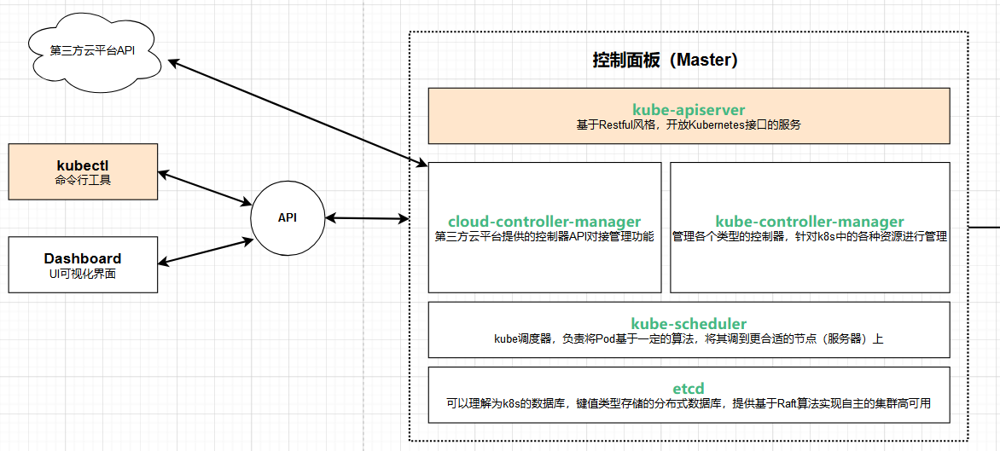

# 0. 参考链接

https://kubernetes.io/zh-cn/docs/concepts/overview/components/

https://www.kubernetes.org.cn/k8s

# 1. 认识kubernetes

## 1.1 什么是kubernetes

Kubernetes 是一个可移植、可扩展的开源平台，用于管理容器化的工作负载和服务，可促进声明式配置和自动化。 Kubernetes 拥有一个庞大且快速增长的生态，其服务、支持和工具的使用范围相当广泛。

**Kubernetes** 这个名字源于希腊语，意为“舵手”或“飞行员”。K8s 这个缩写是因为 K 和 s 之间有 8 个字符的关系。Google 在 2014 年开源了 Kubernetes 项目。 Kubernetes 建立在 [Google 大规模运行生产工作负载十几年经验(即Borg)](https://research.google/pubs/pub43438)的基础上， 结合了社区中最优秀的想法和实践。

Borg架构图如下：


## 1.2 为什么需要kubernetes

### 1.2.1 Kubernetes 的历史背景


**传统部署时代：**

早期，各个组织是在物理服务器上运行应用程序。 由于无法限制在物理服务器中运行的应用程序资源使用，因此会导致资源分配问题。 例如，如果在同一台物理服务器上运行多个应用程序， 则可能会出现一个应用程序占用大部分资源的情况，而导致其他应用程序的性能下降。 一种解决方案是将每个应用程序都运行在不同的物理服务器上， 但是当某个应用程序资源利用率不高时，剩余资源无法被分配给其他应用程序， 而且维护许多物理服务器的成本很高。

**虚拟化部署时代：**

因此，虚拟化技术被引入了。虚拟化技术允许你在单个物理服务器的 CPU 上运行多台虚拟机（VM）。 虚拟化能使应用程序在不同 VM 之间被彼此隔离，且能提供一定程度的安全性， 因为一个应用程序的信息不能被另一应用程序随意访问。

虚拟化技术能够更好地利用物理服务器的资源，并且因为可轻松地添加或更新应用程序， 而因此可以具有更高的可扩缩性，以及降低硬件成本等等的好处。 通过虚拟化，你可以将一组物理资源呈现为可丢弃的虚拟机集群。

每个 VM 是一台完整的计算机，在虚拟化硬件之上运行所有组件，包括其自己的操作系统。

**容器部署时代：**

容器类似于 VM，但是更宽松的隔离特性，使容器之间可以共享操作系统（OS）。 因此，容器比起 VM 被认为是更轻量级的。且与 VM 类似，每个容器都具有自己的文件系统、CPU、内存、进程空间等。 由于它们与基础架构分离，因此可以跨云和 OS 发行版本进行移植。

容器因具有许多优势而变得流行起来，例如：

- 敏捷应用程序的创建和部署：与使用 VM 镜像相比，提高了容器镜像创建的简便性和效率。
- 持续开发、集成和部署：通过快速简单的回滚（由于镜像不可变性）， 提供可靠且频繁的容器镜像构建和部署。
- 关注开发与运维的分离：在构建、发布时创建应用程序容器镜像，而不是在部署时， 从而将应用程序与基础架构分离。
- 可观察性：不仅可以显示 OS 级别的信息和指标，还可以显示应用程序的运行状况和其他指标信号。

- 跨开发、测试和生产的环境一致性：在笔记本计算机上也可以和在云中运行一样的应用程序。
- 跨云和操作系统发行版本的可移植性：可在 Ubuntu、RHEL、CoreOS、本地、 Google Kubernetes Engine 和其他任何地方运行。
- 以应用程序为中心的管理：提高抽象级别，从在虚拟硬件上运行 OS 到使用逻辑资源在 OS 上运行应用程序。
- 松散耦合、分布式、弹性、解放的微服务：应用程序被分解成较小的独立部分， 并且可以动态部署和管理 - 而不是在一台大型单机上整体运行。
- 资源隔离：可预测的应用程序性能。
- 资源利用：高效率和高密度。

### 1.2.2 Kubernetes能做什么?

容器是打包和运行应用程序的好方式。在生产环境中， 你需要管理运行着应用程序的容器，并确保服务不会下线。 例如，如果一个容器发生故障，则你需要启动另一个容器。 如果此行为交由给系统处理，是不是会更容易一些？

这就是 Kubernetes 要来做的事情！ Kubernetes 为你提供了一个**可弹性运行分布式系统的框架**。 Kubernetes 会满足你的扩展要求、故障转移你的应用、提供部署模式等。 例如，Kubernetes 可以轻松管理系统的 Canary (金丝雀) 部署。

Kubernetes 为你提供：

- **服务发现和负载均衡**

  Kubernetes 可以使用 DNS 名称或自己的 IP 地址来暴露容器。 如果进入容器的流量很大， Kubernetes 可以负载均衡并分配网络流量，从而使部署稳定。

- **存储编排**

  Kubernetes 允许你自动挂载你选择的存储系统，例如本地存储、公共云提供商等。

- **自动部署和回滚**

  你可以使用 Kubernetes 描述已部署容器的所需状态， 它可以以受控的速率将实际状态更改为期望状态。 例如，你可以自动化 Kubernetes 来为你的部署创建新容器， 删除现有容器并将它们的所有资源用于新容器。

- **自动完成装箱计算**

  你为 Kubernetes 提供许多节点组成的集群，在这个集群上运行容器化的任务。 你告诉 Kubernetes 每个容器需要多少 CPU 和内存 (RAM)。 Kubernetes 可以将这些容器按实际情况调度到你的节点上，以最佳方式利用你的资源。

- **自我修复**

  Kubernetes 将重新启动失败的容器、替换容器、杀死不响应用户定义的运行状况检查的容器， 并且在准备好服务之前不将其通告给客户端。

- **密钥与配置管理**

  Kubernetes 允许你存储和管理敏感信息，例如密码、OAuth 令牌和 SSH 密钥。 你可以在不重建容器镜像的情况下部署和更新密钥和应用程序配置，也无需在堆栈配置中暴露密钥。

- **批处理执行** 除了服务外，Kubernetes 还可以管理你的批处理和 CI（持续集成）工作负载，如有需要，可以替换失败的容器。
- **水平扩缩** 使用简单的命令、用户界面或根据 CPU 使用率自动对你的应用进行扩缩。
- **IPv4/IPv6 双栈** 为 Pod（容器组）和 Service（服务）分配 IPv4 和 IPv6 地址。
- **为可扩展性设计** 在不改变上游源代码的情况下为你的 Kubernetes 集群添加功能。

## 1.3 企业容器调度平台对比

### 1.3.1 Apache Mesos

#### 1.3.1.1 基本概念

Mesos是一个**分布式调度系统**内核，早于Docker的产生，Mesos作为资源管理器， 从DC/OS(数据中心操作系统)的角度提供资源视图。**主/从结构**的工作模式，**主节点分配任务**，并用**从节点上的Executor负责执行**，通过Zookeeper给主节点提供注册服务、服务发现等功能。通过Framework Marathon 提供容器调度的能力。

#### 1.3.1.2 优势

经过时间的检验，作为资源管理器的Apache Mesos在容器之前就已经出现很久了，支持运行容器化和非容器化的工作负载。可以支持应用程序的健康检查，开放的架构。支持多个框架和多个调度器，通过不同的Framework可以运行Hadoop/Spark/MPI等多种不同的任务。

支持超大规模的节点管理，模拟测试支持超过5w+节点，在大规模上拥有较大优势。

### 1.3.2 Docker Swarm

#### 1.3.2.1 基本概念

Docker Swarm是一个由Docker开发的调度框架。由Docker自身开发的好处之一就是标准Docker API的使用，Swarm由多个代理（Agent）组成，把这些代理称之为节点（Node）。这些节点就是主机，这些主机在启动Docker Daemon的时候就会打开相应的端口，以此支持Docker远程API。这些机器会根据Swarm调度器分配给他们的任务，拉取和运行不同的镜像。

#### 1.3.2.2 优势

从Docker1.12版本开始，Swarm随Docker一起默认安装发布。由于随Docker引擎一起发布，无需额外安装，配置简单。支持服务注册、服务发现，内置Overlay Network以及Load Balancer。与Docker CLI非常类似的操作命令，对熟悉Docker的人非常容易上手学习。

入门门槛低，学习成本低，使用更便捷，适合中小型系统。

### 1.3.3 Google Kubernetes

#### 1.3.3.1 基本概念

Kubernetes 是基于Google在过去十五年来大量生产环境中运行工作负载的经验。Kubernetes的实现参考了Google内部的资源调度框架Borg，但并不是Borg的内部容器编排系统的开源，而是借鉴Google从运行Borg获得的经验教训，形成了Kubernetes项目。

它使用Label和Pod的概念来将容器划分为逻辑单元。Pods是同地协作(co-located)容器的集合，这些容器被共同部署和调度，形成了一个服务，这是Kubernetes和其他两个框架的主要区别。相比于基于相似度的容器调度方式（就像Swarm和Mesos），这个方法简化了对集群的管理。

#### 1.3.3.2 优势

最流行的容器编排解决方案，基于Google庞大的生态圈及社区产生的产品。通过Pods这一抽象的概念，解决Container之间的依赖于通信的问题。Pods、Services、Deployments是独立部署的部分。可以通过Selector提供更多的灵活性。内置服务注册表和负载均衡。

适用度更广，功能更强大，相较于Mesos来说节点规模较小。

# 2. ==Kubernetes组件==

一个正常运行的 Kubernetes 集群所需的各种组件


## 2.1 ==核心组件==

Kubernetes 集群由**一个控制平面和一组用于运行容器化应用的工作机器**组成，这些**工作机器称作节点（Node）**。 每个集群至少需要一个工作节点来运行 Pod。

工作节点托管着组成应用负载的 Pod(*Pod 表示你的集群上一组正在运行的容器。*)。控制平面管理集群中的工作节点和 Pod。 在生产环境中，控制平面通常跨多台计算机运行，而一个集群通常运行多个节点，以提供容错和高可用。

### 2.1.1 五大控制面板组件（Control Panel Components）

控制平面组件会为集群做出全局决策，比如资源的调度。 以及检测和响应集群事件，例如当不满足 Deployment 的 `replicas` 字段时，要启动新的 [Pod](https://kubernetes.io/zh-cn/docs/concepts/workloads/pods/)）。

控制平面组件可以在集群中的任何节点上运行。 然而，为了简单起见，安装脚本通常会在同一个计算机上启动所有控制平面组件， 并且不会在此计算机上运行用户容器。请参阅[使用 kubeadm 构建高可用性集群](https://kubernetes.io/zh-cn/docs/setup/production-environment/tools/kubeadm/high-availability/)中关于跨多机器安装控制平面的示例。

- [kube-apiserver](https://kubernetes.io/zh-cn/docs/concepts/architecture/#kube-apiserver) **公开 Kubernetes HTTP API 的核心组件服务器**

  API 服务器是 Kubernetes [控制平面](https://kubernetes.io/zh-cn/docs/reference/glossary/?all=true#term-control-plane)(*是指容器编排层，它暴露 API 和接口来定义、 部署容器和管理容器的生命周期*)的组件， 该组件负责公开了 Kubernetes API，负责处理接受请求的工作。 API 服务器是 Kubernetes 控制平面的前端。

  Kubernetes API 服务器的主要实现是 [kube-apiserver](https://kubernetes.io/zh-cn/docs/reference/command-line-tools-reference/kube-apiserver/)。 `kube-apiserver` 设计上考虑了水平扩缩，也就是说，它可通过部署多个实例来进行扩缩。 你可以运行 `kube-apiserver` 的多个实例，并在这些实例之间平衡流量。

- [kube-scheduler](https://kubernetes.io/zh-cn/docs/concepts/architecture/#kube-scheduler) **查找尚未绑定到节点的 Pod，并将每个 Pod 分配给合适的节点。**

  `kube-scheduler` 是[控制平面](https://kubernetes.io/zh-cn/docs/reference/glossary/?all=true#term-control-plane)的组件， 负责监视新创建的、未指定运行[节点（node）](https://kubernetes.io/zh-cn/docs/concepts/architecture/nodes/)(*Kubernetes 中的工作机器称作节点*)的 [Pods](https://kubernetes.io/zh-cn/docs/concepts/workloads/pods/)， 并选择节点来让 Pod 在上面运行。

  调度决策考虑的因素包括单个 Pod 及 Pods 集合的资源需求、软硬件及策略约束、 亲和性及反亲和性规范、数据位置、工作负载间的干扰及最后时限

- [kube-controller-manager](https://kubernetes.io/zh-cn/docs/concepts/architecture/#kube-controller-manager) **运行[控制器](https://kubernetes.io/zh-cn/docs/concepts/architecture/controller/)来实现 Kubernetes API 行为。**

  `kube-controller-manager`是[控制平面](https://kubernetes.io/zh-cn/docs/reference/glossary/?all=true#term-control-plane)的组件， 负责运行[控制器](https://kubernetes.io/zh-cn/docs/concepts/architecture/controller/)进程。

  从逻辑上讲， 每个[控制器](https://kubernetes.io/zh-cn/docs/concepts/architecture/controller/)都是一个单独的进程， 但是为了降低复杂性，它们都被编译到同一个可执行文件，并在同一个进程中运行。

  控制器有许多不同类型。以下是一些例子：

  - Node Controller(**节点控制器**)：负责在节点出现故障时进行通知和响应
  - Job Controller(**任务控制器**)：监测代表一次性任务的 Job 对象，然后创建 Pod 来运行这些任务直至完成
  - EndpointSlice Controller(**端点分片控制器**)：填充 EndpointSlice 对象（以提供 Service 和 Pod 之间的链接）。
  - ServiceAccount Controller(**服务账号控制器**)：为新的命名空间创建默认的 ServiceAccount。

- [cloud-controller-manager](https://kubernetes.io/zh-cn/docs/concepts/architecture/#cloud-controller-manager) (optional) **与底层云驱动集成，连接第三方云api**

  一个 Kubernetes [控制平面](https://kubernetes.io/zh-cn/docs/reference/glossary/?all=true#term-control-plane)组件， 嵌入了特定于云平台的控制逻辑。 云控制器管理器（Cloud Controller Manager）允许将你的集群连接到云提供商的 API 之上， 并将与该云平台交互的组件同与你的集群交互的组件分离开来。

  `cloud-controller-manager` 仅运行特定于云平台的控制器。 因此如果你在自己的环境中运行 Kubernetes，或者在本地计算机中运行学习环境， 所部署的集群不包含云控制器管理器。

  与 `kube-controller-manager` 类似，`cloud-controller-manager` 将若干逻辑上独立的控制回路组合到同一个可执行文件中，以同一进程的方式供你运行。 你可以对其执行水平扩容（运行不止一个副本）以提升性能或者增强容错能力。

  下面的控制器都包含对云平台驱动的依赖：

  - Node 控制器：用于在节点终止响应后检查云平台以确定节点是否已被删除
  - Route 控制器：用于在底层云基础架构中设置路由
  - Service 控制器：用于创建、更新和删除云平台上的负载均衡器

- [etcd](https://kubernetes.io/zh-cn/docs/concepts/architecture/#etcd) **具备一致性和高可用性的键值存储，用于所有 API 服务器的数据存储**

  一致且高可用的键值存储，用作 Kubernetes 所有集群数据的后台数据库。(**老版本基于内存，新版本基于持久化**)

  如果你的 Kubernetes 集群使用 etcd 作为其后台数据库， 请确保你针对这些数据有一份 [备份](https://kubernetes.io/zh-cn/docs/tasks/administer-cluster/configure-upgrade-etcd/#backing-up-an-etcd-cluster)计划。

  你可以在官方[文档](https://etcd.io/docs/)中找到有关 etcd 的深入知识。

  



### 2.1.2 三大节点组件（Node Components）

在每个节点上运行，维护运行的 Pod 并提供 Kubernetes 运行时环境：

- [kubelet](https://kubernetes.io/zh-cn/docs/concepts/architecture/#kubelet) **确保 Pod 及其容器正常运行**

  `kubelet` 会在集群中每个[节点（node）](https://kubernetes.io/zh-cn/docs/concepts/architecture/nodes/)上运行。 它保证[容器（containers）](https://kubernetes.io/zh-cn/docs/concepts/containers/)都运行在 [Pod](https://kubernetes.io/zh-cn/docs/concepts/workloads/pods/) 中。

  `kubelet`接收一组通过各类机制提供给它的 PodSpec，确保这些 PodSpec 中描述的容器处于运行状态且健康。 kubelet 不会管理不是由 Kubernetes 创建的容器。

- [kube-proxy](https://kubernetes.io/zh-cn/docs/concepts/architecture/#kube-proxy)（可选）**维护节点上的网络规则以实现 Service 的功能。基于TCP/IP四层网络模型**

  `kube-proxy`是集群中每个[节点（node）](https://kubernetes.io/zh-cn/docs/concepts/architecture/nodes/)上所运行的网络代理， 实现 Kubernetes [服务（Service）](https://kubernetes.io/zh-cn/docs/concepts/services-networking/service/) 概念的一部分。

  kube-proxy 维护节点上的一些网络规则， 这些网络规则会允许从集群内部或外部的网络会话与 Pod 进行网络通信。

  如果操作系统提供了可用的数据包过滤层，则 kube-proxy 会通过它来实现网络规则。 否则，kube-proxy 仅做流量转发。

  如果你使用[网络插件](https://kubernetes.io/zh-cn/docs/concepts/architecture/#network-plugins)为 Service 实现本身的数据包转发， 并提供与 kube-proxy 等效的行为，那么你不需要在集群中的节点上运行 kube-proxy。

- [容器运行时（Container runtime）](https://kubernetes.io/zh-cn/docs/concepts/architecture/#container-runtime) **负责运行容器的软件**

  这个基础组件使 Kubernetes 能够有效运行容器。 它负责管理 Kubernetes 环境中容器的执行和生命周期。

  Kubernetes 支持许多容器运行环境，例如 [containerd](https://containerd.io/docs/)、 [CRI-O](https://cri-o.io/#what-is-cri-o) 以及 [Kubernetes CRI (容器运行环境接口)](https://github.com/kubernetes/community/blob/master/contributors/devel/sig-node/container-runtime-interface.md) 的其他任何实现。

  > 即容器不一定依赖docker

- [Pods](https://kubernetes.io/zh-cn/docs/concepts/workloads/pods/) **严格意义上不算Node节点组件**

  **Pods** 是 Kubernetes 用来运行应用程序的抽象，并不算是 Node 节点的组件。Pods 是 Kubernetes 中最小的可部署单元，通常包含一个或多个容器，它们共享网络和存储资源。


### 2.1.3 附加组件/插件 （Addons）

插件扩展了 Kubernetes 的功能。一些重要的例子包括：

- [DNS](https://kubernetes.io/zh-cn/docs/concepts/architecture/#dns) **集群范围内的 DNS 解析**

  尽管其他插件都并非严格意义上的必需组件，但几乎所有 Kubernetes 集群都应该有[集群 DNS](https://kubernetes.io/zh-cn/docs/concepts/services-networking/dns-pod-service/)， 因为很多示例都需要 DNS 服务。

  集群 DNS 是一个 DNS 服务器，和环境中的其他 DNS 服务器一起工作，它为 Kubernetes 服务提供 DNS 记录。

  Kubernetes 启动的容器自动将此 DNS 服务器包含在其 DNS 搜索列表中。

- [Web 界面](https://kubernetes.io/zh-cn/docs/concepts/architecture/#web-ui-dashboard)（Dashboard）**通过 Web 界面进行集群管理**

  [Dashboard](https://kubernetes.io/zh-cn/docs/tasks/access-application-cluster/web-ui-dashboard/) 是 Kubernetes 集群的通用的、基于 Web 的用户界面。 它使用户可以管理集群中运行的应用程序以及集群本身，并进行故障排除。

- [容器资源监控](https://kubernetes.io/zh-cn/docs/concepts/architecture/#container-resource-monitoring) **用于收集和存储容器指标**

  [容器资源监控](https://kubernetes.io/zh-cn/docs/tasks/debug/debug-cluster/resource-usage-monitoring/) 将关于容器的一些常见的时序度量值保存到一个集中的数据库中，并提供浏览这些数据的界面。

- [集群层面日志](https://kubernetes.io/zh-cn/docs/concepts/architecture/#cluster-level-logging) **用于将容器日志保存到中央日志存储**

  [集群层面日志](https://kubernetes.io/zh-cn/docs/concepts/cluster-administration/logging/)机制负责将容器的日志数据保存到一个集中的日志存储中， 这种集中日志存储提供搜索和浏览接口。

  > 插件举例：
  >
  > + `kube-dns` 为整个集群提供DNS服务
  > + `ingress controller` 为服务外网入口（如外部服务发现）
  > + `Heapster` 提供资源监控
  > + `Prometheus` 提供资源监控
  > + `Dashboard` UI界面控制入口
  > + `Federation` 提供跨可用区的集群
  > + `Fluentd-elasticsearch` 提供集群日志采集、存储与查询

## 2.2 分层架构

从顶层到底层的顺序：

+ **生态系统层**

  在接口层之上的庞大容器集群管理调度的生态系统，可以划分为两个范畴

  - Kubernetes外部：日志、监控、配置管理、CI、CD、Workflow、FaaS、OTS应用、ChatOps等
  - Kubernetes内部：CRI、CNI、CVI、镜像仓库、Cloud Provider、集群自身的配置和管理等

+ **接口层**

  kubectl命令行工具、客户端SDK以及集群联邦

+ **管理层**

  系统度量（如基础设施、容器和网络的度量），自动化（如自动扩展、动态Provision等）以及策略管理（RBAC、Quota、PSP、NetworkPolicy等）

+ **应用层**

  部署（无状态应用、有状态应用、批处理任务、集群应用等）和路由（服务发现、DNS解析等）

+ **核心层**

  Kubernetes最核心的功能，对外提供API构建高层的应用，对内提供插件式应用执行环境


# 3. 资源和对象

Kubernetes中所有内容都被抽象为"资源"，如:Pod,Service,Node等都是资源。 "对象"就是"资源"的实例，是持久化的实体。如某个具体的Pod、某个具体的Node。Kubernetes使用这些实体去表示整个集群的状态。

对象的创建、删除、修改都是通过`Kubernetes API`，也就是`API Server`组件提供的API接口，这些都是Restful风格的API，与Kubernetes的**万物皆资源对象**理念相符。命令行工具`kubectl`，实际上也是调用Kubernetes API。

kubernetes中资源类别有很多种，`kubectl`可以通过配置文件来创建这些对象，配置文件更像是描述对象属性的文件。配置文件格式一般为yaml或json

> 与Linux一切皆文件相似的理念, 在**kubernetes中一切皆资源**.
>
> 资源和对象的关系类似于Java中**类和实例的关系**.

# 4. 服务的分类

根据服务是否需要**将数据持久化**可以将服务分为:

+ 无状态服务
+ 有状态服务

#### 3.1.1.1 无状态服务

不会对本地环境产生任何依赖,如:不会存储数据到本地磁盘

**代表应用**: nginx,Apache

**优点**: 对客户端透明,无依赖关系,可以高效实现扩容,迁移

**缺点**: 不能存储数据,需要额外的数据服务支撑

#### 3.1.1.2 有状态服务

会对本地环境产生依赖,如:会将数据存储到本地磁盘

**代表应用**: redis,mysql

**优点**: 可以独立存储数据,实现数据管理

**缺点**: 集群环境下需要实现主从,数据同步,备份,水平扩容复杂

# 5 ==kubernetes资源变量分类==

参考地址：https://kubernetes.io/zh-cn/docs/reference/kubernetes-api/


## 5.1 元数据级

+ `Horizontal Pod Autoscaler`即`HPA` **Pod自动扩容**

  Pod自动扩容：可以根据cpu使用率或自定义指标(metrics)自动对Pod进行扩容或缩容。

  + 控制器管理器每隔30s（可以通过`horizontal-pod-autoscaler-sync-period`修改）查询metrics的资源使用情况
  + 支持三种metrics类型
    + **预定义metrics**（比如Pod的CPU）以**利用率**的方式计算
    + **自定义的Pod metrics**，以**原始值**(raw value)的方式计算
    + **自定义的object metrics**
  + 支持两种metrics查询方式：`Heapster`和自定义的RESTful API
  + 支持多metrics

+ `PodTemplate`

  Pod Template是关于Pod的定义，但是被包含在其他的Kubernetes对象中（如Deployment、Statement、DaemonSet等控制器）。控制器通过Pod Template信息来创建Pod。

  `HPA`**进行自动化Pod扩/缩容就是根据此模板**

+ `LimitRange`

  可以对集群内`Request`和`Limits`的配置项做一个全局的统一的限制，相当于批量设置了某一个范围内（某个命名空间namespace）的Pod的资源使用限制。

## 5.2 集群级

+ `Namespace`

  逻辑隔离，用于将资源划分为不同的组。集群中的`namespace`可以有多个

+ `Node`  物理机

  不像其他的资源（如Pod和Namespace），Node的本质上不是Kubernetes来创建的，Kubernetes只是管理Node上的资源。虽然可以通过Manifest创建一个Node对象，但kubernetes也只是去检查是否真的有这一个Node机器。如果没有，检查就会失败，也不会在其上调度Pod。

+ `ClusterRole`

  集群角色，用于管理集群权限

+ `ClusterRoleBinding`

  将`ClusterRole`或`Role`与资源进行绑定（可以绑定到集群级别上）

## 5.3 命名空间级

### 5.3.1 工作负载资源

#### 5.3.1.1 `Pod` 容器组

`Pod`（容器组）是kubernetes中最小的可部署单元。一个Pod容器组包含了至少一个应用程序容器、存储资源、一个唯一的网络IP地址、以及一些确定容器该如何运行的选项。Pod容器组代表了kubernetes中一个独立的应用程序运行实例，该实例可能由单个容器或多个紧耦合在一起的容器组成。

Docker是kubernetes Pod中使用最广泛的容器引擎，当然kubernetes中也支持其他容器引擎。如containerd，CRI-O

Kubernetes集群中Pod存在如下两种使用途径：

+ 一个Pod中只运行一个容器，"one-container-per-pod"是kubernetes中最常见的使用方式。此时你可以认为Pod容器组是该容器的wrapper，kubernetes通过Pod管理容器，而不是直接管理容器。
+ 一个Pod中运行多个需要相互协作的容器。你可以将多个紧耦合、共享资源且始终在一起运行的容器编排在同一个Pod中。


#### 5.3.1.2 `replicas` Pod副本

`replicas`Pod副本，即根据`PodTemplate`模板复制出来的。这些副本除了一些描述性信息（Pod的名字，uid等）不一样外，其他信息都是一样的：如Pod内部的容器、容器的数量、容器里面运行的应用等。

`Pod`的**控制器**通常包含一个名为`replicas`的属性。该属性则指定了特定Pod的副本数量，当当前集群中该Pod的数量与该属性指定的值不一致时，kubernetes会采取一定的策略去使得当前状态满足配置的要求。

#### 5.3.1.3 Pod控制器

Pod控制器是用于管理和维护Pod的一种机制。Pod控制器本质还是Pod，只是多了一些描述该对象的参数。类似与Pod的wrapper。Pod控制器可分为以下几类：

+ 适用无状态服务Pod控制器
+ 适用有状态服务Pod控制器
+ 守护进程Pod控制器
+ 任务/定时任务Pod控制器

##### 5.3.1.3.1 适用无状态服务Pod控制器

+ `ReplicationController`即`RC`  **只支持扩容和缩容**

  **只支持等式的selector**

  是kubernetes系统中核心概念之一。简单来说`RC`可以保证任意时间运行Pod的副本数量，能够保证Pod总是可用的。如果实际Pod数量比指定的多那么就会结束掉多余的Pod，如果Pod失败、被删除或挂掉后导致Pod实际数量比指定的少它就会自动启动新的Pod。所以即使只有一个Pod，我们也要使用`RC`管理我们的Pod，提供系统可用性。**已废弃**

+ `ReplicaSet`即`RS ` **只支持扩容和缩容**

  **支持集合式的selector**

  主要作用就是用来确保容器应用的副本数始终保持在用户预定义的数量。即如果有容器退出，会自动创建新的Pod代替；如果异常多出来的容器也会被自动回收。

  > **建议使用**`ReplicaSet`**代替**`ReplicationController`**，`RS`是`RC`的改良版，支持更复杂的标签选择器。**

+ ==`Deployment` **实际中主要用的Pod控制器**==

  该控制器是基于`RS`的进一步封装，提供了更加丰富的部署相关功能。主要有以下作用：

  + **自动创建RS和Pod**

  + **滚动升级，滚动回滚**

    不会停止服务更新，即热更新。例如`PodTemplate`更新了，会自动创建新的`RS`比如`RS-2`，然后逐步创建里面的Pod。当新的Pod创好且里面容器服务可用后，停掉原来`RS-1`中的Pod。然后逐步替代其他Pod，直至完全更新，将原来的`RS-1`保存以便于回滚。

    

  + **平滑扩容和缩容**

    简单命令实现扩容和缩容，依赖`ReplicaSet`

  + **暂停和恢复Deployment**

    为了避免配置未修改完频繁的自动升级、降级，因为有时配置更改不是以下就改完的。

##### 5.3.1.3.2 适用有状态服务Pod控制器 `StatefulSet`

`StatefulSet`中每个Pod的DNS格式为`statefulSetName-{0...N-1}.serviceName.namespace.svc.cluster.local`，则可以通过该域名实现Pod的互相通信。

+ `statefulSetName`为`StatefulSet`的名字
+ `0...N-1`为Pod所在的序号，从0到N-1
+ `serviceName`为`Headless Service`的名字
+ `namespace`为服务所在的命名空间名，`Headless Service`和`StatefulSet`必须在同一命名空间`namespace`
+ `svc` 固定值
+ `.cluster.local`为cluster domain集群域名

***主要特点：***

+ 稳定的持久化存储，基于volumeclaimTemplate
+ 稳定的网络标志，基于Headless Service
+ 有序部署，有序扩展  **按照Pod的0...N-1的顺序进行**，在下一个Pod运行前，它之前所有的Pod必须是Running或Ready状态，基于init containers来实现。
+ 有序收缩，有序删除  **按照Pod的N-1...0的顺序进行**，在下一个Pod运行前，它之前所有的Pod必须是shu或Ready状态，基于init containers来实现。

***组成：***

+ `Headless Service `  用于定义网络标志（DNS domain）即DNS服务
+ `VolumeClaimTemplate`   PVC，用于持久化数据存储的声明模板

***注意事项：***

+ kubernetes v1.5版本以上才支持
+ 所有Pod的Volume必须使用PersistentVolume或是管理员事先创建好
+ 为了保证数据安全，删除StatefulSet时不会删除Volume
+ StatefulSet需要一个Headless Service来定义DNS domain，需要在StatefulSet之前创建


##### 5.3.1.3.3 守护进程Pod控制器 `DaemonSet`

**DaemonSet 的行为是在每个 Node 节点 上运行 一个 Pod 副本实例。DaemonSet 确保在每个节点上都有一个 Pod 运行，而不是为每个应用程序的 Pod 都附加一个守护进程。**常用来部署一些集群的日志、监控或者其他系统管理应用。典型的应用包括：

+ 日志收集，比如fluentd，logstash等
+ 系统监控，比如Prometheus Node Exporter，collectd，New Relic agent，Ganglia gmod等
+ 系统程序，比如kube-proxy，kube-dns，glusterd，ceph等


##### 5.3.1.3.4 任务/定时任务Pod控制器

+ `Job` 一次性任务（一个任务一个Pod），运行完成后Pod销毁，不再重新启动容器。如：数据初始化、下载镜像
+ `CronJob` 定时任务

### 5.3.2 服务与发现资源


+ `Service`

  `Service`简写`svc`。**Pod不能直接提供给外网访问**，而是应该使用`Service`。`Service`**就是把Pod暴露出来提供服务**，`Service`才是真正的服务。

  可以说`Service`是一个应用服务的抽象，**定义了Pod逻辑集合和访问这个Pod集合的策略**。`Service`代理Pod集合，对外表现为一个访问入口，访问该入口的请求将经过负载均衡，转发到后端Pod中的容器。

  + **主要用于内部服务器Pod间通信**
  + **工作在TCP/IP四层网络层的，可以实现简单的外部访问**

+ `Ingress`

  **Ingress** 是一种控制外部 HTTP(S) 流量如何到达集群内服务的资源。它工作在第 7 层（应用层），允许基于域名、URL 路径、HTTP headers 等路由请求，提供更高级的流量控制和负载均衡功能。

  + **基于域名、URL 路径、TLS 提供 HTTP 流量控制**
  + **提供第 7 层的负载均衡**


> 当需要精细化控制 HTTP/HTTPS 请求时，Ingress 是首选。而对于非 HTTP 流量（如数据库服务、gRPC 等），Service 是更合适的工具。

### 5.3.3 存储资源	

+ `Volume`

  数据卷，共享Pod中容器使用的数据。用来放持久化的数据，比如数据库数据。

  + PersistentVolume即PV
  + PersistentVolumeClaim即PVC

+ `CSI`

  `CSI`即`Contaniner Storage Interface`是由来自kubernetes，Mesos，Docker等社区成员联合制定的一个行业标准接口规范，旨在将任意存储系统暴露给容器化应用程序。

  CSI规范定义了存储提供商实现CSI兼容的Volume Plugin的最小操作集和部署建议。CSI的主要焦点是声明Volume Plugin必须实现的接口。

### 5.3.4 特殊类型配置资源

+ `ConfigMap`

  ConfigMap 包含供 Pod 使用的配置数据。存放k-v键值对（如应用的端口，数据存放路径），更新配置数ConfigMap时会自动更新容器。

+ `Secret`

  和`ConfigMap`功能完全一样，但是提供了数据加密的功能。有下面三种类型：

  + `Service Account`：用来访问kubernetes API，由kubernetes自动创建，并且会自动挂载到Pod的`/run/secrets/kubernetes.io/serviceaccount`目录中
  + `Opaque`：base64编码格式的Secret，用来存储密码，密钥等（默认方式）
  + `kubernetes.io/dockerconfigjson`：用来存储私有docker registry的认证信息

+ `DownwardAPI`

  downwardAPI这个模式和其他模式不一样的地方在于它不是为了存放容器的数据，也不是用来进行容器和宿主机的数据交换的，而是让**Pod里的容器能够直接获取这个Pod对象本身的一些信息**。

  downwardAPI提供两种方式用于将Pod的信息注入到容器内：

  + **环境变量**：用于单个变量，可以将Pod信息和容器信息直接注入容器内部
  + **volume挂载**：将Pod信息生成为文件，直接挂载到容器内部中

### 5.3.5 其他

+ `Role`

  定义一组权限，命名空间级别

+ `RoleBinding`

  将`Role`或`ClusterRole`与资源进行绑定（只能绑定到命名空间级别）

# 6. 资源清单(资源配置文件)

**其实就是资源变量**  https://kubernetes.io/zh-cn/docs/reference/kubernetes-api/

Kubernetes (K8s) 中的资源（Resource）可以分为多种类型，涵盖从核心的计算资源（如 Pod 和 Node）到更高层的网络、存储和安全管理工具。这些资源通常定义在 YAML 或 JSON 文件中，称为 **资源清单（Resource Manifest）**，并用于管理 Kubernetes 集群中的对象。

# 7. 对象规约和状态

+ ***规约(Spec)***

  `spec`是规约、规格的意思。`spec`**是必须的，手动维护yaml**，他描述了对象的期望状态(Desired State)--希望对象所具有的特征。当创建kubernetes对象时，必须提供对象的规约，用于描述该对象的期望状态，以及关于对象的一些基本信息（例如名称）。

+ ***状态(Status)***

  `status`表示对象的实际状态，该属性由kubernetes自己维护，**kubernetes**会**通过一系列的控制器**对对应对象进行管理，**让对象实际状态status尽可能符合期望状态spec**

> `spec`规约是自己维护的，期望，`status`是k8s根据实际信息采集的，实际。k8s会自动调整让实际`status`接近`spec`。

# 8. kubernetes集群搭建

https://kubernetes.io/zh-cn/docs/setup/production-environment/tools/

有下面四种搭建方式:

+ `minikube`   建议个人电脑搭建,轻量化

+ `kubeadm`  完全的看k8s

+ 二进制安装

  通过下载并手动安装 Kubernetes 的各个组件（如 kube-apiserver、kube-controller-manager、kubelet、kube-proxy 等）来构建 Kubernetes 集群。用户需要自己配置所有组件的连接和管理。

+ 命令行安装

## 8.1 `minikube`搭建k8s


## 8.2 `kubeadm`搭建k8s

### 8.2.1 服务器要求

+ 最少三台机器,一个Master,两个Node
+ 每台机器最低配置2核,2G内存,20GB硬盘
+ 最好能联网,或者有对应的镜像私有仓库

### 8.2.2 软件环境

+ 操作系统: centos7
+ Docker 20.10 (k8s 1.23.17只兼容到docker20.10)
+ k8s 1.23.17 (**1.24**版本后不支持docker)

### 8.2.3 安装步骤

1. 初始化操作(所有节点)

   ```bash
   # 关闭防火墙
   $sudo systemctl stop firewalld
   $sudo systemctl disable firewalld
   #关闭selinux
   $sudo sed -i 's/SELINUX\=enforcing/SELINUX\=disabled' /etc/selinux/config # 永久关闭
   $sudo setenforce 0#临时
   #关闭swap k8s不推荐使用swap
   $sudo swapoff -a #临时
   #注释包含swap的行 其中 -r表示正则 &表示匹配到的行 
   $sudo sed -ri 's/.*swap.*/#&/' /etc/fstab #永久 (ri顺序不能颠倒)
   #关闭完swap一定要重启机器
   
   #根据规划规则设置主机名
   $sudo cat >> /etc/hosts<< EOF
   192.168.136.151 k8s-master
   192.168.136.152 k8s-node1
   192.168.136.153 k8s-node2
   EOF
   
   #将桥接的IPV4流量传递到iptables的链
   $sudo tee /etc/sysctl.d/k8s.conf << EOF #tee读取标准输入流数据到文件中
   net.bridge.bridge-nf-call-ip6tables = 1
   net.bridge.bridge-nf-call-iptables = 1
   EOF
   $sudo sysctl --system #生效
   
   # 设置阿里云yum镜像源
   $sudo cp CentOS-Base.repo CentOS-Base.repo.bak
   $sudo curl -o CentOS-Base.repo https://mirrors.aliyun.com/repo/Centos-7.repo
   $sudo yum makecache
   #时间同步
   $sudo yum install ntpdate -y
   $sudo ntpdate time.windows.com
   $sudo systemctl enable ntpdate
   ```

2. 安装基础软件(所有节点)

   + 安装Docker

     参考文档: https://developer.aliyun.com/mirror/docker-ce?spm=a2c6h.13651102.0.0.57e31b11Oq0dHq

     ```bash
     #卸载旧版本
     $sudo yum remove docker \
                       docker-client \
                       docker-client-latest \
                       docker-common \
                       docker-latest \
                       docker-latest-logrotate \
                       docker-logrotate \
                       docker-engine
     # 设置yum仓库  docker换成阿里云仓库会更快
     $sudo yum install -y yum-utils
     ## Step 2: 添加软件源信息 这里是 docker-ce二进制包的位置,不是镜像的地址
     $sudo yum-config-manager --add-repo https://mirrors.aliyun.com/docker-ce/linux/centos/docker-ce.repo
     # 列出可用docker旧版本
     $sudo yum list docker-ce.x86_64 --showduplicates | sort -r 
     #docker-ce.x86_64            3:20.10.24-3.el7                    docker-ce-stable
     #docker-ce.x86_64            3:26.1.4-1.el7                      docker-ce-stable
     # 不确定版本号,可以一个一个试试实际是(20.10.24-3.el7)
     # 安装docker engine 指定版本
     $sudo yum remove -y docker-ce docker-ce-cli containerd.io docker-compose-plugin docker-buildx-plugin
     $sudo yum install docker-ce-20.10.24-3.el7  \
      docker-ce-cli-20.10.24-3.el7  \
      containerd.io #配合k8s 其他插件可以不安装如docker-compose-plugin, docker-buildx-plugin安装失败,需要找到合适的版本(用于构建镜像)
     $yum list installed|grep docker
     $sudo systemctl start docker
     $sudo systemctl enable docker
     ```

     > **docker-ce是docker引擎本身, docker-ce-cli是命令行工具执行docker ps等命令, containerd.iodocker运行的守护进程, docker-buildx-plugin为跨平台构建镜像, ocker-compose-plugin为简单的容器编排**

   + 设置docker镜像地址

     ```bash
     $sudo tee /etc/docker/daemon.json <<EOF
     {
       "registry-mirrors": ["https://docker.registry.cyou","https://dockerpull.com","https://docker.rainbond.cc","https://docker.udayun.com"]
     }
     EOF
     $sudo systemctl daemon-reload
     $sudo systemctl restart docker
     ```

   + 设置kubernetes-yum镜像地址 (**旧版本安装方式**)

     参考文档:https://developer.aliyun.com/mirror/kubernetes?spm=a2c6h.13651102.0.0.73281b11CoAoOZ

     ```bash
     $sudo tee /etc/yum.repos.d/kubernetes.repo <<EOF
     [kubernetes]
     name=Kubernetes
     baseurl=https://mirrors.aliyun.com/kubernetes/yum/repos/kubernetes-el7-x86_64
     enabled=1
     gpgcheck=0
     repo_gpgcheck=0
     
     gpgkey=https://mirrors.aliyun.com/kubernetes/yum/doc/yum-key.gpg https://mirrors.aliyun.com/kubernetes/yum/doc/rpm-package-key.gpg
     EOF
     $sudo yum clean all && sudo yum makecache
     ```

     > 这个是管**二进制文件kubelet,kubeadm,kubectl,kubernetes等这些rpm软件包的**

   + 安装`kubeadm`,`kubelet`,`kubectl`

     ```bash
     $sudo yum install -y kubelet-1.23.17 kubeadm-1.23.17 kubectl-1.23.17
     $yum list installed|grep kube
     #$sudo systemctl start kubelet #这一步无法启动kubelet,必须在kubeadm init中才会生产配置文件启动kubelet
     $sudo systemctl enable kubelet
     ```

3. 部署Kubernetes Master

   参考地址: https://kubernetes.io/zh-cn/docs/setup/production-environment/tools/kubeadm/create-cluster-kubeadm/

   ```bash
   #在master节点执行
   #如果第一次初始化失败,重新初始化前执行
   $sudo kubeadm reset
   $sudo kubeadm init \ #用于搭建控制面板master节点
    --apiserver-advertise-address=192.168.136.151 \ #指定apiserver地址
    # dockerpull.com为第三方镜像源地址,dyrnq为docker hub用户下的镜像仓库
    --image-repository dockerpull.com/dyrnq \ #指定5大组件kube-apiserver,etcd等镜像下载地址,阿里云的registry.aliyuncs.com/google_containers\废了
    --kubernetes-version v1.23.17 \ #指定kubernetes版本
    --service-cidr=10.96.0.0/12 \ #指定service资源网段地址(横向流程,内部服务通信即Pod间通信)
    --pod-network-cidr=10.244.0.0/16 #指定Pod资源网段地址
    # 安装成功提示 
    # Your Kubernetes control-plane has initialized successfully!
    
   #安装成功后,复制如下配置并执行
   $sudo mkdir -p $HOME/.kube
   $sudo cp -i /etc/kubernetes/admin.conf $HOME/.kube/config
   $sudo chown $(id -u):$(id -g) $HOME/.kube/config
   $sudo get nodes
   ```

   

   ***kubelet启动错误原因:***

   + `journalctl -xefu kubelet`查看日志 

     ```bash
     Sep 19 21:05:23 k8s-master kubelet[28522]: E0919 21:05:23.719569   28522 server.go:302] "Failed to run kubelet" err="failed to run Kubelet: misconfiguration: kubelet cgroup driver: \"systemd\
     ```

     **解决方法:**

     ```bash
     $sudo docker info | grep -i cgroup
     #输出为cgroupfs 改为systemd
     # Cgroup Driver: cgroupfs
     # Cgroup Version: 1
     
     
     $sudo vim /etc/docker/daemon.json
     #增加以下配置
     {
       "registry-mirrors":[..],
       "exec-opts": ["native.cgroupdriver=systemd"]#修改cgroupfs
     }
     $sudo systemctl restart docker
     $sudo systemctl start kubelet
     ```

   + `journalctl -xefu kubelet`查看日志 

     ```bash
     Sep 19 21:17:59 k8s-node1 kubelet[21589]: E0919 21:17:59.436820   21589 server.go:205] "Failed to load kubelet config file" err="failed to load Kubelet config file /var/lib/kubelet/config.yam
     ```

     这是因为没有执行`kubeadm init`就启动`kubelet`服务,`kubelet`的配置文件还没生成.必须先执行`kubeadm init`

   > + `kubeadm init`命令option参考地址 https://kubernetes.io/zh-cn/docs/reference/setup-tools/kubeadm/kubeadm-init/
   > + `--image-repository`和上面设置的`/etc/yum.repo.d/kubernetes.repo`功能不一样,`kubernetes.repo`主要用于**rpm二进制软件包kubelet,kubectl,kubeadm,kubernetes**的安装. 而`--image-repository`中指定的地址是容器镜像地址,主要用于**控制面板master节点的5大组件(kube-apiserver,etcd等等)镜像安装**

4. 部署Kubernetes Node

   

5. 部署CNI网络插件

   

6. 测试kubernetes集群

## 8.3 二进制安装k8s


## 8.4 命令行工具安装k8s
