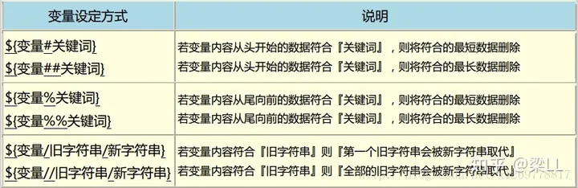
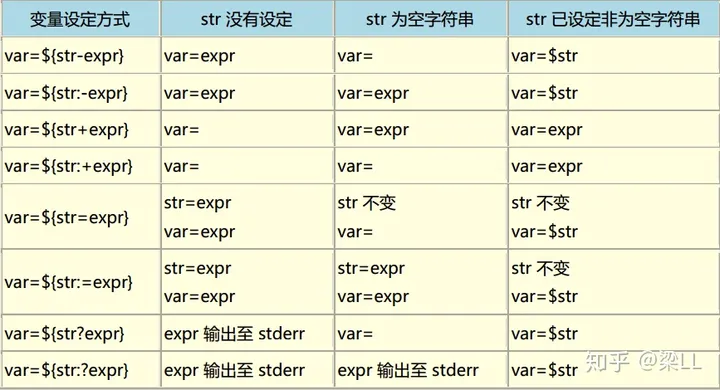
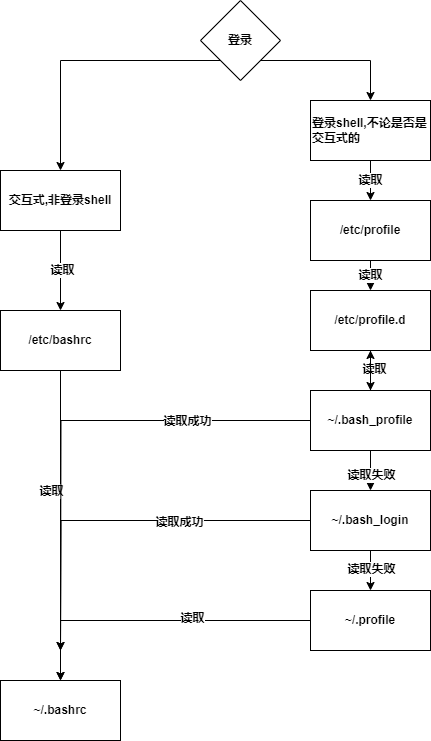
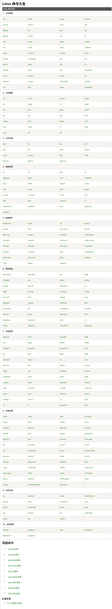

# 
# 1. 区分`tty/pts`

```bash
[ly@localhost ~]$ who -H
NAME     LINE         TIME             COMMENT
ly       :0           2024-01-15 15:09 (:0)
ly       pts/0        2024-01-15 15:10 (:0)
ly       pts/1        2024-01-15 15:10 (192.168.136.1)
root     tty2         2024-01-15 15:54
```

## 1.1  tty

一般可为`tty2~tty9`，分别代表在机器/虚拟机上按下`ctrl+alt+F2~F9`进入的命令行界面登录使用.`ctrl+alt+F1`为图形界面

## 1.2 pts

虚拟终端，来源分两类：**xshell等远程登录的终端**和**机器内部打开的终端（图形界面）**。后面的`/0,/1`表示顺序.

**有n个终端就有n个`pts`**，最后一个就为`pts/n` (n换成具体数字)


# 2. Linux特殊符号

+ `#` 脚本中一般为注释符号，**当为命令提示符时表示正在root账户下使用**
+ `$` 脚本中表示引用变量，当为命令提示符时表示正在**非root账户**下使用，正则中表示结束
+ `~` 当为命令提示符时表示正在**当前登录用户的家目录下**，如果是root用户就是`/root`如果是普通用户就为`/home/用户`
+ `;` Linux中一般为命令分隔符，可在一行中执行多条命令
+ \`\` 反引号，表示执行命令（效果等同于控制台执行）
+ `<` 输入重定向，将指定文件的内容输入到命令中
+ `>` 输出重定向，将命令的输出重定向到指定文件中
+ `<<` 输入追加符号，一般用于输入多行文本
+ `>>` 输出追加符号，一般用于将命令的输出追加到文件的末尾
+ `&` 后台运行
+ `|`  管道符，表示将前一个命令的输出当作后一个命令的输入
+ `||` 多命令符号，用于一行上执行多条命令。表示**只有在前一个命令执行失败时，才会执行下一条命令**
+ `&&` 多命令符号，用于一行上执行多条命令。表示**只有在前一个命令执行成功时，才会执行下一个命令**
+ `\\` 转移符号
+ `!` 表示历史命令，用于执行历史命令
+ `^` 脱字符用于正则匹配
+ `()` 子命令符号，用于在当前shell中执行子命令，效果等同于反引号\`\`
+ `*` 表示任意个任意字符
+ `?` 表示一个任意字符
+ `[]` 字符集合，用于匹配指定字符集合的任意一个字符，在shell中搭配`if`是`test`命令
+ `{}` 大括号符号，用于扩展命令字符串或命令序列

# 3. ${ }、[ \]、$( )、$[ ]、$(( ))、[[ ]]、(( ))的作用

[linux之${ }、[ \]、$( )、$[ ]、$(( ))、[[ ]]、(( ))的作用_linux ${}-CSDN博客](https://blog.csdn.net/qq_43382735/article/details/121761877)

## 3.1 ${} 字符串操作

+ 使用变量等同于`$`，相当于边界

+ 数组取值 `${变量[下标]}`

+ 字符串操作1 **下标从0开始**

  + `${var:num}`表示截取字符串var**从num到末尾的子串（整数表示从左向右【下标】，负数表示从右向左【个数】）**
  + `${var:num1:num2}` 表示截取字符串var**从num1开始长度为num2的字串**

  ```bash
  var=/home/centos
  ${var:5} # 从左向右下标为5到末尾的子串，输出/centos
  ${var:-6}# 从右到左数6个字符串，输出centos
  ${var:1-3} == ${var:-2} == os 
  ${var:1:4} #从左往右下标为1长度为4的子串，输出home
  ```

+ 字符串操作2

  ```bash
  # 例子
  var=testcase
  # ? 表示一个占位符 *表示n个占位符
  ${var#?e} == ${var#*e} == stcase # 表示从第一个位置开始匹配，然后删除最短的匹配项
  ${var##?e} == stcase  #表示从第一个位置开始匹配，然后删除最长的匹配项
  ${var##*e} == ''
  ${var%*e} == testcas #表示从第最后一个位置开始匹配，然后删除最短的匹配项
  ${var%?e} == testca
  ${var%%*e} == ''  #表示从第最后一个位置开始匹配，然后删除最长的匹配项
  ${var%%?e} == testca
  ${var/e/+} == t+stcase # 表示把第一个位置的旧字符替换为新字符
  ${var//e/+} == t+stcas+ # 表示把所有旧字符替换为新字符
  ```

+ 字符串操作3


# 4. shell变量(`env,export,set,declare`)

shell变量分为**环境变量**和**自定义环境变量**

+ **环境变量**: 可以在其进程的子进程中继续有效
+ **自定义变量**: shell中自己定义的变量,无法延伸到其进程的子进程中(**需要看子进程启动方式**)

## 4.1 只显示环境变量

+ `env` **只显示当前用户的环境变量,默认排序**

  > ```bash
  > [ly@localhost ~]$ env #默认排序,输出键值对
  > XDG_SESSION_ID=1
  > HOSTNAME=localhost.localdomain
  > ...
  > ```

+ `export ` **只显示当前用户的环境变量,输出按照变量名排序**

  > ```bash
  > [ly@localhost ~]$ export #按照变量名排序,带有declare的关键字
  > declare -x DISPLAY="localhost:11.0"
  > declare -x HISTCONTROL="ignoredups"
  > ...
  > ```

## 4.2 环境变量+自定义变量

+ `set` **显示当前shell中定义的所有变量,包括环境变量和自定义变量,默认排序**
+ `declare` **显示当前shell中定义的所有变量,包括环境变量和自定义变量,按照变量名排序**

## 4.3 `env,export,set,declare`命令详解

+ `env [option] [-] [key=value] [command [argv]]` **1.显示系统的环境变量,2.执行程序以指定的环境(变量当然是临时生效) **

  > ```bash
  > env # 显示当前系统环境 默认排序
  > env -u JAVA_HOME #删除JAVA_HOME环境变量
  > env -i PATH=/xxx # 开始一个空的环境变量,并设置PATH=/xxx
  > env PATH=$PATH:/xxx #更新PATH环境变量
  > env PATH=/xxx java -version # 环境变量中有高版本的java,不改环境变量,使用指定的java
  > # 利用这个特性 可用于脚本开头
  > #!/usr/bin/env PATH=/xxx java argv
  > ```

+ `export` **修改或显示环境变量<font color='red'>注意:只对当前登录的shell生效,不是永久的,不影响别的用户</font>** 

  ```bash
export key value #向当前shell系统变量(env,set)中加入环境变量 
  export -n 变量名 #删除当前shell中系统变量(env,set)的环境变量
export -p #效果和export 一样输出当前系统环境变量
  ```

+ `set` 设置shell的执行方式,定制shell执行需求,**放在shell脚本的前头**

  ```bash
  #!/bin/bash
  set -eux
  echo $PATH
  echo $AAAA
  ```
  
  + `set -e` 脚本执行中遇到错误立即退出(原来是不退出)
  + `set -u` 脚本中有未定义的变量,报错,立马退出
  + `set -v` 显示脚本读取的输入值
  + `set -x` 显示脚本执行的详细信息(输出每行执行命令)
  + `set +字母` 取消设置默认`-`是开启 `+`是关闭
  + ...
  
+ `unset` **删除环境变量,包括自定义和系统环境变量,<font color='red'>注意:只对当前登录的shell生效,不是永久的,不影响别的用户</font>**

  ```bash
  unset $PATH
  unset -v xxx# 仅删除变量
  unset -f xxx# 仅删除函数
  ```

+ `declare` 设置**(不加`-x`)用户自定义环境变量 ,<font color='red'>注意:只对当前登录的shell生效,不是永久的,不影响别的用户</font>**

  + `declare +/-`  `-`设置变量的属性,`+`取消变量的属性
  + `declare -f` 只显示函数类型的环境变量
  + `declare -p` 属性环境(系统+自定义)变量的详细信息
  + `declare -r key[=value]` 将变量设置为只读
  + `declare -x key[=value]` 将变量设置为**系统环境变量**,可供shell外程序使用,**不加该参数是自定义环境变量**
  + `declare -i key[=value]` 设置值,可以是数值,字符串,表达式
  + `declare -a key[=value]` 设置数组类型的变量

  ```bash
  declare -a cd='([0]=a,[1]=1,[2]=true)'#加到用户自定义环境变量
  declare -i key# 1,'aaaa',true,1+1(最后的值) 都可以
  ```

  

# 5. Linux环境变量

环境变量(Environment Variables) 一般是指在操作系统中用来指定操作系统运行环境的一些参数,是操作系统为了满足不同的应用场景预先在系统内预置的一大批全局变量.

## 5.1 环境变量分类

+ **按照生命周期分**
  + **永久的**: 在环境变量脚本文件中配置.用户每次登陆时会自动执行这些脚本
  + **临时的**: 用户利用`export`命令,在当前终端下声明环境变量,关闭shell终端就会失效
+ **按照作用域分**
  + **系统环境变量**:  公共的,对全部的用户都生效.
  + **用户环境变量**:  用户私用的,自定义的个性化设置,只对该用户生效.

## 5.2 环境变量生效流程

+ 系统启动,系统级别的环境变量文件生效`/etc/profile,/etc/profile.d/*,/etc/environment,/etc/bashrc`

  > `/etc/bashrc`只有在用户使用bash shell时才会被调用生效

+ 用户登录,对应的该用户配置文件生效被调用`~/.bash_profile,~/bash_login,~/.profile,~/.bashrc`

  > `~/.bashrc`只有在该用户使用bash shell时才会被调用生效,调用时机**在`/etc/bashrc`被调用后调用**

+ 用户使用`export`修改该用户当前的环境变量(**临时生效退出当前登录恢复**)

+ 用户登出,对应的该用户配置文件生效被调用`~/.bash_logout`

[参考流程图如下(不完整正确):](shell环境变量加载流程.drawio) 



> + **交互式shell**: 等待用户输入,并执行相应操作的shell
> + **非交互式shell**: 读取存放文件中的内容,并根据内容执行相应操作
> + **login shell登录式shell**: 需要输入用户名和密码进行下一步操作
> + **no-login shell非登录式shell**: 不是登录式shell如用户登录后开启想新shell,又或者父shell中开启的子shell

## 5.3 linux下环境文件

+ `/etc/profile` 用于设置**系统级别**的环境变量和程序,在这个文件下配置会**对所有用户生效**
+ `/etc/environment` 系统的**全局环境变量配置文件,用于设置所有用户的环境变量,`key=value`键值对形式** 
+ `/etc/bashrc` 系统的**每个用户使用bash shell时都会执行该文件**,用于**设置bash shell的环境变量和初始化操作**
+ `/etc/profile.d/`该目录下的脚本文件会在**所有用户登录时执行,用于设置特定的环境变量** 
+ `~/.bash_profile,~/bash_login,~/.profile` 只对该用户(家目录)生效,用于设置**个人的环境变量和初始化操作,用户登录时执行**
+ `~/.bashrc`  每个新的bash shell会话都会执行该文件,用于设置个人的bash shell环境变量和初始化**该用户登录并开始bash时生效**
+ `~/.bash_logout` **用户注销时执行,用于清理个人的环境变量和执行清理操作**

# 6. shell中计算命令`expr,(()),$[],let,bc`

+ `expr` 用于计算表达式

  > + **对有空格的字符串,或者引用变量的字符串西药用==""==括起来**
  > + 部分字符需要转义
  > + 每一项用空格隔开

  + `expr 数字1 +-*/% 数字2`数字计算（**只适用于整数**）

  + `expr 字符串 : 正则规则` 使用正则表达式匹配内容

  + `expr key1 = key2` 比价key1 key2的值是否相同,**true返回1,false返回0**

    > 例子:`expr "$ret1" = "$ret2"`
    >
    > 其他比较符号`|,&,>,>=,<,<=,=,!=`

  + `expr length 字符串`  计算字字符串的长度

  + `expr match 字符串 正则规则` 使用正则表达式匹配内容

  + `expr substr 字符串 位置 长度` 截取字符串

  + `expr index 字符串 字符` 字符第一次出现的位置

+ `(())` **用于计算数学表达式（仅整数）和逻辑运算.**

  + **括号内赋值：((变量名=整数表达式))**

  + **括号外赋值：变量名=$((整数表达式))**

  + **多表达式赋值:((变量名1=整数表达式1,变量名2=整数表达式2...))**

  + **与if条件句配合使用: if((整数表达式))**

    ```bash
    ((a=1+1));echo $a # 2, 括号内赋值
    b=$((a+1));echo $b # 3, 括号外赋值
    ((a=3+5,b=10-a))
    ((a==b&&a>7))
    ```

+  `let` **计算数学表达式（仅整数）主要用于赋值操作**

  ```bash
  let a=1+1
  let a++ #变量不需要加$符号
  let c=a==b;echo $c
  ```

+ `$[]`只能用于整数表达式计算

  ```bash
  $[2+3] # 返回5
  bash: 5: command not found... # 将结果5当初命令执行了
  c=$[5+5] # $c为10
  c=$[d=5+10] # $c为15 $d为15
  ```

+ `bc` linux 下计算器

  1. 输入`bc`进入计算器模式（`quit`退出）

     ```bash
     [ly@localhost ~]$ bc
     bc 1.06.95
     Copyright 1991-1994, 1997, 1998, 2000, 2004, 2006 Free Software Foundation, Inc.
     This is free software with ABSOLUTELY NO WARRANTY.
     For details type `warranty'. 
     1+1 # 计算
     2 # 回车显示结果
     2*2
     4
     2^5
     32
     quit
     ```

  2. `bc`直接计算文件（按行读取）

     ```bash
     [ly@localhost test]$ cat count.txt 
     1000+2+3+5
     2^10
     10/3
     scale=5;10/3 # scale设置精度，对后面的都生效了
     10/3
     [ly@localhost test]$ bc -q count.txt  # -q表示忽略计算器提示信息
     1010
     1024
     3
     3.33333
     3.33333
     quit
     ```

  3. `bc`搭配管道符

     ```bash
     [ly@localhost test]$ echo 2+2|bc # echo输出的是2+2
     4
     [ly@localhost test]$ echo 2^5|bc
     32
     [ly@localhost test]$ echo "scale=3;10/3"|bc
     3.333
     ```

# 7. EOF多行输入

```bash
<<EOF # 开始，EOF可以换成别的任意字母
...   # 多行文本
EOF   # 结束
# 将EOF更换，效果完全一样
<<BBBBB
...
BBBBB
```

+ 一般搭配`cat`命令,将多行文本写入**重定向**文件中

  ```bash
  [ly@localhost test]$ cat <<EOF >demo # 不加cat demo文件为空
  whuihfi
  sfhihsf
  jfidjf
  122222
  EOF
  [ly@localhost test]$ cat demo 
  whuihfi
  sfhihsf
  jfidjf
  122222
  ```

+ **追加**

  ```
  cat <<EOF >>demo
  ```

# 8. `sudo`,`su`,`su -`,`ssh user@ip`

+ `sudo`单命令提权

+ `su` 切换到另一个用户，但是**环境变量不变** 

+ `su -` 切换到另一个用户，**环境变量也会发送变化**

  > `su`和`su -`的区别，可以用`export`查看环境变量比较，或者`echo $PATH`查看
  >
  > 最方便的就是看`mail`

+ `ssh user@ip` 完全登录到指定用户，环境变量就是该用户的

# 9. `mail`

仅研究本地系统的用户

***给root用户发邮件***

```bash
[root@localhost ~] mail root # 给root用户发送邮件
Subject: 好久不见      
老友,好久不见,别来无恙!今日我...
EOT # ctrl+d 实现退出编辑并发送
```

发送成功后，root用户随意执行一个命令则控制台会提示：`You have new mail in /var/spool/mail/root`（**该文件路径就是接收到的邮件文件，可以直接`cat`查看**）

***root用户查看邮件***

+ `cat /var/spool/mail/root` 直接查看邮件内容，（所有邮件）
+ `mail` 进入邮件界面，显示有几条邮件，输入对应序号即可阅读(`q`回车退出)

# 10. sudo

`/etc/sudoers` 增加普通用户 保存即可

```bash
## Allow root to run any commands anywhere 
root    ALL=(ALL)       ALL
ly      ALL=(ALL)       ALL # 紧跟root
```

# 11. linux常用命令大全

[Linux 命令大全 | 菜鸟教程 (runoob.com)](https://www.runoob.com/linux/linux-command-manual.html)



# 12.shell参数

+ `$n` 表示第几个参数(`$0`表示执行的命令，参数从`$1`开始) ，大于10的参数是`${10}`

+ `$*`表示所有参数，将所有参数看作一个整体

+ `$@` 表示所有参数，将每个参数看成独立的个体

  ```bash
  不加双引号"", $#和$@完全一样
  加双引号"" , "$#"看做一行、一个参数  "$@"依旧是多行多个参数
  ```

+ `$#` 表示参数的个数

# 13.Linux预定义变量

+ `$$` 脚本运行的当前pid
+ `$!`后台运行的最后一个进程pid
+ `$?` 命令执行的退出代码，`0`表示执行正确

# 14. shell多变量同时赋值

```bash
read i j <<< "1 1"
read i j <<< 1 1
read i j < <(echo 1 1) #终端可以，shell中不行
```

# 15. linux中引号

+ 单引号 "", 单引号中的字符串就是字符串，**不会被转义，解析成变量**
+ 双引号"" ,双引号中的字符串**会被转义，会解析成变量**
+ 反引号``,把内部字符串当作命令直接执行，返回值就是字符串执行后的返回值

# 16.shell数组

+ 定义方法1

  ```bash
  arr=(1 true "hello") # 空格作为分隔符
  #取值
  ${arr[0]}
  ```

+ 定义方法2

  ```bash
  declare -A arr2 #必须要先定义数组变量
  arr2['name']=zhangsan
  arr2['age']=18
  #取值
  ${arr2['name']}#引号写不写无所谓 
  ${arr2[age]}
  ```

+ 定义方法3

  ```bash
  declare -A arr3=(
  	["name"]=tom
  	["age"]=18
  )
  ```

> **关联数组搭配`for in`使用注意事项**
>
> ```bash
> for xxx in $arr 
> # 在awk中这样使用,输出的是 键
> # 在普通shell脚本中,这样输出的是null 正确应该是 ${arr2[@]} ${arr2[*]} ${!arr2[@]} ...
> ```
>
> 即:直接`for in 关联数组`输出的是关联数组的**键**或**null**

# 17. 赋值变量保留换行符

打印变量带双引号即可

```bash
echo $value # 不输出换行符
echo "$value" # 输出换行符
echo '$value' # 这都不是变量了,输出 $value
```

# 18. printf格式化输出

```bash
printf "%.2f",$key
```

# 19. s权限和t权限

除读,写,执行三大权限外的权限:

+ `s`权限(**强制位**) 设置**使文件在执行阶段具有文件所有者的权限,相当于临时拥有文件所有者的身份**. 典型的就是`/user/bin/passwd`,如果一般用户修改密码,执行该文件,那么在执行过程中,该文件就可以获得root权限

  ```bash
  # 查看文件权限
  [ly@localhost ~]$ sudo ls -l /usr/bin/passwd
  -rwsr-xr-x. 1 root root 27856 Apr  1  2020 /usr/bin/passwd
  # 授予文件s权限 (前提必须先有x执行权限)
  chmod a+s xxx # 所有用户的加s权限(实际只有该文件所属用户,和所属组才有s权限)
  chmod u+s xxx # 给该文件所属用户添加s权限
  chmod g+S xxx # 给该文件所属组添加s权限
  chmod o+s xxx # 给其他用户添加s权限(给不了,不报错但不成功)
  ```

  > 给文件所属用户,所属组添加`s`权限时必须**同时具有`x`执行权限**,否则导致`s`权限不生效
  >
  > *不生效的`s`权限是大写的`S`*
  >
  > ```bash
  > # 没有x执行权限,光给s 实际是S权限
  > [ly@localhost test]$ ls -l count.txt 
  > -rwSrw-r--. 1 ly root 39 Feb 22 09:49 count.txt
  > [ly@localhost test]$ chmod u+x count.txt 
  > # 给了x执行权限,变成正常的s权限
  > [ly@localhost test]$ ls -l count.txt 
  > -rwsrw-r--. 1 ly root 39 Feb 22 09:49 count.txt
  > ```

+ `t`权限(**粘滞位**)  **只能作用在目录上**, 使得**一个目录既能让任何用户写入文档,又不让用户删除该目录下其他用户创建的文件**.典型的就是`/tmp`文件夹,任何用户都能创建文件,但是只能删除自身权限掌控的文件

  ```bash
  # t权限一般就是给o 其他用户
  [ly@localhost ~]$ ls -ld /tmp/
  drwxrwxrwt. 23 root root 4096 Apr 26 15:30 /tmp/3 1ls [ly@localhost ~]$ ls -ld /tmp/2drwxrwxrwt. 23 root root 4096 Apr 26 15:30 /tmp/3
  ```

  > **为什么要用`t`权限?**
  >
  > 这是因为删除一个文档,你不需要有该文件的`w`写权限,只需要有该文件的父目录的`w`写权限.也就是说,即使你没有一个文件的写权限,但有该文件父目录的写权限,那你也可以将该文件删除.
  >
  > ***没有目录的`x`执行权限只有`r`权限是无法执行`cd,ls`命令的***
