# 
# 0. ==所有命令请使用 `--help`参数参看注释==

# 1. Linux的目录结构

+ `/bin` [<font color='red'>常用</font>]  (`/usr/bin, /usr/local/bin`)

  **Binary**的缩写，这个目录存放着最常使用的命令。

+ `/sbin` [<font color='red'>常用</font>]  (`/usr/sbin, /usr/local/sbin`)

  s就是Super User的意思，这里存放的是系统管理员使用的系统管理程序。

+ `/home`  [<font color='red'>常用</font>] 

  存放普通用户的主目录，在linux中每个用户都有一个自己的目录，一般该目录名是用户的账户名。

+ `/root`  [<font color='red'>常用</font>]

  该目录是系统管理员，也称作超级权限者的用户主目录。

+ `/lib`

  系统开机所需要的最基本的动态连接共享库，其作用类似于Windows里的dll文件。几乎所有的应用程序都需要用到这些共享库

+ `/lost+found`

  这个目录一般是空的，当系统非法关机后，这里就会存放一些文件

+ `/etc`  [<font color='red'>常用</font>]

  **Etcetera**的缩写，意等等。所有的系统管理所需要的配置文件和子目录 my.conf（包括自己安装的软件如mysql）

+ `/usr`  [<font color='red'>常用</font>]

  这是一个非常重要的目录，用户的很多应用程序和文件都放在这个目录下，类似于`c:\windows`的目录。

  > `/usr/lib`类似于`c:\windows\system32`

+ `/boot`  [<font color='red'>常用</font>]

  存放的是启动Linux时使用的一些核心文件，包括一些连接文件及镜像文件

+ `/proc` 

  **process**的缩写，这个目录是一个虚拟的目录，他是系统内存的映射，访问这个目录来获取系统信息

+ `/srv`

  **service**的缩写，该目录存放一些服务启动之后需要提取的数据

+ `/sys`

  这个是Linux2.6内核的新变化，该目录下安装了2.6内核新出现的一个文件系统sysfs

+ `/tmp`

  这个目录是用来存放一些临时文件的

+ `/dev`  [<font color='red'>常用</font>]

  类似于windows的设备管理器，把**所有的硬件用文件的形式存储**

+ `/media`  [<font color='red'>常用</font>]

  Linux系统会自动识别一些设备，例如U盘. 光驱等。当识别后，Linux会把识别的设备挂载到这个目录下

+ `/mnt`  [<font color='red'>常用</font>]

  **Mount**的缩写，系统提供该目录是为了让用户临时挂载别的文件系统的，我们可以把外部的存储挂载到`/mnt`上，然后进入该目录就可以查看里面的内容了。

+ `/opt`

  **optional**的缩写，这是给主机额安装软件所摆放的目录，**类似于资源库**。如ORACLE数据库的安装文件，jdk的安装文件就可以放到该目录下，默认为空

+ `/usr/local`  [<font color='red'>常用</font>]

  这个是给主机安装软件的目录，类似`c:\program files`。**一般是用户自己编译源码安装的程序**

+ `/var`  [<font color='red'>常用</font>]

  `Variable Files`的缩写，这个是目录中存放着在不断扩充的东西，习惯将经常被修改的目录放在这个目录下。包括各种**日志文件**

+ `/selinux` 全称 **security-enhanced linux**

  SELinux是一种安全子系统，他能控制程序只能访问特定文件（需要自行启用），有三种工作模式，可以自行设置。

> 注:
>
> + `/usr/src`系统级的源码目录
> + `/usr/local/src` 用户级的源码目录

# 2. vi/vim编辑器

具体命令:https://www.runoob.com/linux/linux-vim.html

# 3. 关机重启

+ `shutdown `关机,具体使用自己去卡看命令帮助
+ `reboot` 重启
+ `halt `关机不关电源,还在运行. 可以加参数解决
+ `sync` 将内存写入磁盘中,***推荐每次关机重启前使用***,虽然执行上面命令会自动调用
+ [`init 0` 关机(运行级别)](#6. 运行级别)
+ [`init 6` 重启(运行级别)](#6. 运行级别)

# 4. 登录注销

+ `su `切换用户
+ `logout `注销,一般情况同`exit`
+ `exit` 退出,一般情况同`logout`

# 5. 用户管理

## 5.1 增删用户

+ `useradd`增加用户
+ `userdel`删除用户
+ `usermod` 调整用户信息

## 5.2 增删用户组

+ `goupadd` 增加用户组
+ `groupdel`删除用户组
+ `groupmod` 用户组调整

## 5.3 查看用户信息

+ `id xxx` 查看xxx用户信息

## 5.4 查看登录用户

+ `id` 命令显示的是切换后的用户信息（有效用户信息）；
+ `who` 命令仍然显示所有登录用户（所有登录用户信息）；
+ `who am i` 命令仍然显示切换前的用户信息（一开始执行命令的登录用户的信息）；
+ `whoami `命令显示的是切换后的用户信息（有效用户信息）；

## 5.5 用户和组相关文件

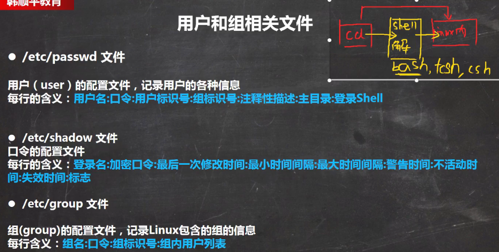

> 注：
>
> + `登录shell`即运行在内核上的命令解释器,有很多种如*sh,bash,csh,ash,tsch*等等,我们常用的是*bash*

## 5.6 修改用户密码

+ `password`给当前用户更改密码
+ `pasword xxx`给xxx用户改密码

# 6. 运行级别

+ `0` 关机 (<font color='red'>不要改成默认的运行级别</font>>)
+ `1` 单用户状态,可以用于**找回丢失密码**
+ `2` 多用户状态,但是**没有**网络服务
+ `3` 多用户状态,**有**网络服务
+ `4` 系统未使用,保留给用户
+ `5` 图像界面,即gnome(centos)或kde(ubuntu)
+ `6` 系统重启 (<font color='red'>不要改成默认的运行级别</font>)

常见的运行级别是`3`和`5`,可以自己指定默认运行级别.

命令:`init 0`

> 修改默认的运行级别:
>
> + centos7之前在`/etc/inittab`文件中指定
> + centos7+可以使用命令修改 `systemctl set-default TARGET.target`
>   + `TARGET.target`一般为`multi-user.target`多用户模式`3`或者`graphical.target`图形界面模式`5`
> + `systemctl get-default`获取当前运行级别

# 7. 找回root密码

centos7之后的操作:

+ 虚拟机/物理机 开机进入系统选择界面,先按住上下箭头↑↓选择退出倒计时进入,然后按`e`进入编辑界面

  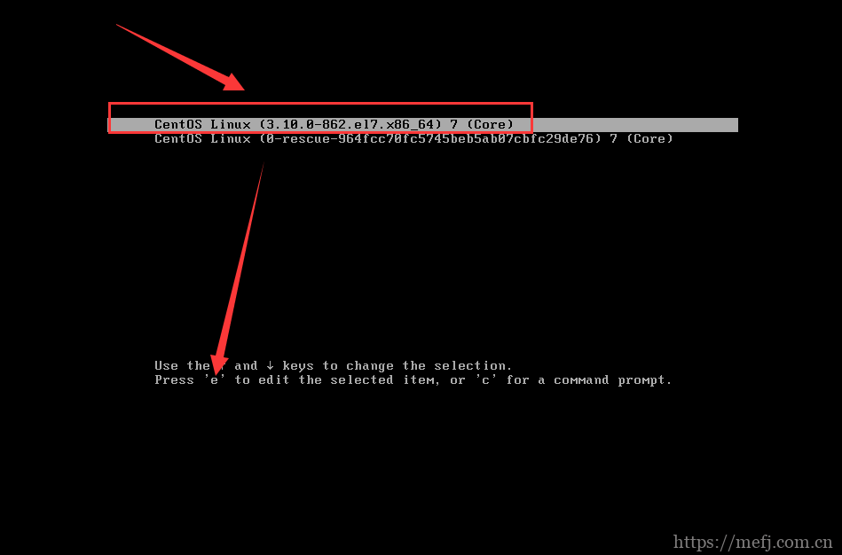

+ 按↓箭头,一直到某行开头是`linux16`结尾是`LANNG=en_US.UTF-8`(语言也可能为中文), 在后面追加` init=/bin/sh`,这句话的意思就是进入**单用户模式**.然后按下`ctrl+X`运行

  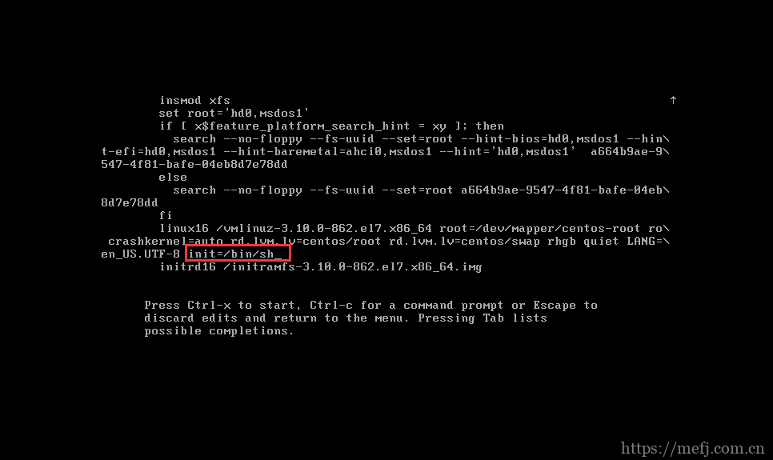

+ 进入sh命令行界面,输入`mount -o remount,rw /`.因为进入单用户模式,根目录 / 是只读的

  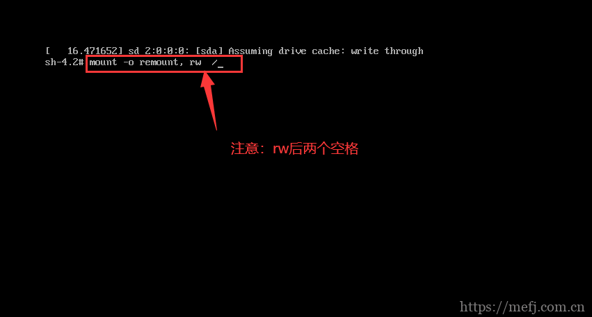

+ 执行`passwd root`修改密码,输入两次确认

+ 如果系统启用了selinux,则必须执行`touch ./autorelabel`(不管是否最好都执行)

+ 执行`exec /sbin/init`来正常启动 或者`exec /sbin/reboot`重启 (要多等待一会)

+ 正常启动进入系统

> 图文链接: https://www.cnblogs.com/mefj/p/13514954.html

# 8. Linux帮助指令

获取帮助信息,其中`xxx`为命令

+ `man xxx` 
+ `help xxx` 
+ `xxx --help`

# 9. 文件目录类指令

+ `pwd`

+ `ls`

+ `cd`

+ `mkdir`

+ `rmdir`

+ `touch`

+ `cp`

+ `rm`

+ `mv`

+ `cat`

+ `more` 文件全部加载到内存,**无法用方向键上下滚动**

+ ==`less`==功能类似`more`都是分屏阅读,但是不是一次将所有文件内容加载到内存中,而是根据显示的内容加载.**适合看大文件,可以用方向键上下滚动**  

  > 支持查找
  >
  > + `/字符串`向下查找(n下一个,N上一个)
  > + `?字串`向上查找 (n下一个,N上一个)

+ `echo`

+ `head [n]` 默认查看文件前10行 

+ ==`tail [n] `默认查看文件后10行 ==

  > `tail -f 文件` 占用控制台,实时输出文件的更新内容

+ `>` 输出重定向

+ `>>` 追加符

+ ==`ln` 连接==

  Linux中文件保存是按照索引节点来定位的,而多个文件名指向同一个索引节点是存在的,他们之前是独立存在的,但是里面的内容是同步更新的(一气化三清)

  + 软/符号连接`ln -s 源文件/目录 软连接名  `(可以能用于文件或目录)
  + 硬链接`ln 源文件 硬链接名` (只能用于文件,不可以为目录)

  > + 硬链接就是有多个完全一样(节点编号,内容等等)的文件,**无论改动其中哪个内容,权限等等,其余的都会同步变化,没有依存关系. 无论删除哪一个,其余的依旧存在.**所以删除一个文件是指删除所有的硬链接文件. 
  > + 软连接类似于windwos的快捷方式,**软连接文件的本质是一个指向源文件的连接,改动源文件内容,权限等等,所有的软连接文件都会同步变化,毕竟实际指向的都是同一个文件.有依存关系,删除源文件,虽然软连接文件还存在但是无法打开(真正的文件被删除了)**
  >
  > 参考地址:https://www.runoob.com/note/29134
  >
  > 
  >
  > 问题:进入一个软连接目录`pwd`看到的路径是?
  >
  > 答:还是软连接本身的目录,不会改变成源目录的地址
  >
  > ```bash
  > [ly@localhost tdgw]$ pwd
  > /home/ly/test/tdgw  #而不是/home/ly/tdgw 
  > #软连接目录			     源目录
  > ```

+ `history [n]`

  > `!5` 执行`history`显示的第5个命令 (**执行历史编号为5的指令**)

# 10. 日期时间类

+ `date`显示/设置时间

  > `date +'%Y-%m-%d %H:%M:%S'` 按照格式输出当前时间
  >
  > ```bash
  > [ly@localhost ~]$ date +'%Y-%m-%d %H:%M:%S'
  > 2024-01-16 14:35:20
  > [ly@localhost ~]$ date '+%Y-%m-%d %H:%M:%S'
  > 2024-01-16 14:38:08
  > ```

+ `cal`显示日历

# 11. 搜索查找类

+ `find [查找路径] [匹配条件] [动作]`

  > ***匹配条件***
  >
  > + `-name pattern` 按照文件名查找,支持通配符`*`和`?`
  > + `-type type` 按照文件类型查找 可以为`f(普通文件), d(目录), l(连接文件)`
  > + `-size [+/-]size[c/w/b/k/M/G]` 按照文件大小查找,`+/-`表示`大于/小于`指定大小.`c/w/b/k/M/G`分别表示大小单位是:`字节/字数/块数/KB/MB/GB`
  > + `-mtime [+/-]days` 按照修改时间查找,`+`表示指定天数前,`-`表示指定天数后 `days`为整数
  > + `-user username` 按文件所有者查找
  > + `-group groupname` 按文件所有组查找
  >
  > ***动作***
  >
  > 表示对查找的文件进行的操作(不推荐使用)如:
  >
  > ​        `      -delete -print0 -printf FORMAT -fprintf FILE FORMAT -print 
  > ​      -fprint0 FILE -fprint FILE -ls -fls FILE -prune -quit
  > ​      -exec COMMAND ; -exec COMMAND {} + -ok COMMAND ;
  > ​      -execdir COMMAND ; -execdir COMMAND {} + -okdir COMMAND ;`

+ `locate`定位文件在文件系统中的位置,**速度非常快,因为依据自己维护的索引数据库,所以第一次使用必须执行`updatedb`更新索引库,否则即使有也找不到**

+ `which` 用于查找`Linux`指令在哪个目录下(类似于环境变量的味道)

+ `grep [选项] 查找内容 源文件`

+ `|`管道符号,表示把前一个的执行结果当做后一个命令的输入

# 12. 压缩和解压缩

+ `gzip` 压缩文件(**不压缩目录**),***默认源文件被压缩后的文件替换了*** ==*后缀是`gz`*==

  ```bash
  [ly@localhost ~]$ gzip -r tdgw-1.4.10/
  [ly@localhost ~]$ ls tdgw-1.4.10/
  cfg               lib     monitor       shutdown.bat.gz  startup.bat.gz  static          upgrade.sh.gz
  changelog.txt.gz  log.gz  nohup.out.gz  shutdown.sh.gz   startup.sh.gz   upgrade.bat.gz
  [ly@localhost ~]$ gunzip -r tdgw-1.4.10/
  [ly@localhost ~]$ ls tdgw-1.4.10/
  cfg            lib  monitor    shutdown.bat  startup.bat  static       upgrade.sh
  changelog.txt  log  nohup.out  shutdown.sh   startup.sh   upgrade.bat
  
  ```

+ `gunzip` 解压缩文件(**不压缩目录**),**默认源文件被解压后的文件替换了**

+ `zip` 压缩文件或文件夹，**源文件依旧存在** ==*后缀是`zip`*==

  ```bash
  zip -r tdgw-1.4.10.zip tdgw-1.4.10/ # -r 递归压缩
  ```

+ `unzip` 解压文件或文件夹，**源文件依旧存在**

  ```bash
  unzip -d /tmp tdgw-1.4.10.zip # -d 指定解压缩路径
  ```

+ `tar [选项] xxx.tar.gz 要打包的文件1/目录1 文件2/目录2 ... ` 打包指令，支持目录 ==*后缀是`tar.gz`*==

  ```bash
  # 压缩
  tar -zcvf tdgw.tar.gz tdgw-1.4.10/
  # 解压缩
  tar -zxvf tdgw.tar.gz
  # 列出压缩包内容
  tar -ztvf tdgw.tar.gz
  ```

  > ***选项***
  >
  > + `-c ` 创建.tar打包文件
  > + `-C` 切换到指定目录，即指定解压缩目的地
  > + `-v `  显示打包详细信息
  > + `-f`  指定压缩后的文件名
  > + `-z` 打包同时压缩
  > + `-x` 解压缩.tar文件
  > + `-t` 或`--list`列出压缩包文件内容
  > + ... [Linux tar 命令 | 菜鸟教程 (runoob.com)](https://www.runoob.com/linux/linux-comm-tar.html)

# 13. 组

在Linux中**每个用户必须属于一个组**，如果创建没指定那么就会默认给自己创建一个同用户名的用户组。

Linux中每个文件都有三个组**所有者，所有者所在的组，其他组(everyone)**,用于权限控制。


+ `chown` **修改文件/目录的所有者、所属组**

  所有者、所属组可以用用户名，组名或者uid，gid值

  > ```bash
  > chown 所有者 文件/目录 -R # 只改变所有者  -R 表示递归  
  > chown 所有这:所属组 文件/目录 -R #改变文件的所有者和所属组  -R表示递归
  > ```

+ `chgrp`  **修改文件/目录的所有组**

  > ```bash
  > chgrp 用户组 文件/目录 -R # -R递归
  > ```

+ `usermod` 修改用户信息

  > ```bash
  > usermod -g 单组 用户名 # 修改用户为指定单组
  > usermod  -G 组1，组2 用户名 # 给用户追加两个组权限
  > usermod -d 目录名 用户名 # 改变用户登录的初始目录，必须有read权限
  > ```

+ `gpasswd [参数]` 从组中修改用户

  > ***参数***
  >
  > + `-a` 把用户加到某个组
  > + `-d` 把用户从某个组删除
  > + `-Q` 改变用户根目录
  > + `-r` 删除组密码
  > + ...

# 14. 文件目录权限

`ls -l`可以看到下面结果,可分为7列:


## 14.1 第一列

共10位,一般从0开始到9

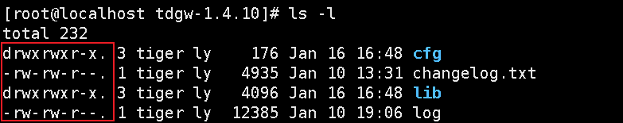

+ 第`0`位 表示文件类型

  > + `d` 表示该文件是个**目录**
  > + `-` 表示该文件是个**普通文件**
  > + `l` 表示该文件是个**连接文件**(软连接才会显示,硬链接就是个普通文件)
  > + `c` 表示该文件是个**字符设备** 如鼠标,键盘
  > + `b`表示该文件是个**块设备** 如硬盘

+ 第`1-3`位 表示文件**所有者权限**

+ 第`4-6`位 表示文件**所有者所属组的权限**

+ 第`7-9`位 表示**其他用户(everyone)的权限**

> 注:
>
> 1. 权限分为三种`读,写,执行`分别对应`r,w,x`,对应的权限数字分别是`4,2,1`
> 2. 特殊一点是如果一个用户对某个文件有写权限,那么不意味着他可以删除该文件.**只有他对该文件所属的目录有写权限,才可以删除该文件**,其他没有特殊的了.

## 14.2 第二列

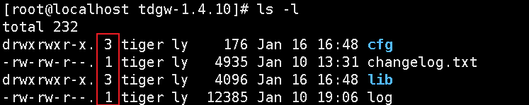

+ 如果该文件是**普通文件**,该数字表示**该文件的硬链接数量**
+ 如果该文件是**目录**,该数字表示**该目录下的子目录数量+.(当前目录)+..(上级目录).即为该目录下的子目录数量+2**

## 14.3 第三列

**表示该文件的所有者**

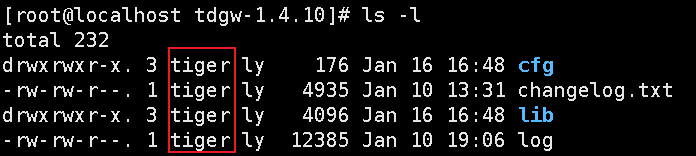

## 14.4 第四列

**表示该文件所有者的所属组**

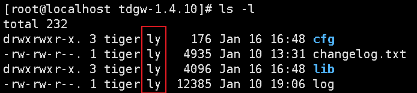

## 14.5 第五列

**表示该文件的大小,单位为字节**

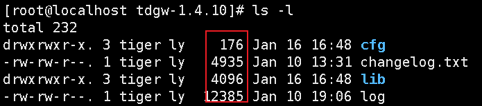

## 14.6 第六列

**表示该文件最后修改日期**

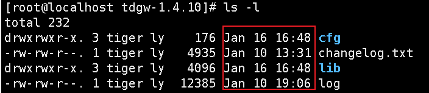

## 14.7 第七列

**表示该文件的文件名**

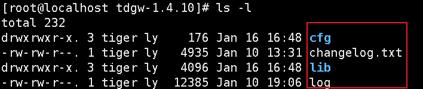

# 15. 修改文件权限

**更新用户权限后.用户要退出终端重新登录才行**

+ `chmod` 修改文件或目录的权限

  > + 使用 `+/-/=`来`添加/删除/赋值`对应权限,注意:不能搭配数字使用
  >
  > + 使用`u/g/o/a`来给`用户/用户组/其他人/所有人(ugo的综合)`指定权限
  >
  > + 使用`r/w/x`或`4/2/1`表示给`读/写/执行`权限,或者**使用数字叠加来赋值:如5=4+1位读取和执行的权限**
  >
  >   ```bash
  >   chmod u=rwx,g=rw,o=x 文件名/目录
  >   chmod u-x,g+w adc
  >   chmod a+r abc
  >   chmod 755 /home/abc.txt
  >   ```

+ `chown` 修改文件所有者,所属组

  > ```bash
  > # 递归的将abc目录及其内部文件所有者改为ly 所属组改为tiger(ly可以不属于tiger组)
  > chown -R ly:tiger abc/
  > ```

+ `chgrp` 修改文件/目录所在的组

  > ```bash
  > chgrp -R ly abc/ # 将abc目录及其所有子文件/目录的所属组改为ly
  > ```

# 16. `crond` 任务调度

+ `crontab` 定时任务调度,**时间表达式最好在线验证一下**

  > ***时间表达式***
  >
  > 如:`crontab * * * * *  date`
  >
  > + 第一位 `*` **表示分钟,区间`0-59`,`*`表示任意分钟**
  > + 第二位 `*` **表示小时,区间`0-23`,`*`表示任意小时**
  > + 第三位 `*` **表示天,区间`1-31`,`*`表示任意天**
  > + 第四位 `*` **表示月,区间`1-12`,`*`表示任意月**
  > + 第五位 `*` **表示星期几,区间`0-7(0和7都代表星期天)`,`*`表示任意星期几**
  >
  > **搭配特殊字符使用**
  >
  > - `＊`取值范围内的所有数字
  > - `/` 每过多少个数字 如*/2 代表每过2(待定单位)
  > - `-` 至,如8-11代表 8,9,10,11
  > - `，`散列数字 如1,2,3,4表示等于1,2,3,4时会执行
  >
  > ***举例***
  >
  > ```bash
  > # 每一分钟执行一次commd
  > * * * * * command
  > # 每小时的第3分钟和第15分钟执行
  > 3,15 * * * * command
  > # 在上午8点到11点的第3和15分钟执行
  > 3,15 8-11 * * * command
  > # 每隔两天的上午8点到11点的第3和15分钟执行
  > 3,15 8-11 */2 * * command # /表示过去过少时间
  > # 每周一上午8点到11点的第3和15分钟执行
  > 3,15 8-11 * * 1 command
  > ```
  >
  > 

+ `at [选项] 时间 命令` **实现一次性定时任务,使用前必须确保其守护进程`atd`在运行**

  > ***选项***
  >
  > + `-m` 当指定的任务被完成后,将给用户发送邮件,即使没有标准输出
  > + `-I` `atq`的别名,用于查询
  > + `-d` `atrm`的别名,用于删除任务
  > + `-v` 显示任务将被执行的时间
  > + `-V` 显示版本信息
  > + `-c` 打印任务的内容到标准输出
  > + `-q <队列>` 使用指定的队列
  > + `-f <文件>` 从指定文件读取任务而不是标准输入
  > + `-t <时间参数>` 以时间参数的形式提交要运行的任务
  >
  > ***时间定义***
  >
  > + 方法1:在当天使用`hh:mm`(小时:分钟)指定时间.如果今天已过,就是明天的
  >
  > + 方法2:使用`midnight`半夜12点,`noon`中午12点,`teatime`一般为下午4点等比较模糊的词语指定
  >
  > + 方法3:使用12小时计时如 8am,7pm
  >
  > + 方法4:使用具体的日期, `MM dd`或`MM/dd/yy`或`dd.MM.yy`或具体的时间格式`hh:mm yyyy-MM-dd`
  >
  > + 方法5:使用相对计时法,格式为`now + 数字 + 单位`,now为当前时间,数字代表时间,单位表示时间单位如`minutes,hours,days,weeks`
  >
  > + 方法6: 直接使用`today`,`tommorow`等
  >
  >   ```bash
  >   # 1.设定2天后的下午5点执行/bin/ls /home
  >   [root@localhost ly]# at 5pm + 2 days 
  >   at> /bin/ls /home<EOT> # 按两次ctrl+d保存
  >   job 1 at Sat Jan 20 17:00:00 2024 # 保存结果
  >   # 2.查看at队列中有无执行计划
  >   [root@localhost ly]# atq
  >   1	Sat Jan 20 17:00:00 2024 a root
  >   # 3.明天17点钟 
  >   at 5pm tomorrow # at 5pm + 1 days一样的效果
  >   # 删除已经设置的任务  atrm [任务编号]
  >   atrm 1
  >   ```
  >
  >   

  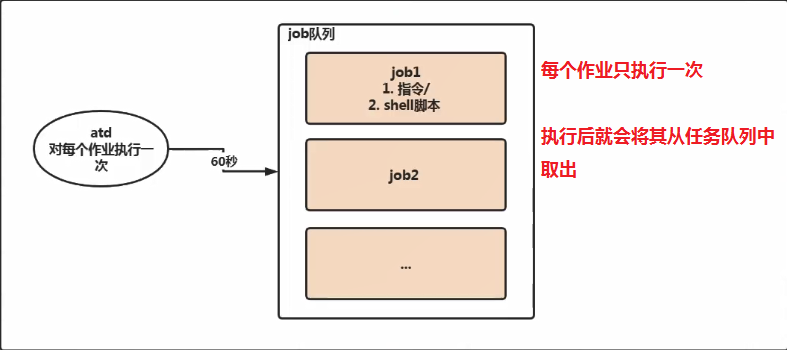

  默认情况下`atd`守护进程每隔60秒会检查一下任务队列,如果任务的定义时间和当前时间一致就会运行该任务.

  ```bash
  # 下面两个任意一个检查atd该守护进程是否启动
  ps -ef|grep atd 
  systemctl status atd
  ```

# 17. 磁盘分区

## 17.1 硬盘分类

Linux下硬盘使用是挂载到某个目录下使用,将分区和目录联系起来.而Linux硬盘主要分为两种: `IDE硬盘`和`SCSI硬盘`.目前基本上都是`SCSI`.

可以使用`lsblk -l` 查看硬盘类型

+ `IDE硬盘`,驱动器标识符为`hdx~`.其中`hd`表示分区所在的设备类型,这里就是`IDE硬盘`.其中`x`为盘号,表示第几块硬盘(`a`为基本盘,`b`为基本从属盘,`c`为辅助主盘,`d`为辅助从盘);其中`~`代表分区,前四个分区用数字`1`和`4`表示,它们是主分区或者扩展分区,从`5`开始以后就是逻辑分区.

  > 例如:
  >
  > hda3表示的是第一块IDE硬盘上的第三个主分区或扩展分区
  >
  > hdb2表示的是第二块IDE硬盘上的第二个主分区或扩展分区

+ `SCSI硬盘`, 驱动器标识符为`sdx~`.其中`sd`表示这个是`SCSI硬盘`,`x`表示盘号. `~`表示分区.具体细节和`IDE硬盘`一样

## 17.2 ==增加硬盘==

虚拟机增加一块硬盘的步骤:

+ 虚拟机添加硬盘

  > 物理机直接插硬盘,虚拟机以vmware为例:设置-硬件-添加-硬盘-SCSI类型
  >
  > https://blog.csdn.net/zhangbeizhen18/article/details/127872578
  >
  > + 重启系统
  >
  > + 进入系统
  >
  > + `lsblk` 查看多了一块硬盘,或者 `ls /dev`也能看到多了一块硬盘`sdb`
  >
  >   ```bash
  >   [ly@localhost ~]$ lsblk
  >   NAME   MAJ:MIN RM  SIZE RO TYPE MOUNTPOINT
  >   sda      8:0    0   40G  0 disk 
  >   ├─sda1   8:1    0  300M  0 part /boot
  >   ├─sda2   8:2    0    2G  0 part [SWAP]
  >   └─sda3   8:3    0 37.7G  0 part /
  >   sdb      8:16   0    1G  0 disk  # 多的硬盘,但是未分区
  >   sr0     11:0    1 1024M  0 rom  
  >   ```

+ 分区

  `fdisk /dev/sdb` 进入分区操作界面:

  ```bash
  [root@localhost ly]$ fdisk /dev/sdb
  Command (m for help): n # 创建分分区
  Partition type:
     p   primary (0 primary, 0 extended, 4 free)
     e   extended
  Select (default p): p                        
  Partition number (1-4, default 1):  #分区开始索引 默认即可
  First sector (2048-2097151, default 2048):  # 默认回车 
  Using default value 2048
  Last sector, +sectors or +size{K,M,G} (2048-2097151, default 2097151):  # 默认回车 选择全部空闲空间.想要多分区就不要写满 +500M
  Using default value 2097151
  Partition 2 of type Linux and of size 1023 MiB is set
  
  Command (m for help): w # 保存退出
  The partition table has been altered!
  
  Calling ioctl() to re-read partition table.
  Syncing disks.
  ```

  > `fdisk 要分区分磁盘` 里面的按键作用
  >
  > + `m` 显示帮助信息
  > + `a` 活动分区标记/引导分区
  > + `d` 删除分区
  > + `l` 显示分区类型
  > + `n` 新建分区
  > + `p` 显示分区信息
  > + `q` 退出不保存
  > + `t` 设置分区号
  > + `v` 进行分区检查
  > + `w`保存更改
  > + `x` 高级扩展功能
  > + ...

+ 格式化或者叫制作文件系统

  分区想要使用,必须格式化(**只有格式化后,磁盘分区才会生成对应的uuid**).选择文件系统:

  ```bash
  [root@localhost ly]$ mkfs -t ext4 /dev/sdb1 # 给分区sdb1格式化成ext4类型
  mke2fs 1.42.9 (28-Dec-2013)
  Filesystem label=
  OS type: Linux
  Block size=1024 (log=0)
  Fragment size=1024 (log=0)
  ...
  [root@localhost ly]$ lsblk -f #查看/dev/sdb1是否格式化完成,看是否有uuid了尚无挂载点
  NAME   FSTYPE LABEL UUID                                 MOUNTPOINT
  sdb                                                      
  ├─sdb1 ext4         74fdf331-2791-4f16-80b2-75efeb9a7e03 
  └─sdb2                                                   
  sr0  
  ```

+ 挂载 **将磁盘分区挂在到指定目录下**

  <font color='red'>**使用命令挂载硬盘分区在系统重启后,挂载关系就没有了(变成默认的挂载关系了).**</font>如果需要,请设置自动挂载

  ```bash
  mount /dev/sdb1 目录 # 将sdb1分区挂载到指定目录上,此时再通过lsblk -f命令就能看到挂载点了
  ```

+ 设置可以自动挂载

  > + 修改文件`/etc/fstab`
  >
  >   ```bash
  >   UUID=74fdf331-2791-4f16-80b2-75efeb9a7e03 /newdisk                ext4    defaults        0 0
  >   # 也可以直接用磁盘分区
  >   /dev/sdb1							   /newdisk                ext4    defaults        0 0
  >   ```
  >
  > + `mount -a`立即生效

+ 卸载分区

  ```bash
  umount 目录/磁盘分区 # 卸载后该磁盘分区的文件还存在,除非你格式化他
  ```

# 18. 磁盘情况查询

+ `df -h [目录]` 查看指定目录,默认所有硬盘空间使用情况
+ `du -h [目录]` 即`direct usage`查看指定目录,默认当前目录的所有文件占用 

# 19. 文件查找练习

+ `du`显示文件和目录
+ `ls [-R] [目录]|grep 条件`
+ `find [目录] [-maxdepth/-type]`

```bash
# 统计目录下文件个数
find tdgw-1.4.10/ -maxdepth 1 -type f|wc -l
# t统计目录下目录个数
find tdgw-1.4.10 -maxdepth 1 -type d|grep -v '^tdgw\-1\.4\.10$'|wc -l
ls -l tdgw-1.4.10/|grep '^d'|wc -l
# 统计目录下文件个数,包括子目录
find tdgw-1.4.10 -type f|wc -l
ls -lR tdgw-1.4.10/|grep "^-"|wc -l
# 包括目录下目录个数,包括子目录
find tdgw-1.4.10/* -type d|wc -l
```

# 20. 网络设置

+ ***永久生效*** 修改`/etc/sysconfig/network-scripts/ifcfg-ens33`文件.其中`ens33`是网卡名,根据实际情况设置.修改完成后使用`system restart network`生效

  > ```bash
  > TYPE="Ethernet"#网卡类型
  > PROXY_METHOD="none"
  > BROWSER_ONLY="no"
  > BOOTPROTO="dhcp" # ip协议 dhcp动态分配 static静态 看实际需要
  > DEFROUTE="yes"
  > IPV4_FAILURE_FATAL="no"
  > IPV6INIT="yes"
  > IPV6_AUTOCONF="yes"
  > IPV6_DEFROUTE="yes"
  > IPV6_FAILURE_FATAL="no"
  > IPV6_ADDR_GEN_MODE="stable-privacy"
  > NAME="ens33" # 网卡名字
  > UUID="92cd091a-69b4-49df-b3b8-a3341a746372"
  > DEVICE="ens33" # 设备名字
  > # 网络地址
  > ONBOOT="yes" # 开机自动启动网卡 看实际需要
  > IPADDR="192.168.31.131"
  > GATEWAY="192.168.31.2" # 虚拟机一般都是.2
  > NETMASK="255.255.255.0"
  > DNS1="114.114.114.0"
  > DNS2="8.8.8.8"
  > ```
  >
  > 可参考地址:https://www.cnblogs.com/yhongji/p/9336247.html

+ ***临时生效*** `ifconfig`或`ip addr`

  **关机,重启网络服务就会失效,如果要使用ssh服务就需要重启sshd`systemctl restart sshd`**

  + `ifconfig [网卡名] ip netmask 子网掩码 gateway 网关`
  + `ip addr change ip/24 dev 网卡名` 其中`/24`表示子网掩码是24位的,即二进制就是`1111111111111111111111111`转化为十进制就是`255.255.255.0`

  > ```bash
  > # 最好在终端,否则ssh会断开
  > ifconfig ens33 192.168.31.131 netmask 255.255.255.0 gateway 192.168.3
  > 1.2
  > ip addr change/add 192.168.31.131/24 dev ens33 
  > ```
  >
  > 参考地址:https://blog.51cto.com/u_13352902/2058075
  >
  > 修改后sshd不自启了`systemctl enable sshd`

# 21. 设置主机名和hosts映射

`/etc/hostname`修改主机名(重启生效)  `/etc/hosts`修改映射关系(保存生效)

+ `hostnamectl set-hostname 主机名` 永久生效,改的就是`/etc/hostname`. 但是需要断开ssh连接才会更新主机名
+ `hostname 主机名` 临时修改,重启后失效,需要断开ssh连接才会更新主机名
+ 修改`/etc/hostname` ,永久生效.但是需要重启才会更新主机名

***主机域名解析机制:***

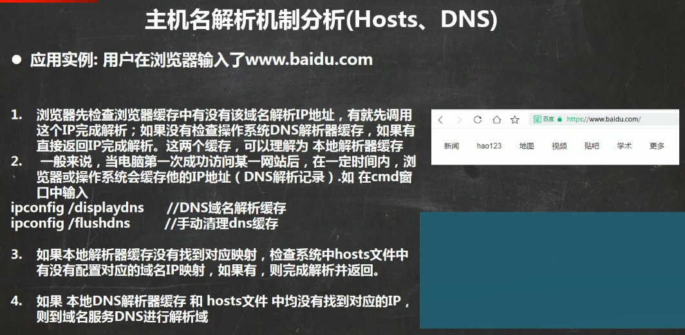

# 22. 进程管理

## 22.1 显示进程

+ `ps` 显示当前正在运行程序的列表

  + `-e` 显示所有进程
  + `-f` 全格式
  + `-l` 长格式
  + `-w` 宽输出
  + `a` 显示终端上的所有进程,包括其他用户
  + `r` 只显示正在运行的进程
  + `u` 以用户为主的格式显示
  + `x` 显示所有程序,不以终端机区分
  + `-h` 不显示标题
  + `-H` 进程树显示
  + ...(具体的看命令帮助)

  > ***`ps -ef`全格式输出所有进程:***
  >
  > ```bash
  > UID         PID   PPID  C STIME TTY          TIME CMD
  > ```
  >
  > + `UID `执行人
  > + `PID` pid
  > + `PPID` 父进程的pid
  > + `C` cpu占用百分比
  > + `STIME` 进程开始时间
  > + `TTY` 启动的终端号
  > + `TIME` 占用cpu时间
  > + `CMD `进程启动命令
  >
  > ***`ps -aux`输出格式:***
  >
  > ```bash
  > USER PID %CPU %MEM VSZ RSS TTY STAT START TIME COMMAND
  > ```
  >
  > + `	USER`: 进程归属人,执行人
  > + `PID`: 进程pid
  > + `%CPU`: 占用cpu的百分比
  > + `%MEM`: 占用内存的百分比
  > + `VSZ`: virtual memory siz 占用的虚拟内存大小 单位是`kb`
  > + `RSS` :resident set size 驻留集,即实际占用物理内存,单位`kb`
  > + `TTY`: 启动的终端号
  > + `STAT` : status 该进程的状态
  >   + `D` 无法中断的休眠状态(通常是IO的进程) 短期等待
  >   + `R` 正在运行
  >   + `S` 睡眠
  >   + `T` 停止
  >   + `Z` 僵死,不存在,但暂时无法消除
  >   + `W` 等待 没有足够的内存分配 
  >   + `<` 高优先级的进程
  >   + `N` 低优先级的进程
  >   + `L` 有些页被锁进内存
  >   + `s` 包含子进程
  >   + `+` 位于前台的进程组
  >   + `l` 多线程,克隆线程
  >   + `x` 退出状态,进程即将销毁
  > + `START` : 进程启动时间
  > + `TIME`: 进程进入cpu的时间
  > + `COMMAND`: 进程启动命令行

+ `pstree [参数]` 树形显示进程

  + `-a` 显示进程的命令行参数
  + `-c` 不紧凑显示
  + `-H pid号` 高亮指定pid号的进程
  + `-l` 不截断显示,长显示
  + `-n` 根据pid排序
  + `-N type类型`根据type类型排序,有`ipc,mnt,net,pid,user,uts`
  + `-p` 显示进程的pid
  + `-u` 显示uid `()`内的

## 22.2 终止进程

+ `kill [选项] 进程pid` 根据进程pid终止进程

  + `-s` 发送指定信号

  + `-l` 列出所有信号列表

  + `-a` 向所有具有相同进程组ID的进程发送SIGKILL信号

  + `-9` 强制终止产,常用.默认`kill`的信号是`15`

    > | 信号      | 信号值 | 程序默认行为            | 产生原因                                                |
    > | --------- | ------ | ----------------------- | ------------------------------------------------------- |
    > | SIGHUP    | 1      | 终止运行                | 终端线挂断                                              |
    > | SIGINT    | 2      | 终止运行                | 来自键盘Ctrl + C的中断                                  |
    > | SIGQUIT   | 3      | 终止运行                | 来自键盘Ctrl + \的退出                                  |
    > | SIGILL    | 4      | 终止运行                | 进程尝试执行非法机器指令                                |
    > | SIGTRAP   | 5      | 终止运行并dump进程      | 跟踪陷阱                                                |
    > | SIGABRT   | 6      | 终止运行并dump进程      | 来自abort()函数的终止信号                               |
    > | SIGBUS    | 7      | 终止运行                | 总线错误                                                |
    > | SIGFPE    | 8      | 终止运行并dump进程      | 算术错误，例如尝试除以0                                 |
    > | SIGKILL   | 9      | 终止运行                | 强制杀死进程，程序无法对该信号进行定制处理              |
    > | SIGUSR1   | 10     | 终止运行                | 用户定义的信号1                                         |
    > | SIGSEGV   | 11     | 终止运行并dump进程      | 段错误，程序访问了非法的地址，一般是由于程序本身BUG导致 |
    > | SIGUSR2   | 12     | 终止运行                | 用户定义的信号2                                         |
    > | SIGPIPE   | 13     | 终止运行                | 向一个没有读用户的管道做写入操作                        |
    > | SIGALRM   | 14     | 终止运行                | 来自alarm()函数的定时器信号                             |
    > | SIGTERM   | 15     | 终止运行                | 软件中止信号(默认)                                      |
    > | SIGSTKFLT | 16     | 终止运行                | 协处理器上的栈异常                                      |
    > | SIGCHLD   | 17     | 忽略                    | 一个子进程停止或者终止                                  |
    > | SIGCONT   | 18     | 忽略                    | 继续进程如果该进程停止                                  |
    > | SIGSTOP   | 19     | 挂起当前进程直到SIGCONT | 不是来自终端的停止信号                                  |
    > | SIGTSTP   | 20     | 挂起当前进程直到SIGCONT | 来自终端的停止信号                                      |
    > | SIGTTIN   | 21     | 挂起当前进程直到SIGCONT | 后台进程向终端读                                        |
    > | SIGTTOU   | 22     | 挂起当前进程直到SIGCONT | 后台进程向终端写                                        |
    > | SIGURG    | 23     | 忽略                    | 套接字上的紧急情况                                      |
    > | SIGXCPU   | 24     | 终止运行                | CPU时间限制超出                                         |
    > | SIGXFSZ   | 25     | 终止运行                | 文件大小限制超出                                        |
    > | SIGVTALRM | 26     | 终止运行                | 虚拟定时器期满                                          |
    > | SIGPROF   | 27     | 终止运行                | 剖析定时器期满                                          |
    > | SIGWINCH  | 28     | 忽略                    | 窗口大小变化                                            |
    > | SIGIO     | 29     | 终止运行                | 在某个描述符上有可执行的IO操作                          |
    > | SIGIO     | 30     | 终止运行                | 电源故障                                                |

+ `killall [选项] 进程名` 根据进程名终止进程(及其子进程),进程名支持通配符

# 23. 服务管理

服务本质就是进程,但是运行在后台,通常会监听某个端口等待其他程序的请求.比如MySQL,sshd,防火墙,因此我们又称之为守护进程.

## 23.1 service管理指令

centos7之前用的是`service`管理服务,centos7之后是`systemctl`管理服务的.

> `service`管理的服务可以在`/etc/init.d/`目录下查看,即只有这个目录下的服务还能用`service`查看,其余的都用`systemctl`
>
> ```bash
> [ly@localhost init.d]$ ll /etc/init.d/
> total 40
> -rw-r--r--. 1 root root 18281 Aug 24  2018 functions
> -rwxr-xr-x. 1 root root  4569 Aug 24  2018 netconsole
> -rwxr-xr-x. 1 root root  7923 Aug 24  2018 network
> -rw-r--r--. 1 root root  1160 Oct 31  2018 README
> ```

服务支持的指令

`service 服务 动作`

+ `start`
+ `stop`
+ `reload` 重新装载
+ `restart`
+ `status`

## 23.2 查看服务名

+ 可被`service`指令管理的服务在`/etc/init.d`

+ `setup`命令查看所有服务 

  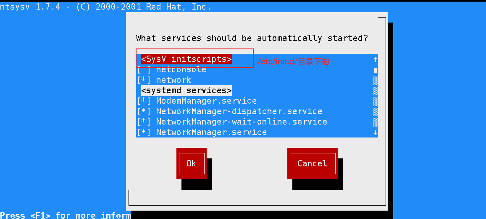

## 23.3 linux系统启动流程

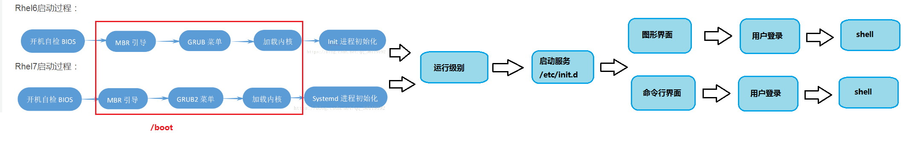

> `/boot`流程后init进程分三种类型:
>
> + `SysV`: init, Centos5之前,配置文件在`/etc/inittab`
> + `Upstart`: init, Centos6,配置文件在`/etc/initab,/etc/init/*.conf`
> + `Systemd`: systemed, Centos7,配置文件: `/usr/lib/systemd/system, /etc/systemd/system`
>
> 启动流程: https://www.runoob.com/linux/linux-system-boot.html
>
> `init.d`和`systemd`父进程区别: https://blog.csdn.net/sunboychenll/article/details/108098949

## 23.4 服务管理 `service`和`systemctl`

**服务也叫服务单元,由一个或多个进程组成**

+ `chkconfig`: 

  `chkconfig`指令管理的服务在`/etc/init.d/`目录中

  + `chkconfig --list [服务]`: 看着指定服务/所有服务在**各个运行级别下的自启状态**
  + `chkconfig --level 运行级别的数字 服务名 on/off`:   设置`/etc/init.d/`的服务(**service管理的服务**)在**指定运行级别下该服务是否自启**
  + `chkconfig --add 服务名`:增加一个被service管理的服务
  + ...

  > 1. Centos7之后很多服务需要使用`systemctl`管理
  > 2. `chkconfig`重新设置服务后,需要重启机器才会生效

+ `systemctl`: 

  `systemctl`管理的服务在`/usr/lib/systemd/system/`目录下,**一般为系统自带的服务单元,默认配置**, 而`/etc/systemd/system/`目录下是**存放用户自定义服务文件或修改systemd服务单元文件(即用户修改的,优先级比`/usr/lib/systemd/system`的优先级高)**

  + `systemctl list-unit-files` 列出所有已安装的服务单元及其启用状态

  + `systemctl -a` 列出所有加载的服务单元及状态

  + `systemctl start/stop/status/restart/reload 服务名` 开启/停止/看状态/重启/重载服务

  + `systemctl enable/diable/is-enabled 服务名`  对指定服务 开机自启/不自启/看自启状态

  + `systemctl show [服务]` **查看服务单元的所有配置属性信息**,如果不指定服务则显示的是服务管理器自身的配置属性

    > 该命令的返回结果是**根据服务的配置文件**(即`systemctl cat 服务`的显示内容), 再**加上程序运行状态**自动生成的

  + `systemctl cat 服务` **查看服务的完整配置文件**,就是`/usr/lib/systemd/system`下对应该服务文件(**该目录不定,主要看是什么服务**)

  + ...

## 23.5 `firewalld`指令

使用`man -k firewalld`查看防火墙的相关配置帮助

```bash
[root@localhost ~]# man -k firewalld
firewall-cmd (1)     - firewalld command line client #配置防火墙命令
firewall-config (1)  - firewalld GUI configuration tool
firewall-offline-cmd (1) - firewalld offline command line client
firewalld (1)        - Dynamic Firewall Manager # 防火墙管理端
firewalld.conf (5)   - firewalld configuration file # 防火墙的配置文件 在/etc/firewalld/
firewalld.dbus (5)   - firewalld D-Bus interface description
firewalld.direct (5) - firewalld direct configuration file
firewalld.helper (5) - firewalld helper configuration files
firewalld.icmptype (5) - firewalld icmptype configuration files
firewalld.ipset (5)  - firewalld ipset configuration files #防火墙的ip表
firewalld.lockdown-whitelist (5) - firewalld lockdown whitelist configuration file
firewalld.richlanguage (5) - Rich Language Documentation
firewalld.service (5) - firewalld service configuration files #防火墙服务配置文件
firewalld.zone (5)   - firewalld zone configuration files#防火墙 域
firewalld.zones (5)  - firewalld zones
```

`firewall-cmd [参数]`用于管理防火墙命令

+ `--state` 查看防火墙的运行状态

+ `--reload` 更新防火墙规则(和nginx的命令一样)

+ `--check-config` 检查防火墙永久配置的规则(和nginx一样)

+ `--get-log-denied` 获取防火墙reject日志开启状态

+ `--set-log-denied=value` 设置防火墙reject日志级别有`all,unicast,broadcast,muticast,off`

  > 1. 设置后需要重启firewalld服务才生效
  > 2. 该命令实际更改的底层文件就是`/ect/firewalld/firewalld.conf`中的`LogDenied`属性
  > 3. 可以使用`dmesg`即display message(对应的日志文件是`/var/log/dmesg`)显示开机信息,其中就包括reject网络连接,具体命令为`dmesg|grep -i reject` 

+ `--list-all-zones`  获取防火墙所有的域

+ `--get-defult-zone`获取防火墙默认的域

+ `--set-default-zone` 设置防火墙默认的域

+ `--get-active-zones` 获取防火墙所有激活的域

+ `[--permanent] [--zone=zone] --add-port=端口[-范围]/协议(tcp,udp) [--timeout=超时(秒s,分m,时h)]  ` 给防火墙指定域永久增加指定协议端口,并设置超时时间

+ `[--permanent] [--zone=zone] --remove-port=端口[-范围]/协议(tcp,udp) ` 给防火墙指定域永久删除指定协议端口

+ `[--permanent] [--zone=zone] --query-port=端口[-范围]/协议[tcp,udp]` 查询防火墙端口是否被永久增加到指定域 `0:true 1:false`

  > 以上三个命令修改防火墙规则,必须重载才会生效`firewall-cmd --reload`

+ `[--permanent] [--zone=zone] --add-source-port=端口[-范围] /协议(tcp,udp) [--timeout=超时(s秒,m分,h时)]`  给防火墙指定域开放指定协议的来源端口,并设置超时时间

+ ...

# 24. 动态进程监控-top

## 24.1 top界面

`top [参数]`

+ `-d n` 每隔`n`秒刷新一次,默认是3秒

+ `-i` 不显示闲置或者僵死的进程

+ `-n n` 刷新指定次数n次后然后退出

+ `-p pid` 显示指定pid的进程

+ `-u 用户名` 显示指定用户名的进程

+ `-c` 不截断显示command命令行

  > 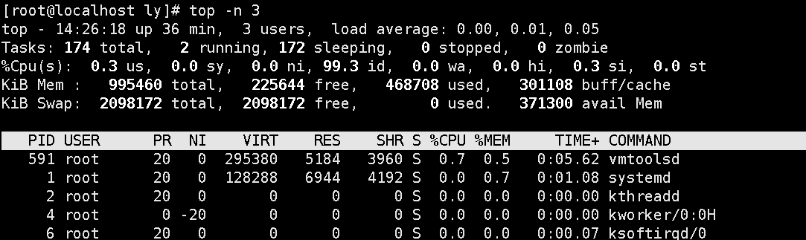
  >
  > ***top命令输出详解***
  >
  > + 第一行 **操作系统运行基本信息**
  >
  >   | 内容                           | 含义                                                         |
  >   | ------------------------------ | ------------------------------------------------------------ |
  >   | 14:26:18                       | 当前系统时间                                                 |
  >   | up 36 min                      | 系统开机总运行时间                                           |
  >   | 3 users                        | 当前登录的用户数(每个ssh登录都算一个)                        |
  >   | load average: 0.00, 0.01, 0.05 | 系统负载: 任务队列的平均长度  <br>三个值分别是:1分钟,5分钟,15分钟到现在的平均值 |
  >
  > + 第二行 **操作系统运行的任务进程**
  >
  >   | 内容         | 含义          |
  >   | ------------ | ------------- |
  >   | 174 total    | 一共174个进程 |
  >   | 2 running    | 2个正在运行   |
  >   | 172 sleeping | 172个正在睡眠 |
  >   | 0 stopped    | 0个停止进程   |
  >   | 0 zombie     | 0个僵死进程   |
  >
  > + 第三行 **操作系统的cpu使用情况**
  >
  >   | 内容    | 含义                                               |
  >   | ------- | -------------------------------------------------- |
  >   | 0.3 us  | 用户空间占用的cpu百分比                            |
  >   | 0.0 sy  | 系统内核空间占用的cpu百分比                        |
  >   | 0.0 ni  | 用户空间改过优先级的进程占用cpu的百分比            |
  >   | 99.3 id | 空闲进程百分比(越大越好)                           |
  >   | 0.0 wa  | 等待输入输出的cpu时间百分比                        |
  >   | 0.0 hi  | 硬中断（Hardware  IRQ）占用CPU的百分比             |
  >   | 0.3 si  | 软中断（Software  Interrupts）占用CPU的百分比      |
  >   | 0.0 st  | 用于有虚拟cpu的情况，用来指示被虚拟机偷掉的cpu时间 |
  >
  > + 第四行 **操作系统内存使用情况**
  >
  >   | 内容              | 含义                  |
  >   | ----------------- | --------------------- |
  >   | 995460 total      | 总共物理内存,kb       |
  >   | 225644 free       | 空闲的物理内存,kb     |
  >   | 468708 used       | 被使用的物理内存,kb   |
  >   | 301108 buff/cache | 缓存占用的物理内存,kb |
  >
  > + 第五行 **操作系统swap分区的使用情况**
  >
  >   | 内容             | 含义                                            |
  >   | ---------------- | ----------------------------------------------- |
  >   | 2098172 total    | 交换分区的总容量,kb     默认是实际物理内存的2倍 |
  >   | 2098172 free     | 空闲的容量,kb                                   |
  >   | 0 used           | 被使用的容量,kb                                 |
  >   | 371300 avail Mem | 可使用的内存,kb     应该是算上free的物理内存    |
  >
  > + 第六行 **操作系统中进程列表**
  >
  >   | 内容    | 含义                                                         |
  >   | ------- | ------------------------------------------------------------ |
  >   | PID     | 进程pid                                                      |
  >   | USER    | 进程所有者                                                   |
  >   | PR      | 进程优先级                                                   |
  >   | NI      | nice值,负数表示高优先级,正数表示低优先级                     |
  >   | VIRT    | 进程占用的虚拟内存,kb     VIRT=RES+SWAP                      |
  >   | RES     | 进程使用的常驻内存大小,kb                                    |
  >   | SHR     | 共享内存大小,kb                                              |
  >   | S       | 进程状态     D不可中断的睡眠状态,S睡眠,R运行中,T跟踪/停止,Z僵死 |
  >   | %CPU    | 上次更新到现在占用cpu的百分比                                |
  >   | %MEM    | 上次更新到现在占用mem的百分比                                |
  >   | TIME+   | 进程进入到cpu时间的累积,单位1/100秒                          |
  >   | COMMAND | 命令名/命令行                                                |

## 24.2 top交互

+ `P` 大P, 以cpu降序排序
+ `M` 大M,以memory降序排序
+ `N` 大写N,以pid降序排序
+ `q` 小q,退出
+ `u` 小u, 只显示指定用户的进程, (需要二次输入**用户名**)
+ `k`  小k,杀掉指定进程,(需要二次输入**进程pid**,需要三次输入**结束信号量**)

# 25. 网络监控

`netstat [参数]`  打印网络连接输出路由表等信息

+ `-a` 显示所有已建立的socket连接
+ `-n` 使用ip地址显示而不是域名
+ `-o` 显示计时器
+ `-p` 显示连接的进程名或pid
+ `-v` 显示详细信息
+ `-W` 不截断ip地址
+ `-e` 显示额外信息
+ ...

# 26. rpm包管理

`rpm`即ReadHat Package Manage 用来管理rpm软件包,具体看帮助

## 26.1 查询已安装rpm包

+ `rpm -qa` 查询所有已经安装的rpm软件包

+ `rpm -q 软件名` 查询指定软件是否安装

  ```bash
  [ly@localhost ~]$ rpm -q firefox
  firefox-115.6.0-1.el7.centos.x86_64
  ```

  > + `firefox` 软件名
  > + `115.6.0-1` 软件版本号
  > + `el7.centos.x86_64` 表示该软件适配于centons7 64位
  >   + 如果是`i686,i386`表示该软件是32位
  >   + `noarch`表示不分架构,通用

+ `rpm -qi 软件名` **查询软件包信息**,如安装日期,签名,版本等等

+ `rpm -ql 软件名` **查看软件包里的文件**(即安装后的文件)

+ `rpm -qf 文件绝对路径` **查看指定文件归属哪个软件**

+ `-vv` 开启啰嗦模式

+ `-v` 显示执行过程

## 26.2 安装rpm包

+ `rpm -i 软件包绝对路径.rpm` 安装包以.rpm结尾
+ `rpm -ihv 软件包绝对路径.rpm` 
  + `-h` --hash显示进度条
  + `-v`显示执行过程

## 26.3 卸载rpm包

+ `rpm -e 软件包` -e就是erase叉除. 删除指定软件包

  > 如果该软件包被其他软件依赖,会报错. 可以强制删除

+ `rpm -e 软件包 -nodeps` 强制删除指定软件包. -nodeps就是no dependency

## 26.4 升级rpm包

+ `rpm -U 软件包绝对路径.rpm `

## 26.5 刷新软件包

+ `rpm -F 软件包绝对路径.rpm `

# 27. yum包管理

yum是一个shell前端软件包管理器.基于RPM包管理,能够从指定的服务器自动下载RPM包并进行安装,可以自动处理依赖性关系,并且一次安装所有依赖的软件包.

## 27.1 yum查询

+ `yum list [软件包名]` 列出yum源上**所有可用/指定**的软件包
+ `yum list available [软件包名]` 列出yum源上**所有/指定可安装包**
+ `yum list updates [软件包名]` 列出yum源上**所有/指定可更新的包**
+ `yum list installed [软件包名]` 列出yum源上**所有/指定已安装的包**
+ `yum search 软件包` 在yum源上查询是否存在指定软件

## 27.2 yum安装软件包

+ `yum install [软件包1-version,..]  -y -v` 安装指定版本软件,`-y`一路确认,`-v`显示详细信息

## 27.3 yum卸载软件包

+ `yum remove 软件包`

## 27.4 yum升级软件包

+ `yum check-update` 检查所有可更新的软件
+ `yum update [软件包名称]` 不指定软件名默认升级所有

## 27.5 yum清除缓存

`yum clean all` 清除所有缓存

> 效果是下面的所有叠加
>
> + `yum clean expire-cache`
> + `yum clean packages`
> + `yum clean headers`
> + `yum clean metadata`
> + `yum clean dbcache`
> + `yum clean plugins`
> + `yum clean rpmdb`

## 27.6 更换yum源

+ 备份旧的yum源

  ```bash
  mv /etc/yum.repos.d/CentOS-Base.repo /etc/yum.repos.d/CentOS-Base.repo.bak
  ```

+ 下载新的yum源配置信息(或者是局域网自己构建的yum仓库)

  ```bash
  # 下载文件并更名
  curl -o /etc/yum.repos.d/CentOS-Base.repo http://mirrors.aliyun.com/repo/Centos-7.repo
  ```

+ 清除yum缓存,并重新生成缓存

  ```bash
  yum clean all
  yum makecache #生成索引数据库啥的
  ```


# 28. java安装

+ 下载所需要的jdk21,一般都放在`/opt`目录下，表示程序安装包

  ```bash
  wget https://download.java.net/java/GA/jdk21.0.2/f2283984656d49d69e91c558476027ac/13/GPL/openjdk-21.0.2_linux-x64_bin.tar.gz
  ```

+ 解压安装包

  ```bash
  tar -zxvf openjdk-21.0.2_linux-x64_bin.tar.gz # 创建是-zcvf
  ```

+ 创建程序对应的目录

  ```bash
  mkdir /usr/local/java
  ```

+ 将解压后的文件拷贝到`/usr/local/java`

  ```bash
  cp -r /opt/jdk-21.0.2/* /usr/local/java
  ```

+ 判断当前系统是否存在`java`，如果存在删除/卸载

+ 配置环境

  + 单文件命令 <font color='red'>**所有用户都生效** </font>

    ```bash
    ln /usr/local/java/bin/java /usr/bin/java
    java -version
    ```

  + 多文件命令 (`java,javac,jar...`)  <font color='red'>**所有用户都生效** </font>

    1. 修改`/etc/profile`文件，后面追加

       ```bash
       JAVAHOME=/usr/local/java
       PATH=$JAVAHOME/bin:$PATH
       ```

    2. `source /etc/profile` 更新环境变量

    3. 测试
    
  + 多文件命令 (`java,javac,jar...`)  <font color='red'>**指定用户生效** </font>

    1. 修改该用户家目录下`.bash_profile或.bash_login或.profile或.bashrc`文件，后面追加

       ```bash
       JAVAHOME=/usr/local/java
       PATH=$JAVAHOME/bin:$PATH
       export PATH
       ```

    2. `source /etc/profile` 更新环境变量

    3. 测试

# 29. mysql安装

[MySQL :: MySQL 8.3 Reference Manual :: 2.5 Installing MySQL on Linux](https://dev.mysql.com/doc/refman/8.3/en/linux-installation.html)

+ 先判断是否已经安装`mysql`或`mariadb`，如果有就卸载

  ```bash
  yum list installed mysql*
  rpm -qa|grep -i mariadb
  yum remove mysql???
  # 卸载mariadb，查出什么就卸载什么
  rpm -e mariadb???? [--nodeps] # 如果失败加上无依赖选项
  ```

+ 安装mysql

  + yum在线安装

    + 下载对应的yum配置rpm包 [MySQL :: Download MySQL Yum Repository](https://dev.mysql.com/downloads/repo/yum/) 如`mysql80-community-release-el7-11.noarch.rpm`
    + `yum install -y mysql80-community-release-el7-11.noarch.rpm`
    + `yum list installed mysql*`查看mysql安装状态，再按需安装`yum install mysql-server`

  + 离线安装

    [MySQL :: MySQL 8.3 Reference Manual :: 2.5.4 Installing MySQL on Linux Using RPM Packages from Oracle](https://dev.mysql.com/doc/refman/8.3/en/linux-installation-rpm.html)**查看各个rpm文件说明及mysql默认密码**

    + 下载对应Linux版本的rpm包或者deb包[MySQL :: Download MySQL Community Server ](https://dev.mysql.com/downloads/mysql/) **最好是bundle的集合包，否则一个一个下载麻烦**
    + 解压 `tar -xvf mysql-8.0.36-1.el7.x86_64.rpm-bundle.tar`
    + 按需安装需要的rpm包 `rpm -ivh xxxx` 有依赖关系要分析一下
    + 配置一下，测试登录

> mysql8和之前的版本授权配置有点不同，要专门查询下

# 30. shell编程

shell是一个命令行解释器，他为用户提供一个向Linux内核（硬件）发送请求以便运行程序的界面系统级程序。

***一般第一行以`#!`开头,表示该脚本用什么解释器***

## 30.1 shell变量

变量由**字母、数字和下划线组成**，但是**不能以数字开头**

+ 定义变量 `key=value` **不要有空格**

  ```bash
  javaHome=$JAVA_HOME
  ```

+ 撤销变量 `unset key`

  ```bash
  unset javaHome
  ```

+ 声明静态变量 `readonly key `(**静态变量无法修改，修改就会报错,也不能撤销`unset `**)

  ```bash
  readonly tt=$javaHome
  ```

+ 调用静态变量 `$key`,`${key}`

  ```bash
  echo $javaHome
  echo ${tt}
  ```

> ==**shell中如何将命令执行结果赋值？**==
>
> + ret=\`date\` (反引号)
> + ret=$(date)  

## 30.2 shell注释

+ 单行注释 `#`

+ 多行注释 

  ```bash
  :<<!   # 单独一行
  这里是多行注释
  !	# 单独一行
  ```

  

## 30.3 位置参数变量

+ `$n` 表示第几个参数(`$0`表示执行的命令，参数从`$1`开始) ，大于10的参数是`${10}`

+ `$*`表示所有参数，将所有参数看作一个整体

+ `$@` 表示所有参数，将每个参数看成独立的个体

  ```bash
  不加双引号"", $#和$@完全一样
  加双引号"" , "$#"看做一行、一个参数  "$@"依旧是多行多个参数
  ```

+ `$#` 表示参数的个数

## 30.4. Linux预定义变量

+ `$$` 脚本运行的当前pid
+ `$!`后台运行的最后一个进程pid
+ `$?` 命令执行的退出代码，`0`表示执行正确

## 30.5 linux运算

+ `$(())`
+ `$[]`
+ `expr m 运算符 n` 1.要有空格，2.特殊运算符要转义 3.取结果值要加反引号
+ `let`
+ `bc`

```bash
ret=$(((2+3)*4)) #20

ret=$[(2+3)*4]#20

ret1=`expr 2 + 3`
ret=`expr $ret1 \* 4`

let ret=(2+3)*4

bc # 进入计算器界面
```

## 30.6 if

```bash
# 用法
if [ 条件 ]; then 操作; fi # 简单比较
if [[ 条件 ]]; then 操作; fi # 支持字符串的进阶比较,返回值也是true或false
if test 条件; then 操作; fi # 和 []的完全一样
```

### 30.6.1 格式

```bash
# 一行if 注意[]空格
if [ 条件 ]; then 语句; fi

# 多行if 注意[]空格 
if [ 条件1 ]; then
	语句1;
elif [ 条件2 ]; then  # 执行了某个if 后面的elif就不会再执行了
	语句2;
else
	语句3;
fi
```

### 30.6.2 规则

+ 判断条件在`[  ]`中，且**左右两侧有空格分隔**

+ `[ 条件 ]`中`条件`非空就为true

  ```bash
  [ "hahah" ] # true
  [] # 报错
  [ ] # false 至少一个空格
  [ "" ] # false
  [ 0 ] # true
  [ 1 ] # true
  ```

+ `if`条件部分  [详细见连接 -Shell if 条件判断 - 小白一生 - 博客园 (cnblogs.com)](https://www.cnblogs.com/liudianer/p/12071476.html)

  | [ condition ]     | 含义                                     | 类型               |
  | ----------------- | ---------------------------------------- | ------------------ |
  | [ -b file]        | 如果file**存在且是一个块特殊文件**则为真 | **文件、目录判断** |
  | [ -c file]        | 如果file**存在且是一个字特殊文件**则为真 |                    |
  | [ -d file]        | 如果file**存在且是一个目录**则为真       |                    |
  | [ -f file]        | 如果file**存在且是一个普通文件**则为真   |                    |
  | [ -r file]        | 如果file**存在且可读**则为真             |                    |
  | [ -s file ]       | 如果file**存在且大小不为0**则为真        |                    |
  | [ -w file ]       | 如果file**存在且可写**则为真             |                    |
  | [ -x file ]       | 如果file**存在且可执行则为真**           |                    |
  | [ -z str ]        | 如果**str长度为0（为空）**则为真         | **字符串判断**     |
  | [ -n str ]        | 如果**str长度不为0（非空）**则为真       |                    |
  | [ str1 = st2 ]    | 如果**两个字符串相同**则为真             |                    |
  | [ str1 != str2 ]  | 如果**两个字符串不同**则为真             |                    |
  | [ str ]           | 如果**字符串非空**则为真                 |                    |
  | [ int1 -eq int2 ] | 如果int1等于int2则为真                   | **数值判断**       |
  | [ int1 -ne int2 ] | 如果int1不等于int2则为真                 |                    |
  | [ int1 -gt int2 ] | 如果int1大于int2则为真                   |                    |
  | [ int1 -ge int2 ] | 如果int1大于等于int2则为真               |                    |
  | [ int1 -lt int2 ] | 如果int1小于int2则为真                   |                    |
  | [ int1 -le int2 ] | 如果int1小于等于int2则为真               |                    |
  | [ xxx -a yyy  ]   | **xxx与yyy同时为真才为真**               | **逻辑判断**       |
  | [ xxx && yyy  ]   | 没有这种写法                             |                    |
  | [ xxx -o yyy  ]   | **xxx或yyy只要有一个为真就为真**         |                    |
  | [ xxx \|\| yyy  ] | 没有这种写法                             |                    |
  | [ !xxx ]          | 非<br />xxx为false才为真                 |                    |

## 30.7 case

```bash
case 变量 in  #shell中不缩进也没错
	选项1) # 不需要有空格
		语句1
	;; # 必须有
	选项2)
		语句2
	;;
	...
	*) # 兜底匹配
		兜底语句
esac
```

## 30.8 for

```bash
# 格式1 in的写法
for 变量 in 值1 值2 ... # 1.变量不需要加$ 2.多值用空格分开(有空格分开才算多个)
do
	语句
done
# 格式2 经典写法
for((i=0;i<10;i++))
do
	语句
done
```

> 在`for`中`"v1 v2 v3"`与`v1 v2 v3`不一样，这就是`"$#"`与`"$@"`的区别

## 30.9 while

```bash
while 条件 # 条件可以是[]也可是(()) 更可以是test 等等 只要返回值是 true或false
do
	语句
done
```

## 30.10 until

```bash
until 条件  # 条件可以是[]也可是(()) 更可以是test 等等 只要返回值是 true或false
do
	语句
done

# 例子
i=0
# 正常逻辑是这里写i<10才运行，这里是反正来 【即条件退出代码为非0值才会执行】
until test $i -gt 10 
do
	语句
done
```

# 31. read

**从控制台/标准输入读取输入**,或者**配合重定向输入读取文件的第一行值**

`read [选项] 变量` 将读到的值赋值到变量中

**选项**:

- `-a array` 读取的是数组,默认使用**空格**分隔
- `-d delimter`  设置结束符,默认是回车符
- `-e`输入时可以用tab补全功能
- `-n num` 读取指定字符就退出,如果提前遇到换行符也退出
- `-N num` 读取指定字符就退出,回车符也当成普通字符，只有满足指定个数num才会退出
- `-p prompt` 输出 自定义提示输入文字 
- `-r` 将`\`当成普通字符不转义，默认会转义
- `-s` 密码模式，不在屏幕上输出输入的字符
- `-t timeout` 设置超时时间，默认为秒s

```bash
read -a arr #空格分隔,输出最后一个${arr[-1]}

# $'\x0a'换行显示 \#中\被转义所以实际是#
ly@localhost shell]$ read -d \# -p $'请输入密码,以#结尾:\x0a' passwd
请输入密码,以\#结尾:
[ly@localhost shell]$ echo $passwd
123456
```

# 32. 函数

## 32.1 系统函数

+ `basename 文件路径 [后缀]` 返回文件名

  ```bash
  #不加后缀
  basename /home/test/demo.sh # 输出demo.sh
  # 加后缀
  basename /home/test/demo.sh .sh # 输出demo
  ```

+ `dirname 文件路径` 返回文件夹路径

  ```bash
  dirname /home/test/demo.sh # 输出/home/test
  ```

## 32.2 自定义函数

```bash
# 定义函数 []中均为可以不加的
[function] 函数名() {
	# 和命令行一样 参数就是从$1开始
	语句
	[return 0]
}
# 调用 函数名 参数
函数名 [agrv1 argv2 ...] # 调用函数不需要带()
```

## 32.1 ***注意***

+ 自定义函数的`return`只能返回`数字`，可以使用`$?`获取

  ```bash
  function getSum(){
  	return $[$1+$2]
  }
  getSum 1 2
  # 紧跟着 可以使用 $? 获取返回值
  echo $? # 是3
  ```

+ 那么如何获取普通返回值呢？**函数内`echo`搭配调用时使用`$()`**

  ```bash
  function getSum(){
  	echo “结果=”$[$1+$2]
  }
  ret=$(getSum 1 2)
  echo $ret #输出 结果=3
  ```


# 33. Ubuntu

## 33.1 切换root

+ `sudo passwd`设置root账户的密码
+ `su root`切换root

## 33.2 apt包管理工具

apt即`Advanced packaging tool `,是`apt-get`+`apt-cache`+`apt-config`的最常用命令集合

> 善用`man`命令

+ apt换源同yum换源(先备份`/etc/apt/source.list`),覆盖为[ubuntu | 镜像站使用帮助 | 清华大学开源软件镜像站 | Tsinghua Open Source Mirror](https://mirrors.tuna.tsinghua.edu.cn/help/ubuntu/)内容
+ 更新源地址`apt-get update`

## 33.3 ssh服务

Ubuntu默认没有安装sshd服务,所以需要自己安装 `apt install openssh-server`

## 33.4 服务管理

`systemcyl`和`service`

# 34. ==日志管理**==

日志文件包括用户的登录信息,系统的启动信息,系统的安全信息,邮件相关信息以及各种服务的相关信息等.

## 34.1 系统常用日志(以centos为例)

| 日志文件            | 说明                                                         | 释义             |
| ------------------- | ------------------------------------------------------------ | ---------------- |
| `/var/log/boot.log` | 系统启动日志                                                 |                  |
| `/var/log/cron`     | 记录与定时任务相关的日志                                     |                  |
| /var/log/cups       | 记录打印(机)信息的日志                                       |                  |
| `/var/log/dmesg`    | 记录系统在开机时内核自检的信息                               |                  |
| `/var/log/btmp`     | 记录错误登录的日志.这是一个二进制文件无法直接查看,需要直接使用`lastb`命令查看该文件(类似于`dmesg`直接就能查看) | BadTimeLogging   |
| `/var/log/lastlog`  | 记录系统中所有用户最后一次的登陆时间日志.该文件也是一个二进制文件,需要使用`lastlog`查看 | LastLoginLogging |
| `/var/log/maillog`  | 记录邮件信息的日志<br />**具体用户的邮件在`/var/mail/用户`** |                  |
| `/var/log/messages` | **记录系统重要消息的日志**,这个日志会记录Linux系统绝大多数的重要信息.如果系统出错,首先检查这个日志 |                  |
| `/var/log/secure`   | **记录验证和授权方面的信息**.只要涉及账户和密码的程序都会记录.比如系统的登录,ssh登录,su切换,sudo提权,甚至添加用户和修改用户密码都会记录 |                  |
| `/var/log/wtmp`     | 记录所有用户的登录,注销信息,同时记录系统的启动,重启,关机时间.是二进制文件,需要使用`last`直接查看 | WellTimeLogging  |
| `/var/tun/ulmp`     | 记录当前已经登录的用户信息,这个文件会随着用户的登录和注销而不断变化,只记录当前登录用户的信息.<br />该文件无法直接查看,需通过`w`,`who`,`users`等命令查看 |                  |

## 34.2 日志管理服务`rsyslogd`

Centos7.6以后使用的是`rsyslogd`服务进程,Centos6.x日志服务是`syslogd`服务进程.`rsyslogd`功能更加强大.

`rsyslogd`的使用,日志文件的格式与`syslogd`服务是兼容的.

### 34.2.1 日志是如何区分并记录到相关的文件的呢?

该日志服务的配置文件是: `/etc/rsyslog.conf`,其中配置规则**RULE**的格式如下:

```bash
*.*			日志文件存放地址
# 第一个* 表示日志的类型
# 第二个* 表示日志的级别
# 如
cron.*		/var/log/cron
```

> `rsyslogd`只能记录和系统服务相关的,关于自定义服务就需要自己在服务里自定义!!
>
> ***日志类型:(第一个星号)***
>
> + `auth `			pam认证模块产生的日志
> + `authpriv`         ssh,ftp等登录信息
> + `cron`        定时任务相关信息
> + `kern`       内核相关信息
> + `lpr`         打印程序相关信息
> + `mail`       邮件服务相关信息
> + `mark(syslog)-rsyslog`         服务内部的信息,时间标识
> + `news`       新闻相关信息
> + `user`       用户程序产生的相关信息
> + `uucp`       unix to unix copy主机之间的相关通信
> + `local1-7`        自定义日志设备
> + `*`                表示上面所有
>
> ***日志级别:(第二个星号)***
>
> + debug
> + info             一般日志信息常用
> + notice          最具重要性的普通条件的信息
> + warning       
> + err               错误级别,导致某个功能或者模块不能正常工作的信息
> + crit              严重级别,导致整个系统或者整个软件不能正常工作的信息
> + alert           需要立即修改的信息
> + emerg        内核崩溃等重要信息
> + none          什么都不记录
> + `*`               表示上面所有

### 34.2.2 日志文件的格式

`时间	主机名		服务名		日志信息`

```bash
# 如/var/log/secure的部分日志
Mar 21 22:03:02 localhost sudo:      ly : TTY=pts/2 ; PWD=/home/ly ; USER=root ; COMMAND=/bin/less /var/log/cron
Mar 21 22:03:02 localhost sudo: pam_unix(sudo:session): session opened for user root by ly(uid=0)
```

## 34.3 ==日志轮替(日志分割)--适用于所有程序**==

<font color='red'>***不像`/etc/rsyslog.conf`只能配置指定的服务,`/etc/logrotate.conf`可以用于所有程序日志文件***</font>

日志轮替/分割的规则配置在`/etc/logrotate.conf`文件中

解析配置文件如下:

```bash
# 这些表示全局日志配置规则
# 表示多久分割一次日志文件 weekly每周一次
weekly

# 表示至多保存 4+1个日志文件(1表示正在使用的日志文件)
rotate 4

# 日志文件分割后自动创建新的日志文件
create

# 使用时间日期作为日志分割后的后缀名(正在使用的不加) 如maillog-20240301如果不指定为dateext那么,每次都把前一天的作为.1如maillog.1
dateext

# 是否压缩分割后日志文件
#compress

# 单独配置的日志文件包含起来,不然在一个文件太长了
include /etc/logrotate.d # 这是一个目录

# 这里表示该日志文件wtmp采用单独的配置
/var/log/wtmp {
    monthly # 每月轮询一次日志文件
    create 0664 root utmp # 新的日志文件权限0644 所有者为root 所有组为utmp
        minsize 1M # 最小大小1M,大于1m才轮替 # 只保存1+1个文件
    rotate 1 # 只保存1+1个文件
}

```

> ***配置文件具体说明***
>
> + `daily` 日志的轮替周期是每天
> + `weekly` 日志的轮替规则是每周
> + `monthly` 日志的轮替规则是每月
> + `rotate 数字` 保留的日志文件的个数,0表示没有备份(实际是数字+1)
> + `compress` 日志轮替时,旧的日志文件进行压缩
> + `create 777 ly root` 建立新日志,权限是777,所有者是ly 所属组是root
> + `mail XXXX@XX.com` 建立新日志时邮件通知
> + `copytruncate` 将日志文件拷贝截断到轮替日志文件中
> + `missingok` 如果日志文件不存在,则忽略该日志文件的`告警
> + `notifempty` 如果日志文件为空时就不进行日志轮询
> + `minisize 1M` 日志轮替的最小值,**就是日志文件必须达到这个最小值才会轮替,否则就算时间达到也不会轮替**
> +  `size 10M` 日志文件只有大于该值才会进行轮替,**不按照时间轮替**
> + `dateext` 使用日期作为日志轮替文件的后缀
> + `sharedscripts` 在此关键字之后的脚本只执行一次
> + `prerotate/endscript` 日志轮替前执行的脚本
> + `postrotate/endscript` 日志轮替后执行的脚本

## 34.4 `journalctl`查看内存日志

***`journalctl`查看内存日志,重启就会清空***

`journalctl [选项]`

+ `-n 3`查看最近3条日志
+ `--since 19:00 -until 19:10:10` 查看指定时间端日志
+ `-p err` 查看err等级的日志
+ `-o verbose` 输出日志的详细信息
+ `_PID=1234 _COMM=sshd` 查看包含这些参数的日志
+ `-x` 输出的日志带有解释说明,即显示帮助文字
+ `-e` 跳转到结尾(默认是在头)

# 35. Linux系统软硬件框架关系图

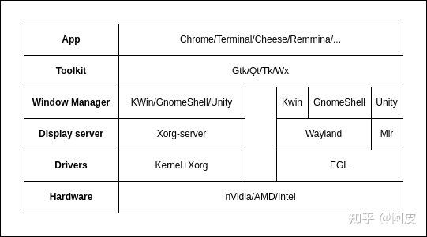

## 36. VM下裁剪linux(和DIY有区别)

## 36.1 linux启动流程

+ Linux开机自检,检查硬盘设备有没有故障
+ 如何有多块启动硬盘的话,需要在bios中选择需要的磁盘
+ 启动mbr中的bootloader引导程序
+ 加载内核文件
+ 执行所有进程的父进程`systemd`
+ 显示欢迎界面

> 在linux启动流程中,加载内核文件时关键文件为:
>
> + kernel文件: `vmlinuz-3.10.0-957.el7.x86_64`
> + initrd文件:`initramfs-3.10.0-957.el7.x86_64.img`

## 36.2 裁剪Linux流程

1. 在现有的Linux系统上加上一块硬盘`/dev/sdb`(注意vm创建虚拟磁盘时**不要拆分成多个文件,而是1个磁盘文件**),在硬盘`sdb`上分区,一个就是`/boot`,另一个就是`/`,并将其格式化. 
2. 将原来的Linux`/boot`文件拷贝到`sdb`硬盘下`/boot`中,原来Linux`/bin,/sbin,..`拷贝到硬盘`sdb`下`/`中
3. 将原系统`内核文件`和`initramfs`一起拷贝到硬盘`sdb`上
4. 创建一个Linux虚拟机,将硬盘指向我们创建的硬盘即可

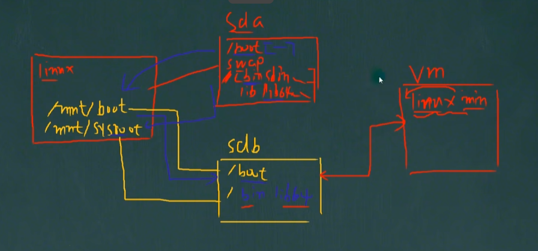

## 36.3 实操

+ vm创建新硬盘,挂载到现有的Linux系统下 (**一定要选磁盘文件为单文件**)

  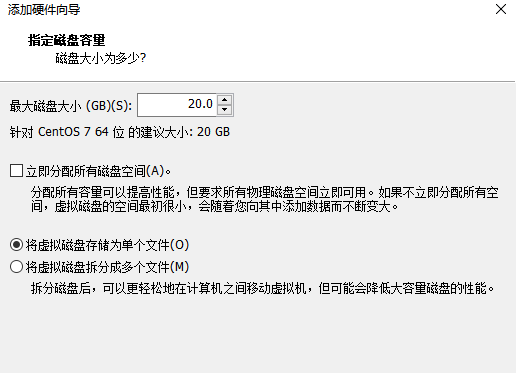

+ 进入系统,`lsblk`可以查看多了一块硬盘`sdb`,`20G`

+ `fdisk /dev/sdb`分区

  可以先查看现有分区的大小,进行合理划分

+ `mkfs -t ext4 /dev/sdb1(和2)`格式化分区 

  可以使用`lsblk -f`查看uuid

  > 原来是`xfs`格式,自己改是`ext4`格式

+ 挂载硬盘 

  ```bash
  mkdir -p /mnt/boot /mnt/sysroot
  mount /dev/sdb1 /mnt/boot
  mount /dev/sdb2 /mnt/sysroot
  ```

  > + 500M `sdb1` 挂载到 `/mnt/boot`
  > + 19.5G `sdb2`挂载到 `/mnt/sysroot`
  >
  > 挂载完可以使用`lsblk`查看硬盘和其挂载点

+ 安装grub,将内核文件拷贝到目标磁盘

  ```bash
  grub2-install --root-directory=/mnt /dev/sdb
  # 检查 有提示信息
  hexdump -C -n 512 /dev/sdb
  ```

  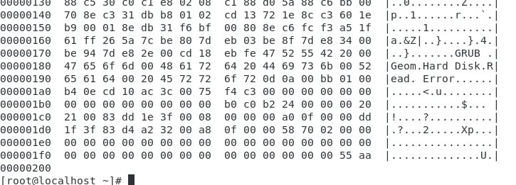

+ 将原linux下`/boot/*`所有文件拷贝到`/mnt/boot`目录下

  ```bash
  cp -rf /boot/* /mnt/boot
  ```

+ 修改`/mnt/boot/grub2/grub.cfg`文件**指定启动盘**,标红的部分是需要指令来查看的

  就是将原来系统盘启动盘(`/boot,/`)号uuid(`lsblk -f`),换成`sdb`下的`/boot,/`

  > vim中全局替换`:%s/原字符/替换后字符/g`
  >
  > 在`linux16`改行后面追加:`selinux=0 init=/bin/bash` (**类似于找回root密码那部分**),指定shell类型 ==注意位置在最后,别找错了==
  >
  > 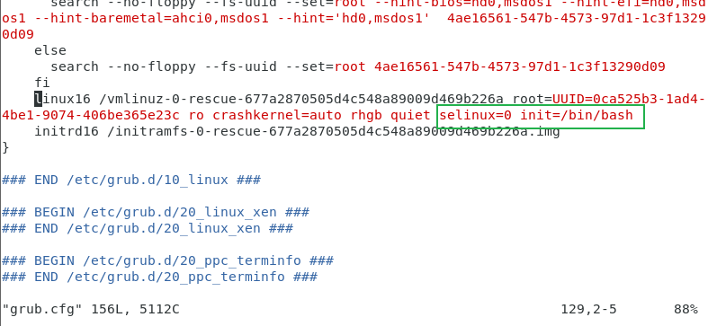

+ 创建目标主机根文件系统目录,**虽然是空的,但是也要建立**

  ```bash
  mkdir -pv /mnt/sysroot/{etc/rc.d,usr,var,proc,sys,dev,lib,lib64,bin,sbin,boot,srv,mnt,media,home,root}
  ```

+ 拷贝需要的bash和库文件给新的系统使用

  ```bash
  cp /lib64/*.* /mnt/sysroot/lib64
  cp /bin/bash /mnt/sysroot/bin
  ```

+ 卸载`sdb`硬盘,创建虚拟机,将默认的硬盘删除掉,勾选我们的硬盘即可

  正常创建虚拟机后,删除硬盘,添加虚拟磁盘-**使用现有虚拟磁盘**-选择**centos7-mini**(第一步创建的虚拟磁盘)

  **新建硬盘一定要选单个硬盘**

  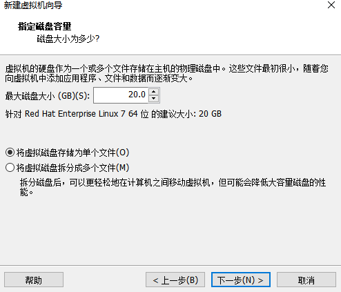

# 36. linux备份与恢复

## 36.1 `dump`备份

默认该命令没有安装,自己安装即可`yum -y install dump`

具体看命令帮助

## 36.2 `restore`恢复

默认该命令没有安装,自己安装即可`yum -y install restore`

具体看命令帮助
