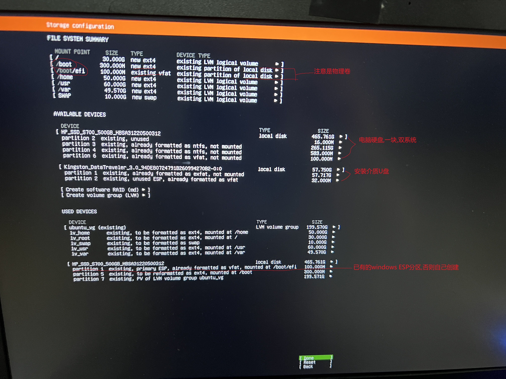

# 0. 双系统安装ubuntuserver在LVM上

## 0.1  如果是单系统

直接选择全盘安装即可,会自动创建新的 LVM卷组即VG(volume group)

## 0.2 已经安装了windows系统

### 0.2.1 概述

将整个系统安装在LVM上, 即`\,swap,\home,\usr,\var`分区都装在vlm上.

需要单独提前划好分区(**两个都不能装载lvm上**): 给`/boot`挂载, `/boot/efi`挂载到已经存在的windwos的esp分区中

> 如果没有windwos系统,你需要额外创建一个`esp`分区即`fat32`格式的分区挂载`/boot/efi`

### 0.2.2 具体步骤

+ 选择`help-shell`打开命令行终端(`exit`返回图形界面),  或者按下`ctrl+alt+f2`进入tty2终端(按下`ctrl+alt+f1`返回图形界面)

+ 分区 `/boot`分区, `/boot/efi`分区, `lvm`数据分区(三大分区)

  + 创建sda5, 用于挂载`/boot`分区**不能在lvm上创建**

    ```bash
    $sudo lsblk -l
    $sudo fdisk /dev/sda # 实际的磁盘
    # 进入交互界面
    n #创建分区
    回车#默认主分区
    回车#默认分区号 假定为5 sda5
    +300M#分区大小
    回车
    p #打印分区表
    w#保存退出
    ###############/boot 300M分区创建完毕

  + 如果已经存在`ESP`主分区,选择`/boot`挂载分区时会自动勾选(多注意观察)

  + 如果不存在`ESP`主分区,就需要自己创建一个分区用于挂载`/boot/efi`并转为`fat32`格式

    ```bash
    $sudo lsblk -l
    $sudo fdisk /dev/sda # 实际的磁盘
    # 进入交互界面
    n #创建分区/boot/efi如果不存在ESP分区
    回车#默认主分区
    回车#默认分区号 假定为6 sda6
    +100M#分区大小
    回车
    p #打印分区表
    w#保存退出
    ################将sda6分区格式化为fat32 (注意备份数据)
    $sudo umount /dev/sda6
    $sudo mkfs.fat -F32 /dev/sda6 # 安装时-F32不正确,会弹出交互,你输入字母l可以看到实际fat32对应的序号,输入回车即可
    ```

  + 创建sda7, `lvm`分区用于挂载`swap,/,lhome,...`分区

    + 创建sda7分区

      ```bash
      $sudo lsblk -l
      $sudo fdisk /dev/sda # 实际的磁盘
      # 进入交互界面
      n #创建分区
      回车#默认主分区
      回车#默认分区号 假定为7 sda7
      回车#分区大小 剩余全部
      回车
      p #打印分区表
      w#保存退出
      ```

    + 将sda7分区转为lvm卷

      ```bash
      $sudo pvcreate /dev/sda7 #将物理卷sda7转为lvm卷
      $sudo pvdisplay #显示lvm卷信息
      $sudo vgcreate ubuntu_vg /dev/sda7# 在lvm卷sda7上创建VG卷组叫ubuntu_vg
      $sudo vgdisplay #显示VG卷组信息
      ```

    + 按大小分区

      ```bash
      #在卷组ubuntu_vg上创建名为lv_swap的逻辑卷,其大小为10G (用于挂载到swap)
      $duso lvcreate -n lv_swap -L 10G ubuntu_vg
      #在卷组ubuntu_vg上创建名为lv_root的逻辑卷,其大小为30G (用于挂载到/)
      $duso lvcreate -n lv_root -L 30G ubuntu_vg
      #在卷组ubuntu_vg上创建名为lv_home的逻辑卷,其大小为50G (用于挂载到/home)
      $duso lvcreate -n lv_home -L 50G ubuntu_vg
      #在卷组ubuntu_vg上创建名为lv_usr的逻辑卷,其大小为60G (用于挂载到/usr)
      $duso lvcreate -n lv_usr -L 60G ubuntu_vg
      #在卷组ubuntu_vg上创建名为lv_var的逻辑卷,其大小为50G (用于挂载到/var)
      $duso lvcreate -n lv_varr -L 50G ubuntu_vg #如果向用尽空间, vgdisplay会显示free size
      
      
      $sudo lvdisplay #查看已经分好的逻辑卷信息
      ```

    + 执行`sudo partprobe`通知内核

    + 安装操作不需要后续**格式化,自动挂载**处理,安装程序会自动处理

+ 选择 `Custom storage layout`,进入自定义布局, 选择挂载分区

  

+ 下一步即可

# 1.  grub设置第三方主题

## 1.1 设置图像界面展示

```bash
# /etc/default/grub文件
GRUB_DEFAULT=0
#GRUB_TIMEOUT_STYLE=hidden
GRUB_TIMEOUT_STYLE=menu
GRUB_TERMINAL_OUTPUT=gfxterm
#GRUB_TIMEOUT_STYLE=console
#GRUB_TIMEOUT=0
GRUB_TIMEOUT=15
GRUB_DISTRIBUTOR=`lsb_release -i -s 2> /dev/null || echo Debian`
GRUB_CMDLINE_LINUX_DEFAULT="" #可设置为quiet splash,减少显示信息
#GRUB_CMDLINE_LINUX_DEFAULT=""
GRUB_CMDLINE_LINUX=""
```

## 1.2 下载主题包

主题包地址: https://www.gnome-look.org/p/1307852

### 1.2.1 自动安装

```bash
wget https://www.gnome-look.org/p/1307852
sudo tar -xf Tela-1080p.tar.xz
cd Tela-1080p
#执行安装脚本 
sudo ./installer.sh -b -t tela #该主题对应的文档https://github.com/vinceliuice/grub2-themes

sudo update-grub
```

### 1.2.2 手动安装

```bash
wget https://www.gnome-look.org/p/1307852
sudo tar -xf Tela-1080p.tar.xz
cd Tela-1080p
# themes目录不存在就创建
sudo cp -r Tela /usr/share/grub/themes
# 修改 /etc/default/grub文件(更新或添加)
GRUB_THEME="/usr/share/grub/themes/Tela/theme.txt"

sudo update-grub
```

## 1.3 图形主题不显示

### 1.3.1 修改`/etc/grub.d/00_header`文件

如果默认主题和第三方图形主题不显示,配置已经按照**1.1**设置了

```bash
# 修改/etc/grub.d/00_header
  set gfxmode=${GRUB_GFXMODE}
  sleep .1 #增加的一行,等待图形初始化 睡眠0.1秒可自行调整
  load_video
  insmod gfxterm
  
 #保存文件并更新
 sudo update-grub #等同于 sudo grub-mkconfig -o /boot/grub/grub.cfg
```

### 1.3.2 修改`/boot/grub/grub.cfg`文件

```bash
#在文件 /boot/grub/grub.cfg  最开头添加 
videoinfo

#保存文件并更新
 sudo update-grub #等同于 sudo grub-mkconfig -o /boot/grub/grub.cfg
```

# 2. 设置时区

``` bash
timedatectl -h
timedatectl show
timedatectl status
timedatectl list-timezones
#设置时区
sudo timedatectl set-timezone Asia/Shanghai

```

# 3. 设置openssh通过密钥登录

```bash
$ssh-keygen -t rsa
$chmod 700 ~/.ssh
$chmod 600 ~/.ssh/authorized_keys
$cat ~/.ssh/id_rsa.pub >>  ~/.ssh/authorized_keys

# 修改/etc/ssh/sshd_config文件
#增加以下内容
MaxAuthTries 5
RSAAuthentication yes #开启RSA认证
PubkeyAuthentication yes#开启公钥登录
PermitRootLogin without-password#允许root用户登录
PasswordAuthentication no#不允许密码登录
ChallengeResponseAuthentication no #
#确保只有通过密钥进行身份验证
AuthenticationMethods publickey #必加
# 重启sshd服务
$ sudo systemctl restart sshd

```

# 4. 禁用盒盖休眠

状态行为:

+ `ignore` 忽略, 无操作
+ `poweroff` 关闭系统并切断电源
+ `reboot` 重启启动
+ `halt` 关闭系统但不切断电源
+ `kexec` 调用内核`kexec`函数
+ `suspend` 暂停, 休眠到内存
+ `hibernate` 休眠到硬盘
+ `hybrid-sleep` 同时休眠到内存和硬盘
+ `suspend-then-hibernate` 先休眠到内存超时后再休眠到硬盘
+ `lock` 锁屏

```bash
# 文件 /etc/systemd/logind.conf
[Login]
HandlePowerKey=ignore # 按下电源键行为
HandleSuspendKey=ignore #按下暂停键行为
HandleHibernateKey=ignore #按下休眠键行为
HandleLidSwitch=ignore # 笔记本合盖行为	

#保存后执行命令
$sudo systemctl restart systemd-login 
```

参考链接: https://blog.csdn.net/qq_31635851/article/details/124627990

# 5. 修改root用户密码

```bash
$sudo passwd
```

# 6. 修改主机名

+ 临时修改`sudo hostname 主机名`

+ 永久修改

  ```bash
  $sudo hostnamectl hostname 主机名
  #手动修改/etc/hostname 若已经更改不需要动
  #手动修改/etc/hosts 若已经更改不需要动
  $sudo systemctl restart systemd-hostnamed #最好重启
  ```

  

# 7. 设置静态ip

+ 修改`/etc/netplan`目录下网卡配置文件, 如`00-installer-config.yaml`
+ 执行`sudo netplan apply`生效

```yaml
#文件 /etc/netplan/00-installer-config.yaml
# This is the network config written by 'subiquity'
network:
  renderer: networkd
  ethernets:
    enp3s0:
      addresses: [192.168.31.79/24]
      optional: true
      nameservers: 
        addresses: [192.168.31.1,8.8.8.8,8.8.4.4]
      routes:
        - to: default
          via: 192.168.31.1
      dhcp4: false
  version: 2
```

# 8. 解决开机卡在网络配置

问题:  **A start job is running for wait for network to be Configured**

解决方法:  

+ 修改`/etc/systemd/system/network-online.target.wants/systemd-networkd-wait-online.service`
+ 在[Service]下添加 TimeoutStartSec=2sec

```bash
$cd /etc/systemd/system/network-online.target.wants/
$sudo vim systemd-networkd-wait-online.service

#[Service]
#TimeoutStartSec=2sec #添加该参数

#保存文件后重启生效
sudo reboot
```

# 9. 备份linux系统

**使用lvm拍摄系统逻辑卷快照, 并不能直接将其放入另一台机器上恢复数据.** 这是因为LVM快照是依赖于原逻辑卷的, 并且只记录了原始逻辑卷上数据的更改.快照不能独立于原逻辑卷存在或恢复,因为他并不是完整的逻辑卷副本.

***备份步骤(适合不停止服务如mysql备份数据):***

+ 前提已经存在VG卷组`ubuntu_vg`, 和定义在其上的逻辑卷如`lv_home`

+ 拍摄快照

  + `-s` 即`--snapshot`表示执行给逻辑卷拍摄快照
  + `-n 快照名` 给快照取名字
  + `-L`即`--size`指定快照的空间(用于存储数据一直变化的操作,如果实际变化超过该值则该快照无效)

  ```bash
  $sudo lvcreate -s -n test_home_snap -L 2G /dev/ubuntu_vg/lv_home
  ```

+ 挂载快照

  ```bash
  $sudo mkdir /mnt/test_home_snap
  $sudo mount /dev/ubuntu_vg/test_home_snap /mnt/test_home_snap
  ```

+ 备份快照内容

  + 使用`tar`命令打包备份

  + 使用`rsync`

    ```bash
    $sudo rsync -a /mnt/test_home_snap 备份目标目录
    ```

+ `sudo lvs`查看已经存在的逻辑卷(快照也是逻辑卷)

> + LVM快照实际就是创建了一个逻辑卷,默认保存到**拍摄快照卷的所属逻辑卷中**. 如(拍摄`/dev/ubuntu_vg/lv_home`的快照`test_home_snap`默认保存在`/dev/ubuntu_vg`中)
> + LVM快照实际并不会存放数据, 实际存放的是**自快照创建以来逻辑卷发生的更改(注意是拍摄快照前的更改,而不是拍摄快照后)**, 最终的数据还是要依据已有的逻辑卷(有点像redis的持久化)
> + LVM快照使用COW(copy on write)即写时复制技术, **所以快照挂载后数据就是当时拍摄快照时的数据(不会变)**
> + 拍摄的快照大小实际依赖lvm即VG卷组的剩余空间,如果全部分配了则会提示`insufficient free space`

