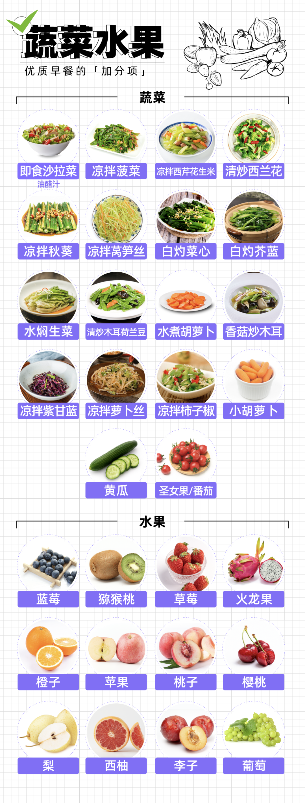
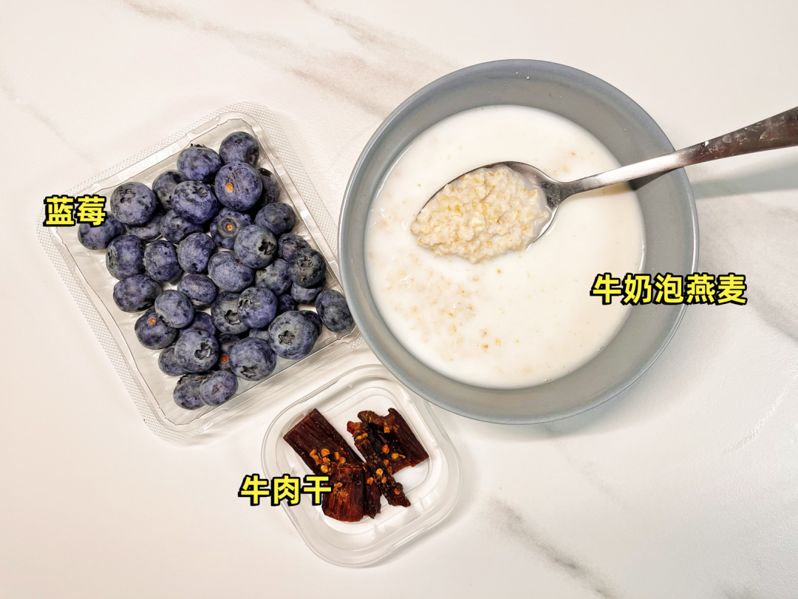

# 

# 早餐

> [!Tip]
>
> 参考链接：https://dxy.com/article/117806

## 1. 优质版

### 优质碳水

### 优质蛋白

### 蔬菜水果

蔬菜丢进碗里，加入刚刚没过菜叶的水，**放进微波炉中高火叮 2 分钟**，就是一份健康烫青菜（需要的话还可以加点辣酱拌一拌）。

## 2. 摆烂版

### **全麦面包 + 即食鸡胸肉 + 牛奶 + 圣女果**

### **牛奶泡燕麦片 + 蓝莓 + 牛肉干**

### **全麦贝果 + 即食蟹柳 + 猕猴桃 + 拿铁咖啡**

### **关东煮鸡蛋、蔬菜**（萝卜、海带、笋尖、香菇任选）**+ 无糖酸奶 + 玉米窝头**

### **煮玉米 + 无糖豆浆 + 茶叶蛋 + 小胡萝卜**

### **全麦面包 + 牛奶 + 关东煮鸡蛋、蔬菜**（萝卜、海带、笋尖、香菇任选）

## 3. 快速版

### **全麦贝果 + 鸡蛋 + 牛奶 + 水焖生菜**

水焖生菜用微波炉大法

### **杂粮窝头 + 酱牛肉 + 无糖酸奶 + 水焖菠菜**

窝窝头用微波炉转个几分钟，水焖菠菜用微波炉大法

### **全麦面包 + 煎鸡蛋 + 奶酪片 + 黄瓜片**

空气炸锅一切皆有可能

## 4. 便利店版

# 主食

## 1. 米饭

+ 白米饭
+ 红豆米饭
+ 黑豆米饭
+ 玉米米饭
+ 黑米米饭
+ 糯米米饭
+ 糙米米饭
+ 花生米饭
+ 燕麦米饭
+ 薏仁米饭

## 2. 粥

+ 白粥
+ 地瓜粥
+ 玉米粥
+ 黑豆粥
+ 黑米粥
+ 红豆粥
+ 绿豆粥
+ 薏仁粥
+ 八宝粥

## 3. 馒头

## 4. 煎饼

## 5. 朝牌饼

## 6. 单饼

# 快手菜

## 1. 芹菜豆干

## 2. 芹菜豆皮

## 3. 香煎鲽鱼

## 4. 番茄炒蛋

## 5. 胡萝卜炒肉

## 6. 芹菜炒肉

## 7. 包菜炒肉

## 8. 清炒包菜

## 9. 清炒芹菜

## 10. 醋溜土豆丝

## 11. 土豆炒肉

## 12. 芹菜炒肉

## 13. 花菜炒肉

## 14. 青椒炒蛋

## 15. 清炒韭菜

## 16. 韭菜炒蛋

## 17. 包菜炒粉丝

## 18. 莲菜炒肉

## 19. 清炒莲菜

## 20. 清炒四季豆

## 22. 四季豆炒豆干

## 23. 四季豆炒肉

## 24. 清炒洋葱

## 25. 洋葱炒杏鲍菇

## 26. 杏鲍菇炒肉

## 27. 清炒绿豆芽

## 28. 清炒黄豆芽

## 29. 绿豆芽炒肉

## 30. 黄豆芽炒肉

## 31. 凉拌藕片

## 32. 凉拌黄瓜

## 33. 凉拌西红柿

## 34. 黄瓜炒蛋

## 35. 清炒豆皮

## 36. 土豆丝炒胡萝卜丝

## 37. 红烧豆腐

## 38. 清炒豇豆

## 39. 豇豆炒肉

## 40. 清炒毛豆

## 41. 毛豆炒肉

# 硬菜