# 1. 单元测试框架

## 1.1 什么是单元测试框架

单元测试框架是在自动化测试或者白盒测试中对软件的最小单元(函数,方法)进行测试的框架.

## 1.2 单元测试框架分类

+ python: pytest+unitest
+ java:testng+junit

## 1.3 单元测试框架的作用

+ 发现测试用例
+ 执行测试用例
+ 判断测试用例
+ 生成测试报告

# 2. pytest(6.2.4)简介以及常见插件的安装

官网: https://docs.pytest.org/

## 2.1 简介

1. pytest是一个非常成熟的单元测试框架,灵活简单.
2. 它可以结合selenium,requests,appium完成不同的自动化.
3. 它可以生成自定义allure报告以及和jenkins持续集成
4. pytest具有很多强大的插件
   + pytest-html用于生成html报告的插件
   + pytest-xdist用于多线程运行的插件
   + pytest-ordering用于改变用例的执行顺序的插件
   + pytest-rerunfailures用于用例失败重跑
   + allure-pytest生成自定义报告

## 2.2 安装插件

pycharm新建项目,在**虚拟环境**中通过python依赖文件`requiremenets.txt`来进行安装

```text
pytest
pytest-html
pytest-xdist
pytest-ordering
pytest-rerunfailures
allure-pytest
pyyaml
requests
```

执行命令`pip install -r .\requirements.txt`

# 3.pytest默认测试用例的规则以及基础应用

## 3.1 pytest默认规则

1. pytest**模块名(py文件名)**默认必须以`test_`开头或`_test`结尾.

2. pytest**测试类**默认以`Test`开头,并且**不能有**`init`方法

3. pytest**测试用例(函数,方法)**默认必须以`test_`开头 

   **函数直接定义,方法定义在类中**

> **默认规则可以在配置文件中改**

## 3.2 定义测试用例

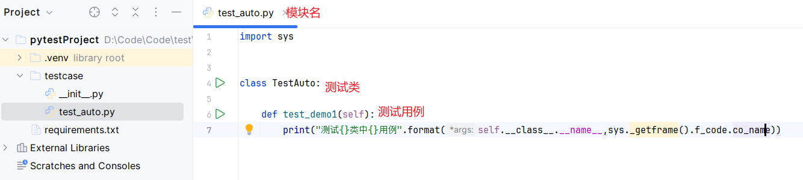

# 4. 运行pytest

1. **直接在虚拟环境下的命令行输入:**`pyest`

2. 通过主函数`main`执行

   ```python
   import pytest
   
   if __name__=="__main__":
       pytest.main(["-vs"]) # 传递pytest参数
   ```

3. 通过全局配置文件`pytest.ini`文件执行

4. pycharm左边的绿色箭头执行测试用例或测试类

5. `pytest test_auto.py`直接输入模块名运行

6. `pytest testcase/`直接输入目录进行运行其内部所有符合要求的测试用例

7. `pytest -k 表达式` 根据表达式指定要运行的模块

8. ...

# 5. pytest命令参数

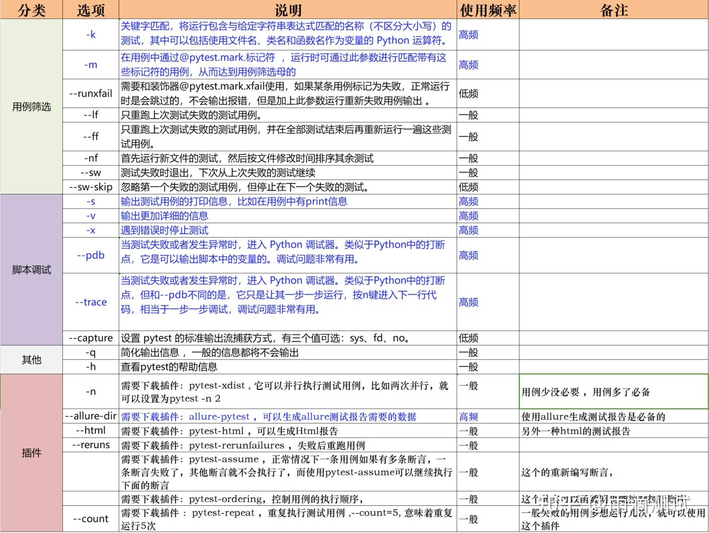

参考链接: [API Reference - pytest documentation](https://docs.pytest.org/en/8.2.x/reference/reference.html#command-line-flags)

+ `-v` 输出测试的详细信息

+ `--capture` 捕获控制台输出,有四个可选项`fd,sys,no,tee-sys`. `fd`表示同时将**文件描述符(filedescriptors即fd)**1和2指向临时文件; `sys`表示使用in-mem文件代替sys.stdout和sys.stderr; `no`表示禁止捕获,直接在控制台打印; `tee-sys`表示既被捕获也输出到控制台

+ `-s`即`--capture=no`禁止捕获控制台输出

+ `-n 数字`多线程工作默认为1 ,是`--dist=load --tx=数字*popen`的简写.必须安装插件`pytest-xdist`

+ `--reruns 数字`失败重跑次数,默认为0

+ `--reruns-delay 数字`失败重跑延迟时间,单位为**秒**

+ `--rerun-except 正则表达式` 只重新运行与指定**正则表达式不匹配**的测试用例(**不是匹配**)

+ `--only-rerun 正则表达式 `只重新运行与指定**正则表达式匹配**的测试用例 (**这个才是匹配的**)

+ `-x`或`--exitfirst` 遇到第一个错误就退出

+ `--maxfail 数字`错误指定次数后后退出

+ `--html 路径/文件.html`生成html报告,存放在指定路径 (前提必须安装插件pytest-html)

+ `-k 表达式` 根据表达式指定要运行的模块
  
  + 逻辑关键字和优先级为`not > and >  or`
  + 如: `pytest -s -k "demo and not _1 or not _2" `即执行**(模块,类,用例)名字**包含`demo`但不包含`_1`或/和执行**(模块,类,用例)名字**包含`demo`不包含`_2` (其实应该是`_1`,`_2`都执行了)
  + 如:`pytest -s -k "demo and not _1"`执行**(模块,类,用例)名字**包含`demo`但是不包含`_1`
  
+ `-c ini配置文件` 指定pytest的配置文件,可以不叫`pytest.ini`

+ `-m mark表达式`只运行满足给定的mark表达式的 ,搭配配置项`markers`和`@pytest.mark.xxx`使用(**自定义标签**)

  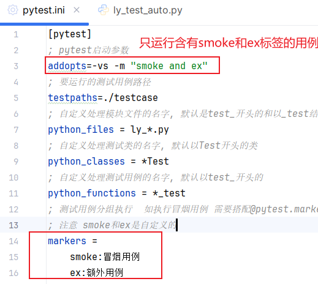

  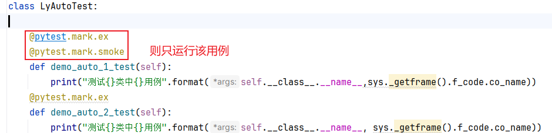

+ ...

> windows中所有参数的表达式**必须是双引号**`""`而不能为单引号`''`

# 6. pytest配置文件

参考连接: [API Reference - pytest documentation](https://docs.pytest.org/en/8.2.x/reference/reference.html#configuration-options)

文件名必须是`pytest.ini`,放在pytest**项目的根目录下**.

```ini
[pytest]
; pytest启动参数
addopts=-vs -m "smoke and ex"
; 要运行的测试用例路径
testpaths=./testcase
; 自定义处理模块文件的名字, 默认是test_开头的和以_test结尾的模块名(py文件)
python_files = ly_*.py
; 自定义处理测试类的名字, 默认以Test开头的类
python_classes = *Test
; 自定义处理测试用例的名字, 默认以test_开头的
python_functions = *_test
; 测试用例分组执行  如执行冒烟用例 需要搭配@pytest.markers.smoke @pytest.markers.ex和-m "smoke and ex"使用
; 注意 smoke和ex是自定义的
markers =
    smoke:冒烟用例
    ex:额外用例
;...等等
```

> windows中所有参数的表达式**必须是双引号**`""`而不能为单引号`''`

> mark标记请看

# 7. pytest跳过测试用例

+ 无条件跳过 `@pytest.mark.skip`

+ 有条件跳过`@pytest.mark.skipif(true)`,条件为真则跳过

  ```python
  class LyAutoTest:
      @pytest.mark.ex #自定义标签
      @pytest.mark.smoke #自定义标签
      @pytest.mark.skip(reason="无理由跳过")
      def demo_auto_1_test(self):
          print("测试{}类中{}用例".format(self.__class__.__name__,sys._getframe().f_code.co_name))
  
      @pytest.mark.smoke
      @pytest.mark.ex
      @pytest.mark.skipif(random.randint(1,2)==2,reason="随机数为2,跳过")
      def demo_auto_2_test(self):
          print("测试{}类中{}用例".format(self.__class__.__name__, sys._getframe().f_code.co_name))
  ```

# 8. ==mark内置6大标签(扩展)==

参考连接: [API Reference - pytest documentation](https://docs.pytest.org/en/8.2.x/reference/reference.html#marks)

+ `@pytest.mark.skip(reason=原因)` 无条件跳过测试用例

+ `@pytest.mark.skipif(条件为真,reason=原因)` 有条件跳过测试用例

+ `@pytest.mark.xfail` 标记某个测试用例预期会失败,**如果成功通过提示**`passed`,**如果失败,则提示**`xpassed`

  ```python
  # 元组比较,第一位相同就比较第二位,依次类推
  @pytest.mark.xfail(sys.version_info < (3,6), reason= "python版本过低")
  def test_demo_py_version(self):
      print("python版本是{}".format(sys.version))
  ```

+ `@pytest.mark.parametrize` 给测试用例传入参数,用于数据驱动

+ `@pytest.mark.usefixtures(夹具的函数名)` 使用指定夹具,**可以只给部分class,funtion或method使用**

+ `@pytest.mark.filterwarnings `用于过滤测试运行时的警告

  ```python
  def mywarning():
      warnings.warn("我的警告!!!!!!!!!!",DeprecationWarning)
  #固定写法ignore::
  @pytest.mark.filterwarnings("ignore::DeprecationWarning")
  def test_warning_demo(self):
      mywarning()
  ```

+ `@pytest.mark.run(order=1)`**自定义标签,由pytest-ordering或pytest-order自带**测试用例的执行顺序值越小越先执行

  > 除了使用装饰器,当然你也可以手动执行(去掉`mark`)如:
  >
  > + `pytest.xfail`
  > + ...

# 9. pytest测试用例的前后置夹具fixture(类xunit)

参考连接 [How to implement xunit-style set-up - pytest documentation](https://docs.pytest.org/en/8.2.x/how-to/xunit_setup.html#method-and-function-level-setup-teardown)

## 9.1 类xunit前后置夹具

1. 测试类中方法级别

   + `setup(self,method)` 类中每个**测试用例**执行前执行一次

   + `teardown(self,method)` 类中每个**测试用例**执行后执行一次

     > 注意这个两个方法在`python8`之后以已经弃用更改为`setup_method(self,method)`和`teardown_method(self,method)`

     > 参数`method`为可选参数

2. 测试类级别

   + `setup_class(self)` 每个**类**执行前执行一次

   + `teardown_class(self)` 每个**类**执行后执行一次

     > 一般搭配`@classmethod`使用,不加也是可以的

3. 测试模块级别

   + `setup_moudle(module)` 每个**模块**执行前执行一次 (**一定要放在测试类中,放在工具类不生效**)

   + `teardown_moudle(module)` 每个**模块**执行前执行一次 (**一定要放在测试类中,放在工具类不生效**)

   + `setup_function(function)` **只针对模块级别(与类同等级的)的函数 ** 即在模块函数执行前执行一次

   + `teardown_function(function) `**只针对模块级别(与类同等级的)的函数 ** 即在模块函数执行后执行一次

     > 参数`module`和`function`可选

   ```python
   import random
   import sys
   import time
   from comm.BaseClass import BaseTestClass
   
   
   def setup_module():
       print("每个模块执行前执行一次[auto_test module]")
   def teardown_module():
       print("每个模块执行后执行一次[auto_test module]")
   def setup_function():#只对test_demo_auto_module生效
       print("每个模块函数执行前执行一次[auto_test function]")
   def teardown_function():#test_demo_auto_module
       print("每个模块函数执行后执行一次[auto_test function]")
   def test_demo_auto_module(): 
       print("测试auto_test中模块级别函数")
   
   class TestAuto2(BaseTestClass): #定义在公共类中
       # @classmethod
       # def setup_class(self):
       #     print("每个类执行前执行一次")
       #
       # @classmethod
       # def teardown_class(self):
       #     print("每个类执行后执行一次")
       #
       # def setup_method(self):
       #     print("每个测试用例执行前执行一次")
       #
       # def teardown_method(self):
       #     print("每个测试用例执行后执行一次")
   
       def test_demo_auto_1(self):
           print("测试{}类中{}用例".format(self.__class__.__name__, sys._getframe().f_code.co_name))
   
       def test_demo_auto_2(self):
           print("测试{}类中{}用例".format(self.__class__.__name__, sys._getframe().f_code.co_name))
   
       def test_demo_uia_3(self):
           print("测试{}类中{}用例".format(self.__class__.__name__, sys._getframe().f_code.co_name))
   
       def test_demo_uia_4(self):
           print("测试{}类中{}用例".format(self.__class__.__name__, sys._getframe().f_code.co_name))
   
   ```

## 9.2 类xunit前后置夹具的优先级

从高到底依次为:

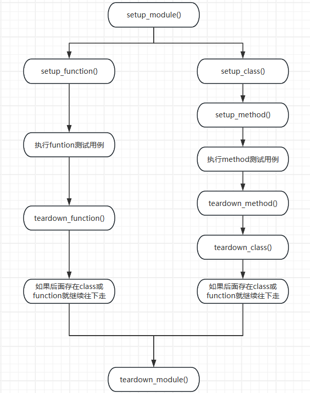

## 9.3 缺点

类xunit前后置夹具对所有的测试用例均会生效啊,不满足部分用例生效的需求,因此就需要使用`@pytest.fixture()`

# 10. ==使用`@pytest.fixture()`实现部分前后置==

## 10.1 五大参数

`@pytest.fixture(scope,params,autouse,ids,name)` 

**作用: ** **在测试用例执行前/后执行**

**五大参数:**

+ `scope `生效范围
  + `funtion`(默认) **对当前模块内所有的测试用例function和method都有效**
  + `class `**只对当前模块测试用例的类(不唯一)生效**
  + `module` **只对模块(python文件)生效**
  + `package `**只对包(文件夹)有效**
  + `session `**只对pytest项目会话有效**
  
+ `params` 传递参数

+ `autouse`
  + `False`(默认) **该模式下除非手动调用,否则不会执行该夹具,并且可以通过参数获取夹具返回值(用例参数化)**
  + `True` **默认情况下对满足要求的测试范围自带执行该夹具**
  
+ `ids` 必须搭配params使用,作用是给参数其别名 (`-v`输出时代替参数的值)

+ `name` 给当前夹具fixture命名,**定义了之后就不能再通过原来夹具的函数名调用,而是通过name属性值调用**

  ```python
  @pytest.fixture(scope="function", autouse=False, name="我的第一个夹具")
  def exe_init(request):
      pass
  #调用就不是通过exe_init来调用了
  #@pytest.mark.usefixture("我的第一个夹具")
  #测试用例中当形参,也是def test_demo_uia_4(self, 我的第一个夹具) 而不是exe_init了
  ```

  > 定义了name属性,就不能用原来的函数名了,必须是name的值

## 10.2 生效规则

+ 被`@pytest.fixture()`装饰的函数可以在任意地方如**funtion类型(模块级别),或method类型都可以**
+ 如果参数`autouse=True`那么被`@pytest.fixture()`装饰的函数将**对所有的测试用例生效(如function类型(模块级别)和method类型)**
+ 可以存在多个夹具
+ **数据驱动params参数化为了保证顺序不乱,一定要确定参数**`scope=function`,其他类型会导致顺序有问题

## 10.3 `autouse=false`手动使用夹具

+ `autouse=True`自动对所有测试用例生效
+ `autouse=false`手动调用  ==**参数化params一定要注意级别否则会导致不确定的顺序**==
  + **作为function或method的形参,用于调用夹具并接收参数**
  + 使用`@pytest.mark.usefixture(夹具函数名)`调用,适用于所有(类,function和method),不过还是只推荐用在**类**上,**防止数据驱动时执行出现异常**

```python
#定义夹具***
@pytest.fixture(scope="class", autouse=False)
def exe_init():
    print("执行开始初始化...")#前置
    yield "success" #返回值,如果用return后面的语句就不会再执行了
    print("执行结束收尾...")#后置

class TestAuto2(BaseTestClass):

    def test_demo_auto_1(self):
        print("测试{}类中{}用例".format(self.__class__.__name__, sys._getframe().f_code.co_name))
    def test_demo_uia_4(self,exe_init):#***
        #使用形参的调用,可以获取返回值
        print("夹具返回值={}".format(exe_init))
        print("测试{}类中{}用例".format(self.__class__.__name__, sys._getframe().f_code.co_name))

@pytest.mark.usefixtures("exe_init")#使用装饰器调用***
def test_demo_auto_module():
    print("测试auto_test中模块级别函数")

```

## 10.4 params参数化(数据驱动)

+ **参数化一定要注意夹具的范围和使用的用例为同一级别**
+ 接受参数通过夹具函数`request`形参的`request.param`获取(**固定写法**)
+ ==**有几个参数,就会对测试用例执行几次**==(不同的地方就是参数)

```python
def read_yaml():
    return ["zs","ls","ww"]
# 注意级别一定是function ,否则会乱序
@pytest.fixture(scope="function", autouse=False,params=read_yaml())
def exe_init(request):
    print("执行开始初始化...")
    yield request.param 
    print("执行结束收尾...")

class TestAuto2(BaseTestClass):
    def test_demo_uia_4(self,exe_init):
        print("夹具返回值={}".format(exe_init)) #获取参数
        print("测试{}类中{}用例".format(self.__class__.__name__, sys._getframe().f_code.co_name))

@pytest.mark.usefixtures("exe_init")
def test_demo_auto_module():
    print("测试auto_test中模块级别函数")
```

# 11. `@pytest.fixture()`结合`conftest.py`使用(跨模块,跨包)

`conftest.py`是用于专门存放fixture固件的配置文件,名称是固定的,不能变.不需要导包pytest会自动导.

**目的:为了解决fixture夹具跨模块,跨包共用问题,放在项目根目录下和**`pytest.ini`**同级别(即整个项目均可以使用)**

```text
项目目录
|_包1
  |_测试类
  |_conftest.py
|_包2
  |_测试类
  |_conftest.py
|_..
|_pytest.ini
|_conftest.py
```

> 一个项目可以有多个`conftest.py`文件,如整个项目有一个,每个包里面有一个,一般都是`autouse=True`

# 12.类xunit夹具和fixture夹具优先级

优先级从高到底

+ `@pytest.fixture(scope=session)`yield前
+ `@pytest.fixture(scope=package)`yield前
+ `@pytest.fixture(scope=module)`yield前
+ `setup_module()`
+ `@pytest.fixture(scope=class) `yield前
+ `setup_class()`
+ `@pytest.fixture(scope=function)` yield前
+ `setup_method()`
+ 测试用例
+ `teatdown_medthod()`
+ `@pytest.fixture(scope=function)` yield后
+ `teardown_class()`
+ `@pytest.fixture(scope=class)` yield后
+ `teardown_module()`
+ `@pytest.fixture(scope=module)` yield后
+ `@pytest.fixture(scope=package)` yield后
+ `@pytest.fixture(scope=session)` yield后

> + **模块级别函数等同于class级别**,所以`@pytest.fixture(scope=class) `对其也有效
> +  同模块(py文件)中**模块级函数和测试类按照先后顺序执行**,都执行完才会执行模块module级别的操作
> + **总结:同级别的总是**`@pytest.fixture`**先执行,然后才是xunit同级别的**

# 13. pytest断言

使用python自己的断言`assert`

```python
assert 1==1 "原因"
assert "a" in "abcd" "原因"
```


# 14. allure-pytest报告生成

## 14.1 安装

+ pip安装allure-pytest包
+ 下载allure  [Release 2.30.0 · allure-framework/allure2 (github.com)](https://github.com/allure-framework/allure2/releases/tag/2.30.0)
+ 解压安装,并配置环境变量
+ pycharm测试`allure --version`如果不行重启

## 14.2 allure-pytest启动参数

通过pytest的启动参数:

+ `--alluredir=目录`指定allure生成的报告保存地方 (**生成的是json格式报告**)
+ `--clean-alluredir` 如果allure报告目录存在,就清空
+ `--allure-no-capture` 不要将pytest捕获的日志如`logging/stdout/stderr`到报告中

## 14.3 allure命令

节选

`allure [options] [command] [command options]`

1. `[option]`

   + `-q`等同于`--quiet`安静模式
   + `-v`等同于`--verbose`啰嗦模式
   +  查看版本`--version`

2. `[commands]`

   + `generate`生成报告命令

     + `[command options]`

       + `-c`等同于`--clean`生成 报告前清空旧报告

       + `--config` allure命令行配置路径

       + `--configDirectory`allure命令行怕[配置目录,默认是`ALLURE_HOME`

       + `--profile` alure命令行配置文件

       + `-o` `--report-dir` `--output`均为指定生成报告的位置

       + `--lang` `--report-language`指定报告的语言

         > Supported values are: de, ru, sv, kr, en, fr, isv, zh, es, br, ja, az, pl, he, nl, tr

       + `--name` 指定报告的名字

       + `--single-file`生成的allure报告使用单文件模式(**这样就不需要一个web服务了**) 

   + `serve` 创建报告服务目录

     + `[command options]`

       + `--config` allure命令行配置路径

       + `--configDirectory`allure命令行怕[配置目录,默认是`ALLURE_HOME`

       + `--profile` alure命令行配置文件

       + `-h` `--host`指定服务ip

       + `-p` `--port`指定服务端口

       + `--lang` `--report-language`指定报告的语言

         > Supported values are: de, ru, sv, kr, en, fr, isv, zh, es, br, ja, az, pl, he, nl, tr

       + `--name` 指定报告的名字

   + `open` 打开生成的报告

     + `[command options]`
       + `-h` `--host`指定服务ip
       + `-p` `--port`指定服务端口

   + `plugin` 展示插件

     + `[command options]`
       + ...

## 14.4 生成allure报告

pytest主文件`main.py`

```python
import time

import pytest
import os
if __name__=="__main__":
    # os.putenv("PYTEST_DEBUG","True")
    pytest.main(["-vs","--clean-alluredir","--alluredir=temp"])
    time.sleep(3)
    os.system("allure -v generate ./temp -o ./reports -c --lang zh --name 我的测试报告 ")
    # 单文件报告模式
    # os.system("allure generate ./temp -o ./reports -c --lang zh --name 我的测试报告 --single-file")
    time.sleep(3)
    os.system("allure open ./reports-p 8888")

```

# 15. pytest数据驱动`@pytest.mark.parametrize`

借助`@pytest.mark.parametrize(argnames,args_value,indirect,ids,scope)`

+ `argnames` 参数名称,可以有多个参数, **用于将参数值传递给函数(给测试用例取值,必须一致)**
+ `argvalues` 参数值, 必须为可迭代的如列表,元组**(有n个元素就执行n次)**
+ `indirect` 为true时,传递的参数名`argnames`必须是fixture函数名称,`argvalues`值将传入对应的fixture中,相当于`@pytest.fixture(params=)`
+ `ids` 展示用,给参数起别名比如参数值太长了,**和参数的值对应,即**`argvalues`**有几个参数值就有几个别名(都在列表,元组)**
+ `scope` 表示参数的范围.范围用于按参数实例对测试进行分组,它还将覆盖任何fixture函数定义的范围,允许使用测试上下文或配置设置动态范围

## 15.1 传递一个参数

> `ids`和`argvalues`对应,相当于其别名

```python
@pytest.mark.parametrize("names",(111,"张三"), ids=("testname1","testname2"))
def test_demo_uia_4(self,names):
    # assert 1==1
    print("#### name={}".format(str(names)))
    print("测试{}类中{}用例".format(self.__class__.__name__, sys._getframe().f_code.co_name))
```

## 15.2 传递多个参数

> `ids`和`argvalues`对应,相当于其别名

```python
@pytest.mark.parametrize("names,ages", [("张三",18),["李四",19]], ids=("first demo", "second demo"))
def test_demo_uia_5(self, names, ages):
    # assert 1==1
    print("#### name={} age={}".format(str(names), ages))
    print("测试{}类中{}用例".format(self.__class__.__name__, sys._getframe().f_code.co_name))
```

## 15.3 组合使用

取并集,共9种

```python
@pytest.mark.parametrize("x", (111, 222, 333))
@pytest.mark.parametrize("y", (444, 555, 666))
def test_demo_uia_6(self, x, y):
    # assert 1==1
    print("&&&& x={} y={}".format(x,y))
    print("测试{}类中{}用例".format(self.__class__.__name__, sys._getframe().f_code.co_name))
```

组合顺序:

+ 111-444
+ 222-444
+ 333-444
+ 111-555
+ 222-555
+ 333-555
+ 111-666
+ 222-666
+ 333-666

## 15.4 与`@pytest.fixture(params)`比较

+ `@pytest.fixture(params)`一般用作参数前后置不用于数据驱动,不用于参数化
+ `@pytest.mark.parametrize`用作参数化,用于数据驱动

# 16. 读取yml,实现数据驱动

## 16.1 简单读取

读取yaml文件

```python
import pyyaml
with open(yml文件,'r',encoding="utf8") as f:
    data=yaml.safe_load(f)
```

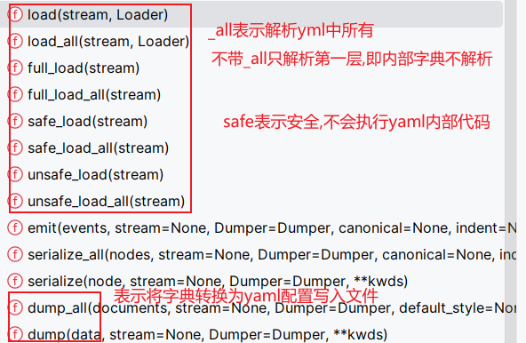

> 自定义解析的Loader是'BaseLoader', 'FullLoader', 'SafeLoader', 'Loader', 'UnsafeLoader'

## 16.2 大文件怎么办?

1. 文件分块

2. 流式读取读取,利用迭代器

   ```python
   with open(yml文件,'r') as f:
       for cn in yaml.safe_load_all(f)
       	print(cn)
   ```

# 17. pytest注意事项

**直接导入另一个模块用例的方法/类,会导致被导入的,模块测试用例反复被执行,可以将其充分到工具类中**

# 18. 接口自动化测试框架的封装

1. yaml文件如何实现接口管理封装

   如果要做接口管理必须借助`debug_talk.py`,并支持**正则表达式提取,json提取** 如access-token

2. yaml文件如何实现动态参数的处理

   使用热加载方式,当yaml需要使用动态参数时,那么可以在`debug_talk.py`文件中写方法调用.(即在读取yml文件时,通过关键字符利用反射原理自动调用对应函数解析)

3. yaml文件如何实现文件上传

   with open()

4. yaml文件如何处理断言?尤其时参数化的断言

   有两种: 分别为equals和contains

   ```yml
   validate:
    - equals: {status_code:205}
    - equals: {expires_in:7200}
    - contains: access_token
   ```

5. yaml文件数据量太大怎么办?

   将数据用例抽取到csv文件,在yml在配置数据文件路径

   ```yml
   parameters:
    #微信access_token获取 示例
    # 左边的键值表示每个字段拼接的name appid secret,...与csv文件对应
    name-appid-secret-grant_type-assert_str: data/get_token.csv
   ```

   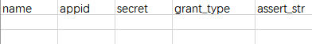

6. 接口自动化框架的扩展,如加密接口,签名接口,自定义的功能接口

# 19. 总结

1. excel测试用例数据库驱动(一般用于web自动化而不是接口,因为数据类型)
2. csv测试用例数据驱动(一般用于web自动化而不是接口,因为数据类型)
3. 日志
4. 每个用例一个yml文件

# 20. allure自带的装饰器,用于测试报告查看

+ `@allure.suite("指定测试用例所属的测试套件")` 类

+ ` @allure.sub_suite("指定测试用例的子套件") `方法

+ `@allure.feature("指定测试用例的功能点") `方法 **对应测试类,测试模块**

+ `@allure.story("指定测试用例的具体故事(用户场景)")`方法 **对应测试场景,多个测试用例的集合**

+ `@allure.title("为测试用例指定一个自定义标题")` 方法 **单个测试用例的标题**

+ `@allure.description("为测试用例提供详细描述")`方法

+ `@allure.step("指定测试步骤,并为报告中的每一步添加描述")`方法

  ```python
  with allure.step("1.这一步干什么..."):
      业务代码
  with allure.step("2.这一步干什么..."):
      业务代码
  ```

+ `@allure.issue("将测试用例连接到某个问题追踪系统,如jira")` 方法

+ `@allure.link("添加一个测试用例相关的链接")`方法

+ `@allure.severity("指定测试用例的严重程度")`方法 如blocker,critical,normal,minor,trivial

+ `@allure.environment("指定测试用例的环境信息,如生成环境")`方法

+ `@allure.dynamic.xxx`这里的xxx代表上面的方法,表示动态的调用

> 装饰器其实就是函数,所以你可以在**函数内部手动的调用**,而不要死板的以为必须加`@`
>
> ```python
> @allure.title(标题)
> def test_____(self)
>  allure.dynamic.title(动态标题)# 会覆盖装饰器的标题
>  .....
> ```

# 21. allure报告注意点

## 21.1 根据csv数据,动态更新测试用例标题

装饰器其实就是函数,所以你可以在**函数内部手动的调用**,而不要死板的以为必须加`@`

```python
@allure.title(标题)
def test_____(self)
 allure.dynamic.title(动态标题)# 会覆盖装饰器的标题
 .....
```

## 21.2 在测试用例中展示测试步骤

```python
def test_xxxx(self):
    with allure.step("1.这一步干什么..."):
        业务代码
    with allure.step("2.这一步干什么..."):
        业务代码
```

## 21.3 在测试步骤中展示每一步的日志

```python
def test_get_access_token(self, csv_obj):
    with allure.step("1.根据csv数据文件,动态更新测试标题"):
        allure.dynamic.title(csv_obj.get("name"))
        allure.attach("1.根据csv数据文件,动态更新测试标题", name="Log", attachment_type=allure.attachment_type.TEXT)
```

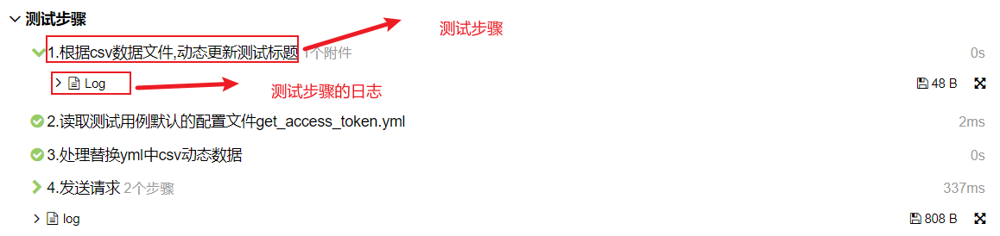

## 21.4 捕获测试用例的stdout和stderr日志

借助pytest夹具`capsys`实现

```python
def test_xxxx(self,capsys):
    xxxx
    # 捕获 stdout 和 stderr
    captured = capsys.readouterr()
    allure.attach(captured.out, name="stdout", attachment_type=allure.attachment_type.TEXT)
    allure.attach(captured.err, name="stderr", attachment_type=allure.attachment_type.TEXT)
```

**实际业务代码:**

```python
@pytest.mark.parametrize("csv_obj",
                             FileTool.read_data_csv_to_dict(os.path.dirname(__file__), "get_access_token.csv"))
    def test_get_access_token(self, capsys, csv_obj):
        # 指定动态标题
        with allure.step("1.根据csv数据文件,动态更新测试标题"):
            allure.dynamic.title(csv_obj.get("name"))
            self.log.debug("1.根据csv数据文件,动态更新测试标题") #捕获不到
            allure.attach("1.根据csv数据文件,动态更新测试标题", name="Log", attachment_type=allure.attachment_type.TEXT)
        with allure.step("2.读取测试用例默认的配置文件get_access_token.yml"):
            print("2.读取测试用例默认的配置文件get_access_token.yml") # 成功捕获到stdout
            config = FileTool.hot_load_read_yml(
                FileTool.get_data_file_path(os.path.dirname(__file__), "get_access_token.yml")
            )
        with allure.step("3.处理替换yml中csv动态数据"):
            sys.stderr.write("3.处理替换yml中csv动态数据") # 成功捕获到stderr
            config = FileTool.replace_csv_value(csv_obj, config)
        # print(config)
        with allure.step("4.发送请求"):
            RequestTool.request(config)

        # 捕获 stdout 和 stderr (必须放在最后面)
        captured = capsys.readouterr()
        allure.attach(captured.out, name="stdout", attachment_type=allure.attachment_type.TEXT)
        allure.attach(captured.err, name="stderr", attachment_type=allure.attachment_type.TEXT)
```

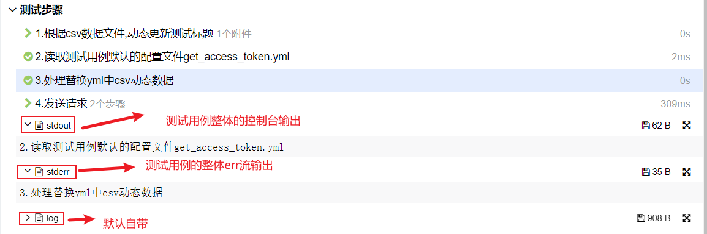

> 1. 借助pytest夹具`capsys`和具体代码(**捕获代码必须放在测试用例的最后面,才能捕获到**)
> 2. 只能捕获`print`,`sys.stderr`,`sys.stdout`
> 3. 无法捕获`logging`日志

## 21.5 allure修改测试报告logo

将你要的的文件如:`logo.png`放到`allure-2.30.0\plugins\custom-logo-plugin\static`中,然后修改`styles.css`

```css
.side-nav__brand {
  background: url('logo.png') no-repeat left center !important;      #url括号内写的就是自己图片的名字，我这里的是logo.png
  margin-left: 10px;
  height: 40px;
  background-size: contain !important;
}
.side-nav__brand span{
    display: none;
}
.side-nav__brand:after{
    content: "yhrDemo";    #这是的内容对应的是我logo后面的内容，在接下来的截图中可以看到，如果不写这个样式，默认的就是allure
    margin-left: 20px;
  
}
```

> 记得在配置文件中使用该插件`allure-2.30.0\config\allure.yml`
>
> ```yml
> plugins:
>   - junit-xml-plugin
>   ...
>   - custom-logo-plugin #这个插件
> ```

# 22. pytest运行流程

+ 引导

+ 初始化

+ 收集阶段

  pytest首先会遍历目录,子目录,模块和类来收集测试用例.在这个阶段会识别`@pytest.mark.parametize`装饰的测试用例,并根据提供的参数集生成多个测试用例实例

  > 所以如果参数是从文件如csv中读取的,那么**必须保证测试数据在执行测试用例前就有**,否则就会跳过(因为读不到参数数据)

+ 执行阶段

# 23. ==pytest的钩子函数==

参考文档:

+ [API Reference - pytest documentation](https://docs.pytest.org/en/stable/reference/reference.html#hooks)
+ [Pytest权威教程21-API参考-04-钩子(Hooks) - 韩志超 - 博客园 (cnblogs.com)](https://www.cnblogs.com/superhin/p/11733499.html#pytest_collect_filepathparent)
+ [《pytest测试指南》-- 附录2 pytest hook介绍 | Transcendent (gavin-wang-note.github.io)](https://gavin-wang-note.github.io/2024/06/08/pytest_test_guide_appendice_2_pytest_hook/#2-2-3-pytest-runtest-logstart)

钩子函数即Hook函数,是pytest为了用户更好的去扩展开发而预留的一些函数.在pytest测试执行的生命周期中特点的阶段会**自动执行**

利用这些钩子函数可以去开发插件,和在`conftest.py`中去实现这些钩子.每个钩子函数可以在多个插件中实现,每个钩子和执行函数比为`1:N`

**按照函数功能分(6种):**

+ `@pytest.hookspec` 用于定义钩子函数的规范(如签名,参数类型和用途等).类似于java接口(**没有具体的实现,一般由框架开发者指定**) 
+ `@pytest.hookimpl` 用于实际实现钩子函数的功能(**有具体实现,一般由框架开发者和插件作者使用**)
+ **初始化钩子**
+ **引导/启动钩子**
+ **用例收集钩子**
+ **用例执行钩子**
+ **报告钩子**
+ **调试钩子**

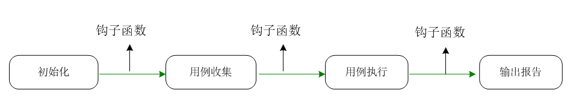


## 23.0 `@pytest.hookspec`和`@pytest.hookimpl`

### 23.0.1 简介

+ `@pytest.hookspec`和`@pytest.hookimpl`是一组规范和实现
+ pytest内置钩子函数(官方文档列出)可以不用`@pytest.hookimpl`,因为他们是框架的一部分.但是自定义插件中`@pytest.hookspec`和`@pytest.hookimpl`必须同时出现,才能正确识别钩子函数
+ `@pytest.hookspec`和`@pytest.hookimpl`装饰的函数名,形参可以不要求一致(但是pytest中的钩子函数规定必须一致)
+ `@pytest.hookspec`的参数
  + **`firstresult`(布尔值)**：为True时会在第一个返回值为非None时停止
  + **`historic`(布尔值)**：为True时,每次调用钩子都会被记住,并在调用后注册的插件上重放
  + **`warn_on_impl`(警告类)**：每次执行该钩子时会发出指定的警告
  + **`warn_on_impl_args`({参数:警告})**：每次执行该钩子对发出携带指定参数的对于警告
+ `@pytest.hookimpl`的参数
  + **`hookwrapper`(布尔值)**：包装钩子函数，允许在执行前后插入操作(搭配yield)。
  + **`tryfirst`(布尔值)**：确保钩子函数在所有其他实现之前执行。
  + **`trylast`(布尔值)**：确保钩子函数在所有其他实现之后执行.
  + **`optionalhook`(布尔值)**：标记钩子为可选，表示该钩子没有实现时也不会报错。
  + **`specname`(字符串)**：指定钩子的名称,在注册期间用来代替函数名称。

### 23.0.2 在pytest的自定义插件中应用

参考文档: [编写钩子函数 - pytest documentation](https://docs.pytest.org/en/stable/how-to/writing_hook_functions.html#declaring-new-hooks)

`@pytest.hookspec`和`@pytest.hookimpl`在pytest中只能用于pytest内置hook函数,无法用于自定义钩子函数

自定义钩子函数必须使用`pytest_addhooks`内置钩子函数注册和`pluginmanager.hook.自定义钩子函数()`来调用

```python
#my_app.tests.sample_hook.py
#编写钩子函数
def pytest_my_hook(config):
    """
    Receives the pytest config and does things with it
    """
```


```python
#注册钩子函数
def pytest_addhooks(pluginmanager):
    """This example assumes the hooks are grouped in the 'sample_hook' module."""
    from my_app.tests import sample_hook

    pluginmanager.add_hookspecs(sample_hook) #必须是模块
#使用钩子函数
@pytest.fixture()
def my_fixture(pytestconfig):
    # call the hook called "pytest_my_hook"
    # 'result' will be a list of return values from all registered functions.
    result = pytestconfig.hook.pytest_my_hook(config=pytestconfig)
```


## 23.1 初始化钩子

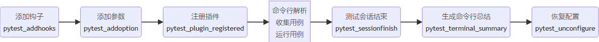

### 23.1.1 pytest_addoption

***注册argparse-style选项和ini-style配置值,在测试运行开始时调用一次***

**钩子函数:**

+ `pytest_addoption(parser,pluginmanager) ` **只在自定义插件中可用(先被调用)**
+ `pytest_addoption(parser)` **只在根目录conftest文件中可用(后被调用)**

**参数:**

+ parser  参数解析器(`_pytest.config.argparsing.Parser`) **命令行参数**应该调用`parser.addoption()`方法,**ini文件**应该调用`parser.addini()`
+ pluginmanager 插件管理器(`_pytest.config.PytestPluginManager`),可用于安装`hookspec()`和`hookimpl()`并且**可以调用另一个插件的hook方法**,来改变添加命令行参数的方式

参数可以被配置类`Config`访问

+ `config.getoption(name)`来获取添加的命令行参数
+ `config.getini(name)`来获取ini风格的参数

配置config对象通过`.config`在内部很多对象上传递,或者从`pytestconfig`夹具获取

**使用场景: **

+ 自定义额外的配置项,如指定测试环境,设置日志级别,指定测试数据
+ 搭配插件使用如allure的`--clean-alluredir`
+ 根据命令行参数指定配置如数据库地址账户密码,服务接口地址等
+ ...

#### Use in conftest plugins[¶](https://docs.pytest.org/en/stable/reference/reference.html#id5)

If a conftest plugin implements this hook, it will be called immediately when the conftest is registered.

This hook is only called for [initial conftests](https://docs.pytest.org/en/stable/how-to/writing_plugins.html#pluginorder).

> 可用于自定义插件和根目录conftest.py文件
>
> 注意：这个钩子与之不相容`hookwrapper=True`。

### 23.1.2 pytest_addhooks

***在插件注册时调用,允许通过调用添加新的钩子函数***

**钩子函数:**

+ `pytest_addhooks(pluginmanager)`

**参数:**

+ `pluginmanager` 插件管理器(`_pytest.config.PytestPluginManager`)

在插件注册时调用,允许通过调用添加新的钩子函数`pluginmanager.add_hookspecs(module_or_class,prefix)`

**使用场景:**

+ 添加插件

#### Use in conftest plugins[¶](https://docs.pytest.org/en/stable/reference/reference.html#id6)

If a conftest plugin implements this hook, it will be called immediately when the conftest is registered.

> 可用于自定义插件和根目录conftest.py文件
>
> 注意：这个钩子与之不相容`hookwrapper=True`。

### 23.1.3 pytest_configure

***允许插件和conftest执行初始化配置***

**钩子函数:**

+ `pytest_configure(config)`

**参数:**

+ `config` pytest全局配置器(`_pytest.config.Config`)

**使用场景:**

+ 自定义配置

#### Use in conftest plugins

This hook is called for every [initial conftest](https://docs.pytest.org/en/stable/how-to/writing_plugins.html#pluginorder) file after command line options have been parsed. After that, the hook is called for other conftest files as they are registered.

> 可用于自定义插件和根目录conftest.py文件
>
> 注意：这个钩子与之不相容`hookwrapper=True`。

### 23.1.4 pytest_unconfigure

***在退出测试过程前调用***

**钩子函数:**

+ `pytest_unconfigure(config)`

**参数:**

+ `config` pytest全局配置器(`_pytest.config.Config`)

**使用场景:**

+ 自定义配置

#### Use in conftest plugins

Any conftest file can implement this hook.

> 可用于自定义插件和任何目录下conftest.py文件
>
> 注意：这个钩子与之不相容`hookwrapper=True`。

### 23.1.5 pytest_sessionstart

***在创建Session对象后,执行收集前,和进入运行测试循环前调用***

**钩子函数:**

+ `pytest_sessionstart(session)`

**参数:**

+ `session` pytest Session对象(`_pytest.main.Session`)

**使用场景:**

+ 自定义配置

#### Use in conftest plugins[¶](https://docs.pytest.org/en/stable/reference/reference.html#id9)

This hook is only called for [initial conftests](https://docs.pytest.org/en/stable/how-to/writing_plugins.html#pluginorder).

> 可用于自定义插件和根目录conftest.py文件
>
> 注意：这个钩子与之不相容`hookwrapper=True`。

### 23.1.6 pytest_sessionfinish

***在创建Session对象后,执行收集前,和进入运行测试循环前调用***

**钩子函数:**

+ `pytest_sessionfinish(session,exitstatus)`

**参数:**

+ `session` pytest Session对象(`_pytest.main.Session`)
+ `exitstatus` 退出状态码(`int`)

**使用场景:**

+ 自定义配置

#### Use in conftest plugins[¶](https://docs.pytest.org/en/stable/reference/reference.html#id10)

Any conftest file can implement this hook.

> 可用于自定义插件和任何目录conftest.py文件
>
> 注意：这个钩子与之不相容`hookwrapper=True`。

### 23.1.7 pytest_plugin_registered

***一个新的pytest插件已经注册***

**钩子函数:**

+ `pytest_plugin_registered(plugin,plugin_name,manager)`

**参数:**

+ `plugin`插件模块或实例(`_pytest.config.PytestPluginManager`)
+ `plugin_name` 插件名字
+ `manager` pytest插件管理器(`_pytest.config.PytestPluginManager`)

**使用场景:**

+ 自定义配置

#### Use in conftest plugins

If a conftest plugin implements this hook, it will be called immediately when the conftest is registered, once for each plugin registered thus far (including itself!), and for all plugins thereafter when they are registered.

> 可用于自定义插件和任何目录conftest.py文件
>
> 注意：这个钩子与之不相容`hookwrapper=True`。

## 23.2 引导/启动钩子

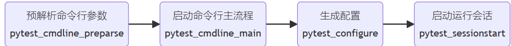

### 23.2.1 pytest_load_initial_conftests

***为了在解析命令行参数前加载b并初始化conftest文件***

**钩子函数:**

+ `pytest_load_initial_conftests(early_config,parser,args)`

**参数:**

+ `early_config` pytest配置对象(`_pytest.config.Config`)
+ `parser` 参数解析器(`_pytest.config.argparsing.Parser`)
+ `args` 命令行参数

**使用场景: **

1. 如根据命令行参数加载不同的配置文件
2. 自定义设置

**注意:**

1. 新增的命令行参数需要搭配`pytest_addoption` 将参数保存起来,否则会报错
2. 另一种方法,在`pytest_load_initial_conftests`内部调用`args.pop()`将未知参数丢弃(需要在最后一个)

#### Use in conftest plugins[¶](https://docs.pytest.org/en/stable/reference/reference.html#use-in-conftest-plugins)

This hook is not called for conftest files.

> 可用于自定义插件
>
> 注意：这个钩子与之不相容`hookwrapper=True`。

### 23.2.2 pytest_cmdline_parse

***返回初始化的Config配置对象,解析指定的参数args***

**钩子函数:**

+ `pytest_cmdline_parse(pluginmanager,args)`

**参数:**

+ `pluginmanager`  pytest插件管理器(`_pytest.config.PytestPluginManager`)
+ `args` 命令行参数

在第一个非空结果处停止

**注意: **

1. 该hook方法只会在使用`pytest.main`进行测试且传递`plugins`参数才会被调用

#### Use in conftest plugins

This hook is not called for conftest files.

> 可用于自定义插件
>
> 注意：这个钩子与之不相容`hookwrapper=True`。

### 23.2.3 pytest_cmdline_main

***用于执行主命令行动作***

**钩子函数:**

+ `pytest_cmdline_main(config)`

**参数:**

+ `config` pytest配置对象(`_pytest.config.Config`)

默认实现将调用`configure hooks`和`pytest_runtestloop`.在第一个非空结果处停止

**注意: **

1. 该hook方法只会在使用`pytest.main`进行测试且传递`plugins`参数才会被调用

#### Use in conftest plugins[¶](https://docs.pytest.org/en/stable/reference/reference.html#id3)

This hook is only called for [initial conftests](https://docs.pytest.org/en/stable/how-to/writing_plugins.html#pluginorder).

> 可用于自定义插件和根目录conftest.py文件
>
> 注意：这个钩子与之不相容`hookwrapper=True`。

## 23.3 收集钩子

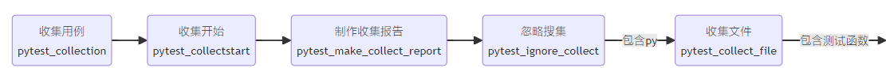


### 23.3.1 pytest_collection

***执行给定session会话的收集阶段***

**钩子函数:**

+ `pyetst_collection(session)`

**参数:**

+ `session` pytest Session对象(`_pytest.main.Session`)

在第一个非空结果处停止

**注意: **

1. 该hook方法只会在使用`pytest.main`进行测试且传递`plugins`参数才会被调用

#### Use in conftest plugins[¶](https://docs.pytest.org/en/stable/reference/reference.html#id12)

This hook is only called for [initial conftests](https://docs.pytest.org/en/stable/how-to/writing_plugins.html#pluginorder).

> 可用于自定义插件和根目录conftest.py文件
>

### 23.3.2 pytest_ignore_collect

***忽略给定路径path的集合(返回True忽略;返回None让其他插件忽略path集合;返回False强制不忽略该path集合同时也不让其他插件忽略该path集合)***

**钩子函数:**

+ `pyetst_ignore_collection(collection_path, path, config)`

**参数:**

+ `collection_path` 要分析的路径(`pathlib.WindowsPath`)
+ `path `要分析的路径(`_pytest._py.path.LocalPath`),已过时
+ `config `pytest配置对象(`_pytest.config.Config`)

在第一个非空结果处停止

#### Use in conftest plugins[¶](https://docs.pytest.org/en/stable/reference/reference.html#id13)

Any conftest file can implement this hook. For a given collection path, only conftest files in parent directories of the collection path are consulted (if the path is a directory, its own conftest file is *not* consulted - a directory cannot ignore itself!).

> 可用于自定义插件和任何目录conftest.py文件
>

### 23.3.3 pytest_collect_directory

***为指定目录创建一个收集类Collector,如果不相关则为None***

**钩子函数:**

+ `pytest_collect_directory(path, parent)`

**参数:**

+ `path `要分析的路径(`pathlib.WindowsPath`)
+ `parent`session会话(`_pytest.main.Session`)

最好应该返回`Directory`的子类,但是这也不是必须的.对于新节点必须要有`parent`参数用来指定其父节点.在第一个非空结果处停止

#### Use in conftest plugins[¶](https://docs.pytest.org/en/stable/reference/reference.html#id14)

Any conftest file can implement this hook. For a given collection path, only conftest files in parent directories of the collection path are consulted (if the path is a directory, its own conftest file is *not* consulted - a directory cannot collect itself!).

> 可用于自定义插件和根目录conftest.py文件
>

### 23.3.4 pytest_collect_file

***为指定路径创建一个收集类Collector,如果不相关则为None***

**钩子函数:**

+ `pytest_collect_file(file_path, path, parent)`

**参数:**

+ `file_path`要分析的路径(`pathlib.WindowsPath`)
+ `path `要收集的路径(`_pytest._py.path.LocalPath`)已过时
+ `parent`目录 (`_pytest.main.Dir`)

最好应该返回`File`的子类,但是这也不是必须的.对于新节点必须要有`parent`参数用来指定其父节点.在第一个非空结果处停止

#### Use in conftest plugins[¶](https://docs.pytest.org/en/stable/reference/reference.html#id15)

Any conftest file can implement this hook. For a given file path, only conftest files in parent directories of the file path are consulted.

> 可用于自定义插件和根目录conftest.py文件

### 23.3.5 pytest_pycollect_makemodule

***为指定路径返回一个pytest.Module收集类或None***

**钩子函数:**

+ `pytest_pycollect_makemodule(module_path, path, parent)`

**参数:**

+ `module_path`模块要收集的路径(`pathlib.WindowsPath`)
+ `path `模块要收集的路径(`_pytest._py.path.LocalPath`)已过时
+ `parent`目录 (`_pytest.main.Dir`)

将为每个匹配的测试模块路径调用次钩子函数,如果要为不匹配的文件创建测试模块作为测试模块,则需要使用`pytest_collect_file`钩子函数.在第一个非空结果处停止

#### Use in conftest plugins[¶](https://docs.pytest.org/en/stable/reference/reference.html#id16)

Any conftest file can implement this hook. For a given parent collector, only conftest files in the collector’s directory and its parent directories are consulted.

> 可用于自定义插件和任何目录conftest.py文件


## 23.4 执行钩子

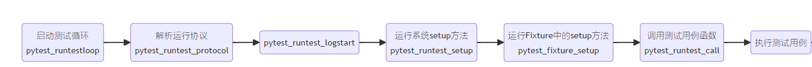


## 23.5 报告钩子

## 23.6 调试钩子


## 23.7 pytest钩子函数流程

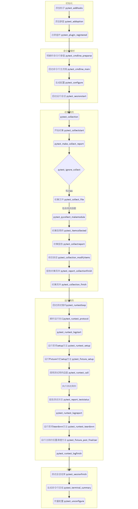

# 24. allure的钩子函数

# 25. pytest自定义插件
