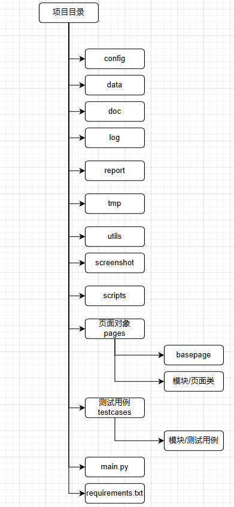

# 1. selenium的Options和Service区别

+ `Options`是用于设置chrome的启动参数,如`--headless`,`--incognito	`等等
+ `Service是`用于设置chromedriver启动参数,如`port`,`log_output`等等

> 顺序:先启动chromedriver然后启动chrome

# 2. 深入了解Options

用于设置启动chrome的启动参数

```python
from selenium.webdriver.chrome.options import Options
from selenium import webdriver

options = Options()
options.add_argument("--incognito")

self.driver = webdriver.Chrome(service=service, options=options)
```

调用`Options.addargument()`增加参数,最后会将所有的options汇总到`{"capabilities": {}}`中在创建`session`时传递

```json
"capabilities": {
    "firstMatch": [
        {}
    ],
    "alwaysMatch": {
        "browserName": "chrome",
        "platformName": "any",
        "goog:chromeOptions": {
            "detach": true,
            "extensions": [],
            "binary": 222,//自定义二进制文件位置,如electron
            "args": [
                "--disable-blink-features=AutomationControlled"
            ]
        }
    }
}
```

> autoit中将chromedriver和electron软件关联起来就是在这儿

# 3. 深入了解Service

用于设置chromedriver的启动参数

```python
from selenium import webdriver
from selenium.webdriver.chrome.service import Service
# 可以通过chromedriver.exe --help获取
service_args = [
    "--log-level=ALL",
    "--append-log",  # 日志追加模式
    "--readable-timestamp",  # 日志可读性时间戳
    "--enable-chrome-logs",  # 一个单独的dos窗口显示浏览器日志
]
service = Service(
    executable_path=r"C:\Program Files\Google\Chrome\Application\chromedriver.exe",
    port=8519,
    log_output="test.log",
    service_args=service_args,
    # creationflags=subprocess.CREATE_NEW_CONSOLE #windows设置显示dos很难,库写死了不显示
)
self.driver = webdriver.Chrome(service=service, options=options)
```

# 9. selenium三种等待

+ `time.slee(3)`强制等待

+ `driver.implicitly_wait(3)` 隐式等待

  是一种全局设置,适应于整个会话的每个位置元素调用.如果元素未找到,会等待指定元素出现直到超时.(并不是等待网页彻底加载完成,应该用`readyState`).默认为`0`不启用

+ `WebDriverWait(driver,timeout=3).until(lambda d: revealed.is_displayed())` 显示等待 

  是一种针对具体元素局部设置,如果元素未找到,会等待指定元素出现直到超时

> 警告:不要混用隐式等待和显示等待,这样可能会导致不可预测的等待时间

# 10. selenium的pom模式


