# 1. 功能测试基础理论

## 1.1 软件测试基础概念和软件测试分类

### 1.1.1 什么是软件

软件是**计算机程序,程序所用的数据**以及**有关文档资料**的集合,分为:

+ 系统软件: 是用于管理和控制计算机硬件和软件资源的软件. 如文件管理,网络管理
+ 应用软件: 用于满足特定需求的软件. 如多媒体播放器

### 1.1.2 软件测试是什么?

**软件测试**: 使用**人工和自动化**手段来**运行或测试**某个系统的**过程**.

### 1.1.3 软件测试的目的

+ 为了发现程序存在的代码或业务逻辑漏洞
+ 为了检验是否符合用户需求
+ 为了提高用户体验

### 1.1.4 软件测试分类

#### 1.1.4.1 按测试的阶段分

+ **单元测试**  

  一般由开发人员进行测试,确保各单元正确执行.一般为某个模块,或具体到类,方法.

+ **集成测试**

  将多个相关联的模块整合一起测试,为了测试模块间接口是否正确,数据是否可以传递.(如用户注册登录)

+ **系统测试**

  结合具体运行环境,将整个服务搭建起来.按照**需求规格说明书**测试软件是否符合用户需求,系统运行是否存在漏洞.

  在此阶段测试人员根据测试用例进行系统测试

+ **UAT用户验收测试**

  用户验收时进行的测试,一般分为Alpha测试和Beta测试

  + Alpha测试(内部测试) 将客户请到公司进行测试,测试环境由开发方控制.测试时间集中,测试人不多,一般为客户,测试和公司内部人员
  + Beta测试(外部测试) 公测,测试时间不集中,测试人较多

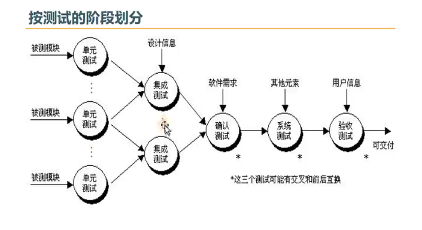

#### 1.1.4.2 按照测试技术(是否查看代码)分

+ **黑盒测试**

  也叫做**功能测试**,**不需要**程序内部逻辑代码,**只需要**关注外部的输入输出.

+ **白盒测试**

  也叫做**结构测试**,**只需要**关注程序内部逻辑代码,**不需要**关注外部的输入输出

+ **灰盒测试**

  也叫**半透明测试**,**既需要**关注程序内部逻辑代码,**也需要**关注外部的输入输出

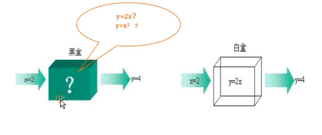

#### 1.1.4.3 按照被测试对象是否运行分

+ **动态测试**

  运行被测试系统而进行的测试

+ **静态测试**

  不需要运行被测试系统而进行的测试(如界面检查,文档检查,code review)

#### 1.1.4.4 按照测试手段分

+ **手工测试**
+ **自动化测试**

#### 1.1.4.5 按照测试内容划分

+ **功能测试**  验证软件的业务功能是否符合需求
+ **界面测试**   系统的界面是否和原型图一致
+ **文档测试**  对系统的相关文档进行检查测试
+ **安全测试**    对系统的安全进行测试
+ **兼容性测试**  被测系统在不同环境下是否允许正常
+ **易用性测试 **  被测系统是否操作方便,容易使用
+ **性能测试(负载测试/压力测试)**    某个特定的时间,用户的数据量激增,软件是否正常

#### 1.1.4.6 其他测试分类

+ **冒烟测试**   在进行系统测试前,测试系统的主要核心功能是否正常执行
+ **回归测试**    开发对已存在的问题的功能进行修改后,再一次的测试
+ **探索性测试/自由测试**   根据自己的项目经验而进行的随意测试
+ **灰度测试**  在某项产品或应用发布前,选择**特定人群**试用,**逐步扩大**试用者数量,以便及时发现和纠错
+ **A/B测试**  新功能先给A组用户更新,看看反馈再给B组用户修改后更新使用(随机分组)

## 1.2 软件测试流程及相关文档编写规范

### 1.2.1 软件生命周期

软件生命周期(SDLC,System Development Life Cycle)是**软件开始研制**到**最终被废弃不用**所经历的各个阶段.

***软件生命周期各阶段: ***

+ **问题的定义和规划** 

  确定软件的开发目的和可行性,指定项目整体开发计划

+ **需求分析**

  在软件开发可行的情况下,对软件需要实现的各个功能进行详细的分析,明确客户的需求,最终输出**需求规格说明书终版(原型图)**,提交评审

+ **设计**

  把需求分析的结果转为软件结构和数据结构,形成系统架构

  + **概要设计** 主要是架构的实现,指搭建架构,表述各模块功能,模块接口连接和数据传递的实现等业务
  + **详细设计** 对概要设计中的表述各个模块进行深入分析,其中需要包含数据库设计

+ **编码 **

  按照设计好的模块功能表,开始编写业务模块代码

+ **软件测试**

  主要是**白盒测试**+**黑盒测试**,并按照测试计划进行:单元测试,集成测试,系统测试,验收测试

+ **运维** 运维人员进行维护,根据需求增删优化

### 1.2.2 软件生命周期模型

#### 1.2.2.1 瀑布模型

规定了他们自上而下, 相互衔接的固定次序,如同瀑布流水,逐级下落,具有依赖性和顺序性.

> **特点**: 自上而下,有顺序性
>
> **优点:**
>
> + 文档维护容易
> + 固定成本
> + 可复制性
> + 易于追踪,开发过程清晰,便于管理和控制
>
> **缺点**: 
>
> + 测试介入比较晚,导致了回溯成本高
> + 测试周期比较长
> + 不适应需求变化,一旦变化就需要重新开始整个开发过程
> + 更长的交付时间

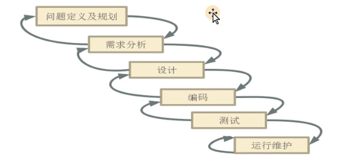

#### 1.2.2.2  V/RAP/快速应用开发模型

快速应用开发(RAD, Rap Application Development),又称V模型. 它通过开发和测试同时进行的方式来缩短开发周期,提高开发效率.

> 测试在需求开始阶段就介入了
>
> **优点:**
>
> + 可以提起规划测试活动,保证测试的全面性和有效性
> + 减少重复工作,提高开发效率
> + 可以在每个开发阶段进行质量控制,确保每个阶段的质量标准得到满足
>
> **缺点:** 
>
> + 开发周期长,需要大量时间和人力资源
> + 对需求的变化敏感,一旦需求发生变化,就需要重新进行前期的规划和设计
> + 缺乏灵活性,不适应快速变化的市场

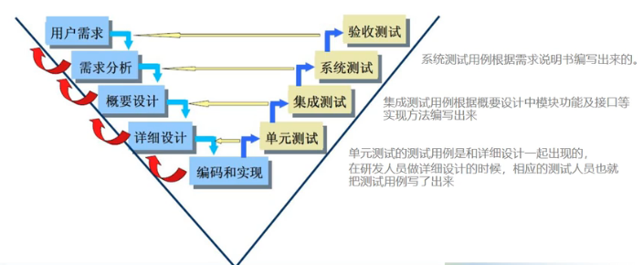

#### 1.2.2.3 敏捷开发模型

即将一个大项目分为多个相互联系但可以独立运行的小项目,并分别完成,使得软件一直处于可使用状态(抢占市场)

> 特点: 迭代,增量,自适应性,灵活性,协作和持续性
>
> **优点:**
>
> + 快
> + 提高用户满意度
> + 增强团队协作
> + 减少项目风险和成本
> + 提高产品质量和可维护性
>
> **缺点:**
>
> + 需求不清晰
> + 进度难以控制
> + 文档不完整
> + 容易出现技术债

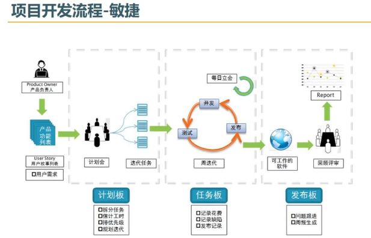

### 1.2.3 软件测试流程(*)

#### 1.2.3.1 软件测试工作流程图

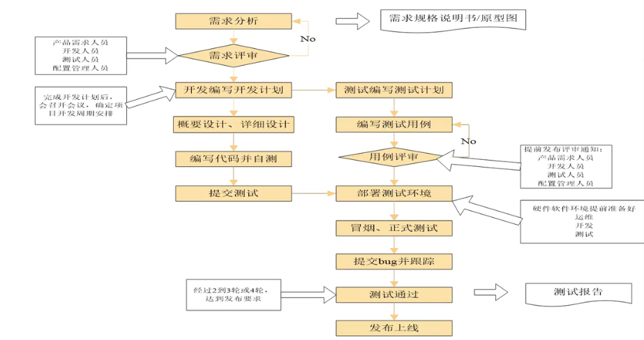

#### 1.2.3.2 软件测试的基本流程(*)

+ **测试需求分析阶段**

  阅读需求,理解需求,主要就是对业务的学习,分析需求点,参与需求评审会议,输出 **项目测试点列表**

+ **测试计划阶段**

  主要任务是编写**测试计划**,参考软件需求规格说明书,项目总体计划,内容包含测试范围(来自需求文档),进度的安排,人力物力的分配,整体测试的策略制,和风险评估与规避措施.

  一般由测试负责人编写

+ **测试设计阶段**

  主要是编写**测试用例**,参考需求文档(原型图),概要设计,详细设计等文档.有疑问的及时和开发,产品经理沟通.

  测试用例写完会进行**评审**

+ **测试执行阶段**

  搭建环境,执行单元测试,冒烟测试,集成测试,黑盒测试,....,回归测试,用户验收测试.并对bug进行追踪,直至解决.**输出bug**

+ **测试评估阶段**

  主要是出**测试报告**,对整个测试的过程和版本质量做一个详细的评估,确认是否可以上线

### 1.2.4 测试需求分析

#### 1.2.4.1 测试需求是什么?

测试需求主要解决"测什么"的问题,一般来自需求规格说明书中原始需求

 测试需求应全部覆盖已定义的业务流程,以及功能和非功能的测试:

**功能需求: **功能测试

**非功能需求: **界面测试,文档测试,易用性测试,安全性测试,兼容性测试,性能测试

#### 1.2.4.2 什么是软件测试需求分析

根据需求规格说明书明确测试的内容,去细分需求即提取测试点.

> 测试点: 软件包含多个功能点,每个功能点包含多个子功能(测试点). 测试点是软件功能细分的最小单元

#### 1.2.4.3 为什么需要软件测试需求

+ 软件测试需求是设计测试用例的依据
+ 有助于保证测试的质量和进度
+ 测试需求是衡量测试覆盖率的重要指标

### 1.2.5 测试用例(*)

#### 1.2.5.1 什么是软件测试用例

测试用例(TestCase)是为项目需求而编制的一组测试输入,执行条件以及预期结果,以便测试某个程序是否满足客户需求.

#### 1.2.5.2 测试用例的重要性

1. 测试用例是软件测试的核心
2. 评估测试结果的基准
3. 保证测试的时候不遗漏测试功能点.
4. 在编写测试用例的过程中可以熟悉需求,对系统架构或业务流程有一个整体的,深入的了解
5. 使得设计更加全面,具有指导性意义

#### 1.2.5.3 测试用例的八大元素(*)

+ **测试编号**  一般为**产品名-测试阶段(it集成测试,st系统测试,uat验收测试)-测试模块-序号**
+ **测试项目**  对应一个功能模块
+ **测试标题**  
+ **测试优先级**
+ **测试前置条件**
+ **测试输入**
+ **操作步骤**
+ **预期结果**
+ 实际结果
+ 备注

> **软件测试的核心是测试用例的编写**

#### 1.2.5.4 测试用例的评审

#### 1.2.5.5 测试用例划分方法(*)

##### 1.2.5.5.1 等价类划分法

一种典型的**黑盒测试**方法,**将所有可能的输入划分为N个子集合**.在该子集合中,所有的输入数据对于揭露软件中的错误都是等效的.

**等价类划分:有效等价类和无效等价类**

> 等价类划分用例设计原则:
>
> + 划分有效及无效等价类,都要为每一个等价类添加唯一的编号
> + 设计一个新的测试用例,使其**尽可能多的覆盖尚未被覆盖的有效等价类**,重复这一步,知道所有的有效等价类都被覆盖(**即用最小的用例覆盖最多的有效等价类**)
> + 设计一个新的测试用例,使其**覆盖尚未被覆盖的无效等价类**,重复这一步,知道所有的有效等价类都被覆盖(**即用最多的用例一一覆盖无效等价类**)

##### 1.2.5.5.2 边界值分析法

边界值分析法是等价类划分法的补充,边界值一般都是从等价类的边缘值去寻找.边界值分析分析的基本思想:**正好等于,刚刚小于,刚刚大于边界的值**

> 边界值的作用:大量经验得出,大量的错误一般都是在边界值的控制上
>
> 边界值的应用场景:**如果需求规定了取值范围或规定了取值的个数时,可利用边界进行测试**

##### 1.2.5.5.3 场景法

通过场景描述的**业务流程(业务逻辑),也包括代码实现逻辑**,设计用例来遍历场景(路径),验证软件系统功能的正确性.

场景法使用:

+ 画出流程图
+ **矩形框**表示步骤(操作,输入,输出结果)
+ **菱形框 **表示判断(是/否)
+ **箭头**表示流经方向

> 注意:场景法的重点是测试流程,因此每个流程用一个用例验证即可,流程测试没有问题并不能说明系统功能没有问题.**还需要针对单步功能进行测试**

##### 1.2.5.5.4 错误推测法(反推法)

基于经验和直觉推测程序中所有可能存在的各种错误,从而针对性的设计测试方法.

要素:**经验,知识,直觉**

##### 1.2.5.5.5 因果图法

##### 1.2.5.5.6 判定表法

##### 1.2.5.5.7 正交实验法

# 2. 网络协议TCP/UDP

# 3. Jmeter

## 3.1 接口测试分类

内部接口: 测试系统内部模块之间的接口,或者被测系统提供给内部系统使用的接口

外部接口: 

+ 被测系统调用外部第三方的接口
+ 系统对外提供的接口

## 3.2 接口架构设计

1. `SOAP`架构,基于XML规范. 基于WebService协议. 特点:接口地址以`?wsdl`结尾
2. `RPC`架构,基于dubbo协议,thrift协调. 如SpringCloud微服务
3. `Restful`架构,基于JSON规范,HTTP协议.

## 3.3 市面上接口测试工具

+ Jmeter+Ant+Git+Jenkins
+ Postman+Newman+Git+Jenkins
+ soapui+apipost+fiddler+charles

## 3.4 Jmeter目录介绍

+ **backups**   脚本备份目录`.jmx`
+ **bin**   存放软件启动脚本和配置文件
+ docs  参考文档Java Docs
+ **extras**  存放与第三方的集成构建文件.如ant和jenkins
+ lib  库文件
+ license  许可证
+ printable_docs 用户手册

## 3.5 Jmeter常用组件

1. **测试计划**    起点,所有组件的容器
2. **线程组**    代表一定数量的用户
3. **取样器**    向服务器发生请求的最小单元
4. **逻辑控制器**   逻辑判断
5. **前置处理器**  
6. **后置处理器**
7. **断言**   用于判断请求是否成功
8. **定时器**
9. **配置元件**  定义配置信息
10. **监听器 **  负载收集结果

一般顺序:

测试计划>线程组>配置元件>前置处理器>定时器>取样器>后置处理器>断言>监听器

## 3.6 Jmeter各组件的作用域(*)

必须组件: **测试计划,线程组,取样器**

辅助组件: 除了必须组件外的所有组件

> **辅助组件作用于父组件,统计组件,以及同级组件下的所有子组件**

## 3.7 Jemeter接口流程

1. 拿到api接口文档,熟悉接口业务,接口地址,鉴权方式, 出入参,错误码...
2. 编写接口测试用例
3. 使用接口测试工具执行
   + 正例: 输入正常入参,查看接口是否成功返回
   + 反例: 
     + 鉴权: 空,错误,鉴权过期,鉴权次数限制
     + 参数: 空,类型错误,长度错误,错误码的覆盖
     + 其他: 黑名单,分页
4. Jmeter+ant+git+jenkins实现持续集成输出接口测试报告.

## 3.8 jmeter走fiddler代理

走代理,代理就可以抓jmeter的请求

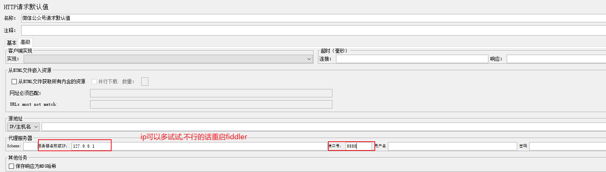

## 3.9 常用组件

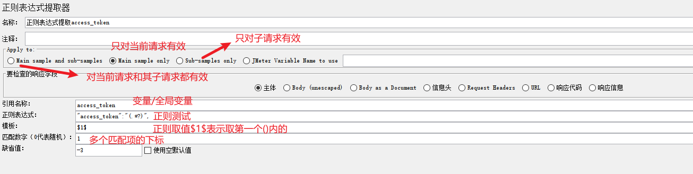

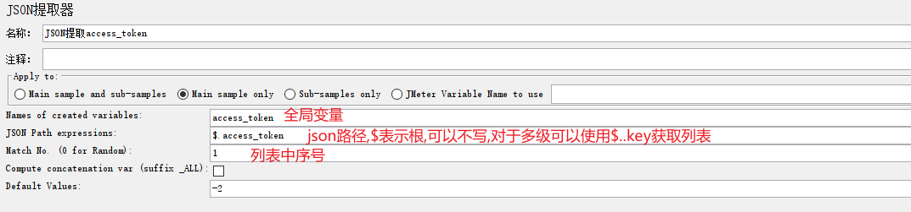

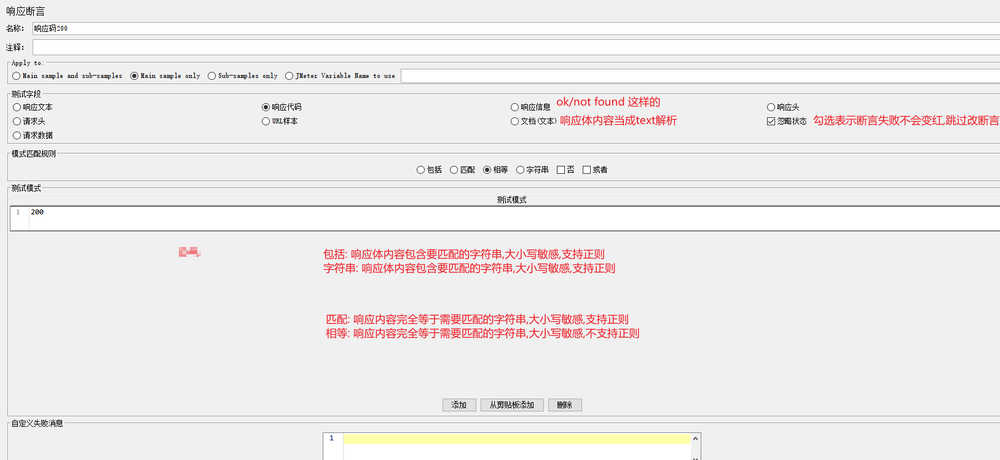

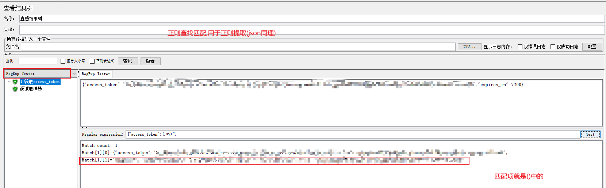

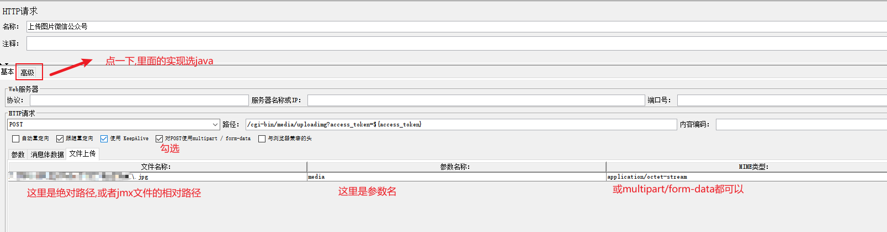

## 3.10 助手对话框

**工具-函数助手对话框(Ctrl+Shift+F1)**

+ 随机数

  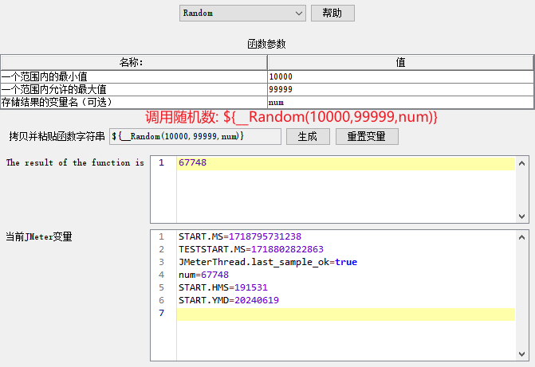

+ 随机字符串

  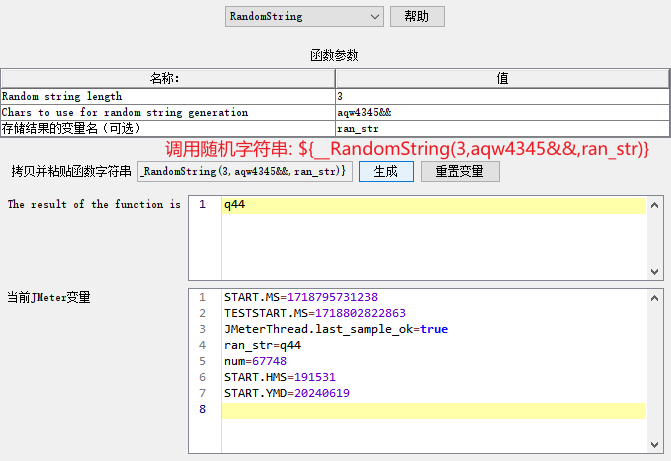

+ UUID

  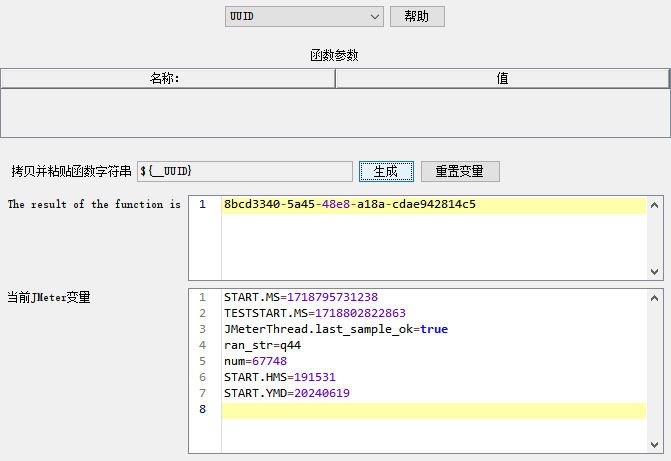

+ ...

## 3.11 csv数据驱动

举例: 以获取微信接口的access_token为例

结构图:

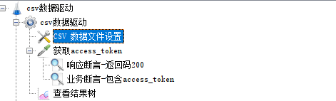

+ 创建线程组,一般**有多少数据用例,就创建几个线程**

  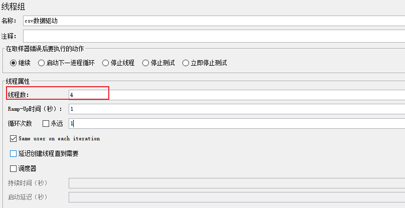

+ 创建csv数据文件,**一组正例,三组反例**

  ```csv
  grant_type,appid,secret,key 
  client_credential,xxx,bbbb,access_token
  ,xxx,bbbb,errcode	
  client_credential,,xxx,errcode
  client_credential,bbbb,,errcode
  ```

  > 第一行表示参数的键,后面几行表示该列键对应的值

+ 创建csv配置项

  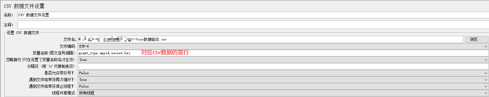

+ 使用csv的变量

  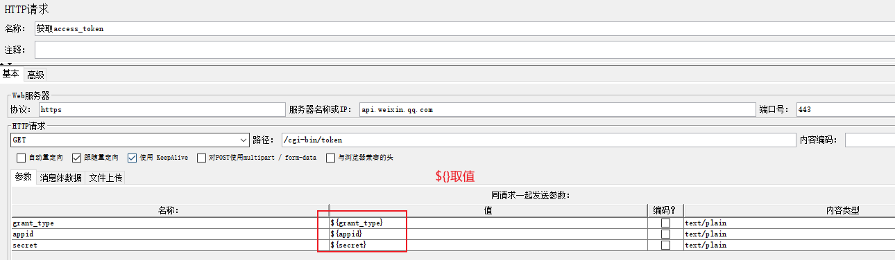

+ 运行测试

  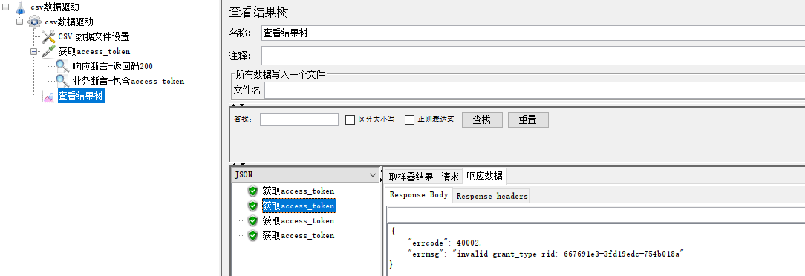

  > 三个失败的也显示成功,因为断言的关键字就是包含错误信息
  >
  > ***新版本jmeter断言成功,不会显示断言,只有失败才会显示内部的断言***

+ 注意

  如果只需要某个接口执行4次,其余接口执行一次,只需要将**线程组的线程数,改为1,将要循环的接口放在while控制器,并设置循环次数为4即可**

## 3.12 jmeter录制

+ **jmeter-右击-添加-非测试原件-HTTP(S)测试脚本记录器**

  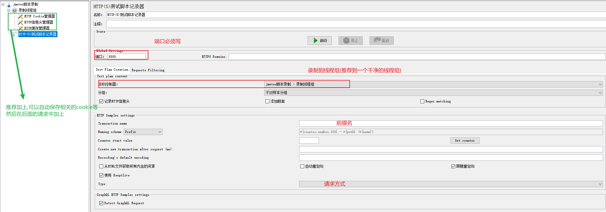

+ 设置排除和包含规则,便于定位需要的请求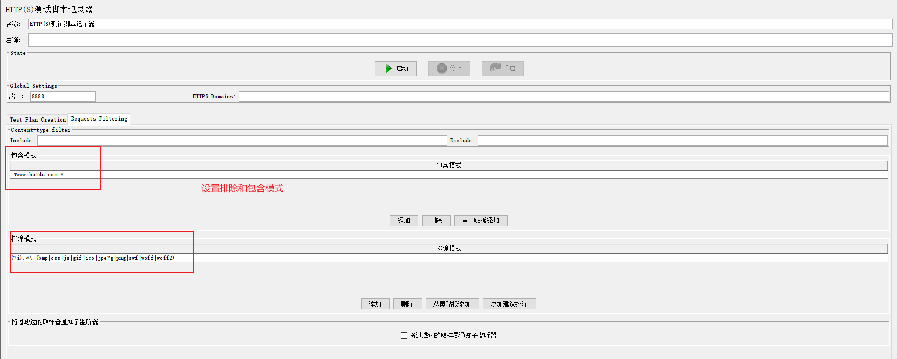

+ 设置本机代理

  浏览器一般在设置中打开计算机代理

  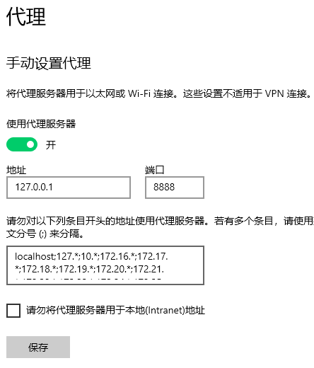

+ 启动jmeter脚本记录

  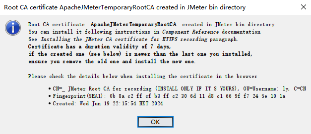
  
  > 提示生成了jmeter证书,在jmeter的bin目录下,导入安装到计算机中即可
  
  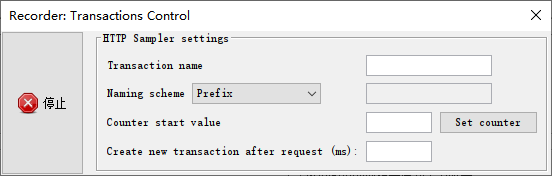
  
+ 安装证书**chrome-隐私和安全-安全-管理证书**

  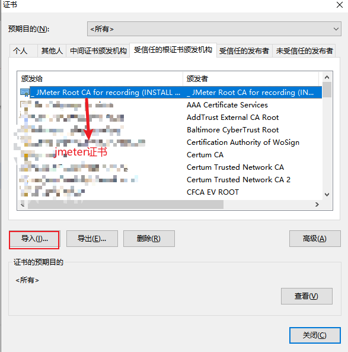

+ 推荐清理缓存,并重启chrome

  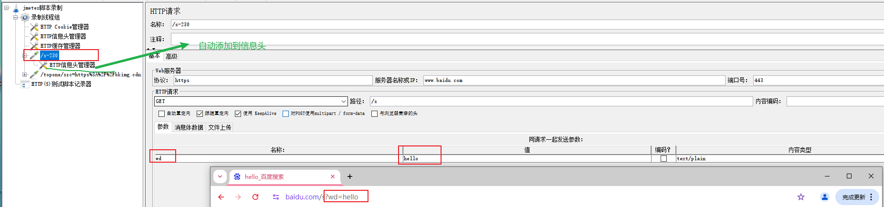

+ 录制完成一定要记得关掉系统代理,免得无法上网

## 3.13 Beanshell

Jmeter测试用的脚本语言解释器

参考手册: jmeter本地目录下`apache-jmeter-5.6.3/printable_docs/usermanual/component_reference.html`

### 3.13.1 内置变量

1. `log` 控制台打印日志  `对应类: org.slf4j.Logger`

  ```java
  log.info("你好,666");//jmeter控制台输出,(可在选项-日志级别查看支持的日志等级)
  log.warn("你好,777");
  log.error("你好,888");
  System.out.println("你好,9999");//dos窗口输出
  ```

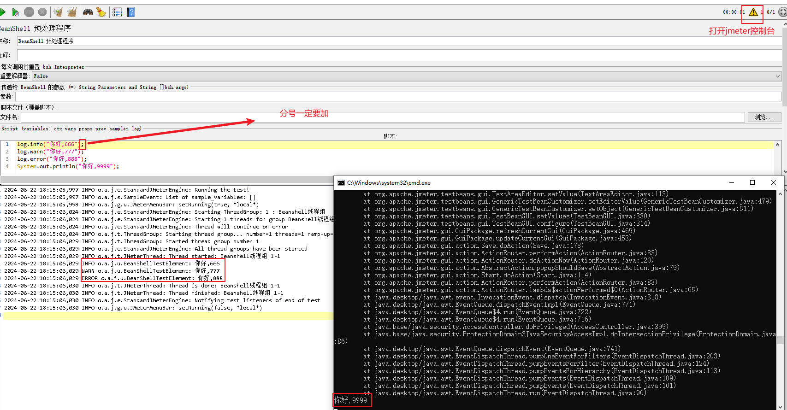

2. `vars`获取/设置变量的值**只能在同一个线程组中使用** `对应类:org.apache.jmeter.threads.JMeterVariables`

   ```java
   //同线程组获取/设置变量  
   vars.put("test_k1","哈哈哈哈");
   log.info(vars.get("test_k1"));
   ```

   > 注意: 只能在同线程组使用

3. `props`获取/设置全局静态配置 **可以跨线程组使用 **  `对应类: java.util.Properties`

   其实读取的就是jmeter的bin目录下`jmeter.properties`配置项

   ```java
   //跨线程组获取/设置变量  
   log.info(props.get("language")); //jmeter.properties中的配置
   props.put("test_jmeter_encoding","test_中文"); //只有在运行中才会存在,不会写入配置文件
   log.info(props.get("test_jmeter_encoding"));
   ```

4. `prev`获取前一个请求/取样器的`SampleResult`的实例/结果   `对应类: org.apache.jmeter.samplers.SampleResult`

   ```java
   //prev
   log.info(""+prev.getAllThreads()); //log输出必须要是字符串类型,数字可以直接拼接
   log.info(""+SampleResult.getAllThreads());
   log.info(prev.getResponseCode());
   log.info(prev.getResponseDataAsString());
   ```

5. `ctx`获取jmeter上下文信息 `对应类:org.apache.jmeter.threads.JMeterContext`

   ```java
   //ctx
   log.info(ctx.getProperties().toString());//日志输出必须要是字符串
   log.info(ctx.getSamplerContext().toString());
   ```

6. `data` 上一个请求/取样器返回的数据`byte[]`形式

   ```java
   //data
   log.info(new String(data)); //byte转字符串
   System.out.println(new String(data));
   ```

### 3.13.2 复杂脚本

搭配Java写复杂的脚本

## 3.14 其他内置组件

内置变量和使用方法参考手册: jmeter本地目录下`apache-jmeter-5.6.3/printable_docs/usermanual/component_reference.html`

## 3.15 连接Mysql

1. 准备数据库驱动包,如`mysql-connector-java-5.1.7-bin.jar`

   + 方法1:  在**测试计划中引用该jar包**
   + 方法2: **直接把该jar包放入jmeter的bin目录下**

   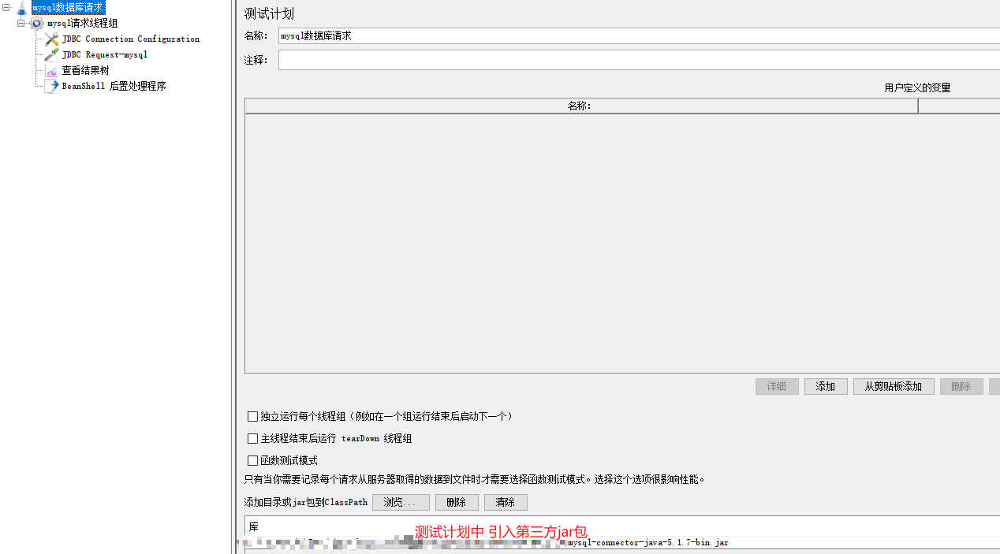

2. 新建一个jdbc连接的配置项

   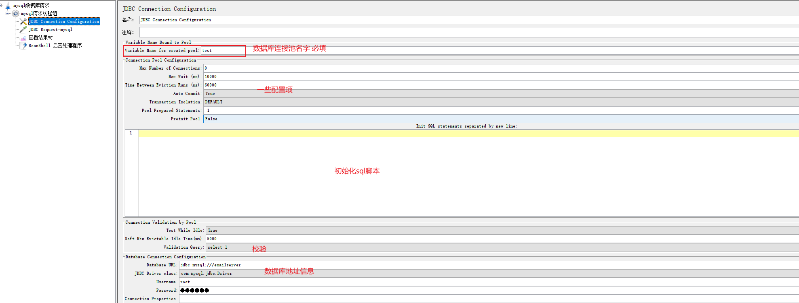

3. 新建jdbc连接请求

   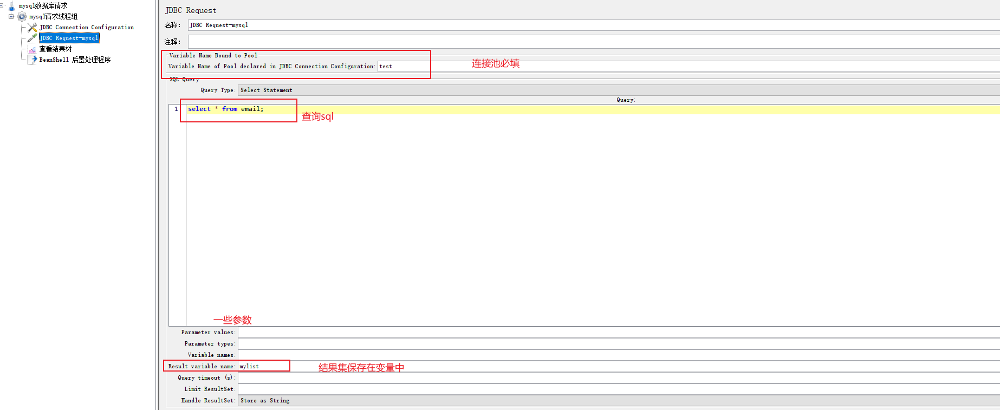

4. Beanshell取查询的结果

   ```java
   //获取值的类型
   //log.info(vars.getObject("mylist").get(0).get("create_time").getClass().toString());
   String content=vars.getObject("mylist").get(0).get("content");
   String subject=vars.getObject("mylist").get(0).get("subject");
   String create_time=vars.getObject("mylist").get(0).get("create_time").toString();
   log.info("获取第一行 content="+content+",subject="+subject+",create_time="+create_time+"");
   ```

   > + 不确定字符串一定要`toString方法`
   > + 里面的log不支持`{}`传参

5. jmeter请求直接使用查询结果 `${mylist}`

## 3.14 命令行运行jmeter

`jmeter -?` 查看帮助命令

+ `jmeter -n -t jmx文件` 无gui方式运行测试计划(**缺点:不显示测试结果**)

+ `jmeter -n -t jmx文件 -l result.jtl` 将测试结果记录在logfile中(**缺点:不容易查看测试结果,且必须导入到线程组-查看结果树中查看**) 

  ```properties
  #jmeter.properties 
  jmeter.save.saveservice.output_format=xml
  jmeter.save.saveservice.response_data=true
  jmeter.save.saveservice.samplerData=true
  jmeter.save.saveservice.responseHeaders=true
  jmeter.save.saveservice.requestHeaders=true
  ```

  > 必须输出`xml`格式的才能将数据保存下来,否则只是sample请求

+ `jmeter -n -t jmx文件 -l result.jtl -e -o 空目录名` 同时输出html格式的测试结果\

+ 所有可选命令

```bash
 		--?
                print command line options and exit
        -h, --help
                print usage information and exit
        -v, --version
                print the version information and exit
        -p, --propfile <argument>
                the jmeter property file to use
        -q, --addprop <argument>
                additional JMeter property file(s)
        -t, --testfile <argument>
                the jmeter test(.jmx) file to run. "-t LAST" will load last
                used file
        -l, --logfile <argument>
                the file to log samples to
        -i, --jmeterlogconf <argument>
                jmeter logging configuration file (log4j2.xml)
        -j, --jmeterlogfile <argument>
                jmeter run log file (jmeter.log)
        -n, --nongui
                run JMeter in nongui mode
        -s, --server
                run the JMeter server
        -E, --proxyScheme <argument>
                Set a proxy scheme to use for the proxy server
        -H, --proxyHost <argument>
                Set a proxy server for JMeter to use
        -P, --proxyPort <argument>
                Set proxy server port for JMeter to use
        -N, --nonProxyHosts <argument>
                Set nonproxy host list (e.g. *.apache.org|localhost)
        -u, --username <argument>
                Set username for proxy server that JMeter is to use
        -a, --password <argument>
                Set password for proxy server that JMeter is to use
        -J, --jmeterproperty <argument>=<value>
                Define additional JMeter properties
        -G, --globalproperty <argument>=<value>
                Define Global properties (sent to servers)
                e.g. -Gport=123
                 or -Gglobal.properties
        -D, --systemproperty <argument>=<value>
                Define additional system properties
        -S, --systemPropertyFile <argument>
                additional system property file(s)
        -f, --forceDeleteResultFile
                force delete existing results files and web report folder if
                 present before starting the test
        -L, --loglevel <argument>=<value>
                [category=]level e.g. jorphan=INFO, jmeter.util=DEBUG or com
                .example.foo=WARN
        -r, --runremote
                Start remote servers (as defined in remote_hosts)
        -R, --remotestart <argument>
                Start these remote servers (overrides remote_hosts)
        -d, --homedir <argument>
                the jmeter home directory to use
        -X, --remoteexit
                Exit the remote servers at end of test (non-GUI)
        -g, --reportonly <argument>
                generate report dashboard only, from a test results file
        -e, --reportatendofloadtests
                generate report dashboard after load test
        -o, --reportoutputfolder <argument>
                output folder for report dashboard
```

## 3.15 ant构建jmx测试计划

+ 下载ant并配置环境变量

+ 将jmeter`extras`目录下` ant-jmeter-1.1.1.jar `拷贝到ant的`lib`下,否则会报错

  > taskdef class org.programmerplanet.ant.taskdefs.jmeter.JMeterTask cannot be found

+ jmeter配置文件`jmeter.properties`中`jmeter.save.saveservice.output_format=xml` 改为`xml`

+ jmeter下`extras`目录下创建自定义样式表,并命名`jmeter-results-shanhe-me.xsl` **为了可以看到测试用例的详细数据**

  ```xsl
  <?xml version="1.0" encoding="UTF-8"?>
  <xsl:stylesheet xmlns:xsl="http://www.w3.org/1999/XSL/Transform" version="1.0">
      <xsl:output method="html" indent="no" encoding="UTF-8" doctype-public="-//W3C//DTD HTML 4.01 Transitional//EN" doctype-system="http://www.w3.org/TR/html4/loose.dtd"/>
      <xsl:strip-space elements="*"/>
      <xsl:template match="/testResults">
          <html lang="en">
          <head>
              <meta name="Author" content="shanhe.me"/>
              <title>JMeter Test Results</title>
              <style type="text/css"><![CDATA[
              
                  * { margin: 0; padding: 0 }
                  html, body { width: 100%; height: 100%; background: #b4b4b4; font-size: 12px }
                  table { border: none; border-collapse: collapse; table-layout: fixed }
                  td { vertical-align: baseline; font-size: 12px }
                  #left-panel { position: absolute; left: 0; top: 0; bottom: 0; width: 300px; overflow: auto; background: #dee4ea }
                  #left-panel li.navigation { font-weight: bold; cursor: default; color: #9da8b2; line-height: 18px; background-position: 12px 5px; background-repeat: no-repeat; padding: 0 0 0 25px; background-image: url() }
                  #left-panel li.success { color: #565b60 }
                  #left-panel li.failure { color: red }
                  #left-panel li { list-style: none; color: black; cursor: pointer }
                  #left-panel li.selected { background-repeat: repeat-x; color: white; background: url() }
                  #left-panel div { line-height: 20px; background-position: 25px 3px; background-repeat: no-repeat; padding: 0 0 0 45px }
                  #left-panel div.success { background-image: url() }
                  #left-panel div.failure { background-image: url() }
                  #left-panel div.detail { display: none }
                  #right-panel { position: absolute; right: 0; top: 0; bottom: 0; left: 301px; overflow: auto; background: white }
                  #right-panel .group { font-size: 12px; font-weight: bold; line-height: 16px; padding: 0 0 0 18px; counter-reset: assertion; background-repeat: repeat-x; background-image: url() }
                  #right-panel .zebra { background-repeat: repeat; padding: 0 0 0 18px; background-image: url() }
                  #right-panel .data { line-height: 19px; white-space: nowrap }
                  #right-panel pre.data { white-space: pre }
                  #right-panel tbody.failure { color: red }
                  #right-panel td.key { min-width: 108px }
                  #right-panel td.delimiter { min-width: 18px }
                  #right-panel td.assertion:before { counter-increment: assertion; content: counter(assertion) ". " }
                  #right-panel td.assertion { color: black }
                  #right-panel .trail { border-top: 1px solid #b4b4b4 }
                  
              ]]></style>
              <script type="text/javascript"><![CDATA[
              
                  var onclick_li = (function() {
                      var last_selected = null;
                      return function(li) {
                          if( last_selected == li )
                              return;
                          if( last_selected )
                              last_selected.className = "";
                          last_selected = li;
                          last_selected.className = "selected";
                          document.getElementById("right-panel").innerHTML = last_selected.firstChild.nextSibling.innerHTML;
                          return false;
                      };
                  })();
                  
                  var patch_timestamp = function() {
                      var spans = document.getElementsByTagName("span");
                      var len = spans.length;
                      for( var i = 0; i < len; ++i ) {
                          var span = spans[i];
                          if( "patch_timestamp" == span.className )
                              span.innerHTML = new Date( parseInt( span.innerHTML ) );
                      }
                  };
                  
                  var patch_navigation_class = (function() {
                  
                      var set_class = function(el, flag) {
                          if(el) {
                              el.className += flag ? " success" : " failure";
                          }
                      };
                  
                      var traverse = function(el, group_el, flag) {
                          while(1) {
                              if(el) {
                                  if(el.className == 'navigation') {
                                      set_class(group_el, flag);
                                      group_el = el;
                                      flag = true;
                                  } else {
                                      var o = el.firstChild;
                                      o = o ? o.className : null;
                                      flag = flag ? (o == 'success') : false;
                                  }
                                  el = el.nextSibling;
                              } else {
                                  set_class(group_el, flag);
                                  break;
                              }
                          }
                      };
                      
                      return function() {
                          var o = document.getElementById("result-list");
                          o = o ? o.firstChild : null;
                          if(o)
                              traverse(o, null, true);
                      };
                  })();
          
                  window.onload = function() {
                      patch_timestamp();
                      patch_navigation_class();
                      var o = document.getElementById("result-list");
                      o = o ? o.firstChild : null;
                      o = o ? o.nextSibling : null;
                      if(o)
                          onclick_li(o);
                  };
          
              ]]></script>
          </head>
          <body>
              <div id="left-panel">
                  <ol id="result-list">
                      <xsl:for-each select="*">
                          <!-- group with the previous sibling -->
                          <xsl:if test="position() = 1 or @tn != preceding-sibling::*[1]/@tn">
                              <li class="navigation">Thread: <xsl:value-of select="@tn"/></li>
                          </xsl:if>
                          <li onclick="return onclick_li(this);">
                              <div>
                                  <xsl:attribute name="class">
                                      <xsl:choose>
                                          <xsl:when test="@s = 'true'">success</xsl:when>
                                          <xsl:otherwise>failure</xsl:otherwise>
                                      </xsl:choose>
                                  </xsl:attribute>
                                  <xsl:value-of select="@lb"/>
                              </div><div class="detail">
                                  <div class="group">Sampler</div>
                                  <div class="zebra">
                                      <table>
                                          <tr><td class="data key">Thread Name</td><td class="data delimiter">:</td><td class="data"><xsl:value-of select="@tn"/></td></tr>
                                          <tr><td class="data key">Timestamp</td><td class="data delimiter">:</td><td class="data"><span class="patch_timestamp"><xsl:value-of select="@ts"/></span></td></tr>
                                          <tr><td class="data key">Time</td><td class="data delimiter">:</td><td class="data"><xsl:value-of select="@t"/> ms</td></tr>
                                          <tr><td class="data key">Latency</td><td class="data delimiter">:</td><td class="data"><xsl:value-of select="@lt"/> ms</td></tr>
                                          <tr><td class="data key">Bytes</td><td class="data delimiter">:</td><td class="data"><xsl:value-of select="@by"/></td></tr>
                                          <tr><td class="data key">Sample Count</td><td class="data delimiter">:</td><td class="data"><xsl:value-of select="@sc"/></td></tr>
                                          <tr><td class="data key">Error Count</td><td class="data delimiter">:</td><td class="data"><xsl:value-of select="@ec"/></td></tr>
                                          <tr><td class="data key">Response Code</td><td class="data delimiter">:</td><td class="data"><xsl:value-of select="@rc"/></td></tr>
                                          <tr><td class="data key">Response Message</td><td class="data delimiter">:</td><td class="data"><xsl:value-of select="@rm"/></td></tr>
                                      </table>
                                  </div>
                                  <div class="trail"></div>
                                  <xsl:if test="count(assertionResult) &gt; 0">
                                      <div class="group">Assertion</div>
                                      <div class="zebra">
                                          <table>
                                              <xsl:for-each select="assertionResult">
                                                  <tbody>
                                                      <xsl:attribute name="class">
                                                          <xsl:choose>
                                                              <xsl:when test="failure = 'true'">failure</xsl:when>
                                                              <xsl:when test="error = 'true'">failure</xsl:when>
                                                          </xsl:choose>
                                                      </xsl:attribute>
                                                      <tr><td class="data assertion" colspan="3"><xsl:value-of select="name"/></td></tr>
                                                      <tr><td class="data key">Failure</td><td class="data delimiter">:</td><td class="data"><xsl:value-of select="failure"/></td></tr>
                                                      <tr><td class="data key">Error</td><td class="data delimiter">:</td><td class="data"><xsl:value-of select="error"/></td></tr>
                                                      <tr><td class="data key">Failure Message</td><td class="data delimiter">:</td><td class="data"><xsl:value-of select="failureMessage"/></td></tr>
                                                  </tbody>
                                              </xsl:for-each>
                                          </table>
                                      </div>
                                      <div class="trail"></div>
                                  </xsl:if>
                                  <div class="group">Request</div>
                                  <div class="zebra">
                                      <table>
                                          <tr><td class="data key">Method/Url</td><td class="data delimiter">:</td><td class="data"><pre class="data"><xsl:value-of select="method"/><xsl:text> </xsl:text><xsl:value-of select="java.net.URL"/></pre></td></tr>
                                          <tr><td class="data key">Query String</td><td class="data delimiter">:</td><td class="data"><pre class="data"><xsl:value-of select="queryString"/></pre></td></tr>
                                          <tr><td class="data key">Cookies</td><td class="data delimiter">:</td><td class="data"><pre class="data"><xsl:value-of select="cookies"/></pre></td></tr>
                                          <tr><td class="data key">Request Headers</td><td class="data delimiter">:</td><td class="data"><pre class="data"><xsl:value-of select="requestHeader"/></pre></td></tr>
                                      </table>
                                  </div>
                                  <div class="trail"></div>
                                  <div class="group">Response</div>
                                  <div class="zebra">
                                      <table>
                                          <tr><td class="data key">Response Headers</td><td class="data delimiter">:</td><td class="data"><pre class="data"><xsl:value-of select="responseHeader"/></pre></td></tr>
                                          <tr><td class="data key">Response Data</td><td class="data delimiter">:</td><td class="data"><pre class="data"><xsl:value-of select="responseData"/></pre></td></tr>
                                          <tr><td class="data key">Response File</td><td class="data delimiter">:</td><td class="data"><pre class="data"><xsl:value-of select="responseFile"/></pre></td></tr>
                                      </table>
                                  </div>
                                  <div class="trail"></div>
                              </div>
                          </li>
                      </xsl:for-each>
                  </ol>
              </div>
              <div id="right-panel"></div>
          </body>
          </html>
      </xsl:template>
  </xsl:stylesheet>
  ```

+ 为了能获取详细数据,自己按需求取消`jmeter.properties`注释

  ```properties
  # assertion_results_failure_message only affects CSV output
  #jmeter.save.saveservice.assertion_results_failure_message=true
  #
  # legitimate values: none, first, all
  #jmeter.save.saveservice.assertion_results=none
  #
  #jmeter.save.saveservice.data_type=true
  #jmeter.save.saveservice.label=true
  #jmeter.save.saveservice.response_code=true
  # response_data is not currently supported for CSV output
  #jmeter.save.saveservice.response_data=false
  jmeter.save.saveservice.response_data=true
  # Save ResponseData for failed samples
  #jmeter.save.saveservice.response_data.on_error=false
  #jmeter.save.saveservice.response_message=true
  #jmeter.save.saveservice.successful=true
  #jmeter.save.saveservice.thread_name=true
  #jmeter.save.saveservice.time=true
  #jmeter.save.saveservice.subresults=true
  #jmeter.save.saveservice.assertions=true
  #jmeter.save.saveservice.latency=true
  # Only available with HttpClient4
  #jmeter.save.saveservice.connect_time=true
  #jmeter.save.saveservice.samplerData=false
  jmeter.save.saveservice.samplerData=true
  #jmeter.save.saveservice.responseHeaders=false
  jmeter.save.saveservice.responseHeaders=true
  #jmeter.save.saveservice.requestHeaders=false
  jmeter.save.saveservice.requestHeaders=true
  #jmeter.save.saveservice.encoding=false
  #jmeter.save.saveservice.bytes=true
  # Only available with HttpClient4
  #jmeter.save.saveservice.sent_bytes=true
  #jmeter.save.saveservice.url=true
  #jmeter.save.saveservice.filename=false
  #jmeter.save.saveservice.hostname=false
  #jmeter.save.saveservice.thread_counts=true
  #jmeter.save.saveservice.sample_count=false
  #jmeter.save.saveservice.idle_time=true
  ```

+ 目录下存放`build.xml`和`jmx`测试计划文件

  ```xml
  <?xml version="1.0" encoding="utf-8"?>
  <project name="ant-jmeter-test" default="run" basedir=".">
  <tstamp>
  <format property="time" pattern="MM-dd-hh" />
  </tstamp>
      <!-- 需要改成自己本地的 Jmeter 目录-->  
      <property name="jmeter.home" value="D:\Code\apache-jmeter-5.6.3" />
      <property name="report.title" value="BeanShell预处理程序测试报告"/>
      <!-- jmeter生成jtl格式的结果报告的路径--> 
      <property name="jmeter.result.jtl.dir" value="D:\Code\Code\自动化测试\ant\jtl" />
      <!-- jmeter生成html格式的结果报告的路径-->
      <property name="jmeter.result.html.dir" value="D:\Code\Code\自动化测试\ant\report" />
      <property name="jmeter.result.html.detaildir" value="D:\Code\Code\自动化测试\ant\detail" />
      <!-- 生成的报告的前缀-->  
      <property name="ReportName" value="html测试报告" />
      <property name="jmeter.result.jtlName" value="${jmeter.result.jtl.dir}/${ReportName}${time}.jtl" />
      <property name="jmeter.result.htmlName" value="${jmeter.result.html.dir}/${ReportName}${time}.html" />
      <property name="jmeter.result.detail.htmlName" value="${jmeter.result.html.detaildir}/${ReportName}${time}.html" />
  
      <target name="run">
          <antcall target="test" />
          <antcall target="detail" />
          <antcall target="report" />
      </target>
      
      <target name="test">
          <taskdef name="jmeter" classname="org.programmerplanet.ant.taskdefs.jmeter.JMeterTask" />
          <jmeter jmeterhome="${jmeter.home}" resultlog="${jmeter.result.jtlName}">
              <!-- 声明要运行的脚本"*.jmx"指包含此目录下的所有jmeter脚本 注意确定jmx文件-->
              <testplans dir="D:\Code\Code\自动化测试\ant" includes="BeanShell预处理程序.jmx" />
              
              <property name="jmeter.save.saveservice.output_format" value="xml"/>
          </jmeter>
      </target>
          
      <path id="xslt.classpath">
          <fileset dir="${jmeter.home}/lib" includes="xalan*.jar"/>
          <fileset dir="${jmeter.home}/lib" includes="serializer*.jar"/>
      </path>
  
  
      <target name="report">
          <tstamp> <format property="report.datestamp" pattern="yyyy/MM/dd HH:mm" /></tstamp>
          <xslt 
                classpathref="xslt.classpath"
                force="true"
                in="${jmeter.result.jtlName}"
                out="${jmeter.result.htmlName}"
                style="${jmeter.home}/extras/jmeter-results-detail-report_21.xsl">
                <param name="dateReport" expression="${report.datestamp}"/>
                <param name="titleReport" expression="${report.title}:${report.datestamp}"/>
  
         </xslt>
  
                  <!-- 因为上面生成报告的时候，不会将相关的图片也一起拷贝至目标目录，所以，需要手动拷贝 --> 
          <copy todir="${jmeter.result.html.dir}">
              <fileset dir="${jmeter.home}/extras">
                  <include name="collapse.png" />
                  <include name="expand.png" />
              </fileset>
          </copy>
      </target>
  	
  	<target name="detail">
          <tstamp> <format property="report.datestamp" pattern="yyyy/MM/dd HH:mm" /></tstamp>
          <xslt 
                classpathref="xslt.classpath"
                force="true"
                in="${jmeter.result.jtlName}"
                out="${jmeter.result.detail.htmlName}"
                style="${jmeter.home}/extras/jmeter-results-shanhe-me.xsl">
                <param name="dateReport" expression="${report.datestamp}"/>
                <param name="titleReport" expression="${report.title}:${report.datestamp}"/>
  
         </xslt>
  
                  <!-- 因为上面生成报告的时候，不会将相关的图片也一起拷贝至目标目录，所以，需要手动拷贝 --> 
          <copy todir="${jmeter.result.html.detaildir}">
              <fileset dir="${jmeter.home}/extras">
                  <include name="collapse.png" />
                  <include name="expand.png" />
              </fileset>
          </copy>
      </target>
  	
  
  </project>
  
  ```

+ 执行`ant`命令

+ 生成文件

  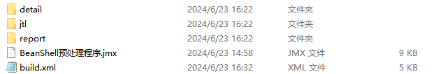

  + `jtl`可以直接导入jmeter查看

  + `detail` 

    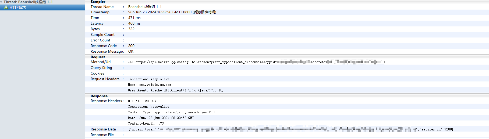

  + `report` 

    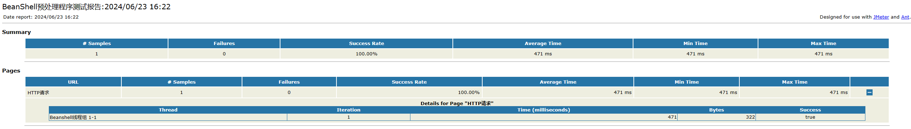

## 3.16 jmeter+Ant+ jenkins构建测试持续集成

+ 前提必须按照并配置好Ant

+ 下载jenkins war包,如果官网没有可以去淘宝镜像上下载

+ 放在tomcat容器内部署

+ 登录`ip:port/jenkins`配置密码,安装默认插件

  > 密码默认在`C:\users\用户名\.jenkins\secrets\initialAdminPassword`

+ 创建`item`

  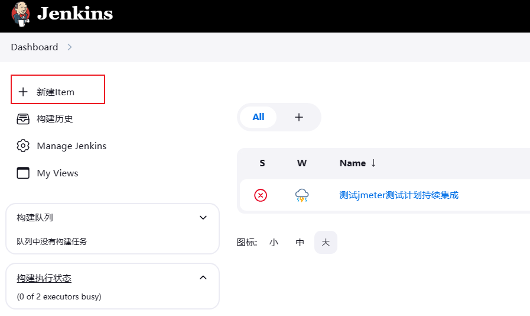

+ 配置`item`

  + `General-高级-使用自定义的工作空间` 指定目录(包含ant的`build.xml`和`jmx`文件的) 

  + `Build-Steps-增加构建步骤-Invoke Ant` 

  + `Build-Steps-增加构建步骤-Execute Groovy script `防止打不开html报告

    ```groovy
    System.setProperty("hudson.model.DirectoryBrowserSupport.CSP", "")
    ```

  +  `构建后操作-增加构建后操作步骤-Publish HTML reports`

  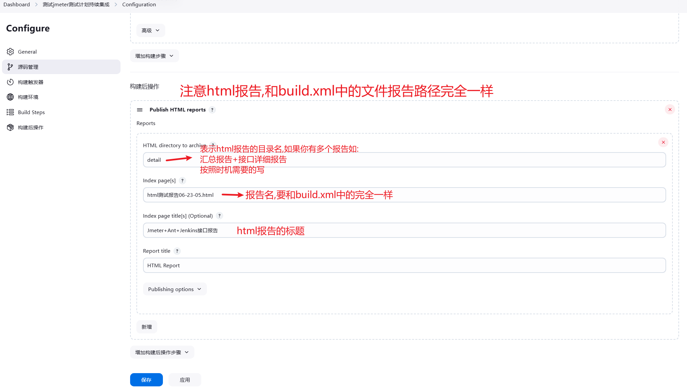

  > 新版本如果没有`Groovy`和`publish HTML reports`可以去插件管理中自己安装

+ 执行目标`item`报错,原因**通过审批**

  ```java
  ERROR: Build step failed with exception
  org.jenkinsci.plugins.scriptsecurity.scripts.UnapprovedUsageException: script not yet approved for use
  	at PluginClassLoader for script-security//org.jenkinsci.plugins.scriptsecurity.scripts.ScriptApproval.using(ScriptApproval.java:668)
      ...
      ...
  ```

+ `Manage Jenkins-In-process Script Approval`

  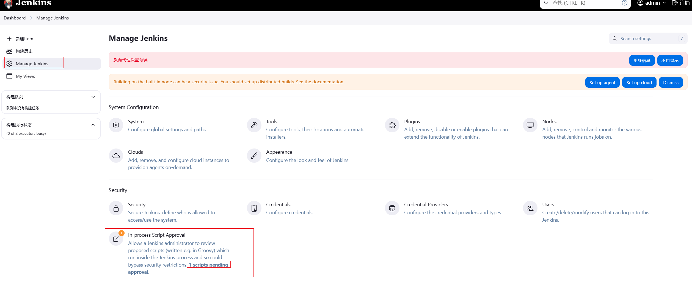

  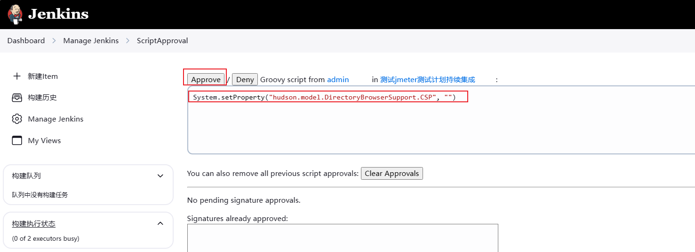

+ 再次执行测试

  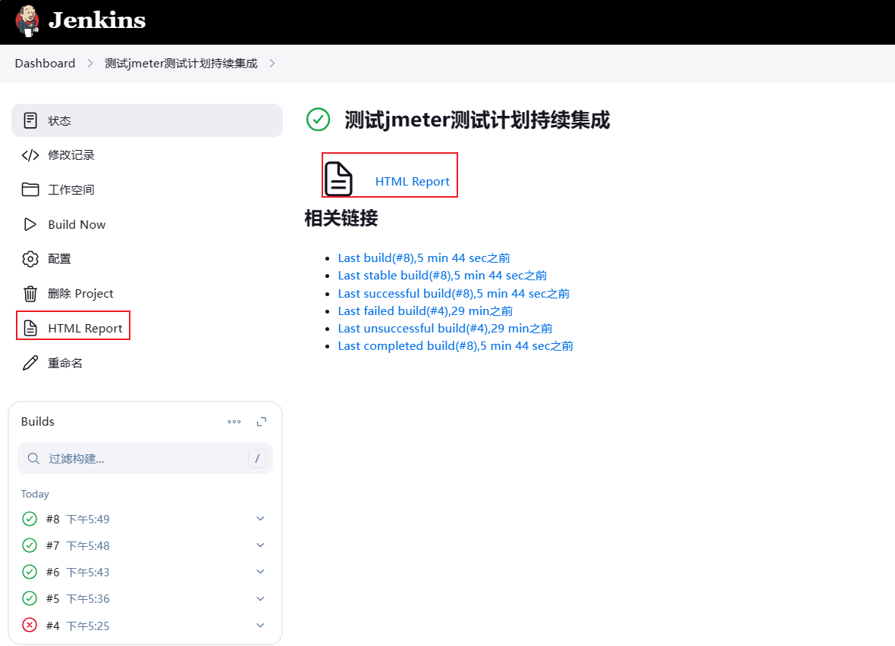

# 4. Postman

## 4.1 postman介绍

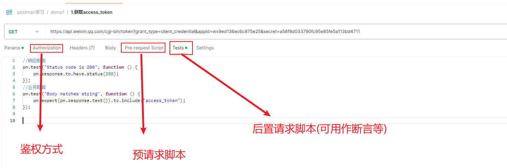

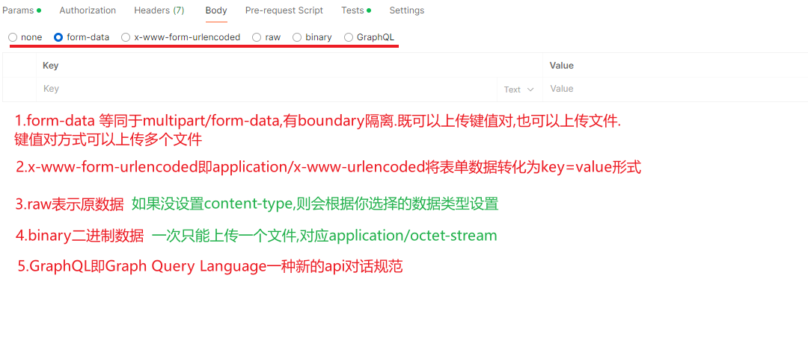

## 4.2 Postman脚本执行顺序

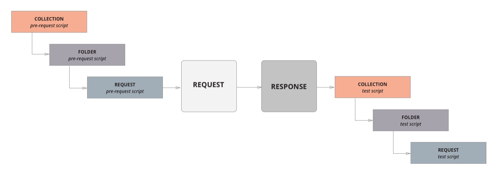

## 4.3 Postman变量

Postman 支持不同范围的变量，允许您针对各种开发、测试和协作任务定制处理。Postman 中的作用域与您的请求运行的不同上下文相关，不同的变量作用域适用于不同的任务。

从最宽到最窄的顺序，这些范围是：`globals`、`collectionVariables`、`environment`、`data`和`local`。

- **全局变量(global)**使您能够访问集合、请求、测试脚本和环境之间的数据。全局变量在整个[工作区](https://postman.org.cn/collaborating-in-postman/using-workspaces/creating-workspaces/)中都可用。由于全局变量在 Postman 中具有最广泛的可用范围，因此它们非常适合测试和原型设计，但在以后的开发阶段应使用更具体的范围。
- **集合变量(collectionVariables)**在集合中的整个请求中都可用，并且独立于环境。集合变量不会根据所选环境而改变。如果您使用单一环境，例如用于身份验证或 URL 详细信息，则集合变量是合适的。
- **环境变量(environment)**使您能够将工作范围限定到不同的环境，例如本地开发与测试或生产。一次可以激活一个环境。如果你有一个单一的环境，使用集合变量会更有效，但是环境允许你指定[基于角色的访问级别](https://postman.org.cn/sending-requests/managing-environments/#working-with-environments-as-a-team)。
- **数据变量(data)**来自外部 CSV 和 JSON 文件，用于定义在使用[Newman](https://postman.org.cn/running-collections/using-newman-cli/)或[Collection Runner](https://postman.org.cn/running-collections/intro-to-collection-runs/)运行集合时可以使用的数据集。数据变量具有当前值，在请求或收集运行之后不会持续存在。
- **局部变量(local)**是在请求脚本中访问的临时变量。局部变量值的范围仅限于单个请求或收集运行，并且在运行完成后不再可用。如果您需要一个值来覆盖所有其他变量范围但不希望该值在执行结束后持续存在，则局部变量是合适的。

```javascript
//access a variable at any scope including local 
pm.variables.get("variable_key"); //set
//access a global variable
pm.globals.get("variable_key"); //set
//access a collection variable
pm.collectionVariables.get("variable_key"); //set
//access an environment variable
pm.environment.get("variable_key"); //set
//获取csv数据变量
data.get("assert_key")
//environment删除变量
pm.environment.unset("variable_key"); 
```

> **动态变量** 它们的值是在执行时生成的，它们的名称以`$`符号开头，例如`$guid`，`$timestamp`等等

> 如果在两个不同的作用域中声明了同名变量，则将使用存储在具有最窄作用域的变量中的值。例如，如果有一个名为 的全局变量`username`和一个名为 的局部变量`username`，则请求运行时将使用局部值。

> Postman 将变量存储为字符串。如果您存储对象或数组，请`JSON.stringify()`在存储之前记住它们，并`JSON.parse()`在检索它们时记住它们。

## 4.4 Postman已定义脚本变量

+ `pm.request`  获取请求的信息

  + `pm.request.url`
  + `pm.request.method`
  + `pm.request.headers`
  + `pm.request.body`
  + `pm.request.proxy`

+ `pm.response`  获取响应的信息

  + `pm.response.id`
  + `pm.response.status`
  + `pm.response.code`
  + `pm.response.header`
  + `pm.response.stream` 响应体的原始流
  + `pm.response.json()` 将响应体解析为JSON对象
  + `pm.response.text()` 将响应体作为文本获取
  + `pm.response.cookie`
  + `pm.response.responseTime`
  + `pm.response.responseSize`

+ [五种环境变量](#4.3 Postman变量)

+ 内置函数(用于断言)

  ```javascript
  pm.test("test name", function() { ... })//定义一个测试。
  //一般放在上面test中
  pm.expect(actual).to.equal(expected)
  pm.expect(actual).to.have.property(propertyName)
  ...
  ```

  [其他断言用例_PostMan中文文档](https://postman.org.cn/writing-scripts/script-references/test-examples/#getting-started-with-tests)

+ 其他内置对象

  + `pm.cookies`
  + `pm.sendRequest` 发送http请求
  + `pm.` 查看支持的其他属性和函数

+ 动态变量 它们的值是在执行时生成的，它们的名称以`$`符号开头，例如`$guid`，`$timestamp`等等

  ```javascript
  // 脚本中调用动态变量
  pm.variables.replaceIn('{{$randomFirstName}}')
  ```

  [动态变量_PostMan中文文档](https://postman.org.cn/writing-scripts/script-references/variables-list/)
  
  > 1. **动态变量**在请求中使用: `{{$timestamp}}`
  > 2. **动态变量**在预/后脚本中使用: `pm.variables.replaceIn('{{$isoTimestamp}}'`

## 4.5 Postman响应数据提取

+ 转为json对象提取

  ```javascript
  var jsData=JSON.parse(responseBody);//responseBody = pm.response.text()
  //var jsData=pm.response.json();
  pm.globals.set("access_token",jsData.access_token);
  ```

+ 正则表达式提取

  ```javascript
  //匹配的是一个数组
  var dataArr = responseBody.match(new RegExp('"access_token": "(.*)"'));
  pm.globals.set("access_token",dataArr[1]);

## 4.6 Postman之断言

**Postman中断言必须是**`pm.test`**加上**`pm.expect`**用于判断断言是否通过**

语法: [chai.js断言库](https://www.chaijs.com/)

### 4.6.1 自带断言

```javascript
pm.test("判断响应状态码", function () {
    pm.response.to.have.status(200);//数字就是状态码
});
pm.test("状态码信息", function () {
    pm.response.to.have.status("OK"); //字符串就是状态码信息
});
pm.test("判断响应体包含值", function () {
    pm.expect(pm.response.text()).to.include("access_token");
});
pm.test("json格式响应体值判断", function () {
    var jsonData = pm.response.json();
    pm.expect(jsonData.expires_in).to.eql(7200);
});
pm.test("响应体文本全匹配", function () {
    // 不支持正则
    pm.response.to.have.body(responseBody);
});
pm.test("存在Content-Type", function () {
    pm.response.to.have.header("Content-Type");
});
pm.test("响应时间小于 200ms", function () {
    pm.expect(pm.response.responseTime).to.be.below(200);
});
pm.test("成功请求码", function () {
    pm.expect(pm.response.code).to.be.oneOf([200, 201, 202]);
});
```

### 4.6.2 自定义断言

```javascript
//自定义断言
function myAssert(){
    return true;//true表示断言通过,false表示断言失败
}
pm.test("我的自定义断言", function () {
    var flag = myAssert();
    pm.expect(flag).to.be.true;
});

```

## 4.7 Postman之CSV数据驱动

1. 定义csv数据文件 **1个成功的例子,三个失败的例子**

   ```csv
   grant_type,appid,secret,key 
   client_credential,xxx,bbbb,access_token
   ,xxx,bbbb,errcode	
   client_credential,,xxx,errcode
   client_credential,bbbb,,errcode
   ```

2. `Run collection`或`Run folder`

   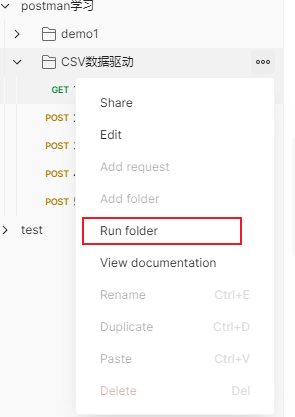

3. 允许测试,选择csv文件并预览

   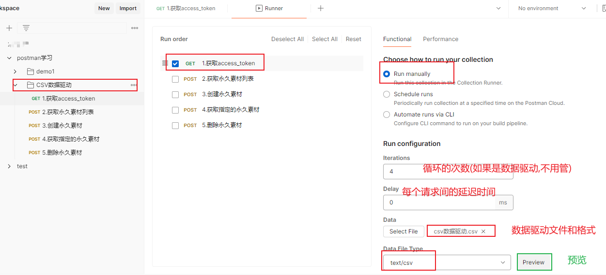

   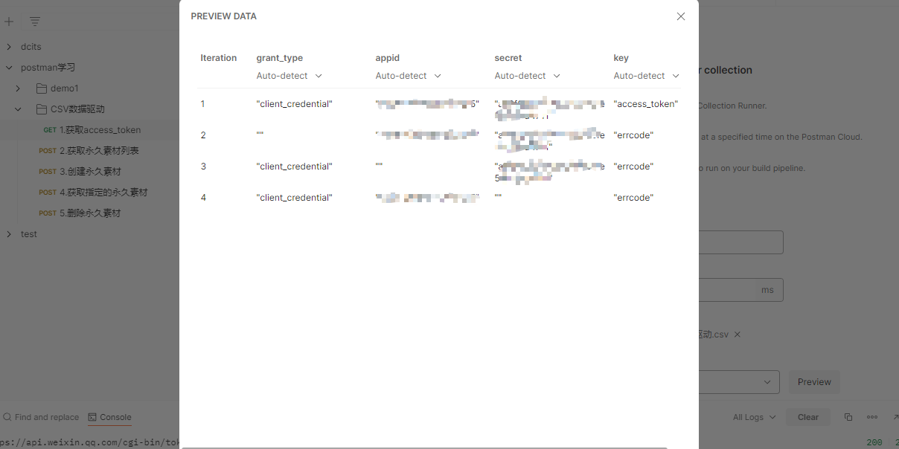

4. 点击`run`

   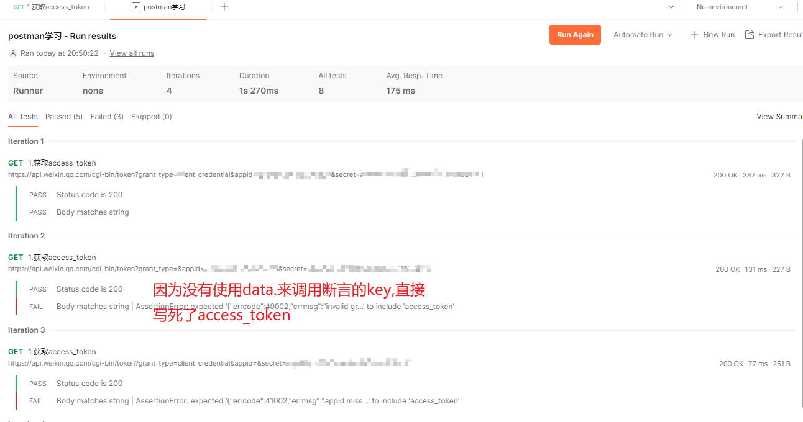

5.  注意事项

   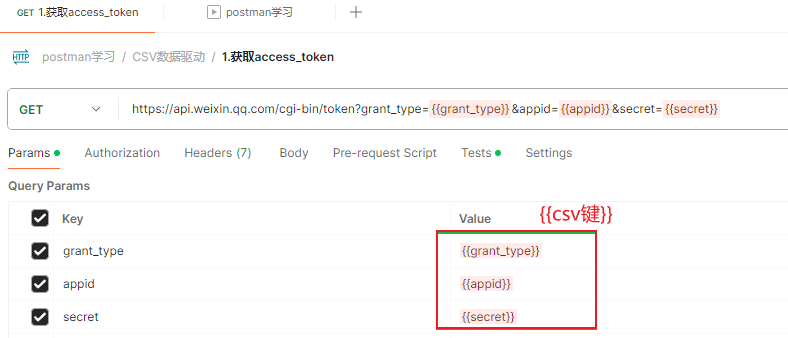

   ```javascript
   //业务断言
   pm.test("Body matches string", function () {
       //data表示取csv数据key是csv中的键 
       pm.expect(pm.response.text()).to.include(data.key);
   });
   ```

   > 1. csv中数据的**键**在**请求参数,请求体中**直接使用`{{键}}`来使用. 如`{{grant_type}}`
   > 2. csv中数据的**键**在**Pre-request Script和Tests**中必须通过`data`这个变量来使用. 如`data.grant_type` (**可以看第三步的预览**)

## 4.8 Postman之Mock Server

定义mock后台服务,用于调试

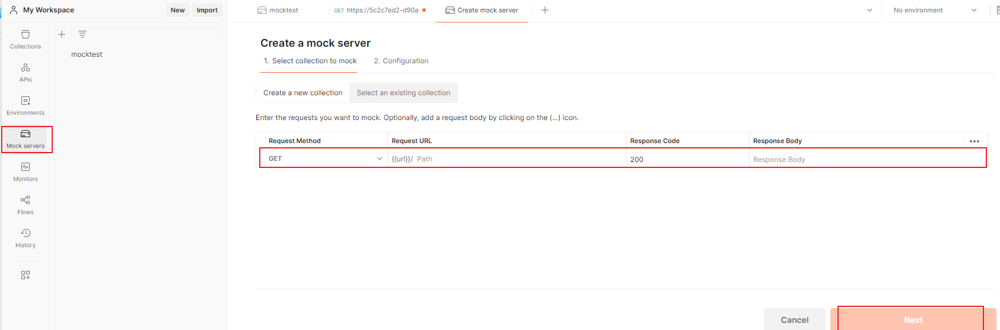

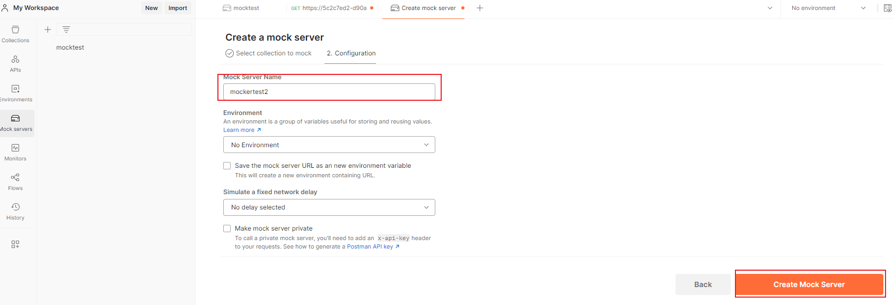

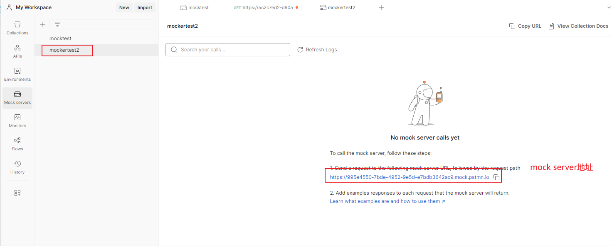

> 根据定义的请求类型就可以直接调用了,**注意自己定义的路径要加上**

## 4.9 Postman使用外部库和自带库

### 4.9.1 Postman自带库

`ajv、atob、btoa、chai、cheerio、crypto-js、csv-parse/lib/sync、lodash、moment、postman-collection、tv4、uuid、xml2js`需要自己引入

```javascript
const Ajv=require("ajv");
const ajv=new Ajv();
```

参考: [Postman | 一分钟掌握Pre-request Script | 外部库的使用 - 掘金 (juejin.cn)](https://juejin.cn/post/7214005088510394428)

### 4.9.2 NodeJS自带库

`path,assert,buffer,util,url,punycode,querystring,string-decoder,stream,timers,events`需要自己引入

```javascript
const nPath = require('path');
console.log(nPath.delimiter)
```

参考:

 [Postman | 一分钟掌握Pre-request Script | 外部库的使用 - 掘金](juejin.cn)

[[首页 | Node.js v22 文档 (nodejs.cn)](https://nodejs.cn/api/)](https://juejin.cn/post/7214005088510394428)

### 4.9.3 自定义外部库

无法直接使用,需要借助`pm.sendRequest`发送一个请求获取js代码来实现:

```javascript
var url=jquery代码地址;
pm.sendRequest(url, function (err, response) {
    if(err) {
    	console.log(err)
    } else {
    	pm.globals.set("foreginJs",response.text());//存储需要的第三方js代码内容
    }
});

eval(pm.globals.get("foreginJs")); //eval将字符串当作js代码来执行
```

## 4.10 Newman+Postman+jenkins生成测试报告

1. 安装Newman并配置系统变量

2. 导出接口测试的测试用例,全局变量,环境变量,集合变量数据文件

   

   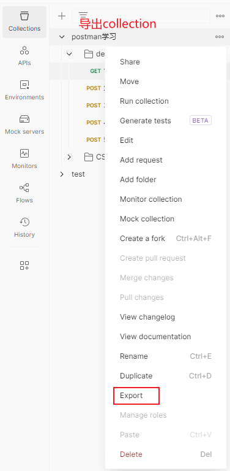

   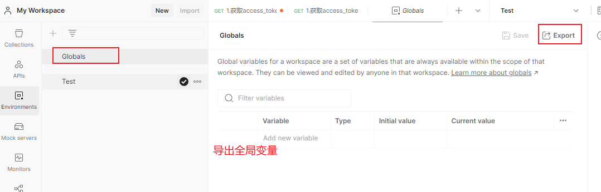

   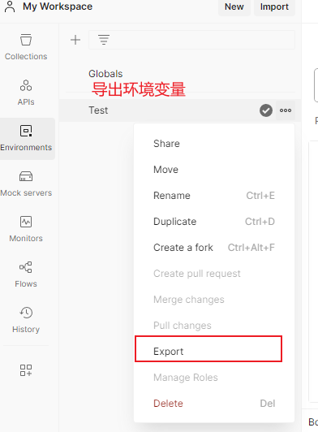

3. 进入上面导出文件所在目录,执行

   ```bash
   $ newman run 测试用例文件(collection).json \
   -e 环境变量文件.json \
   -g 全局变量文件.json \
   -r cli,html,json,junit --report-html-export 报告文件.html # 导出html报告的固定命令
   ```

4. 根据需要和jmeter的ant方式一样,将其集成到jenkins

## 4.11 Postman操作注意事项

1. 有小红点的一定要保存`ctrl+s`,**保存后关闭,然后重新打开**如果不报错如创建的环境environment变量不会生效,否则你会疑惑为什么设置的environment变量**既无法在请求中生效(无法获取),请求中设置的environment变量也无法查看**

   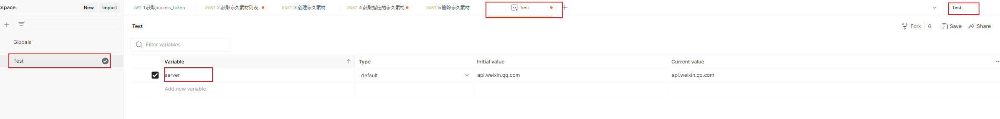

2. 跨请求设置environment变量**前提必须在右上角确认开启了对应的环境,否则不会生效的**`pm.environment.get("server")`

   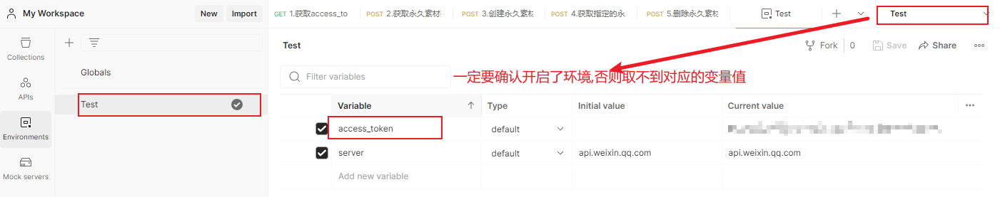

3. Postman文件上传**文件必须在postman工作目录中或开启允许外部文件**

   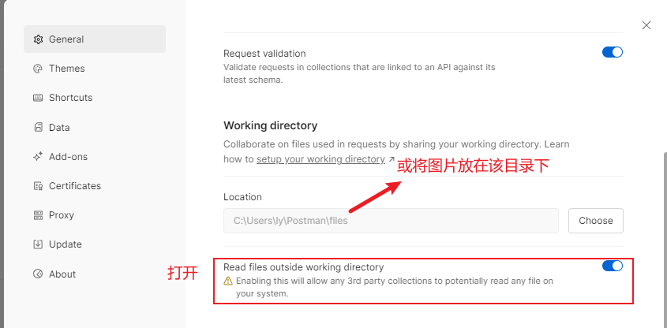

4. 

# 5. 自动化测试流程


**自动化测试是在手工测试之后进行的**，也就是回归测试阶段,这时候其实是已经具备完善的功能测试用例了。并且经过前期功能测试，系统版本也比较稳定，这就具备自动化测试的必要条件。

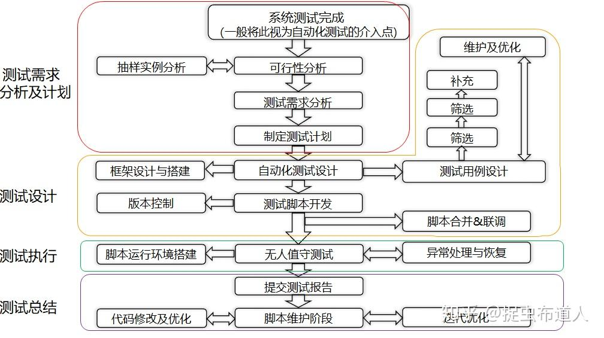

> 无人值守测试是指在长时间运行没有人为干预的情况下，自动化工具执行测试用例的过程。它通常应用于持续集成和持续交付流程中，旨在提高测试的自动化水平和效率。

# 6. unittest

https://cainiaojiaocheng.com/Python/docs/3.7/library/unittest#.E6.B5.8B.E8.AF.95.E5.8F.91.E7.8E.B0

## 6.1 unittest测试框架作用

1. 测试发现：从多个py文件中收集并且加载测试用例
2. 测试执行：将测试用例按照一定的顺序和条件去执行并生成结果
3. 测试判断：通过断言判断结果是否正确
4. 测试报告：统计测试进度， 通过率，生成测试报告。

## 6.2 unittest重要组件

1. TestCase 最小测试单元,及测试用例
2. TestSuite 测试套件,将测试用例集合在一起
3. TestFixture 测试夹具
   + `setUpModule/tearDownModule`每个模块开始前后
   + `setUpClass/tearDownClass`每个类开始前后
   + `setUp/tearDown`每个函数开始前后
4. TestLoader 测试加载器
5. TestRunner 测试运行器

## 6.3 unittest的命令

`python -m unittest --help`


## 6.4 unitest测试结果

+ `.` 成功
+ `F` 失败
+ `E` 错误
+ `S` 跳过

## 6.5 unitest测试顺序

类和用例的加载顺序: Ascii码顺序即**0-9 A-Z a-z (从test后开始)**

如: 

+ test0_a()
+ test1_a()


## 6.6 测试跳过

+ `@unitest.skip` 无条件跳过
+ `@unitest.skipif `条件为真跳过
+ `@unitest.unless` 条件为假跳过

## 6.7 断言

**在类下(在self中)**

| 方法                                                         | 检查                   | 新进 |
| ------------------------------------------------------------ | ---------------------- | ---- |
| [`assertEqual(a, b)`](https://cainiaojiaocheng.com/Python/docs/3.7/library/unittest#unittest.TestCase.assertEqual) | `a == b`               |      |
| [`assertNotEqual(a, b)`](https://cainiaojiaocheng.com/Python/docs/3.7/library/unittest#unittest.TestCase.assertNotEqual) | `a != b`               |      |
| [`assertTrue(x)`](https://cainiaojiaocheng.com/Python/docs/3.7/library/unittest#unittest.TestCase.assertTrue) | `bool(x) is True`      |      |
| [`assertFalse(x)`](https://cainiaojiaocheng.com/Python/docs/3.7/library/unittest#unittest.TestCase.assertFalse) | `bool(x) is False`     |      |
| [`assertIs(a, b)`](https://cainiaojiaocheng.com/Python/docs/3.7/library/unittest#unittest.TestCase.assertIs) | `a is b`               | 3.1  |
| [`assertIsNot(a, b)`](https://cainiaojiaocheng.com/Python/docs/3.7/library/unittest#unittest.TestCase.assertIsNot) | `a is not b`           | 3.1  |
| [`assertIsNone(x)`](https://cainiaojiaocheng.com/Python/docs/3.7/library/unittest#unittest.TestCase.assertIsNone) | `x is None`            | 3.1  |
| [`assertIsNotNone(x)`](https://cainiaojiaocheng.com/Python/docs/3.7/library/unittest#unittest.TestCase.assertIsNotNone) | `x is not None`        | 3.1  |
| [`assertIn(a, b)`](https://cainiaojiaocheng.com/Python/docs/3.7/library/unittest#unittest.TestCase.assertIn) | `a in b`               | 3.1  |
| [`assertNotIn(a, b)`](https://cainiaojiaocheng.com/Python/docs/3.7/library/unittest#unittest.TestCase.assertNotIn) | `a not in b`           | 3.1  |
| [`assertIsInstance(a, b)`](https://cainiaojiaocheng.com/Python/docs/3.7/library/unittest#unittest.TestCase.assertIsInstance) | `isinstance(a, b)`     | 3.2  |
| [`assertNotIsInstance(a, b)`](https://cainiaojiaocheng.com/Python/docs/3.7/library/unittest#unittest.TestCase.assertNotIsInstance) | `not isinstance(a, b)` | 3.2  |

***允许指定规则的异常,如果出现另一个异常则未错误`Exception`,如果未出现异常,则测试失败(`Failure`)***

| 方法                                                         | 检查                                                        | 新进 |
| ------------------------------------------------------------ | ----------------------------------------------------------- | ---- |
| [`assertRaises(exc, fun, *args, **kwds)`](https://cainiaojiaocheng.com/Python/docs/3.7/library/unittest#unittest.TestCase.assertRaises) | `fun(*args, **kwds)` 提升 *exc*                             |      |
| [`assertRaisesRegex(exc, r, fun, *args, **kwds)`](https://cainiaojiaocheng.com/Python/docs/3.7/library/unittest#unittest.TestCase.assertRaisesRegex) | `fun(*args, **kwds)` 引发 *exc* 并且消息匹配正则表达式 *r*  | 3.1  |
| [`assertWarns(warn, fun, *args, **kwds)`](https://cainiaojiaocheng.com/Python/docs/3.7/library/unittest#unittest.TestCase.assertWarns) | `fun(*args, **kwds)` 引发 *warn*                            | 3.2  |
| [`assertWarnsRegex(warn, r, fun, *args, **kwds)`](https://cainiaojiaocheng.com/Python/docs/3.7/library/unittest#unittest.TestCase.assertWarnsRegex) | `fun(*args, **kwds)` 引发 *warn* 并且消息匹配正则表达式 *r* | 3.2  |
| [`assertLogs(logger, level)`](https://cainiaojiaocheng.com/Python/docs/3.7/library/unittest#unittest.TestCase.assertLogs) | `with` 块以最低 *级别* 登录 *logger*                        | 3.4  |

> 所有断言方法都接受一个 *msg* 参数，如果指定，则用作失败时的错误消息（另见 [longMessage](https://cainiaojiaocheng.com/Python/docs/3.7/library/unittest#unittest.TestCase.longMessage)）。 注意 *msg* 关键字参数可以传递给 [assertRaises()](https://cainiaojiaocheng.com/Python/docs/3.7/library/unittest#unittest.TestCase.assertRaises), [assertRaisesRegex()](https://cainiaojiaocheng.com/Python/docs/3.7/library/unittest#unittest.TestCase.assertRaisesRegex), [assertWarns()](https://cainiaojiaocheng.com/Python/docs/3.7/library/unittest#unittest.TestCase.assertWarns), [assertWarns ()](https://cainiaojiaocheng.com/Python/docs/3.7/library/unittest#unittest.TestCase.assertWarnsRegex) 仅当它们用作上下文管理器时。

### 6.8.1 htmltestrunner

***一定要在单独的主文件(如main.py)中写运行启动***

```python
from HTMLTestRunner import HTMLTestRunner

suite = unittest.TestSuite()
# suite.addTest(unittest.makeSuite(测试类)) #一个一个测试类添加
testcases = unittest.defaultTestLoader.discover(os.getcwd()) # 推荐测试发现
suite.addTests(testcases)
file = open('test_report.html','w',encoding='utf8') #指定编码否则乱码
runner = HTMLTestRunner(stream=file,verbosity=2, title=u'测试标题',description=u'测试描述')
runner.run(suite)
file.close()
```

### 6.8.2 beautifulreport

***一定要在单独的主文件(如main.py)中写运行启动***

```python
from BeautifulReport import BeautifulReport as bs

suite = unittest.TestSuite()
#suite.addTest(unittest.makeSuite(Test))
testcases = unittest.defaultTestLoader.discover(os.getcwd())
suite.addTests(testcases)
bs(suite).run(description='测试报告描述')#默认report.html
```

